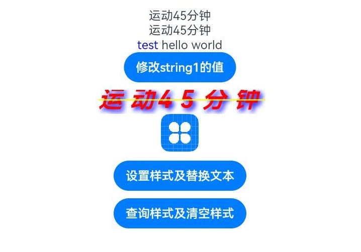

# 属性字符串

方便灵活应用文本样式的对象，可通过TextController中的[setStyledString](ts-basic-components-text.md#setstyledstring12)方法与Text组件绑定。

>  **说明：**
>
>  从API Version 12开始支持。后续版本如有新增内容，则采用上角标单独标记该内容的起始版本。

## 规则说明

* 当组件样式和属性字符串中的样式冲突时，冲突部分以属性字符串设置的样式为准，未冲突部分则生效组件的样式。
* 当属性字符串和[Text](ts-basic-components-text.md)子组件冲突时，属性字符串优先级高，即当Text组件中绑定了属性字符串，忽略Text组件下包含[Span](ts-basic-components-span.md)等子组件的情况。
* 不支持@State修饰。

## StyledString

StyledString(value: string , styles?: Array\<StyleOptions>)

从API version 12开始，该接口支持在ArkTS卡片中使用。

**参数：**

| 参数名 | 参数类型 | 必填 | 参数描述 |
| -------- | -------- | -------- | -------- |
| value | string | 是 | 属性字符串文本内容。|
| styles | Array<[StyleOptions](#styleoptions对象说明)> | 否 | 属性字符串初始化选项。<br/>**说明：** <br/>start为异常值时，按默认值0处理。<br/>当start的值合法且length为异常值时，length的值为属性字符串长度与start的值的差值。<br/>StyledStringKey与StyledStringValue不匹配时，不生效。<br/>styledKey参数无默认值。<br/>styledValue入参合法时，styledKey传入undefined时，此时样式不生效。 |

### getString

getString(): string

获取字符串信息。

**系统能力：** SystemCapability.ArkUI.ArkUI.Full

**返回值：**

| 类型              |说明       |
| ------- | --------------------------------- | 
| string | 属性字符串文本内容。 |

### length

readonly length: number

获取属性字符串字符的长度。

**系统能力：** SystemCapability.ArkUI.ArkUI.Full

**返回值：**

| 类型              |说明       |
| ------- | --------------------------------- | 
| number | 属性字符串字符的长度。 |

### equals

equals(other: StyledString): boolean

判断两个属性字符串是否相等。

**系统能力：** SystemCapability.ArkUI.ArkUI.Full

**参数：**

| 参数名  | 类型                              | 必填 | 说明                                                         |
| ------- | --------------------------------- | ---- | ------------------------------------------------------------ |
| other | [StyledString](#styledstring) | 是   | StyledString类型的比较对象。 |

**返回值：**

| 类型              |       说明       |
| ------- | --------------------------------- | 
| boolean | 两个属性字符串是否相等。<br/>**说明：** <br/>当属性字符串的文本及样式均一致，视为相等。 |

### subStyledString

获取属性字符串的子字符串。

subStyledString(start: number , length?: number): StyledString

**系统能力：** SystemCapability.ArkUI.ArkUI.Full

**参数：**

| 参数名  | 类型                              | 必填 | 说明                                                         |
| ------- | --------------------------------- | ---- | ------------------------------------------------------------ |
| start | number | 是   | 子属性字符串开始位置的下标。 |
| length | number | 否   | 子属性字符串的长度。 |

**返回值：**

| 类型              |       说明       |
| ------- | --------------------------------- | 
| [StyledString](#styledstring) | 子属性字符串。<br/>**说明：** <br/>当start为合法入参时，length的默认值是被查询属性字符串对象的长度与start的值的差。<br/>当start和length越界或者必填传入undefined时，会抛出异常。|

**错误码**：

以下错误码详细介绍请参考[通用错误码](../../errorcode-universal.md)。

| 错误码ID | 错误信息 |
| ------- | -------- |
| 401      | Parameter error. Possible causes: 1. Mandatory parameters are left unspecified; 2.Incorrect parameter types; 3. Parameter verification failed.   |


### getStyles

获取指定范围属性字符串的样式集合。

getStyles(start: number , length: number , styledKey?: StyledStringKey): Array\<SpanStyle>

**系统能力：** SystemCapability.ArkUI.ArkUI.Full

**参数：**

| 参数名  | 类型                              | 必填 | 说明                                                         |
| ------- | --------------------------------- | ---- | ------------------------------------------------------------ |
| start | number | 是   | 指定范围属性字符串的下标。 |
| length | number | 是   | 指定范围属性字符串的长度。 |
| styledKey | [StyledStringKey](ts-appendix-enums.md#styledstringkey12) | 否   | 指定范围属性字符串样式的枚举值。 |

**返回值：**

| 类型              |       说明       |
| ------- | --------------------------------- | 
| Array<[SpanStyle](#spanstyle对象说明)> | 各样式对象的数组。<br/>**说明：** <br/>当指定范围属性字符串未设置任何样式，则返回空数组。<br/>当start和length越界或者必填传入undefined时，会抛出异常；<br/>当styledKey传入异常值或undefined时，会抛出异常。 |

**错误码**：

以下错误码详细介绍请参考[通用错误码](../../errorcode-universal.md)。

| 错误码ID | 错误信息 |
| ------- | -------- |
| 401      | Parameter error. Possible causes: 1. Mandatory parameters are left unspecified; 2.Incorrect parameter types; 3. Parameter verification failed.   |

## MutableStyledString

继承于[StyledString](#styledstring)类。

>  **以下接口异常入参处理统一说明：**
>
> 当start和length越界或者必填传入undefined时，会抛出异常；
>
> 当styledKey和styledValue传入异常值或者两者对应关系不匹配时，会抛出异常。
> 

### replaceString

替换指定范围的字符串。

replaceString(start: number , length: number , other: string): void

**系统能力：** SystemCapability.ArkUI.ArkUI.Full

**参数：**

| 参数名  | 类型                              | 必填 | 说明                                                         |
| ------- | --------------------------------- | ---- | ------------------------------------------------------------ |
| start | number | 是   | 指定范围的下标。 |
| length | number | 是   | 指定范围的长度。 |
| other | string | 是   | 替换的新文本内容。<br/>**说明：** <br/>替换的字符串使用的是start位置字符的样式。 |

**错误码**：

以下错误码详细介绍请参考[通用错误码](../../errorcode-universal.md)。

| 错误码ID | 错误信息 |
| ------- | -------- |
| 401      | Parameter error. Possible causes: 1. Mandatory parameters are left unspecified; 2.Incorrect parameter types; 3. Parameter verification failed.   |


### insertString

插入字符串。

insertString(start: number , other: string): void

**系统能力：** SystemCapability.ArkUI.ArkUI.Full

**参数：**

| 参数名  | 类型                              | 必填 | 说明                                                         |
| ------- | --------------------------------- | ---- | ------------------------------------------------------------ |
| start | number | 是   | 插入位置的下标。 |
| other | string | 是   | 插入的新文本内容。<br/>**说明：** <br/>插入的字符串使用的是start-1位置字符的样式。若start-1位置字符未设置样式，则使用start位置字符样式。 |

**错误码**：

以下错误码详细介绍请参考[通用错误码](../../errorcode-universal.md)。

| 错误码ID | 错误信息 |
| ------- | -------- |
| 401      | Parameter error. Possible causes: 1. Mandatory parameters are left unspecified; 2.Incorrect parameter types; 3. Parameter verification failed.   |


### removeString

移除指定范围的字符串。

removeString(start: number , length: number): void

**系统能力：** SystemCapability.ArkUI.ArkUI.Full

**参数：**

| 参数名  | 类型                              | 必填 | 说明                                                         |
| ------- | --------------------------------- | ---- | ------------------------------------------------------------ |
| start | number | 是   | 指定范围的下标。 |
| length | number | 是   | 指定范围的长度。 |

**错误码**：

以下错误码详细介绍请参考[通用错误码](../../errorcode-universal.md)。

| 错误码ID | 错误信息 |
| ------- | -------- |
| 401      | Parameter error. Possible causes: 1. Mandatory parameters are left unspecified; 2.Incorrect parameter types; 3. Parameter verification failed.   |


### replaceStyle

替换指定范围内容为指定类型新样式。

replaceStyle(spanStyle: SpanStyle): void

**系统能力：** SystemCapability.ArkUI.ArkUI.Full

**参数：**

| 参数名  | 类型                              | 必填 | 说明                                                         |
| ------- | --------------------------------- | ---- | ------------------------------------------------------------ |
| spanStyle | [SpanStyle](#spanstyle对象说明) | 是   | 样式对象。<br/>**说明：** <br/>默认清空原有样式，替换为新样式。 |

**错误码**：

以下错误码详细介绍请参考[通用错误码](../../errorcode-universal.md)。

| 错误码ID | 错误信息 |
| ------- | -------- |
| 401      | Parameter error. Possible causes: 1. Mandatory parameters are left unspecified; 2.Incorrect parameter types; 3. Parameter verification failed.   |


### setStyle

为指定范围内容设置指定类型新样式。

setStyle(spanStyle: SpanStyle): void

**系统能力：** SystemCapability.ArkUI.ArkUI.Full

**参数：**

| 参数名  | 类型                              | 必填 | 说明                                                         |
| ------- | --------------------------------- | ---- | ------------------------------------------------------------ |
| spanStyle | [SpanStyle](#spanstyle对象说明) | 是   | 样式对象。<br/>**说明：** <br/>默认不清空原有样式，叠加新样式。若是已有样式，则更新。 |

### removeStyle

清除指定范围内容的指定类型样式。

被清空样式类型对象属性使用的是对应[Text](./ts-basic-components-text.md)组件属性的设置值，若Text组件未设置值，则使用对应Text组件属性的默认值。

removeStyle(start: number , length: number , styledKey: StyledStringKey): void

**系统能力：** SystemCapability.ArkUI.ArkUI.Full

**参数：**

| 参数名  | 类型                              | 必填 | 说明                                                         |
| ------- | --------------------------------- | ---- | ------------------------------------------------------------ |
| start | number | 是   | 指定范围开始位置的下标。 |
| length | number | 是   | 指定范围的长度。 |
| styledKey | [StyledStringKey](ts-appendix-enums.md#styledstringkey12) | 是   | 样式类型枚举值。 |

**错误码**：

以下错误码详细介绍请参考[通用错误码](../../errorcode-universal.md)。

| 错误码ID | 错误信息 |
| ------- | -------- |
| 401      | Parameter error. Possible causes: 1. Mandatory parameters are left unspecified; 2.Incorrect parameter types; 3. Parameter verification failed.   |


### removeStyles

清除指定范围内容的所有样式。

被清空样式类型对象属性使用的是对应[Text](./ts-basic-components-text.md)组件属性的设置值，若Text组件未设置值，则使用对应Text组件属性的默认值。

removeStyles(start: number , length: number): void

**系统能力：** SystemCapability.ArkUI.ArkUI.Full

**参数：**

| 参数名  | 类型                              | 必填 | 说明                                                         |
| ------- | --------------------------------- | ---- | ------------------------------------------------------------ |
| start | number | 是   | 指定范围开始位置的下标。 |
| length | number | 是   | 指定范围的长度。 |

**错误码**：

以下错误码详细介绍请参考[通用错误码](../../errorcode-universal.md)。

| 错误码ID | 错误信息 |
| ------- | -------- |
| 401      | Parameter error. Possible causes: 1. Mandatory parameters are left unspecified; 2.Incorrect parameter types; 3. Parameter verification failed.   |

### clearStyles

清除属性字符串对象的所有样式。

被清空样式类型对象属性使用的是对应[Text](./ts-basic-components-text.md)组件属性的设置值，若Text组件未设置值，则使用对应Text组件属性的默认值。

clearStyles(): void

**系统能力：** SystemCapability.ArkUI.ArkUI.Full

### replaceStyledString

替换指定范围为新的属性字符串。

replaceStyledString(start: number , length: number , other: StyledString): void

**系统能力：** SystemCapability.ArkUI.ArkUI.Full

**参数：**

| 参数名  | 类型                              | 必填 | 说明                                                         |
| ------- | --------------------------------- | ---- | ------------------------------------------------------------ |
| start | number | 是   | 指定范围开始位置的下标。 |
| length | number | 是   | 指定范围的长度。 |
| other | [StyledString](#styledstring) | 是   | 新的属性字符串对象。 |

**错误码**：

以下错误码详细介绍请参考[通用错误码](../../errorcode-universal.md)。

| 错误码ID | 错误信息 |
| ------- | -------- |
| 401      | Parameter error. Possible causes: 1. Mandatory parameters are left unspecified; 2.Incorrect parameter types; 3. Parameter verification failed.   |


### insertStyledString

在指定位置插入新的属性字符串。

insertStyledString(start: number , other: StyledString): void

**系统能力：** SystemCapability.ArkUI.ArkUI.Full

**参数：**

| 参数名  | 类型                              | 必填 | 说明                                                         |
| ------- | --------------------------------- | ---- | ------------------------------------------------------------ |
| start | number | 是   | 开始插入位置的下标。 |
| other | [StyledString](#styledstring) | 是   | 新的属性字符串对象。|

**错误码**：

以下错误码详细介绍请参考[通用错误码](../../errorcode-universal.md)。

| 错误码ID | 错误信息 |
| ------- | -------- |
| 401      | Parameter error. Possible causes: 1. Mandatory parameters are left unspecified; 2.Incorrect parameter types; 3. Parameter verification failed.   |


### appendStyledString

在末尾位置追加新的属性字符串。

appendStyledString(other: StyledString): void

**系统能力：** SystemCapability.ArkUI.ArkUI.Full

**参数：**

| 参数名  | 类型                              | 必填 | 说明                                                         |
| ------- | --------------------------------- | ---- | ------------------------------------------------------------ |
| other | [StyledString](#styledstring) | 是   | 新的属性字符串对象。|

## StyleOptions对象说明

属性字符串初始化样式选项。

| 参数名  | 类型                              | 必填 | 说明   |
| ------- | --------------------------------- | ---- | --------------------------------- |
| start | number | 否   | 设置属性字符串样式的开始位置。 |
| length | number | 否   | 设置属性字符串样式的长度。 |
| styledKey | [StyledStringKey](ts-appendix-enums.md#styledstringkey12) | 是   | 样式类型的枚举值。 |
| styledValue | [StyledStringValue](ts-types.md#styledstringvalue12) | 是   | 样式对象。 |

## SpanStyle对象说明

属性字符串样式对象说明。

| 参数名  | 类型                              | 必填 | 说明   |
| ------- | --------------------------------- | ---- | --------------------------------- |
| start | number | 是   | 匹配属性字符串样式的开始位置。 |
| length | number | 是   | 匹配属性字符串样式的长度。 |
| styledKey | [StyledStringKey](ts-appendix-enums.md#styledstringkey12) | 是   | 样式类型的枚举值。 |
| styledValue | [StyledStringValue](ts-types.md#styledstringvalue12) | 是   | 样式对象。 |

## TextStyle

文本字体样式对象说明。

TextStyle(value?: TextStyleInterface)

从API version 12开始，该接口支持在ArkTS卡片中使用。

**参数：**

| 参数名  | 类型                              | 必填 | 说明   |
| ------- | --------------------------------- | ---- | --------------------------------- |
| value | [TextStyleInterface](#textstyleinterface对象说明) | 否   | 字体样式设置项。 |

### fontColor

readonly fontColor?: ResourceColor

获取属性字符串的文本颜色。

**系统能力：** SystemCapability.ArkUI.ArkUI.Full

**返回值：**

| 类型              |说明       |
| ------- | --------------------------------- | 
| [ResourceColor](ts-types.md#resourcecolor) | 属性字符串的文本颜色。 |

## TextStyleInterface对象说明

| 参数名  | 类型                              | 必填 | 说明   |
| ------- | --------------------------------- | ---- | --------------------------------- |
| fontColor | [ResourceColor](ts-types.md#resourcecolor) | 否   | 字体颜色。 |

## 示例

### 示例1

属性字符串接口基本使用示例

```ts
// xxx.ets
@Entry
@Component
struct styled_string_demo1 {
  @State height1: number = 450;
  @State fontSize1: number = 16;
  @State fontWeight1: number = 400;
  @State color1: Color = Color.Blue;
  scroll: Scroller = new Scroller();
  fontStyleAttr1: TextStyle = new TextStyle({ fontColor: Color.Blue });
  fontStyleAttr2: StyledStringValue = new TextStyle({ fontColor: Color.Orange });
  // 创建可读写属性字符串的对象mutableStyledString1
  mutableStyledString1: MutableStyledString = new MutableStyledString("运动45分钟");
  // 创建构造入参有字符串和样式的对象mutableStyledString2
  mutableStyledString2: MutableStyledString = new MutableStyledString("test hello world", [{
    start: 0,
    length: 5,
    styledKey: StyledStringKey.FONT,
    styledValue: this.fontStyleAttr1
  }]);
  // 创建只读属性字符串对象styledString2
  styledString2: StyledString = new StyledString("运动45分钟");
  spanStyle1: SpanStyle = {
    start: 0,
    length: 5,
    styledKey: StyledStringKey.FONT,
    styledValue: new TextStyle({ fontColor: Color.Pink })
  };
  spanStyle2: SpanStyle = {
    start: 0,
    length: 2,
    styledKey: StyledStringKey.FONT,
    styledValue: new TextStyle({ fontColor: Color.Red })
  };
  @State string1: string = '';
  @State fontColor1: ResourceColor = Color.Red;
  controller1: TextController = new TextController();
  controller2: TextController = new TextController();
  controller3: TextController = new TextController();

  async onPageShow() {
    this.controller1.setStyledString(this.styledString2)
    this.controller2.setStyledString(this.mutableStyledString1)
    this.controller3.setStyledString(this.mutableStyledString2)
  }

  build() {
    Column() {
      Scroll(this.scroll) {
        Column() {
          // 显示属性字符串
          Text(undefined, { controller: this.controller1 })
          Text(undefined, { controller: this.controller2 }).key('mutableStyledString1')
          Text(undefined, { controller: this.controller3 }).key('mutableStyledString2')
          Button('修改string1的值')
            .onClick(() => {
              let result = this.mutableStyledString1.equals(this.styledString2);
              if (result) {
                this.string1 = this.mutableStyledString1.getString();
                console.info("mutableStyledString1 content:", this.mutableStyledString1.getString());
                console.info("mutableStyledString1 length:", this.mutableStyledString1.length);
              }
            })

          // 属性字符串与Span冲突时忽略Span,以及样式与Text组件属性未冲突部分生效Text设置的属性
          Text(undefined, { controller: this.controller2 }) {
            Span("span and styledString test")
              .fontColor(Color.Yellow)
              .decoration({ type: TextDecorationType.LineThrough })
            ImageSpan($r('app.media.icon'))
          }
          .key('styledString2')
          .fontColor(this.fontColor1)
          .letterSpacing(10)
          .fontSize(32)
          .fontWeight(600)
          .fontStyle(FontStyle.Italic)
          .lineHeight(30)
          .textShadow({ radius: 5, color: Color.Blue, offsetX: 5, offsetY: 5 })
          .textCase(TextCase.UpperCase)
          .decoration({ type: TextDecorationType.LineThrough, color: Color.Yellow })
          .baselineOffset(2)
          .copyOption(CopyOptions.InApp)
          .margin({ top: 10 })
          .draggable(true)

          // 以上冲突测试对照组
          Text() {
            Span(this.string1)
              .fontColor(this.color1)
              .decoration({ type: TextDecorationType.LineThrough })
            ImageSpan($r('app.media.icon'))
              .width(50).height(50)
          }
          .letterSpacing(10)
          .fontSize(32)
          .fontWeight(600)
          .fontStyle(FontStyle.Italic)
          .lineHeight(30)
          .textShadow({ radius: 5, color: Color.Blue, offsetX: 5, offsetY: 5 })
          .textCase(TextCase.UpperCase)
          .decoration({ type: TextDecorationType.LineThrough, color: Color.Yellow })
          .baselineOffset(2)

          Button('设置样式及替换文本')
            .onClick(() => {
              this.mutableStyledString1.replaceStyle({
                start: 2,
                length: 2,
                styledKey: StyledStringKey.FONT,
                styledValue: this.fontStyleAttr1
              })
              this.mutableStyledString1.insertString(0, "压力85偏高，")
              this.mutableStyledString1.setStyle({
                start: 2,
                length: 2,
                styledKey: StyledStringKey.FONT,
                styledValue: this.fontStyleAttr2
              })
              this.controller2.setStyledString(this.mutableStyledString1)
            })
            .margin({ top: 10 })

          Button('查询样式及清空样式')
            .onClick(() => {
              let styles = this.mutableStyledString1.getStyles(0, this.mutableStyledString1.length)
              if (styles.length == 2) {
                for (let i = 0; i < styles.length; i++) {
                  console.info('StyledString style object start:' + styles[i].start)
                  console.info('StyledString style object length:' + styles[i].length)
                  console.info('StyledString style object key:' + styles[i].styledKey)
                  if (styles[i].styledKey === 0) {
                    let fontAttr = styles[i].styledValue as TextStyle;
                    console.info('StyledString fontColor:' + fontAttr.fontColor)
                  }
                }
              }
              if (styles[0] !== undefined) {
                this.mutableStyledString2.setStyle(styles[0]);
                this.controller3.setStyledString(this.mutableStyledString2);
              }
              this.mutableStyledString1.removeStyles(2, 3);
              this.controller2.setStyledString(this.mutableStyledString1);
            })
            .margin({ top: 10 })
        }.width('100%')

      }
      .expandSafeArea([SafeAreaType.KEYBOARD])
      .scrollable(ScrollDirection.Vertical)
      .scrollBar(BarState.On)
      .scrollBarColor(Color.Gray)
      .scrollBarWidth(10)
      .edgeEffect(EdgeEffect.None)
    }
    .width('100%')
  }
}
```




