# 属性字符串
<!--Kit: ArkUI-->
<!--Subsystem: ArkUI-->
<!--Owner: @hddgzw-->
<!--Designer: @xiangyuan6-->
<!--Tester: @jiaoaozihao-->
<!--Adviser: @Brilliantry_Rui-->

属性字符串是一种将文本样式与文本内容关联管理的对象，样式通过start和length指定文本区间，多种样式可叠加应用于同一区间。属性字符串是一种用于创建富文本的对象，支持设置字体样式、装饰线、阴影、行高、段落样式等多种样式类型，还支持插入图片和自定义绘制内容。可通过[TextController](./ts-basic-components-text.md#textcontroller11)中的[setStyledString](./ts-basic-components-text.md#setstyledstring12)方法与Text组件绑定，也可通过[RichEditorStyledStringController](./ts-basic-components-richeditor.md#richeditorstyledstringcontroller12)中的[setStyledString](./ts-basic-components-richeditor.md#setstyledstring12)方法与[RichEditor](./ts-basic-components-richeditor.md)组件绑定。适用于富文本编辑、聊天消息显示、文档标注等需要灵活设置文本样式的场景，可动态修改样式内容，支持样式叠加和冲突处理。

>  **说明：**
>
> - 从API version 12开始支持。后续版本的新增接口，采用上角标单独标记接口的起始版本。
>
> - 本模块接口仅可在Stage模型下使用。
>
> - 从API version 20开始，支持通过[getParagraphs](./../arkts-apis-uicontext-measureutils.md#getparagraphs20)获取属性字符串的文本布局信息。
>
> - 属性字符串目前不支持在worker线程中使用。
>
> - 属性字符串通过controller绑定时，需要等待布局完成后，绑定生效。当[measure](../js-apis-arkui-frameNode.md#measure12)和setStyledString同时使用，开发者需要通过[@ohos.arkui.inspector (布局回调)](../js-apis-arkui-inspector.md)判断布局完成，再绑定属性字符串。

## 规则说明

* 当组件样式和属性字符串中的样式冲突时，冲突部分以属性字符串设置的样式为准，未冲突部分则生效组件的样式。
* 当属性字符串和[Text](./ts-basic-components-text.md)子组件冲突时，属性字符串优先级高，即当Text组件中绑定了属性字符串，忽略Text组件下包含[Span](./ts-basic-components-span.md)等子组件的情况。
* 不支持[@State](../../../ui/state-management/arkts-state.md)修饰。
* 建议将StyledString定义为成员变量，从而避免应用退后台后被销毁。
* 不支持在[loadContent()](../arkts-apis-window-Window.md#loadcontent9)之前创建。

## StyledString

### constructor

constructor(value: string | ImageAttachment | CustomSpan, styles?: Array\<StyleOptions>)

属性字符串的构造函数。

不支持在[loadContent()](../arkts-apis-window-Window.md#loadcontent9)之前创建。

**原子化服务API：** 从API version 12开始，该接口支持在原子化服务中使用。

**系统能力：** SystemCapability.ArkUI.ArkUI.Full

**参数：**

| 参数名 | 类型 | 必填 | 说明 |
| -------- | -------- | -------- | -------- |
| value | string \| [ImageAttachment](#imageattachment) \| [CustomSpan](#customspan) | 是 | 属性字符串文本内容。<br>**说明：** <br>当value的类型为ImageAttachment或CustomSpan时，styles参数不生效。<br>需要设置styles时，通过[setStyle](#setstyle)等方法实现。 |
| styles | Array\<[StyleOptions](#styleoptions对象说明)\> | 否 | 属性字符串初始化选项。<br>**说明：** <br>start为异常值时，按默认值0处理；<br>当length为异常值时，length等于属性字符串在start后的实际长度；<br>当StyledStringKey与StyledStringValue不匹配时，styles不生效。 |

### 属性

**系统能力：** SystemCapability.ArkUI.ArkUI.Full

| 名称  |   类型   |   只读   |   可选   |   说明   |
| ------ | ------ | ------ | ------ | -------------- |
| length | number |  是   | 否   | 属性字符串字符的长度。<br>**说明：** <br>属性字符串中的ImageAttachment和CustomSpan长度都计为1。 <br>**原子化服务API：** 从API version 12开始，该接口支持在原子化服务中使用。|

### getString

getString(): string

获取字符串信息。

**原子化服务API：** 从API version 12开始，该接口支持在原子化服务中使用。

**系统能力：** SystemCapability.ArkUI.ArkUI.Full

**返回值：**

| 类型              |说明       |
| ------- | --------------------------------- | 
| string | 属性字符串文本内容。<br>**说明：** <br>当属性字符串中包含图片或[CustomSpan](#customspan)时，其返回的结果用空格表示。 |

### equals

equals(other: StyledString): boolean

判断两个属性字符串是否相等。

**原子化服务API：** 从API version 12开始，该接口支持在原子化服务中使用。

**系统能力：** SystemCapability.ArkUI.ArkUI.Full

**参数：**

| 参数名  | 类型                              | 必填 | 说明                                                         |
| ------- | --------------------------------- | ---- | ------------------------------------------------------------ |
| other | [StyledString](#styledstring) | 是   | StyledString类型的比较对象。 |

**返回值：**

| 类型              |       说明       |
| ------- | --------------------------------- | 
| boolean | 两个属性字符串是否相等。<br>true表示相等，false表示不相等。<br>**说明：** <br>当属性字符串的文本及样式均一致，视为相等。<br>不比较[GestureStyle](#gesturestyle)，当属性字符串配置了不同事件，文本和其他样式相同时，亦视为相等。<br>当比较[CustomSpan](#customspan)或[LeadingMarginSpan](#leadingmarginspan22)时，比较的是地址，地址相等，视为相等。 |

### subStyledString

subStyledString(start: number, length?: number): StyledString

获取属性字符串的子属性字符串。不能超出属性字符串的长度。

**原子化服务API：** 从API version 12开始，该接口支持在原子化服务中使用。

**系统能力：** SystemCapability.ArkUI.ArkUI.Full

**参数：**

| 参数名  | 类型                              | 必填 | 说明                                                         |
| ------- | --------------------------------- | ---- | ------------------------------------------------------------ |
| start | number | 是   | 子属性字符串开始位置的下标。 |
| length | number | 否   | 子属性字符串的长度。<br>不传入时默认取被查询属性字符串对象的长度与start的值的差。 |

**返回值：**

| 类型              |       说明       |
| ------- | --------------------------------- | 
| [StyledString](#styledstring) | 子属性字符串。<br>**说明：** <br>当start为合法入参时，length的默认值是被查询属性字符串对象的长度与start的值的差。<br>当start和length越界或者必填传入undefined时，会抛出异常。|

**错误码**：

以下错误码详细介绍请参考[通用错误码](../../errorcode-universal.md)。

| 错误码ID | 错误信息 |
| ------- | -------- |
| 401      | Parameter error. Possible causes: 1. Mandatory parameters are left unspecified; 2.Incorrect parameters types; 3. Parameter verification failed.   |

### getStyles

getStyles(start: number, length: number, styledKey?: StyledStringKey): Array\<SpanStyle>

获取指定范围属性字符串的样式集合。不能超出属性字符串的长度。

该接口仅返回开发者设置的样式。

**原子化服务API：** 从API version 12开始，该接口支持在原子化服务中使用。

**系统能力：** SystemCapability.ArkUI.ArkUI.Full

**参数：**

| 参数名  | 类型                              | 必填 | 说明                                                         |
| ------- | --------------------------------- | ---- | ------------------------------------------------------------ |
| start | number | 是   | 指定范围属性字符串的下标。 |
| length | number | 是   | 指定范围属性字符串的长度。 |
| styledKey | [StyledStringKey](#styledstringkey枚举说明) | 否   | 指定范围属性字符串样式的枚举值。<br>**说明：** <br>当不传入该参数时默认获取开发者设置的[StyledStringKey](#styledstringkey枚举说明)所有枚举值样式。 |

**返回值：**

| 类型              |       说明       |
| ------- | --------------------------------- | 
| Array\<[SpanStyle](#spanstyle对象说明)\> | 各样式对象的数组。<br>**说明：** <br>当指定范围属性字符串未设置任何样式，则返回空数组。<br>当start和length越界或者必填传入undefined时，会抛出异常；<br>当styledKey传入异常值或undefined时，会抛出异常。<br>当styledKey为CustomSpan时，返回的是创建CustomSpan时传入的样式对象，即修改该样式对象也会影响实际的显示效果。 |

**错误码**：

以下错误码详细介绍请参考[通用错误码](../../errorcode-universal.md)。

| 错误码ID | 错误信息 |
| ------- | -------- |
| 401      | Parameter error. Possible causes: 1. Mandatory parameters are left unspecified; 2.Incorrect parameters types; 3. Parameter verification failed.   |

### fromHtml

static fromHtml(html: string): Promise\<StyledString>

将HTML格式字符串转换成属性字符串，HTML标签将映射为对应的属性字符串样式（如加粗类标签映射为TextStyle、装饰类标签映射为DecorationStyle）。当前支持转换的HTML标签范围：\<p>、\<span>、\、\<br>、\<strong>、\<b>、\<a>、\<i>、\<em>、\<s>、\<u>、\<del>、\<sup>、\<sub>、\<cite>、\<dfn>、\<small>、\<h1>、\<h2>、\<h3>、\<h4>、\<h5>、\<h6>、\<ol>、\<ul>、\<li>。支持将标签中的style属性样式转换成对应的属性字符串样式。

使用方法参考[示例12（fromHtml和toHtml互相转换）](#示例12fromhtml和tohtml互相转换)和[示例18（fromHtml转换）](#示例18fromhtml转换)。

| 标签名称 | 说明                   |
| ------------- | ---------------------------- |
| \<p\>       | 段落，分隔文本段落。       |
| \<span\>    | 行内文本，支持样式设置。API version 17及之前，\<span\>设置的background-color属性转换不生效。     |
| \     | 插入图片。                   |
| \<strong\>  | 加粗文本。                   |
| &lt;br&gt;<sup>20+</sup>      | 换行。                       |
| \<b\><sup>20+</sup>       | 加粗文本。                   |
| \<a\><sup>20+</sup>       | 超链接。                     |
| \<i\><sup>20+</sup>       | 斜体文本。                   |
| \<em\><sup>20+</sup>      | 斜体文本。                   |
| \<s\><sup>20+</sup>       | 删除线（中划线）。            |
| \<u\><sup>20+</sup>       | 下划线。                     |
| \<del\><sup>20+</sup>     | 删除线（中划线）。            |
| \<sup\><sup>20+</sup>     | 上标文本。                   |
| \<sub\><sup>20+</sup>     | 下标文本。                   |
| \<cite\>    | 斜体文本。<br>**起始版本：** 26.0.0        |
| \<dfn\>     | 斜体文本。<br>**起始版本：** 26.0.0        |
| \<small\>   | 缩小字号标签。字号缩放为父容器字号属性的0.8倍，支持嵌套叠加。<br>**起始版本：** 26.0.0        |
| \<h1\>      | 一级标题。<br>**起始版本：** 26.0.0        |
| \<h2\>      | 二级标题。<br>**起始版本：** 26.0.0        |
| \<h3\>      | 三级标题。<br>**起始版本：** 26.0.0        |
| \<h4\>      | 四级标题。<br>**起始版本：** 26.0.0        |
| \<h5\>      | 五级标题。<br>**起始版本：** 26.0.0        |
| \<h6\>      | 六级标题。<br>**起始版本：** 26.0.0        |
| \<ol\>      | 有序列表。<br>**起始版本：** 26.0.0        |
| \<ul\>      | 无序列表。<br>**起始版本：** 26.0.0        |
| \<li\>      | 列表项。<br>**起始版本：** 26.0.0          |

**原子化服务API：** 从API version 12开始，该接口支持在原子化服务中使用。

**系统能力：** SystemCapability.ArkUI.ArkUI.Full

**参数：**

| 参数名  | 类型                              | 必填 | 说明                                                         |
| ------- | --------------------------------- | ---- | ------------------------------------------------------------ |
| html | string | 是   | html格式的字符串。 |

**返回值：**

| 类型              |       说明       |
| ------- | --------------------------------- |
| Promise\<[StyledString](#styledstring)> | 属性字符串。resolve返回转换后的属性字符串；reject抛出异常。 |

**错误码**：

以下错误码详细介绍请参考[通用错误码](../../errorcode-universal.md)和[属性字符串错误码](../errorcode-styled-string.md)。

| 错误码ID | 错误信息 |
| ------- | -------- |
| 401      | Parameter error. Possible causes: 1. Mandatory parameters are left unspecified; 2.Incorrect parameters types; 3. Parameter verification failed.   |
| 170001 | Convert Error. |

### toHtml<sup>14+</sup>

static toHtml(styledString: StyledString): string

将属性字符串转换成HTML格式字符串，属性字符串样式将映射为对应的HTML标签（如TextStyle映射为含style属性的span标签、ImageAttachment映射为img标签）。支持转换的属性字符串[StyledStringKey](#styledstringkey枚举说明)包括：StyledStringKey.FONT、StyledStringKey.DECORATION、StyledStringKey.LETTER_SPACING、StyledStringKey.TEXT_SHADOW、StyledStringKey.LINE_HEIGHT、StyledStringKey.IMAGE。

使用方法参考[示例12（fromHtml和toHtml互相转换）](#示例12fromhtml和tohtml互相转换)。

**原子化服务API：** 从API version 14开始，该接口支持在原子化服务中使用。

**系统能力：** SystemCapability.ArkUI.ArkUI.Full

**参数：**

| 参数名  | 类型                              | 必填 | 说明                                                         |
| ------- | --------------------------------- | ---- | ------------------------------------------------------------ |
| styledString | [StyledString](#styledstring) | 是   | 要转换成HTML格式字符串的属性字符串对象。 |

**返回值：**

| 类型              |       说明       |
| ------- | --------------------------------- |
| string | HTML格式字符串。 |

**错误码**：

以下错误码详细介绍请参考[通用错误码](../../errorcode-universal.md)。

| 错误码ID | 错误信息 |
| ------- | -------- |
| 401      | Parameter error. Possible causes: 1. Mandatory parameters are left unspecified; 2.Incorrect parameters types; 3. Parameter verification failed.   |

## MutableStyledString

继承于[StyledString](#styledstring)类。

>  **以下接口异常入参处理统一说明：**
>
> 当start和length越界或者必填传入undefined时，会抛出异常；
>
> 当styledKey和styledValue传入异常值或者两者对应关系不匹配时，会抛出异常。
> 

### replaceString

replaceString(start: number , length: number , other: string): void

替换指定范围的字符串。

**原子化服务API：** 从API version 12开始，该接口支持在原子化服务中使用。

**系统能力：** SystemCapability.ArkUI.ArkUI.Full

**参数：**

| 参数名  | 类型                              | 必填 | 说明                                                         |
| ------- | --------------------------------- | ---- | ------------------------------------------------------------ |
| start | number | 是   | 指定范围的下标。 |
| length | number | 是   | 指定范围的长度。 |
| other | string | 是   | 替换的新文本内容。<br>**说明：** <br>替换的字符串使用的是start位置字符的样式。 |

**错误码**：

以下错误码详细介绍请参考[通用错误码](../../errorcode-universal.md)。

| 错误码ID | 错误信息 |
| ------- | -------- |
| 401      | Parameter error. Possible causes: 1. Mandatory parameters are left unspecified; 2.Incorrect parameters types; 3. Parameter verification failed.   |

### insertString

insertString(start: number , other: string): void

插入字符串。

**原子化服务API：** 从API version 12开始，该接口支持在原子化服务中使用。

**系统能力：** SystemCapability.ArkUI.ArkUI.Full

**参数：**

| 参数名  | 类型                              | 必填 | 说明                                                         |
| ------- | --------------------------------- | ---- | ------------------------------------------------------------ |
| start | number | 是   | 插入位置的下标。 |
| other | string | 是   | 插入的新文本内容。<br>**说明：** <br>插入的字符串使用的是start-1位置字符的样式。若start-1位置字符未设置样式，则使用start位置字符样式。 |

**错误码**：

以下错误码详细介绍请参考[通用错误码](../../errorcode-universal.md)。

| 错误码ID | 错误信息 |
| ------- | -------- |
| 401      | Parameter error. Possible causes: 1. Mandatory parameters are left unspecified; 2.Incorrect parameters types; 3. Parameter verification failed.   |

### removeString

removeString(start: number , length: number): void

移除指定范围的字符串。

当属性字符串中包含图片或[CustomSpan](#customspan)时，同样生效。

**原子化服务API：** 从API version 12开始，该接口支持在原子化服务中使用。

**系统能力：** SystemCapability.ArkUI.ArkUI.Full

**参数：**

| 参数名  | 类型                              | 必填 | 说明                                                         |
| ------- | --------------------------------- | ---- | ------------------------------------------------------------ |
| start | number | 是   | 指定范围的下标。 |
| length | number | 是   | 指定范围的长度。 |

**错误码**：

以下错误码详细介绍请参考[通用错误码](../../errorcode-universal.md)。

| 错误码ID | 错误信息 |
| ------- | -------- |
| 401      | Parameter error. Possible causes: 1. Mandatory parameters are left unspecified; 2.Incorrect parameters types; 3. Parameter verification failed.   |

### replaceStyle

replaceStyle(spanStyle: SpanStyle): void

替换指定范围内容为指定类型新样式。

**原子化服务API：** 从API version 12开始，该接口支持在原子化服务中使用。

**系统能力：** SystemCapability.ArkUI.ArkUI.Full

**参数：**

| 参数名  | 类型                              | 必填 | 说明                                                         |
| ------- | --------------------------------- | ---- | ------------------------------------------------------------ |
| spanStyle | [SpanStyle](#spanstyle对象说明) | 是   | 样式对象。<br>**说明：** <br>默认清空原有样式，替换为新样式。<br>当SpanStyle的styledKey为IMAGE或CUSTOM_SPAN时，只有当start的位置当前是image或CustomSpan且长度为1，才会生效，其余情况无效果。 |

**错误码**：

以下错误码详细介绍请参考[通用错误码](../../errorcode-universal.md)。

| 错误码ID | 错误信息 |
| ------- | -------- |
| 401      | Parameter error. Possible causes: 1. Mandatory parameters are left unspecified; 2.Incorrect parameters types; 3. Parameter verification failed.   |

### setStyle

setStyle(spanStyle: SpanStyle): void

为指定范围内容设置指定类型新样式。

**原子化服务API：** 从API version 12开始，该接口支持在原子化服务中使用。

**系统能力：** SystemCapability.ArkUI.ArkUI.Full

**参数：**

| 参数名  | 类型                              | 必填 | 说明                                                         |
| ------- | --------------------------------- | ---- | ------------------------------------------------------------ |
| spanStyle | [SpanStyle](#spanstyle对象说明) | 是   | 样式对象。<br>默认不清空原有样式，叠加新样式。如果StyledStringValue类型相同，则新样式将覆盖旧样式。<br>当SpanStyle的styledKey为IMAGE或CUSTOM_SPAN时，只有当start的位置当前是image或CustomSpan且长度为1，才会生效，其余情况无效果。 |

> **说明：**
>
> 样式的最小颗粒度是StyledStringValue，如果设置了多个相同的StyledStringValue，只有最后一次设置会生效。如设置两个属性不同的TextStyle，则只有第二次设置的TextStyle生效。

**错误码**：

以下错误码详细介绍请参考[通用错误码](../../errorcode-universal.md)。

| 错误码ID | 错误信息 |
| ------- | -------- |
| 401      | The parameter check failed.   |

### removeStyle

removeStyle(start: number , length: number , styledKey: StyledStringKey): void

清除指定范围内容的指定类型样式。

被清空样式类型对象属性使用的是对应[Text](./ts-basic-components-text.md)组件属性的设置值，若Text组件未设置值，则使用对应Text组件属性的默认值。

当属性字符串中包含图片时，同样生效。

**原子化服务API：** 从API version 12开始，该接口支持在原子化服务中使用。

**系统能力：** SystemCapability.ArkUI.ArkUI.Full

**参数：**

| 参数名  | 类型                              | 必填 | 说明                                                         |
| ------- | --------------------------------- | ---- | ------------------------------------------------------------ |
| start | number | 是   | 指定范围开始位置的下标。 |
| length | number | 是   | 指定范围的长度。 |
| styledKey | [StyledStringKey](#styledstringkey枚举说明) | 是   | 样式类型枚举值。 |

**错误码**：

以下错误码详细介绍请参考[通用错误码](../../errorcode-universal.md)。

| 错误码ID | 错误信息 |
| ------- | -------- |
| 401      | Parameter error. Possible causes: 1. Mandatory parameters are left unspecified; 2.Incorrect parameters types; 3. Parameter verification failed.   |

### removeStyles

removeStyles(start: number , length: number): void

清除指定范围内容的所有样式。

被清空样式类型对象属性使用的是对应[Text](./ts-basic-components-text.md)组件属性的设置值，若Text组件未设置值，则使用对应Text组件属性的默认值。

当属性字符串中包含图片时，同样生效。

**原子化服务API：** 从API version 12开始，该接口支持在原子化服务中使用。

**系统能力：** SystemCapability.ArkUI.ArkUI.Full

**参数：**

| 参数名  | 类型                              | 必填 | 说明                                                         |
| ------- | --------------------------------- | ---- | ------------------------------------------------------------ |
| start | number | 是   | 指定范围开始位置的下标。 |
| length | number | 是   | 指定范围的长度。 |

**错误码**：

以下错误码详细介绍请参考[通用错误码](../../errorcode-universal.md)。

| 错误码ID | 错误信息 |
| ------- | -------- |
| 401      | Parameter error. Possible causes: 1. Mandatory parameters are left unspecified; 2.Incorrect parameters types; 3. Parameter verification failed.   |

### clearStyles

clearStyles(): void

清除属性字符串对象的所有样式。

被清空样式类型对象属性使用的是对应[Text](./ts-basic-components-text.md)组件属性的设置值，若Text组件未设置值，则使用对应Text组件属性的默认值。

**原子化服务API：** 从API version 12开始，该接口支持在原子化服务中使用。

**系统能力：** SystemCapability.ArkUI.ArkUI.Full

### replaceStyledString

replaceStyledString(start: number , length: number , other: StyledString): void

替换指定范围为新的属性字符串。

**原子化服务API：** 从API version 12开始，该接口支持在原子化服务中使用。

**系统能力：** SystemCapability.ArkUI.ArkUI.Full

**参数：**

| 参数名  | 类型                              | 必填 | 说明                                                         |
| ------- | --------------------------------- | ---- | ------------------------------------------------------------ |
| start | number | 是   | 指定范围开始位置的下标。 |
| length | number | 是   | 指定范围的长度。 |
| other | [StyledString](#styledstring) | 是   | 新的属性字符串对象。 |

**错误码**：

以下错误码详细介绍请参考[通用错误码](../../errorcode-universal.md)。

| 错误码ID | 错误信息 |
| ------- | -------- |
| 401      | Parameter error. Possible causes: 1. Mandatory parameters are left unspecified; 2.Incorrect parameters types; 3. Parameter verification failed.   |

### insertStyledString

insertStyledString(start: number , other: StyledString): void

在指定位置插入新的属性字符串。

**原子化服务API：** 从API version 12开始，该接口支持在原子化服务中使用。

**系统能力：** SystemCapability.ArkUI.ArkUI.Full

**参数：**

| 参数名  | 类型                              | 必填 | 说明                                                         |
| ------- | --------------------------------- | ---- | ------------------------------------------------------------ |
| start | number | 是   | 开始插入位置的下标。 |
| other | [StyledString](#styledstring) | 是   | 新的属性字符串对象。|

**错误码**：

以下错误码详细介绍请参考[通用错误码](../../errorcode-universal.md)。

| 错误码ID | 错误信息 |
| ------- | -------- |
| 401      | Parameter error. Possible causes: 1. Mandatory parameters are left unspecified; 2.Incorrect parameters types; 3. Parameter verification failed.   |

### appendStyledString

appendStyledString(other: StyledString): void

在末尾位置追加新的属性字符串。

**原子化服务API：** 从API version 12开始，该接口支持在原子化服务中使用。

**系统能力：** SystemCapability.ArkUI.ArkUI.Full

**参数：**

| 参数名  | 类型                              | 必填 | 说明                                                         |
| ------- | --------------------------------- | ---- | ------------------------------------------------------------ |
| other | [StyledString](#styledstring) | 是   | 新的属性字符串对象。|

## StyledStringValue

type StyledStringValue = TextStyle | DecorationStyle | BaselineOffsetStyle | LetterSpacingStyle |
TextShadowStyle | GestureStyle | ImageAttachment | ParagraphStyle | LineHeightStyle | UrlStyle | CustomSpan | UserDataSpan | BackgroundColorStyle | LineSpacingStyle

样式对象类型，用于设置属性字符串的样式。

**原子化服务API：** 从API version 12开始，该接口支持在原子化服务中使用。

**模型约束：** 此接口仅可在Stage模型下使用。

**系统能力：** SystemCapability.ArkUI.ArkUI.Full

| 类型  | 说明   |
| ------ | ---------- |
| [TextStyle](#textstyle) | 文本字体样式。 |
| [DecorationStyle](#decorationstyle) | 文本装饰线样式。 |
| [BaselineOffsetStyle](#baselineoffsetstyle) | 文本基线偏移量样式。 |
| [LetterSpacingStyle](#letterspacingstyle) | 文本字符间距样式。 |
| [LineHeightStyle](#lineheightstyle) | 文本行高样式。 |
| [TextShadowStyle](#textshadowstyle) | 文本阴影样式。 |
| [GestureStyle](#gesturestyle) | 事件手势样式。 |
| [ParagraphStyle](#paragraphstyle) | 文本段落样式。 |
| [ImageAttachment](#imageattachment) | 图片样式。 |
| [CustomSpan](#customspan) | 自定义绘制Span样式。 |
| [UserDataSpan](#userdataspan) | UserDataSpan样式。 |
| [UrlStyle](#urlstyle14) | 超链接样式。 |
| [BackgroundColorStyle](#backgroundcolorstyle14) | 文本背景颜色样式。 |
| [LineSpacingStyle](#linespacingstyle) | 文本行间距样式。**起始版本：** 26.0.0 |

## StyleOptions对象说明

**原子化服务API：** 从API version 12开始，该接口支持在原子化服务中使用。

**系统能力：** SystemCapability.ArkUI.ArkUI.Full

| 名称  | 类型                              | 只读 | 可选 | 说明   |
| ------- | --------------------------------- | ---- | ---- |--------------------------------- |
| start | number | 否   | 是 | 设置属性字符串样式的开始位置。<br>当start的值小于0或超出字符串长度时，按0处理。 |
| length | number | 否   | 是 | 设置属性字符串样式的长度。<br>当length的值小于0或超出字符串长度与start的差值时，按字符串长度与start的差值处理。 |
| styledKey | [StyledStringKey](#styledstringkey枚举说明) | 否   | 否 | 样式类型的枚举值。 |
| styledValue | [StyledStringValue](#styledstringvalue) | 否   | 否   | 用于设置属性字符串样式的样式对象。 |

## SpanStyle对象说明

**原子化服务API：** 从API version 12开始，该接口支持在原子化服务中使用。

**系统能力：** SystemCapability.ArkUI.ArkUI.Full

| 名称  | 类型                              | 只读 | 可选 | 说明   |
| ------- | --------------------------------- | ---- | ---- |--------------------------------- |
| start | number | 否   | 否   | 匹配属性字符串样式的开始位置。 |
| length | number | 否   | 否   | 匹配属性字符串样式的长度。 |
| styledKey | [StyledStringKey](#styledstringkey枚举说明) | 否   | 否   | 样式类型的枚举值。 |
| styledValue | [StyledStringValue](#styledstringvalue) | 否   | 否   | 用于匹配属性字符串样式的样式对象。 |

## TextStyle

文本字体样式对象说明。

**系统能力：** SystemCapability.ArkUI.ArkUI.Full

### 属性

**系统能力：** SystemCapability.ArkUI.ArkUI.Full

<!--Table: 20%; 20%; 10%; 10%; 40%-->
| 名称        | 类型                                     | 只读 | 可选 | 说明                                                                                                                              |
| ----------- | ---------------------------------------- | ---- | ---- | --------------------------------------------------------------------------------------------------------------------------------- |
| fontColor   | [ResourceColor](ts-types.md#resourcecolor)  | 是   | 是   | 获取属性字符串的文本颜色。<br>**原子化服务API：** 从API version 12开始，该接口支持在原子化服务中使用。                                               |
| fontFamily  | string                                   | 是   | 是   | 获取属性字符串的文本字体。<br>默认返回undefined。<br>**原子化服务API：** 从API version 12开始，该接口支持在原子化服务中使用。                       |
| fontSize    | number                                   | 是   | 是   | 获取属性字符串的文本字体大小。<br>单位：[vp](ts-pixel-units.md#基本像素单位)<br>**原子化服务API：** 从API version 12开始，该接口支持在原子化服务中使用。 |
| fontWeight  | number                                   | 是   | 是   | 获取属性字符串的文本字体粗细。<br>默认值：400<br>**说明：** <br>返回值为string类型，具体返回值和设置值关系参见下方表格。<br>**原子化服务API：** 从API version 12开始，该接口支持在原子化服务中使用。                                           |
| fontStyle   | [FontStyle](ts-appendix-enums.md#fontstyle) | 是   | 是   | 获取属性字符串的文本字体样式。<br>**原子化服务API：** 从API version 12开始，该接口支持在原子化服务中使用。                                           |
| fontConfigs<sup>24+</sup> | [FontConfigs](ts-text-common.md#fontconfigs24对象说明) | 是   | 是   | 获取属性字符串的字体配置。<br>默认返回undefined，表示未设置fontConfigs。<br>**原子化服务API：** 从API version 24开始，该接口支持在原子化服务中使用。<br>**模型约束：** 此接口仅可在Stage模型下使用。                                           |
| strokeWidth<sup>20+</sup> | number                                   | 是   | 是   | 获取属性字符串的文本描边宽度。<br>默认返回0，单位为[vp](ts-pixel-units.md#基本像素单位)。<br>**原子化服务API：** 从API version 20开始，该接口支持在原子化服务中使用。                                           |
| strokeColor<sup>20+</sup> | [ResourceColor](ts-types.md#resourcecolor)  | 是   | 是   | 获取属性字符串的文本描边颜色。<br>默认返回字体颜色。<br>**原子化服务API：** 从API version 20开始，该接口支持在原子化服务中使用。                                           |
| superscript<sup>20+</sup> | [SuperscriptStyle](ts-text-common.md#superscriptstyle20枚举说明)  | 是   | 是   | 获取属性字符串的文本上下角标。<br>默认值：SuperscriptStyle.NORMAL。<br>**原子化服务API：** 从API version 20开始，该接口支持在原子化服务中使用。                                           |
| fontVariations | Array&lt;[FontVariation](../../apis-arkgraphics2d/js-apis-graphics-text.md#fontvariation)&gt; | 是 | 是 | 获取可变字体的属性数组。<br>默认值：undefined，表示未设置可变字体的属性。<br>**起始版本：** 26.0.0 <br>**模型约束：** 此接口仅可在Stage模型下使用。<br>**原子化服务API：** 从API版本26.0.0开始，该接口支持在原子化服务中使用。 |
| strokeJoinStyle | [StrokeJoinStyle](ts-text-common.md#strokejoinstyle) | 是 | 是 | 获取属性字符串的文本描边拐角样式。具体枚举值及其说明请参考StrokeJoinStyle。<br>默认值：StrokeJoinStyle.MITER_JOIN，表示尖角连接，拐角处为尖锐拐角。<br>**起始版本：** 26.0.0<br>**模型约束：** 此接口仅可在Stage模型下使用。<br>**原子化服务API：** 从API版本26.0.0开始，该接口支持在原子化服务中使用。 |


`fontWeight`参数与返回值的关系如下：
| 参数        | 返回值 |
| ----------- | ----------- |  
| 100 |  '0' | 
| 200  |  '1'  |  
| 300 |  '2'  |  
| 400  |  '3'  |  
| 500    |  '4'  | 
| 600  |  '5'  | 
| 700  |  '6'  |  
| 800    |  '7'  | 
| 900  |  '8'  | 
| FontWeight.Bold或'bold' |  '9'  | 
| FontWeight.Normal或'normal' |  '10' |  
| FontWeight.Bolder或'bolder' |  '11'  |  
| FontWeight.Lighter或'lighter' |  '12'  |  
| FontWeight.Medium或'medium' |  '13'  | 
| FontWeight.Regular或'regular' |  '14'  |  

### constructor

constructor(value?: TextStyleInterface)

文本字体样式的构造函数。

**原子化服务API：** 从API version 12开始，该接口支持在原子化服务中使用。

**系统能力：** SystemCapability.ArkUI.ArkUI.Full

**参数：**

| 参数名  | 类型                              | 必填 | 说明   |
| ------- | --------------------------------- | ---- | --------------------------------- |
| value | [TextStyleInterface](#textstyleinterface对象说明) | 否   | 字体样式设置项。<br>默认值：不传入时继承TextStyleInterface各属性的默认值。 |

## TextStyleInterface对象说明

**系统能力：** SystemCapability.ArkUI.ArkUI.Full

| 名称        | 类型     | 只读 | 可选 | 说明      |
| ----------- | ----------------------------------- | ---- | ---- |---------------------------- |
| fontColor   | [ResourceColor](ts-types.md#resourcecolor)                       | 否   | 是 | 字体颜色。<br>默认为主题色。<br>**原子化服务API：** 从API version 12开始，该接口支持在原子化服务中使用。 |
| fontFamily  | [ResourceStr](ts-types.md#resourcestr)                           | 否   | 是 | 文本字体。<br>默认为主题字体。<br>**原子化服务API：** 从API version 12开始，该接口支持在原子化服务中使用。 |
| fontSize    | [LengthMetrics](../js-apis-arkui-graphics.md#lengthmetrics12)    | 否   | 是 | 字体大小。<br>默认字体大小为16fp。<br>如果LengthMetrics的unit值是PERCENT，当前设置不生效，处理为16fp。<br>单位：[fp](ts-pixel-units.md#基本像素单位) <br>**原子化服务API：** 从API version 12开始，该接口支持在原子化服务中使用。 |
| fontWeight  | number\| [FontWeight](ts-appendix-enums.md#fontweight) \| string | 否   | 是 | 字体粗细。<br>number类型取值[100,&nbsp;900]，取值间隔为100，默认为400，取值越大，字体越粗。string类型仅支持number类型取值的字符串形式，例如"400"，以及"bold"、"bolder"、"lighter"、"regular"、"medium"，分别对应FontWeight中相应的枚举值。设置过大可能会在不同字体下有截断。传入超出取值范围或不符合间隔要求的值时取默认值。<br>默认值：FontWeight.Normal<br>**原子化服务API：** 从API version 12开始，该接口支持在原子化服务中使用。 |
| fontStyle   | [FontStyle](ts-appendix-enums.md#fontstyle)                      | 否   | 是 | 字体样式。<br>默认值：FontStyle.Normal<br>**原子化服务API：** 从API version 12开始，该接口支持在原子化服务中使用。 |
| fontConfigs<sup>24+</sup> | [FontConfigs](ts-text-common.md#fontconfigs24对象说明)                      | 否   | 是 | 字体配置。默认值继承[FontConfigs](ts-text-common.md#fontconfigs24对象说明)。<br>**原子化服务API：** 从API version 24开始，该接口支持在原子化服务中使用。<br>**模型约束：** 此接口仅可在Stage模型下使用。 |
| strokeWidth<sup>20+</sup> | [LengthMetrics](../js-apis-arkui-graphics.md#lengthmetrics12)    | 否   | 是 | 文本描边宽度。如果LengthMetrics的unit值是PERCENT，当前设置不生效，处理为0。<br>设置值小于0时为实心字，大于0时为空心字。<br>默认值为0。<br>**原子化服务API：** 从API version 20开始，该接口支持在原子化服务中使用。 |
| strokeColor<sup>20+</sup> | [ResourceColor](ts-types.md#resourcecolor)                       | 否   | 是 | 文本描边颜色。<br>默认值为字体颜色，设置异常值时取字体颜色。<br>**原子化服务API：** 从API version 20开始，该接口支持在原子化服务中使用。 |
| superscript<sup>20+</sup> | [SuperscriptStyle](ts-text-common.md#superscriptstyle20枚举说明)     | 否   | 是 | 文本上下角标。<br>默认值：SuperscriptStyle.NORMAL<br>**原子化服务API：** 从API version 20开始，该接口支持在原子化服务中使用。 |
| fontVariations | Array&lt;[FontVariation](../../apis-arkgraphics2d/js-apis-graphics-text.md#fontvariation)&gt; | 否 | 是 | 可变字体的属性。<br>默认值：undefined，表示未设置可变字体的属性。<br>fontVariations属性的优先级高于fontWeight。<br>**起始版本：** 26.0.0 <br>**模型约束：** 此接口仅可在Stage模型下使用。<br>**原子化服务API：** 从API版本26.0.0开始，该接口支持在原子化服务中使用。 |
| strokeJoinStyle | [StrokeJoinStyle](ts-text-common.md#strokejoinstyle) | 否 | 是 | 文本描边拐角样式。具体枚举值及其说明请参考StrokeJoinStyle。<br>默认值：StrokeJoinStyle.MITER_JOIN，表示尖角连接，拐角处为尖锐拐角。<br>**起始版本：** 26.0.0<br>**模型约束：** 此接口仅可在Stage模型下使用。<br>**原子化服务API：** 从API版本26.0.0开始，该接口支持在原子化服务中使用。 |

## GestureStyle

事件手势对象说明。

**系统能力：** SystemCapability.ArkUI.ArkUI.Full

### constructor

constructor(value?: GestureStyleInterface)

事件手势的构造函数。

**原子化服务API：** 从API version 12开始，该接口支持在原子化服务中使用。

**系统能力：** SystemCapability.ArkUI.ArkUI.Full

**参数：**

| 参数名  | 类型                              | 必填 | 说明   |
| ------- | --------------------------------- | ---- | --------------------------------- |
| value | [GestureStyleInterface](#gesturestyleinterface对象说明) | 否   | 事件手势设置项。<br>默认值：不传入时不绑定任何手势事件。 |

## GestureStyleInterface对象说明

**系统能力：** SystemCapability.ArkUI.ArkUI.Full

| 名称  | 类型                              |  只读 | 可选  | 说明   |
| ------- | --------------------------------- | ---- | ---- | --------------------------------- |
| onClick | Callback\<[ClickEvent](ts-universal-events-click.md#clickevent)> | 否   | 是 | 设置点击事件。<br>**原子化服务API：** 从API version 12开始，该接口支持在原子化服务中使用。 |
| onLongPress | Callback\<[GestureEvent](./ts-gesture-common.md#gestureevent对象说明)> | 否   | 是 | 设置长按事件。<br>**原子化服务API：** 从API version 12开始，该接口支持在原子化服务中使用。|
| onTouch<sup>20+</sup> | Callback\<[TouchEvent](ts-universal-events-touch.md#touchevent对象说明)> | 否   | 是 | 设置触摸事件。<br>**原子化服务API：** 从API version 20开始，该接口支持在原子化服务中使用。|

## DecorationOptions<sup>20+</sup>

文本装饰线样式的额外配置选项对象说明。

**原子化服务API：** 从API version 20开始，该接口支持在原子化服务中使用。

**系统能力：** SystemCapability.ArkUI.ArkUI.Full

| 名称  | 类型                              | 只读 | 可选 | 说明   |
| ------- | --------------------------------- | ---- | ---- |--------------------------------- |
| enableMultiType | boolean | 否   | 是 | 是否开启多装饰线显示。<br>默认值：undefined。设置为true开启，设置为false/undefined关闭。<br>所有需要显示的装饰线都必须启用此选项，在这些装饰线的交集区域显示多装饰线效果，样式、颜色和粗细将采用最后设置的装饰线的效果。 |

## DecorationStyle

文本装饰线样式对象说明。

**系统能力：** SystemCapability.ArkUI.ArkUI.Full

### 属性

**系统能力：** SystemCapability.ArkUI.ArkUI.Full

| 名称           | 类型              | 只读   |可选   | 说明     |
| ------------ |---------------------| ---- | ---- | ------ |
| type  | [TextDecorationType](ts-appendix-enums.md#textdecorationtype) |  是  |  否  | 获取属性字符串的文本装饰线类型。<br>**原子化服务API：** 从API version 12开始，该接口支持在原子化服务中使用。|
| color | [ResourceColor](ts-types.md#resourcecolor)   | 是    | 是  | 获取属性字符串的文本装饰线颜色。<br>**原子化服务API：** 从API version 12开始，该接口支持在原子化服务中使用。 |
| style | [TextDecorationStyle](ts-appendix-enums.md#textdecorationstyle12) | 是    |是  | 获取属性字符串的文本装饰线样式。<br>**原子化服务API：** 从API version 12开始，该接口支持在原子化服务中使用。 |
| thicknessScale<sup>20+</sup> | number | 是    |是  | 获取属性字符串的文本装饰线粗细缩放值。<br>**原子化服务API：** 从API version 20开始，该接口支持在原子化服务中使用。 |
| options<sup>20+</sup> | [DecorationOptions](#decorationoptions20) | 是    |是  | 获取属性字符串的文本装饰线样式的额外配置选项。<br>**原子化服务API：** 从API version 20开始，该接口支持在原子化服务中使用。 |

### constructor

constructor(value: DecorationStyleInterface)

文本装饰线样式的构造函数。未通过该接口设置时，默认装饰线类型为TextDecorationType.None，颜色为Color.Black，样式为TextDecorationStyle.SOLID。

**原子化服务API：** 从API version 12开始，该接口支持在原子化服务中使用。

**系统能力：** SystemCapability.ArkUI.ArkUI.Full

**参数：**

| 参数名  | 类型                              | 必填 | 说明   |
| ------- | --------------------------------- | ---- | --------------------------------- |
| value | [DecorationStyleInterface](#decorationstyleinterface) | 是   | 文本装饰线设置项。 |

### constructor<sup>20+</sup>

constructor(value: DecorationStyleInterface, options?: DecorationOptions)

文本装饰线样式的构造函数，包含额外配置选项。未通过该接口设置时，默认装饰线类型为TextDecorationType.None，颜色为Color.Black，样式为TextDecorationStyle.SOLID，粗细缩放为1.0。

**原子化服务API：** 从API version 20开始，该接口支持在原子化服务中使用。

**系统能力：** SystemCapability.ArkUI.ArkUI.Full

**参数：**

| 参数名  | 类型                              | 必填 | 说明   |
| ------- | --------------------------------- | ---- | --------------------------------- |
| value | [DecorationStyleInterface](#decorationstyleinterface) | 是   | 文本装饰线设置项。 |
| options | [DecorationOptions](#decorationoptions20) | 否   | 文本装饰线额外配置选项。 |

## DecorationStyleInterface

文本装饰线样式接口对象说明。

**系统能力：** SystemCapability.ArkUI.ArkUI.Full

| 名称  | 类型                              | 只读 | 可选 | 说明   |
| ------- | --------------------------------- | ---- | ---- |--------------------------------- |
| type | [TextDecorationType](ts-appendix-enums.md#textdecorationtype) | 否   | 否 | 装饰线类型。具体枚举及说明请参考TextDecorationType。<br>默认值：TextDecorationType.None。 <br>**原子化服务API：** 从API version 12开始，该接口支持在原子化服务中使用。 |
| color | [ResourceColor](ts-types.md#resourcecolor) | 否   | 是 | 装饰线颜色。<br>默认值：Color.Black <br>**原子化服务API：** 从API version 12开始，该接口支持在原子化服务中使用。 |
| style | [TextDecorationStyle](ts-appendix-enums.md#textdecorationstyle12) | 否   | 是 | 装饰线样式。具体枚举及说明请参考TextDecorationStyle。<br>默认值：TextDecorationStyle.SOLID。<br>**原子化服务API：** 从API version 12开始，该接口支持在原子化服务中使用。 |
| thicknessScale<sup>20+</sup> | number | 否   | 是 | 装饰线粗细缩放。<br>默认值：1.0 <br>取值范围：[0, +∞) <br>**说明：** 负值按默认值处理。<br>**原子化服务API：** 从API version 20开始，该接口支持在原子化服务中使用。 |

>  **说明：**
>
>  当文字的下边缘轮廓与装饰线位置相交时，会触发下划线避让规则，下划线将在这些字符处避让文字。常见“gjyqp”等英文字符。
>
>  当文本装饰线的颜色设置为Color.Transparent时，装饰线颜色设置为跟随每行第一个字的字体颜色。当文本装饰线的颜色设置为透明色16进制对应值“#00FFFFFF”时，装饰线颜色设置为透明色。

## BaselineOffsetStyle

文本基线偏移量对象说明。适用于需要微调文本垂直位置的场景，例如化学公式、数学表达式中的上下标文本与正常文本的对齐调整。

**系统能力：** SystemCapability.ArkUI.ArkUI.Full

### 属性

**原子化服务API：** 从API version 12开始，该接口支持在原子化服务中使用。

**系统能力：** SystemCapability.ArkUI.ArkUI.Full

| 名称           | 类型              | 只读   | 可选   | 说明     |
| ------------ |---------------------| ---- | ---- | ------ |
| baselineOffset  | number |  是  |  否 | 获取属性字符串的文本基线偏移量。<br>单位：[vp](ts-pixel-units.md#基本像素单位) |

### constructor

constructor(value: LengthMetrics)

文本基线偏移的构造函数。

**原子化服务API：** 从API version 12开始，该接口支持在原子化服务中使用。

**系统能力：** SystemCapability.ArkUI.ArkUI.Full

**参数：**

| 参数名  | 类型                              | 必填 | 说明   |
| ------- | --------------------------------- | ---- | --------------------------------- |
| value | [LengthMetrics](../js-apis-arkui-graphics.md#lengthmetrics12) | 是   | 文本基线偏移量设置项。如果LengthMetrics的unit值是PERCENT，该设置不生效。 |

## LetterSpacingStyle

文本字符间距对象说明。适用于需要调整字符间距的场景，例如标题文字加宽间距以增强视觉效果、密集文本缩小间距以节省空间等。

**系统能力：** SystemCapability.ArkUI.ArkUI.Full

### 属性

**原子化服务API：** 从API version 12开始，该接口支持在原子化服务中使用。

**系统能力：** SystemCapability.ArkUI.ArkUI.Full

| 名称           | 类型              | 只读   | 可选   | 说明     |
| ------------ |---------------------| ---- | ---- | ------ |
| letterSpacing  | number |  是  |  否  | 获取属性字符串的文本字符间距。<br>单位：[vp](ts-pixel-units.md#基本像素单位) |

### constructor

constructor(value: LengthMetrics)

文本字符间距的构造函数。

**原子化服务API：** 从API version 12开始，该接口支持在原子化服务中使用。

**系统能力：** SystemCapability.ArkUI.ArkUI.Full

**参数：**

| 参数名  | 类型                              | 必填 | 说明   |
| ------- | --------------------------------- | ---- | --------------------------------- |
| value | [LengthMetrics](../js-apis-arkui-graphics.md#lengthmetrics12) | 是   | 文本字符间距设置项。如果LengthMetrics的unit值是PERCENT，该设置不生效。 |

## LineHeightStyle

文本行高对象说明。

**系统能力：** SystemCapability.ArkUI.ArkUI.Full

### 属性

**系统能力：** SystemCapability.ArkUI.ArkUI.Full

| 名称           | 类型              | 只读   | 可选   | 说明     |
| ------------ |---------------------| ---- | ---- | ------ |
| lineHeight  | number |  是  |  否  | 获取属性字符串的文本行高。<br>单位：[vp](ts-pixel-units.md#基本像素单位)<br>**原子化服务API：** 从API version 12开始，该接口支持在原子化服务中使用。 |
| lineHeightMultiple  | number |  是  |  是  | 文本行高的倍数值。实际生效的行高为该行最高的字体高度与倍数的乘积。<br>**说明：** lineHeightMultiple与lineHeight或[LineSpacingStyle](#linespacingstyle)同时设置时，仅lineHeightMultiple生效。lineHeightMultiple小于0或undefined时不生效。lineHeightMultiple等于0时等效于设置为1。<br>**起始版本：** 26.0.0 <br>**原子化服务API：** 从API版本26.0.0开始，该接口支持在原子化服务中使用。<br>**模型约束：** 此接口仅可在Stage模型下使用。 |

### constructor

constructor(lineHeight: LengthMetrics)

文本行高的构造函数。

**原子化服务API：** 从API version 12开始，该接口支持在原子化服务中使用。

**系统能力：** SystemCapability.ArkUI.ArkUI.Full

**参数：**

| 参数名  | 类型                              | 必填 | 说明   |
| ------- | --------------------------------- | ---- | --------------------------------- |
| lineHeight | [LengthMetrics](../js-apis-arkui-graphics.md#lengthmetrics12) | 是   | 文本行高设置项。如果LengthMetrics的unit值是PERCENT，当前设置不生效。LengthMetrics的value值大于0时，文本行高设置生效，否则文本行高自适应字体大小。 |

### constructor

constructor(lineHeight: LengthMetrics, lineHeightMultiple?: number)

文本行高及倍数的构造函数。

> **说明：**
>
> - lineHeightMultiple与lineHeight或[LineSpacingStyle](#linespacingstyle)同时设置时，仅lineHeightMultiple生效，行高为该行最高字体高度与倍数的乘积。
>
> - lineHeightMultiple小于0或undefined时不生效，使用lineHeight和[LineSpacingStyle](#linespacingstyle)设置行高和行间距。
>
> - lineHeightMultiple等于0时等效于设置为1。

**起始版本：** 26.0.0

**原子化服务API：** 从API版本26.0.0开始，该接口支持在原子化服务中使用。

**系统能力：** SystemCapability.ArkUI.ArkUI.Full

**模型约束：** 此接口仅可在Stage模型下使用。

**参数：**

| 参数名  | 类型                              | 必填 | 说明   |
| ------- | --------------------------------- | ---- | --------------------------------- |
| lineHeight | [LengthMetrics](../js-apis-arkui-graphics.md#lengthmetrics12) | 是   | 文本行高设置项。LengthMetrics的value值大于0时，文本行高设置生效，否则文本行高自适应字体大小。 |
| lineHeightMultiple | number | 否   | 文本行高的倍数值。<br>取值范围：[0, +∞)，支持小数。<br>**说明：** <br>与lineHeight或[LineSpacingStyle](#linespacingstyle)同时设置时，仅lineHeightMultiple生效，行高为该行最高字体高度与倍数的乘积；<br>小于0或undefined时不生效；<br>等于0时等效于设置为1。 |

## LineSpacingStyle

文本行间距对象说明。适用于需要调整段落内各行间距的场景，例如提升文本阅读舒适度、调整文档排版密度等。

### 属性

**起始版本：** 26.0.0

**原子化服务API：** 从API版本26.0.0开始，该接口支持在原子化服务中使用。

**系统能力：** SystemCapability.ArkUI.ArkUI.Full

**模型约束：** 此接口仅可在Stage模型下使用。

| 名称           | 类型              | 只读   | 可选   | 说明     |
| ------------ |---------------------| ---- | ---- | ------ |
| lineSpacing  | number |  是  |  否  | 文本行间距。<br>取值范围：[0, +∞)<br>单位：[vp](ts-pixel-units.md#基本像素单位) |
| options  | [LineSpacingOptions](ts-text-common.md#linespacingoptions20对象说明) |  是  |  是  | 行间距配置项。 |

### constructor

constructor(lineSpacing: LengthMetrics, options?: LineSpacingOptions)

文本行间距的构造函数。未通过该接口设置时，默认行间距为0.0。LengthMetrics的value值小于0时，取默认值0.0。当与[LineHeightStyle](#lineheightstyle)的lineHeightMultiple同时设置且lineHeightMultiple生效时，该参数不生效。

**起始版本：** 26.0.0

**原子化服务API：** 从API版本26.0.0开始，该接口支持在原子化服务中使用。

**系统能力：** SystemCapability.ArkUI.ArkUI.Full

**模型约束：** 此接口仅可在Stage模型下使用。

**参数：**

| 参数名  | 类型                              | 必填 | 说明   |
| ------- | --------------------------------- | ---- | --------------------------------- |
| lineSpacing | [LengthMetrics](../js-apis-arkui-graphics.md#lengthmetrics12) | 是   | 文本的行间距。<br>取值范围：[0, +∞) |
| options | [LineSpacingOptions](ts-text-common.md#linespacingoptions20对象说明) | 否   | 行间距的配置项。 |

## TextShadowStyle

文本阴影对象说明。

**系统能力：** SystemCapability.ArkUI.ArkUI.Full

### 属性

**原子化服务API：** 从API version 12开始，该接口支持在原子化服务中使用。

**系统能力：** SystemCapability.ArkUI.ArkUI.Full

| 名称           | 类型              | 只读   | 可选   | 说明     |
| ------------ |---------------------| ---- | ---- | ------ |
| textShadow  | Array\<[ShadowOptions](ts-universal-attributes-image-effect.md#shadowoptions对象说明)> |  是  |  否  | 获取属性字符串的文本阴影。 |

### constructor

constructor(value: ShadowOptions | Array\<ShadowOptions>)

文本阴影对象的构造函数。

ShadowOptions对象中不支持fill字段。

**原子化服务API：** 从API version 12开始，该接口支持在原子化服务中使用。

**系统能力：** SystemCapability.ArkUI.ArkUI.Full

**参数：**

| 参数名  | 类型                              | 必填 | 说明   |
| ------- | --------------------------------- | ---- | --------------------------------- |
| value | [ShadowOptions](ts-universal-attributes-image-effect.md#shadowoptions对象说明) \| Array\<[ShadowOptions](ts-universal-attributes-image-effect.md#shadowoptions对象说明)>  | 是   | 文本阴影设置项。 |

## ImageAttachment

图片对象说明。

**系统能力：** SystemCapability.ArkUI.ArkUI.Full

### 属性

**系统能力：** SystemCapability.ArkUI.ArkUI.Full

| 名称           | 类型              | 只读   | 可选   | 说明     |
| ------------ |---------------------| ---- | ---- | ------ |
| value  | [PixelMap](../../apis-image-kit/arkts-apis-image-PixelMap.md) |  是  |  否  | 获取属性字符串的图片数据源。<br>**原子化服务API：** 从API version 12开始，该接口支持在原子化服务中使用。 |
| size  | [SizeOptions](ts-types.md#sizeoptions) |  是  |  是  | 获取属性字符串的图片尺寸。<br>**原子化服务API：** 从API version 12开始，该接口支持在原子化服务中使用。<br>返回number类型值的单位为`px`。 |
| sizeInVp<sup>21+</sup>   | [SizeOptions](ts-types.md#sizeoptions) |  是  |  是  | 获取属性字符串的图片尺寸。<br>**原子化服务API：** 从API version 21开始，该接口支持在原子化服务中使用。<br>返回number类型值的单位为`vp`。<br>当ImageAttachment尺寸设置为负数值或undefined时，返回为undefined。 |
| verticalAlign  | [ImageSpanAlignment](ts-appendix-enums.md#imagespanalignment10) |  是  |  是  | 获取属性字符串的图片对齐方式。<br>**原子化服务API：** 从API version 12开始，该接口支持在原子化服务中使用。 |
| objectFit  | [ImageFit](ts-appendix-enums.md#imagefit) |  是  |  是  | 获取属性字符串的图片缩放类型。<br>**原子化服务API：** 从API version 12开始，该接口支持在原子化服务中使用。 |
| layoutStyle  | [ImageAttachmentLayoutStyle](#imageattachmentlayoutstyle对象说明) |  是  |  是  | 获取属性字符串的图片布局。<br>**原子化服务API：** 从API version 12开始，该接口支持在原子化服务中使用。 |
| colorFilter<sup>15+</sup>  | [ColorFilterType](#colorfiltertype15) |  是  |  是  | 获取属性字符串的图片颜色滤镜效果。<br>**原子化服务API：** 从API version 15开始，该接口支持在原子化服务中使用。 |
| supportSvg2<sup>22+</sup>  | boolean |  是  |  是  | 获取属性字符串是否开启[SVG标签解析能力增强功能](ts-image-svg2-capabilities.md)。<br>true：支持SVG解析新能力；false：保持原有SVG解析能力。<br>默认值：false<br> **原子化服务API：** 从API version 22开始，该接口支持在原子化服务中使用。 |

### constructor

constructor(value: ImageAttachmentInterface)

图片对象的构造函数。

**原子化服务API：** 从API version 12开始，该接口支持在原子化服务中使用。

**系统能力：** SystemCapability.ArkUI.ArkUI.Full

**参数：**

| 参数名  | 类型                              | 必填 | 说明   |
| ------- | --------------------------------- | ---- | --------------------------------- |
| value | [ImageAttachmentInterface](#imageattachmentinterface对象说明) | 是   | 图片设置项。 |

### constructor<sup>15+</sup>

constructor(attachment: Optional\<AttachmentType\>)

图片对象的构造函数。与value类型入参构造函数相比，attachment参数增加了对undefined类型和[ResourceStr](ts-types.md#resourcestr)类型图片的支持。

**原子化服务API：** 从API version 15开始，该接口支持在原子化服务中使用。

**系统能力：** SystemCapability.ArkUI.ArkUI.Full

**参数：**

| 参数名  | 类型                              | 必填 | 说明   |
| ------- | --------------------------------- | ---- | --------------------------------- |
| attachment | Optional<[AttachmentType](#attachmenttype15)> | 是   | PixelMap类型或[ResourceStr](ts-types.md#resourcestr)类型图片设置项。 |

## AttachmentType<sup>15+</sup>

type AttachmentType = ImageAttachmentInterface | ResourceImageAttachmentOptions

图片设置项类型，用于设置属性字符串PixelMap类型或[ResourceStr](ts-types.md#resourcestr)类型图片。

**原子化服务API：** 从API version 15开始，该接口支持在原子化服务中使用。

**系统能力：** SystemCapability.ArkUI.ArkUI.Full

| 类型  | 说明   |
| ------ | ---------- |
| [ImageAttachmentInterface](#imageattachmentinterface对象说明) | PixelMap类型图片设置项。|
| [ResourceImageAttachmentOptions](#resourceimageattachmentoptions15) | ResourceStr类型图片设置项。 |

## ColorFilterType<sup>15+</sup>

type ColorFilterType = ColorFilter | DrawingColorFilter

图片颜色滤镜设置项类型。

**原子化服务API：** 从API version 15开始，该接口支持在原子化服务中使用。

**系统能力：** SystemCapability.ArkUI.ArkUI.Full

| 类型  | 说明   |
| ------ | ---------- |
| [ColorFilter](ts-types.md#colorfilter9) | ColorFilter类型图片颜色滤镜设置项。 |
| [DrawingColorFilter](ts-basic-components-image.md#drawingcolorfilter12) | DrawingColorFilter类型图片颜色滤镜设置项。 |

## ImageAttachmentInterface对象说明

**系统能力：** SystemCapability.ArkUI.ArkUI.Full

| 名称  | 类型                              | 只读 | 可选 | 说明   |
| ------- | --------------------------------- | ---- | ---- | --------------------------------- |
| value | [PixelMap](../../apis-image-kit/arkts-apis-image-PixelMap.md) |  否  | 否 | 设置图片数据源。<br>**原子化服务API：** 从API version 12开始，该接口支持在原子化服务中使用。 |
| size | [SizeOptions](ts-types.md#sizeoptions) | 否   | 是 | 设置图片大小，不支持百分比。<br> **原子化服务API：** 从API version 12开始，该接口支持在原子化服务中使用。<br>size的默认值与objectFit的值有关，不同的objectFit的值对应size的默认值不同。比如当objectFit的值为Cover时，图片高度为组件高度减去组件上下的内边距，图片宽度为组件宽度减去组件左右的内边距。 |
| verticalAlign | [ImageSpanAlignment](ts-appendix-enums.md#imagespanalignment10) | 否    | 是 | 设置图片基于文本的对齐方式。<br>**原子化服务API：** 从API version 12开始，该接口支持在原子化服务中使用。<br>默认值：ImageSpanAlignment.BOTTOM |
| objectFit | [ImageFit](ts-appendix-enums.md#imagefit) | 否    | 是 | 设置图片的缩放类型，当前枚举类型不支持ImageFit.MATRIX。具体枚举及说明请参考ImageFit。<br>**原子化服务API：** 从API version 12开始，该接口支持在原子化服务中使用。<br>默认值：ImageFit.Cover |
| layoutStyle | [ImageAttachmentLayoutStyle](#imageattachmentlayoutstyle对象说明) | 否    | 是 | 设置图片布局。不传入时使用默认布局（外边距、内边距和圆角均为0）。<br>**原子化服务API：** 从API version 12开始，该接口支持在原子化服务中使用。 |
| colorFilter<sup>15+</sup>  | [ColorFilterType](#colorfiltertype15) |  否   | 是 | 设置属性字符串的图片颜色滤镜效果。不传入时不应用颜色滤镜，图片显示原始颜色。<br>**原子化服务API：** 从API version 15开始，该接口支持在原子化服务中使用。 |

## ImageAttachmentLayoutStyle对象说明

**原子化服务API：** 从API version 12开始，该接口支持在原子化服务中使用。

**系统能力：** SystemCapability.ArkUI.ArkUI.Full

| 名称  | 类型                              | 只读 | 可选 | 说明   |
| ------- | --------------------------------- | ---- | ---- | --------------------------------- |
| margin | [LengthMetrics](../js-apis-arkui-graphics.md#lengthmetrics12) \| [Margin](ts-types.md#margin) | 否   | 是 | 设置图片外边距。<br>默认值：0<br>单位：[vp](ts-pixel-units.md#基本像素单位) |
| padding | [LengthMetrics](../js-apis-arkui-graphics.md#lengthmetrics12) \| [Padding](ts-types.md#padding) | 否  | 是  | 设置图片内边距。<br>默认值：0<br>单位：[vp](ts-pixel-units.md#基本像素单位) |
| borderRadius | [LengthMetrics](../js-apis-arkui-graphics.md#lengthmetrics12) \| [BorderRadiuses](ts-types.md#borderradiuses9) | 否   | 是 | 设置圆角。<br>默认值：0<br>单位：[vp](ts-pixel-units.md#基本像素单位) |

## ResourceImageAttachmentOptions<sup>15+</sup>

ResourceStr类型图片设置项。

**系统能力：** SystemCapability.ArkUI.ArkUI.Full

| 名称  | 类型                              | 只读 | 可选 | 说明   |
| ------- | --------------------------------- | ---- | ---- |--------------------------------- |
| resourceValue | Optional<[ResourceStr](ts-types.md#resourcestr)> |  否  | 否 | 设置图片数据源。<br>**原子化服务API：** 从API version 15开始，该接口支持在原子化服务中使用。 |
| size | [SizeOptions](ts-types.md#sizeoptions) | 否   | 是 | 设置图片大小，不支持百分比。<br>size的默认值与objectFit的值有关，不同的objectFit的值对应size的默认值不同。<br>**原子化服务API：** 从API version 15开始，该接口支持在原子化服务中使用。 |
| verticalAlign | [ImageSpanAlignment](ts-appendix-enums.md#imagespanalignment10) | 否   | 是 | 设置图片基于文本的对齐方式。具体枚举及说明请参考ImageSpanAlignment。<br>默认值：ImageSpanAlignment.BOTTOM。<br>**原子化服务API：** 从API version 15开始，该接口支持在原子化服务中使用。 |
| objectFit | [ImageFit](ts-appendix-enums.md#imagefit) | 否  | 是  | 设置图片的缩放类型，当前枚举类型不支持ImageFit.MATRIX。具体枚举及说明请参考ImageFit。<br>默认值：ImageFit.Cover。<br>**原子化服务API：** 从API version 15开始，该接口支持在原子化服务中使用。 |
| layoutStyle | [ImageAttachmentLayoutStyle](#imageattachmentlayoutstyle对象说明) | 否  | 是  | 设置图片布局。<br>**原子化服务API：** 从API version 15开始，该接口支持在原子化服务中使用。 |
| colorFilter  | [ColorFilterType](#colorfiltertype15) |  否  | 是 | 设置属性字符串的图片颜色滤镜效果。不传入时不应用颜色滤镜，图片显示原始颜色。<br>**原子化服务API：** 从API version 15开始，该接口支持在原子化服务中使用。 |
| syncLoad  | boolean |  否  | 是 | 是否同步加载图片，默认是异步加载。同步加载时阻塞UI线程，不会显示占位图。<br>true：同步加载；false：异步加载。<br>默认值：false<br>**原子化服务API：** 从API version 15开始，该接口支持在原子化服务中使用。 |
| supportSvg2<sup>22+</sup>  | boolean |  否  |  是  | 控制是否开启[SVG标签解析能力增强功能](ts-image-svg2-capabilities.md)。<br>true：支持SVG解析新能力；false：保持原有SVG解析能力。<br>默认值：false<br> **原子化服务API：** 从API version 22开始，该接口支持在原子化服务中使用。 |

## CustomSpan

自定义绘制Span，仅提供基类，具体实现由开发者定义。适用于需要在文本流中嵌入自定义绘制内容的场景，例如在文本中绘制自定义图标、进度条、特殊装饰效果等。

自定义绘制Span拖拽显示的缩略图为空白。

**系统能力：** SystemCapability.ArkUI.ArkUI.Full

### onMeasure

abstract onMeasure(measureInfo: CustomSpanMeasureInfo): CustomSpanMetrics

获取自定义绘制Span的尺寸大小。

**原子化服务API：** 从API version 12开始，该接口支持在原子化服务中使用。

**系统能力：** SystemCapability.ArkUI.ArkUI.Full

**参数：**

| 参数名  | 类型                              | 必填 | 说明                                                         |
| ------- | --------------------------------- | ---- | ------------------------------------------------------------ |
| measureInfo | [CustomSpanMeasureInfo](#customspanmeasureinfo对象说明) | 是   | 自定义绘制Span的测量信息。 |

**返回值：**

| 类型              |       说明       |
| ------- | --------------------------------- | 
| [CustomSpanMetrics](#customspanmetrics对象说明) | 自定义绘制Span的尺寸信息。<br>**说明：** <br>最终的CustomSpan的高度是由当前Text组件的行高所决定的。当height不传值，则默认取Text组件的fontSize的值作为CustomSpan的高度；当height大于当前行的其他子组件的高度时，此时height即为Text组件的行高。 |

### onDraw

abstract onDraw(context: DrawContext, drawInfo: CustomSpanDrawInfo): void

绘制自定义绘制Span。

**原子化服务API：** 从API version 12开始，该接口支持在原子化服务中使用。

**系统能力：** SystemCapability.ArkUI.ArkUI.Full

**参数：**

| 参数名  | 类型                              | 必填 | 说明                                                         |
| ------- | --------------------------------- | ---- | ------------------------------------------------------------ |
| context | [DrawContext](../js-apis-arkui-graphics.md#drawcontext) | 是   | 图形绘制上下文。<br>**说明：** <br>DrawContext的canvas方法获取的画布是Text组件的画布，绘制时不会超出Text组件的范围。 |
| drawInfo | [CustomSpanDrawInfo](#customspandrawinfo对象说明) | 是   | 自定义绘制Span的绘制信息。 |

### invalidate<sup>13+</sup>

invalidate(): void

主动刷新使用CustomSpan的Text组件。

**原子化服务API：** 从API version 13开始，该接口支持在原子化服务中使用。

**系统能力：** SystemCapability.ArkUI.ArkUI.Full

## CustomSpanMeasureInfo对象说明

**系统能力：** SystemCapability.ArkUI.ArkUI.Full

| 名称  | 类型                              | 只读 | 可选 | 说明   |
| ------- | --------------------------------- | ---- | ---- |--------------------------------- |
| fontSize | number |  否  | 否 | 设置文本字体大小。<br>单位：[fp](ts-pixel-units.md#基本像素单位)<br>**原子化服务API：** 从API version 12开始，该接口支持在原子化服务中使用。 |
| maxWidth | number |  否  | 是 | 自定义绘制Span所在父组件的内容区的最大宽度约束。<br>默认值：使用自身宽度。<br>单位：[px](ts-pixel-units.md#基本像素单位)<br>**起始版本：** 26.0.0<br>**原子化服务API：** 从API版本26.0.0开始，该接口支持在原子化服务中使用。<br>**模型约束：** 此接口仅可在Stage模型下使用。 |
| layoutPolicy | [LayoutPolicy](./ts-universal-attributes-size.md#layoutpolicy15) |  否  | 是 | 自定义绘制Span所在父组件的宽度布局策略。<br>**说明：** <br>当值为null或undefined时，表示父组件没有设置宽度布局策略。<br>**起始版本：** 26.0.0<br>**原子化服务API：** 从API版本26.0.0开始，该接口支持在原子化服务中使用。<br>**模型约束：** 此接口仅可在Stage模型下使用。 |

## CustomSpanMetrics对象说明

**原子化服务API：** 从API version 12开始，该接口支持在原子化服务中使用。

**系统能力：** SystemCapability.ArkUI.ArkUI.Full

| 名称  | 类型                              | 只读 | 可选 | 说明   |
| ------- | --------------------------------- | ---- | ---- |--------------------------------- |
| width | number |  否  | 否 | 自定义绘制Span的宽。<br>单位：[vp](ts-pixel-units.md#基本像素单位) |
| height | number |  否  | 是 | 自定义绘制Span的高。<br>默认值：不传入时默认取Text组件的fontSize值作为CustomSpan的高度。<br>单位：[vp](ts-pixel-units.md#基本像素单位) |

## CustomSpanDrawInfo对象说明

**原子化服务API：** 从API version 12开始，该接口支持在原子化服务中使用。

**系统能力：** SystemCapability.ArkUI.ArkUI.Full

| 名称  | 类型                              | 只读 | 可选 | 说明   |
| ------- | --------------------------------- | ---- | ---- |--------------------------------- |
| x | number |  否  | 否 | 自定义绘制Span相对于挂载组件的偏移。<br>单位：[px](ts-pixel-units.md#基本像素单位) |
| lineTop | number |  否  | 否  | 自定义绘制Span相对于Text组件的上边距。<br>单位：[px](ts-pixel-units.md#基本像素单位) |
| lineBottom | number |  否  | 否  | 自定义绘制Span相对于Text组件的下边距。<br>单位：[px](ts-pixel-units.md#基本像素单位) |
| baseline | number |  否  | 否  | 自定义绘制Span的所在行的基线偏移量。<br>单位：[px](ts-pixel-units.md#基本像素单位) |

## ParagraphStyle

文本段落样式对象说明。

除首个段落外，后续段落按'\n'划分。

每个段落的段落样式按首个占位设置的段落样式生效，未设置时，段落按被绑定组件的段落样式生效。

在API版本26.0.0之前，如果属性字符串段落内首个占位为[CustomSpan](#customspan)或[ImageAttachment](#imageattachment)时，设置在该段落上的段落样式不生效。从API版本26.0.0开始，设置段落样式生效。


**系统能力：** SystemCapability.ArkUI.ArkUI.Full

### 属性

**系统能力：** SystemCapability.ArkUI.ArkUI.Full

| 名称           | 类型              | 只读   | 可选   | 说明     |
| ------------ |---------------------| ---- | ---- | ------ |
| textAlign  | [TextAlign](ts-appendix-enums.md#textalign) |  是  |  是  | 获取属性字符串文本段落在水平方向的对齐方式。<br>**说明：** textAlign只能调整文本整体的布局，不影响字符的显示顺序。<br>**原子化服务API：** 从API version 12开始，该接口支持在原子化服务中使用。|
| textIndent | number   | 是    | 是    | 获取属性字符串文本段落的首行文本缩进。单位：[vp](ts-pixel-units.md#基本像素单位) <br>**原子化服务API：** 从API version 12开始，该接口支持在原子化服务中使用。|
| maxLines   | number   | 是    | 是    | 获取属性字符串文本段落的最大行数。<br>取值范围：[0, INT32_MAX]，传入负数时不限制。<br>**原子化服务API：** 从API version 12开始，该接口支持在原子化服务中使用。|
| overflow   | [TextOverflow](ts-appendix-enums.md#textoverflow)   | 是    | 是   | 获取属性字符串文本段落超长时的显示方式。<br>默认值：TextOverflow.None。<br>需配合maxLines使用，单独设置不生效。不支持TextOverflow.MARQUEE。<br>**原子化服务API：** 从API version 12开始，该接口支持在原子化服务中使用。 |
| wordBreak   | [WordBreak](ts-appendix-enums.md#wordbreak11) | 是    | 是    | 获取属性字符串文本段落的断行规则。<br>**原子化服务API：** 从API version 12开始，该接口支持在原子化服务中使用。 |
| leadingMargin   | number \| [LeadingMarginPlaceholder](ts-basic-components-richeditor.md#leadingmarginplaceholder11) | 是    | 是   | 获取属性字符串文本段落的缩进。<br>返回为number类型时，单位为vp。<br>**原子化服务API：** 从API version 12开始，该接口支持在原子化服务中使用。 |
| paragraphSpacing<sup>19+</sup>  | number | 是    | 是   | 获取属性字符串文本段落的段落间距。<br>单位：[vp](ts-pixel-units.md#基本像素单位)<br>**原子化服务API：** 从API version 19开始，该接口支持在原子化服务中使用。 |
| textVerticalAlign<sup>20+</sup>  | [TextVerticalAlign](ts-text-common.md#textverticalalign20) | 是    | 是   | 获取属性字符串文本段落在垂直方向的对齐方式。<br>一个段落下使用同一字号必须同时设置行高[lineHeight](ts-basic-components-text.md#lineheight)或者同一个段落不同字号文本混排时才有效果差异，否则设置了该属性任意枚举值和未设置该属性都是一样的排版效果。属性字符串[TextStyle](#textstyle)中的SuperscriptStyle上下角标样式仅在[TextVerticalAlign](ts-text-common.md#textverticalalign20)属性值为TextVerticalAlign.BASELINE时生效，其余垂直对齐方式下上下角标文本和普通文本表现一致，无上下角标效果。<br>**原子化服务API：** 从API version 20开始，该接口支持在原子化服务中使用。 |
| leadingMarginSpan<sup>22+</sup>   | [LeadingMarginSpan](#leadingmarginspan22) | 是    | 是   | 获取属性字符串文本段落的自定义缩进信息。<br>**原子化服务API：** 从API version 22开始，该接口支持在原子化服务中使用。 |
| textDirection<sup>23+</sup>  | [TextDirection](ts-text-common.md#textdirection22) |  是  |  是  | 获取文本方向。 <br>**原子化服务API：** 从API version 23开始，该接口支持在原子化服务中使用。|
| shaderStyle  | [ShaderStyle](ts-text-common.md#shaderstyle20) |  是  |  是  | 获取文本着色器效果。<br>**说明：** 该接口与[TextStyleInterface](#textstyleinterface对象说明)的strokeWidth同时设置时，该接口不生效，shaderStyle的优先级高于[TextStyleInterface](#textstyleinterface对象说明)中的fontColor。<br>**起始版本：** 26.0.0<br>**模型约束：** 此接口仅可在Stage模型下使用。<br>**原子化服务API：** 从API版本26.0.0开始，该接口支持在原子化服务中使用。|
| tailIndents | Array\<number>   | 是    | 是    | 获取属性字符串文本段落的文本尾部缩进距离。<br>单位：[vp](ts-pixel-units.md#基本像素单位) <br>取值范围：[0, INT32_MAX]<br>值为0时不做尾部缩进。<br>**说明：** tailIndents数组在同一段落内的每一行按数组索引依次取值做缩进；新的段落首行重新从tailIndents数组索引0位置开始取值做缩进。<br>**起始版本：** 26.0.0<br>**原子化服务API：** 从API版本26.0.0开始，该接口支持在原子化服务中使用。|

> **说明：**
>
> - 属性字符串的maxLines和overflow仅在Text中生效，建议在组件侧设置。
>
> - textAlign只能调整文本整体的布局，不影响字符的显示顺序。若需要调整字符的显示顺序，请参考[镜像状态字符对齐](../../../ui/arkts-internationalization.md#镜像状态字符对齐)。
>
> - tailIndents数组在同一段落内的每一行按数组索引依次取值做缩进；新的段落首行重新从tailIndents数组索引0位置开始取值做缩进。

### constructor

constructor(value?: ParagraphStyleInterface)

文本段落样式的构造函数。

**原子化服务API：** 从API version 12开始，该接口支持在原子化服务中使用。

**系统能力：** SystemCapability.ArkUI.ArkUI.Full

**参数：**

| 参数名  | 类型                              | 必填 | 说明   |
| ------- | --------------------------------- | ---- | --------------------------------- |
| value | [ParagraphStyleInterface](#paragraphstyleinterface对象说明) | 否   | 段落样式设置项。<br>默认值：不传入时继承ParagraphStyleInterface各属性的默认值。 |

## ParagraphStyleInterface对象说明

**系统能力：** SystemCapability.ArkUI.ArkUI.Full

| 名称  | 类型                              | 只读 | 可选 | 说明   |
| ------- | --------------------------------- | ---- | ---- | --------------------------------- |
| textAlign  | [TextAlign](ts-appendix-enums.md#textalign) |  否  | 是 | 设置文本段落在水平方向的对齐方式。<br>默认值：TextAlign.Start<br>**原子化服务API：** 从API version 12开始，该接口支持在原子化服务中使用。 |
| textIndent | [LengthMetrics](../js-apis-arkui-graphics.md#lengthmetrics12)   | 否  | 是    | 设置文本段落的首行文本缩进。不支持百分比。<br>默认值：0<br>**原子化服务API：** 从API version 12开始，该接口支持在原子化服务中使用。 |
| maxLines   | number   | 否  | 是    | 设置文本段落的最大行数。<br>**说明：** 仅在Text中生效，建议在组件侧设置。<br>默认不限制。<br>取值范围：[0, INT32_MAX]，传入负数时不限制。<br>**原子化服务API：** 从API version 12开始，该接口支持在原子化服务中使用。 |
| overflow   | [TextOverflow](ts-appendix-enums.md#textoverflow)   |  否  | 是    | 设置文本段落超长时的显示方式。<br>**说明：** 仅在Text中生效，建议在组件侧设置。<br>默认值：TextOverflow.None<br>需配合maxLines使用，单独设置不生效。不支持TextOverflow.MARQUEE。<br>**原子化服务API：** 从API version 12开始，该接口支持在原子化服务中使用。 |
| wordBreak   | [WordBreak](ts-appendix-enums.md#wordbreak11) | 否  | 是    | 设置文本段落的断行规则。<br>默认值：WordBreak.NORMAL<br>**原子化服务API：** 从API version 12开始，该接口支持在原子化服务中使用。 |
| leadingMargin   | [LengthMetrics](../js-apis-arkui-graphics.md#lengthmetrics12) \| [LeadingMarginPlaceholder](ts-basic-components-richeditor.md#leadingmarginplaceholder11) | 否  | 是    | 设置文本段落的缩进。不支持百分比。<br>默认值：0<br>**原子化服务API：** 从API version 12开始，该接口支持在原子化服务中使用。 |
| paragraphSpacing<sup>19+</sup>   | [LengthMetrics](../js-apis-arkui-graphics.md#lengthmetrics12) | 否  | 是  | 设置文本段落的段落间距。<br>段落间距默认大小为0。不支持百分比。<br>**原子化服务API：** 从API version 19开始，该接口支持在原子化服务中使用。 |
| textVerticalAlign<sup>20+</sup>   | [TextVerticalAlign](ts-text-common.md#textverticalalign20) |  否  | 是  | 设置文本段落在垂直方向的对齐方式。<br>默认值：TextVerticalAlign.BASELINE<br>**原子化服务API：** 从API version 20开始，该接口支持在原子化服务中使用。 |
| leadingMarginSpan<sup>22+</sup>   | [LeadingMarginSpan](#leadingmarginspan22) | 否  | 是    | 设置文本段落的自定义缩进。不支持百分比。<br>默认值：0<br>**原子化服务API：** 从API version 22开始，该接口支持在原子化服务中使用。 |
| textDirection<sup>23+</sup>  | [TextDirection](ts-text-common.md#textdirection22) |  否  | 是 | 设置文本方向。<br>默认值：TextDirection.DEFAULT<br>**原子化服务API：** 从API version 23开始，该接口支持在原子化服务中使用。 |
| shaderStyle  | [ShaderStyle](ts-text-common.md#shaderstyle20) |  否  |  是  | 设置文本着色器效果。<br>**默认效果：** 不传入时不应用着色器效果，使用fontColor设置的颜色。<br>该接口与[TextStyleInterface](#textstyleinterface对象说明)的strokeWidth同时设置时，该接口不生效，shaderStyle的优先级高于[TextStyleInterface](#textstyleinterface对象说明)中的fontColor。<br>**起始版本：** 26.0.0<br>**模型约束：** 此接口仅可在Stage模型下使用。<br>**原子化服务API：** 从API版本26.0.0开始，该接口支持在原子化服务中使用。|
| tailIndents | [LengthMetrics](../js-apis-arkui-graphics.md#lengthmetrics12) \| Array&lt;[LengthMetrics](../js-apis-arkui-graphics.md#lengthmetrics12)&gt;   | 否  | 是    | 设置文本段落的文本尾部缩进。不支持百分比。当提供一个单独的LengthMetrics值时，所有行共享相同的尾部缩进；当提供一个数组时，第i个元素指定第i行的尾部缩进；如果文本行数超过数组长度，则数组中的最后一个元素将用于剩余的行。默认值：0<br>**起始版本：** 26.0.0<br>**原子化服务API：** 从API版本26.0.0开始，该接口支持在原子化服务中使用。 |

## UserDataSpan

支持存储自定义扩展信息，用于存储和获取用户数据，仅提供基类，具体实现由开发者定义。

扩展信息不影响实际显示效果。

**原子化服务API：** 从API version 12开始，该接口支持在原子化服务中使用。

**系统能力：** SystemCapability.ArkUI.ArkUI.Full

## LeadingMarginSpan<sup>22+</sup>

文本段落的自定义缩进，仅提供基类，具体实现由开发者定义。适用于需要在段落首行或各行开头绘制自定义标记、图标等内容的场景，例如列表项前的自定义符号、段落首行装饰图案等。

### onDraw<sup>22+</sup>

abstract onDraw(context: DrawContext, drawInfo: LeadingMarginSpanDrawInfo): void

绘制自定义图案。段落中的每一行文本都会触发一次onDraw。

**原子化服务API：** 从API version 22开始，该接口支持在原子化服务中使用。

**系统能力：** SystemCapability.ArkUI.ArkUI.Full

**参数：**

| 参数名  | 类型                              | 必填 | 说明                                                         |
| ------- | --------------------------------- | ---- | ------------------------------------------------------------ |
| context | [DrawContext](../js-apis-arkui-graphics.md#drawcontext) | 是   | 图形绘制上下文。<br>DrawContext的canvas方法获取的是组件的画布，绘制时不会超出组件的范围。 |
| drawInfo | [LeadingMarginSpanDrawInfo](#leadingmarginspandrawinfo22对象说明) | 是   | 自定义绘制信息。 |

### getLeadingMargin<sup>22+</sup>

abstract getLeadingMargin(): LengthMetrics

返回文本段落的缩进距离。

**原子化服务API：** 从API version 22开始，该接口支持在原子化服务中使用。

**系统能力：** SystemCapability.ArkUI.ArkUI.Full

**返回值：**

| 类型              |       说明       |
| ------- | --------------------------------- | 
| [LengthMetrics](../js-apis-arkui-graphics.md#lengthmetrics12) | 文本段落的缩进。不支持百分比。<br>默认值：0<br> |

## LeadingMarginSpanDrawInfo<sup>22+</sup>对象说明

自定义绘制信息。

**原子化服务API：** 从API version 22开始，该接口支持在原子化服务中使用。

**系统能力：** SystemCapability.ArkUI.ArkUI.Full

| 名称  | 类型                              | 只读 | 可选 | 说明   |
| ------- | --------------------------------- | ---- | ---- |--------------------------------- |
| x | number |  否  | 否 | 当前行相对于组件的水平偏移。direction为RTL时，返回当前行右侧与组件右边缘的距离。<br>单位：[px](ts-pixel-units.md#基本像素单位)<br>取值范围：大于等于0。 |
| top | number |  否  | 否  | 行顶与组件上边缘的距离。<br>单位：[px](ts-pixel-units.md#基本像素单位)<br>取值范围：大于等于0。 |
| bottom | number |  否  | 否  | 行底与组件上边缘的距离。<br>单位：[px](ts-pixel-units.md#基本像素单位)<br>取值范围：大于等于0。 |
| baseline | number |  否  | 否  | 当前行的基线与组件上边缘的距离。<br>单位：[px](ts-pixel-units.md#基本像素单位)<br>取值范围：大于等于0。 |
| direction | [TextDirection](ts-text-common.md#textdirection22) |  否  | 否  | 文本内容的方向。 |
| start | number |  否  | 否  | 当前行的起始索引。<br>取值范围：大于等于0。 |
| end | number |  否  | 否  | 当前行的结束索引。<br>取值范围：大于等于0。 |
| first | boolean |  否  | 否  | 当前行是否是段落的首行。<br>true：首行；false：非首行。 |

## StyledStringKey枚举说明

范围属性字符串样式。

**系统能力：** SystemCapability.ArkUI.ArkUI.Full

| 名称     | 值 | 说明                           |
| ------ | --- | ----------------------------- |
| FONT | 0 | 字体样式键。[TextStyle](#textstyle)所属键。<br>**原子化服务API：** 从API version 12开始，该接口支持在原子化服务中使用。|
| DECORATION | 1 | 文本装饰线样式键。[DecorationStyle](#decorationstyle)所属键。<br>**原子化服务API：** 从API version 12开始，该接口支持在原子化服务中使用。|
| BASELINE_OFFSET | 2 | 文本基线偏移量样式键。[BaselineOffsetStyle](#baselineoffsetstyle)所属键。<br>**原子化服务API：** 从API version 12开始，该接口支持在原子化服务中使用。|
| LETTER_SPACING | 3 | 文本字符间距样式键。[LetterSpacingStyle](#letterspacingstyle)所属键。<br>**原子化服务API：** 从API version 12开始，该接口支持在原子化服务中使用。|
| TEXT_SHADOW | 4 | 文本阴影样式键。[TextShadowStyle](#textshadowstyle)所属键。<br>**原子化服务API：** 从API version 12开始，该接口支持在原子化服务中使用。|
| LINE_HEIGHT | 5 | 文本行高样式键。[LineHeightStyle](#lineheightstyle)所属键。<br>**原子化服务API：** 从API version 12开始，该接口支持在原子化服务中使用。|
| BACKGROUND_COLOR<sup>14+</sup> | 6 | 文本背景色样式键。[BackgroundColorStyle](#backgroundcolorstyle14)所属键。<br>**原子化服务API：** 从API version 14开始，该接口支持在原子化服务中使用。|
| URL<sup>14+</sup> | 7 | 超链接样式键。[UrlStyle](#urlstyle14)所属键。<br>**原子化服务API：** 从API version 14开始，该接口支持在原子化服务中使用。|
| LINE_SPACING  | 8 | 文本行间距样式键。[LineSpacingStyle](#linespacingstyle)所属键。<br>**起始版本：** 26.0.0<br>**原子化服务API：** 从API版本26.0.0开始，该接口支持在原子化服务中使用。<br>**模型约束：** 此接口仅可在Stage模型下使用。 |
| GESTURE | 100 | 事件手势键。[GestureStyle](#gesturestyle)所属键。<br>**原子化服务API：** 从API version 12开始，该接口支持在原子化服务中使用。|
| PARAGRAPH_STYLE | 200 | 段落样式键。[ParagraphStyle](#paragraphstyle)所属键。<br>**原子化服务API：** 从API version 12开始，该接口支持在原子化服务中使用。|
| IMAGE | 300 | 图片键。[ImageAttachment](#imageattachment)所属键。<br>**原子化服务API：** 从API version 12开始，该接口支持在原子化服务中使用。|
| CUSTOM_SPAN | 400 | 自定义绘制Span键。[CustomSpan](#customspan)所属键。<br>**原子化服务API：** 从API version 12开始，该接口支持在原子化服务中使用。|
| USER_DATA | 500 | UserDataSpan键。[UserDataSpan](#userdataspan)所属键。<br>**原子化服务API：** 从API version 12开始，该接口支持在原子化服务中使用。|

## BackgroundColorStyle<sup>14+</sup>

文本背景颜色对象说明。

**系统能力：** SystemCapability.ArkUI.ArkUI.Full

### 属性

**原子化服务API：** 从API version 14开始，该接口支持在原子化服务中使用。

**系统能力：** SystemCapability.ArkUI.ArkUI.Full

| 名称           | 类型              | 只读   | 可选  | 说明     |
| ------------ |---------------------| ---- | ---- | ------ |
| textBackgroundStyle  |  [TextBackgroundStyle](ts-basic-components-span.md#textbackgroundstyle11对象说明)  |  是  | 否 | 获取属性字符串的文本背景颜色。<br>默认值：<br>{<br> color: Color.Transparent,<br>  radius: 0<br>} |

### constructor<sup>14+</sup>

constructor(textBackgroundStyle: TextBackgroundStyle)

文本背景颜色的构造函数。未通过该接口设置时，默认背景颜色为Color.Transparent，圆角为0。

**原子化服务API：** 从API version 14开始，该接口支持在原子化服务中使用。

**系统能力：** SystemCapability.ArkUI.ArkUI.Full

**参数：**

| 参数名  | 类型                              | 必填 | 说明   |
| ------- | --------------------------------- | ---- | --------------------------------- |
| textBackgroundStyle |  [TextBackgroundStyle](ts-basic-components-span.md#textbackgroundstyle11对象说明) | 是   | 文本背景色设置项。 |

## UrlStyle<sup>14+</sup>

超链接对象说明。

默认颜色、字号、字重分别是'#ff0a59f7'、'16fp'、'FontWeight.Regular'，若属性字符串设置TextStyle，则TextStyle优先级更高。

**系统能力：** SystemCapability.ArkUI.ArkUI.Full

### 属性

**原子化服务API：** 从API version 14开始，该接口支持在原子化服务中使用。

**系统能力：** SystemCapability.ArkUI.ArkUI.Full

| 名称           | 类型              | 只读   | 可选  | 说明     |
| ------------ |---------------------| ---- | ---- | ------ |
| url  | string |  是  |  否 | 获取属性字符串的超链接内容。 |

### constructor<sup>14+</sup>

constructor(url: string)

超链接对象的构造函数。

**原子化服务API：** 从API version 14开始，该接口支持在原子化服务中使用。

**系统能力：** SystemCapability.ArkUI.ArkUI.Full

**参数：**

| 参数名  | 类型                              | 必填 | 说明   |
| ------- | --------------------------------- | ---- | --------------------------------- |
| url | string | 是   | 超链接URL设置项。需为有效的URL地址。 |

## 示例

### 示例1（属性字符串处理）

从API version 12开始，该示例通过[insertString](#insertstring)、[removeStyles](#removestyles)、[replaceStyle](#replacestyle)、[getStyles](#getstyles)接口实现属性字符串的插入、删除、替换、查看。

```ts
// xxx.ets
@Entry
@Component
struct StyledStringProcessDemo {
  @State color1: Color = Color.Blue;
  scroll: Scroller = new Scroller();
  fontStyleAttr1: TextStyle = new TextStyle({ fontColor: Color.Blue });
  fontStyleAttr2: TextStyle = new TextStyle({ fontColor: Color.Orange });
  // 创建可读写属性字符串的对象mutableStyledString1
  mutableStyledString1: MutableStyledString = new MutableStyledString('运动45分钟');
  // 创建构造入参有字符串和样式的对象mutableStyledString2
  mutableStyledString2: MutableStyledString = new MutableStyledString('test hello world', [{
    start: 0,
    length: 5,
    styledKey: StyledStringKey.FONT,
    styledValue: this.fontStyleAttr1
  }]);
  // 创建只读属性字符串对象styledString2
  styledString2: StyledString = new StyledString('运动45分钟');
  spanStyle1: SpanStyle = {
    start: 0,
    length: 5,
    styledKey: StyledStringKey.FONT,
    styledValue: new TextStyle({ fontColor: Color.Pink })
  };
  spanStyle2: SpanStyle = {
    start: 0,
    length: 2,
    styledKey: StyledStringKey.FONT,
    styledValue: new TextStyle({ fontColor: Color.Red })
  };
  @State string1: string = '';
  @State fontColor1: ResourceColor = Color.Red;
  controller1: TextController = new TextController();
  controller2: TextController = new TextController();
  controller3: TextController = new TextController();

  async onPageShow() {
    this.controller1.setStyledString(this.styledString2);
    this.controller2.setStyledString(this.mutableStyledString1);
    this.controller3.setStyledString(this.mutableStyledString2);
  }

  build() {
    Column() {
      Scroll(this.scroll) {
        Column() {
          // 显示属性字符串
          Text(undefined, { controller: this.controller1 })
          Text(undefined, { controller: this.controller3 }).key('mutableStyledString2')
          Button('修改string1的值')
            .onClick(() => {
              let result = this.mutableStyledString1.equals(this.styledString2);
              if (result) {
                this.string1 = this.mutableStyledString1.getString();
                console.info('mutableStyledString1 content:', this.mutableStyledString1.getString());
                console.info('mutableStyledString1 length:', this.mutableStyledString1.length);
              }
            })

          // 属性字符串与Span冲突时忽略Span,以及样式与Text组件属性未冲突部分生效Text设置的属性
          Text(undefined, { controller: this.controller2 }) {
            Span('span and styledString test')
              .fontColor(Color.Yellow)
              .decoration({ type: TextDecorationType.LineThrough })
            // $r('app.media.startIcon')需要替换为开发者所需的图像资源文件。
            ImageSpan($r('app.media.startIcon'))
          }
          .key('styledString2')
          .fontColor(this.fontColor1)
          .letterSpacing(10)
          .fontSize(32)
          .fontWeight(600)
          .fontStyle(FontStyle.Italic)
          .lineHeight(30)
          .textShadow({
            radius: 5,
            color: Color.Blue,
            offsetX: 5,
            offsetY: 5
          })
          .textCase(TextCase.UpperCase)
          .decoration({ type: TextDecorationType.LineThrough, color: Color.Yellow })
          .baselineOffset(2)
          .copyOption(CopyOptions.InApp)
          .margin({ top: 10 })
          .draggable(true)

          // 以上冲突测试对照组
          Text() {
            Span(this.string1)
              .fontColor(this.color1)
              .decoration({ type: TextDecorationType.LineThrough })
            // $r('app.media.startIcon')需要替换为开发者所需的图像资源文件。
            ImageSpan($r('app.media.startIcon'))
              .width(50).height(50)
          }
          .letterSpacing(10)
          .fontSize(32)
          .fontWeight(600)
          .fontStyle(FontStyle.Italic)
          .lineHeight(30)
          .textShadow({
            radius: 5,
            color: Color.Blue,
            offsetX: 5,
            offsetY: 5
          })
          .textCase(TextCase.UpperCase)
          .decoration({ type: TextDecorationType.LineThrough, color: Color.Yellow })
          .baselineOffset(2)

          Button('设置样式及替换文本')
            .onClick(() => {
              this.mutableStyledString1.replaceStyle({
                start: 2,
                length: 2,
                styledKey: StyledStringKey.FONT,
                styledValue: this.fontStyleAttr1
              });
              this.mutableStyledString1.insertString(0, '压力85偏高，');
              this.mutableStyledString1.setStyle({
                start: 2,
                length: 2,
                styledKey: StyledStringKey.FONT,
                styledValue: this.fontStyleAttr2
              });
              this.controller2.setStyledString(this.mutableStyledString1);
            })
            .margin({ top: 10 })

          Button('查询样式及清空样式')
            .onClick(() => {
              let styles = this.mutableStyledString1.getStyles(0, this.mutableStyledString1.length);
              if (styles.length == 2) {
                for (let i = 0; i < styles.length; i++) {
                  console.info('StyledString style object start:' + styles[i].start);
                  console.info('StyledString style object length:' + styles[i].length);
                  console.info('StyledString style object key:' + styles[i].styledKey);
                  if (styles[i].styledKey === 0) {
                    let fontAttr = styles[i].styledValue as TextStyle;
                    console.info('StyledString fontColor:' + fontAttr.fontColor);
                  }
                }
              }
              if (styles[0] !== undefined) {
                this.mutableStyledString2.setStyle(styles[0]);
                this.controller3.setStyledString(this.mutableStyledString2);
              }
              this.mutableStyledString1.removeStyles(2, 3);
              this.controller2.setStyledString(this.mutableStyledString1);
            })
            .margin({ top: 10 })
        }.width('100%')

      }
      .expandSafeArea([SafeAreaType.KEYBOARD])
      .scrollable(ScrollDirection.Vertical)
      .scrollBar(BarState.On)
      .scrollBarColor(Color.Gray)
      .scrollBarWidth(10)
      .edgeEffect(EdgeEffect.None)
    }
    .width('100%')
  }
}
```

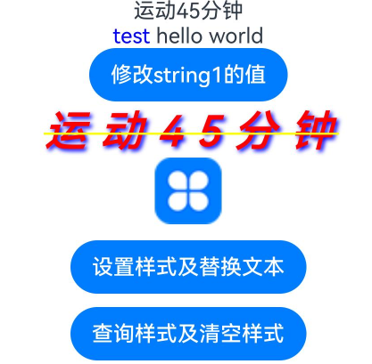

### 示例2（设置事件）

从API version 12开始，该示例通过[StyleOptions](#styleoptions对象说明)中的styledKey、styledValue接口实现属性字符串绑定事件。

```ts
// xxx.ets
@Entry
@Component
struct StyledStringBindEventsDemo {
  scroll: Scroller = new Scroller();
  fontStyleAttr1: TextStyle = new TextStyle({ fontColor: Color.Blue });
  private uiContext: UIContext = this.getUIContext();
  clickGestureAttr: GestureStyle = new GestureStyle({
    onClick: () => {
      this.uiContext.getPromptAction().showToast({ message: 'clickGestureAttr object trigger click event' });
      this.backgroundColor1 = Color.Yellow;
    }
  })
  gestureStyleAttr: GestureStyle = new GestureStyle({
    onClick: () => {
      this.uiContext.getPromptAction().showToast({ message: 'gestureStyleAttr object trigger click event' });
      this.backgroundColor1 = Color.Green;
    },
    onLongPress: () => {
      this.uiContext.getPromptAction().showToast({ message: 'gestureStyleAttr object trigger long press event' });
      this.backgroundColor1 = Color.Orange;
    },
    onTouch: () => {
      this.uiContext.getPromptAction().showToast({ message: 'gestureStyleAttr object trigger touch event' });
      this.backgroundColor1 = Color.Red;
    }
  });
  // 创建事件的对象mutableStyledString3
  mutableStyledString3: MutableStyledString = new MutableStyledString('hello world', [{
    start: 0,
    length: 5,
    styledKey: StyledStringKey.GESTURE,
    styledValue: this.clickGestureAttr
  },
    {
      start: 0,
      length: 5,
      styledKey: StyledStringKey.FONT,
      styledValue: this.fontStyleAttr1
    },
    {
      start: 6,
      length: 5,
      styledKey: StyledStringKey.GESTURE,
      styledValue: this.gestureStyleAttr
    },
    {
      start: 6,
      length: 5,
      styledKey: StyledStringKey.FONT,
      styledValue: new TextStyle({ fontColor: Color.Pink })
    }]);
  @State backgroundColor1: ResourceColor | undefined = undefined;
  controller3: TextController = new TextController();

  async onPageShow() {
    this.controller3.setStyledString(this.mutableStyledString3);
  }

  build() {
    Column() {
      Scroll(this.scroll) {
        Column({ space: 30 }) {
          Button('响应属性字符串事件改变背景色').backgroundColor(this.backgroundColor1).width('80%')
          // 包含事件的属性字符串
          Text(undefined, { controller: this.controller3 }).fontSize(30)
            .copyOption(CopyOptions.InApp)
            .draggable(true)
            .clip(true)
        }.width('100%')
      }
      .expandSafeArea([SafeAreaType.KEYBOARD])
      .scrollable(ScrollDirection.Vertical)
      .scrollBar(BarState.On)
      .scrollBarColor(Color.Gray)
      .scrollBarWidth(10)
      .edgeEffect(EdgeEffect.None)
    }
    .width('100%')
  }
}
```

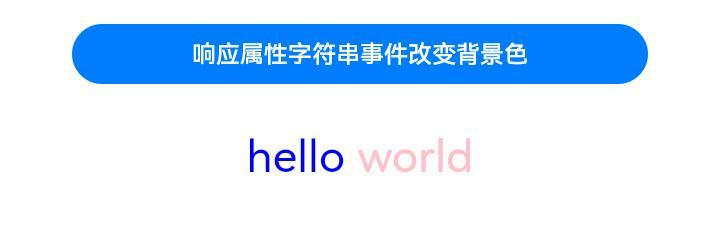

### 示例3（设置文本样式）

从API version 12开始，该示例通过[getStyles](#getstyles)、[setStyle](#setstyle)接口实现属性字符串查询和设置样式。

```ts
// xxx.ets
import { LengthMetrics, LengthUnit } from '@kit.ArkUI';

@Entry
@Component
struct StyledStringSetTextStyleDemo {
  fontStyleAttr1: TextStyle = new TextStyle({ fontColor: Color.Blue });
  fontStyleAttr2: TextStyle = new TextStyle({
    fontColor: Color.Orange,
    fontSize: LengthMetrics.vp(20),
    fontWeight: FontWeight.Bolder,
    fontStyle: FontStyle.Italic,
    fontFamily: 'Arial',
    superscript: SuperscriptStyle.SUPERSCRIPT
  });
  fontStyleAttr3: TextStyle = new TextStyle({
    fontColor: Color.Orange,
    fontSize: LengthMetrics.vp(20),
    fontWeight: FontWeight.Lighter,
    fontStyle: FontStyle.Italic,
    fontFamily: 'Arial',
    superscript: SuperscriptStyle.SUBSCRIPT
  });
  // 创建多重TextStyle样式的对象mutableStyledString1
  mutableStyledString1: MutableStyledString = new MutableStyledString('运动45分钟', [{
    start: 0,
    length: 2,
    styledKey: StyledStringKey.FONT,
    styledValue: this.fontStyleAttr3
  }, {
    start: 2,
    length: 2,
    styledKey: StyledStringKey.FONT,
    styledValue: this.fontStyleAttr2
  }
  ]);
  // 创建有多种样式组合对象mutableStyledString2
  mutableStyledString2: MutableStyledString = new MutableStyledString('test hello world', [{
    start: 0,
    length: 5,
    styledKey: StyledStringKey.FONT,
    styledValue: this.fontStyleAttr1
  }, {
    start: 0,
    length: 5,
    styledKey: StyledStringKey.DECORATION,
    styledValue: new DecorationStyle({ type: TextDecorationType.LineThrough, color: Color.Blue })
  }, {
    start: 0,
    length: 5,
    styledKey: StyledStringKey.TEXT_SHADOW,
    styledValue: new TextShadowStyle({
      radius: 5,
      type: ShadowType.COLOR,
      color: Color.Yellow,
      offsetX: 10,
      offsetY: -10
    })
  }, {
    start: 0,
    length: 5,
    styledKey: StyledStringKey.BASELINE_OFFSET,
    styledValue: new BaselineOffsetStyle(LengthMetrics.px(20))
  }, {
    start: 0,
    length: 5,
    styledKey: StyledStringKey.LETTER_SPACING,
    styledValue: new LetterSpacingStyle(new LengthMetrics(10, LengthUnit.VP))
  }, {
    start: 6,
    length: 5,
    styledKey: StyledStringKey.BASELINE_OFFSET,
    styledValue: new BaselineOffsetStyle(LengthMetrics.fp(10))
  }
  ]);
  @State fontColor1: ResourceColor = Color.Red;
  controller: TextController = new TextController();
  options: TextOptions = { controller: this.controller };
  controller2: TextController = new TextController();
  spanStyle1: SpanStyle = {
    start: 0,
    length: 5,
    styledKey: StyledStringKey.FONT,
    styledValue: new TextStyle({ fontColor: Color.Pink })
  };

  async onPageShow() {
    this.controller.setStyledString(this.mutableStyledString1);
    this.controller2.setStyledString(this.mutableStyledString2);
  }

  build() {
    Column() {
      Column({ space: 10 }) {
        // 显示配了字体各种样式的属性字符串，Text组件亦配置冲突部分生效属性字符串配置，未冲突区间生效Text组件属性设置值
        Text(undefined, this.options)
          .fontColor(this.fontColor1)
          .font({ size: 20, weight: 500, style: FontStyle.Normal })
        // 显示配置了文本阴影、划线、字符间距、基线偏移量的属性字符串，Text组件亦配置生效属性字符串配置
        Text(undefined, { controller: this.controller2 })
          .fontSize(30)
          .copyOption(CopyOptions.InApp)
          .draggable(true)
          .decoration({ type: TextDecorationType.Overline, color: Color.Pink })
          .textShadow({
            radius: 10,
            type: ShadowType.COLOR,
            color: Color.Green,
            offsetX: -10,
            offsetY: 10
          })
        Button('查询字体样式')
          .onClick(() => {
            let styles = this.mutableStyledString1.getStyles(0, this.mutableStyledString1.length);
            if (styles.length !== 0) {
              for (let i = 0; i < styles.length; i++) {
                console.info('mutableStyledString1 style object start:' + styles[i].start);
                console.info('mutableStyledString1 style object length:' + styles[i].length);
                console.info('mutableStyledString1 style object key:' + styles[i].styledKey);
                if (styles[i].styledKey === 0) {
                  let fontAttr = styles[i].styledValue as TextStyle;
                  console.info('mutableStyledString1 fontColor:' + fontAttr.fontColor);
                  console.info('mutableStyledString1 fontSize:' + fontAttr.fontSize);
                  console.info('mutableStyledString1 fontWeight:' + fontAttr.fontWeight);
                  console.info('mutableStyledString1 fontStyle:' + fontAttr.fontStyle);
                  console.info('mutableStyledString1 fontFamily:' + fontAttr.fontFamily);
                  console.info('mutableStyledString1 superscript:' + fontAttr.superscript);
                }
              }
            }
          })
          .margin({ top: 10 })
        Button('查询其他文本样式')
          .onClick(() => {
            let styles = this.mutableStyledString2.getStyles(0, this.mutableStyledString2.length);
            if (styles.length !== 0) {
              for (let i = 0; i < styles.length; i++) {
                console.info('mutableStyledString2 style object start:' + styles[i].start);
                console.info('mutableStyledString2 style object length:' + styles[i].length);
                console.info('mutableStyledString2 style object key:' + styles[i].styledKey);
                if (styles[i].styledKey === 1) {
                  let decoAttr = styles[i].styledValue as DecorationStyle;
                  console.info('mutableStyledString2 decoration type:' + decoAttr.type);
                  console.info('mutableStyledString2 decoration color:' + decoAttr.color);
                }
                if (styles[i].styledKey === 2) {
                  let baselineAttr = styles[i].styledValue as BaselineOffsetStyle;
                  console.info('mutableStyledString2 baselineOffset:' + baselineAttr.baselineOffset);
                }
                if (styles[i].styledKey === 3) {
                  let letterAttr = styles[i].styledValue as LetterSpacingStyle;
                  console.info('mutableStyledString2 letterSpacing:' + letterAttr.letterSpacing);
                }
                if (styles[i].styledKey === 4) {
                  let textShadowAttr = styles[i].styledValue as TextShadowStyle;
                  let shadowValues = textShadowAttr.textShadow;
                  if (shadowValues.length > 0) {
                    for (let j = 0; j < shadowValues.length; j++) {
                      console.info('mutableStyledString2 textShadow type:' + shadowValues[j].type);
                      console.info('mutableStyledString2 textShadow radius:' + shadowValues[j].radius);
                      console.info('mutableStyledString2 textShadow color:' + shadowValues[j].color);
                      console.info('mutableStyledString2 textShadow offsetX:' + shadowValues[j].offsetX);
                      console.info('mutableStyledString2 textShadow offsetY:' + shadowValues[j].offsetY);
                    }
                  }
                }
              }
            }
          })
          .margin({ top: 10 })
        Button('更新mutableStyledString1样式')
          .onClick(() => {
            this.mutableStyledString1.setStyle(this.spanStyle1);
            this.controller.setStyledString(this.mutableStyledString1);
          })
          .margin({ top: 10 })
      }.width('100%')
    }
    .width('100%')
  }
}
```
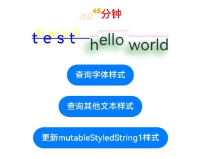

### 示例4（设置图片）

从API version 12开始，该示例通过[ImageAttachment](#imageattachmentinterface对象说明)接口实现属性字符串设置图片。

```ts
// xxx.ets
import { image } from '@kit.ImageKit';
import { LengthMetrics } from '@kit.ArkUI';

@Entry
@Component
struct StyledStringSetImageDemo {
  @State message: string = 'Hello World';
  imagePixelMap: image.PixelMap | undefined = undefined;
  @State imagePixelMap3: image.PixelMap | undefined = undefined;
  mutableStr: MutableStyledString = new MutableStyledString('123');
  controller: TextController = new TextController();
  private uiContext: UIContext = this.getUIContext();
  mutableStr2: MutableStyledString = new MutableStyledString('This is set decoration line style to the mutableStr2', [{
    start: 0,
    length: 15,
    styledKey: StyledStringKey.DECORATION,
    styledValue: new DecorationStyle({
      type: TextDecorationType.Overline,
      color: Color.Orange,
      style: TextDecorationStyle.DOUBLE
    })
  }]);

  async aboutToAppear() {
    console.info('aboutToAppear initial imagePixelMap');
    // $r('app.media.startIcon')需要替换为开发者所需的图像资源文件。
    this.imagePixelMap =
      await this.getPixmapFromMedia($r('app.media.startIcon'));
  }

  private async getPixmapFromMedia(resource: Resource) {
    let unit8Array = await this.uiContext.getHostContext()?.resourceManager?.getMediaContent(resource.id);
    let imageSource = image.createImageSource(unit8Array?.buffer.slice(0, unit8Array.buffer.byteLength));
    let createPixelMap: image.PixelMap = await imageSource.createPixelMap({
      desiredPixelFormat: image.PixelMapFormat.RGBA_8888
    });
    await imageSource.release();
    return createPixelMap;
  }

  build() {
    Row() {
      Column({ space: 5 }) {
        Text(undefined, { controller: this.controller })
          .copyOption(CopyOptions.InApp)
          .draggable(true)
          .fontSize(30)
        Button('设置图片')
          .onClick(() => {
            if (this.imagePixelMap !== undefined) {
              this.mutableStr = new MutableStyledString(new ImageAttachment({
                value: this.imagePixelMap,
                size: { width: 50, height: 50 },
                layoutStyle: { borderRadius: LengthMetrics.vp(10) },
                verticalAlign: ImageSpanAlignment.BASELINE,
                objectFit: ImageFit.Contain
              }));
              this.controller.setStyledString(this.mutableStr);
            }
          })
        Button('设置资源类型图片')
          .onClick(() => {
            if (this.imagePixelMap !== undefined) {
              this.mutableStr = new MutableStyledString(new ImageAttachment({
                // $r('app.media.sky')需要替换为开发者所需的图像资源文件。
                resourceValue: $r('app.media.sky'),
                size: { width: 50, height: 50 },
                layoutStyle: { borderRadius: LengthMetrics.vp(10) },
                verticalAlign: ImageSpanAlignment.BASELINE,
                objectFit: ImageFit.Contain,
                syncLoad: true
              }));
              this.controller.setStyledString(this.mutableStr);
            }
          })
        Button('Image之Get')
          .onClick(() => {
            let imageArray = this.mutableStr.getStyles(0, 1, StyledStringKey.IMAGE);
            for (let i = 0; i < imageArray.length; ++i) {
              console.info('mutableStr start ' + imageArray[i].start + ' length ' + imageArray[i].length + ' type ' +
                imageArray[i].styledKey);
              if (imageArray[i].styledKey === 300) {
                let attachment = imageArray[i].styledValue as ImageAttachment;
                this.imagePixelMap3 = attachment.value;
                console.info('mutableStr value ' + JSON.stringify(attachment.value));
                if (attachment.size !== undefined) {
                  console.info('mutableStr size width ' + attachment.size.width + ' height ' + attachment.size.height);
                }
                console.info('mutableStr vertical ' + attachment.verticalAlign);
                console.info('mutableStr fit ' + attachment.objectFit);
                if (attachment.layoutStyle !== undefined) {
                  let radius = attachment.layoutStyle.borderRadius as BorderRadiuses;
                  console.info('mutableStr radius ' + JSON.stringify(radius));
                }
              }
            }
          })
        Image(this.imagePixelMap3).width(50).height(50)
        Button('Image之Append')
          .onClick(() => {
            let str = new StyledString('123');
            this.mutableStr.appendStyledString(str);
            this.controller.setStyledString(this.mutableStr);
          })
        Button('Image之Insert 前')
          .onClick(() => {
            this.mutableStr.insertString(0, '123');
            this.controller.setStyledString(this.mutableStr);
          })
        Button('Image之Insert 后')
          .onClick(() => {
            this.mutableStr.insertString(1, '123');
            this.controller.setStyledString(this.mutableStr);
          })
        Button('Image之replace')
          .onClick(() => {
            this.mutableStr.replaceString(2, 5, '789');
            this.controller.setStyledString(this.mutableStr);
          })
      }
      .width('100%')
    }
    .height('100%')
  }
}
```

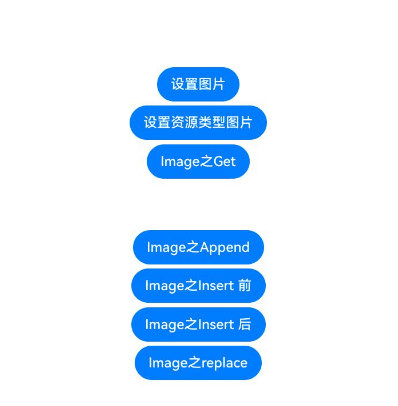

### 示例5（设置文本行高和段落样式）

从API version 12开始，该示例通过[LineHeightStyle](#lineheightstyle)、[ParagraphStyle](#paragraphstyle)接口实现属性字符串设置文本行高和段落样式。

```ts
import { LengthMetrics } from '@kit.ArkUI';

const canvasWidth = 1000;
const canvasHeight = 100;

class LeadingMarginCreator {
  private settings: RenderingContextSettings = new RenderingContextSettings(true);
  private offscreenCanvas: OffscreenCanvas = new OffscreenCanvas(canvasWidth, canvasHeight);
  private offContext: OffscreenCanvasRenderingContext2D = this.offscreenCanvas.getContext('2d', this.settings);
  public static instance: LeadingMarginCreator = new LeadingMarginCreator();

  public genSquareMark(fontSize: number): PixelMap {
    this.clearCanvas();
    const coordinate = fontSize * (1 - 1 / 1.5) / 2;
    const sideLength = fontSize / 1.5;
    this.offContext.fillRect(coordinate, coordinate, sideLength, sideLength);
    return this.offContext.getPixelMap(0, 0, fontSize, fontSize);
  }

  private clearCanvas() {
    this.offContext.clearRect(0, 0, canvasWidth, canvasHeight);
  }
}

@Entry
@Component
struct StyledStringSetLineheightParagraphstyleDemo {
  private leadingMarkCreatorInstance = LeadingMarginCreator.instance;
  leadingMarginPlaceholder1: LeadingMarginPlaceholder = {
    pixelMap: this.leadingMarkCreatorInstance.genSquareMark(24),
    size: [15, 15]
  };
  titleParagraphStyleAttr: ParagraphStyle =
    new ParagraphStyle({ textAlign: TextAlign.Center, paragraphSpacing: LengthMetrics.px(10) });
  // 第一段落首行缩进15vp
  paragraphStyleAttr1: ParagraphStyle = new ParagraphStyle({ textIndent: LengthMetrics.vp(15) });
  // 第二段落缩进15vp且首行有placeholder占位显示
  paragraphStyleAttr2: ParagraphStyle =
    new ParagraphStyle({ textAlign: TextAlign.Start, leadingMargin: this.leadingMarginPlaceholder1 });
  // 第三段落不设置缩进配置最大行数及超长显示方式
  paragraphStyleAttr3: ParagraphStyle = new ParagraphStyle({
    textAlign: TextAlign.End,
    textVerticalAlign: TextVerticalAlign.BASELINE,
    maxLines: 1,
    wordBreak: WordBreak.BREAK_ALL,
    overflow: TextOverflow.Ellipsis
  });
  // 行高样式对象
  lineHeightStyle1: LineHeightStyle = new LineHeightStyle(new LengthMetrics(24));
  // 创建含段落样式的对象paragraphStyledString1
  paragraphStyledString1: StyledString =
    new StyledString(
      '段落标题\n正文第一段落开始0123456789正文第一段落结束\n正文第二段落开始hello world正文第二段落结束\n正文第三段落ABCDEFGHIJKLMNOPQRSTUVWXYZ。',
      [
        {
          start: 0,
          length: 4,
          styledKey: StyledStringKey.PARAGRAPH_STYLE,
          styledValue: this.titleParagraphStyleAttr
        },
        {
          start: 0,
          length: 4,
          styledKey: StyledStringKey.LINE_HEIGHT,
          styledValue: new LineHeightStyle(new LengthMetrics(50))
        }, {
        start: 0,
        length: 4,
        styledKey: StyledStringKey.FONT,
        styledValue: new TextStyle({ fontSize: LengthMetrics.vp(24), fontWeight: FontWeight.Bolder })
      },
        {
          start: 5,
          length: 3,
          styledKey: StyledStringKey.PARAGRAPH_STYLE,
          styledValue: this.paragraphStyleAttr1
        },
        {
          start: 5,
          length: 20,
          styledKey: StyledStringKey.LINE_HEIGHT,
          styledValue: this.lineHeightStyle1
        },
        {
          start: 32,
          length: 5,
          styledKey: StyledStringKey.PARAGRAPH_STYLE,
          styledValue: this.paragraphStyleAttr2
        },
        {
          start: 32,
          length: 20,
          styledKey: StyledStringKey.LINE_HEIGHT,
          styledValue: this.lineHeightStyle1
        },
        {
          start: 60,
          length: 5,
          styledKey: StyledStringKey.PARAGRAPH_STYLE,
          styledValue: this.paragraphStyleAttr3
        },
        {
          start: 60,
          length: 5,
          styledKey: StyledStringKey.LINE_HEIGHT,
          styledValue: this.lineHeightStyle1
        }
      ]);
  controller: TextController = new TextController();

  async onPageShow() {
    this.controller.setStyledString(this.paragraphStyledString1);
  }

  build() {
    Row() {
      Column({ space: 5 }) {
        Text(undefined, { controller: this.controller })
          .width(240)
          .borderWidth(1)
          .copyOption(CopyOptions.InApp)
          .draggable(true)

        // 查询段落样式
        Text()
          .onClick(() => {
            let styles = this.paragraphStyledString1.getStyles(0, this.paragraphStyledString1.length);
            if (styles.length !== 0) {
              for (let i = 0; i < styles.length; i++) {
                console.info('paragraphStyledString1 style object start:' + styles[i].start);
                console.info('paragraphStyledString1 style object length:' + styles[i].length);
                console.info('paragraphStyledString1 style object key:' + styles[i].styledKey);
                if (styles[i].styledKey === 200) {
                  let paraAttr = styles[i].styledValue as ParagraphStyle;
                  console.info('paragraphStyledString1 textAlign:' + paraAttr.textAlign);
                  console.info('paragraphStyledString1 textIndent:' + paraAttr.textIndent);
                  console.info('paragraphStyledString1 maxLines:' + paraAttr.maxLines);
                  console.info('paragraphStyledString1 wordBreak:' + paraAttr.wordBreak);
                  console.info('paragraphStyledString1 leadingMargin:' + paraAttr.leadingMargin);
                  console.info('paragraphStyledString1 overflow:' + paraAttr.overflow);
                }
              }
            }
          })
          .margin({ top: 10 })
      }
      .width('100%')
    }
    .height('100%')
  }
}
```

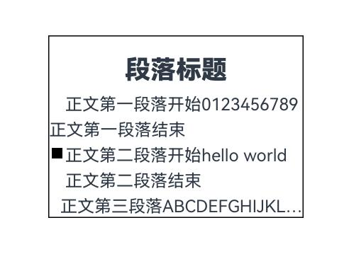

### 示例6（设置自定义绘制Span）

从API version 12开始，该示例通过[CustomSpan](#customspan)接口和[measureTextSize](../arkts-apis-uicontext-measureutils.md#measuretextsize12)实现属性字符串设置自定义绘制Span。

从API版本26.0.0开始，[CustomSpanMeasureInfo](#customspanmeasureinfo对象说明)新增maxWidth、layoutPolicy属性。

```ts
// xxx.ets
import { drawing } from '@kit.ArkGraphics2D';
import { LengthMetrics } from '@kit.ArkUI';

let gUIContext: UIContext;

class MyCustomSpan extends CustomSpan {
  constructor(word: string, width: number, height: number) {
    super();
    this.word = word;
    this.width = width;
    this.height = height;
  }

  onMeasure(measureInfo: CustomSpanMeasureInfo): CustomSpanMetrics {
    this.setPx(gUIContext.vp2px(2));
    let textSize =
      gUIContext.getMeasureUtils().measureTextSize({ textContent: this.word, fontSize: this.wordFontSize });
    // 从API版本26.0.0开始CustomSpanMeasureInfo支持maxWidth与layoutPolicy属性
    if (measureInfo.layoutPolicy != LayoutPolicy.fixAtIdealSize) {
      this.width = Math.min(textSize.width as number, measureInfo.maxWidth as number);
    } else {
      this.width = textSize.width as number;
    }
    this.height = textSize.height as number;
    return {
      width: gUIContext.px2vp(this.width) + (this.paddingLeft + this.paddingRight) * 2,
      height: gUIContext.px2vp(this.height) + this.paddingTop + this.paddingBottom
    };
  }

  onDraw(context: DrawContext, options: CustomSpanDrawInfo) {
    let canvas = context.canvas;

    const brush = new drawing.Brush();
    brush.setColor({
      alpha: 255,
      red: 0,
      green: 74,
      blue: 175
    });
    const font = new drawing.Font();
    font.setSize(gUIContext.vp2px(this.wordFontSize));
    const textBlob = drawing.TextBlob.makeFromString(this.word, font, drawing.TextEncoding.TEXT_ENCODING_UTF8);
    canvas.attachBrush(brush);
    canvas.drawRect({
      // 绘制的矩形在Span占位大小的范围里居中
      left: options.x + gUIContext.vp2px(this.paddingLeft),
      right: options.x + this.width + 2 * gUIContext.vp2px(this.paddingLeft) + gUIContext.vp2px(this.paddingRight),
      top: options.lineTop,
      bottom: options.baseline
    });

    brush.setColor({
      alpha: 255,
      red: 23,
      green: 169,
      blue: 141
    });
    canvas.attachBrush(brush);
    // 文字在绘制的矩形里居中
    canvas.drawTextBlob(textBlob, options.x + 2 * gUIContext.vp2px(this.paddingLeft),
      options.baseline - gUIContext.vp2px(this.paddingBottom));
    canvas.detachBrush();
  }

  setWord(word: string) {
    this.word = word;
  }

  setPx(px: number) {
    this.paddingLeft = px;
    this.paddingRight = px;
    this.paddingTop = px;
    this.paddingBottom = px;
  }

  width: number = 160;
  word: string = 'drawing';
  height: number = 10;
  paddingLeft: number = 0;
  paddingRight: number = 0;
  paddingTop: number = 0;
  paddingBottom: number = 0;
  wordFontSize: number = 20;
}

@Entry
@Component
struct StyledStringSetCustomspanDemo {
  customSpan1: MyCustomSpan = new MyCustomSpan('Hello', 80, 10);
  customSpan2: MyCustomSpan = new MyCustomSpan('World', 80, 40);
  style: MutableStyledString = new MutableStyledString(this.customSpan1);
  textController: TextController = new TextController();
  isPageShow: boolean = true;

  aboutToAppear() {
    gUIContext = this.getUIContext();
  }

  async onPageShow() {
    if (!this.isPageShow) {
      return;
    }
    this.isPageShow = false;

    this.style.appendStyledString(new MutableStyledString('文本绘制 示例代码 CustomSpan', [
      {
        start: 0,
        length: 5,
        styledKey: StyledStringKey.FONT,
        styledValue: new TextStyle({ fontColor: Color.Pink })
      }, {
      start: 5,
      length: 5,
      styledKey: StyledStringKey.FONT,
      styledValue: new TextStyle({ fontColor: Color.Orange, fontStyle: FontStyle.Italic })
    }, {
      start: 10,
      length: 500,
      styledKey: StyledStringKey.FONT,
      styledValue: new TextStyle({ fontColor: Color.Green, fontWeight: FontWeight.Bold })
    }
    ]));
    this.style.appendStyledString(new StyledString(this.customSpan2));
    this.style.appendStyledString(new StyledString('自定义绘制', [{
      start: 0,
      length: 5,
      styledKey: StyledStringKey.FONT,
      styledValue: new TextStyle({ fontColor: Color.Green, fontSize: LengthMetrics.px(50) })
    }]));
    this.textController.setStyledString(this.style);
  }

  build() {
    Row() {
      Column() {
        Text(undefined, { controller: this.textController })
          .copyOption(CopyOptions.InApp)
          .fontSize(30)

        Button('invalidate').onClick(() => {
          this.customSpan1.setWord('你好');
          this.customSpan1.invalidate();
        })
      }
      .width('100%')
    }
    .height('100%')
  }
}
```


### 示例7（支持存储自定义扩展信息）

从API version 12开始，该示例通过[UserDataSpan](#userdataspan)接口实现属性字符串支持存储自定义扩展信息的功能。

```ts
// xxx.ets
class MyUserDataSpan extends UserDataSpan {
  constructor(name: string, age: number) {
    super();
    this.name = name;
    this.age = age;
  }

  name: string;
  age: number;
}

@Entry
@Component
struct StyledStringSetUserdataspanDemo {
  @State name: string = 'world';
  @State age: number = 10;
  controller: TextController = new TextController();
  styleString: MutableStyledString = new MutableStyledString('hello world', [{
    start: 0,
    length: 11,
    styledKey: StyledStringKey.USER_DATA,
    styledValue: new MyUserDataSpan('hello', 21)
  }]);

  onPageShow(): void {
    this.controller.setStyledString(this.styleString);
  }

  build() {
    Column() {
      Text(undefined, { controller: this.controller })
      Button('get user data').onClick(() => {
        let arr = this.styleString.getStyles(0, this.styleString.length);
        let userDataSpan = arr[0].styledValue as MyUserDataSpan;
        this.name = userDataSpan.name;
        this.age = userDataSpan.age;
      })
      Text('name:' + this.name + '  age: ' + this.age)
    }.width('100%').height(250).padding({ left: 35, right: 35, top: 35 })
  }
}
```

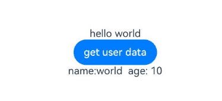

### 示例8（设置超链接）

从API version 14开始，该示例通过[UrlStyle](#urlstyle14)接口，实现了对属性字符串中超链接设置的支持。

```ts
// xxx.ets
@Entry
@Component
struct StyledStringSetUrlstyleDemo {
  urlString: UrlStyle = new UrlStyle('https://www.example.com');
  mutableStyledString: MutableStyledString = new MutableStyledString('Hello World', [{
    start: 0,
    length: 'Hello'.length,
    styledKey: StyledStringKey.URL,
    styledValue: this.urlString
  }]);
  controller: TextController = new TextController();

  async onPageShow() {
    this.controller.setStyledString(this.mutableStyledString);
  }

  build() {
    Column() {
      Column() {
        Text(undefined, { controller: this.controller }).key('mutableStyledString').fontSize(30)
      }
    }.width('100%').height(250).padding({ left: 35, right: 35, top: 35 })
  }
}
```

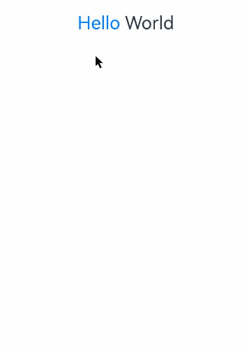


### 示例9 （给图片设置colorFilter）

从API version 15开始，该示例通过给[ImageAttachment](#imageattachmentinterface对象说明)设置colorFilter实现了给图像设置颜色滤镜效果。

``` ts
// xxx.ets
import { LengthMetrics } from '@kit.ArkUI';
import { drawing, common2D } from '@kit.ArkGraphics2D';

@Entry
@Component
struct StyledStringSetImageColorfilterDemo {
  @State message: string = 'Hello World';
  mutableStr: MutableStyledString = new MutableStyledString('origin image:');
  mutableStr2: MutableStyledString = new MutableStyledString('with filter:');
  controller: TextController = new TextController();
  controller2: TextController = new TextController();
  private color: common2D.Color = {
    alpha: 125,
    red: 125,
    green: 125,
    blue: 255
  };

  build() {
    Row() {
      Column({ space: 5 }) {
        Text(undefined, { controller: this.controller })
          .copyOption(CopyOptions.InApp)
          .draggable(true)
          .fontSize(30)
          .onAppear(() => {
            this.mutableStr = new MutableStyledString(new ImageAttachment({
              // $r('app.media.startIcon')需要替换为开发者所需的图像资源文件。
              resourceValue: $r('app.media.startIcon'),
              size: { width: 50, height: 50 },
              layoutStyle: { borderRadius: LengthMetrics.vp(10) },
              verticalAlign: ImageSpanAlignment.BASELINE,
              objectFit: ImageFit.Contain,
              syncLoad: true
            }));
            this.controller.setStyledString(this.mutableStr);
          })
        Text(undefined, { controller: this.controller2 })
          .copyOption(CopyOptions.InApp)
          .draggable(true)
          .fontSize(30)
        Button('set image color filter')
          .onClick(() => {
            this.mutableStr2 = new MutableStyledString(new ImageAttachment({
              // $r('app.media.startIcon')需要替换为开发者所需的图像资源文件。
              resourceValue: $r('app.media.startIcon'),
              size: { width: 50, height: 50 },
              layoutStyle: { borderRadius: LengthMetrics.vp(10) },
              verticalAlign: ImageSpanAlignment.BASELINE,
              objectFit: ImageFit.Contain,
              colorFilter: drawing.ColorFilter.createBlendModeColorFilter(this.color, drawing.BlendMode.SRC_IN),
              syncLoad: true
            }));
            this.controller2.setStyledString(this.mutableStr2);
          })
      }
      .width('100%')
    }
    .height('100%')
  }
}
```

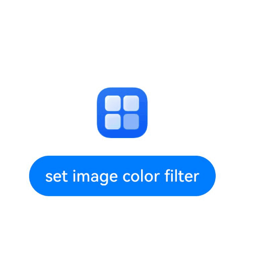

### 示例10（属性字符串的插入、删除、替换）

从API version 12开始，该示例通过[subStyledString](#substyledstring)、[removeString](#removestring)、[removeStyle](#removestyle)、[clearStyles](#clearstyles)、[replaceStyledString](#replacestyledstring)、[insertStyledString](#insertstyledstring)接口实现属性字符串的插入、删除、替换。

``` ts
// xxx.ets
@Entry
@Component
struct StyledStringModifyDemo {
  @State message: string = 'Hello World';
  mutableStr: MutableStyledString = new MutableStyledString('123456', [{
    start: 0,
    length: 2,
    styledKey: StyledStringKey.FONT,
    styledValue: new TextStyle({ fontColor: Color.Red })
  }, {
    start: 0,
    length: 3,
    styledKey: StyledStringKey.DECORATION,
    styledValue: new DecorationStyle({ type: TextDecorationType.LineThrough })
  }]);
  controller: TextController = new TextController();
  controller2: TextController = new TextController();

  build() {
    Row() {
      Column({ space: 5 }) {
        Text(undefined, { controller: this.controller })
          .copyOption(CopyOptions.InApp)
          .draggable(true)
          .fontSize(30)
          .onAppear(() => {
            this.controller.setStyledString(this.mutableStr);
          })
        Text(undefined, { controller: this.controller2 })
          .copyOption(CopyOptions.InApp)
          .draggable(true)
          .fontSize(30)
        Button('GetSubStyledString (0,3)').onClick(() => {
          this.controller2.setStyledString(this.mutableStr.subStyledString(0, 3));
        })
        Button('RemoveStyle (0,1,Decoration)').onClick(() => {
          this.mutableStr.removeStyle(0, 1, StyledStringKey.DECORATION);
          this.controller.setStyledString(this.mutableStr);
        })
        Button('RemoveString (5,1)').onClick(() => {
          this.mutableStr.removeString(5, 1);
          this.controller.setStyledString(this.mutableStr);
        })
        Button('ClearStyles').onClick(() => {
          this.mutableStr.clearStyles();
          this.controller.setStyledString(this.mutableStr);
        })
        Button('replaceStyledString').onClick(() => {
          this.mutableStr.replaceStyledString(3, 1, new StyledString('abc', [{
            start: 0,
            length: 3,
            styledKey: StyledStringKey.FONT,
            styledValue: new TextStyle({ fontColor: Color.Blue })
          }]));
          this.controller.setStyledString(this.mutableStr);
        })
        Button('insertStyledString').onClick(() => {
          this.mutableStr.insertStyledString(4, new StyledString('A'));
          this.controller.setStyledString(this.mutableStr);
        })
      }
      .width('100%')
    }
    .height('100%')
  }
}
```

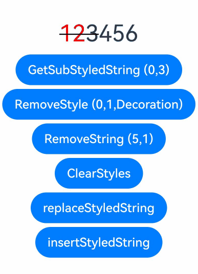

### 示例11（属性字符串的文本描边）

从API version 20开始，该示例通过[TextStyle](#textstyle)设置strokeWidth和strokeColor接口实现属性字符串的文本描边。

从API版本26.0.0开始，[TextStyle](#textstyle)新增strokeJoinStyle接口实现文本拐角描边样式。

``` ts
// xxx.ets
import { LengthMetrics } from '@kit.ArkUI';

@Entry
@Component
struct StyledStringStrokewidthStrokecolorDemo {
  @State string1: string = 'Hello';
  spanStyle: SpanStyle = {
    start: 0,
    length: 5,
    styledKey: StyledStringKey.FONT,
    styledValue: new TextStyle({
      fontColor: '#ff2787d9',
      strokeWidth: LengthMetrics.px(-5),
      strokeColor: Color.Black,
      fontWeight: FontWeight.Bolder,
      fontSize: LengthMetrics.px(100)
    })
  };
  spanStyle1: SpanStyle = {
    start: 0,
    length: 5,
    styledKey: StyledStringKey.FONT,
    styledValue: new TextStyle({
      fontColor: '#ff2787d9',
      strokeWidth: LengthMetrics.px(5),
      strokeJoinStyle: StrokeJoinStyle.MITER_JOIN,
      strokeColor: Color.Black,
      fontWeight: FontWeight.Bolder,
      fontSize: LengthMetrics.px(100)
    })
  };
  mutableStyledString: MutableStyledString = new MutableStyledString(this.string1, []);
  controller: TextController = new TextController();
  mutableStyledString1: MutableStyledString = new MutableStyledString(this.string1, []);
  controller1: TextController = new TextController();

  async onPageShow() {
    this.mutableStyledString.setStyle(this.spanStyle)
    this.controller.setStyledString(this.mutableStyledString);

    this.mutableStyledString1.setStyle(this.spanStyle1)
    this.controller1.setStyledString(this.mutableStyledString1);
  }

  build() {
    Column() {
      // 实心字
      Text(undefined, { controller: this.controller })
        .margin({ top: 10, bottom: 50 })
        .draggable(true)
        .onDragStart(() => {
        })
      // 空心字
      Text(undefined, { controller: this.controller1 })
        .margin({ top: 10, bottom: 50 })
        .draggable(true)
        .onDragStart(() => {
        })
    }
    .height('100%')
    .width('100%')
  }
}
```

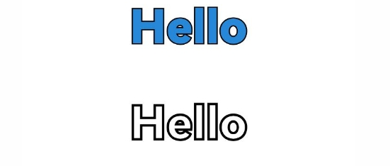

### 示例12（fromHtml和toHtml互相转换）

该示例通过[fromHtml](#fromhtml)（从API version 12开始）、[toHtml](#tohtml14)（从API version 14开始）接口，将HTML中strong、b<sup>20+</sup>、em<sup>20+</sup>、i<sup>20+</sup>、u<sup>20+</sup>、del<sup>20+</sup>、s<sup>20+</sup>、a<sup>20+</sup>、sub<sup>20+</sup>、sup<sup>20+</sup>标签及其style属性中的background-color转换为属性字符串并转回HTML。

``` ts
// xxx.ets
@Entry
@Component
struct StyledStringHtmlConvertDemo {
  // 从API version 20开始支持b、em、i、u、del、s、a、sup、sub标签
  @State html: string =
    '<p>This is <b>b</b> <strong>strong</strong> <em>em</em> <i>i</i> <u>u</u> <del>del</del> <s>s</s> <span style = "foreground-color:blue"> <a href=\'https://www.example.com\'>www.example</a> </span> <span style="background-color: red;">red span</span> <sup>superscript</sup> and <sub>subscript</sub></p>';
  @State spanString: StyledString | undefined = undefined;
  @State resultText: string = ''; // 保存结果文本的状态
  controller: TextController = new TextController;

  build() {
    Column() {
      // 显示转换后的spanString
      Text(undefined, { controller: this.controller }).height(100)

      // TextArea显示每个步骤的结果
      TextArea({ text: this.html })
        .width('100%')
        .height(100)
        .margin(5)

      // 按钮1:将HTML转换为SpanString
      Button('Convert HTML to SpanString').onClick(async () => {
        this.spanString = await StyledString.fromHtml(this.html);
        this.controller.setStyledString(this.spanString);
        this.resultText = 'Converted HTML to SpanString successfully.';
      }).margin(5)

      // 按钮2:将SpanString转换为HTML
      Button('Convert SpanString to HTML').onClick(() => {
        if (this.spanString) {
          // 将spanString转换为HTML并替换当前的HTML状态
          const newHtml = StyledString.toHtml(this.spanString);
          if (newHtml !== this.html) { // 通过检查内容是否已经相同来防止重复
            this.html = newHtml;
          }
          this.resultText = 'Converted SpanString to HTML successfully.';
        } else {
          this.resultText = 'SpanString is undefined.';
        }
      }).margin(5)

      // 按钮3:将HTML转换回SpanString
      Button('Convert HTML back to SpanString').onClick(async () => {
        this.spanString = await StyledString.fromHtml(this.html);
        this.controller.setStyledString(this.spanString);
        this.resultText = 'Converted HTML back to SpanString successfully.';
      }).margin(5)

      // 重置：重置HTML和SpanString
      Button('Reset').onClick(() => {
        this.html =
          '<p>This is <b>b</b> <strong>strong</strong> <em>em</em> <i>i</i> <u>u</u> <del>del</del> <s>s</s> <span style = "foreground-color:blue"> <a href=\'https: //www.example.com\'>www.example</a> </span> <span style="background-color: red;">red span</span> <sup>superscript</sup> and <sub>subscript</sub></p>';
        this.spanString = undefined;
        this.controller.setStyledString(new StyledString('')); // 使用空的StyledString实例
        this.resultText = 'Reset HTML and SpanString successfully.';
      }).margin(5)
    }.width('100%').padding(20)
  }
}
```

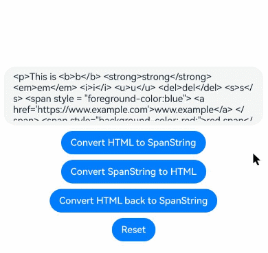

### 示例13（多装饰线与加粗装饰线）

从API version 20开始，该示例通过[DecorationStyle](#decorationstyle)中设置enableMultiType、thicknessScale接口，实现多装饰线显示与加粗装饰线的效果。

``` ts
// xxx.ets
import { LengthMetrics } from '@kit.ArkUI'
@Entry
@Component
struct StyledStringSetDecorationstyleDemo {
  controller : TextController = new TextController;
  thickness: number = 2.0;
  mutableStyledString1: MutableStyledString = new MutableStyledString('1234567890', [
    {
      start: 0,
      length: 10,
      styledKey: StyledStringKey.FONT,
      styledValue: new TextStyle({ fontColor: Color.Orange, fontSize: LengthMetrics.vp(30) })
    },
    {
      start: 0,
      length: 4,
      styledKey: StyledStringKey.DECORATION,
      styledValue: new DecorationStyle({type: TextDecorationType.LineThrough, thicknessScale: this.thickness}, {enableMultiType: true})
    },
    {
      start: 2,
      length: 5,
      styledKey: StyledStringKey.DECORATION,
      styledValue: new DecorationStyle({type: TextDecorationType.Underline, thicknessScale: this.thickness}, {enableMultiType: true})
    },
    {
      start: 0,
      length: 4,
      styledKey: StyledStringKey.DECORATION,
      styledValue: new DecorationStyle({type: TextDecorationType.Overline, thicknessScale: this.thickness}, {enableMultiType: true})
    },
    {
      start: 6,
      length: 2,
      styledKey: StyledStringKey.DECORATION,
      styledValue: new DecorationStyle({type: TextDecorationType.LineThrough})
    },
    {
      start: 7,
      length: 2,
      styledKey: StyledStringKey.DECORATION,
      styledValue: new DecorationStyle({type: TextDecorationType.LineThrough, color: Color.Green}, {enableMultiType: true})
    },
    {
      start: 8,
      length: 2,
      styledKey: StyledStringKey.DECORATION,
      styledValue: new DecorationStyle({type: TextDecorationType.Overline, color: Color.Green}, {enableMultiType: true})
    }
  ]);
  build() {
    Column({ space:3 }) {
      Text(undefined, { controller: this.controller })
        .height(100)
        .copyOption(CopyOptions.LocalDevice)
        .onAppear(()=>{
          this.controller.setStyledString(this.mutableStyledString1)
        })
    }.width('100%')
  }
}
```


### 示例14（获取以vp为单位的图片尺寸）

从API version 21开始，该示例通过[ImageAttachmentInterface](#imageattachmentinterface对象说明)实现属性字符串设置图片，并且获取该图片以vp为单位的尺寸。

```ts
// xxx.ets
import { image } from '@kit.ImageKit';
import { LengthMetrics } from '@kit.ArkUI';

@Entry
@Component
struct StyledStringImageAttachmentInterfaceDemo {
  @State message: string = 'Image info: \n';
  imagePixelMap: image.PixelMap | undefined = undefined;
  @State mutableStr: MutableStyledString = new MutableStyledString('');
  controller: TextController = new TextController();

  async aboutToAppear() {
    this.imagePixelMap = await this.getPixmapFromMedia($r('app.media.startIcon'));
  }

  private async updateImageInfoStr() {
    this.message = 'Image info: \n';
    let imageArray = this.mutableStr.getStyles(0, this.mutableStr.length, StyledStringKey.IMAGE);
    for (let i = 0; i < imageArray.length; ++i) {
      this.message += (' Image ' + i + ':\n');
      if (imageArray[i].styledKey === StyledStringKey.IMAGE) {
        let attachment = imageArray[i].styledValue as ImageAttachment;
        if (attachment.size !== undefined) {
          let w: number = attachment.size.width as number;
          let h: number = attachment.size.height as number;
          this.message += ('    px size  width = ' + w.toFixed(2) + ' \theight = ' + h.toFixed(2) + '\n');
        }
        if (attachment.sizeInVp !== undefined) {
          let w: number = attachment.sizeInVp.width as number;
          let h: number = attachment.sizeInVp.height as number;
          this.message += ('    sizeInVp width = ' + w.toFixed(2) + ' \theight = ' + h.toFixed(2) + '\n\n');
        }
      }
    }
  }

  private async getPixmapFromMedia(resource: Resource) {
    let unit8Array =
      await this.getUIContext()?.getHostContext()?.resourceManager?.getMediaContent(resource.id);
    let imageSource = image.createImageSource(unit8Array?.buffer.slice(0, unit8Array.buffer.byteLength));
    let createPixelMap: image.PixelMap = await imageSource.createPixelMap({
      desiredPixelFormat: image.PixelMapFormat.RGBA_8888
    });
    await imageSource.release();
    return createPixelMap;
  }

  build() {
    Row() {
      Column({ space: 5 }) {
        Text(undefined, { controller: this.controller })
          .copyOption(CopyOptions.InApp)
          .draggable(true)
          .fontSize(30)
        Button('设置图片 50vp x 50vp')
          .onClick(() => {
            if (this.imagePixelMap !== undefined) {
              this.mutableStr.appendStyledString(new MutableStyledString(new ImageAttachment({
                value: this.imagePixelMap,
                size: { width: 50, height: 50 },
                layoutStyle: { borderRadius: LengthMetrics.vp(10) },
                verticalAlign: ImageSpanAlignment.BASELINE,
                objectFit: ImageFit.Contain
              })));
              this.controller.setStyledString(this.mutableStr);
              this.updateImageInfoStr();
            }
          }).margin(10)
        Button('设置图片 70vp x 70vp')
          .onClick(() => {
            if (this.imagePixelMap !== undefined) {
              this.mutableStr.appendStyledString(new MutableStyledString(new ImageAttachment({
                value: this.imagePixelMap,
                size: { width: 70, height: 70 },
                layoutStyle: { borderRadius: LengthMetrics.vp(10) },
                verticalAlign: ImageSpanAlignment.BASELINE,
                objectFit: ImageFit.Contain
              })));
              this.controller.setStyledString(this.mutableStr);
              this.updateImageInfoStr();
            }
          }).margin(10)
        Text(this.message).width('80%').padding(30)
      }
      .width('100%')
    }
    .height('100%')
  }
}
```
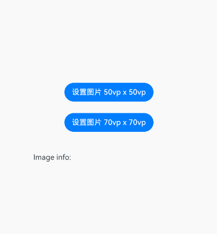

### 示例15（设置段落自定义缩进）

从API version 22开始，该示例通过[LeadingMarginSpan](#leadingmarginspan22)设置段落缩进，并且自定义缩进图案。

```ts
// xxx.ets
import { drawing } from '@kit.ArkGraphics2D';
import { LengthMetrics } from '@kit.ArkUI';

/**
 * 实现LeadingMarginSpan
 */
class MyLeadingMarginSpan extends LeadingMarginSpan {
  text: string = '';

  constructor(text: string) {
    super();
    this.text = text;
  }

  getText() {
    return this.text;
  }

  // 返回缩进距离
  getLeadingMargin(): LengthMetrics {
    console.info('getLeadingMargin');
    return LengthMetrics.vp(10);
  }

  // 回调给开发者行信息，用于canvas绘制
  onDraw(context: DrawContext, options: LeadingMarginSpanDrawInfo) {
    console.info('x = ' + options.x + ', direction = ' + options.direction + ', top = ' + options.top
      + ', bottom = ' + options.bottom + ', baseline = ' + options.baseline
      + ', start = ' + options.start + ', end = ' + options.end + ', first = ' + options.first);
    let canvas = context.canvas;
    if (!options.first) {
      return;
    }

    // 绘制文本符号
    const font = new drawing.Font();
    font.setSize(20);
    const textBlob = drawing.TextBlob.makeFromString(this.text, font, drawing.TextEncoding.TEXT_ENCODING_UTF8);
    canvas.drawTextBlob(textBlob, options.x - 30, options.top + (options.bottom - options.top) / 2);
  }
}

@Entry
@Component
struct leadingMarginSpanDemo {
  controller: RichEditorStyledStringController = new RichEditorStyledStringController();
  options: RichEditorStyledStringOptions = { controller: this.controller };
  textController: TextController = new TextController();
  leadingMarginSpan: LeadingMarginSpan = new MyLeadingMarginSpan('●');
  paragraphStyleAttr2: ParagraphStyle =
    new ParagraphStyle({ leadingMarginSpan: this.leadingMarginSpan });
  style: StyledString = new StyledString('段落标题\n段落内容101234567890123456789012345678901234567890123456789',
    [
      {
        start: 0,
        length: 10,
        styledKey: StyledStringKey.PARAGRAPH_STYLE,
        styledValue: this.paragraphStyleAttr2
      }
    ]
  );

  build() {
    Column() {
      Text(undefined, { controller: this.textController })
        .width('90%')
        .height('20%')
        .margin({ top: 10 })
        .borderWidth(1)
        .copyOption(CopyOptions.InApp)
        .draggable(true)

      RichEditor(this.options)
        .width('90%')
        .height('20%')
        .margin({ top: 10 })
        .borderWidth(1)
      Column() {
        Button('setStyledString')
          .onClick(() => {
            this.textController.setStyledString(this.style);
            this.controller.setStyledString(this.style);
          }).margin({ top: 10 })
        // 查询段落样式
        Button('getStyles')
          .onClick(() => {
            let styles = this.style.getStyles(0, this.style.length);
            if (styles.length == 0) {
              return;
            }
            for (let i = 0; i < styles.length; i++) {
              console.info('getStyles style object start:' + styles[i].start);
              console.info('getStyles style object length:' + styles[i].length);
              console.info('getStyles style object key:' + styles[i].styledKey);
              if (styles[i].styledKey === 200) {
                let paraAttr = styles[i].styledValue as ParagraphStyle;
                console.info('getStyles leadingMarginSpan:' + paraAttr.leadingMarginSpan);
                let leadingMarginSpanClass = paraAttr.leadingMarginSpan as MyLeadingMarginSpan;
                if (leadingMarginSpanClass != null) {
                  console.info('getStyles leadingMarginSpan getText: ' + leadingMarginSpanClass.getText());
                }
              }
            }
          }).margin({ top: 10 })
      }
    }
    .width('100%')
  }
}
```


### 示例16（使用supportSvg2属性时，SVG图片的显示效果）
从API version 22开始，该示例通过给[ResourceImageAttachmentOptions](#resourceimageattachmentoptions15)设置supportSvg2属性，使[SVG标签解析能力增强功能](ts-image-svg2-capabilities.md)的[SVG易用性提升](ts-image-svg2-capabilities.md#svg易用性提升)能力生效。
```ts
import { drawing } from '@kit.ArkGraphics2D';
import { LengthMetrics } from '@kit.ArkUI';

@Entry
@Component
struct StyledStringProcessDemo {
  controller: TextController = new TextController();
  controller1: TextController = new TextController();
  imageAttachment: ImageAttachment = new ImageAttachment({
    // $r('app.media.ice')需要替换为开发者所需的图像资源文件。
    resourceValue: $r('app.media.ice'),
    size: { width: 50, height: 50 },
    layoutStyle: { borderRadius: LengthMetrics.vp(10) },
    verticalAlign: ImageSpanAlignment.BASELINE,
    objectFit: ImageFit.Contain,
    syncLoad: true,
    supportSvg2: true,
    colorFilter: drawing.ColorFilter.createBlendModeColorFilter(
      drawing.Tool.makeColorFromResourceColor(Color.Blue), drawing.BlendMode.SRC_IN)
  })
  imageAttachment1: ImageAttachment = new ImageAttachment({
    // $r('app.media.ice')需要替换为开发者所需的图像资源文件。
    resourceValue: $r('app.media.ice'),
    size: { width: 50, height: 50 },
    layoutStyle: { borderRadius: LengthMetrics.vp(10) },
    verticalAlign: ImageSpanAlignment.BASELINE,
    objectFit: ImageFit.Contain,
    syncLoad: true,
    supportSvg2: false,
    colorFilter: drawing.ColorFilter.createBlendModeColorFilter(
      drawing.Tool.makeColorFromResourceColor(Color.Blue), drawing.BlendMode.SRC_IN)
  })
  scroller: Scroller = new Scroller();
  mutableStr: MutableStyledString = new MutableStyledString('');
  mutableStr1: MutableStyledString = new MutableStyledString('');

  aboutToAppear() {
    this.mutableStr = new MutableStyledString(this.imageAttachment);
    this.controller.setStyledString(this.mutableStr);
    this.mutableStr1 = new MutableStyledString(this.imageAttachment1);
    this.controller1.setStyledString(this.mutableStr1);
  }

  build() {
    Column() {
      Scroll(this.scroller) {
        Column() {
          Text('属性字符串不支持svg2')
          Text(undefined, { controller: this.controller1 })
            .draggable(true)
            .fontSize(30)
          Text('属性字符串支持svg2')
          Text(undefined, { controller: this.controller })
            .draggable(true)
            .fontSize(30)
        }.width('100%')
      }
    }
    .width('100%')
  }
}
```


### 示例17（设置字体配置）

该示例通过[TextStyleInterface](#textstyleinterface对象说明)中的[fontConfigs](ts-text-common.md#fontconfigs24对象说明)实现属性字符串的字体配置。

从API version 24开始，TextStyleInterface新增fontConfigs属性。

```ts
// xxx.ets
import { LengthMetrics } from '@kit.ArkUI';

@Entry
@Component
struct StyledStringFontConfigsDemo {
  controller1: TextController = new TextController();
  controller2: TextController = new TextController();
  scroller: Scroller = new Scroller();

  aboutToAppear() {
    // 示例1：启用可变字重
    let textStyle1: TextStyle = new TextStyle({
      fontColor: Color.Gray,
      fontSize: LengthMetrics.vp(18)
    });
    let styledString1: MutableStyledString = new MutableStyledString('StyledString with FontConfigs: ', [{
      start: 0,
      length: 30,
      styledKey: StyledStringKey.FONT,
      styledValue: textStyle1
    }]);
    // 为'字体粗细850'这段文本设置字体配置
    let textStyle2: TextStyle = new TextStyle({
      fontColor: Color.Blue,
      fontSize: LengthMetrics.vp(24),
      fontWeight: 850,
      fontConfigs: {
        fontWeightConfigs: {
          enableVariableFontWeight: true
        }
      }
    });
    let styledString2: StyledString = new StyledString('字体粗细850', [{
      start: 0,
      length: 7,
      styledKey: StyledStringKey.FONT,
      styledValue: textStyle2
    }]);
    styledString1.appendStyledString(styledString2);
    this.controller1.setStyledString(styledString1);

    // 示例2：禁用设备字体粗细级别自动更新
    let textStyle3: TextStyle = new TextStyle({
      fontColor: Color.Gray,
      fontSize: LengthMetrics.vp(18)
    });
    let styledString3: MutableStyledString = new MutableStyledString('禁用跟随设备字重级别更新: ', [{
      start: 0,
      length: 12,
      styledKey: StyledStringKey.FONT,
      styledValue: textStyle3
    }]);
    let textStyle4: TextStyle = new TextStyle({
      fontColor: Color.Blue,
      fontSize: LengthMetrics.vp(24),
      fontWeight: 600,
      fontConfigs: {
        fontWeightConfigs: {
          enableDeviceFontWeightCategory: false
        }
      }
    });
    let styledString4: StyledString = new StyledString('字体粗细600', [{
      start: 0,
      length: 7,
      styledKey: StyledStringKey.FONT,
      styledValue: textStyle4
    }]);
    styledString3.appendStyledString(styledString4);
    this.controller2.setStyledString(styledString3);
  }

  build() {
    Scroll(this.scroller) {
      Column() {
        Text('示例1：启用可变字体粗细调节，支持设置字体粗细为非整百')
          .fontSize(16)
          .margin({ bottom: 5 })

        Text(undefined, { controller: this.controller1 })
          .fontSize(20)
          .margin({ bottom: 20 })

        Text('示例2：设置文本字体粗细不跟随设备字重级别自动更新')
          .fontSize(16)
          .margin({ bottom: 5 })

        Text(undefined, { controller: this.controller2 })
          .fontSize(20)
      }
      .width('100%')
      .padding(20)
    }
    .width('100%')
  }
}
```


### 示例18（fromHtml转换）

该示例通过[fromHtml](#fromhtml)接口，将HTML中\<cite>、\<dfn>、\<small>、\<h1>、\<h2>、\<h3>、\<h4>、\<h5>、\<h6>、\<ol>、\<ul>、\<li>标签转换为属性字符串。
 
从API版本26.0.0开始，fromHtml新增支持\<cite>、\<dfn>、\<small>、\<h1>、\<h2>、\<h3>、\<h4>、\<h5>、\<h6>、\<ol>、\<ul>、\<li>标签。

```ts
@Entry
@Component
struct html_convert_demo {
  @State html: string = '<p><cite>cite</cite><dfn>dfn</dfn></p><p>normal<small>small<small>smaller</small></small></p><h1>一级标题</h1><h2>二级标题</h2><h3>三级标题</h3><h4>四级标题</h4><h5>五级标题</h5><h6>六级标题</h6><ol><li>Item 1</li><li>Item 2</li></ol><ul><li>Item A</li><li>Item B</li></ul>';
  @State spanString: StyledString | undefined = undefined;
  controller: TextController = new TextController;

  build() {
    Column() {
      // 显示转换后的spanString
      Text(undefined, { controller: this.controller })
      // TextArea显示每个步骤的结果
      TextArea({ text: this.html })
        .width('100%')
        .height(100)
        .margin(5)

      Button('将HTML转换为SpanString').onClick(async () => {
        this.spanString = await StyledString.fromHtml(this.html);
        this.controller.setStyledString(this.spanString);
      }).margin(5)
    }.width("100%").padding(20)
  }
}
```


### 示例19（设置可变字体的属性）

该示例通过[TextStyle](#textstyle)的fontVariations属性设置可变字体的属性。
 
从API版本26.0.0开始，[TextStyle](#textstyle)新增了fontVariations属性。

```ts
// xxx.ets
@Entry
@Component
struct StyledStringExample {
  controller: TextController = new TextController();
  @State weightValue: number = 400;

  aboutToAppear() {
    let textStyle = new TextStyle({
      // wght代表可变字体的字重属性
      fontVariations: [{ axis: 'wght', value: this.weightValue }]
    });
    let styledString = new StyledString('Hello World !', [{
      styledKey: StyledStringKey.FONT,
      styledValue: textStyle
    }]);
    this.controller.setStyledString(styledString);
  }

  build() {
    Column() {
      Text(undefined, { controller: this.controller })
      Button('字重: ' + this.weightValue)
        .margin(10)
        .onClick(() => {
          this.weightValue += 100;
          let textStyle = new TextStyle({
            // wght代表可变字体的字重属性
            fontVariations: [{ axis: 'wght', value: this.weightValue }]
          });
          let styledString = new StyledString('Hello World !', [{
            styledKey: StyledStringKey.FONT,
            styledValue: textStyle
          }]);
          this.controller.setStyledString(styledString);
        })
    }
    .width('100%')
  }
}
```


### 示例20（设置文本着色器效果）

该示例通过[ParagraphStyle](#paragraphstyle)中shaderStyle接口实现文本着色效果。

从API版本26.0.0开始，ParagraphStyle新增shaderStyle接口。

```ts
@Entry
@Component
struct ShaderColorStyle {
  @State message: string = 'Hello World';
  @State linearGradientOptions1: LinearGradientOptions =
    {
      angle: 45,
      colors: [[Color.Red, 0.0], [Color.Blue, 0.3], [Color.Green, 0.5]]
    };
  @State linearGradientOptions2: LinearGradientOptions =
    {
      direction: GradientDirection.LeftTop,
      colors: [[Color.Red, 0.0], [Color.Blue, 0.3], [Color.Green, 0.5]],
      repeating: true,
    };
  @State radialGradientOptions: RadialGradientOptions =
    {
      center: [50, 50],
      radius: 20,
      colors: [[Color.Red, 0.0], [Color.Blue, 0.3], [Color.Green, 0.5]],
      repeating: true,
    };
  @State colorShaderStyle: ColorShaderStyle =
    {
      color: Color.Blue
    };
  paragraphStyle1: ParagraphStyle =
    new ParagraphStyle({ shaderStyle: this.linearGradientOptions1 });
  style1: StyledString =
    new StyledString(this.message,
      [
        {
          start: 0,
          length: this.message.length,
          styledKey: StyledStringKey.PARAGRAPH_STYLE,
          styledValue: this.paragraphStyle1
        }
      ]
    );
  paragraphStyle2: ParagraphStyle =
    new ParagraphStyle({ shaderStyle: this.linearGradientOptions2 });
  style2: StyledString =
    new StyledString(this.message,
      [
        {
          start: 0,
          length: this.message.length,
          styledKey: StyledStringKey.PARAGRAPH_STYLE,
          styledValue: this.paragraphStyle2
        }
      ]
    );
  paragraphStyle3: ParagraphStyle =
    new ParagraphStyle({ shaderStyle: this.radialGradientOptions });
  style3: StyledString =
    new StyledString(this.message,
      [
        {
          start: 0,
          length: this.message.length,
          styledKey: StyledStringKey.PARAGRAPH_STYLE,
          styledValue: this.paragraphStyle3
        }
      ]
    );
  paragraphStyle4: ParagraphStyle =
    new ParagraphStyle({ shaderStyle: this.colorShaderStyle });
  style4: StyledString =
    new StyledString(this.message,
      [
        {
          start: 0,
          length: this.message.length,
          styledKey: StyledStringKey.PARAGRAPH_STYLE,
          styledValue: this.paragraphStyle4
        }
      ]
    );
  controller1: TextController = new TextController();
  controller2: TextController = new TextController();
  controller3: TextController = new TextController();
  controller4: TextController = new TextController();

  aboutToAppear() {
    this.controller1.setStyledString(this.style1);
    this.controller2.setStyledString(this.style2);
    this.controller3.setStyledString(this.style3);
    this.controller4.setStyledString(this.style4);
  }

  build() {
    Column({ space: 5 }) {
      Text('angle为45°的线性渐变').fontSize(18).width('90%')
        .margin({ top: 40, left: 40 })
      Text(undefined, { controller: this.controller1 })
        .fontSize(20)
        .width('80%')
        .margin({ top: 10 })
      Text('direction为LeftTop的线性渐变').fontSize(18).width('90%')
        .margin({ top: 40, left: 40 })
      Text(undefined, { controller: this.controller2 })
        .fontSize(20)
        .width('80%')
        .margin({ top: 10 })
      Text('径向渐变').fontSize(18).width('90%')
        .margin({ top: 40, left: 40 })
      Text(undefined, { controller: this.controller3 })
        .fontSize(20)
        .width('80%')
        .margin({ top: 10 })
      Text('纯色').fontSize(18).width('90%')
        .margin({ top: 40, left: 40 })
      Text(undefined, { controller: this.controller4 })
        .fontSize(20)
        .width('80%')
        .margin({ top: 10 })
    }
  }
}
```


### 示例21（设置文本尾部缩进）

该示例通过[ParagraphStyle](#paragraphstyle)中的tailIndents属性，为属性字符串设置文本尾部缩进。

从API版本26.0.0开始，ParagraphStyle接口新增tailIndents属性。

```ts
import { LengthMetrics } from '@kit.ArkUI';

@Entry
@Component
struct TailIndentsExample {
  styledString1:StyledString =
    new StyledString('未设置tailIndents\n未设置tailIndents\n未设置tailIndents\n未设置tailIndents\n未设置tailIndents', [
      {
        start: 0,
        length: 120,
        styledKey: StyledStringKey.FONT,
        styledValue: new TextStyle({ fontSize: LengthMetrics.vp(20) }),
      },
    ])

  styledString2:StyledString =
    new StyledString('设置tailIndents单值\n设置tailIndents单值\n设置tailIndents单值\n设置tailIndents单值\n设置tailIndents单值', [
      {
        start: 0,
        length: 120,
        styledKey: StyledStringKey.PARAGRAPH_STYLE,
        styledValue: new ParagraphStyle({
          tailIndents: LengthMetrics.vp(100),
        }),
      },
      {
        start: 0,
        length: 120,
        styledKey: StyledStringKey.FONT,
        styledValue: new TextStyle({ fontSize: LengthMetrics.vp(20) }),
      },
    ])

  styledString3:StyledString =
    new StyledString('设置tailIndents数组\n设置tailIndents数组\n设置tailIndents数组\n设置tailIndents数组\n设置tailIndents数组', [
      {
        start: 0,
        length: 120,
        styledKey: StyledStringKey.PARAGRAPH_STYLE,
        styledValue: new ParagraphStyle({
          tailIndents: [LengthMetrics.vp(100), LengthMetrics.vp(50), LengthMetrics.vp(20)],
        }),
      },
      {
        start: 0,
        length: 120,
        styledKey: StyledStringKey.FONT,
        styledValue: new TextStyle({ fontSize: LengthMetrics.vp(20) }),
      },
    ])

  txtController1 = new TextController();
  txtController2 = new TextController();
  txtController3 = new TextController();

  build() {
    Column() {
      Text(undefined, { controller: this.txtController1 })
        .onAppear(() => {
          this.txtController1.setStyledString(this.styledString1);
        })
        .textAlign(TextAlign.End)
        .borderWidth(1)
        .borderColor(Color.Blue)
        .width('100%')

      Text(undefined, { controller: this.txtController2 })
        .onAppear(() => {
          this.txtController2.setStyledString(this.styledString2);
        })
        .textAlign(TextAlign.End)
        .borderWidth(1)
        .borderColor(Color.Blue)

      Text(undefined, { controller: this.txtController3 })
        .onAppear(() => {
          this.txtController3.setStyledString(this.styledString3);
        })
        .textAlign(TextAlign.End)
        .borderWidth(1)
        .borderColor(Color.Blue)
    }
    .height('100%')
    .width('100%')
  }
}
```

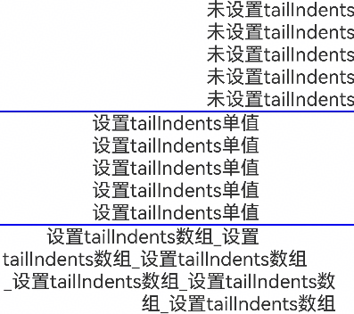
