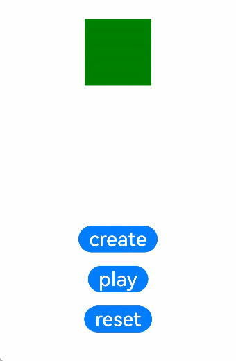

# @ohos.animator (动画)
<!--Kit: ArkUI-->
<!--Subsystem: ArkUI-->
<!--Owner: @hehongyang3-->
<!--Designer: @hehongyang3-->
<!--Tester: @lxl007-->
<!--Adviser: @Brilliantry_Rui-->

本模块提供组件动画效果，包括定义动画、启动动画和以相反的顺序播放动画等。

> **说明：**
>
> - 本模块首批接口从API version 6开始支持。后续版本的新增接口，采用上角标单独标记接口的起始版本。
>
> - 本模块从API version 9开始支持在ArkTS中使用。
>
> - 该模块不支持在[UIAbility](../apis-ability-kit/js-apis-app-ability-uiAbility.md)的文件声明处使用，即不能在UIAbility的生命周期中调用，需要在创建组件实例后使用。
>
> - 本模块功能依赖UI的执行上下文，不可在[UI上下文不明确](../../ui/arkts-global-interface.md#ui上下文不明确)的地方使用，参见[UIContext](arkts-apis-uicontext-uicontext.md)说明。
>
> - 自定义组件中通常会持有一个由[createAnimator](arkts-apis-uicontext-uicontext.md#createanimator)接口返回的[AnimatorResult](#animatorresult)对象，以确保动画对象在动画过程中不被析构，该对象通过回调捕获了自定义组件对象，因此需要在自定义组件销毁时的[aboutToDisappear](./arkui-ts/ts-custom-component-lifecycle.md#abouttodisappear)生命周期中释放动画对象，以避免因循环依赖导致内存泄漏。详细示例可参考：[基于ArkTS扩展的声明式开发范式](#基于arkts扩展的声明式开发范式)。
>
> - Animator对象析构或主动调用[cancel](#cancel)、[finish](#finish)方法时，都会触发一次额外的[onFrame](#属性)，返回值是动画终点值。因此，如果在动画过程中调用[cancel](#cancel)、[finish](#finish)，会导致属性值在一帧内跳变至终点。若希望动画在中途暂停，可先将onFrame设置为空函数，再调用[finish](#finish)。
>
> - 对于无限循环的Animator动画，即使开发者选项中将全局动画速率设置为0（关闭动画），循环动画仍会继续执行。

## 导入模块

```ts
import { Animator as animator, AnimatorOptions, AnimatorResult, SimpleAnimatorOptions } from '@kit.ArkUI';
```

## Animator

定义Animator类。

**原子化服务API：** 从API version 11开始，该接口支持在原子化服务中使用。

**系统能力：**  SystemCapability.ArkUI.ArkUI.Full

### create<sup>(deprecated)</sup>

create(options: AnimatorOptions): AnimatorResult

创建animator动画结果对象（AnimatorResult）。

> **说明：**
> 
> - 从API version 9开始支持，从API version 18开始废弃，建议使用[createAnimator](arkts-apis-uicontext-uicontext.md#createanimator)替代。
>
> - 从API version 10开始，可以通过使用[UIContext](arkts-apis-uicontext-uicontext.md)中的[createAnimator](arkts-apis-uicontext-uicontext.md#createanimator)来明确UI的执行上下文。

**原子化服务API：** 从API version 11开始，该接口支持在原子化服务中使用。

**系统能力：**  SystemCapability.ArkUI.ArkUI.Full

**参数：** 

| 参数名     | 类型                                  | 必填   | 说明      |
| ------- | ----------------------------------- | ---- | ------- |
| options | [AnimatorOptions](#animatoroptions) | 是 | 动画配置选项，包含播放时长、插值曲线、延时、填充模式、播放方向、播放次数及插值起止值等参数。 |

**返回值：** 

| 类型                                | 说明            |
| --------------------------------- | ------------- |
| [AnimatorResult](#animatorresult) | 动画控制对象，可用于设置动画过程中的回调函数。 |

**错误码：**

以下错误码详细介绍请参考[通用错误码](../errorcode-universal.md)。

| 错误码ID | 错误信息 |
| ------- | -------- |
| 401      | Parameter error. Possible causes: 1. Mandatory parameters are left unspecified; 2.Incorrect parameters types; 3. Parameter verification failed.   |

**示例：** 

完整示例请参考[基于ArkTS扩展的声明式开发范式](#基于arkts扩展的声明式开发范式)。

> **说明：**
>
> 推荐通过使用[UIContext](arkts-apis-uicontext-uicontext.md)中的[createAnimator](arkts-apis-uicontext-uicontext.md#createanimator)接口明确UI上下文。

<!--deprecated_code_no_check-->
```ts
import { Animator as animator, AnimatorOptions } from '@kit.ArkUI';

let options: AnimatorOptions = {
  duration: 1500,
  easing: 'friction',
  delay: 0,
  fill: "forwards",
  direction: "normal",
  iterations: 3,
  begin: 200.0,
  end: 400.0
};
animator.create(options); // 建议使用 UIContext.createAnimator()接口
```

### create<sup>18+</sup>

create(options: AnimatorOptions \| SimpleAnimatorOptions): AnimatorResult

创建animator动画结果对象（AnimatorResult）。与[create](#createdeprecated)相比，新增对[SimpleAnimatorOptions](#simpleanimatoroptions18)类型入参的支持。

**原子化服务API：** 从API version 18开始，该接口支持在原子化服务中使用。

**模型约束：** 此接口仅可在Stage模型下使用。

**系统能力：**  SystemCapability.ArkUI.ArkUI.Full

**参数：** 

| 参数名     | 类型                                  | 必填   | 说明      |
| ------- | ----------------------------------- | ---- | ------- |
| options | [AnimatorOptions](#animatoroptions) \| [SimpleAnimatorOptions](#simpleanimatoroptions18) | 是    | 定义动画选项。AnimatorOptions适用于需要完整自定义所有动画参数的场景；SimpleAnimatorOptions适用于仅需指定起点和终点的简易动画场景，其余参数使用默认值。 |

**返回值：** 

| 类型                                | 说明            |
| --------------------------------- | ------------- |
| [AnimatorResult](#animatorresult) | 动画控制对象，可设置动画过程中的回调函数。 |

**错误码**：

以下错误码详细介绍请参考[通用错误码](../errorcode-universal.md)。

| 错误码ID | 错误信息 |
| ------- | -------- |
| 401      | Parameter error. Possible causes: 1. Mandatory parameters are left unspecified; 2.Incorrect parameters types; 3. Parameter verification failed.   |

**示例：**

完整示例请参考[基于ArkTS扩展的声明式开发范式](#基于arkts扩展的声明式开发范式)。

> **说明：**
>
> 推荐通过使用[UIContext](arkts-apis-uicontext-uicontext.md)中的[createAnimator](arkts-apis-uicontext-uicontext.md#createanimator)接口明确UI上下文。

<!--deprecated_code_no_check-->
```ts
import { Animator as animator, SimpleAnimatorOptions } from '@kit.ArkUI';
let options: SimpleAnimatorOptions = new SimpleAnimatorOptions(100, 200).duration(2000);
animator.create(options); // 建议使用 UIContext.createAnimator()接口
```

### createAnimator<sup>(deprecated)</sup>

createAnimator(options: AnimatorOptions): AnimatorResult

创建动画。本模块功能依赖UI的执行上下文，不可在UI上下文不明确的地方使用，推荐通过使用UIContext中的createAnimator接口明确UI上下文。

> **说明：**
> 
> - 从API version 6开始支持，从API version 9开始废弃，建议使用[create](#createdeprecated)替代。
> - 从API version 10开始，可以通过使用[UIContext](arkts-apis-uicontext-uicontext.md)中的[createAnimator](arkts-apis-uicontext-uicontext.md#createanimator)来明确UI的执行上下文。

**系统能力：**  SystemCapability.ArkUI.ArkUI.Full

**参数：** 

| 参数名     | 类型                                  | 必填   | 说明      |
| ------- | ----------------------------------- | ---- | ------- |
| options | [AnimatorOptions](#animatoroptions) | 是 | 动画配置选项，用于定义动画的播放时长、插值曲线、延时、填充模式、播放方向、播放次数及插值起止值等参数。 |

**返回值：** 

| 类型                                | 说明            |
| --------------------------------- | ------------- |
| [AnimatorResult](#animatorresult) | 动画控制对象，可设置动画过程中的回调函数。 |

**示例：** 

完整示例请参考[基于ArkTS扩展的声明式开发范式](#基于arkts扩展的声明式开发范式)。

```ts
import { Animator as animator, AnimatorOptions } from '@kit.ArkUI';

let options: AnimatorOptions = { // xxx.js文件中不需要强调显式类型AnimatorOptions
  duration: 1500,
  easing: "friction",
  delay: 0,
  fill: "forwards",
  direction: "normal",
  iterations: 3,
  begin: 200.0,
  end: 400.0,
};
this.animator = animator.createAnimator(options);
```

## AnimatorResult

定义AnimatorResult接口，提供动画播放状态回调及动画控制方法。

### 属性

**系统能力：**  SystemCapability.ArkUI.ArkUI.Full

| 名称       | 类型                                                        | 只读 | 可选 | 说明                                                         |
| ---------- | ------------------------------ | ---- | ------- | ----------------------------------------------------- |
| onFrame<sup>12+</sup>   | (progress: number) => void                    | 否 | 否   | 接收到帧时回调。<br>progress表示动画的当前值。取值范围为[AnimatorOptions](#animatoroptions)定义的[begin, end]，默认取值范围为[0, 1]。<br>**说明：** 调用cancel、finish方法时，会触发一次额外的onFrame回调，返回值为动画终点值。<br>**原子化服务API：** 从API version 12开始，该接口支持在原子化服务中使用。<br>**模型约束：** 此接口仅可在Stage模型下使用。                        |
| onFinish<sup>12+</sup>   | () => void                    | 否 | 否   | 动画完成时回调。<br>**原子化服务API：** 从API version 12开始，该接口支持在原子化服务中使用。<br>**模型约束：** 此接口仅可在Stage模型下使用。                        |
| onCancel<sup>12+</sup>   | () => void                    | 否 | 否   | 动画被取消时回调。<br>**原子化服务API：** 从API version 12开始，该接口支持在原子化服务中使用。<br>**模型约束：** 此接口仅可在Stage模型下使用。                        |
| onRepeat<sup>12+</sup>   | () => void                    | 否 | 否   | 动画重复时回调。<br>**原子化服务API：** 从API version 12开始，该接口支持在原子化服务中使用。<br>**模型约束：** 此接口仅可在Stage模型下使用。                        |
| onframe<sup>(deprecated)</sup>   | (progress: number) => void                   | 否 | 否   | 接收到帧时回调。<br>**说明：** 从API version 6开始支持，从API version 12开始废弃，推荐使用[onFrame](#属性)。<br>**原子化服务API：** 从API version 11开始，该接口支持在原子化服务中使用。                        |
| onfinish<sup>(deprecated)</sup>   | () => void                 | 否 | 否   | 动画完成时回调。<br>**说明：** 从API version 6开始支持，从API version 12开始废弃，推荐使用[onFinish](#属性)。<br>**原子化服务API：** 从API version 11开始，该接口支持在原子化服务中使用。                        |
| oncancel<sup>(deprecated)</sup>   | () => void                 | 否 | 否   | 动画被取消时回调。<br>**说明：** 从API version 6开始支持，从API version 12开始废弃，推荐使用[onCancel](#属性)。<br>**原子化服务API：** 从API version 11开始，该接口支持在原子化服务中使用。                        |
| onrepeat<sup>(deprecated)</sup>   | () => void                 | 否 | 否   | 动画重复时回调。<br>**说明：** 从API version 6开始支持，从API version 12开始废弃，推荐使用[onRepeat](#属性)。<br>**原子化服务API：** 从API version 11开始，该接口支持在原子化服务中使用。                        |

### reset<sup>9+</sup>

reset(options: AnimatorOptions): void

重置当前animator动画参数。建议在动画未开始播放或播放结束后（[onFinish](#属性)或[onCancel](#属性)回调触发后）调用此方法，重置后需调用[play](#play)方法重新启动动画。

**原子化服务API：** 从API version 11开始，该接口支持在原子化服务中使用。

**系统能力：**  SystemCapability.ArkUI.ArkUI.Full

**参数：** 

| 参数名     | 类型                                  | 必填   | 说明      |
| ------- | ----------------------------------- | ---- | ------- |
| options | [AnimatorOptions](#animatoroptions) | 是 | 动画配置选项，用于定义动画的播放时长、插值曲线、延时、填充模式、播放方向、播放次数及插值起止值等参数。 |

**错误码：**

以下错误码的详细介绍请参考[通用错误码](../errorcode-universal.md)和[接口调用异常错误码](errorcode-internal.md)。

| 错误码ID   | 错误信息 |
| --------- | ------- |
| 401      | Parameter error. Possible causes: 1. Mandatory parameters are left unspecified; 2.Incorrect parameters types; 3. Parameter verification failed.   |
| 100001    | The specified page is not found or the object property list is not obtained. Possible causes: 1. The UI context is not clear or the page is not loaded when calling the reset interface; 2. The animator object's property list is not properly obtained. |


**示例：**

```ts
import { AnimatorResult } from '@kit.ArkUI';

@Entry
@Component
struct AnimatorTest {
  private animatorResult: AnimatorResult | undefined = undefined;

  create() {
    this.animatorResult = this.getUIContext().createAnimator({
      duration: 1500,
      easing: "friction",
      delay: 0,
      fill: "forwards",
      direction: "normal",
      iterations: 3,
      begin: 200.0,
      end: 400.0
    })
    this.animatorResult.reset({
      duration: 1500,
      easing: "friction",
      delay: 0,
      fill: "forwards",
      direction: "normal",
      iterations: 5,
      begin: 200.0,
      end: 400.0
    });
  }

  build() {
    // ...
  }
}
```

### reset<sup>18+</sup>

reset(options: AnimatorOptions \| SimpleAnimatorOptions): void

重置当前animator动画参数。与[reset](#reset9)相比，新增对[SimpleAnimatorOptions](#simpleanimatoroptions18)类型入参的支持。建议在动画未开始播放或播放结束后（[onFinish](#属性)或[onCancel](#属性)回调触发后）调用此方法，重新设置动画参数后调用[play](#play)启动新动画。

**原子化服务API：** 从API version 18开始，该接口支持在原子化服务中使用。

**模型约束：** 此接口仅可在Stage模型下使用。

**系统能力：**  SystemCapability.ArkUI.ArkUI.Full

**参数：** 

| 参数名     | 类型                                  | 必填   | 说明      |
| ------- | ----------------------------------- | ---- | ------- |
| options | [AnimatorOptions](#animatoroptions) \| [SimpleAnimatorOptions](#simpleanimatoroptions18) | 是    | 定义动画选项。 |

**错误码：**

以下错误码的详细介绍请参考[通用错误码](../errorcode-universal.md)和[接口调用异常错误码](errorcode-internal.md)。

| 错误码ID   | 错误信息 |
| --------- | ------- |
| 401      | Parameter error. Possible causes: 1. Mandatory parameters are left unspecified; 2.Incorrect parameters types; 3. Parameter verification failed.   |
| 100001    | The specified page is not found or the object property list is not obtained.|

**示例：**

完整示例请参考[基于ArkTS扩展的声明式开发范式](#基于arkts扩展的声明式开发范式)。

<!--deprecated_code_no_check-->
```ts
import { Animator as animator, AnimatorResult, AnimatorOptions, SimpleAnimatorOptions } from '@kit.ArkUI';

let options: AnimatorOptions = {
  duration: 1500,
  easing: 'ease',
  delay: 0,
  fill: "forwards",
  direction: "normal",
  iterations: 1,
  begin: 100,
  end: 200
};
let optionsNew: SimpleAnimatorOptions = new SimpleAnimatorOptions(100, 200)
  .duration(2000)
  .iterations(3)
  .delay(1000);
let animatorResult: AnimatorResult = animator.create(options);
animatorResult.reset(optionsNew);
```

### play

play(): void

启动动画。动画暂停后调用此方法可恢复播放。动画会保留上一次的播放状态，比如播放状态设置reverse后，再次播放会保留reverse的播放状态。动画结束后（[onFinish](#属性)或[onCancel](#属性)回调触发后）可再次调用此方法重新播放动画。

**原子化服务API：** 从API version 11开始，该接口支持在原子化服务中使用。

**系统能力：**  SystemCapability.ArkUI.ArkUI.Full

**示例：**

完整示例请参考[基于ArkTS扩展的声明式开发范式](#基于arkts扩展的声明式开发范式)。

```ts
// animator需先通过this.getUIContext().createAnimator()获取AnimatorResult对象
animator.play();
```

### finish

finish(): void

结束动画，会触发[onFinish](#属性)回调。与[cancel](#cancel)方法功能相同，但cancel()触发[onCancel](#属性)回调，建议使用finish方法结束动画。调用此方法时会触发一次额外的[onFrame](#属性)回调，返回值是动画终点值，可能导致属性值在一帧内跳变至终点。若希望动画在中途暂停，可先将onFrame设置为空函数，再调用finish。

**原子化服务API：** 从API version 11开始，该接口支持在原子化服务中使用。

**系统能力：**  SystemCapability.ArkUI.ArkUI.Full

**示例：**

完整示例请参考[基于ArkTS扩展的声明式开发范式](#基于arkts扩展的声明式开发范式)。

```ts
// animator需先通过this.getUIContext().createAnimator()获取AnimatorResult对象
animator.finish();
```

### pause

pause(): void

暂停动画。暂停后可调用[play](#play)方法恢复播放，也可调用[finish](#finish)或[cancel](#cancel)方法结束动画。

**原子化服务API：** 从API version 11开始，该接口支持在原子化服务中使用。

**系统能力：**  SystemCapability.ArkUI.ArkUI.Full

**示例：**

完整示例请参考[基于ArkTS扩展的声明式开发范式](#基于arkts扩展的声明式开发范式)。

```ts
// animator需先通过this.getUIContext().createAnimator()获取AnimatorResult对象
animator.pause();
```

### cancel

cancel(): void

取消动画，会触发[onCancel](#属性)回调。此接口和[finish](#finish)接口功能上没有区别，仅触发的回调不同，建议使用finish接口结束动画。调用此方法时会触发一次额外的[onFrame](#属性)回调，返回值是动画终点值，可能导致属性值在一帧内跳变至终点。

**原子化服务API：** 从API version 11开始，该接口支持在原子化服务中使用。

**系统能力：**  SystemCapability.ArkUI.ArkUI.Full

**示例：**

完整示例请参考[基于ArkTS扩展的声明式开发范式](#基于arkts扩展的声明式开发范式)。

```ts
// animator需先通过this.getUIContext().createAnimator()获取AnimatorResult对象
animator.cancel();
```

### reverse

reverse(): void

以相反的顺序播放动画。使用interpolating-spring曲线时此接口无效。调用reverse后动画将以相反方向继续播放，可通过[pause](#pause)暂停或[finish](#finish)结束动画。

**原子化服务API：** 从API version 11开始，该接口支持在原子化服务中使用。

**系统能力：**  SystemCapability.ArkUI.ArkUI.Full

**示例：**

完整示例请参考[基于ArkTS扩展的声明式开发范式](#基于arkts扩展的声明式开发范式)。

```ts
// animator需先通过this.getUIContext().createAnimator()获取AnimatorResult对象
animator.reverse();
```

### setExpectedFrameRateRange<sup>12+</sup>

setExpectedFrameRateRange(rateRange: ExpectedFrameRateRange): void

设置期望的帧率范围，包含最小、最大和期望帧率值。

**原子化服务API：** 从API version 12开始，该接口支持在原子化服务中使用。

**模型约束：** 此接口仅可在Stage模型下使用。

**系统能力：**  SystemCapability.ArkUI.ArkUI.Full

**参数：** 

| 参数名           | 类型                                       | 必填 | 说明                          |
| --------------- | ------------------------------------------ | ---- | -----------------------------|
| rateRange       | [ExpectedFrameRateRange](../apis-arkui/arkui-ts/ts-explicit-animation.md#expectedframeraterange11)| 是   | 设置期望的帧率范围。|

> **说明：**
>
> 开发者通过设置有效的期望帧率后，系统会收集设置的请求帧率，进行决策和分发，在渲染管线上进行分频，尽量能够满足开发者的期望帧率。开发者设置的期望帧率值不能代表最终实际效果，会受限于系统能力和屏幕刷新率。

**示例：**

```ts
import { AnimatorResult } from '@kit.ArkUI';

let expectedFrameRate: ExpectedFrameRateRange = {
  min: 0,
  max: 120,
  expected: 30
}

@Entry
@Component
struct AnimatorTest {
  private backAnimator: AnimatorResult | undefined = undefined;

  create() {
    this.backAnimator = this.getUIContext().createAnimator({
      duration: 2000,
      easing: "ease",
      delay: 0,
      fill: "forwards",
      direction: "normal",
      iterations: 1,
      begin: 100, // 动画插值起点
      end: 200 // 动画插值终点
    })
    this.backAnimator.setExpectedFrameRateRange(expectedFrameRate);
  }

  build() {
    // ...
  }
}
```

### update<sup>(deprecated)</sup>

update(options: AnimatorOptions): void

更新当前animator动画参数。

> **说明：**  
>
> 从API version 6开始支持，从API version 9开始废弃。建议使用[reset](#reset9)替代。

**系统能力：**  SystemCapability.ArkUI.ArkUI.Full

**参数：** 

| 参数名     | 类型                                  | 必填   | 说明      |
| ------- | ----------------------------------- | ---- | ------- |
| options | [AnimatorOptions](#animatoroptions) | 是 | 动画配置选项，用于定义动画的播放时长、插值曲线、延时、填充模式、播放方向、播放次数及插值起止值等参数。 |

**示例：**

完整示例请参考[基于ArkTS扩展的声明式开发范式](#基于arkts扩展的声明式开发范式)。

```ts
// animator需先通过this.getUIContext().createAnimator()获取AnimatorResult对象
animator.update(options);
```

## AnimatorOptions

定义动画选项。

**原子化服务API：** 从API version 11开始，该接口支持在原子化服务中使用。

**系统能力：**  SystemCapability.ArkUI.ArkUI.Full

### 属性

| 名称       | 类型                                                        | 只读 | 可选 | 说明                                                         |
| ---------- | ----------------------------------------------------------- | ---- | ------- | ----------------------------------------------------- |
| duration   | number                                                      | 否 | 否   | 动画播放的时长，单位毫秒。<br>取值范围：[0, +∞)<br>默认值：0<br>**说明：** 使用interpolating-spring曲线时，duration不生效，由弹簧参数决定。                         |
| easing     | string                                                      | 否 | 否   | 动画插值曲线，支持的曲线类型可参考表1。<br>非法字符串时取："ease"。 |
| delay      | number                                                      | 否 | 否   | 动画延时播放时长，单位毫秒，设置为0时，表示不延时。设置为负数时动画提前播放，如果提前播放的时长大于动画总时长（由duration和iterations参数共同决定），动画直接过渡到终点。 <br>默认值：0        |
| fill       | 'none' \| 'forwards' \| 'backwards' \| 'both'               | 否 | 否   | 动画填充模式，决定动画执行前（delay期间）和执行后是否将关键帧样式应用到目标上。<br>'none'：在动画执行之前和之后都不会应用任何样式到目标上。<br>'forwards'：在动画结束后，目标将保留动画结束时的状态（在最后一个关键帧中定义）。<br>'backwards'：动画将在[AnimatorOptions](#animatoroptions)中的delay期间应用第一个关键帧中定义的值。当[AnimatorOptions](#animatoroptions)中的direction为'normal'或'alternate'时应用from关键帧中的值，当[AnimatorOptions](#animatoroptions)中的direction为'reverse'或'alternate-reverse'时应用to关键帧中的值。<br>'both'：动画将遵循forwards和backwards的规则，从而在两个方向上扩展动画属性。 |
| direction  | 'normal' \| 'reverse' \| 'alternate' \| 'alternate-reverse' | 否 | 否   | 动画播放方向。<br>'normal'： 动画正向循环播放。<br>'reverse'： 动画反向循环播放。<br>'alternate'：动画交替循环播放，奇数次正向播放，偶数次反向播放。<br>'alternate-reverse'：动画反向交替循环播放，奇数次反向播放，偶数次正向播放。<br>默认值：'normal'<br>**说明：** 使用interpolating-spring曲线时，direction固定设置为'normal'，其他设置无效。 |
| iterations | number                                                      | 否 | 否   | 动画播放次数。设置为0时不播放，设置为-1时无限次播放，设置大于0时为播放次数。<br>**说明：** 使用interpolating-spring曲线时，iterations固定设置为1，其他设置无效。<br>**说明:** 设置为除-1外其他负数视为无效取值，无效取值动画默认播放1次。 |
| begin      | number                                                      | 否 | 否   | 动画插值起点。<br>**说明:** 会影响[onFrame](#属性)回调的入参值。<br>默认值：0                                              |
| end        | number                                                      | 否 | 否   | 动画插值终点。<br>**说明:** 会影响[onFrame](#属性)回调的入参值。   <br>默认值：1                                            |

**表1 支持的曲线类型：** 

| 类型       | 说明                                                       |
| ---------- | ----------------------------------------------------- |
| "linear"    | 动画线性变化。 |
| "ease" | 动画开始和结束时的速度较慢，cubic-bezier(0.25, 0.1, 0.25, 1.0)。 |
| "ease-in" | 动画播放速度先慢后快，cubic-bezier(0.42, 0.0, 1.0, 1.0)。|
| "ease-out" | 动画播放速度先快后慢，cubic-bezier(0.0, 0.0, 0.58, 1.0)。|
| "ease-in-out" | 动画播放速度先加速后减速，cubic-bezier(0.42, 0.0, 0.58, 1.0)。 |
| "fast-out-slow-in" | 标准曲线，cubic-bezier(0.4, 0.0, 0.2, 1.0)。 |
| "linear-out-slow-in" | 减速曲线，cubic-bezier(0.0, 0.0, 0.2, 1.0)。 |
| "fast-out-linear-in" | 加速曲线，cubic-bezier(0.4, 0.0, 1.0, 1.0)。 |
| "friction" | 阻尼曲线，cubic-bezier(0.2, 0.0, 0.2, 1.0)。 |
| "extreme-deceleration" | 急缓曲线，cubic-bezier(0.0, 0.0, 0.0, 1.0)。 |
| "rhythm" | 节奏曲线，cubic-bezier(0.7, 0.0, 0.2, 1.0)。 |
| "sharp" | 锐利曲线，cubic-bezier(0.33, 0.0, 0.67, 1.0)。 |
| "smooth" | 平滑曲线，cubic-bezier(0.4, 0.0, 0.4, 1.0)。 |
| "cubic-bezier(x1, y1, x2, y2)" | 三次贝塞尔曲线，x1、x2的值必须处于0-1之间。例如"cubic-bezier(0.42, 0.0, 0.58, 1.0)"。 |
| "steps(number, step-position)" | 阶梯曲线，number必须设置，为正整数，step-position参数可选，支持设置start或end，默认值为end。例如"steps(3, start)"。 |
| interpolating-spring(velocity, mass, stiffness, damping) | 插值弹簧曲线。<br>velocity、mass、stiffness、damping都是数值类型，且mass、stiffness、damping参数均必须大于0，具体参数含义参考插值弹簧曲线[curves.interpolatingSpring](./js-apis-curve.md#curvesinterpolatingspring10)。<br>使用interpolating-spring时，duration不生效，由弹簧参数决定；fill、direction、iterations设置无效，fill固定设置为"forwards"，direction固定设置为"normal"，iterations固定设置为1，且对animator的[reverse](#reverse)函数调用无效。即animator使用interpolating-spring时只能正向播放1次。<br>从API version 11开始支持且仅在ArkTS中支持使用。|

## SimpleAnimatorOptions<sup>18+</sup>

animator简易动画参数对象。与AnimatorOptions相比，duration、easing、delay、fill、direction、iterations等动画参数有默认值，可不设置。

### constructor<sup>18+</sup>

constructor(begin: number, end: number)

创建SimpleAnimatorOptions实例，指定动画插值起点和终点。

**原子化服务API：** 从API version 18开始，该接口支持在原子化服务中使用。

**模型约束：** 此接口仅可在Stage模型下使用。

**系统能力：**  SystemCapability.ArkUI.ArkUI.Full

**参数：** 

| 参数名       | 类型                                                        | 必填 | 说明                                                         |
| ---------- | ----------------------------------------------------------- | ---- | ------------------------------------------------------------ |
|  begin      | number                                                      | 是   | 动画插值起点。<br>**说明：** 会影响[onFrame](#属性)回调的入参值，与end参数共同决定onFrame回调值的范围。                                               |
|  end        | number                                                      | 是   | 动画插值终点。<br>**说明:** 会影响[onFrame](#属性)回调的入参值，与begin参数共同决定onFrame回调值的范围。                                               |

**示例：**

完整示例请参考[基于ArkTS扩展的声明式开发范式](#基于arkts扩展的声明式开发范式)。

```ts
import { AnimatorResult, SimpleAnimatorOptions } from '@kit.ArkUI';

@Entry
@Component
struct AnimatorTest {
  private animatorResult: AnimatorResult | undefined = undefined;
  options: SimpleAnimatorOptions = new SimpleAnimatorOptions(100, 200); // 动画插值过程从100到200，其余动画参数使用默认值。

  create() {
    this.animatorResult = this.getUIContext().createAnimator(this.options);
  }

  build() {
    // ......
  }
}
```

### duration<sup>18+</sup>

duration(duration: number): SimpleAnimatorOptions

设置animator动画时长。 

**原子化服务API：** 从API version 18开始，该接口支持在原子化服务中使用。

**模型约束：** 此接口仅可在Stage模型下使用。

**系统能力：**  SystemCapability.ArkUI.ArkUI.Full

**参数：** 

| 参数名     | 类型                                  | 必填   | 说明      |
| ------- | ----------------------------------- | ---- | ------- |
| duration | number | 是    | 设置动画播放的时长，单位毫秒。<br>默认值：1000<br>**说明：** 使用interpolating-spring曲线时，duration不生效，由弹簧参数决定。 |

**返回值：** 

| 类型                                | 说明            |
| --------------------------------- | ------------- |
| [SimpleAnimatorOptions](#simpleanimatoroptions18) | 返回当前简易动画参数对象，支持链式调用以继续配置动画参数。 |

**示例：**

完整示例请参考[基于ArkTS扩展的声明式开发范式](#基于arkts扩展的声明式开发范式)。

```ts
import { AnimatorResult, SimpleAnimatorOptions } from '@kit.ArkUI';

@Entry
@Component
struct AnimatorTest {
  private animatorResult: AnimatorResult | undefined = undefined;
  options: SimpleAnimatorOptions = new SimpleAnimatorOptions(100, 200).duration(500);

  create() {
    this.animatorResult = this.getUIContext().createAnimator(this.options);
  }

  build() {
    // ......
  }
}
```

### easing<sup>18+</sup>

easing(curve: string): SimpleAnimatorOptions

设置animator动画插值曲线。

**原子化服务API：** 从API version 18开始，该接口支持在原子化服务中使用。

**模型约束：** 此接口仅可在Stage模型下使用。

**系统能力：**  SystemCapability.ArkUI.ArkUI.Full

**参数：** 

| 参数名     | 类型                                  | 必填   | 说明      |
| ------- | ----------------------------------- | ---- | ------- |
| curve | string | 是    | 设置animator动画插值曲线，具体说明参考[AnimatorOptions](#animatoroptions)。<br>默认值：“ease” |

**返回值：** 

| 类型                                | 说明            |
| --------------------------------- | ------------- |
| [SimpleAnimatorOptions](#simpleanimatoroptions18) | 返回当前简易动画参数对象，支持链式调用以继续配置动画参数。 |

**示例：**

完整示例请参考[基于ArkTS扩展的声明式开发范式](#基于arkts扩展的声明式开发范式)。

```ts
import { AnimatorResult, SimpleAnimatorOptions } from '@kit.ArkUI';

@Entry
@Component
struct AnimatorTest {
  private animatorResult: AnimatorResult | undefined = undefined;
  options: SimpleAnimatorOptions = new SimpleAnimatorOptions(100, 200).easing("ease-in");

  create() {
    this.animatorResult = this.getUIContext().createAnimator(this.options);
  }

  build() {
    // ......
  }
}
```

### delay<sup>18+</sup>

delay(delay: number): SimpleAnimatorOptions

设置animator动画延时播放时长。

**原子化服务API：** 从API version 18开始，该接口支持在原子化服务中使用。

**模型约束：** 此接口仅可在Stage模型下使用。

**系统能力：**  SystemCapability.ArkUI.ArkUI.Full

**参数：** 

| 参数名     | 类型                                  | 必填   | 说明      |
| ------- | ----------------------------------- | ---- | ------- |
| delay | number | 是    | 设置animator动画播放时延，单位毫秒，设置为0时，表示不延时。设置为负数时动画提前播放，如果提前播放的时长大于动画总时长，动画直接过渡到终点。<br>默认值：0 |

**返回值：** 

| 类型                                | 说明            |
| --------------------------------- | ------------- |
| [SimpleAnimatorOptions](#simpleanimatoroptions18) | 返回当前简易动画参数对象，支持链式调用以继续配置动画参数。 |

**示例：**

完整示例请参考[基于ArkTS扩展的声明式开发范式](#基于arkts扩展的声明式开发范式)。

```ts
import { AnimatorResult, SimpleAnimatorOptions } from '@kit.ArkUI';

@Entry
@Component
struct AnimatorTest {
  private animatorResult: AnimatorResult | undefined = undefined;
  options: SimpleAnimatorOptions = new SimpleAnimatorOptions(100, 200).delay(500);

  create() {
    this.animatorResult = this.getUIContext().createAnimator(this.options);
  }

  build() {
    // ......
  }
}
```

### fill<sup>18+</sup>

fill(fillMode: FillMode): SimpleAnimatorOptions

设置animator动画填充方式。使用interpolating-spring曲线时，此设置无效，fill固定设置为FillMode.Forwards。

**原子化服务API：** 从API version 18开始，该接口支持在原子化服务中使用。

**模型约束：** 此接口仅可在Stage模型下使用。

**系统能力：**  SystemCapability.ArkUI.ArkUI.Full

**参数：** 

| 参数名     | 类型                                  | 必填   | 说明      |
| ------- | ----------------------------------- | ---- | ------- |
| fillMode | [FillMode](./arkui-ts/ts-appendix-enums.md#fillmode) | 是    | 设置animator动画填充方式，影响动画delay期间和结束时的表现。使用interpolating-spring曲线时，fill设置无效，固定设置为FillMode.Forwards。<br>默认值：FillMode.Forwards |

**返回值：** 

| 类型                                | 说明            |
| --------------------------------- | ------------- |
| [SimpleAnimatorOptions](#simpleanimatoroptions18) | 返回当前简易动画参数对象，支持链式调用以继续配置动画参数。 |

**示例：**

完整示例请参考[基于ArkTS扩展的声明式开发范式](#基于arkts扩展的声明式开发范式)。

```ts
import { AnimatorResult, SimpleAnimatorOptions } from '@kit.ArkUI';

@Entry
@Component
struct AnimatorTest {
  private animatorResult: AnimatorResult | undefined = undefined;
  options: SimpleAnimatorOptions = new SimpleAnimatorOptions(100, 200).fill(FillMode.Forwards);

  create() {
    this.animatorResult = this.getUIContext().createAnimator(this.options);
  }

  build() {
    // ......
  }
}
```

### direction<sup>18+</sup>

direction(direction: PlayMode): SimpleAnimatorOptions

设置animator动画播放模式。使用interpolating-spring曲线时，此设置无效，direction固定设置为PlayMode.Normal。

**原子化服务API：** 从API version 18开始，该接口支持在原子化服务中使用。

**模型约束：** 此接口仅可在Stage模型下使用。

**系统能力：**  SystemCapability.ArkUI.ArkUI.Full

**参数：** 

| 参数名     | 类型                                  | 必填   | 说明      |
| ------- | ----------------------------------- | ---- | ------- |
| direction | [PlayMode](./arkui-ts/ts-appendix-enums.md#playmode) | 是    | 设置animator动画播放方向。<br>PlayMode.Normal：动画正向循环播放。<br>PlayMode.Reverse：动画反向循环播放。<br>PlayMode.Alternate：动画交替循环播放，奇数次正向播放，偶数次反向播放。<br>PlayMode.AlternateReverse：动画反向交替循环播放，奇数次反向播放，偶数次正向播放。<br>默认值：PlayMode.Normal |

**返回值：** 

| 类型                                | 说明            |
| --------------------------------- | ------------- |
| [SimpleAnimatorOptions](#simpleanimatoroptions18) | 返回当前简易动画参数对象，支持链式调用以继续配置动画参数。 |

**示例：**

完整示例请参考[基于ArkTS扩展的声明式开发范式](#基于arkts扩展的声明式开发范式)。

```ts
import { AnimatorResult, SimpleAnimatorOptions } from '@kit.ArkUI';

@Entry
@Component
struct AnimatorTest {
  private animatorResult: AnimatorResult | undefined = undefined;
  options: SimpleAnimatorOptions = new SimpleAnimatorOptions(100, 200).direction(PlayMode.Alternate);

  create() {
    this.animatorResult = this.getUIContext().createAnimator(this.options);
  }

  build() {
    // ......
  }
}
```

### iterations<sup>18+</sup>

iterations(iterations: number): SimpleAnimatorOptions

设置animator动画播放次数。

**原子化服务API：** 从API version 18开始，该接口支持在原子化服务中使用。

**模型约束：** 此接口仅可在Stage模型下使用。

**系统能力：**  SystemCapability.ArkUI.ArkUI.Full

**参数：** 

| 参数名     | 类型                                  | 必填   | 说明      |
| ------- | ----------------------------------- | ---- | ------- |
| iterations | number | 是    | 设置animator动画播放次数，设置为0时不播放，设置为-1时无限次播放，设置大于0时为播放次数。<br>**说明：** 设置为除-1外其他负数视为无效取值，无效取值动画默认播放1次。<br>默认值：1<br>使用interpolating-spring曲线时，iterations设置无效，固定设置为1。 |

**返回值：** 

| 类型                                | 说明            |
| --------------------------------- | ------------- |
| [SimpleAnimatorOptions](#simpleanimatoroptions18) | 返回当前简易动画参数对象，支持链式调用以继续配置动画参数。 |

**示例：**

完整示例请参考[基于ArkTS扩展的声明式开发范式](#基于arkts扩展的声明式开发范式)。

```ts
import { AnimatorResult, SimpleAnimatorOptions } from '@kit.ArkUI';

@Entry
@Component
struct AnimatorTest {
  private animatorResult: AnimatorResult | undefined = undefined;
  options: SimpleAnimatorOptions = new SimpleAnimatorOptions(100, 200).iterations(3);

  create() {
    this.animatorResult = this.getUIContext().createAnimator(this.options);
  }

  build() {
    // ......
  }
}
```

## 完整示例
### 基于JS扩展的类Web开发范式

```html
<!-- hml -->
<div class="container">
  <div class="Animation" style="height: {{divHeight}}px; width: {{divWidth}}px; background-color: red;" onclick="Show">
  </div>
</div>
```

<!--code_no_check-->
<!--deprecated_code_no_check-->
```ts
import { Animator as animator, AnimatorResult, AnimatorOptions } from '@kit.ArkUI';
import { BusinessError } from '@kit.BasicServicesKit';

let DataTmp: Record<string, Animator> = {
  'divWidth': 200,
  'divHeight': 200,
  'animator': animator
}

class Tmp {
  data: animator = DataTmp
  onInit: Function = () => {
  }
  show: Function = () => {
  }
}

class AnimatorState {
  divWidth: number = 0
  divHeight: number = 0
  animator: AnimatorResult | null = null
}

(Fn: (v: Tmp) => void) => {
  Fn({
    data: DataTmp,
    onInit() {
      let options: AnimatorOptions = {
        duration: 1500,
        easing: "friction",
        delay: 0,
        fill: "forwards",
        direction: "normal",
        iterations: 2,
        begin: 200.0,
        end: 400.0
      };
      let animatorState: AnimatorState = {
        divWidth: 200,
        divHeight: 200,
        animator: null
      }
      animatorState.animator = animator.create(options);
    },
    show() {
      let resetOptions: AnimatorOptions = {
        duration: 1500,
        easing: "friction",
        delay: 0,
        fill: "forwards",
        direction: "normal",
        iterations: 2,
        begin: 0,
        end: 400.0,
      };
      let animatorState: AnimatorState = {
        divWidth: 200,
        divHeight: 200,
        animator: null
      }
      try {
        animatorState.animator = animator.create(resetOptions);
        animatorState.animator.reset(resetOptions);
      } catch (error) {
        let message = (error as BusinessError).message
        let code = (error as BusinessError).code
        console.error(`Animator reset failed. Code: ${code}, message: ${message}`);
      }
      let _this = animatorState;
      if (animatorState.animator) {
        animatorState.animator.onFrame = (value: number) => {
          _this.divWidth = value;
          _this.divHeight = value;
        };
        animatorState.animator.play();
      }
    }
  })
}
```

  

### 基于ArkTS扩展的声明式开发范式

> **说明：**
>
> 推荐通过使用[UIContext](arkts-apis-uicontext-uicontext.md)中的[createAnimator](arkts-apis-uicontext-uicontext.md#createanimator)接口明确UI上下文。

<!--deprecated_code_no_check-->
```ts
import { AnimatorResult } from '@kit.ArkUI';

@Entry
@Component
struct AnimatorTest {
  private TAG: string = '[AnimatorTest]'
  private backAnimator: AnimatorResult | undefined = undefined
  private flag: boolean = false
  @State columnWidth: number = 100
  @State columnHeight: number = 100

  create() {
    this.backAnimator = this.getUIContext().createAnimator({
    // 建议使用 this.getUIContext().createAnimator()接口
      duration: 2000,
      easing: "ease",
      delay: 0,
      fill: "forwards",
      direction: "normal",
      iterations: 1,
      begin: 100, // 动画插值起点
      end: 200 // 动画插值终点
    })
    this.backAnimator.onFinish = () => {
      this.flag = true;
      console.info(this.TAG, 'backAnimator onFinish');
    }
    this.backAnimator.onRepeat = () => {
      console.info(this.TAG, 'backAnimator repeat');
    }
    this.backAnimator.onCancel = () => {
      console.info(this.TAG, 'backAnimator cancel');
    }
    this.backAnimator.onFrame = (value: number) => {
      this.columnWidth = value;
      this.columnHeight = value;
    }
  }

  aboutToDisappear() {
    // 自定义组件消失时调用finish使未完成的动画结束，避免动画继续运行。
    // 由于backAnimator在onFrame中引用了this, this中保存了backAnimator，
    // 在自定义组件消失时应该将保存在组件中的backAnimator置空，避免内存泄漏
    this.backAnimator?.finish();
    this.backAnimator = undefined;
  }

  build() {
    Column() {
      Column() {
        Column()
          .width(this.columnWidth)
          .height(this.columnHeight)
          .backgroundColor(Color.Blue)
      }
      .width('100%')
      .height(300)

      Column() {
        Row() {
          Button('create')
            .fontSize(30)
            .fontColor(Color.Black)
            .onClick(() => {
              this.create()
            })
        }
        .padding(10)

        Row() {
          Button('play')
            .fontSize(30)
            .fontColor(Color.Black)
            .onClick(() => {
              this.flag = false
              if (this.backAnimator) {
                this.backAnimator.play()
              }
            })
        }
        .padding(10)

        Row() {
          Button('pause')
            .fontSize(30)
            .fontColor(Color.Black)
            .onClick(() => {
              if (this.backAnimator) {
                this.backAnimator.pause()
              }
            })
        }
        .padding(10)

        Row() {
          Button('finish')
            .fontSize(30)
            .fontColor(Color.Black)
            .onClick(() => {
              this.flag = true
              if (this.backAnimator) {
                this.backAnimator.finish()
              }
            })
        }
        .padding(10)

        Row() {
          Button('reverse')
            .fontSize(30)
            .fontColor(Color.Black)
            .onClick(() => {
              this.flag = false
              if (this.backAnimator) {
                this.backAnimator.reverse()
              }
            })
        }
        .padding(10)

        Row() {
          Button('cancel')
            .fontSize(30)
            .fontColor(Color.Black)
            .onClick(() => {
              if (this.backAnimator) {
                this.backAnimator.cancel()
              }
            })
        }
        .padding(10)

        Row() {
          Button('reset')
            .fontSize(30)
            .fontColor(Color.Black)
            .onClick(() => {
              if (this.flag) {
                this.flag = false
                if (this.backAnimator) {
                  this.backAnimator.reset({
                    duration: 3000,
                    easing: "ease-in",
                    delay: 0,
                    fill: "forwards",
                    direction: "alternate",
                    iterations: 3,
                    begin: 100,
                    end: 300
                  })
                }
              } else {
                console.info(this.TAG, 'Animation not ended')
              }
            })
        }
        .padding(10)
      }
    }
  }
}
```


### 位移动画示例（简易入参）

```ts
import { AnimatorResult, SimpleAnimatorOptions } from '@kit.ArkUI';

@Entry
@Component
struct AnimatorTest {
  private TAG: string = '[AnimatorTest]'
  private backAnimator: AnimatorResult | undefined = undefined
  private flag: boolean = false
  @State translateX: number = 0

  create() {
    this.backAnimator = this.getUIContext()?.createAnimator(
      new SimpleAnimatorOptions(0, 100)
    )
    this.backAnimator.onFinish = () => {
      this.flag = true
      console.info(this.TAG, 'backAnimator onFinish')
    }
    this.backAnimator.onFrame = (value: number) => {
      this.translateX = value
    }
  }

  aboutToDisappear() {
    // 自定义组件消失时调用finish使未完成的动画结束，避免动画继续运行。
    // 由于backAnimator在onFrame中引用了this, this中保存了backAnimator，
    // 在自定义组件消失时应该将保存在组件中的backAnimator置空，避免内存泄漏
    this.backAnimator?.finish();
    this.backAnimator = undefined;
  }

  build() {
    Column() {
      Column() {
        Column()
          .width(100)
          .height(100)
          .translate({x: this.translateX})
          .backgroundColor(Color.Green)
      }
      .width('100%')
      .height(300)

      Column() {
        Column() {
          Button('create')
            .fontSize(30)
            .fontColor(Color.White)
            .onClick(() => {
              this.create()
            })
        }
        .padding(10)

        Column() {
          Button('play')
            .fontSize(30)
            .fontColor(Color.White)
            .onClick(() => {
              this.flag = false
              if(this.backAnimator){
                this.backAnimator.play()
              }
            })
        }
        .padding(10)

        Column() {
          Button('reset')
            .fontSize(30)
            .fontColor(Color.White)
            .onClick(() => {
              if (this.flag) {
                this.flag = false
                if(this.backAnimator){
                  this.backAnimator.reset(
                    new SimpleAnimatorOptions(0, -100)
                      .duration(2000)
                      .easing("ease-in")
                      .fill(FillMode.Forwards)
                      .direction(PlayMode.Alternate)
                      .iterations(2)
                  )
                }
              } else {
                console.info(this.TAG, 'Animation not ended')
              }
            })
        }
        .padding(10)
      }
    }
  }
}
```


