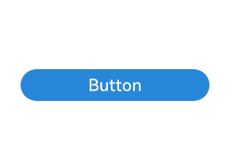
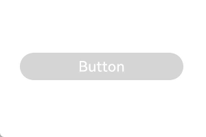

# AttributeUpdater

将属性直接设置给组件，无需标记为状态变量即可直接触发UI更新。

> **说明：**
>
> 从API version 12开始支持。后续版本如有新增内容，则采用上角标单独标记该内容的起始版本。
>


## 导入模块

```ts
import { AttributeUpdater } from '@kit.ArkUI';
```

>  **使用说明：**
>  
>  1. 由于与属性方法同时设置或者在AttributeUpdater中实现applyNormalAttribute等方法时，涉及到与状态管理更新机制同时使用，易出现混淆，因此不建议在同一组件上同时用两种方法设置相同属性。
>  
>  2. 当与属性方法同时设置时，属性生效的原则为：后设置的生效。
>  若先进行属性直通更新，后通过状态管理机制更新属性方法，则后更新的属性方法生效；
>  若先通过状态管理机制更新属性方法，后进行属性直通更新，则属性直通更新生效。
>  
>  3. 一个AttributeUpdater对象只能同时关联一个组件，否则将出现设置的属性只在一个组件上生效的现象。
>  
>  4. 开发者需要自行保障AttributeUpdater中T和C的类型匹配。比如T为ImageAttribute，C要对应为ImageInterface，否则可能导致
>  使用updateConstructorParams时功能异常。
>  
>  5. updateConstructorParams当前只支持Button，Image，Text，Span，SymbolSpan和ImageSpan组件。
>  
>  6. AttributeUpdater不支持深浅色切换等状态管理相关的操作。

## Initializer
type Initializer\<T> = () => T

可以将属性更新到本地的修饰器。

**原子化服务API：** 从API version 12开始，该接口支持在原子化服务中使用。

**系统能力：** SystemCapability.ArkUI.ArkUI.Full

## AttributeUpdater<T, C = Initializer\<T>>
为[AttributeModifier](arkui-ts/ts-universal-attributes-attribute-modifier.md#attributemodifiert)的实现类，开发者需要自定义class继承AttributeUpdater。

其中C代表组件的构造函数类型，比如Text组件的TextInterface，Image组件的ImageInterface等，仅在使用updateConstructorParams时才需要传递C类型。

**系统能力：** SystemCapability.ArkUI.ArkUI.Full

### applyNormalAttribute
applyNormalAttribute?(instance: T): void

定义正常态更新属性函数。

**原子化服务API：** 从API version 12开始，该接口支持在原子化服务中使用。

**系统能力：** SystemCapability.ArkUI.ArkUI.Full

**参数：**

| 参数名 | 类型   | 必填 | 说明                                                                     |
| ------ | ------ | ---- | ------------------------------------------------------------------------ |
| instance | T | 是 | 组件的属性类，用来标识进行属性设置的组件的类型，比如Button组件的ButtonAttribute，Text组件的TextAttribute等。|

### initializeModifier
initializeModifier(instance: T): void

AttributeUpdater首次设置给组件时提供的样式。

**原子化服务API：** 从API version 12开始，该接口支持在原子化服务中使用。

**系统能力：** SystemCapability.ArkUI.ArkUI.Full

**参数：**

| 参数名 | 类型   | 必填 | 说明                                                                     |
| ------ | ------ | ---- | ------------------------------------------------------------------------ |
| instance | T | 是 | 组件的属性类，用来标识进行属性设置的组件的类型，比如Button组件的ButtonAttribute，Text组件的TextAttribute等。|

**示例：** 

通过initializeModifier方法初始化设置属性值。

```ts
// xxx.ets
import { AttributeUpdater } from '@kit.ArkUI';

class MyButtonModifier extends AttributeUpdater<ButtonAttribute> {
  // 该AttributeUpdater对象第一次使用的时候触发的回调
  initializeModifier(instance: ButtonAttribute): void {
    instance.backgroundColor('#ffd5d5d5')
      .labelStyle({ maxLines: 3 })
      .width('80%')
  }

  // 该AttributeUpdater对象后续使用或者更新的时候触发的回调
  applyNormalAttribute(instance: ButtonAttribute): void {
    instance.borderWidth(1);
  }
}

@Entry
@Component
struct Index {
  modifier: MyButtonModifier = new MyButtonModifier();
  @State flushTheButton: string = 'Button';

  build() {
    Row() {
      Column() {
        Button(this.flushTheButton)
          .attributeModifier(this.modifier)
          .onClick(() => {
            // 通过AttributeUpdater的attribute对属性进行修改
            // 需要注意先通过组件的attributeModifier属性方法建立组件与AttributeUpdater绑定关系
            this.modifier.attribute?.backgroundColor('#ff2787d9').labelStyle({ maxLines: 5 });
          })
        Button('Change The message to flush the Button')
          .width('80%')
          .labelStyle({ maxLines: 2 })
          .onClick(() => {
            this.flushTheButton = 'Updates' + this.flushTheButton;
          })
      }
      .width('100%')
    }
    .height('100%')
  }
}
```



### attribute
get attribute(): T | undefined

获取AttributeUpdater中组件对应的属性类实例，通过该实例实现属性直通更新的功能。

**原子化服务API：** 从API version 12开始，该接口支持在原子化服务中使用。

**系统能力：** SystemCapability.ArkUI.ArkUI.Full

**返回值：**

| 类型             | 描述                                                         |
| -------------------- | ------------------------------------------------------------ |
| T \| undefined |如果AttributeUpdater中组件的属性类实例存在，则返回对应组件的属性类实例，否则返回undefined。|

**示例：** 

通过属性直通设置方式更新属性值。

```ts
// xxx.ets
import { AttributeUpdater } from '@kit.ArkUI';

class MyButtonModifier extends AttributeUpdater<ButtonAttribute> {
  initializeModifier(instance: ButtonAttribute): void {
    instance.backgroundColor('#ffd5d5d5')
      .width('50%')
      .height(30);
  }
}

@Entry
@Component
struct updaterDemo2 {
  modifier: MyButtonModifier = new MyButtonModifier();

  build() {
    Row() {
      Column() {
        Button("Button")
          .attributeModifier(this.modifier)
          .onClick(() => {
            this.modifier.attribute?.backgroundColor('#ff2787d9').width('30%');
          })
      }
      .width('100%')
    }
    .height('100%')
  }
}
```


### updateConstructorParams
updateConstructorParams: C

用来更改组件的构造入参。C代表组件的构造函数类型。

其中C代表组件的构造函数类型，比如Text组件的TextInterface，Image组件的ImageInterface等。

**原子化服务API：** 从API version 12开始，该接口支持在原子化服务中使用。

**系统能力：** SystemCapability.ArkUI.ArkUI.Full

**示例：** 

使用updateConstructorParams更新组件的构造入参。

```ts
// xxx.ets
import { AttributeUpdater } from '@kit.ArkUI';

class MyTextModifier extends AttributeUpdater<TextAttribute, TextInterface> {
  initializeModifier(instance: TextAttribute) {
  }
}

@Entry
@Component
struct attributeDemo3 {
  private modifier: MyTextModifier = new MyTextModifier();

  build() {
    Row() {
      Column() {
        Text("Initialize")
          .attributeModifier(this.modifier)
          .fontSize(14).border({ width: 1 }).textAlign(TextAlign.Center).lineHeight(20)
          .width(200).height(50)
          .backgroundColor('#fff7f7f7')
          .onClick(() => {
            this.modifier.updateConstructorParams("Updated");
          })
      }
      .width('100%')
    }
    .height('100%')
  }
}
```


### onComponentChanged

onComponentChanged(component: T): void

绑定相同的自定义的Modifier对象，组件发生切换时，通过该接口通知到应用。

**原子化服务API：** 从API version 12开始，该接口支持在原子化服务中使用。

**系统能力：** SystemCapability.ArkUI.ArkUI.Full

**参数：**

| 参数名 | 类型   | 必填 | 说明                                                                     |
| ------ | ------ | ---- | ------------------------------------------------------------------------ |
| component | T | 是 | 组件的属性类，用来标识进行属性设置的组件的类型，比如Button组件的ButtonAttribute，Text组件的TextAttribute等。|

**示例：** 

```ts
// xxx.ets
import { AttributeUpdater } from '@kit.ArkUI';

class MyButtonModifier extends AttributeUpdater<ButtonAttribute> {
  initializeModifier(instance: ButtonAttribute): void {
    instance.backgroundColor('#ff2787d9')
      .width('50%')
      .height(30);
  }

  onComponentChanged(instance: ButtonAttribute) :void {
    instance.backgroundColor('#ff2787d9')
      .width('50%')
      .height(30);
  }
}

@Entry
@Component
struct updaterDemo4 {
  @State btnState: boolean = false;
  modifier: MyButtonModifier = new MyButtonModifier();

  build() {
    Row() {
      Column() {
        Button("Test")
          .onClick(() => {
            this.btnState = !this.btnState;
        })

        if (this.btnState) {
          Button("Button")
            .attributeModifier(this.modifier)
        } else {
          Button("Button")
            .attributeModifier(this.modifier)
        }
      }
      .width('100%')
    }
    .height('100%')
  }
}
```