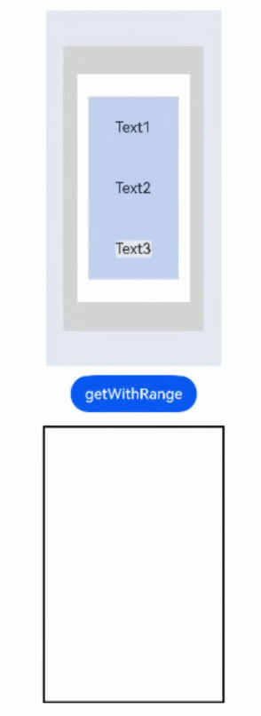

# @ohos.arkui.UIContext (UIContext)(系统接口)

在Stage模型中，WindowStage/Window可以通过loadContent接口加载页面并创建UI的实例，并将页面内容渲染到关联的窗口中，所以UI实例和窗口是一一关联的。一些全局的UI接口是和具体UI实例的执行上下文相关的，在当前接口调用时，通过追溯调用链跟踪到UI的上下文，来确定具体的UI实例。若在非UI页面中或者一些异步回调中调用这类接口，可能无法跟踪到当前UI的上下文，导致接口执行失败。

@ohos.window在API version 10 新增[getUIContext](arkts-apis-window-Window.md#getuicontext10)接口，获取UI上下文实例UIContext对象，使用UIContext对象提供的替代方法，可以直接作用在对应的UI实例上。

> **说明：**
>
> 本模块首批接口从API version 10开始支持。后续版本的新增接口，采用上角标单独标记接口的起始版本。
>
> 示例效果请以真机运行为准，当前DevEco Studio预览器不支持。
>
> 当前页面仅包含本模块的系统接口，其他公开接口参见[@ohos.arkui.UIContext (UIContext)](js-apis-arkui-UIContext.md)。

## UIContext

以下API需先使用ohos.window中的[getUIContext()](arkts-apis-window-Window.md#getuicontext10)方法获取UIContext实例，再通过此实例调用对应方法。本文中UIContext对象以uiContext表示。

### setDynamicDimming<sup>12+<sup>

setDynamicDimming(id: string, value: number): void

通过该方法设置组件的压暗程度。


> **说明：**
>
> 设置该属性后设置其他效果类属性会导致效果冲突。

**系统能力：** SystemCapability.ArkUI.ArkUI.Full

**参数：**

| 参数名 | 类型 | 必填 | 说明 |
| ------- | ------- | ------- | ------- |
| id | string | 是 | 组件id。 |
| value | number | 是 | 组件压暗程度取值范围[0,1], 由0到1逐渐变亮。 |

**示例：**

```ts
@Entry
@Component
struct Index {
  @State
  myCount : number = 100

  build() {
    Column(){
      Image($r('app.media.testImage')).width(500).height(800).id("test")
    }.width("100%").height("100%").onClick(()=>{
      this.getUIContext().setDynamicDimming("test",1)
      this.getUIContext()?.animateTo({duration:5000 },()=>{
        this.getUIContext().setDynamicDimming("test",0)
      })
    })
  }
}
```


### animateToImmediately<sup>12+</sup>

animateToImmediately(param: AnimateParam , event: () => void): void

animateToImmediately接口允许用户通过UIContext对象，获取显式立即动画的能力。同时加载多个属性动画的情况下，使用该接口可以立即执行闭包代码中状态变化导致的过渡动效。

**原子化服务API：** 从API version 12开始，该接口支持在原子化服务中使用。

**系统能力：** SystemCapability.ArkUI.ArkUI.Full

**参数：**

| 参数名   | 类型                                       | 必填   | 说明                                    |
| ----- | ---------------------------------------- | ---- | ------------------------------------- |
| param | [AnimateParam](arkui-ts/ts-explicit-animation.md#animateparam对象说明) | 是    | 设置动画效果相关参数。                           |
| event | () => void                               | 是    | 指定显示动效的闭包函数，在闭包函数中导致的状态变化系统会自动插入过渡动画。 |

**示例：**

该示例实现了通过UIContext对象获取显式立即动画的能力，调用animateToImmediately接口实现参数定义的动画效果。

```ts
// xxx.ets
@Entry
@Component
struct AnimateToImmediatelyExample {
  @State widthSize: number = 250
  @State heightSize: number = 100
  @State opacitySize: number = 0
  private flag: boolean = true
  uiContext: UIContext | null | undefined = this.getUIContext();

  build() {
    Column() {
      Column()
        .width(this.widthSize)
        .height(this.heightSize)
        .backgroundColor(Color.Green)
        .opacity(this.opacitySize)
      Button('change size')
        .margin(30)
        .onClick(() => {
          if (this.flag) {
            this.uiContext?.animateToImmediately({
              delay: 0,
              duration: 1000
            }, () => {
              this.opacitySize = 1
            })
            this.uiContext?.animateTo({
              delay: 1000,
              duration: 1000
            }, () => {
              this.widthSize = 150
              this.heightSize = 60
            })
          } else {
            this.uiContext?.animateToImmediately({
              delay: 0,
              duration: 1000
            }, () => {
              this.widthSize = 250
              this.heightSize = 100
            })
            this.uiContext?.animateTo({
              delay: 1000,
              duration: 1000
            }, () => {
              this.opacitySize = 0
            })
          }
          this.flag = !this.flag
        })
    }.width('100%').margin({ top: 5 })
  }
}
```


### freezeUINode<sup>18+</sup>

freezeUINode(id: string, isFrozen: boolean): void

使用id设置组件冻结状态，防止自身脏区标记并进行布局更新。

**原子化服务API:** 从API version 18 开始，该接口支持在原子化服务中使用。

**系统能力：** SystemCapability.ArkUI.ArkUI.Full

**参数：**

| 参数名     | 类型    | 必填   | 说明      |
| --- | --- | --- | --- |
| id | string | 是 | 组件的id。|
| isFrozen | boolean | 是 | 是否设置冻结。<br/>true表示设置冻结，false表示设置不冻结。<br/>默认值为false。|

**错误码：**

以下错误码详细介绍请参考[通用错误码](../errorcode-universal.md)。

| 错误码ID | 错误信息 |
| -------- | -------- |
| 202 | The caller is not a system application. |

```js
@Entry
@Component
struct Index {
  @State columnWidth1: string = '100%';
  @State currentIndex: number = 0;
  private controller: TabsController = new TabsController();

  build() {
    Column() {
      Tabs({ 
        barPosition: BarPosition.Start, 
        index: this.currentIndex, 
        controller: this.controller 
      }) {
        TabContent() {
          Column()
          .width(this.columnWidth1)
          .height('100%')
          .backgroundColor('#00CB87')
        }
        .tabBar('green')
        .id('tab1')
        .onWillHide(() => {
          this.getUIContext().freezeUINode('tab1', true);
        })
        .onWillShow(() => {
          this.getUIContext().freezeUINode('tab1', false);
        })

        TabContent() {
          Column()
          .width('100%')
          .height('100%')
          .backgroundColor('#007DFF')
        }
        .tabBar('blue')
        .id('tab2')
        .onWillHide(() => {
          this.getUIContext().freezeUINode('tab2', true);
        })
        .onWillShow(() => {
          this.getUIContext().freezeUINode('tab1', true);
          this.columnWidth1 = '50%';
          setTimeout(() => {
            this.getUIContext().freezeUINode('tab1', false);
            this.columnWidth1 = '20%';
          }, 5000)
        })

         TabContent() {
          Column()
          .width('100%')
          .height('100%')
          .backgroundColor('#FFBF00')
        }
        .tabBar('yellow')
        .id('tab3')
        .onWillHide(() => {
          this.getUIContext().freezeUINode('tab3', true);
        })
        .onWillShow(() => {
          this.getUIContext().freezeUINode('tab3', false);
        })

      }
      .vertical(false)
      .barMode(BarMode.Fixed)
      .barWidth(360)
      .barHeight(56)
      .animationDuration(0)
      .onChange((index: number) => {
        this.currentIndex = index;
      })
      .width(360)
      .height(296)
      .margin({ top: 52 })
      .backgroundColor('#F1F3F5')
    }.width('100%')
  }
}
```

### freezeUINode<sup>18+</sup>

freezeUINode(uniqueId: number, isFrozen: boolean): void

使用uniqueId设置组件冻结状态，防止自身脏区标记并进行布局更新。

**原子化服务API:** 从API version 18 开始，该接口支持在原子化服务中使用。

**系统能力：** SystemCapability.ArkUI.ArkUI.Full

**参数：**

| 参数名     | 类型    | 必填   | 说明      |
| --- | --- | --- | --- |
| uniqueId | number | 是 | 组件的number。|
| isFrozen | boolean | 是 | 是否设置冻结。<br/>true表示设置冻结，false表示设置不冻结。<br/>默认值为false。|

**错误码：**

以下错误码详细介绍请参考[通用错误码](../errorcode-universal.md)。

| 错误码ID | 错误信息 |
| -------- | -------- |
| 202 | The caller is not a system application. |

```js
@Entry
@Component
struct Index {
  @State columnWidth1: string = '100%';
  @State currentIndex: number = 0;
  private controller: TabsController = new TabsController();

  build() {
    Column() {
      Tabs({ 
        barPosition: BarPosition.Start, 
        index: this.currentIndex, 
        controller: this.controller 
      }) {
        TabContent() {
          Column()
          .width(this.columnWidth1)
          .height('100%')
          .backgroundColor('#00CB87')
        }
        .tabBar('green')
        .id('tab1')
        .onWillHide(() => {
          const node = this.getUIContext().getFrameNodeById('tab1');
          const uniqueId = node?.getUniqueId();
          this.getUIContext().freezeUINode(uniqueId, true);
        })
        .onWillShow(() => {
          const node = this.getUIContext().getFrameNodeById('tab1');
          const uniqueId = node?.getUniqueId();
          this.getUIContext().freezeUINode(uniqueId, false)
        })

        TabContent() {
          Column()
          .width('100%')
          .height('100%')
          .backgroundColor('#007DFF')
        }
        .tabBar('blue')
        .id('tab2')
        .onWillHide(() => {
          const node = this.getUIContext().getFrameNodeById('tab2');
          const uniqueId = node?.getUniqueId();
          this.getUIContext().freezeUINode(uniqueId, true);
        })
        .onWillShow(() => {
          const node = this.getUIContext().getFrameNodeById('tab1');
          const uniqueId = node?.getUniqueId();
          this.getUIContext().freezeUINode(uniqueId, true);

          this.columnWidth1 = '50%';
          setTimeout(() => {
            this.getUIContext().freezeUINode(uniqueId, false);
            this.columnWidth1 = '20%';
          }, 5000)
        })

         TabContent() {
          Column()
          .width('100%')
          .height('100%')
          .backgroundColor('#FFBF00')
        }
        .tabBar('yellow')
        .id('tab3')
        .onWillHide(() => {
          const node = this.getUIContext().getFrameNodeById('tab3');
          const uniqueId = node?.getUniqueId();
          this.getUIContext().freezeUINode(uniqueId, true);
        })
        .onWillShow(() => {
          const node = this.getUIContext().getFrameNodeById('tab3');
          const uniqueId = node?.getUniqueId();
          this.getUIContext().freezeUINode(uniqueId, false);
        })

      }
      .vertical(false)
      .barMode(BarMode.Fixed)
      .barWidth(360)
      .barHeight(56)
      .animationDuration(0)
      .onChange((index: number) => {
        this.currentIndex = index;
      })
      .width(360)
      .height(296)
      .margin({ top: 52 })
      .backgroundColor('#F1F3F5')
    }.width('100%')
  }
}
```

## ComponentSnapshot<sup>12+</sup>

以下API需先使用UIContext中的[getComponentSnapshot()](js-apis-arkui-UIContext.md#getcomponentsnapshot12)方法获取ComponentSnapshot对象，再通过此实例调用对应方法。

缩放、平移、旋转等图形变换属性只对被截图组件的子组件生效；对目标组件本身应用图形变换属性不生效，显示的是还是图形变换前的效果。

### getWithRange<sup>20+</sup>
getWithRange(start: NodeIdentity, end: NodeIdentity, isStartRect: boolean, options?: componentSnapshot.SnapshotOptions): Promise<image.PixelMap>;

传入两个组件的ID，获取范围内的组件的截图，并通过Promise返回结果。

**原子化服务API：** 从API version 20开始，该接口支持在原子化服务中使用。

**系统能力：** SystemCapability.ArkUI.ArkUI.Full

**参数：**

| 参数名  | 类型     | 必填   | 说明                                       |
| ---- | ------ | ---- | ------- |
| start   | [NodeIdentity](./js-apis-arkui-UIContext.md#nodeidentity20) | 是    | 范围开始的组件的ID。 |
| end   | [NodeIdentity](./js-apis-arkui-UIContext.md#nodeidentity20) | 是    | 范围结束的组件的ID。 |
| isStartRect   | boolean | 是    | 范围是否以开始组件的外接矩形为准。 |
| options       | [componentSnapshot.SnapshotOptions](js-apis-arkui-componentSnapshot.md#snapshotoptions12)            | 否    | 截图相关的自定义参数，不支持region参数。 |

**返回值：**

| 类型                            | 说明       |
| -------- | -------- |
| image.[PixelMap](../apis-image-kit/arkts-apis-image-PixelMap.md) | 截图返回的结果。 |

**错误码：** 

以下错误码的详细介绍请参见[通用错误码](../errorcode-universal.md)错误码和[截图错误码](errorcode-snapshot.md)。

| 错误码ID  | 错误信息                |
| ------ | ------- |
| 202     | The caller is not a system application. |
| 100001 | Invalid ID. |

**示例：** 

```ts
import { image } from '@kit.ImageKit';

@Entry
@Component
struct SnapshotExample {
  @State pixmap: image.PixelMap | undefined = undefined
  build() {
    Column() {
      Row() {
        Row() {
          Row() {
            Column() {
              Text('Text1').id('text1')
              Text('Text2').id('text2')
              Row() {
                Text('Text3').id('text3')
              }.id('root5').backgroundColor('#E4E8F0')
            }.width('80%').height('80%').justifyContent(FlexAlign.SpaceAround).backgroundColor('#C1D1F0').id('root4')
          }.width('80%').height('80%').justifyContent(FlexAlign.Center).backgroundColor('#FFEEF0').id('root3')
          .backgroundBlurStyle(BlurStyle.Thin, { colorMode: ThemeColorMode.LIGHT })
        }.width('80%').height('80%').justifyContent(FlexAlign.Center).backgroundColor('#D5D5D5').id('root2')
      }.width('50%').height('50%').justifyContent(FlexAlign.Center).backgroundColor('#E4E8F0').id('root1')
      Row() {
        Button("getWithRange")
          .onClick(() => {
            this.getUIContext().getComponentSnapshot().getWithRange('root2', 'root4', true)
              .then((pixmap: image.PixelMap) => {
                this.pixmap = pixmap
              }).catch((err:Error) => {
              console.log("error: " + err)
            })
          }).margin(10)
      }.justifyContent(FlexAlign.SpaceAround)
      Row() {
        Image(this.pixmap).width(200).height(300).border({ color: Color.Black, width: 2 }).margin(5)
      }.justifyContent(FlexAlign.SpaceAround)
    }
    .id('root')
    .width('100%')
    .height('100%')
    .alignItems(HorizontalAlign.Center)
  }
}
```


