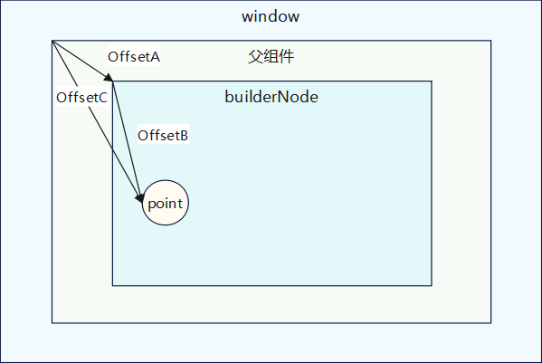
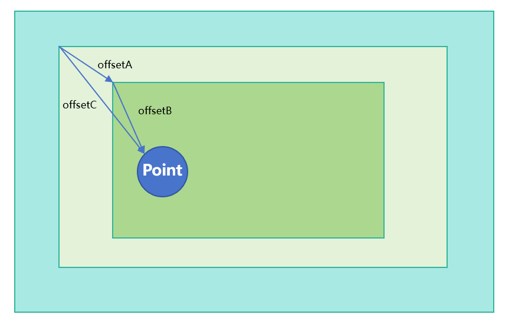
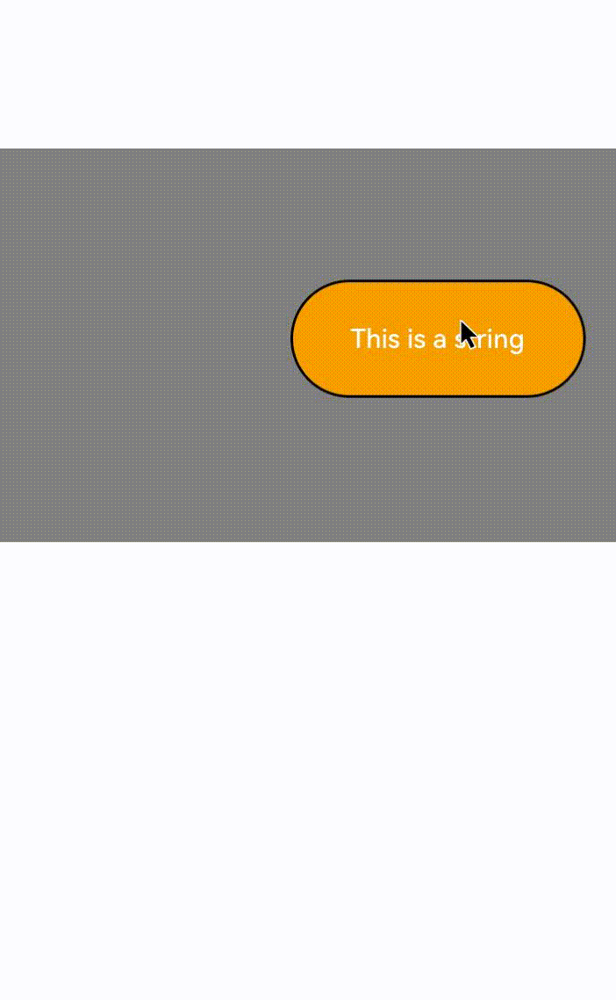
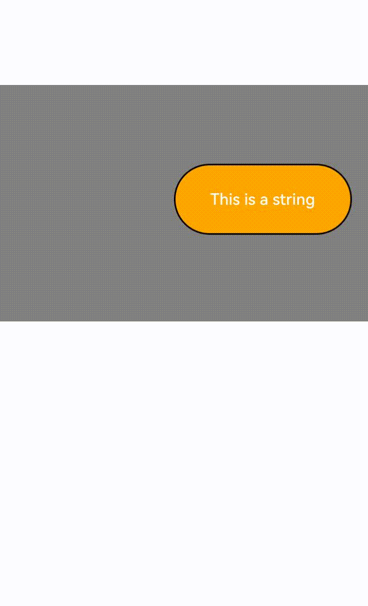
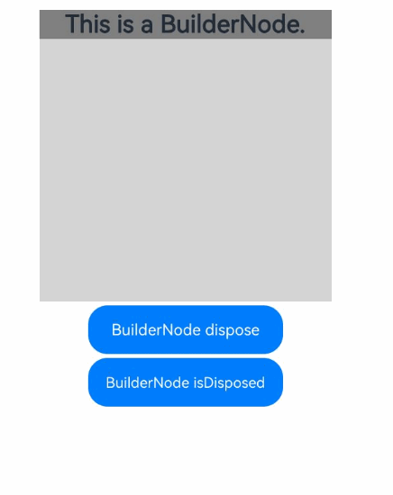
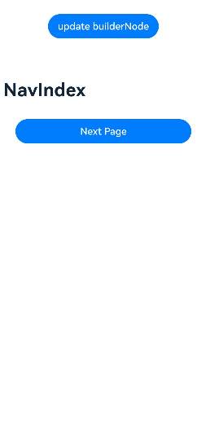

# BuilderNode
<!--Kit: ArkUI-->
<!--Subsystem: ArkUI-->
<!--Owner: @xiang-shouxing-->
<!--Designer: @xiang-shouxing-->
<!--Tester: @sally__-->
<!--Adviser: @HelloCrease-->

<!--Kit: ArkUI-->
<!--Subsystem: ArkUI-->
<!--Owner: @xiang-shouxing-->
<!--Designer: @xiang-shouxing-->
<!--Tester: @sally__-->

提供能够挂载系统组件的自定义节点BuilderNode。BuilderNode仅可作为叶子节点使用。使用方式参考[BuilderNode开发指南](../../ui/arkts-user-defined-arktsNode-builderNode.md)。最佳实践请参考[组件动态创建-组件动态添加、更新和删除](https://developer.huawei.com/consumer/cn/doc/best-practices/bpta-ui-dynamic-operations#section153921947151012)。

> **说明：**
>
> 本模块首批接口从API version 11开始支持。后续版本的新增接口，采用上角标单独标记接口的起始版本。
> 
> 若传入的Builder的根节点为语法节点（if/else/foreach/…）或自定义组件，将额外生成一个FrameNode，在节点树中显示为“BuilderProxyNode”，这会导致树结构变化，影响某些测试的传递过程。详情参见[BuilderNode内的BuilderProxyNode导致树结构发生变化](../../ui/arkts-user-defined-arktsNode-builderNode.md#buildernode内的builderproxynode导致树结构发生变化)。
> 
> 如果在跨页面复用BuilderNode时显示异常，可参考[跨页面复用注意事项](../../ui/arkts-user-defined-arktsNode-builderNode.md#跨页面复用注意事项)。
> 
> 当前不支持在预览器中使用BuilderNode。
> 
> BuilderNode下的自定义组件支持使用[@Prop](../../ui/state-management/arkts-prop.md)装饰器。不支持使用[@Link](../../ui/state-management/arkts-link.md)装饰器来跨越BuilderNode同步外界的数据和状态。
>
> 如果BuilderNode的子节点是自定义组件，不支持该自定义组件使用[@Reusable](../../ui/state-management/arkts-reusable.md)装饰器，详细内容参见[BuilderNode在子自定义组件中使用@Reusable装饰器](../../ui/arkts-user-defined-arktsNode-builderNode.md#buildernode在子自定义组件中使用reusable装饰器)。
> 
> 从API version 12开始，自定义组件支持接收[LocalStorage](../../ui/state-management/arkts-localstorage.md)实例。可以通过[传递LocalStorage实例](../../ui/state-management/arkts-localstorage.md#自定义组件接收localstorage实例)来使用LocalStorage相关的装饰器[@LocalStorageProp](../../ui/state-management/arkts-localstorage.md#localstorageprop)、[@LocalStorageLink](../../ui/state-management/arkts-localstorage.md#localstoragelink)。
> 
> 从API version 20开始，通过配置[BuildOptions](#buildoptions12)，内部自定义组件的[@Consume](../../ui/state-management/arkts-provide-and-consume.md)支持接收所在页面的[@Provide](../../ui/state-management/arkts-provide-and-consume.md)数据。
> 
> 其余装饰器行为未定义，不建议使用。


## 导入模块

```ts
import { BuilderNode, RenderOptions, NodeRenderType } from "@kit.ArkUI";
```

## NodeRenderType

节点渲染类型枚举。

**原子化服务API：** 从API version 12开始，该接口支持在原子化服务中使用。

**系统能力：** SystemCapability.ArkUI.ArkUI.Full

| 名称                | 值  | 说明                         |
| ------------------- | --- | ---------------------------- |
| RENDER_TYPE_DISPLAY | 0   | 表示该节点将被显示到屏幕上。 |
| RENDER_TYPE_TEXTURE | 1   | 表示该节点将被导出为纹理。   |

> **说明：**
>
> RENDER_TYPE_TEXTURE类型目前仅在[BuilderNode](#buildernode-1)持有组件树的根节点为自定义组件时以及[XComponentNode](./js-apis-arkui-xcomponentNode.md)中设置生效。
>
> 在[BuilderNode](#buildernode-1)的情况下，目前在作为根节点的自定义组件中支持纹理导出的有以下组件：[Badge](arkui-ts/ts-container-badge.md)、[Blank](arkui-ts/ts-basic-components-blank.md)、[Button](arkui-ts/ts-basic-components-button.md)、[CanvasGradient](arkui-ts/ts-components-canvas-canvasgradient.md)、[CanvasPattern](arkui-ts/ts-components-canvas-canvaspattern.md)、[CanvasRenderingContext2D](arkui-ts/ts-canvasrenderingcontext2d.md)、[Canvas](arkui-ts/ts-components-canvas-canvas.md)、[CheckboxGroup](arkui-ts/ts-basic-components-checkboxgroup.md)、[Checkbox](arkui-ts/ts-basic-components-checkbox.md)、[Circle](arkui-ts/ts-drawing-components-circle.md)、[ColumnSplit](arkui-ts/ts-container-columnsplit.md)、[Column](arkui-ts/ts-container-column.md)、[ContainerSpan](arkui-ts/ts-basic-components-containerspan.md)、[Counter](arkui-ts/ts-container-counter.md)、[DataPanel](arkui-ts/ts-basic-components-datapanel.md)、[Divider](arkui-ts/ts-basic-components-divider.md)、[Ellipse](arkui-ts/ts-drawing-components-ellipse.md)、[Flex](arkui-ts/ts-container-flex.md)、[Gauge](arkui-ts/ts-basic-components-gauge.md)、[Hyperlink](arkui-ts/ts-container-hyperlink.md)、[ImageBitmap](arkui-ts/ts-components-canvas-imagebitmap.md)、[ImageData](arkui-ts/ts-components-canvas-imagedata.md)、[Image](arkui-ts/ts-basic-components-image.md)、[Line](arkui-ts/ts-drawing-components-line.md)、[LoadingProgress](arkui-ts/ts-basic-components-loadingprogress.md)、[Marquee](arkui-ts/ts-basic-components-marquee.md)、[Matrix2D](arkui-ts/ts-components-canvas-matrix2d.md)、[OffscreenCanvasRenderingContext2D](arkui-ts/ts-offscreencanvasrenderingcontext2d.md)、[OffscreenCanvas](arkui-ts/ts-components-offscreencanvas.md)、[Path2D](arkui-ts/ts-components-canvas-path2d.md)、[Path](arkui-ts/ts-drawing-components-path.md)、[PatternLock](arkui-ts/ts-basic-components-patternlock.md)、[Polygon](arkui-ts/ts-drawing-components-polygon.md)、[Polyline](arkui-ts/ts-drawing-components-polyline.md)、[Progress](arkui-ts/ts-basic-components-progress.md)、[QRCode](arkui-ts/ts-basic-components-qrcode.md)、[Radio](arkui-ts/ts-basic-components-radio.md)、[Rating](arkui-ts/ts-basic-components-rating.md)、[Rect](arkui-ts/ts-drawing-components-rect.md)、[RelativeContainer](arkui-ts/ts-container-relativecontainer.md)、[RowSplit](arkui-ts/ts-container-rowsplit.md)、[Row](arkui-ts/ts-container-row.md)、[Shape](arkui-ts/ts-drawing-components-shape.md)、[Slider](arkui-ts/ts-basic-components-slider.md)、[Span](arkui-ts/ts-basic-components-span.md)、[Stack](arkui-ts/ts-container-stack.md)、[TextArea](arkui-ts/ts-basic-components-textarea.md)、[TextClock](arkui-ts/ts-basic-components-textclock.md)、[TextInput](arkui-ts/ts-basic-components-textinput.md)、[TextTimer](arkui-ts/ts-basic-components-texttimer.md)、[Text](arkui-ts/ts-basic-components-text.md)、[Toggle](arkui-ts/ts-basic-components-toggle.md)、[Video](arkui-ts/ts-media-components-video.md)（不含全屏播放能力）、[Web](../apis-arkweb/arkts-basic-components-web.md)、[XComponent](arkui-ts/ts-basic-components-xcomponent.md)。
>
> 从API version 12开始，新增以下组件支持纹理导出：[DatePicker](arkui-ts/ts-basic-components-datepicker.md)、[ForEach](arkui-ts/ts-rendering-control-foreach.md)、[Grid](arkui-ts/ts-container-grid.md)、[IfElse](../../ui/state-management/arkts-rendering-control-ifelse.md)、[LazyForEach](arkui-ts/ts-rendering-control-lazyforeach.md)、[List](arkui-ts/ts-container-list.md)、[Scroll](arkui-ts/ts-container-scroll.md)、[Swiper](arkui-ts/ts-container-swiper.md)、[TimePicker](arkui-ts/ts-basic-components-timepicker.md)、[@Component](../../ui/state-management/arkts-create-custom-components.md#component)修饰的自定义组件、[NodeContainer](arkui-ts/ts-basic-components-nodecontainer.md)以及[NodeContainer](arkui-ts/ts-basic-components-nodecontainer.md)下挂载的[FrameNode](./js-apis-arkui-frameNode.md)和[RenderNode](./js-apis-arkui-renderNode.md)。
>
> 使用方式可参考[同层渲染绘制](../../web/web-same-layer.md)。

## RenderOptions

创建BuilderNode时的可选参数。

**原子化服务API：** 从API version 12开始，该接口支持在原子化服务中使用。

**系统能力：** SystemCapability.ArkUI.ArkUI.Full

| 名称          | 类型                                   | 必填 | 说明                                                         |
| ------------- | -------------------------------------- | ---- | ------------------------------------------------------------ |
| selfIdealSize | [Size](js-apis-arkui-graphics.md#size) | 否   | 节点的理想大小。<br/>默认值：{ width: 0, height: 0 } |
| type          | [NodeRenderType](#noderendertype)      | 否   | 节点的渲染类型。<br/>默认值：NodeRenderType.RENDER_TYPE_DISPLAY |
| surfaceId     | string                                 | 否   | 纹理接收方的surfaceId。纹理接收方一般为[OH_NativeImage](../apis-arkgraphics2d/capi-oh-nativeimage-oh-nativeimage.md)。<br/>surfaceId仅当type为NodeRenderType.RENDER_TYPE_TEXTURE时生效。<br/>默认值："" |

## BuilderNode

class BuilderNode\<Args extends Object[]>

BuilderNode支持通过无状态的UI方法[@Builder](../../ui/state-management/arkts-builder.md)生成组件树，并持有组件树的根节点。不支持定义为状态变量。BuilderNode中持有的FrameNode仅用于将该BuilderNode作为子节点挂载到其他FrameNode上。对BuilderNode持有的FrameNode进行属性设置与子节点操作可能会产生未定义行为，因此不建议通过BuilderNode的[getFrameNode](#getframenode)方法和[FrameNode](js-apis-arkui-frameNode.md)的[getRenderNode](js-apis-arkui-frameNode.md#getrendernode)方法获取RenderNode，并通过[RenderNode](js-apis-arkui-renderNode.md)的接口对其进行属性设置与子节点操作。

**原子化服务API：** 从API version 12开始，该接口支持在原子化服务中使用。

**系统能力：** SystemCapability.ArkUI.ArkUI.Full

### constructor

constructor(uiContext: UIContext, options?: RenderOptions)

当将BuilderNode生成的内容嵌入到其它RenderNode中显示时，即将BuilderNode对应的RenderNode挂载到另一个RenderNode中显示，需要显式指定RenderOptions中的selfIdealSize，否则Builder内的节点默认父组件布局约束为[0,0]，即不设置selfIdealSize则认为BuilderNode中子树的根节点大小为[0,0]。

**原子化服务API：** 从API version 12开始，该接口支持在原子化服务中使用。

**系统能力：** SystemCapability.ArkUI.ArkUI.Full

**参数：**

| 参数名    | 类型                                    | 必填 | 说明                                                              |
| --------- | --------------------------------------- | ---- | ----------------------------------------------------------------- |
| uiContext | [UIContext](arkts-apis-uicontext-uicontext.md) | 是   | UI上下文，获取方式可参考[UIContext获取方法](./js-apis-arkui-node.md#uicontext获取方法)。 |
| options   | [RenderOptions](#renderoptions)         | 否   | BuilderNode的构造可选参数。默认值:undefined。   |

> **说明**
> uiContext的入参需要为一个有效的值，即UI上下文正确，如果传入非法值或者未设置，会导致创建失败。

### build

build(builder: WrappedBuilder\<Args>, arg?: Object): void

依照传入的对象创建组件树，并持有组件树的根节点。无状态的UI方法[@Builder](../../ui/state-management/arkts-builder.md)最多拥有一个根节点。
支持自定义组件。

> **说明**
> 
> @Builder嵌套使用的时候需要保证内外的@Builder方法的入参对象一致。
>
> 最外层的@Builder只支持一个入参。
>
> build的参数是值传递，需要使用[update](#update)接口进行更新。
> 
> 需要操作BuilderNode中的对象时，需要保证其引用不被回收。当BuilderNode对象被虚拟机回收之后，它的FrameNode、RenderNode对象也会与后端节点解引用。即从BuilderNode中获取的FrameNode对象不对应任何一个节点。
>
> BuilderNode对象会持有实体节点的引用。如果不需要使用BuilderNode前端对象管理后端节点，可以调用[dispose](#dispose12)接口，实现前后端对象的解绑。

**原子化服务API：** 从API version 12开始，该接口支持在原子化服务中使用。

**系统能力：** SystemCapability.ArkUI.ArkUI.Full

**参数：**

| 参数名  | 类型                                                            | 必填 | 说明                                                                                   |
| ------- | --------------------------------------------------------------- | ---- | -------------------------------------------------------------------------------------- |
| builder | [WrappedBuilder\<Args>](../../ui/state-management/arkts-wrapBuilder.md) | 是   | 创建对应节点树的时候所需的无状态UI方法[@Builder](../../ui/state-management/arkts-builder.md)。 |
| arg     | Object                                                          | 否   | builder的入参。当前仅支持一个入参，且入参对象类型与@Builder定义的入参类型保持一致。<br/>默认值：undefined |

### build<sup>12+</sup>

build(builder: WrappedBuilder\<Args>, arg: Object, options: [BuildOptions](#buildoptions12)): void

依照传入的对象创建组件树，并持有组件树的根节点。无状态的UI方法[@Builder](../../ui/state-management/arkts-builder.md)最多拥有一个根节点。
支持自定义组件。

> **说明**
> 
> @Builder进行创建和更新的规格参考[@Builder](../../ui/state-management/arkts-builder.md)。
> 
> 最外层的@Builder只支持一个入参。

**原子化服务API：** 从API version 12开始，该接口支持在原子化服务中使用。

**系统能力：** SystemCapability.ArkUI.ArkUI.Full

**参数：**

| 参数名  | 类型                                                            | 必填 | 说明                                                                                    |
| ------- | --------------------------------------------------------------- | ---- | -------------------------------------------------------------------------------------- |
| builder | [WrappedBuilder\<Args>](../../ui/state-management/arkts-wrapBuilder.md) | 是   | 创建对应节点树的时候所需的无状态UI方法[@Builder](../../ui/state-management/arkts-builder.md)。   |
| arg     | Object                                                          | 是   | builder的入参。当前仅支持一个入参，且入参对象类型与@Builder定义的入参类型保持一致。                                                            |
| options | [BuildOptions](#buildoptions12)                                           | 是   | build的配置参数，判断是否支持@Builder中嵌套@Builder的行为。                                         |

**示例：**
```ts
import { BuilderNode, NodeContent } from "@kit.ArkUI";

interface ParamsInterface {
  text: string;
  func: Function;
}

@Builder
function buildTextWithFunc(fun: Function) {
  Text(fun())
    .fontSize(50)
    .fontWeight(FontWeight.Bold)
    .margin({ bottom: 36 })
}

@Builder
function buildText(params: ParamsInterface) {
  Column() {
    Text(params.text)
      .fontSize(50)
      .fontWeight(FontWeight.Bold)
      .margin({ bottom: 36 })
    buildTextWithFunc(params.func)
  }
}


@Entry
@Component
struct Index {
  @State message: string = "HELLO";
  private content: NodeContent = new NodeContent();

  build() {
    Row() {
      Column() {
        Button('addBuilderNode')
          .onClick(() => {
            let buildNode = new BuilderNode<[ParamsInterface]>(this.getUIContext());
            buildNode.build(wrapBuilder<[ParamsInterface]>(buildText), {
              text: this.message, func: () => {
                return "FUNCTION";
              }
            }, { nestingBuilderSupported: true });
            this.content.addFrameNode(buildNode.getFrameNode());
            buildNode.dispose();
          })
        ContentSlot(this.content)
      }
      .id("column")
      .width('100%')
      .height('100%')
    }
    .height('100%')
  }
}
```

### BuildOptions<sup>12+</sup>

build的可选参数。

**系统能力：** SystemCapability.ArkUI.ArkUI.Full

| 名称          | 类型                                   | 必填 | 说明                                                         |
| ------------- | -------------------------------------- | ---- | ------------------------------------------------------------ |
| nestingBuilderSupported |boolean | 否   | 是否支持Builder嵌套Builder进行使用。其中，false表示Builder使用的入参一致，true表示Builder使用的入参不一致。默认值：false<br/>**原子化服务API：** 从API version 12开始，该接口支持在原子化服务中使用。|
| localStorage<sup>20+</sup> |[LocalStorage](../../ui/state-management/arkts-localstorage.md) | 否   | 给当前BuilderNode设置LocalStorage，挂载在此BuilderNode下的自定义组件共享该LocalStorage。如果自定义组件构造函数同时也传入LocalStorage，优先使用构造函数中传入的LocalStorage。默认值：null。<br/>**原子化服务API：** 从API version 20开始，该接口支持在原子化服务中使用。 |
| enableProvideConsumeCrossing<sup>20+</sup> | boolean | 否 | 定义BuilderNode内自定义组件的@Consume是否与所在页面的@Provide状态互通。true表示支持，false表示不支持。默认值：false。<br/>**原子化服务API：** 从API version 20开始，该接口支持在原子化服务中使用。|

### InputEventType<sup>20+</sup>

type InputEventType = TouchEvent | MouseEvent | AxisEvent

postInputEvent的参数，定义用于透传的输入事件类型。

**原子化服务API：** 从API version 20开始，该接口支持在原子化服务中使用。

**系统能力：** SystemCapability.ArkUI.ArkUI.Full

| 类型 | 说明                                   |
| ------------- | -------------------------------------- |
| [TouchEvent](arkui-ts/ts-universal-events-touch.md#touchevent对象说明)  | 触摸事件。 | 
| [MouseEvent](arkui-ts/ts-universal-mouse-key.md#mouseevent对象说明)  | 鼠标事件。 |
| [AxisEvent](arkui-ts/ts-universal-events-axis.md#axisevent)  | 轴事件。 |

### getFrameNode

getFrameNode(): FrameNode | null

获取BuilderNode中的FrameNode。在BuilderNode执行build操作之后，才会生成FrameNode。

**原子化服务API：** 从API version 12开始，该接口支持在原子化服务中使用。

**系统能力：** SystemCapability.ArkUI.ArkUI.Full

**返回值：**

| 类型                                                      | 说明                                                                  |
| --------------------------------------------------------- | --------------------------------------------------------------------- |
| [FrameNode](js-apis-arkui-frameNode.md) \| null | 一个FrameNode对象。若该BuilderNode不包含FrameNode，则返回空对象null。 |

**示例1：**

BuilderNode作为NodeContainer的根节点返回。

```ts
import { NodeController, BuilderNode, FrameNode, UIContext } from "@kit.ArkUI";

class Params {
  text: string = "";
  constructor(text: string) {
    this.text = text;
  }
}

@Builder
function buildText(params: Params) {
  Column() {
    Text(params.text)
      .fontSize(50)
      .fontWeight(FontWeight.Bold)
      .margin({bottom: 36})
  }
}

class TextNodeController extends NodeController {
  private textNode: BuilderNode<[Params]> | null = null;
  private message: string = "DEFAULT";

  constructor(message: string) {
    super();
    this.message = message;
  }

  makeNode(context: UIContext): FrameNode | null {
    this.textNode = new BuilderNode(context);
    this.textNode.build(wrapBuilder<[Params]>(buildText), new Params(this.message));

    return this.textNode.getFrameNode();
  }
}

@Entry
@Component
struct Index {
  @State message: string = "hello";

  build() {
    Row() {
      Column() {
        NodeContainer(new TextNodeController(this.message))
          .width('100%')
          .height(100)
          .backgroundColor('#FFF0F0F0')
      }
      .width('100%')
      .height('100%')
    }
    .height('100%')
  }
}
```

**示例2：**

BuilderNode的FrameNode挂到其它FrameNode下。

```ts
import { NodeController, BuilderNode, FrameNode, UIContext } from "@kit.ArkUI";

class Params {
  text: string = "";

  constructor(text: string) {
    this.text = text;
  }
}

@Builder
function buildText(params: Params) {
  Column() {
    Text(params.text)
      .fontSize(50)
      .fontWeight(FontWeight.Bold)
      .margin({ bottom: 36 })
  }
}

class TextNodeController extends NodeController {
  private rootNode: FrameNode | null = null;
  private textNode: BuilderNode<[Params]> | null = null;
  private message: string = "DEFAULT";

  constructor(message: string) {
    super();
    this.message = message;
  }

  makeNode(context: UIContext): FrameNode | null {
    this.rootNode = new FrameNode(context);
    this.textNode = new BuilderNode(context, { selfIdealSize: { width: 150, height: 150 } });
    this.textNode.build(wrapBuilder<[Params]>(buildText), new Params(this.message));
    if (this.rootNode !== null) {
      this.rootNode.appendChild(this.textNode?.getFrameNode());
    }

    return this.rootNode;
  }
}

@Entry
@Component
struct Index {
  @State message: string = "hello";

  build() {
    Row() {
      Column() {
        NodeContainer(new TextNodeController(this.message))
          .width('100%')
          .height(100)
          .backgroundColor('#FFF0F0F0')
      }
      .width('100%')
      .height('100%')
    }
    .height('100%')
  }
}
```

**示例3：**

BuilderNode的RenderNode挂到其它RenderNode下。由于RenderNode不传递布局约束，不推荐通过该方式挂载节点。

```ts
import { NodeController, BuilderNode, FrameNode, UIContext, RenderNode } from "@kit.ArkUI";

class Params {
  text: string = "";

  constructor(text: string) {
    this.text = text;
  }
}

@Builder
function buildText(params: Params) {
  Column() {
    Text(params.text)
      .fontSize(50)
      .fontWeight(FontWeight.Bold)
      .margin({ bottom: 36 })
  }
}

class TextNodeController extends NodeController {
  private rootNode: FrameNode | null = null;
  private textNode: BuilderNode<[Params]> | null = null;
  private message: string = "DEFAULT";

  constructor(message: string) {
    super();
    this.message = message;
  }

  makeNode(context: UIContext): FrameNode | null {
    this.rootNode = new FrameNode(context);
    let renderNode = new RenderNode();
    renderNode.clipToFrame = false;
    this.textNode = new BuilderNode(context, { selfIdealSize: { width: 150, height: 150 } });
    this.textNode.build(wrapBuilder<[Params]>(buildText), new Params(this.message));
    const textRenderNode = this.textNode?.getFrameNode()?.getRenderNode();

    const rootRenderNode = this.rootNode.getRenderNode();
    if (rootRenderNode !== null) {
      rootRenderNode.appendChild(renderNode);
      renderNode.appendChild(textRenderNode);
    }

    return this.rootNode;
  }
}

@Entry
@Component
struct Index {
  @State message: string = "hello";

  build() {
    Row() {
      Column() {
        NodeContainer(new TextNodeController(this.message))
          .width('100%')
          .height(100)
          .backgroundColor('#FFF0F0F0')
      }
      .width('100%')
      .height('100%')
    }
    .height('100%')
  }
}
```

### update

update(arg: Object): void

根据提供的参数更新BuilderNode，该参数为[build](#build)方法调用时传入的参数类型相同。对自定义组件进行update的时候需要在自定义组件中使用的变量定义为@Prop类型。

**原子化服务API：** 从API version 12开始，该接口支持在原子化服务中使用。

**系统能力：** SystemCapability.ArkUI.ArkUI.Full

**参数：**

| 参数名 | 类型   | 必填 | 说明                                                                     |
| ------ | ------ | ---- | ------------------------------------------------------------------------ |
| arg    | Object | 是   | 用于更新BuilderNode的参数，和[build](#build)调用时传入的参数类型一致。 |

**示例：**
```ts
import { NodeController, BuilderNode, FrameNode, UIContext } from "@kit.ArkUI";

class Params {
  text: string = "";
  constructor(text: string) {
    this.text = text;
  }
}

// 自定义组件
@Component
struct TextBuilder {
  @Prop message: string = "TextBuilder";

  build() {
    Row() {
      Column() {
        Text(this.message)
          .fontSize(50)
          .fontWeight(FontWeight.Bold)
          .margin({bottom: 36})
          .backgroundColor(Color.Gray)
      }
    }
  }
}

@Builder
function buildText(params: Params) {
  Column() {
    Text(params.text)
      .fontSize(50)
      .fontWeight(FontWeight.Bold)
      .margin({ bottom: 36 })
    TextBuilder({message: params.text}) // 自定义组件
  }
}

class TextNodeController extends NodeController {
  private rootNode: FrameNode | null = null;
  private textNode: BuilderNode<[Params]> | null = null;
  private message: string = "";

  constructor(message: string) {
    super();
    this.message = message;
  }

  makeNode(context: UIContext): FrameNode | null {
    this.textNode = new BuilderNode(context);
    this.textNode.build(wrapBuilder<[Params]>(buildText), new Params(this.message));
    return this.textNode.getFrameNode();
  }

  update(message: string) {
    if (this.textNode !== null) {
      this.textNode.update(new Params(message));
    }
  }
}

@Entry
@Component
struct Index {
  @State message: string = "hello";
  private textNodeController: TextNodeController = new TextNodeController(this.message);
  private count = 0;

  build() {
    Row() {
      Column() {
        NodeContainer(this.textNodeController)
          .width('100%')
          .height(200)
          .backgroundColor('#FFF0F0F0')
        Button('Update')
          .onClick(() => {
            this.count += 1;
            const message = "Update " + this.count.toString();
            this.textNodeController.update(message);
          })
      }
      .width('100%')
      .height('100%')
    }
    .height('100%')
  }
}
```

### postTouchEvent

postTouchEvent(event: TouchEvent): boolean

将原始事件派发到某个BuilderNode创建出的FrameNode上。

postTouchEvent是从组件树的中间节点往下分发，需要变换到父组件坐标系才能分发成功，参考下图。

OffsetA为buildNode相对于父组件的偏移量，可以通过FrameNode中的[getPositionToParent](js-apis-arkui-frameNode.md#getpositiontoparent12)获取。OffsetB为point点相对于buildNode的偏移量，可以通过[TouchEvent](arkui-ts/ts-universal-events-touch.md#touchevent对象说明) 获取。OffsetC为OffsetA与OffsetB的和，是传给postTouchEvent的最终结果。



> **说明：** 
>
> 传入的坐标值需要转换为px，如果builderNode有仿射变换，则需要再叠加仿射变换。
>
> 在[webview](../apis-arkweb/arkts-apis-webview.md)中，内部已经处理过坐标系变换，可以将TouchEvent事件直接下发。
>
> 同一时间戳，postTouchEvent只能调用一次。<!--Del-->
>
> 不支持[UIExtensionComponent](arkui-ts/ts-container-ui-extension-component-sys.md)。
<!--DelEnd-->

**原子化服务API：** 从API version 12开始，该接口支持在原子化服务中使用。

**系统能力：** SystemCapability.ArkUI.ArkUI.Full

**参数：**

| 参数名 | 类型                                                                      | 必填 | 说明       |
| ------ | ------------------------------------------------------------------------- | ---- | ---------- |
| event  | [TouchEvent](arkui-ts/ts-universal-events-touch.md#touchevent对象说明) | 是   | 触摸事件。 |

**返回值：**

| 类型    | 说明               |
| ------- | ------------------ |
| boolean | 派发事件是否成功。true为已命中响应事件的组件，false为未命中任何可响应事件的组件。<br/>**说明：** <br/>如果未按照预期命中组件，需要确认以下几点：<br/>1.坐标系是否转换正确。<br/>2.组件是否可交互状态。<br/>3.是否绑定事件。 |

**示例：**

```ts
import { NodeController, BuilderNode, FrameNode, UIContext } from '@kit.ArkUI';

class Params {
  text: string = "this is a text";
}

@Builder
function ButtonBuilder(params: Params) {
  Column() {
    Button(`button ` + params.text)
      .borderWidth(2)
      .backgroundColor(Color.Orange)
      .width("100%")
      .height("100%")
      .gesture(
        TapGesture()
          .onAction((event: GestureEvent) => {
            console.info("TapGesture");
          })
      )
  }
  .width(500)
  .height(300)
  .backgroundColor(Color.Gray)
}

class MyNodeController extends NodeController {
  private rootNode: BuilderNode<[Params]> | null = null;
  private wrapBuilder: WrappedBuilder<[Params]> = wrapBuilder(ButtonBuilder);

  makeNode(uiContext: UIContext): FrameNode | null {
    this.rootNode = new BuilderNode(uiContext);
    this.rootNode.build(this.wrapBuilder, { text: "this is a string" });
    return this.rootNode.getFrameNode();
  }

  // 坐标转换示例
  postTouchEvent(event: TouchEvent, uiContext: UIContext): boolean {
    if (this.rootNode == null) {
      return false;
    }
    let node: FrameNode | null = this.rootNode.getFrameNode();
    let offsetX: number | null | undefined = node?.getPositionToParent().x;
    let offsetY: number | null | undefined = node?.getPositionToParent().y;
    
    let changedTouchLen = event.changedTouches.length;
    for (let i = 0; i < changedTouchLen; i++) {
      if (offsetX != null && offsetY != null && offsetX != undefined && offsetY != undefined) {
        event.changedTouches[i].x = uiContext.vp2px(offsetX + event.changedTouches[i].x);
        event.changedTouches[i].y = uiContext.vp2px(offsetY + event.changedTouches[i].y);
      }
    }
    let result = this.rootNode.postTouchEvent(event);
    console.info("result " + result);
    return result;
  }
}

@Entry
@Component
struct MyComponent {
  private nodeController: MyNodeController = new MyNodeController();

  build() {
    Column() {
      NodeContainer(this.nodeController)
        .height(300)
        .width(500)

      Column()
        .width(500)
        .height(300)
        .backgroundColor(Color.Pink)
        .onTouch((event) => {
          if (event != undefined) {
            this.nodeController.postTouchEvent(event, this.getUIContext());
          }
        })
    }
  }
}
```

### dispose<sup>12+</sup>

dispose(): void

立即释放当前BuilderNode对象对[实体节点](../../ui/arkts-user-defined-node.md#基本概念)的引用关系。关于BuilderNode的解绑场景请参见[节点解绑](../../ui/arkts-user-defined-arktsNode-builderNode.md#解除实体节点引用关系)。

> **说明：**
>
> 当BuilderNode对象调用dispose之后，会与后端实体节点解除引用关系。若前端对象BuilderNode无法释放，容易导致内存泄漏。建议在不再需要对该BuilderNode对象进行操作时，开发者主动调用dispose释放后端节点，以减少引用关系的复杂性，降低内存泄漏的风险。

**原子化服务API：** 从API version 12开始，该接口支持在原子化服务中使用。

**系统能力：** SystemCapability.ArkUI.ArkUI.Full

```ts
import { RenderNode, FrameNode, NodeController, BuilderNode } from "@kit.ArkUI";

@Component
struct TestComponent {
  build() {
    Column() {
      Text('This is a BuilderNode.')
        .fontSize(16)
        .fontWeight(FontWeight.Bold)
    }
    .width('100%')
    .backgroundColor(Color.Gray)
  }

  aboutToAppear() {
    console.info('aboutToAppear');
  }

  aboutToDisappear() {
    console.info('aboutToDisappear');
  }
}

@Builder
function buildComponent() {
  TestComponent()
}

class MyNodeController extends NodeController {
  private rootNode: FrameNode | null = null;
  private builderNode: BuilderNode<[]> | null = null;

  makeNode(uiContext: UIContext): FrameNode | null {
    this.rootNode = new FrameNode(uiContext);
    this.builderNode = new BuilderNode(uiContext, { selfIdealSize: { width: 200, height: 100 } });
    this.builderNode.build(new WrappedBuilder(buildComponent));

    const rootRenderNode = this.rootNode!.getRenderNode();
    if (rootRenderNode !== null) {
      rootRenderNode.size = { width: 200, height: 200 };
      rootRenderNode.backgroundColor = 0xff00ff00;
      rootRenderNode.appendChild(this.builderNode!.getFrameNode()!.getRenderNode());
    }

    return this.rootNode;
  }

  dispose() {
    if (this.builderNode !== null) {
      this.builderNode.dispose();
    }
  }

  removeBuilderNode() {
    const rootRenderNode = this.rootNode!.getRenderNode();
    if (rootRenderNode !== null && this.builderNode !== null && this.builderNode.getFrameNode() !== null) {
      rootRenderNode.removeChild(this.builderNode!.getFrameNode()!.getRenderNode());
    }
  }
}

@Entry
@Component
struct Index {
  private myNodeController: MyNodeController = new MyNodeController();

  build() {
    Column({ space: 4 }) {
      NodeContainer(this.myNodeController)
      Button('BuilderNode dispose')
        .onClick(() => {
          this.myNodeController.removeBuilderNode();
          this.myNodeController.dispose();
        })
        .width('100%')
    }
  }
}
```

### reuse<sup>12+</sup>

reuse(param?: Object): void

触发BuilderNode中的自定义组件的复用。组件复用请参见[@Reusable装饰器：组件复用](../../ui/state-management/arkts-reusable.md)。关于BuilderNode的解绑场景请参见[节点解绑](../../ui/arkts-user-defined-arktsNode-builderNode.md#解除实体节点引用关系)。

**原子化服务API：** 从API version 12开始，该接口支持在原子化服务中使用。

**系统能力：** SystemCapability.ArkUI.ArkUI.Full

**参数：**

| 参数名 | 类型   | 必填 | 说明                                                                     |
| ------ | ------ | ---- | ------------------------------------------------------------------------ |
| param  | Object | 否   | 用于复用BuilderNode的参数，和[build](#build)调用时传入的参数类型一致。 |

### recycle<sup>12+</sup>

recycle(): void

- 触发BuilderNode中自定义组件的回收。自定义组件的回收是组件复用机制中的环节，具体信息请参见[@Reusable装饰器：组件复用](../../ui/state-management/arkts-reusable.md)。
- BuilderNode通过reuse和recycle完成其内外自定义组件之间的复用事件传递，具体使用场景请参见[BuilderNode调用reuse和recycle接口实现节点复用能力](../../ui/arkts-user-defined-arktsNode-builderNode.md#buildernode调用reuse和recycle接口实现节点复用能力)。

**原子化服务API：** 从API version 12开始，该接口支持在原子化服务中使用。

**系统能力：** SystemCapability.ArkUI.ArkUI.Full

```ts
import { FrameNode, NodeController, BuilderNode, UIContext } from "@kit.ArkUI";

const TEST_TAG: string = "Reuse+Recycle";

class MyDataSource {
  private dataArray: string[] = [];
  private listener: DataChangeListener | null = null;

  public totalCount(): number {
    return this.dataArray.length;
  }

  public getData(index: number) {
    return this.dataArray[index];
  }

  public pushData(data: string) {
    this.dataArray.push(data);
  }

  public reloadListener(): void {
    this.listener?.onDataReloaded();
  }

  public registerDataChangeListener(listener: DataChangeListener): void {
    this.listener = listener;
  }

  public unregisterDataChangeListener(): void {
    this.listener = null;
  }
}

class Params {
  item: string = '';

  constructor(item: string) {
    this.item = item;
  }
}

@Builder
function buildNode(param: Params = new Params("hello")) {
  Row() {
    Text(`C${param.item} -- `)
    ReusableChildComponent2({ item: param.item }) //该自定义组件在BuilderNode中无法被正确复用
  }
}

class MyNodeController extends NodeController {
  public builderNode: BuilderNode<[Params]> | null = null;
  public item: string = "";

  makeNode(uiContext: UIContext): FrameNode | null {
    if (this.builderNode == null) {
      this.builderNode = new BuilderNode(uiContext, { selfIdealSize: { width: 300, height: 200 } });
      this.builderNode.build(wrapBuilder<[Params]>(buildNode), new Params(this.item));
    }
    return this.builderNode.getFrameNode();
  }
}

// 被回收复用的自定义组件，其状态变量会更新，而子自定义组件ReusableChildComponent3中的状态变量也会更新，但BuilderNode会阻断这一传递过程
@Reusable
@Component
struct ReusableChildComponent {
  @Prop item: string = '';
  @Prop switch: string = '';
  private controller: MyNodeController = new MyNodeController();

  aboutToAppear() {
    this.controller.item = this.item;
  }

  aboutToRecycle(): void {
    console.info(`${TEST_TAG} ReusableChildComponent aboutToRecycle ${this.item}`);

    // 当开关为open，通过BuilderNode的reuse接口和recycle接口传递给其下的自定义组件，例如ReusableChildComponent2，完成复用
    if (this.switch === 'open') {
      this.controller?.builderNode?.recycle();
    }
  }

  aboutToReuse(params: object): void {
    console.info(`${TEST_TAG} ReusableChildComponent aboutToReuse ${JSON.stringify(params)}`);

    // 当开关为open，通过BuilderNode的reuse接口和recycle接口传递给其下的自定义组件，例如ReusableChildComponent2，完成复用
    if (this.switch === 'open') {
      this.controller?.builderNode?.reuse(params);
    }
  }

  build() {
    Row() {
      Text(`A${this.item}--`)
      ReusableChildComponent3({ item: this.item })
      NodeContainer(this.controller);
    }
  }
}

@Component
struct ReusableChildComponent2 {
  @Prop item: string = "false";

  aboutToReuse(params: Record<string, object>) {
    console.info(`${TEST_TAG} ReusableChildComponent2 aboutToReuse ${JSON.stringify(params)}`);
  }

  aboutToRecycle(): void {
    console.info(`${TEST_TAG} ReusableChildComponent2 aboutToRecycle ${this.item}`);
  }

  build() {
    Row() {
      Text(`D${this.item}`)
        .fontSize(20)
        .backgroundColor(Color.Yellow)
        .margin({ left: 10 })
    }.margin({ left: 10, right: 10 })
  }
}

@Component
struct ReusableChildComponent3 {
  @Prop item: string = "false";

  aboutToReuse(params: Record<string, object>) {
    console.info(`${TEST_TAG} ReusableChildComponent3 aboutToReuse ${JSON.stringify(params)}`);
  }

  aboutToRecycle(): void {
    console.info(`${TEST_TAG} ReusableChildComponent3 aboutToRecycle ${this.item}`);
  }

  build() {
    Row() {
      Text(`B${this.item}`)
        .fontSize(20)
        .backgroundColor(Color.Yellow)
        .margin({ left: 10 })
    }.margin({ left: 10, right: 10 })
  }
}


@Entry
@Component
struct Index {
  @State data: MyDataSource = new MyDataSource();

  aboutToAppear() {
    for (let i = 0; i < 100; i++) {
      this.data.pushData(i.toString());
    }
  }

  build() {
    Column() {
      List({ space: 3 }) {
        LazyForEach(this.data, (item: string) => {
          ListItem() {
            ReusableChildComponent({
              item: item,
              switch: 'open' // 将open改为close可观察到，BuilderNode不通过reuse和recycle接口传递复用时，BuilderNode内部的自定义组件的行为表现
            })
          }
        }, (item: string) => item)
      }
      .width('100%')
      .height('100%')
    }
  }
}
```

### updateConfiguration<sup>12+</sup>

updateConfiguration(): void

传递[系统环境变化](../apis-ability-kit/js-apis-app-ability-configuration.md)事件，触发节点的全量更新。

**原子化服务API：** 从API version 12开始，该接口支持在原子化服务中使用。

**系统能力：** SystemCapability.ArkUI.ArkUI.Full

> **说明：**
>
> updateConfiguration接口用于通知对象更新，更新所使用的系统环境由应用当前的系统环境变化决定。

**示例：**
```ts
import { NodeController, BuilderNode, FrameNode, UIContext, FrameCallback } from "@kit.ArkUI";
import { AbilityConstant, Configuration, ConfigurationConstant, EnvironmentCallback } from '@kit.AbilityKit';

class Params {
  text: string = "";

  constructor(text: string) {
    this.text = text;
  }
}

// 自定义组件
@Component
struct TextBuilder {
  // 作为自定义组件中需要更新的属性，数据类型为基础属性，定义为@Prop
  @Prop message: string = "TextBuilder";

  build() {
    Row() {
      Column() {
        Text(this.message)
          .fontSize(50)
          .fontWeight(FontWeight.Bold)
          .margin({ bottom: 36 })
      }
    }
  }
}

@Builder
function buildText(params: Params) {
  Column() {
    Text(params.text)
      .fontSize(50)
      .fontWeight(FontWeight.Bold)
      .margin({ bottom: 36 })
    TextBuilder({ message: params.text }) // 自定义组件
  }.backgroundColor($r('sys.color.ohos_id_color_background'))
}

class TextNodeController extends NodeController {
  private textNode: BuilderNode<[Params]> | null = null;
  private message: string = "";

  constructor(message: string) {
    super();
    this.message = message;
  }

  makeNode(context: UIContext): FrameNode | null {
    return this.textNode?.getFrameNode() ? this.textNode?.getFrameNode() : null;
  }

  createNode(context: UIContext) {
    this.textNode = new BuilderNode(context);
    this.textNode.build(wrapBuilder<[Params]>(buildText), new Params(this.message));
    builderNodeMap.push(this.textNode);
  }

  deleteNode() {
    let node = builderNodeMap.pop();
    node?.dispose();
  }

  update(message: string) {
    if (this.textNode !== null) {
      // 调用update进行更新。
      this.textNode.update(new Params(message));
    }
  }
}

// 记录创建的自定义节点对象
const builderNodeMap: Array<BuilderNode<[Params]>> = new Array();

class MyFrameCallback extends FrameCallback {
  onFrame() {
    updateColorMode();
  }
}

function updateColorMode() {
  builderNodeMap.forEach((value, index) => {
    // 通知BuilderNode环境变量改变，触发深浅色切换
    value.updateConfiguration();
  })
}

@Entry
@Component
struct Index {
  @State message: string = "hello";
  private textNodeController: TextNodeController = new TextNodeController(this.message);
  private count = 0;

  aboutToAppear(): void {
    let environmentCallback: EnvironmentCallback = {
      onMemoryLevel: (level: AbilityConstant.MemoryLevel): void => {
        console.info('onMemoryLevel');
      },
      onConfigurationUpdated: (config: Configuration): void => {
        console.info('onConfigurationUpdated ' + JSON.stringify(config));
        this.getUIContext()?.postFrameCallback(new MyFrameCallback());
      }
    };
    // 注册监听回调
    this.getUIContext().getHostContext()?.getApplicationContext().on('environment', environmentCallback);
    // 设置应用深浅色跟随系统
    this.getUIContext()
      .getHostContext()?.getApplicationContext().setColorMode(ConfigurationConstant.ColorMode.COLOR_MODE_NOT_SET);
    //创建自定义节点并添加至map
    this.textNodeController.createNode(this.getUIContext());
  }

  aboutToDisappear(): void {
    //移除map中的引用，并将自定义节点释放
    this.textNodeController.deleteNode();
  }

  build() {
    Row() {
      Column() {
        NodeContainer(this.textNodeController)
          .width('100%')
          .height(200)
          .backgroundColor('#FFF0F0F0')
        Button('Update')
          .onClick(() => {
            this.count += 1;
            const message = "Update " + this.count.toString();
            this.textNodeController.update(message);
          })
        Button('切换深色')
          .onClick(() => {
            this.getUIContext()
              .getHostContext()?.getApplicationContext().setColorMode(ConfigurationConstant.ColorMode.COLOR_MODE_DARK);
          })
        Button('设置浅色')
          .onClick(() => {
            this.getUIContext()
              .getHostContext()?.getApplicationContext().setColorMode(ConfigurationConstant.ColorMode.COLOR_MODE_LIGHT);
          })
      }
      .width('100%')
      .height('100%')
    }
    .height('100%')
  }
}
```

### isDisposed<sup>20+</sup>

isDisposed(): boolean

查询当前BuilderNode对象是否已解除与后端实体节点的引用关系。前端节点均绑定有相应的后端实体节点，当节点调用dispose接口解除绑定后，再次调用接口可能会出现crash、返回默认值的情况。由于业务需求，可能存在节点在dispose后仍被调用接口的情况。为此，提供此接口以供开发者在操作节点前检查其有效性，避免潜在风险。

**原子化服务API：** 从API version 20开始，该接口支持在原子化服务中使用。

**系统能力：** SystemCapability.ArkUI.ArkUI.Full

**返回值：**

| 类型    | 说明               |
| ------- | ------------------ |
| boolean | 后端实体节点是否解除引用。true为节点已与后端实体节点解除引用，false为节点未与后端实体节点解除引用。

### postInputEvent<sup>20+</sup>

postInputEvent(event: InputEventType): boolean

将事件分发到目标节点。

offsetA为builderNode相对于父组件的偏移，offsetB为命中位置相对于builderNode的偏移，offsetC为offsetA+offsetB，最终输入给postInputEvent中的window信息。



> **说明：**
>
> 传入的坐标值需要转换为px，坐标转换示例可以参考下面示例代码。
>
> 鼠标左键点击事件将转换为触摸事件，转发时应注意不在外层同时绑定触摸事件与鼠标事件，否则可能导致坐标偏移。这是由于在事件转换过程中，SourceType不会发生变化，规格可查看[onTouch](arkui-ts/ts-universal-events-touch.md#ontouch)。
>
> 注入事件为[轴事件](arkui-ts/ts-universal-events-axis.md#axisevent)时，由于轴事件中缺少旋转轴信息与捏合轴信息，因此注入的事件无法触发[pinch捏合手势](arkui-ts/ts-basic-gestures-pinchgesture.md)与[rotate旋转手势](arkui-ts/ts-basic-gestures-rotationgesture.md)。
>
> 转发的事件会在被分发到的目标组件所在的子树里做touchtest，并触发对应手势，原始事件也会触发当前组件所在组件树中的手势。不保证两类手势的竞争结果。
>
> 如果是开发者构造的事件，必填字段必须赋值，比如触摸事件的touches字段，轴事件的scrollStep字段。要保证事件的完整，比如触摸事件的[TouchType](arkui-ts/ts-appendix-enums.md#touchtype)DOWN和UP都要有，防止出现未定义行为。
>
> [Webview](../apis-arkweb/arkts-apis-webview.md)已经处理过坐标系变换，可以将事件直接下发。
>
> postTouchEvent接口需要提供手势坐标相对于post事件对端内的局部坐标，postInputEvent接口需要提供手势坐标相对于post事件对端内的窗口坐标。
>
> 不建议同一个事件转发多次。<!--Del-->不支持[UIExtensionComponent](arkui-ts/ts-container-ui-extension-component-sys.md)。<!--DelEnd-->

**原子化服务API：** 从API version 20开始，该接口支持在原子化服务中使用。

**系统能力：** SystemCapability.ArkUI.ArkUI.Full

**参数：**

| 参数名 | 类型                                                                      | 必填 | 说明       |
| ------ | ------------------------------------------------------------------------- | ---- | ---------- |
| event  | [InputEventType](#inputeventtype20) | 是   | 用于透传的输入事件。 |

**返回值：**

| 类型    | 说明               |
| ------- | ------------------ |
| boolean | 事件是否被成功派发。如果事件被成功派发则返回true，否则返回false。 |

### inheritFreezeOptions<sup>20+</sup>

inheritFreezeOptions(enabled: boolean): void

查询当前BuilderNode对象是否设置为继承父组件中自定义组件的冻结策略。如果设置继承状态为false，则BuilderNode对象的冻结策略为false。在这种情况下，节点在不活跃状态下不会被冻结。

**原子化服务API：** 从API version 20开始，该接口支持在原子化服务中使用。

**系统能力：** SystemCapability.ArkUI.ArkUI.Full

**参数：**

| 参数名 | 类型   | 必填 | 说明                                                                     |
| ------ | ------ | ---- | ------------------------------------------------------------------------ |
| enabled  | boolean | 是  | BuilderNode对象是否设置为继承父组件中自定义组件的冻结策略。true为继承父组件中自定义组件的冻结策略，false为不继承父组件中自定义组件的冻结策略。 |

## 示例

### 示例1（鼠标事件）

该示例演示了在自定义组件中截获鼠标事件并进行坐标转换的完整流程。组件通过onMouse回调读取本地x/y，再结合FrameNode.getPositionToParent()得到的偏移量，调用vp2px将相对坐标转换为像素坐标，更新MouseEvent的windowX/windowY、displayX/displayY。最后通过rootNode.postInputEvent(event)将转换后的鼠标事件分发给子节点进行处理。

```ts
import { NodeController, BuilderNode, FrameNode, UIContext, InputEventType } from '@kit.ArkUI';

class Params {
  text: string = "this is a text"
  uiContext: UIContext | null = null
}

@Builder
function ButtonBuilder(params: Params) {
  Column() {
    Button(params.text)
      .borderWidth(2)
      .align(Alignment.Center)
      .backgroundColor(Color.Orange)
      .fontSize(20)
      .width("45%")
      .height("30%")
      .offset({ x: 100, y: 100 })
      .onMouse(() => {
        console.info('onMouse')
      })
      .onTouch(() => {
        console.info('onTouch')
      })
  }
  .width(500)
  .height(300)
  .backgroundColor(Color.Gray)
}

class MyNodeController extends NodeController {
  private rootNode: BuilderNode<[Params]> | null = null;
  private wrapBuilder: WrappedBuilder<[Params]> = wrapBuilder(ButtonBuilder);

  makeNode(uiContext: UIContext): FrameNode | null {
    this.rootNode = new BuilderNode(uiContext);
    this.rootNode.build(this.wrapBuilder, { text: "This is a string", uiContext })
    return this.rootNode.getFrameNode();
  }

  postMouseEvent(event: InputEventType, uiContext: UIContext): boolean {
    if (this.rootNode == null) {
      return false;
    }
    let node: FrameNode | null = this.rootNode.getFrameNode();
    let offsetX: number | null | undefined = node?.getPositionToParent().x;
    let offsetY: number | null | undefined = node?.getPositionToParent().y;

    let mouseEvent = event as MouseEvent;
    if (offsetX != null && offsetY != null && offsetX != undefined && offsetY != undefined) {
      mouseEvent.windowX = uiContext.vp2px(offsetX + mouseEvent.x)
      mouseEvent.windowY = uiContext.vp2px(offsetY + mouseEvent.y)
      mouseEvent.displayX = uiContext.vp2px(offsetX + mouseEvent.x)
      mouseEvent.displayY = uiContext.vp2px(offsetY + mouseEvent.y)
      mouseEvent.x = uiContext.vp2px(mouseEvent.x)
      mouseEvent.y = uiContext.vp2px(mouseEvent.y)
    }

    let result = this.rootNode.postInputEvent(event);
    return result;
  }

  postTouchEvent(event: InputEventType, uiContext: UIContext): boolean {
    if (this.rootNode == null) {
      return false;
    }
    let node: FrameNode | null = this.rootNode.getFrameNode();
    let offsetX: number | null | undefined = node?.getPositionToParent().x;
    let offsetY: number | null | undefined = node?.getPositionToParent().y;

    let touchevent = event as TouchEvent;
    let changedTouchLen = touchevent.changedTouches.length;
    for (let i = 0; i < changedTouchLen; i++) {
      if (offsetX != null && offsetY != null && offsetX != undefined && offsetY != undefined) {
        touchevent.changedTouches[i].windowX = uiContext.vp2px(offsetX + touchevent.changedTouches[i].x);
        touchevent.changedTouches[i].windowY = uiContext.vp2px(offsetY + touchevent.changedTouches[i].y);
        touchevent.changedTouches[i].displayX = uiContext.vp2px(offsetX + touchevent.changedTouches[i].x);
        touchevent.changedTouches[i].displayY = uiContext.vp2px(offsetY + touchevent.changedTouches[i].y);
      }
    }
    let touchesLen = touchevent.touches.length;
    for (let i = 0; i < touchesLen; i++) {
      if (offsetX != null && offsetY != null && offsetX != undefined && offsetY != undefined) {
        touchevent.touches[i].windowX = uiContext.vp2px(offsetX + touchevent.touches[i].x);
        touchevent.touches[i].windowY = uiContext.vp2px(offsetY + touchevent.touches[i].y);
        touchevent.touches[i].displayX = uiContext.vp2px(offsetX + touchevent.touches[i].x);
        touchevent.touches[i].displayY = uiContext.vp2px(offsetY + touchevent.touches[i].y);
      }
    }

    let result = this.rootNode.postInputEvent(event);
    return result;
  }
}

@Entry
@Component
struct MyComponent {
  private nodeController: MyNodeController = new MyNodeController();

  build() {
    Stack() {
      NodeContainer(this.nodeController)
        .height(300)
        .width(500)
      Column()
        .width(500)
        .height(300)
        .backgroundColor(Color.Transparent)
        .onMouse((event) => {
          if (event != undefined) {
            this.nodeController.postMouseEvent(event, this.getUIContext());
          }
        })
        .onTouch((event) => {
          if (event != undefined) {
            this.nodeController.postTouchEvent(event, this.getUIContext());
          }
        })
    }.offset({ top: 100 })
  }
}
```



### 示例2（触摸事件）

该示例演示了在自定义组件中截获触摸事件并对触点坐标进行转换的完整流程。在onTouch回调中，遍历TouchEvent的changedTouches和touches数组，对每个触点的x/y加上组件偏移量并调用vp2px转换为像素，更新各自的windowX/windowY、displayX/displayY。最后同样通过rootNode.postInputEvent(event)将转换后的触摸事件分发给子节点处理。

```ts
import { NodeController, BuilderNode, FrameNode, UIContext, PromptAction, InputEventType  } from '@kit.ArkUI';

class Params {
  text: string = "this is a text"
  uiContext: UIContext | null = null
}
@Builder
function ButtonBuilder(params: Params) {
  Column() {
    Button(params.text)
      .borderWidth(2)
      .align(Alignment.Center)
      .backgroundColor(Color.Orange)
      .fontSize(20)
      .width("45%")
      .height("30%")
      .offset({x: 100, y: 100})
      .onTouch((event) => {
        let promptAction: PromptAction = params.uiContext!.getPromptAction();
        promptAction.showToast({
          message: 'onTouch',
          duration: 3000
        });
        console.info('onTouch')
      })
  }
  .width(500)
  .height(300)
  .backgroundColor(Color.Gray)
}
class MyNodeController extends NodeController {
  private rootNode: BuilderNode<[Params]> | null = null;
  private wrapBuilder: WrappedBuilder<[Params]> = wrapBuilder(ButtonBuilder);
  makeNode(uiContext: UIContext): FrameNode | null {
    this.rootNode = new BuilderNode(uiContext);
    this.rootNode.build(this.wrapBuilder, { text: "This is a string", uiContext })
    return this.rootNode.getFrameNode();
  }

  postInputEvent(event: InputEventType, uiContext: UIContext): boolean {
    if (this.rootNode == null) {
      return false;
    }
    let node: FrameNode | null = this.rootNode.getFrameNode();
    let offsetX: number | null | undefined = node?.getPositionToParent().x;
    let offsetY: number | null | undefined = node?.getPositionToParent().y;

    // 只转发原始事件，不转发鼠标模拟的触摸事件
    if (event.source == SourceType.TouchScreen) {
      let touchevent = event as TouchEvent;
      let changedTouchLen = touchevent.changedTouches.length;
      for (let i = 0; i < changedTouchLen; i++) {
        if (offsetX != null && offsetY != null && offsetX != undefined && offsetY != undefined) {
          touchevent.changedTouches[i].windowX = uiContext.vp2px(offsetX + touchevent.changedTouches[i].x);
          touchevent.changedTouches[i].windowY = uiContext.vp2px(offsetY + touchevent.changedTouches[i].y);
          touchevent.changedTouches[i].displayX = uiContext.vp2px(offsetX + touchevent.changedTouches[i].x);
          touchevent.changedTouches[i].displayY = uiContext.vp2px(offsetY + touchevent.changedTouches[i].y);
        }
      }
      let touchesLen = touchevent.touches.length;
      for (let i = 0; i < touchesLen; i++) {
        if (offsetX != null && offsetY != null && offsetX != undefined && offsetY != undefined) {
          touchevent.touches[i].windowX = uiContext.vp2px(offsetX + touchevent.touches[i].x);
          touchevent.touches[i].windowY = uiContext.vp2px(offsetY + touchevent.touches[i].y);
          touchevent.touches[i].displayX = uiContext.vp2px(offsetX + touchevent.touches[i].x);
          touchevent.touches[i].displayY = uiContext.vp2px(offsetY + touchevent.touches[i].y);
        }
      }
    }

    let result = this.rootNode.postInputEvent(event);
    return result;
  }
}
@Entry
@Component
struct MyComponent {
  private nodeController: MyNodeController = new MyNodeController();
  build() {
    Stack() {
      NodeContainer(this.nodeController)
        .height(300)
        .width(500)
      Column()
        .width(500)
        .height(300)
        .backgroundColor(Color.Transparent)
        .onTouch((event) => {
          if (event != undefined) {
            this.nodeController.postInputEvent(event, this.getUIContext());
          }
        })
    }.offset({top: 100})
  }
}
```



### 示例3（轴事件）

该示例演示了在自定义组件中截获滚轮或触控板轴事件并进行坐标转换的完整流程。在onAxisEvent回调中，先获取事件的相对x/y，再加上组件偏移量后调用vp2px转换为像素，更新AxisEvent的windowX/windowY、displayX/displayY，最后通过rootNode.postInputEvent(event)将转换后的轴事件分发给子节点进行处理。

```ts
import { NodeController, BuilderNode, FrameNode, UIContext, PromptAction, InputEventType } from '@kit.ArkUI';

class Params {
  text: string = "this is a text"
  uiContext: UIContext | null = null
}
@Builder
function ButtonBuilder(params: Params) {
  Column() {
    Button(params.text)
      .borderWidth(2)
      .align(Alignment.Center)
      .backgroundColor(Color.Orange)
      .fontSize(20)
      .width("45%")
      .height("30%")
      .offset({x: 100, y: 100})
      .onAxisEvent((event) => {
        let promptAction: PromptAction = params.uiContext!.getPromptAction();
        promptAction.showToast({
          message: 'onAxisEvent',
          duration: 3000
        });
        console.info('onAxisEvent')
      })
  }
  .width(500)
  .height(300)
  .backgroundColor(Color.Gray)
}
class MyNodeController extends NodeController {
  private rootNode: BuilderNode<[Params]> | null = null;
  private wrapBuilder: WrappedBuilder<[Params]> = wrapBuilder(ButtonBuilder);
  makeNode(uiContext: UIContext): FrameNode | null {
    this.rootNode = new BuilderNode(uiContext);
    this.rootNode.build(this.wrapBuilder, { text: "This is a string", uiContext })
    return this.rootNode.getFrameNode();
  }

  postInputEvent(event: InputEventType, uiContext: UIContext): boolean {
    if (this.rootNode == null) {
      return false;
    }
    let node: FrameNode | null = this.rootNode.getFrameNode();
    let offsetX: number | null | undefined = node?.getPositionToParent().x;
    let offsetY: number | null | undefined = node?.getPositionToParent().y;

    let axiseEvent = event as AxisEvent;
    if (offsetX != null && offsetY != null && offsetX != undefined && offsetY != undefined) {
      axiseEvent.windowX = uiContext.vp2px(offsetX + axiseEvent.x)
      axiseEvent.windowY = uiContext.vp2px(offsetY + axiseEvent.y)
      axiseEvent.displayX = uiContext.vp2px(offsetX + axiseEvent.x)
      axiseEvent.displayY = uiContext.vp2px(offsetY + axiseEvent.y)
      axiseEvent.x = uiContext.vp2px(axiseEvent.x)
      axiseEvent.y = uiContext.vp2px(axiseEvent.y)
    }

    let result = this.rootNode.postInputEvent(event);
    return result;
  }
}
@Entry
@Component
struct MyComponent {
  private nodeController: MyNodeController = new MyNodeController();
  build() {
    Stack() {
      NodeContainer(this.nodeController)
        .height(300)
        .width(500)
      Column()
        .width(500)
        .height(300)
        .backgroundColor(Color.Transparent)
        .onAxisEvent((event) => {
          if (event != undefined) {
            this.nodeController.postInputEvent(event, this.getUIContext());
          }
        })
    }.offset({top: 100})
  }
}
```


### 示例4（BuilderNode共享localStorage）
该示例演示了如何在BuilderNode通过build方法传入外部localStorage，此时挂载在BuilderNode的所有自定义组件共享该localStorage。
```ts
import { NodeController, BuilderNode, FrameNode, UIContext } from '@kit.ArkUI';

class Params {
  text: string = ""
  constructor(text: string) {
    this.text = text;
  }
}

let globalBuilderNode: BuilderNode<[Params]> | null = null;

@Builder
function buildText(params: Params) {
  Column() {
    Text('BuildNodeContentArea')
      .fontSize(25)
    CustomComp()
  }
}

class TextNodeController extends NodeController {
  private rootNode: FrameNode | null = null;
  makeNode(context: UIContext): FrameNode | null {
    this.rootNode = new FrameNode(context);
    if (globalBuilderNode === null) {
      globalBuilderNode = new BuilderNode(context);
      globalBuilderNode.build(wrapBuilder<[Params]>(buildText), new Params('builder node text'), { localStorage: localStorage1 })
    }
    this.rootNode.appendChild(globalBuilderNode.getFrameNode());
    return this.rootNode;
  }
}

let localStorage1: LocalStorage = new LocalStorage();
localStorage1.setOrCreate('PropA', 'PropA');

@Entry(localStorage1)
@Component
struct Index {
  private controller: TextNodeController = new TextNodeController();
  @LocalStorageLink('PropA') PropA: string = 'Hello World';
  build() {
    Row() {
      Column() {
        Text(this.PropA)
        NodeContainer(this.controller)
        Button('changeLocalstorage').onClick(()=>{
          localStorage1.set('PropA','AfterChange')
        })
      }
    }
  }
}
@Component
struct CustomComp {
  @LocalStorageLink('PropA') PropA: string = 'Hello World';
  build() {
    Row() {
      Column() {
        Text(this.PropA)
      }
    }
  }
}
```
### 示例5（检验BuilderNode是否有效）

该示例演示了BuilderNode释放节点前后分别使用isDisposed接口验证节点的状态，释放节点前节点调用isDisposed接口返回true，释放节点后节点调用isDisposed接口返回false。

```ts
import { RenderNode, FrameNode, NodeController, BuilderNode } from "@kit.ArkUI";

@Component
struct TestComponent {
  build() {
    Column() {
      Text('This is a BuilderNode.')
        .fontSize(25)
        .fontWeight(FontWeight.Bold)
    }
    .width('100%')
    .height(30)
    .backgroundColor(Color.Gray)
  }

  aboutToAppear() {
    console.info('aboutToAppear');
  }

  aboutToDisappear() {
    console.info('aboutToDisappear');
  }
}

@Builder
function buildComponent() {
  TestComponent()
}

class MyNodeController extends NodeController {
  private rootNode: FrameNode | null = null;
  private builderNode: BuilderNode<[]> | null = null;

  makeNode(uiContext: UIContext): FrameNode | null {
    this.rootNode = new FrameNode(uiContext);
    this.builderNode = new BuilderNode(uiContext, { selfIdealSize: { width: 200, height: 100 } });
    this.builderNode.build(new WrappedBuilder(buildComponent));

    const rootRenderNode = this.rootNode!.getRenderNode();
    if (rootRenderNode !== null) {
      rootRenderNode.size = { width: 300, height: 300 };
      rootRenderNode.backgroundColor = 0xffd5d5d5;
      rootRenderNode.appendChild(this.builderNode!.getFrameNode()!.getRenderNode());
    }

    return this.rootNode;
  }

  dispose() {
    if (this.builderNode !== null) {
      this.builderNode.dispose();
    }
  }

  isDisposed() : string{
    if (this.builderNode !== null) {
      if (this.builderNode.isDisposed()) {
        return 'builderNode isDisposed is true';
      }
      else {
        return 'builderNode isDisposed is false';
      }
    }
    return 'builderNode is null';
  }

  removeBuilderNode() {
    const rootRenderNode = this.rootNode!.getRenderNode();
    if (rootRenderNode !== null && this.builderNode !== null && this.builderNode.getFrameNode() !== null) {
      rootRenderNode.removeChild(this.builderNode!.getFrameNode()!.getRenderNode());
    }
  }
}

@Entry
@Component
struct Index {
  @State text: string = ''
  private myNodeController: MyNodeController = new MyNodeController();

  build() {
    Column({ space: 4 }) {
      NodeContainer(this.myNodeController)
      Button('BuilderNode dispose')
        .onClick(() => {
          this.myNodeController.removeBuilderNode();
          this.myNodeController.dispose();
          this.text = '';
        })
        .width(200)
        .height(50)
      Button('BuilderNode isDisposed')
        .onClick(() => {
          this.text = this.myNodeController.isDisposed();
        })
        .width(200)
        .height(50)
      Text(this.text)
        .fontSize(25)
    }
    .width('100%')
    .height('100%')
  }
}
```



### 示例6（BuilderNode设置继承状态）

该示例演示了BuilderNode设置继承状态为True，继承父自定义组件的冻结策略，在不活跃的时候进行冻结，切换为活跃状态解冻，更新缓存的数据。

```ts

import { BuilderNode, FrameNode, NodeController } from '@kit.ArkUI';

class Params {
  count: number = 0;

  constructor(count: number) {
    this.count = count;
  }
}

@Builder // builder组件
function buildText(params: Params) {

  Column() {
    TextBuilder({ message: params.count })
  }
}

class TextNodeController extends NodeController {
  private rootNode: FrameNode | null = null;
  private textNode: BuilderNode<[Params]> | null = null;
  private count: number = 0;

  makeNode(context: UIContext): FrameNode | null {
    this.rootNode = new FrameNode(context);
    this.textNode = new BuilderNode(context, { selfIdealSize: { width: 150, height: 150 } });
    this.textNode.build(wrapBuilder<[Params]>(buildText), new Params(this.count)); // 创建BuilderNode节点
    this.textNode.inheritFreezeOptions(true); // 设置BuilderNode的冻结继承状态为True
    if (this.rootNode !== null) {
      this.rootNode.appendChild(this.textNode.getFrameNode()); // 将BuilderNode上树
    }
    return this.rootNode;
  }

  update(): void {
    if (this.textNode !== null) {
      this.count += 1;
      this.textNode.update(new Params(this.count)); // 更新BuilderNode中的数据，可以触发Log
    }

  }
}

const textNodeController: TextNodeController = new TextNodeController();

@Entry
@Component
struct MyNavigationTestStack {
  @Provide('pageInfo') pageInfo: NavPathStack = new NavPathStack();
  @State message: number = 0;
  @State logNumber: number = 0;

  @Builder
  PageMap(name: string) {
    if (name === 'pageOne') {
      pageOneStack({ message: this.message, logNumber: this.logNumber })
    } else if (name === 'pageTwo') {
      pageTwoStack({ message: this.message, logNumber: this.logNumber })
    }
  }

  build() {
    Column() {
      Button('update builderNode') // 点击更新BuildrNode
        .onClick(() => {
          textNodeController.update();
        })
      Navigation(this.pageInfo) {
        Column() {
          Button('Next Page', { stateEffect: true, type: ButtonType.Capsule })
            .width('80%')
            .height(40)
            .margin(20)
            .onClick(() => {
              this.pageInfo.pushPath({ name: 'pageOne' }); // 将name指定的NavDestination页面信息入栈
            })
        }
      }.title('NavIndex')
      .navDestination(this.PageMap)
      .mode(NavigationMode.Stack)
    }
  }
}

@Component
struct pageOneStack { // 页面一
  @Consume('pageInfo') pageInfo: NavPathStack;
  @State index: number = 1;
  @Link message: number;
  @Link logNumber: number;

  build() {
    NavDestination() {
      Column() {
        NavigationContentMsgStack({ message: this.message, index: this.index, logNumber: this.logNumber })
        Button('Next Page', { stateEffect: true, type: ButtonType.Capsule }) // 切换至页面二
          .width('80%')
          .height(40)
          .margin(20)
          .onClick(() => {
            this.pageInfo.pushPathByName('pageTwo', null);
          })
        Button('Back Page', { stateEffect: true, type: ButtonType.Capsule }) // 返回主页面
          .width('80%')
          .height(40)
          .margin(20)
          .onClick(() => {
            this.pageInfo.pop();
          })
      }.width('100%').height('100%')
    }.title('pageOne')
    .onBackPressed(() => {
      this.pageInfo.pop();
      return true;
    })
  }
}

@Component
struct pageTwoStack { // 页面二
  @Consume('pageInfo') pageInfo: NavPathStack;
  @State index: number = 2;
  @Link message: number;
  @Link logNumber: number;

  build() {
    NavDestination() {
      Column() {
        NavigationContentMsgStack({ message: this.message, index: this.index, logNumber: this.logNumber })
        Text('BuilderNode处于冻结')
          .fontWeight(FontWeight.Bold)
          .margin({ top: 48, bottom: 48 })
        Button('Back Page', { stateEffect: true, type: ButtonType.Capsule }) // 返回至页面一
          .width('80%')
          .height(40)
          .margin(20)
          .onClick(() => {
            this.pageInfo.pop();
          })
      }.width('100%').height('100%')
    }.title('pageTwo')
    .onBackPressed(() => {
      this.pageInfo.pop();
      return true;
    })
  }
}

@Component({ freezeWhenInactive: true }) // 设置冻结策略为不活跃冻结
struct NavigationContentMsgStack {
  @Link message: number;
  @Link index: number;
  @Link logNumber: number;

  build() {
    Column() {
      if (this.index === 1) {
        NodeContainer(textNodeController)
      }
    }
  }
}

@Component({ freezeWhenInactive: true }) // 设置冻结策略为不活跃冻结
struct TextBuilder {
  @Prop @Watch("info") message: number = 0;

  info() {
    console.info(`freeze-test TextBuilder message callback ${this.message}`); // 根据message内容变化来打印日志来判断是否冻结
  }

  build() {
    Row() {
      Column() {
        Text(`文本更新次数： ${this.message}`)
          .fontWeight(FontWeight.Bold)
          .margin({ top: 48, bottom: 48 })
      }
    }
  }
}
```



### 示例7（BuilderNode支持内部@Consume接收外部的@Provide数据）

设置BuilderNode的BuildOptions中enableProvideConsumeCrossing为true，以实现BuilderNode内部自定义组件的@Consume与所在自定义组件的@Provide数据互通。

```ts
import { BuilderNode, NodeContent } from '@kit.ArkUI';

@Component
struct ConsumeChild {
  @Consume @Watch("ChangeData") message: string = ""

  ChangeData() {
    console.info(`ChangeData ${this.message}`);
  }

  build() {
    Column() {
      Text(this.message)
        .fontWeight(FontWeight.Bold)
        .fontSize(20)
      Button("Click to change message to append C")
        .fontWeight(FontWeight.Bold)
        .onClick(() => {
          // 修改Consume的变量
          this.message = this.message + "C"
        })
    }
  }
}

@Builder
function CreateText(textMessage: string) {
  Column() {
    Text(textMessage)
      .fontWeight(FontWeight.Bold)
      .fontSize(20)
    ConsumeChild()
  }
}

@Entry
@Component
struct Index {
  @Provide message: string = 'Hello World';
  private content: NodeContent = new NodeContent();
  private builderNode: BuilderNode<[string]> = new BuilderNode<[string]>(this.getUIContext());

  aboutToAppear(): void {
    // 设置enableProvideConsumeCrossing为true，支持BuilderNode内部自定义组件ConsumeChild的@Consume与其所在页面中的@Provide数据互通
    this.builderNode.build(wrapBuilder(CreateText), "Test Consume", { enableProvideConsumeCrossing: true })
    this.content.addFrameNode(this.builderNode.getFrameNode())
  }

  build() {
    Column() {
      Text(this.message)
        .fontWeight(FontWeight.Bold)
        .fontSize(20)
      Button("Click to change message to append I")
        .fontWeight(FontWeight.Bold)
        .onClick(() => {
          this.message = this.message + "I";
        })
      Column() {
        ContentSlot(this.content)
      }
    }
    .height('100%')
    .width('100%')
  }
}
```


