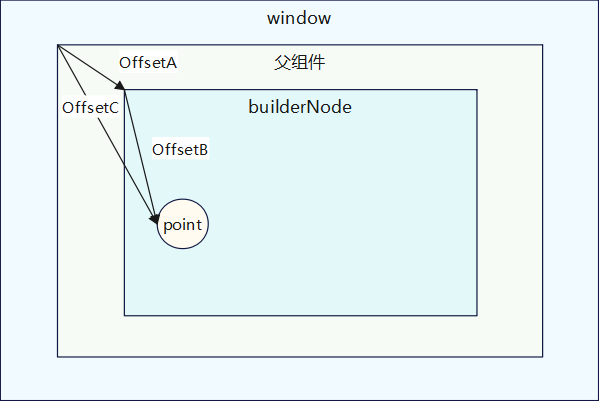
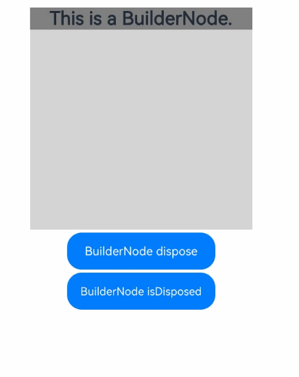
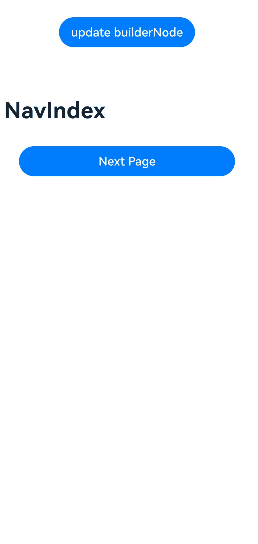
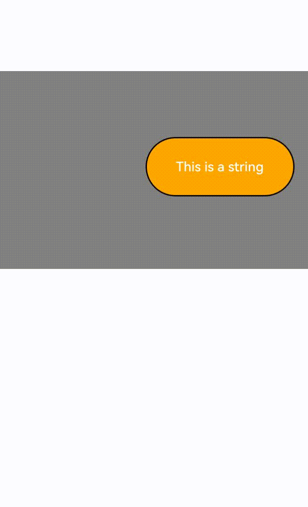
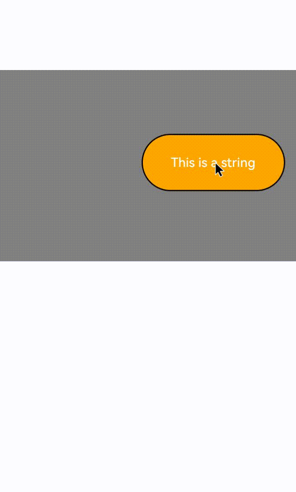
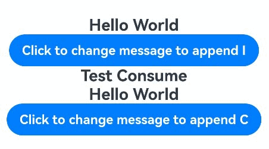

# BuilderNode
<!--Kit: ArkUI-->
<!--Subsystem: ArkUI-->
<!--Owner: @sunbees-->
<!--Designer: @sunbees-->
<!--Tester: @khq-->
<!--Adviser: @Brilliantry_Rui-->

提供能够挂载系统组件的自定义节点BuilderNode。BuilderNode仅可作为叶子节点使用，支持通过@Builder生成组件树、实现组件复用与回收、跨节点事件分发以及状态同步，适用于在应用内动态创建和管理自定义组件节点的场景。使用方式参考[BuilderNode开发指南](../../ui/arkts-user-defined-arktsNode-builderNode.md)。最佳实践请参考组件动态创建-[组件动态添加、更新和删除](https://developer.huawei.com/consumer/cn/doc/harmonyos-guides/arkts-ui-component-dynamic-creation#组件动态添加更新和删除)。

与BuilderNode相比，ReactiveBuilderNode能通过多参数的无状态UI方法@Builder生成组件树，适用于需要多参数数据绑定和响应式UI动态更新的场景。

> **说明：**
>
> - 本模块首批接口从API version 11开始支持。后续版本的新增接口，采用上角标单独标记接口的起始版本。
>
> - 本模块接口仅可在Stage模型下使用。
>
> - 若传入的Builder的根节点为语法节点（[if/else](../../ui/rendering-control/arkts-rendering-control-ifelse.md)/[ForEach](../../ui/rendering-control/arkts-rendering-control-foreach.md)/[LazyForEach](../../ui/rendering-control/arkts-rendering-control-lazyforeach.md)/[ContentSlot](../../ui/rendering-control/arkts-rendering-control-contentslot.md)…）、[Span](./arkui-ts/ts-basic-components-span.md)、[ContainerSpan](./arkui-ts/ts-basic-components-containerspan.md)、[SymbolSpan](./arkui-ts/ts-basic-components-symbolSpan.md)或自定义组件，将额外生成一个[FrameNode](./js-apis-arkui-frameNode.md)，在节点树中显示为“BuilderProxyNode”，这会导致树结构变化，影响事件传递等测试流程。详情参见[BuilderNode内的BuilderProxyNode导致树结构发生变化](../../ui/arkts-user-defined-arktsNode-builderNode.md#buildernode内的builderproxynode导致树结构发生变化)。
>
> - 如果在跨页面复用BuilderNode时显示异常，可参考[跨页面复用注意事项](../../ui/arkts-user-defined-arktsNode-builderNode.md#跨页面复用注意事项)。
>
> - 当前不支持在预览器中使用BuilderNode。
>
> - BuilderNode下的自定义组件支持使用[@Prop装饰器](../../ui/state-management/arkts-prop.md)。不支持使用[@Link装饰器](../../ui/state-management/arkts-link.md)来跨越BuilderNode同步外界的数据和状态。
>
> - 如果BuilderNode的子节点是自定义组件，不支持该自定义组件使用[@Reusable装饰器](../../ui/state-management/arkts-reusable.md)，详细内容参见[BuilderNode在子自定义组件中使用@Reusable装饰器](../../ui/arkts-user-defined-arktsNode-builderNode.md#buildernode在子自定义组件中使用reusable装饰器)。
>
> - 从API version 12开始，自定义组件支持接收[LocalStorage](../../ui/state-management/arkts-localstorage.md)实例。可以通过[传递LocalStorage实例](../../ui/state-management/arkts-localstorage.md#自定义组件接收localstorage实例)来使用LocalStorage相关的装饰器[@LocalStorageProp](../../ui/state-management/arkts-localstorage.md#localstorageprop)、[@LocalStorageLink](../../ui/state-management/arkts-localstorage.md#localstoragelink)。
>
> - 从API version 20开始，通过配置[BuildOptions](#buildoptions12)，内部自定义组件的[@Consume](../../ui/state-management/arkts-provide-and-consume.md)支持接收所在页面的[@Provide](../../ui/state-management/arkts-provide-and-consume.md)数据。
>
> - 其余装饰器行为未定义，不建议使用。
>
> - 仅支持在自定义组件中使用[Repeat](../../ui/rendering-control/arkts-new-rendering-control-repeat.md)。
>
> - BuilderNode对象不支持使用JSON序列化。

## 导入模块

```ts
import { BuilderNode, ReactiveBuilderNode, RenderOptions, NodeRenderType } from '@kit.ArkUI';
```

## NodeRenderType

节点渲染类型枚举。

**原子化服务API：** 从API version 12开始，该接口支持在原子化服务中使用。

**系统能力：** SystemCapability.ArkUI.ArkUI.Full

| 名称                | 值  | 说明                         |
| ------------------- | --- | ---------------------------- |
| RENDER_TYPE_DISPLAY | 0   | 表示该节点将被显示到屏幕上。 |
| RENDER_TYPE_TEXTURE | 1   | 表示该节点将被导出为纹理。   |

> **说明：**
>
> - RENDER_TYPE_TEXTURE类型目前仅在[BuilderNode](#buildernode-1)持有组件树的根节点为自定义组件时以及[XComponentNode](./js-apis-arkui-xcomponentNode.md)中设置生效。
>
> - 在[BuilderNode](#buildernode-1)的情况下，目前在作为根节点的自定义组件中支持纹理导出的有以下组件：[Badge](arkui-ts/ts-container-badge.md)、[Blank](arkui-ts/ts-basic-components-blank.md)、[Button](arkui-ts/ts-basic-components-button.md)、[CanvasGradient](arkui-ts/ts-components-canvas-canvasgradient.md)、[CanvasPattern](arkui-ts/ts-components-canvas-canvaspattern.md)、[CanvasRenderingContext2D](arkui-ts/ts-canvasrenderingcontext2d.md)、[Canvas](arkui-ts/ts-components-canvas-canvas.md)、[CheckboxGroup](arkui-ts/ts-basic-components-checkboxgroup.md)、[Checkbox](arkui-ts/ts-basic-components-checkbox.md)、[Circle](arkui-ts/ts-drawing-components-circle.md)、[ColumnSplit](arkui-ts/ts-container-columnsplit.md)、[Column](arkui-ts/ts-container-column.md)、[ContainerSpan](arkui-ts/ts-basic-components-containerspan.md)、[Counter](arkui-ts/ts-container-counter.md)、[DataPanel](arkui-ts/ts-basic-components-datapanel.md)、[Divider](arkui-ts/ts-basic-components-divider.md)、[Ellipse](arkui-ts/ts-drawing-components-ellipse.md)、[Flex](arkui-ts/ts-container-flex.md)、[Gauge](arkui-ts/ts-basic-components-gauge.md)、[Hyperlink](arkui-ts/ts-container-hyperlink.md)、[ImageBitmap](arkui-ts/ts-components-canvas-imagebitmap.md)、[ImageData](arkui-ts/ts-components-canvas-imagedata.md)、[Image](arkui-ts/ts-basic-components-image.md)、[Line](arkui-ts/ts-drawing-components-line.md)、[LoadingProgress](arkui-ts/ts-basic-components-loadingprogress.md)、[Marquee](arkui-ts/ts-basic-components-marquee.md)、[Matrix2D](arkui-ts/ts-components-canvas-matrix2d.md)、[OffscreenCanvasRenderingContext2D](arkui-ts/ts-offscreencanvasrenderingcontext2d.md)、[OffscreenCanvas](arkui-ts/ts-components-offscreencanvas.md)、[Path2D](arkui-ts/ts-components-canvas-path2d.md)、[Path](arkui-ts/ts-drawing-components-path.md)、[PatternLock](arkui-ts/ts-basic-components-patternlock.md)、[Polygon](arkui-ts/ts-drawing-components-polygon.md)、[Polyline](arkui-ts/ts-drawing-components-polyline.md)、[Progress](arkui-ts/ts-basic-components-progress.md)、[QRCode](arkui-ts/ts-basic-components-qrcode.md)、[Radio](arkui-ts/ts-basic-components-radio.md)、[Rating](arkui-ts/ts-basic-components-rating.md)、[Rect](arkui-ts/ts-drawing-components-rect.md)、[RelativeContainer](arkui-ts/ts-container-relativecontainer.md)、[RowSplit](arkui-ts/ts-container-rowsplit.md)、[Row](arkui-ts/ts-container-row.md)、[Shape](arkui-ts/ts-drawing-components-shape.md)、[Slider](arkui-ts/ts-basic-components-slider.md)、[Span](arkui-ts/ts-basic-components-span.md)、[Stack](arkui-ts/ts-container-stack.md)、[TextArea](arkui-ts/ts-basic-components-textarea.md)、[TextClock](arkui-ts/ts-basic-components-textclock.md)、[TextInput](arkui-ts/ts-basic-components-textinput.md)、[TextTimer](arkui-ts/ts-basic-components-texttimer.md)、[Text](arkui-ts/ts-basic-components-text.md)、[Toggle](arkui-ts/ts-basic-components-toggle.md)、[Video](arkui-ts/ts-media-components-video.md)（不含全屏播放能力）、[Web](../apis-arkweb/arkts-basic-components-web.md)、[XComponent](arkui-ts/ts-basic-components-xcomponent.md)。
>
> - 从API version 12开始，新增以下组件支持纹理导出：[DatePicker](arkui-ts/ts-basic-components-datepicker.md)、[ForEach](arkui-ts/ts-rendering-control-foreach.md)、[Grid](arkui-ts/ts-container-grid.md)、[if/else](../../ui/rendering-control/arkts-rendering-control-ifelse.md)、[LazyForEach](arkui-ts/ts-rendering-control-lazyforeach.md)、[List](arkui-ts/ts-container-list.md)、[Scroll](arkui-ts/ts-container-scroll.md)、[Swiper](arkui-ts/ts-container-swiper.md)、[TimePicker](arkui-ts/ts-basic-components-timepicker.md)、[@Component](../../ui/state-management/arkts-create-custom-components.md#component)修饰的自定义组件、[NodeContainer](arkui-ts/ts-basic-components-nodecontainer.md)以及[NodeContainer](arkui-ts/ts-basic-components-nodecontainer.md)下挂载的[FrameNode](./js-apis-arkui-frameNode.md)和[RenderNode](./js-apis-arkui-renderNode.md)。
>
> - 使用方式可参考[同层渲染绘制](../../web/web-same-layer.md)。

## RenderOptions

创建BuilderNode时的可选参数。

**原子化服务API：** 从API version 12开始，该接口支持在原子化服务中使用。

**系统能力：** SystemCapability.ArkUI.ArkUI.Full

| 名称          | 类型                                   | 只读 | 可选 | 说明                                                         |
| ------------- | -------------------------------------- | ---- | ---- | ------------------------------------------------------------ |
| selfIdealSize | [Size](js-apis-arkui-graphics.md#size) | 否   | 是 | 节点的理想大小。当将BuilderNode生成的内容嵌入到其它RenderNode中显示时，需要显式指定selfIdealSize，否则Builder内的节点默认父组件布局约束为[0, 0]。<br>默认值：{ width: 0, height: 0 } |
| type          | [NodeRenderType](#noderendertype)      | 否   | 是 | 节点的渲染类型。当取值为NodeRenderType.RENDER_TYPE_TEXTURE时，仅在BuilderNode持有组件树的根节点为自定义组件时设置生效。<br>默认值：NodeRenderType.RENDER_TYPE_DISPLAY |
| surfaceId     | string                                 | 否   | 是 | 纹理接收方的surfaceId。纹理接收方一般为[OH_NativeImage](../apis-arkgraphics2d/capi-oh-nativeimage-oh-nativeimage.md)。<br>surfaceId仅当type为NodeRenderType.RENDER_TYPE_TEXTURE时生效。<br>默认值："" |

## BuildOptions<sup>12+</sup>

build的可选参数。

**系统能力：** SystemCapability.ArkUI.ArkUI.Full

| 名称          | 类型               | 只读 | 可选 | 说明                                                         |
| ------------- | ----------------- | ---- | ---- | ------------------------------------------------------------ |
| nestingBuilderSupported | boolean | 否   | 是   | 是否支持Builder嵌套Builder使用。其中，true表示支持，false表示不支持。<br>默认值：false <br>**模型约束：** 此接口仅可在Stage模型下使用。<br>**原子化服务API：** 从API version 12开始，该接口支持在原子化服务中使用。 |
| localStorage<sup>20+</sup> | [LocalStorage](../../ui/state-management/arkts-localstorage.md) | 否   | 是   | 给当前BuilderNode设置LocalStorage，挂载在此BuilderNode下的自定义组件共享该LocalStorage。如果自定义组件构造函数同时也传入LocalStorage，优先使用构造函数中传入的LocalStorage。<br>默认值：null <br>**原子化服务API：** 从API version 20开始，该接口支持在原子化服务中使用。 |
| enableProvideConsumeCrossing<sup>20+</sup> | boolean | 否   | 是   | 定义BuilderNode内[状态管理V1](../../ui/state-management/arkts-state-management-overview.md#状态管理v1)自定义组件的[@Consume](../../ui/state-management/arkts-provide-and-consume.md)变量是否与BuilderNode外部的[@Provide](../../ui/state-management/arkts-provide-and-consume.md)变量双向同步，BuilderNode内[状态管理V2](../../ui/state-management/arkts-state-management-overview.md#状态管理v2)自定义组件的[@Consumer](../../ui/state-management/arkts-new-provider-and-consumer.md)变量是否与BuilderNode外部的[@Provider](../../ui/state-management/arkts-new-provider-and-consumer.md)变量双向同步。<br>从API version 20开始支持状态管理V1自定义组件的双向同步，从API version 23开始支持状态管理V2自定义组件的双向同步。<br>true表示支持，false表示不支持。<br>默认值：false <br>**原子化服务API：** 从API version 20开始，该接口支持在原子化服务中使用。 |

## InputEventType<sup>20+</sup>

type InputEventType = TouchEvent | MouseEvent | AxisEvent

[postInputEvent](#postinputevent20)的参数，定义要发送的输入事件类型。

**原子化服务API：** 从API version 20开始，该接口支持在原子化服务中使用。

**系统能力：** SystemCapability.ArkUI.ArkUI.Full

| 类型 | 说明                                   |
| ------------- | -------------------------------------- |
| [TouchEvent](arkui-ts/ts-universal-events-touch.md#touchevent对象说明)  | 触摸事件。 |
| [MouseEvent](arkui-ts/ts-universal-mouse-key.md#mouseevent对象说明)  | 鼠标事件。 |
| [AxisEvent](arkui-ts/ts-universal-events-axis.md#axisevent)  | 轴事件。 |

## BuilderNode

class BuilderNode\<Args extends Object[]>

BuilderNode支持通过无状态的UI方法[@Builder](../../ui/state-management/arkts-builder.md)生成组件树，并持有组件树的根节点。不支持定义为状态变量。BuilderNode中持有的FrameNode仅用于将该BuilderNode作为子节点挂载到其他FrameNode上。对BuilderNode持有的FrameNode进行属性设置与子节点操作可能会产生未定义行为，因此不建议通过BuilderNode的[getFrameNode](#getframenode)方法和[FrameNode](js-apis-arkui-frameNode.md)的[getRenderNode](js-apis-arkui-frameNode.md#getrendernode)方法获取RenderNode，并通过[RenderNode](js-apis-arkui-renderNode.md)的接口对其进行属性设置与子节点操作。

**原子化服务API：** 从API version 12开始，该接口支持在原子化服务中使用。

**系统能力：** SystemCapability.ArkUI.ArkUI.Full

### constructor

constructor(uiContext: UIContext, options?: RenderOptions)

当将BuilderNode生成的内容嵌入到其它RenderNode中显示时，需要显式指定RenderOptions中的selfIdealSize，否则Builder内的节点默认父组件布局约束为[0, 0]。该场景下，若不设置selfIdealSize则认为BuilderNode中子树的根节点大小为[0, 0]。

**原子化服务API：** 从API version 12开始，该接口支持在原子化服务中使用。

**系统能力：** SystemCapability.ArkUI.ArkUI.Full

**参数：**

| 参数名    | 类型                                    | 必填 | 说明                                                              |
| --------- | --------------------------------------- | ---- | ----------------------------------------------------------------- |
| uiContext | [UIContext](arkts-apis-uicontext-uicontext.md) | 是   | UI上下文，获取方式可参考[UIContext获取方法](./js-apis-arkui-node.md#uicontext获取方法)。uiContext需要为一个有效的值，即UI上下文正确，如果传入非法值或者未设置，会导致创建失败。 |
| options   | [RenderOptions](#renderoptions)         | 否   | BuilderNode的构造可选参数，参数用于构造节点的理想大小和节点的渲染类型。<br>默认值：undefined   |

> **说明：**
> uiContext的入参需要为一个有效的值，即UI上下文正确，如果传入非法值或者未设置，会导致创建失败。

### build

build(builder: WrappedBuilder\<Args>, arg?: Object): void

依照传入的对象创建组件树，并持有组件树的根节点。无状态的UI方法[@Builder](../../ui/state-management/arkts-builder.md)最多拥有一个根节点。

支持自定义组件。

> **说明：**
>
> - @Builder嵌套使用的时候需要保证内外的@Builder方法的入参对象一致。
>
> - 最外层的@Builder只支持一个入参。
>
> - build的参数是值传递，需要使用[update](#update)接口进行更新。
>
> - 需要操作BuilderNode中的对象时，需要保证其引用不被回收。当BuilderNode对象被虚拟机回收之后，它的[FrameNode](js-apis-arkui-frameNode.md)、[RenderNode](js-apis-arkui-renderNode.md)对象也会与后端节点解引用。即从BuilderNode中获取的FrameNode对象不对应任何一个节点。
>
> - BuilderNode对象会持有实体节点的引用。如果不需要使用BuilderNode前端对象管理后端节点，可以调用[dispose](#dispose12)接口，实现前后端对象的解绑。

**原子化服务API：** 从API version 12开始，该接口支持在原子化服务中使用。

**系统能力：** SystemCapability.ArkUI.ArkUI.Full

**参数：**

| 参数名  | 类型                                                            | 必填 | 说明                                                                                   |
| ------- | --------------------------------------------------------------- | ---- | -------------------------------------------------------------------------------------- |
| builder | [WrappedBuilder\<Args>](../../ui/state-management/arkts-wrapBuilder.md) | 是   | 创建对应节点树的时候所需的无状态UI方法[@Builder](../../ui/state-management/arkts-builder.md)。 |
| arg     | Object                                                          | 否   | builder的入参。当前仅支持一个入参，且入参对象类型与@Builder定义的入参类型保持一致。<br>默认值：undefined |

### build<sup>12+</sup>

build(builder: WrappedBuilder\<Args>, arg: Object, options: BuildOptions): void

依照传入的对象创建组件树，并持有组件树的根节点。无状态的UI方法[@Builder](../../ui/state-management/arkts-builder.md)最多拥有一个根节点。

支持自定义组件。相比[build(builder: WrappedBuilder\<Args>, arg?: Object)](#build)接口，本接口支持builder的配置参数，用于配置Builder的构建行为，具体属性见[BuildOptions](#buildoptions12)。

> **说明：**
> 
> - @Builder进行创建和更新的规格参考[@Builder](../../ui/state-management/arkts-builder.md)。
> 
> - @Builder嵌套使用的时候需要保证内外的@Builder方法的入参对象一致。
> 
> - 最外层的@Builder只支持一个入参。
> 
> - build的参数是值传递，需要使用[update](#update)接口进行更新。
> 
> - 需要操作BuilderNode中的对象时，需要保证其引用不被回收。当BuilderNode对象被虚拟机回收之后，它的[FrameNode](js-apis-arkui-frameNode.md)、[RenderNode](js-apis-arkui-renderNode.md)对象也会与后端节点解引用。即从BuilderNode中获取的FrameNode对象不对应任何一个节点。
> 
> - BuilderNode对象会持有实体节点的引用。如果不需要使用BuilderNode前端对象管理后端节点，可以调用[dispose](#dispose12)接口，实现前后端对象的解绑。

**原子化服务API：** 从API version 12开始，该接口支持在原子化服务中使用。

**系统能力：** SystemCapability.ArkUI.ArkUI.Full

**参数：**

| 参数名  | 类型                                                            | 必填 | 说明                                                                                    |
| ------- | --------------------------------------------------------------- | ---- | -------------------------------------------------------------------------------------- |
| builder | [WrappedBuilder\<Args>](../../ui/state-management/arkts-wrapBuilder.md) | 是   | 创建对应节点树的时候所需的无状态UI方法[@Builder](../../ui/state-management/arkts-builder.md)。   |
| arg     | Object                                                          | 是   | builder的入参。当前仅支持一个入参，且入参对象类型与@Builder定义的入参类型保持一致。                                                            |
| options | [BuildOptions](#buildoptions12)                                           | 是   | builder的配置参数，用于配置Builder的构建行为，具体属性和说明见[BuildOptions](#buildoptions12)。                                         |

**示例：**
```ts
import { BuilderNode, NodeContent } from '@kit.ArkUI';

// 定义传递参数的接口
interface ParamsInterface {
  text: string;
  func: Function;
}

@Builder
function buildTextWithFunc(func: Function) {
  Text(func())
    .fontSize(50)
    .fontWeight(FontWeight.Bold)
    .margin({ bottom: 36 })
}

@Builder
function buildText(params: ParamsInterface) {
  Column() {
    Text(params.text)
      .fontSize(50)
      .fontWeight(FontWeight.Bold)
      .margin({ bottom: 36 })
    buildTextWithFunc(params.func)
  }
}


@Entry
@Component
struct Index {
  @State message: string = 'HELLO';
  private content: NodeContent = new NodeContent();

  build() {
    Row() {
      Column() {
        Button('addBuilderNode')
          .onClick(() => {
            let buildNode = new BuilderNode<[ParamsInterface]>(this.getUIContext());
            // 创建节点树
            buildNode.build(wrapBuilder<[ParamsInterface]>(buildText), {
              text: this.message, func: () => {
                return 'FUNCTION';
              }
            }, { nestingBuilderSupported: true });
            this.content.addFrameNode(buildNode.getFrameNode());
            buildNode.dispose();
          })
        ContentSlot(this.content)
      }
      .id('column')
      .width('100%')
      .height('100%')
    }
    .height('100%')
  }
}
```

### getFrameNode

getFrameNode(): FrameNode | null

获取BuilderNode中的[FrameNode](js-apis-arkui-frameNode.md)。在BuilderNode执行build操作之后，才会生成FrameNode。

**原子化服务API：** 从API version 12开始，该接口支持在原子化服务中使用。

**系统能力：** SystemCapability.ArkUI.ArkUI.Full

**返回值：**

| 类型                                                      | 说明                                                                  |
| --------------------------------------------------------- | --------------------------------------------------------------------- |
| [FrameNode](js-apis-arkui-frameNode.md) \| null | BuilderNode持有的FrameNode对象，用于将该BuilderNode作为子节点挂载到其他FrameNode上。若该BuilderNode不包含FrameNode，则返回空对象null。 |

**示例1：**

BuilderNode作为[NodeContainer](arkui-ts/ts-basic-components-nodecontainer.md)的根节点返回。

```ts
import { NodeController, BuilderNode, FrameNode, UIContext } from '@kit.ArkUI';

// 定义传递参数的类
class Params {
  text: string = '';
  constructor(text: string) {
    this.text = text;
  }
}

@Builder
function buildText(params: Params) {
  Column() {
    Text(params.text)
      .fontSize(50)
      .fontWeight(FontWeight.Bold)
      .margin({bottom: 36})
  }
}

// 继承NodeController实现自定义textNode控制器
class TextNodeController extends NodeController {
  private textNode: BuilderNode<[Params]> | null = null;
  private message: string = 'DEFAULT';

  constructor(message: string) {
    super();
    this.message = message;
  }

  makeNode(context: UIContext): FrameNode | null {
    this.textNode = new BuilderNode(context);
    this.textNode.build(wrapBuilder<[Params]>(buildText), new Params(this.message));
    // 返回当前BuilderNode包含的FrameNode
    return this.textNode.getFrameNode();
  }

  aboutToDisappear() {
    this.textNode?.dispose();
  }
}

@Entry
@Component
struct Index {
  @State message: string = 'hello';

  build() {
    Row() {
      Column() {
        NodeContainer(new TextNodeController(this.message))
          .width('100%')
          .height(100)
          .backgroundColor('#FFF0F0F0')
      }
      .width('100%')
      .height('100%')
    }
    .height('100%')
  }
}
```

**示例2：**

BuilderNode的[FrameNode](js-apis-arkui-frameNode.md)挂到其它FrameNode下。

```ts
import { NodeController, BuilderNode, FrameNode, UIContext } from '@kit.ArkUI';

// 定义传递参数的类
class Params {
  text: string = '';

  constructor(text: string) {
    this.text = text;
  }
}

@Builder
function buildText(params: Params) {
  Column() {
    Text(params.text)
      .fontSize(50)
      .fontWeight(FontWeight.Bold)
      .margin({ bottom: 36 })
  }
}

// 继承NodeController实现自定义textNode控制器
class TextNodeController extends NodeController {
  private rootNode: FrameNode | null = null;
  private textNode: BuilderNode<[Params]> | null = null;
  private message: string = 'DEFAULT';

  constructor(message: string) {
    super();
    this.message = message;
  }

  makeNode(context: UIContext): FrameNode | null {
    this.rootNode = new FrameNode(context);
    this.textNode = new BuilderNode(context, { selfIdealSize: { width: 150, height: 150 } });
    this.textNode.build(wrapBuilder<[Params]>(buildText), new Params(this.message));
    if (this.rootNode !== null) {
      // 将BuilderNode的FrameNode挂至其他FrameNode
      this.rootNode.appendChild(this.textNode?.getFrameNode());
    }

    return this.rootNode;
  }

  aboutToDisappear() {
    this.textNode?.dispose();
  }
}

@Entry
@Component
struct Index {
  @State message: string = 'hello';

  build() {
    Row() {
      Column() {
        NodeContainer(new TextNodeController(this.message))
          .width('100%')
          .height(100)
          .backgroundColor('#FFF0F0F0')
      }
      .width('100%')
      .height('100%')
    }
    .height('100%')
  }
}
```

**示例3：**

BuilderNode的[RenderNode](./js-apis-arkui-renderNode.md)挂到其它RenderNode下。由于RenderNode不传递布局约束，不推荐通过该方式挂载节点。

```ts
import { NodeController, BuilderNode, FrameNode, UIContext, RenderNode } from '@kit.ArkUI';
// 自定义传递参数的类
class Params {
  text: string = '';

  constructor(text: string) {
    this.text = text;
  }
}

@Builder
function buildText(params: Params) {
  Column() {
    Text(params.text)
      .fontSize(50)
      .fontWeight(FontWeight.Bold)
      .margin({ bottom: 36 })
  }
}

// 继承NodeController实现自定义textNode控制器
class TextNodeController extends NodeController {
  private rootNode: FrameNode | null = null;
  private textNode: BuilderNode<[Params]> | null = null;
  private message: string = 'DEFAULT';

  constructor(message: string) {
    super();
    this.message = message;
  }

  makeNode(context: UIContext): FrameNode | null {
    this.rootNode = new FrameNode(context);
    let renderNode = new RenderNode();
    renderNode.clipToFrame = false;
    this.textNode = new BuilderNode(context, { selfIdealSize: { width: 150, height: 150 } });
    this.textNode.build(wrapBuilder<[Params]>(buildText), new Params(this.message));
    const textRenderNode = this.textNode?.getFrameNode()?.getRenderNode();

    const rootRenderNode = this.rootNode.getRenderNode();
    if (rootRenderNode !== null) {
      rootRenderNode.appendChild(renderNode);
    // 将BuilderNode的RenderNode挂至其他RenderNode
      renderNode.appendChild(textRenderNode);
    }

    return this.rootNode;
  }

  aboutToDisappear() {
    this.textNode?.dispose();
  }
}

@Entry
@Component
struct Index {
  @State message: string = 'hello';

  build() {
    Row() {
      Column() {
        NodeContainer(new TextNodeController(this.message))
          .width('100%')
          .height(100)
          .backgroundColor('#FFF0F0F0')
      }
      .width('100%')
      .height('100%')
    }
    .height('100%')
  }
}
```

### update

update(arg: Object): void

根据提供的参数更新BuilderNode，该参数与[build](#build)方法调用时传入的参数类型相同。对自定义组件进行update的时候需要在自定义组件中将使用的变量定义为[@Prop](../../ui/state-management/arkts-prop.md)类型。

**原子化服务API：** 从API version 12开始，该接口支持在原子化服务中使用。

**系统能力：** SystemCapability.ArkUI.ArkUI.Full

**参数：**

| 参数名 | 类型   | 必填 | 说明                                                                     |
| ------ | ------ | ---- | ------------------------------------------------------------------------ |
| arg    | Object | 是   | 用于更新BuilderNode的参数，和[build](#build)调用时传入的参数类型一致。 |

**示例：**
```ts
import { NodeController, BuilderNode, FrameNode, UIContext } from '@kit.ArkUI';

// 自定义传递参数的类
class Params {
  text: string = '';
  constructor(text: string) {
    this.text = text;
  }
}

// 自定义组件
@Component
struct TextBuilder {
  @Prop message: string = 'TextBuilder';

  build() {
    Row() {
      Column() {
        Text(this.message)
          .fontSize(50)
          .fontWeight(FontWeight.Bold)
          .margin({bottom: 36})
          .backgroundColor(Color.Gray)
      }
    }
  }
}

@Builder
function buildText(params: Params) {
  Column() {
    Text(params.text)
      .fontSize(50)
      .fontWeight(FontWeight.Bold)
      .margin({ bottom: 36 })
    TextBuilder({message: params.text}) // 自定义组件
  }
}

// 继承NodeController实现自定义textNode控制器
class TextNodeController extends NodeController {
  private rootNode: FrameNode | null = null;
  private textNode: BuilderNode<[Params]> | null = null;
  private message: string = '';

  constructor(message: string) {
    super();
    this.message = message;
  }

  makeNode(context: UIContext): FrameNode | null {
    this.textNode = new BuilderNode(context);
    this.textNode.build(wrapBuilder<[Params]>(buildText), new Params(this.message));
    return this.textNode.getFrameNode();
  }

  // 根据传入参数更新BuilderNode
  update(message: string) {
    if (this.textNode !== null) {
      this.textNode.update(new Params(message));
    }
  }
  aboutToDisappear() {
    this.textNode?.dispose();
  }
}

@Entry
@Component
struct Index {
  @State message: string = 'hello';
  private textNodeController: TextNodeController = new TextNodeController(this.message);
  private count = 0;

  build() {
    Row() {
      Column() {
        NodeContainer(this.textNodeController)
          .width('100%')
          .height(200)
          .backgroundColor('#FFF0F0F0')
        Button('Update')
          .onClick(() => {
            this.count += 1;
            const message = 'Update ' + this.count.toString();
            this.textNodeController.update(message);
          })
      }
      .width('100%')
      .height('100%')
    }
    .height('100%')
  }
}
```

### postTouchEvent

postTouchEvent(event: TouchEvent): boolean

将原始事件派发到某个BuilderNode创建出的FrameNode上。适用于在自定义NodeContainer中将父组件接收的触摸事件转发给BuilderNode内部组件，使内部组件能够响应触摸交互的场景。

postTouchEvent是从组件树的中间节点往下分发，需要变换到父组件坐标系才能分发成功，参考下图。

offsetA为builderNode相对于父组件的偏移量，可以通过FrameNode中的[getPositionToParent](js-apis-arkui-frameNode.md#getpositiontoparent12)获取。offsetB为触点相对于builderNode的偏移量，可以通过[TouchEvent](arkui-ts/ts-universal-events-touch.md#touchevent对象说明)获取。offsetC为offsetA与offsetB的和，是传给postTouchEvent的最终结果。



> **说明：** 
>
> - 传入的坐标值需要转换为px，如果builderNode有仿射变换，则需要再叠加仿射变换。
>
> - 在[webview](../apis-arkweb/arkts-apis-webview.md)中，内部已经处理过坐标系变换，可以将TouchEvent事件直接下发。
>
> - 同一时间戳，postTouchEvent只能调用一次。<!--Del-->
>
> - 不支持[UIExtensionComponent](arkui-ts/ts-container-ui-extension-component-sys.md)。
<!--DelEnd-->

**原子化服务API：** 从API version 12开始，该接口支持在原子化服务中使用。

**系统能力：** SystemCapability.ArkUI.ArkUI.Full

**参数：**

| 参数名 | 类型                                                                      | 必填 | 说明       |
| ------ | ------------------------------------------------------------------------- | ---- | ---------- |
| event  | [TouchEvent](arkui-ts/ts-universal-events-touch.md#touchevent对象说明) | 是   | 用于派发到BuilderNode创建出的FrameNode上的触摸事件。 |

**返回值：**

| 类型    | 说明               |
| ------- | ------------------ |
| boolean | 派发事件是否成功。true：已命中响应事件的组件；false：未命中任何可响应事件的组件。<br>**说明：**<br>如果未按照预期命中组件，需要确认以下几点：<br>1. 坐标系是否转换正确。<br>2. 组件是否处于可交互状态。<br>3. 是否绑定事件。 |

**示例：**

```ts
import { NodeController, BuilderNode, FrameNode, UIContext } from '@kit.ArkUI';

// 自定义传递参数的类
class Params {
  text: string = 'this is a text';
}

@Builder
function ButtonBuilder(params: Params) {
  Column() {
    Button(`button ` + params.text)
      .borderWidth(2)
      .backgroundColor(Color.Orange)
      .width('100%')
      .height('100%')
      .gesture(
        TapGesture()
          .onAction((event: GestureEvent) => {
            console.info('TapGesture');
          })
      )
  }
  .width(500)
  .height(300)
  .backgroundColor(Color.Gray)
}

// 继承NodeController实现自定义UI控制器
class MyNodeController extends NodeController {
  private rootNode: BuilderNode<[Params]> | null = null;
  private wrapBuilder: WrappedBuilder<[Params]> = wrapBuilder(ButtonBuilder);

  makeNode(uiContext: UIContext): FrameNode | null {
    this.rootNode = new BuilderNode(uiContext);
    this.rootNode.build(this.wrapBuilder, { text: 'this is a string' });
    return this.rootNode.getFrameNode();
  }

  // 坐标转换示例
  postTouchEvent(event: TouchEvent, uiContext: UIContext): boolean {
    if (this.rootNode == null) {
      return false;
    }
    let node: FrameNode | null = this.rootNode.getFrameNode();
    let offsetX: number | null | undefined = node?.getPositionToParent().x;
    let offsetY: number | null | undefined = node?.getPositionToParent().y;
    
    let changedTouchLen = event.changedTouches.length;
    for (let i = 0; i < changedTouchLen; i++) {
      if (offsetX != null && offsetY != null && offsetX != undefined && offsetY != undefined) {
        event.changedTouches[i].x = uiContext.vp2px(offsetX + event.changedTouches[i].x);
        event.changedTouches[i].y = uiContext.vp2px(offsetY + event.changedTouches[i].y);
      }
    }
    // 将事件派发至BuilderNode创建的FrameNode上，result记录派发是否成功
    let result = this.rootNode.postTouchEvent(event);
    console.info(`result ${result}`);
    return result;
  }

  aboutToDisappear() {
    this.rootNode?.dispose();
  }
}

@Entry
@Component
struct MyComponent {
  private nodeController: MyNodeController = new MyNodeController();

  build() {
    Column() {
      NodeContainer(this.nodeController)
        .height(300)
        .width(500)

      Column()
        .width(500)
        .height(300)
        .backgroundColor(Color.Pink)
        .onTouch((event) => {
          if (event != undefined) {
            this.nodeController.postTouchEvent(event, this.getUIContext());
          }
        })
    }
  }
}
```

### dispose<sup>12+</sup>

dispose(): void

立即释放当前BuilderNode对象对[实体节点](../../ui/arkts-user-defined-node.md#基本概念)的引用关系。关于BuilderNode的解绑场景请参见[节点解绑](../../ui/arkts-user-defined-arktsNode-builderNode.md#解除实体节点引用关系)。

> **说明：**
>
> 当BuilderNode对象调用dispose之后，会与后端实体节点解除引用关系。若前端对象BuilderNode无法释放，容易导致内存泄漏。建议在不再需要对该BuilderNode对象进行操作时，开发者主动调用dispose释放后端节点，以减少引用关系的复杂性，降低内存泄漏的风险。具体场景可见[BuilderNode前后端循环引用导致的内存泄漏问题](../../ui/arkts-user-defined-node-faq.md#buildernode前后端循环引用导致的内存泄漏问题)。

**原子化服务API：** 从API version 12开始，该接口支持在原子化服务中使用。

**系统能力：** SystemCapability.ArkUI.ArkUI.Full

```ts
import { FrameNode, NodeController, BuilderNode } from '@kit.ArkUI';

// 自定义组件
@Component
struct TestComponent {
  build() {
    Column() {
      Text('This is a BuilderNode.')
        .fontSize(16)
        .fontWeight(FontWeight.Bold)
    }
    .width('100%')
    .backgroundColor(Color.Gray)
  }

  aboutToAppear() {
    console.info('aboutToAppear');
  }

  aboutToDisappear() {
    console.info('aboutToDisappear');
  }
}

@Builder
function buildComponent() {
  TestComponent()
}

// 继承NodeController实现自定义UI控制器
class MyNodeController extends NodeController {
  private rootNode: FrameNode | null = null;
  private builderNode: BuilderNode<[]> | null = null;

  makeNode(uiContext: UIContext): FrameNode | null {
    this.rootNode = new FrameNode(uiContext);
    this.builderNode = new BuilderNode(uiContext, { selfIdealSize: { width: 200, height: 100 } });
    this.builderNode.build(new WrappedBuilder(buildComponent));

    const rootRenderNode = this.rootNode!.getRenderNode();
    if (rootRenderNode !== null) {
      rootRenderNode.size = { width: 200, height: 200 };
      rootRenderNode.backgroundColor = 0xff00ff00;
      rootRenderNode.appendChild(this.builderNode!.getFrameNode()!.getRenderNode());
    }

    return this.rootNode;
  }

  // 解除当前builderNode与后端实体的引用关系
  dispose() {
    if (this.builderNode !== null) {
      this.builderNode.dispose();
    }
  }

  removeBuilderNode() {
    const rootRenderNode = this.rootNode!.getRenderNode();
    if (rootRenderNode !== null && this.builderNode !== null && this.builderNode.getFrameNode() !== null) {
      rootRenderNode.removeChild(this.builderNode!.getFrameNode()!.getRenderNode());
    }
  }
}

@Entry
@Component
struct Index {
  private myNodeController: MyNodeController = new MyNodeController();

  build() {
    Column({ space: 4 }) {
      NodeContainer(this.myNodeController)
      Button('BuilderNode dispose')
        .onClick(() => {
          this.myNodeController.removeBuilderNode();
          this.myNodeController.dispose();
        })
        .width('100%')
    }
  }
}
```

### reuse<sup>12+</sup>

reuse(param?: Object): void

触发BuilderNode中的自定义组件的复用。组件复用请参见[@Reusable装饰器：V1组件复用](../../ui/state-management/arkts-reusable.md)。关于BuilderNode的解绑场景请参见[节点解绑](../../ui/arkts-user-defined-arktsNode-builderNode.md#解除实体节点引用关系)。从API版本26.0.0开始，BuilderNode中的自定义组件支持V2组件复用，请参见[@ReusableV2装饰器：V2组件复用](../../ui/state-management/arkts-new-reusableV2.md)。

BuilderNode通过reuse和[recycle](#recycle12)完成其内外自定义组件之间的复用事件传递，具体使用场景请参见[BuilderNode调用reuse和recycle接口实现节点复用能力](../../ui/arkts-user-defined-arktsNode-builderNode.md#buildernode调用reuse和recycle接口实现节点复用能力)。

**原子化服务API：** 从API version 12开始，该接口支持在原子化服务中使用。

**系统能力：** SystemCapability.ArkUI.ArkUI.Full

**参数：**

| 参数名 | 类型   | 必填 | 说明                                                                     |
| ------ | ------ | ---- | ------------------------------------------------------------------------ |
| param  | Object | 否   | 用于复用BuilderNode的参数。该参数将直接用于BuilderNode中所有顶层自定义组件的复用，应该包含每个自定义组件的构造函数参数所需内容，否则，会导致未定义行为。调用此方法将同步触发内部自定义组件的[aboutToReuse](../../reference/apis-arkui/arkui-ts/ts-custom-component-lifecycle.md#abouttoreuse10)生命周期回调，并将该参数作为回调的入参。默认值为undefined，此时BuilderNode中的自定义组件将直接使用构造时的数据源。 |

### recycle<sup>12+</sup>

recycle(): void

触发BuilderNode中自定义组件的回收。自定义组件的回收是组件复用机制中的环节，具体信息请参见[@Reusable装饰器：V1组件复用](../../ui/state-management/arkts-reusable.md)。从API版本26.0.0开始，BuilderNode中的自定义组件支持V2组件复用，请参见[@ReusableV2装饰器：V2组件复用](../../ui/state-management/arkts-new-reusableV2.md)。

> **说明：**
>
> BuilderNode通过reuse和recycle完成其内外自定义组件之间的复用事件传递，具体使用场景请参见[BuilderNode调用reuse和recycle接口实现节点复用能力](../../ui/arkts-user-defined-arktsNode-builderNode.md#buildernode调用reuse和recycle接口实现节点复用能力)。

**原子化服务API：** 从API version 12开始，该接口支持在原子化服务中使用。

**系统能力：** SystemCapability.ArkUI.ArkUI.Full

```ts
import { FrameNode, NodeController, BuilderNode, UIContext } from '@kit.ArkUI';

const TEST_TAG: string = 'Reuse+Recycle';

// 自定义管理数据的类
class MyDataSource {
  private dataArray: string[] = [];
  private listener: DataChangeListener | null = null;

  public totalCount(): number {
    return this.dataArray.length;
  }

  public getData(index: number) {
    return this.dataArray[index];
  }

  public pushData(data: string) {
    this.dataArray.push(data);
  }

  public reloadListener(): void {
    this.listener?.onDataReloaded();
  }

  public registerDataChangeListener(listener: DataChangeListener): void {
    this.listener = listener;
  }

  public unregisterDataChangeListener(): void {
    this.listener = null;
  }
}

// 自定义传递参数的类
class Params {
  item: string = '';

  constructor(item: string) {
    this.item = item;
  }
}

@Builder
function buildNode(param: Params = new Params('hello')) {
  Row() {
    Text(`C${param.item} -- `)
    ReusableChildComponent2({ item: param.item }) // 该自定义组件在BuilderNode中无法被正确复用
  }
}

// 继承NodeController实现自定义UI控制器
class MyNodeController extends NodeController {
  public builderNode: BuilderNode<[Params]> | null = null;
  public item: string = '';

  makeNode(uiContext: UIContext): FrameNode | null {
    if (this.builderNode == null) {
      this.builderNode = new BuilderNode(uiContext, { selfIdealSize: { width: 300, height: 200 } });
      this.builderNode.build(wrapBuilder<[Params]>(buildNode), new Params(this.item));
    }
    return this.builderNode.getFrameNode();
  }
  aboutToDisappear() {
    this.builderNode?.dispose();
  }
}

// 被回收复用的自定义组件，其状态变量会更新，而子自定义组件ReusableChildComponent3中的状态变量也会更新，但BuilderNode会阻断这一传递过程
@Reusable
@Component
struct ReusableChildComponent {
  @Prop item: string = '';
  @Prop switch: string = '';
  private controller: MyNodeController = new MyNodeController();

  aboutToAppear() {
    this.controller.item = this.item;
  }

  aboutToRecycle(): void {
    console.info(`${TEST_TAG} ReusableChildComponent aboutToRecycle ${this.item}`);

    // 当开关为open，通过BuilderNode的reuse接口和recycle接口传递给其下的自定义组件，例如ReusableChildComponent2，完成复用
    if (this.switch === 'open') {
      this.controller?.builderNode?.recycle();
    }
  }

  aboutToReuse(params: object): void {
    console.info(`${TEST_TAG} ReusableChildComponent aboutToReuse ${JSON.stringify(params)}`);

    // 当开关为open，通过BuilderNode的reuse接口和recycle接口传递给其下的自定义组件，例如ReusableChildComponent2，完成复用
    if (this.switch === 'open') {
      this.controller?.builderNode?.reuse(params);
    }
  }

  build() {
    Row() {
      Text(`A${this.item}--`)
      ReusableChildComponent3({ item: this.item })
      NodeContainer(this.controller);
    }
  }
}

// 自定义组件
@Component
struct ReusableChildComponent2 {
  @Prop item: string = 'false';

  aboutToReuse(params: Record<string, object>) {
    console.info(`${TEST_TAG} ReusableChildComponent2 aboutToReuse ${JSON.stringify(params)}`);
  }

  aboutToRecycle(): void {
    console.info(`${TEST_TAG} ReusableChildComponent2 aboutToRecycle ${this.item}`);
  }

  build() {
    Row() {
      Text(`D${this.item}`)
        .fontSize(20)
        .backgroundColor(Color.Yellow)
        .margin({ left: 10 })
    }.margin({ left: 10, right: 10 })
  }
}

@Component
struct ReusableChildComponent3 {
  @Prop item: string = 'false';

  aboutToReuse(params: Record<string, object>) {
    console.info(`${TEST_TAG} ReusableChildComponent3 aboutToReuse ${JSON.stringify(params)}`);
  }

  aboutToRecycle(): void {
    console.info(`${TEST_TAG} ReusableChildComponent3 aboutToRecycle ${this.item}`);
  }

  build() {
    Row() {
      Text(`B${this.item}`)
        .fontSize(20)
        .backgroundColor(Color.Yellow)
        .margin({ left: 10 })
    }.margin({ left: 10, right: 10 })
  }
}


@Entry
@Component
struct Index {
  @State data: MyDataSource = new MyDataSource();

  aboutToAppear() {
    for (let i = 0; i < 100; i++) {
      this.data.pushData(i.toString());
    }
  }

  build() {
    Column() {
      List({ space: 3 }) {
        LazyForEach(this.data, (item: string) => {
          ListItem() {
            ReusableChildComponent({
              item: item,
              switch: 'open' // 将open改为close可观察到，BuilderNode不通过reuse和recycle接口传递复用时，BuilderNode内部的自定义组件的行为表现
            })
          }
        }, (item: string) => item)
      }
      .width('100%')
      .height('100%')
    }
  }
}
```
从API版本26.0.0开始，BuilderNode中的自定义组件支持V2组件复用。
```ts
import { FrameNode, NodeController, BuilderNode, UIContext } from '@kit.ArkUI';

const TEST_TAG: string = 'Reuse+Recycle';

class MyDataSource {
  private dataArray: string[] = [];
  private listener: DataChangeListener | null = null;

  public totalCount(): number {
    return this.dataArray.length;
  }

  public getData(index: number) {
    return this.dataArray[index];
  }

  public pushData(data: string) {
    this.dataArray.push(data);
  }

  public reloadListener(): void {
    this.listener?.onDataReloaded();
  }

  public registerDataChangeListener(listener: DataChangeListener): void {
    this.listener = listener;
  }

  public unregisterDataChangeListener(): void {
    this.listener = null;
  }
}

class Params {
  public item: string = '';

  constructor(item: string) {
    this.item = item;
  }
}

@Builder
function buildNode(param: Params = new Params('hello')) {
  Row() {
    Text(`C${param.item} -- `)
    ChildComponent2({ item: param.item })
  }
}

class MyNodeController extends NodeController {
  public builderNode: BuilderNode<[Params]> | null = null;
  public item: string = '';

  makeNode(uiContext: UIContext): FrameNode | null {
    if (this.builderNode == null) {
      this.builderNode = new BuilderNode(uiContext, { selfIdealSize: { width: 300, height: 200 } });
      this.builderNode.build(wrapBuilder<[Params]>(buildNode), new Params(this.item));
    }
    return this.builderNode.getFrameNode();
  }
  aboutToDisappear() {
    this.builderNode?.dispose();
  }
}

// 被回收复用的自定义组件，其状态变量会更新，而子自定义组件ChildComponent3中的状态变量也会更新，但BuilderNode会阻断这一传递过程。
@ReusableV2
@ComponentV2
struct ReusableChildComponent {
  @Param item: string = '';
  @Param switch: string = '';
  private controller: MyNodeController = new MyNodeController();

  aboutToAppear() {
    this.controller.item = this.item;
  }

  aboutToRecycle(): void {
    console.info(`${TEST_TAG} ReusableChildComponent aboutToRecycle ${this.item}`);

    // 当开关为open，通过BuilderNode的reuse接口和recycle接口传递给其下的自定义组件，例如ChildComponent2，完成复用。
    if (this.switch === 'open') {
      this.controller?.builderNode?.recycle();
    }
  }

  aboutToReuse(): void {
    console.info(`${TEST_TAG} ReusableChildComponent aboutToReuse`);

    // 当开关为open，通过BuilderNode的reuse接口和recycle接口传递给其下的自定义组件，例如ChildComponent2，完成复用。
    if (this.switch === 'open') {
      this.controller?.builderNode?.reuse(new Params(this.item));
    }
  }

  build() {
    Row() {
      Text(`A${this.item}--`)
      ChildComponent3({ item: this.item })
      NodeContainer(this.controller);
    }
  }
}

@ComponentV2
struct ChildComponent2 {
  @Param item: string = 'false';

  aboutToReuse() {
    console.info(`${TEST_TAG} ChildComponent2 aboutToReuse`);
  }

  aboutToRecycle(): void {
    console.info(`${TEST_TAG} ChildComponent2 aboutToRecycle ${this.item}`);
  }

  build() {
    Row() {
      Text(`D${this.item}`)
        .fontSize(20)
        .backgroundColor(Color.Yellow)
        .margin({ left: 10 })
    }.margin({ left: 10, right: 10 })
  }
}

@ComponentV2
struct ChildComponent3 {
  @Param item: string = 'false';

  aboutToReuse() {
    console.info(`${TEST_TAG} ChildComponent3 aboutToReuse`);
  }

  aboutToRecycle(): void {
    console.info(`${TEST_TAG} ChildComponent3 aboutToRecycle ${this.item}`);
  }

  build() {
    Row() {
      Text(`B${this.item}`)
        .fontSize(20)
        .backgroundColor(Color.Yellow)
        .margin({ left: 10 })
    }.margin({ left: 10, right: 10 })
  }
}


@Entry
@ComponentV2
struct Index {
  @Local data: MyDataSource = new MyDataSource();

  aboutToAppear() {
    for (let i = 0; i < 100; i++) {
      this.data.pushData(i.toString());
    }
  }

  build() {
    Column() {
      List({ space: 3 }) {
        LazyForEach(this.data, (item: string) => {
          ListItem() {
            ReusableChildComponent({
              item: item,
              switch: 'open' // 将open改为close可观察到，BuilderNode不通过reuse和recycle接口传递复用时，BuilderNode内部的自定义组件的行为表现。
            })
          }
        }, (item: string) => item)
      }
      .id('List')
      .width('100%')
      .height('100%')
    }
  }
}
```

### updateConfiguration<sup>12+</sup>

updateConfiguration(): void

传递系统环境变化事件，触发节点的全量更新。系统环境变化的相关信息请参见[@ohos.app.ability.Configuration (环境变量)](../apis-ability-kit/js-apis-app-ability-configuration.md)。

**原子化服务API：** 从API version 12开始，该接口支持在原子化服务中使用。

**系统能力：** SystemCapability.ArkUI.ArkUI.Full

> **说明：**
>
> updateConfiguration接口用于通知对象更新，更新所使用的系统环境由应用当前的系统环境变化决定。

**示例：**
```ts
import { NodeController, BuilderNode, FrameNode, UIContext, FrameCallback } from '@kit.ArkUI';
import { AbilityConstant, Configuration, ConfigurationConstant, EnvironmentCallback } from '@kit.AbilityKit';

class Params {
  text: string = '';

  constructor(text: string) {
    this.text = text;
  }
}

// 自定义组件
@Component
struct TextBuilder {
  // 作为自定义组件中需要更新的属性，数据类型为基础属性，定义为@Prop
  @Prop message: string = 'TextBuilder';

  build() {
    Row() {
      Column() {
        Text(this.message)
          .fontSize(50)
          .fontWeight(FontWeight.Bold)
          .margin({ bottom: 36 })
      }
    }
  }
}

@Builder
function buildText(params: Params) {
  Column() {
    Text(params.text)
      .fontSize(50)
      .fontWeight(FontWeight.Bold)
      .margin({ bottom: 36 })
    TextBuilder({ message: params.text }) // 自定义组件
  }.backgroundColor($r('sys.color.ohos_id_color_background'))
}

// 继承NodeController实现自定义textNode控制器
class TextNodeController extends NodeController {
  private textNode: BuilderNode<[Params]> | null = null;
  private message: string = '';

  constructor(message: string) {
    super();
    this.message = message;
  }

  makeNode(context: UIContext): FrameNode | null {
    return this.textNode?.getFrameNode() ? this.textNode?.getFrameNode() : null;
  }

  createNode(context: UIContext) {
    this.textNode = new BuilderNode(context);
    this.textNode.build(wrapBuilder<[Params]>(buildText), new Params(this.message));
    builderNodeMap.push(this.textNode);
  }

  deleteNode() {
    let node = builderNodeMap.pop();
    node?.dispose();
  }

  update(message: string) {
    if (this.textNode !== null) {
      // 调用update进行更新
      this.textNode.update(new Params(message));
    }
  }
}

// 记录创建的自定义节点对象
const builderNodeMap: Array<BuilderNode<[Params]>> = new Array();

class MyFrameCallback extends FrameCallback {
  onFrame() {
    updateColorMode();
  }
}

function updateColorMode() {
  builderNodeMap.forEach((value, index) => {
    // 通知BuilderNode环境变量改变，触发深浅色切换
    value.updateConfiguration();
  })
}

@Entry
@Component
struct Index {
  @State message: string = 'hello';
  private textNodeController: TextNodeController = new TextNodeController(this.message);
  private count = 0;

  aboutToAppear(): void {
    let environmentCallback: EnvironmentCallback = {
      onMemoryLevel: (level: AbilityConstant.MemoryLevel): void => {
        console.info('onMemoryLevel');
      },
      onConfigurationUpdated: (config: Configuration): void => {
        console.info(`onConfigurationUpdated ${JSON.stringify(config)}`);
        this.getUIContext()?.postFrameCallback(new MyFrameCallback());
      }
    };
    // 注册监听回调
    this.getUIContext().getHostContext()?.getApplicationContext().on('environment', environmentCallback);
    // 设置应用深浅色跟随系统
    this.getUIContext()
      .getHostContext()?.getApplicationContext().setColorMode(ConfigurationConstant.ColorMode.COLOR_MODE_NOT_SET);
    // 创建自定义节点并添加至builderNodeMap
    this.textNodeController.createNode(this.getUIContext());
  }

  aboutToDisappear(): void {
    // 移除map中的引用，并将自定义节点释放
    this.textNodeController.deleteNode();
  }

  build() {
    Row() {
      Column() {
        NodeContainer(this.textNodeController)
          .width('100%')
          .height(200)
          .backgroundColor('#FFF0F0F0')
        Button('Update')
          .onClick(() => {
            this.count += 1;
            const message = 'Update ' + this.count.toString();
            this.textNodeController.update(message);
          })
        Button('切换深色')
          .onClick(() => {
            this.getUIContext()
              .getHostContext()?.getApplicationContext().setColorMode(ConfigurationConstant.ColorMode.COLOR_MODE_DARK);
          })
        Button('设置浅色')
          .onClick(() => {
            this.getUIContext()
              .getHostContext()?.getApplicationContext().setColorMode(ConfigurationConstant.ColorMode.COLOR_MODE_LIGHT);
          })
      }
      .width('100%')
      .height('100%')
    }
    .height('100%')
  }
}
```

### isDisposed<sup>20+</sup>

isDisposed(): boolean

查询当前BuilderNode对象是否已解除与后端实体节点的引用关系。前端节点均绑定有相应的后端实体节点，当节点调用dispose接口解除绑定后，再次调用接口可能会出现crash、返回默认值的情况。由于业务需求，可能存在节点在dispose后仍被调用接口的情况。为此，提供此接口以供开发者在操作节点前检查其有效性，避免潜在风险。

**原子化服务API：** 从API version 20开始，该接口支持在原子化服务中使用。

**系统能力：** SystemCapability.ArkUI.ArkUI.Full

**返回值：**

| 类型    | 说明               |
| ------- | ------------------ |
| boolean | 后端实体节点是否解除引用。true为节点已与后端实体节点解除引用，false为节点未与后端实体节点解除引用。 |

**示例：**

该示例演示了BuilderNode释放节点前后分别使用[isDisposed](#isdisposed20)接口验证节点的状态，释放节点前节点调用isDisposed接口返回false，释放节点后节点调用isDisposed接口返回true。

```ts
import { FrameNode, NodeController, BuilderNode } from '@kit.ArkUI';

// 自定义组件
@Component
struct TestComponent {
  build() {
    Column() {
      Text('This is a BuilderNode.')
        .fontSize(25)
        .fontWeight(FontWeight.Bold)
    }
    .width('100%')
    .height(30)
    .backgroundColor(Color.Gray)
  }

  aboutToAppear() {
    console.info('aboutToAppear');
  }

  aboutToDisappear() {
    console.info('aboutToDisappear');
  }
}

@Builder
function buildComponent() {
  TestComponent()
}

// 继承NodeController实现自定义UI控制器
class MyNodeController extends NodeController {
  private rootNode: FrameNode | null = null;
  private builderNode: BuilderNode<[]> | null = null;

  makeNode(uiContext: UIContext): FrameNode | null {
    this.rootNode = new FrameNode(uiContext);
    this.builderNode = new BuilderNode(uiContext, { selfIdealSize: { width: 200, height: 100 } });
    this.builderNode.build(new WrappedBuilder(buildComponent));

    const rootRenderNode = this.rootNode!.getRenderNode();
    if (rootRenderNode !== null) {
      rootRenderNode.size = { width: 300, height: 300 };
      rootRenderNode.backgroundColor = 0xffd5d5d5;
      rootRenderNode.appendChild(this.builderNode!.getFrameNode()!.getRenderNode());
    }

    return this.rootNode;
  }

  // 释放当前builderNode
  dispose() {
    if (this.builderNode !== null) {
      this.builderNode.dispose();
    }
  }

  // 检验当前builderNode是否已被释放
  isDisposed(): string {
    if (this.builderNode !== null) {
      if (this.builderNode.isDisposed()) {
        return 'builderNode isDisposed is true';
      } else {
        return 'builderNode isDisposed is false';
      }
    }
    return 'builderNode is null';
  }

  removeBuilderNode() {
    const rootRenderNode = this.rootNode!.getRenderNode();
    if (rootRenderNode !== null && this.builderNode !== null && this.builderNode.getFrameNode() !== null) {
      rootRenderNode.removeChild(this.builderNode!.getFrameNode()!.getRenderNode());
    }
  }
}

@Entry
@Component
struct Index {
  @State text: string = '';
  private myNodeController: MyNodeController = new MyNodeController();

  build() {
    Column({ space: 4 }) {
      NodeContainer(this.myNodeController)
      Button('BuilderNode dispose')
        .onClick(() => {
          this.myNodeController.removeBuilderNode();
          this.myNodeController.dispose();
          this.text = '';
        })
        .width(200)
        .height(50)
      Button('BuilderNode isDisposed')
        .onClick(() => {
          this.text = this.myNodeController.isDisposed();
        })
        .width(200)
        .height(50)
      Text(this.text)
        .fontSize(25)
    }
    .width('100%')
    .height('100%')
  }
}
```



### postInputEvent<sup>20+</sup>

postInputEvent(event: InputEventType): boolean

将输入事件分发到BuilderNode管理的目标节点。适用于在自定义NodeContainer中将父组件接收的触摸、鼠标或轴事件转发给BuilderNode内部组件，使内部组件能够响应相应交互的场景。

offsetA为builderNode相对于父组件的偏移，offsetB为命中位置相对于builderNode的偏移，offsetC为offsetA+offsetB，最终输入给postInputEvent中的window信息。


> **说明：**
>
> - 传入的坐标值需要转换为px，坐标转换示例可以参考下面示例代码。
>
> - 鼠标左键点击事件将转换为触摸事件，转发时应注意不在外层同时绑定触摸事件与鼠标事件，否则可能导致坐标偏移。这是由于在事件转换过程中，SourceType不会发生变化，规格可查看[onTouch](arkui-ts/ts-universal-events-touch.md#ontouch)。
>
> - 注入事件为轴事件[（AxisEvent）](arkui-ts/ts-universal-events-axis.md#axisevent)时，由于轴事件中缺少旋转轴信息，因此注入的事件无法触发[RotationGesture](arkui-ts/ts-basic-gestures-rotationgesture.md)。
>
> - 转发的事件会在被分发到的目标组件所在的子树里做触摸测试（TouchTest），并触发对应手势，原始事件也会触发当前组件所在组件树中的手势。不保证两类手势的竞争结果。
>
> - 如果是开发者构造的事件，必填字段必须赋值，比如触摸事件的touches字段，轴事件的scrollStep字段。要保证事件的完整，比如触摸事件的[TouchType](arkui-ts/ts-appendix-enums.md#touchtype)中DOWN和UP字段都要有，防止出现未定义行为。
>
> - [webview](../apis-arkweb/arkts-apis-webview.md)已经处理过坐标系变换，可以将事件直接下发。
>
> - postTouchEvent接口需要提供手势坐标相对于接收事件的目标节点内的局部坐标，postInputEvent接口需要提供手势坐标相对于接收事件的目标节点内的窗口坐标。
>
> - 不建议同一个事件转发多次。<!--Del-->不支持[UIExtensionComponent](arkui-ts/ts-container-ui-extension-component-sys.md)。<!--DelEnd-->

**原子化服务API：** 从API version 20开始，该接口支持在原子化服务中使用。

**系统能力：** SystemCapability.ArkUI.ArkUI.Full

**参数：**

| 参数名 | 类型                                                                      | 必填 | 说明       |
| ------ | ------------------------------------------------------------------------- | ---- | ---------- |
| event  | [InputEventType](#inputeventtype20) | 是   | 用于事件分发的输入事件。 |

**返回值：**

| 类型    | 说明               |
| ------- | ------------------ |
| boolean | 事件是否被成功派发。如果事件派发成功，则返回true；否则，返回false。 |

**示例：**

请参考[示例1（BuilderNode中鼠标事件）](#示例1buildernode中鼠标事件)、[示例2（BuilderNode中触摸事件）](#示例2buildernode中触摸事件)、[示例3（BuilderNode中轴事件）](#示例3buildernode中轴事件)。

### postInputEventWithStrategy<sup>24+</sup>

postInputEventWithStrategy(event: InputEventType, competitionStrategy?: CompetitionStrategy): boolean

将含有竞争策略的事件分发到目标UI组件节点。

接口调用前需要将event转化为对应的事件，并对event中的window参数的坐标进行转化：offsetA表示builderNode相对于父组件的偏移量，offsetB为命中位置相对于builderNode的偏移量，offsetC是offsetA与offsetB之和，最终作为event中的window参数，传递给postInputEventWithStrategy方法，具体请参考示例。


> **说明：**
>
> - 传入的坐标值单位需要转换为px，坐标转换示例可以参考下面示例代码。
>
> - 系统在处理鼠标左键点击事件时将转换为触摸事件，转发时应注意不在外层同时绑定触摸事件与鼠标事件，否则可能导致坐标偏移。这是由于在事件转换过程中，[SourceType](arkui-ts/ts-gesture-settings.md#sourcetype枚举说明8)不会发生变化，规格可查看[onTouch](arkui-ts/ts-universal-events-touch.md#ontouch)。
>
> - 注入事件为轴事件[AxisEvent](arkui-ts/ts-universal-events-axis.md#axisevent)时，由于轴事件中缺少旋转轴信息，因此注入的事件无法触发旋转手势[RotationGesture](arkui-ts/ts-basic-gestures-rotationgesture.md)。
>
> - 转发的事件会在被分发到的目标组件及其子组件里做事件处理，并触发对应手势。可以通过入参控制当前组件和目标组件手势是否为竞争关系。
>
> - 如果event转化为对应的事件后，该事件为开发者构造的事件，必填字段必须赋值，比如触摸事件的touches字段，轴事件的scrollStep字段。要保证事件的完整，比如触摸事件的[TouchType](arkui-ts/ts-appendix-enums.md#touchtype)中必须同时包含DOWN和UP两个字段，防止出现程序异常或意外崩溃。
>
> - [webview](../apis-arkweb/arkts-apis-webview.md)已经处理过坐标系变换，可以将事件直接下发。
>
> - postTouchEvent接口需要提供手势坐标相对于接收事件的目标节点内的局部坐标，postInputEventWithStrategy接口需要提供手势坐标相对于接收事件的目标节点内的窗口坐标。
>
> - 支持同一个事件转发多次<!--Del-->，不支持[UIExtensionComponent](arkui-ts/ts-container-ui-extension-component-sys.md)调用本接口<!--DelEnd-->。

**模型约束：** 此接口仅可在Stage模型下使用。

**原子化服务API：** 从API version 24开始，该接口支持在原子化服务中使用。

**系统能力：** SystemCapability.ArkUI.ArkUI.Full

**参数：**

| 参数名 | 类型                                                                      | 必填 | 说明       |
| ------ | ------------------------------------------------------------------------- | ---- | ---------- |
| event  | [InputEventType](#inputeventtype20) | 是   | 用于事件分发的输入事件。 |
| competitionStrategy  | [CompetitionStrategy](arkui-ts/ts-appendix-enums.md#competitionstrategy24) | 否   | 分发事件的手势竞争策略。CompetitionStrategy.DEFAULT表示非竞争模式（目标组件与当前组件的手势不竞争），适用于当前组件与目标组件各自独立处理手势、无需竞争同一事件的场景；CompetitionStrategy.COMPETITION表示竞争模式（目标组件与当前组件的手势参与竞争），适用于当前组件与目标组件需要竞争同一手势事件的场景。不传入时默认为CompetitionStrategy.DEFAULT（非竞争）。 |

**返回值：**

| 类型    | 说明               |
| ------- | ------------------ |
| boolean | 事件是否被成功派发。如果成功，则返回true；否则，返回false。 |

**示例：**

请参考[示例16（BuilderNode中带竞争策略的鼠标事件）](#示例16buildernode中带竞争策略的鼠标事件)、[示例17（BuilderNode中带竞争策略的触摸事件）](#示例17buildernode中带竞争策略的触摸事件)、[示例18（BuilderNode中带竞争策略的轴事件）](#示例18buildernode中带竞争策略的轴事件)。

### inheritFreezeOptions<sup>20+</sup>

inheritFreezeOptions(enabled: boolean): void

设置当前BuilderNode对象是否继承父组件中自定义组件的冻结策略。如果设置继承状态为false，则BuilderNode对象的冻结策略为false。在这种情况下，节点在不活跃状态下不会被冻结。

> **说明：**
>
> BuilderNode设置inheritFreezeOptions为true，且父组件为自定义组件、BuilderNode、ComponentContent、ReactiveBuilderNode或ReactiveComponentContent时，会继承父组件的冻结策略。当子组件为自定义组件时，BuilderNode的冻结策略不会传递给子组件。

**原子化服务API：** 从API version 20开始，该接口支持在原子化服务中使用。

**系统能力：** SystemCapability.ArkUI.ArkUI.Full

**参数：**

| 参数名 | 类型   | 必填 | 说明                                                                     |
| ------ | ------ | ---- | ------------------------------------------------------------------------ |
| enabled  | boolean | 是  | BuilderNode对象是否设置为继承父组件中自定义组件的冻结策略。<br>true：继承父组件中自定义组件的冻结策略；false：不继承父组件中自定义组件的冻结策略。<br>**说明：** 仅当父组件为自定义组件、BuilderNode、ComponentContent、ReactiveBuilderNode或ReactiveComponentContent时，设置为true才会生效。 |

**示例：**

该示例演示了BuilderNode设置继承状态为true，继承父自定义组件的冻结策略，在处于不活跃状态时冻结，切换为活跃状态时解冻，更新缓存的数据。

```ts

import { BuilderNode, FrameNode, NodeController } from '@kit.ArkUI';

// 自定义传递参数的类
class Params {
  count: number = 0;

  constructor(count: number) {
    this.count = count;
  }
}

@Builder
// builder组件
function buildText(params: Params) {

  Column() {
    TextBuilder({ message: params.count })
  }
}

// 继承NodeController实现自定义textNode控制器
class TextNodeController extends NodeController {
  private rootNode: FrameNode | null = null;
  private textNode: BuilderNode<[Params]> | null = null;
  private count: number = 0;

  makeNode(context: UIContext): FrameNode | null {
    this.rootNode = new FrameNode(context);
    this.textNode = new BuilderNode(context, { selfIdealSize: { width: 150, height: 150 } });
    this.textNode.build(wrapBuilder<[Params]>(buildText), new Params(this.count)); // 创建BuilderNode节点
    this.textNode.inheritFreezeOptions(true); // 设置BuilderNode的冻结继承状态为true
    if (this.rootNode !== null) {
      this.rootNode.appendChild(this.textNode.getFrameNode()); // 将BuilderNode上树
    }
    return this.rootNode;
  }

  update(): void {
    if (this.textNode !== null) {
      this.count += 1;
      this.textNode.update(new Params(this.count)); // 更新BuilderNode中的数据，可以触发Log
    }

  }

  aboutToDisappear() {
    this.rootNode?.dispose();
  }
}

const textNodeController: TextNodeController = new TextNodeController();

@Entry
@Component
struct MyNavigationTestStack {
  @Provide('pageInfo') pageInfo: NavPathStack = new NavPathStack();
  @State message: number = 0;
  @State logNumber: number = 0;

  @Builder
  PageMap(name: string) {
    if (name === 'pageOne') {
      PageOneStack({ message: this.message, logNumber: this.logNumber })
    } else if (name === 'pageTwo') {
      PageTwoStack({ message: this.message, logNumber: this.logNumber })
    }
  }

  build() {
    Column() {
      Button('update builderNode') // 点击更新BuilderNode
        .onClick(() => {
          textNodeController.update();
        })
      Navigation(this.pageInfo) {
        Column() {
          Button('Next Page', { stateEffect: true, type: ButtonType.Capsule })
            .width('80%')
            .height(40)
            .margin(20)
            .onClick(() => {
              this.pageInfo.pushPath({ name: 'pageOne' }); // 将name指定的NavDestination页面信息入栈
            })
        }
      }.title('NavIndex')
      .navDestination(this.PageMap)
      .mode(NavigationMode.Stack)
    }
  }
}

@Component
struct PageOneStack { // 页面一
  @Consume('pageInfo') pageInfo: NavPathStack;
  @State index: number = 1;
  @Link message: number;
  @Link logNumber: number;

  build() {
    NavDestination() {
      Column() {
        NavigationContentMsgStack({ message: this.message, index: this.index, logNumber: this.logNumber })
        Button('Next Page', { stateEffect: true, type: ButtonType.Capsule }) // 切换至页面二
          .width('80%')
          .height(40)
          .margin(20)
          .onClick(() => {
            this.pageInfo.pushPathByName('pageTwo', null);
          })
        Button('Back Page', { stateEffect: true, type: ButtonType.Capsule }) // 返回主页面
          .width('80%')
          .height(40)
          .margin(20)
          .onClick(() => {
            this.pageInfo.pop();
          })
      }.width('100%').height('100%')
    }.title('pageOne')
    .onBackPressed(() => {
      this.pageInfo.pop();
      return true;
    })
  }
}

@Component
struct PageTwoStack { // 页面二
  @Consume('pageInfo') pageInfo: NavPathStack;
  @State index: number = 2;
  @Link message: number;
  @Link logNumber: number;

  build() {
    NavDestination() {
      Column() {
        NavigationContentMsgStack({ message: this.message, index: this.index, logNumber: this.logNumber })
        Text('BuilderNode处于冻结')
          .fontWeight(FontWeight.Bold)
          .margin({ top: 48, bottom: 48 })
        Button('Back Page', { stateEffect: true, type: ButtonType.Capsule }) // 返回至页面一
          .width('80%')
          .height(40)
          .margin(20)
          .onClick(() => {
            this.pageInfo.pop();
          })
      }.width('100%').height('100%')
    }.title('pageTwo')
    .onBackPressed(() => {
      this.pageInfo.pop();
      return true;
    })
  }
}

@Component({ freezeWhenInactive: true })
  // 设置冻结策略为不活跃冻结
struct NavigationContentMsgStack {
  @Link message: number;
  @Link index: number;
  @Link logNumber: number;

  build() {
    Column() {
      if (this.index === 1) {
        NodeContainer(textNodeController)
      }
    }
  }
}

@Component({ freezeWhenInactive: true })
  // 设置冻结策略为不活跃冻结
struct TextBuilder {
  @Prop @Watch('info') message: number = 0;
  @State count: number = 0;

  info() {
    this.count++;
    console.info(`freeze-test TextBuilder message callback change time ${this.count}`); // 根据message内容变化来打印日志来判断是否冻结
    console.info(`freeze-test TextBuilder message callback change message ${this.message}`); // 根据message内容变化来打印日志来判断是否冻结
  }

  build() {
    Row() {
      Column() {
        Text(`文本更新内容： ${this.message}`)
          .fontWeight(FontWeight.Bold)
          .margin({ top: 48, bottom: 48 })
        Text(`文本更新次数： ${this.count}`)
          .fontWeight(FontWeight.Bold)
          .margin({ top: 48, bottom: 48 })
      }
    }
  }
}
```



## ReactiveBuilderNode<sup>22+</sup>

ReactiveBuilderNode支持通过无状态的UI方法[@Builder](../../ui/state-management/arkts-builder.md)生成组件树，并持有该组件树的根节点，不支持定义为状态变量。ReactiveBuilderNode中持有的[FrameNode](js-apis-arkui-frameNode.md)仅用于将此ReactiveBuilderNode作为子节点挂载到其他FrameNode上。对ReactiveBuilderNode持有的FrameNode进行属性设置与子节点操作可能会导致未定义行为，因此不建议通过ReactiveBuilderNode的[getFrameNode](#getframenode)方法和[FrameNode](js-apis-arkui-frameNode.md)节点的[getRenderNode](js-apis-arkui-frameNode.md#getrendernode)方法获取RenderNode，并通过[RenderNode](js-apis-arkui-renderNode.md)的接口对其进行属性设置与子节点操作。

**原子化服务API：** 从API version 22开始，该接口支持在原子化服务中使用。

**系统能力：** SystemCapability.ArkUI.ArkUI.Full

### constructor<sup>22+</sup>

constructor(uiContext: UIContext, options?: RenderOptions)

用于构造ReactiveBuilderNode类。当将ReactiveBuilderNode生成的内容嵌入到其它[RenderNode](js-apis-arkui-renderNode.md)中显示时，需要显式指定[RenderOptions](#renderoptions)中的[selfIdealSize](#renderoptions)，否则ReactiveBuilderNode内的节点默认父组件布局约束为[0, 0]。调用此接口，若不设置selfIdealSize则认为ReactiveBuilderNode中子树的根节点大小为[0, 0]。

**原子化服务API：** 从API version 22开始，该接口支持在原子化服务中使用。

**系统能力：** SystemCapability.ArkUI.ArkUI.Full

**参数：**

| 参数名    | 类型                                    | 必填 | 说明                                                              |
| --------- | --------------------------------------- | ---- | ----------------------------------------------------------------- |
| uiContext | [UIContext](arkts-apis-uicontext-uicontext.md) | 是   | UI上下文，获取方式可参考[UIContext获取方法](./js-apis-arkui-node.md#uicontext获取方法)。uiContext需要为一个有效的值，即UI上下文正确，如果传入非法值或者未设置，会导致创建失败。 |
| options   | [RenderOptions](#renderoptions)         | 否   | ReactiveBuilderNode的构造可选参数，参数用于构造节点的理想大小和节点的渲染类型。<br>默认值：undefined   |

### build<sup>22+</sup>

build(builder: WrappedBuilder\<Args>, config: BuildOptions, ...args: Args): void

依照传入的对象创建组件树，并持有组件树的根节点。无状态的UI方法[@Builder](../../ui/state-management/arkts-builder.md)最多拥有一个根节点。

支持自定义组件。

> **说明：**
> 
> - @Builder进行创建和更新的规格参考[@Builder](../../ui/state-management/arkts-builder.md)。
> 
> - @Builder嵌套使用的时候需要保证内外的@Builder方法的入参对象一致。
> 
> - 需要操作ReactiveBuilderNode中的对象时，需要保证其引用不被回收。当ReactiveBuilderNode对象被虚拟机回收之后，它的[FrameNode](js-apis-arkui-frameNode.md)、[RenderNode](js-apis-arkui-renderNode.md)对象也会与后端节点解引用。即从ReactiveBuilderNode中获取的FrameNode对象不对应任何一个节点。
> 
> - ReactiveBuilderNode对象会持有实体节点的引用。如果不需要使用ReactiveBuilderNode前端对象管理后端节点，可以调用[dispose](#dispose22)接口，实现前后端对象的解绑。


**原子化服务API：** 从API version 22开始，该接口支持在原子化服务中使用。

**系统能力：** SystemCapability.ArkUI.ArkUI.Full

**参数：**

| 参数名  | 类型                                                            | 必填 | 说明                                                                                    |
| ------- | --------------------------------------------------------------- | ---- | -------------------------------------------------------------------------------------- |
| builder | [WrappedBuilder\<Args>](../../ui/state-management/arkts-wrapBuilder.md) | 是   | 创建对应节点树时所需的无状态UI方法[@Builder](../../ui/state-management/arkts-builder.md)。   |
| config | [BuildOptions](#buildoptions12)                                           | 是   | 用于配置Builder的构建行为，BuildOptions中所有属性都是可选的，各属性默认值请参见BuildOptions的说明。                                         |
| ...args     | Args    | 否   | builder的入参，用于构造WrappedBuilder对象封装的builder函数。支持多个入参。默认值为undefined。                                                     |

**示例：**

该示例演示了如何使用ReactiveBuilderNode的build接口动态创建响应式UI组件树，通过数据绑定实现UI内容的动态更新。

```ts
import { ReactiveBuilderNode, NodeContent, Binding, MutableBinding, UIUtils} from '@kit.ArkUI';

// Builder函数，用于构建显示多个数据的UI组件
@Builder
function buildText(age: Binding<number>, name: MutableBinding<string>, count: number) {
  Column() {
    Text(age.value.toString());
    Text(name.value);
    Text(count.toString());
  }
}

@Entry
@Component
struct Index {
  private content: NodeContent = new NodeContent();
  private age: number = 10;
  private grades: number = 100;

  build() {
    Row() {
      Column() {
        Text()
        // 点击时动态创建并添加ReactiveBuilderNode
        Button('add ReactiveBuilderNode').onClick(
          () => {
            // 创建ReactiveBuilderNode实例，泛型参数指定三个参数的类型
            let node = new ReactiveBuilderNode<[Binding<number>, MutableBinding<string>, number]>(this.getUIContext());
            
            // 构建节点内容，传入builder函数和参数
            node.build(
              wrapBuilder<[Binding<number>, Binding<string>, number]>(buildText),  // 包装builder函数
              {},
              UIUtils.makeBinding<number>(() => {
                return this.age
              }),
              UIUtils.makeBinding<string>(() => 'Hello World'),
              this.grades
            );
            // 将构建好的FrameNode添加到内容容器中显示
            this.content.addFrameNode(node.getFrameNode());
            node.dispose();
          })
        ContentSlot(this.content)
      }
      .id('column')
      .width('100%')
      .height('100%')
    }
    .height('100%')
  }
}
```


### getFrameNode<sup>22+</sup>

getFrameNode(): FrameNode | null

获取ReactiveBuilderNode中的[FrameNode](js-apis-arkui-frameNode.md)。在ReactiveBuilderNode执行build操作之后，才会生成FrameNode。

**原子化服务API：** 从API version 22开始，该接口支持在原子化服务中使用。

**系统能力：** SystemCapability.ArkUI.ArkUI.Full

**返回值：**

| 类型                                                      | 说明                                                                  |
| --------------------------------------------------------- | --------------------------------------------------------------------- |
| [FrameNode](js-apis-arkui-frameNode.md) \| null | ReactiveBuilderNode持有的FrameNode对象，用于将该ReactiveBuilderNode作为子节点挂载到其他FrameNode上。若该ReactiveBuilderNode不包含FrameNode，则返回空对象null。 |

**示例：**

该示例演示了如何使用getFrameNode接口获取ReactiveBuilderNode构建的FrameNode节点，并通过NodeContent动态管理UI节点。

```ts
import { ReactiveBuilderNode, NodeContent, Binding, MutableBinding, UIUtils } from '@kit.ArkUI';

// Builder函数，构建包含文本和按钮的UI组件
@Builder
function buildText(age: Binding<number>, name: MutableBinding<string>, count: number) {
  Column() {
    Text(age.value.toString());
    Text(name.value);
    Text(count.toString());
    Button('click').onClick(() => {
      name.value = 'new name';
    });
  }
}

interface GeneratedObjectLiteralInterface_1 {
  age: number;
  name: string;
  count: number;
}

@Entry
@Component
struct Index {
  private content: NodeContent = new NodeContent();  // 动态节点内容容器
  @State params: GeneratedObjectLiteralInterface_1 = {  // 状态数据对象
    age: 10,
    name: 'Hello World',
    count: 100
  };

  // 扩展Builder
  @Builder
  extendBlank(age: Binding<number>) {
    Row() {
      Blank();
      Text(`age: ${age.value}, blank`);
    }
    .height(20)
  }

  build() {
    Row() {
      Column() {
        Text()
        // 直接使用buildText Builder构建静态内容
        buildText(UIUtils.makeBinding<number>(() => {
          return this.params.age
        }),
          UIUtils.makeBinding<string>(() => this.params.name, val => {
            this.params.name = this.params.name + '+1';
          }),
          this.params.count)
        // 使用extendBlank Builder构建扩展内容
        this.extendBlank(UIUtils.makeBinding<number>(() => {
          return this.params.age
        }))
        
        // 动态添加ReactiveBuilderNode
        Button('add ReactiveBuilderNode').onClick(
          () => {
            // 创建ReactiveBuilderNode实例
            let node = new ReactiveBuilderNode<[Binding<number>, MutableBinding<string>, number]>(this.getUIContext());
            
            // 构建节点内容
            node.build(
              wrapBuilder<[Binding<number>, Binding<string>, number]>(buildText),
              {},
              UIUtils.makeBinding<number>(() => {
                return this.params.age
              }),
              UIUtils.makeBinding<string>(() => this.params.name, val => {
                this.params.name = val;
              }),
              this.params.count
            );
            this.content.addFrameNode(node.getFrameNode());
            node.dispose();
          })
        ContentSlot(this.content)
      }
      .id('column')
      .width('100%')
      .height('100%')
    }
    .height('100%')
  }
}
```


### postTouchEvent<sup>22+</sup>

postTouchEvent(event: TouchEvent): boolean

将原始事件派发到某个ReactiveBuilderNode创建的FrameNode上。适用于在自定义NodeContainer中将父组件接收的触摸事件转发给ReactiveBuilderNode内部组件，使内部组件能够响应触摸交互的场景。

postTouchEvent是从组件树的中间节点往下分发，需要变换到父组件坐标系才能分发成功，参考下图。

offsetA为builderNode相对于父组件的偏移量，可以通过FrameNode中的[getPositionToParent](js-apis-arkui-frameNode.md#getpositiontoparent12)获取。offsetB为触点相对于builderNode的偏移量，可以通过[TouchEvent](arkui-ts/ts-universal-events-touch.md#touchevent对象说明)获取。offsetC为offsetA与offsetB的和，是传给postTouchEvent的最终结果。


> **说明：** 
>
> 传入的坐标值需要转换为px，如果builderNode有仿射变换，则需要再叠加仿射变换。
>
> 在[webview](../apis-arkweb/arkts-apis-webview.md)中，内部已经处理过坐标系变换，可以将TouchEvent事件直接下发。
>
> 同一时间戳，postTouchEvent只能调用一次。<!--Del-->
>
> postTouchEvent的参数不支持[UIExtensionComponent](arkui-ts/ts-container-ui-extension-component-sys.md)。
<!--DelEnd-->

**原子化服务API：** 从API version 22开始，该接口支持在原子化服务中使用。

**系统能力：** SystemCapability.ArkUI.ArkUI.Full

**参数：**

| 参数名 | 类型                                                                      | 必填 | 说明       |
| ------ | ------------------------------------------------------------------------- | ---- | ---------- |
| event  | [TouchEvent](arkui-ts/ts-universal-events-touch.md#touchevent对象说明) | 是   | 用于派发到ReactiveBuilderNode创建出的FrameNode上的触摸事件。 |

**返回值：**

| 类型    | 说明               |
| ------- | ------------------ |
| boolean | 派发事件是否成功。true：已命中响应事件的组件；false：未命中任何可响应事件的组件。<br>**说明：**<br>如果未按照预期命中组件，需要确认：<br>1. 坐标系是否转换正确。<br>2. 组件是否处于可交互状态。<br>3. 是否绑定事件。 |

**示例：**

该示例实现了通过ReactiveBuilderNode构建的按钮组件与外部容器的触摸事件联动，演示了自定义节点中触摸事件的坐标转换与跨节点传递机制。

当触摸下方蓝色区域时，触摸事件会经过坐标转换后传递给上方的ReactiveBuilderNode按钮，触发按钮的触摸反馈和日志输出，实现了触摸事件的跨节点精准传递。

```ts
import { NodeController, ReactiveBuilderNode, FrameNode, UIContext } from '@kit.ArkUI';

@Builder
function ButtonBuilder() {
  Column() {
    Button(`Button`)
      .borderWidth(2)
      .backgroundColor(Color.Gray)
      .width('100%')
      .height('100%')
      .gesture(
        TapGesture()
          .onAction((event: GestureEvent) => {
            console.info('TapGesture');
          })
      )
      .onTouch(() => {
        console.info(`postTouchEvent Success`);
      })
  }
  .width(500)
  .height(300)
  .backgroundColor(Color.Gray)
}

// 继承NodeController实现自定义UI控制器
class MyNodeController extends NodeController {
  private rootNode: ReactiveBuilderNode<[]> | null = null;
  private wrapBuilder: WrappedBuilder<[]> = wrapBuilder(ButtonBuilder);

  makeNode(uiContext: UIContext): FrameNode | null {
    this.rootNode = new ReactiveBuilderNode(uiContext);
    this.rootNode.build(this.wrapBuilder, {});
    return this.rootNode.getFrameNode();
  }

  // 坐标转换示例
  postTouchEvent(event: TouchEvent, uiContext: UIContext): boolean {
    if (this.rootNode == null) {
      return false;
    }
    let node: FrameNode | null = this.rootNode.getFrameNode();
    let offsetX: number | null | undefined = node?.getPositionToParent().x;
    let offsetY: number | null | undefined = node?.getPositionToParent().y;

    let changedTouchLen = event.changedTouches.length;
    for (let i = 0; i < changedTouchLen; i++) {
      if (offsetX != null && offsetY != null && offsetX != undefined && offsetY != undefined) {
        event.changedTouches[i].x = uiContext.vp2px(offsetX + event.changedTouches[i].x);
        event.changedTouches[i].y = uiContext.vp2px(offsetY + event.changedTouches[i].y);
      }
    }
    let result = this.rootNode.postTouchEvent(event);
    console.info(`result ${result}`);
    return result;
  }

  aboutToDisappear() {
    this.rootNode?.dispose();
  }
}

@Entry
@Component
struct MyComponent {
  private nodeController: MyNodeController = new MyNodeController();

  build() {
    Column() {
      NodeContainer(this.nodeController)
        .height(300)
        .width(500)

      Column()
        .width(500)
        .height(300)
        .backgroundColor('#ADD8E6')
        .onTouch((event) => {
          if (event != undefined) {
            this.nodeController.postTouchEvent(event, this.getUIContext());
          }
        })
    }
  }
}
```


### dispose<sup>22+</sup>

dispose(): void

立即释放当前ReactiveBuilderNode对象对[实体节点](../../ui/arkts-user-defined-node.md#基本概念)的引用关系。关于ReactiveBuilderNode的解绑场景请参见[节点解绑](../../ui/arkts-user-defined-arktsNode-builderNode.md#解除实体节点引用关系)。

> **说明：**
>
> 当ReactiveBuilderNode对象调用dispose之后，会与后端实体节点解除引用关系。若前端对象ReactiveBuilderNode无法释放，容易导致内存泄漏。建议在不再需要对该ReactiveBuilderNode对象进行操作时，开发者主动调用dispose释放后端节点，以减少引用关系的复杂性，降低内存泄漏的风险。

**原子化服务API：** 从API version 22开始，该接口支持在原子化服务中使用。

**系统能力：** SystemCapability.ArkUI.ArkUI.Full

**示例：**

该示例演示了如何通过dispose接口实现ReactiveBuilderNode组件的动态移除与资源释放。

```ts
import { FrameNode, NodeController, ReactiveBuilderNode } from '@kit.ArkUI';

@Component
struct TestComponent {
  build() {
    Column() {
      Text('This is a ReactiveBuilderNode.')
        .fontSize(16)
        .fontWeight(FontWeight.Bold)
    }
    .width('100%')
    .backgroundColor(Color.Gray)
  }

  aboutToAppear() {
    console.info('aboutToAppear');
  }

  aboutToDisappear() {
    console.info('aboutToDisappear');
  }
}

@Builder
function buildComponent() {
  TestComponent()
}

// 自定义节点控制器，管理ReactiveBuilderNode和FrameNode
class MyNodeController extends NodeController {
  private rootNode: FrameNode | null = null;
  private builderNode: ReactiveBuilderNode<[]> | null = null;

  makeNode(uiContext: UIContext): FrameNode | null {
    // 创建根FrameNode
    this.rootNode = new FrameNode(uiContext);
    this.builderNode = new ReactiveBuilderNode(uiContext, { selfIdealSize: { width: 200, height: 100 } });
    // 构建ReactiveBuilderNode内容
    this.builderNode.build(new WrappedBuilder(buildComponent), {});

    const rootRenderNode = this.rootNode!.getRenderNode();
    if (rootRenderNode !== null) {
      rootRenderNode.size = { width: 200, height: 200 };
      rootRenderNode.backgroundColor = 0xff666666;
      // 将ReactiveBuilderNode的RenderNode添加到根节点
      rootRenderNode.appendChild(this.builderNode!.getFrameNode()!.getRenderNode());
    }

    return this.rootNode;
  }

  // 释放资源的方法
  dispose() {
    if (this.builderNode !== null) {
      this.builderNode.dispose(); // 释放ReactiveBuilderNode资源
    }
  }

  // 移除BuilderNode的方法
  removeBuilderNode() {
    const rootRenderNode = this.rootNode!.getRenderNode();
    if (rootRenderNode !== null && this.builderNode !== null && this.builderNode.getFrameNode() !== null) {
      // 从根节点移除BuilderNode的RenderNode
      rootRenderNode.removeChild(this.builderNode!.getFrameNode()!.getRenderNode());
    }
  }
}

@Entry
@Component
struct Index {
  private myNodeController: MyNodeController = new MyNodeController();

  build() {
    Column({ space: 4 }) {
      NodeContainer(this.myNodeController)
      // 移除并释放ReactiveBuilderNode
      Button('ReactiveBuilderNode dispose')
        .onClick(() => {
          this.myNodeController.removeBuilderNode();
          this.myNodeController.dispose();
        })
        .width('70%')
    }
    .width('100%')
    .height('100%')
    .justifyContent(FlexAlign.Center)
    .alignItems(HorizontalAlign.Center)
  }
}
```


### reuse<sup>22+</sup>

reuse(param?: Object): void

触发ReactiveBuilderNode中的自定义组件的复用。组件复用请参见[@Reusable装饰器：V1组件复用](../../ui/state-management/arkts-reusable.md)。关于ReactiveBuilderNode的解绑场景请参见[节点解绑](../../ui/arkts-user-defined-arktsNode-builderNode.md#解除实体节点引用关系)。从API版本26.0.0开始，ReactiveBuilderNode中的自定义组件支持V2组件复用，请参见[@ReusableV2装饰器：V2组件复用](../../ui/state-management/arkts-new-reusableV2.md)。

ReactiveBuilderNode通过reuse和[recycle](#recycle22)完成其内外自定义组件之间的复用事件传递，具体使用场景请参见[BuilderNode调用reuse和recycle接口实现节点复用能力](../../ui/arkts-user-defined-arktsNode-builderNode.md#buildernode调用reuse和recycle接口实现节点复用能力)。

**原子化服务API：** 从API version 22开始，该接口支持在原子化服务中使用。

**系统能力：** SystemCapability.ArkUI.ArkUI.Full

**参数：**

| 参数名 | 类型   | 必填 | 说明                                                                     |
| ------ | ------ | ---- | ------------------------------------------------------------------------ |
| param | Object | 否 | 用于复用[ReactiveBuilderNode](#reactivebuildernode22)的参数。该参数将直接用于[ReactiveBuilderNode](#reactivebuildernode22)中所有顶层自定义组件的复用，应该包含每个自定义组件的构造函数参数所需内容，否则，会导致未定义行为。调用此方法将同步触发内部自定义组件的[aboutToReuse](../../reference/apis-arkui/arkui-ts/ts-custom-component-lifecycle.md#abouttoreuse10)生命周期回调，并将该参数作为回调的入参。默认值为undefined，此时ReactiveBuilderNode中的自定义组件将直接使用构造时的数据源。 |

**示例：**

请参考[recycle](#recycle22)中的示例。

### recycle<sup>22+</sup>

recycle(): void

触发ReactiveBuilderNode中自定义组件的回收。自定义组件的回收是组件复用机制中的环节，具体信息请参见[@Reusable装饰器：V1组件复用](../../ui/state-management/arkts-reusable.md)。从API版本26.0.0开始，ReactiveBuilderNode中的自定义组件支持V2组件复用，请参见[@ReusableV2装饰器：V2组件复用](../../ui/state-management/arkts-new-reusableV2.md)。

ReactiveBuilderNode通过[reuse](#reuse22)和recycle完成其内外自定义组件之间的复用事件传递，具体使用场景请参见[BuilderNode调用reuse和recycle接口实现节点复用能力](../../ui/arkts-user-defined-arktsNode-builderNode.md#buildernode调用reuse和recycle接口实现节点复用能力)。

**原子化服务API：** 从API version 22开始，该接口支持在原子化服务中使用。

**系统能力：** SystemCapability.ArkUI.ArkUI.Full

**示例：**

该示例展示了在长列表场景下，如何使用ReactiveBuilderNode的reuse和recycle接口实现组件复用机制，优化列表滚动的性能表现。

```ts
import { FrameNode, NodeController, ReactiveBuilderNode, UIContext } from '@kit.ArkUI';

const TEST_TAG: string = 'Reuse+Recycle';

// 自定义数据源类，用于管理列表数据
class MyDataSource {
  private dataArray: string[] = [];
  private listener: DataChangeListener | null = null;

  public totalCount(): number {
    return this.dataArray.length;
  }

  public getData(index: number) {
    return this.dataArray[index];
  }

  public pushData(data: string) {
    this.dataArray.push(data);
  }

  public reloadListener(): void {
    this.listener?.onDataReloaded();
  }

  // 注册数据变化监听器
  public registerDataChangeListener(listener: DataChangeListener): void {
    this.listener = listener;
  }

  public unregisterDataChangeListener(): void {
    this.listener = null;
  }
}

// 构建器函数，用于创建列表项UI
@Builder
function buildNode(text: string) {
  Row() {
    Text(`C${text} -- `)
    ReusableChildComponent2({ item: text }) // 嵌套可复用组件
  }
}

// 自定义节点控制器，管理ReactiveBuilderNode
class MyNodeController extends NodeController {
  public builderNode: ReactiveBuilderNode<[string]> | null = null;
  public item: string = '';

  // 创建节点方法
  makeNode(uiContext: UIContext): FrameNode | null {
    if (this.builderNode == null) {
      // 创建ReactiveBuilderNode并设置理想尺寸
      this.builderNode = new ReactiveBuilderNode(uiContext, { selfIdealSize: { width: 300, height: 200 } });
      // 使用构建器函数构建节点内容
      this.builderNode.build(wrapBuilder<[string]>(buildNode), {}, this.item);
    }
    return this.builderNode.getFrameNode();
  }

  aboutToDisappear() {
    this.builderNode?.dispose();
  }
}

@Reusable
@Component
struct ReusableChildComponent {
  @Prop item: string = '';
  @Prop switch: string = '';
  private controller: MyNodeController = new MyNodeController();

  aboutToAppear() {
    this.controller.item = this.item; // 初始化控制器数据
  }

  // 组件回收时的生命周期回调
  aboutToRecycle(): void {
    console.info(`${TEST_TAG} ReusableChildComponent aboutToRecycle ${this.item}`);

    // 当开关打开时，触发builderNode的回收
    if (this.switch === 'open') {
      this.controller?.builderNode?.recycle();
    }
  }

  // 组件复用时的生命周期回调
  aboutToReuse(params: object): void {
    console.info(`${TEST_TAG} ReusableChildComponent aboutToReuse ${JSON.stringify(params)}`);

    // 当开关打开时，触发builderNode的复用
    if (this.switch === 'open') {
      this.controller?.builderNode?.reuse(params);
    }
  }

  build() {
    Row() {
      Text(`A${this.item}--`)
      ReusableChildComponent3({ item: this.item })
      NodeContainer(this.controller); // 包含NodeContainer用于显示自定义节点
    }
  }
}

@Component
struct ReusableChildComponent2 {
  @Prop item: string = 'false';

  // 复用时的回调
  aboutToReuse(params: Record<string, object>) {
    console.info(`${TEST_TAG} ReusableChildComponent2 aboutToReuse ${JSON.stringify(params)}`);
  }

  // 回收时的回调
  aboutToRecycle(): void {
    console.info(`${TEST_TAG} ReusableChildComponent2 aboutToRecycle ${this.item}`);
  }

  build() {
    Row() {
      Text(`D${this.item}`)
        .fontSize(20)
        .backgroundColor(Color.Yellow)
        .margin({ left: 10 })
    }.margin({ left: 10, right: 10 })
  }
}

@Component
struct ReusableChildComponent3 {
  @Prop item: string = 'false';

  // 复用时的回调
  aboutToReuse(params: Record<string, object>) {
    console.info(`${TEST_TAG} ReusableChildComponent3 aboutToReuse ${JSON.stringify(params)}`);
  }

  // 回收时的回调
  aboutToRecycle(): void {
    console.info(`${TEST_TAG} ReusableChildComponent3 aboutToRecycle ${this.item}`);
  }

  build() {
    Row() {
      Text(`B${this.item}`)
        .fontSize(20)
        .backgroundColor(Color.Yellow)
        .margin({ left: 10 })
    }.margin({ left: 10, right: 10 })
  }
}


@Entry
@Component
struct Index {
  @State data: MyDataSource = new MyDataSource();

  aboutToAppear() {
    // 初始化列表数据
    for (let i = 0; i < 100; i++) {
      this.data.pushData(i.toString());
    }
  }

  build() {
    Column() {
      // 使用LazyForEach渲染长列表，支持组件复用
      List({ space: 3 }) {
        LazyForEach(this.data, (item: string) => {
          ListItem() {
            ReusableChildComponent({
              item: item,
              switch: 'open' // 开启复用回收功能
            })
          }
        }, (item: string) => item)
      }
      .width('100%')
      .height('100%')
    }
  }
}
```


从API版本26.0.0开始，ReactiveBuilderNode中的自定义组件支持V2组件复用。
```ts
import { FrameNode, NodeController, ReactiveBuilderNode, UIContext } from '@kit.ArkUI';

const TEST_TAG: string = 'Reuse+Recycle';

class MyDataSource {
  private dataArray: string[] = [];
  private listener: DataChangeListener | null = null;

  public totalCount(): number {
    return this.dataArray.length;
  }

  public getData(index: number) {
    return this.dataArray[index];
  }

  public pushData(data: string) {
    this.dataArray.push(data);
  }

  public reloadListener(): void {
    this.listener?.onDataReloaded();
  }

  public registerDataChangeListener(listener: DataChangeListener): void {
    this.listener = listener;
  }

  public unregisterDataChangeListener(): void {
    this.listener = null;
  }
}

class Params {
  public item: string = '';

  constructor(item: string) {
    this.item = item;
  }
}

@Builder
function buildNode(param: Params = new Params('hello')) {
  Row() {
    Text(`C${param.item} -- `)
    ChildComponent2({ item: param.item })
  }
}

class MyNodeController extends NodeController {
  public builderNode: ReactiveBuilderNode<[Params]> | null = null;
  public item: string = '';

  makeNode(uiContext: UIContext): FrameNode | null {
    if (this.builderNode == null) {
      this.builderNode = new ReactiveBuilderNode(uiContext, { selfIdealSize: { width: 300, height: 200 } });
      this.builderNode.build(wrapBuilder<[Params]>(buildNode), {}, new Params(this.item));
    }
    return this.builderNode.getFrameNode();
  }

  aboutToDisappear() {
    this.builderNode?.dispose();
  }
}

// 被回收复用的自定义组件，其状态变量会更新，而子自定义组件ChildComponent3中的状态变量也会更新，但ReactiveBuilderNode会阻断这一传递过程。
@ReusableV2
@ComponentV2
struct ReusableChildComponent {
  @Param item: string = '';
  @Param switch: string = '';
  private controller: MyNodeController = new MyNodeController();

  aboutToAppear() {
    this.controller.item = this.item;
  }

  aboutToRecycle(): void {
    console.info(`${TEST_TAG} ReusableChildComponent aboutToRecycle ${this.item}`);

    // 当开关为open，通过ReactiveBuilderNode的reuse接口和recycle接口传递给其下的自定义组件，例如ChildComponent2，完成复用。
    if (this.switch === 'open') {
      this.controller?.builderNode?.recycle();
    }
  }

  aboutToReuse(): void {
    console.info(`${TEST_TAG} ReusableChildComponent aboutToReuse`);

    // 当开关为open，通过ReactiveBuilderNode的reuse接口和recycle接口传递给其下的自定义组件，例如ChildComponent2，完成复用。
    if (this.switch === 'open') {
      this.controller?.builderNode?.reuse(new Params(this.item));
    }
  }

  build() {
    Row() {
      Text(`A${this.item}--`)
      ChildComponent3({ item: this.item })
      NodeContainer(this.controller);
    }
  }
}

@ComponentV2
struct ChildComponent2 {
  @Param item: string = 'false';

  aboutToReuse() {
    console.info(`${TEST_TAG} ChildComponent2 aboutToReuse`);
  }

  aboutToRecycle(): void {
    console.info(`${TEST_TAG} ChildComponent2 aboutToRecycle ${this.item}`);
  }

  build() {
    Row() {
      Text(`D${this.item}`)
        .fontSize(20)
        .backgroundColor(Color.Yellow)
        .margin({ left: 10 })
    }.margin({ left: 10, right: 10 })
  }
}

@ComponentV2
struct ChildComponent3 {
  @Param item: string = 'false';

  aboutToReuse() {
    console.info(`${TEST_TAG} ChildComponent3 aboutToReuse`);
  }

  aboutToRecycle(): void {
    console.info(`${TEST_TAG} ChildComponent3 aboutToRecycle ${this.item}`);
  }

  build() {
    Row() {
      Text(`B${this.item}`)
        .fontSize(20)
        .backgroundColor(Color.Yellow)
        .margin({ left: 10 })
    }.margin({ left: 10, right: 10 })
  }
}


@Entry
@ComponentV2
struct Index {
  @Local data: MyDataSource = new MyDataSource();

  aboutToAppear() {
    for (let i = 0; i < 100; i++) {
      this.data.pushData(i.toString());
    }
  }

  build() {
    Column() {
      List({ space: 3 }) {
        LazyForEach(this.data, (item: string) => {
          ListItem() {
            ReusableChildComponent({
              item: item,
              switch: 'open' // 将open改为close可观察到，ReactiveBuilderNode不通过reuse和recycle接口传递复用时，ReactiveBuilderNode内部的自定义组件的行为表现。
            })
          }
        }, (item: string) => item)
      }
      .id('List')
      .width('100%')
      .height('100%')
    }
  }
}
```

### updateConfiguration<sup>22+</sup>

updateConfiguration(): void

传递系统环境变化事件，触发节点的全量更新。可用于通知对象更新，是否触发更新由应用当前的系统环境变化决定。系统环境变化的相关信息请参见[@ohos.app.ability.Configuration (环境变量)](../apis-ability-kit/js-apis-app-ability-configuration.md)。

**原子化服务API：** 从API version 22开始，该接口支持在原子化服务中使用。

**系统能力：** SystemCapability.ArkUI.ArkUI.Full

**示例：**

该示例展示了如何使用updateConfiguration接口响应系统环境变化，实现ReactiveBuilderNode构建的UI节点的动态更新。

```ts
import { NodeController, ReactiveBuilderNode, FrameNode, UIContext, FrameCallback, Binding, UIUtils } from '@kit.ArkUI';
import { AbilityConstant, Configuration, ConfigurationConstant, EnvironmentCallback } from '@kit.AbilityKit';

// 自定义组件
@Component
struct TextBuilder {
  // 作为自定义组件中需要更新的属性，数据类型为基础属性，定义为@Prop
  @Prop message: string = 'TextBuilder';

  build() {
    Row() {
      Column() {
        Text(this.message)
          .fontSize(20)
          .fontWeight(FontWeight.Bold)
          .margin({ bottom: 30 })
      }
      .justifyContent(FlexAlign.Center)
      .alignItems(HorizontalAlign.Center)
      .width('100%')
    }
    .width('100%')
  }
}

@Builder
function buildText(text: Binding<string>) {
  Column() {
    Text(text.value)
      .fontSize(20)
      .fontWeight(FontWeight.Bold)
      .margin({ bottom: 15 })
    TextBuilder({ message: text.value }) // 自定义组件
  }
  .backgroundColor($r('sys.color.ohos_id_color_background'))
  .justifyContent(FlexAlign.Center)
  .alignItems(HorizontalAlign.Center)
  .width('100%')
  .height('100%')
}

// 继承NodeController实现自定义textNode控制器
class TextNodeController extends NodeController {
  private textNode: ReactiveBuilderNode<[Binding<string>]> | null = null;
  private message: string = '';

  constructor(message: string) {
    super();
    this.message = message;
  }

  makeNode(context: UIContext): FrameNode | null {
    return this.textNode?.getFrameNode() ? this.textNode?.getFrameNode() : null;
  }

  createNode(context: UIContext) {
    this.textNode = new ReactiveBuilderNode(context);
    this.textNode.build(wrapBuilder<[Binding<string>]>(buildText), {},
      UIUtils.makeBinding<string>(() => this.message, val => {
        this.message = val;
      }));
    builderNodeMap.push(this.textNode);
  }

  deleteNode() {
    let node = builderNodeMap.pop();
    node?.dispose();
  }

  update(message: string) {
    this.message = message;
    this.textNode?.flushState();
  }
}

// 记录创建的自定义节点对象
const builderNodeMap: Array<ReactiveBuilderNode<[text: Binding<string>]>> = new Array();

class MyFrameCallback extends FrameCallback {
  onFrame() {
    updateColorMode();
  }
}

function updateColorMode() {
  builderNodeMap.forEach((value, index) => {
    // 通知BuilderNode环境变量改变，触发深浅色切换
    value.updateConfiguration();
  })
}

@Entry
@Component
struct Index {
  @State message: string = 'hello';
  private textNodeController: TextNodeController = new TextNodeController(this.message);
  private count = 0;

  aboutToAppear(): void {
    let environmentCallback: EnvironmentCallback = {
      onMemoryLevel: (level: AbilityConstant.MemoryLevel): void => {
        console.info('onMemoryLevel');
      },
      onConfigurationUpdated: (config: Configuration): void => {
        console.info(`onConfigurationUpdated ${JSON.stringify(config)}`);
        this.getUIContext()?.postFrameCallback(new MyFrameCallback());
      }
    };
    // 注册监听回调
    this.getUIContext().getHostContext()?.getApplicationContext().on('environment', environmentCallback);
    // 设置应用深浅色跟随系统
    this.getUIContext()
      .getHostContext()?.getApplicationContext().setColorMode(ConfigurationConstant.ColorMode.COLOR_MODE_NOT_SET);
    // 创建自定义节点并添加至builderNodeMap
    this.textNodeController.createNode(this.getUIContext());
  }

  aboutToDisappear(): void {
    // 移除builderNodeMap中的引用，并将自定义节点释放
    this.textNodeController.deleteNode();
  }

  build() {
    Row() {
      Column({ space: 12 }) {
        NodeContainer(this.textNodeController)
          .width('100%')
          .height(70)
          .backgroundColor('#FFF0F0F0')
        Button('Update')
          .onClick(() => {
            this.count += 1;
            const message = 'Update ' + this.count.toString();
            this.textNodeController.update(message);
          })
        Button('设置深色')
          .onClick(() => {
            this.getUIContext()
              .getHostContext()?.getApplicationContext().setColorMode(ConfigurationConstant.ColorMode.COLOR_MODE_DARK);
          })
        Button('设置浅色')
          .onClick(() => {
            this.getUIContext()
              .getHostContext()?.getApplicationContext().setColorMode(ConfigurationConstant.ColorMode.COLOR_MODE_LIGHT);
          })
      }
      .width('100%')
      .height('100%')
    }
    .height('100%')
  }
}
```


### flushState<sup>22+</sup>

flushState(): void

根据绑定数据的变化刷新ReactiveBuilderNode的数据状态。当ReactiveBuilderNode中[WrappedBuilder](../../ui/state-management/arkts-wrapBuilder.md)对象封装的builder函数中使用的绑定参数是由V1装饰器（如@Observed）装饰的类实例时，需要在此类数据变更后手动调用此方法以更新数据，当使用V2装饰器（如@ObservedV2）装饰的类实例时，支持自动更新，无需手动调用。

**原子化服务API：** 从API version 22开始，该接口支持在原子化服务中使用。

**系统能力：** SystemCapability.ArkUI.ArkUI.Full

**示例：**

该示例展示了flushState接口在V1和V2装饰器下的不同使用方式，演示了ReactiveBuilderNode在不同数据响应机制下的更新策略。

```ts
import { ReactiveBuilderNode, NodeContent, Binding, UIUtils } from '@kit.ArkUI';

@Builder
function buildText(age: Binding<number>) {
  Column() {
    Text(`age: ${age.value}`);
  }
}

// 使用V2装饰器的类，支持自动状态更新
@ObservedV2
class GeneratedObjectLiteralInterface_1 {
  constructor(age: number) {
    this.age = age;
  }

  @Trace age: number = 0;
}

// 使用普通类（V1装饰器风格），需要手动触发更新
class GeneratedObjectLiteralInterface_2 {
  constructor(age: number) {
    this.age = age;
  }

  age: number = 0;
}

@Entry
@ComponentV2
struct Index {
  private content: NodeContent = new NodeContent();
  params: GeneratedObjectLiteralInterface_1 = new GeneratedObjectLiteralInterface_1(25);
  params2: GeneratedObjectLiteralInterface_2 = new GeneratedObjectLiteralInterface_2(25);
  private node1: ReactiveBuilderNode<[Binding<number>]> | null = null;

  build() {
    Row() {
      Scroll() {
        Column({ space: 12 }) {
          // 创建使用V2装饰器的ReactiveBuilderNode
          Button('绑定参数由V2装饰器装饰').onClick(
            () => {
              let node =
                new ReactiveBuilderNode<[Binding<number>]>(this.getUIContext());
              node.build(
                wrapBuilder<[Binding<number>]>(buildText),
                {},
                UIUtils.makeBinding<number>(() => {
                  return this.params.age;
                })
              );
              this.content.addFrameNode(node.getFrameNode());
              node.dispose();
            })
          // 创建使用V1装饰器的ReactiveBuilderNode
          Button('绑定参数由V1装饰器装饰').onClick(
            () => {
              this.node1 =
                new ReactiveBuilderNode<[Binding<number>]>(this.getUIContext());
              this.node1.build(
                wrapBuilder<[Binding<number>]>(buildText),
                {},
                UIUtils.makeBinding<number>(() => {
                  return this.params2.age;
                })
              );
              this.content.addFrameNode(this.node1.getFrameNode());
            })
          Button('change age - V2可自动更新').onClick(() => {
            this.params.age += 1; // V2装饰器会自动检测变化并更新UI
          })
          Button('change age - V1需手动更新').onClick(() => {
            this.params2.age += 1;
            // 对于V1装饰器的数据，需要手动调用flushState来触发UI更新
            this.node1?.flushState();
          })
          // 显示动态创建的内容
          ContentSlot(this.content)
        }
        .id('column')
        .width('100%')
      }
      .scrollable(ScrollDirection.Vertical)
      .scrollBar(BarState.On)
      .scrollBarColor(Color.Gray)
      .scrollBarWidth(10)
    }
    .height('100%')
  }
}
```


### postInputEvent<sup>22+</sup>

postInputEvent(event: InputEventType): boolean

将输入事件分发到ReactiveBuilderNode管理的目标节点。适用于在自定义NodeContainer中将父组件接收的触摸、鼠标或轴事件转发给ReactiveBuilderNode内部组件，使内部组件能够响应相应交互的场景。

offsetA为builderNode相对于父组件的偏移，offsetB为命中位置相对于builderNode的偏移，offsetC为offsetA+offsetB，最终输入给postInputEvent当中。


> **说明：**
>
> 传入的坐标值需要转换为px，坐标转换示例可以参考下面示例代码。
>
> 鼠标左键点击事件将转换为触摸事件，转发时应注意不在外层同时绑定触摸事件与鼠标事件，否则可能导致坐标偏移。这是由于在事件转换过程中，事件的[SourceType](arkui-ts/ts-gesture-settings.md#sourcetype枚举说明8)不会发生变化，规格可查看[onTouch](arkui-ts/ts-universal-events-touch.md#ontouch)。
>
> 注入事件为轴事件[（AxisEvent）](arkui-ts/ts-universal-events-axis.md#axisevent)时，由于轴事件中缺少旋转轴信息，因此注入的事件无法触发[RotationGesture](arkui-ts/ts-basic-gestures-rotationgesture.md)。
>
> 转发的事件会在被分发到的目标组件所在的子树里做触摸测试（TouchTest），并触发对应手势，原始事件也会触发当前组件所在组件树中的手势。不保证两类手势的竞争结果。
>
> 如果是开发者构造的事件，必填字段必须赋值，比如触摸事件的touches字段、轴事件的scrollStep字段，同时要保证事件的完整，比如触摸事件的[TouchType](arkui-ts/ts-appendix-enums.md#touchtype)中DOWN和UP字段都要有，防止出现未定义行为。
>
> [webview](../apis-arkweb/arkts-apis-webview.md)已经处理过坐标系变换，可以将事件直接下发。
>
> postTouchEvent接口需要提供手势坐标相对于接收事件的目标节点内的局部坐标，postInputEvent接口需要提供手势坐标相对于接收事件的目标节点内的窗口坐标。
>
> 不建议同一个事件转发多次。<!--Del-->
> 
> postInputEvent的参数不支持[UIExtensionComponent](arkui-ts/ts-container-ui-extension-component-sys.md)。<!--DelEnd-->

**原子化服务API：** 从API version 22开始，该接口支持在原子化服务中使用。

**系统能力：** SystemCapability.ArkUI.ArkUI.Full

**参数：**

| 参数名 | 类型                                                                      | 必填 | 说明       |
| ------ | ------------------------------------------------------------------------- | ---- | ---------- |
| event  | [InputEventType](#inputeventtype20) | 是   | 待分发的输入事件。 |

**返回值：**

| 类型    | 说明               |
| ------- | ------------------ |
| boolean | 事件是否被成功分发。如果事件分发成功，则返回true；否则，返回false。 |

**示例：**

请参考[示例13（ReactiveBuilderNode中鼠标事件）](#示例13reactivebuildernode中鼠标事件)、[示例14（ReactiveBuilderNode中触摸事件）](#示例14reactivebuildernode中触摸事件)、[示例15（ReactiveBuilderNode中轴事件）](#示例15reactivebuildernode中轴事件)。

### postInputEventWithStrategy<sup>24+</sup>

postInputEventWithStrategy(event: InputEventType, competitionStrategy?: CompetitionStrategy): boolean

将含有竞争策略的事件分发到目标UI组件节点。

接口调用前需要将event转化为对应的事件，并对event中的window参数的坐标进行转化：offsetA表示ReactiveBuilderNode相对于父组件的偏移量，offsetB为命中位置相对于ReactiveBuilderNode的偏移量，offsetC是offsetA与offsetB之和，最终作为event中的window参数，传递给postInputEventWithStrategy方法，具体请参考示例。


> **说明：**
>
> - 传入的坐标值单位需要转换为px，坐标转换示例可以参考下面示例代码。
>
> - 系统在处理鼠标左键点击事件时将转换为触摸事件，转发时应注意不在外层同时绑定触摸事件与鼠标事件，否则可能导致坐标偏移。这是由于在事件转换过程中，[SourceType](arkui-ts/ts-gesture-settings.md#sourcetype枚举说明8)不会发生变化，规格可查看[onTouch](arkui-ts/ts-universal-events-touch.md#ontouch)。
>
> - 注入事件为轴事件[AxisEvent](arkui-ts/ts-universal-events-axis.md#axisevent)时，由于轴事件中缺少旋转轴信息，因此注入的事件无法触发旋转手势[RotationGesture](arkui-ts/ts-basic-gestures-rotationgesture.md)。
>
> - 转发的事件会在被分发到的目标组件及其子组件里做事件处理，并触发对应手势。可以通过入参控制当前组件和目标组件手势是否为竞争关系。
>
> - 如果event转化为对应的事件后，该事件为开发者构造的事件，必填字段必须赋值，比如触摸事件的touches字段，轴事件的scrollStep字段。要保证事件的完整，比如触摸事件的[TouchType](arkui-ts/ts-appendix-enums.md#touchtype)中必须同时包含DOWN和UP两个字段，防止出现程序异常或意外崩溃。
>
> - [webview](../apis-arkweb/arkts-apis-webview.md)已经处理过坐标系变换，可以将事件直接下发。
>
> - postTouchEvent接口需要提供手势坐标相对于接收事件的目标节点内的局部坐标，postInputEventWithStrategy接口需要提供手势坐标相对于接收事件的目标节点内的窗口坐标。
>
> - 支持同一个事件转发多次<!--Del-->，不支持[UIExtensionComponent](arkui-ts/ts-container-ui-extension-component-sys.md)调用本接口<!--DelEnd-->。

**模型约束：** 此接口仅可在Stage模型下使用。

**原子化服务API：** 从API version 24开始，该接口支持在原子化服务中使用。

**系统能力：** SystemCapability.ArkUI.ArkUI.Full

**参数：**

| 参数名 | 类型                                                                      | 必填 | 说明       |
| ------ | ------------------------------------------------------------------------- | ---- | ---------- |
| event  | [InputEventType](#inputeventtype20) | 是   | 用于事件分发的输入事件。 |
| competitionStrategy  | [CompetitionStrategy](arkui-ts/ts-appendix-enums.md#competitionstrategy24) | 否   | 分发事件的手势竞争策略。CompetitionStrategy.DEFAULT表示非竞争模式（目标组件与当前组件的手势不竞争），适用于当前组件与目标组件各自独立处理手势、无需竞争同一事件的场景；CompetitionStrategy.COMPETITION表示竞争模式（目标组件与当前组件的手势参与竞争），适用于当前组件与目标组件需要竞争同一手势事件的场景。不传入时默认为CompetitionStrategy.DEFAULT（非竞争）。 |

**返回值：**

| 类型    | 说明               |
| ------- | ------------------ |
| boolean | 事件是否被成功派发。如果成功，则返回true；否则，返回false。 |

### inheritFreezeOptions<sup>22+</sup>

inheritFreezeOptions(enabled: boolean): void

设置当前ReactiveBuilderNode对象是否继承父组件中自定义组件的冻结策略。如果设置继承状态为false，则ReactiveBuilderNode对象的冻结策略为false。在这种情况下，节点在不活跃状态下不会被冻结。

> **说明：**
>
> ReactiveBuilderNode设置inheritFreezeOptions为true，且父组件为自定义组件、BuilderNode、ComponentContent、ReactiveBuilderNode或ReactiveComponentContent时，会继承父组件的冻结策略。当子组件为自定义组件时，ReactiveBuilderNode的冻结策略不会传递给子组件。

**原子化服务API：** 从API version 22开始，该接口支持在原子化服务中使用。

**系统能力：** SystemCapability.ArkUI.ArkUI.Full

**参数：**

| 参数名 | 类型   | 必填 | 说明                                                                     |
| ------ | ------ | ---- | ------------------------------------------------------------------------ |
| enabled  | boolean | 是  | ReactiveBuilderNode对象是否设置为继承父组件中自定义组件的冻结策略。<br>true：继承父组件中自定义组件的冻结策略；false：不继承父组件中自定义组件的冻结策略。<br>**说明：** 仅当父组件为自定义组件、BuilderNode、ComponentContent、ReactiveBuilderNode或ReactiveComponentContent时，设置为true才会生效。 |

**示例：**

该示例演示了ReactiveBuilderNode设置继承状态为true时，继承父自定义组件的冻结策略。在页面跳转后进入不活跃状态时进行冻结，切换为活跃状态时解冻，更新缓存的数据。

```ts
import { ReactiveBuilderNode, FrameNode, NodeController, Binding, UIUtils } from '@kit.ArkUI';

@Builder
function buildText(count: Binding<number>) {
  Column() {
    TextBuilder({ message: count.value })
  }
}

// 自定义节点控制器（逻辑不变）
class TextNodeController extends NodeController {
  private rootNode: FrameNode | null = null;
  private textNode: ReactiveBuilderNode<[Binding<number>]> | null = null;
  private count: number = 0; // 内部计数状态

  makeNode(context: UIContext): FrameNode | null {
    this.rootNode = new FrameNode(context);
    this.textNode = new ReactiveBuilderNode(context, { selfIdealSize: { width: 150, height: 150 } });
    // 构建节点内容
    this.textNode.build(wrapBuilder<[Binding<number>]>(buildText), {}, UIUtils.makeBinding<number>(() => {
      return this.count
    }));
    // 启用冻结继承选项，当父组件冻结时自动冻结
    this.textNode.inheritFreezeOptions(true);
    // 将ReactiveBuilderNode添加到根节点
    if (this.rootNode !== null) {
      this.rootNode.appendChild(this.textNode.getFrameNode());
    }
    return this.rootNode;
  }

  update(): void {
    if (this.textNode !== null) {
      this.count += 1; // 增加计数
      this.textNode.flushState();
    }
  }

  aboutToDisappear() {
    this.textNode?.dispose();
  }
}

const textNodeController: TextNodeController = new TextNodeController();

@Entry
@Component
struct MyNavigationTestStack {
  @Provide('pageInfo') pageInfo: NavPathStack = new NavPathStack();
  @State message: number = 0;
  @State logNumber: number = 0;

  @Builder
  PageMap(name: string) {
    if (name === 'pageOne') {
      PageOneStack({ message: $message, logNumber: $logNumber })
    } else if (name === 'pageTwo') {
      PageTwoStack({ message: $message, logNumber: $logNumber })
    }
  }

  @Builder
  CustomTitle() {
    Text('NavIndex')
      .fontSize(20)
      .fontColor(Color.Black)
      .fontWeight(FontWeight.Normal)
  }

  build() {
    Column() {
      Button('update builderNode')
        .fontSize(18)
        .onClick(() => {
          textNodeController.update();
        })

      Navigation(this.pageInfo) {
        Column() {
          Button('Next Page', { stateEffect: true, type: ButtonType.Capsule })
            .fontSize(18)
            .width('80%')
            .height(40)
            .margin(10)
            .onClick(() => {
              this.pageInfo.pushPath({ name: 'pageOne' });
            })
        }
      }
      .title(this.CustomTitle)
      .navDestination(this.PageMap)
      .mode(NavigationMode.Stack)
    }
    .width('100%')
    .height('100%')
    .padding(10)
  }
}

@Component
struct PageOneStack { // 页面一
  @Consume('pageInfo') pageInfo: NavPathStack;
  @State index: number = 1;
  @Link message: number;
  @Link logNumber: number;

  build() {
    NavDestination() {
      Column() {
        NavigationContentMsgStack({ message: this.message, index: this.index, logNumber: this.logNumber })

        Button('Next Page', { stateEffect: true, type: ButtonType.Capsule })
          .fontSize(18)
          .width('80%')
          .height(40)
          .margin(8)
          .onClick(() => {
            this.pageInfo.pushPathByName('pageTwo', null);
          })

        Button('Back Page', { stateEffect: true, type: ButtonType.Capsule })
          .fontSize(18)
          .width('80%')
          .height(40)
          .margin(8)
          .onClick(() => {
            this.pageInfo.pop();
          })
      }
      .width('100%')
      .height('100%')
    }
    .title('pageOne')
    .onBackPressed(() => {
      this.pageInfo.pop();
      return true;
    })
  }
}

@Component
struct PageTwoStack { // 页面二
  @Consume('pageInfo') pageInfo: NavPathStack;
  @State index: number = 2;
  @Link message: number;
  @Link logNumber: number;

  build() {
    NavDestination() {
      Column({ space: 8 }) {
        NavigationContentMsgStack({ message: this.message, index: this.index, logNumber: this.logNumber })

        Text('BuilderNode处于冻结状态')
          .fontSize(18)
          .fontWeight(FontWeight.Bold)
          .margin({ top: 16, bottom: 16 })

        Button('Back Page', { stateEffect: true, type: ButtonType.Capsule })
          .fontSize(18)
          .width('80%')
          .height(40)
          .margin(8)
          .onClick(() => {
            this.pageInfo.pop();
          })
      }
      .width('100%')
      .height('100%')
    }
    .title('pageTwo')
    .onBackPressed(() => {
      this.pageInfo.pop();
      return true;
    })
  }
}

@Component({ freezeWhenInactive: true })
  // 启用非活动时冻结
struct NavigationContentMsgStack {
  @Link message: number;
  @Link index: number;
  @Link logNumber: number;

  build() {
    Column() {
      if (this.index === 1) {
        NodeContainer(textNodeController)
          .margin({ bottom: 5 })
      }
    }
  }
}

// 文本构建器组件，支持冻结
@Component({ freezeWhenInactive: true })
struct TextBuilder {
  @Prop @Watch('info') message: number = 0;
  @State count: number = 0;

  info() {
    this.count++;
    console.info(`freeze-test TextBuilder message callback change time ${this.count}`);
    console.info(`freeze-test TextBuilder message callback change message ${this.message}`);
  }

  build() {
    Row() {
      Column() {
        Text(`文本更新内容： ${this.message}`)
          .fontSize(18)
          .fontWeight(FontWeight.Bold)
          .margin({ top: 16, bottom: 16 })

        Text(`文本更新次数： ${this.count}`)
          .fontSize(18)
          .fontWeight(FontWeight.Bold)
          .margin({ top: 16, bottom: 16 })
      }
    }
  }
}
```


### isDisposed<sup>22+</sup>

isDisposed(): boolean

查询当前ReactiveBuilderNode对象是否已解除与后端实体节点的引用关系。前端节点均绑定有相应的后端实体节点，当节点调用dispose接口解除绑定后，再次调用接口可能会出现crash、返回默认值的情况。由于业务需求，可能存在节点在dispose后仍被调用接口的情况。为此，提供此接口以供开发者在操作节点前检查其有效性，避免潜在风险。

**原子化服务API：** 从API version 22开始，该接口支持在原子化服务中使用。

**系统能力：** SystemCapability.ArkUI.ArkUI.Full

**返回值：**

| 类型    | 说明               |
| ------- | ------------------ |
| boolean | 后端实体节点是否解除引用。true为节点已与后端实体节点解除引用，false为节点未与后端实体节点解除引用。 |

**示例：**

参考[isDisposed](#isdisposed20)示例。

该示例演示了ReactiveBuilderNode释放节点前后分别使用[isDisposed](#isdisposed22)接口验证节点的状态，释放节点前节点调用isDisposed接口返回false，释放节点后节点调用isDisposed接口返回true。

```ts
import { FrameNode, NodeController, ReactiveBuilderNode } from '@kit.ArkUI';

@Component
struct TestComponent {
  build() {
    Column() {
      Text('This is a BuilderNode.')
        .fontSize(25)
        .fontWeight(FontWeight.Bold)
    }
    .width('100%')
    .height(30)
    .backgroundColor(Color.Gray)
  }

  aboutToAppear() {
    console.info('aboutToAppear');
  }

  aboutToDisappear() {
    console.info('aboutToDisappear');
  }
}

@Builder
function buildComponent() {
  TestComponent()
}

// 继承NodeController实现自定义UI控制器
class MyNodeController extends NodeController {
  private rootNode: FrameNode | null = null; // 根FrameNode容器
  private builderNode: ReactiveBuilderNode<[]> | null = null; // ReactiveBuilderNode实例

  makeNode(uiContext: UIContext): FrameNode | null {
    this.rootNode = new FrameNode(uiContext);
    this.builderNode = new ReactiveBuilderNode(uiContext, { selfIdealSize: { width: 200, height: 100 } });
    // 构建ReactiveBuilderNode内容，使用WrappedBuilder包装Builder函数
    this.builderNode.build(new WrappedBuilder(buildComponent), {});

    const rootRenderNode = this.rootNode!.getRenderNode();
    if (rootRenderNode !== null) {
      rootRenderNode.size = { width: 300, height: 50 };
      rootRenderNode.backgroundColor = 0xffd5d5d5;
      // 将ReactiveBuilderNode的RenderNode添加到根节点
      rootRenderNode.appendChild(this.builderNode!.getFrameNode()!.getRenderNode());
    }

    return this.rootNode;
  }

  // 释放资源的方法
  dispose() {
    if (this.builderNode !== null) {
      this.builderNode.dispose(); // 释放ReactiveBuilderNode资源
    }
  }

  // 检查节点是否已释放的方法
  isDisposed(): string {
    if (this.builderNode !== null) {
      if (this.builderNode.isDisposed()) {
        return 'builderNode isDisposed is true';
      } else {
        return 'builderNode isDisposed is false';
      }
    }
    return 'builderNode is null';
  }

  removeBuilderNode() {
    const rootRenderNode = this.rootNode!.getRenderNode();
    if (rootRenderNode !== null && this.builderNode !== null && this.builderNode.getFrameNode() !== null) {
      // 从根节点移除BuilderNode的RenderNode
      rootRenderNode.removeChild(this.builderNode!.getFrameNode()!.getRenderNode());
    }
  }
}

@Entry
@Component
struct Index {
  @State text: string = ''; // 状态变量，用于显示节点状态信息
  private myNodeController: MyNodeController = new MyNodeController();

  build() {
    Column({ space: 4 }) {
      NodeContainer(this.myNodeController)
      Button('BuilderNode dispose')
        .onClick(() => {
          this.myNodeController.removeBuilderNode();
          this.myNodeController.dispose(); // 释放资源
          this.text = '';
        })
        .width(200)
        .height(50)
      Button('BuilderNode isDisposed')
        .onClick(() => {
          this.text = this.myNodeController.isDisposed();
        })
        .width(200)
        .height(50)
      // 显示节点状态信息
      Text(this.text)
        .fontSize(20)
    }
    .width('100%')
    .height('100%')
  }
}
```


## 示例

### 示例1（BuilderNode中鼠标事件）

该示例演示了在自定义组件中截获鼠标事件并进行坐标转换的完整流程。组件通过[onMouse](./arkui-ts/ts-universal-mouse-key.md#onmouse)回调读取本地x/y，再结合FrameNode.[getPositionToParent](js-apis-arkui-frameNode.md#getpositiontoparent12)()得到的偏移量，调用vp2px将相对坐标转换为像素坐标，更新[MouseEvent](arkui-ts/ts-universal-mouse-key.md#mouseevent对象说明)的windowX/windowY、displayX/displayY。最后通过rootNode.[postInputEvent](#postinputevent20)(event)将转换后的鼠标事件分发给子节点进行处理。

```ts
import { NodeController, BuilderNode, FrameNode, PromptAction, UIContext, InputEventType } from '@kit.ArkUI';

// 自定义参数传递的类
class Params {
  text: string = 'this is a text';
  uiContext: UIContext | null = null;
}

@Builder
function ButtonBuilder(params: Params) {
  Column() {
    Button(params.text)
      .borderWidth(2)
      .align(Alignment.Center)
      .backgroundColor(Color.Orange)
      .fontSize(20)
      .width('45%')
      .height('30%')
      .offset({ x: 60, y: 100 })
      .borderRadius('50%')
      .onMouse((event) => {
        let promptAction: PromptAction = params.uiContext!.getPromptAction();
        promptAction.showToast({
          message: 'onMouse',
          duration: 3000
        });
        console.info('onMouse');
      })
      .onTouch((event) => {
        let promptAction: PromptAction = params.uiContext!.getPromptAction();
        promptAction.showToast({
          message: 'onTouch',
          duration: 3000
        });
        console.info('onTouch');
      })
  }
  .width(500)
  .height(300)
  .backgroundColor(Color.Gray)
}

// 继承NodeController实现自定义UI控制器
class MyNodeController extends NodeController {
  private rootNode: BuilderNode<[Params]> | null = null;
  private wrapBuilder: WrappedBuilder<[Params]> = wrapBuilder(ButtonBuilder);

  makeNode(uiContext: UIContext): FrameNode | null {
    this.rootNode = new BuilderNode(uiContext);
    this.rootNode.build(this.wrapBuilder, { text: 'This is a string', uiContext });
    return this.rootNode.getFrameNode();
  }

  postMouseEvent(event: InputEventType, uiContext: UIContext): boolean {
    if (this.rootNode == null) {
      return false;
    }
    // 读取本地x、y与buildNode相对于父组件的偏移量，转换为像素坐标
    let node: FrameNode | null = this.rootNode.getFrameNode();
    let offsetX: number | null | undefined = node?.getPositionToParent().x;
    let offsetY: number | null | undefined = node?.getPositionToParent().y;

    let mouseEvent = event as MouseEvent;
    if (offsetX != null && offsetY != null && offsetX != undefined && offsetY != undefined) {
      mouseEvent.windowX = uiContext.vp2px(offsetX + mouseEvent.x);
      mouseEvent.windowY = uiContext.vp2px(offsetY + mouseEvent.y);
    }
    // 将鼠标事件派发至BuilderNode创建的FrameNode上，result记录派发是否成功
    let result = this.rootNode.postInputEvent(event);
    return result;
  }

  postTouchEvent(event: InputEventType, uiContext: UIContext): boolean {
    if (this.rootNode == null) {
      return false;
    }
    // 读取本地x、y与buildNode相对于父组件的偏移量，转换为像素坐标
    let node: FrameNode | null = this.rootNode.getFrameNode();
    let offsetX: number | null | undefined = node?.getPositionToParent().x;
    let offsetY: number | null | undefined = node?.getPositionToParent().y;

    let touchEvent = event as TouchEvent;
    let changedTouchLen = touchEvent.changedTouches.length;
    for (let i = 0; i < changedTouchLen; i++) {
      if (offsetX != null && offsetY != null && offsetX != undefined && offsetY != undefined) {
        touchEvent.changedTouches[i].windowX = uiContext.vp2px(offsetX + touchEvent.changedTouches[i].x);
        touchEvent.changedTouches[i].windowY = uiContext.vp2px(offsetY + touchEvent.changedTouches[i].y);
      }
    }
    let touchesLen = touchEvent.touches.length;
    for (let i = 0; i < touchesLen; i++) {
      if (offsetX != null && offsetY != null && offsetX != undefined && offsetY != undefined) {
        touchEvent.touches[i].windowX = uiContext.vp2px(offsetX + touchEvent.touches[i].x);
        touchEvent.touches[i].windowY = uiContext.vp2px(offsetY + touchEvent.touches[i].y);
      }
    }
    // 将触摸事件派发至BuilderNode创建的FrameNode上，result记录派发是否成功
    let result = this.rootNode.postInputEvent(event);
    return result;
  }

  aboutToDisappear() {
    this.rootNode?.dispose();
  }
}

@Entry
@Component
struct MyComponent {
  private nodeController: MyNodeController = new MyNodeController();

  build() {
    Stack() {
      NodeContainer(this.nodeController)
        .height(300)
        .width(500)
      Column()
        .width(500)
        .height(300)
        .backgroundColor(Color.Transparent)
        .onMouse((event) => {
          if (event != undefined) {
            this.nodeController.postMouseEvent(event, this.getUIContext());
          }
        })
        .onTouch((event) => {
          if (event != undefined) {
            this.nodeController.postTouchEvent(event, this.getUIContext());
          }
        })
    }.offset({ top: 100 })
  }
}

```


### 示例2（BuilderNode中触摸事件）

该示例演示了在自定义组件中截获触摸事件并对触点坐标进行转换的完整流程。在[onTouch](arkui-ts/ts-universal-events-touch.md#ontouch)回调中，遍历[TouchEvent](arkui-ts/ts-universal-events-touch.md#touchevent对象说明)的changedTouches和touches数组，对每个触点的x/y加上组件偏移量并调用vp2px转换为像素，更新各自的windowX/windowY、displayX/displayY。最后同样通过rootNode.postInputEvent(event)将转换后的触摸事件分发给子节点处理。

```ts
import { NodeController, BuilderNode, FrameNode, UIContext, PromptAction, InputEventType } from '@kit.ArkUI';

// 自定义传递参数的类
class Params {
  text: string = 'this is a text';
  uiContext: UIContext | null = null;
}

@Builder
function ButtonBuilder(params: Params) {
  Column() {
    Button(params.text)
      .borderWidth(2)
      .align(Alignment.Center)
      .backgroundColor(Color.Orange)
      .fontSize(20)
      .width('45%')
      .height('30%')
      .offset({ x: 60, y: 100 })
      .borderRadius('50%')
      .onTouch((event) => {
        let promptAction: PromptAction = params.uiContext!.getPromptAction();
        promptAction.showToast({
          message: 'onTouch',
          duration: 3000
        });
        console.info('onTouch');
      })
  }
  .width(500)
  .height(300)
  .backgroundColor(Color.Gray)
}

// 继承NodeController实现自定义UI控制器
class MyNodeController extends NodeController {
  private rootNode: BuilderNode<[Params]> | null = null;
  private wrapBuilder: WrappedBuilder<[Params]> = wrapBuilder(ButtonBuilder);

  makeNode(uiContext: UIContext): FrameNode | null {
    this.rootNode = new BuilderNode(uiContext);
    this.rootNode.build(this.wrapBuilder, { text: 'This is a string', uiContext });
    return this.rootNode.getFrameNode();
  }

  postInputEvent(event: InputEventType, uiContext: UIContext): boolean {
    if (this.rootNode == null) {
      return false;
    }
    // 读取本地x、y与buildNode相对于父组件的偏移量，转换为像素坐标
    let node: FrameNode | null = this.rootNode.getFrameNode();
    let offsetX: number | null | undefined = node?.getPositionToParent().x;
    let offsetY: number | null | undefined = node?.getPositionToParent().y;

    // 只转发原始事件，不转发鼠标模拟的触摸事件
    if (event.source == SourceType.TouchScreen) {
      let touchEvent = event as TouchEvent;
      let changedTouchLen = touchEvent.changedTouches.length;
      for (let i = 0; i < changedTouchLen; i++) {
        if (offsetX != null && offsetY != null && offsetX != undefined && offsetY != undefined) {
          touchEvent.changedTouches[i].windowX = uiContext.vp2px(offsetX + touchEvent.changedTouches[i].x);
          touchEvent.changedTouches[i].windowY = uiContext.vp2px(offsetY + touchEvent.changedTouches[i].y);
        }
      }
      let touchesLen = touchEvent.touches.length;
      for (let i = 0; i < touchesLen; i++) {
        if (offsetX != null && offsetY != null && offsetX != undefined && offsetY != undefined) {
          touchEvent.touches[i].windowX = uiContext.vp2px(offsetX + touchEvent.touches[i].x);
          touchEvent.touches[i].windowY = uiContext.vp2px(offsetY + touchEvent.touches[i].y);
        }
      }
    }

    // 将触摸事件派发至BuilderNode创建的FrameNode上，result记录派发是否成功
    let result = this.rootNode.postInputEvent(event);
    return result;
  }
  
  aboutToDisappear() {
    this.rootNode?.dispose();
  }
}

@Entry
@Component
struct MyComponent {
  private nodeController: MyNodeController = new MyNodeController();

  build() {
    Stack() {
      NodeContainer(this.nodeController)
        .height(300)
        .width(500)
      Column()
        .width(500)
        .height(300)
        .backgroundColor(Color.Transparent)
        .onTouch((event) => {
          if (event != undefined) {
            this.nodeController.postInputEvent(event, this.getUIContext());
          }
        })
    }.offset({ top: 100 })
  }
}
```



### 示例3（BuilderNode中轴事件）

该示例演示了在自定义组件中截获滚轮或触控板轴事件并进行坐标转换的完整流程。在[onAxisEvent](./arkui-ts/ts-universal-events-axis.md#onaxisevent)回调中，先获取事件的相对x/y，再加上组件偏移量后调用vp2px转换为像素，更新AxisEvent的windowX/windowY、displayX/displayY，最后通过rootNode.postInputEvent(event)将转换后的轴事件分发给子节点进行处理。

```ts
import { NodeController, BuilderNode, FrameNode, UIContext, PromptAction, InputEventType } from '@kit.ArkUI';

// 自定义传递参数的类
class Params {
  text: string = 'this is a text';
  uiContext: UIContext | null = null;
}

@Builder
function ButtonBuilder(params: Params) {
  Column() {
    Button(params.text)
      .borderWidth(2)
      .align(Alignment.Center)
      .backgroundColor(Color.Orange)
      .fontSize(20)
      .width('45%')
      .height('30%')
      .offset({ x: 60, y: 100 })
      .borderRadius('50%')
      .onAxisEvent((event) => {
        let promptAction: PromptAction = params.uiContext!.getPromptAction();
        promptAction.showToast({
          message: 'onAxisEvent',
          duration: 3000
        });
        console.info('onAxisEvent');
      })
  }
  .width(500)
  .height(300)
  .backgroundColor(Color.Gray)
}

// 继承NodeController实现自定义UI控制器
class MyNodeController extends NodeController {
  private rootNode: BuilderNode<[Params]> | null = null;
  private wrapBuilder: WrappedBuilder<[Params]> = wrapBuilder(ButtonBuilder);

  makeNode(uiContext: UIContext): FrameNode | null {
    this.rootNode = new BuilderNode(uiContext);
    this.rootNode.build(this.wrapBuilder, { text: 'This is a string', uiContext });
    return this.rootNode.getFrameNode();
  }

  postInputEvent(event: InputEventType, uiContext: UIContext): boolean {
    if (this.rootNode == null) {
      return false;
    }
    // 读取本地x、y与buildNode相对于父组件的偏移量，转换为像素坐标
    let node: FrameNode | null = this.rootNode.getFrameNode();
    let offsetX: number | null | undefined = node?.getPositionToParent().x;
    let offsetY: number | null | undefined = node?.getPositionToParent().y;

    let axisEvent = event as AxisEvent;
    if (offsetX != null && offsetY != null && offsetX != undefined && offsetY != undefined) {
      axisEvent.windowX = uiContext.vp2px(offsetX + axisEvent.x);
      axisEvent.windowY = uiContext.vp2px(offsetY + axisEvent.y);
    }
    // 将轴事件派发至BuilderNode创建的FrameNode上，result记录派发是否成功
    let result = this.rootNode.postInputEvent(event);
    return result;
  }
  
  aboutToDisappear() {
    this.rootNode?.dispose();
  }
}

@Entry
@Component
struct MyComponent {
  private nodeController: MyNodeController = new MyNodeController();

  build() {
    Stack() {
      NodeContainer(this.nodeController)
        .height(300)
        .width(500)
      Column()
        .width(500)
        .height(300)
        .backgroundColor(Color.Transparent)
        .onAxisEvent((event) => {
          if (event != undefined) {
            this.nodeController.postInputEvent(event, this.getUIContext());
          }
        })
    }.offset({ top: 100 })
  }
}
```



### 示例4（BuilderNode共享localStorage）
该示例演示了如何通过BuilderNode的build方法传入外部[localStorage](./arkui-ts/ts-state-management.md#localstorage9)，此时挂载在BuilderNode的所有自定义组件共享该localStorage。
```ts
import { NodeController, BuilderNode, FrameNode, UIContext } from '@kit.ArkUI';

// 自定义传递参数的类
class Params {
  text: string = ''

  constructor(text: string) {
    this.text = text;
  }
}

let globalBuilderNode: BuilderNode<[Params]> | null = null;

@Builder
function buildText(params: Params) {
  Column() {
    Text('BuildNodeContentArea')
      .fontSize(25)
    CustomComp()
  }
}

// 继承NodeController实现自定义textNode控制器
class TextNodeController extends NodeController {
  private rootNode: FrameNode | null = null;

  makeNode(context: UIContext): FrameNode | null {
    this.rootNode = new FrameNode(context);
    if (globalBuilderNode === null) {
      globalBuilderNode = new BuilderNode(context);
      // 传入外部localStorage，共享给挂载在当前BuilderNode的所有自定义组件
      globalBuilderNode.build(wrapBuilder<[Params]>(buildText), new Params('builder node text'),
        { localStorage: localStorage1 });
    }
    this.rootNode.appendChild(globalBuilderNode.getFrameNode());
    return this.rootNode;
  }
}

// 创建LocalStorage并设置初始值
let localStorage1: LocalStorage = new LocalStorage();
localStorage1.setOrCreate('PropA', 'PropA');

@Entry(localStorage1)
@Component
struct Index {
  private controller: TextNodeController = new TextNodeController();
  @LocalStorageLink('PropA') PropA: string = 'Hello World';

  build() {
    Row() {
      Column() {
        Text(this.PropA)
        NodeContainer(this.controller)
        Button('changeLocalstorage').onClick(() => {
          localStorage1.set('PropA', 'AfterChange')
        })
      }
    }
  }
}

@Component
struct CustomComp {
  @LocalStorageLink('PropA') PropA: string = 'Hello World';

  build() {
    Row() {
      Column() {
        Text(this.PropA)
      }
    }
  }
}
```

### 示例5（BuilderNode支持内部@Consume接收外部的@Provide数据）

设置BuilderNode的[BuildOptions](#buildoptions12)中enableProvideConsumeCrossing为true，以实现BuilderNode内部自定义组件的@Consume与所在自定义组件的@Provide双向同步。

```ts
import { BuilderNode, NodeContent } from '@kit.ArkUI';

// 自定义组件
@Component
struct ConsumeChild {
  // 与外部的@Provide装饰的状态变量双向同步
  @Consume @Watch('ChangeData') message: string = ''

  ChangeData() {
    console.info(`ChangeData ${this.message}`);
  }

  build() {
    Column() {
      Text(this.message)
        .fontWeight(FontWeight.Bold)
        .fontSize(20)
      Button('Click to change message to append C')
        .fontWeight(FontWeight.Bold)
        .onClick(() => {
          // 修改Consume的变量
          this.message = this.message + 'C';
        })
    }
  }
}

@Builder
function CreateText(textMessage: string) {
  Column() {
    Text(textMessage)
      .fontWeight(FontWeight.Bold)
      .fontSize(20)
    ConsumeChild()
  }
}

@Entry
@Component
struct Index {
  // 与内部的@Consume装饰的状态变量双向同步
  @Provide message: string = 'Hello World';
  private content: NodeContent = new NodeContent();
  private builderNode: BuilderNode<[string]> = new BuilderNode<[string]>(this.getUIContext());

  aboutToAppear(): void {
    // 设置enableProvideConsumeCrossing为true，支持BuilderNode内部自定义组件ConsumeChild的@Consume变量与其所在页面中的@Provide变量双向同步
    this.builderNode.build(wrapBuilder(CreateText), 'Test Consume', { enableProvideConsumeCrossing: true });
    this.content.addFrameNode(this.builderNode.getFrameNode());
  }

  aboutToDisappear() {
    this.builderNode?.dispose();
  }

  build() {
    Column() {
      Text(this.message)
        .fontWeight(FontWeight.Bold)
        .fontSize(20)
      Button('Click to change message to append I')
        .fontWeight(FontWeight.Bold)
        .onClick(() => {
          this.message = this.message + 'I';
        })
      Column() {
        ContentSlot(this.content)
      }
    }
    .height('100%')
    .width('100%')
  }
}
```



### 示例6（BuilderNode支持内部@Consumer接收外部的@Provider数据）

> **说明：**
>
> 从API version 23开始，支持跨BuilderNode配对\@Provider和\@Consumer。

设置BuilderNode的[BuildOptions](#buildoptions12)中enableProvideConsumeCrossing为true，以实现BuilderNode内部自定义组件的@Consumer变量与所在自定义组件的@Provider装饰的状态变量双向同步。

```ts
import { BuilderNode, FrameNode, NodeController } from '@kit.ArkUI';

@Builder
function buildText() {
  // @Consumer挂载在BuilderNode下
  AddChildChild();
}

class TextNodeControllerAdd extends NodeController {
  builderNode: BuilderNode<[]> | null = null;
  private uiContext: UIContext | null = null;

  constructor() {
    super();
  }

  makeNode(context: UIContext): FrameNode | null {
    console.info('TextNodeControllerAdd makeNode');
    this.builderNode = new BuilderNode(context);
    // 构建builderNode，enableProvideConsumeCrossing设置为true
    this.builderNode.build(wrapBuilder<[]>(buildText), undefined, { enableProvideConsumeCrossing: true });
    return this.builderNode.getFrameNode();
  }

  aboutToDisappear() {
    this.builderNode?.dispose();
  }
}

@ComponentV2
struct AddChildChild {
  @Consumer() content: string = 'default value';

  @Monitor('content')
  consumeWatch() {
    console.info(`Consumer change ${this.content}`);
  }

  build() {
    Column() {
      Text(`Test: ${this.content}`);
      Button('change consumer')
        .onClick(() => {
          // 修改@Consumer的变量
          this.content += ' Consumer';
        })
    }
  }
}

@Entry
@ComponentV2
struct AddChild {
  // 与@Consumer装饰的状态变量双向同步
  @Provider() content: string = 'Index: hello world';

  @Monitor('content')
  providerWatch() {
    console.info(`Provider change ${this.content}`);
  }

  controllerIndex: TextNodeControllerAdd = new TextNodeControllerAdd();

  build() {
    Column() {
      Text(`Provider: ${this.content}`)
      Button('change Provider')
        .onClick(() => {
          // 修改@Provider的变量
          this.content += ' Provider';
        })
      // 通过NodeContainer连接BuilderNode节点
      NodeContainer(this.controllerIndex);
    }
    .width('100%')
    .height('100%')
  }
}
```


### 示例7（BuilderNode上下树时的同步关系变化）

> **说明：**
>
> 从API version 23开始，支持跨BuilderNode配对\@Provider和\@Consumer。

该示例演示了BuilderNode挂载到组件树和从组件树卸载时，@Consumer与@Provider的同步关系变化。

```ts
import { BuilderNode, FrameNode, NodeController } from '@kit.ArkUI';

@Builder
function buildText() {
  TestRemove();
}

let globalBuilderNode: BuilderNode<[]> | null = null;

class TextNodeController extends NodeController {
  private rootNode: FrameNode | null = null;
  private uiContext: UIContext | null = null;

  constructor() {
    super();
  }

  makeNode(context: UIContext): FrameNode | null {
    this.rootNode = new FrameNode(context);
    this.uiContext = context;
    return this.rootNode;
  }

  addBuilderNode(): void {
    if (globalBuilderNode === null && this.uiContext) {
      globalBuilderNode = new BuilderNode(this.uiContext);
      globalBuilderNode.build(wrapBuilder<[]>(buildText), undefined, { enableProvideConsumeCrossing: true });
    }
    if (this.rootNode && globalBuilderNode) {
      this.rootNode.appendChild(globalBuilderNode.getFrameNode());
    }
  }

  removeBuilderNode(): void {
    if (this.rootNode && globalBuilderNode) {
      this.rootNode.removeChild(globalBuilderNode.getFrameNode());
    }
  }

  disposeNode(): void {
    if (this.rootNode && globalBuilderNode) {
      globalBuilderNode.dispose();
    }
  }
}

@Entry
@ComponentV2
struct RemoChildDisconnectProvider {
  @Provider() content: string = 'Index: hello world';

  @Monitor('content')
  providerWatch() {
    console.info(`Provider change ${this.content}`);
  }

  controllerIndex: TextNodeController = new TextNodeController();

  build() {
    Column({ space: 8 }) {
      Text(`Provider: ${this.content}`)
      Button('add child')
        .onClick(() => {
          this.controllerIndex.addBuilderNode();
        })

      Button('remove child')
        .onClick(() => {
          this.controllerIndex.removeBuilderNode();
        })

      Button('dispose child')
        .onClick(() => {
          this.controllerIndex.disposeNode();
        })

      Button('change Provider')
        .onClick(() => {
          // 修改@Provider的变量
          this.content += 'Pro';
        })
      NodeContainer(this.controllerIndex);
    }
    .width('100%')
    .height('100%')
  }
}

@ComponentV2
struct TestRemove {
  @Consumer() content: string = 'default value';

  @Monitor('content')
  consumerWatch() {
    console.info(`Consumer change ${this.content}`);
  }

  aboutToDisappear() {
    console.info(`TestRemove aboutToDisappear`);
  }

  build() {
    Column() {
      Text(`Consumer ${this.content}`)

      Button('change content')
        .onClick(() => {
          // 修改@Consumer的变量
          this.content += 'content';
        })
    }
  }
}
```

### 示例8（BuilderNode上树后再上另一棵树时的同步关系变化）

> **说明：**
>
> 从API version 23开始，支持跨BuilderNode配对\@Provider和\@Consumer。

该示例演示了BuilderNode挂载到组件树后，再挂载到另一个组件树时，@Consumer与@Provider的同步关系变化。

```ts
import { BuilderNode, FrameNode, NodeController } from '@kit.ArkUI';

@Builder
function buildText() {
  ConsumerChild();
}

let globalBuilderNode: BuilderNode<[]> | null = null;

class TextNodeController extends NodeController {
  private rootNode: FrameNode | null = null;
  private uiContext: UIContext | null = null;

  constructor() {
    super();
  }

  makeNode(context: UIContext): FrameNode | null {
    this.rootNode = new FrameNode(context);
    this.uiContext = context;
    return this.rootNode;
  }

  addBuilderNode(): void {
    if (globalBuilderNode === null && this.uiContext) {
      globalBuilderNode = new BuilderNode(this.uiContext);
      globalBuilderNode.build(wrapBuilder<[]>(buildText), undefined, { enableProvideConsumeCrossing: true });
    }
    if (this.rootNode && globalBuilderNode) {
      this.rootNode.appendChild(globalBuilderNode.getFrameNode());
    }
  }

  removeBuilderNode(): void {
    if (this.rootNode && globalBuilderNode) {
      this.rootNode.removeChild(globalBuilderNode.getFrameNode());
    }
  }
}

@Entry
@ComponentV2
struct AddRemoveAddToAnother {
  @Provider() content: string = 'Index: hello world';

  @Monitor('content')
  providerWatch() {
    console.info(`Provider change ${this.content}`);
  }

  aboutToDisappear() {
    globalBuilderNode?.dispose();
  }

  controllerIndex: TextNodeController = new TextNodeController();

  build() {
    Column({ space: 8 }) {
      Text(`Index Provider: ${this.content}`)

      Button('add child')
        .onClick(() => {
          this.controllerIndex.addBuilderNode();
        })

      Button('change Index Provide')
        .onClick(() => {
          // 修改@Provider的变量
          this.content += 'Pro';
        })

      NodeContainer(this.controllerIndex);
      ChildHasProvide({ controllerIndex: this.controllerIndex });
    }
    .width('100%')
    .height('100%')
  }
}

@ComponentV2
struct ChildHasProvide {
  @Provider('content') content: string = 'Child: hello world';

  @Monitor('content')
  providerWatch() {
    console.info(`Provider change ${this.content}`);
  }

  @Param private controllerIndex: TextNodeController | undefined = undefined;
  controllerIndexChild: TextNodeController = new TextNodeController();

  build() {
    Column({ space: 8 }) {
      Text(`Child Provider: ${this.content}`)

      Button('change Child Provide')
        .onClick(() => {
          // 修改@Provider的变量
          this.content += 'Pro';
        })

      Button('change View')
        .onClick(() => {
          this.controllerIndex?.removeBuilderNode();
          this.controllerIndexChild.addBuilderNode();
        })
      NodeContainer(this.controllerIndexChild);
    }
  }
}

@ComponentV2
struct ConsumerChild {
  @Consumer() content: string = 'default value';

  @Monitor('content')
  consumerWatch() {
    console.info(`Consumer change ${this.content}`);
  }

  build() {
    Column() {
      Text(`Consumer: ${this.content}`)

      Button('change content')
        .onClick(() => {
          // 修改@Consumer的变量
          this.content += 'content';
        })
    }
  }
}
```

### 示例9（BuilderNode互相嵌套的场景下的同步关系变化）

> **说明：**
>
> 从API version 23开始，支持跨BuilderNode配对\@Provider和\@Consumer。

该示例演示了BuilderNode互相嵌套场景下@Consumer和@Provider的同步关系变化。

```ts
import { BuilderNode, FrameNode, NodeContent, NodeController } from '@kit.ArkUI';

let content: NodeContent = new NodeContent();

@Builder
function buildText() {
  Column() {
    BuildNodeToBuildNodeChild().border({ width: 2, color: Color.Pink, radius: 5 });
    ContentSlot(content);
  }
}

@Builder
function buildText2() {
  Column() {
    BuildNodeToBuildNodeChild().border({ width: 2, color: Color.Pink, radius: 5 });
  }
}

let globalBuilderNode: BuilderNode<[]> | null = null;
let globalBuilderNode2: BuilderNode<[]> | null = null;

class TextNodeControllerAdd extends NodeController {
  private rootNode: FrameNode | null = null;
  private uiContext: UIContext | null = null;

  constructor() {
    super();
  }

  makeNode(context: UIContext): FrameNode | null {
    this.rootNode = new FrameNode(context);
    this.uiContext = context;
    // 仅返回FrameNode，未执行build
    return this.rootNode;
  }

  addBuilderNode(): void {
    if (globalBuilderNode === null && this.uiContext) {
      globalBuilderNode = new BuilderNode(this.uiContext);
      globalBuilderNode.build(wrapBuilder<[]>(buildText), undefined, { enableProvideConsumeCrossing: true });
    }
    if (this.rootNode && globalBuilderNode) {
      this.rootNode.appendChild(globalBuilderNode.getFrameNode());
    }
  }

  removeBuilderNode(): void {
    if (this.rootNode && globalBuilderNode) {
      this.rootNode.removeChild(globalBuilderNode.getFrameNode());
    }
  }
}

@Entry
@ComponentV2
struct BuildNodeToBuildNode {
  @Provider() content: string = 'Index: hello world';

  @Monitor('content')
  providerWatch() {
    console.info(`Provider change ${this.content}`);
  }

  aboutToDisappear() {
    globalBuilderNode?.dispose();
    globalBuilderNode2?.dispose();
  }

  controllerIndex: TextNodeControllerAdd = new TextNodeControllerAdd();

  build() {
    Column({ space: 8 }) {
      Text(`Provider: ${this.content}`)
      Button('add child')
        .onClick(() => {
          this.controllerIndex.addBuilderNode();
        })
      // builderNode嵌套builderNode
      Button('add to NodeContent')
        .onClick(() => {
          globalBuilderNode2 = new BuilderNode(this.getUIContext());
          globalBuilderNode2.build(wrapBuilder<[]>(buildText2), undefined, { enableProvideConsumeCrossing: true });
          content.addFrameNode(globalBuilderNode2.getFrameNode());
        })
      Button('change Provider')
        .onClick(() => {
          // 修改@Provider的变量
          this.content += 'Pro';
        })
      NodeContainer(this.controllerIndex);
    }
    .width('100%')
    .height('100%')
  }
}

@ComponentV2
struct BuildNodeToBuildNodeChild {
  // 在未上树的时候，Test组件无View的父亲，该节点为离屏节点。@Consumer找不到对应@Provider，使用默认值
  @Consumer() content: string = 'default value';

  @Monitor('content')
  consumerWatch() {
    console.info(`Consumer change ${this.content}`);
  }

  build() {
    Column() {
      Text(`Test: ${this.content}`)

      Button('change content')
        .onClick(() => {
          // 修改@Consumer的变量
          this.content += 'content';
        })
    }
  }
}
```

### 示例10（BuilderNode下的@Consumer所在组件还有其他子组件时的同步关系）

> **说明：**
>
> 从API version 23开始，支持跨BuilderNode配对\@Provider和\@Consumer。

该示例演示了当@Consumer所在的自定义组件在BuilderNode下且该自定义组件存在子组件时，@Consumer和@Provider之间的同步关系。

```ts
import { BuilderNode, FrameNode, NodeController } from '@kit.ArkUI';

@Builder
function buildText() {
  NestedComponentChild();
}

let globalBuilderNode: BuilderNode<[]> | null = null;

class TextNodeController extends NodeController {
  private rootNode: FrameNode | null = null;
  private uiContext: UIContext | null = null;

  constructor() {
    super();
  }

  makeNode(context: UIContext): FrameNode | null {
    this.rootNode = new FrameNode(context);
    this.uiContext = context;
    return this.rootNode;
  }

  addBuilderNode(): void {
    if (globalBuilderNode === null && this.uiContext) {
      globalBuilderNode = new BuilderNode(this.uiContext);
      globalBuilderNode.build(wrapBuilder<[]>(buildText), undefined, { enableProvideConsumeCrossing: true });
    }
    if (this.rootNode && globalBuilderNode) {
      this.rootNode.appendChild(globalBuilderNode.getFrameNode());
    }
  }

  removeBuilderNode(): void {
    if (this.rootNode && globalBuilderNode) {
      this.rootNode.removeChild(globalBuilderNode.getFrameNode());
    }
  }

  disposeNode(): void {
    if (this.rootNode && globalBuilderNode) {
      globalBuilderNode.dispose();
    }
  }
}

@Entry
@ComponentV2
struct NestedComponent {
  @Provider() content: string = 'Index: hello world';

  @Monitor('content')
  providerWatch() {
    console.info(`Provider change ${this.content}`);
  }

  controllerIndex: TextNodeController = new TextNodeController();

  build() {
    Column({ space: 8 }) {
      Text(`Provider: ${this.content}`)

      Button('add child')
        .onClick(() => {
          this.controllerIndex.addBuilderNode();
        })

      Button('remove child')
        .onClick(() => {
          this.controllerIndex.removeBuilderNode();
        })

      Button('dispose child')
        .onClick(() => {
          this.controllerIndex.disposeNode();
        })

      Button('change Provider')
        .onClick(() => {
          // 修改@Provider的变量
          this.content += 'Pro';
        })
      NodeContainer(this.controllerIndex);
    }
    .width('100%')
    .height('100%')
  }
}

@ComponentV2
struct NestedComponentChild {
  @Consumer() content: string = 'default value';

  @Monitor('content')
  consumerWatch() {
    console.info(`Consumer change ${this.content}`);
  }

  aboutToDisappear() {
    console.info(`TestRemove aboutToDisappear`);
  }

  build() {
    Column() {
      Text(`Consumer: ${this.content}`)

      Button('change content')
        .onClick(() => {
          // 修改@Consumer的变量
          this.content += 'content';
        })
      NestedComponentChildChild({ content: this.content, addContent: () => this.content += 'content' });
    }
  }
}

@ComponentV2
struct NestedComponentChildChild {
  // 在未上树的时候，Test组件无View的父亲，该节点为离屏节点。@Consumer找不到对应@Provider，使用默认值
  @Param @Require content: string;
  @Event addContent: () => void;

  @Monitor('content')
  paramEventWatch() {
    console.info(`ParamEvent change ${this.content}`);
  }

  build() {
    Column() {
      Text(`Param: ${this.content}`)

      Button('change content')
        .onClick(() => {
          this.addContent();
        })
    }
  }
}
```

### 示例11（组件树为@Provider-@Consumer-BuilderNode-@Consumer时的同步关系）

> **说明：**
>
> 从API version 23开始，支持跨BuilderNode配对\@Provider和\@Consumer。

该示例演示了组件树为@Provider-@Consumer-BuilderNode-@Consumer的情况时，@Consumer和@Provider之间的同步关系。

```ts
import { BuilderNode, FrameNode, NodeController } from '@kit.ArkUI';

@ObservedV2
class Ob {
  @Trace a: number = 0;
}

@Builder
function buildText() {
  NestedComponentChild();
}

let globalBuilderNode: BuilderNode<[]> | null = null;

class TextNodeController extends NodeController {
  private rootNode: FrameNode | null = null;
  private uiContext: UIContext | null = null;

  constructor() {
    super();
  }

  makeNode(context: UIContext): FrameNode | null {
    this.rootNode = new FrameNode(context);
    this.uiContext = context;
    return this.rootNode;
  }

  addBuilderNode(): void {
    if (globalBuilderNode === null && this.uiContext) {
      globalBuilderNode = new BuilderNode(this.uiContext);
      globalBuilderNode.build(wrapBuilder<[]>(buildText), undefined, { enableProvideConsumeCrossing: true });
    }
    if (this.rootNode && globalBuilderNode) {
      this.rootNode.appendChild(globalBuilderNode.getFrameNode());
    }
  }

  removeBuilderNode(): void {
    if (this.rootNode && globalBuilderNode) {
      this.rootNode.removeChild(globalBuilderNode.getFrameNode());
    }
  }

  disposeNode(): void {
    if (this.rootNode && globalBuilderNode) {
      globalBuilderNode.dispose();
    }
  }
}

@Entry
@ComponentV2
  // 与@Consumer装饰的状态变量双向同步
struct ProvideConsumeBuilderNodeConsume {
  @Provider() content: Ob = new Ob();

  @Monitor('content')
  providerWatch() {
    console.info(`Provider change ${this.content.a}`);
  }

  build() {
    Column({ space: 8 }) {
      Text(`Provide: ${this.content.a}`)

      Button('Change Provider a')
        .onClick(() => {
          this.content.a++;
        })
      Button('Change Provider Whole')
        .onClick(() => {
          this.content.a = 0;
        })
      ProvideConsumeBuilderNodeConsumeChild();
    }
    .width('100%')
    .height('100%')
  }
}

// 组件树为@Provider-@Consumer-BuilderNode-@Consumer结构
@ComponentV2
struct ProvideConsumeBuilderNodeConsumeChild {
  @Consumer() content: Ob = new Ob();

  @Monitor('content')
  consumerWatch() {
    console.info(`ProvideConsumeBuilderNodeConsumeChild change ${this.content.a}`);
  }

  controllerIndex: TextNodeController = new TextNodeController();

  build() {
    Column({ space: 8 }) {
      Text(`Consumer: ${this.content.a}`)
      Button('add child')
        .onClick(() => {
          this.controllerIndex.addBuilderNode();
        })

      Button('remove child')
        .onClick(() => {
          this.controllerIndex.removeBuilderNode();
        })

      Button('dispose child')
        .onClick(() => {
          this.controllerIndex.disposeNode();
        })

      Button('change consumer a')
        .onClick(() => {
          this.content.a++;
        })
      Button('change consumer whole')
        .onClick(() => {
          this.content.a = 0;
        })
      NodeContainer(this.controllerIndex);
    }
    .width('100%')
    .height('100%')
  }
}

@ComponentV2
struct NestedComponentChild {
  @Consumer() content: Ob = new Ob();

  @Monitor('content')
  consumer1Watch() {
    console.info(`Consumer change ${this.content.a}`);
  }

  aboutToDisappear() {
    console.info(`TestRemove aboutToDisappear`);
  }

  build() {
    Column({ space: 8 }) {
      Text(`Consumer under builder node: ${this.content.a}`)

      Button('Consumer change content')
        .onClick(() => {
          this.content.a++;
        })
    }
  }
}
```

### 示例12（组件树为@Provider-BuilderNode-@Provider-@Consumer时的同步关系）

> **说明：**
>
> 从API version 23开始，支持跨BuilderNode配对\@Provider和\@Consumer。

该示例演示了组件树为@Provider-BuilderNode-@Provider-@Consumer的情况时，@Consumer和@Provider之间的同步关系。

```ts
import { BuilderNode, FrameNode, NodeController } from '@kit.ArkUI';

@ObservedV2
class Ob {
  @Trace a: number = 0;
}

@Builder
function buildText() {
  Provider2();
}

let globalBuilderNode: BuilderNode<[]> | null = null;

class TextNodeController extends NodeController {
  private rootNode: FrameNode | null = null;
  private uiContext: UIContext | null = null;

  constructor() {
    super();
  }

  makeNode(context: UIContext): FrameNode | null {
    this.rootNode = new FrameNode(context);
    this.uiContext = context;
    return this.rootNode;
  }

  addBuilderNode(): void {
    if (globalBuilderNode === null && this.uiContext) {
      globalBuilderNode = new BuilderNode(this.uiContext);
      globalBuilderNode.build(wrapBuilder<[]>(buildText), undefined, { enableProvideConsumeCrossing: true });
    }
    if (this.rootNode && globalBuilderNode) {
      this.rootNode.appendChild(globalBuilderNode.getFrameNode());
    }
  }

  removeBuilderNode(): void {
    if (this.rootNode && globalBuilderNode) {
      this.rootNode.removeChild(globalBuilderNode.getFrameNode());
    }
  }

  disposeNode(): void {
    if (this.rootNode && globalBuilderNode) {
      globalBuilderNode.dispose();
    }
  }
}

// 组件树为@Provider-BuilderNode-@Provider-@Consumer结构
@Entry
@ComponentV2
struct Provider1 {
  // 与@Consumer装饰的状态变量双向同步
  @Provider() content: Ob = new Ob();

  @Monitor('content')
  providerWatch() {
    console.info(`Provider change ${this.content.a}`);
  }

  controllerIndex: TextNodeController = new TextNodeController();

  build() {
    Column({ space: 8 }) {
      Text(`Provider1: ${this.content.a}`)

      Button('Change Provider1 a')
        .onClick(() => {
          this.content.a++;
        })
      Button('Change Provider1 Whole')
        .onClick(() => {
          this.content.a = 0;
        })
      Button('add child')
        .onClick(() => {
          this.controllerIndex.addBuilderNode();
        })

      Button('remove child')
        .onClick(() => {
          this.controllerIndex.removeBuilderNode();
        })

      Button('dispose child')
        .onClick(() => {
          this.controllerIndex.disposeNode();
        })
      NodeContainer(this.controllerIndex);
    }
    .width('100%')
    .height('100%')
  }
}

@ComponentV2
struct Provider2 {
  @Provider() content: Ob = new Ob();

  @Monitor('content')
  consumerWatch() {
    console.info(`Provider2 change ${this.content.a}`);
  }

  controllerIndex: TextNodeController = new TextNodeController();

  build() {
    Column() {
      Text(`Provider2: ${this.content.a}`)

      Button('change Provider2 a')
        .onClick(() => {
          this.content.a++;
        })
      Button('change Provider2 whole')
        .onClick(() => {
          this.content.a = 0;
        })
      DefaultConsumer();
    }
    .width('100%')
    .height('100%')
  }
}

@ComponentV2
struct DefaultConsumer {
  @Consumer() content: Ob = new Ob();

  @Monitor('content')
  consumer1Watch() {
    console.info(`Consumer change ${this.content.a}`);
  }

  aboutToDisappear() {
    console.info(`TestRemove aboutToDisappear`);
  }

  build() {
    Column() {
      Text(`Consumer under builder node:: ${this.content.a}`)

      Button('Consumer change ++')
        .onClick(() => {
          this.content.a++;
        })
    }
  }
}
```

### 示例13（ReactiveBuilderNode中鼠标事件）

从API version 22版本开始支持。

该示例演示了在自定义组件中截获鼠标事件并进行坐标转换的完整流程。组件通过[onMouse](./arkui-ts/ts-universal-mouse-key.md#onmouse)回调读取本地x/y坐标，再结合FrameNode.[getPositionToParent](js-apis-arkui-frameNode.md#getpositiontoparent12)()得到的偏移量，调用[vp2px](./arkts-apis-uicontext-uicontext.md#vp2px12)将相对坐标转换为像素坐标，更新[MouseEvent](arkui-ts/ts-universal-mouse-key.md#mouseevent对象说明)的windowX/windowY、displayX/displayY。最后通过rootNode.[postInputEvent](#postinputevent20)将转换后的鼠标事件分发给子节点进行处理。

```ts
import { NodeController, ReactiveBuilderNode, FrameNode, PromptAction, UIContext, InputEventType } from '@kit.ArkUI';

@Builder
function ButtonBuilder(text: string, uiContext: UIContext) {
  Column() {
    Button(text)
      .borderWidth(2)
      .align(Alignment.Center)
      .backgroundColor(Color.Orange)
      .fontSize(15)
      .width('45%')
      .height('30%')
      .offset({ y: 70 })
      // 鼠标事件处理
      .onMouse((event) => {
        let promptAction: PromptAction = uiContext!.getPromptAction();
        promptAction.showToast({
          message: 'onMouse',
          duration: 3000
        });
        console.info('onMouse');
      })
      // 触摸事件处理
      .onTouch((event) => {
        let promptAction: PromptAction = uiContext!.getPromptAction();
        promptAction.showToast({
          message: 'onTouch',
          duration: 3000
        });
        console.info('onTouch');
      })
  }
  .width(500)
  .height(200)
  .backgroundColor(Color.Gray)
}

// 继承NodeController实现自定义UI控制器
class MyNodeController extends NodeController {
  private rootNode: ReactiveBuilderNode<[text: string, uiContext: UIContext]> | null = null;
  private wrapBuilder: WrappedBuilder<[text: string, uiContext: UIContext]> = wrapBuilder(ButtonBuilder);

  makeNode(uiContext: UIContext): FrameNode | null {
    this.rootNode = new ReactiveBuilderNode(uiContext);
    this.rootNode.build(this.wrapBuilder, {}, 'onMouse', uiContext);
    return this.rootNode.getFrameNode();
  }

  postMouseEvent(event: InputEventType, uiContext: UIContext): boolean {
    if (this.rootNode == null) {
      return false;
    }
    let node: FrameNode | null = this.rootNode.getFrameNode();
    // 获取节点相对于父组件的偏移量
    let offsetX: number | null | undefined = node?.getPositionToParent().x;
    let offsetY: number | null | undefined = node?.getPositionToParent().y;

    let mouseEvent = event as MouseEvent;
    // 坐标转换：将事件坐标转换为节点坐标系
    if (offsetX != null && offsetY != null && offsetX != undefined && offsetY != undefined) {
      mouseEvent.windowX = uiContext.vp2px(offsetX + mouseEvent.x);
      mouseEvent.windowY = uiContext.vp2px(offsetY + mouseEvent.y);
    }
    // 调用postInputEvent将转换后的事件传递给ReactiveBuilderNode
    let result = this.rootNode.postInputEvent(event);
    return result;
  }

  // 处理触摸事件的方法
  postTouchEvent(event: InputEventType, uiContext: UIContext): boolean {
    if (this.rootNode == null) {
      return false;
    }
    let node: FrameNode | null = this.rootNode.getFrameNode();
    // 获取节点相对于父组件的偏移量
    let offsetX: number | null | undefined = node?.getPositionToParent().x;
    let offsetY: number | null | undefined = node?.getPositionToParent().y;

    let touchEvent = event as TouchEvent;
    // 转换changedTouches数组中的所有触摸点坐标
    let changedTouchLen = touchEvent.changedTouches.length;
    for (let i = 0; i < changedTouchLen; i++) {
      if (offsetX != null && offsetY != null && offsetX != undefined && offsetY != undefined) {
        touchEvent.changedTouches[i].windowX = uiContext.vp2px(offsetX + touchEvent.changedTouches[i].x);
        touchEvent.changedTouches[i].windowY = uiContext.vp2px(offsetY + touchEvent.changedTouches[i].y);
      }
    }
    // 转换touches数组中的所有触摸点坐标
    let touchesLen = touchEvent.touches.length;
    for (let i = 0; i < touchesLen; i++) {
      if (offsetX != null && offsetY != null && offsetX != undefined && offsetY != undefined) {
        touchEvent.touches[i].windowX = uiContext.vp2px(offsetX + touchEvent.touches[i].x);
        touchEvent.touches[i].windowY = uiContext.vp2px(offsetY + touchEvent.touches[i].y);
      }
    }
    // 调用postInputEvent将转换后的事件传递给ReactiveBuilderNode
    let result = this.rootNode.postInputEvent(event);
    return result;
  }

  aboutToDisappear() {
    this.rootNode?.dispose();
  }
}

@Entry
@Component
struct MyComponent {
  private nodeController: MyNodeController = new MyNodeController();

  build() {
    Stack() {
      NodeContainer(this.nodeController)
        .height(300)
        .width(500)
      Column()
        .width(500)
        .height(300)
        .margin({ top: 500 })
        .backgroundColor(Color.Transparent)
        // 捕获鼠标事件并传递给自定义节点
        .onMouse((event) => {
          if (event != undefined) {
            this.nodeController.postMouseEvent(event, this.getUIContext());
          }
        })
        // 捕获触摸事件并传递给自定义节点
        .onTouch((event) => {
          if (event != undefined) {
            this.nodeController.postTouchEvent(event, this.getUIContext());
          }
        })
    }.offset({ top: 180 })
  }
}
```


### 示例14（ReactiveBuilderNode中触摸事件）

从API version 22版本开始支持。

该示例演示了在自定义组件中截获触摸事件并对触点坐标进行转换的完整流程。在[onTouch](arkui-ts/ts-universal-events-touch.md#ontouch)回调中，遍历[TouchEvent](arkui-ts/ts-universal-events-touch.md#touchevent对象说明)的changedTouches和touches数组，对每个触点的x/y坐标加上组件偏移量并调用[vp2px](./arkts-apis-uicontext-uicontext.md#vp2px12)转换为像素，更新各自的windowX/windowY、displayX/displayY。最后同样通过rootNode.[postInputEvent](#postinputevent20)将转换后的触摸事件分发给子节点处理。

```ts
import { NodeController, ReactiveBuilderNode, FrameNode, UIContext, PromptAction, InputEventType } from '@kit.ArkUI';

@Builder
function ButtonBuilder(text: string, uiContext: UIContext) {
  Column() {
    Button(text)
      .borderWidth(2)
      .align(Alignment.Center)
      .backgroundColor(Color.Orange)
      .fontSize(15)
      .width('45%')
      .height('30%')
      .offset({ y: 70 })
      // 触摸事件处理
      .onTouch((event) => {
        let promptAction: PromptAction = uiContext!.getPromptAction();
        promptAction.showToast({
          message: 'onTouch',
          duration: 3000
        });
        console.info('onTouch');
      })
  }
  .width(500)
  .height(200)
  .backgroundColor(Color.Gray)
}

class MyNodeController extends NodeController {
  private rootNode: ReactiveBuilderNode<[text: string, uiContext: UIContext]> | null = null;
  private wrapBuilder: WrappedBuilder<[text: string, uiContext: UIContext]> =
    wrapBuilder<[text: string, uiContext: UIContext]>(ButtonBuilder);

  makeNode(uiContext: UIContext): FrameNode | null {
    this.rootNode = new ReactiveBuilderNode(uiContext);
    // 构建ReactiveBuilderNode，传递按钮文本和UI上下文
    this.rootNode.build(this.wrapBuilder, {}, 'onTouch', uiContext);
    return this.rootNode.getFrameNode();
  }

  postInputEvent(event: InputEventType, uiContext: UIContext): boolean {
    if (this.rootNode == null) {
      return false;
    }
    let node: FrameNode | null = this.rootNode.getFrameNode();
    // 获取节点相对于父组件的偏移量
    let offsetX: number | null | undefined = node?.getPositionToParent().x;
    let offsetY: number | null | undefined = node?.getPositionToParent().y;

    if (event.source == SourceType.TouchScreen) {
      let touchEvent = event as TouchEvent;
      // 转换changedTouches数组中的所有触摸点坐标
      let changedTouchLen = touchEvent.changedTouches.length;
      for (let i = 0; i < changedTouchLen; i++) {
        if (offsetX != null && offsetY != null && offsetX != undefined && offsetY != undefined) {
          touchEvent.changedTouches[i].windowX = uiContext.vp2px(offsetX + touchEvent.changedTouches[i].x);
          touchEvent.changedTouches[i].windowY = uiContext.vp2px(offsetY + touchEvent.changedTouches[i].y);
        }
      }
      // 转换touches数组中的所有触摸点坐标
      let touchesLen = touchEvent.touches.length;
      for (let i = 0; i < touchesLen; i++) {
        if (offsetX != null && offsetY != null && offsetX != undefined && offsetY != undefined) {
          touchEvent.touches[i].windowX = uiContext.vp2px(offsetX + touchEvent.touches[i].x);
          touchEvent.touches[i].windowY = uiContext.vp2px(offsetY + touchEvent.touches[i].y);
        }
      }
    }

    // 调用postInputEvent将转换后的事件传递给ReactiveBuilderNode
    let result = this.rootNode.postInputEvent(event);
    return result;
  }

  aboutToDisappear() {
    this.rootNode?.dispose();
  }
}

@Entry
@Component
struct MyComponent {
  private nodeController: MyNodeController = new MyNodeController();

  build() {
    Stack() {
      NodeContainer(this.nodeController)
        .height(300)
        .width(500)
      Column()
        .width(500)
        .height(300)
        .margin({ top: 600 })
        .backgroundColor(Color.Transparent)
        // 捕获触摸事件并传递给自定义节点
        .onTouch((event) => {
          if (event != undefined) {
            this.nodeController.postInputEvent(event, this.getUIContext());
          }
        })
    }.offset({ top: 180 })
  }
}
```


### 示例15（ReactiveBuilderNode中轴事件）

从API version 22版本开始支持。

该示例演示了在自定义组件中截获滚轮或触控板轴事件并进行坐标转换的完整流程。在[onAxisEvent](./arkui-ts/ts-universal-events-axis.md#onaxisevent)回调中，先获取事件的相对x/y坐标，再加上组件偏移量后调用[vp2px](./arkts-apis-uicontext-uicontext.md#vp2px12)转换为像素，更新AxisEvent的windowX/windowY、displayX/displayY，最后通过rootNode.[postInputEvent](#postinputevent20)将转换后的轴事件分发给子节点进行处理。

```ts
import { NodeController, ReactiveBuilderNode, FrameNode, UIContext, PromptAction, InputEventType } from '@kit.ArkUI';

@Builder
function ButtonBuilder(text: string, uiContext: UIContext) {
  Column() {
    Button(text)
      .borderWidth(2)
      .align(Alignment.Center)
      .backgroundColor(Color.Orange)
      .fontSize(15)
      .width('45%')
      .height('30%')
      .offset({ y: 80 })
      .onAxisEvent((event) => {
        let promptAction: PromptAction = uiContext!.getPromptAction();
        promptAction.showToast({
          message: 'onAxisEvent', // 显示轴事件触发提示
          duration: 3000
        });
        console.info('onAxisEvent');
      })
  }
  .width(500)
  .height(200)
  .backgroundColor(Color.Gray)
}

// 继承NodeController实现自定义UI控制器
class MyNodeController extends NodeController {
  private rootNode: ReactiveBuilderNode<[text: string, uiContext: UIContext]> | null = null;
  private wrapBuilder: WrappedBuilder<[text: string, uiContext: UIContext]> =
    wrapBuilder<[text: string, uiContext: UIContext]>(ButtonBuilder);

  makeNode(uiContext: UIContext): FrameNode | null {
    this.rootNode = new ReactiveBuilderNode(uiContext);
    // 构建ReactiveBuilderNode，传递按钮文本和UI上下文
    this.rootNode.build(this.wrapBuilder, {}, 'onAxisEvent', uiContext);
    return this.rootNode.getFrameNode();
  }

  // 轴事件处理方法
  postInputEvent(event: InputEventType, uiContext: UIContext): boolean {
    if (this.rootNode == null) {
      return false;
    }
    // 读取本地x、y与buildNode相对于父组件的偏移量，转换为像素坐标
    let node: FrameNode | null = this.rootNode.getFrameNode();
    let offsetX: number | null | undefined = node?.getPositionToParent().x;
    let offsetY: number | null | undefined = node?.getPositionToParent().y;

    let axisEvent = event as AxisEvent;
    if (offsetX != null && offsetY != null && offsetX != undefined && offsetY != undefined) {
      axisEvent.windowX = uiContext.vp2px(offsetX + axisEvent.x);
      axisEvent.windowY = uiContext.vp2px(offsetY + axisEvent.y);
    }
    // 调用postInputEvent将转换后的事件传递给ReactiveBuilderNode
    let result = this.rootNode.postInputEvent(event);
    return result;
  }

  aboutToDisappear() {
    this.rootNode?.dispose();
  }
}

@Entry
@Component
struct MyComponent {
  private nodeController: MyNodeController = new MyNodeController();

  build() {
    Stack() {
      NodeContainer(this.nodeController)
        .height(300)
        .width(500)
      Column()
        .width(500)
        .height(300)
        .margin({ top: 600 })
        .backgroundColor(Color.Transparent)
        // 捕获轴事件并传递给自定义节点
        .onAxisEvent((event) => {
          if (event != undefined) {
            // 调用轴事件处理方法
            this.nodeController.postInputEvent(event, this.getUIContext());
          }
        })
    }.offset({ top: 180 })
  }
}
```


### 示例16（BuilderNode中带竞争策略的鼠标事件）

从API version 24开始，新增postInputEventWithStrategy接口。

该示例演示了在自定义组件中截获鼠标事件并进行坐标转换的完整流程。组件通过[onMouse](./arkui-ts/ts-universal-mouse-key.md#onmouse)回调读取当前触点坐标x/y，再结合FrameNode.[getPositionToParent](js-apis-arkui-frameNode.md#getpositiontoparent12)得到的偏移量，调用[vp2px](./arkts-apis-uicontext-uicontext.md#vp2px12)将相对坐标转换为像素坐标，更新[MouseEvent](arkui-ts/ts-universal-mouse-key.md#mouseevent对象说明)的windowX/windowY、displayX/displayY。选择不同的手势竞争策略[CompetitionStrategy](arkui-ts/ts-appendix-enums.md#competitionstrategy24)，最后通过rootNode.[postInputEventWithStrategy](#postinputeventwithstrategy24)将转换后的鼠标事件分发给子节点进行处理。

```ts

import { NodeController, BuilderNode, FrameNode, PromptAction, UIContext, InputEventType } from '@kit.ArkUI';

// 自定义参数传递的类
class Params {
  text: string = 'this is a text';
  uiContext: UIContext | null = null;
}

@Component
struct NodeLayer22 {
  private nodeController2: MyNodeController2 = new MyNodeController2();
  build() {
    Row() {
      Stack() {
        NodeContainer(this.nodeController2)
          .height(400)
          .width(500)
        Column()
          .width(500)
          .height(400)
          .backgroundColor(Color.Transparent)
          .onMouse((event) => {
            if (event != undefined) {
              this.nodeController2.postMouseEvent(event, this.getUIContext(), CompetitionStrategy.COMPETITION);
            }
          })
      }.offset({ top: 100 })
    }
  }
}

@Component
struct NodeLayer33 {
  private nodeController3: MyNodeController3 = new MyNodeController3();
  build() {
    Row() {
      Stack() {
        NodeContainer(this.nodeController3)
          .height(200)
          .width(500)
        Column()
          .width(500)
          .height(200)
          .backgroundColor(Color.Transparent)
          .onMouse((event) => {
            if (event != undefined) {
              this.nodeController3.postMouseEvent(event, this.getUIContext(), CompetitionStrategy.COMPETITION);
            }
          })
      }.offset({ top: 100 })
    }
  }
}

@Builder
function ButtonBuilder(params: Params) {
  Column() {
    Button('Layer1')
      .width('100%')
      .height(100)
    NodeLayer22()

  }
  .width(500)
  .height(600)
  .backgroundColor(Color.Gray)
}

@Builder
function ButtonBuilder2(params: Params) {
  Column() {
    Button('Layer2')
      .width('100%')
      .height(100)
    NodeLayer33()
  }
  .width(500)
  .height(400)
  .backgroundColor(Color.Gray)
}

@Builder
function ButtonBuilder3(params: Params) {
  Column() {
    Button('Layer3')
      .width('100%')
      .height(50)
      .gesture(
        TapGesture()
          .tag('TapGesture')
          .onAction((event:GestureEvent) => {
            params.uiContext?.showAlertDialog(
              {
                title: 'onTapGestureLayer3',
                message: ''
              }
            );
          })
      )
  }
  .width(500)
  .height(200)
  .backgroundColor(Color.Gray)
}

// 继承NodeController实现自定义UI控制器
class MyNodeController extends NodeController {
  private rootNode: BuilderNode<[Params]> | null = null;
  private wrapBuilder: WrappedBuilder<[Params]> = wrapBuilder(ButtonBuilder);

  makeNode(uiContext: UIContext): FrameNode | null {
    this.rootNode = new BuilderNode(uiContext);
    this.rootNode.build(this.wrapBuilder, { text: 'This is a string', uiContext });
    return this.rootNode.getFrameNode();
  }

  postMouseEvent(event: InputEventType, uiContext: UIContext, competitionStrategy:CompetitionStrategy|undefined|null): boolean {
    if (this.rootNode == null) {
      return false;
    }
    // 读取本地x、y与BuilderNode相对于父组件的偏移量，转换为像素坐标
    let node: FrameNode | null = this.rootNode.getFrameNode();
    let offsetX: number | null | undefined = node?.getPositionToParent().x;
    let offsetY: number | null | undefined = node?.getPositionToParent().y;

    let mouseEvent = event as MouseEvent;
    if (offsetX != null && offsetY != null && offsetX != undefined && offsetY != undefined) {
      mouseEvent.windowX = uiContext.vp2px(offsetX + mouseEvent.x);
      mouseEvent.windowY = uiContext.vp2px(offsetY + mouseEvent.y);
      mouseEvent.rawDeltaX = uiContext.vp2px(mouseEvent.rawDeltaX);
      mouseEvent.rawDeltaY = uiContext.vp2px(mouseEvent.rawDeltaY);
    }
    // 将鼠标事件派发至BuilderNode创建的FrameNode上，result记录派发是否成功
    let result = this.rootNode.postInputEventWithStrategy(event, competitionStrategy);
    return result;
  }

  aboutToDisappear() {
    this.rootNode?.dispose();
  }
}

class MyNodeController2 extends NodeController {
  private rootNode: BuilderNode<[Params]> | null = null;
  private wrapBuilder: WrappedBuilder<[Params]> = wrapBuilder(ButtonBuilder2);

  makeNode(uiContext: UIContext): FrameNode | null {
    this.rootNode = new BuilderNode(uiContext);
    this.rootNode.build(this.wrapBuilder, { text: 'This is a string', uiContext });
    return this.rootNode.getFrameNode();
  }

  postMouseEvent(event: InputEventType, uiContext: UIContext, competitionStrategy:CompetitionStrategy|undefined|null): boolean {
    if (this.rootNode == null) {
      return false;
    }
    // 读取本地x、y与BuilderNode相对于父组件的偏移量，转换为像素坐标
    let node: FrameNode | null = this.rootNode.getFrameNode();
    let offsetX: number | null | undefined = node?.getPositionToParent().x;
    let offsetY: number | null | undefined = node?.getPositionToParent().y;

    let mouseEvent = event as MouseEvent;
    if (offsetX != null && offsetY != null && offsetX != undefined && offsetY != undefined) {
      mouseEvent.windowX = uiContext.vp2px(offsetX + mouseEvent.x);
      mouseEvent.windowY = uiContext.vp2px(offsetY + mouseEvent.y);
      mouseEvent.rawDeltaX = uiContext.vp2px(mouseEvent.rawDeltaX);
      mouseEvent.rawDeltaY = uiContext.vp2px(mouseEvent.rawDeltaY);
    }
    // 将鼠标事件派发至BuilderNode创建的FrameNode上，result记录派发是否成功
    let result = this.rootNode.postInputEventWithStrategy(event, competitionStrategy);
    return result;
  }

  aboutToDisappear() {
    this.rootNode?.dispose();
  }
}

class MyNodeController3 extends NodeController {
  private rootNode: BuilderNode<[Params]> | null = null;
  private wrapBuilder: WrappedBuilder<[Params]> = wrapBuilder(ButtonBuilder3);

  makeNode(uiContext: UIContext): FrameNode | null {
    this.rootNode = new BuilderNode(uiContext);
    this.rootNode.build(this.wrapBuilder, { text: 'This is a string', uiContext });
    return this.rootNode.getFrameNode();
  }

  postMouseEvent(event: InputEventType, uiContext: UIContext, competitionStrategy:CompetitionStrategy|undefined|null): boolean {
    if (this.rootNode == null) {
      return false;
    }
    // 读取本地x、y与BuilderNode相对于父组件的偏移量，转换为像素坐标
    let node: FrameNode | null = this.rootNode.getFrameNode();
    let offsetX: number | null | undefined = node?.getPositionToParent().x;
    let offsetY: number | null | undefined = node?.getPositionToParent().y;
    let mouseEvent = event as MouseEvent;
    if (offsetX != null && offsetY != null && offsetX != undefined && offsetY != undefined) {
      mouseEvent.windowX = uiContext.vp2px(offsetX + mouseEvent.x);
      mouseEvent.windowY = uiContext.vp2px(offsetY + mouseEvent.y);
      mouseEvent.rawDeltaX = uiContext.vp2px(mouseEvent.rawDeltaX);
      mouseEvent.rawDeltaY = uiContext.vp2px(mouseEvent.rawDeltaY);
    }
    // 将鼠标事件派发至BuilderNode创建的FrameNode上，result记录派发是否成功
    let result = this.rootNode.postInputEventWithStrategy(event, competitionStrategy);
    return result;
  }

  aboutToDisappear() {
    this.rootNode?.dispose();
  }
}

@Entry
@Component
struct MyComponent {
  private nodeController: MyNodeController = new MyNodeController();
  build() {
    Row() {
      Stack() {
        NodeContainer(this.nodeController)
          .height(600)
          .width(500)
        Column()
          .width(500)
          .height(600)
          .backgroundColor(Color.Transparent)
          .onMouse((event) => {
            if (event != undefined) {
              this.nodeController.postMouseEvent(event, this.getUIContext(), CompetitionStrategy.COMPETITION);
            }
          })
          .gesture(
            TapGesture()
              .tag('TapGesture')
              .onAction((event:GestureEvent) => {
                let promptAction: PromptAction = this.getUIContext()!.getPromptAction();
                promptAction.showToast({
                  message: 'onTapGestureOut',
                  duration: 10000
                });
              })
          )
      }.offset({ top: 100 })
    }
  }
}

```

### 示例17（BuilderNode中带竞争策略的触摸事件）

从API version 24开始，新增postInputEventWithStrategy接口。

该示例演示了在自定义组件中截获触摸事件并对触点坐标进行转换的完整流程。在[onTouch](arkui-ts/ts-universal-events-touch.md#ontouch)回调中，遍历[TouchEvent](arkui-ts/ts-universal-events-touch.md#touchevent对象说明)的changedTouches和touches数组，对每个触点的x/y加上组件偏移量并调用[vp2px](./arkts-apis-uicontext-uicontext.md#vp2px12)转换为像素，更新每个触点的windowX/windowY、displayX/displayY。选择不同的手势竞争策略[CompetitionStrategy](arkui-ts/ts-appendix-enums.md#competitionstrategy24)，最后同样通过rootNode.[postInputEventWithStrategy](#postinputeventwithstrategy24)将转换后的触摸事件分发给子节点处理。

```ts
import { NodeController, BuilderNode, FrameNode, PromptAction, UIContext, InputEventType } from '@kit.ArkUI';

// 自定义参数传递的类
class Params {
  text: string = 'this is a text';
  uiContext: UIContext | null = null;
}

@Component
struct NodeLayer22 {
  private nodeController2: MyNodeController2 = new MyNodeController2();
  build() {
    Row() {
      Stack() {
        NodeContainer(this.nodeController2)
          .height(400)
          .width(500)
        Column()
          .width(500)
          .height(400)
          .backgroundColor(Color.Transparent)
          .onTouch((event) => {
            if (event != undefined) {
              if (event.sourceTool != SourceTool.MOUSE) {
                this.nodeController2.postTouchEvent(event, this.getUIContext(), CompetitionStrategy.DEFAULT);
              }
            }
          })
      }.offset({ top: 100 })
    }
  }
}

@Component
struct NodeLayer33 {
  private nodeController3: MyNodeController3 = new MyNodeController3();
  build() {
    Row() {
      Stack() {
        NodeContainer(this.nodeController3)
          .height(200)
          .width(500)
        Column()
          .width(500)
          .height(200)
          .backgroundColor(Color.Transparent)
          .onTouch((event) => {
            if (event != undefined) {
              if (event.sourceTool != SourceTool.MOUSE) {
                this.nodeController3.postTouchEvent(event, this.getUIContext(), CompetitionStrategy.DEFAULT);
              }
            }
          })
      }.offset({ top: 100 })
    }
  }
}

@Builder
function ButtonBuilder(params: Params) {
  Column() {
    Button('Layer1')
      .width('100%')
      .height(100)
    NodeLayer22()

  }
  .width(500)
  .height(600)
  .backgroundColor(Color.Gray)
}

@Builder
function ButtonBuilder2(params: Params) {
  Column() {
    Button('Layer2')
      .width('100%')
      .height(100)
    NodeLayer33()
  }
  .width(500)
  .height(400)
  .backgroundColor(Color.Gray)
}

@Builder
function ButtonBuilder3(params: Params) {
  Column() {
    Button('Layer3')
      .width('100%')
      .height(50)
      .gesture(
        TapGesture()
          .tag('TapGesture')
          .onAction((event:GestureEvent) => {
            params.uiContext?.showAlertDialog(
              {
                title: 'onTapGestureLayer3',
                message: ''
              }
            );
          })
      )
  }
  .width(500)
  .height(200)
  .backgroundColor(Color.Gray)
}

// 继承NodeController实现自定义UI控制器
class MyNodeController extends NodeController {
  private rootNode: BuilderNode<[Params]> | null = null;
  private wrapBuilder: WrappedBuilder<[Params]> = wrapBuilder(ButtonBuilder);

  makeNode(uiContext: UIContext): FrameNode | null {
    this.rootNode = new BuilderNode(uiContext);
    this.rootNode.build(this.wrapBuilder, { text: 'This is a string', uiContext });
    return this.rootNode.getFrameNode();
  }

  postTouchEvent(event: InputEventType, uiContext: UIContext, competitionStrategy:CompetitionStrategy|undefined|null): boolean {
    if (this.rootNode == null) {
      return false;
    }
    // 读取本地x、y与BuilderNode相对于父组件的偏移量，转换为像素坐标
    let node: FrameNode | null = this.rootNode.getFrameNode();
    let offsetX: number | null | undefined = node?.getPositionToParent().x;
    let offsetY: number | null | undefined = node?.getPositionToParent().y;

    let touchEvent = event as TouchEvent;
    let changedTouchLen = touchEvent.changedTouches.length;
    for (let i = 0; i < changedTouchLen; i++) {
      if (offsetX != null && offsetY != null && offsetX != undefined && offsetY != undefined) {
        touchEvent.changedTouches[i].windowX = uiContext.vp2px(offsetX + touchEvent.changedTouches[i].x);
        touchEvent.changedTouches[i].windowY = uiContext.vp2px(offsetY + touchEvent.changedTouches[i].y);
      }
    }
    let touchesLen = touchEvent.touches.length;
    for (let i = 0; i < touchesLen; i++) {
      if (offsetX != null && offsetY != null && offsetX != undefined && offsetY != undefined) {
        touchEvent.touches[i].windowX = uiContext.vp2px(offsetX + touchEvent.touches[i].x);
        touchEvent.touches[i].windowY = uiContext.vp2px(offsetY + touchEvent.touches[i].y);
      }
    }
    // 将触摸事件派发至BuilderNode创建的FrameNode上，result记录派发是否成功
    let result = this.rootNode.postInputEventWithStrategy(event, competitionStrategy);
    return result;
  }

  aboutToDisappear() {
    this.rootNode?.dispose();
  }
}

class MyNodeController2 extends NodeController {
  private rootNode: BuilderNode<[Params]> | null = null;
  private wrapBuilder: WrappedBuilder<[Params]> = wrapBuilder(ButtonBuilder2);

  makeNode(uiContext: UIContext): FrameNode | null {
    this.rootNode = new BuilderNode(uiContext);
    this.rootNode.build(this.wrapBuilder, { text: 'This is a string', uiContext });
    return this.rootNode.getFrameNode();
  }

  postTouchEvent(event: InputEventType, uiContext: UIContext, competitionStrategy:CompetitionStrategy|undefined|null): boolean {
    if (this.rootNode == null) {
      return false;
    }
    // 读取本地x、y与BuilderNode相对于父组件的偏移量，转换为像素坐标
    let node: FrameNode | null = this.rootNode.getFrameNode();
    let offsetX: number | null | undefined = node?.getPositionToParent().x;
    let offsetY: number | null | undefined = node?.getPositionToParent().y;

    let touchEvent = event as TouchEvent;
    let changedTouchLen = touchEvent.changedTouches.length;
    for (let i = 0; i < changedTouchLen; i++) {
      if (offsetX != null && offsetY != null && offsetX != undefined && offsetY != undefined) {
        touchEvent.changedTouches[i].windowX = uiContext.vp2px(offsetX + touchEvent.changedTouches[i].x);
        touchEvent.changedTouches[i].windowY = uiContext.vp2px(offsetY + touchEvent.changedTouches[i].y);
      }
    }
    let touchesLen = touchEvent.touches.length;
    for (let i = 0; i < touchesLen; i++) {
      if (offsetX != null && offsetY != null && offsetX != undefined && offsetY != undefined) {
        touchEvent.touches[i].windowX = uiContext.vp2px(offsetX + touchEvent.touches[i].x);
        touchEvent.touches[i].windowY = uiContext.vp2px(offsetY + touchEvent.touches[i].y);
      }
    }
    // 将触摸事件派发至BuilderNode创建的FrameNode上，result记录派发是否成功
    let result = this.rootNode.postInputEventWithStrategy(event, competitionStrategy);
    return result;
  }

  aboutToDisappear() {
    this.rootNode?.dispose();
  }
}

class MyNodeController3 extends NodeController {
  private rootNode: BuilderNode<[Params]> | null = null;
  private wrapBuilder: WrappedBuilder<[Params]> = wrapBuilder(ButtonBuilder3);

  makeNode(uiContext: UIContext): FrameNode | null {
    this.rootNode = new BuilderNode(uiContext);
    this.rootNode.build(this.wrapBuilder, { text: 'This is a string', uiContext });
    return this.rootNode.getFrameNode();
  }

  postTouchEvent(event: InputEventType, uiContext: UIContext, competitionStrategy:CompetitionStrategy|undefined|null): boolean {
    if (this.rootNode == null) {
      return false;
    }
    // 读取本地x、y与BuilderNode相对于父组件的偏移量，转换为像素坐标
    let node: FrameNode | null = this.rootNode.getFrameNode();
    let offsetX: number | null | undefined = node?.getPositionToParent().x;
    let offsetY: number | null | undefined = node?.getPositionToParent().y;

    let touchEvent = event as TouchEvent;
    let changedTouchLen = touchEvent.changedTouches.length;
    for (let i = 0; i < changedTouchLen; i++) {
      if (offsetX != null && offsetY != null && offsetX != undefined && offsetY != undefined) {
        touchEvent.changedTouches[i].windowX = uiContext.vp2px(offsetX + touchEvent.changedTouches[i].x);
        touchEvent.changedTouches[i].windowY = uiContext.vp2px(offsetY + touchEvent.changedTouches[i].y);
      }
    }
    let touchesLen = touchEvent.touches.length;
    for (let i = 0; i < touchesLen; i++) {
      if (offsetX != null && offsetY != null && offsetX != undefined && offsetY != undefined) {
        touchEvent.touches[i].windowX = uiContext.vp2px(offsetX + touchEvent.touches[i].x);
        touchEvent.touches[i].windowY = uiContext.vp2px(offsetY + touchEvent.touches[i].y);
      }
    }
    // 将触摸事件派发至BuilderNode创建的FrameNode上，result记录派发是否成功
    let result = this.rootNode.postInputEventWithStrategy(event, competitionStrategy);
    return result;
  }
  
  aboutToDisappear() {
    this.rootNode?.dispose();
  }
}

@Entry
@Component
struct MyComponent {
  private nodeController: MyNodeController = new MyNodeController();
  build() {
    Row() {
      Stack() {
        NodeContainer(this.nodeController)
          .height(600)
          .width(500)
        Column()
          .width(500)
          .height(600)
          .backgroundColor(Color.Transparent)
          .onTouch((event) => {
            if (event != undefined) {
              if (event.sourceTool != SourceTool.MOUSE) {
                this.nodeController.postTouchEvent(event, this.getUIContext(), CompetitionStrategy.DEFAULT);
              }
            }
          })
          .gesture(
            TapGesture()
              .tag('TapGesture')
              .onAction((event:GestureEvent) => {
                let promptAction: PromptAction = this.getUIContext()!.getPromptAction();
                promptAction.showToast({
                  message: 'onTapGestureOut',
                  duration: 1000
                });
              })
          )
      }.offset({ top: 100 })
    }
  }
}

```

### 示例18（BuilderNode中带竞争策略的轴事件）

从API version 24开始，新增postInputEventWithStrategy接口。

该示例演示了在自定义组件中截获滚轮或触控板轴事件并进行坐标转换的完整流程。在[onAxisEvent](./arkui-ts/ts-universal-events-axis.md#onaxisevent)回调中，先获取事件的相对x/y，再加上组件偏移量后调用[vp2px](./arkts-apis-uicontext-uicontext.md#vp2px12)转换为像素，更新AxisEvent的windowX/windowY、displayX/displayY，选择不同的手势竞争策略[CompetitionStrategy](arkui-ts/ts-appendix-enums.md#competitionstrategy24)，最后通过rootNode.[postInputEventWithStrategy](#postinputeventwithstrategy24)将转换后的轴事件分发给子节点进行处理。

```ts
import { NodeController, BuilderNode, FrameNode, UIContext, PromptAction, InputEventType } from '@kit.ArkUI';

// 自定义传递参数的类
class Params {
  text: string = 'this is a text';
  uiContext: UIContext | null = null;
}

@Builder
function ButtonBuilder(params: Params) {
  Column() {
    Button(params.text)
      .borderWidth(2)
      .align(Alignment.Center)
      .backgroundColor(Color.Orange)
      .fontSize(20)
      .width('45%')
      .height('30%')
      .offset({ x: 60, y: 100 })
      .borderRadius('50%')
      .onAxisEvent((event) => {
        let promptAction: PromptAction = params.uiContext!.getPromptAction();
        promptAction.showToast({
          message: 'onAxisEvent',
          duration: 3000
        });
        console.info('onAxisEvent');
      })
  }
  .width(500)
  .height(300)
  .backgroundColor(Color.Gray)
}

// 继承NodeController实现自定义UI控制器
class MyNodeController extends NodeController {
  private rootNode: BuilderNode<[Params]> | null = null;
  private wrapBuilder: WrappedBuilder<[Params]> = wrapBuilder(ButtonBuilder);

  makeNode(uiContext: UIContext): FrameNode | null {
    this.rootNode = new BuilderNode(uiContext);
    this.rootNode.build(this.wrapBuilder, { text: 'This is a string', uiContext });
    return this.rootNode.getFrameNode();
  }

  postInputEvent(event: InputEventType, uiContext: UIContext, competitionStrategy: CompetitionStrategy): boolean {
    if (this.rootNode == null) {
      return false;
    }
    // 读取本地x、y与BuilderNode相对于父组件的偏移量，转换为像素坐标
    let node: FrameNode | null = this.rootNode.getFrameNode();
    let offsetX: number | null | undefined = node?.getPositionToParent().x;
    let offsetY: number | null | undefined = node?.getPositionToParent().y;

    let axisEvent = event as AxisEvent;
    if (offsetX != null && offsetY != null && offsetX != undefined && offsetY != undefined) {
      axisEvent.windowX = uiContext.vp2px(offsetX + axisEvent.x);
      axisEvent.windowY = uiContext.vp2px(offsetY + axisEvent.y);
    }
    // 将轴事件派发至BuilderNode创建的FrameNode上，result记录派发是否成功
    let result = this.rootNode.postInputEventWithStrategy(event, competitionStrategy);
    return result;
  }

  aboutToDisappear() {
    this.rootNode?.dispose();
  }
}

@Entry
@Component
struct MyComponent {
  private nodeController: MyNodeController = new MyNodeController();

  build() {
    Stack() {
      NodeContainer(this.nodeController)
        .height(300)
        .width(500)
      Column()
        .width(500)
        .height(300)
        .backgroundColor(Color.Transparent)
        .onAxisEvent((event) => {
          if (event != undefined) {
            this.nodeController.postInputEvent(event, this.getUIContext(), CompetitionStrategy.DEFAULT);
          }
        })
    }.offset({ top: 100 })
  }
}
```


