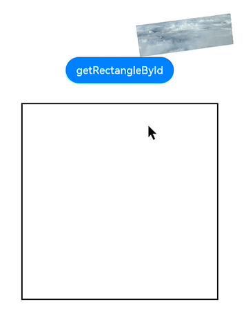

# @ohos.arkui.componentUtils (componentUtils)
<!--Kit: ArkUI-->
<!--Subsystem: ArkUI-->
<!--Owner: @yihao-lin-->
<!--Designer: @piggyguy-->
<!--Tester: @songyanhong-->
<!--Adviser: @Brilliantry_Rui-->

提供获取组件绘制区域坐标和大小的能力，适用于在组件布局完成后查询组件实际绘制区域信息的场景，帮助开发者获取组件尺寸、位置等布局结果。

> **说明：**
>
> - 本模块首批接口从API version 10开始支持。后续版本的新增接口，采用上角标单独标记接口的起始版本。
>
> - 本模块接口仅可在Stage模型下使用。
>
> - 本模块功能依赖UI的执行上下文，不可在[UI上下文不明确](../../ui/arkts-global-interface.md#ui上下文不明确)的地方使用，参见[UIContext](./arkts-apis-uicontext-uicontext.md)说明。

## 导入模块

```ts
import { componentUtils } from '@kit.ArkUI';
```
## componentUtils.getRectangleById<sup>(deprecated)</sup>

getRectangleById(id: string): ComponentInfo

根据组件ID获取组件实例对象，通过组件实例对象将获取的坐标位置和大小同步返回给开发者。

> **说明：**
>
> - 从API version 10开始支持，从API version 18开始废弃，建议使用[getRectangleById](arkts-apis-uicontext-componentutils.md#getrectanglebyid)替代。getRectangleById需先通过[UIContext](arkts-apis-uicontext-uicontext.md)中的[getComponentUtils](arkts-apis-uicontext-uicontext.md#getcomponentutils)方法获取[ComponentUtils](arkts-apis-uicontext-componentutils.md)对象，然后通过该对象进行调用。
>
> - 从API version 10开始，可以通过使用[UIContext](arkts-apis-uicontext-uicontext.md)中的[getComponentUtils](arkts-apis-uicontext-uicontext.md#getcomponentutils)方法获取当前UI上下文关联的[ComponentUtils](arkts-apis-uicontext-componentutils.md)对象。在目标组件布局完成后，通过该接口能够获取组件坐标和尺寸信息。建议在[布局回调](./js-apis-arkui-inspector.md)中使用该接口。如果组件动态创建但未挂载组件树，则无法通过该接口获取组件的坐标和尺寸信息。因为组件在未挂载组件树的情况下，一般未经过UI框架的测量与布局，此时请确保组件已挂载到组件树后再尝试获取组件信息。
>
> - 该接口返回的组件位置为布局位置，某些属性计算不支持，如位置设置类[offset](./arkui-ts/ts-universal-attributes-location.md#offset)、[markAnchor](./arkui-ts/ts-universal-attributes-location.md#markanchor)、[Edges](./arkui-ts/ts-types.md#edges12)和[LocalizedEdges](./arkui-ts/ts-types.md#localizededges12)类型的[position](./arkui-ts/ts-universal-attributes-location.md#position)，以及图形变换类[rotate](./arkui-ts/ts-universal-attributes-transformation.md#rotate)、[translate](./arkui-ts/ts-universal-attributes-transformation.md#translate)、[scale](./arkui-ts/ts-universal-attributes-transformation.md#scale)、[transform](./arkui-ts/ts-universal-attributes-transformation.md#transform)。可使用替代接口[getPositionToWindowWithTransform](./js-apis-arkui-frameNode.md#getpositiontowindowwithtransform12)，获取组件相对于窗口且带有绘制属性的位置偏移。

**原子化服务API：** 从API version 11开始，该接口支持在原子化服务中使用。

**系统能力：** SystemCapability.ArkUI.ArkUI.Full

**参数：**

| 参数名 | 类型   | 必填 | 说明       |
| ------ | ------ | ---- | ---------- |
| id     | string | 是   | 指定组件id。目标组件需已挂载到组件树并完成布局。 |

**返回值：**

| 类型   | 说明       |
| ------ | ---------- |
| [ComponentInfo](#componentinfo) | 组件大小、位置、平移缩放旋转及仿射矩阵属性信息。 |

**错误码：**

以下错误码的详细介绍请参见[接口调用异常错误码](errorcode-internal.md)。

| 错误码ID  | 错误信息                |
| ------ | ------------------- |
| 100001 | UI execution context not found. |

**示例：**

```ts
import { componentUtils } from '@kit.ArkUI';
let modePosition:componentUtils.ComponentInfo = componentUtils.getRectangleById('onClick');
```

## ComponentInfo

组件大小、位置、平移缩放旋转及仿射矩阵属性信息。

**原子化服务API：** 从API version 11开始，该接口支持在原子化服务中使用。

**系统能力：** SystemCapability.ArkUI.ArkUI.Full

| 名称           | 类型             | 只读    | 可选           | 说明                         |
| ---------------|------------| --------------- | -----------------------------| -----------------------------|
| size           | [Size](#size) | 否       | 否     | 组件大小。                    |
| localOffset    | [Offset](#offset) | 否       | 否    | 组件相对于父组件的偏移量。         |
| windowOffset   | [Offset](#offset) | 否       | 否    | 组件相对于窗口的偏移量。           |
| screenOffset   | [Offset](#offset) | 否       | 否    | 组件相对于屏幕的偏移量。           |
| translate      | [TranslateResult](#translateresult)| 否       | 否     | 组件平移信息。                |
| scale          | [ScaleResult](#scaleresult) | 否       | 否     | 组件缩放信息。                |
| rotate         | [RotateResult](#rotateresult) | 否       | 否     | 组件旋转信息。                |
| transform      | [Matrix4Result](#matrix4result) | 否       | 否     | 仿射矩阵信息，根据入参创建的四阶矩阵对象。  |

### Size

**原子化服务API：** 从API version 11开始，该接口支持在原子化服务中使用。

**系统能力：** SystemCapability.ArkUI.ArkUI.Full

| 名称     | 类型  | 只读    | 可选    | 说明                               |
| -------- | ---- | -------------------------| ------------------------| ----------------------------------|
| width    | number | 否       | 否     | 组件宽度。<br>单位：px                      |
| height   | number | 否       | 否     | 组件高度。<br>单位：px                      |

### Offset

**原子化服务API：** 从API version 11开始，该接口支持在原子化服务中使用。

**系统能力：** SystemCapability.ArkUI.ArkUI.Full

| 名称     | 类型  | 只读    | 可选     | 说明                               |
| --------| ---- | --------------| ------------------------------------| -----------------------------------|
| x       | number| 否       | 否     | x点坐标。<br>单位：px                           |
| y       | number| 否       | 否     | y点坐标。<br>单位：px                           |

### TranslateResult

**原子化服务API：** 从API version 11开始，该接口支持在原子化服务中使用。

**系统能力：** SystemCapability.ArkUI.ArkUI.Full

| 名称     | 类型 | 只读    | 可选     | 说明                               |
| --------| ---- | -------------------| -------------------------------| -----------------------------------|
| x       | number | 否       | 否    | x轴平移距离。<br>单位：vp                       |
| y       | number | 否       | 否    | y轴平移距离。<br>单位：vp                       |
| z       | number | 否       | 否     | z轴平移距离。<br>单位：vp                       |

### ScaleResult

**原子化服务API：** 从API version 11开始，该接口支持在原子化服务中使用。

**系统能力：** SystemCapability.ArkUI.ArkUI.Full

| 名称     | 类型 | 只读    | 可选   | 说明                               |
| --------| ---- | ---- |-----------------------------------| -----------------------------------|
| x       | number | 否       | 否 | x轴缩放倍数。                       |
| y       | number | 否       | 否  | y轴缩放倍数。                       |
| z       | number | 否       | 否 | z轴缩放倍数。                       |
| centerX | number | 否       | 否 | 变换中心点x轴坐标。<br>单位：vp                  |
| centerY | number | 否       | 否  | 变换中心点y轴坐标。<br>单位：vp                |

### RotateResult

**原子化服务API：** 从API version 11开始，该接口支持在原子化服务中使用。

**系统能力：** SystemCapability.ArkUI.ArkUI.Full

| 名称     | 类型  | 只读    | 可选     | 说明                               |
| --------| ---- | -----------------| ---------------------------------| -----------------------------------|
| x       | number | 否       | 否  | 旋转轴向量x坐标。                   |
| y       | number | 否       | 否  | 旋转轴向量y坐标。                   |
| z       | number | 否       | 否  | 旋转轴向量z坐标。                   |
| angle   | number | 否       | 否  | 旋转角度。<br>单位：deg                          |
| centerX | number | 否       | 否  | 变换中心点x轴坐标。<br>单位：vp                 |
| centerY | number | 否       | 否  | 变换中心点y轴坐标。<br>单位：vp                 |

### Matrix4Result

type Matrix4Result = [number,number,number,number,number,number,number,number,number,number,number,number,number,number,number,number]

**原子化服务API：** 从API version 11开始，该接口支持在原子化服务中使用。

**系统能力：** SystemCapability.ArkUI.ArkUI.Full

| 类型 | 说明                               |
| --------| -----------------------------------|
| [number,number,number,number,<br>number,number,number,number,<br>number,number,number,number,<br>number,number,number,number] | 长度为16（4\*4）的number数组，详情见四阶矩阵说明。  |

**四阶矩阵说明：**

| 参数名 | 类型   | 必填 | 说明                                 |
| ------ | ------ | ---- | ------------------------------------ |
| m00    | number | 是   | x轴缩放值，单位矩阵默认为1。         |
| m01    | number | 是   | 第2个值，xyz轴旋转会影响这个值。     |
| m02    | number | 是   | 第3个值，xyz轴旋转会影响这个值。     |
| m03    | number | 是   | 无实际意义。                         |
| m10    | number | 是   | 第5个值，xyz轴旋转会影响这个值。     |
| m11    | number | 是   | y轴缩放值，单位矩阵默认为1。         |
| m12    | number | 是   | 第7个值，xyz轴旋转会影响这个值。     |
| m13    | number | 是   | 无实际意义。                         |
| m20    | number | 是   | 第9个值，xyz轴旋转会影响这个值。     |
| m21    | number | 是   | 第10个值，xyz轴旋转会影响这个值。    |
| m22    | number | 是   | z轴缩放值，单位矩阵默认为1。         |
| m23    | number | 是   | 无实际意义。                         |
| m30    | number | 是   | x轴平移值，单位px，单位矩阵默认为0。 |
| m31    | number | 是   | y轴平移值，单位px，单位矩阵默认为0。 |
| m32    | number | 是   | z轴平移值，单位px，单位矩阵默认为0。 |
| m33    | number | 是   | 齐次坐标下生效，产生透视投影效果。   |

## 示例

### 示例1（获取ComponentUtils对象）

推荐使用[UIContext](arkts-apis-uicontext-uicontext.md)中的[getComponentUtils](./arkts-apis-uicontext-uicontext.md#getcomponentutils)方法获取当前UI上下文关联的ComponentUtils对象。

```ts
import { matrix4 } from '@kit.ArkUI';

@Entry
@Component
struct Utils {
  @State x: number = 120;
  @State y: number = 10;
  @State z: number = 100;
  @State value: string = '';
  private matrix1 = matrix4.identity().translate({ x: this.x, y: this.y, z: this.z });

  build() {
    Column() {
      // $r("app.media.img")需要替换为开发者所需的图像资源文件
      Image($r('app.media.img'))
        .transform(this.matrix1)
        .translate({ x: 20, y: 20, z: 20 })
        .scale({ x: 0.5, y: 0.5, z: 1 })
        .rotate({
          x: 1,
          y: 1,
          z: 1,
          centerX: '50%',
          centerY: '50%',
          angle: 300
        })
        .width(300)
        .height(100)
        .key('image_01')
      Button('getRectangleById')
        .onClick(() => {
          this.value = JSON.stringify(this.getUIContext()
            .getComponentUtils()
            .getRectangleById('image_01')); // 建议使用this.getUIContext().getComponentUtils()接口
        }).margin(10).id('onClick')
      Text(this.value)
        .margin(20)
        .width(300)
        .height(300)
        .borderWidth(2)
    }.margin({ left: 50 })
  }
}
```


