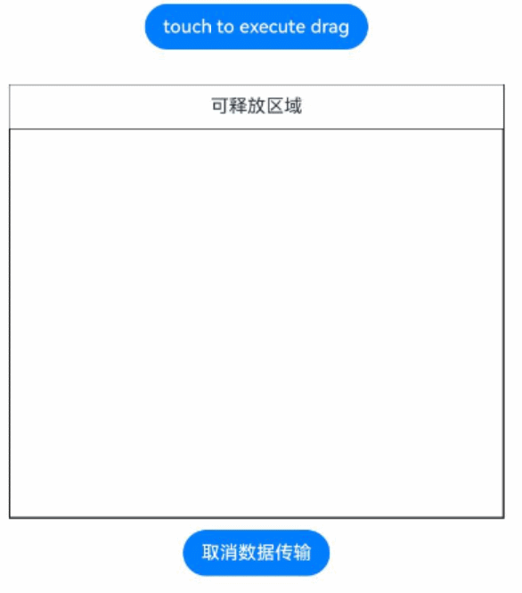

# @ohos.arkui.dragController (DragController)
<!--Kit: ArkUI-->
<!--Subsystem: ArkUI-->
<!--Owner: @jiangtao92-->
<!--Designer: @piggyguy-->
<!--Tester: @songyanhong-->
<!--Adviser: @HelloCrease-->

本模块提供发起主动拖拽的能力，当应用接收到触摸或长按等事件时可以主动发起拖拽的动作，并在其中携带拖拽信息。

> **说明：**
>
> 本模块首批接口从 API version 10 开始支持。后续版本的新增接口，采用上角标单独标记接口的起始版本。
> 本模块功能依赖UI的执行上下文，不可在[UI上下文不明确](../../ui/arkts-global-interface.md#ui上下文不明确)的地方使用，参见[UIContext](arkts-apis-uicontext-uicontext.md)说明。
> 示例效果请以真机运行为准，当前 DevEco Studio预览器不支持。

## 导入模块

```ts
import { dragController } from '@kit.ArkUI';
```

## dragController.executeDrag<sup>(deprecated)</sup>

executeDrag(custom: CustomBuilder | DragItemInfo, dragInfo: DragInfo,callback:AsyncCallback\<DragEventParam>): void

主动发起拖拽能力，传入拖拽发起后跟手效果所拖拽的对象以及携带拖拽信息。使用callback异步回调。

> **说明：**
>
> 从API version 18开始废弃，建议使用[UIContext](arkts-apis-uicontext-uicontext.md)中的[getDragController](arkts-apis-uicontext-uicontext.md#getdragcontroller11)获取[DragController](arkts-apis-uicontext-dragcontroller.md)实例，再通过此实例调用替代方法[executeDrag](arkts-apis-uicontext-dragcontroller.md#executedrag11)。
>
> 从API version 11开始，可以通过使用[UIContext](arkts-apis-uicontext-uicontext.md)中的[getDragController](arkts-apis-uicontext-uicontext.md#getdragcontroller11)方法获取当前UI上下文关联的[DragController](arkts-apis-uicontext-dragcontroller.md)对象。

**原子化服务API：** 从API version 12开始，该接口支持在原子化服务中使用。

**系统能力：** SystemCapability.ArkUI.ArkUI.Full

**参数：**

| 参数名   | 类型                                                         | 必填 | 说明                                                         |
| -------- | ------------------------------------------------------------ | ---- | ------------------------------------------------------------ |
| custom   | [CustomBuilder](arkui-ts/ts-types.md#custombuilder8) \| [DragItemInfo](arkui-ts/ts-universal-events-drag-drop.md#dragiteminfo) | 是   | 拖拽发起后跟手效果所拖拽的对象。<br/>**说明：** <br/>不支持全局builder。如果builder中使用了[Image](arkui-ts/ts-basic-components-image.md)组件，应尽量开启同步加载，即配置Image的[syncLoad](arkui-ts/ts-basic-components-image.md#syncload8)为true。该builder只用于生成当次拖拽中显示的图片。builder的根组件宽高为0时，无法生成拖拽显示的图片导致拖拽失败。builder的修改不会同步到当前正在拖拽的图片，对builder的修改需要在下一次拖拽时生效。 |
| dragInfo | [DragInfo](#draginfo)                                        | 是   | 拖拽信息。                                                   |
| callback | [AsyncCallback](../apis-basic-services-kit/js-apis-base.md#asynccallback)&lt;[DragEventParam](#drageventparam12)&gt; | 是   | 回调函数。当拖拽成功结束，err为undefined，data为获取到的DragEventParam；否则为错误对象。                                    |

**错误码：**

以下错误码的详细介绍请参见[通用错误码](../errorcode-universal.md)。

| 错误码ID | 错误信息      |
| -------- | ------------- |
| 401      | Parameter error. Possible causes: 1. Mandatory parameters are left unspecified; 2.Incorrect parameters types; 3. Parameter verification failed.   |
| 100001   | Internal handling failed. |

**示例：**

> **说明：**
>
> 推荐通过使用[UIContext](arkts-apis-uicontext-uicontext.md)中的[getDragController](arkts-apis-uicontext-uicontext.md#getdragcontroller11)方法获取当前UI上下文关联的DragController对象。

```ts
import { dragController } from '@kit.ArkUI';
import { unifiedDataChannel } from '@kit.ArkData';

class Tmp{
  event:DragEvent|undefined = undefined
  extraParams:string = ''
}

@Entry
@Component
struct DragControllerPage {
  @State text: string = ''

  @Builder DraggingBuilder() {
    Column() {
      Text("DraggingBuilder")
        .fontColor(Color.White)
        .fontSize(12)
    }
    .width(100)
    .height(100)
    .backgroundColor(Color.Blue)
  }

  build() {
    Column() {
      Button('touch to execute drag')
        .margin(10)
        .onTouch((event?:TouchEvent) => {
          if(event){
            if (event.type == TouchType.Down) {
              let text = new unifiedDataChannel.PlainText()
              text.textContent = 'drag text'
              text.abstract = 'abstract'
              let unifiedData = new unifiedDataChannel.UnifiedData(text)

              let dragInfo: dragController.DragInfo = {
                pointerId: 0,
                data: unifiedData,
                extraParams: ''
              }
              let eve:tmp = new tmp()
              this.getUIContext().getDragController().executeDrag(()=>{this.DraggingBuilder()}, dragInfo, (err, eve) => { // 建议使用 this.getUIContext().getDragController().executeDrag()接口
                if(eve.event){
                  if (eve.event.getResult() == DragResult.DRAG_SUCCESSFUL) {
                    // ...
                  } else if (eve.event.getResult() == DragResult.DRAG_FAILED) {
                    // ...
                  }
                }
              })
            }
          }
        })
      Text(this.text)
        .height(100)
        .width(150)
        .margin({top:20})
        .border({color:Color.Black,width:1})
        .onDrop((dragEvent?:DragEvent)=>{
          if(dragEvent){
            let records: Array<unifiedDataChannel.UnifiedRecord> = dragEvent.getData().getRecords();
            let plainText: unifiedDataChannel.PlainText = records[0] as unifiedDataChannel.PlainText;
            this.text = plainText.textContent;
          }
        })
    }
    .width('100%')
    .height('100%')
  }
}
```
  
## dragController.executeDrag<sup>(deprecated)</sup>

executeDrag(custom: CustomBuilder | DragItemInfo, dragInfo: DragInfo): Promise\<DragEventParam>

主动发起拖拽能力，传入拖拽发起后跟手效果所拖拽的对象以及携带拖拽信息。使用Promise异步回调。

> **说明：**
>
> 从API version 18开始废弃，建议使用[UIContext](arkts-apis-uicontext-uicontext.md)中的[getDragController](arkts-apis-uicontext-uicontext.md#getdragcontroller11)获取[DragController](arkts-apis-uicontext-dragcontroller.md)实例，再通过此实例调用替代方法[executeDrag](arkts-apis-uicontext-dragcontroller.md#executedrag11-1)。
>
> 从API version 11开始，可以通过使用[UIContext](arkts-apis-uicontext-uicontext.md)中的[getDragController](arkts-apis-uicontext-uicontext.md#getdragcontroller11)方法获取当前UI上下文关联的[DragController](arkts-apis-uicontext-dragcontroller.md)对象。

**原子化服务API：** 从API version 12开始，该接口支持在原子化服务中使用。

**系统能力：** SystemCapability.ArkUI.ArkUI.Full

**参数：**

| 参数名   | 类型                                                         | 必填 | 说明                             |
| -------- | ------------------------------------------------------------ | ---- | -------------------------------- |
| custom   | [CustomBuilder](arkui-ts/ts-types.md#custombuilder8) \| [DragItemInfo](arkui-ts/ts-universal-events-drag-drop.md#dragiteminfo) | 是   | 拖拽发起后跟手效果所拖拽的对象。 |
| dragInfo | [DragInfo](#draginfo)                                        | 是   | 拖拽信息。                       |

**返回值：** 

| 类型                                               | 说明                     |
| -------------------------------------------------- | ------------------------ |
| Promise&lt;[DragEventParam](#drageventparam12)&gt; | Promise对象，拖拽结束返回结果的回调。 |

**错误码：**
以下错误码的详细介绍请参见[通用错误码](../errorcode-universal.md)。
| 错误码ID | 错误信息      |
| -------- | ------------- |
| 401      | Parameter error. Possible causes: 1. Mandatory parameters are left unspecified; 2.Incorrect parameters types; 3. Parameter verification failed.   |
| 100001   | Internal handling failed. |

**示例：**

> **说明：**
>
> 推荐通过使用[UIContext](arkts-apis-uicontext-uicontext.md)中的[getDragController](arkts-apis-uicontext-uicontext.md#getdragcontroller11)方法获取当前UI上下文关联的DragController对象。

```ts
import { dragController } from '@kit.ArkUI';
import { image } from '@kit.ImageKit';
import { unifiedDataChannel } from '@kit.ArkData';

class Tmp{
  event:DragResult|undefined = undefined
  extraParams:string = ''
}

@Entry
@Component
struct DragControllerPage {
  @State pixmap: image.PixelMap|undefined = undefined
  @State text: string = ''

  @Builder DraggingBuilder() {
    Column() {
      Text("DraggingBuilder")
        .fontColor(Color.White)
    }
    .width(100)
    .height(100)
    .backgroundColor(Color.Blue)
  }

  @Builder PixmapBuilder() {
    Column() {
      Text("PixmapBuilder")
        .fontColor(Color.White)
        .fontSize(15)
    }
    .width(100)
    .height(100)
    .backgroundColor(Color.Blue)
  }

  aboutToAppear() {
    let pb: CustomBuilder = (): void => {
      this.PixmapBuilder()
    }
    this.getUIContext().getComponentSnapshot().createFromBuilder(pb).then((pix: image.PixelMap) => {
      this.pixmap = pix;
    })
  }

  build() {
    Column() {
      Button('touch to execute drag')
        .margin(10)
        .onTouch((event?:TouchEvent) => {
          if(event){
            if (event.type == TouchType.Down) {
              let text = new unifiedDataChannel.PlainText()
              text.textContent = 'drag text'
              text.abstract = 'abstract'
              let unifiedData = new unifiedDataChannel.UnifiedData(text)

              let dragInfo: dragController.DragInfo = {
                pointerId: 0,
                data: unifiedData,
                extraParams: ''
              }
              let dragItemInfo: DragItemInfo = {
                pixelMap: this.pixmap,
                builder: ()=>{this.DraggingBuilder()},
                extraInfo: "DragItemInfoTest"
              }
              let eve:tmp = new tmp()
              this.getUIContext().getDragController().executeDrag(dragItemInfo, dragInfo) // 建议使用 this.getUIContext().getDragController().executeDrag()接口
                .then((eve) => {
                  if (eve.event.getResult() == DragResult.DRAG_SUCCESSFUL) {
                    // ...
                  } else if (eve.event.getResult() == DragResult.DRAG_FAILED) {
                    // ...
                  }
                })
                .catch((err:Error) => {
                })
            }
          }
        })
      Text(this.text)
        .height(100)
        .width(150)
        .margin({top:20})
        .border({color:Color.Black,width:1})
        .onDrop((dragEvent?:DragEvent)=>{
          if(dragEvent){
            let records: Array<unifiedDataChannel.UnifiedRecord> = dragEvent.getData().getRecords();
            let plainText: unifiedDataChannel.PlainText = records[0] as unifiedDataChannel.PlainText;
            this.text = plainText.textContent;
          }
        })
    }
    .width('100%')
    .height('100%')
  }
}
```
  
## DragInfo

发起拖拽所需要的属性和拖拽时携带的信息。

**系统能力：** SystemCapability.ArkUI.ArkUI.Full

| 名称        | 类型                                                   | 只读 | 可选 | 说明                                     |
| ----------- | ----------------------------------------------------- | ---- | ---- | --------------------------------------- |
| pointerId   | number                                                 |  否  |  否   | 设置启动拖拽时屏幕上触摸点的Id。取值范围为[0, 9]的整数。 <br/>**原子化服务API：** 从API version 12开始，该接口支持在原子化服务中使用。         |
| data        | [unifiedDataChannel.UnifiedData](../apis-arkdata/js-apis-data-unifiedDataChannel.md#unifieddata) | 否  |  是  | 设置拖拽过程中携带的数据。 <br/>默认值：空<br/>**原子化服务API：** 从API version 12开始，该接口支持在原子化服务中使用。               |
| extraParams | string                                                 | 否  |  是  | 设置拖拽事件额外信息，具体功能暂未实现。<br/>默认值：空<br/>**原子化服务API：** 从API version 12开始，该接口支持在原子化服务中使用。 |
| touchPoint<sup>11+</sup>    | [TouchPoint](arkui-ts/ts-types.md#touchpoint11)  | 否  |  是  | 配置跟手点坐标。不配置时，左右居中，顶部向下偏移20%。 <br/>**原子化服务API：** 从API version 12开始，该接口支持在原子化服务中使用。 |
| previewOptions<sup>11+</sup>| [DragPreviewOptions](arkui-ts/ts-universal-attributes-drag-drop.md#dragpreviewoptions11)                                | 否   |  是  | 设置拖拽过程中背板图处理模式及数量角标的显示。 <br/>**原子化服务API：** 从API version 12开始，该接口支持在原子化服务中使用。|
| dataLoadParams<sup>20+</sup>| [unifiedDataChannel.DataLoadParams](../apis-arkdata/js-apis-data-unifiedDataChannel.md#dataloadparams20)                                | 否   |  是  | 设置拖起方延迟提供数据。调用此方法向系统提供数据加载参数，而非直接传入完整的数据对象。当用户将数据拖拽至目标应用程序并释放时，系统将使用此参数从起拖方请求实际数据。与data同时设置时，dataLoadParams生效。<br/>默认值：空<br/>**原子化服务API：** 从API version 20开始，该接口支持在原子化服务中使用。|

## dragController.createDragAction<sup>(deprecated)</sup>

createDragAction(customArray: Array&lt;CustomBuilder \| DragItemInfo&gt;, dragInfo: DragInfo): DragAction

创建拖拽的Action对象，需要显式指定拖拽背板图(可多个)，以及拖拽的数据，跟手点等信息；当通过一个已创建的 Action 对象发起的拖拽未结束时，无法再次创建新的 Action 对象，接口会抛出异常；当Action对象的生命周期结束后，注册在该对象上的回调函数会失效，因此需要在一个尽量长的作用域下持有该对象，并在每次发起拖拽前通过createDragAction返回新的对象覆盖旧值。

> **说明：**
>
> 从API version 11开始支持，从API version 18开始废弃，建议使用[UIContext](arkts-apis-uicontext-uicontext.md)中的[getDragController](arkts-apis-uicontext-uicontext.md#getdragcontroller11)获取[DragController](arkts-apis-uicontext-dragcontroller.md)实例，再通过此实例调用替代方法[createDragAction](arkts-apis-uicontext-dragcontroller.md#createdragaction11)。
>
> 从API version 11开始，可以通过使用[UIContext](arkts-apis-uicontext-uicontext.md)中的[getDragController](arkts-apis-uicontext-uicontext.md#getdragcontroller11)方法获取当前UI上下文关联的[DragController](arkts-apis-uicontext-dragcontroller.md)对象。
>
> 建议控制传递的拖拽背板数量，传递过多容易导致拖起的效率问题。

**原子化服务API：** 从API version 12开始，该接口支持在原子化服务中使用。

**系统能力：** SystemCapability.ArkUI.ArkUI.Full

**参数：**

| 参数名   | 类型                                                         | 必填 | 说明                             |
| --------      | ------------------------------------------------------------ | ---- | -------------------------------- |
| customArray  | Array&lt;[CustomBuilder](arkui-ts/ts-types.md#custombuilder8) \| [DragItemInfo](arkui-ts/ts-universal-events-drag-drop.md#dragiteminfo)&gt; | 是   | 拖拽发起后跟手效果所拖拽的对象。 |
| dragInfo | [DragInfo](#draginfo)                                        | 是   | 拖拽信息。                       |

**返回值：** 

| 类型                                                   | 说明               |
| ------------------------------------------------------ | ------------------ |
| [DragAction](#dragaction11)| 创建拖拽Action对象，主要用于后面实现注册监听拖拽状态改变事件和启动拖拽服务。 |

**错误码：**

以下错误码的详细介绍请参见[通用错误码](../errorcode-universal.md)。
| 错误码ID | 错误信息      |
| -------- | ------------- |
| 401      | Parameter error. Possible causes: 1. Mandatory parameters are left unspecified; 2.Incorrect parameters types; 3. Parameter verification failed.   |
| 100001   | Internal handling failed. |

**示例：**

> **说明：**
>
> 推荐通过使用[UIContext](arkts-apis-uicontext-uicontext.md)中的[getDragController](arkts-apis-uicontext-uicontext.md#getdragcontroller11)方法获取当前UI上下文关联的DragController对象。

```ts
import { dragController } from '@kit.ArkUI';
import { image } from '@kit.ImageKit';
import { unifiedDataChannel } from '@kit.ArkData';

@Entry
@Component
struct DragControllerPage {
  @State pixmap: image.PixelMap | null = null
  @State text: string = ''
  private dragAction: dragController.DragAction | null = null;
  customBuilders:Array<CustomBuilder | DragItemInfo> = new Array<CustomBuilder | DragItemInfo>();
  @Builder DraggingBuilder() {
    Column() {
      Text("DraggingBuilder")
        .fontColor(Color.White)
        .fontSize(12)
    }
    .width(100)
    .height(100)
    .backgroundColor(Color.Blue)
  }

  build() {
    Column() {

      Column() {
        Text(this.text)
          .width('100%')
          .height('100%')
          .fontColor(Color.White)
          .fontSize(18)
          .onDrop((dragEvent?:DragEvent)=>{
            if(dragEvent){
              let records: Array<unifiedDataChannel.UnifiedRecord> = dragEvent.getData().getRecords();
              let plainText: unifiedDataChannel.PlainText = records[0] as unifiedDataChannel.PlainText;
              this.text = plainText.textContent;
            }
          })
      }
      .width(100)
      .height(100)
      .backgroundColor(Color.Red)
      .margin(10)

      Button('多对象dragAction customBuilder拖拽').onTouch((event?:TouchEvent) => {
        if(event){
          if (event.type == TouchType.Down) {
            console.info("multi drag Down by listener");
            this.customBuilders.splice(0, this.customBuilders.length);
            this.customBuilders.push(()=>{this.DraggingBuilder()});
            this.customBuilders.push(()=>{this.DraggingBuilder()});
            this.customBuilders.push(()=>{this.DraggingBuilder()});
            let text = new unifiedDataChannel.PlainText()
            text.textContent = 'drag text'
            let unifiedData = new unifiedDataChannel.UnifiedData(text)
            let dragInfo: dragController.DragInfo = {
              pointerId: 0,
              data: unifiedData,
              extraParams: ''
            }
            try{
              this.dragAction = this.getUIContext().getDragController().createDragAction(this.customBuilders, dragInfo) // 建议使用 this.getUIContext().getDragController().createDragAction()接口
              if(!this.dragAction){
                console.info("listener dragAction is null");
                return
              }
              this.dragAction.on('statusChange', (dragAndDropInfo: dragController.DragAndDropInfo)=>{
                if (dragAndDropInfo.status == dragController.DragStatus.STARTED) {
                  console.info("drag has start");
                } else if (dragAndDropInfo.status == dragController.DragStatus.ENDED){
                  console.info("drag has end");
                  if (!this.dragAction) {
                    return
                  }
                  this.dragAction.off('statusChange')
                }
              })
              this.dragAction.startDrag().then(()=>{}).catch((err:Error)=>{
                console.error("start drag Error:" + err.message);
              })
            } catch(err) {
              console.error("create dragAction Error:" + err.message);
            }
          }
        }
      }).margin({top:20})
    }
  }
}
```
  
## DragAction<sup>11+</sup>

监听状态改变，启动拖拽服务的对象。

**原子化服务API：** 从API version 12开始，该接口支持在原子化服务中使用。

**系统能力：** SystemCapability.ArkUI.ArkUI.Full

### startDrag<sup>11+</sup>

startDrag(): Promise&lt;void&gt;

启动拖拽服务。使用Promise异步回调。

**原子化服务API：** 从API version 12开始，该接口支持在原子化服务中使用。

**系统能力：** SystemCapability.ArkUI.ArkUI.Full

**返回值：**

| 类型 | 说明 |
| -------- | -------- |
| Promise&lt;void&gt; | Promise对象，无返回结果。 |

**错误码：**

| 错误码ID | 错误信息      |
| -------- | ------------- |
| 100001   | Internal handling failed. |

**示例1：**

> **说明：**
>
> 推荐通过使用[UIContext](arkts-apis-uicontext-uicontext.md)中的[getDragController](arkts-apis-uicontext-uicontext.md#getdragcontroller11)方法获取当前UI上下文关联的DragController对象。

```ts
import { dragController } from '@kit.ArkUI';
import { unifiedDataChannel } from '@kit.ArkData';

@Entry
@Component
struct DragControllerPage {
  private dragAction: dragController.DragAction | null = null;
  customBuilders:Array<CustomBuilder | DragItemInfo> = new Array<CustomBuilder | DragItemInfo>();
  @Builder DraggingBuilder() {
    Column() {
      Text("DraggingBuilder")
        .fontColor(Color.White)
        .fontSize(12)
    }
    .width(100)
    .height(100)
    .backgroundColor(Color.Blue)
  }

  build() {
    Column() {
      Button('touch to execute drag').onTouch((event?:TouchEvent) => {
        if(event){
          if (event.type == TouchType.Down) {
            this.customBuilders.splice(0, this.customBuilders.length);
            this.customBuilders.push(()=>{this.DraggingBuilder()});
            let text = new unifiedDataChannel.PlainText()
            text.textContent = 'drag text'
            let unifiedData = new unifiedDataChannel.UnifiedData(text)
            let dragInfo: dragController.DragInfo = {
              pointerId: 0,
              data: unifiedData,
              extraParams: ''
            }
            try{
              this.dragAction = this.getUIContext().getDragController().createDragAction(this.customBuilders, dragInfo) // 建议使用 this.getUIContext().getDragController().createDragAction()接口
              if(!this.dragAction){
                console.info("listener dragAction is null");
                return;
              }
              this.dragAction.startDrag().then(()=>{}).catch((err:Error)=>{
                console.error(`start drag Error: ${err.message}`);
              })
            } catch(err) {
              console.error(`create dragAction Error: ${err.message}`);
            }
          }
        }
      }).margin({top:20})
    }
  }
}
```

**示例2：**

在[DragInfo](#draginfo)中配置dataLoadParams，设置拖起方延迟提供数据。

```ts
import { unifiedDataChannel, uniformTypeDescriptor, uniformDataStruct } from '@kit.ArkData';
import { fileUri, fileIo as fs } from '@kit.CoreFileKit';
import { common } from '@kit.AbilityKit';
import { dragController } from '@kit.ArkUI';

@Entry
@Component
struct ImageExample {
  private dragAction: dragController.DragAction | null = null;
  customBuilders: Array<CustomBuilder | DragItemInfo> = new Array<CustomBuilder | DragItemInfo>();
  @State uri: string = "";
  @State blockArr: string[] = [];
  uiContext = this.getUIContext();
  udKey: string = '';

  @Builder
  DraggingBuilder() {
    Video({ src: $rawfile('test1.mp4'), controller: new VideoController() })
      .width(100)
      .height(100)
  }

  build() {
    Column() {
      Flex({ direction: FlexDirection.Row, alignItems: ItemAlign.Center, justifyContent: FlexAlign.SpaceAround }) {
        Button('touch to execute drag')
          .margin(10)
          .onTouch((event?: TouchEvent) => {
            if (event) {
              if (event.type == TouchType.Down) {
                this.customBuilders.splice(0, this.customBuilders.length);
                this.customBuilders.push(() => {
                  this.DraggingBuilder()
                });
                const context: Context | undefined = this.uiContext.getHostContext();
                if (context) {
                  let loadHandler: unifiedDataChannel.DataLoadHandler = () => {
                    let data =
                      context.resourceManager.getRawFdSync('test1.mp4');
                    let filePath = context.filesDir + '/test1.mp4';
                    let file = fs.openSync(filePath, fs.OpenMode.CREATE | fs.OpenMode.READ_WRITE);
                    let bufferSize = data.length as number;
                    let buf = new ArrayBuffer(bufferSize);
                    fs.readSync(data.fd, buf, { offset: data.offset, length: bufferSize });
                    fs.writeSync(file.fd, buf, { offset: 0, length: bufferSize });
                    fs.closeSync(file.fd);
                    context.resourceManager.closeRawFdSync('test1.mp4')
                    this.uri = fileUri.getUriFromPath(filePath);
                    let videoMp: uniformDataStruct.FileUri = {
                      uniformDataType: 'general.file-uri',
                      oriUri: this.uri,
                      fileType: 'general.video',
                    }
                    let unifiedRecord = new unifiedDataChannel.UnifiedRecord();
                    let unifiedData = new unifiedDataChannel.UnifiedData();
                    unifiedRecord.addEntry(uniformTypeDescriptor.UniformDataType.FILE_URI, videoMp);
                    unifiedData.addRecord(unifiedRecord);
                    return unifiedData;
                  }

                  let dragInfo: dragController.DragInfo = {
                    pointerId: 0,
                    extraParams: '',
                    dataLoadParams: {
                      loadHandler: loadHandler,
                      dataLoadInfo: { types: new Set([uniformTypeDescriptor.UniformDataType.VIDEO]), recordCount: 1 }
                    }
                  }

                  let func = (dragAndDropInfo: dragController.DragAndDropInfo) => {
                    console.info(`ndq Register to listen on drag status ${JSON.stringify(dragAndDropInfo)}`);
                  }
                  try {
                    this.dragAction = this.getUIContext()
                      .getDragController()
                      .createDragAction(this.customBuilders,
                        dragInfo)
                    if (!this.dragAction) {
                      console.info("listener dragAction is null");
                      return;
                    }
                    this.dragAction.on('statusChange', func);
                    this.dragAction.startDrag().then(() => {
                    }).catch((err: Error) => {
                      console.error(`start drag Error: ${err.message}`);
                    })
                  } catch (err) {
                    console.error(`create dragAction Error: ${err.message}`);
                  }
                }
              }
            }
          })
      }
      .margin({ bottom: 20 })

      Row() {
        Column() {
          Text('可释放区域')
            .fontSize('15dp')
            .height('10%')
          List() {
            ForEach(this.blockArr, (item: string, index) => {
              ListItem() {
                Video({ src: item, controller: new VideoController() })
                  .width(100)
                  .height(100)
                  .border({ width: 1 })
              }
              .margin({ left: 30, top: 30 })
            }, (item: string) => item)
          }
          .border({ width: 1 })
          .height('90%')
          .width('100%')
          .allowDrop([uniformTypeDescriptor.UniformDataType.VIDEO])
          .onDrop((event?: DragEvent, extraParams?: string) => {
            let context = this.uiContext.getHostContext() as common.UIAbilityContext;
            let pathDir: string = context.distributedFilesDir;
            let destUri = fileUri.getUriFromPath(pathDir);
            let progressListener: unifiedDataChannel.DataProgressListener =
              (progress: unifiedDataChannel.ProgressInfo, dragData: UnifiedData | null) => {
                if (dragData != null) {
                  let arr: Array<unifiedDataChannel.UnifiedRecord> = dragData.getRecords();
                  if (arr.length > 0) {
                    if (arr[0].getType() === uniformTypeDescriptor.UniformDataType.VIDEO) {
                      this.blockArr.splice(JSON.parse(extraParams as string).insertIndex, 0, this.uri);
                    }
                  } else {
                    console.info('dragData arr is null');
                  }
                } else {
                  console.info('dragData is undefined');
                }
                console.info(`percentage: ${progress.progress}`);
              };
            let options: DataSyncOptions = {
              destUri: destUri,
              fileConflictOptions: unifiedDataChannel.FileConflictOptions.OVERWRITE,
              progressIndicator: unifiedDataChannel.ProgressIndicator.DEFAULT,
              dataProgressListener: progressListener,
            }
            try {
              this.udKey = (event as DragEvent).startDataLoading(options);
              console.info('udKey: ', this.udKey);
            } catch (e) {
              console.error(`startDataLoading errorCode: ${e.code}, errorMessage: ${e.message}`);
            }
          }, { disableDataPrefetch: true })
        }
        .height("50%")
        .width("90%")
        .border({ width: 1 })
      }

      Button('取消数据传输')
        .onClick(() => {
          try {
            this.getUIContext().getDragController().cancelDataLoading(this.udKey);
          } catch (e) {
            console.error(`cancelDataLoading errorCode: ${e.code}, errorMessage: ${e.message}`);
          }
        })
        .margin({ top: 10 })
    }.width('100%')
  }
}
```


### on('statusChange')<sup>11+</sup>

on(type: 'statusChange', callback: Callback&lt;[DragAndDropInfo](#draganddropinfo11)&gt;): void

注册监听拖拽状态改变事件。

**原子化服务API：** 从API version 12开始，该接口支持在原子化服务中使用。

**系统能力：** SystemCapability.ArkUI.ArkUI.Full

**参数：**
| 参数名     | 类型  | 必填    | 说明             |
| ------ | ------ | ------- | ---------------- |
|  type  | string | 是      | 监听事件，固定为'statusChange'，即注册监听拖拽状态改变事件。|
|  callback  | Callback&lt;[DragAndDropInfo](#draganddropinfo11)&gt; | 是      | 回调函数，返回当前的[DragAndDropInfo](#draganddropinfo11)组件状态。|

**示例：**

> **说明：**
>
> 推荐通过使用[UIContext](arkts-apis-uicontext-uicontext.md)中的[getDragController](arkts-apis-uicontext-uicontext.md#getdragcontroller11)方法获取当前UI上下文关联的DragController对象。

```ts
import { dragController } from '@kit.ArkUI';
import { unifiedDataChannel } from '@kit.ArkData';

@Entry
@Component
struct DragControllerPage {
  private dragAction: dragController.DragAction | null = null;
  customBuilders:Array<CustomBuilder | DragItemInfo> = new Array<CustomBuilder | DragItemInfo>();
  @Builder DraggingBuilder() {
    Column() {
      Text("DraggingBuilder")
        .fontColor(Color.White)
        .fontSize(12)
    }
    .width(100)
    .height(100)
    .backgroundColor(Color.Blue)
  }

  build() {
    Column() {
      Button('touch to execute drag').onTouch((event?:TouchEvent) => {
        if(event){
          if (event.type == TouchType.Down) {
            this.customBuilders.splice(0, this.customBuilders.length);
            this.customBuilders.push(()=>{this.DraggingBuilder()});
            let text = new unifiedDataChannel.PlainText()
            text.textContent = 'drag text'
            let unifiedData = new unifiedDataChannel.UnifiedData(text)
            let dragInfo: dragController.DragInfo = {
              pointerId: 0,
              data: unifiedData,
              extraParams: ''
            }
            let func = (dragAndDropInfo: dragController.DragAndDropInfo) => {
              console.info(`Register to listen on drag status ${JSON.stringify(dragAndDropInfo)}`);
            }
            try{
              this.dragAction = this.getUIContext().getDragController().createDragAction(this.customBuilders, dragInfo) // 建议使用 this.getUIContext().getDragController().createDragAction()接口
              if(!this.dragAction){
                console.info("listener dragAction is null");
                return;
              }
              // 监听状态改变，触发后打印func中的日志
              this.dragAction.on('statusChange', func);
              this.dragAction.startDrag().then(()=>{}).catch((err:Error)=>{
                console.error(`start drag Error: ${err.message}`);
              })
            } catch(err) {
              console.error(`create dragAction Error: ${err.message}`);
            }
          }
        }
      }).margin({top:20})
    }
  }
}
```

### off('statusChange')<sup>11+</sup>

 off(type: 'statusChange', callback?: Callback&lt;[DragAndDropInfo](#draganddropinfo11)&gt;): void

取消注册监听拖拽状态改变事件。

**原子化服务API：** 从API version 12开始，该接口支持在原子化服务中使用。

**系统能力：** SystemCapability.ArkUI.ArkUI.Full

**参数：**
| 参数名     | 类型  | 必填    | 说明             |
| ------ | ------ | ------- | ---------------- |
|  type  | string | 是      | 监听事件，固定为'statusChange'，即取消监听拖拽状态改变事件。|
|  callback  | Callback&lt;[DragAndDropInfo](#draganddropinfo11)&gt; | 否      | 回调函数，返回当前的[DragAndDropInfo](#draganddropinfo11)组件状态。|

**示例：**

> **说明：**
>
> 推荐通过使用[UIContext](arkts-apis-uicontext-uicontext.md)中的[getDragController](arkts-apis-uicontext-uicontext.md#getdragcontroller11)方法获取当前UI上下文关联的DragController对象。

```ts
import { dragController } from '@kit.ArkUI';
import { unifiedDataChannel } from '@kit.ArkData';

@Entry
@Component
struct DragControllerPage {
  private dragAction: dragController.DragAction | null = null;
  customBuilders:Array<CustomBuilder | DragItemInfo> = new Array<CustomBuilder | DragItemInfo>();
  @Builder DraggingBuilder() {
    Column() {
      Text("DraggingBuilder")
        .fontColor(Color.White)
        .fontSize(12)
    }
    .width(100)
    .height(100)
    .backgroundColor(Color.Blue)
  }

  build() {
    Column() {
      Button('touch to execute drag').onTouch((event?:TouchEvent) => {
        if(event){
          if (event.type == TouchType.Down) {
            this.customBuilders.splice(0, this.customBuilders.length);
            this.customBuilders.push(()=>{this.DraggingBuilder()});
            let text = new unifiedDataChannel.PlainText()
            text.textContent = 'drag text'
            let unifiedData = new unifiedDataChannel.UnifiedData(text)
            let dragInfo: dragController.DragInfo = {
              pointerId: 0,
              data: unifiedData,
              extraParams: ''
            }
            let func = (dragAndDropInfo: dragController.DragAndDropInfo) => {
              console.info(`Register to listen on drag status ${JSON.stringify(dragAndDropInfo)}`);
            }
            this.dragAction = this.getUIContext().getDragController().createDragAction(this.customBuilders, dragInfo) // 建议使用 this.getUIContext().getDragController().createDragAction()接口
            if(!this.dragAction){
              console.info("listener dragAction is null");
              return;
            }
            this.dragAction.on('statusChange', func);
            // 取消监听，发起拖拽后不会打印func中的日志
            this.dragAction.off('statusChange', func);
            this.dragAction.startDrag().then(()=>{}).catch((err:Error)=>{
              console.error(`start drag Error: ${err.message}`);
            })
          }
        }
      }).margin({top:20})
    }
  }
}
```

## DragAndDropInfo<sup>11+</sup>

拖拽过程中监听到status改变时上报的数据。

**原子化服务API：** 从API version 12开始，该接口支持在原子化服务中使用。

**系统能力：** SystemCapability.ArkUI.ArkUI.Full

| 名称          | 类型                                                   | 必填 | 说明                                     |
| -----------   | ------------------------------------------------------ | ---- | ---------------------------------------- |
| status       | [DragStatus](#dragstatus11)                                                 | 是   | 当前拖拽状态（启动和结束）。         |
| event        | [DragEvent](arkui-ts/ts-universal-events-drag-drop.md#dragevent7) | 是   | 当前状态所对应的拖拽事件。通过dragController发起的dragEvent仅支持获取result和behavior，且用于拖拽结束状态。 |
| extraParams| string                                                 | 否   | 设置拖拽事件额外信息，具体功能暂未实现。默认值为空。 |

## DragStatus<sup>11+</sup>

拖拽开始和结束状态。

**原子化服务API：** 从API version 12开始，该接口支持在原子化服务中使用。

**系统能力：** SystemCapability.ArkUI.ArkUI.Full

| 名称          | 值                                                   | 说明                                     |
| -----------   | ------------------------------------------------------| ---------------------------------------- |
| STARTED       | 0                                                  | 拖拽已成功发起。         |
| ENDED        | 1                                                  | 拖拽结束。               |

## AnimationOptions<sup>11+</sup>

拖拽相关的动效参数。

**原子化服务API：** 从API version 12开始，该接口支持在原子化服务中使用。

**系统能力：** SystemCapability.ArkUI.ArkUI.Full

| 名称        | 类型                                                   | 必填 | 说明                                     |
| ----------- | ------------------------------------------------------ | ---- | ---------------------------------------- |
| duration    | number                                                 | 否   | 动画持续时间，单位为毫秒。<br/>默认值：1000<br/>**说明：**<br/>-&nbsp;设置小于0的值时按0处理。<br/>-&nbsp;设置浮点型类型的值时，向下取整。例如，设置值为1.2，按照1处理。|
| curve       |&nbsp;[Curve](arkui-ts/ts-appendix-enums.md#curve)&nbsp;\|&nbsp;[ICurve](js-apis-curve.md#icurve9) | 否    | 设置动画曲线。<br/>默认值：Curve.EaseInOut|                          |

## DragEventParam<sup>12+</sup>

拖拽结束返回结果的回调。

**原子化服务API：** 从API version 12开始，该接口支持在原子化服务中使用。

**系统能力：** SystemCapability.ArkUI.ArkUI.Full

| 名称        | 类型                                                         | 必填 | 说明                           |
| ----------- | ------------------------------------------------------------ | ---- | ------------------------------ |
| event<sup>10+</sup>       | [DragEvent](arkui-ts/ts-universal-events-drag-drop.md#dragevent7) | 是   | 拖拽事件信息，仅包括拖拽结果。 |
| extraParams<sup>10+</sup> | string                                                       | 是   | 拖拽事件额外信息。             |

## dragController.getDragPreview<sup>(deprecated)</sup>

getDragPreview(): DragPreview

返回一个代表拖拽背板的对象。

> **说明：**
>
> 从API version 11开始支持，从API version 18开始废弃，建议使用[UIContext](arkts-apis-uicontext-uicontext.md)中的[getDragController](arkts-apis-uicontext-uicontext.md#getdragcontroller11)获取[DragController](arkts-apis-uicontext-dragcontroller.md)实例，再通过此实例调用替代方法[getDragPreview](arkts-apis-uicontext-dragcontroller.md#getdragpreview11)。
>
> 从API version 11开始，可以通过使用[UIContext](arkts-apis-uicontext-uicontext.md)中的[getDragController](arkts-apis-uicontext-uicontext.md#getdragcontroller11)方法获取当前UI上下文关联的[DragController](arkts-apis-uicontext-dragcontroller.md)对象。

**原子化服务API：** 从API version 12开始，该接口支持在原子化服务中使用。

**系统能力：** SystemCapability.ArkUI.ArkUI.Full

**返回值：**

| 类型        | 说明                                            |
| ------------| ------------------------------------------------|
| [DragPreview](#dragpreview11) | 一个代表拖拽背板的对象，提供背板样式设置的接口，在OnDrop和OnDragEnd回调中使用不生效。 |

**示例：**

请参考[animate](#animate11)

## DragPreview<sup>11+</sup>

拖拽背板的对象，在OnDrop和OnDragEnd回调中使用不生效。

**原子化服务API：** 从API version 12开始，该接口支持在原子化服务中使用。

**系统能力：** SystemCapability.ArkUI.ArkUI.Full

### setForegroundColor<sup>11+</sup>

setForegroundColor(color: ResourceColor): void

设置背板蒙版颜色，在OnDrop和OnDragEnd回调中使用不生效，仅支持通过 [getDragPreview()](arkts-apis-uicontext-dragcontroller.md#getdragpreview11) 方法获取到的对象上使用。

**原子化服务API：** 从API version 12开始，该接口支持在原子化服务中使用。

**系统能力：** SystemCapability.ArkUI.ArkUI.Full

**参数：**

| 参数名   | 类型                             | 必填 | 说明                     |
| -------- | -------------------------------- | ---- | ------------------------ |
| color    | [ResourceColor](arkui-ts/ts-types.md#resourcecolor) | 是   |      背板蒙版颜色。                    |

**示例：**

请参考[animate](#animate11)

### animate<sup>11+</sup>

animate(options: AnimationOptions, handler: () => void): void

设置背板蒙版颜色变化动效，在OnDrop和OnDragEnd回调中使用不生效，仅支持通过 [getDragPreview()](arkts-apis-uicontext-dragcontroller.md#getdragpreview11) 方法获取到的对象上使用。

**原子化服务API：** 从API version 12开始，该接口支持在原子化服务中使用。

**系统能力：** SystemCapability.ArkUI.ArkUI.Full

**参数：**

| 参数名   | 类型                             | 必填 | 说明                               |
| -------- | -------------------------------- | ---- | -----------------------------------|
| options  | [AnimationOptions](#animationoptions11)                | 是   | 动效参数。                           |
| handler  | () => void                         | 是   | 用于修改背板蒙版颜色等属性的回调方法。  |

**示例：**

> **说明：**
>
> 推荐通过使用[UIContext](arkts-apis-uicontext-uicontext.md)中的[getDragController](arkts-apis-uicontext-uicontext.md#getdragcontroller11)方法获取当前UI上下文关联的DragController对象。

1.在EntryAbility.ets中获取UI上下文并保存至LocalStorage中。
  ```ts
import { AbilityConstant, UIAbility, Want } from '@kit.AbilityKit';
import { hilog } from '@kit.PerformanceAnalysisKit';
import { window, UIContext } from '@kit.ArkUI';

let uiContext: UIContext;
let localStorage: LocalStorage = new LocalStorage('uiContext');

export default class EntryAbility extends UIAbility {
  storage: LocalStorage = localStorage;

  onCreate(want: Want, launchParam: AbilityConstant.LaunchParam): void {
    hilog.info(0x0000, 'testTag', '%{public}s', 'Ability onCreate');
  }

  onDestroy(): void {
    hilog.info(0x0000, 'testTag', '%{public}s', 'Ability onDestroy');
  }

  onWindowStageCreate(windowStage: window.WindowStage): void {
    hilog.info(0x0000, 'testTag', '%{public}s', 'Ability onWindowStageCreate');

    windowStage.loadContent('pages/Index', this.storage, (err, data) => {
      if (err.code) {
        hilog.error(0x0000, 'testTag', 'Failed to load the content. Cause: %{public}s', `Code is ${err.code}, message is ${err.message}`);
        return;
      }
      hilog.info(0x0000, 'testTag', 'Succeeded in loading the content. Data: %{public}s',  `Code is ${err.code}, message is ${err.message}`);
      windowStage.getMainWindow((err, data) => {
        if (err.code) {
          hilog.error(0x0000, `Failed to abtain the main window. Cause: ${err.message}`, '');
          return;
        }
        uiContext = data.getUIContext();
        this.storage.setOrCreate<UIContext>('uiContext', uiContext);
      })
    });
  }
}
  ```
2.在Index.ets中通过this.getUIContext().getSharedLocalStorage()获取UI上下文，进而获取DragController对象实施后续操作。
  ```ts

import { unifiedDataChannel } from '@kit.ArkData';
import { hilog } from '@kit.PerformanceAnalysisKit';
import { dragController, curves, promptAction, UIContext } from '@kit.ArkUI';
import { image } from '@kit.ImageKit';
import { BusinessError } from '@kit.BasicServicesKit';

class Tmp{
  event:DragEvent|undefined = undefined
  extraParams:string = ''
}

@Entry()
@Component
struct DragControllerPage {
  @State pixmap: image.PixelMap|null = null;
  storages = this.getUIContext().getSharedLocalStorage();

  @Builder DraggingBuilder() {
    Column() {
      Text("DraggingBuilder")
        .fontColor(Color.White)
        .fontSize(12)
    }
    .width(100)
    .height(100)
    .backgroundColor(Color.Blue)
  }

  @Builder PixmapBuilder() {
    Column() {
      Text("PixmapBuilder")
    }
    .width(100)
    .height(100)
    .backgroundColor(Color.Blue)
  }

  build() {
    Column() {
      Button('拖拽至此处')
        .margin(10)
        .onDragEnter(() => {
        try {
          let uiContext: UIContext = this.storages?.get<UIContext>('uiContext') as UIContext;
          let previewObj: dragController.DragPreview = uiContext.getDragController().getDragPreview();
          let foregroundColor: ResourceColor = Color.Green;

          let previewAnimation: dragController.AnimationOptions = {
            curve: curves.cubicBezierCurve(0.2,0,0,1),
          }
          previewObj.animate(previewAnimation, () => {
            previewObj.setForegroundColor(foregroundColor);
          });
        } catch (error) {
          let msg = (error as BusinessError).message;
          let code = (error as BusinessError).code;
          hilog.error(0x0000, `show error code is ${code}, message is ${msg}`, '');
        }
      })
        .onDrop(() => {
          this.getUIContext().getPromptAction().showToast({duration: 100, message: 'Drag Success', bottom: 400})
        })
      Button('拖起').onTouch((event?:TouchEvent) => {
        if(event){
          if (event.type == TouchType.Down) {
            let text = new unifiedDataChannel.Text()
            let unifiedData = new unifiedDataChannel.UnifiedData(text)
            let dragInfo: dragController.DragInfo = {
              pointerId: 0,
              data: unifiedData,
              extraParams: ''
            }
            let eve:tmp = new tmp()
            this.getUIContext().getDragController().executeDrag(() => { // 建议使用 this.getUIContext().getDragController().executeDrag()接口
              this.DraggingBuilder()
            }, dragInfo, (err , eve) => {
              hilog.info(0x0000, `${JSON.stringify(err)}`, '')
              if (eve && eve.event) {
                if (eve.event.getResult() == DragResult.DRAG_SUCCESSFUL) {
                  hilog.info(0x0000, 'success', '');
                } else if (eve.event.getResult() == DragResult.DRAG_FAILED) {
                  hilog.info(0x0000, 'failed', '');
                }
              }
            })
          }
        }
      }).margin({top:100})
    }
    .width('100%')
    .height('100%')
  }
}
  ```
  

## DragStartRequestStatus<sup>18+</sup>

定义应用是否可以发起拖拽的枚举类型。

**原子化服务API：** 从API version 18开始，该接口支持在原子化服务中使用。

**系统能力：** SystemCapability.ArkUI.ArkUI.Full

| 名称     | 值 | 说明                                                         |
| -------- | -- | ------------------------------------------------------------ |
| WAITING   | 0 | 应用准备数据中，无法发起拖拽。 |
| READY | 1 | 应用数据准备完成，可以发起拖拽。 |

## DragSpringLoadingState<sup>20+</sup>

定义拖拽的悬停检测状态的枚举类型。

**原子化服务API：** 从API version 20开始，该接口支持在原子化服务中使用。

**系统能力：** SystemCapability.ArkUI.ArkUI.Full


| 名称 | 值|说明                                                          |
| ------ | --------------------- |--------------------------------------- |
| BEGIN  | - |拖拽进入组件范围静止一段时间，被识别被悬停状态。                  |
| UPDATE | - |拖拽已处于悬停状态，如果继续静止会定期触发UPDATE通知，以检查悬停状态。 |
| END    | - |如果最后一次UPDATE通知后拖拽继续静止会进入END，整个悬停检测结束。进入END后拖拽需要移出组件范围后再次进入组件或移入组件内子组件才会重新开始悬停检测。 |
| CANCEL | - |拖拽进入BEGIN后，在手指/鼠标抬起、切换窗口、息屏、移出组件范围、移入组件内子组件或组件内移动超过检测阈值等场景会触发CANCEL通知，悬停检测中断。 |

## DragSpringLoadingConfiguration<sup>20+</sup>

定义拖拽的悬停检测配置参数的接口。

**原子化服务API：** 从API version 20开始，该接口支持在原子化服务中使用。

**系统能力：** SystemCapability.ArkUI.ArkUI.Full

| 名称                 | 类型   |只读| 可选 | 说明                                   |
| --------------------- | ------ | ---- | --- | ---------------------------------------------------- |
| stillTimeLimit         | number | 否   |    是   |进入悬停检测BEGIN状态所需保持静止的时间（ms）。取值范围为[0, 2<sup>31</sup>-1]的整数。输入浮点数时只取整数部分。输入非法值（负数、null、undefined、NaN）时取默认值500。 |
| updateInterval         | number | 否   |    是   |进入悬停检测UPDATE状态后，更新通知的时间间隔（ms）。取值范围为[0, 2<sup>31</sup>-1]的整数。输入浮点数时只取整数部分。输入非法值（负数、null、undefined、NaN）时取默认值100。|
| updateNotifyCount      | number | 否   |    是   |进入悬停检测UPDATE状态后，更新通知的最大次数。取值范围为[0, 2<sup>31</sup>-1]的整数。输入浮点数时只取整数部分。输入非法值（负数、null、undefined、NaN）时取默认值3。|
| updateToFinishInterval | number | 否   |    是   |从UPDATE状态到END状态的最长等待时间（ms）。取值范围为[0, 2<sup>31</sup>-1]的整数。输入浮点数时只取整数部分。输入非法值（负数、null、undefined、NaN）时取默认值100。 |

## SpringLoadingDragInfos<sup>20+</sup>

定义触发悬停检测时拖拽事件信息的接口。

**原子化服务API：** 从API version 20开始，该接口支持在原子化服务中使用。

**系统能力：** SystemCapability.ArkUI.ArkUI.Full

| 名称      | 类型       | 必填 | 说明                      |
| :-------- | ------- | ---- |--------------------------------------------- |
| dataSummary | [unifiedDataChannel.Summary](../apis-arkdata/js-apis-data-unifiedDataChannel.md#summary) |否   | 拖拽数据的摘要，默认为null。 |
| extraInfos  | string    |否   | 拖拽事件额外信息，默认为空字符串。   |

## SpringLoadingContext<sup>20+</sup>

定义回调上下文信息的类，用于在悬停检测回调中传递给应用程序，使其能访问拖拽状态。

### 属性

**原子化服务API：** 从API version 20开始，该接口支持在原子化服务中使用。

**系统能力：** SystemCapability.ArkUI.ArkUI.Full

| 名称        | 类型          | 只读   |可选    | 说明                         |
| :----- | -------- | ---- | ---- | ---------------------------------------- |
| state                 | [DragSpringLoadingState](#dragspringloadingstate20)    |否     |否   | 当前悬停检测的状态。         |
| currentNotifySequence | number  |否      |否   |在一次悬停检测流转中的回调通知次数，从0开始。 |
| dragInfos             | [SpringLoadingDragInfos](#springloadingdraginfos20)  |否    |是   | 拖拽信息，为undefined时取[SpringLoadingDragInfos](#springloadingdraginfos20)默认值。      |
| currentConfig         | [DragSpringLoadingConfiguration](#dragspringloadingconfiguration20)   |否    |是   | 当前回调中的配置信息，为undefined时取[DragSpringLoadingConfiguration](#dragspringloadingconfiguration20)默认值。    |

### abort<sup>20+</sup>

abort(): void

终止后续的悬停检测。

**原子化服务API：** 从API version 20开始，该接口支持在原子化服务中使用。

**系统能力：** SystemCapability.ArkUI.ArkUI.Full

### updateConfiguration<sup>20+</sup>

updateConfiguration(config: DragSpringLoadingConfiguration): void

更新后续的悬停检测配置。

**原子化服务API：** 从API version 20开始，该接口支持在原子化服务中使用。

**系统能力：** SystemCapability.ArkUI.ArkUI.Full

**参数：**

| 参数名     | 类型          | 必填      | 说明                         |
| :----- | -------- | ---- | --------------------------------------------- |
| config | [DragSpringLoadingConfiguration](#dragspringloadingconfiguration20)         |是   | 悬停检测配置。   |