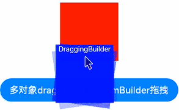

# @ohos.arkui.dragController (DragController)

本模块提供发起主动拖拽的能力，当应用接收到触摸或长按等事件时可以主动发起拖拽的动作，并在其中携带拖拽信息。

> **说明：**
>
> 本模块首批接口从 API version 10 开始支持。后续版本的新增接口，采用上角标单独标记接口的起始版本。
> 本模块功能依赖UI的执行上下文，不可在UI上下文不明确的地方使用，参见[UIContext](js-apis-arkui-UIContext.md#uicontext)说明。
> 从API version 11开始，可以通过使用UIContext中的[getDragController](js-apis-arkui-UIContext.md#getdragcontroller11)方法获取当前UI上下文关联的DragController对象。
> 示例效果请以真机运行为准，当前 IDE 预览器不支持。

## 导入模块

```ts
import { dragController } from "@kit.ArkUI";
```

## dragController.executeDrag

executeDrag(custom: CustomBuilder | DragItemInfo, dragInfo: DragInfo,callback:AsyncCallback\<DragEventParam>): void

主动发起拖拽能力，传入拖拽发起后跟手效果所拖拽的对象以及携带拖拽信息。通过回调返回结果。

**原子化服务API：** 从API version 12开始，该接口支持在原子化服务中使用。

**系统能力：** SystemCapability.ArkUI.ArkUI.Full

**参数：**

| 参数名   | 类型                                                         | 必填 | 说明                                                         |
| -------- | ------------------------------------------------------------ | ---- | ------------------------------------------------------------ |
| custom   | [CustomBuilder](arkui-ts/ts-types.md#custombuilder8) \| [DragItemInfo](arkui-ts/ts-universal-events-drag-drop.md#dragiteminfo说明) | 是   | 拖拽发起后跟手效果所拖拽的对象。<br/>**说明：** <br/>不支持全局builder。如果builder中使用了[Image](arkui-ts/ts-basic-components-image.md)组件，应尽量开启同步加载，即配置Image的[syncLoad](arkui-ts/ts-basic-components-image.md#syncload8)为true。该builder只用于生成当次拖拽中显示的图片，builder的修改不会同步到当前正在拖拽的图片，对builder的修改需要在下一次拖拽时生效。 |
| dragInfo | [DragInfo](#draginfo)                                        | 是   | 拖拽信息。                                                   |
| callback | [AsyncCallback](../apis-basic-services-kit/js-apis-base.md#asynccallback)&lt;[DragEventParam](#drageventparam12)&gt; | 是   | 拖拽结束返回结果的回调。                                     |

**错误码：**

以下错误码的详细介绍请参见[通用错误码](../errorcode-universal.md)错误码。

| 错误码ID | 错误信息      |
| -------- | ------------- |
| 401      | Parameter error. Possible causes: 1. Mandatory parameters are left unspecified; 2.Incorrect parameters types; 3. Parameter verification failed.   |
| 100001   | Internal handling failed. |

**示例：**

> **说明：**
>
> 推荐通过使用[UIContext](js-apis-arkui-UIContext.md#uicontext)中的[getDragController](js-apis-arkui-UIContext.md#getdragcontroller11)方法获取当前UI上下文关联的DragController对象。

```ts
import { dragController } from "@kit.ArkUI";
import { unifiedDataChannel } from '@kit.ArkData';

@Entry
@Component
struct DragControllerPage {
  @State text: string = ''

  @Builder DraggingBuilder() {
    Column() {
      Text("DraggingBuilder")
        .fontColor(Color.White)
        .fontSize(12)
    }
    .width(100)
    .height(100)
    .backgroundColor(Color.Blue)
  }

  build() {
    Column() {
      Button('touch to execute drag')
        .margin(10)
        .onTouch((event?:TouchEvent) => {
          if(event){
            if (event.type == TouchType.Down) {
              let text = new unifiedDataChannel.PlainText()
              text.textContent = 'drag text'
              text.abstract = 'abstract'
              let unifiedData = new unifiedDataChannel.UnifiedData(text)

              let dragInfo: dragController.DragInfo = {
                pointerId: 0,
                data: unifiedData,
                extraParams: ''
              }
              class tmp{
                event:DragEvent|undefined = undefined
                extraParams:string = ''
              }
              let eve:tmp = new tmp()
              dragController.executeDrag(()=>{this.DraggingBuilder()}, dragInfo, (err, eve) => { // 建议使用 this.getUIContext().getDragController().executeDrag()接口
                if(eve.event){
                  if (eve.event.getResult() == DragResult.DRAG_SUCCESSFUL) {
                    // ...
                  } else if (eve.event.getResult() == DragResult.DRAG_FAILED) {
                    // ...
                  }
                }
              })
            }
          }
        })
      Text(this.text)
        .height(100)
        .width(150)
        .margin({top:20})
        .border({color:Color.Black,width:1})
        .onDrop((dragEvent?:DragEvent)=>{
          if(dragEvent){
            let records: Array<unifiedDataChannel.UnifiedRecord> = dragEvent.getData().getRecords();
            let plainText: unifiedDataChannel.PlainText = records[0] as unifiedDataChannel.PlainText;
            this.text = plainText.textContent;
          }
        })
    }
    .width('100%')
    .height('100%')
  }
}
```
  
## dragController.executeDrag

executeDrag(custom: CustomBuilder | DragItemInfo, dragInfo: DragInfo): Promise\<DragEventParam>

主动发起拖拽能力，传入拖拽发起后跟手效果所拖拽的对象以及携带拖拽信息。通过Promise返回结果。

**原子化服务API：** 从API version 12开始，该接口支持在原子化服务中使用。

**系统能力：** SystemCapability.ArkUI.ArkUI.Full

**参数：**

| 参数名   | 类型                                                         | 必填 | 说明                             |
| -------- | ------------------------------------------------------------ | ---- | -------------------------------- |
| custom   | [CustomBuilder](arkui-ts/ts-types.md#custombuilder8) \| [DragItemInfo](arkui-ts/ts-universal-events-drag-drop.md#dragiteminfo说明) | 是   | 拖拽发起后跟手效果所拖拽的对象。 |
| dragInfo | [DragInfo](#draginfo)                                        | 是   | 拖拽信息。                       |

**返回值：** 

| 类型                                               | 说明                     |
| -------------------------------------------------- | ------------------------ |
| Promise&lt;[DragEventParam](#drageventparam12)&gt; | 拖拽结束返回结果的回调。 |

**错误码：**
以下错误码的详细介绍请参见[通用错误码](../errorcode-universal.md)错误码。
| 错误码ID | 错误信息      |
| -------- | ------------- |
| 401      | Parameter error. Possible causes: 1. Mandatory parameters are left unspecified; 2.Incorrect parameters types; 3. Parameter verification failed.   |
| 100001   | Internal handling failed. |

**示例：**

> **说明：**
>
> 推荐通过使用[UIContext](js-apis-arkui-UIContext.md#uicontext)中的[getDragController](js-apis-arkui-UIContext.md#getdragcontroller11)方法获取当前UI上下文关联的DragController对象。

```ts
import { dragController, componentSnapshot } from "@kit.ArkUI"
import { image } from '@kit.ImageKit';
import { unifiedDataChannel } from '@kit.ArkData';

@Entry
@Component
struct DragControllerPage {
  @State pixmap: image.PixelMap|undefined = undefined
  @State text: string = ''

  @Builder DraggingBuilder() {
    Column() {
      Text("DraggingBuilder")
        .fontColor(Color.White)
    }
    .width(100)
    .height(100)
    .backgroundColor(Color.Blue)
  }

  @Builder PixmapBuilder() {
    Column() {
      Text("PixmapBuilder")
        .fontColor(Color.White)
        .fontSize(15)
    }
    .width(100)
    .height(100)
    .backgroundColor(Color.Blue)
  }

  aboutToAppear() {
    let pb: CustomBuilder = (): void => {
      this.PixmapBuilder()
    }
    componentSnapshot.createFromBuilder(pb).then((pix: image.PixelMap) => {
      this.pixmap = pix;
    })
  }

  build() {
    Column() {
      Button('touch to execute drag')
        .margin(10)
        .onTouch((event?:TouchEvent) => {
          if(event){
            if (event.type == TouchType.Down) {
              let text = new unifiedDataChannel.PlainText()
              text.textContent = 'drag text'
              text.abstract = 'abstract'
              let unifiedData = new unifiedDataChannel.UnifiedData(text)

              let dragInfo: dragController.DragInfo = {
                pointerId: 0,
                data: unifiedData,
                extraParams: ''
              }
              let dragItemInfo: DragItemInfo = {
                pixelMap: this.pixmap,
                builder: ()=>{this.DraggingBuilder()},
                extraInfo: "DragItemInfoTest"
              }

              class tmp{
                event:DragResult|undefined = undefined
                extraParams:string = ''
              }
              let eve:tmp = new tmp()
              dragController.executeDrag(dragItemInfo, dragInfo) // 建议使用 this.getUIContext().getDragController().executeDrag()接口
                .then((eve) => {
                  if (eve.event.getResult() == DragResult.DRAG_SUCCESSFUL) {
                    // ...
                  } else if (eve.event.getResult() == DragResult.DRAG_FAILED) {
                    // ...
                  }
                })
                .catch((err:Error) => {
                })
            }
          }
        })
      Text(this.text)
        .height(100)
        .width(150)
        .margin({top:20})
        .border({color:Color.Black,width:1})
        .onDrop((dragEvent?:DragEvent)=>{
          if(dragEvent){
            let records: Array<unifiedDataChannel.UnifiedRecord> = dragEvent.getData().getRecords();
            let plainText: unifiedDataChannel.PlainText = records[0] as unifiedDataChannel.PlainText;
            this.text = plainText.textContent;
          }
        })
    }
    .width('100%')
    .height('100%')
  }
}
```
  
## DragInfo

**原子化服务API：** 从API version 12开始，该接口支持在原子化服务中使用。

**系统能力：** SystemCapability.ArkUI.ArkUI.Full

发起拖拽所需要的属性和拖拽时携带的信息。

| 名称        | 类型                                                   | 必填 | 说明                                     |
| ----------- | ------------------------------------------------------ | ---- | ---------------------------------------- |
| pointerId   | number                                                 | 是   | 设置启动拖拽时屏幕上触摸点的Id。         |
| data        | [unifiedDataChannel.UnifiedData](../apis-arkdata/js-apis-data-unifiedDataChannel.md#unifieddata) | 否   | 设置拖拽过程中携带的数据。               |
| extraParams | string                                                 | 否   | 设置拖拽事件额外信息，具体功能暂未实现。 |
| touchPoint<sup>11+</sup>    | [TouchPoint](arkui-ts/ts-types.md#touchpoint11)  | 否   | 配置跟手点坐标。不配置时，左右居中，顶部向下偏移20%。 |
| previewOptions<sup>11+</sup>| [DragPreviewOptions](arkui-ts/ts-universal-attributes-drag-drop.md#dragpreviewoptions11)                                | 否   | 设置拖拽过程中背板图处理模式及数量角标的显示。 |

## dragController.createDragAction<sup>11+</sup>

createDragAction(customArray: Array&lt;CustomBuilder \| DragItemInfo&gt;, dragInfo: DragInfo): DragAction

创建拖拽的Action对象，需要显式指定拖拽背板图(可多个)，以及拖拽的数据，跟手点等信息；当通过一个已创建的 Action 对象发起的拖拽未结束时，无法再次创建新的 Action 对象，接口会抛出异常；当Action对象的生命周期结束后，注册在该对象上的回调函数会失效，因此需要在一个尽量长的作用域下持有该对象，并在每次发起拖拽前通过createDragAction返回新的对象覆盖旧值。

**说明：** 建议控制传递的拖拽背板数量，传递过多容易导致拖起的效率问题。

**原子化服务API：** 从API version 12开始，该接口支持在原子化服务中使用。

**系统能力：** SystemCapability.ArkUI.ArkUI.Full

**参数：**

| 参数名   | 类型                                                         | 必填 | 说明                             |
| --------      | ------------------------------------------------------------ | ---- | -------------------------------- |
| customArray  | Array&lt;[CustomBuilder](arkui-ts/ts-types.md#custombuilder8) \| [DragItemInfo](arkui-ts/ts-universal-events-drag-drop.md#dragiteminfo说明)&gt; | 是   | 拖拽发起后跟手效果所拖拽的对象。 |
| dragInfo | [DragInfo](#draginfo)                                        | 是   | 拖拽信息。                       |

**返回值：** 

| 类型                                                   | 说明               |
| ------------------------------------------------------ | ------------------ |
| [DragAction](#dragaction11)| 创建拖拽Action对象，主要用于后面实现注册监听拖拽状态改变事件和启动拖拽服务。 |

**错误码：**

以下错误码的详细介绍请参见[通用错误码](../errorcode-universal.md)错误码。
| 错误码ID | 错误信息      |
| -------- | ------------- |
| 401      | Parameter error. Possible causes: 1. Mandatory parameters are left unspecified; 2.Incorrect parameters types; 3. Parameter verification failed.   |
| 100001   | Internal handling failed. |

**示例：**

> **说明：**
>
> 推荐通过使用[UIContext](js-apis-arkui-UIContext.md#uicontext)中的[getDragController](js-apis-arkui-UIContext.md#getdragcontroller11)方法获取当前UI上下文关联的DragController对象。

```ts
import { dragController, componentSnapshot } from "@kit.ArkUI";
import { image } from '@kit.ImageKit';
import { unifiedDataChannel } from '@kit.ArkData';

@Entry
@Component
struct DragControllerPage {
  @State pixmap: image.PixelMap | null = null
  @State text: string = ''
  private dragAction: dragController.DragAction | null = null;
  customBuilders:Array<CustomBuilder | DragItemInfo> = new Array<CustomBuilder | DragItemInfo>();
  @Builder DraggingBuilder() {
    Column() {
      Text("DraggingBuilder")
        .fontColor(Color.White)
        .fontSize(12)
    }
    .width(100)
    .height(100)
    .backgroundColor(Color.Blue)
  }

  build() {
    Column() {

      Column() {
        Text(this.text)
          .width('100%')
          .height('100%')
          .fontColor(Color.White)
          .fontSize(18)
          .onDrop((dragEvent?:DragEvent)=>{
            if(dragEvent){
              let records: Array<unifiedDataChannel.UnifiedRecord> = dragEvent.getData().getRecords();
              let plainText: unifiedDataChannel.PlainText = records[0] as unifiedDataChannel.PlainText;
              this.text = plainText.textContent;
            }
          })
      }
      .width(100)
      .height(100)
      .backgroundColor(Color.Red)
      .margin(10)

      Button('多对象dragAction customBuilder拖拽').onTouch((event?:TouchEvent) => {
        if(event){
          if (event.type == TouchType.Down) {
            console.info("muti drag Down by listener");
            this.customBuilders.splice(0, this.customBuilders.length);
            this.customBuilders.push(()=>{this.DraggingBuilder()});
            this.customBuilders.push(()=>{this.DraggingBuilder()});
            this.customBuilders.push(()=>{this.DraggingBuilder()});
            let text = new unifiedDataChannel.PlainText()
            text.textContent = 'drag text'
            let unifiedData = new unifiedDataChannel.UnifiedData(text)
            let dragInfo: dragController.DragInfo = {
              pointerId: 0,
              data: unifiedData,
              extraParams: ''
            }
            try{
              this.dragAction = dragController.createDragAction(this.customBuilders, dragInfo) // 建议使用 this.getUIContext().getDragController().createDragAction()接口
              if(!this.dragAction){
                console.info("listener dragAction is null");
                return
              }
              this.dragAction.on('statusChange', (dragAndDropInfo: dragController.DragAndDropInfo)=>{
                if (dragAndDropInfo.status == dragController.DragStatus.STARTED) {
                  console.info("drag has start");
                } else if (dragAndDropInfo.status == dragController.DragStatus.ENDED){
                  console.info("drag has end");
                  if (!this.dragAction) {
                    return
                  }
                  this.dragAction.off('statusChange')
                }
              })
              this.dragAction.startDrag().then(()=>{}).catch((err:Error)=>{
                console.info("start drag Error:" + err.message);
              })
            } catch(err) {
              console.info("create dragAction Error:" + err.message);
            }
          }
        }
      }).margin({top:20})
    }
  }
}
```
  
## DragAction<sup>11+</sup>

监听状态改变，启动拖拽服务的对象。

**原子化服务API：** 从API version 12开始，该接口支持在原子化服务中使用。

**系统能力：** SystemCapability.ArkUI.ArkUI.Full

### startDrag<sup>11+</sup>

startDrag(): Promise&lt;void&gt;

启动拖拽服务，返回Promise对象，回调启动成功和失败的结果。

**原子化服务API：** 从API version 12开始，该接口支持在原子化服务中使用。

**系统能力：** SystemCapability.ArkUI.ArkUI.Full

**错误码：**

| 错误码ID | 错误信息      |
| -------- | ------------- |
| 100001   | Internal handling failed. |

**示例：**

> **说明：**
>
> 推荐通过使用[UIContext](js-apis-arkui-UIContext.md#uicontext)中的[getDragController](js-apis-arkui-UIContext.md#getdragcontroller11)方法获取当前UI上下文关联的DragController对象。

```ts
import { dragController, componentSnapshot } from "@kit.ArkUI";
import { unifiedDataChannel } from '@kit.ArkData';

@Entry
@Component
struct DragControllerPage {
  private dragAction: dragController.DragAction | null = null;
  customBuilders:Array<CustomBuilder | DragItemInfo> = new Array<CustomBuilder | DragItemInfo>();
  @Builder DraggingBuilder() {
    Column() {
      Text("DraggingBuilder")
        .fontColor(Color.White)
        .fontSize(12)
    }
    .width(100)
    .height(100)
    .backgroundColor(Color.Blue)
  }

  build() {
    Column() {
      Button('touch to execute drag').onTouch((event?:TouchEvent) => {
        if(event){
          if (event.type == TouchType.Down) {
            this.customBuilders.splice(0, this.customBuilders.length);
            this.customBuilders.push(()=>{this.DraggingBuilder()});
            let text = new unifiedDataChannel.PlainText()
            text.textContent = 'drag text'
            let unifiedData = new unifiedDataChannel.UnifiedData(text)
            let dragInfo: dragController.DragInfo = {
              pointerId: 0,
              data: unifiedData,
              extraParams: ''
            }
            try{
              this.dragAction = dragController.createDragAction(this.customBuilders, dragInfo) // 建议使用 this.getUIContext().getDragController().createDragAction()接口
              if(!this.dragAction){
                console.info("listener dragAction is null");
                return;
              }
              this.dragAction.startDrag().then(()=>{}).catch((err:Error)=>{
                console.info("start drag Error:" + err.message);
              })
            } catch(err) {
              console.info("create dragAction Error:" + err.message);
            }
          }
        }
      }).margin({top:20})
    }
  }
}
```

### on('statusChange')<sup>11+</sup>

on(type: 'statusChange', callback: Callback&lt;[DragAndDropInfo](#draganddropinfo11)&gt;): void

注册监听拖拽状态改变事件。

**原子化服务API：** 从API version 12开始，该接口支持在原子化服务中使用。

**系统能力：** SystemCapability.ArkUI.ArkUI.Full

**参数：**
| 参数名     | 类型  | 必填    | 说明             |
| ------ | ------ | ------- | ---------------- |
|  type  | string | 是      | 监听事件，固定为'statusChange'，即注册监听拖拽状态改变事件。|
|  callback  | Callback&lt;[DragAndDropInfo](#draganddropinfo11)&gt; | 是      | 回调函数，返回当前的[DragAndDropInfo](#draganddropinfo11)组件状态。|

**示例：**

> **说明：**
>
> 推荐通过使用[UIContext](js-apis-arkui-UIContext.md#uicontext)中的[getDragController](js-apis-arkui-UIContext.md#getdragcontroller11)方法获取当前UI上下文关联的DragController对象。

```ts
import { dragController, componentSnapshot } from "@kit.ArkUI";
import { unifiedDataChannel } from '@kit.ArkData';

@Entry
@Component
struct DragControllerPage {
  private dragAction: dragController.DragAction | null = null;
  customBuilders:Array<CustomBuilder | DragItemInfo> = new Array<CustomBuilder | DragItemInfo>();
  @Builder DraggingBuilder() {
    Column() {
      Text("DraggingBuilder")
        .fontColor(Color.White)
        .fontSize(12)
    }
    .width(100)
    .height(100)
    .backgroundColor(Color.Blue)
  }

  build() {
    Column() {
      Button('touch to execute drag').onTouch((event?:TouchEvent) => {
        if(event){
          if (event.type == TouchType.Down) {
            this.customBuilders.splice(0, this.customBuilders.length);
            this.customBuilders.push(()=>{this.DraggingBuilder()});
            let text = new unifiedDataChannel.PlainText()
            text.textContent = 'drag text'
            let unifiedData = new unifiedDataChannel.UnifiedData(text)
            let dragInfo: dragController.DragInfo = {
              pointerId: 0,
              data: unifiedData,
              extraParams: ''
            }
            let func = (dragAndDropInfo: dragController.DragAndDropInfo) => {
              console.info("Register to listen on drag status", JSON.stringify(dragAndDropInfo));
            }
            try{
              this.dragAction = dragController.createDragAction(this.customBuilders, dragInfo) // 建议使用 this.getUIContext().getDragController().createDragAction()接口
              if(!this.dragAction){
                console.info("listener dragAction is null");
                return;
              }
              // 监听状态改变，触发后打印func中的日志
              this.dragAction.on('statusChange', func);
              this.dragAction.startDrag().then(()=>{}).catch((err:Error)=>{
                console.info("start drag Error:" + err.message);
              })
            } catch(err) {
              console.info("create dragAction Error:" + err.message);
            }
          }
        }
      }).margin({top:20})
    }
  }
}
```

### off('statusChange')<sup>11+</sup>

 off(type: 'statusChange', callback?: Callback&lt;[DragAndDropInfo](#draganddropinfo11)&gt;): void

取消注册监听拖拽状态改变事件。

**原子化服务API：** 从API version 12开始，该接口支持在原子化服务中使用。

**系统能力：** SystemCapability.ArkUI.ArkUI.Full

**参数：**
| 参数名     | 类型  | 必填    | 说明             |
| ------ | ------ | ------- | ---------------- |
|  type  | string | 是      | 监听事件，固定为'statusChange'，即取消监听拖拽状态改变事件。|
|  callback  | Callback&lt;[DragAndDropInfo](#draganddropinfo11)&gt; | 否      | 回调函数，取消注册了该回调函数的事件， 不设置取消所有监听。|

**示例：**

> **说明：**
>
> 推荐通过使用[UIContext](js-apis-arkui-UIContext.md#uicontext)中的[getDragController](js-apis-arkui-UIContext.md#getdragcontroller11)方法获取当前UI上下文关联的DragController对象。

```ts
import { dragController, componentSnapshot } from "@kit.ArkUI";
import { unifiedDataChannel } from '@kit.ArkData';

@Entry
@Component
struct DragControllerPage {
  private dragAction: dragController.DragAction | null = null;
  customBuilders:Array<CustomBuilder | DragItemInfo> = new Array<CustomBuilder | DragItemInfo>();
  @Builder DraggingBuilder() {
    Column() {
      Text("DraggingBuilder")
        .fontColor(Color.White)
        .fontSize(12)
    }
    .width(100)
    .height(100)
    .backgroundColor(Color.Blue)
  }

  build() {
    Column() {
      Button('touch to execute drag').onTouch((event?:TouchEvent) => {
        if(event){
          if (event.type == TouchType.Down) {
            this.customBuilders.splice(0, this.customBuilders.length);
            this.customBuilders.push(()=>{this.DraggingBuilder()});
            let text = new unifiedDataChannel.PlainText()
            text.textContent = 'drag text'
            let unifiedData = new unifiedDataChannel.UnifiedData(text)
            let dragInfo: dragController.DragInfo = {
              pointerId: 0,
              data: unifiedData,
              extraParams: ''
            }
            let func = (dragAndDropInfo: dragController.DragAndDropInfo) => {
              console.info("Register to listen on drag status", JSON.stringify(dragAndDropInfo));
            }
            try{
              this.dragAction = dragController.createDragAction(this.customBuilders, dragInfo) // 建议使用 this.getUIContext().getDragController().createDragAction()接口
              if(!this.dragAction){
                console.info("listener dragAction is null");
                return;
              }
              this.dragAction.on('statusChange', func);
              // 取消监听，发起拖拽后不会打印func中的日志
              this.dragAction.off('statusChange', func);
              this.dragAction.startDrag().then(()=>{}).catch((err:Error)=>{
                console.info("start drag Error:" + err.message);
              })
            } catch(err) {
              console.info("create dragAction Error:" + err.message);
            }
          }
        }
      }).margin({top:20})
    }
  }
}
```

## DragAndDropInfo<sup>11+</sup>

**原子化服务API：** 从API version 12开始，该接口支持在原子化服务中使用。

**系统能力：** SystemCapability.ArkUI.ArkUI.Full

拖拽过程中监听到status改变时上报的数据。

| 名称          | 类型                                                   | 必填 | 说明                                     |
| -----------   | ------------------------------------------------------ | ---- | ---------------------------------------- |
| status       | [DragStatus](#dragstatus11)                                                 | 是   | 当前拖拽状态（启动和结束）。         |
| event        | [DragEvent](arkui-ts/ts-universal-events-drag-drop.md#dragevent) | 是   | 当前状态所对应的拖拽事件。通过dragController发起的dragEvent仅支持获取result和behavior，且用于拖拽结束状态。 |
| extraParams| string                                                 | 否   | 设置拖拽事件额外信息，具体功能暂未实现。 |

## DragStatus<sup>11+</sup>

**原子化服务API：** 从API version 12开始，该接口支持在原子化服务中使用。

**系统能力：** SystemCapability.ArkUI.ArkUI.Full

拖拽开始和结束状态。

| 名称          | 值                                                   | 说明                                     |
| -----------   | ------------------------------------------------------| ---------------------------------------- |
| STARTED       | 0                                                  | 拖拽已成功发起。         |
| ENDED        | 1                                                  | 拖拽结束。               |

## AnimationOptions<sup>11+</sup>

**原子化服务API：** 从API version 12开始，该接口支持在原子化服务中使用。

**系统能力：** SystemCapability.ArkUI.ArkUI.Full

发起拖拽所需要的属性和拖拽时携带的信息。

| 名称        | 类型                                                   | 必填 | 说明                                     |
| ----------- | ------------------------------------------------------ | ---- | ---------------------------------------- |
| duration    | number                                                 | 否   | 动画持续时间，单位为毫秒。<br/>默认值：1000<br/>**说明：**<br/>-&nbsp;设置小于0的值时按0处理。<br/>-&nbsp;设置浮点型类型的值时，向下取整。例如，设置值为1.2，按照1处理。|
| curve       |&nbsp;[Curve](arkui-ts/ts-appendix-enums.md#curve)&nbsp;\|&nbsp;[ICurve](js-apis-curve.md#icurve) | 否    | 设置动画曲线。<br/>默认值：Curve.EaseInOut|                          |

## DragEventParam<sup>12+</sup>

**原子化服务API：** 从API version 12开始，该接口支持在原子化服务中使用。

**系统能力：** SystemCapability.ArkUI.ArkUI.Full

拖拽结束返回结果的回调。

| 名称        | 类型                                                         | 必填 | 说明                           |
| ----------- | ------------------------------------------------------------ | ---- | ------------------------------ |
| event       | [DragEvent](arkui-ts/ts-universal-events-drag-drop.md#dragevent) | 是   | 拖拽事件信息，仅包括拖拽结果。 |
| extraParams | string                                                       | 是   | 拖拽事件额外信息。             |

## dragController.getDragPreview<sup>11+</sup>

getDragPreview(): DragPreview

返回一个代表拖拽背板的对象。

**原子化服务API：** 从API version 12开始，该接口支持在原子化服务中使用。

**系统能力：** SystemCapability.ArkUI.ArkUI.Full

**返回值：**

| 类型        | 说明                                            |
| ------------| ------------------------------------------------|
| [DragPreview](#dragpreview11) | 一个代表拖拽背板的对象，提供背板样式设置的接口，在OnDrop和OnDragEnd回调中使用不生效。 |

**示例：**

请参考[animate](#animate11)

## DragPreview<sup>11+</sup>

拖拽背板的对象，在OnDrop和OnDragEnd回调中使用不生效。

**原子化服务API：** 从API version 12开始，该接口支持在原子化服务中使用。

**系统能力：** SystemCapability.ArkUI.ArkUI.Full

### setForegroundColor<sup>11+</sup>

setForegroundColor(color: ResourceColor): void

设置背板蒙版颜色，在OnDrop和OnDragEnd回调中使用不生效，仅支持通过 [getDragPreview()](js-apis-arkui-UIContext.md#getdragpreview11) 方法获取到的对象上使用。

**原子化服务API：** 从API version 12开始，该接口支持在原子化服务中使用。

**系统能力：** SystemCapability.ArkUI.ArkUI.Full

**参数：**

| 参数名   | 类型                             | 必填 | 说明                     |
| -------- | -------------------------------- | ---- | ------------------------ |
| color    | [ResourceColor](arkui-ts/ts-types.md#resourcecolor) | 是   |      背板蒙版颜色。                    |

**示例：**

请参考[animate](#animate11)

  ### animate<sup>11+</sup>

animate(options: AnimationOptions, handler: () => void): void

设置背板蒙版颜色变化动效，在OnDrop和OnDragEnd回调中使用不生效，仅支持通过 [getDragPreview()](js-apis-arkui-UIContext.md#getdragpreview11) 方法获取到的对象上使用。

**原子化服务API：** 从API version 12开始，该接口支持在原子化服务中使用。

**系统能力：** SystemCapability.ArkUI.ArkUI.Full

**参数：**

| 参数名   | 类型                             | 必填 | 说明                               |
| -------- | -------------------------------- | ---- | -----------------------------------|
| options  | [AnimationOptions](#animationoptions11)                | 是   | 动效参数。                           |
| handler  | () => void                         | 是   | 用于修改背板蒙版颜色等属性的回调方法。  |

**示例：**

> **说明：**
>
> 推荐通过使用[UIContext](js-apis-arkui-UIContext.md#uicontext)中的[getDragController](js-apis-arkui-UIContext.md#getdragcontroller11)方法获取当前UI上下文关联的DragController对象。

1.在EntryAbility.ets中获取UI上下文并保存至LocalStorage中。
  ```ts
import { AbilityConstant, UIAbility, Want } from '@kit.AbilityKit';
import { hilog } from '@kit.PerformanceAnalysisKit';
import { window, UIContext } from '@kit.ArkUI';

let uiContext: UIContext;
let localStorage: LocalStorage = new LocalStorage('uiContext');

export default class EntryAbility extends UIAbility {
  storage: LocalStorage = localStorage;

  onCreate(want: Want, launchParam: AbilityConstant.LaunchParam): void {
    hilog.info(0x0000, 'testTag', '%{public}s', 'Ability onCreate');
  }

  onDestroy(): void {
    hilog.info(0x0000, 'testTag', '%{public}s', 'Ability onDestroy');
  }

  onWindowStageCreate(windowStage: window.WindowStage): void {
    hilog.info(0x0000, 'testTag', '%{public}s', 'Ability onWindowStageCreate');

    windowStage.loadContent('pages/Index', (err, data) => {
      if (err.code) {
        hilog.error(0x0000, 'testTag', 'Failed to load the content. Cause: %{public}s', JSON.stringify(err) ?? '');
        return;
      }
      hilog.info(0x0000, 'testTag', 'Succeeded in loading the content. Data: %{public}s', JSON.stringify(data) ?? '');
      windowStage.getMainWindow((err, data) => {
        if (err.code) {
          hilog.error(0x0000, 'Failed to abtain the main window. Cause:' + err.message, '');
          return;
        }
        let windowClass: window.Window = data;
        uiContext = windowClass.getUIContext();
        this.storage.setOrCreate<UIContext>('uiContext', uiContext);
      })
    });
  }
}
  ```
2.在Index.ets中通过LocalStorage.getShared()获取UI上下文，进而获取DragController对象实施后续操作。
  ```ts

import { unifiedDataChannel } from '@kit.ArkData';
import { hilog } from '@kit.PerformanceAnalysisKit';
import { dragController, curves, promptAction, UIContext } from "@kit.ArkUI";
import { image } from '@kit.ImageKit';
import { BusinessError } from '@kit.BasicServicesKit';

let storages = LocalStorage.getShared();

@Entry(storages)
@Component
struct DragControllerPage {
  @State pixmap: image.PixelMap|null = null

  @Builder DraggingBuilder() {
    Column() {
      Text("DraggingBuilder")
        .fontColor(Color.White)
        .fontSize(12)
    }
    .width(100)
    .height(100)
    .backgroundColor(Color.Blue)
  }

  @Builder PixmapBuilder() {
    Column() {
      Text("PixmapBuilder")
    }
    .width(100)
    .height(100)
    .backgroundColor(Color.Blue)
  }

  build() {
    Column() {
      Button('拖拽至此处')
        .margin(10)
        .onDragEnter(() => {
        try {
          let uiContext: UIContext = storages.get<UIContext>('uiContext') as UIContext;
          let previewObj: dragController.DragPreview = uiContext.getDragController().getDragPreview();
          let foregroundColor: ResourceColor = Color.Green;

          let previewAnimation: dragController.AnimationOptions = {
            curve: curves.cubicBezierCurve(0.2,0,0,1),
          }
          previewObj.animate(previewAnimation, () => {
            previewObj.setForegroundColor(foregroundColor);
          });
        } catch (error) {
          let msg = (error as BusinessError).message;
          let code = (error as BusinessError).code;
          hilog.error(0x0000, `show error code is ${code}, message is ${msg}`, '');
        }
      })
        .onDrop(() => {
          promptAction.showToast({duration: 100, message: 'Drag Success', bottom: 400})
        })
      Button('拖起').onTouch((event?:TouchEvent) => {
        if(event){
          if (event.type == TouchType.Down) {
            let text = new unifiedDataChannel.Text()
            let unifiedData = new unifiedDataChannel.UnifiedData(text)
            let dragInfo: dragController.DragInfo = {
              pointerId: 0,
              data: unifiedData,
              extraParams: ''
            }
            class tmp{
              event:DragEvent|undefined = undefined
              extraParams:string = ''
            }
            let eve:tmp = new tmp()
            dragController.executeDrag(() => { // 建议使用 this.getUIContext().getDragController().executeDrag()接口
              this.DraggingBuilder()
            }, dragInfo, (err , eve) => {
              hilog.info(0x0000, `ljx ${JSON.stringify(err)}`, '')
              if (eve && eve.event) {
                if (eve.event.getResult() == DragResult.DRAG_SUCCESSFUL) {
                  hilog.info(0x0000, 'success', '');
                } else if (eve.event.getResult() == DragResult.DRAG_FAILED) {
                  hilog.info(0x0000, 'failed', '');
                }
              }
            })
          }
        }
      }).margin({top:100})
    }
    .width('100%')
    .height('100%')
  }
}
  ```
  

## DragStartRequestStatus<sup>16+</sup>

定义应用是否可以发起拖拽的枚举类型。

**原子化服务API：** 从API version 16开始，该接口支持在原子化服务中使用。

**系统能力：** SystemCapability.ArkUI.ArkUI.Full

| 名称     | 值 | 说明                                                         |
| -------- | -- | ------------------------------------------------------------ |
| WAITING   | 0 | 应用准备数据中，无法发起拖拽。 |
| READY | 1 | 应用数据准备完成，可以发起拖拽。 |