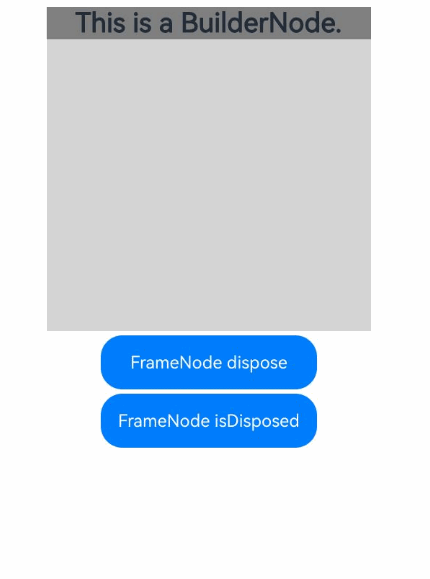
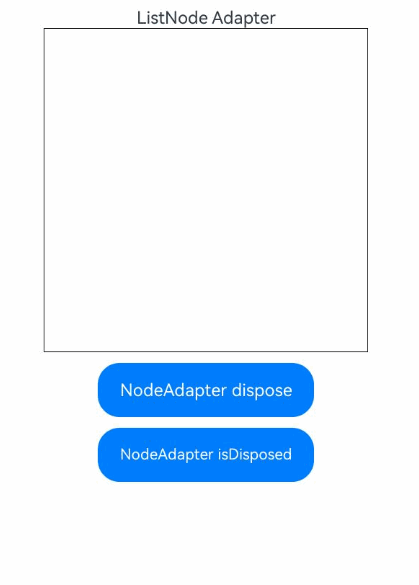

# FrameNode

FrameNode表示组件树的实体节点。[NodeController](./js-apis-arkui-nodeController.md)可通过[BuilderNode](./js-apis-arkui-builderNode.md)持有的FrameNode将其挂载到[NodeContainer](arkui-ts/ts-basic-components-nodecontainer.md)上，也可通过FrameNode获取[RenderNode](./js-apis-arkui-renderNode.md)，挂载到其他FrameNode上。最佳实践请参考[组件动态创建-组件动态添加、更新和删除](https://developer.huawei.com/consumer/cn/doc/best-practices/bpta-ui-dynamic-operations#section153921947151012)。

> **说明：**
>
> 本模块首批接口从API version 11开始支持。后续版本的新增接口，采用上角标单独标记接口的起始版本。
> 
> 当前不支持在预览器中使用FrameNode节点。
>
> FrameNode节点暂不支持拖拽。

## 导入模块

```ts
import { FrameNode, LayoutConstraint, ExpandMode, typeNode, NodeAdapter } from "@kit.ArkUI";
```

## CrossLanguageOptions<sup>15+</sup>

该接口用于配置或查询FrameNode的跨语言访问权限。例如，针对ArkTS语言创建的节点，可通过该接口控制是否允许通过非ArkTS语言进行属性访问或修改。

**原子化服务API：** 从API version 15开始，该接口支持在原子化服务中使用。

**系统能力：** SystemCapability.ArkUI.ArkUI.Full

| 名称   | 类型   | 只读 | 可选 | 说明                   |
| ------ | ------ | ---- | ---- | ---------------------- |
| attributeSetting  | boolean | 否   | 是   | FrameNode是否支持跨ArkTS语言进行属性设置。<br/>true表示支持跨ArkTS语言进行属性设置，false表示不支持跨ArkTS语言进行属性设置。<br/>默认为false。 |

## ExpandMode<sup>15+</sup>

子节点展开模式枚举。

**原子化服务API：** 从API version 15开始，该接口支持在原子化服务中使用。

**系统能力：** SystemCapability.ArkUI.ArkUI.Full

| 名称 | 值 | 说明 |
| -------- | -------- | -------- |
| NOT_EXPAND | 0 | 表示不展开当前FrameNode的子节点。如果FrameNode包含[LazyForEach](./arkui-ts/ts-rendering-control-lazyforeach.md)子节点，获取在主节点树上的子节点时，不展开当前FrameNode的子节点。子节点序列号按在主节点树上的子节点计算。 |
| EXPAND | 1 | 表示展开当前FrameNode的子节点。如果FrameNode包含[LazyForEach](./arkui-ts/ts-rendering-control-lazyforeach.md)子节点，获取所有子节点时，展开当前FrameNode的子节点。子节点序列号按所有子节点计算。 |
| LAZY_EXPAND | 2 | 表示按需展开当前FrameNode的子节点。如果FrameNode包含[LazyForEach](./arkui-ts/ts-rendering-control-lazyforeach.md)子节点，获取在主树上的子节点时，不展开当前FrameNode的子节点；获取不在主树上的子节点时，展开当前FrameNode的子节点。子节点序列号按所有子节点计算。 |

## InteractionEventBindingInfo<sup>19+</sup>

如果当前节点上绑定了所要查询的交互事件，则返回一个InteractionEventBindingInfo对象，指示事件绑定详细信息。

**原子化服务API：** 从API version 19开始，该接口支持在原子化服务中使用。

**系统能力：** SystemCapability.ArkUI.ArkUI.Full

| 名称   | 类型   | 只读 | 可选 | 说明                   |
| ------ | ------ | ---- | ---- | ---------------------- |
| baseEventRegistered  | boolean |  否   | 否   | 是否以声明方式绑定事件。<br/>true表示以声明方式绑定事件，false表示没有以声明方式绑定事件。 |
| nodeEventRegistered  | boolean | 否   | 否   | 是否以自定义组件节点的方式绑定事件，请参考[基础事件示例](#基础事件示例)<br/>true表示以自定义组件节点的方式绑定事件，false表示没有以自定义组件节点的方式绑定事件。 |
| nativeEventRegistered  | boolean | 否   | 否   | 是否以注册节点事件（[registerNodeEvent](capi-arkui-nativemodule-arkui-nativenodeapi-1.md#registernodeevent)）的方式绑定事件。<br/>true表示以注册节点事件的方式绑定事件，false表示没有以注册节点事件的方式绑定事件。|
| builtInEventRegistered  | boolean | 否   | 否   | 组件是否绑定内置事件(组件内部定义的事件, 无需开发者手动绑定)。<br/>true表示组件绑定内置事件，false表示组件没有绑定内置事件。 |

## UIState<sup>20+</sup>

多态样式状态枚举。

**原子化服务API：** 从API version 20开始，该接口支持在原子化服务中使用。

**系统能力：** SystemCapability.ArkUI.ArkUI.Full

| 名称 | 值 | 说明 |
| -------- | -------- | -------- |
| NORMAL | 0 | 正常状态。 |
| PRESSED | 1 << 0 | 按下状态。 |
| FOCUSED | 1 << 1 | 获焦状态。 |
| DISABLED | 1 << 2 | 禁用状态。 |
| SELECTED | 1 << 3 | 选中状态。<br/>仅特定的组件支持此状态：Checkbox、Radio、Toggle、List、Grid、MenuItem。 |

## UIStatesChangeHandler<sup>20+</sup>

type UIStatesChangeHandler = (node: FrameNode, currentUIStates: number) => void

当UI状态发生变化时触发的回调。

**原子化服务API：** 从API version 20开始，该接口支持在原子化服务中使用。

**系统能力：** SystemCapability.ArkUI.ArkUI.Full

| 参数名   | 类型                      | 必填 | 说明                                                     |
| -------- | ----------------------------- | ---- | ------------------------------------------------------------ |
| node    | [FrameNode](#framenode) | 是   | 触发UI状态变化的节点。                                            |
| currentUIStates    | number         | 是   | 回调触发时当前的UI状态。<br>可以通过位与运算判断当前包含哪些[UIState](#uistate20)状态。<br>位与运算方法：if (currentState & UIState.PRESSED == UIState.PRESSED)。                                            |


## FrameNode

### constructor

constructor(uiContext: UIContext)

FrameNode的构造函数。

**原子化服务API：** 从API version 12开始，该接口支持在原子化服务中使用。

**系统能力：** SystemCapability.ArkUI.ArkUI.Full

**参数：**

| 参数名    | 类型                                      | 必填 | 说明                               |
| --------- | ----------------------------------------- | ---- | ---------------------------------- |
| uiContext | [UIContext](./js-apis-arkui-UIContext.md) | 是   | 创建对应节点时所需的UI上下文。 |

### getRenderNode

getRenderNode(): RenderNode | null

获取FrameNode中持有的RenderNode。

**原子化服务API：** 从API version 12开始，该接口支持在原子化服务中使用。

**系统能力：** SystemCapability.ArkUI.ArkUI.Full

**返回值：**

| 类型                                                           | 说明                                                                                                             |
| -------------------------------------------------------------- | ---------------------------------------------------------------------------------------------------------------- |
| [RenderNode](./js-apis-arkui-renderNode.md) \| null | 一个RenderNode对象。若该FrameNode不包含RenderNode，则返回空对象null。如果当前FrameNode为声明式组件创建的节点，则返回null。 |

**示例：**

```ts
import { NodeController, FrameNode } from '@kit.ArkUI';

class MyNodeController extends NodeController {
  private rootNode: FrameNode | null = null;

  makeNode(uiContext: UIContext): FrameNode | null {
    this.rootNode = new FrameNode(uiContext);

    const renderNode = this.rootNode.getRenderNode();
    if (renderNode !== null) {
      renderNode.size = { width: 100, height: 100 };
      renderNode.backgroundColor = 0XFFFF0000;
    }

    return this.rootNode;
  }
}

@Entry
@Component
struct Index {
  private myNodeController: MyNodeController = new MyNodeController();

  build() {
    Row() {
      NodeContainer(this.myNodeController)
    }
  }
}
```
### isModifiable<sup>12+</sup> 

isModifiable(): boolean

判断当前节点是否可修改。

**原子化服务API：** 从API version 12开始，该接口支持在原子化服务中使用。

**系统能力：** SystemCapability.ArkUI.ArkUI.Full

**返回值：**

| 类型    | 说明                                                                                                                                  |
| ------- | ------------------------------------------------------------------------------------------------------------------------------------- |
| boolean | 判断当前节点是否可修改。<br/>true表示当前节点可修改，false表示当前节点不可修改。<br/>当节点为系统组件的代理节点或节点已经[dispose](#dispose12)时返回false。<br/>当返回false时，当前FrameNode不支持appendChild、insertChildAfter、removeChild、clearChildren、createAnimation、cancelAnimations的操作。 |

**示例：**

请参考[节点操作示例](#节点操作示例)。

### appendChild<sup>12+</sup> 

appendChild(node: FrameNode): void

在FrameNode最后一个子节点后添加新的子节点。当前FrameNode如果不可修改，抛出异常信息。[typeNode](#typenode12)在appendChild时会校验子组件类型或个数，不满足抛出异常信息，限制情况请查看[typeNode](#typenode12)描述。

**原子化服务API：** 从API version 12开始，该接口支持在原子化服务中使用。

**系统能力：** SystemCapability.ArkUI.ArkUI.Full

**参数：**

| 参数名 | 类型                    | 必填 | 说明                  |
| ------ | ----------------------- | ---- | --------------------- |
| node   | [FrameNode](#framenode) | 是   | 需要添加的FrameNode。<br/>**说明：**<br/> node节点不可以为声明式创建的节点，即不可修改的FrameNode。仅有从BuilderNode中获取的声明式节点可以作为子节点。若子节点不符合规格，则抛出异常信息。<br/> node节点不可以拥有父节点，否则抛出异常信息。|

**错误码：**

| 错误码ID | 错误信息                         |
| -------- | -------------------------------- |
| 100021   | The FrameNode is not modifiable. |

**示例：**

请参考[节点操作示例](#节点操作示例)。

### insertChildAfter<sup>12+</sup> 

insertChildAfter(child: FrameNode, sibling: FrameNode | null): void

在FrameNode指定子节点之后添加新的子节点。当前FrameNode如果不可修改，抛出异常信息。

**原子化服务API：** 从API version 12开始，该接口支持在原子化服务中使用。

**系统能力：** SystemCapability.ArkUI.ArkUI.Full

**参数：**

| 参数名  | 类型                                      | 必填 | 说明                                                                         |
| ------- | ----------------------------------------- | ---- | ---------------------------------------------------------------------------- |
| child   | [FrameNode](#framenode)                   | 是   | 需要添加的子节点。<br/>**说明：**<br/> child节点不可以为声明式创建的节点，即不可修改的FrameNode。仅有从BuilderNode中获取的声明式节点可以作为子节点。若子节点不符合规格，则抛出异常信息。<br/> child节点不可以拥有父节点，否则抛出异常信息。                                                           |
| sibling | [FrameNode](#framenode)&nbsp;\|&nbsp;null | 是   | 新节点将插入到该节点之后。若该参数设置为空，则新节点将插入到首个子节点之前。 |

**错误码：**

| 错误码ID | 错误信息                         |
| -------- | -------------------------------- |
| 100021   | The FrameNode is not modifiable. |

**示例：**

请参考[节点操作示例](#节点操作示例)。

### removeChild<sup>12+</sup> 

removeChild(node: FrameNode): void

从FrameNode中删除指定的子节点。当前FrameNode如果不可修改，抛出异常信息。

**原子化服务API：** 从API version 12开始，该接口支持在原子化服务中使用。

**系统能力：** SystemCapability.ArkUI.ArkUI.Full

**参数：**

| 参数名 | 类型                    | 必填 | 说明               |
| ------ | ----------------------- | ---- | ------------------ |
| node   | [FrameNode](#framenode) | 是   | 需要删除的子节点。 |

**错误码：**

| 错误码ID | 错误信息                         |
| -------- | -------------------------------- |
| 100021   | The FrameNode is not modifiable. |

**示例：**

请参考[节点操作示例](#节点操作示例)。

### clearChildren<sup>12+</sup> 

clearChildren(): void

清除当前FrameNode的所有子节点。当前FrameNode如果不可修改，抛出异常信息。

**原子化服务API：** 从API version 12开始，该接口支持在原子化服务中使用。

**系统能力：** SystemCapability.ArkUI.ArkUI.Full

**错误码：**

| 错误码ID | 错误信息                         |
| -------- | -------------------------------- |
| 100021   | The FrameNode is not modifiable. |

**示例：**

请参考[节点操作示例](#节点操作示例)。

### getChild<sup>12+</sup> 

getChild(index: number): FrameNode | null

获取当前节点指定位置的子节点。

**原子化服务API：** 从API version 12开始，该接口支持在原子化服务中使用。

**系统能力：** SystemCapability.ArkUI.ArkUI.Full

**参数：**

| 参数名 | 类型   | 必填 | 说明                       |
| ------ | ------ | ---- | -------------------------- |
| index  | number | 是   | 需要查询的子节点的序列号。<br/>若当前节点有n个子节点，index取值范围为[0, n-1]。 |

**返回值：**

| 类型                            | 说明                                                          |
| ------------------------------- | ------------------------------------------------------------- |
| [FrameNode](#framenode) \| null | 子节点。若该FrameNode不包含所查询的子节点，则返回空对象null。 |

**示例：**

请参考[节点操作示例](#节点操作示例)。

### getChild<sup>15+</sup> 

getChild(index: number, expandMode?: ExpandMode): FrameNode | null

获取当前节点指定位置的子节点，支持指定子节点展开模式。

**原子化服务API：** 从API version 15开始，该接口支持在原子化服务中使用。

**系统能力：** SystemCapability.ArkUI.ArkUI.Full

**参数：**

| 参数名 | 类型   | 必填 | 说明                       |
| ------ | ------ | ---- | -------------------------- |
| index  | number | 是   | 需要查询的子节点的序列号。<br/>若当前节点有n个子节点，index取值范围为[0, n-1]。 |
| expandMode | [ExpandMode](#expandmode15) | 否 | 指定子节点展开模式。<br/>默认值：ExpandMode.EXPAND |

**返回值：**

| 类型                            | 说明                                                          |
| ------------------------------- | ------------------------------------------------------------- |
| [FrameNode](#framenode) \| null | 子节点。若该FrameNode不包含所查询的子节点，则返回空对象null。 |

**示例：**

请参考[LazyForEach场景节点操作示例](#lazyforeach场景节点操作示例)。

### getFirstChildIndexWithoutExpand<sup>15+</sup> 

getFirstChildIndexWithoutExpand(): number

获取当前节点第一个在主节点树上的子节点的序列号。子节点序列号按所有子节点计算。

**原子化服务API：** 从API version 15开始，该接口支持在原子化服务中使用。

**系统能力：** SystemCapability.ArkUI.ArkUI.Full

**返回值：**

| 类型   | 说明                                      |
| ------ | ---------------------------------------- |
| number | 当前节点第一个在主节点树上的子节点的序列号。 |

**示例：**

请参考[LazyForEach场景节点操作示例](#lazyforeach场景节点操作示例)。

### getLastChildIndexWithoutExpand<sup>15+</sup> 

getLastChildIndexWithoutExpand(): number

获取当前节点最后一个在主节点树上的子节点的序列号。子节点序列号按所有子节点计算。

**原子化服务API：** 从API version 15开始，该接口支持在原子化服务中使用。

**系统能力：** SystemCapability.ArkUI.ArkUI.Full

**返回值：**

| 类型   | 说明                                        |
| ------ | ------------------------------------------ |
| number | 当前节点最后一个在主节点树上的子节点的序列号。 |

**示例：**

请参考[LazyForEach场景节点操作示例](#lazyforeach场景节点操作示例)。

### getFirstChild<sup>12+</sup> 

getFirstChild(): FrameNode | null

获取当前FrameNode的第一个子节点。

**原子化服务API：** 从API version 12开始，该接口支持在原子化服务中使用。

**系统能力：** SystemCapability.ArkUI.ArkUI.Full

**返回值：**

| 类型                            | 说明                                                      |
| ------------------------------- | --------------------------------------------------------- |
| [FrameNode](#framenode) \| null | 首个子节点。若该FrameNode不包含子节点，则返回空对象null。 |

**示例：**

请参考[节点操作示例](#节点操作示例)。

### getNextSibling<sup>12+</sup> 

getNextSibling(): FrameNode | null

获取当前FrameNode的下一个同级节点。

**原子化服务API：** 从API version 12开始，该接口支持在原子化服务中使用。

**系统能力：** SystemCapability.ArkUI.ArkUI.Full

**返回值：**

| 类型                            | 说明                                                                                 |
| ------------------------------- | ------------------------------------------------------------------------------------ |
| [FrameNode](#framenode) \| null | 当前FrameNode的下一个同级节点。若该FrameNode不包含下一个同级节点，则返回空对象null。 |

**示例：**

请参考[节点操作示例](#节点操作示例)。

### getPreviousSibling<sup>12+</sup> 

getPreviousSibling(): FrameNode | null

获取当前FrameNode的上一个同级节点。

**原子化服务API：** 从API version 12开始，该接口支持在原子化服务中使用。

**系统能力：** SystemCapability.ArkUI.ArkUI.Full

**返回值：**

| 类型                             | 说明                                                                                 |
| -------------------------------- | ------------------------------------------------------------------------------------ |
| [FrameNode](#framenode) \| null | 当前FrameNode的上一个同级节点。若该FrameNode不包含上一个同级节点，则返回空对象null。 |

**示例：**

请参考[节点操作示例](#节点操作示例)。

### getParent<sup>12+</sup> 

getParent(): FrameNode | null

获取当前FrameNode的父节点。

**原子化服务API：** 从API version 12开始，该接口支持在原子化服务中使用。

**系统能力：** SystemCapability.ArkUI.ArkUI.Full

**返回值：**

| 类型                             | 说明                                                                 |
| -------------------------------- | -------------------------------------------------------------------- |
| [FrameNode](#framenode) \| null | 当前FrameNode的父节点。若该FrameNode不包含父节点，则返回空对象null。 |

**示例：**

请参考[节点操作示例](#节点操作示例)和[获取根节点示例](#获取根节点示例)。


### getChildrenCount<sup>12+</sup> 

getChildrenCount(): number

获取当前FrameNode的子节点数量。

**原子化服务API：** 从API version 12开始，该接口支持在原子化服务中使用。

**系统能力：** SystemCapability.ArkUI.ArkUI.Full

**返回值：**

| 类型     | 说明                            |
| -------- | ------------------------------- |
| number | 获取当前FrameNode的子节点数量。 |

**示例：**

请参考[节点操作示例](#节点操作示例)。

### moveTo<sup>18+</sup>

moveTo(targetParent: FrameNode, index?: number): void

将当前FrameNode移动到目标FrameNode的指定位置。当前FrameNode如果不可修改，抛出异常信息。targetParent为[typeNode](#typenode12)时会校验子组件类型或个数，不满足抛出异常信息，限制情况请查看[typeNode](#typenode12)描述。

> **说明：**
>
> 当前仅支持以下类型的[TypedFrameNode](#typedframenode12)进行移动操作：[Stack](#stack12)、[XComponent](#xcomponent12)。对于其他类型的节点，移动操作不会生效。
>
> 当前仅支持根节点为以下类型组件的[BuilderNode](./js-apis-arkui-builderNode.md#buildernode-1)进行移动操作：[Stack](./arkui-ts/ts-container-stack.md)、[XComponent](./arkui-ts/ts-basic-components-xcomponent.md)、[EmbeddedComponent](./arkui-ts/ts-container-embedded-component.md)。对于其他类型的组件，移动操作不会生效。

**原子化服务API：** 从API version 18开始，该接口支持在原子化服务中使用。

**系统能力：** SystemCapability.ArkUI.ArkUI.Full

**参数：**

| 参数名        | 类型                    | 必填 | 说明                  |
| ------------ | ----------------------- | ---- | --------------------- |
| targetParent | [FrameNode](#framenode) | 是   | 目标父节点。<br/>**说明：**<br/>targetParent节点不可以为声明式创建的节点，即不可修改的FrameNode。若目标父节点不符合规格，则抛出异常信息。 |
| index        | number                  | 否   | 子节点序列号。当前FrameNode将被添加到目标FrameNode对应序列号的子节点之前，若目标FrameNode有n个节点，index取值范围为[0, n-1]。<br/>若参数无效或不指定，则添加到目标FrameNode的最后。<br/>默认值：-1 |

**错误码：**

| 错误码ID | 错误信息                          |
| -------- | -------------------------------- |
| 100021   | The FrameNode is not modifiable. |

**示例：**

请参考[节点操作示例](#节点操作示例)。

### getPositionToWindow<sup>12+</sup> 

getPositionToWindow(): Position

获取FrameNode相对于窗口的位置偏移，单位为VP。

**原子化服务API：** 从API version 12开始，该接口支持在原子化服务中使用。

**系统能力：** SystemCapability.ArkUI.ArkUI.Full

**返回值：**

| 类型     | 说明                            |
| -------- | ------------------------------- |
| [Position](./js-apis-arkui-graphics.md#position) | 节点相对于窗口的位置偏移，单位为VP。 |

**示例：**

```ts
import { NodeController, FrameNode, UIContext } from '@kit.ArkUI';

const TEST_TAG: string = "FrameNode ";

class MyNodeController extends NodeController {
  public frameNode: FrameNode | null = null;
  private rootNode: FrameNode | null = null;

  makeNode(uiContext: UIContext): FrameNode | null {
    this.rootNode = new FrameNode(uiContext);
    this.frameNode = new FrameNode(uiContext);
    this.frameNode.commonAttribute.backgroundColor(Color.Pink);
    this.frameNode.commonAttribute.size({ width: 100, height: 100 });
    this.rootNode.appendChild(this.frameNode);
    return this.rootNode;
  }

  getPositionToWindow() {
    let positionToWindow = this.rootNode?.getPositionToWindow();
    console.info(TEST_TAG + JSON.stringify(positionToWindow));
  }
}

@Entry
@Component
struct Index {
  private myNodeController: MyNodeController = new MyNodeController();
  private scroller: Scroller = new Scroller();
  @State index: number = 0;

  build() {
    Scroll(this.scroller) {
      Column({ space: 8 }) {
        Column() {
          Text("This is a NodeContainer.")
            .textAlign(TextAlign.Center)
            .borderRadius(10)
            .backgroundColor(0xFFFFFF)
            .width('100%')
            .fontSize(16)
          NodeContainer(this.myNodeController)
            .borderWidth(1)
            .width(300)
            .height(100)
        }

        Button("getPositionToWindow")
          .width(300)
          .onClick(() => {
            this.myNodeController.getPositionToWindow();
          })
      }
      .width("100%")
    }
    .scrollable(ScrollDirection.Vertical) // 滚动方向纵向
  }
}

```

请参考[节点操作示例](#节点操作示例)。


### getPositionToParent<sup>12+</sup>

getPositionToParent(): Position

获取FrameNode相对于父组件的位置偏移，单位为VP。

**原子化服务API：** 从API version 12开始，该接口支持在原子化服务中使用。

**系统能力：** SystemCapability.ArkUI.ArkUI.Full

**返回值：**

| 类型                                                           | 说明                                                                  |
| -------------------------------------------------------------- | --------------------------------------------------------------------- |
| [Position](./js-apis-arkui-graphics.md#position) | 节点相对于父组件的位置偏移，单位为VP。 |

**示例：**

```ts
import { NodeController, FrameNode, UIContext } from '@kit.ArkUI';

const TEST_TAG: string = "FrameNode ";

class MyNodeController extends NodeController {
  public frameNode: FrameNode | null = null;
  private rootNode: FrameNode | null = null;

  makeNode(uiContext: UIContext): FrameNode | null {
    this.rootNode = new FrameNode(uiContext);

    this.frameNode = new FrameNode(uiContext);
    this.frameNode.commonAttribute.backgroundColor(Color.Pink);
    this.frameNode.commonAttribute.size({ width: 100, height: 100 });
    this.rootNode.appendChild(this.frameNode);
    return this.rootNode;
  }

  getPositionToParent() {
    let positionToParent = this.rootNode?.getPositionToParent();
    console.info(TEST_TAG + JSON.stringify(positionToParent));
  }
}

@Entry
@Component
struct Index {
  private myNodeController: MyNodeController = new MyNodeController();
  private scroller: Scroller = new Scroller();
  @State index: number = 0;

  build() {
    Scroll(this.scroller) {
      Column({ space: 8 }) {
        Column() {
          Text("This is a NodeContainer.")
            .textAlign(TextAlign.Center)
            .borderRadius(10)
            .backgroundColor(0xFFFFFF)
            .width('100%')
            .fontSize(16)
          NodeContainer(this.myNodeController)
            .borderWidth(1)
            .width(300)
            .height(100)
        }

        Button("getPositionToParent")
          .width(300)
          .onClick(() => {
            this.myNodeController.getPositionToParent();
          })
      }
      .width("100%")
    }
    .scrollable(ScrollDirection.Vertical) // 滚动方向纵向
  }
}

```

请参考[节点操作示例](#节点操作示例)。

### getPositionToScreen<sup>12+</sup> 

getPositionToScreen(): Position

获取FrameNode相对于屏幕的位置偏移，单位为VP。

**原子化服务API：** 从API version 12开始，该接口支持在原子化服务中使用。

**系统能力：** SystemCapability.ArkUI.ArkUI.Full

**返回值：**

| 类型     | 说明                            |
| -------- | ------------------------------- |
| [Position](./js-apis-arkui-graphics.md#position) | 节点相对于屏幕的位置偏移，单位为VP。 |

**示例：**

```ts
import { NodeController, FrameNode, UIContext } from '@kit.ArkUI';

const TEST_TAG: string = "FrameNode ";

class MyNodeController extends NodeController {
  public frameNode: FrameNode | null = null;
  private rootNode: FrameNode | null = null;

  makeNode(uiContext: UIContext): FrameNode | null {
    this.rootNode = new FrameNode(uiContext);

    this.frameNode = new FrameNode(uiContext);
    this.frameNode.commonAttribute.backgroundColor(Color.Pink);
    this.frameNode.commonAttribute.size({ width: 100, height: 100 });
    this.rootNode.appendChild(this.frameNode);
    return this.rootNode;
  }

  getPositionToScreen() {
    let positionToScreen = this.rootNode?.getPositionToScreen();
    console.info(TEST_TAG + JSON.stringify(positionToScreen));
  }
}

@Entry
@Component
struct Index {
  private myNodeController: MyNodeController = new MyNodeController();
  private scroller: Scroller = new Scroller();
  @State index: number = 0;

  build() {
    Scroll(this.scroller) {
      Column({ space: 8 }) {
        Column() {
          Text("This is a NodeContainer.")
            .textAlign(TextAlign.Center)
            .borderRadius(10)
            .backgroundColor(0xFFFFFF)
            .width('100%')
            .fontSize(16)
          NodeContainer(this.myNodeController)
            .borderWidth(1)
            .width(300)
            .height(100)
        }

        Button("getPositionToScreen")
          .width(300)
          .onClick(() => {
            this.myNodeController.getPositionToScreen();
          })
      }
      .width("100%")
    }
    .scrollable(ScrollDirection.Vertical) // 滚动方向纵向
  }
}

```

请参考[节点操作示例](#节点操作示例)。


### getGlobalPositionOnDisplay<sup>20+</sup> 

getGlobalPositionOnDisplay(): Position

获取FrameNode相对于全局屏幕的位置偏移，单位为VP。

**原子化服务API：** 从API version 20开始，该接口支持在原子化服务中使用。

**系统能力：** SystemCapability.ArkUI.ArkUI.Full

**返回值：**

| 类型     | 说明                            |
| -------- | ------------------------------- |
| [Position](./js-apis-arkui-graphics.md#position) | 节点相对于全局屏幕的位置偏移，单位为VP。 |

**示例：**

请参考[节点操作示例](#节点操作示例)。


### getPositionToParentWithTransform<sup>12+</sup>

getPositionToParentWithTransform(): Position

获取FrameNode相对于父组件带有绘制属性的位置偏移，单位为VP，绘制属性比如transform, translate等，返回的坐标是组件布局时左上角变换后的坐标。

**原子化服务API：** 从API version 12开始，该接口支持在原子化服务中使用。

**系统能力：** SystemCapability.ArkUI.ArkUI.Full

**返回值：**

| 类型                                                           | 说明                                                                  |
| -------------------------------------------------------------- | --------------------------------------------------------------------- |
| [Position](./js-apis-arkui-graphics.md#position) | 节点相对于父组件的位置偏移，单位为VP。 当设置了其他（比如：transform, translate等）绘制属性，由于浮点数精度的影响，返回值会有微小偏差。 |

**示例：**

```ts
import { NodeController, FrameNode, UIContext } from '@kit.ArkUI';

const TEST_TAG: string = "FrameNode ";

class MyNodeController extends NodeController {
  public frameNode: FrameNode | null = null;
  private rootNode: FrameNode | null = null;

  makeNode(uiContext: UIContext): FrameNode | null {
    this.rootNode = new FrameNode(uiContext);

    this.frameNode = new FrameNode(uiContext);
    this.frameNode.commonAttribute.backgroundColor(Color.Pink);
    this.frameNode.commonAttribute.size({ width: 100, height: 100 });
    this.rootNode.appendChild(this.frameNode);
    return this.rootNode;
  }

  getPositionToParentWithTransform() {
    let positionToParentWithTransform = this.rootNode?.getPositionToParentWithTransform();
    console.info(TEST_TAG + JSON.stringify(positionToParentWithTransform));
  }
}

@Entry
@Component
struct Index {
  private myNodeController: MyNodeController = new MyNodeController();
  private scroller: Scroller = new Scroller();
  @State index: number = 0;

  build() {
    Scroll(this.scroller) {
      Column({ space: 8 }) {
        Column() {
          Text("This is a NodeContainer.")
            .textAlign(TextAlign.Center)
            .borderRadius(10)
            .backgroundColor(0xFFFFFF)
            .width('100%')
            .fontSize(16)
          NodeContainer(this.myNodeController)
            .borderWidth(1)
            .width(300)
            .height(100)
        }

        Button("getPositionToParentWithTransform")
          .width(300)
          .onClick(() => {
            this.myNodeController.getPositionToParentWithTransform();
          })
      }
      .width("100%")
    }
    .scrollable(ScrollDirection.Vertical) // 滚动方向纵向
  }
}
```

请参考[节点操作示例](#节点操作示例)。

### getPositionToWindowWithTransform<sup>12+</sup>

getPositionToWindowWithTransform(): Position

获取FrameNode相对于窗口带有绘制属性的位置偏移，单位为VP，绘制属性比如transform, translate等，返回的坐标是组件布局时左上角变换后的坐标。

**原子化服务API：** 从API version 12开始，该接口支持在原子化服务中使用。

**系统能力：** SystemCapability.ArkUI.ArkUI.Full

**返回值：**

| 类型                                                           | 说明                                                                  |
| -------------------------------------------------------------- | --------------------------------------------------------------------- |
| [Position](./js-apis-arkui-graphics.md#position) | 节点相对于窗口的位置偏移，单位为VP。 当设置了其他（比如：transform, translate等）绘制属性，由于浮点数精度的影响，返回值会有微小偏差。 |

**示例：**

```ts
import { NodeController, FrameNode, UIContext } from '@kit.ArkUI';

const TEST_TAG: string = "FrameNode ";

class MyNodeController extends NodeController {
  public frameNode: FrameNode | null = null;
  private rootNode: FrameNode | null = null;

  makeNode(uiContext: UIContext): FrameNode | null {
    this.rootNode = new FrameNode(uiContext);

    this.frameNode = new FrameNode(uiContext);
    this.frameNode.commonAttribute.backgroundColor(Color.Pink);
    this.frameNode.commonAttribute.size({ width: 100, height: 100 });
    this.rootNode.appendChild(this.frameNode);
    return this.rootNode;
  }

  getPositionToWindowWithTransform() {
    let positionToWindowWithTransform = this.rootNode?.getPositionToWindowWithTransform();
    console.info(TEST_TAG + JSON.stringify(positionToWindowWithTransform));
  }
}

@Entry
@Component
struct Index {
  private myNodeController: MyNodeController = new MyNodeController();
  private scroller: Scroller = new Scroller();
  @State index: number = 0;

  build() {
    Scroll(this.scroller) {
      Column({ space: 8 }) {
        Column() {
          Text("This is a NodeContainer.")
            .textAlign(TextAlign.Center)
            .borderRadius(10)
            .backgroundColor(0xFFFFFF)
            .width('100%')
            .fontSize(16)
          NodeContainer(this.myNodeController)
            .borderWidth(1)
            .width(300)
            .height(100)
        }
        Button("getPositionToWindowWithTransform")
          .width(300)
          .onClick(() => {
            this.myNodeController.getPositionToWindowWithTransform();
          })
      }
      .width("100%")
    }
    .scrollable(ScrollDirection.Vertical) // 滚动方向纵向
  }
}
```

请参考[节点操作示例](#节点操作示例)。

### getPositionToScreenWithTransform<sup>12+</sup>

getPositionToScreenWithTransform(): Position

获取FrameNode相对于屏幕带有绘制属性的位置偏移，单位为VP，绘制属性比如transform, translate等，返回的坐标是组件布局时左上角变换后的坐标。

**原子化服务API：** 从API version 12开始，该接口支持在原子化服务中使用。

**系统能力：** SystemCapability.ArkUI.ArkUI.Full

**返回值：**

| 类型                                                           | 说明                                                                  |
| -------------------------------------------------------------- | --------------------------------------------------------------------- |
| [Position](./js-apis-arkui-graphics.md#position) | 节点相对于屏幕的位置偏移，单位为VP。 当设置了其他（比如：transform, translate等）绘制属性，由于浮点数精度的影响，返回值会有微小偏差。 |

**示例：**

```ts
import { NodeController, FrameNode, UIContext } from '@kit.ArkUI';

const TEST_TAG: string = "FrameNode ";

class MyNodeController extends NodeController {
  public frameNode: FrameNode | null = null;
  private rootNode: FrameNode | null = null;

  makeNode(uiContext: UIContext): FrameNode | null {
    this.rootNode = new FrameNode(uiContext);

    this.frameNode = new FrameNode(uiContext);
    this.frameNode.commonAttribute.backgroundColor(Color.Pink);
    this.frameNode.commonAttribute.size({ width: 100, height: 100 });
    this.rootNode.appendChild(this.frameNode);
    return this.rootNode;
  }

  getPositionToScreenWithTransform() {
    let positionToScreenWithTransform = this.rootNode?.getPositionToScreenWithTransform();
    console.info(TEST_TAG + JSON.stringify(positionToScreenWithTransform));
  }
}

@Entry
@Component
struct Index {
  private myNodeController: MyNodeController = new MyNodeController();
  private scroller: Scroller = new Scroller();
  @State index: number = 0;

  build() {
    Scroll(this.scroller) {
      Column({ space: 8 }) {
        Column() {
          Text("This is a NodeContainer.")
            .textAlign(TextAlign.Center)
            .borderRadius(10)
            .backgroundColor(0xFFFFFF)
            .width('100%')
            .fontSize(16)
          NodeContainer(this.myNodeController)
            .borderWidth(1)
            .width(300)
            .height(100)
        }

        Button("getPositionToScreenWithTransform")
          .width(300)
          .onClick(() => {
            this.myNodeController.getPositionToScreenWithTransform();
          })
      }
      .width("100%")
    }
    .scrollable(ScrollDirection.Vertical) // 滚动方向纵向
  }
}
```

请参考[节点操作示例](#节点操作示例)。


### getMeasuredSize<sup>12+</sup>

getMeasuredSize(): Size

获取FrameNode测量后的大小，单位为PX。

**原子化服务API：** 从API version 12开始，该接口支持在原子化服务中使用。

**系统能力：** SystemCapability.ArkUI.ArkUI.Full

**返回值：**

| 类型                                                           | 说明                                                                  |
| -------------------------------------------------------------- | --------------------------------------------------------------------- |
| [Size](./js-apis-arkui-graphics.md#size) | 节点测量后的大小，单位为PX。 |

**示例：**

请参考[节点操作示例](#节点操作示例)。


### getLayoutPosition<sup>12+</sup>

getLayoutPosition(): Position

获取FrameNode布局后相对于父组件的位置偏移，单位为PX。该偏移是父容器对该节点进行布局之后的结果，因此布局之后生效的offset属性和不参与布局的position属性不影响该偏移值。

**原子化服务API：** 从API version 12开始，该接口支持在原子化服务中使用。

**系统能力：** SystemCapability.ArkUI.ArkUI.Full

**返回值：**

| 类型                                                           | 说明                                                                  |
| -------------------------------------------------------------- | --------------------------------------------------------------------- |
| [Position](./js-apis-arkui-graphics.md#position) | 节点布局后相对于父组件的位置偏移，单位为PX。 |

**示例：**

请参考[节点操作示例](#节点操作示例)。

### getUserConfigBorderWidth<sup>12+</sup>

getUserConfigBorderWidth(): Edges\<LengthMetrics\>

获取用户设置的边框宽度。

**原子化服务API：** 从API version 12开始，该接口支持在原子化服务中使用。

**系统能力：** SystemCapability.ArkUI.ArkUI.Full

**返回值：**

| 类型                                                           | 说明                                                                  |
| -------------------------------------------------------------- | --------------------------------------------------------------------- |
| [Edges](./js-apis-arkui-graphics.md#edgest12)\<[LengthMetrics](./js-apis-arkui-graphics.md#lengthmetrics12)\> | 用户设置的边框宽度。 |

**示例：**

请参考[节点操作示例](#节点操作示例)。

### getUserConfigPadding<sup>12+</sup>

getUserConfigPadding(): Edges\<LengthMetrics\>

获取用户设置的内边距。

**原子化服务API：** 从API version 12开始，该接口支持在原子化服务中使用。

**系统能力：** SystemCapability.ArkUI.ArkUI.Full

**返回值：**

| 类型                                                           | 说明                                                                  |
| -------------------------------------------------------------- | --------------------------------------------------------------------- |
| [Edges](./js-apis-arkui-graphics.md#edgest12)\<[LengthMetrics](./js-apis-arkui-graphics.md#lengthmetrics12)\> | 用户设置的内边距。 |

**示例：**

请参考[节点操作示例](#节点操作示例)。

### getUserConfigMargin<sup>12+</sup>

getUserConfigMargin(): Edges\<LengthMetrics\>

获取用户设置的外边距。

**原子化服务API：** 从API version 12开始，该接口支持在原子化服务中使用。

**系统能力：** SystemCapability.ArkUI.ArkUI.Full

**返回值：**

| 类型                                                           | 说明                                                                  |
| -------------------------------------------------------------- | --------------------------------------------------------------------- |
| [Edges](./js-apis-arkui-graphics.md#edgest12)\<[LengthMetrics](./js-apis-arkui-graphics.md#lengthmetrics12)\> | 用户设置的外边距。 |

**示例：**

请参考[节点操作示例](#节点操作示例)。

### getUserConfigSize<sup>12+</sup>

getUserConfigSize(): SizeT\<LengthMetrics\>

获取用户设置的宽高。

**原子化服务API：** 从API version 12开始，该接口支持在原子化服务中使用。

**系统能力：** SystemCapability.ArkUI.ArkUI.Full

**返回值：**

| 类型                                                         | 说明             |
| ------------------------------------------------------------ | ---------------- |
| [SizeT](./js-apis-arkui-graphics.md#sizett12)\<[LengthMetrics](./js-apis-arkui-graphics.md#lengthmetrics12)\> | 用户设置的宽高。 |

**示例：**

请参考[节点操作示例](#节点操作示例)。

### getId<sup>12+</sup>

getId(): string

获取用户设置的节点ID（通用属性设置的[ID](./arkui-ts/ts-universal-attributes-component-id.md)）。

**原子化服务API：** 从API version 12开始，该接口支持在原子化服务中使用。

**系统能力：** SystemCapability.ArkUI.ArkUI.Full

**返回值：**

| 类型                                                           | 说明                                                                  |
| -------------------------------------------------------------- | --------------------------------------------------------------------- |
| string | 用户设置的节点ID（通用属性设置的[ID](./arkui-ts/ts-universal-attributes-component-id.md)）。 |

**示例：**

请参考[节点操作示例](#节点操作示例)。

### getUniqueId<sup>12+</sup>

getUniqueId(): number

获取系统分配的唯一标识的节点UniqueID。

**原子化服务API：** 从API version 12开始，该接口支持在原子化服务中使用。

**系统能力：** SystemCapability.ArkUI.ArkUI.Full

**返回值：**

| 类型                                                           | 说明                                                                  |
| -------------------------------------------------------------- | --------------------------------------------------------------------- |
| number | 系统分配的唯一标识的节点UniqueID。 |

**示例：**

请参考[节点操作示例](#节点操作示例)。

### getNodeType<sup>12+</sup>

getNodeType(): string

获取节点的类型。系统组件类型为组件名称，例如，按钮组件Button的类型为Button。而对于自定义组件，若其有渲染内容，则其类型为__Common__。

**原子化服务API：** 从API version 12开始，该接口支持在原子化服务中使用。

**系统能力：** SystemCapability.ArkUI.ArkUI.Full

**返回值：**

| 类型                                                           | 说明                                                                  |
| -------------------------------------------------------------- | --------------------------------------------------------------------- |
| string | 节点的类型。 |

**示例：**

请参考[节点操作示例](#节点操作示例)。

### getOpacity<sup>12+</sup>

getOpacity(): number

获取节点的不透明度，最小值为0，最大值为1。

**原子化服务API：** 从API version 12开始，该接口支持在原子化服务中使用。

**系统能力：** SystemCapability.ArkUI.ArkUI.Full

**返回值：**

| 类型                                                           | 说明                                                                  |
| -------------------------------------------------------------- | --------------------------------------------------------------------- |
| number | 节点的不透明度。范围是[0, 1]，值越大透明度越低。 |

**示例：**

请参考[节点操作示例](#节点操作示例)。

### isVisible<sup>12+</sup>

isVisible(): boolean

获取节点是否可见。

**原子化服务API：** 从API version 12开始，该接口支持在原子化服务中使用。

**系统能力：** SystemCapability.ArkUI.ArkUI.Full

**返回值：**

| 类型                                                           | 说明                                                                  |
| -------------------------------------------------------------- | --------------------------------------------------------------------- |
| boolean | 节点是否可见。<br/>true表示节点可见，false表示节点不可见。 |

**示例：**

请参考[节点操作示例](#节点操作示例)。

### isClipToFrame<sup>12+</sup>

isClipToFrame(): boolean

获取节点是否是剪裁到组件区域。当调用[dispose](#dispose12)解除对实体FrameNode节点的引用关系之后，返回值为true。

**原子化服务API：** 从API version 12开始，该接口支持在原子化服务中使用。

**系统能力：** SystemCapability.ArkUI.ArkUI.Full

**返回值：**

| 类型                                                           | 说明                                                                  |
| -------------------------------------------------------------- | --------------------------------------------------------------------- |
| boolean | 节点是否是剪裁到组件区域。<br/>true表示节点剪裁到组件区域，false表示节点不是剪裁到组件区域。 |

**示例：**

请参考[节点操作示例](#节点操作示例)。

### isAttached<sup>12+</sup>

isAttached(): boolean

获取节点是否被挂载到主节点树上。

**原子化服务API：** 从API version 12开始，该接口支持在原子化服务中使用。

**系统能力：** SystemCapability.ArkUI.ArkUI.Full

**返回值：**

| 类型                                                           | 说明                                                                  |
| -------------------------------------------------------------- | --------------------------------------------------------------------- |
| boolean | 节点是否被挂载到主节点树上。<br/>true表示节点被挂载到主节点树上，false表示节点不是被挂载到主节点树上。 |

**示例：**

请参考[节点操作示例](#节点操作示例)。

### isDisposed<sup>20+</sup>

isDisposed(): boolean

查询当前FrameNode对象是否已解除与后端实体节点的引用关系。前端节点均绑定有相应的后端实体节点，当节点调用dispose接口解除绑定后，再次调用接口可能会出现crash、返回默认值的情况。由于业务需求，可能存在节点在dispose后仍被调用接口的情况。为此，提供此接口以供开发者在操作节点前检查其有效性，避免潜在风险。

**原子化服务API：** 从API version 20开始，该接口支持在原子化服务中使用。

**系统能力：** SystemCapability.ArkUI.ArkUI.Full

**返回值：**

| 类型    | 说明               |
| ------- | ------------------ |
| boolean | 后端实体节点是否解除引用。true为节点已与后端实体节点解除引用，false为节点未与后端实体节点解除引用。

**示例：**

请参考[检验FrameNode是否有效示例](#检验framenode是否有效示例)。

### getInspectorInfo<sup>12+</sup>

getInspectorInfo(): Object

获取节点的结构信息，该信息和DevEco Studio内置<!--RP1-->ArkUI Inspector<!--RP1End-->工具里面的一致。

> **说明：**
>
> getInspectorInfo接口用于获取所有节点的信息，作为调试接口使用，频繁调用会导致性能下降。

**原子化服务API：** 从API version 12开始，该接口支持在原子化服务中使用。

**系统能力：** SystemCapability.ArkUI.ArkUI.Full

**返回值：**

| 类型                                                           | 说明                                                                  |
| -------------------------------------------------------------- | --------------------------------------------------------------------- |
| Object | 节点的结构信息。 |

以查询Button组件节点为例获取到的Object结果部分值如下所示
```json
{
    "$type": "Button", // 组件类型
    "$ID": 44, // 组件id
    "type": "build-in", // build-in为系统组件，custom为自定义组件
    "$rect": "[498.00, 468.00],[718.00,598.00]", // 组件框左上角坐标和右下角坐标
    "$debugLine": "", // 组件对应源码的调试信息，包括源码路径和组件所在的行号。
    "$attrs": {
        "borderStyle": "BorderStyle.Solid",
        "borderColor": "#FF000000",
        "borderWidth": "0.00vp",
        "borderRadius": {
            "topLeft": "65.00px",
            "topRight": "65.00px",
            "bottomLeft": "65.00px",
            "bottomRight": "65.00px"
        },
        "border": "{\"style\":\"BorderStyle.Solid\",\"color\":\"#FF000000\",\"width\":\"0.00vp\",\"radius\":{\"topLeft\":\"65.00px\",\"topRight\":\"65.00px\",\"bottomLeft\":\"65.00px\",\"bottomRight\":\"65.00px\"},\"dashGap\":\"0.00vp\",\"dashWidth\":\"0.00vp\"}",
        "outlineStyle": "OutlineStyle.SOLID",
        "outlineColor": "#FF000000"
    }
}
```
以上返回结果的\$attrs字段会根据不同的组件类型具有不同的属性，具体可以参考<!--RP2-->[getInspectorInfo返回结果$attrs映射表.xlsx](./figures/getInspectorInfo%E8%BF%94%E5%9B%9E%E7%BB%93%E6%9E%9C%24attrs%E6%98%A0%E5%B0%84%E8%A1%A8.xlsx)<!--RP2End-->

**示例：**

请参考[节点操作示例](#节点操作示例)。

### getCustomProperty<sup>12+</sup>

getCustomProperty(name: string): Object | undefined

通过名称获取组件的自定义属性。

**原子化服务API：** 从API version 12开始，该接口支持在原子化服务中使用。

**系统能力：** SystemCapability.ArkUI.ArkUI.Full

**参数：** 

| 参数名 | 类型                                                 | 必填 | 说明                                                         |
| ------ | ---------------------------------------------------- | ---- | ------------------------------------------------------------ |
| name  | string | 是   | 自定义属性的名称。 |

**返回值：**

| 类型                                                           | 说明                                                                  |
| -------------------------------------------------------------- | --------------------------------------------------------------------- |
| Object \| undefined | 自定义属性的值。 |

**示例：**

请参考[节点操作示例](#节点操作示例)。

### dispose<sup>12+</sup>

dispose(): void

立即解除当前FrameNode对象对实体FrameNode节点的引用关系。

**原子化服务API：** 从API version 12开始，该接口支持在原子化服务中使用。

**系统能力：** SystemCapability.ArkUI.ArkUI.Full

> **说明：**
>
> FrameNode对象调用dispose后，由于不对应任何实体FrameNode节点，在调用部分查询接口([getMeasuredSize](#getmeasuredsize12)、[getLayoutPosition](#getlayoutposition12))的时候会导致应用出现jscrash。
>
> 通过[getUniqueId](#getuniqueid12)可以判断当前FrameNode是否对应一个实体FrameNode节点。当UniqueId大于0时表示该对象对应一个实体FrameNode节点。

**示例：**

```ts
import { NodeController, FrameNode, BuilderNode } from '@kit.ArkUI';

@Component
struct TestComponent {
  build() {
    Column() {
      Text('This is a BuilderNode.')
        .fontSize(16)
        .fontWeight(FontWeight.Bold)
    }
    .width('100%')
    .backgroundColor(Color.Gray)
  }

  aboutToAppear() {
    console.error('aboutToAppear');
  }

  aboutToDisappear() {
    console.error('aboutToDisappear');
  }
}

@Builder
function buildComponent() {
  TestComponent()
}

class MyNodeController extends NodeController {
  private rootNode: FrameNode | null = null;
  private builderNode: BuilderNode<[]> | null = null;

  makeNode(uiContext: UIContext): FrameNode | null {
    this.rootNode = new FrameNode(uiContext);
    this.builderNode = new BuilderNode(uiContext, { selfIdealSize: { width: 200, height: 100 } });
    this.builderNode.build(new WrappedBuilder(buildComponent));

    const rootRenderNode = this.rootNode.getRenderNode();
    if (rootRenderNode !== null) {
      rootRenderNode.size = { width: 200, height: 200 };
      rootRenderNode.backgroundColor = 0xff00ff00;
      rootRenderNode.appendChild(this.builderNode!.getFrameNode()!.getRenderNode());
    }

    return this.rootNode;
  }

  disposeFrameNode() {
    if (this.rootNode !== null && this.builderNode !== null) {
      this.rootNode.removeChild(this.builderNode.getFrameNode());
      this.builderNode.dispose();

      this.rootNode.dispose();
    }
  }

  removeBuilderNode() {
    const rootRenderNode = this.rootNode!.getRenderNode();
    if (rootRenderNode !== null && this.builderNode !== null && this.builderNode.getFrameNode() !== null) {
      rootRenderNode.removeChild(this.builderNode!.getFrameNode()!.getRenderNode());
    }
  }
}

@Entry
@Component
struct Index {
  private myNodeController: MyNodeController = new MyNodeController();

  build() {
    Column({ space: 4 }) {
      NodeContainer(this.myNodeController)
      Button('FrameNode dispose')
        .onClick(() => {
          this.myNodeController.disposeFrameNode();
        })
        .width('100%')
    }
  }
}
```

### commonAttribute<sup>12+</sup>

get commonAttribute(): CommonAttribute

获取FrameNode中持有的CommonAttribute接口，用于设置[通用属性](./arkui-ts/ts-component-general-attributes.md)。

仅可以修改自定义节点的属性。

**原子化服务API：** 从API version 12开始，该接口支持在原子化服务中使用。

**系统能力：** SystemCapability.ArkUI.ArkUI.Full

**返回值：**

| 类型                                                           | 说明                                                                                                             |
| -------------------------------------------------------------- | ---------------------------------------------------------------------------------------------------------------- |
| CommonAttribute | 获取FrameNode中持有的CommonAttribute接口，用于设置通用属性。|

> **说明：**
>
> FrameNode的效果参考对齐方式为顶部起始端的[Stack](./arkui-ts/ts-container-stack.md)容器组件。
>
> FrameNode的属性支持范围参考[CommonModifier](./arkui-ts/ts-universal-attributes-attribute-modifier.md#自定义modifier)。

**示例：**

请参考[基础事件示例](#基础事件示例)。

### commonEvent<sup>12+</sup>

get commonEvent(): UICommonEvent

获取FrameNode中持有的UICommonEvent对象，用于设置基础事件。设置的基础事件与声明式定义的事件平行，参与事件竞争；设置的基础事件不覆盖原有的声明式事件。同时设置两个事件回调的时候，优先回调声明式事件。

LazyForEach场景下，由于存在节点的销毁重建，对于重建的节点需要重新设置事件回调才能保证监听事件正常响应。

**原子化服务API：** 从API version 12开始，该接口支持在原子化服务中使用。

**系统能力：** SystemCapability.ArkUI.ArkUI.Full

**返回值：**

| 类型                                                           | 说明                                                                                                             |
| -------------------------------------------------------------- | ---------------------------------------------------------------------------------------------------------------- |
| [UICommonEvent](./arkui-ts/ts-uicommonevent.md#uicommonevent) | UICommonEvent对象，用于设置基础事件。 |

**示例：**

请参考[基础事件示例](#基础事件示例)和[LazyForEach场景基础事件使用示例](#lazyforeach场景基础事件使用示例)。

### gestureEvent<sup>14+</sup>

get gestureEvent(): UIGestureEvent

获取FrameNode中持有的UIGestureEvent对象，用于设置组件绑定的手势事件。通过gestureEvent接口设置的手势不会覆盖通过[声明式手势接口](./arkui-ts/ts-gesture-settings.md)绑定的手势，两者同时设置了手势时，优先回调声明式接口设置的手势事件。

**原子化服务API：** 从API version 14开始，该接口支持在原子化服务中使用。

**系统能力：** SystemCapability.ArkUI.ArkUI.Full

**返回值：**

| 类型                                                           | 说明                                                                                                             |
| -------------------------------------------------------------- | ---------------------------------------------------------------------------------------------------------------- |
| [UIGestureEvent](./arkui-ts/ts-uigestureevent.md#uigestureevent) | UIGestureEvent对象，用于设置组件绑定的手势。 |

**示例：**

请参考[手势事件示例](#手势事件示例)。

### onDraw<sup>12+</sup>

onDraw?(context: DrawContext): void

FrameNode的自绘制方法，该方法会重写默认绘制方法，在FrameNode进行内容绘制时被调用。

**原子化服务API：** 从API version 12开始，该接口支持在原子化服务中使用。

**系统能力：** SystemCapability.ArkUI.ArkUI.Full

**参数：**

| 参数名  | 类型                                                   | 必填 | 说明             |
| ------- | ------------------------------------------------------ | ---- | ---------------- |
| context | [DrawContext](./js-apis-arkui-graphics.md#drawcontext) | 是   | 图形绘制上下文。自绘制区域无法超出组件自身大小。 |

**示例：**

请参考[节点自定义示例](#节点自定义示例)。

### onMeasure<sup>12+</sup>

onMeasure(constraint: LayoutConstraint): void

FrameNode的自定义测量方法，该方法会重写默认测量方法，在FrameNode进行测量时被调用，测量FrameNode及其内容的大小。

**原子化服务API：** 从API version 12开始，该接口支持在原子化服务中使用。

**系统能力：** SystemCapability.ArkUI.ArkUI.Full

**参数：**

| 参数名  | 类型                                                   | 必填 | 说明             |
| ------- | ------------------------------------------------------ | ---- | ---------------- |
| constraint | [LayoutConstraint](#layoutconstraint12) | 是   | 组件进行测量时使用的布局约束。 |

**示例：**

请参考[节点自定义示例](#节点自定义示例)。

### LayoutConstraint<sup>12+</sup>

描述组件的布局约束。

**原子化服务API：** 从API version 12开始，该接口支持在原子化服务中使用。

**系统能力：** SystemCapability.ArkUI.ArkUI.Full

| 名称            |  类型  | 必填  | 说明                                       |
| -------------- | ------ | ----- | ------------------------------------------ |
| maxSize           | [Size](./js-apis-arkui-graphics.md#size) | 是    | 最大尺寸。              |
| minSize            | [Size](./js-apis-arkui-graphics.md#size) | 是    | 最小尺寸。                  |
| percentReference      | [Size](./js-apis-arkui-graphics.md#size) | 是    | 子节点计算百分比时的尺寸基准。

### onLayout<sup>12+</sup>

onLayout(position: Position): void

FrameNode的自定义布局方法，该方法会重写默认布局方法，在FrameNode进行布局时被调用，为FrameNode及其子节点指定位置。

**原子化服务API：** 从API version 12开始，该接口支持在原子化服务中使用。

**系统能力：** SystemCapability.ArkUI.ArkUI.Full

**参数：**

| 参数名  | 类型                                                   | 必填 | 说明             |
| ------- | ------------------------------------------------------ | ---- | ---------------- |
| position | [Position](./js-apis-arkui-graphics.md#position) | 是   | 组件进行布局时使用的位置信息。 |

**示例：**

请参考[节点自定义示例](#节点自定义示例)。

### setMeasuredSize<sup>12+</sup>

setMeasuredSize(size: Size): void

设置FrameNode的测量后的尺寸，默认单位PX。若设置的宽高为负数，自动取零。

**原子化服务API：** 从API version 12开始，该接口支持在原子化服务中使用。

**系统能力：** SystemCapability.ArkUI.ArkUI.Full

**参数：**

| 参数名  | 类型                                                   | 必填 | 说明             |
| ------- | ------------------------------------------------------ | ---- | ---------------- |
| size | [Size](./js-apis-arkui-graphics.md#size) | 是   | FrameNode的测量后的尺寸。 |

**示例：**

请参考[节点自定义示例](#节点自定义示例)。

### setLayoutPosition<sup>12+</sup>

setLayoutPosition(position: Position): void

设置FrameNode的布局后的位置，默认单位PX。

**原子化服务API：** 从API version 12开始，该接口支持在原子化服务中使用。

**系统能力：** SystemCapability.ArkUI.ArkUI.Full

**参数：**

| 参数名  | 类型                                                   | 必填 | 说明             |
| ------- | ------------------------------------------------------ | ---- | ---------------- |
| position | [Position](./js-apis-arkui-graphics.md#position) | 是   | FrameNode的布局后的位置。 |

**示例：**

请参考[节点自定义示例](#节点自定义示例)。

### measure<sup>12+</sup>

measure(constraint: LayoutConstraint): void

调用FrameNode的测量方法，根据父容器的布局约束，对FrameNode进行测量，计算出尺寸，如果测量方法被重写，则调用重写的方法。建议在[onMeasure](#onmeasure12)方法中调用。

**原子化服务API：** 从API version 12开始，该接口支持在原子化服务中使用。

**系统能力：** SystemCapability.ArkUI.ArkUI.Full

**参数：**

| 参数名  | 类型                                                   | 必填 | 说明             |
| ------- | ------------------------------------------------------ | ---- | ---------------- |
| constraint | [LayoutConstraint](#layoutconstraint12) | 是   | 组件进行测量时使用的父容器布局约束。 |

**示例：**

请参考[节点自定义示例](#节点自定义示例)。

### layout<sup>12+</sup>

layout(position: Position): void

调用FrameNode的布局方法，为FrameNode及其子节点指定布局位置，如果布局方法被重写，则调用重写的方法。建议在[onLayout](#onlayout12)方法中调用。

**原子化服务API：** 从API version 12开始，该接口支持在原子化服务中使用。

**系统能力：** SystemCapability.ArkUI.ArkUI.Full

**参数：**

| 参数名  | 类型                                                   | 必填 | 说明             |
| ------- | ------------------------------------------------------ | ---- | ---------------- |
| position | [Position](./js-apis-arkui-graphics.md#position) | 是   | 组件进行布局时使用的位置信息。 |

**示例：**

请参考[节点自定义示例](#节点自定义示例)。

### setNeedsLayout<sup>12+</sup>

setNeedsLayout(): void

该方法会将FrameNode标记为需要布局的状态，下一帧将会进行重新布局。

**原子化服务API：** 从API version 12开始，该接口支持在原子化服务中使用。

**系统能力：** SystemCapability.ArkUI.ArkUI.Full

**示例：**

请参考[节点自定义示例](#节点自定义示例)。

### invalidate<sup>12+</sup>

invalidate(): void

该方法会触发FrameNode自绘制内容的重新渲染。

**原子化服务API：** 从API version 12开始，该接口支持在原子化服务中使用。

**系统能力：** SystemCapability.ArkUI.ArkUI.Full

### addComponentContent<sup>12+</sup>

addComponentContent\<T>(content: ComponentContent\<T>): void

支持添加ComponentContent类型的组件内容。要求当前节点是一个可修改的节点，即[isModifiable](#ismodifiable12)的返回值为true，否则抛出异常信息。

**原子化服务API：** 从API version 12开始，该接口支持在原子化服务中使用。

**系统能力：** SystemCapability.ArkUI.ArkUI.Full

**参数：**

| 参数名  | 类型                                                   | 必填 | 说明             |
| ------- | ------------------------------------------------------ | ---- | ---------------- |
| content | [ComponentContent](./js-apis-arkui-ComponentContent.md)\<T> | 是   | FrameNode节点中显示的组件内容。 |

**错误码：**

| 错误码ID | 错误信息                         |
| -------- | -------------------------------- |
| 100021   | The FrameNode is not modifiable. |

```ts
import { NodeController, FrameNode, ComponentContent, typeNode } from '@kit.ArkUI';

@Builder
function buildText() {
  Column() {
    Text('hello')
      .width(50)
      .height(50)
      .backgroundColor(Color.Yellow)
  }
}

class MyNodeController extends NodeController {
  makeNode(uiContext: UIContext): FrameNode | null {
    let node = new FrameNode(uiContext)
    node.commonAttribute.width(300).height(300).backgroundColor(Color.Red)
    let col = typeNode.createNode(uiContext, "Column")
    col.initialize({ space: 10 })
    node.appendChild(col)
    let row4 = typeNode.createNode(uiContext, "Row")
    row4.attribute.width(200)
      .height(200)
      .borderWidth(1)
      .borderColor(Color.Black)
      .backgroundColor(Color.Green)
    let component = new ComponentContent<Object>(uiContext, wrapBuilder(buildText))
    if (row4.isModifiable()) {
      row4.addComponentContent(component)
      col.appendChild(row4)
    }
    return node
  }
}

@Entry
@Component
struct FrameNodeTypeTest {
  private myNodeController: MyNodeController = new MyNodeController();

  build() {
    Row() {
      NodeContainer(this.myNodeController);
    }
  }
}
```

### disposeTree<sup>12+</sup>

disposeTree(): void

下树并递归释放当前节点为根的子树。

**原子化服务API：** 从API version 12开始，该接口支持在原子化服务中使用。

**系统能力：** SystemCapability.ArkUI.ArkUI.Full

```ts
import { FrameNode, NodeController, BuilderNode } from '@kit.ArkUI';

@Component
struct TestComponent {
  private myNodeController: MyNodeController = new MyNodeController(wrapBuilder(buildComponent2));

  build() {
    Column() {
      Text('This is a BuilderNode.')
        .fontSize(16)
        .fontWeight(FontWeight.Bold)
      NodeContainer(this.myNodeController)
    }
    .width('100%')
    .backgroundColor(Color.Gray)
  }

  aboutToAppear() {
    console.error('BuilderNode aboutToAppear');
  }

  aboutToDisappear() {
    console.error('BuilderNode aboutToDisappear');
  }
}

@Component
struct TestComponent2 {
  private myNodeController: MyNodeController = new MyNodeController(wrapBuilder(buildComponent3));
  private myNodeController2: MyNodeController = new MyNodeController(wrapBuilder(buildComponent4));

  build() {
    Column() {
      Text('This is a BuilderNode 2.')
        .fontSize(16)
        .fontWeight(FontWeight.Bold)
      NodeContainer(this.myNodeController)
      NodeContainer(this.myNodeController2)
    }
    .width('100%')
    .backgroundColor(Color.Gray)
  }

  aboutToAppear() {
    console.error('BuilderNode 2 aboutToAppear');
  }

  aboutToDisappear() {
    console.error('BuilderNode 2 aboutToDisappear');
  }
}

@Component
struct TestComponent3 {
  build() {
    Column() {
      Text('This is a BuilderNode 3.')
        .fontSize(16)
        .fontWeight(FontWeight.Bold)

    }
    .width('100%')
    .backgroundColor(Color.Gray)
  }

  aboutToAppear() {
    console.error('BuilderNode 3 aboutToAppear');
  }

  aboutToDisappear() {
    console.error('BuilderNode 3 aboutToDisappear');
  }
}

@Component
struct TestComponent4 {
  build() {
    Column() {
      Text('This is a BuilderNode 4.')
        .fontSize(16)
        .fontWeight(FontWeight.Bold)

    }
    .width('100%')
    .backgroundColor(Color.Gray)
  }

  aboutToAppear() {
    console.error('BuilderNode 4 aboutToAppear');
  }

  aboutToDisappear() {
    console.error('BuilderNode 4 aboutToDisappear');
  }
}

@Builder
function buildComponent() {
  TestComponent()
}

@Builder
function buildComponent2() {
  TestComponent2()
}

@Builder
function buildComponent3() {
  TestComponent3()
}

@Builder
function buildComponent4() {
  TestComponent4()
}

class MyNodeController extends NodeController {
  private rootNode: FrameNode | null = null;
  private builderNode: BuilderNode<[]> | null = null;
  private wrappedBuilder: WrappedBuilder<[]>;

  constructor(builder: WrappedBuilder<[]>) {
    super();
    this.wrappedBuilder = builder;
  }

  makeNode(uiContext: UIContext): FrameNode | null {
    this.builderNode = new BuilderNode(uiContext, { selfIdealSize: { width: 200, height: 100 } });
    this.builderNode.build(this.wrappedBuilder);

    return this.builderNode.getFrameNode();
  }

  dispose() {
    if (this.builderNode !== null) {
      this.builderNode.getFrameNode()?.disposeTree()
    }
  }

  removeBuilderNode() {
    const rootRenderNode = this.rootNode!.getRenderNode();
    if (rootRenderNode !== null && this.builderNode !== null && this.builderNode.getFrameNode() !== null) {
      rootRenderNode.removeChild(this.builderNode!.getFrameNode()!.getRenderNode());
    }
  }
}

@Entry
@Component
struct Index {
  private myNodeController: MyNodeController = new MyNodeController(wrapBuilder(buildComponent));

  build() {
    Column({ space: 4 }) {
      NodeContainer(this.myNodeController)
      Button('BuilderNode dispose')
        .onClick(() => {
          this.myNodeController.dispose();
        })
        .width('100%')
      Button('BuilderNode rebuild')
        .onClick(() => {
          this.myNodeController.rebuild();
        })
        .width('100%')
    }
  }
}
```

**示例：**

请参考[节点自定义示例](#节点自定义示例)。

### setCrossLanguageOptions<sup>15+</sup>

setCrossLanguageOptions(options: CrossLanguageOptions): void

设置当前FrameNode的跨ArkTS语言访问选项。例如ArkTS语言创建的节点，设置该节点是否可通过非ArkTS语言进行属性设置。当前FrameNode如果不可修改或不可设置跨ArkTS语言访问选项，抛出异常信息。

> **说明：**
>
> 当前仅支持[Scroll](#scroll12), [Swiper](#swiper12)，[List](#list12)，[ListItem](#listitem12),[ListImteGroup](#listitemgroup12)，[WatterFlow](#waterflow12)，[FlowItem](#flowitem12)，[Grid](#grid14)，[GridTime](#griditem14)，[TextInput](#textinput12)，[TextArea](#textarea14)，[Column](#column12)，[Row](#row12)，[Stack](#stack12)，[Flex](#flex12)，[RelativeContainer](#relativecontainer12)，[Progress](#progress12)，[LoadingProgress](#loadingprogress12)，[Image](#image12)，[Button](#button12)，[CheckBox](#checkbox18)，[Radio](#radio18)，[Slider](#slider18)，[Toggle](#toggle18)，[XComponent](#xcomponent12)类型的[TypedFrameNode](#typedframenode12)设置跨ArkTS语言访问选项。

**原子化服务API：** 从API version 15开始，该接口支持在原子化服务中使用。

**系统能力：** SystemCapability.ArkUI.ArkUI.Full

**参数：**

| 参数名        | 类型                    | 必填 | 说明                  |
| ------------ | ----------------------- | ---- | --------------------- |
| options | [CrossLanguageOptions](#crosslanguageoptions15) | 是   | 跨ArkTS语言访问选项。 |

**错误码：**

| 错误码ID | 错误信息                          |
| -------- | -------------------------------- |
| 100022   | The FrameNode cannot be set whether to support cross-language common attribute setting. |

**示例：**

请参考[节点操作示例](#节点操作示例)。

### getCrossLanguageOptions<sup>15+</sup>

getCrossLanguageOptions(): CrossLanguageOptions

获取当前FrameNode的跨ArkTS语言访问选项。例如ArkTS语言创建的节点，返回该节点是否可通过非ArkTS语言进行属性设置。

**原子化服务API：** 从API version 15开始，该接口支持在原子化服务中使用。

**系统能力：** SystemCapability.ArkUI.ArkUI.Full

**返回值：**

| 类型                    | 说明                  |
| ----------------------- | --------------------- |
| [CrossLanguageOptions](#crosslanguageoptions15) | 跨ArkTS语言访问选项。 |

**示例：**

请参考[节点操作示例](#节点操作示例)。

### getInteractionEventBindingInfo<sup>19+</sup>

getInteractionEventBindingInfo(eventType: EventQueryType): InteractionEventBindingInfo | undefined

获取目标节点的事件绑定信息，如果该组件节点上没有绑定要查询的交互事件类型时，返回 undefined。

**原子化服务API：** 从API version 19开始，该接口支持在原子化服务中使用。

**系统能力：** SystemCapability.ArkUI.ArkUI.Full

| 参数名 | 类型 | 必填 | 说明  |
| ------------------ | ------------------ | ------------------- | ------------------- |
| eventType | [EventQueryType](./arkui-ts/ts-appendix-enums.md#eventquerytype19) | 是  | 要查询的交互事件类型。 |

**返回值：**

| 类型               | 说明               |
| ------------------ | ------------------ |
| [InteractionEventBindingInfo](#interactioneventbindinginfo19)&nbsp;\|&nbsp;undefined | 如果当前节点上绑定了所要查询的交互事件，则返回一个InteractionEventBindingInfo对象，指示事件绑定详细信息，如果没有绑定任何交互事件则返回undefined。 |

**示例：**

请参考[节点操作示例](#节点操作示例)。

### recycle<sup>18+</sup>

recycle(): void

全局复用场景下，触发子组件回收，彻底释放FrameNode后端资源，以便于资源的重新复用，确保后端资源能够被有效回收并再次使用。

**原子化服务API：** 从API version 18开始，该接口支持在原子化服务中使用。

**系统能力：** SystemCapability.ArkUI.ArkUI.Full

**示例：**

请参考[节点复用回收使用示例](#节点复用回收使用示例)。

### reuse<sup>18+</sup>

reuse(): void

全局复用场景下，触发子组件复用，实现FrameNode后端资源的复用，提升资源利用效率。为保证资源充足，可以在recycle之后使用。

**原子化服务API：** 从API version 18开始，该接口支持在原子化服务中使用。

**系统能力：** SystemCapability.ArkUI.ArkUI.Full

**示例：**

请参考[节点复用回收使用示例](#节点复用回收使用示例)。

### addSupportedUIStates<sup>20+</sup>

addSupportedUIStates(uiStates: number, statesChangeHandler: UIStatesChangeHandler, excludeInner?: boolean): void

设置组件支持的多态样式状态。

**原子化服务API：** 从API version 20开始，该接口支持在原子化服务中使用。

**系统能力：** SystemCapability.ArkUI.ArkUI.Full

| 参数名   | 类型                      | 必填 | 说明                                                     |
| -------- | ----------------------------- | ---- | ------------------------------------------------------------ |
| uiStates    | number | 是   | 需要处理目标节点的UI状态。<br>可以通过位或计算同时指定设置多个状态，如：targetUIStates = UIState.PRESSED &nbsp;\|&nbsp; UIState.FOCUSED。                                       |
| statesChangeHandler | [UIStatesChangeHandler](#uistateschangehandler20) | 是   | 状态变化时的回调函数。                                           |
| excludeInner  | boolean | 否   | 禁止内部默认状态样式处理的标志，默认值为false。<br> true表示禁止内部默认状态样式处理，false不禁止内部默认状态样式处理。 |

**示例：**

请参考[组件设置和删除多态样式状态示例](#组件设置和删除多态样式状态示例)。

### removeSupportedUIStates<sup>20+</sup>

removeSupportedUIStates(uiStates: number): void

删除组件当前注册的状态处理。

**原子化服务API：** 从API version 20开始，该接口支持在原子化服务中使用。

**系统能力：** SystemCapability.ArkUI.ArkUI.Full

| 参数名  | 类型 | 必填 | 说明                                                     |
| ------- | -------- | ---- | ------------------------------------------------------------ |
| uiStates  | number  | 是   | 需要删除的UI状态。<br>可以通过位或计算同时指定删除多个状态，如：removeUIStates = UIState.PRESSED &nbsp;\|&nbsp; UIState.FOCUSED。                          |

**示例：**

请参考[组件设置和删除多态样式状态示例](#组件设置和删除多态样式状态示例)。

### createAnimation<sup>20+</sup>

createAnimation(property: AnimationPropertyType, startValue: Optional\<number[]>, endValue: number[], param: AnimateParam): boolean

创建FrameNode上属性的动画。

**原子化服务API：** 从API version 20开始，该接口支持在原子化服务中使用。

**系统能力：** SystemCapability.ArkUI.ArkUI.Full

| 参数名  | 类型 | 必填 | 说明                                                     |
| ------- | -------- | ---- | ------------------------------------------------------------ |
| property  | [AnimationPropertyType](./arkui-ts/ts-appendix-enums.md#animationpropertytype20) | 是   | 动画属性枚举。 |
| startValue  | Optional\<number[]> | 是 | 动画属性的起始值。取值为undefined或数组，取值为数组时数组长度需要和属性枚举匹配。如果为undefined则表示不显式指定动画初值，节点上一次设置的属性终值为此次动画的起点值。如果取值为数组，<br/>- 对于AnimationPropertyType.ROTATION，取值格式为[rotationX, rotationY, rotationZ]，单位为度（°），表示绕x、y、z轴的旋转角。<br/>- 对于AnimationPropertyType.TRANSLATION，取值格式为[translateX, translateY]，单位为px，表示沿x、y轴的平移量。<br/>- 对于AnimationPropertyType.SCALE，取值格式为[scaleX, scaleY]，表示x、y方向的缩放比例。<br/>- 对于AnimationPropertyType.OPACITY，取值格式为[opacity]，表示不透明度。opacity的取值范围为[0, 1]。<br/>**说明：**<br/>当节点上从未设置过该属性时，需要显式指定startValue才能正常创建动画。当节点上已经设置过属性（如第二次及之后创建动画），则推荐不显式指定startValue或者显式指定startValue为上一次的终值，表示使用上一次的终值作为新的动画起点，避免起始值跳变。 |
| endValue  | number[] | 是 | 动画属性的终止值。取值为数组，数组长度需要和属性枚举匹配。<br/>- 对于AnimationPropertyType.ROTATION，取值格式为[rotationX, rotationY, rotationZ]，单位为度（°），表示绕x、y、z轴的旋转角。<br/>- 对于AnimationPropertyType.TRANSLATION，取值格式为[translateX, translateY]，单位为px，表示沿x、y轴的平移量。<br/>- 对于AnimationPropertyType.SCALE，取值格式为[scaleX, scaleY]，表示x、y方向的缩放比例。<br/>- 对于AnimationPropertyType.OPACITY，取值格式为[opacity]，表示不透明度。opacity的取值范围为[0, 1]。 |
| param  | [AnimateParam](./arkui-ts/ts-explicit-animation.md#animateparam对象说明) | 是 | 动画参数。包含时长、动画曲线、结束回调等参数。 |

**返回值：**

| 类型               | 说明               |
| ------------------ | ------------------ |
| boolean | 表示动画是否创建成功。<br/>返回值为true：动画创建成功，如果动画参数中设置结束回调，动画结束后会调用结束回调。<br/>返回值为false：动画创建失败，即使动画参数中设置结束回调，结束回调也不会被调用。<br/>可能导致动画创建失败的原因：<br/>&nbsp;1. 节点已经释放，调用过[dispose](#dispose12)方法。<br/>&nbsp;2. 对于系统组件的代理节点，即对于[isModifiable](#ismodifiable12)为false的节点，调用该接口会失败。<br/>&nbsp;3. 属性枚举非法，或属性枚举需要的长度与startValue或endValue的长度不匹配。<br/>&nbsp;4. 该属性在第一次创建动画时没有显式指定startValue导致没有动画起点值，或设置的动画终值和动画起始值（当startValue为undefined时动画起始值为上一次的终值）相同，此时无动画产生。 |

**示例：**

请参考[动画创建与取消示例](#动画创建与取消示例)。

### cancelAnimations<sup>20+</sup>

cancelAnimations(properties: AnimationPropertyType[]): boolean

请求取消FrameNode上指定属性上的所有动画，该方法需在节点所处线程中调用，会阻塞当前线程以等待取消结果。如果动画成功取消，节点上的属性值会被恢复为取消时的显示值（即当前状态）。

**原子化服务API：** 从API version 20开始，该接口支持在原子化服务中使用。

**系统能力：** SystemCapability.ArkUI.ArkUI.Full

| 参数名  | 类型 | 必填 | 说明                                                     |
| ------- | -------- | ---- | ------------------------------------------------------------ |
| properties  | [AnimationPropertyType](./arkui-ts/ts-appendix-enums.md#animationpropertytype20)\[\] | 是   | 待取消的动画属性枚举数组。可以一次取消一个节点上的多个属性的动画。 |

**返回值：**

| 类型               | 说明               |
| ------------------ | ------------------ |
| boolean | 表示动画是否取消成功。<br/>返回值为true：动画取消成功。<br/>返回值为false：动画取消失败。<br/>可能导致动画取消失败的原因：<br/>&nbsp;1. 节点已经释放，调用过[dispose](#dispose12)方法。<br/>&nbsp;2. 对于系统组件的代理节点，即对于[isModifiable](#ismodifiable12)为false的节点，调用该接口会失败。<br/>&nbsp;3. 属性枚举数组存在非法枚举值。<br/>&nbsp;4. 系统异常。如发生ipc异常导致动画取消失败。<br/>**说明：**<br/>&nbsp;1. 即使属性上没有动画，尝试取消该属性的动画，在无系统异常情况下调用取消接口也会返回true。<br/>&nbsp;2. 如果开发者保证传入参数合法且节点正常，返回false时表明发生了系统异常。此时开发者可隔一段时间后再次尝试取消，或通过调用duration为0的[createAnimation](#createanimation20)接口停止属性上的动画。|

**示例：**

请参考[动画创建与取消示例](#动画创建与取消示例)。

### getNodePropertyValue<sup>20+</sup>

getNodePropertyValue(property: AnimationPropertyType): number[]

获取FrameNode上的属性值。

**原子化服务API：** 从API version 20开始，该接口支持在原子化服务中使用。

**系统能力：** SystemCapability.ArkUI.ArkUI.Full

| 参数名  | 类型 | 必填 | 说明                                                     |
| ------- | -------- | ---- | ------------------------------------------------------------ |
| property  | [AnimationPropertyType](./arkui-ts/ts-appendix-enums.md#animationpropertytype20) | 是   | 动画属性枚举。 |

**返回值：**

| 类型               | 说明               |
| ------------------ | ------------------ |
| number[] | 表示渲染节点上的属性值，返回的数组长度与属性枚举相关，异常时返回空数组。<br/>对不同属性枚举的返回值格式：<br/>- 当节点已经释放，调用过[dispose](#dispose12)方法，或者属性枚举非法时，返回长度为0的空数组。<br/>- 对于AnimationPropertyType.ROTATION，返回值为[rotationX, rotationY, rotationZ]，单位为度（°），表示绕x、y、z轴的旋转角。<br/>- 对于AnimationPropertyType.TRANSLATION，返回值为[translateX, translateY]，单位为px，表示沿x、y轴的平移量。<br/>- 对于AnimationPropertyType.SCALE，返回值为[scaleX, scaleY]，表示x、y方向的缩放比例。<br/>- 对于AnimationPropertyType.OPACITY，返回值为[opacity]，表示不透明度。<br/>**说明：**<br/>1. 动画正常取消后，节点上的属性值被恢复为取消时的值，通过该接口可以获取取消后的显示值。<br/>2. 动画期间该接口的返回值为该属性的终值，而不是动画过程的实时值。<br/>|

**示例：**

请参考[动画创建与取消示例](#动画创建与取消示例)。

## TypedFrameNode<sup>12+</sup>

TypedFrameNode继承自[FrameNode](#framenode)，用于声明具体类型的FrameNode。

### 属性

**原子化服务API：** 从API version 12开始，该接口支持在原子化服务中使用。

**系统能力：** SystemCapability.ArkUI.ArkUI.Full

| 名称       | 类型 | 只读 | 可选 | 说明                                                         |
| ---------- | ---- | ---- | ---- | ------------------------------------------------------------ |
| initialize | C    | 否   | 否   | 该接口用于创建对应组件的构造参数，用于设置/更新组件的初始值。 |
| attribute  | T    | 否   | 否   | 该接口用于获取对应组件的属性设置对象，用于设置/更新组件的通用、私有属性。 |

> **说明：**
>
> [commonAttribute](#commonattribute12)仅在CustomFrameNode上生效，TypedFrameNode上commonAttribute行为未定义。建议使用[attribute](#属性)接口而非[commonAttribute](#commonattribute12)接口进行通用属性设置，如node.attribute.backgroundColor(Color.Pink)。

## typeNode<sup>12+</sup>

typeNode提供创建具体类型的FrameNode能力，可通过FrameNode的基础接口进行自定义的挂载，使用占位容器进行显示。

使用typeNode创建Text、Image、Select、Toggle节点时，当传入的[UIContext](./js-apis-arkui-UIContext.md)对应的UI实例销毁后，调用该接口会返回一个无效的FrameNode节点，无法正常挂载和显示。

**示例：**

请参考[自定义具体类型节点示例](#自定义具体类型节点示例)。

### Text<sup>12+</sup>
type Text = TypedFrameNode&lt;TextInterface, TextAttribute&gt;

Text类型的FrameNode节点类型。不允许添加子组件。

**原子化服务API：** 从API version 12开始，该接口支持在原子化服务中使用。

**系统能力：** SystemCapability.ArkUI.ArkUI.Full

| 类型                                               | 说明                                                         |
| -------------------------------------------------- | ------------------------------------------------------------ |
| TypedFrameNode&lt;TextInterface, TextAttribute&gt; | 提供Text类型FrameNode节点。<br/>**说明：**<br/> TextInterface用于[TypedFrameNode](#typedframenode12)的[initialize](#属性)接口的入参，入参为Text组件的构造函数类型。 <br/> TextAttribute用于TypedFrameNode的[attribute](#属性)接口的返回值，返回Text组件的属性设置对象。 |

### createNode('Text')<sup>12+</sup>
createNode(context: UIContext, nodeType: 'Text'): Text

创建Text类型的FrameNode节点。

**原子化服务API：** 从API version 12开始，该接口支持在原子化服务中使用。

**系统能力：** SystemCapability.ArkUI.ArkUI.Full

**参数：**

| 参数名 | 类型 | 必填 | 说明  |
| ------------------ | ------------------ | ------------------- | ------------------- |
| context | [UIContext](./js-apis-arkui-UIContext.md) | 是   | 创建对应节点时所需的UI上下文。 |
| nodeType | 'Text' | 是 | 创建Text类型的FrameNode节点。 |

**返回值：**

| 类型                  | 说明      |
| ------------------ | ------------------ |
| [Text](#text12) | Text类型的FrameNode节点。 |

**示例：** 

<!--code_no_check-->

```ts
typeNode.createNode(uiContext, 'Text');
```
### getAttribute('Text')<sup>20+</sup>
getAttribute(node: FrameNode, nodeType: 'Text'): TextAttribute | undefined

获取Text节点的属性。若该节点非ArkTS语言创建，则需要设置是否支持跨语言访问，如果不支持跨语言访问，则返回undefined。该接口不支持声明式方式创建的节点。

**原子化服务API：** 从API version 20开始，该接口支持在原子化服务中使用。

**系统能力：** SystemCapability.ArkUI.ArkUI.Full

**参数：**

| 参数名 | 类型 | 必填 | 说明  |
| ------------------ | ------------------ | ------------------- | ------------------- |
| node | [FrameNode](./js-apis-arkui-frameNode.md) | 是   | 获取属性时所需的目标节点。 |
| nodeType | 'Text' | 是 | 获取Text节点类型的属性。 |

**返回值：**

| 类型                  | 说明      |
| ------------------ | ------------------ |
| TextAttribute&nbsp;\|&nbsp;undefined | Text节点类型的属性，若获取失败，则返回undefined。 |

**示例：** 

<!--code_no_check-->

```ts
typeNode.getAttribute(node, 'Text');
```
### bindController('Text')<sup>20+</sup>
bindController(node: FrameNode, controller: TextController, nodeType: 'Text'): void

将文本控制器TextController绑定到Text节点。若该节点非ArkTS语言创建，则需要设置是否支持跨语言访问，如果不支持跨语言访问，则抛出异常。该接口不支持声明式方式创建的节点。

**原子化服务API：** 从API version 20开始，该接口支持在原子化服务中使用。

**系统能力：** SystemCapability.ArkUI.ArkUI.Full

**参数：**

| 参数名 | 类型 | 必填 | 说明  |
| ------------------ | ------------------ | ------------------- | ------------------- |
| node | [FrameNode](./js-apis-arkui-frameNode.md) | 是   | 绑定文本控制器的目标节点。 |
| controller | [TextController](arkui-ts/ts-basic-components-text.md#textcontroller11) | 是   | 文本控制器。 |
| nodeType | 'Text' | 是 | 绑定输入框控制器的目标节点的节点类型为Text。 |

**错误码：**

以下错误码的详细介绍请参见[自定义节点错误码](./errorcode-node.md)。

| 错误码ID | 错误信息                         |
| -------- | -------------------------------- |
| 100023   | Parameter error. Possible causes: 1. The component type of the node is incorrect. 2. The node is null or undefined. 3. The controller is null or undefined. |
| 100021   | The FrameNode is not modifiable. |

**示例：** 

<!--code_no_check-->

```ts
let controller: TextController = new TextController()
typeNode.bindController(node, controller, 'Text');
```

### Column<sup>12+</sup>
type Column = TypedFrameNode&lt;ColumnInterface, ColumnAttribute&gt;

Column类型的FrameNode节点类型。

**原子化服务API：** 从API version 12开始，该接口支持在原子化服务中使用。

**系统能力：** SystemCapability.ArkUI.ArkUI.Full

| 类型                                                   | 说明                                                         |
| ------------------------------------------------------ | ------------------------------------------------------------ |
| TypedFrameNode&lt;ColumnInterface, ColumnAttribute&gt; | 提供Column类型FrameNode节点。<br/>**说明：**<br/> ColumnInterface用于[TypedFrameNode](#typedframenode12)的[initialize](#属性)接口的入参，入参为Column组件的构造函数类型。 <br/> ColumnAttribute用于TypedFrameNode的[attribute](#属性)接口的返回值，返回Column组件的属性设置对象。 |

### createNode('Column')<sup>12+</sup>
createNode(context: UIContext, nodeType: 'Column'): Column

创建Column类型的FrameNode节点。

**原子化服务API：** 从API version 12开始，该接口支持在原子化服务中使用。

**系统能力：** SystemCapability.ArkUI.ArkUI.Full

**参数：**

| 参数名 | 类型 | 必填 | 说明  |
| ------------------ | ------------------ | ------------------- | ------------------- |
| context | [UIContext](./js-apis-arkui-UIContext.md) | 是   | 创建对应节点时所需的UI上下文。 |
| nodeType | 'Column' | 是 | 创建Column类型的FrameNode节点。 |

**返回值：**

| 类型                  | 说明      |
| ------------------ | ------------------ |
| [Column](#column12) | Column类型的FrameNode节点。 |

**示例：** 

<!--code_no_check-->

```ts
typeNode.createNode(uiContext, 'Column');
```

### getAttribute('Column')<sup>20+</sup>
getAttribute(node: FrameNode, nodeType: 'Column'): ColumnAttribute | undefined

获取Column节点的属性。若该节点非ArkTS语言创建，则需要设置是否支持跨语言访问，如果不支持跨语言访问，则返回undefined。该接口不支持声明式方式创建的节点。

**原子化服务API：** 从API version 20开始，该接口支持在原子化服务中使用。

**系统能力：** SystemCapability.ArkUI.ArkUI.Full

**参数：**

| 参数名 | 类型 | 必填 | 说明  |
| ------------------ | ------------------ | ------------------- | ------------------- |
| node | [FrameNode](./js-apis-arkui-frameNode.md) | 是   | 获取属性时所需的目标节点。 |
| nodeType | 'Column' | 是 | 获取Column节点类型的属性。 |

**返回值：**

| 类型                  | 说明      |
| ------------------ | ------------------ |
| ColumnAttribute&nbsp;\|&nbsp;undefined | Column节点类型的属性，若获取失败，则返回undefined。 |

**示例：** 

<!--code_no_check-->

```ts
typeNode.getAttribute(node, 'Column');
```

### Row<sup>12+</sup>
type Row = TypedFrameNode&lt;RowInterface, RowAttribute&gt;

Row类型的FrameNode节点类型。

**原子化服务API：** 从API version 12开始，该接口支持在原子化服务中使用。

**系统能力：** SystemCapability.ArkUI.ArkUI.Full

| 类型                                             | 说明                                                         |
| ------------------------------------------------ | ------------------------------------------------------------ |
| TypedFrameNode&lt;RowInterface, RowAttribute&gt; | 提供Row类型FrameNode节点。<br/>**说明：**<br/> RowInterface用于[TypedFrameNode](#typedframenode12)的[initialize](#属性)接口的入参，入参为Row组件的构造函数类型。 <br/> RowAttribute用于TypedFrameNode的[attribute](#属性)接口的返回值，返回Row组件的属性设置对象。 |

### createNode('Row')<sup>12+</sup>
createNode(context: UIContext, nodeType: 'Row'): Row

创建Row类型的FrameNode节点。

**原子化服务API：** 从API version 12开始，该接口支持在原子化服务中使用。

**系统能力：** SystemCapability.ArkUI.ArkUI.Full

**参数：**

| 参数名 | 类型 | 必填 | 说明  |
| ------------------ | ------------------ | ------------------- | ------------------- |
| context | [UIContext](./js-apis-arkui-UIContext.md) | 是   | 创建对应节点时所需的UI上下文。 |
| nodeType | 'Row' | 是 | 创建Row类型的FrameNode节点。 |

**返回值：**

| 类型                  | 说明      |
| ------------------ | ------------------ |
| [Row](#row12) | Row类型的FrameNode节点。 |

**示例：** 

<!--code_no_check-->

```ts
typeNode.createNode(uiContext, 'Row');
```

### getAttribute('Row')<sup>20+</sup>
getAttribute(node: FrameNode, nodeType: 'Row'): RowAttribute | undefined

获取Row节点的属性。若该节点非ArkTS语言创建，则需要设置是否支持跨语言访问，如果不支持跨语言访问，则返回undefined。该接口不支持声明式方式创建的节点。

**原子化服务API：** 从API version 20开始，该接口支持在原子化服务中使用。

**系统能力：** SystemCapability.ArkUI.ArkUI.Full

**参数：**

| 参数名 | 类型 | 必填 | 说明  |
| ------------------ | ------------------ | ------------------- | ------------------- |
| node | [FrameNode](./js-apis-arkui-frameNode.md) | 是   | 获取属性时所需的目标节点。 |
| nodeType | 'Row' | 是 | 获取Row节点类型的属性。 |

**返回值：**

| 类型                  | 说明      |
| ------------------ | ------------------ |
| RowAttribute&nbsp;\|&nbsp;undefined | Row节点类型的属性，若获取失败，则返回undefined。 |

**示例：** 

<!--code_no_check-->

```ts
typeNode.getAttribute(node, 'Row');
```

### Stack<sup>12+</sup>
type Stack = TypedFrameNode&lt;StackInterface, StackAttribute&gt;

Stack类型的FrameNode节点类型。

**原子化服务API：** 从API version 12开始，该接口支持在原子化服务中使用。

**系统能力：** SystemCapability.ArkUI.ArkUI.Full

| 类型                                                 | 说明                                                         |
| ---------------------------------------------------- | ------------------------------------------------------------ |
| TypedFrameNode&lt;StackInterface, StackAttribute&gt; | 提供Stack类型FrameNode节点。<br/>**说明：**<br/> StackInterface用于[TypedFrameNode](#typedframenode12)的[initialize](#属性)接口的入参，入参为Stack组件的构造函数类型。 <br/> StackAttribute用于TypedFrameNode的[attribute](#属性)接口的返回值，返回Stack组件的属性设置对象。 |

### createNode('Stack')<sup>12+</sup>
createNode(context: UIContext, nodeType: 'Stack'): Stack

创建Stack类型的FrameNode节点。

**原子化服务API：** 从API version 12开始，该接口支持在原子化服务中使用。

**系统能力：** SystemCapability.ArkUI.ArkUI.Full

**参数：**

| 参数名 | 类型 | 必填 | 说明  |
| ------------------ | ------------------ | ------------------- | ------------------- |
| context | [UIContext](./js-apis-arkui-UIContext.md) | 是   | 创建对应节点时所需的UI上下文。 |
| nodeType | 'Stack' | 是 | 创建Stack类型的FrameNode节点。 |

**返回值：**

| 类型                  | 说明      |
| ------------------ | ------------------ |
| [Stack](#stack12) | Stack类型的FrameNode节点。 |

**示例：** 

<!--code_no_check-->

```ts
typeNode.createNode(uiContext, 'Stack');
```

### getAttribute('Stack')<sup>20+</sup>
getAttribute(node: FrameNode, nodeType: 'Stack'): StackAttribute | undefined

获取Stack节点的属性。若该节点非ArkTS语言创建，则需要设置是否支持跨语言访问，如果不支持跨语言访问，则返回undefined。该接口不支持声明式方式创建的节点。

**原子化服务API：** 从API version 20开始，该接口支持在原子化服务中使用。

**系统能力：** SystemCapability.ArkUI.ArkUI.Full

**参数：**

| 参数名 | 类型 | 必填 | 说明  |
| ------------------ | ------------------ | ------------------- | ------------------- |
| node | [FrameNode](./js-apis-arkui-frameNode.md) | 是   | 获取属性时所需的目标节点。 |
| nodeType | 'Stack' | 是 | 获取Stack节点类型的属性。 |

**返回值：**

| 类型                  | 说明      |
| ------------------ | ------------------ |
| StackAttribute&nbsp;\|&nbsp;undefined | Stack节点类型的属性，若获取失败，则返回undefined。 |

**示例：** 

<!--code_no_check-->

```ts
typeNode.getAttribute(node, 'Stack');
```

### GridRow<sup>12+</sup>
type GridRow = TypedFrameNode&lt;GridRowInterface, GridRowAttribute&gt;

GridRow类型的FrameNode节点类型。只允许添加GridCol类型子组件。

**原子化服务API：** 从API version 12开始，该接口支持在原子化服务中使用。

**系统能力：** SystemCapability.ArkUI.ArkUI.Full

| 类型                                                     | 说明                                                         |
| -------------------------------------------------------- | ------------------------------------------------------------ |
| TypedFrameNode&lt;GridRowInterface, GridRowAttribute&gt; | 提供GridRow类型FrameNode节点。<br/>**说明：**<br/> GridRowInterface用于[TypedFrameNode](#typedframenode12)的[initialize](#属性)接口的入参，入参为GridRow组件的构造函数类型。 <br/> GridRowAttribute用于TypedFrameNode的[attribute](#属性)接口的返回值，返回GridRow组件的属性设置对象。 |

### createNode('GridRow')<sup>12+</sup>
createNode(context: UIContext, nodeType: 'GridRow'): GridRow

创建GridRow类型的FrameNode节点。

**原子化服务API：** 从API version 12开始，该接口支持在原子化服务中使用。

**系统能力：** SystemCapability.ArkUI.ArkUI.Full

**参数：**

| 参数名 | 类型 | 必填 | 说明  |
| ------------------ | ------------------ | ------------------- | ------------------- |
| context | [UIContext](./js-apis-arkui-UIContext.md) | 是   | 创建对应节点时所需的UI上下文。 |
| nodeType | 'GridRow' | 是 | 创建GridRow类型的FrameNode节点。 |

**返回值：**

| 类型                  | 说明      |
| ------------------ | ------------------ |
| [GridRow](#gridrow12) | GridRow类型的FrameNode节点。 |

**示例：** 

<!--code_no_check-->

```ts
typeNode.createNode(uiContext, 'GridRow');
```
### GridCol<sup>12+</sup>
type GridCol = TypedFrameNode&lt;GridColInterface, GridColAttribute&gt;

GridCol类型的FrameNode节点类型。不允许添加子组件。

**原子化服务API：** 从API version 12开始，该接口支持在原子化服务中使用。

**系统能力：** SystemCapability.ArkUI.ArkUI.Full

| 类型                                                     | 说明                                                         |
| -------------------------------------------------------- | ------------------------------------------------------------ |
| TypedFrameNode&lt;GridColInterface, GridColAttribute&gt; | 提供GridCol类型FrameNode节点。<br/>**说明：**<br/> GridColInterface用于[TypedFrameNode](#typedframenode12)的[initialize](#属性)接口的入参，入参为GridCol组件的构造函数类型。 <br/> GridColAttribute用于TypedFrameNode的[attribute](#属性)接口的返回值，返回GridCol组件的属性设置对象。 |

### createNode('GridCol')<sup>12+</sup>
createNode(context: UIContext, nodeType: 'GridCol'): GridCol

创建GridCol类型的FrameNode节点。

**原子化服务API：** 从API version 12开始，该接口支持在原子化服务中使用。

**系统能力：** SystemCapability.ArkUI.ArkUI.Full

**参数：**

| 参数名 | 类型 | 必填 | 说明  |
| ------------------ | ------------------ | ------------------- | ------------------- |
| context | [UIContext](./js-apis-arkui-UIContext.md) | 是   | 创建对应节点时所需的UI上下文。 |
| nodeType | 'GridCol' | 是 | 创建GridCol类型的FrameNode节点。 |

**返回值：**

| 类型                  | 说明      |
| ------------------ | ------------------ |
| [GridCol](#gridcol12) | GridCol类型的FrameNode节点。 |

**示例：** 

<!--code_no_check-->

```ts
typeNode.createNode(uiContext, 'GridCol');
```
### Flex<sup>12+</sup>
type Flex = TypedFrameNode&lt;FlexInterface, FlexAttribute&gt;

Flex类型的FrameNode节点类型。

**原子化服务API：** 从API version 12开始，该接口支持在原子化服务中使用。

**系统能力：** SystemCapability.ArkUI.ArkUI.Full

| 类型                                               | 说明                                                         |
| -------------------------------------------------- | ------------------------------------------------------------ |
| TypedFrameNode&lt;FlexInterface, FlexAttribute&gt; | 提供Flex类型FrameNode节点。<br/>**说明：**<br/> FlexInterface用于[TypedFrameNode](#typedframenode12)的[initialize](#属性)接口的入参，入参为Flex组件的构造函数类型。 <br/> FlexAttribute用于TypedFrameNode的[attribute](#属性)接口的返回值，返回Flex组件的属性设置对象。 |

### createNode('Flex')<sup>12+</sup>
createNode(context: UIContext, nodeType: 'Flex'): Flex

创建Flex类型的FrameNode节点。

**原子化服务API：** 从API version 12开始，该接口支持在原子化服务中使用。

**系统能力：** SystemCapability.ArkUI.ArkUI.Full

**参数：**

| 参数名 | 类型 | 必填 | 说明  |
| ------------------ | ------------------ | ------------------- | ------------------- |
| context | [UIContext](./js-apis-arkui-UIContext.md) | 是   | 创建对应节点时所需的UI上下文。 |
| nodeType | 'Flex' | 是 | 创建Flex类型的FrameNode节点。 |

**返回值：**

| 类型                  | 说明      |
| ------------------ | ------------------ |
| [Flex](#flex12) | Flex类型的FrameNode节点。 |

**示例：**

<!--code_no_check-->

```ts
typeNode.createNode(uiContext, 'Flex');
```

### getAttribute('Flex')<sup>20+</sup>
getAttribute(node: FrameNode, nodeType: 'Flex'): FlexAttribute | undefined

获取Flex节点的属性。若该节点非ArkTS语言创建，则需要设置是否支持跨语言访问，如果不支持跨语言访问，则返回undefined。该接口不支持声明式方式创建的节点。

**原子化服务API：** 从API version 20开始，该接口支持在原子化服务中使用。

**系统能力：** SystemCapability.ArkUI.ArkUI.Full

**参数：**

| 参数名 | 类型 | 必填 | 说明  |
| ------------------ | ------------------ | ------------------- | ------------------- |
| node | [FrameNode](./js-apis-arkui-frameNode.md) | 是   | 获取属性时所需的目标节点。 |
| nodeType | 'Flex' | 是 | 获取Flex节点类型的属性。 |

**返回值：**

| 类型                  | 说明      |
| ------------------ | ------------------ |
| FlexAttribute&nbsp;\|&nbsp;undefined | Flex节点类型的属性，若获取失败，则返回undefined。 |

**示例：** 

<!--code_no_check-->

```ts
typeNode.getAttribute(node, 'Flex');
```

### Swiper<sup>12+</sup>
type Swiper = TypedFrameNode&lt;SwiperInterface, SwiperAttribute&gt;

Swiper类型的FrameNode节点类型。

**原子化服务API：** 从API version 12开始，该接口支持在原子化服务中使用。

**系统能力：** SystemCapability.ArkUI.ArkUI.Full

| 类型                                                   | 说明                                                         |
| ------------------------------------------------------ | ------------------------------------------------------------ |
| TypedFrameNode&lt;SwiperInterface, SwiperAttribute&gt; | 提供Swiper类型FrameNode节点。<br/>**说明：**<br/> SwiperInterface用于[TypedFrameNode](#typedframenode12)的[initialize](#属性)接口的入参，入参为Swiper组件的构造函数类型。 <br/> SwiperAttribute用于TypedFrameNode的[attribute](#属性)接口的返回值，返回Swiper组件的属性设置对象。 |

### createNode('Swiper')<sup>12+</sup>
createNode(context: UIContext, nodeType: 'Swiper'): Swiper

创建Swiper类型的FrameNode节点。

**原子化服务API：** 从API version 12开始，该接口支持在原子化服务中使用。

**系统能力：** SystemCapability.ArkUI.ArkUI.Full

**参数：**

| 参数名 | 类型 | 必填 | 说明  |
| ------------------ | ------------------ | ------------------- | ------------------- |
| context | [UIContext](./js-apis-arkui-UIContext.md) | 是   | 创建对应节点时所需的UI上下文。 |
| nodeType | 'Swiper' | 是 | 创建Swiper类型的FrameNode节点。 |

**返回值：**

| 类型                  | 说明      |
| ------------------ | ------------------ |
| [Swiper](#swiper12) | Swiper类型的FrameNode节点。 |

**示例：** 

<!--code_no_check-->

```ts
typeNode.createNode(uiContext, 'Swiper');
```

### getAttribute('Swiper')<sup>20+</sup>
getAttribute(node: FrameNode, nodeType: 'Swiper'): SwiperAttribute | undefined

获取Swiper节点的属性。若该节点非ArkTS语言创建，则需要设置是否支持跨语言访问，如果不支持跨语言访问，则返回undefined。该接口不支持声明式方式创建的节点。

**原子化服务API：** 从API version 20开始，该接口支持在原子化服务中使用。

**系统能力：** SystemCapability.ArkUI.ArkUI.Full

**参数：**

| 参数名 | 类型 | 必填 | 说明  |
| ------------------ | ------------------ | ------------------- | ------------------- |
| node | [FrameNode](./js-apis-arkui-frameNode.md) | 是   | 获取属性时所需的目标节点。 |
| nodeType | 'Swiper' | 是 | 获取Swiper节点类型的属性。 |

**返回值：**

| 类型                  | 说明      |
| ------------------ | ------------------ |
| SwiperAttribute&nbsp;\|&nbsp;undefined | Swiper节点类型的属性，若获取失败，则返回undefined。 |

**示例：** 

<!--code_no_check-->

```ts
typeNode.getAttribute(node, 'Swiper');
```

### bindController('Swiper')<sup>20+</sup>
bindController(node: FrameNode, controller: SwiperController, nodeType: 'Swiper'): void

将控制器SwiperController绑定到Swiper节点。若该节点非ArkTS语言创建，则需要设置是否支持跨语言访问，如果不支持跨语言访问，则抛出异常。该接口不支持声明式方式创建的节点。

**原子化服务API：** 从API version 20开始，该接口支持在原子化服务中使用。

**系统能力：** SystemCapability.ArkUI.ArkUI.Full

**参数：**

| 参数名 | 类型 | 必填 | 说明  |
| ------------------ | ------------------ | ------------------- | ------------------- |
| node | [FrameNode](./js-apis-arkui-frameNode.md) | 是   | 绑定控制器的目标节点。 |
| controller | [SwiperController](arkui-ts/ts-container-swiper.md#swipercontroller) | 是   | Swiper容器组件的控制器。 |
| nodeType | 'Swiper' | 是 | 绑定控制器的目标节点的节点类型为Swiper。 |

**错误码：**

以下错误码的详细介绍请参见[自定义节点错误码](./errorcode-node.md)。

| 错误码ID | 错误信息                         |
| -------- | -------------------------------- |
| 100023   | Parameter error. Possible causes: 1. The component type of the node is incorrect. 2. The node is null or undefined. 3. The controller is null or undefined. |
| 100021   | The FrameNode is not modifiable. |

**示例：** 

<!--code_no_check-->

```ts
typeNode.bindController(node, swiperController, 'Swiper');
```

### Progress<sup>12+</sup>
type Progress = TypedFrameNode&lt;ProgressInterface, ProgressAttribute&gt;

Progress类型的FrameNode节点类型。不允许添加子组件。

**原子化服务API：** 从API version 12开始，该接口支持在原子化服务中使用。

**系统能力：** SystemCapability.ArkUI.ArkUI.Full

| 类型                                                       | 说明                                                         |
| ---------------------------------------------------------- | ------------------------------------------------------------ |
| TypedFrameNode&lt;ProgressInterface, ProgressAttribute&gt; | 提供Progress类型FrameNode节点。<br/>**说明：**<br/> ProgressInterface用于[TypedFrameNode](#typedframenode12)的[initialize](#属性)接口的入参，入参为Progress组件的构造函数类型。 <br/> ProgressAttribute用于TypedFrameNode的[attribute](#属性)接口的返回值，返回Progress组件的属性设置对象。 |

### createNode('Progress')<sup>12+</sup>
createNode(context: UIContext, nodeType: 'Progress'): Progress

创建Progress类型的FrameNode节点。

**原子化服务API：** 从API version 12开始，该接口支持在原子化服务中使用。

**系统能力：** SystemCapability.ArkUI.ArkUI.Full

**参数：**

| 参数名 | 类型 | 必填 | 说明  |
| ------------------ | ------------------ | ------------------- | ------------------- |
| context | [UIContext](./js-apis-arkui-UIContext.md) | 是   | 创建对应节点时所需的UI上下文。 |
| nodeType | 'Progress' | 是 | 创建Progress类型的FrameNode节点。 |

**返回值：**

| 类型                  | 说明      |
| ------------------ | ------------------ |
| [Progress](#progress12) | Progress类型的FrameNode节点。 |

**示例：** 

<!--code_no_check-->

```ts
typeNode.createNode(uiContext, 'Progress');
```
### getAttribute('Progress')<sup>20+</sup>
getAttribute(node: FrameNode, nodeType: 'Progress'): ProgressAttribute | undefined

获取Progress节点的属性。若该节点非ArkTS语言创建，则需要设置是否支持跨语言访问，如果不支持跨语言访问，则返回undefined。该接口不支持声明式方式创建的节点。

**原子化服务API：** 从API version 20开始，该接口支持在原子化服务中使用。

**系统能力：** SystemCapability.ArkUI.ArkUI.Full

**参数：**

| 参数名 | 类型 | 必填 | 说明  |
| ------------------ | ------------------ | ------------------- | ------------------- |
| node | [FrameNode](./js-apis-arkui-frameNode.md) | 是   | 获取属性时所需的目标节点。 |
| nodeType | 'Progress' | 是 | 获取Progress节点类型的属性。 |

**返回值：**

| 类型                  | 说明      |
| ------------------ | ------------------ |
| ProgressAttribute&nbsp;\|&nbsp;undefined | Progress节点类型的属性，若获取失败，则返回undefined。 |

**示例：** 

<!--code_no_check-->

```ts
typeNode.getAttribute(node, 'Progress');
```
### Scroll<sup>12+</sup>
type Scroll = TypedFrameNode&lt;ScrollInterface, ScrollAttribute&gt;

Scroll类型的FrameNode节点类型。允许添加一个子组件。

**原子化服务API：** 从API version 12开始，该接口支持在原子化服务中使用。

**系统能力：** SystemCapability.ArkUI.ArkUI.Full

| 类型                                                   | 说明                                                         |
| ------------------------------------------------------ | ------------------------------------------------------------ |
| TypedFrameNode&lt;ScrollInterface, ScrollAttribute&gt; | 提供Scroll类型FrameNode节点。<br/>**说明：**<br/> ScrollInterface用于[TypedFrameNode](#typedframenode12)的[initialize](#属性)接口的入参，入参为Scroll组件的构造函数类型。 <br/> ScrollAttribute用于TypedFrameNode的[attribute](#属性)接口的返回值，返回Scroll组件的属性设置对象。 |

### createNode('Scroll')<sup>12+</sup>
createNode(context: UIContext, nodeType: 'Scroll'): Scroll

创建Scroll类型的FrameNode节点。

**原子化服务API：** 从API version 12开始，该接口支持在原子化服务中使用。

**系统能力：** SystemCapability.ArkUI.ArkUI.Full

**参数：**

| 参数名 | 类型 | 必填 | 说明  |
| ------------------ | ------------------ | ------------------- | ------------------- |
| context | [UIContext](./js-apis-arkui-UIContext.md) | 是   | 创建对应节点时所需的UI上下文。 |
| nodeType | 'Scroll' | 是 | 创建Scroll类型的FrameNode节点。 |

**返回值：**

| 类型                  | 说明      |
| ------------------ | ------------------ |
| [Scroll](#scroll12) | Scroll类型的FrameNode节点。 |

**示例：** 

<!--code_no_check-->

```ts
typeNode.createNode(uiContext, 'Scroll');
```

### getAttribute('Scroll')<sup>15+</sup>
getAttribute(node: FrameNode, nodeType: 'Scroll'): ScrollAttribute | undefined

获取Scroll节点的属性。若该节点非ArkTS语言创建，则需要设置是否支持跨语言访问，如果不支持跨语言访问，则返回undefined。该接口不支持声明式方式创建的节点。

**原子化服务API：** 从API version 15开始，该接口支持在原子化服务中使用。

**系统能力：** SystemCapability.ArkUI.ArkUI.Full

**参数：**

| 参数名 | 类型 | 必填 | 说明  |
| ------------------ | ------------------ | ------------------- | ------------------- |
| node | [FrameNode](./js-apis-arkui-frameNode.md) | 是   | 获取属性时所需的目标节点。 |
| nodeType | 'Scroll' | 是 | 获取Scroll节点类型的属性。 |

**返回值：**

| 类型                  | 说明      |
| ------------------ | ------------------ |
| ScrollAttribute&nbsp;\|&nbsp;undefined | Scroll节点类型的属性，若获取失败，则返回undefined。 |

**示例：** 

<!--code_no_check-->

```ts
typeNode.getAttribute(node, 'Scroll');
```

### getEvent('Scroll')<sup>19+</sup>
getEvent(node: FrameNode, nodeType: 'Scroll'): UIScrollEvent | undefined

获取Scroll节点中持有的UIScrollEvent对象，用于设置滚动事件。设置的滚动事件与声明式定义的事件平行；设置的滚动事件不覆盖原有的声明式事件。同时设置两个事件回调的时候，优先回调声明式事件。

**原子化服务API：** 从API version 19开始，该接口支持在原子化服务中使用。

**系统能力：** SystemCapability.ArkUI.ArkUI.Full

**参数：**

| 参数名 | 类型 | 必填 | 说明  |
| ------------------ | ------------------ | ------------------- | ------------------- |
| node | [FrameNode](./js-apis-arkui-frameNode.md) | 是   | 获取事件时所需的目标节点。 |
| nodeType | 'Scroll' | 是 | 获取Scroll节点类型的滚动事件。 |

**返回值：**

| 类型                  | 说明      |
| ------------------ | ------------------ |
| [UIScrollEvent](./arkui-ts/ts-container-scroll.md#uiscrollevent19)&nbsp;\|&nbsp;undefined | Scroll节点类型的滚动事件，若获取失败，则返回undefined。 |

**示例：** 

<!--code_no_check-->

```ts
typeNode.getEvent(node, 'Scroll');
```

### bindController('Scroll')<sup>15+</sup>
bindController(node: FrameNode, controller: Scroller, nodeType: 'Scroll'): void

将滚动控制器Scroller绑定到Scroll节点。若该节点非ArkTS语言创建，则需要设置是否支持跨语言访问，如果不支持跨语言访问，则抛出异常。该接口不支持声明式方式创建的节点。

**原子化服务API：** 从API version 15开始，该接口支持在原子化服务中使用。

**系统能力：** SystemCapability.ArkUI.ArkUI.Full

**参数：**

| 参数名 | 类型 | 必填 | 说明  |
| ------------------ | ------------------ | ------------------- | ------------------- |
| node | [FrameNode](./js-apis-arkui-frameNode.md) | 是   | 绑定滚动控制器的目标节点。 |
| controller | [Scroller](arkui-ts/ts-container-scroll.md#scroller) | 是   | 滚动控制器。 |
| nodeType | 'Scroll' | 是 | 绑定滚动控制器的目标节点的节点类型为Scroll。 |

**错误码：**

| 错误码ID | 错误信息                         |
| -------- | -------------------------------- |
| 401      | Parameter error. Possible causes: 1. the type of the node is error. 2. the node is null or undefined. |
| 100021   | The FrameNode is not modifiable. |

**示例：** 

<!--code_no_check-->

```ts
typeNode.bindController(node, scroller, 'Scroll');
```
### RelativeContainer<sup>12+</sup>
type RelativeContainer = TypedFrameNode&lt;RelativeContainerInterface, RelativeContainerAttribute&gt;

RelativeContainer类型的FrameNode节点类型。

**原子化服务API：** 从API version 12开始，该接口支持在原子化服务中使用。

**系统能力：** SystemCapability.ArkUI.ArkUI.Full

| 类型                                                         | 说明                                                         |
| ------------------------------------------------------------ | ------------------------------------------------------------ |
| TypedFrameNode&lt;RelativeContainerInterface, RelativeContainerAttribute&gt; | 提供RelativeContainer类型FrameNode节点。<br/>**说明：**<br/> RelativeContainerInterface用于[TypedFrameNode](#typedframenode12)的[initialize](#属性)接口的入参，入参为RelativeContainer组件的构造函数类型。 <br/> RelativeContainerAttribute用于TypedFrameNode的[attribute](#属性)接口的返回值，返回RelativeContainer组件的属性设置对象。 |

### createNode('RelativeContainer')<sup>12+</sup>
createNode(context: UIContext, nodeType: 'RelativeContainer'): RelativeContainer

创建RelativeContainer类型的FrameNode节点。

**原子化服务API：** 从API version 12开始，该接口支持在原子化服务中使用。

**系统能力：** SystemCapability.ArkUI.ArkUI.Full

**参数：**

| 参数名 | 类型 | 必填 | 说明  |
| ------------------ | ------------------ | ------------------- | ------------------- |
| context | [UIContext](./js-apis-arkui-UIContext.md) | 是   | 创建对应节点时所需的UI上下文。 |
| nodeType | 'RelativeContainer' | 是 | 创建RelativeContainer类型的FrameNode节点。 |

**返回值：**

| 类型                  | 说明      |
| ------------------ | ------------------ |
| [RelativeContainer](#relativecontainer12) | RelativeContainer类型的FrameNode节点。 |

**示例：** 

<!--code_no_check-->

```ts
typeNode.createNode(uiContext, 'RelativeContainer');
```

### getAttribute('RelativeContainer')<sup>20+</sup>
getAttribute(node: FrameNode, nodeType: 'RelativeContainer'): RelativeContainerAttribute | undefined

获取RelativeContainer节点的属性。若该节点非ArkTS语言创建，则需要设置是否支持跨语言访问，如果不支持跨语言访问，则返回undefined。该接口不支持声明式方式创建的节点。

**原子化服务API：** 从API version 20开始，该接口支持在原子化服务中使用。

**系统能力：** SystemCapability.ArkUI.ArkUI.Full

**参数：**

| 参数名 | 类型 | 必填 | 说明  |
| ------------------ | ------------------ | ------------------- | ------------------- |
| node | [FrameNode](./js-apis-arkui-frameNode.md) | 是   | 获取属性时所需的目标节点。 |
| nodeType | 'RelativeContainer' | 是 | 获取RelativeContainer节点类型的属性。 |

**返回值：**

| 类型                  | 说明      |
| ------------------ | ------------------ |
| RelativeContainerAttribute&nbsp;\|&nbsp;undefined | RelativeContainer节点类型的属性，若获取失败，则返回undefined。 |

**示例：** 

<!--code_no_check-->

```ts
typeNode.getAttribute(node, 'RelativeContainer');
```

### Divider<sup>12+</sup>
type Divider = TypedFrameNode&lt;DividerInterface, DividerAttribute&gt;

Divider类型的FrameNode节点类型。不允许添加子组件。

**原子化服务API：** 从API version 12开始，该接口支持在原子化服务中使用。

**系统能力：** SystemCapability.ArkUI.ArkUI.Full

| 类型                                                     | 说明                                                         |
| -------------------------------------------------------- | ------------------------------------------------------------ |
| TypedFrameNode&lt;DividerInterface, DividerAttribute&gt; | 提供Divider类型FrameNode节点。<br/>**说明：**<br/> DividerInterface用于[TypedFrameNode](#typedframenode12)的[initialize](#属性)接口的入参，入参为RelativeContainer组件的构造函数类型。 <br/> DividerAttribute用于TypedFrameNode的[attribute](#属性)接口的返回值，返回Divider组件的属性设置对象。 |

### createNode('Divider')<sup>12+</sup>
createNode(context: UIContext, nodeType: 'Divider'): Divider

创建Divider类型的FrameNode节点。

**原子化服务API：** 从API version 12开始，该接口支持在原子化服务中使用。

**系统能力：** SystemCapability.ArkUI.ArkUI.Full

**参数：**

| 参数名 | 类型 | 必填 | 说明  |
| ------------------ | ------------------ | ------------------- | ------------------- |
| context | [UIContext](./js-apis-arkui-UIContext.md) | 是   | 创建对应节点时所需的UI上下文。 |
| nodeType | 'Divider' | 是 | 创建Divider类型的FrameNode节点。 |

**返回值：**

| 类型                  | 说明      |
| ------------------ | ------------------ |
| [Divider](#divider12) | Divider类型的FrameNode节点。 |

**示例：** 

<!--code_no_check-->

```ts
typeNode.createNode(uiContext, 'Divider');
```
### LoadingProgress<sup>12+</sup>
type LoadingProgress = TypedFrameNode&lt;LoadingProgressInterface, LoadingProgressAttribute&gt;

LoadingProgress类型的FrameNode节点类型。不允许添加子组件。

**原子化服务API：** 从API version 12开始，该接口支持在原子化服务中使用。

**系统能力：** SystemCapability.ArkUI.ArkUI.Full

| 类型                                                         | 说明                                                         |
| ------------------------------------------------------------ | ------------------------------------------------------------ |
| TypedFrameNode&lt;LoadingProgressInterface, LoadingProgressAttribute&gt; | 提供LoadingProgress类型FrameNode节点。<br/>**说明：**<br/> LoadingProgressInterface用于[TypedFrameNode](#typedframenode12)的[initialize](#属性)接口的入参，入参为LoadingProgress组件的构造函数类型。 <br/> LoadingProgressAttribute用于TypedFrameNode的[attribute](#属性)接口的返回值，返回LoadingProgress组件的属性设置对象。 |

### createNode('LoadingProgress')<sup>12+</sup>
createNode(context: UIContext, nodeType: 'LoadingProgress'): LoadingProgress

创建LoadingProgress类型的FrameNode节点。

**原子化服务API：** 从API version 12开始，该接口支持在原子化服务中使用。

**系统能力：** SystemCapability.ArkUI.ArkUI.Full

**参数：**

| 参数名 | 类型 | 必填 | 说明  |
| ------------------ | ------------------ | ------------------- | ------------------- |
| context | [UIContext](./js-apis-arkui-UIContext.md) | 是   | 创建对应节点时所需的UI上下文。 |
| nodeType | 'LoadingProgress' | 是 | 创建LoadingProgress类型的FrameNode节点。 |

**返回值：**

| 类型                  | 说明      |
| ------------------ | ------------------ |
| [LoadingProgress](#loadingprogress12) | LoadingProgress类型的FrameNode节点。 |

**示例：** 

<!--code_no_check-->

```ts
typeNode.createNode(uiContext, 'LoadingProgress');
```
### getAttribute('LoadingProgress')<sup>20+</sup>
getAttribute(node: FrameNode, nodeType: 'LoadingProgress'): LoadingProgressAttribute | undefined

获取LoadingProgress节点的属性。若该节点非ArkTS语言创建，则需要设置是否支持跨语言访问，如果不支持跨语言访问，则返回undefined。该接口不支持声明式方式创建的节点。

**原子化服务API：** 从API version 20开始，该接口支持在原子化服务中使用。

**系统能力：** SystemCapability.ArkUI.ArkUI.Full

**参数：**

| 参数名 | 类型 | 必填 | 说明  |
| ------------------ | ------------------ | ------------------- | ------------------- |
| node | [FrameNode](./js-apis-arkui-frameNode.md) | 是   | 获取属性时所需的目标节点。 |
| nodeType | 'LoadingProgress' | 是 | 获取LoadingProgress节点类型的属性。 |

**返回值：**

| 类型                  | 说明      |
| ------------------ | ------------------ |
| LoadingProgressAttribute&nbsp;\|&nbsp;undefined | LoadingProgress节点类型的属性，若获取失败，则返回undefined。 |

**示例：** 

<!--code_no_check-->

```ts
typeNode.getAttribute(node, 'LoadingProgress');
```
### Search<sup>12+</sup>
type Search = TypedFrameNode&lt;SearchInterface, SearchAttribute&gt;

Search类型的FrameNode节点类型。

**原子化服务API：** 从API version 12开始，该接口支持在原子化服务中使用。

**系统能力：** SystemCapability.ArkUI.ArkUI.Full

| 类型                                                   | 说明                                                         |
| ------------------------------------------------------ | ------------------------------------------------------------ |
| TypedFrameNode&lt;SearchInterface, SearchAttribute&gt; | 提供Search类型FrameNode节点。<br/>**说明：**<br/> SearchInterface用于[TypedFrameNode](#typedframenode12)的[initialize](#属性)接口的入参，入参为Search组件的构造函数类型。 <br/> SearchAttribute用于TypedFrameNode的[attribute](#属性)接口的返回值，返回Search组件的属性设置对象。 |

### createNode('Search')<sup>12+</sup>
createNode(context: UIContext, nodeType: 'Search'): Search

创建Search类型的FrameNode节点。

**原子化服务API：** 从API version 12开始，该接口支持在原子化服务中使用。

**系统能力：** SystemCapability.ArkUI.ArkUI.Full

**参数：**

| 参数名 | 类型 | 必填 | 说明  |
| ------------------ | ------------------ | ------------------- | ------------------- |
| context | [UIContext](./js-apis-arkui-UIContext.md) | 是   | 创建对应节点时所需的UI上下文。 |
| nodeType | 'Search' | 是 | 创建Search类型的FrameNode节点。 |

**返回值：**

| 类型                  | 说明      |
| ------------------ | ------------------ |
| [Search](#search12) | Search类型的FrameNode节点。 |

**示例：** 

<!--code_no_check-->

```ts
typeNode.createNode(uiContext, 'Search');
```
### Blank<sup>12+</sup>
type Blank = TypedFrameNode&lt;BlankInterface, BlankAttribute&gt;

Blank类型的FrameNode节点类型。不允许添加子组件。

**原子化服务API：** 从API version 12开始，该接口支持在原子化服务中使用。

**系统能力：** SystemCapability.ArkUI.ArkUI.Full

| 类型                                                 | 说明                                                         |
| ---------------------------------------------------- | ------------------------------------------------------------ |
| TypedFrameNode&lt;BlankInterface, BlankAttribute&gt; | 提供Blank类型FrameNode节点。<br/>**说明：**<br/> BlankInterface用于[TypedFrameNode](#typedframenode12)的[initialize](#属性)接口的入参，入参为Blank组件的构造函数类型。 <br/> BlankAttribute用于TypedFrameNode的[attribute](#属性)接口的返回值，返回Blank组件的属性设置对象。 |

### createNode('Blank')<sup>12+</sup>
createNode(context: UIContext, nodeType: 'Blank'): Blank

创建Blank类型的FrameNode节点。

**原子化服务API：** 从API version 12开始，该接口支持在原子化服务中使用。

**系统能力：** SystemCapability.ArkUI.ArkUI.Full

**参数：**

| 参数名 | 类型 | 必填 | 说明  |
| ------------------ | ------------------ | ------------------- | ------------------- |
| context | [UIContext](./js-apis-arkui-UIContext.md) | 是   | 创建对应节点时所需的UI上下文。 |
| nodeType | 'Blank' | 是 | 创建Blank类型的FrameNode节点。 |

**返回值：**

| 类型                  | 说明      |
| ------------------ | ------------------ |
| [Blank](#blank12) | Blank类型的FrameNode节点。 |

**示例：** 

<!--code_no_check-->

```ts
typeNode.createNode(uiContext, 'Blank');
```
### Image<sup>12+</sup>
type Image = TypedFrameNode&lt;ImageInterface, ImageAttribute&gt;

Image类型的FrameNode节点类型。不允许添加子组件。

**原子化服务API：** 从API version 12开始，该接口支持在原子化服务中使用。

**系统能力：** SystemCapability.ArkUI.ArkUI.Full

| 类型                                                 | 说明                                                         |
| ---------------------------------------------------- | ------------------------------------------------------------ |
| TypedFrameNode&lt;ImageInterface, ImageAttribute&gt; | 提供Image类型FrameNode节点。<br/>**说明：**<br/> ImageInterface用于[TypedFrameNode](#typedframenode12)的[initialize](#属性)接口的入参，入参为Image组件的构造函数类型。 <br/> ImageAttribute用于TypedFrameNode的[attribute](#属性)接口的返回值，返回Image组件的属性设置对象。 |

### createNode('Image')<sup>12+</sup>
createNode(context: UIContext, nodeType: 'Image'): Image

创建Image类型的FrameNode节点。

**原子化服务API：** 从API version 12开始，该接口支持在原子化服务中使用。

**系统能力：** SystemCapability.ArkUI.ArkUI.Full

**参数：**

| 参数名 | 类型 | 必填 | 说明  |
| ------------------ | ------------------ | ------------------- | ------------------- |
| context | [UIContext](./js-apis-arkui-UIContext.md) | 是   | 创建对应节点时所需的UI上下文。 |
| nodeType | 'Image' | 是 | 创建Image类型的节点。 |

**返回值：**

| 类型                  | 说明      |
| ------------------ | ------------------ |
| [Image](#image12) | Image类型的FrameNode节点。 |

**示例：** 

<!--code_no_check-->

```ts
typeNode.createNode(uiContext, 'Image');
```
### getAttribute('Image')<sup>20+</sup>
getAttribute(node: FrameNode, nodeType: 'Image'): ImageAttribute | undefined

获取Image节点的属性。若该节点非ArkTS语言创建，则需要设置是否支持跨语言访问，如果不支持跨语言访问，则返回undefined。该接口不支持声明式方式创建的节点。

**原子化服务API：** 从API version 20开始，该接口支持在原子化服务中使用。

**系统能力：** SystemCapability.ArkUI.ArkUI.Full

**参数：**

| 参数名 | 类型 | 必填 | 说明  |
| ------------------ | ------------------ | ------------------- | ------------------- |
| node | [FrameNode](./js-apis-arkui-frameNode.md) | 是   | 获取属性时所需的目标节点。 |
| nodeType | 'Image' | 是 | 获取Image节点类型的属性。 |

**返回值：**

| 类型                  | 说明      |
| ------------------ | ------------------ |
| ImageAttribute&nbsp;\|&nbsp;undefined | Image节点类型的属性，若获取失败，则返回undefined。 |

**示例：** 

<!--code_no_check-->

```ts
typeNode.getAttribute(node, 'Image');
```
### List<sup>12+</sup>
type List = TypedFrameNode&lt;ListInterface, ListAttribute&gt;

List类型的FrameNode节点类型。只允许添加ListItem、ListItemGroup类型子组件。

**原子化服务API：** 从API version 12开始，该接口支持在原子化服务中使用。

**系统能力：** SystemCapability.ArkUI.ArkUI.Full

| 类型                                               | 说明                                                         |
| -------------------------------------------------- | ------------------------------------------------------------ |
| TypedFrameNode&lt;ListInterface, ListAttribute&gt; | 提供List类型FrameNode节点。<br/>**说明：**<br/> ListInterface用于[TypedFrameNode](#typedframenode12)的[initialize](#属性)接口的入参，入参为List组件的构造函数类型。 <br/> ListAttribute用于TypedFrameNode的[attribute](#属性)接口的返回值，返回List组件的属性设置对象。 |

### createNode('List')<sup>12+</sup>
createNode(context: UIContext, nodeType: 'List'): List

创建List类型的FrameNode节点。

**原子化服务API：** 从API version 12开始，该接口支持在原子化服务中使用。

**系统能力：** SystemCapability.ArkUI.ArkUI.Full

**参数：**

| 参数名 | 类型 | 必填 | 说明  |
| ------------------ | ------------------ | ------------------- | ------------------- |
| context | [UIContext](./js-apis-arkui-UIContext.md) | 是   | 创建对应节点时所需的UI上下文。 |
| nodeType | 'List' | 是 | 创建List类型的节点。 |

**返回值：**

| 类型                  | 说明      |
| ------------------ | ------------------ |
| [List](#list12) | List类型的FrameNode节点。 |

**示例：** 

<!--code_no_check-->

```ts
typeNode.createNode(uiContext, 'List');
```

### getEvent('List')<sup>19+</sup>
getEvent(node: FrameNode, nodeType: 'List'): UIListEvent | undefined

获取List节点中持有的UIListEvent对象，用于设置滚动事件。设置的滚动事件与声明式定义的事件平行；设置的滚动事件不覆盖原有的声明式事件。同时设置两个事件回调的时候，优先回调声明式事件。

**原子化服务API：** 从API version 19开始，该接口支持在原子化服务中使用。

**系统能力：** SystemCapability.ArkUI.ArkUI.Full

**参数：**

| 参数名 | 类型 | 必填 | 说明  |
| ------------------ | ------------------ | ------------------- | ------------------- |
| node | [FrameNode](./js-apis-arkui-frameNode.md) | 是   | 获取事件时所需的目标节点。 |
| nodeType | 'List' | 是 | 获取List节点类型的滚动事件。 |

**返回值：**

| 类型                  | 说明      |
| ------------------ | ------------------ |
| [UIListEvent](./arkui-ts/ts-container-list.md#uilistevent19)&nbsp;\|&nbsp;undefined | List节点类型的滚动事件，若获取失败，则返回undefined。 |

**示例：** 

<!--code_no_check-->

```ts
typeNode.getEvent(node, 'List');
```

### getAttribute('List')<sup>20+</sup>
getAttribute(node: FrameNode, nodeType: 'List'): ListAttribute | undefined

获取List节点的属性。若该节点非ArkTS语言创建，则需要设置是否支持跨语言访问，如果不支持跨语言访问，则返回undefined。该接口不支持声明式方式创建的节点。

**原子化服务API：** 从API version 20开始，该接口支持在原子化服务中使用。

**系统能力：** SystemCapability.ArkUI.ArkUI.Full

**参数：**

| 参数名 | 类型 | 必填 | 说明  |
| ------------------ | ------------------ | ------------------- | ------------------- |
| node | [FrameNode](./js-apis-arkui-frameNode.md) | 是   | 获取属性时所需的目标节点。 |
| nodeType | 'List' | 是 | 获取List节点类型的属性。 |

**返回值：**

| 类型                  | 说明      |
| ------------------ | ------------------ |
| ListAttribute&nbsp;\|&nbsp;undefined | List节点类型的属性，若获取失败，则返回undefined。 |

**示例：** 

<!--code_no_check-->

```ts
typeNode.getAttribute(node, 'List');
```

### bindController('List')<sup>20+</sup>
bindController(node: FrameNode, controller: Scroller, nodeType: 'List'): void

将滚动控制器Scroller绑定到List节点。若该节点非ArkTS语言创建，则需要设置是否支持跨语言访问，如果不支持跨语言访问，则抛出异常。该接口不支持声明式方式创建的节点。

**原子化服务API：** 从API version 20开始，该接口支持在原子化服务中使用。

**系统能力：** SystemCapability.ArkUI.ArkUI.Full

**参数：**

| 参数名 | 类型 | 必填 | 说明  |
| ------------------ | ------------------ | ------------------- | ------------------- |
| node | [FrameNode](./js-apis-arkui-frameNode.md) | 是   | 绑定滚动控制器的目标节点。 |
| controller | [Scroller](arkui-ts/ts-container-scroll.md#scroller) | 是   | 滚动控制器。 |
| nodeType | 'List' | 是 | 绑定滚动控制器的目标节点的节点类型为List。 |

**错误码：**

以下错误码的详细介绍请参见[自定义节点错误码](./errorcode-node.md)。

| 错误码ID | 错误信息                         |
| -------- | -------------------------------- |
| 100023   | Parameter error. Possible causes: 1. The component type of the node is incorrect. 2. The node is null or undefined. 3. The controller is null or undefined. |
| 100021   | The FrameNode is not modifiable. |

**示例：** 

<!--code_no_check-->

```ts
typeNode.bindController(node, scroller, 'List');
```

### ListItem<sup>12+</sup>
type ListItem = TypedFrameNode&lt;ListItemInterface, ListItemAttribute&gt;

ListItem类型的FrameNode节点类型。

**原子化服务API：** 从API version 12开始，该接口支持在原子化服务中使用。

**系统能力：** SystemCapability.ArkUI.ArkUI.Full

| 类型                                                       | 说明                                                         |
| ---------------------------------------------------------- | ------------------------------------------------------------ |
| TypedFrameNode&lt;ListItemInterface, ListItemAttribute&gt; | 提供ListItem类型FrameNode节点。<br/>**说明：**<br/> ListItemInterface用于[TypedFrameNode](#typedframenode12)的[initialize](#属性)接口的入参，入参为ListItem组件的构造函数类型。 <br/> ListItemAttribute用于TypedFrameNode的[attribute](#属性)接口的返回值，返回ListItem组件的属性设置对象。 |

### createNode('ListItem')<sup>12+</sup>
createNode(context: UIContext, nodeType: 'ListItem'): ListItem

创建ListItem类型的FrameNode节点。

**原子化服务API：** 从API version 12开始，该接口支持在原子化服务中使用。

**系统能力：** SystemCapability.ArkUI.ArkUI.Full

**参数：**

| 参数名 | 类型 | 必填 | 说明  |
| ------------------ | ------------------ | ------------------- | ------------------- |
| context | [UIContext](./js-apis-arkui-UIContext.md) | 是   | 创建对应节点时所需的UI上下文。 |
| nodeType | 'ListItem' | 是 | 创建ListItem类型的节点。 |

**返回值：**

| 类型                  | 说明      |
| ------------------ | ------------------ |
| [ListItem](#listitem12) | ListItem类型的FrameNode节点。 |

**示例：** 

<!--code_no_check-->

```ts
typeNode.createNode(uiContext, 'ListItem');
```

### getAttribute('ListItem')<sup>20+</sup>
getAttribute(node: FrameNode, nodeType: 'ListItem'): ListItemAttribute | undefined

获取ListItem节点的属性。若该节点非ArkTS语言创建，则需要设置是否支持跨语言访问，如果不支持跨语言访问，则返回undefined。该接口不支持声明式方式创建的节点。

**原子化服务API：** 从API version 20开始，该接口支持在原子化服务中使用。

**系统能力：** SystemCapability.ArkUI.ArkUI.Full

**参数：**

| 参数名 | 类型 | 必填 | 说明  |
| ------------------ | ------------------ | ------------------- | ------------------- |
| node | [FrameNode](./js-apis-arkui-frameNode.md) | 是   | 获取属性时所需的目标节点。 |
| nodeType | 'ListItem' | 是 | 获取ListItem节点类型的属性。 |

**返回值：**

| 类型                  | 说明      |
| ------------------ | ------------------ |
| ListItemAttribute&nbsp;\|&nbsp;undefined | ListItem节点类型的属性，若获取失败，则返回undefined。 |

**示例：** 

<!--code_no_check-->

```ts
typeNode.getAttribute(node, 'ListItem');
```

### TextInput<sup>12+</sup>
type TextInput = TypedFrameNode&lt;TextInputInterface, TextInputAttribute&gt;

TextInput类型的FrameNode节点类型。

**原子化服务API：** 从API version 12开始，该接口支持在原子化服务中使用。

**系统能力：** SystemCapability.ArkUI.ArkUI.Full

| 类型                                                         | 说明                                                         |
| ------------------------------------------------------------ | ------------------------------------------------------------ |
| TypedFrameNode&lt;TextInputInterface, TextInputAttribute&gt; | 提供TextInput类型FrameNode节点。<br/>**说明：**<br/> TextInputInterface用于[TypedFrameNode](#typedframenode12)的[initialize](#属性)接口的入参，入参为TextInput组件的构造函数类型。 <br/> TextInputAttribute用于TypedFrameNode的[attribute](#属性)接口的返回值，返回TextInput组件的属性设置对象。 |

### createNode('TextInput')<sup>12+</sup>
createNode(context: UIContext, nodeType: 'TextInput'): TextInput

创建TextInput类型的FrameNode节点。

**原子化服务API：** 从API version 12开始，该接口支持在原子化服务中使用。

**系统能力：** SystemCapability.ArkUI.ArkUI.Full

**参数：**

| 参数名 | 类型 | 必填 | 说明  |
| ------------------ | ------------------ | ------------------- | ------------------- |
| context | [UIContext](./js-apis-arkui-UIContext.md) | 是   | 创建对应节点时所需的UI上下文。 |
| nodeType | 'TextInput' | 是 | 创建TextInput类型的节点。 |

**返回值：**

| 类型                  | 说明      |
| ------------------ | ------------------ |
| [TextInput](#textinput12) | TextInput类型的FrameNode节点。 |

**示例：** 

<!--code_no_check-->

```ts
typeNode.createNode(uiContext, 'TextInput');
```
### getAttribute('TextInput')<sup>20+</sup>
getAttribute(node: FrameNode, nodeType: 'TextInput'): TextInputAttribute | undefined

获取TextInput节点的属性。若该节点非ArkTS语言创建，则需要设置是否支持跨语言访问，如果不支持跨语言访问，则返回undefined。该接口不支持声明式方式创建的节点。

**原子化服务API：** 从API version 20开始，该接口支持在原子化服务中使用。

**系统能力：** SystemCapability.ArkUI.ArkUI.Full

**参数：**

| 参数名 | 类型 | 必填 | 说明  |
| ------------------ | ------------------ | ------------------- | ------------------- |
| node | [FrameNode](./js-apis-arkui-frameNode.md) | 是   | 获取属性时所需的目标节点。 |
| nodeType | 'TextInput' | 是 | 获取TextInput节点类型的属性。 |

**返回值：**

| 类型                  | 说明      |
| ------------------ | ------------------ |
| TextInputAttribute&nbsp;\|&nbsp;undefined | TextInput节点类型的属性，若获取失败，则返回undefined。 |

**示例：** 

<!--code_no_check-->

```ts
typeNode.getAttribute(node, 'TextInput');
```
### bindController('TextInput')<sup>20+</sup>
bindController(node: FrameNode, controller: TextInputController, nodeType: 'TextInput'): void

将输入框控制器TextInputController绑定到TextInput节点。若该节点非ArkTS语言创建，则需要设置是否支持跨语言访问，如果不支持跨语言访问，则抛出异常。该接口不支持声明式方式创建的节点。

**原子化服务API：** 从API version 20开始，该接口支持在原子化服务中使用。

**系统能力：** SystemCapability.ArkUI.ArkUI.Full

**参数：**

| 参数名 | 类型 | 必填 | 说明  |
| ------------------ | ------------------ | ------------------- | ------------------- |
| node | [FrameNode](./js-apis-arkui-frameNode.md) | 是   | 绑定输入框控制器的目标节点。 |
| controller | [TextInputController](arkui-ts/ts-basic-components-textinput.md#textinputcontroller8) | 是   | 输入框控制器。 |
| nodeType | 'TextInput' | 是 | 绑定输入框控制器的目标节点的节点类型为TextInput。 |

**错误码：**

以下错误码的详细介绍请参见[自定义节点错误码](./errorcode-node.md)。

| 错误码ID | 错误信息                         |
| -------- | -------------------------------- |
| 100023   | Parameter error. Possible causes: 1. The component type of the node is incorrect. 2. The node is null or undefined. 3. The controller is null or undefined. |
| 100021   | The FrameNode is not modifiable. |

**示例：** 

<!--code_no_check-->

```ts
let controller: TextInputController = new TextInputController()
typeNode.bindController(node, controller, 'TextInput');
```

### Button<sup>12+</sup>
type Button = TypedFrameNode&lt;ButtonInterface, ButtonAttribute&gt;

Button类型的FrameNode节点类型。以子组件模式创建允许添加一个子组件。以label模式创建不可以添加子组件。

**原子化服务API：** 从API version 12开始，该接口支持在原子化服务中使用。

**系统能力：** SystemCapability.ArkUI.ArkUI.Full

| 类型                                                   | 说明                                                         |
| ------------------------------------------------------ | ------------------------------------------------------------ |
| TypedFrameNode&lt;ButtonInterface, ButtonAttribute&gt; | 提供Button类型FrameNode节点。<br/>**说明：**<br/> ButtonInterface用于[TypedFrameNode](#typedframenode12)的[initialize](#属性)接口的入参，入参为Button组件的构造函数类型。 <br/> ButtonAttribute用于TypedFrameNode的[attribute](#属性)接口的返回值，返回Button组件的属性设置对象。<br/> 接口入参label不为空时，以label模式创建Button组件，以此模式创建无法包含子组件,并且不允许再设置子组件，否则会抛出异常。且label模式和子组件模式在第一次initialize创建之后无法在后续的initialize进行动态修改，如需要包含子组件，第一次initialize时不要设置label参数。<br/> 以子组件模式创建时，只能包含一个子组件，不能设置多个子组件，否则会抛出异常。 |

### createNode('Button')<sup>12+</sup>
createNode(context: UIContext, nodeType: 'Button'): Button

创建Button类型的FrameNode节点。

**原子化服务API：** 从API version 12开始，该接口支持在原子化服务中使用。

**系统能力：** SystemCapability.ArkUI.ArkUI.Full

**参数：**

| 参数名 | 类型 | 必填 | 说明  |
| ------------------ | ------------------ | ------------------- | ------------------- |
| context | [UIContext](./js-apis-arkui-UIContext.md) | 是   | 创建对应节点时所需的UI上下文。 |
| nodeType | 'Button' | 是 | 创建Button类型的节点。 |

**返回值：**

| 类型                  | 说明      |
| ------------------ | ------------------ |
| [Button](#button12) | Button类型的FrameNode节点。 |

**示例：** 

<!--code_no_check-->

```ts
typeNode.createNode(uiContext, 'Button');
```

### getAttribute('Button')<sup>20+</sup>
getAttribute(node: FrameNode, nodeType: 'Button'): ButtonAttribute | undefined

获取Button节点的属性。若该节点非ArkTS语言创建，则需要设置是否支持跨语言访问，如果不支持跨语言访问，则返回undefined。该接口不支持声明式方式创建的节点。

**原子化服务API：** 从API version 20开始，该接口支持在原子化服务中使用。

**系统能力：** SystemCapability.ArkUI.ArkUI.Full

**参数：**

| 参数名 | 类型 | 必填 | 说明  |
| ------------------ | ------------------ | ------------------- | ------------------- |
| node | [FrameNode](./js-apis-arkui-frameNode.md) | 是   | 获取属性时所需的目标节点。 |
| nodeType | 'Button' | 是 | 获取Button节点类型的属性。 |

**返回值：**

| 类型                  | 说明      |
| ------------------ | ------------------ |
| ButtonAttribute&nbsp;\|&nbsp;undefined | Button节点类型的属性，若获取失败，则返回undefined。 |

**示例：** 

<!--code_no_check-->

```ts
typeNode.getAttribute(node, 'Button');
```

### ListItemGroup<sup>12+</sup>
type ListItemGroup = TypedFrameNode&lt;ListItemGroupInterface, ListItemGroupAttribute&gt;

ListItemGroup类型的FrameNode节点类型。只允许添加ListItem类型子组件。

**原子化服务API：** 从API version 12开始，该接口支持在原子化服务中使用。

**系统能力：** SystemCapability.ArkUI.ArkUI.Full

| 类型                                                         | 说明                                                         |
| ------------------------------------------------------------ | ------------------------------------------------------------ |
| TypedFrameNode&lt;ListItemGroupInterface, ListItemGroupAttribute&gt; | 提供ListItemGroup类型FrameNode节点。<br/>**说明：**<br/> ListItemGroupInterface用于[TypedFrameNode](#typedframenode12)的[initialize](#属性)接口的入参，入参为ListItemGroup组件的构造函数类型。 <br/> ListItemGroupAttribute用于TypedFrameNode的[attribute](#属性)接口的返回值，返回ListItemGroup组件的属性设置对象。 |

### createNode('ListItemGroup')<sup>12+</sup>
createNode(context: UIContext, nodeType: 'ListItemGroup'): ListItemGroup

创建ListItemGroup类型的FrameNode节点。

**原子化服务API：** 从API version 12开始，该接口支持在原子化服务中使用。

**系统能力：** SystemCapability.ArkUI.ArkUI.Full

**参数：**

| 参数名 | 类型 | 必填 | 说明  |
| ------------------ | ------------------ | ------------------- | ------------------- |
| context | [UIContext](./js-apis-arkui-UIContext.md) | 是   | 创建对应节点时所需的UI上下文。 |
| nodeType | 'ListItemGroup' | 是 | 创建ListItemGroup类型的节点。 |

**返回值：**

| 类型                  | 说明      |
| ------------------ | ------------------ |
| [ListItemGroup](#listitemgroup12) | ListItemGroup类型的FrameNode节点。 |

**示例：** 

<!--code_no_check-->

```ts
typeNode.createNode(uiContext, 'ListItemGroup');
```

### getAttribute('ListItemGroup')<sup>20+</sup>
getAttribute(node: FrameNode, nodeType: 'ListItemGroup'): ListItemGroupAttribute | undefined

获取ListItemGroup节点的属性。若该节点非ArkTS语言创建，则需要设置是否支持跨语言访问，如果不支持跨语言访问，则返回undefined。该接口不支持声明式方式创建的节点。

**原子化服务API：** 从API version 20开始，该接口支持在原子化服务中使用。

**系统能力：** SystemCapability.ArkUI.ArkUI.Full

**参数：**

| 参数名 | 类型 | 必填 | 说明  |
| ------------------ | ------------------ | ------------------- | ------------------- |
| node | [FrameNode](./js-apis-arkui-frameNode.md) | 是   | 获取属性时所需的目标节点。 |
| nodeType | 'ListItemGroup' | 是 | 获取ListItemGroup节点类型的属性。 |

**返回值：**

| 类型                  | 说明      |
| ------------------ | ------------------ |
| ListItemGroupAttribute&nbsp;\|&nbsp;undefined | ListItemGroup节点类型的属性，若获取失败，则返回undefined。 |

**示例：** 

<!--code_no_check-->

```ts
typeNode.getAttribute(node, 'ListItemGroup');
```

### WaterFlow<sup>12+</sup>
type WaterFlow = TypedFrameNode&lt;WaterFlowInterface, WaterFlowAttribute&gt;

WaterFlow类型的FrameNode节点类型。只允许添加FlowItem类型子组件。

**原子化服务API：** 从API version 12开始，该接口支持在原子化服务中使用。

**系统能力：** SystemCapability.ArkUI.ArkUI.Full

| 类型                                                         | 说明                                                         |
| ------------------------------------------------------------ | ------------------------------------------------------------ |
| TypedFrameNode&lt;WaterFlowInterface, WaterFlowAttribute&gt; | 提供WaterFlow类型FrameNode节点。<br/>**说明：**<br/> WaterFlowInterface用于[TypedFrameNode](#typedframenode12)的[initialize](#属性)接口的入参，入参为WaterFlow组件的构造函数类型。 <br/> WaterFlowAttribute用于TypedFrameNode的[attribute](#属性)接口的返回值，返回WaterFlow组件的属性设置对象。 |

### createNode('WaterFlow')<sup>12+</sup>
createNode(context: UIContext, nodeType: 'WaterFlow'): WaterFlow

创建WaterFlow类型的FrameNode节点。

**原子化服务API：** 从API version 12开始，该接口支持在原子化服务中使用。

**系统能力：** SystemCapability.ArkUI.ArkUI.Full

**参数：**

| 参数名 | 类型 | 必填 | 说明  |
| ------------------ | ------------------ | ------------------- | ------------------- |
| context | [UIContext](./js-apis-arkui-UIContext.md) | 是   | 创建对应节点时所需的UI上下文。 |
| nodeType | 'WaterFlow' | 是 | 创建WaterFlow类型的节点。 |

**返回值：**

| 类型                  | 说明      |
| ------------------ | ------------------ |
| [WaterFlow](#waterflow12) | WaterFlow类型的FrameNode节点。 |

**示例：** 

<!--code_no_check-->

```ts
typeNode.createNode(uiContext, 'WaterFlow');
```

### getEvent('WaterFlow')<sup>19+</sup>
getEvent(node: FrameNode, nodeType: 'WaterFlow'): UIWaterFlowEvent | undefined

获取WaterFlow节点中持有的UIWaterFlowEvent对象，用于设置滚动事件。设置的滚动事件与声明式定义的事件平行；设置的滚动事件不覆盖原有的声明式事件。同时设置两个事件回调的时候，优先回调声明式事件。

**原子化服务API：** 从API version 19开始，该接口支持在原子化服务中使用。

**系统能力：** SystemCapability.ArkUI.ArkUI.Full

**参数：**

| 参数名 | 类型 | 必填 | 说明  |
| ------------------ | ------------------ | ------------------- | ------------------- |
| node | [FrameNode](./js-apis-arkui-frameNode.md) | 是   | 获取事件时所需的目标节点。 |
| nodeType | 'WaterFlow' | 是 | 获取WaterFlow节点类型的滚动事件。 |

**返回值：**

| 类型                  | 说明      |
| ------------------ | ------------------ |
| [UIWaterFlowEvent](./arkui-ts/ts-container-waterflow.md#uiwaterflowevent19)&nbsp;\|&nbsp;undefined | WaterFlow节点类型的滚动事件，若获取失败，则返回undefined。 |

**示例：** 

<!--code_no_check-->

```ts
typeNode.getEvent(node, 'WaterFlow');
```

### getAttribute('WaterFlow')<sup>20+</sup>
getAttribute(node: FrameNode, nodeType: 'WaterFlow'): WaterFlowAttribute | undefined

获取WaterFlow节点的属性。若该节点非ArkTS语言创建，则需要设置是否支持跨语言访问，如果不支持跨语言访问，则返回undefined。该接口不支持声明式方式创建的节点。

**原子化服务API：** 从API version 20开始，该接口支持在原子化服务中使用。

**系统能力：** SystemCapability.ArkUI.ArkUI.Full

**参数：**

| 参数名 | 类型 | 必填 | 说明  |
| ------------------ | ------------------ | ------------------- | ------------------- |
| node | [FrameNode](./js-apis-arkui-frameNode.md) | 是   | 获取属性时所需的目标节点。 |
| nodeType | 'WaterFlow' | 是 | 获取WaterFlow节点类型的属性。 |

**返回值：**

| 类型                  | 说明      |
| ------------------ | ------------------ |
| WaterFlowAttribute&nbsp;\|&nbsp;undefined | WaterFlow节点类型的属性，若获取失败，则返回undefined。 |

**示例：** 

<!--code_no_check-->

```ts
typeNode.getAttribute(node, 'WaterFlow');
```

### bindController('WaterFlow')<sup>20+</sup>
bindController(node: FrameNode, controller: Scroller, nodeType: 'WaterFlow'): void

将滚动控制器Scroller绑定到WaterFlow节点。若该节点非ArkTS语言创建，则需要设置是否支持跨语言访问，如果不支持跨语言访问，则抛出异常。该接口不支持声明式方式创建的节点。

**原子化服务API：** 从API version 20开始，该接口支持在原子化服务中使用。

**系统能力：** SystemCapability.ArkUI.ArkUI.Full

**参数：**

| 参数名 | 类型 | 必填 | 说明  |
| ------------------ | ------------------ | ------------------- | ------------------- |
| node | [FrameNode](./js-apis-arkui-frameNode.md) | 是   | 绑定滚动控制器的目标节点。 |
| controller | [Scroller](arkui-ts/ts-container-scroll.md#scroller) | 是   | 滚动控制器。 |
| nodeType | 'WaterFlow' | 是 | 绑定滚动控制器的目标节点的节点类型为WaterFlow。 |

**错误码：**

以下错误码的详细介绍请参见[自定义节点错误码](./errorcode-node.md)。

| 错误码ID | 错误信息                         |
| -------- | -------------------------------- |
| 100023   | Parameter error. Possible causes: 1. The component type of the node is incorrect. 2. The node is null or undefined. 3. The controller is null or undefined. |
| 100021   | The FrameNode is not modifiable. |

**示例：** 

<!--code_no_check-->

```ts
typeNode.bindController(node, scroller, 'WaterFlow');
```

### FlowItem<sup>12+</sup>
type FlowItem = TypedFrameNode&lt;FlowItemInterface, FlowItemAttribute&gt;

FlowItem类型的FrameNode节点类型。允许添加一个子组件。

**原子化服务API：** 从API version 12开始，该接口支持在原子化服务中使用。

**系统能力：** SystemCapability.ArkUI.ArkUI.Full

| 类型                                                       | 说明                                                         |
| ---------------------------------------------------------- | ------------------------------------------------------------ |
| TypedFrameNode&lt;FlowItemInterface, FlowItemAttribute&gt; | 提供FlowItem类型FrameNode节点。<br/>**说明：**<br/> FlowItemInterface用于[TypedFrameNode](#typedframenode12)的[initialize](#属性)接口的入参，入参为FlowItem组件的构造函数类型。 <br/> FlowItemAttribute用于TypedFrameNode的[attribute](#属性)接口的返回值，返回FlowItem组件的属性设置对象。 |

### createNode('FlowItem')<sup>12+</sup>
createNode(context: UIContext, nodeType: 'FlowItem'): FlowItem

创建FlowItem类型的FrameNode节点。

**原子化服务API：** 从API version 12开始，该接口支持在原子化服务中使用。

**系统能力：** SystemCapability.ArkUI.ArkUI.Full

**参数：**

| 参数名 | 类型 | 必填 | 说明  |
| ------------------ | ------------------ | ------------------- | ------------------- |
| context | [UIContext](./js-apis-arkui-UIContext.md) | 是   | 创建对应节点时所需的UI上下文。 |
| nodeType | 'FlowItem' | 是 | 创建FlowItem类型的节点。 |

**返回值：**

| 类型                  | 说明      |
| ------------------ | ------------------ |
| [FlowItem](#flowitem12) | FlowItem类型的FrameNode节点。 |

**示例：** 

<!--code_no_check-->

```ts
typeNode.createNode(uiContext, 'FlowItem');
```

### getAttribute('FlowItem')<sup>20+</sup>
getAttribute(node: FrameNode, nodeType: 'FlowItem'): FlowItemAttribute | undefined

获取FlowItem节点的属性。若该节点非ArkTS语言创建，则需要设置是否支持跨语言访问，如果不支持跨语言访问，则返回undefined。该接口不支持声明式方式创建的节点。

**原子化服务API：** 从API version 20开始，该接口支持在原子化服务中使用。

**系统能力：** SystemCapability.ArkUI.ArkUI.Full

**参数：**

| 参数名 | 类型 | 必填 | 说明  |
| ------------------ | ------------------ | ------------------- | ------------------- |
| node | [FrameNode](./js-apis-arkui-frameNode.md) | 是   | 获取属性时所需的目标节点。 |
| nodeType | 'FlowItem' | 是 | 获取FlowItem节点类型的属性。 |

**返回值：**

| 类型                  | 说明      |
| ------------------ | ------------------ |
| FlowItemAttribute&nbsp;\|&nbsp;undefined | FlowItem节点类型的属性，若获取失败，则返回undefined。 |

**示例：** 

<!--code_no_check-->

```ts
typeNode.getAttribute(node, 'FlowItem');
```

### XComponent<sup>12+</sup>
type XComponent = TypedFrameNode&lt;XComponentInterface, XComponentAttribute&gt;

XComponent类型的FrameNode节点类型。

**原子化服务API：** 从API version 12开始，该接口支持在原子化服务中使用。

**系统能力：** SystemCapability.ArkUI.ArkUI.Full

| 类型                                                         | 说明                                                         |
| ------------------------------------------------------------ | ------------------------------------------------------------ |
| TypedFrameNode&lt;XComponentInterface, XComponentAttribute&gt; | 提供XComponent类型FrameNode节点。<br/>**说明：**<br/> XComponentInterface用于[TypedFrameNode](#typedframenode12)的[initialize](#属性)接口的入参，入参为XComponent组件的构造函数类型。 <br/> XComponentAttribute用于TypedFrameNode的[attribute](#属性)接口的返回值，返回XComponent组件的属性设置对象。 |

### createNode('XComponent')<sup>12+</sup>
createNode(context: UIContext, nodeType: 'XComponent'): XComponent

创建XComponent类型的FrameNode节点。

**原子化服务API：** 从API version 12开始，该接口支持在原子化服务中使用。

**系统能力：** SystemCapability.ArkUI.ArkUI.Full

**参数：**

| 参数名 | 类型 | 必填 | 说明  |
| ------------------ | ------------------ | ------------------- | ------------------- |
| context | [UIContext](./js-apis-arkui-UIContext.md) | 是   | 创建对应节点时所需的UI上下文。 |
| nodeType | 'XComponent' | 是 | 创建XComponent类型的节点。 |

**返回值：**

| 类型                  | 说明      |
| ------------------ | ------------------ |
| [XComponent](#xcomponent12) | XComponent类型的FrameNode节点。 |

**示例：** 

<!--code_no_check-->

```ts
typeNode.createNode(uiContext, 'XComponent');
```

### createNode('XComponent')<sup>12+</sup>
createNode(context: UIContext, nodeType: 'XComponent', options: XComponentOptions): XComponent

按照options中的配置参数创建XComponent类型的FrameNode节点。

**原子化服务API：** 从API version 12开始，该接口支持在原子化服务中使用。

**系统能力：** SystemCapability.ArkUI.ArkUI.Full

**参数：**

| 参数名 | 类型 | 必填 | 说明  |
| ------------------ | ------------------ | ------------------- | ------------------- |
| context | [UIContext](./js-apis-arkui-UIContext.md) | 是   | 创建对应节点时所需的UI上下文。 |
| nodeType | 'XComponent' | 是 | 创建XComponent类型的节点。 |
| options | [XComponentOptions](./arkui-ts/ts-basic-components-xcomponent.md#xcomponentoptions12) | 是 | 定义XComponent的具体配置参数。 |

**返回值：**

| 类型                  | 说明      |
| ------------------ | ------------------ |
| [XComponent](#xcomponent12) | XComponent类型的FrameNode节点。 |

**示例：** 

<!--code_no_check-->

```ts
let controller: XComponentController = new XComponentController();
let options: XComponentOptions = {
  type: XComponentType.TEXTURE,
  controller: controller
};
typeNode.createNode(uiContext, 'XComponent', options);
```

### createNode('XComponent')<sup>19+</sup>
createNode(context: UIContext, nodeType: 'XComponent', parameters: NativeXComponentParameters): XComponent

按照parameters中的配置参数创建XComponent类型的FrameNode节点。

**原子化服务API：** 从API version 19开始，该接口支持在原子化服务中使用。

**系统能力：** SystemCapability.ArkUI.ArkUI.Full

**参数：**

| 参数名 | 类型 | 必填 | 说明  |
| ------------------ | ------------------ | ------------------- | ------------------- |
| context | [UIContext](./js-apis-arkui-UIContext.md) | 是   | 创建对应节点时所需的UI上下文。 |
| nodeType | 'XComponent' | 是 | 创建XComponent类型的节点。 |
| parameters | [NativeXComponentParameters](./arkui-ts/ts-basic-components-xcomponent.md#nativexcomponentparameters19) | 是 | 定义XComponent的具体配置参数。 |

**返回值：**

| 类型                  | 说明      |
| ------------------ | ------------------ |
| [XComponent](#xcomponent12) | XComponent类型的FrameNode节点。 |

**示例：** 

<!--code_no_check-->

```ts
let parameters: NativeXComponentParameters = {
  type: XComponentType.SURFACE
};
typeNode.createNode(uiContext, 'XComponent', parameters);
```

### getAttribute('XComponent')<sup>20+</sup>
getAttribute(node: FrameNode, nodeType: 'XComponent'): XComponentAttribute | undefined

获取XComponent节点的属性。若该节点非ArkTS语言创建，则需要设置是否支持跨语言访问，如果不支持跨语言访问，则返回undefined。该接口不支持声明式方式创建的节点。

**原子化服务API：** 从API version 20开始，该接口支持在原子化服务中使用。

**系统能力：** SystemCapability.ArkUI.ArkUI.Full

**参数：**

| 参数名 | 类型 | 必填 | 说明  |
| ------------------ | ------------------ | ------------------- | ------------------- |
| node | [FrameNode](./js-apis-arkui-frameNode.md) | 是   | 获取属性时所需的目标节点。 |
| nodeType | 'XComponent' | 是 | 获取XComponent节点类型的属性。 |

**返回值：**

| 类型                  | 说明      |
| ------------------ | ------------------ |
| XComponentAttribute&nbsp;\|&nbsp;undefined | XComponent节点类型的属性，若获取失败，则返回undefined。 |

**示例：** 

<!--code_no_check-->

```ts
typeNode.getAttribute(node, 'XComponent');
```

### QRCode<sup>14+</sup>
type QRCode = TypedFrameNode&lt;QRCodeInterface, QRCodeAttribute&gt;

QRCode类型的FrameNode节点类型。

**原子化服务API：** 从API version 14开始，该接口支持在原子化服务中使用。

**系统能力：** SystemCapability.ArkUI.ArkUI.Full

| 类型                            | 说明                   |
| ----------------------------- | -------------------- |
| TypedFrameNode&lt;QRCodeInterface, QRCodeAttribute&gt; | 提供QRCode类型FrameNode节点。<br/>**说明：**<br/> QRCodeInterface用于[TypedFrameNode](#typedframenode12)的[initialize](#属性)接口的入参，入参为QRCode组件的构造函数类型。 <br/> QRCodeAttribute用于TypedFrameNode的[attribute](#属性)接口的返回值，返回QRCode组件的属性设置对象。 |

### createNode('QRCode')<sup>14+</sup>
createNode(context: UIContext, nodeType: 'QRCode'): QRCode

创建QRCode类型的FrameNode节点。

**原子化服务API：** 从API version 14开始，该接口支持在原子化服务中使用。

**系统能力：** SystemCapability.ArkUI.ArkUI.Full

**参数：**

| 参数名 | 类型 | 必填 | 说明  |
| ------------------ | ------------------ | ------------------- | ------------------- |
| context | [UIContext](./js-apis-arkui-UIContext.md) | 是   | 创建对应节点时所需的UI上下文。 |
| nodeType | 'QRCode' | 是 | 创建QRCode类型的节点。 |

**返回值：**

| 类型                  | 说明      |
| ------------------ | ------------------ |
| [QRCode](#qrcode14) | QRCode类型的FrameNode节点。 |

**示例：**

<!--code_no_check-->

```ts
typeNode.createNode(uiContext, 'QRCode');
```

### Badge<sup>14+</sup>
type Badge = TypedFrameNode&lt;BadgeInterface, BadgeAttribute&gt;

Badge类型的FrameNode节点类型。

**原子化服务API：** 从API version 14开始，该接口支持在原子化服务中使用。

**系统能力：** SystemCapability.ArkUI.ArkUI.Full

| 类型                            | 说明                   |
| ----------------------------- | -------------------- |
| TypedFrameNode&lt;BadgeInterface, BadgeAttribute&gt; | 提供Badge类型FrameNode节点。<br/>**说明：**<br/> BadgeInterface用于[TypedFrameNode](#typedframenode12)的[initialize](#属性)接口的入参，入参为Badge组件的构造函数类型。 <br/> BadgeAttribute用于TypedFrameNode的[attribute](#属性)接口的返回值，返回Badge组件的属性设置对象。 |

### createNode('Badge')<sup>14+</sup>
createNode(context: UIContext, nodeType: 'Badge'): Badge

创建Badge类型的FrameNode节点。

**原子化服务API：** 从API version 14开始，该接口支持在原子化服务中使用。

**系统能力：** SystemCapability.ArkUI.ArkUI.Full

**参数：**

| 参数名 | 类型 | 必填 | 说明  |
| ------------------ | ------------------ | ------------------- | ------------------- |
| context | [UIContext](./js-apis-arkui-UIContext.md) | 是   | 创建对应节点时所需的UI上下文。 |
| nodeType | 'Badge' | 是 | 创建Badge类型的节点。 |

**返回值：**

| 类型                  | 说明      |
| ------------------ | ------------------ |
| [Badge](#badge14) | Badge类型的FrameNode节点。 |

**示例：** 

<!--code_no_check-->

```ts
typeNode.createNode(uiContext, 'Badge');
```

### Grid<sup>14+</sup>
type Grid = TypedFrameNode&lt;GridInterface, GridAttribute&gt;

Grid类型的FrameNode节点类型。

**原子化服务API：** 从API version 14开始，该接口支持在原子化服务中使用。

**系统能力：** SystemCapability.ArkUI.ArkUI.Full

| 类型                            | 说明                   |
| ----------------------------- | -------------------- |
| TypedFrameNode&lt;GridInterface, GridAttribute&gt; | 提供Grid类型FrameNode节点。<br/>**说明：**<br/> GridInterface用于[TypedFrameNode](#typedframenode12)的[initialize](#属性)接口的入参，入参为Grid组件的构造函数类型。 <br/> GridAttribute用于TypedFrameNode的[attribute](#属性)接口的返回值，返回Grid组件的属性设置对象。 |

### createNode('Grid')<sup>14+</sup>
createNode(context: UIContext, nodeType: 'Grid'): Grid

创建Grid类型的FrameNode节点。

**原子化服务API：** 从API version 14开始，该接口支持在原子化服务中使用。

**系统能力：** SystemCapability.ArkUI.ArkUI.Full

**参数：**

| 参数名 | 类型 | 必填 | 说明  |
| ------------------ | ------------------ | ------------------- | ------------------- |
| context | [UIContext](./js-apis-arkui-UIContext.md) | 是   | 创建对应节点时所需的UI上下文。 |
| nodeType | 'Grid' | 是 | 创建Grid类型的节点。 |

**返回值：**

| 类型                  | 说明      |
| ------------------ | ------------------ |
| [Grid](#grid14) | Grid类型的FrameNode节点。 |

**示例：** 

<!--code_no_check-->

```ts
typeNode.createNode(uiContext, 'Grid');
```

### getEvent('Grid')<sup>19+</sup>
getEvent(node: FrameNode, nodeType: 'Grid'): UIGridEvent | undefined

获取Grid节点中持有的UIGridEvent对象，用于设置滚动事件。设置的滚动事件与声明式定义的事件平行；设置的滚动事件不覆盖原有的声明式事件。同时设置两个事件回调的时候，优先回调声明式事件。

**原子化服务API：** 从API version 19开始，该接口支持在原子化服务中使用。

**系统能力：** SystemCapability.ArkUI.ArkUI.Full

**参数：**

| 参数名 | 类型 | 必填 | 说明  |
| ------------------ | ------------------ | ------------------- | ------------------- |
| node | [FrameNode](./js-apis-arkui-frameNode.md) | 是   | 获取事件时所需的目标节点。 |
| nodeType | 'Grid' | 是 | 获取Grid节点类型的滚动事件。 |

**返回值：**

| 类型                  | 说明      |
| ------------------ | ------------------ |
| [UIGridEvent](./arkui-ts/ts-container-grid.md#uigridevent19)&nbsp;\|&nbsp;undefined | Grid节点类型的滚动事件，若获取失败，则返回undefined。 |

**示例：** 

<!--code_no_check-->

```ts
typeNode.getEvent(node, 'Grid');
```

### getAttribute('Grid')<sup>20+</sup>
getAttribute(node: FrameNode, nodeType: 'Grid'): GridAttribute | undefined

获取Grid节点的属性。若该节点非ArkTS语言创建，则需要设置是否支持跨语言访问，如果不支持跨语言访问，则返回undefined。该接口不支持声明式方式创建的节点。

**原子化服务API：** 从API version 20开始，该接口支持在原子化服务中使用。

**系统能力：** SystemCapability.ArkUI.ArkUI.Full

**参数：**

| 参数名 | 类型 | 必填 | 说明  |
| ------------------ | ------------------ | ------------------- | ------------------- |
| node | [FrameNode](./js-apis-arkui-frameNode.md) | 是   | 获取属性时所需的目标节点。 |
| nodeType | 'Grid' | 是 | 获取Grid节点类型的属性。 |

**返回值：**

| 类型                  | 说明      |
| ------------------ | ------------------ |
| GridAttribute&nbsp;\|&nbsp;undefined | Grid节点类型的属性，若获取失败，则返回undefined。 |

**示例：** 

<!--code_no_check-->

```ts
typeNode.getAttribute(node, 'Grid');
```

### bindController('Grid')<sup>20+</sup>
bindController(node: FrameNode, controller: Scroller, nodeType: 'Grid'): void

将滚动控制器Scroller绑定到Grid节点。若该节点非ArkTS语言创建，则需要设置是否支持跨语言访问，如果不支持跨语言访问，则抛出异常。该接口不支持声明式方式创建的节点。

**原子化服务API：** 从API version 20开始，该接口支持在原子化服务中使用。

**系统能力：** SystemCapability.ArkUI.ArkUI.Full

**参数：**

| 参数名 | 类型 | 必填 | 说明  |
| ------------------ | ------------------ | ------------------- | ------------------- |
| node | [FrameNode](./js-apis-arkui-frameNode.md) | 是   | 绑定滚动控制器的目标节点。 |
| controller | [Scroller](arkui-ts/ts-container-scroll.md#scroller) | 是   | 滚动控制器。 |
| nodeType | 'Grid' | 是 | 绑定滚动控制器的目标节点的节点类型为Grid。 |

**错误码：**

以下错误码的详细介绍请参见[自定义节点错误码](./errorcode-node.md)。

| 错误码ID | 错误信息                         |
| -------- | -------------------------------- |
| 100023   | Parameter error. Possible causes: 1. The component type of the node is incorrect. 2. The node is null or undefined. 3. The controller is null or undefined. |
| 100021   | The FrameNode is not modifiable. |

**示例：** 

<!--code_no_check-->

```ts
typeNode.bindController(node, scroller, 'Grid');
```

### GridItem<sup>14+</sup>
type GridItem = TypedFrameNode&lt;GridItemInterface, GridItemAttribute&gt;

GridItem类型的FrameNode节点类型。

**原子化服务API：** 从API version 14开始，该接口支持在原子化服务中使用。

**系统能力：** SystemCapability.ArkUI.ArkUI.Full

| 类型                            | 说明                   |
| ----------------------------- | -------------------- |
| TypedFrameNode&lt;GridItemInterface, GridItemAttribute&gt; | 提供GridItem类型FrameNode节点。<br/>**说明：**<br/> GridItemInterface用于[TypedFrameNode](#typedframenode12)的[initialize](#属性)接口的入参，入参为GridItem组件的构造函数类型。 <br/> GridItemAttribute用于TypedFrameNode的[attribute](#属性)接口的返回值，返回GridItem组件的属性设置对象。 |

### createNode('GridItem')<sup>14+</sup>
createNode(context: UIContext, nodeType: 'GridItem'): GridItem

创建GridItem类型的FrameNode节点。

**原子化服务API：** 从API version 14开始，该接口支持在原子化服务中使用。

**系统能力：** SystemCapability.ArkUI.ArkUI.Full

**参数：**

| 参数名 | 类型 | 必填 | 说明  |
| ------------------ | ------------------ | ------------------- | ------------------- |
| context | [UIContext](./js-apis-arkui-UIContext.md) | 是   | 创建对应节点时所需的UI上下文。 |
| nodeType | 'GridItem' | 是 | 创建GridItem类型的节点。 |

**返回值：**

| 类型                  | 说明      |
| ------------------ | ------------------ |
| [GridItem](#griditem14) | GridItem类型的FrameNode节点。 |

**示例：** 

<!--code_no_check-->

```ts
typeNode.createNode(uiContext, 'GridItem');
```

### getAttribute('GridItem')<sup>20+</sup>
getAttribute(node: FrameNode, nodeType: 'GridItem'): GridItemAttribute | undefined

获取GridItem节点的属性。若该节点非ArkTS语言创建，则需要设置是否支持跨语言访问，如果不支持跨语言访问，则返回undefined。该接口不支持声明式方式创建的节点。

**原子化服务API：** 从API version 20开始，该接口支持在原子化服务中使用。

**系统能力：** SystemCapability.ArkUI.ArkUI.Full

**参数：**

| 参数名 | 类型 | 必填 | 说明  |
| ------------------ | ------------------ | ------------------- | ------------------- |
| node | [FrameNode](./js-apis-arkui-frameNode.md) | 是   | 获取属性时所需的目标节点。 |
| nodeType | 'GridItem' | 是 | 获取GridItem节点类型的属性。 |

**返回值：**

| 类型                  | 说明      |
| ------------------ | ------------------ |
| GridItemAttribute&nbsp;\|&nbsp;undefined | GridItem节点类型的属性，若获取失败，则返回undefined。 |

**示例：** 

<!--code_no_check-->

```ts
typeNode.getAttribute(node, 'GridItem');
```

### TextClock<sup>14+</sup>
type TextClock = TypedFrameNode&lt;TextClockInterface, TextClockAttribute&gt;

TextClock类型的FrameNode节点类型。

**原子化服务API：** 从API version 14开始，该接口支持在原子化服务中使用。

**系统能力：** SystemCapability.ArkUI.ArkUI.Full

| 类型                            | 说明                   |
| ----------------------------- | -------------------- |
| TypedFrameNode&lt;TextClockInterface, TextClockAttribute&gt; | 提供TextClock类型FrameNode节点。<br/>**说明：**<br/> TextClockInterface用于[TypedFrameNode](#typedframenode12)的[initialize](#属性)接口的入参，入参为TextClock组件的构造函数类型。 <br/> TextClockAttribute用于TypedFrameNode的[attribute](#属性)接口的返回值，返回TextClock组件的属性设置对象。 |

### createNode('TextClock')<sup>14+</sup>
createNode(context: UIContext, nodeType: 'TextClock'): TextClock

创建TextClock类型的FrameNode节点。

**原子化服务API：** 从API version 14开始，该接口支持在原子化服务中使用。

**系统能力：** SystemCapability.ArkUI.ArkUI.Full

**参数：**

| 参数名 | 类型 | 必填 | 说明  |
| ------------------ | ------------------ | ------------------- | ------------------- |
| context | [UIContext](./js-apis-arkui-UIContext.md) | 是   | 创建对应节点时所需的UI上下文。 |
| nodeType | 'TextClock' | 是 | 创建TextClock类型的节点。 |

**返回值：**

| 类型                  | 说明      |
| ------------------ | ------------------ |
| [TextClock](#textclock14) | TextClock类型的FrameNode节点。 |

**示例：** 

<!--code_no_check-->

```ts
typeNode.createNode(uiContext, 'TextClock');
```

### TextTimer<sup>14+</sup>
type TextTimer = TypedFrameNode&lt;TextTimerInterface, TextTimerAttribute&gt;

TextTimer类型的FrameNode节点类型。

**原子化服务API：** 从API version 14开始，该接口支持在原子化服务中使用。

**系统能力：** SystemCapability.ArkUI.ArkUI.Full

| 类型                            | 说明                   |
| ----------------------------- | -------------------- |
| TypedFrameNode&lt;TextTimerInterface, TextTimerAttribute&gt; | 提供TextTimer类型FrameNode节点。<br/>**说明：**<br/> TextTimerInterface用于[TypedFrameNode](#typedframenode12)的[initialize](#属性)接口的入参，入参为TextTimer组件的构造函数类型。 <br/> TextTimerAttribute用于TypedFrameNode的[attribute](#属性)接口的返回值，返回TextTimer组件的属性设置对象。 |

### createNode('TextTimer')<sup>14+</sup>
createNode(context: UIContext, nodeType: 'TextTimer'): TextTimer

创建TextTimer类型的FrameNode节点。

**原子化服务API：** 从API version 14开始，该接口支持在原子化服务中使用。

**系统能力：** SystemCapability.ArkUI.ArkUI.Full

**参数：**

| 参数名 | 类型 | 必填 | 说明  |
| ------------------ | ------------------ | ------------------- | ------------------- |
| context | [UIContext](./js-apis-arkui-UIContext.md) | 是   | 创建对应节点时所需的UI上下文。 |
| nodeType | 'TextTimer' | 是 | 创建TextTimer类型的节点。 |

**返回值：**

| 类型                  | 说明      |
| ------------------ | ------------------ |
| [TextTimer](#texttimer14) | TextTimer类型的FrameNode节点。 |

**示例：** 

<!--code_no_check-->

```ts
typeNode.createNode(uiContext, 'TextTimer');
```

### Marquee<sup>14+</sup>
type Marquee = TypedFrameNode&lt;MarqueeInterface, MarqueeAttribute&gt;

Marquee类型的FrameNode节点类型。

**原子化服务API：** 从API version 14开始，该接口支持在原子化服务中使用。

**系统能力：** SystemCapability.ArkUI.ArkUI.Full

| 类型                            | 说明                   |
| ----------------------------- | -------------------- |
| TypedFrameNode&lt;MarqueeInterface, MarqueeAttribute&gt; | 提供Marquee类型FrameNode节点。<br/>**说明：**<br/> MarqueeInterface用于[TypedFrameNode](#typedframenode12)的[initialize](#属性)接口的入参，入参为Marquee组件的构造函数类型。 <br/> MarqueeAttribute用于TypedFrameNode的[attribute](#属性)接口的返回值，返回Marquee组件的属性设置对象。 |

### createNode('Marquee')<sup>14+</sup>
createNode(context: UIContext, nodeType: 'Marquee'): Marquee

创建Marquee类型的FrameNode节点。

**原子化服务API：** 从API version 14开始，该接口支持在原子化服务中使用。

**系统能力：** SystemCapability.ArkUI.ArkUI.Full

**参数：**

| 参数名 | 类型 | 必填 | 说明  |
| ------------------ | ------------------ | ------------------- | ------------------- |
| context | [UIContext](./js-apis-arkui-UIContext.md) | 是   | 创建对应节点时所需的UI上下文。 |
| nodeType | 'Marquee' | 是 | 创建Marquee类型的节点。 |

**返回值：**

| 类型                  | 说明      |
| ------------------ | ------------------ |
| [Marquee](#marquee14) | Marquee类型的FrameNode节点。 |

**示例：** 

<!--code_no_check-->

```ts
typeNode.createNode(uiContext, 'Marquee');
```

### TextArea<sup>14+</sup>
type TextArea = TypedFrameNode&lt;TextAreaInterface, TextAreaAttribute&gt;

TextArea类型的FrameNode节点类型。

**原子化服务API：** 从API version 14开始，该接口支持在原子化服务中使用。

**系统能力：** SystemCapability.ArkUI.ArkUI.Full

| 类型                            | 说明                   |
| ----------------------------- | -------------------- |
| TypedFrameNode&lt;TextAreaInterface, TextAreaAttribute&gt; | 提供TextArea类型FrameNode节点。<br/>**说明：**<br/> TextAreaInterface用于[TypedFrameNode](#typedframenode12)的[initialize](#属性)接口的入参，入参为TextArea组件的构造函数类型。 <br/> TextAreaAttribute用于TypedFrameNode的[attribute](#属性)接口的返回值，返回TextArea组件的属性设置对象。 |

### createNode('TextArea')<sup>14+</sup>
createNode(context: UIContext, nodeType: 'TextArea'): TextArea

创建TextArea类型的FrameNode节点。

**原子化服务API：** 从API version 14开始，该接口支持在原子化服务中使用。

**系统能力：** SystemCapability.ArkUI.ArkUI.Full

**参数：**

| 参数名 | 类型 | 必填 | 说明  |
| ------------------ | ------------------ | ------------------- | ------------------- |
| context | [UIContext](./js-apis-arkui-UIContext.md) | 是   | 创建对应节点时所需的UI上下文。 |
| nodeType | 'TextArea' | 是 | 创建TextArea类型的节点。 |

**返回值：**

| 类型                  | 说明      |
| ------------------ | ------------------ |
| [TextArea](#textarea14) | TextArea类型的FrameNode节点。 |

**示例：** 

<!--code_no_check-->

```ts
typeNode.createNode(uiContext, 'TextArea');
```

### getAttribute('TextArea')<sup>20+</sup>
getAttribute(node: FrameNode, nodeType: 'TextArea'): TextAreaAttribute | undefined

获取TextArea节点的属性。若该节点非ArkTS语言创建，则需要设置是否支持跨语言访问，如果不支持跨语言访问，则返回undefined。该接口不支持声明式方式创建的节点。

**原子化服务API：** 从API version 20开始，该接口支持在原子化服务中使用。

**系统能力：** SystemCapability.ArkUI.ArkUI.Full

**参数：**

| 参数名 | 类型 | 必填 | 说明  |
| ------------------ | ------------------ | ------------------- | ------------------- |
| node | [FrameNode](./js-apis-arkui-frameNode.md) | 是   | 获取属性时所需的目标节点。 |
| nodeType | 'TextArea' | 是 | 获取TextArea节点类型的属性。 |

**返回值：**

| 类型                  | 说明      |
| ------------------ | ------------------ |
| TextAreaAttribute&nbsp;\|&nbsp;undefined | TextArea节点类型的属性，若获取失败，则返回undefined。 |

**示例：** 

<!--code_no_check-->

```ts
typeNode.getAttribute(node, 'TextArea');
```
### bindController('TextArea')<sup>20+</sup>
bindController(node: FrameNode, controller: TextAreaController, nodeType: 'TextArea'): void

将输入框控制器TextAreaController绑定到TextArea节点。若该节点非ArkTS语言创建，则需要设置是否支持跨语言访问，如果不支持跨语言访问，则抛出异常。该接口不支持声明式方式创建的节点。

**原子化服务API：** 从API version 20开始，该接口支持在原子化服务中使用。

**系统能力：** SystemCapability.ArkUI.ArkUI.Full

**参数：**

| 参数名 | 类型 | 必填 | 说明  |
| ------------------ | ------------------ | ------------------- | ------------------- |
| node | [FrameNode](./js-apis-arkui-frameNode.md) | 是   | 绑定输入框控制器的目标节点。 |
| controller | [TextAreaController](arkui-ts/ts-basic-components-textarea.md#textareacontroller8) | 是   | 输入框控制器。 |
| nodeType | 'TextArea' | 是 | 绑定输入框控制器的目标节点的节点类型为TextArea。 |

**错误码：**

以下错误码的详细介绍请参见[自定义节点错误码](./errorcode-node.md)。

| 错误码ID | 错误信息                         |
| -------- | -------------------------------- |
| 100023   | Parameter error. Possible causes: 1. The component type of the node is incorrect. 2. The node is null or undefined. 3. The controller is null or undefined. |
| 100021   | The FrameNode is not modifiable. |

**示例：** 

<!--code_no_check-->

```ts
let controller: TextAreaController = new TextAreaController()
typeNode.bindController(node, controller, 'TextArea');
```

### SymbolGlyph<sup>14+</sup>
type SymbolGlyph = TypedFrameNode&lt;SymbolGlyphInterface, SymbolGlyphAttribute&gt;

SymbolGlyph类型的FrameNode节点类型。

**原子化服务API：** 从API version 14开始，该接口支持在原子化服务中使用。

**系统能力：** SystemCapability.ArkUI.ArkUI.Full

| 类型                            | 说明                   |
| ----------------------------- | -------------------- |
| TypedFrameNode&lt;SymbolGlyphInterface, SymbolGlyphAttribute&gt; | 提供SymbolGlyph类型FrameNode节点。<br/>**说明：**<br/> SymbolGlyphInterface用于[TypedFrameNode](#typedframenode12)的[initialize](#属性)接口的入参，入参为SymbolGlyph组件的构造函数类型。 <br/> SymbolGlyphAttribute用于TypedFrameNode的[attribute](#属性)接口的返回值，返回SymbolGlyph组件的属性设置对象。 |

### createNode('SymbolGlyph')<sup>14+</sup>
createNode(context: UIContext, nodeType: 'SymbolGlyph'): SymbolGlyph

创建SymbolGlyph类型的FrameNode节点。

**原子化服务API：** 从API version 14开始，该接口支持在原子化服务中使用。

**系统能力：** SystemCapability.ArkUI.ArkUI.Full

**参数：**

| 参数名 | 类型 | 必填 | 说明  |
| ------------------ | ------------------ | ------------------- | ------------------- |
| context | [UIContext](./js-apis-arkui-UIContext.md) | 是   | 创建对应节点时所需的UI上下文。 |
| nodeType | 'SymbolGlyph' | 是 | 创建SymbolGlyph类型的节点。 |

**返回值：**

| 类型                  | 说明      |
| ------------------ | ------------------ |
| [SymbolGlyph](#symbolglyph14) | SymbolGlyph类型的FrameNode节点。 |

**示例：** 

<!--code_no_check-->

```ts
typeNode.createNode(uiContext, 'SymbolGlyph');
```

### Checkbox<sup>18+</sup>
type Checkbox = TypedFrameNode&lt;CheckboxInterface, CheckboxAttribute&gt;

Checkbox类型的FrameNode节点类型。

**原子化服务API：** 从API version 18开始，该接口支持在原子化服务中使用。

**系统能力：** SystemCapability.ArkUI.ArkUI.Full

| 类型                            | 说明                   |
| ----------------------------- | -------------------- |
| TypedFrameNode&lt;CheckboxInterface, CheckboxAttribute&gt; | 提供Checkbox类型FrameNode节点。<br/>**说明：**<br/> CheckboxInterface用于[TypedFrameNode](#typedframenode12)的[initialize](#属性)接口的入参，入参为Checkbox组件的构造函数类型。 <br/> CheckboxAttribute用于TypedFrameNode的[attribute](#属性)接口的返回值，返回Checkbox组件的属性设置对象。 |

### createNode('Checkbox')<sup>18+</sup>
createNode(context: UIContext, nodeType: 'Checkbox'): Checkbox

创建Checkbox类型的FrameNode节点。

**原子化服务API：** 从API version 18开始，该接口支持在原子化服务中使用。

**系统能力：** SystemCapability.ArkUI.ArkUI.Full

**参数：**

| 参数名 | 类型 | 必填 | 说明  |
| ------------------ | ------------------ | ------------------- | ------------------- |
| context | [UIContext](./js-apis-arkui-UIContext.md) | 是   | 创建对应节点时所需的UI上下文。 |
| nodeType | 'Checkbox' | 是 | 创建Checkbox类型的节点。 |

**返回值：**

| 类型                  | 说明      |
| ------------------ | ------------------ |
| [Checkbox](#checkbox18) | Checkbox类型的FrameNode节点。 |

**示例：** 

<!--code_no_check-->

```ts
typeNode.createNode(uiContext, 'Checkbox');
```

### getAttribute('Checkbox')<sup>20+</sup>
getAttribute(node: FrameNode, nodeType: 'Checkbox'): CheckboxAttribute | undefined

获取Checkbox节点的属性。若该节点非ArkTS语言创建，则需要设置是否支持跨语言访问，如果不支持跨语言访问，则返回undefined。该接口不支持声明式方式创建的节点。

**原子化服务API：** 从API version 20开始，该接口支持在原子化服务中使用。

**系统能力：** SystemCapability.ArkUI.ArkUI.Full

**参数：**

| 参数名 | 类型 | 必填 | 说明  |
| ------------------ | ------------------ | ------------------- | ------------------- |
| node | [FrameNode](./js-apis-arkui-frameNode.md) | 是   | 获取属性时所需的目标节点。 |
| nodeType | 'Checkbox' | 是 | 获取Checkbox节点类型的属性。 |

**返回值：**

| 类型                  | 说明      |
| ------------------ | ------------------ |
| CheckboxAttribute&nbsp;\|&nbsp;undefined | Checkbox节点类型的属性，若获取失败，则返回undefined。 |

**示例：** 

<!--code_no_check-->

```ts
typeNode.getAttribute(node, 'Checkbox');
```

### CheckboxGroup<sup>18+</sup>
type CheckboxGroup = TypedFrameNode&lt;CheckboxGroupInterface, CheckboxGroupAttribute&gt;

CheckboxGroup类型的FrameNode节点类型。

**原子化服务API：** 从API version 18开始，该接口支持在原子化服务中使用。

**系统能力：** SystemCapability.ArkUI.ArkUI.Full

| 类型                            | 说明                   |
| ----------------------------- | -------------------- |
| TypedFrameNode&lt;CheckboxGroupInterface, CheckboxGroupAttribute&gt; | 提供CheckboxGroup类型FrameNode节点。<br/>**说明：**<br/> CheckboxGroupInterface用于[TypedFrameNode](#typedframenode12)的[initialize](#属性)接口的入参，入参为CheckboxGroup组件的构造函数类型。 <br/> CheckboxGroupAttribute用于TypedFrameNode的[attribute](#属性)接口的返回值，返回CheckboxGroup组件的属性设置对象。 |

### createNode('CheckboxGroup')<sup>18+</sup>
createNode(context: UIContext, nodeType: 'CheckboxGroup'): CheckboxGroup

创建CheckboxGroup类型的FrameNode节点。

**原子化服务API：** 从API version 18开始，该接口支持在原子化服务中使用。

**系统能力：** SystemCapability.ArkUI.ArkUI.Full

**参数：**

| 参数名 | 类型 | 必填 | 说明  |
| ------------------ | ------------------ | ------------------- | ------------------- |
| context | [UIContext](./js-apis-arkui-UIContext.md) | 是   | 创建对应节点时所需的UI上下文。 |
| nodeType | 'CheckboxGroup' | 是 | 创建CheckboxGroup类型的节点。 |

**返回值：**

| 类型                  | 说明      |
| ------------------ | ------------------ |
| [CheckboxGroup](#checkboxgroup18) | CheckboxGroup类型的FrameNode节点。 |

**示例：** 

<!--code_no_check-->

```ts
typeNode.createNode(uiContext, 'CheckboxGroup');
```

### Rating<sup>18+</sup>
type Rating = TypedFrameNode&lt;RatingInterface, RatingAttribute&gt;

Rating类型的FrameNode节点类型。

**原子化服务API：** 从API version 18开始，该接口支持在原子化服务中使用。

**系统能力：** SystemCapability.ArkUI.ArkUI.Full

| 类型                            | 说明                   |
| ----------------------------- | -------------------- |
| TypedFrameNode&lt;RatingInterface, RatingAttribute&gt; | 提供Rating类型FrameNode节点。<br/>**说明：**<br/> RatingInterface用于[TypedFrameNode](#typedframenode12)的[initialize](#属性)接口的入参，入参为Rating组件的构造函数类型。 <br/> RatingAttribute用于TypedFrameNode的[attribute](#属性)接口的返回值，返回Rating组件的属性设置对象。 |

### createNode('Rating')<sup>18+</sup>
createNode(context: UIContext, nodeType: 'Rating'): Rating

创建Rating类型的FrameNode节点。

**原子化服务API：** 从API version 18开始，该接口支持在原子化服务中使用。

**系统能力：** SystemCapability.ArkUI.ArkUI.Full

**参数：**

| 参数名 | 类型 | 必填 | 说明  |
| ------------------ | ------------------ | ------------------- | ------------------- |
| context | [UIContext](./js-apis-arkui-UIContext.md) | 是   | 创建对应节点时所需的UI上下文。 |
| nodeType | 'Rating' | 是 | 创建Rating类型的节点。 |

**返回值：**

| 类型                  | 说明      |
| ------------------ | ------------------ |
| [Rating](#rating18) | Rating类型的FrameNode节点。 |

**示例：** 

<!--code_no_check-->

```ts
typeNode.createNode(uiContext, 'Rating');
```

### Radio<sup>18+</sup>
type Radio = TypedFrameNode&lt;RadioInterface, RadioAttribute&gt;

Radio类型的FrameNode节点类型。

**原子化服务API：** 从API version 18开始，该接口支持在原子化服务中使用。

**系统能力：** SystemCapability.ArkUI.ArkUI.Full

| 类型                            | 说明                   |
| ----------------------------- | -------------------- |
| TypedFrameNode&lt;RadioInterface, RadioAttribute&gt; | 提供Radio类型FrameNode节点。<br/>**说明：**<br/> RadioInterface用于[TypedFrameNode](#typedframenode12)的[initialize](#属性)接口的入参，入参为Radio组件的构造函数类型。 <br/> RadioAttribute用于TypedFrameNode的[attribute](#属性)接口的返回值，返回Radio组件的属性设置对象。 |

### createNode('Radio')<sup>18+</sup>
createNode(context: UIContext, nodeType: 'Radio'): Radio

创建Radio类型的FrameNode节点。

**原子化服务API：** 从API version 18开始，该接口支持在原子化服务中使用。

**系统能力：** SystemCapability.ArkUI.ArkUI.Full

**参数：**

| 参数名 | 类型 | 必填 | 说明  |
| ------------------ | ------------------ | ------------------- | ------------------- |
| context | [UIContext](./js-apis-arkui-UIContext.md) | 是   | 创建对应节点时所需的UI上下文。 |
| nodeType | 'Radio' | 是 | 创建Radio类型的节点。 |

**返回值：**

| 类型                  | 说明      |
| ------------------ | ------------------ |
| [Radio](#radio18) | Radio类型的FrameNode节点。 |

**示例：** 

<!--code_no_check-->

```ts
typeNode.createNode(uiContext, 'Radio');
```

### getAttribute('Radio')<sup>20+</sup>
getAttribute(node: FrameNode, nodeType: 'Radio'): RadioAttribute | undefined

获取Radio节点的属性。若该节点非ArkTS语言创建，则需要设置是否支持跨语言访问，如果不支持跨语言访问，则返回undefined。该接口不支持声明式方式创建的节点。

**原子化服务API：** 从API version 20开始，该接口支持在原子化服务中使用。

**系统能力：** SystemCapability.ArkUI.ArkUI.Full

**参数：**

| 参数名 | 类型 | 必填 | 说明  |
| ------------------ | ------------------ | ------------------- | ------------------- |
| node | [FrameNode](./js-apis-arkui-frameNode.md) | 是   | 获取属性时所需的目标节点。 |
| nodeType | 'Radio' | 是 | 获取Radio节点类型的属性。 |

**返回值：**

| 类型                  | 说明      |
| ------------------ | ------------------ |
| RadioAttribute&nbsp;\|&nbsp;undefined | Radio节点类型的属性，若获取失败，则返回undefined。 |

**示例：** 

<!--code_no_check-->

```ts
typeNode.getAttribute(node, 'Radio');
```

### Slider<sup>18+</sup>
type Slider = TypedFrameNode&lt;SliderInterface, SliderAttribute&gt;

Slider类型的FrameNode节点类型。

**原子化服务API：** 从API version 18开始，该接口支持在原子化服务中使用。

**系统能力：** SystemCapability.ArkUI.ArkUI.Full

| 类型                            | 说明                   |
| ----------------------------- | -------------------- |
| TypedFrameNode&lt;SliderInterface, SliderAttribute&gt; | 提供Slider类型FrameNode节点。<br/>**说明：**<br/> SliderInterface用于[TypedFrameNode](#typedframenode12)的[initialize](#属性)接口的入参，入参为Slider组件的构造函数类型。 <br/> SliderAttribute用于TypedFrameNode的[attribute](#属性)接口的返回值，返回Slider组件的属性设置对象。 |

### createNode('Slider')<sup>18+</sup>
createNode(context: UIContext, nodeType: 'Slider'): Slider

创建Slider类型的FrameNode节点。

**原子化服务API：** 从API version 18开始，该接口支持在原子化服务中使用。

**系统能力：** SystemCapability.ArkUI.ArkUI.Full

**参数：**

| 参数名 | 类型 | 必填 | 说明  |
| ------------------ | ------------------ | ------------------- | ------------------- |
| context | [UIContext](./js-apis-arkui-UIContext.md) | 是   | 创建对应节点时所需的UI上下文。 |
| nodeType | 'Slider' | 是 | 创建Slider类型的节点。 |

**返回值：**

| 类型                  | 说明      |
| ------------------ | ------------------ |
| [Slider](#slider18) | Slider类型的FrameNode节点。 |

**示例：** 

<!--code_no_check-->

```ts
typeNode.createNode(uiContext, 'Slider');
```

### getAttribute('Slider')<sup>20+</sup>
getAttribute(node: FrameNode, nodeType: 'Slider'): SliderAttribute | undefined

获取Slider节点的属性。若该节点非ArkTS语言创建，则需要设置是否支持跨语言访问，如果不支持跨语言访问，则返回undefined。该接口不支持声明式方式创建的节点。

**原子化服务API：** 从API version 20开始，该接口支持在原子化服务中使用。

**系统能力：** SystemCapability.ArkUI.ArkUI.Full

**参数：**

| 参数名 | 类型 | 必填 | 说明  |
| ------------------ | ------------------ | ------------------- | ------------------- |
| node | [FrameNode](./js-apis-arkui-frameNode.md) | 是   | 获取属性时所需的目标节点。 |
| nodeType | 'Slider' | 是 | 获取Slider节点类型的属性。 |

**返回值：**

| 类型                  | 说明      |
| ------------------ | ------------------ |
| SliderAttribute&nbsp;\|&nbsp;undefined | Slider节点类型的属性，若获取失败，则返回undefined。 |

**示例：** 

<!--code_no_check-->

```ts
typeNode.getAttribute(node, 'Slider');
```

### Select<sup>18+</sup>
type Select = TypedFrameNode&lt;SelectInterface, SelectAttribute&gt;

Select类型的FrameNode节点类型。

**原子化服务API：** 从API version 18开始，该接口支持在原子化服务中使用。

**系统能力：** SystemCapability.ArkUI.ArkUI.Full

| 类型                            | 说明                   |
| ----------------------------- | -------------------- |
| TypedFrameNode&lt;SelectInterface, SelectAttribute&gt; | 提供Select类型FrameNode节点。<br/>**说明：**<br/> SelectInterface用于[TypedFrameNode](#typedframenode12)的[initialize](#属性)接口的入参，入参为Select组件的构造函数类型。 <br/> SelectAttribute用于TypedFrameNode的[attribute](#属性)接口的返回值，返回Select组件的属性设置对象。 |

### createNode('Select')<sup>18+</sup>
createNode(context: UIContext, nodeType: 'Select'): Select

创建Select类型的FrameNode节点。

**原子化服务API：** 从API version 18开始，该接口支持在原子化服务中使用。

**系统能力：** SystemCapability.ArkUI.ArkUI.Full

**参数：**

| 参数名 | 类型 | 必填 | 说明  |
| ------------------ | ------------------ | ------------------- | ------------------- |
| context | [UIContext](./js-apis-arkui-UIContext.md) | 是   | 创建对应节点时所需的UI上下文。 |
| nodeType | 'Select' | 是 | 创建Select类型的节点。 |

**返回值：**

| 类型                  | 说明      |
| ------------------ | ------------------ |
| [Select](#select18) | Select类型的FrameNode节点。 |

**示例：** 

<!--code_no_check-->

```ts
typeNode.createNode(uiContext, 'Select');
```

### Toggle<sup>18+</sup>
type Toggle = TypedFrameNode&lt;ToggleInterface, ToggleAttribute&gt;

Toggle类型的FrameNode节点类型。

**原子化服务API：** 从API version 18开始，该接口支持在原子化服务中使用。

**系统能力：** SystemCapability.ArkUI.ArkUI.Full

| 类型                            | 说明                   |
| ----------------------------- | -------------------- |
| TypedFrameNode&lt;ToggleInterface, ToggleAttribute&gt; | 提供Toggle类型FrameNode节点。<br/>**说明：**<br/> ToggleInterface用于[TypedFrameNode](#typedframenode12)的[initialize](#属性)接口的入参，入参为Toggle组件的构造函数类型。 <br/> ToggleAttribute用于TypedFrameNode的[attribute](#属性)接口的返回值，返回Toggle组件的属性设置对象。 |

### createNode('Toggle')<sup>18+</sup>
createNode(context: UIContext, nodeType: 'Toggle', options?: ToggleOptions): Toggle

创建Toggle类型的FrameNode节点。

**原子化服务API：** 从API version 18开始，该接口支持在原子化服务中使用。

**系统能力：** SystemCapability.ArkUI.ArkUI.Full

**参数：**

| 参数名 | 类型 | 必填 | 说明  |
| ------------------ | ------------------ | ------------------- | ------------------- |
| context | [UIContext](./js-apis-arkui-UIContext.md) | 是   | 创建对应节点时所需的UI上下文。 |
| nodeType | 'Toggle' | 是 | 创建Toggle类型的节点。 |
| options | [ToggleOptions](./arkui-ts/ts-basic-components-toggle.md#toggleoptions18对象说明) | 否 | 创建Toggle节点的接口参数，仅可通过ToggleOptions中的type属性设置开关样式。 |

**返回值：**

| 类型                  | 说明      |
| ------------------ | ------------------ |
| [Toggle](#toggle18) | Toggle类型的FrameNode节点。 |

**示例：** 

<!--code_no_check-->

```ts
let toggleOptions: ToggleOptions = {type: ToggleType.Button, isOn: false};
typeNode.createNode(uiContext, 'Toggle', toggleOptions);
```

### getAttribute('Toggle')<sup>20+</sup>
getAttribute(node: FrameNode, nodeType: 'Toggle'): ToggleAttribute | undefined

获取Toggle节点的属性。若该节点非ArkTS语言创建，则需要设置是否支持跨语言访问，如果不支持跨语言访问，则返回undefined。该接口不支持声明式方式创建的节点。

**原子化服务API：** 从API version 20开始，该接口支持在原子化服务中使用。

**系统能力：** SystemCapability.ArkUI.ArkUI.Full

**参数：**

| 参数名 | 类型 | 必填 | 说明  |
| ------------------ | ------------------ | ------------------- | ------------------- |
| node | [FrameNode](./js-apis-arkui-frameNode.md) | 是   | 获取属性时所需的目标节点。 |
| nodeType | 'Toggle' | 是 | 获取Toggle节点类型的属性。 |

**返回值：**

| 类型                  | 说明      |
| ------------------ | ------------------ |
| ToggleAttribute&nbsp;\|&nbsp;undefined | Toggle节点类型的属性，若获取失败，则返回undefined。 |

**示例：** 

<!--code_no_check-->

```ts
typeNode.getAttribute(node, 'Toggle');
```

## NodeAdapter<sup>12+</sup>

NodeAdapter提供FrameNode的数据懒加载能力。

> **说明：**
>
> 入参不能为负数，入参为负数时不做处理。

**示例：**

请参考[NodeAdapter使用示例](#nodeadapter使用示例)。

### constructor<sup>12+</sup>

constructor()

NodeAdapter的构造函数。

**原子化服务API：** 从API version 12开始，该接口支持在原子化服务中使用。

**系统能力：** SystemCapability.ArkUI.ArkUI.Full

### dispose<sup>12+</sup>

dispose(): void

立即释放当前的NodeAdapter。如果是已绑定的状态，会先进行解绑操作，再释放当前的NodeAdapter。

**原子化服务API：** 从API version 12开始，该接口支持在原子化服务中使用。

**系统能力：** SystemCapability.ArkUI.ArkUI.Full

### totalNodeCount<sup>12+</sup>

set totalNodeCount(count: number)

设置数据节点总数。

**原子化服务API：** 从API version 12开始，该接口支持在原子化服务中使用。

**系统能力：** SystemCapability.ArkUI.ArkUI.Full

**参数：**

| 参数名  | 类型                                                   | 必填 | 说明             |
| ------- | ------------------------------------------------------ | ---- | ---------------- |
| count | number | 是   | 数据节点总数。<br/>取值范围：[0, +∞) |

get totalNodeCount(): number

获取数据节点总数。

**原子化服务API：** 从API version 12开始，该接口支持在原子化服务中使用。

**系统能力：** SystemCapability.ArkUI.ArkUI.Full

**返回值：**

| 类型                     | 说明                 |
| ----------------- | ------------ |
| number | 数据节点总数。<br/>取值范围：[0, +∞) |

### reloadAllItems<sup>12+</sup>

reloadAllItems(): void

重新加载全部数据操作。

**原子化服务API：** 从API version 12开始，该接口支持在原子化服务中使用。

**系统能力：** SystemCapability.ArkUI.ArkUI.Full

### reloadItem<sup>12+</sup>

reloadItem(start: number, count: number): void

从索引值开始重新加载指定数量的节点数据。

**原子化服务API：** 从API version 12开始，该接口支持在原子化服务中使用。

**系统能力：** SystemCapability.ArkUI.ArkUI.Full

**参数：**

| 参数名  | 类型                                                   | 必填 | 说明             |
| ------- | ------------------------------------------------------ | ---- | ---------------- |
| start | number | 是   | 重新加载的节点开始索引值。<br/>取值范围：[0, +∞) |
| count | number | 是   | 重新加载数据节点的数量。<br/>取值范围：[0, +∞) |

### removeItem<sup>12+</sup>

removeItem(start: number, count: number): void

从索引值开始删除指定数量的节点数据。

**原子化服务API：** 从API version 12开始，该接口支持在原子化服务中使用。

**系统能力：** SystemCapability.ArkUI.ArkUI.Full

**参数：**

| 参数名  | 类型                                                   | 必填 | 说明             |
| ------- | ------------------------------------------------------ | ---- | ---------------- |
| start | number | 是   | 删除的节点开始索引值。<br/>取值范围：[0, +∞) |
| count | number | 是   | 删除数据节点的数量。<br/>取值范围：[0, +∞) |

### insertItem<sup>12+</sup>

insertItem(start: number, count: number): void

从索引值开始新增指定数量的节点数据。

**原子化服务API：** 从API version 12开始，该接口支持在原子化服务中使用。

**系统能力：** SystemCapability.ArkUI.ArkUI.Full

**参数：**

| 参数名  | 类型                                                   | 必填 | 说明             |
| ------- | ------------------------------------------------------ | ---- | ---------------- |
| start | number | 是   | 新增的节点开始索引值。<br/>取值范围：[0, +∞) |
| count | number | 是   | 新增数据节点的数量。<br/>取值范围：[0, +∞) |

### moveItem<sup>12+</sup>

moveItem(from: number, to: number): void

将数据从原始索引移动到目的索引。

**原子化服务API：** 从API version 12开始，该接口支持在原子化服务中使用。

**系统能力：** SystemCapability.ArkUI.ArkUI.Full

**参数：**

| 参数名  | 类型                                                   | 必填 | 说明             |
| ------- | ------------------------------------------------------ | ---- | ---------------- |
| from | number | 是   | 数据移动的原始索引值。<br/>取值范围：[0, +∞) |
| to | number | 是   | 数据移动的目的索引值。<br/>取值范围：[0, +∞) |

### getAllAvailableItems<sup>12+</sup>

getAllAvailableItems(): Array&lt;FrameNode&gt;

获取所有有效数据。

**原子化服务API：** 从API version 12开始，该接口支持在原子化服务中使用。

**系统能力：** SystemCapability.ArkUI.ArkUI.Full

**返回值：**

| 类型                     | 说明                 |
| ----------------- | ------------ |
| Array&lt;FrameNode&gt; | FrameNode数据节点集合。 |

### onAttachToNode<sup>12+</sup>

onAttachToNode?(target: FrameNode): void

FrameNode绑定NodeAdapter时回调。

**原子化服务API：** 从API version 12开始，该接口支持在原子化服务中使用。

**系统能力：** SystemCapability.ArkUI.ArkUI.Full

**参数：**

| 参数名  | 类型                                                   | 必填 | 说明             |
| ------- | ------------------------------------------------------ | ---- | ---------------- |
| target | FrameNode | 是   | 绑定NodeAdapter的FrameNode节点。 |

### onDetachFromNode<sup>12+</sup>

onDetachFromNode?(): void

解除绑定时回调。

**原子化服务API：** 从API version 12开始，该接口支持在原子化服务中使用。

**系统能力：** SystemCapability.ArkUI.ArkUI.Full

### onGetChildId<sup>12+</sup>

onGetChildId?(index: number): number

节点首次加载或新节点滑入时回调。用于生成自定义的Id，需要开发者自行保证Id的唯一性。

**原子化服务API：** 从API version 12开始，该接口支持在原子化服务中使用。

**系统能力：** SystemCapability.ArkUI.ArkUI.Full

**参数：**

| 参数名  | 类型                                                   | 必填 | 说明             |
| ------- | ------------------------------------------------------ | ---- | ---------------- |
| index | number | 是   | 加载节点索引值。<br/>取值范围：[0, +∞) |

**返回值：**

| 类型                     | 说明                 |
| ----------------- | ------------ |
| number | 返回开发者自定义生成的Id，需要开发者自行保证Id的唯一性。 |

### onCreateChild<sup>12+</sup>

onCreateChild?(index: number): FrameNode

节点首次加载或新节点滑入时回调。建议开发者在添加子组件时，遵循声明式组件中子组件的约束。例如，WaterFlow支持添加FlowItem子节点。

**原子化服务API：** 从API version 12开始，该接口支持在原子化服务中使用。

**系统能力：** SystemCapability.ArkUI.ArkUI.Full

**参数：**

| 参数名  | 类型                                                   | 必填 | 说明             |
| ------- | ------------------------------------------------------ | ---- | ---------------- |
| index | number | 是   | 加载节点索引值。<br/>取值范围：[0, +∞) |

**返回值：**

| 类型                     | 说明                 |
| ----------------- | ------------ |
| FrameNode | 返回开发者创建的FrameNode节点。 |

### onDisposeChild<sup>12+</sup>

onDisposeChild?(id: number, node: FrameNode): void

子节点即将销毁时回调。

**原子化服务API：** 从API version 12开始，该接口支持在原子化服务中使用。

**系统能力：** SystemCapability.ArkUI.ArkUI.Full

**参数：**

| 参数名  | 类型                                                   | 必填 | 说明             |
| ------- | ------------------------------------------------------ | ---- | ---------------- |
| id | number | 是   | 即将销毁的子节点id。 |
| node | FrameNode | 是   | 即将销毁的FrameNode节点。 |

### onUpdateChild<sup>12+</sup>

onUpdateChild?(id: number, node: FrameNode): void

重新加载的数据节点被复用时回调。

**原子化服务API：** 从API version 12开始，该接口支持在原子化服务中使用。

**系统能力：** SystemCapability.ArkUI.ArkUI.Full

**参数：**

| 参数名  | 类型                                                   | 必填 | 说明             |
| ------- | ------------------------------------------------------ | ---- | ---------------- |
| id | number | 是   | 复用节点索引值。 |
| node | FrameNode | 是   | 被复用的FrameNode节点。 |

### attachNodeAdapter<sup>12+</sup>

static attachNodeAdapter(adapter: NodeAdapter, node: FrameNode): boolean

给FrameNode绑定一个NodeAdapter。一个节点只能绑定一个NodeAdapter。已经绑定NodeAdapter的再次绑定会失败并返回false。

> **说明：**
>
> 支持绑定的组件：Column、Row、Stack、GridRow、Flex、Swiper、RelativeContainer、List、ListItemGroup、WaterFlow、Grid。

**原子化服务API：** 从API version 12开始，该接口支持在原子化服务中使用。

**系统能力：** SystemCapability.ArkUI.ArkUI.Full

**参数：**

| 参数名  | 类型                                                   | 必填 | 说明             |
| ------- | ------------------------------------------------------ | ---- | ---------------- |
| adapter | [NodeAdapter](#nodeadapter12) | 是   | 定义懒加载的NodeAdapter类。 |
| node | FrameNode | 是   | 绑定的FrameNode节点。 |

**返回值：**

| 类型                     | 说明                 |
| ----------------- | ------------ |
| boolean | 绑定结果，返回true绑定成功，false绑定失败。 |

### detachNodeAdapter<sup>12+</sup>

static detachNodeAdapter(node: FrameNode): void

解除绑定操作，解除FrameNode节点绑定的NodeAdapter。

**原子化服务API：** 从API version 12开始，该接口支持在原子化服务中使用。

**系统能力：** SystemCapability.ArkUI.ArkUI.Full

**参数：**

| 参数名  | 类型                                                   | 必填 | 说明             |
| ------- | ------------------------------------------------------ | ---- | ---------------- |
| node | FrameNode | 是   | 要解除绑定的FrameNode节点。 |

### isDisposed<sup>20+</sup>

isDisposed(): boolean

查询当前NodeAdapter对象是否已解除与后端实体节点的引用关系。前端节点均绑定有相应的后端实体节点，当节点调用dispose接口解除绑定后，再次调用接口可能会出现crash、返回默认值的情况。由于业务需求，可能存在节点在dispose后仍被调用接口的情况。为此，提供此接口以供开发者在操作节点前检查其有效性，避免潜在风险。

**原子化服务API：** 从API version 20开始，该接口支持在原子化服务中使用。

**系统能力：** SystemCapability.ArkUI.ArkUI.Full

**返回值：**

| 类型    | 说明               |
| ------- | ------------------ |
| boolean | 后端实体节点是否解除引用。true为节点已与后端实体节点解除引用，false为节点未与后端实体节点解除引用。

**示例：**

请参考[检验NodeAdapter是否有效示例](#检验nodeadapter是否有效示例)。

## 自定义具体类型节点示例

以Text节点为例，创建Text类型节点。

```ts
import { NodeController, FrameNode, typeNode } from '@kit.ArkUI';

class MyNodeController extends NodeController {
  makeNode(uiContext: UIContext): FrameNode | null {
    let node = new FrameNode(uiContext);
    node.commonAttribute.width(100)
      .height(50)
      .borderColor(Color.Gray)
      .borderWidth(1)
      .margin({ left: 10 });
    let col = typeNode.createNode(uiContext, 'Column');
    col.initialize({ space: 5 })
      .width('100%').height('100%').margin({ top: 5 });
    node.appendChild(col);
    let text = typeNode.createNode(uiContext, 'Text');
    text.initialize("Hello").fontColor(Color.Blue).fontSize(14);
    col.appendChild(text);
    return node;
  }
}

@Entry
@Component
struct FrameNodeTypeTest {
  private myNodeController: MyNodeController = new MyNodeController();

  build() {
    Row() {
      NodeContainer(this.myNodeController);
    }
  }
}
```


## 节点操作示例
```ts
import { NodeController, FrameNode, UIContext, typeNode } from '@kit.ArkUI';
import { BusinessError } from '@kit.BasicServicesKit';

const TEST_TAG: string = "FrameNode "

class MyNodeController extends NodeController {
  public frameNode: FrameNode | null = null;
  public childList: Array<FrameNode> = new Array<FrameNode>();
  private rootNode: FrameNode | null = null;
  private uiContext: UIContext | null = null;
  private childrenCount: number = 0;

  makeNode(uiContext: UIContext): FrameNode | null {
    this.rootNode = new FrameNode(uiContext);
    this.uiContext = uiContext;

    this.frameNode = new FrameNode(uiContext);
    this.frameNode.commonAttribute.backgroundColor(Color.Pink);
    this.frameNode.commonAttribute.size({ width: 100, height: 100 });
    this.addCommonEvent(this.frameNode)
    this.rootNode.appendChild(this.frameNode);
    this.childrenCount = this.childrenCount + 1;
    for (let i = 0; i < 10; i++) {
      let childNode = new FrameNode(uiContext);
      this.childList.push(childNode);
      this.frameNode.appendChild(childNode);
    }
    let stackNode = typeNode.createNode(uiContext, "Stack");
    this.frameNode.appendChild(stackNode);
    return this.rootNode;
  }

  addCommonEvent(frameNode: FrameNode) {
    frameNode.commonEvent.setOnClick((event: ClickEvent) => {
      console.log(`Click FrameNode: ${JSON.stringify(event)}`)
    })
  }

  createFrameNode() {
    let frameNode = new FrameNode(this.uiContext!);
    frameNode.commonAttribute.backgroundColor(Color.Pink);
    frameNode.commonAttribute.size({ width: 100, height: 100 });
    frameNode.commonAttribute.position({ x: this.childrenCount * 120, y: 0 });

    return frameNode;
  }

  appendChild() {
    const childNode = this.createFrameNode();
    this.rootNode!.appendChild(childNode);
    this.childrenCount = this.childrenCount + 1;
  }

  insertChildAfter(index: number) {
    let insertNode = this.createFrameNode();
    let childNode = this.rootNode!.getChild(index);
    this.rootNode!.insertChildAfter(insertNode, childNode);
    this.childrenCount = this.childrenCount + 1;
  }

  removeChild(index: number) {
    let childNode = this.rootNode!.getChild(index);
    if (childNode == null) {
      console.log(`${TEST_TAG} getchild at index {${index}} : fail`);
      return;
    }
    this.rootNode!.removeChild(childNode);
    this.childrenCount = this.childrenCount - 1;
  }

  getChildNumber() {
    console.log(TEST_TAG + " getChildNumber " + this.rootNode!.getChildrenCount())
    console.log(TEST_TAG + " children count is " + this.childrenCount);
  }

  clearChildren() {
    this.rootNode!.clearChildren();
  }

  searchFrameNode() {
    if (this.rootNode!.getFirstChild() === null) {
      console.log(TEST_TAG + " the rootNode does not have child node.")
    }
    if (this.rootNode!.getFirstChild() === this.frameNode) {
      console.log(TEST_TAG +
        " getFirstChild  result: success. The first child of the rootNode is equals to frameNode.");
    } else {
      console.log(TEST_TAG +
        " getFirstChild  result: fail. The first child of the rootNode is not equals to frameNode.");
    }
    if (this.frameNode!.getChild(5) === this.frameNode!.getChild(4)!.getNextSibling()) {
      console.log(TEST_TAG + " getNextSibling  result: success.");
    } else {
      console.log(TEST_TAG + " getNextSibling  result: fail.");
    }
    if (this.frameNode!.getChild(3) === this.frameNode!.getChild(4)!.getPreviousSibling()) {
      console.log(TEST_TAG + " getPreviousSibling  result: success.");
    } else {
      console.log(TEST_TAG + " getPreviousSibling  result: fail.");
    }
    if (this.rootNode!.getFirstChild() !== null && this.rootNode!.getFirstChild()!.getParent() === this.rootNode) {
      console.log(TEST_TAG + " getParent  result: success.");
    } else {
      console.log(TEST_TAG + " getParent  result: fail.");
    }
    if (this.rootNode!.getParent() !== undefined || this.rootNode!.getParent() !== null) {
      console.log(TEST_TAG + " get ArkTsNode success.")
      console.log(TEST_TAG + " check rootNode whether is modifiable " + this.rootNode!.isModifiable())
      console.log(TEST_TAG + " check getParent whether is modifiable " + this.rootNode!.getParent()!.isModifiable())
    } else {
      console.log(TEST_TAG + " get ArkTsNode fail.");
    }
  }

  moveFrameNode() {
    const currentNode = this.frameNode!.getChild(10);
    try {
      currentNode!.moveTo(this.rootNode, 0);
      if (this.rootNode!.getChild(0) === currentNode) {
        console.log(TEST_TAG + " moveTo  result: success.");
      } else {
        console.log(TEST_TAG + " moveTo  result: fail.");
      }
    } catch (err) {
      console.log(TEST_TAG + " " + (err as BusinessError).code + " : " + (err as BusinessError).message);
      console.log(TEST_TAG + " moveTo  result: fail.");
    }
  }

  getPositionToWindow() {
    let positionToWindow = this.rootNode?.getPositionToWindow();
    console.log(TEST_TAG + JSON.stringify(positionToWindow));
  }

  getPositionToParent() {
    let positionToParent = this.rootNode?.getPositionToParent();
    console.log(TEST_TAG + JSON.stringify(positionToParent));
  }

  getPositionToScreen() {
    let positionToScreen = this.rootNode?.getPositionToScreen();
    console.log(TEST_TAG + JSON.stringify(positionToScreen));
  }

  getGlobalPositionOnDisplay() {
    let positionOnGlobalDisplay = this.rootNode?.getGlobalPositionOnDisplay();
    console.log(TEST_TAG + JSON.stringify(positionOnGlobalDisplay));
  }

  getPositionToWindowWithTransform() {
    let positionToWindowWithTransform = this.rootNode?.getPositionToWindowWithTransform();
    console.log(TEST_TAG + JSON.stringify(positionToWindowWithTransform));
  }

  getPositionToParentWithTransform() {
    let positionToParentWithTransform = this.rootNode?.getPositionToParentWithTransform();
    console.log(TEST_TAG + JSON.stringify(positionToParentWithTransform));
  }

  getPositionToScreenWithTransform() {
    let positionToScreenWithTransform = this.rootNode?.getPositionToScreenWithTransform();
    console.log(TEST_TAG + JSON.stringify(positionToScreenWithTransform));
  }

  getMeasuredSize() {
    let measuredSize = this.frameNode?.getMeasuredSize();
    console.log(TEST_TAG + JSON.stringify(measuredSize));
  }

  getLayoutPosition() {
    let layoutPosition = this.frameNode?.getLayoutPosition();
    console.log(TEST_TAG + JSON.stringify(layoutPosition));
  }

  getUserConfigBorderWidth() {
    let userConfigBorderWidth = this.frameNode?.getUserConfigBorderWidth();
    console.log(TEST_TAG + JSON.stringify(userConfigBorderWidth));
  }

  getUserConfigPadding() {
    let userConfigPadding = this.frameNode?.getUserConfigPadding();
    console.log(TEST_TAG + JSON.stringify(userConfigPadding));
  }

  getUserConfigMargin() {
    let userConfigMargin = this.frameNode?.getUserConfigMargin();
    console.log(TEST_TAG + JSON.stringify(userConfigMargin));
  }

  getUserConfigSize() {
    let userConfigSize = this.frameNode?.getUserConfigSize();
    console.log(TEST_TAG + JSON.stringify(userConfigSize));
  }

  getId() {
    let id = this.frameNode?.getId();
    console.log(TEST_TAG + id);
  }

  getUniqueId() {
    let uniqueId = this.frameNode?.getUniqueId();
    console.log(TEST_TAG + uniqueId);
  }

  getNodeType() {
    let nodeType = this.frameNode?.getNodeType();
    console.log(TEST_TAG + nodeType);
  }

  getOpacity() {
    let opacity = this.frameNode?.getOpacity();
    console.log(TEST_TAG + JSON.stringify(opacity));
  }

  isVisible() {
    let visible = this.frameNode?.isVisible();
    console.log(TEST_TAG + JSON.stringify(visible));
  }

  isClipToFrame() {
    let clipToFrame = this.frameNode?.isClipToFrame();
    console.log(TEST_TAG + JSON.stringify(clipToFrame));
  }

  isAttached() {
    let attached = this.frameNode?.isAttached();
    console.log(TEST_TAG + JSON.stringify(attached));
  }

  getInspectorInfo() {
    let inspectorInfo = this.frameNode?.getInspectorInfo();
    console.log(TEST_TAG + JSON.stringify(inspectorInfo));
  }

  setCrossLanguageOptions() {
    console.log(TEST_TAG + " getCrossLanguageOptions " + JSON.stringify(this.frameNode?.getCrossLanguageOptions()));
    try {
      this.frameNode?.setCrossLanguageOptions({
        attributeSetting: true
      });
      console.log(TEST_TAG + " setCrossLanguageOptions success.");
    } catch (err) {
      console.log(TEST_TAG + " " + (err as BusinessError).code + " : " + (err as BusinessError).message);
      console.log(TEST_TAG + " setCrossLanguageOptions fail.");
    }
    console.log(TEST_TAG + " getCrossLanguageOptions " + JSON.stringify(this.frameNode?.getCrossLanguageOptions()));
  }

  getInteractionEventBindingInfo() {
    let bindingInfo = this.frameNode?.getInteractionEventBindingInfo(EventQueryType.ON_CLICK);
    console.log(TEST_TAG + bindingInfo?.baseEventRegistered);
    console.log(TEST_TAG + bindingInfo?.nodeEventRegistered);
    console.log(TEST_TAG + bindingInfo?.nativeEventRegistered);
    console.log(TEST_TAG + bindingInfo?.builtInEventRegistered);
    console.log(TEST_TAG + JSON.stringify(bindingInfo));
  }

  throwError() {
    try {
      this.rootNode!.getParent()!.clearChildren();
    } catch (err) {
      console.log(TEST_TAG + " " + (err as BusinessError).code + " : " + (err as BusinessError).message);
    }
    try {
      this.rootNode!.getParent()!.appendChild(new FrameNode(this.uiContext));
    } catch (err) {
      console.log(TEST_TAG + " " + (err as BusinessError).code + " : " + (err as BusinessError).message);
    }
    try {
      this.rootNode!.getParent()!.removeChild(this.rootNode!.getParent()!.getChild(0));
    } catch (err) {
      console.log(TEST_TAG + " " + (err as BusinessError).code + " : " + (err as BusinessError).message);
    }
  }
}

@Entry
@Component
struct Index {
  private myNodeController: MyNodeController = new MyNodeController();
  private scroller: Scroller = new Scroller();
  @State index: number = 0;

  build() {
    Scroll(this.scroller) {
      Column({ space: 8 }) {
        Column() {
          Row() {
            Button("ADD")
              .onClick(() => {
                this.index++;
              })
            Button("DEC")
              .onClick(() => {
                this.index--;
              })
          }

          Text("Current index is " + this.index)
            .textAlign(TextAlign.Center)
            .borderRadius(10)
            .backgroundColor(0xFFFFFF)
            .width('100%')
            .fontSize(16)
        }

        Column() {
          Text("This is a NodeContainer.")
            .textAlign(TextAlign.Center)
            .borderRadius(10)
            .backgroundColor(0xFFFFFF)
            .width('100%')
            .fontSize(16)
          NodeContainer(this.myNodeController)
            .borderWidth(1)
            .width(300)
            .height(100)
        }

        Button("appendChild")
          .width(300)
          .onClick(() => {
            this.myNodeController.appendChild();
          })
        Button("insertChildAfter")
          .width(300)
          .onClick(() => {
            this.myNodeController.insertChildAfter(this.index);
          })
        Button("removeChild")
          .width(300)
          .onClick(() => {
            this.myNodeController.removeChild(this.index);
          })
        Button("clearChildren")
          .width(300)
          .onClick(() => {
            this.myNodeController.clearChildren();
          })
        Button("getChildNumber")
          .width(300)
          .onClick(() => {
            this.myNodeController.getChildNumber();
          })
        Button("searchFrameNode")
          .width(300)
          .onClick(() => {
            this.myNodeController.searchFrameNode();
          })
        Button("moveFrameNode")
          .width(300)
          .onClick(() => {
            this.myNodeController.moveFrameNode();
          })
        Button("getPositionToWindow")
          .width(300)
          .onClick(() => {
            this.myNodeController.getPositionToWindow();
          })
        Button("getPositionToParent")
          .width(300)
          .onClick(() => {
            this.myNodeController.getPositionToParent();
          })
        Button("getPositionToScreen")
          .width(300)
          .onClick(() => {
            this.myNodeController.getPositionToScreen();
          })
        Button("getGlobalPositionOnDisplay")
          .width(300)
          .onClick(() => {
            this.myNodeController.getGlobalPositionOnDisplay();
          })
        Button("getPositionToParentWithTransform")
          .width(300)
          .onClick(() => {
            this.myNodeController.getPositionToParentWithTransform();
          })
        Button("getPositionToWindowWithTransform")
          .width(300)
          .onClick(() => {
            this.myNodeController.getPositionToWindowWithTransform();
          })
        Button("getPositionToScreenWithTransform")
          .width(300)
          .onClick(() => {
            this.myNodeController.getPositionToScreenWithTransform();
          })
        Button("getMeasuredSize")
          .width(300)
          .onClick(() => {
            this.myNodeController.getMeasuredSize();
          })
        Button("getLayoutPosition")
          .width(300)
          .onClick(() => {
            this.myNodeController.getLayoutPosition();
          })
        Button("getUserConfigBorderWidth")
          .width(300)
          .onClick(() => {
            this.myNodeController.getUserConfigBorderWidth();
          })
        Button("getUserConfigPadding")
          .width(300)
          .onClick(() => {
            this.myNodeController.getUserConfigPadding();
          })
        Button("getUserConfigMargin")
          .width(300)
          .onClick(() => {
            this.myNodeController.getUserConfigMargin();
          })
        Button("getUserConfigSize")
          .width(300)
          .onClick(() => {
            this.myNodeController.getUserConfigSize();
          })
        Button("getId")
          .width(300)
          .onClick(() => {
            this.myNodeController.getId();
          })
        Button("getUniqueId")
          .width(300)
          .onClick(() => {
            this.myNodeController.getUniqueId();
          })
        Button("getNodeType")
          .width(300)
          .onClick(() => {
            this.myNodeController.getNodeType();
          })
        Button("getOpacity")
          .width(300)
          .onClick(() => {
            this.myNodeController.getOpacity();
          })
        Button("isVisible")
          .width(300)
          .onClick(() => {
            this.myNodeController.isVisible();
          })
        Button("isClipToFrame")
          .width(300)
          .onClick(() => {
            this.myNodeController.isClipToFrame();
          })
        Button("isAttached")
          .width(300)
          .onClick(() => {
            this.myNodeController.isAttached();
          })
        Button("getInspectorInfo")
          .width(300)
          .onClick(() => {
            this.myNodeController.getInspectorInfo();
          })
        Button("getCustomProperty")
          .width(300)
          .onClick(() => {
            const uiContext: UIContext = this.getUIContext();
            if (uiContext) {
              const node: FrameNode | null = uiContext.getFrameNodeById("Test_Button") || null;
              if (node) {
                for (let i = 1; i < 4; i++) {
                  const key = 'customProperty' + i;
                  const property = node.getCustomProperty(key);
                  console.log(TEST_TAG + key, JSON.stringify(property));
                }
              }
            }
          })
          .id('Test_Button')
          .customProperty('customProperty1', {
            'number': 10,
            'string': 'this is a string',
            'bool': true,
            'object': {
              'name': 'name',
              'value': 100
            }
          })
          .customProperty('customProperty2', {})
          .customProperty('customProperty2', undefined)
        Button("setCrossLanguageOptions")
          .width(300)
          .onClick(() => {
            this.myNodeController.setCrossLanguageOptions();
          })
        Button("getInteractionEventBindingInfo")
          .width(300)
          .onClick(() => {
            this.myNodeController.getInteractionEventBindingInfo();
          })
        Button("throwError")
          .width(300)
          .onClick(() => {
            this.myNodeController.throwError();
          })
      }
      .width("100%")
    }
    .scrollable(ScrollDirection.Vertical) // 滚动方向纵向
  }
}
```

## LazyForEach场景节点操作示例

```ts
import { NodeController, FrameNode, UIContext, BuilderNode, ExpandMode, LengthUnit } from '@kit.ArkUI';

const TEST_TAG: string = "FrameNode "

// BasicDataSource实现了IDataSource接口，用于管理listener监听，以及通知LazyForEach数据更新
class BasicDataSource implements IDataSource {
  private listeners: DataChangeListener[] = [];
  private originDataArray: string[] = [];

  public totalCount(): number {
    return 0;
  }

  public getData(index: number): string {
    return this.originDataArray[index];
  }

  // 该方法为框架侧调用，为LazyForEach组件向其数据源处添加listener监听
  registerDataChangeListener(listener: DataChangeListener): void {
    if (this.listeners.indexOf(listener) < 0) {
      console.info('add listener');
      this.listeners.push(listener);
    }
  }

  // 该方法为框架侧调用，为对应的LazyForEach组件在数据源处去除listener监听
  unregisterDataChangeListener(listener: DataChangeListener): void {
    const pos = this.listeners.indexOf(listener);
    if (pos >= 0) {
      console.info('remove listener');
      this.listeners.splice(pos, 1);
    }
  }

  // 通知LazyForEach组件需要重载所有子组件
  notifyDataReload(): void {
    this.listeners.forEach(listener => {
      listener.onDataReloaded();
    })
  }

  // 通知LazyForEach组件需要在index对应索引处添加子组件
  notifyDataAdd(index: number): void {
    this.listeners.forEach(listener => {
      listener.onDataAdd(index);
      // 写法2：listener.onDatasetChange([{type: DataOperationType.ADD, index: index}]);
    })
  }

  // 通知LazyForEach组件在index对应索引处数据有变化，需要重建该子组件
  notifyDataChange(index: number): void {
    this.listeners.forEach(listener => {
      listener.onDataChange(index);
      // 写法2：listener.onDatasetChange([{type: DataOperationType.CHANGE, index: index}]);
    })
  }

  // 通知LazyForEach组件需要在index对应索引处删除该子组件
  notifyDataDelete(index: number): void {
    this.listeners.forEach(listener => {
      listener.onDataDelete(index);
      // 写法2：listener.onDatasetChange([{type: DataOperationType.DELETE, index: index}]);
    })
  }

  // 通知LazyForEach组件将from索引和to索引处的子组件进行交换
  notifyDataMove(from: number, to: number): void {
    this.listeners.forEach(listener => {
      listener.onDataMove(from, to);
      // 写法2：listener.onDatasetChange(
      //         [{type: DataOperationType.EXCHANGE, index: {start: from, end: to}}]);
    })
  }

  notifyDatasetChange(operations: DataOperation[]): void {
    this.listeners.forEach(listener => {
      listener.onDatasetChange(operations);
    })
  }
}

class MyDataSource extends BasicDataSource {
  private dataArray: string[] = []

  public totalCount(): number {
    return this.dataArray.length;
  }

  public getData(index: number): string {
    return this.dataArray[index];
  }

  public addData(index: number, data: string): void {
    this.dataArray.splice(index, 0, data);
    this.notifyDataAdd(index);
  }

  public pushData(data: string): void {
    this.dataArray.push(data);
    this.notifyDataAdd(this.dataArray.length - 1);
  }
}

class Params {
  data: MyDataSource | null = null;
  scroller: Scroller | null = null;
  constructor(data: MyDataSource, scroller: Scroller) {
    this.data = data;
    this.scroller = scroller;
  }
}

@Builder
function buildData(params: Params) {
  List({ scroller: params.scroller }) {
    LazyForEach(params.data, (item: string) => {
      ListItem() {
        Column() {
          Text(item)
            .fontSize(20)
            .onAppear(() => {
              console.log(TEST_TAG + " node appear: " + item)
            })
            .backgroundColor(Color.Pink)
            .margin({
              top: 30,
              bottom: 30,
              left: 10,
              right: 10
            })
        }
      }
      .id(item)
    }, (item: string) => item)
  }
  .cachedCount(5)
  .listDirection(Axis.Horizontal)
}

class MyNodeController extends NodeController {
  private rootNode: FrameNode | null = null;
  private uiContext: UIContext | null = null;
  private data: MyDataSource = new MyDataSource();
  private scroller: Scroller = new Scroller();

  makeNode(uiContext: UIContext): FrameNode | null {
    this.uiContext = uiContext;
    for (let i = 0; i <= 20; i++) {
      this.data.pushData(`N${i}`);
    }
    const params: Params = new Params(this.data, this.scroller);
    const dataNode: BuilderNode<[Params]> = new BuilderNode(uiContext);
    dataNode.build(wrapBuilder<[Params]>(buildData), params);
    this.rootNode = dataNode.getFrameNode();
    const scrollToIndexOptions: ScrollToIndexOptions = {
      extraOffset: {
        value: 20, unit: LengthUnit.VP
      }
    };
    this.scroller.scrollToIndex(6, true, ScrollAlign.START, scrollToIndexOptions);
    return this.rootNode;
  }

  getFirstChildIndexWithoutExpand() {
    console.log(`${TEST_TAG} getFirstChildIndexWithoutExpand: ${this.rootNode!.getFirstChildIndexWithoutExpand()}`);
  }

  getLastChildIndexWithoutExpand() {
    console.log(`${TEST_TAG} getLastChildIndexWithoutExpand: ${this.rootNode!.getLastChildIndexWithoutExpand()}`);
  }

  getChildWithNotExpand() {
    const childNode = this.rootNode!.getChild(3, ExpandMode.NOT_EXPAND);
    console.log(TEST_TAG + " getChild(3, ExpandMode.NOT_EXPAND): " + childNode!.getId());
    if (childNode!.getId() === "N9") {
      console.log(TEST_TAG + " getChild(3, ExpandMode.NOT_EXPAND)  result: success.");
    } else {
      console.log(TEST_TAG + " getChild(3, ExpandMode.NOT_EXPAND)  result: fail.");
    }
  }

  getChildWithExpand() {
    const childNode = this.rootNode!.getChild(3, ExpandMode.EXPAND);
    console.log(TEST_TAG + " getChild(3, ExpandMode.EXPAND): " + childNode!.getId());
    if (childNode!.getId() === "N3") {
      console.log(TEST_TAG + " getChild(3, ExpandMode.EXPAND)  result: success.");
    } else {
      console.log(TEST_TAG + " getChild(3, ExpandMode.EXPAND)  result: fail.");
    }
  }
  
  getChildWithLazyExpand() {
    const childNode = this.rootNode!.getChild(3, ExpandMode.LAZY_EXPAND);
    console.log(TEST_TAG + " getChild(3, ExpandMode.LAZY_EXPAND): " + childNode!.getId());
    if (childNode!.getId() === "N3") {
      console.log(TEST_TAG + " getChild(3, ExpandMode.LAZY_EXPAND)  result: success.");
    } else {
      console.log(TEST_TAG + " getChild(3, ExpandMode.LAZY_EXPAND)  result: fail.");
    }
  }
}

@Entry
@Component
struct Index {
  private myNodeController: MyNodeController = new MyNodeController();
  private scroller: Scroller = new Scroller();

  build() {
    Scroll(this.scroller) {
      Column({ space: 8 }) {
        Column() {
          Text("This is a NodeContainer.")
            .textAlign(TextAlign.Center)
            .borderRadius(10)
            .backgroundColor(0xFFFFFF)
            .width('100%')
            .fontSize(16)
          NodeContainer(this.myNodeController)
            .borderWidth(1)
            .width(300)
            .height(100)
        }

        Button("getFirstChildIndexWithoutExpand")
          .width(300)
          .onClick(() => {
            this.myNodeController.getFirstChildIndexWithoutExpand();
          })
        Button("getLastChildIndexWithoutExpand")
          .width(300)
          .onClick(() => {
            this.myNodeController.getLastChildIndexWithoutExpand();
          })
        Button("getChildWithNotExpand")
          .width(300)
          .onClick(() => {
            this.myNodeController.getChildWithNotExpand();
          })
        Button("getChildWithExpand")
          .width(300)
          .onClick(() => {
            this.myNodeController.getChildWithExpand();
          })
        Button("getChildWithLazyExpand")
          .width(300)
          .onClick(() => {
            this.myNodeController.getChildWithLazyExpand();
          })
      }
      .width("100%")
    }
    .scrollable(ScrollDirection.Vertical) // 滚动方向纵向
  }
}
```

## 基础事件示例
```ts
import { NodeController, FrameNode } from '@kit.ArkUI';

class MyNodeController extends NodeController {
  public rootNode: FrameNode | null = null;

  makeNode(uiContext: UIContext): FrameNode | null {
    this.rootNode = new FrameNode(uiContext);
    this.rootNode.commonAttribute.width(100)
      .height(100)
      .backgroundColor(Color.Pink);
    this.addCommonEvent(this.rootNode);
    return this.rootNode;
  }

  addCommonEvent(frameNode: FrameNode) {
    frameNode.commonEvent.setOnHover(((isHover: boolean, event: HoverEvent): void => {
      console.log(`isHover FrameNode: ${isHover}`);
      console.log(`isHover FrameNode: ${JSON.stringify(event)}`);
      event.stopPropagation();
    }))
    frameNode.commonEvent.setOnClick((event: ClickEvent) => {
      console.log(`Click FrameNode: ${JSON.stringify(event)}`)
    })
    frameNode.commonEvent.setOnTouch((event: TouchEvent) => {
      console.log(`touch FrameNode: ${JSON.stringify(event)}`)
    })
    frameNode.commonEvent.setOnAppear(() => {
      console.log(`on Appear FrameNode`)
    })
    frameNode.commonEvent.setOnDisappear(() => {
      console.log(`onDisAppear FrameNode`)
    })
    frameNode.commonEvent.setOnFocus(() => {
      console.log(`onFocus FrameNode`)
    })
    frameNode.commonEvent.setOnBlur(() => {
      console.log(`onBlur FrameNode`)
    })
    frameNode.commonEvent.setOnKeyEvent((event: KeyEvent) => {
      console.log(`Key FrameNode: ${JSON.stringify(event)}`)
    })
    frameNode.commonEvent.setOnMouse((event: MouseEvent) => {
      console.log(`Mouse FrameNode: ${JSON.stringify(event)}`)
    })
    frameNode.commonEvent.setOnSizeChange((oldValue: SizeOptions, newValue: SizeOptions) => {
      console.info(`onSizeChange FrameNode: oldValue is ${JSON.stringify(oldValue)} value is ${JSON.stringify(newValue)}`)
    })
  }
}

@Entry
@Component
struct Index {
  @State index: number = 0;
  private myNodeController: MyNodeController = new MyNodeController();

  build() {
    Column() {
      Button("add CommonEvent to Text")
        .onClick(() => {
          this.myNodeController!.addCommonEvent(this.myNodeController!.rootNode!.getParent()!.getPreviousSibling() !)
        })
      Text("this is a Text")
        .fontSize(16)
        .borderWidth(1)
        .onHover(((isHover: boolean, event: HoverEvent): void => {
          console.log(`isHover Text: ${isHover}`);
          console.log(`isHover Text: ${JSON.stringify(event)}`);
          event.stopPropagation();
        }))
        .onClick((event: ClickEvent) => {
          console.log(`Click Text    : ${JSON.stringify(event)}`)
        })
        .onTouch((event: TouchEvent) => {
          console.log(`touch Text    : ${JSON.stringify(event)}`)
        })
        .onAppear(() => {
          console.log(`on Appear Text`)
        })
        .onDisAppear(() => {
          console.log(`onDisAppear Text`)
        })
        .onFocus(() => {
          console.log(`onFocus Text`)
        })
        .onBlur(() => {
          console.log(`onBlur Text`)
        })
        .onKeyEvent((event: KeyEvent) => {
          console.log(`Key Text    : ${JSON.stringify(event)}`)
        })
        .onMouse((event: MouseEvent) => {
          console.log(`Mouse Text : ${JSON.stringify(event)}`)
        })
        .onSizeChange((oldValue: SizeOptions, newValue: SizeOptions) => {
          console.info(`onSizeChange Text: oldValue is ${JSON.stringify(oldValue)} value is ${JSON.stringify(newValue)}`)
        })
      NodeContainer(this.myNodeController)
        .borderWidth(1)
        .width(300)
        .height(100)
    }.width("100%")
  }
}
```

## LazyForEach场景基础事件使用示例

<!--code_no_check-->

```ts
// index.ets
import {Track, TrackManager, TrackNode} from "./track"

@Builder
function page1() {
  Column() {
    Text("Page1")
    PageList().height("90%")
    Button("DumpMessage")
      .onClick(() => {
        TrackManager.get().dump()
      })

  }.width("100%").height("100%")
}

class BasicDataSource implements IDataSource {
  private listeners: DataChangeListener[] = [];
  private originDataArray: string[] = [];

  public totalCount(): number {
    return 0;
  }

  public getData(index: number): string {
    return this.originDataArray[index];
  }

  // 该方法为框架侧调用，为LazyForEach组件向其数据源处添加listener监听
  registerDataChangeListener(listener: DataChangeListener): void {
    if (this.listeners.indexOf(listener) < 0) {
      console.info('add listener');
      this.listeners.push(listener);
    }
  }

  // 该方法为框架侧调用，为对应的LazyForEach组件在数据源处去除listener监听
  unregisterDataChangeListener(listener: DataChangeListener): void {
    const pos = this.listeners.indexOf(listener);
    if (pos >= 0) {
      console.info('remove listener');
      this.listeners.splice(pos, 1);
    }
  }

  // 通知LazyForEach组件需要重载所有子组件
  notifyDataReload(): void {
    this.listeners.forEach(listener => {
      listener.onDataReloaded();
    })
  }

  // 通知LazyForEach组件需要在index对应索引处添加子组件
  notifyDataAdd(index: number): void {
    this.listeners.forEach(listener => {
      listener.onDataAdd(index);
    })
  }

  // 通知LazyForEach组件在index对应索引处数据有变化，需要重建该子组件
  notifyDataChange(index: number): void {
    this.listeners.forEach(listener => {
      listener.onDataChange(index);
    })
  }

  // 通知LazyForEach组件需要在index对应索引处删除该子组件
  notifyDataDelete(index: number): void {
    this.listeners.forEach(listener => {
      listener.onDataDelete(index);
    })
  }

  // 通知LazyForEach组件将from索引和to索引处的子组件进行交换
  notifyDataMove(from: number, to: number): void {
    this.listeners.forEach(listener => {
      listener.onDataMove(from, to);
    })
  }
}

class MyDataSource extends BasicDataSource {
  private dataArray: string[] = [];

  public totalCount(): number {
    return this.dataArray.length;
  }

  public getData(index: number): string {
    return this.dataArray[index];
  }

  public addData(index: number, data: string): void {
    this.dataArray.splice(index, 0, data);
    this.notifyDataAdd(index);
  }

  public pushData(data: string): void {
    this.dataArray.push(data);
    this.notifyDataAdd(this.dataArray.length - 1);
  }
}

@Component
struct PageList {
  private data: MyDataSource = new MyDataSource();

  aboutToAppear() {
    for (let i = 0; i <= 100; i++) {
      this.data.pushData(`Hello ${i}`)
    }
  }

  build() {
    List({ space: 3 }) {
      LazyForEach(this.data, (item: string, index: number) => {
        ListItem() {
          // 通过TrackNode对组件进行封装埋点
          TrackNode({track: new Track().tag("xxx"+ item).id(index + 30000)}) {
            Row() {
              Text(item).fontSize(30)
                .onClick(() => {
                })
            }.margin({ left: 10, right: 10 })
          }
        }
      }, (item: string) => item)
    }.cachedCount(5)
  }
}


@Entry
@Component
struct TrackTest {
  pageInfos: NavPathStack = new NavPathStack()
  build() {
    Row() {
      TrackNode({ track: new Track().tag("root").id(10000)}) {
        page1()
      }
    }
  }

  aboutToAppear(): void {
    TrackManager.get().startListenClick(this.getUIContext())
  }
}
```

<!--code_no_check-->

```ts
// ./track.ets
import { FrameNode, Rect } from '@kit.ArkUI';

@Component
export struct TrackNode {
  @BuilderParam closer: VoidCallback = this.defaultBuilder
  track: Track | null = null
  trackShadow: TrackShadow = new TrackShadow()

  @Builder defaultBuilder() {
  }

  build() {
    this.closer()
  }

  aboutToAppear(): void {
    // 稍后使用onDidBuild
  }

  aboutToDisappear(): void {
    TrackManager.get().removeTrack(this.trackShadow.id)
    console.log("Track disappear:" + this.trackShadow.id)
  }

  onDidBuild(): void {
    // 构建埋点的虚拟树，获取的node为当前页面的根节点（用例中为Row）。
    let uid = this.getUniqueId()
    let node: FrameNode | null = this.getUIContext().getFrameNodeByUniqueId(uid);
    console.log("Track onDidBuild node:" + node?.getNodeType())
    if (node === null) {
      return
    }
    this.trackShadow.node = node
    this.trackShadow.id = node?.getUniqueId()
    this.trackShadow.track = this.track;
    TrackManager.get().addTrack(this.trackShadow.id, this.trackShadow)
    // 通过setOnVisibleAreaApproximateChange监听记录埋点组件的可视区域。
    node?.commonEvent.setOnVisibleAreaApproximateChange(
      { ratios: [0, 0.1, 0.2, 0.5, 0.8, 1], expectedUpdateInterval: 500 },
      (ratioInc: boolean, ratio: number) => {
        console.log(`Node ${node?.getUniqueId()}:${node?.getNodeType()} is visibleRatio is ${ratio}`);
        this.trackShadow.visibleRatio = ratio
      })

    let parent: FrameNode | null = node?.getParent()

    let attachTrackToParent: (parent: FrameNode | null) => boolean =
      (parent: FrameNode | null) => {
        while (parent !== null) {
          let parentTrack = TrackManager.get().getTrackById(parent.getUniqueId())
          if (parentTrack !== undefined) {
            parentTrack.childIds.add(this.trackShadow.id)
            this.trackShadow.parentId = parentTrack.id
            return true;
          }
          parent = parent.getParent()
        }
        return false;
      }
    let attached = attachTrackToParent(parent);

    if (!attached) {
      node?.commonEvent.setOnAppear(() => {
        let attached = attachTrackToParent(parent);
        if (attached) {
          console.log("Track lazy attached:" + this.trackShadow.id)
        }
      })
    }
  }
}

export class Track {
  public areaPercent: number = 0
  private trackTag: string = ""
  private trackId: number = 0

  constructor() {
  }

  tag(newTag: string): Track {
    this.trackTag = newTag;
    return this;
  }

  id(newId: number): Track {
    this.trackId = newId;
    return this;
  }
}

export class TrackShadow {
  public node: FrameNode | null = null
  public id: number = -1
  public track: Track | null = null
  public childIds: Set<number> = new Set()
  public parentId: number = -1
  public visibleRect: Rect = { left: 0, top: 0, right: 0, bottom: 0 }
  public area: number = 0
  public visibleRatio: number = 0

  // 通过全局dump输出埋点树的信息
  dump(depth: number = 0): void {
    console.log("Track Dp:" + depth + " id:" + this.id + " areaPer:" + this.track?.areaPercent + " visibleRatio:" + this.visibleRatio)
    this.childIds.forEach((value: number) => {
      TrackManager.get().getTrackById(value)?.dump(depth + 1)
    })
  }
}

export class TrackManager {
  static instance: TrackManager
  private trackMap: Map<number, TrackShadow> = new Map()
  private rootTrack: TrackShadow | null = null

  static get(): TrackManager {
    if (TrackManager.instance !== undefined) {
      return TrackManager.instance
    }
    TrackManager.instance = new TrackManager()
    return TrackManager.instance
  }

  addTrack(id: number, track: TrackShadow) {
    if (this.trackMap.size == 0) {
      this.rootTrack = track
    }
    console.log("Track add id:" + id)
    this.trackMap.set(id, track)
  }

  removeTrack(id: number) {
    let current = this.getTrackById(id)
    if (current !== undefined) {
      this.trackMap.delete(id)
      let parent = this.getTrackById(current?.parentId)
      parent?.childIds.delete(id)
    }
  }

  getTrackById(id: number): TrackShadow | undefined {
    return this.trackMap.get(id)
  }

  startListenClick(context: UIContext) {
    // 通过无感监听获取FrameNode查找埋点信息。
    context.getUIObserver().on("willClick", (event: ClickEvent, node?: FrameNode) => {
      console.log("Track clicked:" + node)
      if (node == undefined) {
        return
      }
      let track = this.getTrackById(node.getUniqueId())
      track?.dump(0);
    })
  }

  updateVisibleInfo(track: TrackShadow): void {
    // 更新埋点信息
  }

  dump(): void {
    this.rootTrack?.dump(0)
  }
}
```
## 手势事件示例
```ts
import { NodeController, FrameNode } from '@kit.ArkUI';

class MyNodeController extends NodeController {
  public rootNode: FrameNode | null = null;

  makeNode(uiContext: UIContext): FrameNode | null {
    this.rootNode = new FrameNode(uiContext);
    this.rootNode.commonAttribute.width(100)
      .overlay('This is a FrameNode')
      .backgroundColor(Color.Pink)
      .width('100%')
      .height('100%');
    this.addGestureEvent(this.rootNode);
    return this.rootNode;
  }

  addGestureEvent(frameNode: FrameNode) {
    frameNode.gestureEvent.addGesture(new PanGestureHandler()
        .onActionStart((event: GestureEvent) => {
            console.log(`Pan start: ${JSON.stringify(event)}`);
        })
        .onActionUpdate((event: GestureEvent) => {
            console.log(`Pan update: ${JSON.stringify(event)}`);
        })
        .onActionEnd((event: GestureEvent) => {
            console.log(`Pan end: ${JSON.stringify(event)}`);
        })
        .onActionCancel(() => {
            console.log('Pan cancel');
        })
    )
    frameNode.gestureEvent.addGesture(new LongPressGestureHandler()
        .onAction((event: GestureEvent) => {
            console.log(`Long press action: ${JSON.stringify(event)}`);
        })
        .onActionEnd((event: GestureEvent) => {
            console.log(`Long press action end: ${JSON.stringify(event)}`);
        })
        .onActionCancel(() => {
            console.log('Long press cancel');
        })
    )
    frameNode.gestureEvent.addGesture(new TapGestureHandler()
        .onAction((event: GestureEvent) => {
            console.log(`Tap action: ${JSON.stringify(event)}`);
        })
    )
  }
}

@Entry
@Component
struct Index {
  private myNodeController: MyNodeController = new MyNodeController();

  build() {
    Column() {
      NodeContainer(this.myNodeController)
        .borderWidth(1)
        .width(300)
        .height(300)
    }.width("100%")
  }
}
```
## 节点自定义示例

```ts
import { UIContext, DrawContext, FrameNode, NodeController, LayoutConstraint, Size, Position } from '@kit.ArkUI';
import { drawing } from '@kit.ArkGraphics2D';

function GetChildLayoutConstraint(constraint: LayoutConstraint, child: FrameNode): LayoutConstraint {
  const size = child.getUserConfigSize();
  const width = Math.max(
    Math.min(constraint.maxSize.width, size.width.value), 
    constraint.minSize.width
    );
  const height = Math.max(
    Math.min(constraint.maxSize.height, size.height.value), 
    constraint.minSize.height
    );
  const finalSize: Size = { width, height };
  const res: LayoutConstraint = {
    maxSize: finalSize,
    minSize: finalSize,
    percentReference: finalSize
  };

  return res;
}

class MyFrameNode extends FrameNode {
  public width: number = 10;
  private space: number = 1;

  onMeasure(constraint: LayoutConstraint): void {
    let sizeRes: Size = { width: 100, height: 100 };
    for (let i = 0;i < this.getChildrenCount();i++) {
      let child = this.getChild(i);
      if (child) {
        let childConstraint = GetChildLayoutConstraint(constraint, child);
        child.measure(childConstraint);
        let size = child.getMeasuredSize();
        sizeRes.height += size.height + this.space;
        sizeRes.width = Math.max(sizeRes.width, size.width);
      }
    }
    this.setMeasuredSize(sizeRes);
  }

  onLayout(position: Position): void {
    let y = 0;
    for (let i = 0;i < this.getChildrenCount();i++) {
      let child = this.getChild(i);
      if (child) {
        child.layout({
          x: 20,
          y: y
        });
        y += child.getMeasuredSize().height + this.space;
      }
    }
    this.setLayoutPosition(position);
  }

  onDraw(context: DrawContext) {
    const canvas = context.canvas;
    const pen = new drawing.Pen();
    pen.setStrokeWidth(5);
    pen.setColor({ alpha: 255, red: 255, green: 0, blue: 0 });
    canvas.attachPen(pen);
    canvas.drawRect({ left: 0, right: this.width, top: 0, bottom: this.width });
    canvas.detachPen();
  }

  addWidth() {
    this.width += 10;
  }
}

class MyNodeController extends NodeController {
  public rootNode: MyFrameNode | null = null;

  makeNode(context: UIContext): FrameNode | null {
    this.rootNode = new MyFrameNode(context);
    this.rootNode?.commonAttribute?.size({ width: 100, height: 100 }).backgroundColor(Color.Green);
    return this.rootNode;
  }
}

@Entry
@Component
struct Index {
  private nodeController: MyNodeController = new MyNodeController();

  build() {
    Row() {
      Column() {
        NodeContainer(this.nodeController)
          .width('100%')
          .height(100)
          .backgroundColor('#FFF0F0F0')
        Button('Invalidate')
          .onClick(() => {
            this.nodeController?.rootNode?.addWidth();
            this.nodeController?.rootNode?.invalidate();
          })
        Button('UpdateLayout')
          .onClick(() => {
            this.nodeController?.rootNode?.setNeedsLayout();
          })
      }
      .width('100%')
      .height('100%')
    }
    .height('100%')
  }
}
```
## NodeAdapter使用示例

```ts
import { FrameNode, NodeController, NodeAdapter, typeNode } from '@kit.ArkUI';

class MyNodeAdapter extends NodeAdapter {
  uiContext: UIContext
  cachePool: Array<FrameNode> = new Array();
  changed: boolean = false
  reloadTimes: number = 0;
  data: Array<string> = new Array();
  hostNode?: FrameNode

  constructor(uiContext: UIContext, count: number) {
    super();
    this.uiContext = uiContext;
    this.totalNodeCount = count;
    this.loadData();
  }

  reloadData(count: number): void {
    this.reloadTimes++;
    NodeAdapter.attachNodeAdapter(this, this.hostNode);
    this.totalNodeCount = count;
    this.loadData();
    this.reloadAllItems();
  }

  refreshData(): void {
    let items = this.getAllAvailableItems()
    console.log("UINodeAdapter get All items:" + items.length);
    this.reloadAllItems();
  }

  detachData(): void {
    NodeAdapter.detachNodeAdapter(this.hostNode);
    this.reloadTimes = 0;
  }

  loadData(): void {
    for (let i = 0; i < this.totalNodeCount; i++) {
      this.data[i] = "Adapter ListItem " + i + " r:" + this.reloadTimes;
    }
  }

  changeData(from: number, count: number): void {
    this.changed = !this.changed;
    for (let i = 0; i < count; i++) {
      let index = i + from;
      this.data[index] = "Adapter ListItem " + (this.changed ? "changed:" : "") + index + " r:" + this.reloadTimes;
    }
    this.reloadItem(from, count);
  }

  insertData(from: number, count: number): void {
    for (let i = 0; i < count; i++) {
      let index = i + from;
      this.data.splice(index, 0, "Adapter ListItem " + from + "-" + i);
    }
    this.insertItem(from, count);
    this.totalNodeCount += count;
    console.log("UINodeAdapter after insert count:" + this.totalNodeCount);
  }

  removeData(from: number, count: number): void {
    let arr = this.data.splice(from, count);
    this.removeItem(from, count);
    this.totalNodeCount -= arr.length;
    console.log("UINodeAdapter after remove count:" + this.totalNodeCount);
  }

  moveData(from: number, to: number): void {
    let tmp = this.data.splice(from, 1);
    this.data.splice(to, 0, tmp[0]);
    this.moveItem(from, to);
  }

  onAttachToNode(target: FrameNode): void {
    console.log("UINodeAdapter onAttachToNode id:" + target.getUniqueId());
    this.hostNode = target;
  }

  onDetachFromNode(): void {
    console.log("UINodeAdapter onDetachFromNode");
  }

  onGetChildId(index: number): number {
    console.log("UINodeAdapter onGetChildId:" + index);
    return index;
  }

  onCreateChild(index: number): FrameNode {
    console.log("UINodeAdapter onCreateChild:" + index);
    if (this.cachePool.length > 0) {
      let cacheNode = this.cachePool.pop();
      if (cacheNode !== undefined) {
        console.log("UINodeAdapter onCreateChild reused id:" + cacheNode.getUniqueId());
        let text = cacheNode?.getFirstChild();
        let textNode = text as typeNode.Text;
        textNode?.initialize(this.data[index]).fontSize(20);
        return cacheNode;
      }
    }
    console.log("UINodeAdapter onCreateChild createNew");
    let itemNode = typeNode.createNode(this.uiContext, "ListItem");
    let textNode = typeNode.createNode(this.uiContext, "Text");
    textNode.initialize(this.data[index]).fontSize(20);
    itemNode.appendChild(textNode);
    return itemNode;
  }

  onDisposeChild(id: number, node: FrameNode): void {
    console.log("UINodeAdapter onDisposeChild:" + id);
    if (this.cachePool.length < 10) {
      if (!this.cachePool.includes(node)) {
        console.log("UINodeAdapter caching node id:" + node.getUniqueId());
        this.cachePool.push(node);
      }
    } else {
      node.dispose();
    }
  }

  onUpdateChild(id: number, node: FrameNode): void {
    let index = id;
    let text = node.getFirstChild();
    let textNode = text as typeNode.Text;
    textNode?.initialize(this.data[index]).fontSize(20);
  }
}

class MyNodeAdapterController extends NodeController {
  rootNode: FrameNode | null = null;
  nodeAdapter: MyNodeAdapter | null = null;

  makeNode(uiContext: UIContext): FrameNode | null {
    this.rootNode = new FrameNode(uiContext);
    let listNode = typeNode.createNode(uiContext, "List");
    listNode.initialize({ space: 3 }).borderWidth(2).borderColor(Color.Black);
    this.rootNode.appendChild(listNode);
    this.nodeAdapter = new MyNodeAdapter(uiContext, 100);
    NodeAdapter.attachNodeAdapter(this.nodeAdapter, listNode);
    return this.rootNode;
  }
}

@Entry
@Component
struct ListNodeTest {
  adapterController: MyNodeAdapterController = new MyNodeAdapterController();

  build() {
    Column() {
      Text("ListNode Adapter");
      NodeContainer(this.adapterController)
        .width(300).height(300)
        .borderWidth(1).borderColor(Color.Black);
      Row() {
        Button("Reload")
          .onClick(() => {
            this.adapterController.nodeAdapter?.reloadData(50);
          })
        Button("Change")
          .onClick(() => {
            this.adapterController.nodeAdapter?.changeData(5, 10)
          })
        Button("Insert")
          .onClick(() => {
            this.adapterController.nodeAdapter?.insertData(10, 10);
          })
      }

      Row() {
        Button("Remove")
          .onClick(() => {
            this.adapterController.nodeAdapter?.removeData(10, 10);
          })
        Button("Move")
          .onClick(() => {
            this.adapterController.nodeAdapter?.moveData(2, 5);
          })
        Button("Refresh")
          .onClick(() => {
            this.adapterController.nodeAdapter?.refreshData();
          })
        Button("Detach")
          .onClick(() => {
            this.adapterController.nodeAdapter?.detachData();
          })
      }
    }.borderWidth(1)
    .width("100%")
  }
}

```

## 节点复用回收使用示例

```ts
import { NodeController, BuilderNode, FrameNode, UIContext } from '@kit.ArkUI';

class Params {
  text: string = "this is a text"
}

@Builder
function buttonBuilder(params: Params) {
  Column() {
    Button(params.text)
      .fontSize(20)
      .borderRadius(8)
      .borderWidth(2)
      .backgroundColor(Color.Grey)
  }
}

class MyNodeController extends NodeController {
  private buttonNode: BuilderNode<[Params]> | null = null;
  private rootNode: FrameNode | null = null;
  private wrapBuilder: WrappedBuilder<[Params]> = wrapBuilder(buttonBuilder);

  makeNode(uiContext: UIContext): FrameNode {
    if (this.rootNode == null) {
      this.rootNode = new FrameNode(uiContext);
      this.buttonNode = new BuilderNode(uiContext);
      this.buttonNode.build(this.wrapBuilder, { text: "This is a Button" });
      this.rootNode.appendChild(this.buttonNode.getFrameNode());
    }
    return this.rootNode;
  }

  onAttach(): void {
    console.log("myButton on attach");
  }

  onDetach(): void {
    console.log("myButton on detach");
  }

  //  onBind时，子节点已经重新上树，此时调用reuse，保证子组件的能重新被复用。
  onBind(containerId: number): void {
    // 该方法触发子组件复用，全局复用场景下，复用FrameNode后端资源。
    this.rootNode?.reuse();
    console.log("myButton reuse");
  }

  //  onUnbind时，子节点已经完全下树，此时调用recycle，保证子组件的能完全被回收。
  onUnbind(containerId: number): void {
    // 该方法触发子组件的回收，全局复用场景下，回收FrameNode后端资源用于重新利用。
    this.rootNode?.recycle();
    console.log("myButton recycle");
  }

  getButtonNode(): BuilderNode<[Params]> | null {
    return this.buttonNode;
  }

  getFrameNode(): FrameNode | null {
    return this.rootNode;
  }
}

@Entry
@Component
struct Index {
  @State buttonShow: boolean = true
  @State buttonIndex: number = 0
  public buttonController: MyNodeController = new MyNodeController();
  private buttonNull: null = null;
  private buttonControllerArray: Array<MyNodeController | null> = [this.buttonController, this.buttonNull]

  build() {
    Column() {
      Row() {
        Button("Bind/Unbind")
          .onClick(() => {
            this.buttonIndex++;
          }).margin(5)
        Button("onAttach/onDetach")
          .onClick(() => {
            this.buttonShow = !this.buttonShow
          }).margin(5)
      }
      if (this.buttonShow) {
        NodeContainer(this.buttonControllerArray[this.buttonIndex % this.buttonControllerArray.length])
      }
    }
    .padding({ left: 35, right: 35 })
    .width("100%")
    .height("100%")
  }
}

```

## 组件设置和删除多态样式状态示例

```ts
import { NodeController, FrameNode, typeNode, UIState } from '@kit.ArkUI';

class MyNodeController extends NodeController {
  private isEnable: boolean = true;
  private theStatesToBeSupported = UIState.NORMAL | UIState.PRESSED | UIState.FOCUSED | UIState.DISABLED | UIState.SELECTED;

  makeNode(uiContext: UIContext): FrameNode | null {
    //创建并组织节点关系
    let node = new FrameNode(uiContext);
    node.commonAttribute.width('100%')
      .height('100%')
      .borderColor(Color.Gray)
      .borderWidth(1)
      .margin({ left: 10 })

    let column = typeNode.createNode(uiContext, 'Column');
    column.initialize({ space: 20 })
      .width('100%')
      .height('100%')
    node.appendChild(column);

    let styleText = typeNode.createNode(uiContext, 'Text');
    styleText.initialize("StyleTarget")
      .width('50%')
      .height('5%')
      .margin({ top: 5, bottom:5 })
      .fontSize(14)
      .fontColor(Color.White)
      .textAlign(TextAlign.Center)
      .backgroundColor(Color.Green)
      .borderWidth(2)
      .borderColor(Color.Black)
      .focusable(true)

    //为Text组件添加多态样式处理能力
    styleText.addSupportedUIStates(this.theStatesToBeSupported, (node: FrameNode, currentState: number) => {
      if (currentState == UIState.NORMAL) { //判断是否normal要使用等于
        //normal状态，刷normal的UI效果
        console.info('Callback UIState.NORMAL')
        node.commonAttribute.backgroundColor(Color.Green)
        node.commonAttribute.borderWidth(2)
        node.commonAttribute.borderColor(Color.Black)
      }
      if ((currentState & UIState.PRESSED) == UIState.PRESSED) {
        //press状态，刷press的UI效果
        console.info('Callback UIState.PRESSED')
        node.commonAttribute.backgroundColor(Color.Brown)
      }
      if ((currentState & UIState.FOCUSED) == UIState.FOCUSED) {
        //focused状态，刷focused的UI效果
        console.info('Callback UIState.FOCUSED')
        node.commonAttribute.borderWidth(5)
        node.commonAttribute.borderColor(Color.Yellow)
      }
      if ((currentState & UIState.DISABLED) == UIState.DISABLED) {
        //disabled状态，刷disabled的UI效果
        console.info('Callback UIState.DISABLED')
        node.commonAttribute.backgroundColor(Color.Gray)
        node.commonAttribute.borderWidth(0)
      }
      if ((currentState & UIState.SELECTED) == UIState.SELECTED) {
        //selected状态，刷selected的UI效果
        console.info('Callback UIState.SELECTED')
        node.commonAttribute.backgroundColor(Color.Pink)
      }
    }, false)

    column.appendChild(styleText);

    //为Text组件删除多态样式处理能力
    let buttonRemove = typeNode.createNode(uiContext, 'Button');
    buttonRemove.initialize("RemoveUIStatus")
      .width('50%')
      .height('5%')
      .fontSize(14)
      .margin({ top: 5, bottom:5 })
      .onClick(() => {
        styleText.removeSupportedUIStates(this.theStatesToBeSupported);
      });
    column.appendChild(buttonRemove);

    //改变多态样式目标节点的使能状态
    let buttonEnable = typeNode.createNode(uiContext, 'Button');
    buttonEnable.initialize("DisableText")
      .width('50%')
      .height('5%')
      .fontSize(14)
      .margin({ top: 5, bottom:5 })
      .onClick(() => {
        this.isEnable = !this.isEnable;
        buttonEnable.initialize(this.isEnable ? 'DisableText' : 'EnableText');
        styleText.attribute.enabled(this.isEnable)
      });
    column.appendChild(buttonEnable);
    return node;
  }
}

@Entry
@Component
struct FrameNodeTypeTest {
  private myNodeController: MyNodeController = new MyNodeController();
  build() {
    Row() {
      NodeContainer(this.myNodeController);
    }
  }
}
```

## 动画创建与取消示例

该示例说明在FrameNode上[createAnimation](#createanimation20)、[cancelAnimations](#cancelanimations20)、[getNodePropertyValue](#getnodepropertyvalue20)接口的用法。

``` ts
import { FrameNode, NodeController, UIContext } from '@kit.ArkUI';
class MyNodeController extends NodeController {
  private rootNode: FrameNode | null = null;
  private isRunning: boolean = false; // 表示节点上动画是否在运行
  private startInitAnimation() {
    if (this.rootNode) {
      let result: boolean = this.rootNode.createAnimation(AnimationPropertyType.ROTATION, [0, 0, 0], [0, 0, 360],
        {duration: 3000, curve: Curve.Linear, iterations: -1});// 创建动画，第一次创建时显式指定初值，旋转角从[0,0,0]变成[0,0,360]，无限循环
      if (result) {
        this.isRunning = true;
      } else {
        console.warn('create rotation animation failed');
      }
    }
  }
  cancelAnimation(cnt: number) {
    if (this.rootNode && this.isRunning) {
      let result: boolean = this.rootNode.cancelAnimations([AnimationPropertyType.ROTATION]);
      if (result) {
        this.isRunning = false;
      } else {
        console.warn('cancel rotation animation failed');
        if (cnt < 2) { // cnt为尝试取消的次数
          // 如果取消失败，500ms后再次尝试取消
          setTimeout(() => {
            this.cancelAnimation(cnt + 1);
          }, 500);
        }
      }
    }
  }
  continueAnimation() {
    if (this.rootNode && !this.isRunning) {
      let currentProperty: number[] = this.rootNode.getNodePropertyValue(AnimationPropertyType.ROTATION);// 获取当前节点上的旋转属性终值
      if (currentProperty.length == 3) { // 获取属性正常，旋转属性对应的数组长度为3，分别是x、y、z方向的旋转角
        let endValue: number[];
        let startValue: number[] | undefined = undefined;
        if (currentProperty[2] >= 360) {
          startValue = [currentProperty[0], currentProperty[1], currentProperty[2] - 360]; // 当旋转属性过大时使z方向少转360度，避免z方向角度由于多次启停动画一直增加
          endValue = [currentProperty[0], currentProperty[1], currentProperty[2]];
        } else {
          endValue = [currentProperty[0], currentProperty[1], currentProperty[2] + 360]; // 此时旋转属性小于360度，可以从上次旋转角再多旋转一圈
        }
        let result: boolean = this.rootNode.createAnimation(AnimationPropertyType.ROTATION, startValue, endValue, {duration: 3000, curve: Curve.Linear, iterations: -1});
        console.info(`create rotation animation from ${startValue? String(startValue[2]): "undefined"} to ${endValue[2]}`);
        if (result) {
          this.isRunning = true;
        } else {
          console.warn('create rotation animation failed when continue');
        }
      }
    }
  }

  makeNode(uiContext: UIContext): FrameNode | null {
    if (this.rootNode) {
      return this.rootNode;
    }
    this.rootNode = new FrameNode(uiContext);
    this.rootNode.commonAttribute.width(100).height(100).backgroundColor(Color.Blue);//设置节点属性
    this.startInitAnimation();
    this.rootNode.commonEvent.setOnClick(()=>{
      if (this.isRunning) {
        this.cancelAnimation(1);
      } else {
        this.continueAnimation();
      }
    });
    return this.rootNode;
  }
}
@Entry
@Component
struct CreateAnimationExample {
  private myNodeController: MyNodeController = new MyNodeController();

  build() {
    Column() {
      NodeContainer(this.myNodeController)
    }.width('100%').padding({top: 50})
  }
}
```


## 滚动事件示例

```ts
import { NodeController, FrameNode, typeNode } from '@kit.ArkUI';

class MyNodeController extends NodeController {
  public rootNode: FrameNode | null = null;

  makeNode(uiContext: UIContext): FrameNode | null {
    this.rootNode = new FrameNode(uiContext);
    this.rootNode.commonAttribute.width(100)
    return this.rootNode;
  }

  addCommonEvent(frameNode: FrameNode) {
    let gridEvent: UIGridEvent | undefined = typeNode.getEvent(frameNode, "Grid");
    gridEvent?.setOnWillScroll((scrollOffset: number, scrollState: ScrollState, scrollSource: ScrollSource) => {
      console.log(`onWillScroll scrollOffset = ${scrollOffset}, scrollState = ${scrollState}, scrollSource = ${scrollSource}`)
    })
    gridEvent?.setOnDidScroll((scrollOffset: number, scrollState: ScrollState) => {
      console.log(`onDidScroll scrollOffset = ${scrollOffset}, scrollState = ${scrollState}`)
    })
    gridEvent?.setOnReachStart(() => {
      console.log(`onReachStart`)
    })
    gridEvent?.setOnReachEnd(() => {
      console.log(`onReachEnd`)
    })
    gridEvent?.setOnScrollStart(() => {
      console.log(`onScrollStart`)
    })
    gridEvent?.setOnScrollStop(() => {
      console.log(`onScrollStop`)
    })
    gridEvent?.setOnScrollFrameBegin((offset: number, state: ScrollState) => {
      console.log(`onScrollFrameBegin offset = ${offset}, state = ${state}`)
      return undefined;
    })
    gridEvent?.setOnScrollIndex((first: number, last: number) => {
      console.log(`onScrollIndex start = ${first}, end = ${last}`)
    })
  }
}

@Entry
@Component
struct Index {
  @State index: number = 0;
  private myNodeController: MyNodeController = new MyNodeController();
  @State numbers: string[] = []

  aboutToAppear() {
    for (let i = 0; i < 5; i++) {
      for (let j = 0; j < 5; j++) {
        this.numbers.push(j.toString());
      }
    }
  }

  build() {
    Column() {
      Button("add CommonEvent to Grid")
        .onClick(() => {
          this.myNodeController!.addCommonEvent(this.myNodeController!.rootNode!.getParent()!.getPreviousSibling()!)
        })
      Grid() {
        ForEach(this.numbers, (day: string, index: number) => {
          GridItem() {
            Text(day)
              .fontSize(16)
              .backgroundColor(0xF9CF93)
              .width('100%')
              .height(80)
              .textAlign(TextAlign.Center)
          }
        }, (day: string, index: number) => index.toString() + day)
      }
      .columnsTemplate('1fr 1fr 1fr 1fr 1fr')
      .columnsGap(10)
      .rowsGap(10)
      .enableScrollInteraction(true)
      .width('90%')
      .backgroundColor(0xFAEEE0)
      .height(300)
      NodeContainer(this.myNodeController)
    }.width("100%")
  }
}
```

## 检验FrameNode是否有效示例

该示例演示了FrameNode释放节点前后分别使用isDisposed接口验证节点的状态，释放节点前节点调用isDisposed接口返回true，释放节点后节点调用isDisposed接口返回false。

```ts
import { NodeController, FrameNode, BuilderNode } from '@kit.ArkUI';

@Component
struct TestComponent {
  build() {
    Column() {
      Text('This is a BuilderNode.')
        .fontSize(25)
        .fontWeight(FontWeight.Bold)
    }
    .width('100%')
    .height(30)
    .backgroundColor(Color.Gray)
  }

  aboutToAppear() {
    console.error('aboutToAppear');
  }

  aboutToDisappear() {
    console.error('aboutToDisappear');
  }
}

@Builder
function buildComponent() {
  TestComponent()
}

class MyNodeController extends NodeController {
  private rootNode: FrameNode | null = null;
  private builderNode: BuilderNode<[]> | null = null;

  makeNode(uiContext: UIContext): FrameNode | null {
    this.rootNode = new FrameNode(uiContext);
    this.builderNode = new BuilderNode(uiContext, { selfIdealSize: { width: 200, height: 100 } });
    this.builderNode.build(new WrappedBuilder(buildComponent));

    const rootRenderNode = this.rootNode.getRenderNode();
    if (rootRenderNode !== null) {
      rootRenderNode.size = { width: 300, height: 300 };
      rootRenderNode.backgroundColor = 0xffd5d5d5;
      rootRenderNode.appendChild(this.builderNode!.getFrameNode()!.getRenderNode());
    }

    return this.rootNode;
  }

  disposeFrameNode() {
    if (this.rootNode !== null && this.builderNode !== null) {
      this.rootNode.removeChild(this.builderNode.getFrameNode());
      this.builderNode.dispose();

      this.rootNode.dispose();
    }
  }

  isDisposed() : string {
    if (this.rootNode !== null) {
      if (this.rootNode.isDisposed()) {
        return 'frameNode isDisposed is true';
      }
      else {
        return 'frameNode isDisposed is false';
      }
    }
    return 'frameNode is null';
  }

  removeBuilderNode() {
    const rootRenderNode = this.rootNode!.getRenderNode();
    if (rootRenderNode !== null && this.builderNode !== null && this.builderNode.getFrameNode() !== null) {
      rootRenderNode.removeChild(this.builderNode!.getFrameNode()!.getRenderNode());
    }
  }
}

@Entry
@Component
struct Index {
  @State text: string = ''
  private myNodeController: MyNodeController = new MyNodeController();

  build() {
    Column({ space: 4 }) {
      NodeContainer(this.myNodeController)
      Button('FrameNode dispose')
        .onClick(() => {
          this.myNodeController.disposeFrameNode();
          this.text = '';
        })
        .width(200)
        .height(50)
      Button('FrameNode isDisposed')
        .onClick(() => {
          this.text = this.myNodeController.isDisposed();
        })
        .width(200)
        .height(50)
      Text(this.text)
        .fontSize(25)
    }
    .width('100%')
    .height('100%')
  }
}
```



## 检验NodeAdapter是否有效示例

该示例演示了NodeAdapter释放节点前后分别使用isDisposed接口验证节点的状态，释放节点前节点调用isDisposed接口返回true，释放节点后节点调用isDisposed接口返回false。

```ts
import { FrameNode, NodeController, NodeAdapter, typeNode } from '@kit.ArkUI';

class MyNodeAdapter extends NodeAdapter {
  uiContext: UIContext
  cachePool: Array<FrameNode> = new Array();
  changed: boolean = false
  reloadTimes: number = 0;
  data: Array<string> = new Array();
  hostNode?: FrameNode

  constructor(uiContext: UIContext, count: number) {
    super();
    this.uiContext = uiContext;
    this.totalNodeCount = count;
    this.loadData();
  }

  loadData(): void {
    for (let i = 0; i < this.totalNodeCount; i++) {
      this.data[i] = "Adapter ListItem " + i + " r:" + this.reloadTimes;
    }
  }

  onCreateChild(index: number): FrameNode {
    console.log("UINodeAdapter onCreateChild:" + index);
    if (this.cachePool.length > 0) {
      let cacheNode = this.cachePool.pop();
      if (cacheNode !== undefined) {
        console.log("UINodeAdapter onCreateChild reused id:" + cacheNode.getUniqueId());
        let text = cacheNode?.getFirstChild();
        let textNode = text as typeNode.Text;
        textNode?.initialize(this.data[index]).fontSize(20);
        return cacheNode;
      }
    }
    console.log("UINodeAdapter onCreateChild createNew");
    let itemNode = typeNode.createNode(this.uiContext, "ListItem");
    let textNode = typeNode.createNode(this.uiContext, "Text");
    textNode.initialize(this.data[index]).fontSize(20);
    itemNode.appendChild(textNode);
    return itemNode;
  }
}

class MyNodeAdapterController extends NodeController {
  rootNode: FrameNode | null = null;
  nodeAdapter: MyNodeAdapter | null = null;

  makeNode(uiContext: UIContext): FrameNode | null {
    this.rootNode = new FrameNode(uiContext);
    let listNode = typeNode.createNode(uiContext, "List");
    listNode.initialize({ space: 3 }).borderColor(Color.Black);
    this.rootNode.appendChild(listNode);
    this.nodeAdapter = new MyNodeAdapter(uiContext, 20);
    NodeAdapter.attachNodeAdapter(this.nodeAdapter, listNode);
    return this.rootNode;
  }

  dispose() {
    if (this.nodeAdapter !== null) {
      this.nodeAdapter.dispose();
    }
  }

  isDisposed() : string {
    if (this.nodeAdapter !== null) {
      if (this.nodeAdapter.isDisposed()) {
        return 'nodeAdapter isDisposed is true';
      }
      else {
        return 'nodeAdapter isDisposed is false';
      }
    }
    return 'nodeAdapter is null';
  }
}

@Entry
@Component
struct ListNodeTest {
  @State text: string = ''
  adapterController: MyNodeAdapterController = new MyNodeAdapterController();

  build() {
    Column() {
      Text("ListNode Adapter");
      NodeContainer(this.adapterController)
        .width(300).height(300)
        .borderWidth(1).borderColor(Color.Black);
      Button("NodeAdapter dispose")
        .onClick(() => {
          this.adapterController.dispose();
          this.text = '';
        })
        .width(200)
        .height(50)
        .margin({ top: 10, bottom: 10 })
      Button("NodeAdapter isDisposed")
        .onClick(() => {
          this.text = this.adapterController.isDisposed();
        })
        .width(200)
        .height(50)
      Text(this.text)
        .fontSize(25)
    }
    .width("100%")
  }
}
```



## 获取根节点示例

该示例演示了如何通过FrameNode的[getParent](#getparent12)接口获取当前页面根节点。

```ts
@Component
struct ChildView {
  @State message: string = 'Hello World';

  build() {
    RelativeContainer() {
      Text(this.message)
        .id('HelloWorld')
        .fontSize($r('app.float.page_text_font_size'))
        .fontWeight(FontWeight.Bold)
        .alignRules({
          center: { anchor: '__container__', align: VerticalAlign.Center },
          middle: { anchor: '__container__', align: HorizontalAlign.Center }
        })
        .onClick(() => {
          // 通过id查询获得Text节点的FrameNode对象。不建议设置多个相同的id的节点。
          let node = this.getUIContext().getFrameNodeById("HelloWorld");
          console.log(`Find HelloWorld Tag:${node!.getNodeType()} id:${node!.getUniqueId()}`);
          // 通过while循环遍历查询页面的根节点。如果当前节点为自定义组件，则会继续遍历其父节点。
          while (node && node.getParent() && node.getParent()!.getUniqueId() > 0) {
            node = node.getParent();
            console.log(`Find FrameNode Tag:${node!.getNodeType()} id:${node!.getUniqueId()}`);
          }
        })
    }
    .height('100%')
    .width('100%')
  }
}

@Entry
@Component
struct Index {
  @State message: string = 'Hello World';

  build() {
    RelativeContainer() {
      ChildView({ message: this.message })
        .height('100%')
        .width('100%')
    }
    .height('100%')
    .width('100%')
  }
}
```