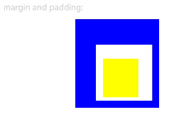
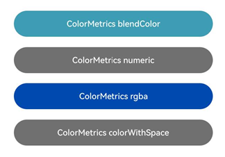

# Graphics
<!--Kit: ArkUI-->
<!--Subsystem: ArkUI-->
<!--Owner: @sunbees-->
<!--Designer: @sunbees-->
<!--Tester: @khq-->
<!--Adviser: @Brilliantry_Rui-->

自定义节点（RenderNode）相关的图形属性定义，提供几何变换（缩放、旋转、平移）、颜色与长度的统一表示、形状定义、图形遮罩与裁剪、模糊效果等能力，适用于需要在自定义节点上进行精细化图形绘制与视觉效果处理的场景。

> **说明：**
>
> - 本模块首批接口从API version 11开始支持。后续版本的新增接口，采用上角标单独标记接口的起始版本。
>
> - 本模块接口仅可在Stage模型下使用。

## 导入模块

```ts
import { DrawContext, Size, Offset, Position, Pivot, Scale, Translation, Matrix4, Rotation, Frame, LengthMetricsUnit } from '@kit.ArkUI';
```

## Size

用于返回组件布局大小的宽和高。默认单位为vp，不同的接口使用Size类型时会再定义单位，以接口定义的单位为准。

**原子化服务API：** 从API version 12开始，该接口支持在原子化服务中使用。

**系统能力：** SystemCapability.ArkUI.ArkUI.Full

| 名称   | 类型   | 只读 | 可选 | 说明                   |
| ------ | ------ | ---- | ---- | ---------------------- |
| width  | number | 否   | 否   | 组件大小的宽度。<br>单位：vp<br>取值范围：[0, +∞)<br>负数按默认值处理。 |
| height | number | 否   | 否   | 组件大小的高度。<br>单位：vp<br>取值范围：[0, +∞)<br>负数按默认值处理。 |

## Position

type Position = Vector2

用于设置或返回组件的位置。

**原子化服务API：** 从API version 12开始，该接口支持在原子化服务中使用。

**系统能力：** SystemCapability.ArkUI.ArkUI.Full

| 类型                | 说明                                |
| ------------------- | ----------------------------------- |
| [Vector2](#vector2) | 包含x和y两个值的向量。<br>单位：vp |

## PositionT\<T><sup>12+</sup>

type PositionT\<T> = Vector2T\<T>

用于设置或返回组件的位置。

**原子化服务API：** 从API version 12开始，该接口支持在原子化服务中使用。

**系统能力：** SystemCapability.ArkUI.ArkUI.Full

| 类型                         | 说明                                |
| ---------------------------- | ----------------------------------- |
| [Vector2T\<T>](#vector2tt12) | 包含x和y两个值的向量。<br>单位：vp |

## Frame

用于设置或返回组件的布局大小和位置。

**原子化服务API：** 从API version 12开始，该接口支持在原子化服务中使用。

**系统能力：** SystemCapability.ArkUI.ArkUI.Full

| 名称   | 类型   | 只读 | 可选 | 说明                        |
| ------ | ------ | ---- | ---- | --------------------------- |
| x      | number | 否   | 否   | 水平方向位置。<br>单位：vp<br>取值范围：(-∞, +∞) |
| y      | number | 否   | 否   | 垂直方向位置。<br>单位：vp<br>取值范围：(-∞, +∞) |
| width  | number | 否   | 否   | 组件的宽度。<br>单位：vp<br>取值范围：[0, +∞)<br>负数按默认值处理。   |
| height | number | 否   | 否   | 组件的高度。<br>单位：vp<br>取值范围：[0, +∞)<br>负数按默认值处理。   |

## Pivot

type Pivot = Vector2

用于设置组件的轴心坐标，轴心会作为组件的旋转/缩放中心点，影响旋转和缩放效果。

**原子化服务API：** 从API version 12开始，该接口支持在原子化服务中使用。

**系统能力：** SystemCapability.ArkUI.ArkUI.Full

| 类型                | 说明                                                         |
| ------------------- | ------------------------------------------------------------ |
| [Vector2](#vector2) | 轴心的x和y轴坐标。该参数为浮点数，默认值为0.5，取值范围为[0.0, 1.0]。超出范围时按默认值0.5处理。 |

## Scale

type Scale = Vector2

用于设置组件的缩放比例。

**原子化服务API：** 从API version 12开始，该接口支持在原子化服务中使用。

**系统能力：** SystemCapability.ArkUI.ArkUI.Full

| 类型                | 说明                                            |
| ------------------- | ----------------------------------------------- |
| [Vector2](#vector2) | x和y轴的缩放参数。该参数为浮点数，默认值为1.0。 |

## Translation

type Translation = Vector2

用于设置组件的平移量。

**原子化服务API：** 从API version 12开始，该接口支持在原子化服务中使用。

**系统能力：** SystemCapability.ArkUI.ArkUI.Full

| 类型                | 说明                          |
| ------------------- | ----------------------------- |
| [Vector2](#vector2) | x和y轴的平移量。<br>单位：px |

## Rotation

type Rotation = Vector3

用于设置组件的旋转角度。

**原子化服务API：** 从API version 12开始，该接口支持在原子化服务中使用。

**系统能力：** SystemCapability.ArkUI.ArkUI.Full

| 类型                | 说明                                   |
| ------------------- | -------------------------------------- |
| [Vector3](#vector3) | x、y、z轴方向的旋转角度。<br>单位：度 |

## Offset

type Offset = Vector2

用于设置组件或效果的偏移。

**原子化服务API：** 从API version 12开始，该接口支持在原子化服务中使用。

**系统能力：** SystemCapability.ArkUI.ArkUI.Full

| 类型                | 说明                              |
| ------------------- | --------------------------------- |
| [Vector2](#vector2) | x和y轴方向的偏移量。<br>单位：vp |

## Matrix4

type Matrix4 = [number,number,number,number,number,number,number,number,number,number,number,number,number,number,number,number]

用于设置四阶矩阵。

**原子化服务API：** 从API version 12开始，该接口支持在原子化服务中使用。

**系统能力：** SystemCapability.ArkUI.ArkUI.Full

| 类型                                                         | 说明                                 |
| ------------------------------------------------------------ | ------------------------------------ |
| [number,number,number,number,<br>number,number,number,number,<br>number,number,number,number,<br>number,number,number,number] | 参数为长度为16（4\*4）的number数组。<br>各number取值范围：(-∞, +∞) |

用于设置组件的变换信息，该类型为一个 4x4 矩阵，使用一个长度为16的`number[]`进行表示，例如：
```ts
const transform: Matrix4 = [
  1, 0, 45, 0,
  0, 1,  0, 0,
  0, 0,  1, 0,
  0, 0,  0, 1
];
```

## Vector2

用于表示包含x和y两个值的向量。

**原子化服务API：** 从API version 12开始，该接口支持在原子化服务中使用。

**系统能力：** SystemCapability.ArkUI.ArkUI.Full

| 名称 | 类型   | 只读 | 可选 | 说明              |
| ---- | ------ | ---- | ---- | ----------------- |
| x    | number | 否   | 否   | 向量x轴方向的值。<br>取值范围：(-∞, +∞) |
| y    | number | 否   | 否   | 向量y轴方向的值。<br>取值范围：(-∞, +∞) |

## Vector3

用于表示包含x、y、z三个值的向量。

**原子化服务API：** 从API version 12开始，该接口支持在原子化服务中使用。

**系统能力：** SystemCapability.ArkUI.ArkUI.Full

| 名称 | 类型   | 只读 | 可选 | 说明                |
| ---- | ------ | ---- | ---- | ------------------- |
| x    | number | 否   | 否   | 向量x轴方向的值。<br>取值范围：(-∞, +∞) |
| y    | number | 否   | 否   | 向量y轴方向的值。<br>取值范围：(-∞, +∞) |
| z    | number | 否   | 否   | 向量z轴方向的值。<br>取值范围：(-∞, +∞) |

## Vector4

用于表示包含x、y、z、w四个值的向量。

**起始版本：** 26.0.0

**原子化服务API：** 从API版本26.0.0开始，该接口支持在原子化服务中使用。

**模型约束：** 此接口仅可在Stage模型下使用。

**系统能力：** SystemCapability.ArkUI.ArkUI.Full

| 名称 | 类型   | 只读 | 可选 | 说明     |
| ---- | ------ | ---- | ---- | -------- |
| x    | number | 否  | 否   | 向量x轴方向的值。<br>取值范围：(-∞, +∞) |
| y    | number | 否  | 否   | 向量y轴方向的值。<br>取值范围：(-∞, +∞) |
| z    | number | 否  | 否   | 向量z轴方向的值。<br>取值范围：(-∞, +∞) |
| w    | number | 否  | 否   | 向量w轴方向的值。<br>取值范围：(-∞, +∞) |

## Vector2T\<T><sup>12+</sup>

用于表示T类型的包含x和y两个值的向量。

**原子化服务API：** 从API version 12开始，该接口支持在原子化服务中使用。

**系统能力：** SystemCapability.ArkUI.ArkUI.Full

| 名称 | 类型   | 只读 | 可选 | 说明              |
| ---- | ------ | ---- | ---- | ----------------- |
| x    | T | 否  | 否  | 向量x轴方向的值。 |
| y    | T | 否  | 否  | 向量y轴方向的值。 |

## DrawContext

图形绘制上下文，提供绘制所需的画布及其宽度和高度。

### size

get size(): Size

获取画布的宽度和高度。

**原子化服务API：** 从API version 12开始，该接口支持在原子化服务中使用。

**系统能力：** SystemCapability.ArkUI.ArkUI.Full

**返回值：**

| 类型          | 说明             |
| ------------- | ---------------- |
| [Size](#size) | 画布的宽度和高度。 |

### sizeInPixel<sup>12+</sup>

get sizeInPixel(): Size

获取以px为单位的画布的宽度和高度。

**原子化服务API：** 从API version 12开始，该接口支持在原子化服务中使用。

**系统能力：** SystemCapability.ArkUI.ArkUI.Full

**返回值：**

| 类型          | 说明             |
| ------------- | ---------------- |
| [Size](#size) | 画布的宽度和高度，以px为单位。 |

### canvas

get canvas(): drawing.Canvas

获取用于绘制的画布。

**原子化服务API：** 从API version 12开始，该接口支持在原子化服务中使用。

**系统能力：** SystemCapability.ArkUI.ArkUI.Full

**返回值：**

| 类型          | 说明             |
| ------------- | ---------------- |
| [drawing.Canvas](../apis-arkgraphics2d/arkts-apis-graphics-drawing-Canvas.md) | 用于绘制的画布。 |

**示例：**

```ts
import { RenderNode, FrameNode, NodeController, DrawContext } from '@kit.ArkUI';

class MyRenderNode extends RenderNode {

  draw(context: DrawContext) {
    const size = context.size;
    const canvas = context.canvas;
    const sizeInPixel = context.sizeInPixel;
  }
}

const renderNode = new MyRenderNode();
renderNode.frame = { x: 0, y: 0, width: 100, height: 100 };
renderNode.backgroundColor = 0xff519db4;

class MyNodeController extends NodeController {
  private rootNode: FrameNode | null = null;

  makeNode(uiContext: UIContext): FrameNode | null {
    this.rootNode = new FrameNode(uiContext);

    const rootRenderNode = this.rootNode.getRenderNode();
    if (rootRenderNode !== null) {
      rootRenderNode.appendChild(renderNode);
    }

    return this.rootNode;
  }
}

@Entry
@Component
struct Index {
  private myNodeController: MyNodeController = new MyNodeController();

  build() {
    Row() {
      NodeContainer(this.myNodeController)
    }
  }
}
```


## Edges\<T><sup>12+</sup>

用于设置边框的属性。

**原子化服务API：** 从API version 12开始，该接口支持在原子化服务中使用。

**系统能力：** SystemCapability.ArkUI.ArkUI.Full

| 名称   | 类型 | 只读 | 可选 | 说明             |
| ------ | ---- | ---- | ---- | ---------------- |
| left   | T    | 否   | 否   | 左侧边框的属性。 |
| top    | T    | 否   | 否   | 顶部边框的属性。 |
| right  | T    | 否   | 否   | 右侧边框的属性。 |
| bottom | T    | 否   | 否   | 底部边框的属性。 |

## LengthUnit<sup>12+</sup>

长度属性单位枚举。

**原子化服务API：** 从API version 12开始，该接口支持在原子化服务中使用。

**系统能力：** SystemCapability.ArkUI.ArkUI.Full

| 名称 | 值 | 说明 |
| -------- | -------- | -------- |
| PX | 0 | 长度类型，用于描述以px为单位的长度。 |
| VP | 1 | 长度类型，用于描述以vp为单位的长度。 |
| FP | 2 | 长度类型，用于描述以fp为单位的长度。 |
| PERCENT | 3 | 长度类型，用于描述以%为单位的长度。 |
| LPX | 4 | 长度类型，用于描述以lpx为单位的长度。 |

## SizeT\<T><sup>12+</sup>

用于设置宽高的属性。

**原子化服务API：** 从API version 12开始，该接口支持在原子化服务中使用。

**系统能力：** SystemCapability.ArkUI.ArkUI.Full

| 名称   | 类型 | 只读 | 可选 | 说明             |
| ------ | ---- | ---- | ---- | ---------------- |
| width   | T    | 否   | 否   | 宽度的属性。 |
| height    | T    | 否   | 否   | 高度的属性。 |

## LengthMetricsUnit<sup>12+</sup>

长度属性单位枚举。

**原子化服务API：** 从API version 12开始，该接口支持在原子化服务中使用。

**系统能力：** SystemCapability.ArkUI.ArkUI.Full

| 名称 | 值 | 说明 |
| -------- | -------- | -------- |
| DEFAULT | 0 | 长度类型，用于描述以默认的vp为单位的长度。 |
| PX | 1 | 长度类型，用于描述以px为单位的长度。 |

## LengthMetrics<sup>12+</sup>

用于设置长度属性，当长度单位为PERCENT时，值为1表示100%。

### 属性

**原子化服务API：** 从API version 12开始，该接口支持在原子化服务中使用。

**系统能力：** SystemCapability.ArkUI.ArkUI.Full

| 名称   | 类型 | 只读 | 可选 | 说明             |
| ------------ | ---------------------------------------- | ---- | ---- | ------ |
| value       | number | 否   | 否   | 长度属性的值。<br>取值范围：(-∞, +∞)。<br>当unit为PERCENT时，value表示百分比（1表示100%），参考尺寸取决于具体使用场景；其余单位表示对应单位的绝对长度。 |
| unit | [LengthUnit](#lengthunit12)                                   | 否   | 否   | 长度属性的单位，默认为VP。|

### constructor<sup>12+</sup>

constructor(value: number, unit?: LengthUnit)

LengthMetrics的构造函数。若参数unit不传入值或传入undefined，返回值使用默认单位VP；若unit传入非LengthUnit类型的值，返回默认值0VP。

**原子化服务API：** 从API version 12开始，该接口支持在原子化服务中使用。

**系统能力：** SystemCapability.ArkUI.ArkUI.Full

**参数：**

| 参数名 | 类型          | 必填 | 说明         |
| ------ | ------------- | ---- | ------------ |
| value   | number | 是   | 长度属性的值。<br>取值范围：(-∞, +∞) |
| unit   | [LengthUnit](#lengthunit12) | 否   | 长度属性的单位，默认为VP。 |

### px<sup>12+</sup>

static px(value: number): LengthMetrics

用于生成单位为PX的长度属性。

**原子化服务API：** 从API version 12开始，该接口支持在原子化服务中使用。

**系统能力：** SystemCapability.ArkUI.ArkUI.Full

**参数：**

| 参数名 | 类型          | 必填 | 说明         |
| ------ | ------------- | ---- | ------------ |
| value   | number | 是   | 长度属性的值。<br>取值范围：(-∞, +∞) |

**返回值：**

| 类型          | 说明             |
| ------------- | ---------------- |
| [LengthMetrics](#lengthmetrics12) | 单位为PX的长度属性对象。 |

### vp<sup>12+</sup>

static vp(value: number): LengthMetrics

用于生成单位为VP的长度属性。

**原子化服务API：** 从API version 12开始，该接口支持在原子化服务中使用。

**系统能力：** SystemCapability.ArkUI.ArkUI.Full

**参数：**

| 参数名 | 类型          | 必填 | 说明         |
| ------ | ------------- | ---- | ------------ |
| value   | number | 是   | 长度属性的值。<br>取值范围：(-∞, +∞) |

**返回值：**

| 类型          | 说明             |
| ------------- | ---------------- |
| [LengthMetrics](#lengthmetrics12) | 单位为VP的长度属性对象。 |

### fp<sup>12+</sup>

static fp(value: number): LengthMetrics

用于生成单位为FP的长度属性。

**原子化服务API：** 从API version 12开始，该接口支持在原子化服务中使用。

**系统能力：** SystemCapability.ArkUI.ArkUI.Full

**参数：**

| 参数名 | 类型          | 必填 | 说明         |
| ------ | ------------- | ---- | ------------ |
| value   | number | 是   | 长度属性的值。<br>取值范围：(-∞, +∞) |

**返回值：**

| 类型          | 说明             |
| ------------- | ---------------- |
| [LengthMetrics](#lengthmetrics12) | 单位为FP的长度属性对象。 |

### percent<sup>12+</sup>

static percent(value: number): LengthMetrics

用于生成单位为PERCENT的长度属性，值为1表示100%。

**原子化服务API：** 从API version 12开始，该接口支持在原子化服务中使用。

**系统能力：** SystemCapability.ArkUI.ArkUI.Full

**参数：**

| 参数名 | 类型          | 必填 | 说明         |
| ------ | ------------- | ---- | ------------ |
| value   | number | 是   | 长度属性的值。<br>取值范围：[0, 1]<br>超出范围时按边界值处理。 |

**返回值：**

| 类型          | 说明             |
| ------------- | ---------------- |
| [LengthMetrics](#lengthmetrics12) | 单位为PERCENT的长度属性对象，值为1表示100%。 |

### lpx<sup>12+</sup>

static lpx(value: number): LengthMetrics

用于生成单位为LPX的长度属性。

**原子化服务API：** 从API version 12开始，该接口支持在原子化服务中使用。

**系统能力：** SystemCapability.ArkUI.ArkUI.Full

**参数：**

| 参数名 | 类型          | 必填 | 说明         |
| ------ | ------------- | ---- | ------------ |
| value   | number | 是   | 长度属性的值。<br>取值范围：(-∞, +∞) |

**返回值：**

| 类型          | 说明             |
| ------------- | ---------------- |
| [LengthMetrics](#lengthmetrics12) | 单位为LPX的长度属性对象。 |

### resource<sup>12+</sup>

static resource(value: Resource): LengthMetrics

用于生成Resource类型资源的长度属性。

**原子化服务API：** 从API version 12开始，该接口支持在原子化服务中使用。

**系统能力：** SystemCapability.ArkUI.ArkUI.Full

**参数：**

| 参数名 | 类型          | 必填 | 说明         |
| ------ | ------------- | ---- | ------------ |
| value   | [Resource](arkui-ts/ts-types.md#resource) | 是   | 长度属性的值。 |

**返回值：**

| 类型          | 说明             |
| ------------- | ---------------- |
| [LengthMetrics](#lengthmetrics12) | Resource类型资源的长度属性对象。 |

**示例：**

使用LengthMetrics设置Row的padding和margin属性。
```ts
import { LengthMetrics, LengthUnit } from '@kit.ArkUI';

@Entry
@Component
struct SizeExample {
  build() {
    Column({ space: 10 }) {
      Text('margin and padding:')
        .fontSize(12)
        .fontColor(0xCCCCCC)
        .width('90%')
      Row() {
        Row() {
          Row()
            .size({ width: '100%', height: '100%' })
            .backgroundColor('#ffd5d5d5')
        }
        .width(80)
        .height(80)
        .padding({
          top: new LengthMetrics(20, LengthUnit.VP),
          bottom: LengthMetrics.px(15),
          start: LengthMetrics.vp(10),
          end: LengthMetrics.fp(20)
        })
        .margin({
          top: LengthMetrics.percent(0.1),
          bottom: LengthMetrics.lpx(20),
          start: LengthMetrics.resource($r('app.float.row_margin_start')),
          end: LengthMetrics.vp(10)
        })
        .backgroundColor(Color.White)
      }
      .backgroundColor('#ff2787d9')
    }
    .width('100%')
    .margin({ top: 5 })
  }
}
```


### autoRefresh

autoRefresh?(value: boolean): LengthMetrics

设置LengthMetrics对象是否跟随系统配置变化自动更新。

**起始版本：** 26.0.0

**原子化服务API：** 从API版本26.0.0开始，该接口支持在原子化服务中使用。

**模型约束：** 此接口仅可在Stage模型下使用。

**系统能力：** SystemCapability.ArkUI.ArkUI.Full

**参数：**

| 参数名 | 类型 | 必填 | 说明 |
|-------|------|------|------|
| value | boolean | 是 | 使用[resource](#resource12)方法构造的LengthMetrics对象是否在系统配置变化时自动刷新值。<br>true表示主动监听系统配置变化，在变化时值刷新为对应配置下的资源值。<br>false表示不主动监听系统配置变化。|

**返回值：**

| 类型 | 说明 |
|------|------|
| [LengthMetrics](#lengthmetrics12) | 返回设置自动刷新属性后的LengthMetrics对象。 |

**示例：**

```ts
import { LengthMetrics } from '@kit.ArkUI';

@Entry
@Component
struct MyStateSample {
  @State lengthMetrics: LengthMetrics = LengthMetrics.resource($r('sys.float.ohos_id_button_min_width')).autoRefresh!(true);

  build() {
    Column() {
      Button('Test LengthMetrics')
        .padding({ top: this.lengthMetrics })
    }
  }
}
```

## ColorMetrics<sup>12+</sup>

提供颜色的统一表示与封装，支持颜色混合以及 RGB、Alpha 分量的获取。

**系统能力：** SystemCapability.ArkUI.ArkUI.Full

### numeric<sup>12+</sup>

static numeric(value: number): ColorMetrics

使用HEX格式颜色实例化 ColorMetrics 类。

**原子化服务API：** 从API version 12开始，该接口支持在原子化服务中使用。

**系统能力：** SystemCapability.ArkUI.ArkUI.Full

**参数：**

| 参数名 | 类型          | 必填 | 说明         |
| ------ | ------------- | ---- | ------------ |
| value   | number | 是   | HEX格式颜色，支持RGB或者ARGB。<br>取值范围：[0, 0xffffffff]<br>超出范围时按边界值处理。 |

**返回值：**

| 类型          | 说明             |
| ------------- | ---------------- |
| [ColorMetrics](#colormetrics12) | HEX格式颜色对应的颜色对象。 |

### rgba<sup>12+</sup>

static rgba(red: number, green: number, blue: number, alpha?: number): ColorMetrics

使用rgb或者rgba格式颜色实例化 ColorMetrics 类。

**原子化服务API：** 从API version 12开始，该接口支持在原子化服务中使用。

**系统能力：** SystemCapability.ArkUI.ArkUI.Full

**参数：**

| 参数名 | 类型          | 必填 | 说明         |
| ------ | ------------- | ---- | ------------ |
| red   | number | 是   | 颜色的R分量（红色），值是0~255的整数。超出范围时按边界值处理。 |
| green | number | 是   | 颜色的G分量（绿色），值是0~255的整数。超出范围时按边界值处理。 |
| blue  | number | 是   | 颜色的B分量（蓝色），值是0~255的整数。超出范围时按边界值处理。 |
| alpha | number | 否   | 颜色的A分量（透明度），值是0.0~1.0的浮点数，默认值为1.0，不透明。<br> **说明：** alpha小于0为全透明，大于1为不透明。|

**返回值：**

| 类型          | 说明             |
| ------------- | ---------------- |
| [ColorMetrics](#colormetrics12) | rgb或rgba格式颜色对应的颜色对象。 |

### colorWithSpace<sup>20+</sup>

static colorWithSpace(colorSpace: ColorSpace, red: number, green: number, blue: number, alpha?: number): ColorMetrics

使用[ColorSpace](./arkui-ts/ts-appendix-enums.md#colorspace20)和rgba格式颜色实例化ColorMetrics类。仅red、green、blue属性支持在display-p3色彩空间中设置颜色，alpha属性不受色彩空间影响。

**原子化服务API：** 从API version 20开始，该接口支持在原子化服务中使用。

**系统能力：** SystemCapability.ArkUI.ArkUI.Full

**参数：**

| 参数名 | 类型          | 必填 | 说明         |
| ------ | ------------- | ---- | ------------ |
| colorSpace   | [ColorSpace](./arkui-ts/ts-appendix-enums.md#colorspace20) | 是   | 色彩空间，用于指定颜色的色彩空间。使用ColorSpace.DISPLAY_P3，需要对应窗口调用[setWindowColorSpace](./arkts-apis-window-Window.md#setwindowcolorspace9-1)接口，将当前窗口设置为广色域模式。 |
| red   | number | 是   | 颜色的R分量（红色），值是0~1的浮点数。超出范围时按边界值处理。 |
| green | number | 是   | 颜色的G分量（绿色），值是0~1的浮点数。超出范围时按边界值处理。 |
| blue  | number | 是   | 颜色的B分量（蓝色），值是0~1的浮点数。超出范围时按边界值处理。 |
| alpha | number | 否   | 颜色的A分量（透明度），值是0.0~1.0的浮点数，默认值为1.0，不透明。<br> **说明：** alpha小于0为全透明，大于1为不透明。|

**返回值：**

| 类型          | 说明             |
| ------------- | ---------------- |
| [ColorMetrics](#colormetrics12) | 指定色彩空间下rgba格式颜色对应的颜色对象。|

### resourceColor<sup>12+</sup>

static resourceColor(color: ResourceColor): ColorMetrics

使用资源格式颜色实例化 ColorMetrics 类。

**原子化服务API：** 从API version 12开始，该接口支持在原子化服务中使用。

**系统能力：** SystemCapability.ArkUI.ArkUI.Full

**参数：**

| 参数名 | 类型          | 必填 | 说明         |
| ------ | ------------- | ---- | ------------ |
| color | [ResourceColor](arkui-ts/ts-types.md#resourcecolor) | 是 | 资源格式颜色。 |

**返回值：**

| 类型          | 说明             |
| ------------- | ---------------- |
| [ColorMetrics](#colormetrics12) | 资源格式颜色对应的颜色对象。 |

**错误码：**

以下错误码的详细介绍请参见[通用错误码](../errorcode-universal.md)和[系统资源错误码](errorcode-system-resource.md)。

| 错误码ID | 错误信息 |
| -------- | ---------------------------------------- |
| 401   | Parameter error. Possible cause:1.The type of the input color parameter is not ResourceColor;2.The format of the input color string is not RGB or RGBA.             |
| 180003   | Failed to obtain the color resource.         |

### blendColor<sup>12+</sup>

blendColor(overlayColor: ColorMetrics): ColorMetrics

在当前颜色的上方叠加上一层指定的颜色（overlayColor），并返回混合后的新颜色。

**原子化服务API：** 从API version 12开始，该接口支持在原子化服务中使用。

**系统能力：** SystemCapability.ArkUI.ArkUI.Full

**参数：**

| 参数名 | 类型          | 必填 | 说明         |
| ------ | ------------- | ---- | ------------ |
| overlayColor | [ColorMetrics](#colormetrics12) | 是 | 要叠加在上方的颜色对象。alpha属性决定叠加强度。1.0表示完全覆盖，0.0表示完全透明，混合结果为原色。 |

**返回值：**

| 类型          | 说明             |
| ------------- | ---------------- |
| [ColorMetrics](#colormetrics12) |  新的颜色对象，其red、green、blue和alpha通道均为当前颜色与叠加颜色混合后的结果值。 |

**混合公式：**

混合后透明度为完全不透明，rgb按照以下公式计算：

result_rgb = overlay_rgb*(overlay_alpha) + (1 - overlay_alpha) * base_rgb

**错误码：**

以下错误码的详细介绍请参见[通用错误码](../errorcode-universal.md)。

| 错误码ID | 错误信息 |
| -------- | ---------------------------------------- |
| 401   | Parameter error. The type of the input parameter is not ColorMetrics.                |

### color<sup>12+</sup>

get color(): string

获取ColorMetrics的颜色，返回的是rgba字符串的格式。

**原子化服务API：** 从API version 12开始，该接口支持在原子化服务中使用。

**系统能力：** SystemCapability.ArkUI.ArkUI.Full

**返回值：**

| 类型          | 说明             |
| ------------- | ---------------- |
| string | rgba字符串格式的颜色。 示例：'rgba(255, 100, 255, 0.5)'|

### red<sup>12+</sup>

get red(): number

获取ColorMetrics颜色的R分量（红色）。

**原子化服务API：** 从API version 12开始，该接口支持在原子化服务中使用。

**系统能力：** SystemCapability.ArkUI.ArkUI.Full

**返回值：**

| 类型          | 说明             |
| ------------- | ---------------- |
| number | 颜色的R分量（红色），值是0~255的整数。|

### green<sup>12+</sup>

get green(): number

获取ColorMetrics颜色的G分量（绿色）。

**原子化服务API：** 从API version 12开始，该接口支持在原子化服务中使用。

**系统能力：** SystemCapability.ArkUI.ArkUI.Full

**返回值：**

| 类型          | 说明             |
| ------------- | ---------------- |
| number | 颜色的G分量（绿色），值是0~255的整数。|

### blue<sup>12+</sup>

get blue(): number

获取ColorMetrics颜色的B分量（蓝色）。

**原子化服务API：** 从API version 12开始，该接口支持在原子化服务中使用。

**系统能力：** SystemCapability.ArkUI.ArkUI.Full

**返回值：**

| 类型          | 说明             |
| ------------- | ---------------- |
| number | 颜色的B分量（蓝色），值是0~255的整数。|

### alpha<sup>12+</sup>

get alpha(): number

获取ColorMetrics颜色的A分量（透明度）。

**原子化服务API：** 从API version 12开始，该接口支持在原子化服务中使用。

**系统能力：** SystemCapability.ArkUI.ArkUI.Full

**返回值：**

| 类型          | 说明             |
| ------------- | ---------------- |
| number | 颜色的A分量（透明度），值是0~255的整数。通过rgba()或colorWithSpace()方法设置时alpha取值范围为0.0~1.0的浮点数，内部会转换为0~255的整数存储。|

**示例：**

```ts
import { ColorMetrics } from '@kit.ArkUI';
import { BusinessError } from '@kit.BasicServicesKit';

function getBlendColor(baseColor: ResourceColor): ColorMetrics {
  let sourceColor: ColorMetrics;
  try {
    // 在使用ColorMetrics的resourceColor和blendColor需要追加捕获异常处理
    // 可能返回的arkui子系统错误码有401和180003
    // 61 157 180
    sourceColor = ColorMetrics.resourceColor(baseColor).blendColor(ColorMetrics.resourceColor('#083d9db4'));
    console.info(`current color is ${sourceColor.color} r:${sourceColor.red} g:${sourceColor.green} b:${sourceColor.blue} a :${sourceColor.alpha}`);
  } catch (error) {
    console.error(`getBlendColor failed. Code: ${(error as BusinessError).code}, message: ${(error as BusinessError).message}`);
    sourceColor = ColorMetrics.resourceColor('#19000000');
  }
  return sourceColor;
}

@Entry
@Component
struct ColorMetricsSample {
  build() {
    Flex({ direction: FlexDirection.Column, alignItems: ItemAlign.Center, justifyContent: FlexAlign.Center }) {
      Button('ColorMetrics blendColor')
        .width('80%')
        .align(Alignment.Center)
        .height(50)
        .backgroundColor(getBlendColor('#ff3d9db4').color)
        .margin(10)
      Button('ColorMetrics numeric')
        .width('80%')
        .align(Alignment.Center)
        .height(50)
        .backgroundColor(ColorMetrics.numeric(0xff707070).color)
        .margin(10)
      Button('ColorMetrics rgba')
        .width('80%')
        .align(Alignment.Center)
        .height(50)
        .backgroundColor(ColorMetrics.rgba(0, 74, 175, 1.0).color)
        .margin(10)
      Button('ColorMetrics colorWithSpace')
        .width('80%')
        .align(Alignment.Center)
        .height(50)
        .backgroundColor(ColorMetrics.colorWithSpace(ColorSpace.SRGB, 0.4392, 0.4392, 0.4392).color)
        .margin(10)
    }
    .width('100%')
    .height('100%')
  }
}
```


### autoRefresh

autoRefresh?(value: boolean): ColorMetrics

设置ColorMetrics对象是否跟随系统配置变化自动更新。

**起始版本：** 26.0.0

**原子化服务API：** 从API版本26.0.0开始，该接口支持在原子化服务中使用。

**模型约束：** 此接口仅可在Stage模型下使用。

**系统能力：** SystemCapability.ArkUI.ArkUI.Full

**参数：**

| 参数名 | 类型 | 必填 | 说明 |
|-------|------|------|------|
| value | boolean | 是 | 使用[resourceColor](#resourcecolor12)方法构造的ColorMetrics对象是否在系统配置变化时自动刷新颜色值。<br>true表示主动监听系统配置变化，变化时值刷新为对应配置下的资源值。<br>false表示不主动监听系统配置变化。|

**返回值：**

| 类型 | 说明 |
|------|------|
| [ColorMetrics](#colormetrics12) | 返回设置自动刷新属性后的ColorMetrics对象。 |

**示例：**

```ts
import { ColorMetrics } from '@kit.ArkUI';

@Entry
@Component
struct MyStateSample {
  @State colorMetrics: ColorMetrics = ColorMetrics.resourceColor($r('sys.color.font_primary')).autoRefresh!(true);

  build() {
    Column() {
      Text('Test ColorMetrics')
    }
    .width('100%')
    .height('100%')
    .backgroundColor(this.colorMetrics)
  }
}
```

## Corners\<T><sup>12+</sup>

用于设置四个角的圆角属性。

**原子化服务API：** 从API version 12开始，该接口支持在原子化服务中使用。

**系统能力：** SystemCapability.ArkUI.ArkUI.Full

| 名称        | 类型 | 只读 | 可选 | 说明                   |
| ----------- | ---- | ---- | ---- | ---------------------- |
| topLeft     | T    | 否   | 否   | 左上边框的圆角属性。   |
| topRight    | T    | 否   | 否   | 右上边框的圆角属性。 |
| bottomLeft  | T    | 否   | 否   | 左下边框的圆角属性。   |
| bottomRight | T    | 否   | 否   | 右下边框的圆角属性。   |

## CornerRadius<sup>12+</sup>

type CornerRadius = Corners\<Vector2>

设置四个角的圆角x轴与y轴的半轴长。

**原子化服务API：** 从API version 12开始，该接口支持在原子化服务中使用。

**系统能力：** SystemCapability.ArkUI.ArkUI.Full

| 类型                                         | 说明               |
| -------------------------------------------- | ------------------ |
| [Corners](#cornerst12)\<[Vector2](#vector2)> | 四个角的圆角x轴与y轴的半轴长。<br>单位：px |

## BorderRadiuses<sup>12+</sup>

type BorderRadiuses = Corners\<number>

设置四个角的圆角半径。

**原子化服务API：** 从API version 12开始，该接口支持在原子化服务中使用。

**系统能力：** SystemCapability.ArkUI.ArkUI.Full

| 类型                            | 说明               |
| ------------------------------- | ------------------ |
| [Corners](#cornerst12)\<number> | 四个角的圆角半径。<br>单位：vp |

## Rect<sup>12+</sup>

type Rect = common2D.Rect

用于设置矩形的形状。

**原子化服务API：** 从API version 12开始，该接口支持在原子化服务中使用。

**系统能力：** SystemCapability.ArkUI.ArkUI.Full

| 类型                                                         | 说明       |
| ------------------------------------------------------------ | ---------- |
| [common2D.Rect](../apis-arkgraphics2d/js-apis-graphics-common2D.md#rect) | 矩形区域。 |

## RoundRect<sup>12+</sup>

用于设置带有圆角的矩形。

**原子化服务API：** 从API version 12开始，该接口支持在原子化服务中使用。

**系统能力：** SystemCapability.ArkUI.ArkUI.Full

| 名称    | 类型                          | 只读 | 可选 | 说明             |
| ------- | ----------------------------- | ---- | ---- | ---------------- |
| rect    | [Rect](#rect12)                 | 否   | 否   | 设置矩形的属性。 |
| corners | [CornerRadius](#cornerradius12) | 否   | 否   | 设置圆角的属性。 |

## Circle<sup>12+</sup>

用于设置圆形的属性。

**原子化服务API：** 从API version 12开始，该接口支持在原子化服务中使用。

**系统能力：** SystemCapability.ArkUI.ArkUI.Full

| 名称    | 类型   | 只读 | 可选 | 说明                      |
| ------- | ------ | ---- | ---- | ------------------------- |
| centerX | number | 否   | 否   | 圆心x轴的位置，单位为px。<br>取值范围：(-∞, +∞) |
| centerY | number | 否   | 否   | 圆心y轴的位置，单位为px。<br>取值范围：(-∞, +∞) |
| radius  | number | 否   | 否   | 圆形的半径，单位为px。<br>取值范围：[0, +∞)<br>负数按默认值处理。   |

## CommandPath<sup>12+</sup>

用于设置路径绘制的指令。

**原子化服务API：** 从API version 12开始，该接口支持在原子化服务中使用。

**系统能力：** SystemCapability.ArkUI.ArkUI.Full

| 名称                                                         | 类型   | 只读 | 可选 | 说明                                                         |
| ------------------------------------------------------------ | ------ | ---- | ---- | ------------------------------------------------------------ |
| [commands](./arkui-ts/ts-drawing-components-path.md#commands) | string | 否   | 否   | 路径绘制的指令字符串。像素单位的转换方法请参考[像素单位](./arkui-ts/ts-pixel-units.md)。<br>单位：px |

## ShapeMask<sup>12+</sup>

用于设置图形遮罩，支持矩形、圆角矩形、圆形、椭圆及自定义路径等多种形状，可作用于RenderNode实现形状遮罩效果。

### 属性

**原子化服务API：** 从API version 12开始，该接口支持在原子化服务中使用。

**系统能力：** SystemCapability.ArkUI.ArkUI.Full

| 名称            | 类型    | 只读 | 可选 | 说明                                                |
| --------------- | ------ | ---- | ---- | -------------------------------------------------- |
| fillColor       | number | 否   | 否   | 遮罩的填充颜色，使用ARGB格式。默认值为`0XFF000000`。<br>取值范围：[0, 0xffffffff]<br>超出范围时按默认值处理。<br> 通过fillColor的透明度和亮度生成一个仅含透明度的颜色。亮度越高，颜色越透明。然后，使用[BlendMode.SRC_IN](../apis-arkgraphics2d/arkts-apis-graphics-drawing-e.md#blendmode)方式与RenderNode本身的颜色混合，生成最终颜色。 |
| strokeColor     | number | 否   | 否   | 遮罩的边框颜色，使用ARGB格式。默认值为`0XFF000000`。<br>取值范围：[0, 0xffffffff]<br>超出范围时按默认值处理。 <br>  通过strokeColor的透明度和亮度生成一个仅含透明度的颜色。亮度越高，颜色越透明。然后，使用[BlendMode.SRC_IN](../apis-arkgraphics2d/arkts-apis-graphics-drawing-e.md#blendmode)方式与RenderNode本身的颜色混合，生成最终颜色。 |
| strokeWidth     | number | 否   | 否   | 遮罩的边框宽度，单位为px。默认值为0。<br>取值范围：[0, +∞)<br>负数按默认值处理。   |

### constructor<sup>12+</sup>

constructor()

ShapeMask的构造函数。

**原子化服务API：** 从API version 12开始，该接口支持在原子化服务中使用。

**系统能力：** SystemCapability.ArkUI.ArkUI.Full

### setRectShape<sup>12+</sup>

setRectShape(rect: Rect): void

用于设置矩形遮罩。

**原子化服务API：** 从API version 12开始，该接口支持在原子化服务中使用。

**系统能力：** SystemCapability.ArkUI.ArkUI.Full

**参数：**

| 参数名 | 类型          | 必填 | 说明         |
| ------ | ------------- | ---- | ------------ |
| rect   | [Rect](#rect12) | 是   | 矩形的形状。 |

**示例：**

```ts
import { RenderNode, FrameNode, NodeController, ShapeMask } from '@kit.ArkUI';

class MyNodeController extends NodeController {
  private rootNode: FrameNode | null = null;

  makeNode(uiContext: UIContext): FrameNode | null {
    this.rootNode = new FrameNode(uiContext);

    const mask = new ShapeMask();
    mask.setRectShape({
      left: 0,
      right: uiContext.vp2px(150),
      top: 0,
      bottom: uiContext.vp2px(150)
    });
    mask.fillColor = 0X55FF0000;

    const renderNode = new RenderNode();
    renderNode.frame = {
      x: 0,
      y: 0,
      width: 150,
      height: 150
    };
    renderNode.backgroundColor = 0XFF00FF00;
    renderNode.shapeMask = mask;

    const rootRenderNode = this.rootNode.getRenderNode();
    if (rootRenderNode !== null) {
      rootRenderNode.appendChild(renderNode);
    }

    return this.rootNode;
  }
}

@Entry
@Component
struct Index {
  private myNodeController: MyNodeController = new MyNodeController();

  build() {
    Row() {
      NodeContainer(this.myNodeController)
    }
  }
}
```


### setRoundRectShape<sup>12+</sup>

setRoundRectShape(roundRect: RoundRect): void

用于设置圆角矩形遮罩。

**原子化服务API：** 从API version 12开始，该接口支持在原子化服务中使用。

**系统能力：** SystemCapability.ArkUI.ArkUI.Full

**参数：**

| 参数名    | 类型                    | 必填 | 说明             |
| --------- | ----------------------- | ---- | ---------------- |
| roundRect | [RoundRect](#roundrect12) | 是   | 圆角矩形的形状。 |

**示例：**

```ts
import { RenderNode, FrameNode, NodeController, ShapeMask, RoundRect } from '@kit.ArkUI';

class MyNodeController extends NodeController {
  private rootNode: FrameNode | null = null;

  makeNode(uiContext: UIContext): FrameNode | null {
    this.rootNode = new FrameNode(uiContext);

    const mask = new ShapeMask();
    const roundRect: RoundRect = {
      rect: { left: 0, top: 0, right: uiContext.vp2px(150), bottom: uiContext.vp2px(150) },
      corners: {
        topLeft: { x: 32, y: 32 },
        topRight: { x: 32, y: 32 },
        bottomLeft: { x: 32, y: 32 },
        bottomRight: { x: 32, y: 32 }
      }
    };
    mask.setRoundRectShape(roundRect);
    mask.fillColor = 0X55FF0000;

    const renderNode = new RenderNode();
    renderNode.frame = { x: 0, y: 0, width: 150, height: 150 };
    renderNode.backgroundColor = 0XFF00FF00;
    renderNode.shapeMask = mask;

    const rootRenderNode = this.rootNode.getRenderNode();
    if (rootRenderNode !== null) {
      rootRenderNode.appendChild(renderNode);
    }

    return this.rootNode;
  }
}

@Entry
@Component
struct Index {
  private myNodeController: MyNodeController = new MyNodeController();

  build() {
    Row() {
      NodeContainer(this.myNodeController)
    }
  }
}
```


### setCircleShape<sup>12+</sup>

setCircleShape(circle: Circle): void

用于设置圆形遮罩。

**原子化服务API：** 从API version 12开始，该接口支持在原子化服务中使用。

**系统能力：** SystemCapability.ArkUI.ArkUI.Full

**参数：**

| 参数名 | 类型              | 必填 | 说明         |
| ------ | ----------------- | ---- | ------------ |
| circle | [Circle](#circle12) | 是   | 圆形的形状。 |

**示例：**

```ts
import { RenderNode, FrameNode, NodeController, ShapeMask } from '@kit.ArkUI';

class MyNodeController extends NodeController {
  private rootNode: FrameNode | null = null;

  makeNode(uiContext: UIContext): FrameNode | null {
    this.rootNode = new FrameNode(uiContext);

    const mask = new ShapeMask();
    mask.setCircleShape({ centerY: uiContext.vp2px(75), centerX: uiContext.vp2px(75), radius: uiContext.vp2px(75) });
    mask.fillColor = 0X55FF0000;

    const renderNode = new RenderNode();
    renderNode.frame = {
      x: 0,
      y: 0,
      width: 150,
      height: 150
    };
    renderNode.backgroundColor = 0XFF00FF00;
    renderNode.shapeMask = mask;

    const rootRenderNode = this.rootNode.getRenderNode();
    if (rootRenderNode !== null) {
      rootRenderNode.appendChild(renderNode);
    }

    return this.rootNode;
  }
}

@Entry
@Component
struct Index {
  private myNodeController: MyNodeController = new MyNodeController();

  build() {
    Row() {
      NodeContainer(this.myNodeController)
    }
  }
}
```


### setOvalShape<sup>12+</sup>

setOvalShape(oval: Rect): void

用于设置椭圆形遮罩。

**原子化服务API：** 从API version 12开始，该接口支持在原子化服务中使用。

**系统能力：** SystemCapability.ArkUI.ArkUI.Full

**参数：**

| 参数名 | 类型          | 必填 | 说明           |
| ------ | ------------- | ---- | -------------- |
| oval   | [Rect](#rect12) | 是   | 椭圆形的形状。 |

**示例：**

```ts
import { RenderNode, FrameNode, NodeController, ShapeMask } from '@kit.ArkUI';

class MyNodeController extends NodeController {
  private rootNode: FrameNode | null = null;

  makeNode(uiContext: UIContext): FrameNode | null {
    this.rootNode = new FrameNode(uiContext);

    const mask = new ShapeMask();
    mask.setOvalShape({ left: 0, right: uiContext.vp2px(150), top: 0, bottom: uiContext.vp2px(100) });
    mask.fillColor = 0X55FF0000;

    const renderNode = new RenderNode();
    renderNode.frame = { x: 0, y: 0, width: 150, height: 150 };
    renderNode.backgroundColor = 0XFF00FF00;
    renderNode.shapeMask = mask;

    const rootRenderNode = this.rootNode.getRenderNode();
    if (rootRenderNode !== null) {
      rootRenderNode.appendChild(renderNode);
    }

    return this.rootNode;
  }
}

@Entry
@Component
struct Index {
  private myNodeController: MyNodeController = new MyNodeController();

  build() {
    Row() {
      NodeContainer(this.myNodeController)
    }
  }
}
```


### setCommandPath<sup>12+</sup>

setCommandPath(path: CommandPath): void

用于设置路径绘制指令。

**原子化服务API：** 从API version 12开始，该接口支持在原子化服务中使用。

**系统能力：** SystemCapability.ArkUI.ArkUI.Full

**参数：**

| 参数名 | 类型                        | 必填 | 说明           |
| ------ | --------------------------- | ---- | -------------- |
| path   | [CommandPath](#commandpath12) | 是   | 路径绘制指令。 |

**示例：**

```ts
import { RenderNode, FrameNode, NodeController, ShapeMask } from '@kit.ArkUI';

const mask = new ShapeMask();
mask.setCommandPath({ commands: 'M100 0 L0 100 L50 200 L150 200 L200 100 Z' });
mask.fillColor = 0X55FF0000;

const renderNode = new RenderNode();
renderNode.frame = {
  x: 0,
  y: 0,
  width: 150,
  height: 150
};
renderNode.backgroundColor = 0XFF00FF00;
renderNode.shapeMask = mask;


class MyNodeController extends NodeController {
  private rootNode: FrameNode | null = null;

  makeNode(uiContext: UIContext): FrameNode | null {
    this.rootNode = new FrameNode(uiContext);

    const rootRenderNode = this.rootNode.getRenderNode();
    if (rootRenderNode !== null) {
      rootRenderNode.appendChild(renderNode);
    }

    return this.rootNode;
  }
}

@Entry
@Component
struct Index {
  private myNodeController: MyNodeController = new MyNodeController();

  build() {
    Row() {
      NodeContainer(this.myNodeController)
    }
  }
}
```


## ShapeClip<sup>12+</sup>

用于设置图形裁剪，支持矩形、圆角矩形、圆形、椭圆及自定义路径等多种形状，可对RenderNode进行形状裁剪，仅显示裁剪区域内的内容。

### constructor<sup>12+</sup>

constructor()

ShapeClip的构造函数。

**原子化服务API：** 从API version 12开始，该接口支持在原子化服务中使用。

**系统能力：** SystemCapability.ArkUI.ArkUI.Full

### setRectShape<sup>12+</sup>

setRectShape(rect: Rect): void

用于裁剪矩形。

**原子化服务API：** 从API version 12开始，该接口支持在原子化服务中使用。

**系统能力：** SystemCapability.ArkUI.ArkUI.Full

**参数：**

| 参数名 | 类型          | 必填 | 说明         |
| ------ | ------------- | ---- | ------------ |
| rect   | [Rect](#rect12) | 是   | 矩形的形状。 |

**示例：**

```ts
import { RenderNode, FrameNode, NodeController, ShapeClip } from '@kit.ArkUI';

const clip = new ShapeClip();
clip.setCommandPath({ commands: 'M100 0 L0 100 L50 200 L150 200 L200 100 Z' });

const renderNode = new RenderNode();
renderNode.frame = {
  x: 0,
  y: 0,
  width: 150,
  height: 150
};
renderNode.backgroundColor = 0xff519db4;
renderNode.shapeClip = clip;
const shapeClip = renderNode.shapeClip;

class MyNodeController extends NodeController {
  private rootNode: FrameNode | null = null;

  makeNode(uiContext: UIContext): FrameNode | null {
    this.rootNode = new FrameNode(uiContext);

    const rootRenderNode = this.rootNode.getRenderNode();
    if (rootRenderNode !== null) {
      rootRenderNode.appendChild(renderNode);
    }

    return this.rootNode;
  }
}

@Entry
@Component
struct Index {
  private myNodeController: MyNodeController = new MyNodeController();

  build() {
    Column() {
      NodeContainer(this.myNodeController)
        .borderWidth(1)
        .margin({ bottom: 20 })
      Button('setRectShape')
        .onClick(() => {
          shapeClip.setRectShape({
            left: 0,
            right: 150,
            top: 0,
            bottom: 150
          });
          renderNode.shapeClip = shapeClip;
        })
    }.margin(20)
  }
}
```


### setRoundRectShape<sup>12+</sup>

setRoundRectShape(roundRect: RoundRect): void

用于裁剪圆角矩形。

**原子化服务API：** 从API version 12开始，该接口支持在原子化服务中使用。

**系统能力：** SystemCapability.ArkUI.ArkUI.Full

**参数：**

| 参数名    | 类型                    | 必填 | 说明             |
| --------- | ----------------------- | ---- | ---------------- |
| roundRect | [RoundRect](#roundrect12) | 是   | 圆角矩形的形状。 |

**示例：**
```ts
import { RenderNode, FrameNode, NodeController, ShapeClip } from '@kit.ArkUI';

const clip = new ShapeClip();
clip.setCommandPath({ commands: 'M100 0 L0 100 L50 200 L150 200 L200 100 Z' });

const renderNode = new RenderNode();
renderNode.frame = {
  x: 0,
  y: 0,
  width: 150,
  height: 150
};
renderNode.backgroundColor = 0XFF00FF00;
renderNode.shapeClip = clip;

class MyNodeController extends NodeController {
  private rootNode: FrameNode | null = null;

  makeNode(uiContext: UIContext): FrameNode | null {
    this.rootNode = new FrameNode(uiContext);

    const rootRenderNode = this.rootNode.getRenderNode();
    if (rootRenderNode !== null) {
      rootRenderNode.appendChild(renderNode);
    }

    return this.rootNode;
  }
}

@Entry
@Component
struct Index {
  private myNodeController: MyNodeController = new MyNodeController();

  build() {
    Column() {
      NodeContainer(this.myNodeController)
        .borderWidth(1)
      Button('setRoundRectShape')
        .onClick(() => {
          renderNode.shapeClip.setRoundRectShape({
            rect: {
              left: 0,
              top: 0,
              right: this.getUIContext().vp2px(150),
              bottom: this.getUIContext().vp2px(150)
            },
            corners: {
              topLeft: { x: 32, y: 32 },
              topRight: { x: 32, y: 32 },
              bottomLeft: { x: 32, y: 32 },
              bottomRight: { x: 32, y: 32 }
            }
          });
        })
    }
  }
}
```

### setCircleShape<sup>12+</sup>

setCircleShape(circle: Circle): void

用于裁剪圆形。

**原子化服务API：** 从API version 12开始，该接口支持在原子化服务中使用。

**系统能力：** SystemCapability.ArkUI.ArkUI.Full

**参数：**

| 参数名 | 类型              | 必填 | 说明         |
| ------ | ----------------- | ---- | ------------ |
| circle | [Circle](#circle12) | 是   | 圆形的形状。 |

**示例：**

```ts
import { RenderNode, FrameNode, NodeController, ShapeClip } from '@kit.ArkUI';

const clip = new ShapeClip();
clip.setCommandPath({ commands: 'M100 0 L0 100 L50 200 L150 200 L200 100 Z' });

const renderNode = new RenderNode();
renderNode.frame = {
  x: 0,
  y: 0,
  width: 150,
  height: 150
};
renderNode.backgroundColor = 0XFF00FF00;
renderNode.shapeClip = clip;

class MyNodeController extends NodeController {
  private rootNode: FrameNode | null = null;

  makeNode(uiContext: UIContext): FrameNode | null {
    this.rootNode = new FrameNode(uiContext);

    const rootRenderNode = this.rootNode.getRenderNode();
    if (rootRenderNode !== null) {
      rootRenderNode.appendChild(renderNode);
    }

    return this.rootNode;
  }
}

@Entry
@Component
struct Index {
  private myNodeController: MyNodeController = new MyNodeController();

  build() {
    Column() {
      NodeContainer(this.myNodeController)
        .borderWidth(1)
      Button('setCircleShape')
        .onClick(() => {
          renderNode.shapeClip.setCircleShape({ centerY: 75, centerX: 75, radius: 75 });

        })
    }
  }
}
```

### setOvalShape<sup>12+</sup>

setOvalShape(oval: Rect): void

用于裁剪椭圆形。

**原子化服务API：** 从API version 12开始，该接口支持在原子化服务中使用。

**系统能力：** SystemCapability.ArkUI.ArkUI.Full

**参数：**

| 参数名 | 类型          | 必填 | 说明           |
| ------ | ------------- | ---- | -------------- |
| oval   | [Rect](#rect12) | 是   | 椭圆形的形状。 |

**示例：**

```ts
import { RenderNode, FrameNode, NodeController, ShapeClip } from '@kit.ArkUI';

const clip = new ShapeClip();
clip.setCommandPath({ commands: 'M100 0 L0 100 L50 200 L150 200 L200 100 Z' });

const renderNode = new RenderNode();
renderNode.frame = {
  x: 0,
  y: 0,
  width: 150,
  height: 150
};
renderNode.backgroundColor = 0XFF00FF00;
renderNode.shapeClip = clip;

class MyNodeController extends NodeController {
  private rootNode: FrameNode | null = null;

  makeNode(uiContext: UIContext): FrameNode | null {
    this.rootNode = new FrameNode(uiContext);

    const rootRenderNode = this.rootNode.getRenderNode();
    if (rootRenderNode !== null) {
      rootRenderNode.appendChild(renderNode);
    }

    return this.rootNode;
  }
}

@Entry
@Component
struct Index {
  private myNodeController: MyNodeController = new MyNodeController();

  build() {
    Column() {
      NodeContainer(this.myNodeController)
        .borderWidth(1)
      Button('setOvalShape')
        .onClick(() => {
          renderNode.shapeClip.setOvalShape({
            left: 0,
            right: this.getUIContext().vp2px(150),
            top: 0,
            bottom: this.getUIContext().vp2px(100)
          });
        })
    }
  }
}
```

### setCommandPath<sup>12+</sup>

setCommandPath(path: CommandPath): void

用于按路径绘制指令进行裁剪。

**原子化服务API：** 从API version 12开始，该接口支持在原子化服务中使用。

**系统能力：** SystemCapability.ArkUI.ArkUI.Full

**参数：**

| 参数名 | 类型                        | 必填 | 说明           |
| ------ | --------------------------- | ---- | -------------- |
| path   | [CommandPath](#commandpath12) | 是   | 路径绘制指令。 |

**示例：**

```ts
import { RenderNode, FrameNode, NodeController, ShapeClip } from '@kit.ArkUI';

const clip = new ShapeClip();
clip.setCommandPath({ commands: 'M100 0 L0 100 L50 200 L150 200 L200 100 Z' });

const renderNode = new RenderNode();
renderNode.frame = {
  x: 0,
  y: 0,
  width: 150,
  height: 150
};
renderNode.backgroundColor = 0XFF00FF00;
renderNode.shapeClip = clip;

class MyNodeController extends NodeController {
  private rootNode: FrameNode | null = null;

  makeNode(uiContext: UIContext): FrameNode | null {
    this.rootNode = new FrameNode(uiContext);

    const rootRenderNode = this.rootNode.getRenderNode();
    if (rootRenderNode !== null) {
      rootRenderNode.appendChild(renderNode);
    }

    return this.rootNode;
  }
}

@Entry
@Component
struct Index {
  private myNodeController: MyNodeController = new MyNodeController();

  build() {
    Column() {
      NodeContainer(this.myNodeController)
        .borderWidth(1)
      Button('setCommandPath')
        .onClick(() => {
          renderNode.shapeClip.setCommandPath({ commands: 'M100 0 L0 100 L50 200 L150 200 L200 100 Z' });
        })
    }
  }
}
```

## edgeColors<sup>12+</sup>

edgeColors(all: number): Edges\<number>

用于生成边框颜色均设置为传入值的边框颜色对象。

**原子化服务API：** 从API version 12开始，该接口支持在原子化服务中使用。

**系统能力：** SystemCapability.ArkUI.ArkUI.Full

**参数：**

| 参数名 | 类型   | 必填 | 说明                 |
| ------ | ------ | ---- | -------------------- |
| all    | number | 是   | 边框颜色，ARGB格式，示例：0xffff00ff。<br>取值范围：[0, 0xffffffff]<br>超出范围时按边界值处理。 |

**返回值：**

| 类型                     | 说明                                   |
| ------------------------ | -------------------------------------- |
| [Edges](#edgest12)\<number> | 边框颜色均设置为传入值的边框颜色对象。 |

**示例：**

```ts
import { RenderNode, FrameNode, NodeController, edgeColors } from '@kit.ArkUI';

const renderNode = new RenderNode();
renderNode.frame = { x: 0, y: 0, width: 150, height: 150 };
renderNode.backgroundColor = 0xffd5d5d5;
renderNode.borderWidth = { left: 8, top: 8, right: 8, bottom: 8 };
renderNode.borderColor = edgeColors(0xff519db4);


class MyNodeController extends NodeController {
  private rootNode: FrameNode | null = null;

  makeNode(uiContext: UIContext): FrameNode | null {
    this.rootNode = new FrameNode(uiContext);

    const rootRenderNode = this.rootNode.getRenderNode();
    if (rootRenderNode !== null) {
      rootRenderNode.appendChild(renderNode);
    }

    return this.rootNode;
  }
}

@Entry
@Component
struct Index {
  private myNodeController: MyNodeController = new MyNodeController();

  build() {
    Row() {
      NodeContainer(this.myNodeController)
    }.margin(30)
  }
}
```


## edgeWidths<sup>12+</sup>

edgeWidths(all: number): Edges\<number>

用于生成边框宽度均设置为传入值的边框宽度对象。

**原子化服务API：** 从API version 12开始，该接口支持在原子化服务中使用。

**系统能力：** SystemCapability.ArkUI.ArkUI.Full

**参数：**

| 参数名 | 类型   | 必填 | 说明                 |
| ------ | ------ | ---- | -------------------- |
| all    | number | 是   | 边框宽度，单位为vp。<br>取值范围：[0, +∞)<br>负数按默认值处理。 |

**返回值：**

| 类型                     | 说明                                   |
| ------------------------ | -------------------------------------- |
| [Edges](#edgest12)\<number> | 边框宽度均设置为传入值的边框宽度对象。 |

**示例：**

```ts
import { RenderNode, FrameNode, NodeController, edgeWidths } from '@kit.ArkUI';

const renderNode = new RenderNode();
renderNode.frame = {
  x: 0,
  y: 0,
  width: 150,
  height: 150
};
renderNode.backgroundColor = 0xffd5d5d5;
renderNode.borderWidth = edgeWidths(8);
renderNode.borderColor = {
  left: 0xff519db4,
  top: 0xff519db4,
  right: 0xff519db4,
  bottom: 0xff519db4
};


class MyNodeController extends NodeController {
  private rootNode: FrameNode | null = null;

  makeNode(uiContext: UIContext): FrameNode | null {
    this.rootNode = new FrameNode(uiContext);

    const rootRenderNode = this.rootNode.getRenderNode();
    if (rootRenderNode !== null) {
      rootRenderNode.appendChild(renderNode);
    }

    return this.rootNode;
  }
}

@Entry
@Component
struct Index {
  private myNodeController: MyNodeController = new MyNodeController();

  build() {
    Row() {
      NodeContainer(this.myNodeController)
    }.margin(30)
  }
}
```


## borderStyles<sup>12+</sup>

borderStyles(all: BorderStyle): Edges\<BorderStyle>

用于生成边框样式均设置为传入值的边框样式对象。

**原子化服务API：** 从API version 12开始，该接口支持在原子化服务中使用。

**系统能力：** SystemCapability.ArkUI.ArkUI.Full

**参数：**

| 参数名 | 类型                                                       | 必填 | 说明       |
| ------ | ---------------------------------------------------------- | ---- | ---------- |
| all    | [BorderStyle](./arkui-ts/ts-appendix-enums.md#borderstyle) | 是   | 边框样式。 |

**返回值：**

| 类型                                                                        | 说明                                   |
| --------------------------------------------------------------------------- | -------------------------------------- |
| [Edges](#edgest12)\<[BorderStyle](./arkui-ts/ts-appendix-enums.md#borderstyle)> | 边框样式均设置为传入值的边框样式对象。 |

**示例：**

```ts
import { RenderNode, FrameNode, NodeController, borderStyles } from '@kit.ArkUI';

const renderNode = new RenderNode();
renderNode.frame = {
  x: 0,
  y: 0,
  width: 150,
  height: 150
};
renderNode.backgroundColor = 0xffd5d5d5;
renderNode.borderWidth = {
  left: 8,
  top: 8,
  right: 8,
  bottom: 8
};
renderNode.borderColor = {
  left: 0xff519db4,
  top: 0xff519db4,
  right: 0xff519db4,
  bottom: 0xff519db4
};
renderNode.borderStyle = borderStyles(BorderStyle.Dotted);


class MyNodeController extends NodeController {
  private rootNode: FrameNode | null = null;

  makeNode(uiContext: UIContext): FrameNode | null {
    this.rootNode = new FrameNode(uiContext);

    const rootRenderNode = this.rootNode.getRenderNode();
    if (rootRenderNode !== null) {
      rootRenderNode.appendChild(renderNode);
    }

    return this.rootNode;
  }
}

@Entry
@Component
struct Index {
  private myNodeController: MyNodeController = new MyNodeController();

  build() {
    Row() {
      NodeContainer(this.myNodeController)
    }.margin(30)
  }
}
```


## borderRadiuses<sup>12+</sup>

borderRadiuses(all: number): BorderRadiuses

用于生成边框圆角均设置为传入值的边框圆角对象。

**原子化服务API：** 从API version 12开始，该接口支持在原子化服务中使用。

**系统能力：** SystemCapability.ArkUI.ArkUI.Full

**参数：**

| 参数名 | 类型   | 必填 | 说明       |
| ------ | ------ | ---- | ---------- |
| all    | number | 是   | 边框圆角。<br>单位：vp<br>取值范围：[0, +∞)<br>负数按默认值处理。 |

**返回值：**

| 类型                              | 说明                                   |
| --------------------------------- | -------------------------------------- |
| [BorderRadiuses](#borderradiuses12) | 边框圆角均设置为传入值的边框圆角对象。 |

**示例：**

```ts
import { RenderNode, FrameNode, NodeController, borderRadiuses } from '@kit.ArkUI';

const renderNode = new RenderNode();
renderNode.frame = {
  x: 0,
  y: 0,
  width: 150,
  height: 150
};
renderNode.backgroundColor = 0xff519db4;
renderNode.borderRadius = borderRadiuses(32);


class MyNodeController extends NodeController {
  private rootNode: FrameNode | null = null;

  makeNode(uiContext: UIContext): FrameNode | null {
    this.rootNode = new FrameNode(uiContext);

    const rootRenderNode = this.rootNode.getRenderNode();
    if (rootRenderNode !== null) {
      rootRenderNode.appendChild(renderNode);
    }

    return this.rootNode;
  }
}

@Entry
@Component
struct Index {
  private myNodeController: MyNodeController = new MyNodeController();

  build() {
    Row() {
      NodeContainer(this.myNodeController)
    }.margin(20)
  }
}
```


## BackgroundBlur

设置背景模糊效果，支持通过模糊半径控制模糊程度，并可通过灰阶参数对图像黑白像素进行色阶调整。

**起始版本：** 26.0.0

**原子化服务API：** 从API版本26.0.0开始，该接口支持在原子化服务中使用。

**模型约束：** 此接口仅可在Stage模型下使用。

**系统能力：** SystemCapability.ArkUI.ArkUI.Full

| 名称     | 类型     | 只读 | 可选 | 说明                                     |
| -------- | -------- | ---- | ---- | ---------------------------------------- |
| radius   | number   | 否   | 否   | 模糊半径。<br>单位：px<br>取值范围为[0, +∞)，默认值为0，负数、NaN和Infinity按默认值处理。值越大背景模糊效果越明显，为0时不模糊。 |
| grayscale | [number, number] | 否   | 是   | 灰阶模糊参数，两参数取值范围均为[0, 127]，默认值为[0, 0]，超出范围时按默认值处理。对图像中的黑白色进行色阶调整，使其趋于灰色更为柔和美观，对图像中的彩色调整没有效果。参数一表示对黑色的提亮程度，参数二表示对白色的压暗程度，参数值越大调整效果越明显（黑白色变得越灰）。例如：设置参数为（20，20），图片中的黑色像素RGB：[0, 0, 0]会调整为[20, 20, 20]（0+20），白色像素RGB：[255, 255, 255]会调整为[235, 235, 235]（255-20），图像中的彩色像素维持不变。      |

## ContentBlur

设置内容模糊效果，支持通过模糊半径控制模糊程度，并可通过灰阶参数对图像黑白像素进行色阶调整。

**起始版本：** 26.0.0

**原子化服务API：** 从API版本26.0.0开始，该接口支持在原子化服务中使用。

**模型约束：** 此接口仅可在Stage模型下使用。

**系统能力：** SystemCapability.ArkUI.ArkUI.Full

| 名称     | 类型     | 只读 | 可选 | 说明                                     |
| -------- | -------- | ---- | ---- | ---------------------------------------- |
| radius   | number   | 否   | 否   | 模糊半径。<br>单位：px<br>取值范围为[0, +∞)，默认值为0，负数、NaN和Infinity按默认值处理。值越大模糊效果越明显，为0时不模糊。 |
| grayscale | [number, number] | 否   | 是   | 灰阶模糊参数，两参数取值范围均为[0, 127]，默认值为[0, 0]，超出范围时按默认值处理。对图像中的黑白色进行色阶调整，使其趋于灰色更为柔和美观，对图像中的彩色调整没有效果。参数一表示对黑色的提亮程度，参数二表示对白色的压暗程度，参数值越大调整效果越明显（黑白色变得越灰）。例如：设置参数为（20，20），图片中的黑色像素RGB：[0, 0, 0]会调整为[20, 20, 20]（0+20），白色像素RGB：[255, 255, 255]会调整为[235, 235, 235]（255-20），图像中的彩色像素维持不变。      |

## ForegroundBlur

设置前景模糊效果，支持通过模糊半径控制模糊程度。

**起始版本：** 26.0.0

**原子化服务API：** 从API版本26.0.0开始，该接口支持在原子化服务中使用。

**模型约束：** 此接口仅可在Stage模型下使用。

**系统能力：** SystemCapability.ArkUI.ArkUI.Full

| 名称   | 类型   | 只读 | 可选 | 说明                                |
| ------ | ------ | ---- | ---- | ----------------------------------- |
| radius | number | 否   | 否   | 模糊半径。<br>单位：px<br>取值范围为[0, +∞)，默认值为0，负数、NaN和Infinity按默认值处理。值越大前景模糊效果越明显，为0时不模糊。 |