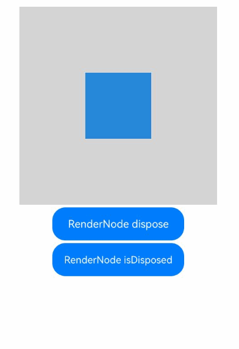

# RenderNode
<!--Kit: ArkUI-->
<!--Subsystem: ArkUI-->
<!--Owner: @xiang-shouxing-->
<!--Designer: @xiang-shouxing-->
<!--Tester: @sally__-->
<!--Adviser: @HelloCrease-->

提供自绘制渲染节点RenderNode，支持开发者通过C API进行开发，完成自定义绘制需求。

> **说明：**
>
> 本模块首批接口从API version 11开始支持。后续版本的新增接口，采用上角标单独标记接口的起始版本。
> 
>
> 不建议对BuilderNode中的RenderNode进行修改操作。

## 导入模块

```ts
import { RenderNode } from '@kit.ArkUI';
```

## RenderNode

### constructor

constructor()

RenderNode的构造函数。

**原子化服务API：** 从API version 12开始，该接口支持在原子化服务中使用。

**系统能力：** SystemCapability.ArkUI.ArkUI.Full

**示例：**

```ts
import {  RenderNode, FrameNode, NodeController } from '@kit.ArkUI';

const renderNode = new RenderNode();
renderNode.frame = { x: 0, y: 0, width: 100, height: 100 };
renderNode.backgroundColor = 0xffff0000;

class MyNodeController extends NodeController {
  private rootNode: FrameNode | null = null;

  makeNode(uiContext: UIContext): FrameNode | null {
    this.rootNode = new FrameNode(uiContext);

    const rootRenderNode = this.rootNode.getRenderNode();
    if (rootRenderNode !== null) {
      rootRenderNode.appendChild(renderNode);
    }

    return this.rootNode;
  }
}

@Entry
@Component
struct Index {
  private myNodeController: MyNodeController = new MyNodeController();

  build() {
    Row() {
      NodeContainer(this.myNodeController)
    }
  }
}
```

### appendChild

appendChild(node: RenderNode): void

在RenderNode最后一个子节点后添加新的子节点。

**原子化服务API：** 从API version 12开始，该接口支持在原子化服务中使用。

**系统能力：** SystemCapability.ArkUI.ArkUI.Full

**参数：**

| 参数名 | 类型                      | 必填 | 说明                   |
| ------ | ------------------------- | ---- | ---------------------- |
| node   | [RenderNode](#rendernode-1) | 是   | 需要添加的RenderNode。 |

**示例：**

```ts
import {  RenderNode, FrameNode, NodeController } from '@kit.ArkUI';

const renderNode = new RenderNode();
renderNode.frame = { x: 0, y: 0, width: 100, height: 100 };
renderNode.backgroundColor = 0xffff0000;
const child = new RenderNode();
child.frame = { x: 10, y: 10, width: 50, height: 50 };
child.backgroundColor = 0xff00ff00;
renderNode.appendChild(child);

class MyNodeController extends NodeController {
  private rootNode: FrameNode | null = null;

  makeNode(uiContext: UIContext): FrameNode | null {
    this.rootNode = new FrameNode(uiContext);

    const rootRenderNode = this.rootNode.getRenderNode();
    if (rootRenderNode !== null) {
      rootRenderNode.appendChild(renderNode);
    }

    return this.rootNode;
  }
}

@Entry
@Component
struct Index {
  private myNodeController: MyNodeController = new MyNodeController();

  build() {
    Row() {
      NodeContainer(this.myNodeController)
    }
  }
}
```

### insertChildAfter

insertChildAfter(child: RenderNode, sibling: RenderNode | null): void

在RenderNode指定子节点之后添加新的子节点。

**原子化服务API：** 从API version 12开始，该接口支持在原子化服务中使用。

**系统能力：** SystemCapability.ArkUI.ArkUI.Full

**参数：**

| 参数名  | 类型                                        | 必填 | 说明                                                                         |
| ------- | ------------------------------------------- | ---- | ---------------------------------------------------------------------------- |
| child   | [RenderNode](#rendernode-1)                   | 是   | 需要添加的子节点。                                                           |
| sibling | [RenderNode](#rendernode-1)&nbsp;\|&nbsp;null | 是   | 新节点将插入到该节点之后。若该参数设置为空，则新节点将插入到首个子节点之前。 |

**示例：**

```ts
import {  RenderNode, FrameNode, NodeController } from '@kit.ArkUI';

const renderNode = new RenderNode();
renderNode.frame = { x: 0, y: 0, width: 200, height: 350 };
renderNode.backgroundColor = 0xffff0000;
for (let i = 0; i < 5; i++) {
  const node = new RenderNode();
  node.frame = { x: 10, y: 10 + 60 * i, width: 50, height: 50 };
  node.backgroundColor = 0xff00ff00;
  renderNode.appendChild(node);
}

const child = new RenderNode();
child.frame = { x: 70, y: 70, width: 50, height: 50 };
child.backgroundColor = 0xffffff00;
const sibling = renderNode.getChild(1);
renderNode.insertChildAfter(child, sibling);

class MyNodeController extends NodeController {
  private rootNode: FrameNode | null = null;

  makeNode(uiContext: UIContext): FrameNode | null {
    this.rootNode = new FrameNode(uiContext);

    const rootRenderNode = this.rootNode.getRenderNode();
    if (rootRenderNode !== null) {
      rootRenderNode.appendChild(renderNode);
    }

    return this.rootNode;
  }
}

@Entry
@Component
struct Index {
  private myNodeController: MyNodeController = new MyNodeController();

  build() {
    Row() {
      NodeContainer(this.myNodeController)
    }
  }
}
```

### removeChild

removeChild(node: RenderNode): void

从RenderNode中删除指定的子节点。

**原子化服务API：** 从API version 12开始，该接口支持在原子化服务中使用。

**系统能力：** SystemCapability.ArkUI.ArkUI.Full

**参数：**

| 参数名 | 类型                      | 必填 | 说明               |
| ------ | ------------------------- | ---- | ------------------ |
| node   | [RenderNode](#rendernode-1) | 是   | 需要删除的子节点。 |

**示例：**
```ts
import {  RenderNode, FrameNode, NodeController } from '@kit.ArkUI';

const renderNode = new RenderNode();
renderNode.frame = { x: 0, y: 0, width: 200, height: 350 };
renderNode.backgroundColor = 0xffff0000;
for (let i = 0; i < 5; i++) {
  const node = new RenderNode();
  node.frame = { x: 10, y: 10 + 60 * i, width: 50, height: 50 };
  node.backgroundColor = 0xff00ff00;
  renderNode.appendChild(node);
}

const node = renderNode.getChild(1);
renderNode.removeChild(node);

class MyNodeController extends NodeController {
  private rootNode: FrameNode | null = null;

  makeNode(uiContext: UIContext): FrameNode | null {
    this.rootNode = new FrameNode(uiContext);

    const rootRenderNode = this.rootNode.getRenderNode();
    if (rootRenderNode !== null) {
      rootRenderNode.appendChild(renderNode);
    }

    return this.rootNode;
  }
}

@Entry
@Component
struct Index {
  private myNodeController: MyNodeController = new MyNodeController();

  build() {
    Row() {
      NodeContainer(this.myNodeController)
    }
  }
}
```
### clearChildren

clearChildren(): void

清除当前RenderNode的所有子节点。

**原子化服务API：** 从API version 12开始，该接口支持在原子化服务中使用。

**系统能力：** SystemCapability.ArkUI.ArkUI.Full

**示例：**

```ts
import { RenderNode, FrameNode, NodeController } from '@kit.ArkUI';

const renderNode = new RenderNode();
renderNode.size = { width: 200, height: 300 };
for (let i = 0; i < 10; i++) {
  let childNode = new RenderNode();
  childNode.size = { width: i * 10, height: i * 10 };
  childNode.position = { x: i * 10, y: i * 10 };
  childNode.backgroundColor = 0xFF0000FF - 0X11 * i;
  renderNode.appendChild(childNode);
}

class MyNodeController extends NodeController {
  private rootNode: FrameNode | null = null;

  makeNode(uiContext: UIContext): FrameNode | null {
    this.rootNode = new FrameNode(uiContext);

    const rootRenderNode = this.rootNode.getRenderNode();
    if (rootRenderNode !== null) {
      rootRenderNode.appendChild(renderNode);
    }

    return this.rootNode;
  }
}

@Entry
@Component
struct Index {
  private myNodeController: MyNodeController = new MyNodeController();

  build() {
    Column() {
      NodeContainer(this.myNodeController)
        .borderWidth(1)
        .width(200)
        .height(300)
      Button("clearChildren")
        .onClick(() => {
          renderNode.clearChildren();
        })
    }.width("100%")
  }
}
```

### getChild

getChild(index: number): RenderNode | null

获取当前节点指定位置的子节点。

**原子化服务API：** 从API version 12开始，该接口支持在原子化服务中使用。

**系统能力：** SystemCapability.ArkUI.ArkUI.Full

**参数：**

| 参数名  | 类型    | 必填 | 说明               |
| ------- | ------- | ---- | ------------------ |
| index | number | 是   | 需要查询的子节点的序列号。 |

**返回值：**

| 类型                              | 说明                                                       |
| --------------------------------- | ---------------------------------------------------------- |
| [RenderNode](#rendernode-1) \| null | 子节点。若该RenderNode不包含所查询的子节点，则返回空对象null。 |

**示例：**

```ts
import { RenderNode, FrameNode, NodeController } from '@kit.ArkUI';

const renderNode = new RenderNode();
renderNode.size = { width: 200, height: 300 };
for (let i = 0; i < 10; i++) {
  let childNode = new RenderNode();
  childNode.size = { width: i * 10, height: i * 10 };
  childNode.position = { x: i * 10, y: i * 10 };
  childNode.backgroundColor = 0xFF0000FF - 0X11 * i;
  renderNode.appendChild(childNode);
}

class MyNodeController extends NodeController {
  private rootNode: FrameNode | null = null;

  makeNode(uiContext: UIContext): FrameNode | null {
    this.rootNode = new FrameNode(uiContext);

    const rootRenderNode = this.rootNode.getRenderNode();
    if (rootRenderNode !== null) {
      rootRenderNode.appendChild(renderNode);
    }

    return this.rootNode;
  }
}

@Entry
@Component
struct Index {
  private myNodeController: MyNodeController = new MyNodeController();

  build() {
    Column() {
      NodeContainer(this.myNodeController)
        .borderWidth(1)
        .width(200)
        .height(300)
      Button("getChild")
        .onClick(() => {
          for (let i = 0; i < 11; i++) {
            let childNode: RenderNode | null = renderNode.getChild(i);
            if (childNode == null) {
              console.info(`the ${i} of renderNode's childNode is null`);
            } else {
              console.info(`the ${i} of renderNode's childNode has a size of {${childNode.size.width},${childNode.size.height}}`);
            }
          }

        })
    }.width("100%")
  }
}
```

### getFirstChild

getFirstChild(): RenderNode | null

获取当前RenderNode的第一个子节点。

**原子化服务API：** 从API version 12开始，该接口支持在原子化服务中使用。

**系统能力：** SystemCapability.ArkUI.ArkUI.Full

**返回值：**

| 类型                              | 说明                                                       |
| --------------------------------- | ---------------------------------------------------------- |
| [RenderNode](#rendernode-1) \| null | 首个子节点。若该RenderNode不包含子节点，则返回空对象null。 |

**示例：**

```ts
import {  RenderNode, FrameNode, NodeController } from '@kit.ArkUI';

const renderNode = new RenderNode();
renderNode.frame = { x: 0, y: 0, width: 200, height: 350 };
renderNode.backgroundColor = 0xffff0000;
for (let i = 0; i < 5; i++) {
  const node = new RenderNode();
  node.frame = { x: 10, y: 10 + 60 * i, width: 50, height: 50 };
  node.backgroundColor = 0xff00ff00;
  renderNode.appendChild(node);
}

class MyNodeController extends NodeController {
  private rootNode: FrameNode | null = null;

  makeNode(uiContext: UIContext): FrameNode | null {
    this.rootNode = new FrameNode(uiContext);

    const rootRenderNode = this.rootNode.getRenderNode();
    if (rootRenderNode !== null) {
      rootRenderNode.appendChild(renderNode);
    }

    return this.rootNode;
  }
}

@Entry
@Component
struct Index {
  private myNodeController: MyNodeController = new MyNodeController();

  build() {
    Row() {
      NodeContainer(this.myNodeController)
        .width(200)
        .height(350)
      Button('getFirstChild')
        .onClick(() => {
          const firstChild = renderNode.getFirstChild();
          if (firstChild === null) {
            console.info('the fist child is null');
          } else {
            console.info(`the position of fist child is x: ${firstChild.position.x}, y: ${firstChild.position.y}`);
          }
        })
    }
  }
}
```

### getNextSibling

getNextSibling(): RenderNode | null

获取当前RenderNode的下一个同级节点。

**原子化服务API：** 从API version 12开始，该接口支持在原子化服务中使用。

**系统能力：** SystemCapability.ArkUI.ArkUI.Full

**返回值：**

| 类型                              | 说明                                                                                   |
| --------------------------------- | -------------------------------------------------------------------------------------- |
| [RenderNode](#rendernode-1) \| null | 当前RenderNode的下一个同级节点。若该RenderNode不包含下一个同级节点，则返回空对象null。 |

**示例：**
```ts
import {  RenderNode, FrameNode, NodeController } from '@kit.ArkUI';

const renderNode = new RenderNode();
renderNode.frame = { x: 0, y: 0, width: 200, height: 350 };
renderNode.backgroundColor = 0xffff0000;
for (let i = 0; i < 5; i++) {
  const node = new RenderNode();
  node.frame = { x: 10, y: 10 + 60 * i, width: 50, height: 50 };
  node.backgroundColor = 0xff00ff00;
  renderNode.appendChild(node);
}

class MyNodeController extends NodeController {
  private rootNode: FrameNode | null = null;

  makeNode(uiContext: UIContext): FrameNode | null {
    this.rootNode = new FrameNode(uiContext);

    const rootRenderNode = this.rootNode.getRenderNode();
    if (rootRenderNode !== null) {
      rootRenderNode.appendChild(renderNode);
    }

    return this.rootNode;
  }
}

@Entry
@Component
struct Index {
  private myNodeController: MyNodeController = new MyNodeController();

  build() {
    Row() {
      NodeContainer(this.myNodeController)
        .width(200)
        .height(350)
      Button('getNextSibling')
        .onClick(() => {
          const child = renderNode.getChild(1);
          const nextSibling = child!.getNextSibling()
          if (nextSibling === null || child === null) {
            console.info('the child or nextChild is null');
          } else {
            console.info(`the position of child is x: ${child.position.x}, y: ${child.position.y}, ` +
              `the position of nextSibling is x: ${nextSibling.position.x}, y: ${nextSibling.position.y}`);
          }
        })
    }
  }
}
```

### getPreviousSibling

getPreviousSibling(): RenderNode | null

获取当前RenderNode的上一个同级节点。

**原子化服务API：** 从API version 12开始，该接口支持在原子化服务中使用。

**系统能力：** SystemCapability.ArkUI.ArkUI.Full

**返回值：**

| 类型                              | 说明                                                                                   |
| --------------------------------- | -------------------------------------------------------------------------------------- |
| [RenderNode](#rendernode-1) \| null | 当前RenderNode的上一个同级节点。若该RenderNode不包含上一个同级节点，则返回空对象null。 |

**示例：**
```ts
import {  RenderNode, FrameNode, NodeController } from '@kit.ArkUI';

const renderNode = new RenderNode();
renderNode.frame = { x: 0, y: 0, width: 200, height: 350 };
renderNode.backgroundColor = 0xffff0000;
for (let i = 0; i < 5; i++) {
  const node = new RenderNode();
  node.frame = { x: 10, y: 10 + 60 * i, width: 50, height: 50 };
  node.backgroundColor = 0xff00ff00;
  renderNode.appendChild(node);
}

class MyNodeController extends NodeController {
  private rootNode: FrameNode | null = null;

  makeNode(uiContext: UIContext): FrameNode | null {
    this.rootNode = new FrameNode(uiContext);

    const rootRenderNode = this.rootNode.getRenderNode();
    if (rootRenderNode !== null) {
      rootRenderNode.appendChild(renderNode);
    }

    return this.rootNode;
  }
}

@Entry
@Component
struct Index {
  private myNodeController: MyNodeController = new MyNodeController();

  build() {
    Row() {
      NodeContainer(this.myNodeController)
        .width(200)
        .height(350)
      Button('getPreviousSibling')
        .onClick(() => {
          const child = renderNode.getChild(1);
          const previousSibling = child!.getPreviousSibling()
          if (child === null || previousSibling === null) {
            console.info('the child or previousChild is null');
          } else {
            console.info(`the position of child is x: ${child.position.x}, y: ${child.position.y}, ` +
              `the position of previousSibling is x: ${previousSibling.position.x}, y: ${previousSibling.position.y}`);
          }
        })
    }
  }
}
```

### backgroundColor

set backgroundColor(color: number)

设置当前RenderNode的背景颜色。

**原子化服务API：** 从API version 12开始，该接口支持在原子化服务中使用。

**系统能力：** SystemCapability.ArkUI.ArkUI.Full

**参数：**

| 参数名 | 类型   | 必填 | 说明                   |
| ------ | ------ | ---- | ---------------------- |
| color  | number | 是   | 背景颜色值，ARGB格式，示例：0xE5E5E5。 |

get backgroundColor(): number

获取当前RenderNode的背景颜色。

**原子化服务API：** 从API version 12开始，该接口支持在原子化服务中使用。

**系统能力：** SystemCapability.ArkUI.ArkUI.Full

**返回值：**

| 类型   | 说明                                           |
| ------ | ---------------------------------------------- |
| number | 当前RenderNode的背景颜色，默认值为0X00000000。 |

**示例：**
```ts
import {  RenderNode, FrameNode, NodeController } from '@kit.ArkUI';

const renderNode = new RenderNode();
renderNode.frame = { x: 0, y: 0, width: 100, height: 100 };
renderNode.backgroundColor = 0XFF00FF00;
const backgroundColor = renderNode.backgroundColor;

class MyNodeController extends NodeController {
  private rootNode: FrameNode | null = null;

  makeNode(uiContext: UIContext): FrameNode | null {
    this.rootNode = new FrameNode(uiContext);

    const rootRenderNode = this.rootNode.getRenderNode();
    if (rootRenderNode !== null) {
      rootRenderNode.appendChild(renderNode);
    }

    return this.rootNode;
  }
}

@Entry
@Component
struct Index {
  private myNodeController: MyNodeController = new MyNodeController();
  build() {
    Row() {
      NodeContainer(this.myNodeController)
    }
  }
}
```

### clipToFrame

set clipToFrame(useClip: boolean)

设置是否对当前RenderNode剪裁。若设置为true，则超出该RenderNode大小的部分将会被截断。

**原子化服务API：** 从API version 12开始，该接口支持在原子化服务中使用。

**系统能力：** SystemCapability.ArkUI.ArkUI.Full

**参数：**

| 参数名  | 类型    | 必填 | 说明               |
| ------- | ------- | ---- | ------------------ |
| useClip | boolean | 是   | 设置是否进行剪裁。<br/>true表示对当前RenderNode剪裁，false表示不对当前RenderNode剪裁。 |

get clipToFrame(): boolean

获取当前RenderNode是否需要进行剪裁。

**原子化服务API：** 从API version 12开始，该接口支持在原子化服务中使用。

**系统能力：** SystemCapability.ArkUI.ArkUI.Full

**返回值：**

| 类型    | 说明                                                |
| ------- | --------------------------------------------------- |
| boolean | 获取当前RenderNode是否需要进行剪裁，默认值为true。<br/>true表示对当前RenderNode剪裁，false表示不对当前RenderNode剪裁。 |

**示例：**
```ts
import {  RenderNode, FrameNode, NodeController } from '@kit.ArkUI';

const renderNode = new RenderNode();
renderNode.frame = { x: 0, y: 0, width: 100, height: 100 };
renderNode.backgroundColor = 0xffff0000;
renderNode.clipToFrame = true;
const clipToFrame = renderNode.clipToFrame;

const childNode = new RenderNode();
childNode.frame = { x: 10, y: 10, width: 150, height: 50 };
childNode.backgroundColor = 0xffffff00;
renderNode.appendChild(childNode);

class MyNodeController extends NodeController {
  private rootNode: FrameNode | null = null;

  makeNode(uiContext: UIContext): FrameNode | null {
    this.rootNode = new FrameNode(uiContext);

    const rootRenderNode = this.rootNode.getRenderNode();
    if (rootRenderNode !== null) {
      rootRenderNode.appendChild(renderNode);
    }

    return this.rootNode;
  }
}

@Entry
@Component
struct Index {
  private myNodeController: MyNodeController = new MyNodeController();

  build() {
    Row() {
      NodeContainer(this.myNodeController)
    }
  }
}
```

### opacity

set opacity(value: number)

设置当前RenderNode的不透明度。若输入的数值小于0，会被视为0。若输入的数值大于1，会被视为1。

**原子化服务API：** 从API version 12开始，该接口支持在原子化服务中使用。

**系统能力：** SystemCapability.ArkUI.ArkUI.Full

**参数：**

| 参数名 | 类型   | 必填 | 说明                                   |
| ------ | ------ | ---- | -------------------------------------- |
| value  | number | 是   | 将要设置的不透明度，数据范围为[0, 1]，值越大透明度越低。 |

get opacity(): number

获取当前RenderNode的不透明度。

**原子化服务API：** 从API version 12开始，该接口支持在原子化服务中使用。

**系统能力：** SystemCapability.ArkUI.ArkUI.Full

**返回值：**

| 类型   | 说明                                      |
| ------ | ----------------------------------------- |
| number | 获取当前RenderNode的不透明度，默认值为1，不透明。 |

**示例：**
```ts
import {  RenderNode, FrameNode, NodeController } from '@kit.ArkUI';

const renderNode = new RenderNode();
renderNode.frame = { x: 0, y: 0, width: 100, height: 100 };
renderNode.backgroundColor = 0xffff0000;
renderNode.opacity = 0.5;
const opacity = renderNode.opacity;

class MyNodeController extends NodeController {
  private rootNode: FrameNode | null = null;

  makeNode(uiContext: UIContext): FrameNode | null {
    this.rootNode = new FrameNode(uiContext);

    const rootRenderNode = this.rootNode.getRenderNode();
    if (rootRenderNode !== null) {
      rootRenderNode.appendChild(renderNode);
    }

    return this.rootNode;
  }
}

@Entry
@Component
struct Index {
  private myNodeController: MyNodeController = new MyNodeController();

  build() {
    Row() {
      NodeContainer(this.myNodeController)
    }
  }
}
```

### size

set size(size: Size)

设置当前RenderNode的大小。

**原子化服务API：** 从API version 12开始，该接口支持在原子化服务中使用。

**系统能力：** SystemCapability.ArkUI.ArkUI.Full

**参数：**

| 参数名 | 类型                                     | 必填 | 说明                         |
| ------ | ---------------------------------------- | ---- | ---------------------------- |
| size   | [Size](./js-apis-arkui-graphics.md#size) | 是   | 将要设置的RenderNode的大小。 |

get size(): Size

获取当前RenderNode的大小。

**原子化服务API：** 从API version 12开始，该接口支持在原子化服务中使用。

**系统能力：** SystemCapability.ArkUI.ArkUI.Full

**返回值：**

| 类型                                     | 说明                                            |
| ---------------------------------------- | ----------------------------------------------- |
| [Size](./js-apis-arkui-graphics.md#size) | 获取当前RenderNode的大小，默认值宽度和高度为0。 |

**示例：**
```ts
import {  RenderNode, FrameNode, NodeController } from '@kit.ArkUI';

const renderNode = new RenderNode();
renderNode.backgroundColor = 0xffff0000;
renderNode.size = { width: 100, height: 100 };
const size = renderNode.size;

class MyNodeController extends NodeController {
  private rootNode: FrameNode | null = null;

  makeNode(uiContext: UIContext): FrameNode | null {
    this.rootNode = new FrameNode(uiContext);

    const rootRenderNode = this.rootNode.getRenderNode();
    if (rootRenderNode !== null) {
      rootRenderNode.appendChild(renderNode);
    }

    return this.rootNode;
  }
}

@Entry
@Component
struct Index {
  private myNodeController: MyNodeController = new MyNodeController();

  build() {
    Row() {
      NodeContainer(this.myNodeController)
    }
  }
}
```

### position

set position(position: Position)

设置当前RenderNode的位置。

**原子化服务API：** 从API version 12开始，该接口支持在原子化服务中使用。

**系统能力：** SystemCapability.ArkUI.ArkUI.Full

**参数：**

| 参数名   | 类型                                             | 必填 | 说明                         |
| -------- | ------------------------------------------------ | ---- | ---------------------------- |
| position | [Position](./js-apis-arkui-graphics.md#position) | 是   | 将要设置的RenderNode的位置。 |

get position(): Position

获取当前RenderNode的位置。

**原子化服务API：** 从API version 12开始，该接口支持在原子化服务中使用。

**系统能力：** SystemCapability.ArkUI.ArkUI.Full

**返回值：**

| 类型                                             | 说明                                                 |
| ------------------------------------------------ | ---------------------------------------------------- |
| [Position](./js-apis-arkui-graphics.md#position) | 获取当前RenderNode的位置，默认位置为{ x: 0, y: 0 }。 |

**示例：**
```ts
import {  RenderNode, FrameNode, NodeController } from '@kit.ArkUI';

const renderNode = new RenderNode();
renderNode.backgroundColor = 0xffff0000;
renderNode.size = { width: 100, height: 100 };
renderNode.position = { x: 10, y: 10 };
const position = renderNode.position;

class MyNodeController extends NodeController {
  private rootNode: FrameNode | null = null;

  makeNode(uiContext: UIContext): FrameNode | null {
    this.rootNode = new FrameNode(uiContext);

    const rootRenderNode = this.rootNode.getRenderNode();
    if (rootRenderNode !== null) {
      rootRenderNode.appendChild(renderNode);
    }

    return this.rootNode;
  }
}

@Entry
@Component
struct Index {
  private myNodeController: MyNodeController = new MyNodeController();

  build() {
    Row() {
      NodeContainer(this.myNodeController)
    }
  }
}
```

### frame

set frame(frame: Frame)

设置当前RenderNode的大小和位置。当和[position](#position)、[size](#size)同时使用时，以后设置的为准。

**原子化服务API：** 从API version 12开始，该接口支持在原子化服务中使用。

**系统能力：** SystemCapability.ArkUI.ArkUI.Full

**参数：**

| 参数名 | 类型                                       | 必填 | 说明                             |
| ------ | ------------------------------------------ | ---- | -------------------------------- |
| frame  | [Frame](./js-apis-arkui-graphics.md#frame) | 是   | 将要设置的RenderNode的大小和位置。 |

get frame(): Frame

获取当前RenderNode的大小和位置。

**原子化服务API：** 从API version 12开始，该接口支持在原子化服务中使用。

**系统能力：** SystemCapability.ArkUI.ArkUI.Full

**返回值：**

| 类型            | 说明                                                                          |
| --------------- | ----------------------------------------------------------------------------- |
| [Frame](#frame) | 获取当前RenderNode的大小和位置，默认值为{ x: 0, y: 0, width: 0, height: 0 }。 |

**示例：**
```ts
import {  RenderNode, FrameNode, NodeController } from '@kit.ArkUI';

const renderNode = new RenderNode();
renderNode.backgroundColor = 0xffff0000;
renderNode.frame = { x: 10, y: 10, width: 100, height: 100 };
const frame = renderNode.frame;

class MyNodeController extends NodeController {
  private rootNode: FrameNode | null = null;

  makeNode(uiContext: UIContext): FrameNode | null {
    this.rootNode = new FrameNode(uiContext);

    const rootRenderNode = this.rootNode.getRenderNode();
    if (rootRenderNode !== null) {
      rootRenderNode.appendChild(renderNode);
    }

    return this.rootNode;
  }
}

@Entry
@Component
struct Index {
  private myNodeController: MyNodeController = new MyNodeController();

  build() {
    Row() {
      NodeContainer(this.myNodeController)
    }
  }
}
```

### pivot

set pivot(pivot: Pivot)

设置当前RenderNode的轴心，影响RenderNode的缩放和旋转效果。

**原子化服务API：** 从API version 12开始，该接口支持在原子化服务中使用。

**系统能力：** SystemCapability.ArkUI.ArkUI.Full

**参数：**

| 参数名 | 类型                                       | 必填 | 说明                         |
| ------ | ------------------------------------------ | ---- | ---------------------------- |
| pivot  | [Pivot](./js-apis-arkui-graphics.md#pivot) | 是   | 将要设置的RenderNode的轴心。 |

get pivot(): Pivot

获取当前RenderNode的轴心。

**原子化服务API：** 从API version 12开始，该接口支持在原子化服务中使用。

**系统能力：** SystemCapability.ArkUI.ArkUI.Full

**返回值：**

| 类型                                       | 说明                                                  |
| ------------------------------------------ | ----------------------------------------------------- |
| [Pivot](./js-apis-arkui-graphics.md#pivot) | 获取当前RenderNode的轴心，默认值为{ x: 0.5, y: 0.5}。 |

**示例：**
```ts
import {  RenderNode, FrameNode, NodeController } from '@kit.ArkUI';

const renderNode = new RenderNode();
renderNode.backgroundColor = 0xffff0000;
renderNode.frame = { x: 10, y: 10, width: 100, height: 100 };
renderNode.pivot = { x: 0.5, y: 0.6 };
const pivot = renderNode.pivot;

renderNode.rotation = { x: 15, y: 0, z: 0 };

class MyNodeController extends NodeController {
  private rootNode: FrameNode | null = null;

  makeNode(uiContext: UIContext): FrameNode | null {
    this.rootNode = new FrameNode(uiContext);

    const rootRenderNode = this.rootNode.getRenderNode();
    if (rootRenderNode !== null) {
      rootRenderNode.appendChild(renderNode);
    }

    return this.rootNode;
  }
}

@Entry
@Component
struct Index {
  private myNodeController: MyNodeController = new MyNodeController();

  build() {
    Row() {
      NodeContainer(this.myNodeController)
    }
  }
}
```

### scale

set scale(scale: Scale)

设置当前RenderNode的比例。

**原子化服务API：** 从API version 12开始，该接口支持在原子化服务中使用。

**系统能力：** SystemCapability.ArkUI.ArkUI.Full

**参数：**

| 参数名 | 类型                                       | 必填 | 说明                             |
| ------ | ------------------------------------------ | ---- | -------------------------------- |
| scale  | [Scale](./js-apis-arkui-graphics.md#scale) | 是   | 将要设置的RenderNode的缩放比例。 |

get scale(): Scale

获取当前RenderNode的比例。

**原子化服务API：** 从API version 12开始，该接口支持在原子化服务中使用。

**系统能力：** SystemCapability.ArkUI.ArkUI.Full

**返回值：**

| 类型                                       | 说明                                               |
| ------------------------------------------ | -------------------------------------------------- |
| [Scale](./js-apis-arkui-graphics.md#scale) | 获取当前RenderNode的比例，默认值为{ x: 1, y: 1 }。 |

**示例：**
```ts
import {  RenderNode, FrameNode, NodeController } from '@kit.ArkUI';

const renderNode = new RenderNode();
renderNode.backgroundColor = 0xffff0000;
renderNode.frame = { x: 10, y: 10, width: 100, height: 100 };
renderNode.scale = { x: 0.5, y: 1 };
const scale = renderNode.scale;

class MyNodeController extends NodeController {
  private rootNode: FrameNode | null = null;

  makeNode(uiContext: UIContext): FrameNode | null {
    this.rootNode = new FrameNode(uiContext);

    const rootRenderNode = this.rootNode.getRenderNode();
    if (rootRenderNode !== null) {
      rootRenderNode.appendChild(renderNode);
    }

    return this.rootNode;
  }
}

@Entry
@Component
struct Index {
  private myNodeController: MyNodeController = new MyNodeController();

  build() {
    Row() {
      NodeContainer(this.myNodeController)
    }
  }
}
```

### translation

set translation(translation: Translation)

设置当前RenderNode的平移量。

**原子化服务API：** 从API version 12开始，该接口支持在原子化服务中使用。

**系统能力：** SystemCapability.ArkUI.ArkUI.Full

**参数：**

| 参数名      | 类型                                                   | 必填 | 说明                           |
| ----------- | ------------------------------------------------------ | ---- | ------------------------------ |
| translation | [Translation](./js-apis-arkui-graphics.md#translation) | 是   | 将要设置的RenderNode的平移量。 |

get translation(): Translation

获取当前RenderNode的平移量。

**原子化服务API：** 从API version 12开始，该接口支持在原子化服务中使用。

**系统能力：** SystemCapability.ArkUI.ArkUI.Full

**返回值：**

| 类型                                                   | 说明                                                 |
| ------------------------------------------------------ | ---------------------------------------------------- |
| [Translation](./js-apis-arkui-graphics.md#translation) | 获取当前RenderNode的平移量，默认值为{ x: 0, y: 0 }。 |

**示例：**
```ts
import {  RenderNode, FrameNode, NodeController } from '@kit.ArkUI';

const renderNode = new RenderNode();
renderNode.backgroundColor = 0xffff0000;
renderNode.frame = { x: 10, y: 10, width: 100, height: 100 };
renderNode.translation = { x: 100, y: 0 };
const translation = renderNode.translation;

class MyNodeController extends NodeController {
  private rootNode: FrameNode | null = null;

  makeNode(uiContext: UIContext): FrameNode | null {
    this.rootNode = new FrameNode(uiContext);

    const rootRenderNode = this.rootNode.getRenderNode();
    if (rootRenderNode !== null) {
      rootRenderNode.appendChild(renderNode);
    }

    return this.rootNode;
  }
}

@Entry
@Component
struct Index {
  private myNodeController: MyNodeController = new MyNodeController();

  build() {
    Row() {
      NodeContainer(this.myNodeController)
    }
  }
}
```

### rotation

set rotation(rotation: Rotation)

设置当前RenderNode的旋转角度。

**原子化服务API：** 从API version 12开始，该接口支持在原子化服务中使用。

**系统能力：** SystemCapability.ArkUI.ArkUI.Full

**参数：**

| 参数名   | 类型                                             | 必填 | 说明                             |
| -------- | ------------------------------------------------ | ---- | -------------------------------- |
| rotation | [Rotation](./js-apis-arkui-graphics.md#rotation) | 是   | 将要设置的RenderNode的旋转角度。 |

get rotation(): Rotation

获取当前RenderNode的旋转角度。

**原子化服务API：** 从API version 12开始，该接口支持在原子化服务中使用。

**系统能力：** SystemCapability.ArkUI.ArkUI.Full

**返回值：**

| 类型                                             | 说明                                                    |
| ------------------------------------------------ | ------------------------------------------------------- |
| [Rotation](./js-apis-arkui-graphics.md#rotation) | 当前RenderNode的旋转角度。默认值为{ x: 0, y: 0, z: 0}。 |

**示例：**
```ts
import {  RenderNode, FrameNode, NodeController } from '@kit.ArkUI';

const renderNode = new RenderNode();
renderNode.backgroundColor = 0xffff0000;
renderNode.frame = { x: 10, y: 10, width: 100, height: 100 };
renderNode.rotation = { x: 45, y: 0, z: 0 };
const rotation = renderNode.rotation;

class MyNodeController extends NodeController {
  private rootNode: FrameNode | null = null;

  makeNode(uiContext: UIContext): FrameNode | null {
    this.rootNode = new FrameNode(uiContext);

    const rootRenderNode = this.rootNode.getRenderNode();
    if (rootRenderNode !== null) {
      rootRenderNode.appendChild(renderNode);
    }

    return this.rootNode;
  }
}

@Entry
@Component
struct Index {
  private myNodeController: MyNodeController = new MyNodeController();

  build() {
    Row() {
      NodeContainer(this.myNodeController)
    }
  }
}
```

### transform

set transform(transform: Matrix4)

设置当前RenderNode的变换矩阵。

**原子化服务API：** 从API version 12开始，该接口支持在原子化服务中使用。

**系统能力：** SystemCapability.ArkUI.ArkUI.Full

**参数：**

| 参数名    | 类型                                           | 必填 | 说明                             |
| --------- | ---------------------------------------------- | ---- | -------------------------------- |
| transform | [Matrix4](./js-apis-arkui-graphics.md#matrix4) | 是   | 将要设置的RenderNode的变换矩阵。 |

get transform(): Matrix4

获取当前RenderNode的变换矩阵。默认值为：
```ts
[
  1, 0, 0, 0,
  0, 1, 0, 0,
  0, 0, 1, 0,
  0, 0, 0, 1
]
```

**原子化服务API：** 从API version 12开始，该接口支持在原子化服务中使用。

**系统能力：** SystemCapability.ArkUI.ArkUI.Full

**返回值：**

| 类型                                           | 说明                       |
| ---------------------------------------------- | -------------------------- |
| [Matrix4](./js-apis-arkui-graphics.md#matrix4) | 当前RenderNode的变换矩阵。 |

**示例：**
```ts
import {  RenderNode, FrameNode, NodeController } from '@kit.ArkUI';

const renderNode = new RenderNode();
renderNode.backgroundColor = 0xffff0000;
renderNode.frame = { x: 10, y: 10, width: 100, height: 100 };
renderNode.transform = [
  1, 0, 0, 0,
  0, 2, 0, 0,
  0, 0, 1, 0,
  0, 0, 0, 1
];
const transform = renderNode.transform;

class MyNodeController extends NodeController {
  private rootNode: FrameNode | null = null;

  makeNode(uiContext: UIContext): FrameNode | null {
    this.rootNode = new FrameNode(uiContext);

    const rootRenderNode = this.rootNode.getRenderNode();
    if (rootRenderNode !== null) {
      rootRenderNode.appendChild(renderNode);
    }

    return this.rootNode;
  }
}

@Entry
@Component
struct Index {
  private myNodeController: MyNodeController = new MyNodeController();

  build() {
    Row() {
      NodeContainer(this.myNodeController)
    }
  }
}
```

### shadowColor

set shadowColor(color: number)

设置当前RenderNode的阴影颜色，ARGB格式。若设置了[shadowAlpha](#shadowalpha)，则不透明度以shadowAlpha为准。

**原子化服务API：** 从API version 12开始，该接口支持在原子化服务中使用。

**系统能力：** SystemCapability.ArkUI.ArkUI.Full

**参数：**

| 参数名 | 类型   | 必填 | 说明                                       |
| ------ | ------ | ---- | ------------------------------------------ |
| color  | number | 是   | 将要设置的RenderNode的阴影颜色，ARGB格式。<br/>取值范围是符合ARGB格式的颜色。 |

get shadowColor(): number

获取当前RenderNode的阴影颜色。

**原子化服务API：** 从API version 12开始，该接口支持在原子化服务中使用。

**系统能力：** SystemCapability.ArkUI.ArkUI.Full

**返回值：**

| 类型   | 说明                                                     |
| ------ | -------------------------------------------------------- |
| number | 当前RenderNode的阴影颜色，ARGB格式，默认值为0X00000000。 |

**示例：**
```ts
import {  RenderNode, FrameNode, NodeController } from '@kit.ArkUI';

const renderNode = new RenderNode();
renderNode.backgroundColor = 0xffff0000;
renderNode.frame = { x: 10, y: 10, width: 100, height: 100 };
renderNode.shadowElevation = 10;
renderNode.shadowColor = 0XFF00FF00;
const shadowColor = renderNode.shadowColor;

class MyNodeController extends NodeController {
  private rootNode: FrameNode | null = null;

  makeNode(uiContext: UIContext): FrameNode | null {
    this.rootNode = new FrameNode(uiContext);

    const rootRenderNode = this.rootNode.getRenderNode();
    if (rootRenderNode !== null) {
      rootRenderNode.appendChild(renderNode);
    }

    return this.rootNode;
  }
}

@Entry
@Component
struct Index {
  private myNodeController: MyNodeController = new MyNodeController();

  build() {
    Row() {
      NodeContainer(this.myNodeController)
    }
  }
}
```

### shadowOffset

set shadowOffset(offset: Offset)

设置当前RenderNode的阴影偏移。

**原子化服务API：** 从API version 12开始，该接口支持在原子化服务中使用。

**系统能力：** SystemCapability.ArkUI.ArkUI.Full

**参数：**

| 参数名 | 类型                                         | 必填 | 说明                             |
| ------ | -------------------------------------------- | ---- | -------------------------------- |
| offset | [Offset](./js-apis-arkui-graphics.md#offset) | 是   | 将要设置的RenderNode的阴影偏移。 |

get shadowOffset(): Offset

获取当前RenderNode的阴影偏移。

**原子化服务API：** 从API version 12开始，该接口支持在原子化服务中使用。

**系统能力：** SystemCapability.ArkUI.ArkUI.Full

**返回值：**

| 类型                                         | 说明                                               |
| -------------------------------------------- | -------------------------------------------------- |
| [Offset](./js-apis-arkui-graphics.md#offset) | 当前RenderNode的阴影偏移，默认值为{ x: 0, y: 0 }。 |

**示例：**

```ts
import {  RenderNode, FrameNode, NodeController } from '@kit.ArkUI';

const renderNode = new RenderNode();
renderNode.backgroundColor = 0xffff0000;
renderNode.frame = { x: 10, y: 10, width: 100, height: 100 };
renderNode.shadowElevation = 10;
renderNode.shadowColor = 0XFF00FF00;
renderNode.shadowOffset = { x: 10, y: 10 };
const shadowOffset = renderNode.shadowOffset;

class MyNodeController extends NodeController {
  private rootNode: FrameNode | null = null;

  makeNode(uiContext: UIContext): FrameNode | null {
    this.rootNode = new FrameNode(uiContext);

    const rootRenderNode = this.rootNode.getRenderNode();
    if (rootRenderNode !== null) {
      rootRenderNode.appendChild(renderNode);
    }

    return this.rootNode;
  }
}

@Entry
@Component
struct Index {
  private myNodeController: MyNodeController = new MyNodeController();

  build() {
    Row() {
      NodeContainer(this.myNodeController)
    }
  }
}
```

### label<sup>12+</sup>

set label(label: string)

设置当前RenderNode的标签。若当前节点是通过new创建的RenderNode，则设置的标签信息会在节点Inspector信息的属性中。

**原子化服务API：** 从API version 12开始，该接口支持在原子化服务中使用。

**系统能力：** SystemCapability.ArkUI.ArkUI.Full

**参数：**

| 参数名 | 类型   | 必填 | 说明                                      |
| ------ | ------ | ---- | ----------------------------------------- |
| label  | string | 是   | 将要设置的RenderNode的标签。 |

get label(): string

获取当前RenderNode的标签。

**原子化服务API：** 从API version 12开始，该接口支持在原子化服务中使用。

**系统能力：** SystemCapability.ArkUI.ArkUI.Full

**返回值：**

| 类型   | 说明                                           |
| ------ | ---------------------------------------------- |
| string | 当前RenderNode的标签，默认值为""。 |

**示例：**

```ts
import {  RenderNode, FrameNode, NodeController, UIContext } from '@kit.ArkUI';

class MyNodeController extends NodeController {
  private rootNode: FrameNode | null = null;

  makeNode(uiContext: UIContext): FrameNode | null {
    this.rootNode = new FrameNode(uiContext);
    const renderNode: RenderNode | null = this.rootNode.getRenderNode();
    if (renderNode !== null) {
      const renderChildNode: RenderNode = new RenderNode();
      renderChildNode.frame = { x: 0, y: 0, width: 100, height: 100 };
      renderChildNode.backgroundColor = 0xffff0000;
      renderChildNode.label = 'customRenderChildNode';
      console.info('label:', renderChildNode.label);
      renderNode.appendChild(renderChildNode);
    }

    return this.rootNode;
  }
}

@Entry
@Component
struct Index {
  private myNodeController: MyNodeController = new MyNodeController();

  build() {
    Column() {
      NodeContainer(this.myNodeController)
        .width(300)
        .height(700)
        .backgroundColor(Color.Gray)
    }
  }
}
```
### shadowAlpha

set shadowAlpha(alpha: number)

设置当前RenderNode的阴影颜色的Alpha值。

**原子化服务API：** 从API version 12开始，该接口支持在原子化服务中使用。

**系统能力：** SystemCapability.ArkUI.ArkUI.Full

**参数：**

| 参数名 | 类型   | 必填 | 说明                                      |
| ------ | ------ | ---- | ----------------------------------------- |
| alpha  | number | 是   | 将要设置的RenderNode的阴影颜色的Alpha值。<br/> 取值范围是alpha值。 |

get shadowAlpha(): number

获取当前RenderNode的阴影颜色的Alpha值。

**原子化服务API：** 从API version 12开始，该接口支持在原子化服务中使用。

**系统能力：** SystemCapability.ArkUI.ArkUI.Full

**返回值：**

| 类型   | 说明                                           |
| ------ | ---------------------------------------------- |
| number | 当前RenderNode的阴影颜色的Alpha值，默认值为0。 |

**示例：**

```ts
import {  RenderNode, FrameNode, NodeController } from '@kit.ArkUI';

const renderNode = new RenderNode();
renderNode.backgroundColor = 0xffff0000;
renderNode.frame = { x: 10, y: 10, width: 100, height: 100 };
renderNode.shadowElevation = 10;
renderNode.shadowColor = 0XFF00FF00;
renderNode.shadowOffset = { x: 10, y: 10 };
renderNode.shadowAlpha = 0.1;
const shadowAlpha = renderNode.shadowAlpha;

class MyNodeController extends NodeController {
  private rootNode: FrameNode | null = null;

  makeNode(uiContext: UIContext): FrameNode | null {
    this.rootNode = new FrameNode(uiContext);

    const rootRenderNode = this.rootNode.getRenderNode();
    if (rootRenderNode !== null) {
      rootRenderNode.appendChild(renderNode);
    }

    return this.rootNode;
  }
}

@Entry
@Component
struct Index {
  private myNodeController: MyNodeController = new MyNodeController();

  build() {
    Row() {
      NodeContainer(this.myNodeController)
    }
  }
}
```

### shadowElevation

set shadowElevation(elevation: number)

设置当前RenderNode的阴影的光照高度。

**原子化服务API：** 从API version 12开始，该接口支持在原子化服务中使用。

**系统能力：** SystemCapability.ArkUI.ArkUI.Full

**参数：**

| 参数名    | 类型   | 必填 | 说明                             |
| --------- | ------ | ---- | -------------------------------- |
| elevation | number | 是   | 将要设置的RenderNode的光照高度。<br/> 取值范围：[0, +∞) |

get shadowElevation(): number

获取当前RenderNode的阴影的光照高度。

**原子化服务API：** 从API version 12开始，该接口支持在原子化服务中使用。

**系统能力：** SystemCapability.ArkUI.ArkUI.Full

**返回值：**

| 类型   | 说明                                  |
| ------ | ------------------------------------- |
| number | 当前RenderNode的阴影高度，默认值为0。 <br/> 取值范围：[0, +∞) |

**示例：**

```ts
import {  RenderNode, FrameNode, NodeController } from '@kit.ArkUI';

const renderNode = new RenderNode();
renderNode.backgroundColor = 0xffff0000;
renderNode.frame = { x: 0, y: 0, width: 100, height: 100 };
renderNode.shadowOffset = { x: 10, y: 10 };
renderNode.shadowAlpha = 0.7
renderNode.shadowElevation = 30;
const shadowElevation = renderNode.shadowElevation;

class MyNodeController extends NodeController {
  private rootNode: FrameNode | null = null;

  makeNode(uiContext: UIContext): FrameNode | null {
    this.rootNode = new FrameNode(uiContext);

    const rootRenderNode = this.rootNode.getRenderNode();
    if (rootRenderNode !== null) {
      rootRenderNode.appendChild(renderNode);
    }

    return this.rootNode;
  }
}

@Entry
@Component
struct Index {
  private myNodeController: MyNodeController = new MyNodeController();

  build() {
    Row() {
      NodeContainer(this.myNodeController)
    }
  }
}
```


### shadowRadius

set shadowRadius(radius: number)

设置当前RenderNode的阴影模糊半径。

**原子化服务API：** 从API version 12开始，该接口支持在原子化服务中使用。

**系统能力：** SystemCapability.ArkUI.ArkUI.Full

**参数：**

| 参数名 | 类型   | 必填 | 说明                                 |
| ------ | ------ | ---- | ------------------------------------ |
| radius | number | 是   | 将要设置的RenderNode的阴影模糊半径。<br/> 取值范围：[0, +∞) |

get shadowRadius(): number

获取当前RenderNode的阴影模糊半径。

**原子化服务API：** 从API version 12开始，该接口支持在原子化服务中使用。

**系统能力：** SystemCapability.ArkUI.ArkUI.Full

**返回值：**

| 类型   | 说明                                      |
| ------ | ----------------------------------------- |
| number | 当前RenderNode的阴影模糊半径，默认值为0。<br/> 取值范围：[0, +∞) |

**示例：**

```ts
import { RenderNode, FrameNode, NodeController } from '@kit.ArkUI';

const renderNode = new RenderNode();
renderNode.backgroundColor = 0xff0000ff;
renderNode.frame = {
  x: 100,
  y: 100,
  width: 100,
  height: 100
};
renderNode.shadowOffset = { x: 10, y: 10 };
renderNode.shadowAlpha = 0.7
renderNode.shadowRadius = 30;
const shadowRadius = renderNode.shadowRadius;
console.info(`FrameNode ${shadowRadius}`);

class MyNodeController extends NodeController {
  private rootNode: FrameNode | null = null;

  makeNode(uiContext: UIContext): FrameNode | null {
    this.rootNode = new FrameNode(uiContext);

    const rootRenderNode = this.rootNode.getRenderNode();
    if (rootRenderNode !== null) {
      rootRenderNode.appendChild(renderNode);
    }

    return this.rootNode;
  }
}

@Entry
@Component
struct Index {
  private myNodeController: MyNodeController = new MyNodeController();

  build() {
    Row() {
      NodeContainer(this.myNodeController)
    }
  }
}
```


### draw

draw(context: DrawContext): void

绘制方法，需要开发者进行实现。该方法会在RenderNode进行绘制时被调用。

> **说明：**
>
> RenderNode初始化时，会调用两次draw方法。第一次调用是在首次创建FrameNode时触发Render流程，第二次调用是在首次设置modifier时触发绘制。后续绘制流程皆由modifier触发。

**原子化服务API：** 从API version 12开始，该接口支持在原子化服务中使用。

**系统能力：** SystemCapability.ArkUI.ArkUI.Full

**参数：**

| 参数名  | 类型                                                   | 必填 | 说明             |
| ------- | ------------------------------------------------------ | ---- | ---------------- |
| context | [DrawContext](./js-apis-arkui-graphics.md#drawcontext) | 是   | 图形绘制上下文。 |

**示例：**

ArkTS侧代码：

```ts
// Index.ets
import bridge from "libentry.so"; // 该 so 由开发者通过 NAPI 编写并生成
import { RenderNode, FrameNode, NodeController, DrawContext } from '@kit.ArkUI';

class MyRenderNode extends RenderNode {
  uiContext: UIContext;

  constructor(uiContext: UIContext) {
    super();
    this.uiContext = uiContext;
  }

  draw(context: DrawContext) {
    // 需要将 context 中的宽度和高度从vp转换为px
    bridge.nativeOnDraw(0, context, this.uiContext.vp2px(context.size.height), this.uiContext.vp2px(context.size.width));
  }
}

class MyNodeController extends NodeController {
  private rootNode: FrameNode | null = null;

  makeNode(uiContext: UIContext): FrameNode | null {
    this.rootNode = new FrameNode(uiContext);

    const rootRenderNode = this.rootNode.getRenderNode();
    if (rootRenderNode !== null) {
      const renderNode = new MyRenderNode(uiContext);
      renderNode.size = { width: 100, height: 100 }
      rootRenderNode.appendChild(renderNode);
    }

    return this.rootNode;
  }
}

@Entry
@Component
struct Index {
  private myNodeController: MyNodeController = new MyNodeController();
  build() {
    Row() {
      NodeContainer(this.myNodeController)
    }
  }
}
```

C++侧可通过NAPI来获取Canvas，并进行后续的自定义绘制操作。

```c++
// native_bridge.cpp
#include "napi/native_api.h"
#include <native_drawing/drawing_canvas.h>
#include <native_drawing/drawing_color.h>
#include <native_drawing/drawing_path.h>
#include <native_drawing/drawing_pen.h>

static napi_value OnDraw(napi_env env, napi_callback_info info)
{
    size_t argc = 4;
    napi_value args[4] = { nullptr };
    napi_get_cb_info(env, info, &argc, args, nullptr, nullptr);

    int32_t id;
    napi_get_value_int32(env, args[0], &id);
    
    // 获取 Canvas 指针
    void* temp = nullptr;
    napi_unwrap(env, args[1], &temp);
    OH_Drawing_Canvas *canvas = reinterpret_cast<OH_Drawing_Canvas*>(temp);
    
    // 获取 Canvas 宽度
    int32_t width;
    napi_get_value_int32(env, args[2], &width);
    
    // 获取 Canvas 高度
    int32_t height;
    napi_get_value_int32(env, args[3], &height);
    
    // 传入canvas、height、width等信息至绘制函数中进行自定义绘制
    auto path = OH_Drawing_PathCreate();
    OH_Drawing_PathMoveTo(path, width / 4, height / 4);
    OH_Drawing_PathLineTo(path, width * 3 / 4, height / 4);
    OH_Drawing_PathLineTo(path, width * 3 / 4, height * 3 / 4);
    OH_Drawing_PathLineTo(path, width / 4, height * 3 / 4);
    OH_Drawing_PathLineTo(path, width / 4, height / 4);
    OH_Drawing_PathClose(path);
    
    auto pen = OH_Drawing_PenCreate();
    OH_Drawing_PenSetWidth(pen, 10);
    OH_Drawing_PenSetColor(pen, OH_Drawing_ColorSetArgb(0xFF, 0xFF, 0x00, 0x00));
    OH_Drawing_CanvasAttachPen(canvas, pen);
    
    OH_Drawing_CanvasDrawPath(canvas, path);

    return nullptr;
}

EXTERN_C_START
static napi_value Init(napi_env env, napi_value exports)
{
    napi_property_descriptor desc[] = {
        { "nativeOnDraw", nullptr, OnDraw, nullptr, nullptr, nullptr, napi_default, nullptr }
    };
    napi_define_properties(env, exports, sizeof(desc) / sizeof(desc[0]), desc);
    return exports;
}
EXTERN_C_END

static napi_module demoModule = {
    .nm_version =1,
    .nm_flags = 0,
    .nm_filename = nullptr,
    .nm_register_func = Init,
    .nm_modname = "entry",
    .nm_priv = ((void*)0),
    .reserved = { 0 },
};

extern "C" __attribute__((constructor)) void RegisterEntryModule(void)
{
    napi_module_register(&demoModule);
}
```

修改工程中的`src/main/cpp/CMakeLists.txt`文件，添加如下内容：

<!--code_no_check-->

```cmake
# the minimum version of CMake.
cmake_minimum_required(VERSION 3.4.1)
project(NapiTest)

set(NATIVERENDER_ROOT_PATH ${CMAKE_CURRENT_SOURCE_DIR})

include_directories(${NATIVERENDER_ROOT_PATH}
                    ${NATIVERENDER_ROOT_PATH}/include)

add_library(entry SHARED native_bridge.cpp)
target_link_libraries(entry PUBLIC libace_napi.z.so)
target_link_libraries(entry PUBLIC libace_ndk.z.so)
target_link_libraries(entry PUBLIC libnative_drawing.so)
```

同时在工程中的`src/main/cpp/types/libentry/index.d.ts`文件中，添加自定义绘制函数在ArkTs侧的定义，如：

<!--code_no_check-->

```ts
import { DrawContext } from '@kit.ArkUI';

export const nativeOnDraw: (id: number, context: DrawContext, width: number, height: number) => number;
```

### invalidate

invalidate(): void

该方法会触发RenderNode的重新渲染。

**原子化服务API：** 从API version 12开始，该接口支持在原子化服务中使用。

**系统能力：** SystemCapability.ArkUI.ArkUI.Full

**示例：**

```ts
import bridge from "libentry.so"; // 该 so 由开发者通过 NAPI 编写并生成
import { RenderNode, FrameNode, NodeController, DrawContext } from '@kit.ArkUI';

class MyRenderNode extends RenderNode {
  uiContext: UIContext;

  constructor(uiContext: UIContext) {
    super();
    this.uiContext = uiContext;
  }

  draw(context: DrawContext) {
    // 需要将 context 中的宽度和高度从vp转换为px
    bridge.nativeOnDraw(0, context, this.uiContext.vp2px(context.size.height), this.uiContext.vp2px(context.size.width));
  }
}

class MyNodeController extends NodeController {
  private rootNode: FrameNode | null = null;
  newNode: MyRenderNode | null = null;

  makeNode(uiContext: UIContext): FrameNode | null {
    this.rootNode = new FrameNode(uiContext);
    const renderNode = this.rootNode.getRenderNode();
    if (renderNode === null) {
      return this.rootNode;
    }
    this.newNode = new MyRenderNode(uiContext);
    this.newNode.size = { width: 100, height: 100 };
    renderNode.appendChild(this.newNode);
    return this.rootNode;
  }
}

@Entry
@Component
struct Index {
  private myNodeController: MyNodeController = new MyNodeController();

  build() {
    Column() {
      Column() {
        NodeContainer(this.myNodeController)
          .width('100%')
        Button('Invalidate')
          .onClick(() => {
            this.myNodeController.newNode?.invalidate()
          })
      }
      .width('100%')
      .height('100%')
    }
    .height('100%')
  }
}
```

`libentry.so`的构建方式见draw方法的示例。

### borderStyle<sup>12+</sup>

set borderStyle(style: Edges\<BorderStyle>)

设置当前RenderNode的边框样式。

**原子化服务API：** 从API version 12开始，该接口支持在原子化服务中使用。

**系统能力：** SystemCapability.ArkUI.ArkUI.Full

**参数：**

| 参数名 | 类型                                                                                                   | 必填 | 说明                   |
| ------ | ------------------------------------------------------------------------------------------------------ | ---- | ---------------------- |
| style  | [Edges](./js-apis-arkui-graphics.md#edgest12)<[BorderStyle](./arkui-ts/ts-appendix-enums.md#borderstyle)> | 是   | RenderNode的边框样式。 |

get borderStyle(): Edges\<BorderStyle>

获取当前RenderNode的边框样式。

**原子化服务API：** 从API version 12开始，该接口支持在原子化服务中使用。

**系统能力：** SystemCapability.ArkUI.ArkUI.Full

**返回值：**

| 类型                                                                                                   | 说明                   |
| ------------------------------------------------------------------------------------------------------ | ---------------------- |
| [Edges](./js-apis-arkui-graphics.md#edgest12)<[BorderStyle](./arkui-ts/ts-appendix-enums.md#borderstyle)> | RenderNode的边框样式。 |

**示例：**
```ts
import { RenderNode, FrameNode, NodeController } from '@kit.ArkUI';

const renderNode = new RenderNode();
renderNode.frame = { x: 0, y: 0, width: 150, height: 150 };
renderNode.backgroundColor = 0XFF00FF00;
renderNode.borderWidth = { left: 8, top: 8, right: 8, bottom: 8 };
renderNode.borderStyle = {
  left: BorderStyle.Solid,
  top: BorderStyle.Dotted,
  right: BorderStyle.Dashed,
  bottom: BorderStyle.Solid
}
const borderStyle = renderNode.borderStyle;


class MyNodeController extends NodeController {
  private rootNode: FrameNode | null = null;

  makeNode(uiContext: UIContext): FrameNode | null {
    this.rootNode = new FrameNode(uiContext);

    const rootRenderNode = this.rootNode.getRenderNode();
    if (rootRenderNode !== null) {
      rootRenderNode.appendChild(renderNode);
    }

    return this.rootNode;
  }
}

@Entry
@Component
struct Index {
  private myNodeController: MyNodeController = new MyNodeController();

  build() {
    Row() {
      NodeContainer(this.myNodeController)
    }
  }
}
```

### borderWidth<sup>12+</sup>

set borderWidth(width: Edges\<number>)

设置当前RenderNode的边框宽度。

**原子化服务API：** 从API version 12开始，该接口支持在原子化服务中使用。

**系统能力：** SystemCapability.ArkUI.ArkUI.Full

**参数：**

| 参数名 | 类型                                                | 必填 | 说明                   |
| ------ | --------------------------------------------------- | ---- | ---------------------- |
| width  | [Edges\<number>](./js-apis-arkui-graphics.md#edgest12) | 是   | RenderNode的边框宽度，单位为vp。 |

get borderWidth(): Edges\<number>

获取当前RenderNode的边框宽度。

**原子化服务API：** 从API version 12开始，该接口支持在原子化服务中使用。

**系统能力：** SystemCapability.ArkUI.ArkUI.Full

**返回值：**

| 类型                                                | 说明                   |
| --------------------------------------------------- | ---------------------- |
| [Edges\<number>](./js-apis-arkui-graphics.md#edgest12) | RenderNode的边框宽度，默认所有边框宽度为0vp。 |

**示例：**

```ts
import { RenderNode, FrameNode, NodeController } from '@kit.ArkUI';

const renderNode = new RenderNode();
renderNode.frame = { x: 0, y: 0, width: 150, height: 150 };
renderNode.backgroundColor = 0XFF00FF00;
renderNode.borderWidth = { left: 8, top: 8, right: 8, bottom: 8 };
const borderWidth = renderNode.borderWidth;


class MyNodeController extends NodeController {
  private rootNode: FrameNode | null = null;

  makeNode(uiContext: UIContext): FrameNode | null {
    this.rootNode = new FrameNode(uiContext);

    const rootRenderNode = this.rootNode.getRenderNode();
    if (rootRenderNode !== null) {
      rootRenderNode.appendChild(renderNode);
    }

    return this.rootNode;
  }
}

@Entry
@Component
struct Index {
  private myNodeController: MyNodeController = new MyNodeController();

  build() {
    Row() {
      NodeContainer(this.myNodeController)
    }
  }
}
```

### borderColor<sup>12+</sup>

set borderColor(color: Edges\<number>)

设置当前RenderNode的边框颜色。

**原子化服务API：** 从API version 12开始，该接口支持在原子化服务中使用。

**系统能力：** SystemCapability.ArkUI.ArkUI.Full

**参数：**

| 参数名 | 类型                                                | 必填 | 说明                   |
| ------ | --------------------------------------------------- | ---- | ---------------------- |
| color  | [Edges\<number>](./js-apis-arkui-graphics.md#edgest12) | 是   | RenderNode的边框颜色。 |

get borderColor(): Edges\<number>

获取当前RenderNode的边框颜色。

**原子化服务API：** 从API version 12开始，该接口支持在原子化服务中使用。

**系统能力：** SystemCapability.ArkUI.ArkUI.Full

**返回值：**

| 类型                                                | 说明                   |
| --------------------------------------------------- | ---------------------- |
| [Edges\<number>](./js-apis-arkui-graphics.md#edgest12) | RenderNode的边框颜色，默认所有边框颜色为0XFF000000。 |

**示例：**

```ts
import { RenderNode, FrameNode, NodeController } from '@kit.ArkUI';

const renderNode = new RenderNode();
renderNode.frame = { x: 0, y: 0, width: 150, height: 150 };
renderNode.backgroundColor = 0XFF00FF00;
renderNode.borderWidth = { left: 8, top: 8, right: 8, bottom: 8 };
renderNode.borderColor = { left: 0xFF0000FF, top: 0xFF0000FF, right: 0xFF0000FF, bottom: 0xFF0000FF };
const borderColor = renderNode.borderColor;


class MyNodeController extends NodeController {
  private rootNode: FrameNode | null = null;

  makeNode(uiContext: UIContext): FrameNode | null {
    this.rootNode = new FrameNode(uiContext);

    const rootRenderNode = this.rootNode.getRenderNode();
    if (rootRenderNode !== null) {
      rootRenderNode.appendChild(renderNode);
    }

    return this.rootNode;
  }
}

@Entry
@Component
struct Index {
  private myNodeController: MyNodeController = new MyNodeController();

  build() {
    Row() {
      NodeContainer(this.myNodeController)
    }
  }
}
```

### borderRadius<sup>12+</sup>

set borderRadius(radius: BorderRadiuses)

设置当前RenderNode的边框圆角。

**原子化服务API：** 从API version 12开始，该接口支持在原子化服务中使用。

**系统能力：** SystemCapability.ArkUI.ArkUI.Full

**参数：**

| 参数名 | 类型                                                         | 必填 | 说明                   |
| ------ | ------------------------------------------------------------ | ---- | ---------------------- |
| radius | [BorderRadiuses](./js-apis-arkui-graphics.md#borderradiuses12) | 是   | RenderNode的边框圆角，单位为vp。 |


get borderRadius(): BorderRadiuses

获取当前RenderNode的边框圆角。

**原子化服务API：** 从API version 12开始，该接口支持在原子化服务中使用。

**系统能力：** SystemCapability.ArkUI.ArkUI.Full

**返回值：**

| 类型                                                         | 说明                   |
| ------------------------------------------------------------ | ---------------------- |
| [BorderRadiuses](./js-apis-arkui-graphics.md#borderradiuses12) | RenderNode的边框圆角，默认所有边框圆角为0vp。 |

**示例：**

```ts
import { RenderNode, FrameNode, NodeController } from '@kit.ArkUI';

const renderNode = new RenderNode();
renderNode.frame = { x: 0, y: 0, width: 150, height: 150 };
renderNode.backgroundColor = 0XFF00FF00;
renderNode.borderRadius = { topLeft: 32, topRight: 32, bottomLeft: 32, bottomRight: 32 };
const borderRadius = renderNode.borderRadius;


class MyNodeController extends NodeController {
  private rootNode: FrameNode | null = null;

  makeNode(uiContext: UIContext): FrameNode | null {
    this.rootNode = new FrameNode(uiContext);

    const rootRenderNode = this.rootNode.getRenderNode();
    if (rootRenderNode !== null) {
      rootRenderNode.appendChild(renderNode);
    }

    return this.rootNode;
  }
}

@Entry
@Component
struct Index {
  private myNodeController: MyNodeController = new MyNodeController();

  build() {
    Row() {
      NodeContainer(this.myNodeController)
    }
  }
}
```

### shapeMask<sup>12+</sup>

set shapeMask(shapeMask: ShapeMask)

设置当前RenderNode的遮罩。

**原子化服务API：** 从API version 12开始，该接口支持在原子化服务中使用。

**系统能力：** SystemCapability.ArkUI.ArkUI.Full

**参数：**

| 参数名    | 类型                                               | 必填 | 说明               |
| --------- | -------------------------------------------------- | ---- | ------------------ |
| shapeMask | [ShapeMask](./js-apis-arkui-graphics.md#shapemask12) | 是   | RenderNode的遮罩。 |

get shapeMask(): ShapeMask

获取当前RenderNode的遮罩。

**原子化服务API：** 从API version 12开始，该接口支持在原子化服务中使用。

**系统能力：** SystemCapability.ArkUI.ArkUI.Full

**返回值：**

| 类型                                               | 说明                   |
| -------------------------------------------------- | ---------------------- |
| [ShapeMask](./js-apis-arkui-graphics.md#shapemask12) | RenderNode的边框遮罩。 |

**示例：**

```ts
import { RenderNode, FrameNode, NodeController, ShapeMask } from '@kit.ArkUI';

const mask = new ShapeMask();
mask.setRectShape({ left: 0, right: 150, top: 0, bottom: 150 });
mask.fillColor = 0X55FF0000;
mask.strokeColor = 0XFFFF0000;
mask.strokeWidth = 24;

const renderNode = new RenderNode();
renderNode.frame = { x: 0, y: 0, width: 150, height: 150 };
renderNode.backgroundColor = 0XFF00FF00;
renderNode.shapeMask = mask;
const shapeMask = renderNode.shapeMask;


class MyNodeController extends NodeController {
  private rootNode: FrameNode | null = null;

  makeNode(uiContext: UIContext): FrameNode | null {
    this.rootNode = new FrameNode(uiContext);

    const rootRenderNode = this.rootNode.getRenderNode();
    if (rootRenderNode !== null) {
      rootRenderNode.appendChild(renderNode);
    }

    return this.rootNode;
  }
}

@Entry
@Component
struct Index {
  private myNodeController: MyNodeController = new MyNodeController();

  build() {
    Row() {
      NodeContainer(this.myNodeController)
    }
  }
}
```

### shapeClip<sup>12+</sup>

set shapeClip(shapeClip: ShapeClip)

设置当前RenderNode的裁剪形状。

**原子化服务API：** 从API version 12开始，该接口支持在原子化服务中使用。

**系统能力：** SystemCapability.ArkUI.ArkUI.Full

**参数：**

| 参数名    | 类型                                               | 必填 | 说明               |
| --------- | -------------------------------------------------- | ---- | ------------------ |
| shapeClip | [ShapeClip](./js-apis-arkui-graphics.md#shapeclip12) | 是   | RenderNode的裁剪形状。 |

get shapeClip(): ShapeClip

获取当前RenderNode的裁剪形状。

**原子化服务API：** 从API version 12开始，该接口支持在原子化服务中使用。

**系统能力：** SystemCapability.ArkUI.ArkUI.clip

**返回值：**

| 类型                                               | 说明                   |
| -------------------------------------------------- | ---------------------- |
| [ShapeClip](./js-apis-arkui-graphics.md#shapeclip12) | RenderNode的裁剪形状。 |

**示例：**

```ts
import { RenderNode, FrameNode, NodeController, ShapeClip } from '@kit.ArkUI';

const clip = new ShapeClip();
clip.setCommandPath({ commands: "M100 0 L0 100 L50 200 L150 200 L200 100 Z" });

const renderNode = new RenderNode();
renderNode.frame = {
  x: 0,
  y: 0,
  width: 150,
  height: 150
};
renderNode.backgroundColor = 0XFF00FF00;
renderNode.shapeClip = clip;
const shapeClip = renderNode.shapeClip;

class MyNodeController extends NodeController {
  private rootNode: FrameNode | null = null;

  makeNode(uiContext: UIContext): FrameNode | null {
    this.rootNode = new FrameNode(uiContext);

    const rootRenderNode = this.rootNode.getRenderNode();
    if (rootRenderNode !== null) {
      rootRenderNode.appendChild(renderNode);
    }

    return this.rootNode;
  }
}

@Entry
@Component
struct Index {
  private myNodeController: MyNodeController = new MyNodeController();

  build() {
    Column() {
      NodeContainer(this.myNodeController)
        .borderWidth(1)
      Button("setRectShape")
        .onClick(() => {
          shapeClip.setRectShape({
            left: 0,
            right: 150,
            top: 0,
            bottom: 150
          });
          renderNode.shapeClip = shapeClip;
        })
      Button("setRoundRectShape")
        .onClick(() => {
          renderNode.shapeClip.setRoundRectShape({
            rect: {
              left: 0,
              top: 0,
              right: this.getUIContext().vp2px(150),
              bottom: this.getUIContext().vp2px(150)
            },
            corners: {
              topLeft: { x: 32, y: 32 },
              topRight: { x: 32, y: 32 },
              bottomLeft: { x: 32, y: 32 },
              bottomRight: { x: 32, y: 32 }
            }
          });
          renderNode.shapeClip = renderNode.shapeClip;
        })
      Button("setCircleShape")
        .onClick(() => {
          renderNode.shapeClip.setCircleShape({ centerY: 75, centerX: 75, radius: 75 });
          renderNode.shapeClip = renderNode.shapeClip;

        })
      Button("setOvalShape")
        .onClick(() => {
          renderNode.shapeClip.setOvalShape({
            left: 0,
            right: this.getUIContext().vp2px(150),
            top: 0,
            bottom: this.getUIContext().vp2px(100)
          });
          renderNode.shapeClip = renderNode.shapeClip;
        })
      Button("setCommandPath")
        .onClick(() => {
          renderNode.shapeClip.setCommandPath({ commands: "M100 0 L0 100 L50 200 L150 200 L200 100 Z" });
          renderNode.shapeClip = renderNode.shapeClip;
        })
    }
  }
}
```

### dispose<sup>12+</sup>

dispose(): void

立即释放当前RenderNode。

**原子化服务API：** 从API version 12开始，该接口支持在原子化服务中使用。

**系统能力：** SystemCapability.ArkUI.ArkUI.Full

**示例：**

```ts
import { RenderNode, FrameNode, NodeController } from '@kit.ArkUI';

const renderNode = new RenderNode();
renderNode.frame = { x: 0, y: 100, width: 100, height: 100 };
renderNode.backgroundColor = 0xffff0000;

class MyNodeController extends NodeController {
  private rootNode: FrameNode | null = null;

  makeNode(uiContext: UIContext): FrameNode | null {
    this.rootNode = new FrameNode(uiContext);

    const rootRenderNode = this.rootNode!.getRenderNode();
    if (rootRenderNode !== null) {
      rootRenderNode.size = { width: 200, height: 200 };
      rootRenderNode.backgroundColor = 0xff00ff00;
      rootRenderNode.appendChild(renderNode);
    }

    return this.rootNode;
  }

  disposeRenderNode() {
    const rootRenderNode = this.rootNode!.getRenderNode();
    if (rootRenderNode !== null) {
      rootRenderNode.removeChild(renderNode);
    }
    renderNode.dispose();
  }
}

@Entry
@Component
struct Index {
  private myNodeController: MyNodeController = new MyNodeController();

  build() {
    Column({ space: 4 }) {
      NodeContainer(this.myNodeController)
      Button('RenderNode dispose')
        .onClick(() => {
          this.myNodeController.disposeRenderNode();
        })
        .width('100%')
    }
  }
}
```

### markNodeGroup<sup>12+</sup>

set markNodeGroup(isNodeGroup: boolean)

标记是否优先绘制节点及其子节点。若设置为true，则透明度等属性将在节点绘制完毕后再进行合成。设置效果如下：


**原子化服务API：** 从API version 12开始，该接口支持在原子化服务中使用。

**系统能力：** SystemCapability.ArkUI.ArkUI.Full

**参数：**

| 参数名    | 类型                                               | 必填 | 说明               |
| --------- | -------------------------------------------------- | ---- | ------------------ |
| isNodeGroup | boolean | 是   | 设置是否优先绘制节点及其子节点。<br/>true表示优先绘制节点及其子节点，false表示不是优先绘制节点及其子节点。 |

get markNodeGroup(): boolean

获取当前节点是否标记了优先绘制。

**原子化服务API：** 从API version 12开始，该接口支持在原子化服务中使用。

**系统能力：** SystemCapability.ArkUI.ArkUI.Full

**返回值：**

| 类型    | 说明                                        |
| ------- | ------------------------------------------- |
| boolean | 当前节点是否标记了优先绘制。<br/>true表示当前节点标记了优先绘制，false表示当前节点没有标记优先绘制。<br/>默认值：false |

**示例：**

```ts
import { RenderNode, FrameNode, NodeController, DrawContext } from '@kit.ArkUI';
import { drawing } from '@kit.ArkGraphics2D';

class MyRenderNode extends RenderNode {
  draw(context: DrawContext) {
    const canvas = context.canvas;
    const brush = new drawing.Brush();
    brush.setColor({ alpha: 255, red: 255, green: 0, blue: 0 });
    canvas.attachBrush(brush);
    canvas.drawRect({ left: 0, right: 200, top: 0, bottom: 200 });
    canvas.detachBrush();

    brush.setColor({ alpha: 255, red: 0, green: 255, blue: 0 });
    canvas.attachBrush(brush);
    canvas.drawRect({ left: 100, right: 300, top: 100, bottom: 300 });
    canvas.detachBrush();
  }
}

const renderNode = new MyRenderNode();
renderNode.frame = { x: 100, y: 100, width: 200, height: 200 };
renderNode.backgroundColor = 0xff0000ff;
renderNode.markNodeGroup = true;
renderNode.opacity = 0.5;

const isNodeGroup = renderNode.markNodeGroup;

class MyNodeController extends NodeController {
  private rootNode: FrameNode | null = null;

  makeNode(uiContext: UIContext): FrameNode | null {
    this.rootNode = new FrameNode(uiContext);

    const rootRenderNode = this.rootNode.getRenderNode();
    if (rootRenderNode !== null) {
      rootRenderNode.appendChild(renderNode);
    }

    return this.rootNode;
  }
}

@Entry
@Component
struct Index {
  private myNodeController: MyNodeController = new MyNodeController();

  build() {
    Row() {
      NodeContainer(this.myNodeController)
    }
  }
}
```

### lengthMetricsUnit<sup>12+</sup>

set lengthMetricsUnit(unit: LengthMetricsUnit)

设置RenderNode各个属性使用的单位。

**原子化服务API：** 从API version 12开始，该接口支持在原子化服务中使用。

**系统能力：** SystemCapability.ArkUI.ArkUI.Full

**参数：**

| 参数名 | 类型                                                                 | 必填 | 说明                               |
| ------ | -------------------------------------------------------------------- | ---- | ---------------------------------- |
| unit   | [LengthMetricsUnit](./js-apis-arkui-graphics.md#lengthmetricsunit12) | 是   | 设置RenderNode各个属性使用的单位。 |

get lengthMetricsUnit(): LengthMetricsUnit

获取RenderNode各个属性使用的单位。

**原子化服务API：** 从API version 12开始，该接口支持在原子化服务中使用。

**系统能力：** SystemCapability.ArkUI.ArkUI.Full

**返回值：**

| 类型    | 说明                                        |
| ------- | ------------------------------------------- |
| [LengthMetricsUnit](./js-apis-arkui-graphics.md#lengthmetricsunit12) | 获取RenderNode各个属性使用的单位，默认值为LengthMetricsUnit.DEFAULT。 |

**示例：**

```ts
import { RenderNode, FrameNode, NodeController, DrawContext } from '@kit.ArkUI';
import { drawing } from '@kit.ArkGraphics2D';
import { LengthMetricsUnit } from '@ohos.arkui.node';

class BaseRenderNode extends RenderNode {
  constructor() {
    super();
    this.lengthMetricsUnit = LengthMetricsUnit.PX;
  }
}

class MyRenderNode extends BaseRenderNode {
  draw(context: DrawContext) {
    const canvas = context.canvas;
    const brush = new drawing.Brush();
    brush.setColor({ alpha: 255, red: 255, green: 0, blue: 0 });
    canvas.attachBrush(brush);
    canvas.drawRect({ left: 0, right: 200, top: 0, bottom: 200 });
    canvas.detachBrush();
  }
}

const renderNode = new MyRenderNode();
renderNode.frame = { x: 100, y: 100, width: 200, height: 200 };
renderNode.backgroundColor = 0xff0000ff;
renderNode.rotation = { x: 0, y: 0, z: 45 };

class MyNodeController extends NodeController {
  private rootNode: FrameNode | null = null;

  makeNode(uiContext: UIContext): FrameNode | null {
    this.rootNode = new FrameNode(uiContext);
    const rootRenderNode = this.rootNode.getRenderNode();
    if (rootRenderNode !== null) {
      rootRenderNode.appendChild(renderNode);
    }
    return this.rootNode;
  }
}

@Entry
@Component
struct Index {
  private myNodeController: MyNodeController = new MyNodeController();

  build() {
    Row() {
      NodeContainer(this.myNodeController)
    }
  }
}
```

### isDisposed<sup>20+</sup>

isDisposed(): boolean

查询当前RenderNode对象是否已解除与后端实体节点的引用关系。前端节点均绑定有相应的后端实体节点，当节点调用dispose接口解除绑定后，再次调用接口可能会出现crash、返回默认值的情况。由于业务需求，可能存在节点在dispose后仍被调用接口的情况。为此，提供此接口以供开发者在操作节点前检查其有效性，避免潜在风险。

**原子化服务API：** 从API version 20开始，该接口支持在原子化服务中使用。

**系统能力：** SystemCapability.ArkUI.ArkUI.Full

**返回值：**

| 类型    | 说明               |
| ------- | ------------------ |
| boolean | 后端实体节点是否解除引用。true为节点已与后端实体节点解除引用，false为节点未与后端实体节点解除引用。

**示例：**

```ts
import { RenderNode, FrameNode, NodeController } from '@kit.ArkUI';

const renderNode = new RenderNode();
renderNode.frame = { x: 100, y: 100, width: 100, height: 100 };
renderNode.backgroundColor = 0xff2787d9;

class MyNodeController extends NodeController {
  private rootNode: FrameNode | null = null;

  makeNode(uiContext: UIContext): FrameNode | null {
    this.rootNode = new FrameNode(uiContext);

    const rootRenderNode = this.rootNode!.getRenderNode();
    if (rootRenderNode !== null) {
      rootRenderNode.size = { width: 300, height: 300 };
      rootRenderNode.backgroundColor = 0xffd5d5d5;
      rootRenderNode.appendChild(renderNode);
    }

    return this.rootNode;
  }

  disposeRenderNode() {
    const rootRenderNode = this.rootNode!.getRenderNode();
    if (rootRenderNode !== null) {
      rootRenderNode.removeChild(renderNode);
    }
    renderNode.dispose();
  }

  isDisposed() : string {
    if (renderNode !== null) {
      if (renderNode.isDisposed()) {
        return 'renderNode isDisposed is true';
      }
      else {
        return 'renderNode isDisposed is false';
      }
    }
    return 'renderNode is null';
  }
}

@Entry
@Component
struct Index {
  @State text: string = ''
  private myNodeController: MyNodeController = new MyNodeController();

  build() {
    Column({ space: 4 }) {
      NodeContainer(this.myNodeController)
      Button('RenderNode dispose')
        .onClick(() => {
          this.myNodeController.disposeRenderNode();
          this.text = '';
        })
        .width(200)
        .height(50)
      Button('RenderNode isDisposed')
        .onClick(() => {
          this.text = this.myNodeController.isDisposed();
        })
        .width(200)
        .height(50)
      Text(this.text)
        .fontSize(25)
    }
    .width('100%')
    .height('100%')
  }
}
```

