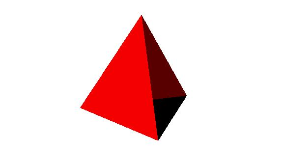

# XComponentNode

提供XComponent节点XComponentNode，表示组件树中的[XComponent组件](arkui-ts/ts-basic-components-xcomponent.md#xcomponent)，用于[EGL](../native-lib/egl.md)/[OpenGLES](../native-lib/opengles.md)和媒体数据写入，并支持动态修改节点渲染类型。

> **说明：** 从API version 12开始，该接口不再维护，推荐使用[BuilderNode](./js-apis-arkui-builderNode.md#buildernode)+[XComponent组件](arkui-ts/ts-basic-components-xcomponent.md#xcomponent)的方式实现。
>
> 本模块首批接口从API version 11开始支持。后续版本的新增接口，采用上角标单独标记接口的起始版本。
> 
> 当前不支持在预览器中使用XComponentNode。

## 导入模块

```ts
import { XComponentNode } from "@kit.ArkUI";
```

## XComponentNode

### constructor

constructor(uiContext: UIContext, options: RenderOptions, id: string, type: XComponentType, libraryName?: string)

XComponentNode的构造函数。

**系统能力：** SystemCapability.ArkUI.ArkUI.Full

**参数：**

| 参数名      | 类型                                                         | 必填 | 说明                                                         |
| ----------- | ------------------------------------------------------------ | ---- | ------------------------------------------------------------ |
| uiContext   | [UIContext](js-apis-arkui-UIContext.md)                      | 是   | UI上下文，获取方式可参考[UIContext获取方法](./js-apis-arkui-node.md#uicontext获取方法)。 |
| options     | [RenderOptions](./js-apis-arkui-builderNode.md#renderoptions) | 是   | XComponentNode的构造可选参数。                               |
| id          | string                                                       | 是   | XComponent的唯一标识，支持最大的字符串长度128。详见[XComponent组件](arkui-ts/ts-basic-components-xcomponent.md#xcomponent)。 |
| type        | [XComponentType](arkui-ts/ts-basic-components-xcomponent.md#xcomponenttype10枚举说明) | 是   | 用于指定XComponent组件类型。详见[XComponent组件](arkui-ts/ts-basic-components-xcomponent.md#xcomponent)。 |
| libraryName | string                                                       | 否   | Native层编译输出动态库名称。详见[XComponent组件](arkui-ts/ts-basic-components-xcomponent.md#xcomponent)。 |

> **说明：**
>
> 需要显式指定[RenderOptions](./js-apis-arkui-builderNode.md#renderoptions)中的selfIdealSize，否则XComponentNode内容大小为空，不显示任何内容。

### onCreate

onCreate(event?: Object): void

XComponentNode加载完成时触发该回调。

**系统能力：** SystemCapability.ArkUI.ArkUI.Full

**参数:**

| 参数名 | 类型   | 必填 | 说明                                                         |
| ------ | ------ | ---- | ------------------------------------------------------------ |
| event  | Object | 否   | 获取XComponent实例对象的context，context上挂载的方法由开发者在c++层定义。 |

### onDestroy

onDestroy(): void

XComponentNode销毁时触发该回调。

**系统能力：** SystemCapability.ArkUI.ArkUI.Full

### changeRenderType

changeRenderType(type: NodeRenderType): boolean

修改XComponentNode的渲染类型。

**系统能力：** SystemCapability.ArkUI.ArkUI.Full

**参数:**

| 参数名 | 类型                                                     | 必填 | 说明             |
| ------ | ------------------------------------------------------------ | ---- | ------------------ |
| type   | [NodeRenderType](./js-apis-arkui-builderNode.md#noderendertype) | 是 | 需要修改的渲染类型。 |

**返回值:**

| 类型 | 描述                   |
| ---- | ---------------------- |
| boolean | 修改渲染类型是否成功。 |

## 示例

```ts
import { NodeController, FrameNode, XComponentNode, NodeRenderType, UIContext} from '@kit.ArkUI'

class XComponentNodeController extends NodeController {
  private xComponentNode: MyXComponentNode | null = null;
  private soName: string = "tetrahedron_napi" // 该 so 由开发者通过 NAPI 编写并生成

  constructor() {
    super();
  }

  makeNode(context: UIContext): FrameNode | null {
    this.xComponentNode = new MyXComponentNode(context, {
      selfIdealSize: { width: 200, height: 200 }
    }, "xComponentId", XComponentType.SURFACE, this.soName);
    return this.xComponentNode;
  }

  changeRenderType(renderType: NodeRenderType): void {
    if (this.xComponentNode) {
      this.xComponentNode.changeRenderType(renderType);
    }
  }
}

class MyXComponentNode extends XComponentNode {
  onCreate(event: Object) {
    // do something when XComponentNode has created
  }

  onDestroy() {
    // do something when XComponentNode is destroying
  }
}

@Entry
@Component
struct Index {
  build() {
    Row() {
      Column() {
        NodeContainer(new XComponentNodeController())
      }
      .width('100%')
      .height('100%')
    }
    .height('100%')
  }
}
```



<!--Del-->
> **说明：**
>
> 示例中的Native层编译输出动态库参考自[OpenGL三棱椎（API10）](https://gitee.com/openharmony/applications_app_samples/tree/master/code/BasicFeature/Native/NdkOpenGL)，生成完整示例需下载该工程后将cpp目录下所有文件拷贝至本工程cpp目录下。
<!--DelEnd-->
