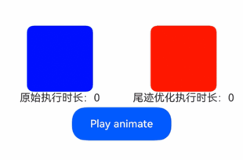

# @ohos.curves (插值计算)(系统接口)
<!--Kit: ArkUI-->
<!--Subsystem: ArkUI-->
<!--Owner: @hehongyang3-->
<!--Designer: @hehongyang3-->
<!--Tester: @lxl007-->
<!--Adviser: @Brilliantry_Rui-->

本模块提供设置动画插值曲线的系统接口功能，用于构造弹性动画曲线、弹性跟手动画曲线、插值器弹簧曲线等曲线对象。

> **说明：**
>
> 当前页面仅包含本模块的系统接口，其他公开接口参见[@ohos.curves (插值计算)](js-apis-curve.md)。

**起始版本：** 26.0.0

## 导入模块

```ts
import { curves } from '@kit.ArkUI';
```


## TrailOptimization

弹簧动画尾迹优化配置。

**系统接口：** 此接口为系统接口。

**模型约束：** 此接口仅可在Stage模型下使用。

**系统能力：** SystemCapability.ArkUI.ArkUI.Full


| 名称 | 类型 | 只读 | 可选 | 说明 |
| --- | --- | --- | --- | --- |
| progressThreshold | number | 否 | 是 | 动画进度阈值。<br/>取值范围：[0, 1]<br/>默认值：1 |
| responseDecayFactor | number | 否 | 是 | 自然振动周期衰减因子。<br/>取值范围：(0, 1]<br/>默认值：1 |


## curves.trailOptimizedSpringMotion

trailOptimizedSpringMotion(response?: number, dampingFraction?: number, overlapDuration?: number, trail?: TrailOptimization): ICurve

在[springMotion](js-apis-curve.md#curvesspringmotion9)基础上新增尾迹优化参数，构造带尾迹优化的弹性动画曲线对象。如果对同一对象的同一属性进行多个弹性动画，每个动画会替换掉前一个动画，并继承之前的速度。

**系统接口：** 此接口为系统接口。

**模型约束：** 此接口仅可在Stage模型下使用。

**系统能力：** SystemCapability.ArkUI.ArkUI.Full


**参数：**

| 参数名 | 类型 | 必填 | 说明 |
| --- | --- | --- | --- |
| response | number | 否 | 弹簧自然振动周期，决定弹簧复位的速度。<br/>默认值：0.55<br/>单位：秒<br/>取值范围：(0, +∞)<br/>**说明：** <br/>设置小于等于0的值时，按默认值0.55处理。 |
| dampingFraction | number | 否 | 阻尼系数。<br/>0表示无阻尼，一直处于震荡状态；<br/>大于0小于1的值为欠阻尼，运动过程中会超出目标值；<br/>等于1为临界阻尼；<br/>大于1为过阻尼，运动过程中逐渐趋于目标值。<br/>默认值：0.825<br/>取值范围：[0, +∞)<br/>**说明：** <br/>设置小于0的值时，按默认值0.825处理。 |
| overlapDuration | number | 否 | 弹性动画衔接时长。发生动画继承时，如果前后两个弹性动画response不一致，response参数会在overlapDuration时间内平滑过渡。<br/>默认值：0<br/>单位：秒<br/>取值范围：[0, +∞)<br/>**说明：** <br/>设置小于0的值时，按默认值0处理。<br/>弹性动画曲线为物理曲线，[animation](arkui-ts/ts-animatorproperty.md)、[animateTo](arkui-ts/ts-explicit-animation.md)、[pageTransition](arkui-ts/ts-page-transition-animation.md)中的duration参数不生效，动画持续时间取决于trailOptimizedSpringMotion动画曲线参数和之前的速度。时间不能归一，故不能通过该曲线的interpolate函数获得插值。 |
| trail | [TrailOptimization](#trailoptimization) | 否 | 尾迹优化配置。 |

**返回值：**

| 类型 | 说明 |
| --- | --- |
| [ICurve](js-apis-curve.md#icurve9) | 曲线对象。<br/>**说明：** <br/>弹性动画曲线为物理曲线，[animation](arkui-ts/ts-animatorproperty.md)、[animateTo](arkui-ts/ts-explicit-animation.md)、[pageTransition](arkui-ts/ts-page-transition-animation.md)中的duration参数不生效，动画持续时间取决于trailOptimizedSpringMotion动画曲线参数和之前的速度。时间不能归一，故不能通过该曲线的[interpolate](js-apis-curve.md#interpolate9)函数获得插值。 |


## curves.trailOptimizedResponsiveSpringMotion

trailOptimizedResponsiveSpringMotion(response?: number, dampingFraction?: number, overlapDuration?: number, trail?: TrailOptimization): ICurve

在[responsiveSpringMotion](js-apis-curve.md#curvesresponsivespringmotion9)基础上新增尾迹优化参数，构造带尾迹优化的弹性跟手动画曲线对象。

**系统接口：** 此接口为系统接口。

**模型约束：** 此接口仅可在Stage模型下使用。

**系统能力：** SystemCapability.ArkUI.ArkUI.Full


**参数：**

| 参数名 | 类型 | 必填 | 说明 |
| --- | --- | --- | --- |
| response | number | 否 | 解释同springMotion中的response。<br/>默认值：0.15<br/>单位：秒<br/>取值范围：(0, +∞)<br/>**说明：** <br/>设置小于等于0的值时，按默认值0.15处理。 |
| dampingFraction | number | 否 | 解释同springMotion中的dampingFraction。<br/>默认值：0.86<br/>取值范围：[0, +∞)<br/>**说明：** <br/>设置小于0的值时，按默认值0.86处理。 |
| overlapDuration | number | 否 | 解释同springMotion中的overlapDuration。<br/>默认值：0.25<br/>单位：秒<br/>取值范围：[0, +∞)<br/>**说明：** <br/>设置小于0的值时，按默认值0.25处理。<br/>弹性跟手动画曲线为springMotion的一种特例，仅默认值不同。如果使用自定义参数的弹性曲线，推荐使用springMotion构造曲线。如果使用跟手动画，推荐使用默认参数的弹性跟手动画曲线。<br/>[animation](arkui-ts/ts-animatorproperty.md)、[animateTo](arkui-ts/ts-explicit-animation.md)、[pageTransition](arkui-ts/ts-page-transition-animation.md)中的duration参数不生效，动画持续时间取决于trailOptimizedResponsiveSpringMotion动画曲线参数和之前的速度，也不能通过该曲线的interpolate函数获得插值。 |
| trail | [TrailOptimization](#trailoptimization) | 否 | 尾迹优化配置。 |

**返回值：**

| 类型 | 说明 |
| --- | --- |
| [ICurve](js-apis-curve.md#icurve9) | 曲线对象。<br/>**说明：** <br/>1. 弹性跟手动画曲线为springMotion的一种特例，仅默认值不同。如果使用自定义参数的弹性曲线，推荐使用springMotion构造曲线；如果使用跟手动画，推荐使用默认参数的弹性跟手动画曲线。<br/>2. [animation](arkui-ts/ts-animatorproperty.md)、[animateTo](arkui-ts/ts-explicit-animation.md)、[pageTransition](arkui-ts/ts-page-transition-animation.md)中的duration参数不生效，动画持续时间取决于trailOptimizedResponsiveSpringMotion动画曲线参数和之前的速度，也不能通过该曲线的[interpolate](js-apis-curve.md#interpolate9)函数获得插值。 |


## curves.trailOptimizedInterpolatingSpring

trailOptimizedInterpolatingSpring(velocity: number, mass: number, stiffness: number, damping: number, trail?: TrailOptimization): ICurve

在[interpolatingSpring](js-apis-curve.md#curvesinterpolatingspring10)基础上新增尾迹优化参数，构造带尾迹优化的插值器弹簧曲线对象，生成一条从0到1的动画曲线，实际动画值根据曲线进行插值计算。动画时间由曲线参数决定，不受动画参数中的时长参数控制。

**系统接口：** 此接口为系统接口。

**模型约束：** 此接口仅可在Stage模型下使用。

**系统能力：** SystemCapability.ArkUI.ArkUI.Full


**参数：**

| 参数名 | 类型 | 必填 | 说明 |
| --- | --- | --- | --- |
| velocity | number | 是 | 初始速度。外部因素对弹性动效产生的影响参数，目的是保证对象从之前的运动状态平滑地过渡到弹性动效。该速度是归一化速度，其值等于动画开始时的实际速度除以动画属性改变值。<br/>取值范围：(-∞, +∞) |
| mass | number | 是 | 质量。弹性系统的受力对象，会对弹性系统产生惯性影响。质量越大，震荡的幅度越大，恢复到平衡位置的速度越慢。<br/>取值范围：(0, +∞)<br/>**说明：** <br/>设置的值小于等于0时，按1处理。 |
| stiffness | number | 是 | 刚度。表示物体抵抗施加的力而形变的程度。刚度越大，抵抗变形的能力越强，恢复到平衡位置的速度越快。<br/>取值范围：(0, +∞)<br/>**说明：** <br/>设置的值小于等于0时，按1处理。 |
| damping | number | 是 | 阻尼。用于描述系统在受到扰动后震荡及衰减的情形。阻尼越大，弹性运动的震荡次数越少、震荡幅度越小。<br/>取值范围：(0, +∞)<br/>**说明：** <br/>设置的值小于等于0时，按1处理。 |
| trail | [TrailOptimization](#trailoptimization) | 否 | 尾迹优化配置。 |

**返回值：**

| 类型 | 说明 |
| --- | --- |
| [ICurve](js-apis-curve.md#icurve9) | 曲线对象。<br/>**说明：** 弹性动画曲线为物理曲线，[animation](arkui-ts/ts-animatorproperty.md)、[animateTo](arkui-ts/ts-explicit-animation.md)、[pageTransition](arkui-ts/ts-page-transition-animation.md)等动画参数中的duration参数不生效，动画持续时间取决于trailOptimizedInterpolatingSpring动画曲线参数。时间不能归一，故不能通过该曲线的[interpolate](js-apis-curve.md#interpolate9)函数获得插值。 |

## 示例

### 示例1（带尾迹优化的弹簧曲线）

该示例通过对比[interpolatingSpring](js-apis-curve.md#curvesinterpolatingspring10)和[trailOptimizedInterpolatingSpring](#curvestrailoptimizedinterpolatingspring)的动画执行时长，展示尾迹优化对弹簧动画的加速效果。

```ts
import { curves } from '@kit.ArkUI';

@Entry
@Component
struct Index {
  @State widthSize: number = 150;
  @State heightSize: number = 50;
  @State myAnimateTimeOrigin: number = 0;
  @State myAnimateTimeOptimized: number = 0;
  @State myAngleOrigin: number = 0;
  @State myAngleOptimized: number = 0;

  build() {
    Column() {
      Row() {
        Column() {
          Column()
            .height(100)
            .width(100)
            .borderRadius(10)
            .backgroundColor(Color.Blue)
            .rotate({
              x: 0,
              y: 0,
              z: 1,
              angle: this.myAngleOrigin
            })
          // 每次动画执行时长实际会有波动
          Text('原始执行时长：' + this.myAnimateTimeOrigin)
        }
        .width('50%')

        Column() {
          Column()
            .height(100)
            .width(100)
            .borderRadius(10)
            .backgroundColor(Color.Red)
            .rotate({
              x: 0,
              y: 0,
              z: 1,
              angle: this.myAngleOptimized
            })
          // 每次动画执行时长实际会有波动
          Text('尾迹优化执行时长：' + this.myAnimateTimeOptimized)
        }
        .width('50%')
      }
      .justifyContent(FlexAlign.Center)

      Button('Play animate')
        .width(this.widthSize)
        .height(this.heightSize)
        .margin(5)
        .onClick(() => {
          const startTime = Date.now();

          this.getUIContext()?.animateTo({
            duration: 2000,
            curve: curves.interpolatingSpring(0.85, 0.1, 7, 1.0),
            iterations: 1,
            playMode: PlayMode.Normal,
            onFinish: () => {
              const endTime = Date.now();
              this.myAnimateTimeOrigin = endTime - startTime;
            }
          }, () => {
            this.myAngleOrigin = 360;
          })

          this.getUIContext()?.animateTo({
            duration: 2000,
            curve: curves.trailOptimizedInterpolatingSpring(0.85, 0.1, 7, 1.0,
              { progressThreshold: 0.98, responseDecayFactor: 0.9 }),
            iterations: 1,
            playMode: PlayMode.Normal,
            onFinish: () => {
              const endTime = Date.now();
              this.myAnimateTimeOptimized = endTime - startTime;
            }
          }, () => {
            this.myAngleOptimized = 360;
          })
        })
    }
    .justifyContent(FlexAlign.Center)
    .width('100%')
    .height('100%')
  }
}
```


