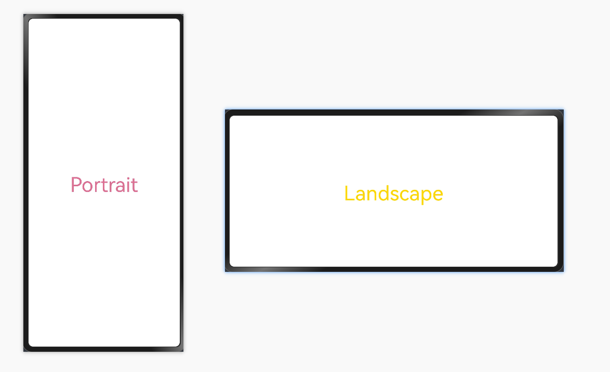

# @ohos.mediaquery (媒体查询)
<!--Kit: ArkUI-->
<!--Subsystem: ArkUI-->
<!--Owner: @zju_ljz-->
<!--Designer: @lanshouren-->
<!--Tester: @liuli0427-->
<!--Adviser: @HelloCrease-->

提供根据不同媒体类型定义不同的样式。

> **说明：**
>
> 从API version 7开始支持。后续版本如有新增内容，则采用上角标单独标记该内容的起始版本。
>
> 该模块不支持在[UIAbility](../apis-ability-kit/js-apis-app-ability-uiAbility.md)的文件声明处使用，即不能在UIAbility的生命周期中调用，需要在创建组件实例后使用。
>
> 本模块功能依赖UI的执行上下文，不可在[UI上下文不明确](../../ui/arkts-global-interface.md#ui上下文不明确)的地方使用，参见[UIContext](arkts-apis-uicontext-uicontext.md)说明。


## 导入模块

```ts
import { mediaquery } from '@kit.ArkUI';
```


## mediaquery.matchMediaSync<sup>(deprecated)</sup>

matchMediaSync(condition: string): MediaQueryListener

设置媒体查询的查询条件，并返回对应的监听句柄。

> **说明：** 
>
> 从API version 18开始废弃，建议使用[UIContext](arkts-apis-uicontext-uicontext.md)中的[getMediaQuery](arkts-apis-uicontext-uicontext.md#getmediaquery)获取[MediaQuery](arkts-apis-uicontext-mediaquery.md)对象，再通过此对象调用替代方法[matchMediaSync](arkts-apis-uicontext-mediaquery.md#matchmediasync)。
>
> 从API version 10开始，可以通过使用[UIContext](arkts-apis-uicontext-uicontext.md)中的[getMediaQuery](arkts-apis-uicontext-uicontext.md#getmediaquery)方法获取当前UI上下文关联的[MediaQuery](arkts-apis-uicontext-mediaquery.md)对象。

**卡片能力：** 从API version 12开始，该接口支持在ArkTS卡片中使用。

**原子化服务API：** 从API version 11开始，该接口支持在原子化服务中使用。

**系统能力：** SystemCapability.ArkUI.ArkUI.Full

**参数：** 

| 参数名    | 类型   | 必填 | 说明                                                         |
| --------- | ------ | ---- | ------------------------------------------------------------ |
| condition | string | 是   | 媒体事件的匹配条件，具体可参考[媒体查询语法规则](../../ui/arkts-layout-development-media-query.md#语法规则)。 |

**返回值：** 

| 类型               | 说明                                         |
| ------------------ | -------------------------------------------- |
| [MediaQueryListener](#mediaquerylistener) | 媒体事件监听句柄，用于注册和去注册监听回调。 |

**示例：** 

```ts
import { mediaquery } from '@kit.ArkUI';

let listener: mediaquery.MediaQueryListener = mediaquery.matchMediaSync('(orientation: landscape)'); //监听横屏事件
```


## MediaQueryListener

媒体查询的句柄，并包含了申请句柄时的首次查询结果。媒体查询根据设置的条件语句，比如'(width <= 600vp)'，比较系统信息，若首次查询时相关信息未初始化，matches返回false。

继承自[MediaQueryResult](#mediaqueryresult)。

**卡片能力：** 从API version 12开始，该类型支持在ArkTS卡片中使用。

**原子化服务API：** 从API version 11开始，该接口支持在原子化服务中使用。

**系统能力：** SystemCapability.ArkUI.ArkUI.Full


### on('change')

on(type: 'change', callback: Callback&lt;MediaQueryResult&gt;): void

通过句柄向对应的查询条件注册回调，当媒体属性发生变更时会触发该回调。

> **说明：** 
>
> 注册的回调中不允许进一步调用on或off。

**卡片能力：** 从API version 12开始，该接口支持在ArkTS卡片中使用。

**原子化服务API：** 从API version 11开始，该接口支持在原子化服务中使用。

**系统能力：** SystemCapability.ArkUI.ArkUI.Full

**参数：** 

| 参数名   | 类型                                                  | 必填 | 说明                     |
| -------- | ----------------------------------------------------- | ---- | ------------------------ |
| type     | string                                                | 是   | 必须填写字符串'change'。 |
| callback | Callback&lt;[MediaQueryResult](#mediaqueryresult)&gt; | 是   | 向媒体查询注册的回调。     |

**示例：** 

  详见[off示例](#offchange)。


### off('change')

off(type: 'change', callback?: Callback&lt;MediaQueryResult&gt;): void

通过句柄向对应的查询条件取消注册回调，当媒体属性发生变更时不再触发指定的回调。

**卡片能力：** 从API version 12开始，该接口支持在ArkTS卡片中使用。

**原子化服务API：** 从API version 11开始，该接口支持在原子化服务中使用。

**系统能力：** SystemCapability.ArkUI.ArkUI.Full

**参数：** 

| 参数名   | 类型                             | 必填 | 说明                                                       |
| -------- | -------------------------------- | ---- | ---------------------------------------------------------- |
| type     | string                           | 是   | 必须填写字符串'change'。                                   |
| callback | Callback&lt;[MediaQueryResult](#mediaqueryresult)&gt; | 否   | 需要去注册的回调，如果参数缺省则去注册该句柄下所有的回调。 |

**示例：** 

<!--code_no_check-->
<!--deprecated_code_no_check-->
```ts
import { mediaquery } from '@kit.ArkUI';

let listener: mediaquery.MediaQueryListener = mediaquery.matchMediaSync('(orientation: landscape)'); //监听横屏事件
function onPortrait(mediaQueryResult:mediaquery.MediaQueryResult) {
  if (mediaQueryResult.matches) {
    // do something here
  } else {
    // do something here
  }
}
listener.on('change', onPortrait) // 注册回调
listener.off('change', onPortrait) // 去取消注册回调
  ```

## MediaQueryResult

用于执行媒体查询操作。

**卡片能力：** 从API version 12开始，该类型支持在ArkTS卡片中使用。

**原子化服务API：** 从API version 11开始，该接口支持在原子化服务中使用。

**系统能力：** SystemCapability.ArkUI.ArkUI.Full


### 属性

| 名称    | 类型    | 可读 | 可写 | 说明                 |
| ------- | ------- | ---- | ---- | -------------------- |
| matches | boolean | 是   | 否   | 是否符合匹配条件。true表示满足查询条件，false表示不满足查询条件。  |
| media   | string  | 是   | 否   | 媒体事件的匹配条件。 |


### 示例

> **说明：**
>
> 推荐通过使用[UIContext](arkts-apis-uicontext-uicontext.md)中的[getMediaQuery](arkts-apis-uicontext-uicontext.md#getmediaquery)方法获取当前UI上下文关联的[MediaQuery](arkts-apis-uicontext-mediaquery.md)对象。

<!--code_no_check-->
<!--deprecated_code_no_check-->
```ts
import { mediaquery } from '@kit.ArkUI';

@Entry
@Component
struct MediaQueryExample {
  @State color: string = '#DB7093'
  @State text: string = 'Portrait'
  listener: mediaquery.MediaQueryListener = this.getUIContext().getMediaQuery().matchMediaSync('(orientation: landscape)'); //监听横屏事件，mediaquery.matchMediaSync接口已废弃，建议使用this.getUIContext().getMediaQuery().matchMediaSync()来获取

  onPortrait(mediaQueryResult:mediaquery.MediaQueryResult) {
    if (mediaQueryResult.matches) {
      this.color = '#FFD700'
      this.text = 'Landscape'
    } else {
      this.color = '#DB7093'
      this.text = 'Portrait'
    }
  }

  aboutToAppear() {
    let portraitFunc = (mediaQueryResult: mediaquery.MediaQueryResult): void => this.onPortrait(mediaQueryResult)
    // 绑定回调函数
    this.listener.on('change', portraitFunc);
  }

  aboutToDisappear() {
    // 解绑listener中注册的回调函数
    this.listener.off('change');
  }

  build() {
    Flex({ direction: FlexDirection.Column, alignItems: ItemAlign.Center, justifyContent: FlexAlign.Center }) {
      Text(this.text).fontSize(24).fontColor(this.color)
    }
    .width('100%').height('100%')
  }
}
```
