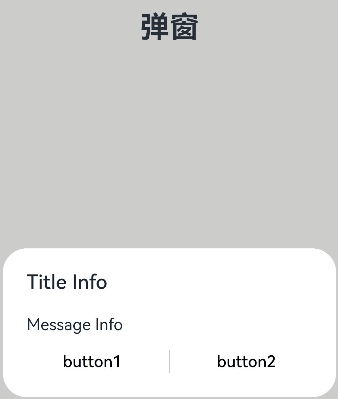

# @ohos.prompt (弹窗)
<!--Kit: ArkUI-->
<!--Subsystem: ArkUI-->
<!--Owner: @houguobiao-->
<!--Designer: @houguobiao-->
<!--Tester: @lxl007-->
<!--Adviser: @HelloCrease-->

创建并显示文本提示框、对话框和操作菜单。

> **说明：**
> 从API Version 9 开始，该接口不再维护，推荐使用新接口[@ohos.promptAction (弹窗)](js-apis-promptAction.md)。
> 
> 本模块首批接口从API version 8开始支持。后续版本的新增接口，采用上角标单独标记接口的起始版本。

## 导入模块

```ts
import prompt from '@ohos.prompt'
```

## prompt.showToast

showToast(options: ShowToastOptions): void

创建并显示文本提示框。

**系统能力：** SystemCapability.ArkUI.ArkUI.Full

**参数：**

| 参数名     | 类型                                    | 必填   | 说明      |
| ------- | ------------------------------------- | ---- | ------- |
| options | [ShowToastOptions](#showtoastoptions) | 是    | 文本弹窗选项。 |

**示例：**

```ts
import prompt from '@ohos.prompt'
prompt.showToast({
  message: 'Message Info',
    duration: 2000
});
```


## ShowToastOptions

文本提示框的选项。

**系统能力：**  SystemCapability.ArkUI.ArkUI.Full。

| 名称     | 类型            | 必填 | 说明                                                         |
| -------- | --------------- | ---- | ------------------------------------------------------------ |
| message  | string          | 是   | 显示的文本信息。                                             |
| duration | number          | 否   | 默认值1500ms，取值区间：1500ms-10000ms。若小于1500ms则取默认值，若大于10000ms则取上限值10000ms。 |
| bottom   | string\| number | 否   | 设置弹窗边框距离屏幕底部的位置，无上限值，默认单位vp。       |

## prompt.showDialog

showDialog(options: ShowDialogOptions): Promise&lt;ShowDialogSuccessResponse&gt;

创建并显示对话框，对话框响应后同步返回结果。

**系统能力：**  SystemCapability.ArkUI.ArkUI.Full

**参数：**

| 参数名     | 类型                                      | 必填   | 说明     |
| ------- | --------------------------------------- | ---- | ------ |
| options | [ShowDialogOptions](#showdialogoptions) | 是    | 对话框选项。 |

**返回值：**

| 类型                                       | 说明       |
| ---------------------------------------- | -------- |
| Promise&lt;[ShowDialogSuccessResponse](#showdialogsuccessresponse)&gt; | 对话框响应结果。 |

**示例：**

```ts
import prompt from '@ohos.prompt'
prompt.showDialog({
  title: 'Title Info',
  message: 'Message Info',
  buttons: [
    {
      text: 'button1',
      color: '#000000'
    },
    {
      text: 'button2',
      color: '#000000'
    }
  ],
})
  .then(data => {
    console.info('showDialog success, click button: ' + data.index);
  })
  .catch((err:Error) => {
    console.info('showDialog error: ' + err);
  })
```



## prompt.showDialog

showDialog(options: ShowDialogOptions, callback: AsyncCallback&lt;ShowDialogSuccessResponse&gt;):void 

创建并显示对话框，对话框响应结果异步返回。

**系统能力：**  SystemCapability.ArkUI.ArkUI.Full

**参数：**

| 参数名      | 类型                                       | 必填   | 说明           |
| -------- | ---------------------------------------- | ---- | ------------ |
| options  | [ShowDialogOptions](#showdialogoptions)  | 是    | 页面显示对话框信息描述。 |
| callback | AsyncCallback&lt;[ShowDialogSuccessResponse](#showdialogsuccessresponse)&gt; | 是    | 对话框响应结果回调。   |

**示例：**

```ts
import prompt from '@ohos.prompt'
prompt.showDialog({
  title: 'showDialog Title Info',
  message: 'Message Info',
  buttons: [
    {
      text: 'button1',
      color: '#000000'
    },
    {
      text: 'button2',
      color: '#000000'
    }
  ]
}, (err, data) => {
  if (err) {
    console.info('showDialog err: ' + err);
    return;
  }
  console.info('showDialog success callback, click button: ' + data.index);
});
```


## ShowDialogOptions

对话框的选项。

**系统能力：** SystemCapability.ArkUI.ArkUI.Full

| 名称    | 类型                                                      | 必填 | 说明                                                         |
| ------- | --------------------------------------------------------- | ---- | ------------------------------------------------------------ |
| title   | string                                                    | 否   | 标题文本。                                                   |
| message | string                                                    | 否   | 内容文本。                                                   |
| buttons | [[Button](#button),[Button](#button)?,[Button](#button)?] | 否   | 对话框中按钮的数组，结构为：{text:'button',&nbsp;color:&nbsp;'\#666666'}，支持1-3个按钮。其中第一个为positiveButton，第二个为negativeButton，第三个为neutralButton。 |

## ShowDialogSuccessResponse 

对话框的响应结果。

**系统能力：**  SystemCapability.ArkUI.ArkUI.Full

| 名称  | 类型   | 必填 | 说明                            |
| ----- | ------ | ---- | ------------------------------- |
| index | number | 是   | 选中按钮在buttons数组中的索引。 |


## prompt.showActionMenu

showActionMenu(options: ActionMenuOptions, callback: AsyncCallback&lt;ActionMenuSuccessResponse&gt;):void

创建并显示操作菜单，菜单响应结果异步返回。

**系统能力：** 以下各项对应的系统能力均为SystemCapability.ArkUI.ArkUI.Full。

**参数：**

| 参数名      | 类型                                       | 必填   | 说明        |
| -------- | ---------------------------------------- | ---- | --------- |
| options  | [ActionMenuOptions](#actionmenuoptions)  | 是    | 操作菜单选项。   |
| callback | AsyncCallback&lt;[ActionMenuSuccessResponse](#actionmenusuccessresponse)> | 是    | 菜单响应结果回调。 |

**示例：**

```ts
import prompt from '@ohos.prompt'
prompt.showActionMenu({
  title: 'Title Info',
  buttons: [
    {
      text: 'item1',
      color: '#666666'
    },
    {
      text: 'item2',
      color: '#000000'
    },
  ]
}, (err, data) => {
  if (err) {
    console.info('showActionMenu err: ' + err);
    return;
  }
  console.info('showActionMenu success callback, click button: ' + data.index);
})
```


## prompt.showActionMenu

showActionMenu(options: ActionMenuOptions): Promise&lt;ActionMenuSuccessResponse&gt;

创建并显示操作菜单，菜单响应后同步返回结果。

**系统能力：** SystemCapability.ArkUI.ArkUI.Full

**参数：**

| 参数名     | 类型                                      | 必填   | 说明      |
| ------- | --------------------------------------- | ---- | ------- |
| options | [ActionMenuOptions](#actionmenuoptions) | 是    | 操作菜单选项。 |

**返回值：**

| 类型                                       | 说明      |
| ---------------------------------------- | ------- |
| Promise&lt;[ActionMenuSuccessResponse](#actionmenusuccessresponse)&gt; | 菜单响应结果。 |

**示例：**

```ts
import prompt from '@ohos.prompt'
prompt.showActionMenu({
  title: 'showActionMenu Title Info',
  buttons: [
    {
      text: 'item1',
      color: '#666666'
    },
    {
      text: 'item2',
      color: '#000000'
    },
  ]
})
  .then(data => {
    console.info('showActionMenu success, click button: ' + data.index);
  })
  .catch((err:Error) => {
    console.info('showActionMenu error: ' + err);
  })
```


## ActionMenuOptions

操作菜单的选项。

**系统能力：** SystemCapability.ArkUI.ArkUI.Full。

| 名称    | 类型                                                         | 必填 | 说明                                                         |
| ------- | ------------------------------------------------------------ | ---- | ------------------------------------------------------------ |
| title   | string                                                       | 否   | 标题文本。                                                   |
| buttons | [[Button](#button),[Button](#button)?,[Button](#button)?,[Button](#button)?,[Button](#button)?,[Button](#button)?] | 是   | 菜单中菜单项按钮的数组，结构为：{text:'button',&nbsp;color:&nbsp;'\#666666'}，支持1-6个按钮。大于6个按钮时弹窗不显示。 |

## ActionMenuSuccessResponse

操作菜单的响应结果。

**系统能力：** SystemCapability.ArkUI.ArkUI.Full

| 名称  | 类型   | 必填 | 说明                                     |
| ----- | ------ | ---- | ---------------------------------------- |
| index | number | 是   | 选中按钮在buttons数组中的索引，从0开始。 |

## Button

菜单中的菜单项按钮。

**系统能力：** SystemCapability.ArkUI.ArkUI.Full

| 名称  | 类型   | 必填 | 说明           |
| ----- | ------ | ---- | -------------- |
| text  | string | 是   | 按钮文本内容。 |
| color | string | 是   | 按钮文本颜色。 |

