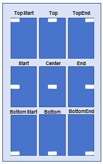
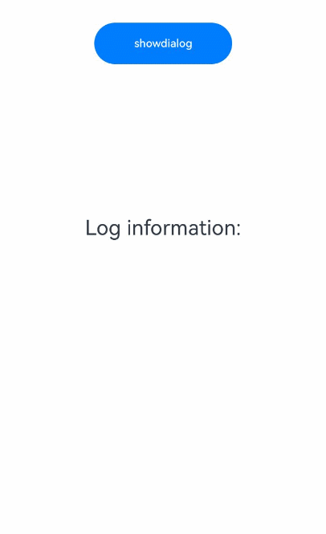
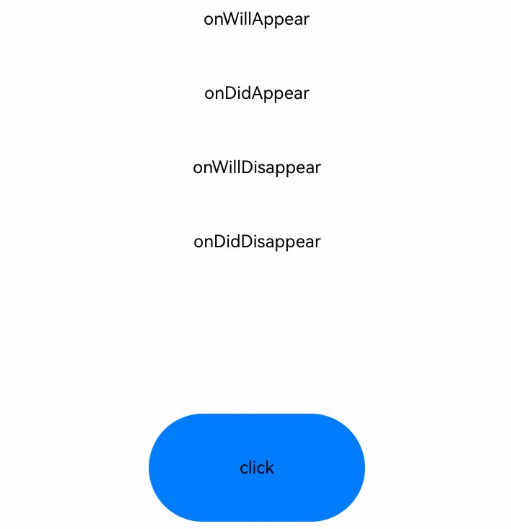

# @ohos.promptAction (弹窗)
<!--Kit: ArkUI-->
<!--Subsystem: ArkUI-->
<!--Owner: @houguobiao-->
<!--Designer: @houguobiao-->
<!--Tester: @lxl007-->
<!--Adviser: @HelloCrease-->

创建并显示即时反馈、对话框和操作菜单。

> **说明：**
>
> - 本模块首批接口从API version 9开始支持。后续版本的新增接口，采用上角标单独标记接口的起始版本。
>
> - 本模块不支持在[UIAbility](../apis-ability-kit/js-apis-app-ability-uiAbility.md)的文件声明处使用，即不能在UIAbility的生命周期中调用，需要在创建组件实例后使用。
>
> - 本模块功能依赖UI的执行上下文，不可在[UI上下文不明确](../../ui/arkts-global-interface.md#ui上下文不明确)的地方使用，参见[UIContext](arkts-apis-uicontext-uicontext.md)说明。建议<!--Del-->在除[ServiceExtensionAbility](../../application-models/serviceextensionability.md)等无UI界面的场景外，均<!--DelEnd-->使用UIContext中的弹窗方法。

## 导入模块

```ts
import { promptAction } from '@kit.ArkUI';
```

## promptAction.openToast<sup>18+</sup>

openToast(options: ShowToastOptions): Promise&lt;number&gt;

显示即时反馈并通过Promise返回其id。

> **说明：**
> 
> - 不支持在输入法类型窗口中使用子窗（showMode设置为TOP_MOST或者SYSTEM_TOP_MOST）的openToast，详情见输入法框架的约束与限制说明[createPanel](../apis-ime-kit/js-apis-inputmethodengine.md#createpanel10-1)。
>
> - 直接使用openToast可能导致[UI上下文不明确](../../ui/arkts-global-interface.md#ui上下文不明确)的问题，建议使用UIContext中的getPromptAction方法获取到PromptAction对象，再通过该对象调用[openToast](arkts-apis-uicontext-promptaction.md#opentoast18)实现。

**原子化服务API：** 从API version 18开始，该接口支持在原子化服务中使用。

**系统能力：** SystemCapability.ArkUI.ArkUI.Full

**参数**

| 参数名  | 类型                                                         | 必填 | 说明           |
| ------- | ------------------------------------------------------------ | ---- | -------------- |
| options | [ShowToastOptions](#showtoastoptions) | 是   | Toast选项。 |

**返回值**

| 类型             | 说明                                 |
| ---------------- | ------------------------------------ |
| Promise&lt;number&gt; | 返回即时反馈的id，可供closeToast使用。 |

**错误码：**

以下错误码的详细介绍请参见[通用错误码](../errorcode-universal.md)和[ohos.promptAction(弹窗)](errorcode-promptAction.md)错误码。

| 错误码ID | 错误信息                                                     |
| -------- | ------------------------------------------------------------ |
| 401      | Parameter error. Possible causes: 1. Mandatory parameters are left unspecified; 2.Incorrect parameters types; 3. Parameter verification failed. |
| 100001   | Internal error.                                              |

**示例：**

```ts
import { BusinessError } from '@kit.BasicServicesKit';
import { PromptAction, UIContext } from '@kit.ArkUI';

@Entry
@Component
struct toastExample {
  @State toastId: number = 0;
  uiContext: UIContext = this.getUIContext();
  promptAction: PromptAction = this.uiContext.getPromptAction();

  build() {
    Column() {
      Button('Open Toast')
        .height(100)
        .type(ButtonType.Capsule)
        .onClick(() => {
          this.promptAction.openToast({
            message: 'Toast Message',
            duration: 10000,
          }).then((toastId: number) => {
            this.toastId = toastId;
          })
            .catch((error: BusinessError) => {
              console.error(`openToast error code is ${error.code}, message is ${error.message}`);
            })
        })
      Blank().height(50)
      Button('Close Toast')
        .height(100)
        .type(ButtonType.Capsule)
        .onClick(() => {
          try {
            this.promptAction.closeToast(this.toastId);
          } catch (error) {
            let message = (error as BusinessError).message;
            let code = (error as BusinessError).code;
            console.error(`CloseToast error code is ${code}, message is ${message}`);
          }
        })
    }.height('100%').width('100%').justifyContent(FlexAlign.Center)
  }
}
```


## promptAction.closeToast<sup>18+</sup>

closeToast(toastId: number): void

关闭即时反馈。

> **说明：**
> 
> 直接使用closeToast可能导致[UI上下文不明确](../../ui/arkts-global-interface.md#ui上下文不明确)的问题，建议使用UIContext中的getPromptAction方法获取到PromptAction对象，再通过该对象调用[openToast](arkts-apis-uicontext-promptaction.md#closetoast18)实现。

**原子化服务API：** 从API version 18开始，该接口支持在原子化服务中使用。

**系统能力：** SystemCapability.ArkUI.ArkUI.Full

**参数**

| 参数名  | 类型   | 必填 | 说明                          |
| ------- | ------ | ---- | ----------------------------- |
| toastId | number | 是   | openToast返回的id。 |

**错误码：**

以下错误码的详细介绍请参见[通用错误码](../errorcode-universal.md)和[ohos.promptAction(弹窗)](errorcode-promptAction.md)错误码。

| 错误码ID | 错误信息                                                     |
| -------- | ------------------------------------------------------------ |
| 401      | Parameter error. Possible causes: 1. Mandatory parameters are left unspecified; 2.Incorrect parameters types; 3. Parameter verification failed. |
| 100001   | Internal error.                                              |
| 103401   | Cannot find the toast.                                       |

**示例：**

示例请看[promptAction.openToast18](#promptactionopentoast18)的示例。

## ShowToastOptions

Toast的选项。

**系统能力：**  SystemCapability.ArkUI.ArkUI.Full

| 名称                    | 类型                                                         | 只读 | 可选 | 说明                                                         |
| ----------------------- | ------------------------------------------------------------ | ---- | ------------------------------------------------------------ | ------------------------------------------------------------ |
| message                 | string&nbsp;\|&nbsp;[Resource](arkui-ts/ts-types.md#resource) | 否  | 否  | 显示的文本信息。<br>**说明：** <br/>默认字体为'Harmony Sans'，不支持设置其他字体。<br/>**原子化服务API：** 从API version 11开始，该接口支持在原子化服务中使用。 |
| duration                | number                                                       | 否   | 是  | 设置Toast弹出的持续时间。<br/>默认值：1500ms<br/>取值范围：[1500, 10000]<br/>若小于1500ms则取默认值，若大于10000ms则取上限值10000ms。<br/>**原子化服务API：** 从API version 11开始，该接口支持在原子化服务中使用。 |
| bottom                  | string&nbsp;\|&nbsp;number                                   | 否   | 是  | 设置Toast底部边框距离导航条的高度，软键盘拉起时，如果bottom值过小，toast要被软键盘遮挡时，会自动避让至距离软键盘80vp处。<br/>默认值：80vp<br/>**说明：** <br/>当底部没有导航条时，bottom为设置弹窗底部边框距离窗口底部的高度。<br/>设置对齐方式alignment后，bottom不生效。<br/>**原子化服务API：** 从API version 11开始，该接口支持在原子化服务中使用。 |
| showMode<sup>11+</sup>  | [ToastShowMode](#toastshowmode11)                            | 否   | 是  | 设置Toast层级。<br>默认值：ToastShowMode.DEFAULT，默认显示在应用内。<br/>**原子化服务API：** 从API version 12开始，该接口支持在原子化服务中使用。 |
| alignment<sup>12+</sup> | [Alignment](arkui-ts/ts-appendix-enums.md#alignment)         | 否   | 是  | 对齐方式。<br>**说明：** <br/>不同alignment下，Toast位置对齐效果，如下图所示。<br/><br/>Toast的文本显示默认自左向右，不支持其他对齐方式。<br/>默认值：undefined，默认底部偏上位置。<br/>**原子化服务API：** 从API version 12开始，该接口支持在原子化服务中使用。         |
| offset<sup>12+</sup>    | [Offset](arkui-ts/ts-types.md#offset)                        | 否   | 是  | 在对齐方式上的偏移。<br/>默认值：{ dx: 0, dy: 0 }，默认没有偏移。<br/>**说明：** <br/>仅支持设置px类型的数值。如需设置其他类型的数值，应将其他类型转换为px类型后传入。例如，若需设置vp，应将其转换为px后传入。<br/>**原子化服务API：** 从API version 12开始，该接口支持在原子化服务中使用。 |
| backgroundColor<sup>12+</sup>    | [ResourceColor](arkui-ts/ts-types.md#resourcecolor) | 否   | 是  | Toast的背板颜色。<br/>默认值：Color.Transparent<br/>**说明：** <br/>backgroundColor会与模糊属性backgroundBlurStyle叠加产生效果，如果不符合预期，可将backgroundBlurStyle设置为BlurStyle.NONE，即可取消模糊。<br/>**原子化服务API：** 从API version 12开始，该接口支持在原子化服务中使用。 |
| textColor<sup>12+</sup>    | [ResourceColor](arkui-ts/ts-types.md#resourcecolor) | 否   | 是  | Toast的文本颜色。<br/>默认值：Color.Black<br/>**原子化服务API：** 从API version 12开始，该接口支持在原子化服务中使用。 |
| backgroundBlurStyle<sup>12+</sup>    | [BlurStyle](arkui-ts/ts-universal-attributes-background.md#blurstyle9) | 否   | 是  | Toast的背板模糊材质。<br/>默认值：BlurStyle.COMPONENT_ULTRA_THICK<br/>**说明：** <br/>设置为BlurStyle.NONE即可关闭背景虚化。当设置了backgroundBlurStyle为非NONE值时，则不要设置backgroundColor，否则颜色显示将不符合预期效果。<br/>**原子化服务API：** 从API version 12开始，该接口支持在原子化服务中使用。 |
| shadow<sup>12+</sup>    | [ShadowOptions](arkui-ts/ts-universal-attributes-image-effect.md#shadowoptions对象说明)&nbsp;\|&nbsp;[ShadowStyle](arkui-ts/ts-universal-attributes-image-effect.md#shadowstyle10枚举说明) | 否   | 是  | Toast的背板阴影。<br/>默认值：ShadowStyle.OUTER_DEFAULT_MD<br/>**原子化服务API：** 从API version 12开始，该接口支持在原子化服务中使用。 |
| enableHoverMode<sup>14+</sup>    | boolean                       | 否   | 是  | 是否响应悬停态，值为true时，响应悬停态。<br/>默认值：false，默认不响应。<br/>**原子化服务API：** 从API version 14开始，该接口支持在原子化服务中使用。 |
| hoverModeArea<sup>14+</sup> | [HoverModeAreaType](arkui-ts/ts-universal-attributes-sheet-transition.md#hovermodeareatype14)         | 否   | 是  | 响应悬停态时，弹窗的显示区域。<br/>默认值：HoverModeAreaType.BOTTOM_SCREEN，默认显示在下半屏。<br/>**原子化服务API：** 从API version 14开始，该接口支持在原子化服务中使用。         |

## ToastShowMode<sup>11+</sup>

设置Toast的显示模式，默认显示在应用内，支持显示在子窗。

**原子化服务API：** 从API version 12开始，该接口支持在原子化服务中使用。

**系统能力：**  SystemCapability.ArkUI.ArkUI.Full

| 名称     | 值   | 说明                   |
| -------- | ---- | ---------------------- |
| DEFAULT  | 0    | Toast显示在应用内。   |
| TOP_MOST | 1    | Toast显示在子窗。 |

## ShowDialogOptions

对话框的选项。

**系统能力：** SystemCapability.ArkUI.ArkUI.Full

| 名称                              | 类型                                                         | 只读 | 可选 | 说明                                                         |
| --------------------------------- | ------------------------------------------------------------ | ---- | ------------------------------------------------------------ | ------------------------------------------------------------ |
| title                             | string&nbsp;\|&nbsp;[Resource](arkui-ts/ts-types.md#resource) | 否   | 是  | 标题文本。<br/>**原子化服务API：** 从API version 11开始，该接口支持在原子化服务中使用。 |
| message                           | string&nbsp;\|&nbsp;[Resource](arkui-ts/ts-types.md#resource) | 否   | 是  | 内容文本。<br/>**原子化服务API：** 从API version 11开始，该接口支持在原子化服务中使用。 |
| buttons                           | Array&lt;[Button](#button)&gt;                               | 否   | 是  | 对话框中按钮的数组，结构为：{text:'button',&nbsp;color:&nbsp;'\#666666'}，支持大于1个按钮。<br/>**原子化服务API：** 从API version 11开始，该接口支持在原子化服务中使用。 |
| alignment<sup>10+</sup>           | [DialogAlignment](arkui-ts/ts-methods-alert-dialog-box.md#dialogalignment枚举说明) | 否   | 是  | 对话框在竖直方向上的对齐方式。<br/>默认值：DialogAlignment.Default<br/>**说明：**<br/>若在UIExtension中设置showInSubWindow为true, 弹窗将基于UIExtension的宿主窗口对齐。<br/>**原子化服务API：** 从API version 11开始，该接口支持在原子化服务中使用。 |
| offset<sup>10+</sup>              | [Offset](arkui-ts/ts-types.md#offset)                        | 否   | 是  | 对话框相对alignment所在位置的偏移量。<br/>默认值：{&nbsp;dx:&nbsp;0&nbsp;,&nbsp;dy:&nbsp;0&nbsp;}<br/>**原子化服务API：** 从API version 11开始，该接口支持在原子化服务中使用。 |
| maskRect<sup>10+</sup>            | [Rectangle](arkui-ts/ts-methods-alert-dialog-box.md#rectangle8类型说明) | 否   | 是  | 对话框遮蔽层区域，在遮蔽层区域内的事件不透传，在遮蔽层区域外的事件透传。<br/>默认值：{ x: 0, y: 0, width: '100%', height: '100%' } <br/>**说明：**<br/>showInSubWindow为true时，maskRect不生效。<br/>maskRect在设置[Rectangle](arkui-ts/ts-methods-alert-dialog-box.md#rectangle8类型说明)中的部分属性后，若未设置其余的属性，则其余属性的默认值为0。<br/>**原子化服务API：** 从API version 11开始，该接口支持在原子化服务中使用。 |
| showInSubWindow<sup>11+</sup>     | boolean                                                      | 否   | 是  | 某对话框需要显示在主窗口之外时，是否在子窗口显示此对话框。值为true表示在子窗口显示对话框。<br/>默认值：false，对话框显示在应用内，而非独立子窗口。<br/>**说明：** showInSubWindow为true的对话框无法触发显示另一个showInSubWindow为true的对话框。<br/>**原子化服务API：** 从API version 12开始，该接口支持在原子化服务中使用。 |
| isModal<sup>11+</sup>             | boolean                                                      | 否   | 是  | 对话框是否为模态窗口。值为true表示为模态窗口且有蒙层，不可与对话框周围其他控件进行交互，即蒙层区域无法事件透传。值为false表示为非模态窗口且无蒙层，可以与对话框周围其他控件进行交互。<br/>默认值：true<br/>**原子化服务API：** 从API version 12开始，该接口支持在原子化服务中使用。 |
| backgroundColor<sup>12+</sup>     | [ResourceColor](arkui-ts/ts-types.md#resourcecolor)          | 否   | 是  | 对话框背板颜色。<br/>默认值：Color.Transparent<br/>**说明：** <br/>backgroundColor会与模糊属性backgroundBlurStyle叠加产生效果，如果不符合预期，可将backgroundBlurStyle设置为BlurStyle.NONE，即可取消模糊。<br/>**原子化服务API：** 从API version 12开始，该接口支持在原子化服务中使用。 |
| backgroundBlurStyle<sup>12+</sup> | [BlurStyle](arkui-ts/ts-universal-attributes-background.md#blurstyle9) | 否   | 是  | 对话框背板模糊材质。<br/>默认值：BlurStyle.COMPONENT_ULTRA_THICK<br/>**说明：** <br/>设置为BlurStyle.NONE即可关闭背景虚化。当设置了backgroundBlurStyle为非NONE值时，则不要设置backgroundColor，否则颜色显示将不符合预期效果。<br/>**原子化服务API：** 从API version 12开始，该接口支持在原子化服务中使用。 |
| backgroundBlurStyleOptions<sup>19+</sup> | [BackgroundBlurStyleOptions](arkui-ts/ts-universal-attributes-background.md#backgroundblurstyleoptions10对象说明) | 否 | 是 | 背景模糊效果。默认值请参考BackgroundBlurStyleOptions类型说明。<br />**原子化服务API：** 从API version 19开始，该接口支持在原子化服务中使用。 |
| backgroundEffect<sup>19+</sup> | [BackgroundEffectOptions](arkui-ts/ts-universal-attributes-background.md#backgroundeffectoptions11) | 否 | 是 | 背景效果参数。默认值请参考BackgroundEffectOptions类型说明。<br />**原子化服务API：** 从API version 19开始，该接口支持在原子化服务中使用。 |
| shadow<sup>12+</sup>              | [ShadowOptions](arkui-ts/ts-universal-attributes-image-effect.md#shadowoptions对象说明)&nbsp;\|&nbsp;[ShadowStyle](arkui-ts/ts-universal-attributes-image-effect.md#shadowstyle10枚举说明) | 否   | 是  | 设置对话框背板的阴影。<br /> 当设备为2in1时，默认场景下获焦阴影值为ShadowStyle.OUTER_FLOATING_MD，失焦为ShadowStyle.OUTER_FLOATING_SM。其他设备默认无阴影。<br/>**原子化服务API：** 从API version 12开始，该接口支持在原子化服务中使用。 |
| enableHoverMode<sup>14+</sup>     | boolean                                                      | 否   | 是  | 是否响应悬停态，值为true时，响应悬停态。<br />默认值：false，默认不响应。<br/>**原子化服务API：** 从API version 14开始，该接口支持在原子化服务中使用。            |
| hoverModeArea<sup>14+</sup>       | [HoverModeAreaType](arkui-ts/ts-universal-attributes-sheet-transition.md#hovermodeareatype14) | 否   | 是  | 设置悬停态下对话框的默认展示区域。<br />默认值：HoverModeAreaType.BOTTOM_SCREEN<br/>**原子化服务API：** 从API version 14开始，该接口支持在原子化服务中使用。 |
| onWillAppear<sup>19+</sup> | Callback&lt;void&gt; | 否 | 是 | 对话框显示动效前的事件回调。<br />**说明：**<br />1.正常时序依次为：onWillAppear>>onDidAppear>>onWillDisappear>>onDidDisappear。<br />2.在onWillAppear内设置改变对话框显示效果的回调事件，二次弹出生效。 <br/>**原子化服务API：** 从API version 19开始，该接口支持在原子化服务中使用。|
| onDidAppear<sup>19+</sup> | Callback&lt;void&gt; | 否 | 是 | 对话框弹出时的事件回调。<br />**说明：**<br />1.正常时序依次为：onWillAppear>>onDidAppear>>onWillDisappear>>onDidDisappear。<br />2.在onDidAppear内设置改变弹窗显示效果的回调事件，二次弹出生效。<br />3.快速点击弹出，关闭对话框时，onWillDisappear在onDidAppear前生效。<br/>4.对话框入场动效未完成时彻底关闭对话框，动效打断，onDidAppear不会触发。<br/>**原子化服务API：** 从API version 19开始，该接口支持在原子化服务中使用。 |
| onWillDisappear<sup>19+</sup> | Callback&lt;void&gt; | 否 | 是 | 对话框退出动效前的事件回调。<br />**说明：**<br />1.正常时序依次为：onWillAppear>>onDidAppear>>onWillDisappear>>onDidDisappear。<br /> **原子化服务API：** 从API version 19开始，该接口支持在原子化服务中使用。|
| onDidDisappear<sup>19+</sup> | Callback&lt;void&gt; | 否 | 是 | 对话框消失时的事件回调。<br />**说明：**<br />1.正常时序依次为：onWillAppear>>onDidAppear>>onWillDisappear>>onDidDisappear。<br/>**原子化服务API：** 从API version 19开始，该接口支持在原子化服务中使用。 |
| levelMode<sup>15+</sup>       | [LevelMode](#levelmode15枚举说明) | 否   | 是  | 设置对话框显示层级。<br />**说明：**<br />- 默认值：LevelMode.OVERLAY<br />- 当且仅当showInSubWindow属性设置为false时生效。<br/>**原子化服务API：** 从API version 15开始，该接口支持在原子化服务中使用。 |
| levelUniqueId<sup>15+</sup>       | number | 否   | 是  | 设置页面级对话框需要显示的层级下的[节点 uniqueId](js-apis-arkui-frameNode.md#getuniqueid12)。<br/>取值范围：大于等于0的数字。<br />**说明：** <br />- 当且仅当levelMode属性设置为LevelMode.EMBEDDED时生效。<br/>**原子化服务API：** 从API version 15开始，该接口支持在原子化服务中使用。|
| immersiveMode<sup>15+</sup>       | [ImmersiveMode](#immersivemode15枚举说明) | 否   | 是  | 设置页面内对话框蒙层效果。<br />**说明：**<br />- 默认值：ImmersiveMode.DEFAULT <br />- 当且仅当levelMode属性设置为LevelMode.EMBEDDED时生效。<br/>**原子化服务API：** 从API version 15开始，该接口支持在原子化服务中使用。|
| levelOrder<sup>18+</sup>       | [LevelOrder](#levelorder18) | 否   | 是  | 设置对话框显示的顺序。<br />**说明：**<br />- 默认值：LevelOrder.clamp(0) <br />- 不支持动态刷新顺序。<br/>**原子化服务API：** 从API version 18开始，该接口支持在原子化服务中使用。|

## ShowDialogSuccessResponse

对话框的响应结果。

**原子化服务API：** 从API version 11开始，该接口支持在原子化服务中使用。

**系统能力：**  SystemCapability.ArkUI.ArkUI.Full

| 名称  | 类型   | 只读 | 可选 | 说明                            |
| ----- | ------ | ---- | ---- | ------------------------------- |
| index | number | 否   | 否   | 选中按钮在buttons数组中的索引，从0开始。 |

## ActionMenuOptions

操作菜单的选项。

**系统能力：** SystemCapability.ArkUI.ArkUI.Full

| 名称                          | 类型                                                         | 只读 | 可选 | 说明                                                         |
| ----------------------------- | ------------------------------------------------------------ | ---- | ------------------------------------------------------------ | ------------------------------------------------------------ |
| title                         | string&nbsp;\|&nbsp;[Resource](arkui-ts/ts-types.md#resource) | 否   | 是  | 标题文本。<br/>**原子化服务API：** 从API version 11开始，该接口支持在原子化服务中使用。 |
| buttons                       | [[Button](#button),[Button](#button)?,[Button](#button)?,[Button](#button)?,[Button](#button)?,[Button](#button)?] | 否  | 否  | 菜单中菜单项按钮的数组，结构为：{text:'button',&nbsp;color:&nbsp;'\#666666'}，支持1-6个按钮。按钮数量大于6个时，仅显示前6个按钮，之后的按钮不显示。<br/>**原子化服务API：** 从API version 11开始，该接口支持在原子化服务中使用。 |
| showInSubWindow<sup>11+</sup> | boolean                                                      | 否   | 是  | 某操作菜单需要显示在主窗口之外时，是否在子窗口显示此菜单。值为true表示在子窗口显示菜单。<br/>默认值：false，在子窗口不显示菜单。<br/>**说明：** <br/> - showInSubWindow为true的菜单无法触发显示另一个showInSubWindow为true的菜单。 <br/> - 若在UIExtension中设置showInSubWindow为true, 菜单将基于UIExtension的宿主窗口对齐。<br/>**原子化服务API：** 从API version 12开始，该接口支持在原子化服务中使用。 |
| isModal<sup>11+</sup>         | boolean                                                      | 否   | 是  | 菜单是否为模态窗口。值为true表示为模态窗口且有蒙层，不可与菜单周围其他控件进行交互，即蒙层区域无法事件透传。值为false表示为非模态窗口且无蒙层，可以与菜单周围其他控件进行交互。<br/>默认值：true<br/>**原子化服务API：** 从API version 12开始，该接口支持在原子化服务中使用。 |
| levelMode<sup>15+</sup>       | [LevelMode](#levelmode15枚举说明) | 否   | 是  | 设置菜单显示层级。<br />**说明：**<br />- 默认值：LevelMode.OVERLAY <br />- 当且仅当showInSubWindow属性设置为false时生效。<br/>**原子化服务API：** 从API version 15开始，该接口支持在原子化服务中使用。|
| levelUniqueId<sup>15+</sup>       | number | 否   | 是  | 设置页面级菜单需要显示的层级下的[节点 uniqueId](js-apis-arkui-frameNode.md#getuniqueid12)。<br/>取值范围：大于等于0的数字。<br />**说明：**<br />- 当且仅当levelMode属性设置为LevelMode.EMBEDDED时生效。<br/>**原子化服务API：** 从API version 15开始，该接口支持在原子化服务中使用。|
| immersiveMode<sup>15+</sup>       | [ImmersiveMode](#immersivemode15枚举说明) | 否   | 是  | 设置页面内菜单蒙层效果。<br />**说明：**<br />- 默认值：ImmersiveMode.DEFAULT <br />- 当且仅当levelMode属性设置为LevelMode.EMBEDDED时生效。<br/>**原子化服务API：** 从API version 15开始，该接口支持在原子化服务中使用。|
| onWillAppear<sup>20+</sup> | Callback&lt;void&gt; | 否 | 是 | 菜单显示动效前的事件回调。<br />**说明：**<br />1.正常时序依次为：onWillAppear>>onDidAppear>>onWillDisappear>>onDidDisappear。 <br/>**原子化服务API：** 从API version 20开始，该接口支持在原子化服务中使用。|
| onDidAppear<sup>20+</sup> | Callback&lt;void&gt; | 否 | 是 | 菜单弹出时的事件回调。<br />**说明：**<br />1.正常时序依次为：onWillAppear>>onDidAppear>>onWillDisappear>>onDidDisappear。<br />2.快速点击弹出，关闭菜单时，onWillDisappear在onDidAppear前生效。<br/>**原子化服务API：** 从API version 20开始，该接口支持在原子化服务中使用。 |
| onWillDisappear<sup>20+</sup> | Callback&lt;void&gt; | 否 | 是 | 菜单退出动效前的事件回调。<br />**说明：**<br />1.正常时序依次为：onWillAppear>>onDidAppear>>onWillDisappear>>onDidDisappear。<br /> **原子化服务API：** 从API version 20开始，该接口支持在原子化服务中使用。|
| onDidDisappear<sup>20+</sup> | Callback&lt;void&gt; | 否 | 是 | 菜单消失时的事件回调。<br />**说明：**<br />1.正常时序依次为：onWillAppear>>onDidAppear>>onWillDisappear>>onDidDisappear。<br/>**原子化服务API：** 从API version 20开始，该接口支持在原子化服务中使用。 |

## ActionMenuSuccessResponse

操作菜单的响应结果。

**原子化服务API：** 从API version 11开始，该接口支持在原子化服务中使用。

**系统能力：** SystemCapability.ArkUI.ArkUI.Full

| 名称  | 类型   | 只读 | 可选 | 说明                                     |
| ----- | ------ | ---- | ---- | ---------------------------------------- |
| index | number | 否   | 否   | 选中按钮在buttons数组中的索引，从0开始。 |

## CommonState<sup>20+</sup>枚举说明

自定义弹窗的状态。

**原子化服务API：** 从API version 20开始，该接口支持在原子化服务中使用。

**系统能力：** SystemCapability.ArkUI.ArkUI.Full

| 名称          | 值   | 说明                                       |
| ------------- | ---- | ------------------------------------------ |
| UNINITIALIZED | 0    | 未初始化，控制器未与dialog绑定时。           |
| INITIALIZED   | 1    | 已初始化，控制器与dialog绑定后。            |
| APPEARING     | 2    | 显示中，dialog显示动画过程中。    |
| APPEARED      | 3    | 已显示，dialog显示动画结束。             |
| DISAPPEARING  | 4    | 消失中，dialog消失动画过程中。         |
| DISAPPEARED   | 5    | 已消失，dialog消失动画结束后。         |

## DialogController<sup>18+</sup>

自定义弹窗控制器，继承自[CommonController](#commoncontroller18)。

DialogController可作为UIContext弹出自定义弹窗的成员变量，具体用法可看[openCustomDialogWithController](arkts-apis-uicontext-promptaction.md#opencustomdialogwithcontroller18)和[presentCustomDialog](arkts-apis-uicontext-promptaction.md#presentcustomdialog18)示例。

**原子化服务API：** 从API version 18开始，该接口支持在原子化服务中使用。

**系统能力：** SystemCapability.ArkUI.ArkUI.Full

## CommonController<sup>18+</sup>

公共控制器，可以控制promptAction相关组件。

**原子化服务API：** 从API version 18开始，该接口支持在原子化服务中使用。

**系统能力：** SystemCapability.ArkUI.ArkUI.Full

### constructor<sup>18+</sup>
constructor()

控制器的构造函数。

**原子化服务API：** 从API version 18开始，该接口支持在原子化服务中使用。

**系统能力：** SystemCapability.ArkUI.ArkUI.Full

### close<sup>18+</sup>
close(): void

关闭显示的自定义弹窗，若已关闭，则不生效。

**原子化服务API：** 从API version 18开始，该接口支持在原子化服务中使用。

**系统能力：** SystemCapability.ArkUI.ArkUI.Full

### getState<sup>20+</sup>

getState(): CommonState

获取自定义弹窗的状态。

**原子化服务API：** 从API version 20开始，该接口支持在原子化服务中使用。

**系统能力：** SystemCapability.ArkUI.ArkUI.Full

**返回值：**

| 类型                                              | 说明               |
| ------------------------------------------------- | ------------------ |
| [CommonState](#commonstate20枚举说明) | 返回对应的弹窗状态。 |

## LevelOrder<sup>18+</sup>

弹窗层级，可以控制弹窗显示的顺序。

**原子化服务API：** 从API version 18开始，该接口支持在原子化服务中使用。

**系统能力：** SystemCapability.ArkUI.ArkUI.Full

### clamp<sup>18+</sup>
static clamp(order: number): LevelOrder

创建指定顺序的弹窗层级。

**原子化服务API：** 从API version 18开始，该接口支持在原子化服务中使用。

**系统能力：** SystemCapability.ArkUI.ArkUI.Full

**参数：**

| 参数名 | 类型    | 必填 | 说明                                                         |
| ------ | ------- | ---- | ------------------------------------------------------------ |
| order | number | 是   | 弹窗显示顺序。取值范围为[-100000.0, 100000.0]，如果值小于-100000.0则设置为-100000.0，如果值大于100000.0则设置为100000.0。 |

**返回值：** 

| 类型  | 说明    |
| ------ | ------ |
| [LevelOrder](#levelorder18) | 返回当前对象实例。 |

### getOrder<sup>18+</sup>
getOrder(): number

获取弹窗显示顺序。

**原子化服务API：** 从API version 18开始，该接口支持在原子化服务中使用。

**系统能力：** SystemCapability.ArkUI.ArkUI.Full

**返回值：** 

| 类型  | 说明    |
| ------ | ------ |
| number | 返回显示顺序数值。 |

## DialogOptions<sup>18+</sup>

自定义弹窗的内容，继承自[BaseDialogOptions](#basedialogoptions11)。

**原子化服务API：** 从API version 18开始，该接口支持在原子化服务中使用。

**系统能力：** SystemCapability.ArkUI.ArkUI.Full

| 名称    | 类型                                                    | 只读 | 可选 | 说明                                                         |
| ------- | ------------------------------------------------------- | ---- | ------------------------------------------------------------ | ------------------------------------------------------------ |
| backgroundColor | [ResourceColor](arkui-ts/ts-types.md#resourcecolor)  | 否 | 是 | 设置弹窗背板颜色。<br/>默认值：Color.Transparent<br/>**说明：** <br/>backgroundColor会与模糊属性backgroundBlurStyle叠加产生效果，如果不符合预期，可将backgroundBlurStyle设置为BlurStyle.NONE，即可取消模糊。 |
| cornerRadius | [DialogOptionsCornerRadius](#dialogoptionscornerradius18) | 否 | 是 | 设置弹窗背板的圆角半径。<br />可分别设置4个圆角的半径。<br />默认值：{ topLeft: '32vp', topRight: '32vp', bottomLeft: '32vp', bottomRight: '32vp' }<br /> 圆角大小受组件尺寸限制，最大值为组件宽或高的一半，若值为负，则按照默认值处理。 <br /> 百分比参数方式：以父元素弹窗宽和高的百分比来设置弹窗的圆角。|
| borderWidth | [DialogOptionsBorderWidth](#dialogoptionsborderwidth18) | 否 | 是 | 设置弹窗背板的边框宽度。<br />可分别设置4个边框宽度。<br />默认值：0 <br />单位：vp <br /> 百分比参数方式：以父元素弹窗宽的百分比来设置弹窗的边框宽度。<br />当弹窗左边框和右边框大于弹窗宽度，弹窗上边框和下边框大于弹窗高度，显示可能不符合预期。|
| borderColor | [DialogOptionsBorderColor](#dialogoptionsbordercolor18) | 否 | 是 | 设置弹窗背板的边框颜色。<br/>默认值：Color.Black <br/> 如果使用borderColor属性，需要和borderWidth属性一起使用。 |
| borderStyle | [DialogOptionsBorderStyle](#dialogoptionsborderstyle18) | 否 | 是 | 设置弹窗背板的边框样式。<br/>默认值：BorderStyle.Solid。<br/> 如果使用borderStyle属性，需要和borderWidth属性一起使用。 |
| width | [Dimension](arkui-ts/ts-types.md#dimension10) | 否   | 是  | 设置弹窗背板的宽度。<br />**说明：**<br>- 默认最大值：400vp <br />- 百分比参数方式：弹窗参考宽度基于所在窗口宽度调整。|
| height | [Dimension](arkui-ts/ts-types.md#dimension10)  | 否   | 是  | 设置弹窗背板的高度。<br />**说明：**<br />- 默认最大值：0.9 *（窗口高度 - 安全区域）。<br />- 百分比参数方式：弹窗参考高度为（窗口高度 - 安全区域），在此基础上调小或调大。|
| shadow | [DialogOptionsShadow](#dialogoptionsshadow18) | 否 | 是 | 设置弹窗背板的阴影。<br />当设备为2in1时，默认场景下获焦阴影值为ShadowStyle.OUTER_FLOATING_MD，失焦为ShadowStyle.OUTER_FLOATING_SM。其他设备默认无阴影。 |
| backgroundBlurStyle | [BlurStyle](arkui-ts/ts-universal-attributes-background.md#blurstyle9)                 | 否   | 是  | 弹窗背板模糊材质。<br/>默认值：BlurStyle.COMPONENT_ULTRA_THICK<br/>**说明：** <br/>设置为BlurStyle.NONE即可关闭背景虚化。当设置了backgroundBlurStyle为非NONE值时，则不要设置backgroundColor，否则颜色显示将不符合预期效果。 |

## DialogOptionsCornerRadius<sup>18+</sup>

type DialogOptionsCornerRadius = Dimension&nbsp;\|&nbsp;BorderRadiuses

表示弹窗背板的圆角半径允许的数据字段类型。

**原子化服务API：** 从API version 18开始，该接口支持在原子化服务中使用。

**系统能力：** SystemCapability.ArkUI.ArkUI.Full

| 类型                                                         | 说明                         |
| ------------------------------------------------------------ | ---------------------------- |
| [Dimension](arkui-ts/ts-types.md#dimension10) | 表示值类型为长度类型，用于描述尺寸单位。 |
| [BorderRadiuses](arkui-ts/ts-types.md#borderradiuses9) | 表示值类型为圆角类型，用于描述组件边框圆角半径。 |

## DialogOptionsBorderWidth<sup>18+</sup>

type DialogOptionsBorderWidth = Dimension&nbsp;\|&nbsp;EdgeWidths

表示弹窗背板的边框宽度允许的数据字段类型。

**原子化服务API：** 从API version 18开始，该接口支持在原子化服务中使用。

**系统能力：** SystemCapability.ArkUI.ArkUI.Full

| 类型                                                         | 说明                         |
| ------------------------------------------------------------ | ---------------------------- |
| [Dimension](arkui-ts/ts-types.md#dimension10) | 表示值类型为长度类型，用于描述尺寸单位。 |
| [EdgeWidths](arkui-ts/ts-types.md#edgewidths9) | 表示值类型为边框宽度类型，用于描述组件边框不同方向的宽度。 |

## DialogOptionsBorderColor<sup>18+</sup>

type DialogOptionsBorderColor = ResourceColor&nbsp;\|&nbsp;EdgeColors

表示弹窗背板的边框颜色允许的数据字段类型。

**原子化服务API：** 从API version 18开始，该接口支持在原子化服务中使用。

**系统能力：** SystemCapability.ArkUI.ArkUI.Full

| 类型                                                         | 说明                         |
| ------------------------------------------------------------ | ---------------------------- |
| [ResourceColor](arkui-ts/ts-types.md#resourcecolor) | 表示值类型为颜色类型，用于描述资源颜色类型。 |
| [EdgeColors](arkui-ts/ts-types.md#edgecolors9) | 表示值类型为边框颜色，用于描述组件边框四条边的颜色。 |

## DialogOptionsBorderStyle<sup>18+</sup>

type DialogOptionsBorderStyle = BorderStyle&nbsp;\|&nbsp;EdgeStyles

表示弹窗背板的边框样式允许的数据字段类型。

**原子化服务API：** 从API version 18开始，该接口支持在原子化服务中使用。

**系统能力：** SystemCapability.ArkUI.ArkUI.Full

| 类型                                                         | 说明                         |
| ------------------------------------------------------------ | ---------------------------- |
| [BorderStyle](arkui-ts/ts-appendix-enums.md#borderstyle) | 表示值类型为边框类型，用于描述组件边框的类型。 |
| [EdgeStyles](arkui-ts/ts-types.md#edgestyles9) | 表示值类型为边框样式，用于描述组件边框四条边的样式。 |

## DialogOptionsShadow<sup>18+</sup>

type DialogOptionsShadow = ShadowOptions&nbsp;\|&nbsp;ShadowStyle

表示弹窗背板的阴影允许的数据字段类型。

**原子化服务API：** 从API version 18开始，该接口支持在原子化服务中使用。

**系统能力：** SystemCapability.ArkUI.ArkUI.Full

| 类型                                                         | 说明                         |
| ------------------------------------------------------------ | ---------------------------- |
| [ShadowOptions](arkui-ts/ts-universal-attributes-image-effect.md#shadowoptions对象说明) | 表示值类型为阴影属性集合，用于设置阴影的模糊半径、阴影的颜色、X轴和Y轴的偏移量。 |
| [ShadowStyle](arkui-ts/ts-universal-attributes-image-effect.md#shadowstyle10枚举说明) | 表示值类型为阴影类型，用于描述阴影的类型。 |

## CustomDialogOptions<sup>11+</sup>

自定义弹窗的内容，继承自[BaseDialogOptions](#basedialogoptions11)。

**原子化服务API：** 从API version 12开始，该接口支持在原子化服务中使用。

**系统能力：** SystemCapability.ArkUI.ArkUI.Full

| 名称    | 类型                                                    | 只读 | 可选 | 说明                                                         |
| ------- | ------------------------------------------------------- | ---- | ------------------------------------------------------------ | ------------------------------------------------------------ |
| builder | [CustomBuilder](arkui-ts/ts-types.md#custombuilder8) | 否 | 否 | 设置自定义弹窗的内容。<br/>**说明：** <br/>builder需要赋值为箭头函数，格式如下：() => { this.XXX() }，其中XXX是内部builder名。<br/>全局builder需要在组件内部创建，并在内部builder中调用。<br/>builder根节点宽高百分比相对弹窗容器大小。<br/>builder非根节点宽高百分比相对父节点大小。 |
| backgroundColor <sup>12+</sup>| [ResourceColor](arkui-ts/ts-types.md#resourcecolor)  | 否 | 是 | 设置弹窗背板颜色。<br/>默认值：Color.Transparent<br/>**说明：** <br/>当设置了backgroundColor为非透明色时，backgroundBlurStyle需要设置为BlurStyle.NONE，否则颜色显示将不符合预期效果。 |
| cornerRadius<sup>12+</sup>| [Dimension](arkui-ts/ts-types.md#dimension10)&nbsp;\|&nbsp;[BorderRadiuses](arkui-ts/ts-types.md#borderradiuses9) | 否 | 是 | 设置背板的圆角半径。<br />可分别设置4个圆角的半径。<br />默认值：{ topLeft: '32vp', topRight: '32vp', bottomLeft: '32vp', bottomRight: '32vp' }<br /> 圆角大小受组件尺寸限制，最大值为组件宽或高的一半，若值为负，则按照默认值处理。 <br /> 百分比参数方式：以父元素弹窗宽和高的百分比来设置弹窗的圆角。|
| borderWidth<sup>12+</sup>| [Dimension](arkui-ts/ts-types.md#dimension10)&nbsp;\|&nbsp;[EdgeWidths](arkui-ts/ts-types.md#edgewidths9)  | 否 | 是 | 设置弹窗背板的边框宽度。<br />可分别设置4个边框宽度。<br />默认值：0 <br />单位：vp <br /> 百分比参数方式：以父元素弹窗宽的百分比来设置弹窗的边框宽度。<br />当弹窗左边框和右边框大于弹窗宽度，弹窗上边框和下边框大于弹窗高度，显示可能不符合预期。 |
| borderColor<sup>12+</sup> | [ResourceColor](arkui-ts/ts-types.md#resourcecolor)&nbsp;\|&nbsp;[EdgeColors](arkui-ts/ts-types.md#edgecolors9)  | 否 | 是 | 设置弹窗背板的边框颜色。<br/>默认值：Color.Black<br/> 如果使用borderColor属性，需要和borderWidth属性一起使用。 |
| borderStyle<sup>12+</sup> | [BorderStyle](arkui-ts/ts-appendix-enums.md#borderstyle)&nbsp;\|&nbsp;[EdgeStyles](arkui-ts/ts-types.md#edgestyles9)  | 否 | 是 | 设置弹窗背板的边框样式。<br/>默认值：BorderStyle.Solid<br/> 如果使用borderStyle属性，需要和borderWidth属性一起使用。 |
| width<sup>12+</sup> | [Dimension](arkui-ts/ts-types.md#dimension10) | 否   | 是  | 设置弹窗背板的宽度。<br />**说明：**<br>- 弹窗宽度默认最大值：400vp <br />- 百分比参数方式：弹窗参考宽度基于所在窗口的宽度的基础上调整。|
| height<sup>12+</sup> | [Dimension](arkui-ts/ts-types.md#dimension10)  | 否   | 是  | 设置弹窗背板的高度。<br />**说明：**<br />- 弹窗高度默认最大值：0.9 *（窗口高度 - 安全区域）。<br />- 百分比参数方式：弹窗参考高度为（窗口高度 - 安全区域），在此基础上调小或调大。|
| shadow<sup>12+</sup>| [ShadowOptions](arkui-ts/ts-universal-attributes-image-effect.md#shadowoptions对象说明)&nbsp;\|&nbsp;[ShadowStyle](arkui-ts/ts-universal-attributes-image-effect.md#shadowstyle10枚举说明)   | 否 | 是 | 设置弹窗背板的阴影。<br />当设备为2in1时，默认场景下获焦阴影值为ShadowStyle.OUTER_FLOATING_MD，失焦为ShadowStyle.OUTER_FLOATING_SM。其他设备默认无阴影。 |
| backgroundBlurStyle<sup>12+</sup> | [BlurStyle](arkui-ts/ts-universal-attributes-background.md#blurstyle9)                 | 否   | 是  | 弹窗背板模糊材质。<br/>默认值：BlurStyle.COMPONENT_ULTRA_THICK<br/>**说明：** <br/>设置为BlurStyle.NONE即可关闭背景虚化。当设置了backgroundBlurStyle为非NONE值时，则不要设置backgroundColor，否则颜色显示将不符合预期效果。 |

## BaseDialogOptions<sup>11+</sup>

弹窗的选项。

**系统能力：** SystemCapability.ArkUI.ArkUI.Full

| 名称            | 类型                                                         | 只读 | 可选 | 说明                                                         |
| --------------- | ------------------------------------------------------------ | ---- | ------------------------------------------------------------ | ------------------------------------------------------------ |
| maskRect        | [Rectangle](arkui-ts/ts-methods-alert-dialog-box.md#rectangle8类型说明) | 否   | 是  | 弹窗遮蔽层区域。<br/>默认值：{ x: 0, y: 0, width: '100%', height: '100%' }<br/>**说明：** <br/>showInSubWindow为true时，maskRect不生效。<br/>maskRect在设置[Rectangle](arkui-ts/ts-methods-alert-dialog-box.md#rectangle8类型说明)中的部分属性后，若未设置其余的属性，则其余属性的默认值为0。<br/>**原子化服务API：** 从API version 12开始，该接口支持在原子化服务中使用。 |
| alignment       | [DialogAlignment](arkui-ts/ts-methods-alert-dialog-box.md#dialogalignment枚举说明) | 否   | 是  | 弹窗在竖直方向上的对齐方式。<br>默认值：DialogAlignment.Default <br/>**说明：**<br/>若在UIExtension中设置showInSubWindow为true, 弹窗将基于UIExtension的宿主窗口对齐。<br/>**原子化服务API：** 从API version 12开始，该接口支持在原子化服务中使用。|
| offset          | [Offset](arkui-ts/ts-types.md#offset)                     | 否   | 是  | 弹窗相对alignment所在位置的偏移量。<br/>默认值：{&nbsp;dx:&nbsp;0&nbsp;,&nbsp;dy:&nbsp;0&nbsp;} <br/>**原子化服务API：** 从API version 12开始，该接口支持在原子化服务中使用。|
| isModal         | boolean                                                      | 否   | 是  | 弹窗是否为模态窗口。值为true表示为模态窗口且有蒙层，不可与弹窗周围其他控件进行交互，即蒙层区域无法事件透传。值为false表示为非模态窗口且无蒙层，可以与弹窗周围其他控件进行交互。<br/>默认值：true<br/>**原子化服务API：** 从API version 12开始，该接口支持在原子化服务中使用。|
| showInSubWindow | boolean                                                      | 否   | 是  | 某弹窗需要显示在主窗口之外时，是否在子窗口显示此弹窗。值为true表示在子窗口显示弹窗。<br/>默认值：false，弹窗显示在应用内，而非独立子窗口。 <br/>**原子化服务API：** 从API version 12开始，该接口支持在原子化服务中使用。|
| onWillDismiss<sup>12+</sup> | Callback<[DismissDialogAction](#dismissdialogaction12)> | 否 | 是 | 交互式关闭回调函数。<br/>**说明：** <br/>1.当用户执行点击遮障层关闭、侧滑（左滑/右滑）、三键back、键盘ESC关闭交互操作时，如果注册该回调函数，则不会立刻关闭弹窗。在回调函数中可以通过reason得到阻拦关闭弹窗的操作类型，从而根据原因选择是否能关闭弹窗。当前组件返回的reason中，暂不支持CLOSE_BUTTON的枚举值。<br/>2.在onWillDismiss回调中，不能再做onWillDismiss拦截。 <br/>**原子化服务API：** 从API version 12开始，该接口支持在原子化服务中使用。|
|  autoCancel<sup>12+</sup> |       boolean                                   | 否   | 是  | 点击遮障层时，是否关闭弹窗，true表示关闭弹窗。false表示不关闭弹窗。<br/>默认值：true <br/>**原子化服务API：** 从API version 12开始，该接口支持在原子化服务中使用。|
|  maskColor<sup>12+</sup> |        [ResourceColor](arkui-ts/ts-types.md#resourcecolor) | 否    | 是   | 自定义蒙层颜色。<br>默认值: 0x33000000              <br/>**原子化服务API：** 从API version 12开始，该接口支持在原子化服务中使用。|
| transition<sup>12+</sup>          | [TransitionEffect](arkui-ts/ts-transition-animation-component.md#transitioneffect10对象说明) | 否   | 是  | 设置弹窗显示和退出的过渡效果。<br/>**说明：**<br/> 1.如果不设置，则使用默认的显示/退出动效。<br/> 2.显示动效中按back键，打断显示动效，执行退出动效，动画效果为显示动效与退出动效的曲线叠加后的效果。<br/> 3.退出动效中按back键，不会打断退出动效，退出动效继续执行，继续按back键退出应用。<br/>**原子化服务API：** 从API version 12开始，该接口支持在原子化服务中使用。|
| dialogTransition<sup>19+</sup>          | [TransitionEffect](arkui-ts/ts-transition-animation-component.md#transitioneffect10对象说明) | 否   | 是  | 设置弹窗内容显示的过渡效果。默认无动效。<br />**原子化服务API：** 从API version 19开始，该接口支持在原子化服务中使用。 |
| maskTransition<sup>19+</sup>          | [TransitionEffect](arkui-ts/ts-transition-animation-component.md#transitioneffect10对象说明) | 否   | 是  | 设置蒙层显示的过渡效果。默认无动效。<br />**原子化服务API：** 从API version 19开始，该接口支持在原子化服务中使用。 |
| onDidAppear<sup>12+</sup> | () => void | 否 | 是 | 弹窗弹出时的事件回调。<br />**说明：**<br />1.正常时序依次为：onWillAppear>>onDidAppear>>(onDateAccept/onCancel/onDateChange)>>onWillDisappear>>onDidDisappear。<br />2.在onDidAppear内设置改变弹窗显示效果的回调事件，二次弹出生效。<br />3.快速点击弹出，消失弹窗时，存在onWillDisappear在onDidAppear前生效。<br />4. 当弹窗入场动效未完成时关闭弹窗，该回调不会触发。 <br/>**原子化服务API：** 从API version 12开始，该接口支持在原子化服务中使用。|
| onDidDisappear<sup>12+</sup> | () => void | 否 | 是 | 弹窗消失时的事件回调。<br />**说明：**<br />正常时序依次为：onWillAppear>>onDidAppear>>(onDateAccept/onCancel/onDateChange)>>onWillDisappear>>onDidDisappear。 <br/>当弹窗退场动画未完成时（例如：同时触发弹窗关闭和页面切换），该回调不会触发。  <br/>**原子化服务API：** 从API version 12开始，该接口支持在原子化服务中使用。|
| onWillAppear<sup>12+</sup> | () => void | 否 | 是 | 弹窗显示动效前的事件回调。<br />**说明：**<br />1.正常时序依次为：onWillAppear>>onDidAppear>>(onDateAccept/onCancel/onDateChange)>>onWillDisappear>>onDidDisappear。<br />2.在onWillAppear内设置改变弹窗显示效果的回调事件，二次弹出生效。<br/>**原子化服务API：** 从API version 12开始，该接口支持在原子化服务中使用。 |
| onWillDisappear<sup>12+</sup> | () => void | 否 | 是 | 弹窗退出动效前的事件回调。<br />**说明：**<br />1.正常时序依次为：onWillAppear>>onDidAppear>>(onDateAccept/onCancel/onDateChange)>>onWillDisappear>>onDidDisappear。<br />2.快速点击弹出，消失弹窗时，存在onWillDisappear在onDidAppear前生效。 <br/>**原子化服务API：** 从API version 12开始，该接口支持在原子化服务中使用。|
| keyboardAvoidMode<sup>12+</sup> | [KeyboardAvoidMode](./arkui-ts/ts-universal-attributes-popup.md#keyboardavoidmode12枚举说明) | 否 | 是 | 用于设置弹窗是否在拉起软键盘时进行自动避让。<br/>默认值：KeyboardAvoidMode.DEFAULT<br/>**原子化服务API：** 从API version 12开始，该接口支持在原子化服务中使用。 |
| enableHoverMode<sup>14+</sup>   | boolean | 否   | 是  | 是否响应悬停态，值为true时，响应悬停态。<br />默认值：false，默认不响应。<br/>**原子化服务API：** 从API version 14开始，该接口支持在原子化服务中使用。|
| hoverModeArea<sup>14+</sup>     | [HoverModeAreaType](arkui-ts/ts-universal-attributes-sheet-transition.md#hovermodeareatype14) | 否   | 是  | 悬停态下弹窗默认展示区域。<br />默认值：HoverModeAreaType.BOTTOM_SCREEN<br/>**原子化服务API：** 从API version 14开始，该接口支持在原子化服务中使用。 |
| backgroundBlurStyleOptions<sup>19+</sup> | [BackgroundBlurStyleOptions](arkui-ts/ts-universal-attributes-background.md#backgroundblurstyleoptions10对象说明) | 否 | 是 | 背景模糊效果。默认值请参考BackgroundBlurStyleOptions类型说明。<br />**原子化服务API：** 从API version 19开始，该接口支持在原子化服务中使用。 |
| backgroundEffect<sup>19+</sup> | [BackgroundEffectOptions](arkui-ts/ts-universal-attributes-background.md#backgroundeffectoptions11) | 否 | 是 | 背景效果参数。默认值请参考BackgroundEffectOptions类型说明。<br />**原子化服务API：** 从API version 19开始，该接口支持在原子化服务中使用。 |
| keyboardAvoidDistance<sup>15+</sup>       | [LengthMetrics](js-apis-arkui-graphics.md#lengthmetrics12) | 否   | 是  | 弹窗避让键盘后，和键盘之间距离。<br />**说明：**<br/>- 默认值：16vp<br />- 默认单位：vp<br />- 当且仅当keyboardAvoidMode属性设置为DEFAULT时生效。<br/>**原子化服务API：** 从API version 15开始，该接口支持在原子化服务中使用。 |
| levelMode<sup>15+</sup>       | [LevelMode](#levelmode15枚举说明) | 否   | 是  | 设置弹窗显示层级。<br />**说明：**<br />- 默认值：LevelMode.OVERLAY <br />- 当且仅当showInSubWindow属性设置为false时生效。<br/>**原子化服务API：** 从API version 15开始，该接口支持在原子化服务中使用。|
| levelUniqueId<sup>15+</sup>       | number | 否   | 是  | 设置页面级弹窗需要显示的层级下的[节点 uniqueId](js-apis-arkui-frameNode.md#getuniqueid12)。<br/>取值范围：大于等于0的数字。<br />**说明：** <br />- 当且仅当levelMode属性设置为LevelMode.EMBEDDED时生效。<br/>**原子化服务API：** 从API version 15开始，该接口支持在原子化服务中使用。|
| immersiveMode<sup>15+</sup>       | [ImmersiveMode](#immersivemode15枚举说明) | 否   | 是  | 设置页面内弹窗蒙层效果。<br />**说明：**<br />- 默认值：ImmersiveMode.DEFAULT <br />- 当且仅当levelMode属性设置为LevelMode.EMBEDDED时生效。<br/>**原子化服务API：** 从API version 15开始，该接口支持在原子化服务中使用。|
| levelOrder<sup>18+</sup>       | [LevelOrder](#levelorder18) | 否   | 是  | 设置弹窗显示的顺序。<br />**说明：**<br />- 默认值：LevelOrder.clamp(0) <br />- 不支持动态刷新顺序。<br/>**原子化服务API：** 从API version 18开始，该接口支持在原子化服务中使用。|
| focusable<sup>19+</sup>       | boolean | 否   | 是  | 设置弹窗是否获取焦点。值为true表示获取焦点，值为false表示不获取焦点。<br />默认值：true <br />**说明：**<br />只有弹出覆盖在当前窗口之上的弹窗才可以获取焦点。<br/>**原子化服务API：** 从API version 19开始，该接口支持在原子化服务中使用。|

## DismissDialogAction<sup>12+</sup>

Dialog关闭的信息。

**原子化服务API：** 从API version 12开始，该接口支持在原子化服务中使用。

**系统能力：** SystemCapability.ArkUI.ArkUI.Full

### 属性

| 名称    | 类型                                                         | 只读 | 可选 | 说明                                                         |
| ------- | ------------------------------------------------------------ | ---- | ---- | ------------------------------------------------------------ |
| dismiss | Callback&lt;void&gt;                                         | 否   | 否   | Dialog关闭回调函数。开发者需要退出时调用，不需要退出时无需调用。 |
| reason  | [DismissReason](./arkui-ts/ts-universal-attributes-popup.md#dismissreason12枚举说明) | 否   | 否   | Dialog无法关闭原因。根据开发者需求选择不同操作下，Dialog是否关闭。 |

## LevelMode<sup>15+</sup>枚举说明

弹窗显示层级模式。

**原子化服务API：** 从API version 15开始，该接口支持在原子化服务中使用。

**系统能力：** SystemCapability.ArkUI.ArkUI.Full

| 名称    | 值   | 说明                                             |
| ------- | ---- | ------------------------------------------------ |
| OVERLAY | 0    | 弹窗层级为应用窗口根节点，应用内路由导航切换弹窗不隐藏。 |
| EMBEDDED    | 1    | 弹窗节点为页面内路由/导航下的节点，随路由导航切换，弹窗随页面隐藏。<br />**说明：** <br />1. 目前只支持挂载在Page或者[NavDestination](./arkui-ts/ts-basic-components-navdestination.md)节点上，优先挂载在Page节点下，只支持在这两种页面内顶层显示。<br />2. 该模式下新起的页面可以覆盖在弹窗上，页面返回后该弹窗依旧存在，弹窗内容不会丢失。 <br/>3. 该模式下需确保目标页面节点如Page节点已挂载上树，再拉起弹窗，否则弹窗将无法挂载到对应的页面节点内。|

## ImmersiveMode<sup>15+</sup>枚举说明

页面内弹窗蒙层显示区域模式。

**原子化服务API：** 从API version 15开始，该接口支持在原子化服务中使用。

**系统能力：** SystemCapability.ArkUI.ArkUI.Full

| 名称    | 值   | 说明                                             |
| ------- | ---- | ------------------------------------------------ |
| DEFAULT | 0    | 弹窗蒙层遵循父节点布局约束进行显示。 |
| EXTEND    | 1    | 弹窗蒙层可扩展至覆盖状态栏和导航条。

## Button

菜单中的菜单项按钮。

**系统能力：** SystemCapability.ArkUI.ArkUI.Full

| 名称    | 类型                                       | 只读 | 可选 | 说明      |
| ----- | ---------------------------------------- | ---- | ------- | ------- |
| text  | string&nbsp;\|&nbsp; [Resource](arkui-ts/ts-types.md#resource) | 否   | 否   | 按钮文本内容。<br />**原子化服务API：** 从API version 11开始，该接口支持在原子化服务中使用。 |
| color | string&nbsp;\| &nbsp;[Resource](arkui-ts/ts-types.md#resource) | 否   | 否   | 按钮文本颜色。<br />**原子化服务API：** 从API version 11开始，该接口支持在原子化服务中使用。 |
| primary<sup>12+</sup> | boolean | 否    | 是   | 在弹窗获焦且未进行tab键走焦时，按钮是否默认响应Enter键。多个Button时，只允许一个Button的该字段配置为true，否则所有Button均不响应。多重弹窗可自动获焦连续响应。值为true表示按钮默认响应Enter键，值为false时，按钮不默认响应Enter键。<br/>默认值：false<br />**原子化服务API：** 从API version 12开始，该接口支持在原子化服务中使用。 |

## 示例

该示例实现了在promptAction.DialogController中调用getState获取弹窗当前状态。

```ts
// xxx.ets
import { BusinessError } from '@kit.BasicServicesKit';
import { ComponentContent, promptAction } from '@kit.ArkUI';

@Component
struct CustomDialogExample {
  build() {
    Column() {
      Text('Hello')
        .fontSize(50)
        .fontWeight(FontWeight.Bold)
        .margin({ bottom: 36 })
      Button('点我关闭弹窗')
        .onClick(() => {
          if (this.getDialogController()) {
            this.getDialogController().close();
          }
        })
      Button('点我获取状态')
        .onClick(() => {
          if (this.getDialogController()) {
            let state: promptAction.CommonState = this.getDialogController().getState();
            console.info('state:' + state); // 打印弹窗状态
          }
        })

    }.backgroundColor('#FFF0F0F0')
  }
}

@Builder
function buildText() {
   CustomDialogExample()
}

@Entry
@Component
struct Index {

  private dialogController: promptAction.DialogController = new promptAction.DialogController()

  build() {
    Row() {
      Column() {
        Button("click me")
          .onClick(() => {
            let uiContext = this.getUIContext();
            let promptAction = uiContext.getPromptAction();
            let contentNode = new ComponentContent(uiContext, wrapBuilder(buildText),
            );

            promptAction.openCustomDialogWithController(contentNode, this.dialogController, {

              transition: TransitionEffect.OPACITY.animation({
                duration: 3000
              })
            }).then(() => {
              console.info('succeeded')
            }).catch((error: BusinessError) => {
              console.error(`OpenCustomDialogWithController args error code is ${error.code}, message is ${error.message}`);
            })
          })
      }
      .width('100%')
      .height('100%')
    }
    .height('100%')
  }
}
```

## promptAction.showToast<sup>(deprecated)</sup>

showToast(options: ShowToastOptions): void

创建并显示即时反馈。

> **说明：**
>
> - 从API version 18开始废弃，且直接使用showToast可能导致[UI上下文不明确](../../ui/arkts-global-interface.md#ui上下文不明确)的问题，建议使用[UIContext](arkts-apis-uicontext-uicontext.md)中的[getPromptAction](arkts-apis-uicontext-uicontext.md#getpromptaction)获取[PromptAction](arkts-apis-uicontext-promptaction.md)对象，再通过此对象调用替代方法[showToast](arkts-apis-uicontext-promptaction.md#showtoast)。
>
> - 从API version 10开始，可以通过使用[UIContext](arkts-apis-uicontext-uicontext.md)中的[getPromptAction](arkts-apis-uicontext-uicontext.md#getpromptaction)方法获取当前UI上下文关联的[PromptAction](arkts-apis-uicontext-promptaction.md)对象。
>
> - Toast样式单一，不支持内容的自定义，具体支持能力请参考[ShowToastOptions](#showtoastoptions)提供的接口。

**原子化服务API：** 从API version 11开始，该接口支持在原子化服务中使用。

**系统能力：** SystemCapability.ArkUI.ArkUI.Full

**参数：**

| 参数名  | 类型                                  | 必填 | 说明           |
| ------- | ------------------------------------- | ---- | -------------- |
| options | [ShowToastOptions](#showtoastoptions) | 是   | Toast选项。 |

**错误码：**

以下错误码的详细介绍请参见[通用错误码](../errorcode-universal.md)和[ohos.promptAction(弹窗)](errorcode-promptAction.md)错误码。

| 错误码ID | 错误信息                                                     |
| -------- | ------------------------------------------------------------ |
| 401      | Parameter error. Possible causes: 1. Mandatory parameters are left unspecified; 2.Incorrect parameters types; 3. Parameter verification failed. |
| 100001   | Internal error.                                              |

**示例：**

```ts
import { promptAction } from '@kit.ArkUI';
import { BusinessError } from '@kit.BasicServicesKit';

@Entry
@Component
struct toastExample {
  build() {
    Column() {
      Button('Show toast').fontSize(20)
        .onClick(() => {
          try {
            promptAction.showToast({
              message: 'Hello World',
              duration: 2000
            });
          } catch (error) {
            let message = (error as BusinessError).message;
            let code = (error as BusinessError).code;
            console.error(`showToast args error code is ${code}, message is ${message}`);
          };
        })
    }.height('100%').width('100%').justifyContent(FlexAlign.Center)
  }
}
```

API version 11及之前Toast样式。


API version 12及之后Toast样式。


## promptAction.showDialog<sup>(deprecated)</sup>

showDialog(options: ShowDialogOptions): Promise&lt;ShowDialogSuccessResponse&gt;

创建并显示对话框，对话框通过Promise返回结果。

> **说明：**
>
> - 从API version 18开始废弃，且直接使用showDialog可能导致[UI上下文不明确](../../ui/arkts-global-interface.md#ui上下文不明确)的问题，建议使用[UIContext](arkts-apis-uicontext-uicontext.md)中的[getPromptAction](arkts-apis-uicontext-uicontext.md#getpromptaction)获取[PromptAction](arkts-apis-uicontext-promptaction.md)对象，再通过此对象调用替代方法[showDialog](arkts-apis-uicontext-promptaction.md#showdialog-1)。
>
> - 从API version 10开始，可以通过使用[UIContext](arkts-apis-uicontext-uicontext.md)中的[getPromptAction](arkts-apis-uicontext-uicontext.md#getpromptaction)方法获取当前UI上下文关联的[PromptAction](arkts-apis-uicontext-promptaction.md)对象。

**原子化服务API：** 从API version 11开始，该接口支持在原子化服务中使用。

**系统能力：**  SystemCapability.ArkUI.ArkUI.Full

**参数：**

| 参数名  | 类型                                    | 必填 | 说明         |
| ------- | --------------------------------------- | ---- | ------------ |
| options | [ShowDialogOptions](#showdialogoptions) | 是   | 对话框选项。 |

**返回值：**

| 类型                                                         | 说明             |
| ------------------------------------------------------------ | ---------------- |
| Promise&lt;[ShowDialogSuccessResponse](#showdialogsuccessresponse)&gt; | Promise对象，返回对话框的响应结果。 |

**错误码：**

以下错误码的详细介绍请参见[通用错误码](../errorcode-universal.md)和[ohos.promptAction(弹窗)](errorcode-promptAction.md)错误码。

| 错误码ID | 错误信息                                                     |
| -------- | ------------------------------------------------------------ |
| 401      | Parameter error. Possible causes: 1. Mandatory parameters are left unspecified; 2.Incorrect parameters types; 3. Parameter verification failed. |
| 100001   | Internal error.                                              |

**示例：**

```ts
import { promptAction } from '@kit.ArkUI';

promptAction.showDialog({
  title: 'Title Info',
  message: 'Message Info',
  buttons: [
    {
      text: 'button1',
      color: '#000000'
    },
    {
      text: 'button2',
      color: '#000000'
    }
  ],
})
  .then(data => {
    console.info('showDialog success, click button: ' + data.index);
  })
  .catch((err: Error) => {
    console.info('showDialog error: ' + err);
  })
```


## promptAction.showDialog<sup>(deprecated)</sup>

showDialog(options: ShowDialogOptions, callback: AsyncCallback&lt;ShowDialogSuccessResponse&gt;):void

创建并显示对话框，对话框响应结果使用callback异步回调返回。

> **说明：**
>
> - 从API version 18开始废弃，且直接使用showDialog可能导致[UI上下文不明确](../../ui/arkts-global-interface.md#ui上下文不明确)的问题，建议使用[UIContext](arkts-apis-uicontext-uicontext.md)中的[getPromptAction](arkts-apis-uicontext-uicontext.md#getpromptaction)获取[PromptAction](arkts-apis-uicontext-promptaction.md)对象，再通过此对象调用替代方法[showDialog](arkts-apis-uicontext-promptaction.md#showdialog)。
>
> - 从API version 10开始，可以通过使用[UIContext](arkts-apis-uicontext-uicontext.md)中的[getPromptAction](arkts-apis-uicontext-uicontext.md#getpromptaction)方法获取当前UI上下文关联的[PromptAction](arkts-apis-uicontext-promptaction.md)对象。

**原子化服务API：** 从API version 11开始，该接口支持在原子化服务中使用。

**系统能力：**  SystemCapability.ArkUI.ArkUI.Full

**参数：**

| 参数名   | 类型                                                         | 必填 | 说明                     |
| -------- | ------------------------------------------------------------ | ---- | ------------------------ |
| options  | [ShowDialogOptions](#showdialogoptions)                      | 是   | 页面显示对话框信息描述。 |
| callback | AsyncCallback&lt;[ShowDialogSuccessResponse](#showdialogsuccessresponse)&gt; | 是   | 回调函数。弹出对话框成功，err为undefined，data为获取到的对话框响应结果，否则为错误对象。   |

**错误码：**

以下错误码的详细介绍请参见[通用错误码](../errorcode-universal.md)和[ohos.promptAction(弹窗)](errorcode-promptAction.md)错误码。

| 错误码ID | 错误信息                                                     |
| -------- | ------------------------------------------------------------ |
| 401      | Parameter error. Possible causes: 1. Mandatory parameters are left unspecified; 2.Incorrect parameters types; 3. Parameter verification failed. |
| 100001   | Internal error.                                              |

**示例：**

```ts
import { promptAction } from '@kit.ArkUI';
import { BusinessError } from '@kit.BasicServicesKit';

try {
  promptAction.showDialog({
    title: 'showDialog Title Info',
    message: 'Message Info',
    buttons: [
      {
        text: 'button1',
        color: '#000000'
      },
      {
        text: 'button2',
        color: '#000000'
      }
    ]
  }, (err, data) => {
    if (err) {
      console.info('showDialog err: ' + err);
      return;
    }
    console.info('showDialog success callback, click button: ' + data.index);
  });
} catch (error) {
  let message = (error as BusinessError).message;
  let code = (error as BusinessError).code;
  console.error(`showDialog args error code is ${code}, message is ${message}`);
};
```


当弹窗的showInSubWindow属性为true时，弹窗可显示在窗口外。

```ts
import { promptAction } from '@kit.ArkUI';
import { BusinessError } from '@kit.BasicServicesKit';

try {
  promptAction.showDialog({
    title: 'showDialog Title Info',
    message: 'Message Info',
    isModal: true,
    showInSubWindow: true,
    buttons: [
      {
        text: 'button1',
        color: '#000000'
      },
      {
        text: 'button2',
        color: '#000000'
      }
    ]
  }, (err, data) => {
    if (err) {
      console.info('showDialog err: ' + err);
      return;
    }
    console.info('showDialog success callback, click button: ' + data.index);
  });
} catch (error) {
  let message = (error as BusinessError).message;
  let code = (error as BusinessError).code;
  console.error(`showDialog args error code is ${code}, message is ${message}`);
};
```


以下示例展示了弹窗生命周期的相关接口的使用方法。

```ts
// xxx.ets
import { BusinessError } from '@kit.BasicServicesKit';

@Entry
@Component
struct DialogExample {
  @State log: string = 'Log information:';
  build() {
    Column() {
      Button('showDialog')
        .onClick(() => {
          this.showCustomDialog();
        })
      Text(this.log).fontSize(30).margin({ top: 200 })
    }.width('100%').margin({ top: 5 })
  }

  showCustomDialog() {
    try {
      this.getUIContext().getPromptAction().showDialog({
        title: '操作确认',
        message: '您确定要执行此操作吗？',
        alignment: DialogAlignment.Bottom,
        buttons: [
          {
            text: '取消',
            color: '#999999'
          },
          {
            text: '确定',
            color: '#007DFF'
          }
        ],
        onDidAppear: () => {
          this.log += '# onDidAppear';
          console.info("showDialog,is onDidAppear!");
        },
        onDidDisappear: () => {
          this.log += '# onDidDisappear';
          console.info("showDialog,is onDidDisappear!");
        },
        onWillAppear: () => {
          this.log = 'Log information:#onWillAppear';
          console.info("showDialog,is onWillAppear!");
        },
        onWillDisappear: () => {
          this.log += '# onWillDisappear';
          console.info("showDialog,is onWillDisappear!");
        },
      })
    } catch (error) {
      let err: BusinessError = error as BusinessError;
      console.error(`捕获到异常: ${err.code}, ${err.message}`);
    }
  }
}
```




## promptAction.showActionMenu<sup>(deprecated)</sup>

showActionMenu(options: ActionMenuOptions, callback: AsyncCallback&lt;ActionMenuSuccessResponse&gt;):void

创建并显示操作菜单，菜单响应结果使用callback异步回调返回。

> **说明：**
>
> - 从API version 18开始废弃，且直接使用showActionMenu可能导致[UI上下文不明确](../../ui/arkts-global-interface.md#ui上下文不明确)的问题，建议使用[UIContext](arkts-apis-uicontext-uicontext.md)中的[getPromptAction](arkts-apis-uicontext-uicontext.md#getpromptaction)获取[PromptAction](arkts-apis-uicontext-promptaction.md)对象，再通过此对象调用替代方法[showActionMenu](arkts-apis-uicontext-promptaction.md#showactionmenu11)。
>
> - 从API version 11开始，可以通过使用[UIContext](arkts-apis-uicontext-uicontext.md)中的[getPromptAction](arkts-apis-uicontext-uicontext.md#getpromptaction)方法获取当前UI上下文关联的[PromptAction](arkts-apis-uicontext-promptaction.md)对象。

**原子化服务API：** 从API version 11开始，该接口支持在原子化服务中使用。

**系统能力：** SystemCapability.ArkUI.ArkUI.Full。

**参数：**

| 参数名   | 类型                                                         | 必填 | 说明               |
| -------- | ------------------------------------------------------------ | ---- | ------------------ |
| options  | [ActionMenuOptions](#actionmenuoptions)                      | 是   | 操作菜单选项。     |
| callback | AsyncCallback&lt;[ActionMenuSuccessResponse](#actionmenusuccessresponse)> | 是   | 回调函数。弹出操作菜单成功，err为undefined，data为获取到的操作菜单响应结果，否则为错误对象。 |

**错误码：**

以下错误码的详细介绍请参见[通用错误码](../errorcode-universal.md)和[ohos.promptAction(弹窗)](errorcode-promptAction.md)错误码。

| 错误码ID | 错误信息                                                     |
| -------- | ------------------------------------------------------------ |
| 401      | Parameter error. Possible causes: 1. Mandatory parameters are left unspecified; 2.Incorrect parameters types; 3. Parameter verification failed. |
| 100001   | Internal error.                                              |

**示例：1**

```ts
import { promptAction } from '@kit.ArkUI';
import { BusinessError } from '@kit.BasicServicesKit';

try {
  promptAction.showActionMenu({
    title: 'Title Info',
    buttons: [
      {
        text: 'item1',
        color: '#666666'
      },
      {
        text: 'item2',
        color: '#000000'
      },
    ]
  }, (err, data) => {
    if (err) {
      console.info('showActionMenu err: ' + err);
      return;
    }
    console.info('showActionMenu success callback, click button: ' + data.index);
  })
} catch (error) {
  let message = (error as BusinessError).message
  let code = (error as BusinessError).code
  console.error(`showActionMenu args error code is ${code}, message is ${message}`);
};
```


**示例：2**

该示例为showActionMenu配置生命周期回调。

```ts
import { promptAction } from '@kit.ArkUI';

@Entry
@Component
struct Index {
  @State isShown: boolean = false
  @State textColor: Color = Color.Black
  @State blueColor: Color = Color.Blue

  @State onWillAppear: boolean = false
  @State onDidAppear: boolean = false
  @State onWillDisappear: boolean = false
  @State onDidDisappear: boolean = false
  build() {
    Column({ space: 50 }) {
      Text('onWillAppear').fontColor(this.onWillAppear ? this.blueColor : this.textColor)
      Text('onDidAppear').fontColor(this.onDidAppear ? this.blueColor : this.textColor)
      Text('onWillDisappear').fontColor(this.onWillDisappear ? this.blueColor : this.textColor)
      Text('onDidDisappear').fontColor(this.onDidDisappear ? this.blueColor : this.textColor)
      Button('click')
        .width(200)
        .height(100)
        .margin(100)
        .fontColor(this.textColor)
        .onClick(() => {
          promptAction.showActionMenu({
            title: 'showActionMenu Title Info',
            buttons: [
              {
                text: 'item1',
                color: '#666666'
              },
              {
                text: 'item2',
                color: '#000000'
              },
            ],
            onWillAppear:() => {
              console.info("promptAction menu cycle life onWillAppear");
              this.onWillAppear = true;
            },
            onDidAppear:() => {
              console.info("promptAction menu cycle life onDidAppear");
              this.onDidAppear = true;
            },
            onWillDisappear:() => {
              this.isShown = false;
              console.info("promptAction menu cycle life onWillDisappear");
              this.onWillDisappear = true;
            },
            onDidDisappear:() => {
              console.info("promptAction menu cycle life onDidDisappear");
              this.onDidDisappear = true;
            }
          })
            .then(data => {
              console.info('showActionMenu success, click button: ' + data.index);
            })
            .catch((err: Error) => {
              console.info('showActionMenu error: ' + err);
            })
        })
    }
    .width('100%')
  }
}
```



## promptAction.showActionMenu<sup>(deprecated)</sup>

showActionMenu(options: ActionMenuOptions): Promise&lt;ActionMenuSuccessResponse&gt;

创建并显示操作菜单，菜单响应后通过Promise返回结果。

> **说明：**
>
> - 从API version 18开始废弃，且直接使用showActionMenu可能导致[UI上下文不明确](../../ui/arkts-global-interface.md#ui上下文不明确)的问题，建议使用[UIContext](arkts-apis-uicontext-uicontext.md)中的[getPromptAction](arkts-apis-uicontext-uicontext.md#getpromptaction)获取[PromptAction](arkts-apis-uicontext-promptaction.md)对象，再通过此对象调用替代方法[showActionMenu](arkts-apis-uicontext-promptaction.md#showactionmenu)。
>
> - 从API version 10开始，可以通过使用[UIContext](arkts-apis-uicontext-uicontext.md)中的[getPromptAction](arkts-apis-uicontext-uicontext.md#getpromptaction)方法获取当前UI上下文关联的[PromptAction](arkts-apis-uicontext-promptaction.md)对象。

**原子化服务API：** 从API version 11开始，该接口支持在原子化服务中使用。

**系统能力：** SystemCapability.ArkUI.ArkUI.Full

**参数：**

| 参数名  | 类型                                    | 必填 | 说明           |
| ------- | --------------------------------------- | ---- | -------------- |
| options | [ActionMenuOptions](#actionmenuoptions) | 是   | Promise对象，返回菜单的响应结果。 |

**返回值：**

| 类型                                                         | 说明           |
| ------------------------------------------------------------ | -------------- |
| Promise&lt;[ActionMenuSuccessResponse](#actionmenusuccessresponse)&gt; | Promise对象，返回菜单的响应结果。 |

**错误码：**

以下错误码的详细介绍请参见[通用错误码](../errorcode-universal.md)和[ohos.promptAction(弹窗)](errorcode-promptAction.md)错误码。

| 错误码ID | 错误信息                                                     |
| -------- | ------------------------------------------------------------ |
| 401      | Parameter error. Possible causes: 1. Mandatory parameters are left unspecified; 2.Incorrect parameters types; 3. Parameter verification failed. |
| 100001   | Internal error.                                              |

**示例：**

```ts
import { promptAction } from '@kit.ArkUI';

promptAction.showActionMenu({
  title: 'showActionMenu Title Info',
  buttons: [
    {
      text: 'item1',
      color: '#666666'
    },
    {
      text: 'item2',
      color: '#000000'
    },
  ]
})
  .then(data => {
    console.info('showActionMenu success, click button: ' + data.index);
  })
  .catch((err: Error) => {
    console.info('showActionMenu error: ' + err);
  })
```


## promptAction.openCustomDialog<sup>(deprecated)</sup>

openCustomDialog(options: CustomDialogOptions): Promise&lt;number&gt;

打开自定义弹窗。通过Promise返回结果。

<!--Del-->不支持在ServiceExtension中使用。<!--DelEnd-->

暂不支持isModal = true与showInSubWindow = true同时使用。如果同时设置为true时，则只生效showInSubWindow = true。

弹窗宽度在设备竖屏时默认为 所在窗口宽度 - 左右margin（16vp，设备为2in1时为40vp），最大默认宽度为400vp。

> **说明：**
>
> - 从API version 11开始支持，从API version 18开始废弃，且直接使用openCustomDialog可能导致[UI上下文不明确](../../ui/arkts-global-interface.md#ui上下文不明确)的问题，建议使用[UIContext](arkts-apis-uicontext-uicontext.md)中的[getPromptAction](arkts-apis-uicontext-uicontext.md#getpromptaction)获取[PromptAction](arkts-apis-uicontext-promptaction.md)对象，再通过此对象调用替代方法[openCustomDialog](arkts-apis-uicontext-promptaction.md#opencustomdialog12-1)。
>
> - 从API version 12开始，可以通过使用[UIContext](arkts-apis-uicontext-uicontext.md)中的[getPromptAction](arkts-apis-uicontext-uicontext.md#getpromptaction)方法获取当前UI上下文关联的[PromptAction](arkts-apis-uicontext-promptaction.md)对象。

**原子化服务API：** 从API version 12开始，该接口支持在原子化服务中使用。

**系统能力：** SystemCapability.ArkUI.ArkUI.Full

**参数：**

| 参数名  | 类型                                          | 必填 | 说明               |
| ------- | --------------------------------------------- | ---- | ------------------ |
| options | [CustomDialogOptions](#customdialogoptions11) | 是   | 自定义弹窗的内容。 |

**返回值：**

| 类型                  | 说明                                    |
| --------------------- | --------------------------------------- |
| Promise&lt;number&gt; | 返回供closeCustomDialog使用的对话框id。 |

**错误码：**

以下错误码的详细介绍请参见[通用错误码](../errorcode-universal.md)和[ohos.promptAction(弹窗)](errorcode-promptAction.md)错误码。

| 错误码ID | 错误信息                                                     |
| -------- | ------------------------------------------------------------ |
| 401      | Parameter error. Possible causes: 1. Mandatory parameters are left unspecified; 2.Incorrect parameters types; 3. Parameter verification failed. |
| 100001   | Internal error.                                              |

**示例：**

```ts
import { promptAction } from '@kit.ArkUI';
import { BusinessError } from '@kit.BasicServicesKit';

@Entry
@Component
struct Index {
  private customDialogComponentId: number = 0;

  @Builder
  customDialogComponent() {
    Column() {
      Text('弹窗').fontSize(30)
      Row({ space: 50 }) {
        Button("确认").onClick(() => {
          try {
            promptAction.closeCustomDialog(this.customDialogComponentId)
          } catch (error) {
            let message = (error as BusinessError).message;
            let code = (error as BusinessError).code;
            console.error(`closeCustomDialog error code is ${code}, message is ${message}`);
          }
        })
        Button("取消").onClick(() => {
          try {
            promptAction.closeCustomDialog(this.customDialogComponentId)
          } catch (error) {
            let message = (error as BusinessError).message;
            let code = (error as BusinessError).code;
            console.error(`closeCustomDialog error code is ${code}, message is ${message}`);
          }
        })
      }
    }.height(200).padding(5).justifyContent(FlexAlign.SpaceBetween)
  }

  build() {
    Row() {
      Column({ space: 20 }) {
        Text('组件内弹窗')
          .fontSize(30)
          .onClick(() => {
            promptAction.openCustomDialog({
              builder: () => {
                this.customDialogComponent()
              },
              onWillDismiss: (dismissDialogAction: DismissDialogAction) => {
                console.info('reason' + JSON.stringify(dismissDialogAction.reason));
                console.info('dialog onWillDismiss');
                if (dismissDialogAction.reason == DismissReason.PRESS_BACK) {
                  dismissDialogAction.dismiss();
                }
                if (dismissDialogAction.reason == DismissReason.TOUCH_OUTSIDE) {
                  dismissDialogAction.dismiss();
                }
              }
            }).then((dialogId: number) => {
              this.customDialogComponentId = dialogId;
            })
              .catch((error: BusinessError) => {
                console.error(`openCustomDialog error code is ${error.code}, message is ${error.message}`);
              })
          })
      }
      .width('100%')
    }
    .height('100%')
  }
}

```

该示例定义了弹窗样式，如宽度、高度、背景色、阴影等。

> **说明：**
>
> 直接使用openCustomDialog可能导致实例不明确的问题，建议使用[UIContext](arkts-apis-uicontext-uicontext.md)中的[getPromptAction](arkts-apis-uicontext-uicontext.md#getpromptaction)获取[PromptAction](arkts-apis-uicontext-promptaction.md)对象，再通过此对象调用替代方法[openCustomDialog](arkts-apis-uicontext-promptaction.md#opencustomdialog12-1)。

```ts
import { LevelMode, ImmersiveMode } from '@kit.ArkUI';

let customDialogId: number = 0;

@Builder
function customDialogBuilder(uiContext: UIContext) {
  Column() {
    Text('Custom dialog Message').fontSize(10)
    Row() {
      Button("确认").onClick(() => {
        uiContext.getPromptAction().closeCustomDialog(customDialogId);
      })
      Blank().width(50)
      Button("取消").onClick(() => {
        uiContext.getPromptAction().closeCustomDialog(customDialogId);
      })
    }
  }
}

@Entry
@Component
struct Index {
  @State message: string = 'Hello World';
  private uiContext: UIContext = this.getUIContext();

  @Builder
  customDialogComponent() {
    customDialogBuilder(this.uiContext)
  }

  build() {
    Row() {
      Column() {
        Text(this.message).id("test_text")
          .fontSize(50)
          .fontWeight(FontWeight.Bold)
          .onClick(() => {
            const node: FrameNode | null = this.uiContext.getFrameNodeById("test_text") || null;
            this.uiContext.getPromptAction().openCustomDialog({
              builder: () => {
                this.customDialogComponent()
              },
              keyboardAvoidMode: KeyboardAvoidMode.NONE,
              showInSubWindow: false,
              offset: { dx: 5, dy: 5 },
              backgroundColor: 0xd9ffffff,
              cornerRadius: 20,
              width: '80%',
              height: 200,
              borderWidth: 1,
              borderStyle: BorderStyle.Dashed, // 使用borderStyle属性，需要和borderWidth属性一起使用
              borderColor: Color.Blue, // 使用borderColor属性，需要和borderWidth属性一起使用
              shadow: ({
                radius: 20,
                color: Color.Grey,
                offsetX: 50,
                offsetY: 0
              }),
              levelMode: LevelMode.EMBEDDED,
              levelUniqueId: node?.getUniqueId(),
              immersiveMode: ImmersiveMode.DEFAULT,
            }).then((dialogId: number) => {
              customDialogId = dialogId;
            })
          })
      }
      .width('100%')
    }
    .height('100%')
  }
}
```


该示例实现了一个页面内的弹窗。

> **说明：**
>
> 直接使用openCustomDialog可能导致实例不明确的问题，建议使用[UIContext](arkts-apis-uicontext-uicontext.md)中的[getPromptAction](arkts-apis-uicontext-uicontext.md#getpromptaction)获取[PromptAction](arkts-apis-uicontext-promptaction.md)对象，再通过此对象调用替代方法[openCustomDialog](arkts-apis-uicontext-promptaction.md#opencustomdialog12-1)。

```ts
// Index.ets
import { LevelMode, ImmersiveMode } from '@kit.ArkUI';

let customDialogId: number = 0;

@Builder
function customDialogBuilder(uiContext: UIContext) {
  Column() {
    Text('Custom dialog Message').fontSize(10).height(100)
    Row() {
      Button("Next").onClick(() => {
        uiContext.getRouter().pushUrl({ url: 'pages/Next' });
      })
      Blank().width(50)
      Button("Close").onClick(() => {
        uiContext.getPromptAction().closeCustomDialog(customDialogId);
      })
    }
  }.padding(20)
}

@Entry
@Component
struct Index {
  @State message: string = 'Hello World';
  private uiContext: UIContext = this.getUIContext();

  @Builder
  customDialogComponent() {
    customDialogBuilder(this.uiContext)
  }

  build() {
    Row() {
      Column() {
        Text(this.message).id("test_text")
          .fontSize(50)
          .fontWeight(FontWeight.Bold)
          .onClick(() => {
            const node: FrameNode | null = this.uiContext.getFrameNodeById("test_text") || null;
            this.uiContext.getPromptAction().openCustomDialog({
              builder: () => {
                this.customDialogComponent()
              },
              levelMode: LevelMode.EMBEDDED,
              levelUniqueId: node?.getUniqueId(),
              immersiveMode: ImmersiveMode.DEFAULT,
            }).then((dialogId: number) => {
              customDialogId = dialogId;
            })
          })
      }
      .width('100%')
    }
    .height('100%')
  }
}
```

```ts
// Next.ets
@Entry
@Component
struct Next {
  @State message: string = 'Back';

  build() {
    Row() {
      Column() {
        Button(this.message)
          .onClick(() => {
            this.getUIContext().getRouter().back();
          })
      }
      .width('100%')
    }
    .height('100%')
  }
}
```


## promptAction.closeCustomDialog<sup>(deprecated)</sup>

closeCustomDialog(dialogId: number): void

关闭自定义弹窗。

> **说明：**
>
> - 从API version 11开始支持，从API version 18开始废弃，且直接使用closeCustomDialog可能导致[UI上下文不明确](../../ui/arkts-global-interface.md#ui上下文不明确)的问题，建议使用[UIContext](arkts-apis-uicontext-uicontext.md)中的[getPromptAction](arkts-apis-uicontext-uicontext.md#getpromptaction)获取[PromptAction](arkts-apis-uicontext-promptaction.md)对象，再通过此对象调用替代方法[closeCustomDialog](arkts-apis-uicontext-promptaction.md#closecustomdialog12-1)。
>
> - 从API version 12开始，可以通过使用[UIContext](arkts-apis-uicontext-uicontext.md)中的[getPromptAction](arkts-apis-uicontext-uicontext.md#getpromptaction)方法获取当前UI上下文关联的[PromptAction](arkts-apis-uicontext-promptaction.md)对象。

**原子化服务API：** 从API version 12开始，该接口支持在原子化服务中使用。

**系统能力：** SystemCapability.ArkUI.ArkUI.Full

**参数：**

| 参数名   | 类型   | 必填 | 说明                             |
| -------- | ------ | ---- | -------------------------------- |
| dialogId | number | 是   | openCustomDialog返回的对话框id。 |

**错误码：**

以下错误码的详细介绍请参见[通用错误码](../errorcode-universal.md)和[ohos.promptAction(弹窗)](errorcode-promptAction.md)错误码。

| 错误码ID | 错误信息                                                     |
| -------- | ------------------------------------------------------------ |
| 401      | Parameter error. Possible causes: 1. Mandatory parameters are left unspecified; 2.Incorrect parameters types; 3. Parameter verification failed. |
| 100001   | Internal error.                                              |

**示例：**

示例请看[promptAction.openCustomDialog](#promptactionopencustomdialogdeprecated)的示例。