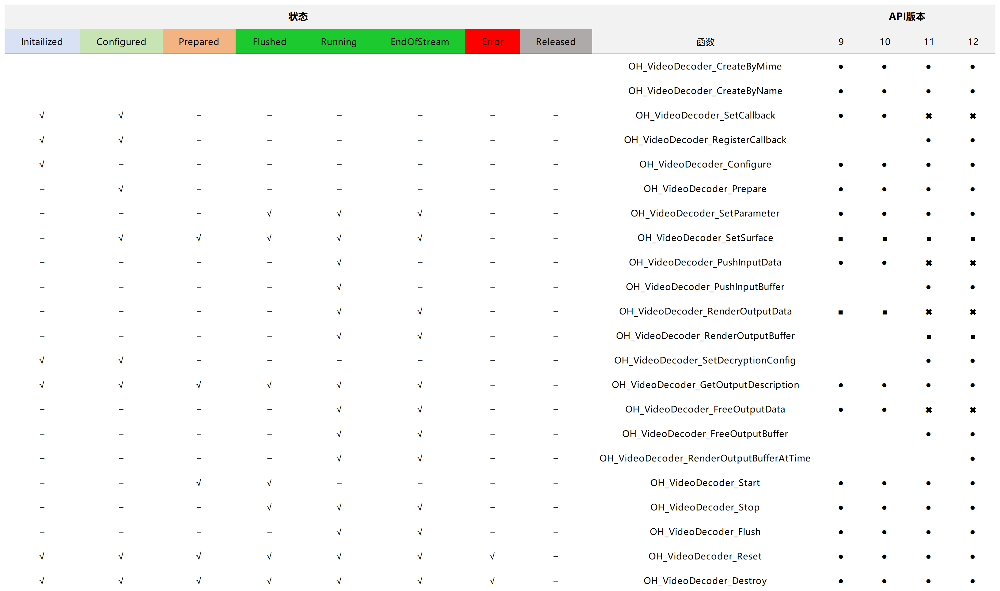

# VideoDecoder


## 概述

VideoDecoder模块提供用于视频解码的接口。

对应的开发指南及样例可参考[视频解码](../../media/avcodec/video-decoding.md)。

**系统能力：** SystemCapability.Multimedia.Media.VideoDecoder

**起始版本：** 9

接口在每个版本的支持情况以及在解码过程中可以调用的情况，如下图所示： 




## 汇总


### 文件

| 名称 | 描述 | 
| -------- | -------- |
| [native_avcodec_videodecoder.h](native__avcodec__videodecoder_8h.md) | 声明用于视频解码的接口。  | 


### 函数

| 名称 | 描述 | 
| -------- | -------- |
| [OH_AVCodec](_codec_base.md#oh_avcodec) \* [OH_VideoDecoder_CreateByMime](#oh_videodecoder_createbymime) (const char \*mime) | 根据[MIME](_codec_base.md#媒体编解码格式)类型创建视频解码器实例。 | 
| [OH_AVCodec](_codec_base.md#oh_avcodec) \* [OH_VideoDecoder_CreateByName](#oh_videodecoder_createbyname) (const char \*name) | 根据视频解码器名称创建视频解码器实例。  | 
| [OH_AVErrCode](_core.md#oh_averrcode) [OH_VideoDecoder_Destroy](#oh_videodecoder_destroy) ([OH_AVCodec](_codec_base.md#oh_avcodec) \*codec) | 清理解码器内部资源，销毁解码器实例。  | 
| [OH_AVErrCode](_core.md#oh_averrcode) [OH_VideoDecoder_SetCallback](#oh_videodecoder_setcallback) ([OH_AVCodec](_codec_base.md#oh_avcodec) \*codec, [OH_AVCodecAsyncCallback](_o_h___a_v_codec_async_callback.md) callback, void \*userData) | 设置异步回调函数，让应用可以响应视频解码器生成的事件。（API11废弃）  | 
| [OH_AVErrCode](_core.md#oh_averrcode) [OH_VideoDecoder_RegisterCallback](#oh_videodecoder_registercallback) ([OH_AVCodec](_codec_base.md#oh_avcodec) \*codec, [OH_AVCodecCallback](_o_h___a_v_codec_callback.md) callback, void \*userData) | 注册异步回调函数，让应用可以响应视频解码器生成的事件。  | 
| [OH_AVErrCode](_core.md#oh_averrcode) [OH_VideoDecoder_SetSurface](#oh_videodecoder_setsurface) ([OH_AVCodec](_codec_base.md#oh_avcodec) \*codec, [OHNativeWindow](_codec_base.md#ohnativewindow) \*window) | 设置输出surface以提供视频解码输出。  |
| [OH_AVErrCode](_core.md#oh_averrcode) [OH_VideoDecoder_Configure](#oh_videodecoder_configure) ([OH_AVCodec](_codec_base.md#oh_avcodec) \*codec, [OH_AVFormat](_core.md#oh_avformat) \*format) | 配置视频解码器，通常需要配置解码视频轨迹的描述信息，这些信息可以从[OH_AVSource](_a_v_source.md)中提取。  | 
| [OH_AVErrCode](_core.md#oh_averrcode) [OH_VideoDecoder_Prepare](#oh_videodecoder_prepare) ([OH_AVCodec](_codec_base.md#oh_avcodec) \*codec) | 准备解码器的内部资源。  | 
| [OH_AVErrCode](_core.md#oh_averrcode) [OH_VideoDecoder_Start](#oh_videodecoder_start) ([OH_AVCodec](_codec_base.md#oh_avcodec) \*codec) | 调用OH_VideoDecoder_Prepare接口成功后调用此接口启动解码器。  | 
| [OH_AVErrCode](_core.md#oh_averrcode) [OH_VideoDecoder_Stop](#oh_videodecoder_stop) ([OH_AVCodec](_codec_base.md#oh_avcodec) \*codec) | 停止解码器，释放输入输出buffer。  | 
| [OH_AVErrCode](_core.md#oh_averrcode) [OH_VideoDecoder_Flush](#oh_videodecoder_flush) ([OH_AVCodec](_codec_base.md#oh_avcodec) \*codec) | 清除解码器中缓存的输入和输出数据及参数集如H.264格式的PPS/SPS。  | 
| [OH_AVErrCode](_core.md#oh_averrcode) [OH_VideoDecoder_Reset](#oh_videodecoder_reset) ([OH_AVCodec](_codec_base.md#oh_avcodec) \*codec) | 重置解码器，解码器回到初始化状态。  | 
| [OH_AVFormat](_core.md#oh_avformat) \* [OH_VideoDecoder_GetOutputDescription](#oh_videodecoder_getoutputdescription) ([OH_AVCodec](_codec_base.md#oh_avcodec) \*codec) | 获取解码器输出数据的OH_AVFormat信息。  | 
| [OH_AVErrCode](_core.md#oh_averrcode) [OH_VideoDecoder_SetParameter](#oh_videodecoder_setparameter) ([OH_AVCodec](_codec_base.md#oh_avcodec) \*codec, [OH_AVFormat](_core.md#oh_avformat) \*format) | 设置解码器的动态参数。  | 
| [OH_AVErrCode](_core.md#oh_averrcode) [OH_VideoDecoder_PushInputData](#oh_videodecoder_pushinputdata) ([OH_AVCodec](_codec_base.md#oh_avcodec) \*codec, uint32_t index, [OH_AVCodecBufferAttr](_o_h___a_v_codec_buffer_attr.md) attr) | 将填充数据的输入缓冲区提交给视频解码器。（API11废弃）   | 
| [OH_AVErrCode](_core.md#oh_averrcode) [OH_VideoDecoder_RenderOutputData](#oh_videodecoder_renderoutputdata) ([OH_AVCodec](_codec_base.md#oh_avcodec) \*codec, uint32_t index) | 将处理后的输出buffer返回给解码器，并通知解码器完成在输出surface上渲染buffer中包含的解码数据。（API11废弃）   |
| [OH_AVErrCode](_core.md#oh_averrcode) [OH_VideoDecoder_FreeOutputData](#oh_videodecoder_freeoutputdata) ([OH_AVCodec](_codec_base.md#oh_avcodec) \*codec, uint32_t index) | 将处理后的输出缓冲区返回到解码器。（API11废弃）   | 
| [OH_AVErrCode](_core.md#oh_averrcode) [OH_VideoDecoder_PushInputBuffer](#oh_videodecoder_pushinputbuffer) ([OH_AVCodec](_codec_base.md#oh_avcodec) \*codec, uint32_t index) | 通知视频解码器已对index对应的缓冲区完成输入数据的填充。   | 
| [OH_AVErrCode](_core.md#oh_averrcode) [OH_VideoDecoder_RenderOutputBuffer](#oh_videodecoder_renderoutputbuffer) ([OH_AVCodec](_codec_base.md#oh_avcodec) \*codec, uint32_t index) | 将index对应的输出缓冲返回给解码器，缓冲中携带解码输出数据，并通知解码器完成在输出surface上渲染，输出缓冲包含解码数据。  |
| [OH_AVErrCode](_core.md#oh_averrcode) [OH_VideoDecoder_RenderOutputBufferAtTime](#oh_videodecoder_renderoutputbufferattime) ([OH_AVCodec](_codec_base.md#oh_avcodec) \*codec, uint32_t index, int64_t renderTimestampNs) | 将index对应的输出缓冲返回给解码器，缓冲中携带解码输出数据，并通知解码器在开发者指定的时间内完成在输出surface上渲染，输出缓冲包含解码数据。  |
| [OH_AVErrCode](_core.md#oh_averrcode) [OH_VideoDecoder_FreeOutputBuffer](#oh_videodecoder_freeoutputbuffer) ([OH_AVCodec](_codec_base.md#oh_avcodec) \*codec, uint32_t index) | 将处理后的输出缓冲区返回到解码器。  | 
| [OH_AVErrCode](_core.md#oh_averrcode) [OH_VideoDecoder_IsValid](#oh_videodecoder_isvalid) ([OH_AVCodec](_codec_base.md#oh_avcodec) \*codec, bool \*isValid) | 检查当前解码实例是否有效。  | 
| [OH_AVErrCode](_core.md#oh_averrcode) [OH_VideoDecoder_SetDecryptionConfig](#oh_videodecoder_setdecryptionconfig) ([OH_AVCodec](_codec_base.md#oh_avcodec) \*codec, MediaKeySession \*mediaKeySession, bool secureVideoPath) | 设置解密配置。  | 


## 函数说明


### OH_VideoDecoder_Configure()

```
OH_AVErrCode OH_VideoDecoder_Configure (OH_AVCodec *codec, OH_AVFormat *format )
```
**描述**
配置视频解码器，通常需要配置解码视频的描述信息，这些信息可以从[OH_AVSource](_a_v_source.md)中提取。在调用OH_VideoDecoder_Prepare接口之前，必须调用此接口。

以下参数的配置范围可通过[能力查询](../../media/avcodec/obtain-supported-codecs.md)获取，OH_MD_KEY_ROTATION配置的参数都支持。

设置OH_MD_KEY_VIDEO_ENABLE_LOW_LATENCY接口时如果当前平台不支持，不报错，走正常解码流程。

参数校验规则：

| Key                                                                          | 配置正常范围的值 | 配置超出范围的值 | 不配置该参数 |
| -----------------------------------------------------------------------------| -------- | -------- | ------ |
| OH_MD_KEY_WIDTH                                                              | AV_ERR_OK       | AV_ERR_INVALID_VAL      | AV_ERR_INVALID_VAL  |
| OH_MD_KEY_HEIGHT                                                             | AV_ERR_OK       | AV_ERR_INVALID_VAL       | AV_ERR_INVALID_VAL     |
| OH_MD_KEY_PIXEL_FORMAT 请参阅[OH_AVPixelFormat](_core.md#oh_avpixelformat-1)    | AV_ERR_OK       | AV_ERR_UNSUPPORT       | AV_ERR_OK      |
| OH_MD_KEY_FRAME_RATE                                                         | AV_ERR_OK       | AV_ERR_INVALID_VAL       | AV_ERR_OK     |
| OH_MD_KEY_ROTATION 请参阅[OH_MD_KEY_ROTATION](_codec_base.md#oh_md_key_rotation)| AV_ERR_OK       | AV_ERR_INVALID_VAL       | AV_ERR_OK      |

> **说明：**
>
> 建议按照该实例需要支持的最大分辨率来配置，否则可能会出现高于该分辨率的码流解码会触发异常。该设置直接影响应用的内存使用情况。


**系统能力：** SystemCapability.Multimedia.Media.VideoDecoder

**起始版本：** 9

**参数:**

| 名称 | 描述 | 
| -------- | -------- |
| codec | 指向视频解码实例的指针。  | 
| format | 指向OH_AVFormat的指针，用于给出要解码的视频轨道的描述。  | 

**返回：**

返回接口结果：

AV_ERR_OK：执行成功。

AV_ERR_NO_MEMORY：输入的解码器实例已经销毁。

AV_ERR_INVALID_VAL：

    1. 输入的codec指针为非解码器实例，或者为空指针；
    2. 输入format参数不支持。

AV_ERR_UNKNOWN：未知错误。

AV_ERR_OPERATE_NOT_PERMIT：内部执行错误。 

AV_ERR_INVALID_STATE：本接口必须在OH_VideoDecoder_Prepare接口前调用，如果在其他状态时调用，则返回此错误码。

AV_ERR_VIDEO_UNSUPPORTED_COLOR_SPACE_CONVERSION：不支持色彩空间转换功能。


### OH_VideoDecoder_CreateByMime()

```
OH_AVCodec* OH_VideoDecoder_CreateByMime (const char *mime)
```
**描述**
根据MIME类型创建视频解码器实例，大多数情况下建议使用。

**系统能力：** SystemCapability.Multimedia.Media.VideoDecoder

**起始版本：** 9

**参数:**

| 名称 | 描述 | 
| -------- | -------- |
| mime | MIME类型描述字符串，请参阅[AVCODEC_MIMETYPE](_codec_base.md#变量)。 | 

**返回：**

返回一个指向视频解码实例的指针。当传入的解码器类型不支持或者内存资源耗尽时，返回NULL。


### OH_VideoDecoder_CreateByName()

```
OH_AVCodec* OH_VideoDecoder_CreateByName (const char *name)
```
**描述**
根据视频解码器名称创建视频解码器实例。使用此接口的前提是知道解码器的确切名称，解码器的名称可以通过能力查询获取。

详情请参见：[获取支持的编解码能力](../../media/avcodec/obtain-supported-codecs.md#创建指定名称的编解码器)。

**系统能力：** SystemCapability.Multimedia.Media.VideoDecoder

**起始版本：** 9

**参数:**

| 名称 | 描述 | 
| -------- | -------- |
| name | 视频解码器名称。  | 

**返回：**

返回指向视频解码实例的指针。当输入的解码器名称不支持或者内存资源耗尽时，返回NULL。


### OH_VideoDecoder_Destroy()

```
OH_AVErrCode OH_VideoDecoder_Destroy (OH_AVCodec *codec)
```
**描述**
清理解码器内部资源，销毁解码器实例。不能重复销毁。

**系统能力：** SystemCapability.Multimedia.Media.VideoDecoder

**起始版本：** 9

**参数:**

| 名称 | 描述 | 
| -------- | -------- |
| codec | 指向视频解码实例的指针。  | 

**返回：**

返回接口结果：

AV_ERR_OK：执行成功。

AV_ERR_NO_MEMORY：输入的解码器实例已经销毁。

AV_ERR_INVALID_VAL：输入的codec指针为非解码器实例，或者为空指针。

AV_ERR_UNKNOWN：未知错误。

AV_ERR_OPERATE_NOT_PERMIT：内部执行错误。


### OH_VideoDecoder_Flush()

```
OH_AVErrCode OH_VideoDecoder_Flush (OH_AVCodec *codec)
```
**描述**
清除解码器中缓存的输入和输出数据及参数集如H.264格式的PPS/SPS。调用此接口后，以前通过异步回调上报的所有缓冲区index都将失效，请确保不要访问这些index对应的缓冲区。

**系统能力：** SystemCapability.Multimedia.Media.VideoDecoder

**起始版本：** 9

**参数:**

| 名称 | 描述 | 
| -------- | -------- |
| codec | 指向视频解码实例的指针。  | 

**返回：**

返回接口结果：

AV_ERR_OK：执行成功。

AV_ERR_NO_MEMORY：输入的解码器实例已经销毁。

AV_ERR_INVALID_VAL：输入的codec指针为非解码器实例，或者为空指针。

AV_ERR_UNKNOWN：未知错误。

AV_ERR_OPERATE_NOT_PERMIT：内部执行错误。

AV_ERR_INVALID_STATE：解码器状态不支持调用本接口时调用。


### OH_VideoDecoder_FreeOutputBuffer()

```
OH_AVErrCode OH_VideoDecoder_FreeOutputBuffer (OH_AVCodec *codec, uint32_t index )
```
**描述**
将处理后的输出缓冲区返回到解码器。用户使用完需要及时调用此接口释放输出缓存区，否则会阻塞解码流程。

详情请参见：[视频解码](../../media/avcodec/video-decoding.md) “Surface模式的步骤-12或Buffer模式步骤-10”。

**系统能力：** SystemCapability.Multimedia.Media.VideoDecoder

**起始版本：** 11

**参数:**

| 名称 | 描述 | 
| -------- | -------- |
| codec | 指向视频解码实例的指针。 | 
| index | 输出buffer对应的索引值。由[OH_AVCodecOnNewOutputBuffer](_codec_base.md#oh_avcodeconnewoutputbuffer)给出。 |

**返回：**

返回接口结果：

AV_ERR_OK：执行成功。

AV_ERR_NO_MEMORY：输入的解码器实例已经销毁。

AV_ERR_INVALID_VAL：

    1. 输入的codec指针为非解码器实例，或者为空指针；
    2. index非法或者连续给同一个index，该错误不影响后续解码流程。

AV_ERR_UNKNOWN：未知错误。

AV_ERR_OPERATE_NOT_PERMIT：内部执行错误。

AV_ERR_INVALID_STATE：解码器状态不支持调用本接口时调用。


### OH_VideoDecoder_GetOutputDescription()

```
OH_AVFormat* OH_VideoDecoder_GetOutputDescription (OH_AVCodec *codec)
```
**描述**
获取解码器输出数据的OH_AVFormat信息，请参阅[OH_AVFormat](_core.md#oh_avformat)。 

需要注意的是，指向的OH_AVFormat实例在生命周期结束时需要开发者通过调用接口[OH_AVFormat_Destroy](_core.md#oh_avformat_destroy)释放。

**系统能力：** SystemCapability.Multimedia.Media.VideoDecoder

**起始版本：** 9

**参数:**

| 名称 | 描述 | 
| -------- | -------- |
| codec | 指向视频解码实例的指针。  | 

**返回：**

返回指向OH_AVFormat实例的指针。当输入的codec指针非解码器实例，或者为空指针，则返回NULL。


### OH_VideoDecoder_IsValid()

```
OH_AVErrCode OH_VideoDecoder_IsValid (OH_AVCodec *codec, bool *isValid )
```
**描述**
在解码器实例存在的情况下，检查当前解码器服务是否有效。

**系统能力：** SystemCapability.Multimedia.Media.VideoDecoder

**起始版本：** 10

**参数:**

| 名称 | 描述 | 
| -------- | -------- |
| codec | 指向视频解码实例的指针。  | 
| isValid | 输出参数，指向布尔类型的指针。只有当接口返回AV_ERR_OK时，该值表示解码器服务的有效性（true为有效，false为无效）。建议开发者将isValid初始化为false。  | 

**返回：**

返回接口结果：

AV_ERR_OK：执行成功。

AV_ERR_INVALID_VAL：输入的codec指针为非解码器实例，或者为空指针。


### OH_VideoDecoder_Prepare()

```
OH_AVErrCode OH_VideoDecoder_Prepare (OH_AVCodec *codec)
```
**描述**
准备解码器的内部资源，在调用该接口之前，必须调用OH_VideoDecoder_Configure接口。

**系统能力：** SystemCapability.Multimedia.Media.VideoDecoder

**起始版本：** 9

**参数:**

| 名称 | 描述 | 
| -------- | -------- |
| codec | 指向视频解码实例的指针。  | 

**返回：**

返回接口结果：

AV_ERR_OK：执行成功。

AV_ERR_NO_MEMORY：输入的解码器实例已经销毁。

AV_ERR_INVALID_VAL：输入的codec指针为非解码器实例，或者为空指针。

AV_ERR_UNKNOWN：未知错误。

AV_ERR_INVALID_STATE：解码器状态不支持调用本接口时调用。

AV_ERR_OPERATE_NOT_PERMIT：

    1. 内部执行错误；
    2. 配置了色彩空间转换功能，但解码器处于Buffer模式。


### OH_VideoDecoder_PushInputBuffer()

```
OH_AVErrCode OH_VideoDecoder_PushInputBuffer (OH_AVCodec *codec, uint32_t index )
```
**描述**
通知视频解码器已对index对应的缓冲区完成输入数据的填充。

输入回调将报告可用的输入缓冲区和相应的index值，请参阅[OH_AVCodecOnNeedInputBuffer](_codec_base.md#oh_avcodeconneedinputbuffer)。 一旦具有指定index的缓冲区提交到视频解码器，则无法再次访问缓冲区，直到再次收到输入回调，报告具有相同index的缓冲区可用。

此外，对于某些解码器，需要在开始时向解码器输入编解码特定数据，以初始化解码器的解码过程，如H.264格式的PPS/SPS数据。
开发者可以使用该接口把解码需要的参数集如H.264格式的PPS/SPS传递给解码器，该参数集可以单独送入解码器也可以和要解码的数据一起传入。

**系统能力：** SystemCapability.Multimedia.Media.VideoDecoder

**起始版本：** 11

**参数:**

| 名称 | 描述 | 
| -------- | -------- |
| codec | 指向视频解码实例的指针。  | 
| index | 输入buffer对应的索引值。由[OH_AVCodecOnNeedInputBuffer](_codec_base.md#oh_avcodeconneedinputbuffer)给出。|

**返回：**

返回接口结果：

AV_ERR_OK：执行成功。

AV_ERR_NO_MEMORY：输入的解码器实例已经销毁。

AV_ERR_INVALID_VAL：输入的codec指针为非解码器实例，或者为空指针。

AV_ERR_UNKNOWN：未知错误。

AV_ERR_OPERATE_NOT_PERMIT：内部执行错误。

AV_ERR_INVALID_STATE：解码器状态不支持调用本接口时调用。


### OH_VideoDecoder_RegisterCallback()

```
OH_AVErrCode OH_VideoDecoder_RegisterCallback (OH_AVCodec *codec, OH_AVCodecCallback callback, void *userData )
```
**描述**
注册异步回调函数，让应用可以响应视频解码器生成的事件。在调用OH_VideoDecoder_Prepare接口之前，必须调用此接口。

**系统能力：** SystemCapability.Multimedia.Media.VideoDecoder

**起始版本：** 11

**参数:**

| 名称 | 描述 | 
| -------- | -------- |
| codec | 指向视频解码器实例的指针。  | 
| callback | 所有回调函数的集合，请参见[OH_AVCodecCallback](_o_h___a_v_codec_callback.md)。  | 
| userData | 开发者执行回调所依赖的数据。  | 

**返回：**

返回接口结果：

AV_ERR_OK：执行成功。

AV_ERR_NO_MEMORY：输入的解码器实例已经销毁。

AV_ERR_INVALID_VAL：输入的codec指针为非解码器实例，或者为空指针。

AV_ERR_UNKNOWN：未知错误。

AV_ERR_OPERATE_NOT_PERMIT：内部执行错误。

AV_ERR_INVALID_STATE：本接口必须在OH_VideoDecoder_Prepare接口前调用，如果在其他状态时调用，则返回此错误码。


### OH_VideoDecoder_RenderOutputBuffer()

```
OH_AVErrCode OH_VideoDecoder_RenderOutputBuffer (OH_AVCodec *codec, uint32_t index )
```
**描述**
将index对应的输出缓冲返回给解码器，缓冲中携带解码输出数据，并通知解码器完成在输出surface上渲染，输出缓冲包含解码数据。

如果之前没有配置输出surface，则调用此接口仅将指定index对应的输出缓冲区返回给解码器。

**系统能力：** SystemCapability.Multimedia.Media.VideoDecoder

**起始版本：** 11

**参数:**

| 名称 | 描述 | 
| -------- | -------- |
| codec | 指向视频解码实例的指针。  | 
| index | 输出buffer对应的索引值。由[OH_AVCodecOnNewOutputBuffer](_codec_base.md#oh_avcodeconnewoutputbuffer)给出。  |

**返回：**

返回接口结果：

AV_ERR_OK：执行成功。

AV_ERR_NO_MEMORY：输入的解码器实例已经销毁。

AV_ERR_INVALID_VAL：输入的codec指针为非解码器实例，或者为空指针。

AV_ERR_UNKNOWN：未知错误。

AV_ERR_OPERATE_NOT_PERMIT：内部执行错误。

AV_ERR_INVALID_STATE：解码器状态不支持调用本接口时调用。


### OH_VideoDecoder_RenderOutputBufferAtTime()

```
OH_AVErrCode OH_VideoDecoder_RenderOutputBufferAtTime(OH_AVCodec *codec, uint32_t index, int64_t renderTimestampNs);
```
**描述**
将index对应的输出缓冲返回给解码器，缓冲中携带解码输出数据，并通知解码器在开发者指定的时间内完成在输出surface上渲染，输出缓冲包含解码数据。
如果之前没有配置输出surface，则调用此接口仅将指定index对应的输出缓冲区返回给解码器。

开发者可以使用时间戳在特定时间（在VSYNC或者缓冲区时间戳之后）渲染缓冲区。若要在指定的时间戳显示，时间戳需要合理接近系统时间，有几点需要注意：
1. 缓冲区是按照顺序处理的，因此可能会阻塞后续缓冲区在surface上的显示，如果想要对用户的一些行为做出反应，例如停止或者快进快退视频，这一点很重要。
2. 如果多个缓冲区被发送到surface要在同一个VSYNC上渲染，那么最后一个将会被显示，其他的将被丢弃。
3. 如果时间戳与当前的系统时间不是“合理接近”，surface将会忽略时间戳，并在可行的最早时间里显示buffer。在此模式下不会丢弃帧。

**系统能力：** SystemCapability.Multimedia.Media.VideoDecoder

**起始版本：** 12

**参数:**

| 名称 | 描述 |
| -------- | -------- |
| codec | 指向视频解码实例的指针。  |
| index | 输出buffer对应的索引值。 由[OH_AVCodecOnNewOutputBuffer](_codec_base.md#oh_avcodeconnewoutputbuffer)给出。 |
| renderTimestampNs | 输出buffer被发送到surface的时间戳，取值范围大于0，应由std::chrono::steady_clock标准库时钟生成，且单位为纳秒。  |

**返回：**

返回接口结果：

AV_ERR_OK：执行成功。

AV_ERR_NO_MEMORY：输入的解码器实例已经销毁。

AV_ERR_INVALID_VAL：输入的codec指针为非解码器实例，或者为空指针。

AV_ERR_UNKNOWN：未知错误。

AV_ERR_OPERATE_NOT_PERMIT：内部执行错误。

AV_ERR_INVALID_STATE：解码器状态不支持调用本接口时调用。


### OH_VideoDecoder_Reset()

```
OH_AVErrCode OH_VideoDecoder_Reset (OH_AVCodec *codec)
```
**描述**
重置解码器，解码器回到初始化状态。如果要继续解码，需要再次调用OH_VideoDecoder_Configure接口配置解码器实例。

**系统能力：** SystemCapability.Multimedia.Media.VideoDecoder

**起始版本：** 9

**参数:**

| 名称 | 描述 | 
| -------- | -------- |
| codec | 指向视频解码实例的指针。  | 

**返回：**

返回接口结果：

AV_ERR_OK：执行成功。

AV_ERR_NO_MEMORY：输入的解码器实例已经销毁。

AV_ERR_INVALID_VAL：输入的codec指针为非解码器实例，或者为空指针。

AV_ERR_UNKNOWN：未知错误。

AV_ERR_OPERATE_NOT_PERMIT：内部执行错误。


### OH_VideoDecoder_SetDecryptionConfig()

```
OH_AVErrCode OH_VideoDecoder_SetDecryptionConfig (OH_AVCodec *codec, MediaKeySession *mediaKeySession, bool secureVideoPath)
```
**描述**
设置解密配置。在调用OH_VideoDecoder_Prepare接口之前，可选择调用此接口。

**系统能力：** SystemCapability.Multimedia.Media.VideoDecoder

**起始版本：** 11

**参数:**

| 名称 | 描述 | 
| -------- | -------- |
| codec | 指向视频解码实例的指针。  |
| mediaKeySession | 指向带有解密功能的DRM会话实例的指针，请参阅[MediaKeySession](../../reference/apis-drm-kit/native__mediakeysession_8h.md)。  | 
| secureVideoPath | 安全视频通路。指定安全视频通路为true，非安全视频通路为false。在[Surface模式](../../media/avcodec/video-decoding.md#surface模式)下，既支持安全视频通路，也支持非安全视频通路。在[Buffer模式](../../media/avcodec/video-decoding.md#buffer模式)下，仅支持非安全视频通路。  |

**返回：**

返回接口结果：

AV_ERR_OK：操作成功。

AV_ERR_OPERATE_NOT_PERMIT：
    
    1. 内部执行错误；
    2. 解码服务进程异常；
    3. 媒体密钥会话服务处于错误状态。

AV_ERR_INVALID_VAL：
   
    1. 输入的codec指针为非解码器实例或为空指针；
    2. mediaKeySession为NULL或无效。

AV_ERR_NO_MEMORY：输入的解码器实例已经销毁。


### OH_VideoDecoder_SetParameter()

```
OH_AVErrCode OH_VideoDecoder_SetParameter (OH_AVCodec *codec, OH_AVFormat *format )
```
**描述**
设置解码器的动态参数。

注意，该接口只能在解码器启动后调用。同时，参数配置错误可能会导致解码失败。

**系统能力：** SystemCapability.Multimedia.Media.VideoDecoder

**起始版本：** 9

**参数:**

| 名称 | 描述 | 
| -------- | -------- |
| codec | 指向视频解码实例的指针。  | 
| format | 指向OH_AVFormat实例的指针。  | 

**返回：**

返回接口结果：

AV_ERR_OK：执行成功。

AV_ERR_NO_MEMORY：输入的解码器实例已经销毁。

AV_ERR_INVALID_VAL：

    1. 输入的codec指针为非解码器实例，或者为空指针；
    2. 输入format参数不支持。

AV_ERR_UNKNOWN：未知错误。

AV_ERR_OPERATE_NOT_PERMIT：内部执行错误。

AV_ERR_INVALID_STATE：解码器状态不支持调用本接口时调用。


### OH_VideoDecoder_SetSurface()

```
OH_AVErrCode OH_VideoDecoder_SetSurface (OH_AVCodec * codec, OHNativeWindow * window )
```
**描述**

设置输出surface以提供视频解码输出。

在初始化阶段，必须在调用OH_VideoDecoder_Prepare接口之前调用此接口。在Executing状态可以直接调用该接口。


**系统能力：** SystemCapability.Multimedia.Media.VideoDecoder

**起始版本：** 9

**参数:**

| 名称 | 描述 | 
| -------- | -------- |
| codec | 指向视频解码实例的指针。  | 
| window | 指向OHNativeWindow实例的指针，请参阅[OHNativeWindow](_codec_base.md#ohnativewindow)。  | 

**返回：**

返回接口结果：

AV_ERR_OK：执行成功。

AV_ERR_NO_MEMORY：输入的解码器实例已经销毁。

AV_ERR_OPERATE_NOT_PERMIT：本接口仅支持在Surface模式下调用, 如果在Buffer模式调用, 则返回此错误码。

AV_ERR_INVALID_VAL：

    1. 输入的codec指针为非解码器实例，或者为空指针；
    2. window为空指针。

AV_ERR_UNKNOWN：未知错误。

AV_ERR_INVALID_STATE：解码器状态不支持调用本接口时调用。


### OH_VideoDecoder_Start()

```
OH_AVErrCode OH_VideoDecoder_Start (OH_AVCodec *codec)
```
**描述**
调用OH_VideoDecoder_Prepare接口成功后调用此接口启动解码器。成功启动后，解码器将开始报告注册的回调事件。

**系统能力：** SystemCapability.Multimedia.Media.VideoDecoder

**起始版本：** 9

**参数:**

| 名称 | 描述 | 
| -------- | -------- |
| codec | 指向视频解码实例的指针。  | 

**返回：**

返回接口结果：

AV_ERR_OK：执行成功。

AV_ERR_NO_MEMORY：输入的解码器实例已经销毁。

AV_ERR_INVALID_VAL：输入的codec指针为非解码器实例，或者为空指针。

AV_ERR_UNKNOWN：未知错误。

AV_ERR_INVALID_STATE：解码器状态不支持调用本接口时调用。

AV_ERR_OPERATE_NOT_PERMIT：

    1. 内部执行错误；
    2. 视频色彩空间转换功能已配置，但是没有调用OH_VideoDecoder_Prepare接口。


### OH_VideoDecoder_Stop()

```
OH_AVErrCode OH_VideoDecoder_Stop (OH_AVCodec *codec)
```
**描述**

停止解码器，释放输入输出buffer。停止后，可以通过调用OH_VideoDecoder_Start接口重新进入Running状态。

需要注意的是，如果编解码器特定数据以前已输入到解码器，则需要再次输入。

**系统能力：** SystemCapability.Multimedia.Media.VideoDecoder

**起始版本：** 9

**参数:**

| 名称 | 描述 | 
| -------- | -------- |
| codec | 指向视频解码实例的指针。  | 

**返回：**

返回接口结果：

AV_ERR_OK：执行成功。

AV_ERR_NO_MEMORY：输入的解码器实例已经销毁。

AV_ERR_INVALID_VAL：输入的codec指针为非解码器实例，或者为空指针。

AV_ERR_UNKNOWN：未知错误。

AV_ERR_OPERATE_NOT_PERMIT：内部执行错误。

AV_ERR_INVALID_STATE：解码器状态不支持调用本接口时调用。


## 废弃函数说明


### OH_VideoDecoder_SetCallback()

```
OH_AVErrCode OH_VideoDecoder_SetCallback (OH_AVCodec *codec, OH_AVCodecAsyncCallback callback, void *userData )
```
**描述**
设置异步回调函数，让应用可以响应视频解码器生成的事件。在调用OH_VideoDecoder_Prepare接口之前，必须调用此接口。

**系统能力：** SystemCapability.Multimedia.Media.VideoDecoder

**起始版本：** 9

**废弃版本：** 11

**替代接口：**[OH_VideoDecoder_RegisterCallback](#oh_videodecoder_registercallback)

**参数:**

| 名称 | 描述 | 
| -------- | -------- |
| codec | 指向视频解码实例的指针。  | 
| callback | 所有回调函数的集合，请参阅[OH_AVCodecAsyncCallback](_o_h___a_v_codec_async_callback.md)。  | 
| userData | 开发者执行回调所依赖的数据。  | 

**返回：**

返回接口结果：

AV_ERR_OK：执行成功。

AV_ERR_NO_MEMORY：输入的解码器实例已经销毁。

AV_ERR_INVALID_VAL：输入的codec指针为非解码器实例，或者为空指针。

AV_ERR_UNKNOWN：未知错误。

AV_ERR_OPERATE_NOT_PERMIT：内部执行错误。

AV_ERR_INVALID_STATE：本接口必须在OH_VideoDecoder_Prepare接口前调用，如果在其他状态时调用，则返回此错误码。


### OH_VideoDecoder_RenderOutputData()

```
OH_AVErrCode OH_VideoDecoder_RenderOutputData (OH_AVCodec *codec, uint32_t index )
```
**描述**
将处理后的输出buffer返回给解码器，并通知解码器完成在输出surface上渲染buffer中包含的解码数据。

如果之前没有配置输出surface，则调用此接口仅将指定index对应的输出缓冲区返回给解码器。

**系统能力：** SystemCapability.Multimedia.Media.VideoDecoder

**起始版本：** 9

**废弃版本：** 11

**替代接口：**[OH_VideoDecoder_RenderOutputBuffer](#oh_videodecoder_renderoutputbuffer)

**参数:**

| 名称 | 描述 | 
| -------- | -------- |
| codec | 指向视频解码实例的指针。  | 
| index | 输出buffer对应的索引值。由[OH_AVCodecOnNewOutputData](_codec_base.md#oh_avcodeconnewoutputdata)给出。  |

**返回：**

返回接口结果：

AV_ERR_OK：执行成功。

AV_ERR_NO_MEMORY：输入的解码器实例已经销毁。

AV_ERR_INVALID_VAL：输入的codec指针为非解码器实例，或者为空指针。

AV_ERR_UNKNOWN：未知错误。

AV_ERR_OPERATE_NOT_PERMIT：内部执行错误。

AV_ERR_INVALID_STATE：解码器状态不支持调用本接口时调用。


### OH_VideoDecoder_PushInputData()

```
OH_AVErrCode OH_VideoDecoder_PushInputData (OH_AVCodec *codec, uint32_t index, OH_AVCodecBufferAttr attr )
```
**描述**
将填充数据的输入缓冲区提交给视频解码器。

输入回调将报告可用的输入缓冲区和相应的index值，请参阅[OH_AVCodecOnNeedInputData](_codec_base.md#oh_avcodeconneedinputdata)。 一旦具有指定index的缓冲区提交到视频解码器，则无法再次访问缓冲区，直到再次收到输入回调，报告具有相同index的缓冲区可用。

此外，对于某些解码器，需要在开始时向解码器输入编解码特定数据，以初始化解码器的解码过程，如H.264格式的PPS/SPS数据。

**系统能力：** SystemCapability.Multimedia.Media.VideoDecoder

**起始版本：** 9

**废弃版本：** 11

**替代接口：**[OH_VideoDecoder_PushInputBuffer](#oh_videodecoder_pushinputbuffer)

**参数:**

| 名称 | 描述 | 
| -------- | -------- |
| codec | 指向视频解码实例的指针。  | 
| index | 输入buffer对应的索引值。由[OH_AVCodecOnNeedInputData](_codec_base.md#oh_avcodeconneedinputdata)给出。  | 
| attr | 描述缓冲区中包含的数据的信息。  |

**返回：**

返回接口结果：

AV_ERR_OK：执行成功。

AV_ERR_NO_MEMORY：输入的解码器实例已经销毁。

AV_ERR_INVALID_VAL：输入的codec指针为非解码器实例，或者为空指针。

AV_ERR_UNKNOWN：未知错误。

AV_ERR_OPERATE_NOT_PERMIT：内部执行错误。

AV_ERR_INVALID_STATE：解码器状态不支持调用本接口时调用。


### OH_VideoDecoder_FreeOutputData()

```
OH_AVErrCode OH_VideoDecoder_FreeOutputData (OH_AVCodec *codec, uint32_t index )
```
**描述**
将处理后的输出缓冲区返回到解码器。

**系统能力：** SystemCapability.Multimedia.Media.VideoDecoder

**起始版本：** 9

**废弃版本：** 11

**替代接口：**[OH_VideoDecoder_FreeOutputBuffer](#oh_videodecoder_freeoutputbuffer)

**参数:**

| 名称 | 描述 | 
| -------- | -------- |
| codec | 指向视频解码实例的指针。  | 
| index | 输出buffer对应的索引值。由[OH_AVCodecOnNewOutputData](_codec_base.md#oh_avcodeconnewoutputdata)给出。  |

**返回：**

返回接口结果：

AV_ERR_OK：执行成功。

AV_ERR_NO_MEMORY：输入的解码器实例已经销毁。

AV_ERR_INVALID_VAL：输入的codec指针为非解码器实例，或者为空指针。

AV_ERR_UNKNOWN：未知错误。

AV_ERR_OPERATE_NOT_PERMIT：内部执行错误。

AV_ERR_INVALID_STATE：解码器状态不支持调用本接口时调用。
