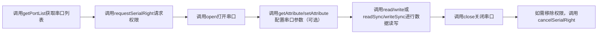

# @ohos.usbManager.serial (串口管理)

<!--Kit: Basic Services Kit-->
<!--Subsystem: USB-->
<!--Owner: @hwymlgitcode-->
<!--Designer: @w00373942-->
<!--Tester: @dong-dongzhen-->
<!--Adviser: @fang-jinxu-->

本模块主要用于管理串口设备的访问和通信，提供打开和关闭设备、读写数据、配置参数、权限管理等功能，解决了应用与串口设备通信时的权限申请、设备配置、数据传输等问题，使用该模块可以简化串口设备访问流程，提高开发效率。

**典型使用流程：**


**使用场景**：
- **嵌入式设备通信**：与各类嵌入式设备进行数据交互，如传感器数据采集、设备状态监控等
- **工业设备调试**：连接工业控制设备，进行参数配置、命令下发、日志输出等调试操作
- **串口外设数据交互**：与串口外设进行数据通信，如打印机、扫描仪、调制解调器等设备的数据收发

> **说明：**
>
> 本模块首批接口从API version 19开始支持。后续版本的新增接口，采用上角标单独标记接口的起始版本。

## 导入模块

```ts
import { serialManager } from '@kit.BasicServicesKit';
```

## serialManager.getPortList

getPortList(): Readonly&lt;SerialPort&gt;[]

查询串口设备清单，包括设备名称和对应的端口号。通常在应用启动时、设备连接后或需要检测可用串口设备时调用。

**系统能力：** SystemCapability.USB.USBManager.Serial

**返回值：**

| 类型                                        | 说明          |
|-------------------------------------------|-------------|
| Readonly&lt;[SerialPort](#serialport)&gt;[] | 返回可用串口设备的列表，每个元素包含串口的端口号和设备名称等属性信息。可用于获取当前系统中的所有串口设备，以便用户选择需要进行操作的串口。 |

**示例：**

> **说明：**
>
> 以下示例代码只是调用getPortList接口的必要流程，需要放入具体的方法中执行。实际调用时，设备开发者需要遵循设备相关协议进行调用。

<!--code_no_check-->
```ts
import { JSON } from '@kit.ArkTS';
import { serialManager } from '@kit.BasicServicesKit';

// 获取串口设备清单 
function getPortListExample() {
  let portList: serialManager.SerialPort[] = serialManager.getPortList();
  console.info('usbSerial portList: ' + JSON.stringify(portList));
  if (!portList || portList.length === 0) {
    console.error('usbSerial portList is empty');
    return;
  }
}
```

## serialManager.hasSerialRight

hasSerialRight(portId: number): boolean

检查应用是否具有访问串口设备的权限。应用退出后再拉起时，需要重新申请授权。通常在打开串口设备、执行串口操作前调用此接口检查权限状态。

**前置条件：**
- 需要先调用[getPortList](#serialmanagergetportlist)获取端口号

**系统能力：**  SystemCapability.USB.USBManager.Serial

**参数：**

| 参数名    | 类型     | 必填 | 说明                                  |
|--------|--------|----|-------------------------------------|
| portId | number | 是  | 端口号，来自[getPortList](#serialmanagergetportlist)返回的[SerialPort](#serialport)对象，必须使用getPortList返回的有效端口号，传入无效值时抛出错误码31400003异常。 |

**返回值：**

| 类型      | 说明               |
|---------|------------------|
| boolean | true表示已授权，false表示未授权。 |

**错误码：**

以下错误码的详细介绍参见[通用错误码](../errorcode-universal.md)和[USB服务错误码](errorcode-usb.md)。

| 错误码ID | 错误信息                                                     |
| -------- | ------------------------------------------------------------ |
| 401      | Parameter error. Possible causes: 1. Mandatory parameters are left unspecified; 2. Incorrect parameter types; 3. Parameter verification failed. |
| 14400005 | Database operation exception. |
| 31400001 | Serial port management exception. |
| 31400003 | PortId does not exist. |

**示例：**

> **说明：**
>
> 以下示例代码只是调用hasSerialRight接口的必要流程，需要放入具体的方法中执行。实际调用时，设备开发者需要遵循设备相关协议进行调用。

<!--code_no_check-->
```ts
import { JSON } from '@kit.ArkTS';
import { serialManager } from '@kit.BasicServicesKit';

// 获取串口列表
function hasSerialRightExample() {
  let portList: serialManager.SerialPort[] = serialManager.getPortList();
  console.info('portList: '+ JSON.stringify(portList));
  if (!portList || portList.length === 0) {
    console.error('portList is empty');
    return;
  }
  let portId: number = portList[0].portId;

  // 检测设备是否可被应用访问
  if (serialManager.hasSerialRight(portId)) {
    console.info('The serial port is accessible');
  } else {
    console.error('No permission to access the serial port');
  }
}
```

## serialManager.requestSerialRight

requestSerialRight(portId: number): Promise&lt;boolean&gt;

请求应用访问串口设备的权限。应用退出时自动移除对串口设备的访问权限，在应用重启后需要重新申请授权。使用Promise异步回调。通常在首次访问串口设备前、检测到无权限时调用此接口向用户申请授权，如需移除权限请调用[cancelSerialRight](#serialmanagercancelserialright)。

**前置条件：**
- 需要先调用[getPortList](#serialmanagergetportlist)获取端口号

**系统能力：**  SystemCapability.USB.USBManager.Serial

**参数：**

| 参数名    | 类型     | 必填 | 说明                                  |
|--------|--------|----|-------------------------------------|
| portId | number | 是  | 端口号，来自[getPortList](#serialmanagergetportlist)返回的[SerialPort](#serialport)对象，必须使用getPortList返回的有效端口号，传入无效值时抛出错误码31400003异常。 |

**返回值：**

| 类型                     | 说明            |
|------------------------|---------------|
| Promise&lt;boolean&gt; | Promise对象，返回boolean值。true表示请求权限成功，false表示请求权限失败或用户拒绝授权。 |

**错误码：**

以下错误码的详细介绍参见[通用错误码](../errorcode-universal.md)和[USB服务错误码](errorcode-usb.md)。

| 错误码ID | 错误信息                                                     |
| -------- | ------------------------------------------------------------ |
| 401      | Parameter error. Possible causes: 1. Mandatory parameters are left unspecified; 2. Incorrect parameter types; 3. Parameter verification failed. |
| 14400005 | Database operation exception. |
| 31400001 | Serial port management exception. |
| 31400003 | PortId does not exist. |

**示例：**

> **说明：**
>
> 以下示例代码只是调用requestSerialRight接口的必要流程，需要放入具体的方法中执行。实际调用时，设备开发者需要遵循设备相关协议进行调用。

<!--code_no_check-->
```ts
import { JSON } from '@kit.ArkTS';
import { serialManager } from '@kit.BasicServicesKit';
import { BusinessError } from '@kit.BasicServicesKit';

// 获取串口列表
function requestSerialRightExample() {
  let portList: serialManager.SerialPort[] = serialManager.getPortList();
  console.info('usbSerial portList: ' + JSON.stringify(portList));
  if (!portList || portList.length === 0) {
    console.error('usbSerial portList is empty');
    return;
  }
  let portId: number = portList[0].portId;

  // 检测设备是否可被应用访问
  if (!serialManager.hasSerialRight(portId)) {
    serialManager.requestSerialRight(portId).then(result => {
      if (!result) {
        // 没有访问设备的权限且用户不授权则退出
        console.error('user is not granted the operation permission');
        return;
      } else {
        console.info('grant permission successfully');
      }
    }).catch((err: BusinessError) => {
      console.error(`Failed to request serial right. Code: ${err.code}, message: ${err.message}`);
    });
  }
}
```

## serialManager.open

open(portId: number): void

打开串口设备。使用前需先通过[requestSerialRight](#serialmanagerrequestserialright)申请权限，使用完毕后需调用[close](#serialmanagerclose)关闭串口。调用成功后，可对该串口进行读写、配置参数等操作。

**前置条件：**
- 需要先调用[getPortList](#serialmanagergetportlist)获取端口号
- 需要先调用[requestSerialRight](#serialmanagerrequestserialright)申请访问权限

**配对调用：**
- 必须与[close](#serialmanagerclose)方法配对使用
- 打开串口后，使用完毕必须调用close()释放资源

**系统能力：**  SystemCapability.USB.USBManager.Serial

**参数：**

| 参数名    | 类型     | 必填 | 说明          |
|--------|--------|----|-------------|
| portId | number | 是  | 端口号，来自[getPortList](#serialmanagergetportlist)返回的[SerialPort](#serialport)对象，必须使用getPortList返回的有效端口号，传入无效值时抛出错误码31400003异常。 |

**错误码：**

以下错误码的详细介绍参见[通用错误码](../errorcode-universal.md)和[USB服务错误码](errorcode-usb.md)。

| 错误码ID | 错误信息                                                     |
| -------- | ------------------------------------------------------------ |
| 401      | Parameter error. Possible causes: 1. Mandatory parameters are left unspecified; 2. Incorrect parameter types; 3. Parameter verification failed. |
| 31400001 | Serial port management exception. |
| 31400002 | Access denied. Call requestSerialRight to request user authorization first. |
| 31400003 | PortId does not exist. |
| 31400004 | The serial port device is occupied. |

**示例：**

> **说明：**
>
> 以下示例代码只是调用open接口的必要流程，需要放入具体的方法中执行。实际调用时，设备开发者需要遵循设备相关协议进行调用。

<!--code_no_check-->
```ts
import { JSON } from '@kit.ArkTS';
import { serialManager } from '@kit.BasicServicesKit';
import { BusinessError } from '@kit.BasicServicesKit';

// 获取串口列表
async function openExample() {
  let portList: serialManager.SerialPort[] = serialManager.getPortList();
  console.info('usbSerial portList: ' + JSON.stringify(portList));
  if (!portList || portList.length === 0) {
    console.error('usbSerial portList is empty');
    return;
  }
  let portId: number = portList[0].portId;

  // 检测设备是否可被应用访问
  if (!serialManager.hasSerialRight(portId)) {
    let result = await serialManager.requestSerialRight(portId);
    if (!result) {
      // 没有访问设备的权限且用户不授权则退出
      console.error('user is not granted the operation permission');
      return;
    } else {
      console.info('grant permission successfully');
    }
  }

  // 打开设备
  try {
    serialManager.open(portId);
    console.info('open usbSerial success, portId: ' + portId);
  } catch (error) {
    const err: BusinessError = error as BusinessError;
    console.error(`Failed to open usbSerial. Code: ${err.code}, message: ${err.message}`);
  }

  // 关闭串口
  try {
    serialManager.close(portId);
    console.info('close usbSerial success, portId: ' + portId);
  } catch (error) {
    const err: BusinessError = error as BusinessError;
    console.error(`Failed to close usbSerial. Code: ${err.code}, message: ${err.message}`);
  }
}
```

## serialManager.getAttribute

getAttribute(portId: number): Readonly&lt;SerialAttribute&gt;

获取指定串口的配置参数。需先调用[open](#serialmanageropen)打开串口后才能获取配置。通常在设备初始化后、需要查看当前通信参数配置、调试串口通信问题时调用此接口。

**前置条件：**
- 需要先调用[getPortList](#serialmanagergetportlist)获取端口号
- 需要先调用[requestSerialRight](#serialmanagerrequestserialright)申请访问权限
- 需要先调用[open](#serialmanageropen)打开串口

**系统能力：**  SystemCapability.USB.USBManager.Serial

**参数：**

| 参数名    | 类型     | 必填 | 说明          |
|--------|--------|----|-------------|
| portId | number | 是  | 端口号，来自[getPortList](#serialmanagergetportlist)返回的[SerialPort](#serialport)对象，必须使用getPortList返回的有效端口号，传入无效值时抛出错误码31400003异常。 |

**返回值：**

| 类型     | 说明          |
|--------|-------------|
| Readonly&lt;[SerialAttribute](#serialattribute)&gt; |  返回串口的配置参数对象，包含波特率、数据位、校验位、停止位等配置信息。 |

**错误码：**

以下错误码的详细介绍参见[通用错误码](../errorcode-universal.md)和[USB服务错误码](errorcode-usb.md)。

| 错误码ID | 错误信息                                                     |
| -------- | ------------------------------------------------------------ |
| 401      | Parameter error. Possible causes: 1. Mandatory parameters are left unspecified; 2. Incorrect parameter types; 3. Parameter verification failed. |
| 31400001 | Serial port management exception. |
| 31400003 | PortId does not exist. |
| 31400005 | The serial port device is not opened. Call the open API first. |

**示例：**

> **说明：**
>
> 以下示例代码只是调用getAttribute接口的必要流程，需要放入具体的方法中执行。实际调用时，设备开发者需要遵循设备相关协议进行调用。

<!--code_no_check-->
```ts
import { JSON } from '@kit.ArkTS';
import { serialManager } from '@kit.BasicServicesKit';
import { BusinessError } from '@kit.BasicServicesKit';

// 获取串口列表
async function getAttributeExample() {
  let portList: serialManager.SerialPort[] = serialManager.getPortList();
  console.info('usbSerial portList: ' + JSON.stringify(portList));
  if (!portList || portList.length === 0) {
    console.error('usbSerial portList is empty');
    return;
  }
  let portId: number = portList[0].portId;

  // 检测设备是否可被应用访问
  if (!serialManager.hasSerialRight(portId)) {
    let result = await serialManager.requestSerialRight(portId);
    if (!result) {
      // 没有访问设备的权限且用户不授权则退出
      console.error('user is not granted the operation permission');
      return;
    } else {
      console.info('grant permission successfully');
    }
  }

  // 打开设备
  try {
    serialManager.open(portId);
    console.info('open usbSerial success, portId: ' + portId);
  } catch (error) {
    const err: BusinessError = error as BusinessError;
    console.error(`Failed to open usbSerial. Code: ${err.code}, message: ${err.message}`);
  }

  // 获取串口配置
  try {
    let attribute: serialManager.SerialAttribute = serialManager.getAttribute(portId);
    if (attribute === undefined) {
      console.error('getAttribute usbSerial error, attribute is undefined');
    } else {
      console.info('getAttribute usbSerial success, attribute: ' + JSON.stringify(attribute));
    }
  } catch (error) {
    const err: BusinessError = error as BusinessError;
    console.error(`Failed to get attribute. Code: ${err.code}, message: ${err.message}`);
  }

  // 关闭串口
  try {
    serialManager.close(portId);
    console.info('close usbSerial success, portId: ' + portId);
  } catch (error) {
    const err: BusinessError = error as BusinessError;
    console.error(`Failed to close usbSerial. Code: ${err.code}, message: ${err.message}`);
  }
}
```

## serialManager.setAttribute

setAttribute(portId: number, attribute: SerialAttribute): void

设置指定串口的配置参数。需先调用[open](#serialmanageropen)打开串口后才能设置配置。配置参数对象包含波特率（baudRate，必填）、数据位（dataBits，可选，默认8）、校验位（parity，可选，默认PARITY_NONE）、停止位（stopBits，可选，默认1）等配置项。通常在设备初始化时、切换通信协议时、或设备需要非默认配置参数时调用此接口。

**前置条件：**
- 需要先调用[getPortList](#serialmanagergetportlist)获取端口号
- 需要先调用[requestSerialRight](#serialmanagerrequestserialright)申请访问权限
- 需要先调用[open](#serialmanageropen)打开串口

**系统能力：**  SystemCapability.USB.USBManager.Serial

**参数：**

| 参数名       | 类型                                  | 必填 | 说明          |
|-----------|-------------------------------------|----|-------------|
| portId    | number                              | 是  | 端口号，来自[getPortList](#serialmanagergetportlist)返回的[SerialPort](#serialport)对象，必须使用getPortList返回的有效端口号，传入无效值时抛出错误码31400003异常。 |
| attribute | [SerialAttribute](#serialattribute) | 是  | 串口配置参数对象，包含波特率（baudRate，必填）、数据位（dataBits，可选，默认8）、校验位（parity，可选，默认PARITY_NONE）、停止位（stopBits，可选，默认1）。     |

**错误码：**

以下错误码的详细介绍参见[通用错误码](../errorcode-universal.md)和[USB服务错误码](errorcode-usb.md)。

| 错误码ID | 错误信息                                                     |
| -------- | ------------------------------------------------------------ |
| 401      | Parameter error. Possible causes: 1. Mandatory parameters are left unspecified; 2. Incorrect parameter types; 3. Parameter verification failed. |
| 31400001 | Serial port management exception. |
| 31400003 | PortId does not exist. |
| 31400005 | The serial port device is not opened. Call the open API first. |

**示例：**

> **说明：**
>
> 以下示例代码只是调用setAttribute接口的必要流程，需要放入具体的方法中执行。实际调用时，设备开发者需要遵循设备相关协议进行调用。

<!--code_no_check-->
```ts
import { JSON } from '@kit.ArkTS';
import { serialManager } from '@kit.BasicServicesKit';
import { BusinessError } from '@kit.BasicServicesKit';

// 获取串口列表
async function setAttributeExample() {
  let portList: serialManager.SerialPort[] = serialManager.getPortList();
  console.info('usbSerial portList: ' + JSON.stringify(portList));
  if (!portList || portList.length === 0) {
    console.error('usbSerial portList is empty');
    return;
  }
  let portId: number = portList[0].portId;

  // 检测设备是否可被应用访问
  if (!serialManager.hasSerialRight(portId)) {
    let result = await serialManager.requestSerialRight(portId);
    if (!result) {
      // 没有访问设备的权限且用户不授权则退出
      console.error('user is not granted the operation permission');
      return;
    } else {
      console.info('grant permission successfully');
    }
  }

  // 打开设备
  try {
    serialManager.open(portId);
    console.info('open usbSerial success, portId: ' + portId);
  } catch (error) {
    const err: BusinessError = error as BusinessError;
    console.error(`Failed to open usbSerial. Code: ${err.code}, message: ${err.message}`);
  }

  // 设置串口配置
  try {
    let attribute: serialManager.SerialAttribute = {
      baudRate: serialManager.BaudRates.BAUDRATE_9600,
      dataBits: serialManager.DataBits.DATABIT_8,
      parity: serialManager.Parity.PARITY_NONE,
      stopBits: serialManager.StopBits.STOPBIT_1
    };
    serialManager.setAttribute(portId, attribute);
    console.info('setAttribute usbSerial success, attribute: ' + JSON.stringify(attribute));
  } catch (error) {
    const err: BusinessError = error as BusinessError;
    console.error(`Failed to set attribute. Code: ${err.code}, message: ${err.message}`);
  }

  // 关闭串口
  try {
    serialManager.close(portId);
    console.info('close usbSerial success, portId: ' + portId);
  } catch (error) {
    const err: BusinessError = error as BusinessError;
    console.error(`Failed to close usbSerial. Code: ${err.code}, message: ${err.message}`);
  }
}
```

## serialManager.read

read(portId: number, buffer: Uint8Array, timeout?: number): Promise&lt;number&gt;

从串口设备异步读取数据，读取的数据将存储在buffer参数中。使用前需先调用[open](#serialmanageropen)打开串口设备。使用Promise异步回调，返回实际读取的数据长度。适用于接收传感器上报的数据、读取设备返回的响应数据、接收设备状态信息等场景。

**前置条件：**
- 需要先调用[getPortList](#serialmanagergetportlist)获取端口号
- 需要先调用[requestSerialRight](#serialmanagerrequestserialright)申请访问权限
- 需要先调用[open](#serialmanageropen)打开串口

**系统能力：**  SystemCapability.USB.USBManager.Serial

**参数：**

| 参数名     | 类型         | 必填 | 说明               |
|---------|------------|----|------------------|
| portId | number | 是  | 端口号，来自[getPortList](#serialmanagergetportlist)返回的[SerialPort](#serialport)对象，必须使用getPortList返回的有效端口号，传入无效值时抛出错误码31400003异常。      |
| buffer  | Uint8Array | 是  | 读取数据的缓冲区，用于存储从串口设备读取的二进制数据。缓冲区大小应根据预期读取的数据量确定。读取成功后，返回值表示实际读取的数据长度。 |
| timeout | number     | 否  | 超时时间（单位：毫秒）。API在目标端口缓冲区无数据时，等待指定时间后返回。默认值0表示不等待直接返回。传入负数时抛出参数错误异常。取值范围[0, +∞)，具体值需根据设备响应速度和数据量合理设置。 |

**返回值：**

| 类型                    | 说明             |
|-----------------------|----------------|
| Promise&lt;number&gt; | 返回实际读取到的数据长度，即成功读取的字节数。|

**错误码：**

以下错误码的详细介绍参见[通用错误码](../errorcode-universal.md)和[USB服务错误码](errorcode-usb.md)。

| 错误码ID | 错误信息                                                     |
| -------- | ------------------------------------------------------------ |
| 401      | Parameter error. Possible causes: 1. Mandatory parameters are left unspecified; 2. Incorrect parameter types; 3. Parameter verification failed. |
| 31400001 | Serial port management exception. |
| 31400003 | PortId does not exist. |
| 31400005 | The serial port device is not opened. Call the open API first. |
| 31400006 | Data transfer timed out. |
| 31400007 | I/O exception. Possible causes: 1. The transfer was canceled. 2. The device offered more data than allowed. |

**示例：**

> **说明：**
>
> 以下示例代码只是调用read接口的必要流程，需要放入具体的方法中执行。实际调用时，设备开发者需要遵循设备相关协议进行调用。

<!--code_no_check-->
```ts
import { JSON } from '@kit.ArkTS';
import { serialManager } from '@kit.BasicServicesKit';
import { BusinessError } from '@kit.BasicServicesKit';

// 获取串口列表
async function readExample() {
  let portList: serialManager.SerialPort[] = serialManager.getPortList();
  console.info('usbSerial portList: ' + JSON.stringify(portList));
  if (!portList || portList.length === 0) {
    console.error('usbSerial portList is empty');
    return;
  }
  let portId: number = portList[0].portId;

  // 检测设备是否可被应用访问
  if (!serialManager.hasSerialRight(portId)) {
    let result = await serialManager.requestSerialRight(portId);
    if (!result) {
      // 没有访问设备的权限且用户不授权则退出
      console.error('user is not granted the operation permission');
      return;
    } else {
      console.info('grant permission successfully');
    }
  }

  // 打开设备
  try {
    serialManager.open(portId);
    console.info('open usbSerial success, portId: ' + portId);
  } catch (error) {
    const err: BusinessError = error as BusinessError;
    console.error(`Failed to open usbSerial. Code: ${err.code}, message: ${err.message}`);
  }

  // 异步读取
  try {
    let readBuffer: Uint8Array = new Uint8Array(64);
    let size: number = await serialManager.read(portId, readBuffer, 2000);
    if (size > 0) {
      console.info('read usbSerial success, readBuffer: ' + readBuffer.toString());
    }
  } catch (error) {
    const err: BusinessError = error as BusinessError;
    console.error(`Failed to read usbSerial. Code: ${err.code}, message: ${err.message}`);
  }

  // 关闭串口
  try {
    serialManager.close(portId);
    console.info('close usbSerial success, portId: ' + portId);
  } catch (error) {
    const err: BusinessError = error as BusinessError;
    console.error(`Failed to close usbSerial. Code: ${err.code}, message: ${err.message}`);
  }
}
```

## read与readSync差异说明

- read：异步读取，使用Promise异步回调，不会阻塞主线程，适合需要非阻塞操作或并行处理多个任务的场景。
- readSync：同步读取，会阻塞当前线程直到读取完成或超时，适合简单场景或需要顺序执行的场景。

根据应用架构和性能需求选择合适的读取方式。

## serialManager.readSync

readSync(portId: number, buffer: Uint8Array, timeout?: number): number

从串口设备同步读取数据，读取的数据将存储在buffer参数中，返回实际读取的数据长度。使用前需先调用[open](#serialmanageropen)打开串口设备。适用于需要阻塞式等待数据、对读取顺序有严格要求、或实时性要求不高的简单通信场景。

**前置条件：**
- 需要先调用[getPortList](#serialmanagergetportlist)获取端口号
- 需要先调用[requestSerialRight](#serialmanagerrequestserialright)申请访问权限
- 需要先调用[open](#serialmanageropen)打开串口

**系统能力：**  SystemCapability.USB.USBManager.Serial

**参数：**

| 参数名     | 类型         | 必填 | 说明               |
|---------|------------|----|------------------|
| portId  | number | 是  | 端口号，来自[getPortList](#serialmanagergetportlist)返回的[SerialPort](#serialport)对象，必须使用getPortList返回的有效端口号，传入无效值时抛出错误码31400003异常。 |
| buffer  | Uint8Array | 是  | 读取数据的缓冲区，用于存储从串口设备读取的二进制数据。缓冲区大小应根据预期读取的数据量确定。读取成功后，返回值表示实际读取的数据长度。 |
| timeout | number     | 否  | 超时时间（单位：毫秒）。API在目标端口缓冲区无数据时，等待指定时间后返回。默认值0表示不等待直接返回。传入负数时抛出参数错误异常。取值范围[0, +∞)，具体值需根据设备响应速度和数据量合理设置。 |

**返回值：**

| 类型     | 说明          |
|--------|-------------|
| number | 返回实际读取到的数据长度，即成功读取的字节数。 |

**错误码：**

以下错误码的详细介绍参见[通用错误码](../errorcode-universal.md)和[USB服务错误码](errorcode-usb.md)。

| 错误码ID | 错误信息                                                     |
| -------- | ------------------------------------------------------------ |
| 401      | Parameter error. Possible causes: 1. Mandatory parameters are left unspecified; 2. Incorrect parameter types; 3. Parameter verification failed. |
| 31400001 | Serial port management exception. |
| 31400003 | PortId does not exist. |
| 31400005 | The serial port device is not opened. Call the open API first. |
| 31400006 | Data transfer timed out. |
| 31400007 | I/O exception. Possible causes: 1. The transfer was canceled. 2. The device offered more data than allowed. |

**示例：**

> **说明：**
>
> 以下示例代码只是调用readSync接口的必要流程，需要放入具体的方法中执行。实际调用时，设备开发者需要遵循设备相关协议进行调用。

<!--code_no_check-->
```ts
import { JSON } from '@kit.ArkTS';
import { serialManager } from '@kit.BasicServicesKit';
import { BusinessError } from '@kit.BasicServicesKit';

// 获取串口列表
async function readSyncExample() {
  let portList: serialManager.SerialPort[] = serialManager.getPortList();
  console.info('usbSerial portList: ' + JSON.stringify(portList));
  if (!portList || portList.length === 0) {
    console.error('usbSerial portList is empty');
    return;
  }
  let portId: number = portList[0].portId;

  // 检测设备是否可被应用访问
  if (!serialManager.hasSerialRight(portId)) {
    let result = await serialManager.requestSerialRight(portId);
    if (!result) {
      // 没有访问设备的权限且用户不授权则退出
      console.error('user is not granted the operation permission');
      return;
    } else {
      console.info('grant permission successfully');
    }
  }

  // 打开设备
  try {
    serialManager.open(portId);
    console.info('open usbSerial success, portId: ' + portId);
  } catch (error) {
    const err: BusinessError = error as BusinessError;
    console.error(`Failed to open usbSerial. Code: ${err.code}, message: ${err.message}`);
  }

  // 同步读取
  let readSyncBuffer: Uint8Array = new Uint8Array(64);
  try {
    serialManager.readSync(portId, readSyncBuffer, 2000);
    console.info('readSync usbSerial success, readSyncBuffer: ' + readSyncBuffer.toString());
  } catch (error) {
    const err: BusinessError = error as BusinessError;
    console.error(`Failed to readSync usbSerial. Code: ${err.code}, message: ${err.message}`);
  }

  // 关闭串口
  try {
    serialManager.close(portId);
    console.info('close usbSerial success, portId: ' + portId);
  } catch (error) {
    const err: BusinessError = error as BusinessError;
    console.error(`Failed to close usbSerial. Code: ${err.code}, message: ${err.message}`);
  }
}
```

## serialManager.write

write(portId: number, buffer: Uint8Array, timeout?: number): Promise&lt;number&gt;

向串口设备异步写数据，需要先调用[open](#serialmanageropen)打开串口后才能调用此接口。每次写入数据长度不超过4KB，数据过大会导致数据丢失，长数据建议分包写入。使用Promise异步回调。适用于向设备发送控制命令、下发配置参数、传输采集数据等场景。

**前置条件：**
- 需要先调用[getPortList](#serialmanagergetportlist)获取端口号
- 需要先调用[requestSerialRight](#serialmanagerrequestserialright)申请访问权限
- 需要先调用[open](#serialmanageropen)打开串口

**系统能力：**  SystemCapability.USB.USBManager.Serial

**参数：**

| 参数名     | 类型         | 必填 | 说明               |
|---------|------------|----|------------------|
| portId  | number     | 是  | 端口号，来自[getPortList](#serialmanagergetportlist)返回的[SerialPort](#serialport)对象，必须使用getPortList返回的有效端口号，传入无效值时抛出错误码31400003异常。 |
| buffer  | Uint8Array | 是  | 写入数据的缓冲区，包含要发送到串口设备的二进制数据。每次写入的数据长度不超过4KB，超过会导致数据丢失，长数据建议分包写入。|
| timeout | number     | 否  | 超时时间（单位：毫秒）。API在写入数据时等待缓冲区可写，在指定时间后返回。默认值0表示不等待直接返回。传入负数时抛出参数错误异常。建议取值范围≥0，具体值需根据设备响应速度和数据量合理设置。|

**返回值：**

| 类型                    | 说明          |
|-----------------------|-------------|
| Promise&lt;number&gt; | Promise对象，返回实际写入的数据长度（字节数）。 |

**错误码：**

以下错误码的详细介绍参见[通用错误码](../errorcode-universal.md)和[USB服务错误码](errorcode-usb.md)。

| 错误码ID | 错误信息                                                     |
| -------- | ------------------------------------------------------------ |
| 401      | Parameter error. Possible causes: 1. Mandatory parameters are left unspecified; 2. Incorrect parameter types; 3. Parameter verification failed. |
| 31400001 | Serial port management exception. |
| 31400003 | PortId does not exist. |
| 31400005 | The serial port device is not opened. Call the open API first. |
| 31400006 | Data transfer timed out. |
| 31400007 | I/O exception. Possible causes: 1. The transfer was canceled. 2. The device offered more data than allowed. |

**示例：**

> **说明：**
>
> 以下示例代码只是调用write接口的必要流程，需要放入具体的方法中执行。实际调用时，设备开发者需要遵循设备相关协议进行调用。

<!--code_no_check-->
```ts
import { JSON } from '@kit.ArkTS';
import { buffer } from '@kit.ArkTS';
import { serialManager } from '@kit.BasicServicesKit';
import { BusinessError } from '@kit.BasicServicesKit';

// 获取串口列表
async function writeExample() {
  let portList: serialManager.SerialPort[] = serialManager.getPortList();
  console.info('usbSerial portList: ' + JSON.stringify(portList));
  if (!portList || portList.length === 0) {
    console.error('usbSerial portList is empty');
    return;
  }
  let portId: number = portList[0].portId;

  // 检测设备是否可被应用访问
  if (!serialManager.hasSerialRight(portId)) {
    let result = await serialManager.requestSerialRight(portId);
    if (!result) {
      // 没有访问设备的权限且用户不授权则退出
      console.error('user is not granted the operation permission');
      return;
    } else {
      console.info('grant permission successfully');
    }
  }

  // 打开设备
  try {
    serialManager.open(portId);
    console.info('open usbSerial success, portId: ' + portId);
  } catch (error) {
    const err: BusinessError = error as BusinessError;
    console.error(`Failed to open usbSerial. Code: ${err.code}, message: ${err.message}`);
  }

  // 异步写入
  try {
      let writeBuffer: Uint8Array = new Uint8Array(buffer.from('Hello World', 'utf-8').buffer);
      let size: number = await serialManager.write(portId, writeBuffer, 2000);
      if (size > 0) {
        console.info('write usbSerial success, writeBuffer: ' + writeBuffer.toString());
      }
    } catch (error) {
      const err: BusinessError = error as BusinessError;
      console.error(`Failed to write usbSerial. Code: ${err.code}, message: ${err.message}`);
    }

  // 关闭串口
  try {
    serialManager.close(portId);
    console.info('close usbSerial success, portId: ' + portId);
  } catch (error) {
    const err: BusinessError = error as BusinessError;
    console.error(`Failed to close usbSerial. Code: ${err.code}, message: ${err.message}`);
  }
}
```

## write与writeSync差异说明

- write：异步写入，使用Promise异步回调，不会阻塞主线程，适合需要非阻塞操作或并行处理多个任务的场景。
- writeSync：同步写入，会阻塞当前线程直到写入完成或超时，适合简单场景或需要顺序执行的场景。

根据应用架构和性能需求选择合适的写入方式。

## serialManager.writeSync

writeSync(portId: number, buffer: Uint8Array, timeout?: number): number

向串口设备同步写数据，使用前需先调用[open](#serialmanageropen)打开串口设备。每次写入数据长度不超过4KB，数据过大会导致数据丢失，长数据建议分包写入。适用于需要阻塞式等待写入完成、发送重要指令、或对写入顺序有严格要求的场景。

**前置条件：**
- 需要先调用[getPortList](#serialmanagergetportlist)获取端口号
- 需要先调用[requestSerialRight](#serialmanagerrequestserialright)申请访问权限
- 需要先调用[open](#serialmanageropen)打开串口

**系统能力：**  SystemCapability.USB.USBManager.Serial

**参数：**

| 参数名     | 类型         | 必填 | 说明               |
|---------|------------|----|------------------|
| portId  | number     | 是  | 端口号，来自[getPortList](#serialmanagergetportlist)返回的[SerialPort](#serialport)对象，必须使用getPortList返回的有效端口号，传入无效值时抛出错误码31400003异常。 |
| buffer  | Uint8Array | 是  | 写入数据的缓冲区，包含要发送到串口设备的二进制数据。每次写入的数据长度不超过4KB，超过会导致数据丢失，长数据建议分包写入。 |
| timeout | number     | 否  | 超时时间（单位：毫秒）。API在写入数据时等待缓冲区可写，在指定时间后返回。默认值0表示不等待直接返回。传入负数时抛出参数错误异常。建议取值范围≥0，具体值需根据设备响应速度和数据量合理设置。|

**返回值：**

| 类型     | 说明          |
|--------|-------------|
| number | 返回实际写入的数据长度，即成功写入的字节数。 |

**错误码：**

以下错误码的详细介绍参见[通用错误码](../errorcode-universal.md)和[USB服务错误码](errorcode-usb.md)。

| 错误码ID | 错误信息                                                     |
| -------- | ------------------------------------------------------------ |
| 401      | Parameter error. Possible causes: 1. Mandatory parameters are left unspecified; 2. Incorrect parameter types; 3. Parameter verification failed. |
| 31400001 | Serial port management exception. |
| 31400003 | PortId does not exist. |
| 31400005 | The serial port device is not opened. Call the open API first. |
| 31400006 | Data transfer timed out. |
| 31400007 | I/O exception. Possible causes: 1. The transfer was canceled. 2. The device offered more data than allowed. |

**示例：**

> **说明：**
>
> 以下示例代码只是调用writeSync接口的必要流程，需要放入具体的方法中执行。实际调用时，设备开发者需要遵循设备相关协议进行调用。

<!--code_no_check-->
```ts
import { JSON } from '@kit.ArkTS';
import { buffer } from '@kit.ArkTS';
import { serialManager } from '@kit.BasicServicesKit';
import { BusinessError } from '@kit.BasicServicesKit';

// 获取串口列表
async function writeSyncExample() {
  let portList: serialManager.SerialPort[] = serialManager.getPortList();
  console.info('usbSerial portList: ' + JSON.stringify(portList));
  if (!portList || portList.length === 0) {
    console.error('usbSerial portList is empty');
    return;
  }
  let portId: number = portList[0].portId;

  // 检测设备是否可被应用访问
  if (!serialManager.hasSerialRight(portId)) {
    let result = await serialManager.requestSerialRight(portId);
    if (!result) {
      // 没有访问设备的权限且用户不授权则退出
      console.error('user is not granted the operation permission');
      return;
    } else {
      console.info('grant permission successfully');
    }
  }

  // 打开设备
  try {
    serialManager.open(portId);
    console.info('open usbSerial success, portId: ' + portId);
  } catch (error) {
    const err: BusinessError = error as BusinessError;
    console.error(`Failed to open usbSerial. Code: ${err.code}, message: ${err.message}`);
  }

  // 同步写入
  let writeSyncBuffer: Uint8Array = new Uint8Array(buffer.from('Hello World', 'utf-8').buffer);
  try {
    serialManager.writeSync(portId, writeSyncBuffer, 2000);
    console.info('writeSync usbSerial success, writeSyncBuffer: ' + writeSyncBuffer.toString());
  } catch (error) {
    const err: BusinessError = error as BusinessError;
    console.error(`Failed to writeSync usbSerial. Code: ${err.code}, message: ${err.message}`);
  }
  
  // 关闭串口
  try {
    serialManager.close(portId);
    console.info('close usbSerial success, portId: ' + portId);
  } catch (error) {
    const err: BusinessError = error as BusinessError;
    console.error(`Failed to close usbSerial. Code: ${err.code}, message: ${err.message}`);
  }
}
```

## serialManager.close

close(portId: number): void

关闭串口。需要先调用[requestSerialRight](#serialmanagerrequestserialright)申请权限，再调用[open](#serialmanageropen)打开串口。通常在应用退出时、设备断开连接时、需要释放串口资源时调用此接口。关闭串口不会移除访问权限，如需移除权限请调用cancelSerialRight。

**配对调用：**
- 与[open](#serialmanageropen)方法成对使用
- 打开串口后，使用完毕必须调用本方法关闭串口释放资源

**前置条件：**
- 需要先调用[getPortList](#serialmanagergetportlist)获取端口号
- 需要先调用[requestSerialRight](#serialmanagerrequestserialright)申请访问权限
- 需要先调用[open](#serialmanageropen)打开串口

**系统能力：**  SystemCapability.USB.USBManager.Serial

**参数：**

| 参数名    | 类型     | 必填 | 说明          |
|--------|--------|----|-------------|
| portId | number | 是  | 端口号，来自[getPortList](#serialmanagergetportlist)返回的[SerialPort](#serialport)对象，必须使用getPortList返回的有效端口号，传入无效值时抛出错误码31400003异常。 |

**错误码：**

以下错误码的详细介绍参见[通用错误码](../errorcode-universal.md)和[USB服务错误码](errorcode-usb.md)。

| 错误码ID | 错误信息                                                     |
| -------- | ------------------------------------------------------------ |
| 401      | Parameter error. Possible causes: 1. Mandatory parameters are left unspecified; 2. Incorrect parameter types; 3. Parameter verification failed. |
| 31400001 | Serial port management exception. |
| 31400003 | PortId does not exist. |
| 31400005 | The serial port device is not opened. Call the open API first. |

**示例：**

> **说明：**
>
> 以下示例代码只是调用close接口的必要流程，需要放入具体的方法中执行。实际调用时，设备开发者需要遵循设备相关协议进行调用。

<!--code_no_check-->
```ts
import { JSON } from '@kit.ArkTS';
import { serialManager } from '@kit.BasicServicesKit';
import { BusinessError } from '@kit.BasicServicesKit';

// 获取串口列表
async function closeExample() {
  let portList: serialManager.SerialPort[] = serialManager.getPortList();
  console.info('usbSerial portList: ' + JSON.stringify(portList));
  if (!portList || portList.length === 0) {
    console.error('usbSerial portList is empty');
    return;
  }
  let portId: number = portList[0].portId;

  // 检测设备是否可被应用访问
  if (!serialManager.hasSerialRight(portId)) {
    let result = await serialManager.requestSerialRight(portId);
    if (!result) {
      // 没有访问设备的权限且用户不授权则退出
      console.error('user is not granted the operation permission');
      return;
    } else {
      console.info('grant permission successfully');
    }
  }

  // 打开设备
  try {
    serialManager.open(portId);
    console.info('open usbSerial success, portId: ' + portId);
  } catch (error) {
    const err: BusinessError = error as BusinessError;
    console.error(`Failed to open usbSerial. Code: ${err.code}, message: ${err.message}`);
  }


  // 关闭串口
  try {
    serialManager.close(portId);
    console.info('close usbSerial success, portId: ' + portId);
  } catch (error) {
    const err: BusinessError = error as BusinessError;
    console.error(`Failed to close usbSerial. Code: ${err.code}, message: ${err.message}`);
  }
}
```

## serialManager.cancelSerialRight

cancelSerialRight(portId: number): void

移除应用运行时访问串口设备的权限。此接口会调用close关闭已打开的串口。通常在需要主动释放权限、切换访问不同设备、或出于安全考虑时调用此接口。

**前置条件：**
- 需要先调用[getPortList](#serialmanagergetportlist)获取端口号
- 需要先调用[requestSerialRight](#serialmanagerrequestserialright)申请访问权限

**相关方法：**
- [requestSerialRight](#serialmanagerrequestserialright)：申请访问权限
- [hasSerialRight](#serialmanagerhasserialright)：检查是否有访问权限

**系统能力：**  SystemCapability.USB.USBManager.Serial

**参数：**

| 参数名    | 类型     | 必填 | 说明                                  |
|--------|--------|----|-------------------------------------|
| portId | number | 是  | 端口号，来自[getPortList](#serialmanagergetportlist)返回的[SerialPort](#serialport)对象，必须使用getPortList返回的有效端口号，传入无效值时抛出错误码31400003异常。 |

**错误码：**

以下错误码的详细介绍参见[通用错误码](../errorcode-universal.md)和[USB服务错误码](errorcode-usb.md)。

| 错误码ID | 错误信息                                                     |
| -------- | ------------------------------------------------------------ |
| 401      | Parameter error. Possible causes: 1. Mandatory parameters are left unspecified; 2. Incorrect parameter types; 3. Parameter verification failed. |
| 14400005 | Database operation exception. |
| 31400001 | Serial port management exception. |
| 31400002 | Access denied. Call requestSerialRight to request user authorization first. |
| 31400003 | PortId does not exist. |

**示例：**

> **说明：**
>
> 以下示例代码只是调用cancelSerialRight接口的必要流程，需要放入具体的方法中执行。实际调用时，设备开发者需要遵循设备相关协议进行调用。

<!--code_no_check-->
```ts
import { JSON } from '@kit.ArkTS';
import { serialManager } from '@kit.BasicServicesKit';
import { BusinessError } from '@kit.BasicServicesKit';

// 获取串口列表
async function cancelSerialRightExample() {
  let portList: serialManager.SerialPort[] = serialManager.getPortList();
  console.info('usbSerial portList: ' + JSON.stringify(portList));
  if (!portList || portList.length === 0) {
    console.error('usbSerial portList is empty');
    return;
  }
  let portId: number = portList[0].portId;

  // 检测设备是否可被应用访问
  if (!serialManager.hasSerialRight(portId)) {
    let result = await serialManager.requestSerialRight(portId);
    if (!result) {
      // 没有访问设备的权限且用户不授权则退出
      console.error('user is not granted the operation permission');
      return;
    } else {
      console.info('grant permission successfully');
    }
  }

  // 取消已经授予的权限
  try {
    serialManager.cancelSerialRight(portId);
    console.info('cancelSerialRight success, portId: '+ portId);
  } catch (error) {
    const err: BusinessError = error as BusinessError;
    console.error(`Failed to cancel serial right. Code: ${err.code}, message: ${err.message}`);
  }
}
```

## SerialAttribute

串口的配置参数。

**系统能力：**  SystemCapability.USB.USBManager.Serial

| 名称       |          类型        |  只读   |  可选 | 说明        |
|----------|--------|----------|-----------|----------------------|
| baudRate | [BaudRates](#baudrates) |   否   | 否  | 串口波特率，表示数据传输速率，单位：比特/秒  |
| dataBits | [DataBits](#databits)   |   否   | 是  | 串口数据位，表示报文中的有效数据位数，默认值为8，单位：比特  |
| parity   | [Parity](#parity)       |   否   | 是  | 串口奇偶校验，用于检测数据传输错误，默认值为PARITY_NONE（无奇偶校验）。 |
| stopBits | [StopBits](#stopbits)   |   否   | 是  | 串口停止位，表示报文结束标志，默认值为1，单位：比特  |

## SerialPort

串口参数。

**系统能力：**  SystemCapability.USB.USBManager.Serial

| 名称     | 类型  |  只读 | 可选 | 说明    |
|--------|--------|------|-------|--------|
| portId | number | 否  |  否 | 串口端口号，用于唯一标识串口设备。该值来自getPortList返回的SerialPort对象，用于指定要操作的串口设备。 |
| deviceName | string | 否  |  否 | 串口设备的名称，用于显示和识别具体的串口设备。可用于在用户界面中展示设备信息，帮助用户区分不同的串口设备。 |

## BaudRates

表示波特率的枚举，单位：比特/秒。

**系统能力：**  SystemCapability.USB.USBManager.Serial

| 名称     | 值     | 说明    |
|-----------|-----------|-----------|
| BAUDRATE_50  | 50  | 传输波特率为50比特/秒。  |
| BAUDRATE_75  | 75  | 传输波特率为75比特/秒。  |
| BAUDRATE_110  | 110  | 传输波特率为110比特/秒。  |
| BAUDRATE_134  | 134  | 传输波特率为134比特/秒。  |
| BAUDRATE_150  | 150  | 传输波特率为150比特/秒。  |
| BAUDRATE_200  | 200  | 传输波特率为200比特/秒。  |
| BAUDRATE_300  | 300  | 传输波特率为300比特/秒。  |
| BAUDRATE_600  | 600  | 传输波特率为600比特/秒。  |
| BAUDRATE_1200  | 1200  | 传输波特率为1200比特/秒。  |
| BAUDRATE_1800  | 1800  | 传输波特率为1800比特/秒。  |
| BAUDRATE_2400  | 2400  | 传输波特率为2400比特/秒。  |
| BAUDRATE_4800  | 4800  | 传输波特率为4800比特/秒。  |
| BAUDRATE_9600  | 9600  | 传输波特率为9600比特/秒。  |
| BAUDRATE_19200  | 19200  | 传输波特率为19200比特/秒。  |
| BAUDRATE_38400  | 38400  | 传输波特率为38400比特/秒。  |
| BAUDRATE_57600  | 57600  | 传输波特率为57600比特/秒。  |
| BAUDRATE_115200  | 115200  | 传输波特率为115200比特/秒。  |
| BAUDRATE_230400  | 230400  | 传输波特率为230400比特/秒。  |
| BAUDRATE_460800  | 460800  | 传输波特率为460800比特/秒。  |
| BAUDRATE_500000  | 500000  | 传输波特率为500000比特/秒。  |
| BAUDRATE_576000  | 576000  | 传输波特率为576000比特/秒。  |
| BAUDRATE_921600  | 921600  | 传输波特率为921600比特/秒。  |
| BAUDRATE_1000000  | 1000000  | 传输波特率为1000000比特/秒。  |
| BAUDRATE_1152000  | 1152000  | 传输波特率为1152000比特/秒。  |
| BAUDRATE_1500000  | 1500000  | 传输波特率为1500000比特/秒。  |
| BAUDRATE_2000000  | 2000000  | 传输波特率为2000000比特/秒。  |
| BAUDRATE_2500000  | 2500000  | 传输波特率为2500000比特/秒。  |
| BAUDRATE_3000000  | 3000000  | 传输波特率为3000000比特/秒。  |
| BAUDRATE_3500000  | 3500000  | 传输波特率为3500000比特/秒。  |
| BAUDRATE_4000000  | 4000000  | 传输波特率为4000000比特/秒。  |

## DataBits

表示数据位宽的枚举，单位：比特。

**系统能力：**  SystemCapability.USB.USBManager.Serial

| 名称     | 值     | 说明    |
|-----------|-----------|-----------|
| DATABIT_8 | 8 | 报文的有效数据位宽为8比特。 |
| DATABIT_7 | 7 | 报文的有效数据位宽为7比特。 |
| DATABIT_6 | 6 | 报文的有效数据位宽为6比特。 |
| DATABIT_5 | 5 | 报文的有效数据位宽为5比特。 |

## Parity

表示校验位的校验方式的枚举。

**系统能力：**  SystemCapability.USB.USBManager.Serial

| 名称     | 值     | 说明    |
|-----------|-----------|-----------|
| PARITY_NONE | 0 | 无校验。 |
| PARITY_ODD | 1 | 奇校验。 |
| PARITY_EVEN | 2 | 偶校验。 |
| PARITY_MARK | 3 | 固定为1。 |
| PARITY_SPACE | 4 | 固定为0。 |

## StopBits

表示停止位宽的枚举，单位：比特。

**系统能力：**  SystemCapability.USB.USBManager.Serial

| 名称     | 值     | 说明    |
|-----------|-----------|-----------|
| STOPBIT_1 | 0 | 表示停止位宽为1比特。 |
| STOPBIT_2 | 1 | 表示停止位宽为2比特。 |
