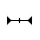

# oh_pointer_style.h

<!--Kit: Input Kit-->
<!--Subsystem: MultimodalInput-->
<!--Owner: @zhaoxueyuan-->
<!--Designer: @hanruofei-->
<!--Tester: @Lyuxin-->
<!--Adviser: @zhang_yixin13-->

## 概述

鼠标光标的样式。

**引用文件：** <multimodalinput/oh_pointer_style.h>

**库：** libohinput.so

**系统能力：** SystemCapability.MultimodalInput.Input.Core

**起始版本：** 22

**相关模块：** [input](capi-input.md)

## 汇总

### 枚举

| 名称 | typedef关键字 | 描述 |
| -- | -- | -- |
| [Input_PointerStyle](#input_pointerstyle) | Input_PointerStyle | 鼠标光标样式。 |

## 枚举类型说明

### Input_PointerStyle

```c
enum Input_PointerStyle
```

**描述**

鼠标光标样式。

**起始版本：** 22

| 枚举项        | 描述     |图示 |
| ------------ | ------ |------ |
| DEFAULT = 0    | 应用未设置时显示的光标样式。    ||
| EAST = 1    | 向东箭头   ||
| WEST = 2    | 向西箭头   ||
| SOUTH = 3    | 向南箭头   ||
| NORTH = 4    | 向北箭头   ||
| WEST_EAST = 5    | 向西东箭头  ||
| NORTH_SOUTH = 6    | 向北南箭头  ||
| NORTH_EAST = 7    | 向东北箭头  ||
| NORTH_WEST = 8    | 向西北箭头  ||
| SOUTH_EAST = 9    | 向东南箭头  ||
| SOUTH_WEST = 10   | 向西南箭头  ||
| NORTH_EAST_SOUTH_WEST = 11   | 东北西南调整 ||
| NORTH_WEST_SOUTH_EAST = 12   | 西北东南调整 ||
| CROSS = 13   | 准确选择   ||
| CURSOR_COPY = 14   | 复制     ||
| CURSOR_FORBID = 15   | 不可用    ||
| COLOR_SUCKER = 16   | 取色器     ||
| HAND_GRABBING = 17   | 并拢的手   ||
| HAND_OPEN = 18   | 张开的手   ||
| HAND_POINTING = 19   | 手形指针   ||
| HELP = 20   | 帮助选择   ||
| MOVE = 21   | 移动     ||
| RESIZE_LEFT_RIGHT = 22   | 内部左右调整 ||
| RESIZE_UP_DOWN = 23   | 内部上下调整 ||
| SCREENSHOT_CHOOSE = 24   | 截图十字准星 ||
| SCREENSHOT_CURSOR = 25   | 截图     ||
| TEXT_CURSOR = 26   | 文本选择   ||
| ZOOM_IN = 27   | 放大     ||
| ZOOM_OUT = 28   | 缩小     ||
| MIDDLE_BTN_EAST = 29   | 向东滚动   ||
| MIDDLE_BTN_WEST = 30   | 向西滚动   ||
| MIDDLE_BTN_SOUTH = 31   | 向南滚动   | |
| MIDDLE_BTN_NORTH = 32   | 向北滚动   ||
| MIDDLE_BTN_NORTH_SOUTH = 33   | 向南北滚动  ||
| MIDDLE_BTN_NORTH_EAST = 34   | 向东北滚动  ||
| MIDDLE_BTN_NORTH_WEST = 35   | 向西北滚动  ||
| MIDDLE_BTN_SOUTH_EAST = 36   | 向东南滚动  ||
| MIDDLE_BTN_SOUTH_WEST = 37   | 向西南滚动  ||
| MIDDLE_BTN_NORTH_SOUTH_WEST_EAST = 38   | 四向锥形移动 ||
| HORIZONTAL_TEXT_CURSOR = 39 | 水平文本选择 ||
| CURSOR_CROSS = 40 | 十字光标 ||
| CURSOR_CIRCLE = 41 | 圆形光标 ||
| LOADING = 42 | 正在载入动画光标 ||
| RUNNING = 43 | 后台运行中动画光标 ||
| MIDDLE_BTN_EAST_WEST = 44   | 向东西滚动 ||
| RUNNING_LEFT = 45   | 后台运行中动画光标(拓展1) ||
| RUNNING_RIGHT = 46   | 后台运行中动画光标(拓展2) ||
| AECH_DEVELOPER_DEFINED_ICON = 47   | 圆形自定义光标 ||
| SCREENRECORDER_CURSOR = 48   | 录屏光标  ||
| LASER_CURSOR = 49   | 悬浮光标。手写笔进入空鼠模式时使用该光标，无法直接设置。<br>空鼠模式支持通过手写笔在空中转动来控制屏幕上虚拟光标的移动，并借助笔身按键实现上下翻页功能，用于演示PPT、隔空操作等场景。||
| LASER_CURSOR_DOT = 50   | 点击光标。手写笔进入空鼠模式时使用该光标，无法直接设置。<br>空鼠模式支持通过手写笔在空中转动来控制屏幕上虚拟光标的移动，并借助笔身按键实现上下翻页功能，用于演示PPT、隔空操作等场景。||
| LASER_CURSOR_DOT_RED = 51   | 激光笔光标。手写笔进入空鼠模式时使用该光标，无法直接设置。<br>空鼠模式支持通过手写笔在空中转动来控制屏幕上虚拟光标的移动，并借助笔身按键实现上下翻页功能，用于演示PPT、隔空操作等场景。||
| DEVELOPER_DEFINED_ICON = -100 | 自定义光标，开发者可使用[OH_Input_SetCustomCursor](./capi-oh-input-manager-h.md#oh_input_setcustomcursor)设置自定义光标，不支持使用[OH_Input_SetPointerStyle](./capi-oh-input-manager-h.md#oh_input_setpointerstyle)直接设置。 |自定义光标样式，通过接口设置。|
