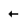
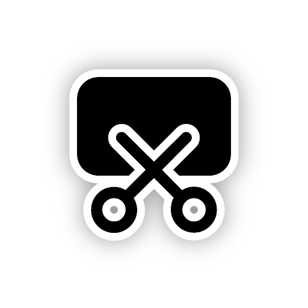
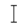
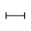

# @ohos.multimodalInput.pointer (鼠标指针)

鼠标指针管理模块，用于查询和设置鼠标指针相关属性。

> **说明**：
>
> 本模块首批接口从API version 9开始支持。后续版本的新增接口，采用上角标单独标记接口的起始版本。

## 导入模块

```js
import { pointer } from '@kit.InputKit';
```

## pointer.setPointerVisible

setPointerVisible(visible: boolean, callback: AsyncCallback&lt;void&gt;): void

设置鼠标指针显示或者隐藏，使用AsyncCallback异步方式返回结果。

**系统能力**：SystemCapability.MultimodalInput.Input.Pointer

**参数**：

| 参数名       | 类型                        | 必填   | 说明                                       |
| -------- | ------------------------- | ---- | ---------------------------------------- |
| visible  | boolean                   | 是    | 鼠标指针是否显示。true表示显示，false表示不显示 |
| callback | AsyncCallback&lt;void&gt; | 是    | 回调函数。 |

**错误码**：

以下错误码的详细介绍请参见[通用错误码](../errorcode-universal.md)。

| 错误码ID  | 错误信息             |
| ---- | --------------------- |
| 401  | Parameter error. Possible causes: 1. Mandatory parameters are left unspecified;2. Incorrect parameter types; 3. Parameter verification failed. |

**示例**：

```js
try {
  pointer.setPointerVisible(true, (error: Error) => {
    if (error) {
      console.log(`Set pointer visible failed, error: ${JSON.stringify(error, [`code`, `message`])}`);
      return;
    }
    console.log(`Set pointer visible success`);
  });
} catch (error) {
  console.log(`Set pointer visible failed, error: ${JSON.stringify(error, [`code`, `message`])}`);
}
```

## pointer.setPointerVisible

setPointerVisible(visible: boolean): Promise&lt;void&gt;

设置鼠标指针显示或者隐藏，使用Promise异步方式返回结果。

**系统能力**：SystemCapability.MultimodalInput.Input.Pointer

**参数**：

| 参数名      | 类型      | 必填   | 说明                                       |
| ------- | ------- | ---- | ---------------------------------------- |
| visible | boolean | 是    | 鼠标指针是否显示。true表示显示，false表示不显示。 |

**返回值**：

| 参数                  | 说明                  |
| ------------------- | ------------------- |
| Promise&lt;void&gt; | Promise对象。 |

**错误码**：

以下错误码的详细介绍请参见[通用错误码](../errorcode-universal.md)。。

| 错误码ID  | 错误信息             |
| ---- | --------------------- |
| 401  | Parameter error. Possible causes: 1. Mandatory parameters are left unspecified;2. Incorrect parameter types; 3. Parameter verification failed. |

**示例**：

```js
try {
  pointer.setPointerVisible(false).then(() => {
    console.log(`Set pointer visible success`);
  });
} catch (error) {
  console.log(`Set pointer visible failed, error: ${JSON.stringify(error, [`code`, `message`])}`);
}
```

## pointer.setPointerVisibleSync<sup>10+</sup>

setPointerVisibleSync(visible: boolean): void

使用同步方式设置鼠标指针显示或者隐藏。

**系统能力**：SystemCapability.MultimodalInput.Input.Pointer

**参数**：

| 参数名      | 类型      | 必填   | 说明                                       |
| ------- | ------- | ---- | ---------------------------------------- |
| visible | boolean | 是    | 鼠标指针是否显示。true表示显示，false表示不显示。 |

**错误码**：

以下错误码的详细介绍请参见[通用错误码](../errorcode-universal.md)。

| 错误码ID  | 错误信息             |
| ---- | --------------------- |
| 401  | Parameter error. Possible causes: 1. Mandatory parameters are left unspecified;2. Incorrect parameter types; 3. Parameter verification failed. |

**示例**：

```js
try {
  pointer.setPointerVisibleSync(false);
  console.log(`Set pointer visible success`);
} catch (error) {
  console.log(`Set pointer visible failed, error: ${JSON.stringify(error, [`code`, `message`])}`);
}
```

## pointer.isPointerVisible

isPointerVisible(callback: AsyncCallback&lt;boolean&gt;): void

获取鼠标指针显示或隐藏状态，使用AsyncCallback异步方式返回结果。

**系统能力**：SystemCapability.MultimodalInput.Input.Pointer

**参数**：

| 参数名       | 类型                           | 必填   | 说明             |
| -------- | ---------------------------- | ---- | -------------- |
| callback | AsyncCallback&lt;boolean&gt; | 是    | 回调函数，异步返回鼠标指针状态，true为显示，false为隐藏。 |

**错误码**：

以下错误码的详细介绍请参见[通用错误码](../errorcode-universal.md)。

| 错误码ID  | 错误信息             |
| ---- | --------------------- |
| 401  | Parameter error. Possible causes: 1. Mandatory parameters are left unspecified;2. Incorrect parameter types; 3. Parameter verification failed. |

**示例**：

```js
try {
  pointer.isPointerVisible((error: Error, visible: boolean) => {
    if (error) {
      console.log(`Get pointer visible failed, error: ${JSON.stringify(error, [`code`, `message`])}`);
      return;
    }
    console.log(`Get pointer visible success, visible: ${JSON.stringify(visible)}`);
  });
} catch (error) {
  console.log(`Get pointer visible failed, error: ${JSON.stringify(error, [`code`, `message`])}`);
}
```

## pointer.isPointerVisible

isPointerVisible(): Promise&lt;boolean&gt;

获取鼠标指针显示或隐藏状态，使用Promise异步方式返回结果。

**系统能力**：SystemCapability.MultimodalInput.Input.Pointer

**返回值**：

| 参数                     | 说明                  |
| ---------------------- | ------------------- |
| Promise&lt;boolean&gt; | Promise对象，异步返回鼠标指针显示或隐藏状态。 |

**示例**：

```js
try {
  pointer.isPointerVisible().then((visible: boolean) => {
    console.log(`Get pointer visible success, visible: ${JSON.stringify(visible)}`);
  });
} catch (error) {
  console.log(`Get pointer visible failed, error: ${JSON.stringify(error, [`code`, `message`])}`);
}
```

## pointer.isPointerVisibleSync<sup>10+</sup>

isPointerVisibleSync(): boolean

使用同步方式获取鼠标指针显示或者隐藏。

**系统能力**：SystemCapability.MultimodalInput.Input.Pointer

**返回值**：

| 参数                     | 说明                  |
| ---------------------- | ------------------- |
| boolean | 返回鼠标指针显示或隐藏状态。true代表显示状态，false代表隐藏状态。 |

**示例**：

```js
try {
  let visible: boolean = pointer.isPointerVisibleSync();
  console.log(`Get pointer visible success, visible: ${JSON.stringify(visible)}`);
} catch (error) {
  console.log(`Get pointer visible failed, error: ${JSON.stringify(error, [`code`, `message`])}`);
}
```

## pointer.getPointerStyle

getPointerStyle(windowId: number, callback: AsyncCallback&lt;PointerStyle&gt;): void

获取鼠标样式类型，使用AsyncCallback异步方式返回结果。

**系统能力**：SystemCapability.MultimodalInput.Input.Pointer

**参数**：

| 参数名       | 类型                                       | 必填   | 说明             |
| -------- | ---------------------------------------- | ---- | -------------- |
| windowId | number                                   | 是    | 窗口id。    |
| callback | AsyncCallback&lt;[PointerStyle](#pointerstyle)&gt; | 是    | 回调函数，异步返回鼠标样式类型。 |

**错误码**：

以下错误码的详细介绍请参见[通用错误码](../errorcode-universal.md)。

| 错误码ID  | 错误信息             |
| ---- | --------------------- |
| 401  | Parameter error. Possible causes: 1. Mandatory parameters are left unspecified;2. Incorrect parameter types; 3. Parameter verification failed. |

**示例**：

```js
import { BusinessError } from '@kit.BasicServicesKit';
import { window } from '@kit.ArkUI';

let context = getContext(this);
window.getLastWindow(context, (error: BusinessError, win: window.Window) => {
  if (error.code) {
    console.error('Failed to obtain the top window. Cause: ' + JSON.stringify(error));
    return;
  }
  let windowId = win.getWindowProperties().id;
  if (windowId < 0) {
    console.log(`Invalid windowId`);
    return;
  }
  try {
    pointer.getPointerStyle(windowId, (error: Error, style: pointer.PointerStyle) => {
      console.log(`Get pointer style success, style: ${JSON.stringify(style)}`);
    });
  } catch (error) {
    console.log(`Get pointer style failed, error: ${JSON.stringify(error, [`code`, `message`])}`);
  }
});
```

## pointer.getPointerStyle

getPointerStyle(windowId: number): Promise&lt;PointerStyle&gt;

获取鼠标样式类型，使用Promise异步方式返回结果。

**系统能力**：SystemCapability.MultimodalInput.Input.Pointer

**参数**：

| 参数名     | 类型   | 必填 | 说明     |
| -------- | ------ | ---- | -------- |
| windowId | number | 是   | 窗口id。 |

**返回值**：

| 参数                                       | 说明                  |
| ---------------------------------------- | ------------------- |
| Promise&lt;[PointerStyle](#pointerstyle)&gt; | Promise实例，异步返回鼠标样式类型。 |

**错误码**：

以下错误码的详细介绍请参见[通用错误码](../errorcode-universal.md)。

| 错误码ID  | 错误信息             |
| ---- | --------------------- |
| 401  | Parameter error. Possible causes: 1. Mandatory parameters are left unspecified;2. Incorrect parameter types; 3. Parameter verification failed. |

**示例**：

```js
import { BusinessError } from '@kit.BasicServicesKit';
import { window } from '@kit.ArkUI';

let context = getContext(this);
window.getLastWindow(context, (error: BusinessError, win: window.Window) => {
  if (error.code) {
    console.error('Failed to obtain the top window. Cause: ' + JSON.stringify(error));
    return;
  }
  let windowId = win.getWindowProperties().id;
  if (windowId < 0) {
    console.log(`Invalid windowId`);
    return;
  }
  try {
    pointer.getPointerStyle(windowId).then((style: pointer.PointerStyle) => {
      console.log(`Get pointer style success, style: ${JSON.stringify(style)}`);
    });
  } catch (error) {
    console.log(`Get pointer style failed, error: ${JSON.stringify(error, [`code`, `message`])}`);
  }
});
```

## pointer.getPointerStyleSync<sup>10+</sup>

getPointerStyleSync(windowId: number): PointerStyle

使用同步方式获取鼠标样式类型。

**系统能力**：SystemCapability.MultimodalInput.Input.Pointer

**参数**：

| 参数名     | 类型   | 必填 | 说明     |
| -------- | ------ | ---- | -------- |
| windowId | number | 是   | 窗口id。<br>默认值为-1，表示获取全局的鼠标样式。 |

**返回值**：

| 参数                                       | 说明                  |
| ---------------------------------------- | ------------------- |
| [PointerStyle](#pointerstyle) | 返回鼠标样式类型。 |

**错误码**：

以下错误码的详细介绍请参见[通用错误码](../errorcode-universal.md)。

| 错误码ID  | 错误信息             |
| ---- | --------------------- |
| 401  | Parameter error. Possible causes: 1. Mandatory parameters are left unspecified;2. Incorrect parameter types; 3. Parameter verification failed. |

**示例**：

```js
import { pointer } from '@kit.InputKit';

let windowId = -1;
try {
  let style: pointer.PointerStyle = pointer.getPointerStyleSync(windowId);
  console.log(`Get pointer style success, style: ${JSON.stringify(style)}`);
} catch (error) {
  console.log(`Get pointer style failed, error: ${JSON.stringify(error, [`code`, `message`])}`);
}
```

## pointer.setPointerStyle

setPointerStyle(windowId: number, pointerStyle: PointerStyle, callback: AsyncCallback&lt;void&gt;): void

设置鼠标样式类型，使用AsyncCallback异步方式返回结果。

**系统能力**：SystemCapability.MultimodalInput.Input.Pointer

**参数**：

| 参数名           | 类型                             | 必填   | 说明                                  |
| ------------ | ------------------------------ | ---- | ----------------------------------- |
| windowId     | number                         | 是    | 窗口id。                          |
| pointerStyle | [PointerStyle](#pointerstyle) | 是    | 鼠标样式。                             |
| callback     | AsyncCallback&lt;void&gt;      | 是    | 回调函数。 |

**错误码**：

以下错误码的详细介绍请参见[通用错误码](../errorcode-universal.md)。

| 错误码ID  | 错误信息             |
| ---- | --------------------- |
| 401  | Parameter error. Possible causes: 1. Mandatory parameters are left unspecified;2. Incorrect parameter types; 3. Parameter verification failed. |

**示例**：

```js
import { BusinessError } from '@kit.BasicServicesKit';
import { window } from '@kit.ArkUI';

window.getLastWindow(getContext(), (error: BusinessError, win: window.Window) => {
  if (error.code) {
    console.error('Failed to obtain the top window. Cause: ' + JSON.stringify(error));
    return;
  }
  let windowId = win.getWindowProperties().id;
  if (windowId < 0) {
    console.log(`Invalid windowId`);
    return;
  }
  try {
    pointer.setPointerStyle(windowId, pointer.PointerStyle.CROSS, error => {
      console.log(`Set pointer style success`);
    });
  } catch (error) {
    console.log(`Set pointer style failed, error: ${JSON.stringify(error, [`code`, `message`])}`);
  }
});
```
## pointer.setPointerStyle

setPointerStyle(windowId: number, pointerStyle: PointerStyle): Promise&lt;void&gt;

设置鼠标样式类型，使用Promise异步方式返回结果。

**系统能力**：SystemCapability.MultimodalInput.Input.Pointer

**参数**：

| 参数名                  | 类型                             | 必填   | 说明               |
| ------------------- | ------------------------------ | ---- | ---------------- |
| windowId            | number                         | 是    | 窗口id。       |
| pointerStyle        | [PointerStyle](#pointerstyle) | 是    | 鼠标样式。          |

**返回值**：

| 参数                  | 说明                  |
| ------------------- | ------------------- |
| Promise&lt;void&gt; | Promise对象。 |

**错误码**：

以下错误码的详细介绍请参见[通用错误码](../errorcode-universal.md)。

| 错误码ID  | 错误信息             |
| ---- | --------------------- |
| 401  | Parameter error. Possible causes: 1. Mandatory parameters are left unspecified;2. Incorrect parameter types; 3. Parameter verification failed. |

**示例**：

```js
import { BusinessError } from '@kit.BasicServicesKit';
import { window } from '@kit.ArkUI';

window.getLastWindow(getContext(), (error: BusinessError, win: window.Window) => {
  if (error.code) {
    console.error('Failed to obtain the top window. Cause: ' + JSON.stringify(error));
    return;
  }
  let windowId = win.getWindowProperties().id;
  if (windowId < 0) {
    console.log(`Invalid windowId`);
    return;
  }
  try {
    pointer.setPointerStyle(windowId, pointer.PointerStyle.CROSS).then(() => {
      console.log(`Set pointer style success`);
    });
  } catch (error) {
    console.log(`Set pointer style failed, error: ${JSON.stringify(error, [`code`, `message`])}`);
  }
});
```

## pointer.setPointerStyleSync<sup>10+</sup>

setPointerStyleSync(windowId: number, pointerStyle: PointerStyle): void

使用同步方式设置鼠标样式类型。

**系统能力**：SystemCapability.MultimodalInput.Input.Pointer

**参数**：

| 参数名                  | 类型                             | 必填   | 说明               |
| ------------------- | ------------------------------ | ---- | ---------------- |
| windowId            | number                         | 是    | 窗口id。       |
| pointerStyle        | [PointerStyle](#pointerstyle) | 是    | 鼠标样式。          |

**错误码**：

以下错误码的详细介绍请参见[通用错误码](../errorcode-universal.md)。

| 错误码ID  | 错误信息             |
| ---- | --------------------- |
| 401  | Parameter error. Possible causes: 1. Mandatory parameters are left unspecified;2. Incorrect parameter types; 3. Parameter verification failed. |

**示例**：
```js
import { BusinessError } from '@kit.BasicServicesKit';
import { window } from '@kit.ArkUI';

window.getLastWindow(getContext(), (error: BusinessError, win: window.Window) => {
  if (error.code) {
    console.error('Failed to obtain the top window. Cause: ' + JSON.stringify(error));
    return;
  }
  let windowId = win.getWindowProperties().id;
  if (windowId < 0) {
    console.log(`Invalid windowId`);
    return;
  }
  try {
    pointer.setPointerStyleSync(windowId, pointer.PointerStyle.CROSS);
    console.log(`Set pointer style success`);
  } catch (error) {
    console.log(`getPointerSize failed, error: ${JSON.stringify(error, [`code`, `message`])}`);
  }
});
```

## PrimaryButton<sup>10+</sup>

鼠标主键类型。

**系统能力**：SystemCapability.MultimodalInput.Input.Pointer

| 名称                               | 值    | 说明     |
| -------------------------------- | ---- | ------ |
| LEFT                          | 0    | 鼠标左键     |
| RIGHT                             | 1    | 鼠标右键   |

## RightClickType<sup>10+</sup>

右键菜单触发方式。

**系统能力**：SystemCapability.MultimodalInput.Input.Pointer

| 名称                               | 值    | 说明     |
| -------------------------------- | ---- | ------ |
| TOUCHPAD_RIGHT_BUTTON            | 1    |触控板右键区域。 |
| TOUCHPAD_LEFT_BUTTON            | 2    |触控板左键区域。 |
| TOUCHPAD_TWO_FINGER_TAP         | 3    |双指轻击或按压触控板。|

## PointerStyle

鼠标样式类型。

**系统能力**：SystemCapability.MultimodalInput.Input.Pointer

| 名称                               | 值    | 说明     |图示 |
| -------------------------------- | ---- | ------ |------ |
| DEFAULT                          | 0    | 默认     ||
| EAST                             | 1    | 向东箭头   ||
| WEST                             | 2    | 向西箭头   ||
| SOUTH                            | 3    | 向南箭头   ||
| NORTH                            | 4    | 向北箭头   ||
| WEST_EAST                        | 5    | 向西东箭头  ||
| NORTH_SOUTH                      | 6    | 向北南箭头  ||
| NORTH_EAST                       | 7    | 向东北箭头  ||
| NORTH_WEST                       | 8    | 向西北箭头  ||
| SOUTH_EAST                       | 9    | 向东南箭头  ||
| SOUTH_WEST                       | 10   | 向西南箭头  ||
| NORTH_EAST_SOUTH_WEST            | 11   | 东北西南调整 ||
| NORTH_WEST_SOUTH_EAST            | 12   | 西北东南调整 ||
| CROSS                            | 13   | 准确选择   ||
| CURSOR_COPY                      | 14   | 拷贝     ||
| CURSOR_FORBID                    | 15   | 不可用    ||
| COLOR_SUCKER                     | 16   | 滴管     ||
| HAND_GRABBING                    | 17   | 并拢的手   ||
| HAND_OPEN                        | 18   | 张开的手   ||
| HAND_POINTING                    | 19   | 手形指针   ||
| HELP                             | 20   | 帮助选择   ||
| MOVE                             | 21   | 移动     ||
| RESIZE_LEFT_RIGHT                | 22   | 内部左右调整 ||
| RESIZE_UP_DOWN                   | 23   | 内部上下调整 ||
| SCREENSHOT_CHOOSE                | 24   | 截图十字准星 ||
| SCREENSHOT_CURSOR                | 25   | 截图     ||
| TEXT_CURSOR                      | 26   | 文本选择   ||
| ZOOM_IN                          | 27   | 放大     ||
| ZOOM_OUT                         | 28   | 缩小     ||
| MIDDLE_BTN_EAST                  | 29   | 向东滚动   ||
| MIDDLE_BTN_WEST                  | 30   | 向西滚动   ||
| MIDDLE_BTN_SOUTH                 | 31   | 向南滚动   |             |
| MIDDLE_BTN_NORTH                 | 32   | 向北滚动   ||
| MIDDLE_BTN_NORTH_SOUTH           | 33   | 向南北滚动  ||
| MIDDLE_BTN_NORTH_EAST            | 34   | 向东北滚动  ||
| MIDDLE_BTN_NORTH_WEST            | 35   | 向西北滚动  ||
| MIDDLE_BTN_SOUTH_EAST            | 36   | 向东南滚动  ||
| MIDDLE_BTN_SOUTH_WEST            | 37   | 向西南滚动  ||
| MIDDLE_BTN_NORTH_SOUTH_WEST_EAST | 38   | 四向锥形移动 ||
| HORIZONTAL_TEXT_CURSOR<sup>10+</sup> | 39 | 垂直文本选择 ||
| CURSOR_CROSS<sup>10+</sup> | 40 | 十字光标 ||
| CURSOR_CIRCLE<sup>10+</sup> | 41 | 圆形光标 ||
| LOADING<sup>10+</sup> | 42 | 正在载入动画光标 |<br/>**原子化服务API：** 从API version 12开始，该接口支持在原子化服务中使用。|
| RUNNING<sup>10+</sup> | 43 | 后台运行中动画光标 |<br/>**原子化服务API：** 从API version 12开始，该接口支持在原子化服务中使用。|
| MIDDLE_BTN_EAST_WEST<sup>16+</sup>           | 44   | 向东西滚动 ||

## pointer.setCustomCursor<sup>11+</sup>

setCustomCursor(windowId: number, pixelMap: image.PixelMap, focusX?: number, focusY?: number): Promise&lt;void&gt;

设置自定义光标样式，使用Promise异步方式返回结果。

**系统能力**：SystemCapability.MultimodalInput.Input.Pointer

**参数**：

| 参数名    | 类型     | 必填   | 说明                                  |
| ----- | ------ | ---- | ----------------------------------- |
| windowId  | number  | 是    | 窗口id。                          |
| pixelMap  | [image.PixelMap](../apis-image-kit/js-apis-image.md#pixelmap7) | 是    | 自定义光标资源。 |
| focusX  | number | 否    | 自定义光标焦点x, 取值范围：大于等于0，默认为0。 |
| focusY  | number | 否    | 自定义光标焦点y，取值范围：大于等于0，默认为0。 |

**返回值**：

| 参数                  | 说明               |
| ------------------- | ---------------- |
| Promise&lt;void&gt; | 无返回结果的Promise对象。 |

**错误码**：

以下错误码的详细介绍请参见[通用错误码](../errorcode-universal.md)。

| 错误码ID  | 错误信息             |
| ---- | --------------------- |
| 401  | Parameter error. Possible causes: 1. Mandatory parameters are left unspecified;2. Incorrect parameter types; 3. Parameter verification failed. |

**示例**：

```js
import { image } from '@kit.ImageKit';
import { BusinessError } from '@kit.BasicServicesKit';
import { window } from '@kit.ArkUI';
getContext().resourceManager.getMediaContent($r("app.media.app_icon")).then((svgFileData) => {
  const svgBuffer: ArrayBuffer = svgFileData.buffer.slice(0);
  let svgImagesource: image.ImageSource = image.createImageSource(svgBuffer);
  let svgDecodingOptions: image.DecodingOptions = {desiredSize: { width: 50, height:50 }};
  svgImagesource.createPixelMap(svgDecodingOptions).then((pixelMap) => {
    window.getLastWindow(getContext(), (error: BusinessError, win: window.Window) => {
      let windowId = win.getWindowProperties().id;
        try {
          pointer.setCustomCursor(windowId, pixelMap).then(() => {
            console.log(`setCustomCursor success`);
          });
        } catch (error) {
          console.log(`setCustomCursor failed, error: ${JSON.stringify(error, [`code`, `message`])}`);
        }
      });
  });
});
```

## pointer.setCustomCursorSync<sup>11+</sup>

setCustomCursorSync(windowId: number, pixelMap: image.PixelMap, focusX?: number, focusY?: number): void

设置自定义光标样式，使用同步方式进行设置。

**系统能力**：SystemCapability.MultimodalInput.Input.Pointer

**参数**：

| 参数名    | 类型     | 必填   | 说明                                  |
| ----- | ------ | ---- | ----------------------------------- |
| windowId  | number  | 是    | 窗口id。                          |
| pixelMap  | [image.PixelMap](../apis-image-kit/js-apis-image.md#pixelmap7) | 是    | 自定义光标资源。 |
| focusX  | number | 否    | 自定义光标焦点x, 取值范围：大于等于0，默认为0。 |
| focusY  | number | 否    | 自定义光标焦点y，取值范围：大于等于0，默认为0。 |

**错误码**：

以下错误码的详细介绍请参见[通用错误码](../errorcode-universal.md)。

| 错误码ID  | 错误信息             |
| ---- | --------------------- |
| 401  | Parameter error. Possible causes: 1. Mandatory parameters are left unspecified;2. Incorrect parameter types; 3. Parameter verification failed. |

**示例**：

```js
import { image } from '@kit.ImageKit';
import { BusinessError } from '@kit.BasicServicesKit';
import { window } from '@kit.ArkUI';
const svgFileData = getContext().resourceManager.getMediaContent($r("app.media.app_icon")).then((svgFileData) => {
  const svgBuffer: ArrayBuffer = svgFileData.buffer.slice(0);
  let svgImagesource: image.ImageSource = image.createImageSource(svgBuffer);
  let svgDecodingOptions: image.DecodingOptions = {desiredSize: { width: 50, height:50 }};
  svgImagesource.createPixelMap(svgDecodingOptions).then((pixelMap) => {
    window.getLastWindow(getContext(), (error: BusinessError, win: window.Window) => {
      let windowId = win.getWindowProperties().id;
        try {
          pointer.setCustomCursorSync(windowId, pixelMap, 25, 25);
          console.log(`setCustomCursorSync success`);
        } catch (error) {
          console.log(`setCustomCursorSync failed, error: ${JSON.stringify(error, [`code`, `message`])}`);
        }
    });
  });
});
```