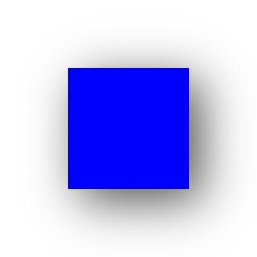

# RenderNode

提供自绘制渲染节点RenderNode，支持开发者通过C API进行开发，完成自定义绘制需求。

> **说明：**
>
> 本模块首批接口从API version 11开始支持。后续版本的新增接口，采用上角标单独标记接口的起始版本。
> 
> 当前不支持在预览器中使用RenderNode。

## 导入模块

```ts
import { RenderNode } from "@ohos.arkui.node";
```

## RenderNode

### constructor

constructor()

RenderNode的构造函数。

**系统能力：** SystemCapability.ArkUI.ArkUI.Full

**示例：**

```ts
import { RenderNode, FrameNode, NodeController } from "@ohos.arkui.node";

const renderNode = new RenderNode();

class MyNodeController extends NodeController {
  private rootNode: FrameNode | null = null;

  makeNode(uiContext: UIContext): FrameNode | null {
    this.rootNode = new FrameNode(uiContext);

    const rootRenderNode = this.rootNode.getRenderNode();
    if (rootRenderNode !== null) {
      rootRenderNode.appendChild(renderNode);
    }

    return this.rootNode;
  }
}

@Entry
@Component
struct Index {
  private MyNodeController: MyNodeController = new MyNodeController();
  build() {
    Row() {
      NodeContainer(this.MyNodeController)
    }
  }
}
```

### appendChild

appendChild(node: RenderNode): void

在RenderNode最后一个子节点后添加新的子节点。

**系统能力：** SystemCapability.ArkUI.ArkUI.Full

**参数：**

| 参数名 | 类型                      | 必填 | 说明                   |
| ------ | ------------------------- | ---- | ---------------------- |
| node   | [RenderNode](#rendernode) | 是   | 需要添加的RenderNode。 |

**示例：**

```ts
import { RenderNode, FrameNode, NodeController } from "@ohos.arkui.node"

const renderNode = new RenderNode();
const child = new RenderNode();
renderNode.appendChild(child);

class MyNodeController extends NodeController {
  private rootNode: FrameNode | null = null;

  makeNode(uiContext: UIContext): FrameNode | null {
    this.rootNode = new FrameNode(uiContext);

    const rootRenderNode = this.rootNode.getRenderNode();
    if (rootRenderNode !== null) {
      rootRenderNode.appendChild(renderNode);
    }

    return this.rootNode;
  }
}

@Entry
@Component
struct Index {
  private MyNodeController: MyNodeController = new MyNodeController();
  build() {
    Row() {
      NodeContainer(this.MyNodeController)
    }
  }
}
```

### insertChildAfter

insertChildAfter(child: RenderNode, sibling: RenderNode | null): void

在RenderNode指定子节点之后添加新的子节点。

**系统能力：** SystemCapability.ArkUI.ArkUI.Full

**参数：**

| 参数名  | 类型                      | 必填 | 说明                                                                         |
| ------- | ------------------------- | ---- | ---------------------------------------------------------------------------- |
| child   | [RenderNode](#rendernode) | 是   | 需要添加的子节点。                                                           |
| sibling | [RenderNode](#rendernode) | 是   | 新节点将插入到该节点之后。若该参数设置为空，则新节点将插入到首个子节点之前。 |

**示例：**

```ts
import { RenderNode, FrameNode, NodeController } from "@ohos.arkui.node"

const renderNode = new RenderNode();
for (let i = 0; i < 10; i++) {
  renderNode.appendChild(new RenderNode());
}

const child = new RenderNode();
const sibling = renderNode.getChild(1);
renderNode.insertChildAfter(child, sibling);

class MyNodeController extends NodeController {
  private rootNode: FrameNode | null = null;

  makeNode(uiContext: UIContext): FrameNode | null {
    this.rootNode = new FrameNode(uiContext);

    const rootRenderNode = this.rootNode.getRenderNode();
    if (rootRenderNode !== null) {
      rootRenderNode.appendChild(renderNode);
    }

    return this.rootNode;
  }
}

@Entry
@Component
struct Index {
  private MyNodeController: MyNodeController = new MyNodeController();
  build() {
    Row() {
      NodeContainer(this.MyNodeController)
    }
  }
}
```

### removeChild

removeChild(node: RenderNode): void

从RenderNode中删除指定的子节点。

**系统能力：** SystemCapability.ArkUI.ArkUI.Full

**参数：**

| 参数名 | 类型                      | 必填 | 说明               |
| ------ | ------------------------- | ---- | ------------------ |
| node   | [RenderNode](#rendernode) | 是   | 需要删除的子节点。 |

**示例：**
```ts
import { RenderNode, FrameNode, NodeController } from "@ohos.arkui.node"

const renderNode = new RenderNode();
for (let i = 0; i < 10; i++) {
  renderNode.appendChild(new RenderNode());
}

const node = renderNode.getChild(1);
renderNode.removeChild(node);

class MyNodeController extends NodeController {
  private rootNode: FrameNode | null = null;

  makeNode(uiContext: UIContext): FrameNode | null {
    this.rootNode = new FrameNode(uiContext);

    const rootRenderNode = this.rootNode.getRenderNode();
    if (rootRenderNode !== null) {
      rootRenderNode.appendChild(renderNode);
    }

    return this.rootNode;
  }
}

@Entry
@Component
struct Index {
  private MyNodeController: MyNodeController = new MyNodeController();
  build() {
    Row() {
      NodeContainer(this.MyNodeController)
    }
  }
}
```

### getFirstChild

getFirstChild(): RenderNode | null

获取当前RenderNode的第一个子节点

**系统能力：** SystemCapability.ArkUI.ArkUI.Full

**返回值：**

| 类型                              | 说明                                                       |
| --------------------------------- | ---------------------------------------------------------- |
| [RenderNode](#rendernode) \| null | 首个子节点。若该RenderNode不包含子节点，则返回空对象null。 |

**示例：**

```ts
import { RenderNode, FrameNode, NodeController } from "@ohos.arkui.node"

const renderNode = new RenderNode();
for (let i = 0; i < 10; i++) {
  renderNode.appendChild(new RenderNode());
}
const firstChild = renderNode.getFirstChild();

class MyNodeController extends NodeController {
  private rootNode: FrameNode | null = null;

  makeNode(uiContext: UIContext): FrameNode | null {
    this.rootNode = new FrameNode(uiContext);

    const rootRenderNode = this.rootNode.getRenderNode();
    if (rootRenderNode !== null) {
      rootRenderNode.appendChild(renderNode);
    }

    return this.rootNode;
  }
}

@Entry
@Component
struct Index {
  private MyNodeController: MyNodeController = new MyNodeController();
  build() {
    Row() {
      NodeContainer(this.MyNodeController)
    }
  }
}
```

### getNextSibling

getNextSibling(): RenderNode | null

获取当前RenderNode的下一个同级节点。

**系统能力：** SystemCapability.ArkUI.ArkUI.Full

**返回值：**

| 类型                              | 说明                                                                                   |
| --------------------------------- | -------------------------------------------------------------------------------------- |
| [RenderNode](#rendernode) \| null | 当前RenderNode的下一个同级节点。若该RenderNode不包含下一个同级节点，则返回空对象null。 |

**示例：**
```ts
import { RenderNode, FrameNode, NodeController } from "@ohos.arkui.node"

const renderNode = new RenderNode();
for (let i = 0; i < 10; i++) {
  renderNode.appendChild(new RenderNode());
}
const child = renderNode.getChild(1);
if (child !== null) {
  const nextSibling = child.getNextSibling();
}

class MyNodeController extends NodeController {
  private rootNode: FrameNode | null = null;

  makeNode(uiContext: UIContext): FrameNode | null {
    this.rootNode = new FrameNode(uiContext);

    const rootRenderNode = this.rootNode.getRenderNode();
    if (rootRenderNode !== null) {
      rootRenderNode.appendChild(renderNode);
    }

    return this.rootNode;
  }
}

@Entry
@Component
struct Index {
  private MyNodeController: MyNodeController = new MyNodeController();
  build() {
    Row() {
      NodeContainer(this.MyNodeController)
    }
  }
}
```

### getPreviousSibling

getPreviousSibling(): RenderNode | null

获取当前RenderNode的上一个同级节点

**系统能力：** SystemCapability.ArkUI.ArkUI.Full

**返回值：**

| 类型                              | 说明                                                                                   |
| --------------------------------- | -------------------------------------------------------------------------------------- |
| [RenderNode](#rendernode) \| null | 当前RenderNode的上一个同级节点。若该RenderNode不包含上一个同级节点，则返回空对象null。 |

**示例：**
```ts
import { RenderNode, FrameNode, NodeController } from "@ohos.arkui.node"

const renderNode = new RenderNode();
for (let i = 0; i < 10; i++) {
  renderNode.appendChild(new RenderNode());
}
const child = renderNode.getChild(1);
if (child !== null) {
  const nextSibling = child.getPreviousSibling();
}

class MyNodeController extends NodeController {
  private rootNode: FrameNode | null = null;

  makeNode(uiContext: UIContext): FrameNode | null {
    this.rootNode = new FrameNode(uiContext);

    const rootRenderNode = this.rootNode.getRenderNode();
    if (rootRenderNode !== null) {
      rootRenderNode.appendChild(renderNode);
    }

    return this.rootNode;
  }
}

@Entry
@Component
struct Index {
  private MyNodeController: MyNodeController = new MyNodeController();
  build() {
    Row() {
      NodeContainer(this.MyNodeController)
    }
  }
}
```

### backgroundColor

set backgroundColor(color: number)

设置当前RenderNode的背景颜色。

**系统能力：** SystemCapability.ArkUI.ArkUI.Full

**参数：**

| 参数名 | 类型   | 必填 | 说明                   |
| ------ | ------ | ---- | ---------------------- |
| color  | number | 是   | 背景颜色值，ARGB格式。 |

**示例：**
```ts
import { RenderNode, FrameNode, NodeController } from "@ohos.arkui.node"

const renderNode = new RenderNode();
renderNode.backgroundColor = 0XFF00FF00;

class MyNodeController extends NodeController {
  private rootNode: FrameNode | null = null;

  makeNode(uiContext: UIContext): FrameNode | null {
    this.rootNode = new FrameNode(uiContext);

    const rootRenderNode = this.rootNode.getRenderNode();
    if (rootRenderNode !== null) {
      rootRenderNode.appendChild(renderNode);
    }

    return this.rootNode;
  }
}

@Entry
@Component
struct Index {
  private MyNodeController: MyNodeController = new MyNodeController();
  build() {
    Row() {
      NodeContainer(this.MyNodeController)
    }
  }
}
```

get backgroundColor(): number

获取当前RenderNode的背景颜色。

**系统能力：** SystemCapability.ArkUI.ArkUI.Full

**返回值：**

| 类型   | 说明                                           |
| ------ | ---------------------------------------------- |
| number | 当前RenderNode的背景颜色，默认值为0X00000000。 |

**示例：**
```ts
import { RenderNode, FrameNode, NodeController } from "@ohos.arkui.node"

const renderNode = new RenderNode();
const backgroundColor = renderNode.backgroundColor;

class MyNodeController extends NodeController {
  private rootNode: FrameNode | null = null;

  makeNode(uiContext: UIContext): FrameNode | null {
    this.rootNode = new FrameNode(uiContext);

    const rootRenderNode = this.rootNode.getRenderNode();
    if (rootRenderNode !== null) {
      rootRenderNode.appendChild(renderNode);
    }

    return this.rootNode;
  }
}

@Entry
@Component
struct Index {
  private MyNodeController: MyNodeController = new MyNodeController();
  build() {
    Row() {
      NodeContainer(this.MyNodeController)
    }
  }
}
```

### clipToFrame

set clipToFrame(useClip: boolean)

设置是否对当前RenderNode剪裁。若设置为true，则超出该RenderNode大小的部分将会被截断。

**系统能力：** SystemCapability.ArkUI.ArkUI.Full

**参数：**

| 参数名  | 类型    | 必填 | 说明               |
| ------- | ------- | ---- | ------------------ |
| useClip | boolean | 是   | 设置是否进行剪裁。 |

**示例：**
```ts
import { RenderNode, FrameNode, NodeController } from "@ohos.arkui.node"

const renderNode = new RenderNode();
renderNode.clipToFrame = true;

class MyNodeController extends NodeController {
  private rootNode: FrameNode | null = null;

  makeNode(uiContext: UIContext): FrameNode | null {
    this.rootNode = new FrameNode(uiContext);

    const rootRenderNode = this.rootNode.getRenderNode();
    if (rootRenderNode !== null) {
      rootRenderNode.appendChild(renderNode);
    }

    return this.rootNode;
  }
}

@Entry
@Component
struct Index {
  private MyNodeController: MyNodeController = new MyNodeController();
  build() {
    Row() {
      NodeContainer(this.MyNodeController)
    }
  }
}
```

get clipToFrame(): boolean

获取当前RenderNode是否需要进行剪裁。

**系统能力：** SystemCapability.ArkUI.ArkUI.Full

**返回值：**

| 类型    | 说明                                                |
| ------- | --------------------------------------------------- |
| boolean | 获取当前RenderNode是否需要进行剪裁，默认值为false。 |

**示例：**
```ts
import { RenderNode, FrameNode, NodeController } from "@ohos.arkui.node"

const renderNode = new RenderNode();
const clipToFrame = renderNode.clipToFrame;

class MyNodeController extends NodeController {
  private rootNode: FrameNode | null = null;

  makeNode(uiContext: UIContext): FrameNode | null {
    this.rootNode = new FrameNode(uiContext);

    const rootRenderNode = this.rootNode.getRenderNode();
    if (rootRenderNode !== null) {
      rootRenderNode.appendChild(renderNode);
    }

    return this.rootNode;
  }
}

@Entry
@Component
struct Index {
  private MyNodeController: MyNodeController = new MyNodeController();
  build() {
    Row() {
      NodeContainer(this.MyNodeController)
    }
  }
}
```

### opacity

set opacity(value: number)

设置当前RenderNode的不透明度。

**系统能力：** SystemCapability.ArkUI.ArkUI.Full

**参数：**

| 参数名 | 类型   | 必填 | 说明                                   |
| ------ | ------ | ---- | -------------------------------------- |
| value  | number | 是   | 将要设置的不透明度，数据范围为[0, 1]。 |

**示例：**
```ts
import { RenderNode, FrameNode, NodeController } from "@ohos.arkui.node"

const renderNode = new RenderNode();
renderNode.opacity = 0.5;

class MyNodeController extends NodeController {
  private rootNode: FrameNode | null = null;

  makeNode(uiContext: UIContext): FrameNode | null {
    this.rootNode = new FrameNode(uiContext);

    const rootRenderNode = this.rootNode.getRenderNode();
    if (rootRenderNode !== null) {
      rootRenderNode.appendChild(renderNode);
    }

    return this.rootNode;
  }
}

@Entry
@Component
struct Index {
  private MyNodeController: MyNodeController = new MyNodeController();
  build() {
    Row() {
      NodeContainer(this.MyNodeController)
    }
  }
}
```

get opacity(): number

获取当前RenderNode的不透明度。

**系统能力：** SystemCapability.ArkUI.ArkUI.Full

**返回值：**

| 类型   | 说明                                      |
| ------ | ----------------------------------------- |
| number | 获取当前RenderNode的不透明度，默认值为1。 |

**示例：**
```ts
import { RenderNode, FrameNode, NodeController } from "@ohos.arkui.node"

const renderNode = new RenderNode();
const opacity = renderNode.opacity;

class MyNodeController extends NodeController {
  private rootNode: FrameNode | null = null;

  makeNode(uiContext: UIContext): FrameNode | null {
    this.rootNode = new FrameNode(uiContext);

    const rootRenderNode = this.rootNode.getRenderNode();
    if (rootRenderNode !== null) {
      rootRenderNode.appendChild(renderNode);
    }

    return this.rootNode;
  }
}

@Entry
@Component
struct Index {
  private MyNodeController: MyNodeController = new MyNodeController();
  build() {
    Row() {
      NodeContainer(this.MyNodeController)
    }
  }
}
```

### size

set size(size: Size)

设置当前RenderNode的大小。

**系统能力：** SystemCapability.ArkUI.ArkUI.Full

**参数：**

| 参数名 | 类型                                     | 必填 | 说明                         |
| ------ | ---------------------------------------- | ---- | ---------------------------- |
| size   | [Size](./js-apis-arkui-graphics.md#size) | 是   | 将要设置的RenderNode的大小。 |

**示例：**
```ts
import { RenderNode, FrameNode, NodeController } from "@ohos.arkui.node"

const renderNode = new RenderNode();
renderNode.size = { width: 100, height: 100 };

class MyNodeController extends NodeController {
  private rootNode: FrameNode | null = null;

  makeNode(uiContext: UIContext): FrameNode | null {
    this.rootNode = new FrameNode(uiContext);

    const rootRenderNode = this.rootNode.getRenderNode();
    if (rootRenderNode !== null) {
      rootRenderNode.appendChild(renderNode);
    }

    return this.rootNode;
  }
}

@Entry
@Component
struct Index {
  private MyNodeController: MyNodeController = new MyNodeController();
  build() {
    Row() {
      NodeContainer(this.MyNodeController)
    }
  }
}
```

get size(): Size

获取当前RenderNode的大小。

**系统能力：** SystemCapability.ArkUI.ArkUI.Full

**返回值：**

| 类型   | 说明                                            |
| ------ | ----------------------------------------------- |
| number | 获取当前RenderNode的大小，默认值宽度和高度为0。 |

**示例：**
```ts
import { RenderNode, FrameNode, NodeController } from "@ohos.arkui.node"

const renderNode = new RenderNode();
const size = renderNode.size;

class MyNodeController extends NodeController {
  private rootNode: FrameNode | null = null;

  makeNode(uiContext: UIContext): FrameNode | null {
    this.rootNode = new FrameNode(uiContext);

    const rootRenderNode = this.rootNode.getRenderNode();
    if (rootRenderNode !== null) {
      rootRenderNode.appendChild(renderNode);
    }

    return this.rootNode;
  }
}

@Entry
@Component
struct Index {
  private MyNodeController: MyNodeController = new MyNodeController();
  build() {
    Row() {
      NodeContainer(this.MyNodeController)
    }
  }
}
```

### position

set position(position: Position)

设置当前RenderNode的位置。

**系统能力：** SystemCapability.ArkUI.ArkUI.Full

**参数：**

| 参数名   | 类型                                             | 必填 | 说明                         |
| -------- | ------------------------------------------------ | ---- | ---------------------------- |
| position | [Position](./js-apis-arkui-graphics.md#position) | 是   | 将要设置的RenderNode的位置。 |

**示例：**
```ts
import { RenderNode, FrameNode, NodeController } from "@ohos.arkui.node"

const renderNode = new RenderNode();
renderNode.position = { x: 100, y: 100 };

class MyNodeController extends NodeController {
  private rootNode: FrameNode | null = null;

  makeNode(uiContext: UIContext): FrameNode | null {
    this.rootNode = new FrameNode(uiContext);

    const rootRenderNode = this.rootNode.getRenderNode();
    if (rootRenderNode !== null) {
      rootRenderNode.appendChild(renderNode);
    }

    return this.rootNode;
  }
}

@Entry
@Component
struct Index {
  private MyNodeController: MyNodeController = new MyNodeController();
  build() {
    Row() {
      NodeContainer(this.MyNodeController)
    }
  }
}
```

get position(): Position

获取当前RenderNode的位置。

**系统能力：** SystemCapability.ArkUI.ArkUI.Full

**返回值：**

| 类型                                             | 说明                                                 |
| ------------------------------------------------ | ---------------------------------------------------- |
| [Position](./js-apis-arkui-graphics.md#position) | 获取当前RenderNode的位置，默认位置为{ x: 0, y: 0 }。 |

**示例：**
```ts
import { RenderNode, FrameNode, NodeController } from "@ohos.arkui.node"

const renderNode = new RenderNode();
const position = renderNode.position;

class MyNodeController extends NodeController {
  private rootNode: FrameNode | null = null;

  makeNode(uiContext: UIContext): FrameNode | null {
    this.rootNode = new FrameNode(uiContext);

    const rootRenderNode = this.rootNode.getRenderNode();
    if (rootRenderNode !== null) {
      rootRenderNode.appendChild(renderNode);
    }

    return this.rootNode;
  }
}

@Entry
@Component
struct Index {
  private MyNodeController: MyNodeController = new MyNodeController();
  build() {
    Row() {
      NodeContainer(this.MyNodeController)
    }
  }
}
```

### frame

set frame(frame: Frame)

设置当前RenderNode的大小和位置。当和[position](#position)、[size](#size)同时使用时，以后设置的为准。

**系统能力：** SystemCapability.ArkUI.ArkUI.Full

**参数：**

| 参数名 | 类型                                       | 必填 | 说明                             |
| ------ | ------------------------------------------ | ---- | -------------------------------- |
| frame  | [Frame](./js-apis-arkui-graphics.md#frame) | 是   | 将要设置的RenderNode的大小和位置 |

**示例：**
```ts
import { RenderNode, FrameNode, NodeController } from "@ohos.arkui.node"

const renderNode = new RenderNode();
renderNode.frame = { x: 50, y: 50, width: 100, height: 100 };

class MyNodeController extends NodeController {
  private rootNode: FrameNode | null = null;

  makeNode(uiContext: UIContext): FrameNode | null {
    this.rootNode = new FrameNode(uiContext);

    const rootRenderNode = this.rootNode.getRenderNode();
    if (rootRenderNode !== null) {
      rootRenderNode.appendChild(renderNode);
    }

    return this.rootNode;
  }
}

@Entry
@Component
struct Index {
  private MyNodeController: MyNodeController = new MyNodeController();
  build() {
    Row() {
      NodeContainer(this.MyNodeController)
    }
  }
}
```

get frame(): Frame

获取当前RenderNode的大小和位置。

**系统能力：** SystemCapability.ArkUI.ArkUI.Full

**返回值：**

| 类型  | 说明                                                                          |
| ----- | ----------------------------------------------------------------------------- |
| Frame | 获取当前RenderNode的大小和位置，默认值为{ x: 0, y: 0, width: 0, height: 0 }。 |

**示例：**
```ts
import { RenderNode, FrameNode, NodeController } from "@ohos.arkui.node"

const renderNode = new RenderNode();
const frame = renderNode.frame;

class MyNodeController extends NodeController {
  private rootNode: FrameNode | null = null;

  makeNode(uiContext: UIContext): FrameNode | null {
    this.rootNode = new FrameNode(uiContext);

    const rootRenderNode = this.rootNode.getRenderNode();
    if (rootRenderNode !== null) {
      rootRenderNode.appendChild(renderNode);
    }

    return this.rootNode;
  }
}

@Entry
@Component
struct Index {
  private MyNodeController: MyNodeController = new MyNodeController();
  build() {
    Row() {
      NodeContainer(this.MyNodeController)
    }
  }
}
```

### pivot

set pivot(pivot: Pivot)

设置当前RenderNode的轴心，影响RenderNode的缩放和旋转效果。

**系统能力：** SystemCapability.ArkUI.ArkUI.Full

**参数：**

| 参数名 | 类型                                       | 必填 | 说明                         |
| ------ | ------------------------------------------ | ---- | ---------------------------- |
| pivot  | [Pivot](./js-apis-arkui-graphics.md#pivot) | 是   | 将要设置的RenderNode的轴心。 |

**示例：**
```ts
import { RenderNode, FrameNode, NodeController } from "@ohos.arkui.node"

const renderNode = new RenderNode();
renderNode.pivot = { x: 0.5, y: 0.6 };

class MyNodeController extends NodeController {
  private rootNode: FrameNode | null = null;

  makeNode(uiContext: UIContext): FrameNode | null {
    this.rootNode = new FrameNode(uiContext);

    const rootRenderNode = this.rootNode.getRenderNode();
    if (rootRenderNode !== null) {
      rootRenderNode.appendChild(renderNode);
    }

    return this.rootNode;
  }
}

@Entry
@Component
struct Index {
  private MyNodeController: MyNodeController = new MyNodeController();
  build() {
    Row() {
      NodeContainer(this.MyNodeController)
    }
  }
}
```

get pivot(): Pivot

获取当前RenderNode的轴心。

**系统能力：** SystemCapability.ArkUI.ArkUI.Full

**返回值：**

| 类型                                       | 说明                                                      |
| ------------------------------------------ | --------------------------------------------------------- |
| [Pivot](./js-apis-arkui-graphics.md#pivot) | 获取当前RenderNode的轴心，默认值为{ x: 0.5, y: 0.5}。 |

**示例：**
```ts
import { RenderNode, FrameNode, NodeController } from "@ohos.arkui.node"

const renderNode = new RenderNode();
const pivot = renderNode.pivot;

class MyNodeController extends NodeController {
  private rootNode: FrameNode | null = null;

  makeNode(uiContext: UIContext): FrameNode | null {
    this.rootNode = new FrameNode(uiContext);

    const rootRenderNode = this.rootNode.getRenderNode();
    if (rootRenderNode !== null) {
      rootRenderNode.appendChild(renderNode);
    }

    return this.rootNode;
  }
}

@Entry
@Component
struct Index {
  private MyNodeController: MyNodeController = new MyNodeController();
  build() {
    Row() {
      NodeContainer(this.MyNodeController)
    }
  }
}
```

### scale

set scale(scale: Scale)

设置当前RenderNode的比例。

**系统能力：** SystemCapability.ArkUI.ArkUI.Full

**参数：**

| 参数名 | 类型                                       | 必填 | 说明                             |
| ------ | ------------------------------------------ | ---- | -------------------------------- |
| scale  | [Scale](./js-apis-arkui-graphics.md#scale) | 是   | 将要设置的RenderNode的缩放比例。 |

**示例：**
```ts
import { RenderNode, FrameNode, NodeController } from "@ohos.arkui.node"

const renderNode = new RenderNode();
renderNode.scale = { x: 0.5, y: 1 };

class MyNodeController extends NodeController {
  private rootNode: FrameNode | null = null;

  makeNode(uiContext: UIContext): FrameNode | null {
    this.rootNode = new FrameNode(uiContext);

    const rootRenderNode = this.rootNode.getRenderNode();
    if (rootRenderNode !== null) {
      rootRenderNode.appendChild(renderNode);
    }

    return this.rootNode;
  }
}

@Entry
@Component
struct Index {
  private MyNodeController: MyNodeController = new MyNodeController();
  build() {
    Row() {
      NodeContainer(this.MyNodeController)
    }
  }
}
```

get scale(): Scale

获取当前RenderNode的比例。

**系统能力：** SystemCapability.ArkUI.ArkUI.Full

**返回值：**

| 类型                                       | 说明                                               |
| ------------------------------------------ | -------------------------------------------------- |
| [Scale](./js-apis-arkui-graphics.md#scale) | 获取当前RenderNode的比例，默认值为{ x: 1, y: 1 }。 |

**示例：**
```ts
import { RenderNode, FrameNode, NodeController } from "@ohos.arkui.node"

const renderNode = new RenderNode();
const scale = renderNode.scale;

class MyNodeController extends NodeController {
  private rootNode: FrameNode | null = null;

  makeNode(uiContext: UIContext): FrameNode | null {
    this.rootNode = new FrameNode(uiContext);

    const rootRenderNode = this.rootNode.getRenderNode();
    if (rootRenderNode !== null) {
      rootRenderNode.appendChild(renderNode);
    }

    return this.rootNode;
  }
}

@Entry
@Component
struct Index {
  private MyNodeController: MyNodeController = new MyNodeController();
  build() {
    Row() {
      NodeContainer(this.MyNodeController)
    }
  }
}
```

### translation

set translation(translation: Translation)

设置当前RenderNode的平移量。

**系统能力：** SystemCapability.ArkUI.ArkUI.Full

**参数：**

| 参数名      | 类型                                                   | 必填 | 说明                           |
| ----------- | ------------------------------------------------------ | ---- | ------------------------------ |
| translation | [Translation](./js-apis-arkui-graphics.md#translation) | 是   | 将要设置的RenderNode的平移量。 |

**示例：**
```ts
import { RenderNode, FrameNode, NodeController } from "@ohos.arkui.node"

const renderNode = new RenderNode();
renderNode.translation = { x: 0, y: 1 };

class MyNodeController extends NodeController {
  private rootNode: FrameNode | null = null;

  makeNode(uiContext: UIContext): FrameNode | null {
    this.rootNode = new FrameNode(uiContext);

    const rootRenderNode = this.rootNode.getRenderNode();
    if (rootRenderNode !== null) {
      rootRenderNode.appendChild(renderNode);
    }

    return this.rootNode;
  }
}

@Entry
@Component
struct Index {
  private MyNodeController: MyNodeController = new MyNodeController();
  build() {
    Row() {
      NodeContainer(this.MyNodeController)
    }
  }
}
```

get translation(): Translation

获取当前RenderNode的平移量。

**系统能力：** SystemCapability.ArkUI.ArkUI.Full

**返回值：**

| 类型                                                   | 说明                                                 |
| ------------------------------------------------------ | ---------------------------------------------------- |
| [Translation](./js-apis-arkui-graphics.md#translation) | 获取当前RenderNode的平移量，默认值为{ x: 0, y: 0 }。 |

**示例：**
```ts
import { RenderNode, FrameNode, NodeController } from "@ohos.arkui.node"

const renderNode = new RenderNode();
const translation = renderNode.translation;

class MyNodeController extends NodeController {
  private rootNode: FrameNode | null = null;

  makeNode(uiContext: UIContext): FrameNode | null {
    this.rootNode = new FrameNode(uiContext);

    const rootRenderNode = this.rootNode.getRenderNode();
    if (rootRenderNode !== null) {
      rootRenderNode.appendChild(renderNode);
    }

    return this.rootNode;
  }
}

@Entry
@Component
struct Index {
  private MyNodeController: MyNodeController = new MyNodeController();
  build() {
    Row() {
      NodeContainer(this.MyNodeController)
    }
  }
}
```

### rotation

set rotation(rotation: Rotation)

设置当前RenderNode的旋转角度。

**系统能力：** SystemCapability.ArkUI.ArkUI.Full

**参数：**

| 参数名   | 类型                                             | 必填 | 说明                             |
| -------- | ------------------------------------------------ | ---- | -------------------------------- |
| rotation | [Rotation](./js-apis-arkui-graphics.md#rotation) | 是   | 将要设置的RenderNode的旋转角度。 |

**示例：**
```ts
import { RenderNode, FrameNode, NodeController } from "@ohos.arkui.node"

const renderNode = new RenderNode();
renderNode.rotation = { x: 10, y: 45, z: 0 };

class MyNodeController extends NodeController {
  private rootNode: FrameNode | null = null;

  makeNode(uiContext: UIContext): FrameNode | null {
    this.rootNode = new FrameNode(uiContext);

    const rootRenderNode = this.rootNode.getRenderNode();
    if (rootRenderNode !== null) {
      rootRenderNode.appendChild(renderNode);
    }

    return this.rootNode;
  }
}

@Entry
@Component
struct Index {
  private MyNodeController: MyNodeController = new MyNodeController();
  build() {
    Row() {
      NodeContainer(this.MyNodeController)
    }
  }
}
```

get rotation(): Rotation

获取当前RenderNode的旋转角度。

**系统能力：** SystemCapability.ArkUI.ArkUI.Full

**返回值：**

| 类型                                             | 说明                                                    |
| ------------------------------------------------ | ------------------------------------------------------- |
| [Rotation](./js-apis-arkui-graphics.md#rotation) | 当前RenderNode的旋转角度。默认值为{ x: 0, y: 0, z: 0}。 |

**示例：**
```ts
import { RenderNode, FrameNode, NodeController } from "@ohos.arkui.node"

const renderNode = new RenderNode();
const rotation = renderNode.rotation;

class MyNodeController extends NodeController {
  private rootNode: FrameNode | null = null;

  makeNode(uiContext: UIContext): FrameNode | null {
    this.rootNode = new FrameNode(uiContext);

    const rootRenderNode = this.rootNode.getRenderNode();
    if (rootRenderNode !== null) {
      rootRenderNode.appendChild(renderNode);
    }

    return this.rootNode;
  }
}

@Entry
@Component
struct Index {
  private MyNodeController: MyNodeController = new MyNodeController();
  build() {
    Row() {
      NodeContainer(this.MyNodeController)
    }
  }
}
```

### transform

set transform(transform: Matrix4)

设置当前RenderNode的变换信息。

**系统能力：** SystemCapability.ArkUI.ArkUI.Full

**参数：**

| 参数名    | 类型                                           | 必填 | 说明                             |
| --------- | ---------------------------------------------- | ---- | -------------------------------- |
| transform | [Matrix4](./js-apis-arkui-graphics.md#matrix4) | 是   | 将要设置的RenderNode的变换信息。 |

**示例：**
```ts
import { RenderNode, FrameNode, NodeController } from "@ohos.arkui.node"

const renderNode = new RenderNode();
renderNode.transform = [
  1, 0, 45, 0,
  0, 1,  0, 0,
  0, 0,  1, 0,
  0, 0,  0, 1
];

class MyNodeController extends NodeController {
  private rootNode: FrameNode | null = null;

  makeNode(uiContext: UIContext): FrameNode | null {
    this.rootNode = new FrameNode(uiContext);

    const rootRenderNode = this.rootNode.getRenderNode();
    if (rootRenderNode !== null) {
      rootRenderNode.appendChild(renderNode);
    }

    return this.rootNode;
  }
}

@Entry
@Component
struct Index {
  private MyNodeController: MyNodeController = new MyNodeController();
  build() {
    Row() {
      NodeContainer(this.MyNodeController)
    }
  }
}
```

get transform(): Matrix4

获取当前RenderNode的变换信息。默认值为：
```ts
[
  1, 0, 0, 0,
  0, 1, 0, 0,
  0, 0, 1, 0,
  0, 0, 0, 1
]
```

**系统能力：** SystemCapability.ArkUI.ArkUI.Full

**返回值：**

| 类型                                           | 说明                       |
| ---------------------------------------------- | -------------------------- |
| [Matrix4](./js-apis-arkui-graphics.md#matrix4) | 当前RenderNode的变换信息。 |

**示例：**
```ts
import { RenderNode, FrameNode, NodeController } from "@ohos.arkui.node"

const renderNode = new RenderNode();
const transform = renderNode.transform;

class MyNodeController extends NodeController {
  private rootNode: FrameNode | null = null;

  makeNode(uiContext: UIContext): FrameNode | null {
    this.rootNode = new FrameNode(uiContext);

    const rootRenderNode = this.rootNode.getRenderNode();
    if (rootRenderNode !== null) {
      rootRenderNode.appendChild(renderNode);
    }

    return this.rootNode;
  }
}

@Entry
@Component
struct Index {
  private MyNodeController: MyNodeController = new MyNodeController();
  build() {
    Row() {
      NodeContainer(this.MyNodeController)
    }
  }
}
```

### shadowColor

set shadowColor(color: number)

设置当前RenderNode的阴影颜色，ARGB格式。若设置了[shadowAlpha](#shadowalpha)，则不透明度以shadowAlpha为准。

**系统能力：** SystemCapability.ArkUI.ArkUI.Full

**参数：**

| 参数名 | 类型   | 必填 | 说明                                       |
| ------ | ------ | ---- | ------------------------------------------ |
| color  | number | 是   | 将要设置的RenderNode的阴影颜色，ARGB格式。 |

**示例：**
```ts
import { RenderNode, FrameNode, NodeController } from "@ohos.arkui.node"

const renderNode = new RenderNode();
renderNode.shadowColor = 0XFF00FF00;

class MyNodeController extends NodeController {
  private rootNode: FrameNode | null = null;

  makeNode(uiContext: UIContext): FrameNode | null {
    this.rootNode = new FrameNode(uiContext);

    const rootRenderNode = this.rootNode.getRenderNode();
    if (rootRenderNode !== null) {
      rootRenderNode.appendChild(renderNode);
    }

    return this.rootNode;
  }
}

@Entry
@Component
struct Index {
  private MyNodeController: MyNodeController = new MyNodeController();
  build() {
    Row() {
      NodeContainer(this.MyNodeController)
    }
  }
}
```

get shadowColor(): number

获取当前RenderNode的阴影颜色。

**系统能力：** SystemCapability.ArkUI.ArkUI.Full

**返回值：**

| 类型   | 说明                                                     |
| ------ | -------------------------------------------------------- |
| number | 当前RenderNode的阴影颜色，ARGB格式，默认值为0X00000000。 |

**示例：**
```ts
import { RenderNode, FrameNode, NodeController } from "@ohos.arkui.node"

const renderNode = new RenderNode();
const shadowColor = renderNode.shadowColor;

class MyNodeController extends NodeController {
  private rootNode: FrameNode | null = null;

  makeNode(uiContext: UIContext): FrameNode | null {
    this.rootNode = new FrameNode(uiContext);

    const rootRenderNode = this.rootNode.getRenderNode();
    if (rootRenderNode !== null) {
      rootRenderNode.appendChild(renderNode);
    }

    return this.rootNode;
  }
}

@Entry
@Component
struct Index {
  private MyNodeController: MyNodeController = new MyNodeController();
  build() {
    Row() {
      NodeContainer(this.MyNodeController)
    }
  }
}
```

### shadowOffset

set shadowOffset(offset: Offset)

设置当前RenderNode的阴影偏移

**系统能力：** SystemCapability.ArkUI.ArkUI.Full

**参数：**

| 参数名 | 类型                                         | 必填 | 说明                             |
| ------ | -------------------------------------------- | ---- | -------------------------------- |
| offset | [Offset](./js-apis-arkui-graphics.md#offset) | 是   | 将要设置的RenderNode的阴影偏移。 |

**示例：**

```ts
import { RenderNode, FrameNode, NodeController } from "@ohos.arkui.node"

const renderNode = new RenderNode();
renderNode.shadowOffset = { x: 10, y: 10 };

class MyNodeController extends NodeController {
  private rootNode: FrameNode | null = null;

  makeNode(uiContext: UIContext): FrameNode | null {
    this.rootNode = new FrameNode(uiContext);

    const rootRenderNode = this.rootNode.getRenderNode();
    if (rootRenderNode !== null) {
      rootRenderNode.appendChild(renderNode);
    }

    return this.rootNode;
  }
}

@Entry
@Component
struct Index {
  private MyNodeController: MyNodeController = new MyNodeController();
  build() {
    Row() {
      NodeContainer(this.MyNodeController)
    }
  }
}
```

get shadowOffset(): Offset

获取当前RenderNode的阴影偏移。

**系统能力：** SystemCapability.ArkUI.ArkUI.Full

**返回值：**

| 类型                                         | 说明                                               |
| -------------------------------------------- | -------------------------------------------------- |
| [Offset](./js-apis-arkui-graphics.md#offset) | 当前RenderNode的阴影偏移，默认值为{ x: 0, y: 0 }。 |

**示例：**

```ts
import { RenderNode, FrameNode, NodeController } from "@ohos.arkui.node"

const renderNode = new RenderNode();
const shadowOffset = renderNode.shadowOffset;

class MyNodeController extends NodeController {
  private rootNode: FrameNode | null = null;

  makeNode(uiContext: UIContext): FrameNode | null {
    this.rootNode = new FrameNode(uiContext);

    const rootRenderNode = this.rootNode.getRenderNode();
    if (rootRenderNode !== null) {
      rootRenderNode.appendChild(renderNode);
    }

    return this.rootNode;
  }
}

@Entry
@Component
struct Index {
  private MyNodeController: MyNodeController = new MyNodeController();
  build() {
    Row() {
      NodeContainer(this.MyNodeController)
    }
  }
}
```

### shadowAlpha

set shadowAlpha(alpha: number)

设置当前RenderNode的阴影颜色的Alpha值。

**系统能力：** SystemCapability.ArkUI.ArkUI.Full

**参数：**

| 参数名 | 类型   | 必填 | 说明                                      |
| ------ | ------ | ---- | ----------------------------------------- |
| alpha  | number | 是   | 将要设置的RenderNode的阴影颜色的Alpha值。 |

**示例：**

```ts
import { RenderNode, FrameNode, NodeController } from "@ohos.arkui.node"

const renderNode = new RenderNode();
renderNode.shadowAlpha = 0.5;

class MyNodeController extends NodeController {
  private rootNode: FrameNode | null = null;

  makeNode(uiContext: UIContext): FrameNode | null {
    this.rootNode = new FrameNode(uiContext);

    const rootRenderNode = this.rootNode.getRenderNode();
    if (rootRenderNode !== null) {
      rootRenderNode.appendChild(renderNode);
    }

    return this.rootNode;
  }
}

@Entry
@Component
struct Index {
  private MyNodeController: MyNodeController = new MyNodeController();
  build() {
    Row() {
      NodeContainer(this.MyNodeController)
    }
  }
}
```

get shadowAlpha(): number

获取当前RenderNode的阴影颜色的Alpha值。

**系统能力：** SystemCapability.ArkUI.ArkUI.Full

**返回值：**

| 类型   | 说明                                           |
| ------ | ---------------------------------------------- |
| number | 当前RenderNode的阴影颜色的Alpha值，默认值为0。 |

```ts
import { RenderNode, FrameNode, NodeController } from "@ohos.arkui.node"

const renderNode = new RenderNode();
const shadowAlpha = renderNode.shadowAlpha;

class MyNodeController extends NodeController {
  private rootNode: FrameNode | null = null;

  makeNode(uiContext: UIContext): FrameNode | null {
    this.rootNode = new FrameNode(uiContext);

    const rootRenderNode = this.rootNode.getRenderNode();
    if (rootRenderNode !== null) {
      rootRenderNode.appendChild(renderNode);
    }

    return this.rootNode;
  }
}

@Entry
@Component
struct Index {
  private MyNodeController: MyNodeController = new MyNodeController();
  build() {
    Row() {
      NodeContainer(this.MyNodeController)
    }
  }
}
```

### shadowElevation

set shadowElevation(elevation: number)

设置当前RenderNode的阴影的光照高度。

**系统能力：** SystemCapability.ArkUI.ArkUI.Full

**参数：**

| 参数名    | 类型   | 必填 | 说明                             |
| --------- | ------ | ---- | -------------------------------- |
| elevation | number | 是   | 将要设置的RenderNode的光照高度。 |

**示例：**

```ts
import { RenderNode, FrameNode, NodeController } from "@ohos.arkui.node"

const renderNode = new RenderNode();
renderNode.frame = { x: 0, y: 0, width: 100, height: 100 };
renderNode.shadowOffset = { x: 10, y: 10 };
renderNode.shadowAlpha = 0.7;
renderNode.shadowElevation = 30;

class MyNodeController extends NodeController {
  private rootNode: FrameNode | null = null;

  makeNode(uiContext: UIContext): FrameNode | null {
    this.rootNode = new FrameNode(uiContext);

    const rootRenderNode = this.rootNode.getRenderNode();
    if (rootRenderNode !== null) {
      rootRenderNode.appendChild(renderNode);
    }

    return this.rootNode;
  }
}

@Entry
@Component
struct Index {
  private MyNodeController: MyNodeController = new MyNodeController();
  build() {
    Row() {
      NodeContainer(this.MyNodeController)
    }
  }
}
```


get shadowElevation(): number

获取当前RenderNode的阴影的光照高度。

**系统能力：** SystemCapability.ArkUI.ArkUI.Full

**返回值：**

| 类型   | 说明                                  |
| ------ | ------------------------------------- |
| number | 当前RenderNode的阴影高度，默认值为0。 |

```ts
import { RenderNode, FrameNode, NodeController } from "@ohos.arkui.node"

const renderNode = new RenderNode();
const shadowElevation = renderNode.shadowElevation;

class MyNodeController extends NodeController {
  private rootNode: FrameNode | null = null;

  makeNode(uiContext: UIContext): FrameNode | null {
    this.rootNode = new FrameNode(uiContext);

    const rootRenderNode = this.rootNode.getRenderNode();
    if (rootRenderNode !== null) {
      rootRenderNode.appendChild(renderNode);
    }

    return this.rootNode;
  }
}

@Entry
@Component
struct Index {
  private MyNodeController: MyNodeController = new MyNodeController();
  build() {
    Row() {
      NodeContainer(this.MyNodeController)
    }
  }
}
```

### shadowRadius

set shadowRadius(radius: number)

设置当前RenderNode的阴影模糊半径。

**系统能力：** SystemCapability.ArkUI.ArkUI.Full

**参数：**

| 参数名 | 类型   | 必填 | 说明                                 |
| ------ | ------ | ---- | ------------------------------------ |
| radius | number | 是   | 将要设置的RenderNode的阴影模糊半径。 |

**示例：**

```ts
import { RenderNode, FrameNode, NodeController } from "@ohos.arkui.node"

const renderNode = new RenderNode();
renderNode.frame = { x: 0, y: 0, width: 100, height: 100 };
renderNode.shadowOffset = { x: 10, y: 10 };
renderNode.shadowAlpha = 0.7;
renderNode.shadowRadius = 30;

class MyNodeController extends NodeController {
  private rootNode: FrameNode | null = null;

  makeNode(uiContext: UIContext): FrameNode | null {
    this.rootNode = new FrameNode(uiContext);

    const rootRenderNode = this.rootNode.getRenderNode();
    if (rootRenderNode !== null) {
      rootRenderNode.appendChild(renderNode);
    }

    return this.rootNode;
  }
}

@Entry
@Component
struct Index {
  private MyNodeController: MyNodeController = new MyNodeController();
  build() {
    Row() {
      NodeContainer(this.MyNodeController)
    }
  }
}
```



get shadowRadius(): number

获取当前RenderNode的阴影模糊半径。

**系统能力：** SystemCapability.ArkUI.ArkUI.Full

**返回值：**

| 类型   | 说明                                      |
| ------ | ----------------------------------------- |
| number | 当前RenderNode的阴影模糊半径，默认值为0。 |

```ts
import { RenderNode, FrameNode, NodeController } from "@ohos.arkui.node"

const renderNode = new RenderNode();
const shadowRadius = renderNode.shadowRadius;

class MyNodeController extends NodeController {
  private rootNode: FrameNode | null = null;

  makeNode(uiContext: UIContext): FrameNode | null {
    this.rootNode = new FrameNode(uiContext);

    const rootRenderNode = this.rootNode.getRenderNode();
    if (rootRenderNode !== null) {
      rootRenderNode.appendChild(renderNode);
    }

    return this.rootNode;
  }
}

@Entry
@Component
struct Index {
  private MyNodeController: MyNodeController = new MyNodeController();
  build() {
    Row() {
      NodeContainer(this.MyNodeController)
    }
  }
}
```

### draw

draw(context: DrawContext): void

绘制方法，需要开发者进行实现。该方法会在RenderNode进行绘制时被调用。

**系统能力：** SystemCapability.ArkUI.ArkUI.Full

**参数：**

| 参数名  | 类型                                                   | 必填 | 说明             |
| ------- | ------------------------------------------------------ | ---- | ---------------- |
| context | [DrawContext](./js-apis-arkui-graphics.md#drawcontext) | 是   | 图形绘制上下文。 |

**示例：**

ArkTS侧代码：

```ts
// Index.ets
import bridge from "libentry.so" // 该 so 由开发者通过 NAPI 编写并生成
import { RenderNode, DrawContext, NodeController, FrameNode } from "@ohos.arkui.node"

class MyRenderNode extends RenderNode {
  draw(context: DrawContext) {
    // 需要将 context 中的宽度和高度从vp转换为px
    bridge.nativeOnDraw(0, context, vp2px(context.size.height), vp2px(context.size.width));
  }
}

class MyNodeController extends NodeController {
  private rootNode: FrameNode | null = null;

  makeNode(uiContext: UIContext): FrameNode | null {
    this.rootNode = new FrameNode(uiContext);

    const rootRenderNode = this.rootNode.getRenderNode();
    if (rootRenderNode !== null) {
      const renderNode = new MyRenderNode();
      renderNode.size = { width: 100, height: 100 }
      rootRenderNode.appendChild(renderNode);
    }

    return this.rootNode;
  }
}

@Entry
@Component
struct Index {
  private MyNodeController: MyNodeController = new MyNodeController();
  build() {
    Row() {
      NodeContainer(this.MyNodeController)
    }
  }
}
```

C++侧可通过NAPI来获取Canvas，并进行后续的自定义绘制操作。

```c++
// native_bridge.cpp
#include "napi/native_api.h"
#include <native_drawing/drawing_canvas.h>
#include <native_drawing/drawing_color.h>
#include <native_drawing/drawing_path.h>
#include <native_drawing/drawing_pen.h>

static napi_value OnDraw(napi_env env, napi_callback_info info)
{
    size_t argc = 4;
    napi_value args[4] = { nullptr };
    napi_get_cb_info(env, info, &argc, args, nullptr, nullptr);

    int32_t id;
    napi_get_value_int32(env, args[0], &id);
    
    // 获取 Canvas 指针
    void* temp = nullptr;
    napi_unwrap(env, args[1], &temp);
    OH_Drawing_Canvas *canvas = reinterpret_cast<OH_Drawing_Canvas*>(temp);
    
    // 获取 Canvas 宽度
    int32_t width;
    napi_get_value_int32(env, args[2], &width);
    
    // 获取 Canvas 高度
    int32_t height;
    napi_get_value_int32(env, args[3], &height);
    
    // 传入canvas、height、width等信息至绘制函数中进行自定义绘制
    auto path = OH_Drawing_PathCreate();
    OH_Drawing_PathMoveTo(path, width / 4, height / 4);
    OH_Drawing_PathLineTo(path, width * 3 / 4, height / 4);
    OH_Drawing_PathLineTo(path, width * 3 / 4, height * 3 / 4);
    OH_Drawing_PathLineTo(path, width / 4, height * 3 / 4);
    OH_Drawing_PathLineTo(path, width / 4, height / 4);
    OH_Drawing_PathClose(path);
    
    auto pen = OH_Drawing_PenCreate();
    OH_Drawing_PenSetWidth(pen, 10);
    OH_Drawing_PenSetColor(pen, OH_Drawing_ColorSetArgb(0xFF, 0xFF, 0x00, 0x00));
    OH_Drawing_CanvasAttachPen(canvas, pen);
    
    OH_Drawing_CanvasDrawPath(canvas, path);

    return nullptr;
}

EXTERN_C_START
static napi_value Init(napi_env env, napi_value exports)
{
    napi_property_descriptor desc[] = {
        { "nativeOnDraw", nullptr, OnDraw, nullptr, nullptr, nullptr, napi_default, nullptr }
    };
    napi_define_properties(env, exports, sizeof(desc) / sizeof(desc[0]), desc);
    return exports;
}
EXTERN_C_END

static napi_module demoModule = {
    .nm_version =1,
    .nm_flags = 0,
    .nm_filename = nullptr,
    .nm_register_func = Init,
    .nm_modname = "entry",
    .nm_priv = ((void*)0),
    .reserved = { 0 },
};

extern "C" __attribute__((constructor)) void RegisterEntryModule(void)
{
    napi_module_register(&demoModule);
}
```

修改工程中的`src/main/cpp/CMakeLists.txt`文件，添加如下内容：
```cmake
# the minimum version of CMake.
cmake_minimum_required(VERSION 3.4.1)
project(NapiTest)

set(NATIVERENDER_ROOT_PATH ${CMAKE_CURRENT_SOURCE_DIR})

include_directories(${NATIVERENDER_ROOT_PATH}
                    ${NATIVERENDER_ROOT_PATH}/include)

add_library(entry SHARED native_bridge.cpp)
target_link_libraries(entry PUBLIC libace_napi.z.so)
target_link_libraries(entry PUBLIC libace_ndk.z.so)
target_link_libraries(entry PUBLIC libnative_drawing.so)
```

同时在工程中的`src/main/cpp/types/libentry/index.d.ts`文件中，添加自定义绘制函数在ArkTs侧的定义，如：
```ts
import { DrawContext } from "@ohos.arkui.node"

export const nativeOnDraw: (id: number, context: DrawContext, width: number, height: number) => number;
```

### invalidate

invalidate(): void

该方法会触发RenderNode的重新渲染。

**系统能力：** SystemCapability.ArkUI.ArkUI.Full

**示例：**

```ts
import bridge from "libentry.so" // 该 so 由开发者通过 NAPI 编写并生成
import { RenderNode, DrawContext, FrameNode, NodeController } from "@ohos.arkui.node"

class MyRenderNode extends RenderNode {
  draw(context: DrawContext) {
    // 需要将 context 中的宽度和高度从vp转换为px
    bridge.nativeOnDraw(0, context, vp2px(context.size.height), vp2px(context.size.width));
  }
}

const newNode = new MyRenderNode();
newNode.size = { width: 100, height: 100 };

class MyNodeController extends NodeController {
  private rootNode: FrameNode | null = null;

  makeNode(uiContext: UIContext): FrameNode | null {
    this.rootNode = new FrameNode(uiContext);
    const renderNode = this.rootNode.getRenderNode();
    if (renderNode === null) {
      return this.rootNode;
    }
    renderNode.appendChild(newNode);
    return this.rootNode;
  }
}

@Entry
@Component
struct Index {
  build() {
    Column() {
      Column() {
        NodeContainer(new MyNodeController())
          .width('100%')
        Button('Invalidate')
          .onClick(() => {
            newNode.invalidate()
          })
      }
      .width('100%')
      .height('100%')
    }
    .height('100%')
  }
}
```

`libentry.so`的构建方式见draw方法的示例。