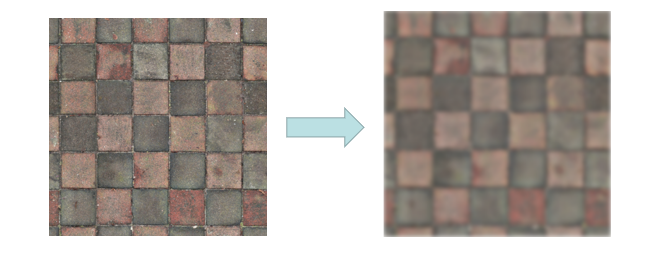

# 图像效果

图像效果提供处理图像的一些基础能力，包括对当前图像的亮度调节、模糊化、灰度调节、智能取色等。

该模块提供以下图像效果相关的常用功能：

- [Filter](#filter)：效果类，用于添加指定效果到图像源。
- [Color](#color)：颜色类，用于保存取色的结果。
- [ColorPicker](#colorpicker)：智能取色器。

> **说明：**
> 
> 本模块首批接口从API version 9开始支持。后续版本的新增接口，采用上角标单独标记接口的起始版本。

## 导入模块

```js
import effectKit from '@ohos.effectKit';
```

## effectKit.createEffect
createEffect(source: image.PixelMap): Filter

通过传入的PixelMap创建Filter实例。

**系统能力：** SystemCapability.Multimedia.Image.Core

**参数：**

| 名称    | 类型               | 必填 | 说明     |
| ------- | ----------------- | ---- | -------- |
| source  | [image.PixelMap](js-apis-image.md#pixelmap7) | 是   | image模块创建的PixelMap实例。   |

**返回值：**

| 类型                             | 说明           |
| -------------------------------- | -------------- |
| [Filter](#filter) | 返回不带任何效果的Filter链表的头节点，失败时返回null。 |

**示例：**

```js
import image from "@ohos.multimedia.image";

const color = new ArrayBuffer(96);
let opts = { editable: true, pixelFormat: 3, size: { height: 4, width: 6 } }
image.createPixelMap(color, opts).then((pixelMap) => {
  let headFilter = effectKit.createEffect(pixelMap);
})
```

## effectKit.createColorPicker

createColorPicker(source: image.PixelMap): Promise\<ColorPicker>

通过传入的PixelMap创建ColorPicker实例，使用Promise异步回调。

**系统能力：** SystemCapability.Multimedia.Image.Core

**参数：**

| 名称     | 类型         | 必填 | 说明                       |
| -------- | ----------- | ---- | -------------------------- |
| source   | [image.PixelMap](js-apis-image.md#pixelmap7) | 是   |  image模块创建的PixelMap实例。 |

**返回值：**

| 类型                   | 说明           |
| ---------------------- | -------------- |
| Promise\<[ColorPicker](#colorpicker)>  | Promise对象。返回创建的ColorPicker实例。 |

**示例：**

```js
import image from "@ohos.multimedia.image";

const color = new ArrayBuffer(96);
let opts = { editable: true, pixelFormat: 3, size: { height: 4, width: 6 } }
image.createPixelMap(color, opts).then((pixelMap) => {
  effectKit.createColorPicker(pixelMap).then(colorPicker => {
    console.info("color picker=" + colorPicker);
  }).catch(ex => console.error(".error=" + ex.toString()))
})
```

## effectKit.createColorPicker

createColorPicker(source: image.PixelMap, callback: AsyncCallback\<ColorPicker>): void

通过传入的PixelMap创建ColorPicker实例，使用callback异步回调。

**系统能力：** SystemCapability.Multimedia.Image.Core

**参数：**

| 名称     | 类型                | 必填 | 说明                       |
| -------- | ------------------ | ---- | -------------------------- |
| source   | [image.PixelMap](js-apis-image.md#pixelmap7) | 是  |image模块创建的PixelMap实例。  |
| callback | AsyncCallback\<[ColorPicker](#colorpicker)> | 是  | 回调函数。返回创建的ColorPicker实例。 |

**示例：**

```js
import image from "@ohos.multimedia.image";

const color = new ArrayBuffer(96);
let opts = { editable: true, pixelFormat: 3, size: { height: 4, width: 6 } }
image.createPixelMap(color, opts).then((pixelMap) => {
  effectKit.createColorPicker(pixelMap, (error, colorPicker) => {
    if (error) {
      console.log('Failed to create color picker.');
    } else {
      console.log('Succeeded in creating color picker.');
    }
  })
})
```

## Color

颜色类，用于保存取色的结果。

**系统能力：** SystemCapability.Multimedia.Image.Core

| 名称   | 类型   | 可读 | 可写 | 说明              |
| ------ | ----- | ---- | ---- | ---------------- |
| red   | number | 是   | 否   | 红色分量值。           |
| green | number | 是   | 否   | 绿色分量值。           |
| blue  | number | 是   | 否   | 蓝色分量值。           |
| alpha | number | 是   | 否   | 透明通道分量值。       |

## ColorPicker

取色类，用于从一张图像数据中获取它的主要颜色。在调用ColorPicker的方法前，需要先通过[createColorPicker](#effectkitcreatecolorpicker)创建一个ColorPicker实例。

### getMainColor

getMainColor(): Promise\<Color>

读取图像主色的颜色值，结果写入[Color](#color)里，使用Promise异步回调。

**系统能力：** SystemCapability.Multimedia.Image.Core

**返回值：**

| 类型           | 说明                                            |
| :------------- | :---------------------------------------------- |
| Promise\<[Color](#color)> | Promise对象。返回图像主色对应的颜色值，失败时返回错误信息。 |

**示例：**

```js
colorPicker.getMainColor().then(color => {
    console.log('Succeeded in getting main color.');
    console.info(`color[ARGB]=${color.alpha},${color.red},${color.green},${color.blue}`);
}).catch(error => {
    console.log('Failed to get main color.');
})
```

### getMainColorSync

getMainColorSync(): Color

读取图像主色的颜色值，结果写入[Color](#color)里，使用同步方式返回。

**系统能力：** SystemCapability.Multimedia.Image.Core

**返回值：**

| 类型     | 说明                                  |
| :------- | :----------------------------------- |
| [Color](#color)    | Color实例，即图像主色对应的颜色值，失败时返回null。 |

**示例：**

```js
let color = colorPicker.getMainColorSync();
console.log('get main color =' + color);
```


## Filter

图像效果类，用于将指定的效果添加到输入图像中。在调用Filter的方法前，需要先通过[createEffect](#effectkitcreateeffect)创建一个Filter实例。

### blur

blur(radius: number): Filter

将模糊效果添加到效果链表中，结果返回效果链表的头节点。

**系统能力：** SystemCapability.Multimedia.Image.Core

**参数：**

| 参数名 | 类型        | 必填 | 说明                                                         |
| ------ | ----------- | ---- | ------------------------------------------------------------ |
|  radius   | number | 是   | 模糊半径，单位是像素。模糊效果与所设置的值成正比，值越大效果越明显。 |

**返回值：**

| 类型           | 说明                                            |
| :------------- | :---------------------------------------------- |
| [Filter](#filter) | 返回已添加的图像效果。 |

**示例：**

```js
import image from "@ohos.multimedia.image";

const color = new ArrayBuffer(96);
let opts = { editable: true, pixelFormat: 3, size: { height: 4, width: 6 } };
image.createPixelMap(color, opts).then((pixelMap) => {
  let radius = 5;
  let headFilter = effectKit.createEffect(pixelMap);
  if (headFilter != null) {
    headFilter.blur(radius);
  }
})
```


### brightness

brightness(bright: number): Filter

将高亮效果添加到效果链表中，结果返回效果链表的头节点。

**系统能力：** SystemCapability.Multimedia.Image.Core

**参数：**

| 参数名 | 类型        | 必填 | 说明                                                         |
| ------ | ----------- | ---- | ------------------------------------------------------------ |
|  bright   | number | 是   | 高亮程度，取值范围在0-1之间，取值为0时图像保持不变。 |

**返回值：**

| 类型           | 说明                                            |
| :------------- | :---------------------------------------------- |
| [Filter](#filter) | 返回已添加的图像效果。 |

**示例：**

```js
import image from "@ohos.multimedia.image";

const color = new ArrayBuffer(96);
let opts = { editable: true, pixelFormat: 3, size: { height: 4, width: 6 } };
image.createPixelMap(color, opts).then((pixelMap) => {
  let bright = 0.5;
  let headFilter = effectKit.createEffect(pixelMap);
  if (headFilter != null) {
    headFilter.brightness(bright);
  }
})
```


### grayscale

grayscale(): Filter

将灰度效果添加到效果链表中，结果返回效果链表的头节点。

**系统能力：** SystemCapability.Multimedia.Image.Core

**返回值：**

| 类型           | 说明                                            |
| :------------- | :---------------------------------------------- |
| [Filter](#filter) | 返回已添加的图像效果。 |

**示例：**

```js
import image from "@ohos.multimedia.image";

const color = new ArrayBuffer(96);
let opts = { editable: true, pixelFormat: 3, size: { height: 4, width: 6 } };
image.createPixelMap(color, opts).then((pixelMap) => {
  let headFilter = effectKit.createEffect(pixelMap);
  if (headFilter != null) {
    headFilter.grayscale();
  }
})
```


### getPixelMap

getPixelMap(): [image.PixelMap](js-apis-image.md#pixelmap7)

获取已添加链表效果的源图像的image.PixelMap。

**系统能力：** SystemCapability.Multimedia.Image.Core

**返回值：**

| 类型           | 说明                                            |
| :------------- | :---------------------------------------------- |
| [image.PixelMap](js-apis-image.md#pixelmap7) | 已添加效果的源图像的image.PixelMap。 |

**示例：**

```js
import image from "@ohos.multimedia.image";

const color = new ArrayBuffer(96);
let opts = { editable: true, pixelFormat: 3, size: { height: 4, width: 6 } };
image.createPixelMap(color, opts).then((pixelMap) => {
  let pixel = effectKit.createEffect(pixelMap).grayscale().getPixelMap();
})
```
