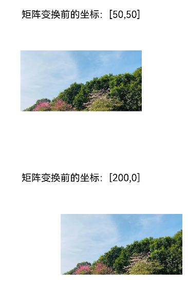

# @ohos.matrix4 (矩阵变换)

本模块提供矩阵变换功能，可对图形进行平移、旋转和缩放等。

> **说明：**
>
> 本模块首批接口从API Version 7开始支持。后续版本如有新增内容，则采用上角标单独标记该内容的起始版本。


## 导入模块

```ts
import matrix4 from '@ohos.matrix4'
```


## matrix4.init

init(option: [number,number,number,number,number,number,number,number,number,number,number,number,number,number,number,number]): Matrix4Transit


Matrix的构造函数，可以通过传入的参数创建一个四阶矩阵，矩阵为列优先。

**系统能力：**  SystemCapability.ArkUI.ArkUI.Full

**参数：**

| 参数名 | 类型                                                         | 必填 | 说明                                                         |
| ------ | ------------------------------------------------------------ | ---- | ------------------------------------------------------------ |
| option | [number,number,number,number,number,number,number,number,number,number,number,number,number,number,number,number] | 是   | 参数为长度为16（4\*4）的number数组,&nbsp;详情见四阶矩阵说明。<br/>默认值：<br/>[1,&nbsp;0,&nbsp;0,&nbsp;0,<br/>0,&nbsp;1,&nbsp;0,&nbsp;0,<br/>0,&nbsp;0,&nbsp;1,&nbsp;0,<br/>0,&nbsp;0,&nbsp;0,&nbsp;1] |

**返回值：**

| 类型                              | 说明                         |
| --------------------------------- | ---------------------------- |
| [Matrix4Transit](#matrix4transit) | 根据入参创建的四阶矩阵对象。 |

**四阶矩阵说明：**

| 参数名  | 类型     | 必填   | 说明                   |
| ---- | ------ | ---- | -------------------- |
| m00  | number | 是    | x轴缩放值，单位矩阵默认为1。      |
| m01  | number | 是    | 第2个值，xyz轴旋转会影响这个值。   |
| m02  | number | 是    | 第3个值，xyz轴旋转会影响这个值。   |
| m03  | number | 是    | 无实际意义。               |
| m10  | number | 是    | 第5个值，xyz轴旋转会影响这个值。   |
| m11  | number | 是    | y轴缩放值，单位矩阵默认为1。      |
| m12  | number | 是    | 第7个值，xyz轴旋转会影响这个值。   |
| m13  | number | 是    | 无实际意义。               |
| m20  | number | 是    | 第9个值，xyz轴旋转会影响这个值。   |
| m21  | number | 是    | 第10个值，xyz轴旋转会影响这个值。  |
| m22  | number | 是    | z轴缩放值，单位矩阵默认为1。      |
| m23  | number | 是    | 无实际意义。               |
| m30  | number | 是    | x轴平移值，单位px，单位矩阵默认为0。 |
| m31  | number | 是    | y轴平移值，单位px，单位矩阵默认为0。 |
| m32  | number | 是    | z轴平移值，单位px，单位矩阵默认为0。 |
| m33  | number | 是    | 齐次坐标下生效，产生透视投影效果。    |

**示例**

```ts
import matrix4 from '@ohos.matrix4'
// 创建一个四阶矩阵
let matrix = matrix4.init([1.0, 0.0, 0.0, 0.0,
                          0.0, 1.0, 0.0, 0.0,
                          0.0, 0.0, 1.0, 0.0,
                          0.0, 0.0, 0.0, 1.0])
@Entry
@Component
struct Tests {
  build() {
    Column() {
      Image($r("app.media.zh"))
        .width("40%")
        .height(100)
        .transform(matrix)
    }
  }
}
```


## matrix4.identity

identity(): Matrix4Transit


Matrix的初始化函数，可以返回一个单位矩阵对象。

**系统能力：**  SystemCapability.ArkUI.ArkUI.Full

**返回值：**

| 类型                              | 说明           |
| --------------------------------- | -------------- |
| [Matrix4Transit](#matrix4transit) | 单位矩阵对象。 |

**示例：**

```ts
// matrix1 和 matrix2 效果一致
import matrix4 from '@ohos.matrix4'
let matrix1 = matrix4.init([1.0, 0.0, 0.0, 0.0,
                          0.0, 1.0, 0.0, 0.0,
                          0.0, 0.0, 1.0, 0.0,
                          0.0, 0.0, 0.0, 1.0])
let matrix2 = matrix4.identity()
@Entry
@Component
struct Tests {
  build() {
    Column() {
      Image($r("app.media.zh"))
        .width("40%")
        .height(100)
        .transform(matrix1)
      Image($r("app.media.zh"))
        .width("40%")
        .height(100)
        .margin({ top: 150 })
        .transform(matrix2)
    }
  }
}
```


## matrix4.copy

copy(): Matrix4Transit


Matrix的拷贝函数，可以拷贝一份当前的矩阵对象。

**系统能力：**  SystemCapability.ArkUI.ArkUI.Full

**返回值：**

| 类型                              | 说明                 |
| --------------------------------- | -------------------- |
| [Matrix4Transit](#matrix4transit) | 当前矩阵的拷贝对象。 |

**示例：**

```ts
// xxx.ets
import matrix4 from '@ohos.matrix4'

@Entry
@Component
struct Test {
  private matrix1 = matrix4.identity().translate({ x: 100 })
  private matrix2 = this.matrix1.copy().scale({ x: 2 })

  build() {
    Column() {
      Image($r("app.media.bg1"))
        .width("40%")
        .height(100)
        .transform(this.matrix1)
      Image($r("app.media.bg2"))
        .width("40%")
        .height(100)
        .margin({ top: 50 })
        .transform(this.matrix2)
    }
  }
}
```


## Matrix4Transit


### combine

combine(option: Matrix4Transit): Matrix4Transit


Matrix的叠加函数，可以将两个矩阵的效果叠加起来生成一个新的矩阵对象。

**系统能力：**  SystemCapability.ArkUI.ArkUI.Full

**参数：**

| 参数名 | 类型                              | 必填 | 说明               |
| ------ | --------------------------------- | ---- | ------------------ |
| option | [Matrix4Transit](#matrix4transit) | 是   | 待叠加的矩阵对象。 |

**返回值：**

| 类型                              | 说明               |
| --------------------------------- | ------------------ |
| [Matrix4Transit](#matrix4transit) | 矩阵叠加后的对象。 |

**示例：**

```ts
// xxx.ets
import matrix4 from '@ohos.matrix4'

@Entry
@Component
struct Test {
  private matrix1 = matrix4.identity().translate({ x: 200 }).copy()
  private matrix2 = matrix4.identity().scale({ x: 2 }).copy()

  build() {
    Column() {
      // 矩阵变换前
      Image($r("app.media.icon"))
        .width("40%")
        .height(100)
        .margin({ top: 50 })
      // 先平移x轴200px，再缩放两倍x轴，得到矩阵变换后的效果图
      Image($r("app.media.icon"))
        .transform(this.matrix1.combine(this.matrix2))
        .width("40%")
        .height(100)
        .margin({ top: 50 })
    }
  }
}
```


### invert

invert(): Matrix4Transit

Matrix的逆函数，可以返回一个当前矩阵对象的逆矩阵，即效果正好相反。

**系统能力：**  SystemCapability.ArkUI.ArkUI.Full

**返回值：**

| 类型                              | 说明                   |
| --------------------------------- | ---------------------- |
| [Matrix4Transit](#matrix4transit) | 当前矩阵的逆矩阵对象。 |

**示例：**

```ts
import matrix4 from '@ohos.matrix4'
// matrix1(宽放大2倍) 和 matrix2(宽缩小2倍) 效果相反
let matrix1 = matrix4.identity().scale({ x: 2 })
let matrix2 = matrix1.invert()

@Entry
@Component
struct Tests {
  build() {
    Column() {
      Image($r("app.media.zh"))
        .width(200)
        .height(100)
        .transform(matrix1)
        .margin({ top: 100 })
      Image($r("app.media.zh"))
        .width(200)
        .height(100)
        .margin({ top: 150 })
        .transform(matrix2)
    }
  }
}
```


### translate

translate(option: TranslateOption): Matrix4Transit

Matrix的平移函数，可以为当前矩阵增加x轴/y轴/z轴平移效果。

**系统能力：**  SystemCapability.ArkUI.ArkUI.Full

**参数：**

| 参数名 | 类型                                | 必填 | 说明           |
| ------ | ----------------------------------- | ---- | -------------- |
| option | [TranslateOption](#translateoption) | 是   | 设置平移参数。 |

**返回值：**

| 类型                              | 说明                         |
| --------------------------------- | ---------------------------- |
| [Matrix4Transit](#matrix4transit) | 平移效果后的矩阵对象。 |

**示例：**

```ts
// xxx.ets
import matrix4 from '@ohos.matrix4'

@Entry
@Component
struct Test {
  private matrix1 = matrix4.identity().translate({ x: 100, y: 200, z: 30 })

  build() {
    Column() {
      Image($r("app.media.bg1")).transform(this.matrix1)
        .width("40%")
        .height(100)
    }
  }
}
```


### scale

scale(option: ScaleOption): Matrix4Transit


Matrix的缩放函数，可以为当前矩阵增加x轴/y轴/z轴缩放效果。

**系统能力：**  SystemCapability.ArkUI.ArkUI.Full

**参数：**

| 参数名 | 类型                        | 必填 | 说明           |
| ------ | --------------------------- | ---- | -------------- |
| option | [ScaleOption](#scaleoption) | 是   | 设置缩放参数。 |


**返回值：**

| 类型                              | 说明                         |
| --------------------------------- | ---------------------------- |
| [Matrix4Transit](#matrix4transit) | 缩放效果后的矩阵对象。 |

**示例：**

```ts
// xxx.ets
import matrix4 from '@ohos.matrix4'
@Entry
@Component
struct Test {
  private matrix1 = matrix4.identity().scale({ x:2, y:3, z:4, centerX:50, centerY:50 })

  build() {
    Column() { 
      Image($r("app.media.bg1")).transform(this.matrix1)
        .width("40%")
        .height(100)
    }
  }
}
```


### rotate

rotate(option: RotateOption): Matrix4Transit


Matrix的旋转函数，可以为当前矩阵增加x轴/y轴/z轴旋转效果。

**系统能力：**  SystemCapability.ArkUI.ArkUI.Full

**参数：**

| 参数名 | 类型                          | 必填 | 说明           |
| ------ | ----------------------------- | ---- | -------------- |
| option | [RotateOption](#rotateoption) | 是   | 设置旋转参数。 |


**返回值：**

| 类型                              | 说明                         |
| --------------------------------- | ---------------------------- |
| [Matrix4Transit](#matrix4transit) | 旋转效果后的矩阵对象。 |

**示例：**

```ts
// xxx.ets
import matrix4 from '@ohos.matrix4'

@Entry
@Component
struct Test {
  private matrix1 = matrix4.identity().rotate({ x: 1, y: 1, z: 2, angle: 30 })

  build() {
    Column() {
      Image($r("app.media.bg1")).transform(this.matrix1)
        .width("40%")
        .height(100)
    }.width("100%").margin({ top: 50 })
  }
}
```


### transformPoint

transformPoint(option: [number, number]): [number, number]


Matrix的坐标点转换函数，可以将当前的变换效果作用到一个坐标点上。

**系统能力：**  SystemCapability.ArkUI.ArkUI.Full

**参数：**

| 参数名 | 类型             | 必填 | 说明               |
| ------ | ---------------- | ---- | ------------------ |
| option | [number, number] | 是   | 需要转换的坐标点。 |

**返回值：**

| 类型             | 说明                        |
| ---------------- | --------------------------- |
| [number, number] | 返回矩阵变换后的Point对象。 |

**示例：**

```ts
// xxx.ets
import matrix4 from '@ohos.matrix4'

@Entry
@Component
struct Test {
  private originPoint: [number, number] = [50, 50]
  private matrix_1 = matrix4.identity().translate({ x: 150, y: -50 })
  private transformPoint = this.matrix_1.transformPoint(this.originPoint)
  private matrix_2 = matrix4.identity().translate({ x: this.transformPoint[0], y: this.transformPoint[1] })

  build() {
    Column() {
      Text(`矩阵变换前的坐标：[${this.originPoint}]`)
        .fontSize(16)
      Image($r("app.media.image"))
        .width('600px')
        .height('300px')
        .margin({ top: 50 })
      Text(`矩阵变换后的坐标：[${this.transformPoint}]`)
        .fontSize(16)
        .margin({ top: 100 })
      Image($r("app.media.image"))
        .width('600px')
        .height('300px')
        .margin({ top: 50 })
        .transform(this.matrix_2)
    }.width("100%").padding(50)
  }
}
```



## TranslateOption

| 参数名 | 类型   | 必填 | 说明                                                        |
| ------ | ------ | ---- | ----------------------------------------------------------- |
| x      | number | 否   | x轴的平移距离，单位px。<br/>默认值：0<br/>取值范围 (-∞, +∞) |
| y      | number | 否   | y轴的平移距离，单位px。<br/>默认值：0<br/>取值范围 (-∞, +∞) |
| z      | number | 否   | z轴的平移距离，单位px。<br/>默认值：0<br/>取值范围 (-∞, +∞) |

## ScaleOption

| 参数名  | 类型   | 必填 | 说明                                                         |
| ------- | ------ | ---- | ------------------------------------------------------------ |
| x       | number | 否   | x轴的缩放倍数。x>1时以x轴方向放大，x<1时以x轴方向缩小。<br/>默认值：1<br/>取值范围 [0, +∞)<br/>**说明：** <br/>设置小于0的值时，按照默认值处理。 |
| y       | number | 否   | y轴的缩放倍数。y>1时以y轴方向放大，y<1时以y轴方向缩小。<br/>默认值：1<br/>取值范围 [0, +∞)<br/>**说明：** <br/>设置小于0的值时，按照默认值处理。 |
| z       | number | 否   | z轴的缩放倍数。z>1时以z轴方向放大，z<1时以z轴方向缩小。<br/>默认值：1<br/>取值范围 [0, +∞)<br/>**说明：** <br/>设置小于0的值时，按照默认值处理。 |
| centerX | number | 否   | 变换中心点x轴坐标。<br/>默认值：0。<br/>取值范围 (-∞, +∞)    |
| centerY | number | 否   | 变换中心点y轴坐标。<br/>默认值：0。<br/>取值范围 (-∞, +∞)    |

## RotateOption

| 参数名  | 类型   | 必填 | 说明                                                    |
| ------- | ------ | ---- | ------------------------------------------------------- |
| x       | number | 否   | 旋转轴向量x坐标。<br/>默认值：1。<br/>取值范围 (-∞, +∞) |
| y       | number | 否   | 旋转轴向量y坐标。<br/>默认值：1。<br/>取值范围 (-∞, +∞) |
| z       | number | 否   | 旋转轴向量z坐标。<br/>默认值：1。<br/>取值范围 (-∞, +∞) |
| angle   | number | 否   | 旋转角度。<br/>默认值：0                                |
| centerX | number | 否   | 变换中心点x轴坐标。<br/>默认值：0                       |
| centerY | number | 否   | 变换中心点y轴坐标。<br/>默认值：0                       |