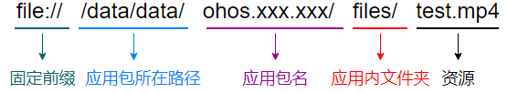

# 媒体服务

媒体子系统为开发者提供一套简单且易于理解的接口，使得开发者能够方便接入系统并使用系统的媒体资源。

媒体子系统包含了音视频相关媒体业务，提供以下常用功能：

- 音频播放（[AudioPlayer](#audioplayer)）
- 音频录制（[AudioRecorder](#audiorecorder)）
- 视频录制（[VideoRecorder](#VideoRecorder<sup>8+</sup>)）

后续将提供以下功能：视频播放、视频录制、DataSource音视频播放、音视频编解码、容器封装解封装、媒体能力查询等功能。

## 导入模块

```js
import media from '@ohos.multimedia.media';
```

##  media.createAudioPlayer

createAudioPlayer(): [AudioPlayer](#audioplayer)

同步方式创建音频播放实例。


**返回值：**

| 类型                        | 说明                                                         |
| --------------------------- | ------------------------------------------------------------ |
| [AudioPlayer](#audioplayer) | 返回AudioPlayer类实例，失败时返回null。可用于音频播放、暂停、停止等操作。 |

**示例：**

```js
var audioPlayer = media.createAudioPlayer();
```

## media.createAudioPlayerAsync<sup>8+</sup>

createAudioPlayerAsync(callback: AsyncCallback\<[AudioPlayer](#audioplayer)>): void

异步方式创建音频播放实例。通过注册回调函数获取返回值。

**参数：**

| 参数名   | 类型                                       | 必填 | 说明                           |
| -------- | ------------------------------------------ | ---- | ------------------------------ |
| callback | AsyncCallback<[AudioPlayer](#audioplayer)> | 是   | 异步创建音频播放实例回调方法。 |

**示例：**

```js
media.createAudioPlayerAsync((error, audio) => {
   if (typeof(audio) != 'undefined') {
       audioPlayer = audio;
       console.info('audio createAudioPlayerAsync success');
   } else {
       console.info(`audio createAudioPlayerAsync fail, error:${error.message}`);
   }
});
```

## media.createAudioPlayerAsync<sup>8+</sup>

createAudioPlayerAsync: Promise<[AudioPlayer](#audioplayer)>

异步方式创建音频播放实例。通过Promise获取返回值。

**返回值：**

| 类型                                 | 说明                                |
| ------------------------------------ | ----------------------------------- |
| Promise<[AudioPlayer](#audioplayer)> | 异步创建音频播放实例Promise返回值。 |

**示例：**

```js
function failureCallback(error) {
    console.info(`audio failureCallback, error:${error.message}`);
}
function catchCallback(error) {
    console.info(`audio catchCallback, error:${error.message}`);
}

await media.createAudioPlayerAsync.then((audio) => {
    if (typeof(audio) != 'undefined') {
       audioPlayer = audio;
       console.info('audio createAudioPlayerAsync success');
   } else {
       console.info('audio createAudioPlayerAsync fail');
   }
}, failureCallback).catch(catchCallback);
```

## media.createAudioRecorder
createAudioRecorder(): AudioRecorder

创建音频录制的实例来控制音频的录制。

**返回值:**

| 类型                            | 说明                                      |
| ------------------------------- | ----------------------------------------- |
| [AudioRecorder](#audiorecorder) | 返回AudioRecorder类实例，失败时返回null。 |

**示例：**

```js
let audiorecorder = media.createAudioRecorder(); 
```

## media.createAudioRecorderAsync<sup>8+</sup>

createAudioRecorderAsync(callback: AsyncCallback\<[AudioRecorder](#audiorecorder)>): void

异步方式创建音频录制实例。通过注册回调函数获取返回值。

**参数：**

| 参数名   | 类型                                           | 必填 | 说明                           |
| -------- | ---------------------------------------------- | ---- | ------------------------------ |
| callback | AsyncCallback<[AudioRecorder](#audiorecorder)> | 是   | 异步创建音频录制实例回调方法。 |

**示例：**

```js
media.createAudioRecorderAsync((error, audio) => {
   if (typeof(audio) != 'undefined') {
       audioRecorder = audio;
       console.info('audio createAudioRecorderAsync success');
   } else {
       console.info(`audio createAudioRecorderAsync fail, error:${error.message}`);
   }
});
```

## media.createAudioRecorderAsync<sup>8+</sup>

createAudioRecorderAsync: Promise<[AudioRecorder](#audiorecorder)>

异步方式创建音频录制实例。通过Promise获取返回值。

**返回值：**

| 类型                                     | 说明                                |
| ---------------------------------------- | ----------------------------------- |
| Promise<[AudioRecorder](#audiorecorder)> | 异步创建音频录制实例Promise返回值。 |

**示例：**

```js
function failureCallback(error) {
    console.info(`audio failureCallback, error:${error.message}`);
}
function catchCallback(error) {
    console.info(`audio catchCallback, error:${error.message}`);
}

await media.createAudioRecorderAsync.then((audio) => {
    if (typeof(audio) != 'undefined') {
       audioRecorder = audio;
       console.info('audio createAudioRecorderAsync success');
   } else {
       console.info('audio createAudioRecorderAsync fail');
   }
}, failureCallback).catch(catchCallback);
```


## media.createVideoRecorderAsync<sup>8+</sup>

createVideoRecorderAsync(callback: AsyncCallback\<[VideoRecorder](#videorecorder8)>): void

异步方式创建视频录制实例。通过注册回调函数获取返回值。

**参数：**

| 参数名   | 类型                                                        | 必填 | 说明                           |
| -------- | ----------------------------------------------------------- | ---- | ------------------------------ |
| callback | AsyncCallback<[VideoRecorder](#videorecorder8)> | 是   | 异步创建视频录制实例回调方法。 |

**示例：**

```js
media.createVideoRecorderAsync((error, video) => {
   if (typeof(video) != 'undefined') {
       videoRecorder = video;
       console.info('video createVideoRecorderAsync success');
   } else {
       console.info(`video createVideoRecorderAsync fail, error:${error.message}`);
   }
});
```

## media.createVideoRecorderAsync<sup>8+</sup>

createVideoRecorderAsync: Promise<[VideoRecorder](#videorecorder8)>

异步方式创建视频录制实例。通过Promise获取返回值。

**返回值：**

| 类型                                                  | 说明                                |
| ----------------------------------------------------- | ----------------------------------- |
| Promise<[VideoRecorder](#videorecorder8)> | 异步创建视频录制实例Promise返回值。 |

**示例：**

```js
function failureCallback(error) {
    console.info(`video failureCallback, error:${error.message}`);
}
function catchCallback(error) {
    console.info(`video catchCallback, error:${error.message}`);
}

await media.createVideoRecorderAsync.then((video) => {
    if (typeof(video) != 'undefined') {
       videoRecorder = video;
       console.info('video createVideoRecorderAsync success');
   } else {
       console.info('video createVideoRecorderAsync fail');
   }
}, failureCallback).catch(catchCallback);
```


## MediaErrorCode<sup>8+</sup>

媒体服务错误类型枚举

| 名称                       | 值   | 说明                                   |
| -------------------------- | ---- | -------------------------------------- |
| MSERR_OK                   | 0    | 表示操作成功。                         |
| MSERR_NO_MEMORY            | 1    | 表示申请内存失败，系统可能无可用内存。 |
| MSERR_OPERATION_NOT_PERMIT | 2    | 表示无权限执行此操作。                 |
| MSERR_INVALID_VAL          | 3    | 表示传入入参无效。                     |
| MSERR_IO                   | 4    | 表示发生IO错误。                       |
| MSERR_TIMEOUT              | 5    | 表示操作超时。                         |
| MSERR_UNKNOWN              | 6    | 表示未知错误。                         |
| MSERR_SERVICE_DIED         | 7    | 表示服务端失效。                       |
| MSERR_INVALID_STATE        | 8    | 表示在当前状态下，不允许执行此操作。   |
| MSERR_UNSUPPORTED          | 9    | 表示在当前版本下，不支持此操作。       |

## MediaType<sup>8+</sup>

媒体类型枚举

| 名称                | 值   | 说明               |
| ------------------- | ---- | ------------------ |
| MEDIA_TYPE_AUD      | 0    | 表示音频。         |
| MEDIA_TYPE_VID      | 1    | 表示视频。         |
| MEDIA_TYPE_SUBTITLE | 2    | 表示字幕：开发中。 |

## CodecMimeType<sup>8+</sup>

Codec MIME类型枚举

| 名称         | 值                | 说明                     |
| ------------ | ----------------- | ------------------------ |
| VIDEO_MPEG4  | ”video/mp4v-es“   | 表示视频/mpeg4类型。     |
| AUDIO_MPEG   | "audio/mpeg"      | 表示音频/mpeg类型。      |
| AUDIO_AAC    | "audio/mp4a-latm" | 表示音频/mp4a-latm类型。 |
| AUDIO_VORBIS | "audio/vorbis"    | 表示音频/vorbis类型。    |
| AUDIO_FLAC   | "audio/flac"      | 表示音频/flac类型。      |

## MediaDescriptionKey<sup>8+</sup>

媒体信息描述枚举

| 名称                     | 值              | 说明                                                         |
| ------------------------ | --------------- | ------------------------------------------------------------ |
| MD_KEY_TRACK_INDEX       | "track_index"   | 表示轨道序号，其对应键值类型为number。                       |
| MD_KEY_TRACK_TYPE        | "track_type"    | 表示轨道类型，其对应键值类型为number，参考[MediaType](#mediatype8)。 |
| MD_KEY_CODEC_MIME        | "codec_mime"    | 表示codec_mime类型，其对应键值类型为string。                 |
| MD_KEY_DURATION          | "duration"      | 表示媒体时长，其对应键值类型为number，单位为ms。             |
| MD_KEY_BITRATE           | "bitrate"       | 表示比特率，其对应键值类型为number，单位为bps。              |
| MD_KEY_WIDTH             | "width"         | 表示视频宽度，其对应键值类型为number，单位为像素。           |
| MD_KEY_HEIGHT            | "height"        | 表示视频高度，其对应键值类型为number，单位为像素。           |
| MD_KEY_FRAME_RATE        | "frame_rate"    | 表示视频帧率，其对应键值类型为number，单位为100fps。         |
| MD_KEY_AUD_CHANNEL_COUNT | "channel_count" | 表示声道数，其对应键值类型为number。                         |
| MD_KEY_AUD_SAMPLE_RATE   | "sample_rate"   | 表示采样率，其对应键值类型为number，单位为HZ。               |

## BufferingInfoType<sup>8+</sup>

缓存事件类型枚举

| 名称              | 值   | 说明                       |
| ----------------- | ---- | -------------------------- |
| BUFFERING_START   | 1    | 表示开始缓存。             |
| BUFFERING_END     | 2    | 表示结束缓存。             |
| BUFFERING_PERCENT | 3    | 表示缓存百分比。           |
| CACHED_DURATION   | 4    | 表示缓存时长，单位为毫秒。 |

## AudioPlayer

音频播放管理类，用于管理和播放音频媒体。在调用AudioPlayer的方法前，需要先通过[createAudioPlayer()](#media.createaudioplayer)或[createAudioPlayerAsync()](#media.createaudioplayerasync8)构建一个[AudioPlayer](#audioplayer)实例。

音频播放demo可参考：[音频播放开发指导](../../media/audio-playback.md)

### 属性<a name=audioplayer_属性></a>

| 名称        | 类型                      | 可读 | 可写 | 说明                                                         |
| ----------- | ------------------------- | ---- | ---- | ------------------------------------------------------------ |
| src         | string                    | 是   | 是   | 音频媒体URI，支持当前主流的音频格式(mp4、aac、mp3、ogg)。<br>**支持路径示例**：<br>1、本地绝对路径：file:///data/data/ohos.xxx.xxx/files/test.mp4<br><br>2、http网络播放路径：开发中<br>3、hls网络播放路径：开发中<br>4、fd类型播放：开发中<br>**注意事项**：<br>媒体素材需至少赋予读权限后，才可正常播放 |
| loop        | boolean                   | 是   | 是   | 音频循环播放属性，设置为'true'表示循环播放。                 |
| currentTime | number                    | 是   | 否   | 音频的当前播放位置。                                         |
| duration    | number                    | 是   | 否   | 音频时长。                                                   |
| state       | [AudioState](#audiostate) | 是   | 否   | 音频播放的状态。                                             |

### play<a name=audioplayer_play></a>

play(): void

开始播放音频资源，需在[dataLoad](#on('play' | 'pause' | 'stop' | 'reset' | 'dataload' | 'finish' | 'volumechange'))事件成功触发后，才能调用play方法。

**示例：**

```js
audioPlayer.on('play', () => {    //设置'play'事件回调
    console.log('audio play success');
});
audioPlayer.play();
```

### pause<a name=audioplayer_pause></a>

pause(): void

暂停播放音频资源。

**示例：**

```js
audioPlayer.on('pause', () => {    //设置'pause'事件回调
    console.log('audio pause success');
});
audioPlayer.pause();
```

### stop<a name=audioplayer_stop></a>

stop(): void

停止播放音频资源。

**示例：**

```js
audioPlayer.on('stop', () => {    //设置'stop'事件回调
    console.log('audio stop success');
});
audioPlayer.stop();
```

### reset<sup>7+</sup><a name=audioplayer_reset></a>

reset(): void

切换播放音频资源。

**示例：**

```js
audioPlayer.on('reset', () => {    //设置'reset'事件回调
    console.log('audio reset success');
});
audioPlayer.reset();
```

### seek<a name=audioplayer_seek></a>

seek(timeMs: number): void

跳转到指定播放位置。

**参数：**

| 参数名 | 类型   | 必填 | 说明                           |
| ------ | ------ | ---- | ------------------------------ |
| timeMs | number | 是   | 指定的跳转时间节点，单位毫秒。 |

**示例：**

```js
audioPlayer.on('timeUpdate', (seekDoneTime) => {    //设置'timeUpdate'事件回调
    if (typeof (seekDoneTime) == 'undefined') {
        console.info('audio seek fail');
        return;
    }
    console.log('audio seek success. seekDoneTime: ' + seekDoneTime);
});
audioPlayer.seek(30000);    //seek到30000ms的位置
```

### setVolume<a name=audioplayer_setvolume></a>

setVolume(vol: number): void

设置音量。

**参数：**

| 参数名 | 类型   | 必填 | 说明                                                         |
| ------ | ------ | ---- | ------------------------------------------------------------ |
| vol    | number | 是   | 指定的相对音量大小，取值范围为[0.00-1.00]，1表示最大音量，即100%。 |

**示例：**

```js
audioPlayer.on('volumeChange', () => {    //设置'volumeChange'事件回调
    console.log('audio volumeChange success');
});
audioPlayer.setVolume(1);    //设置音量到100%
```

### release<a name=audioplayer_release></a>

release(): void

释放音频资源。

**示例：**

```js
audioPlayer.release();
audioPlayer = undefined;
```

### getTrackDescription<sup>8+</sup><a name=audioplayer_gettrackdescription1></a>

getTrackDescription(callback: AsyncCallback<Array<[MediaDescription](#mediadescription8)>>): void

通过回调方式获取音频轨道信息。

**参数：**

| 参数名   | 类型                                                         | 必填 | 说明                       |
| -------- | ------------------------------------------------------------ | ---- | -------------------------- |
| callback | AsyncCallback<Array<[MediaDescription](#mediadescription8)>> | 是   | 获取音频轨道信息回调方法。 |

**示例：**

```js
function printfDescription(obj) {
    for (let item in obj) {
        let property = obj[item];
        console.info('audio key is ' + item);
        console.info('audio value is ' + property);
    }
}

audioPlayer.getTrackDescription((error, arrlist) => {
    if (typeof (arrlist) != 'undefined') {
        for (let i = 0; i < arrlist.length; i++) {
            printfDescription(arrlist[i]);
        }
    } else {
        console.log(`audio getTrackDescription fail, error:${error.message}`);
    }
});
```

### getTrackDescription<sup>8+</sup><a name=audioplayer_gettrackdescription2></a>

getTrackDescription(): Promise<Array<[MediaDescription](#mediadescription8)>>

通过Promise方式获取音频轨道信息。

**返回值：**

| 类型                                                   | 说明                            |
| ------------------------------------------------------ | ------------------------------- |
| Promise<Array<[MediaDescription](#mediadescription8)>> | 获取音频轨道信息Promise返回值。 |

**示例：**

```js
function printfDescription(obj) {
    for (let item in obj) {
        let property = obj[item];
        console.info('audio key is ' + item);
        console.info('audio value is ' + property);
    }
}
function failureCallback(error) {
    console.info(`audio failureCallback, error:${error.message}`);
}
function catchCallback(error) {
    console.info(`audio catchCallback, error:${error.message}`);
}

await audioPlayer.getTrackDescription.then((arrlist) => {
    if (typeof (arrlist) != 'undefined') {
        arrayDescription = arrlist;
    } else {
        console.log('audio getTrackDescription fail');
    }
}, failureCallback).catch(catchCallback);
for (let i = 0; i < arrayDescription.length; i++) {
    printfDescription(arrayDescription[i]);
}
```

### on('bufferingUpdate')<sup>8+</sup>

on(type: 'bufferingUpdate', callback: (infoType: [BufferingInfoType](#bufferinginfotype8), value: number) => void): void

开始订阅音频缓存更新事件。

**参数：**

| 参数名   | 类型                                                         | 必填 | 说明                                                         |
| -------- | ------------------------------------------------------------ | ---- | ------------------------------------------------------------ |
| type     | string                                                       | 是   | 音频缓存事件回调类型，支持的事件：'bufferingUpdate'。        |
| callback | (infoType: [BufferingInfoType](#bufferinginfotype8), value: number) => void | 是   | 音频缓存事件回调方法。<br>[BufferingInfoType](#bufferinginfotype8)为BUFFERING_PERCENT或CACHED_DURATION时，value值有效，否则固定为0。 |

**示例：**

```js
audioPlayer.on('bufferingUpdate', (infoType, value) => {
    console.log('audio bufferingInfo type: ' + infoType);
    console.log('audio bufferingInfo value: ' + value);
});
```

 ### on('play' | 'pause' | 'stop' | 'reset' | 'dataLoad' | 'finish' | 'volumeChange')

on(type: 'play' | 'pause' | 'stop' | 'reset' | 'dataLoad' | 'finish' | 'volumeChange', callback: () => void): void

开始订阅音频播放事件。

**参数：**

| 参数名   | 类型       | 必填 | 说明                                                         |
| -------- | ---------- | ---- | ------------------------------------------------------------ |
| type     | string     | 是   | 播放事件回调类型，支持的事件包括：'play' \| 'pause' \| 'stop' \| 'reset' \| 'dataLoad' \| 'finish' \| 'volumeChange'。<br>- 'play'：完成[play()](#play)调用，音频开始播放，触发该事件。<br>- 'pause'：完成[pause()](#pause)调用，音频暂停播放，触发该事件。<br>- 'stop'：完成[stop()](#stop)调用，音频停止播放，触发该事件。<br>- 'reset'：完成[reset()](#reset7)调用，播放器重置，触发该事件。<br>- 'dataLoad'：完成音频数据加载后触发该事件，即src属性设置完成后触发该事件。<br>- 'finish'：完成音频播放后触发该事件。<br>- 'volumeChange'：完成[setVolume()](#setvolume)调用，播放音量改变后触发该事件。 |
| callback | () => void | 是   | 播放事件回调方法。                                           |

**示例：**

```js
let audioPlayer = media.createAudioPlayer();  //创建一个音频播放实例
audioPlayer.on('dataLoad', () => {            //设置'dataLoad'事件回调，src属性设置成功后，触发此回调
	console.info('audio set source success');
    audioPlayer.play();                       //开始播放，并触发'play'事件回调
});
audioPlayer.on('play', () => {                //设置'play'事件回调
	console.info('audio play success');
    audioPlayer.seek(30000);                  //调用seek方法，并触发'timeUpdate'事件回调
});
audioPlayer.on('pause', () => {               //设置'pause'事件回调
	console.info('audio pause success');
    audioPlayer.stop();                       //停止播放，并触发'stop'事件回调
});
audioPlayer.on('reset', () => {               //设置'reset'事件回调
	console.info('audio reset success');
    audioPlayer.release();                    //释放播放实例资源
    audioPlayer = undefined;
});
audioPlayer.on('timeUpdate', (seekDoneTime) => {  //设置'timeUpdate'事件回调
	if (typeof(seekDoneTime) == "undefined") {
        console.info('audio seek fail');
        return;
    }
    console.info('audio seek success, and seek time is ' + seekDoneTime);
    audioPlayer.setVolume(0.5);                //设置音量为50%，并触发'volumeChange'事件回调
});
audioPlayer.on('volumeChange', () => {         //设置'volumeChange'事件回调
	console.info('audio volumeChange success');
    audioPlayer.pause();                       //暂停播放，并触发'pause'事件回调
});
audioPlayer.on('finish', () => {               //设置'finish'事件回调
	console.info('audio play finish');
    audioPlayer.stop();                        //停止播放，并触发'stop'事件回调
});
audioPlayer.on('error', (error) => {           //设置'error'事件回调
	console.info(`audio error called, errName is ${error.name}`);
    console.info(`audio error called, errCode is ${error.code}`);
    console.info(`audio error called, errMessage is ${error.message}`);
});
audioPlayer.src = 'file:///data/data/ohos.xxx.xxx/files/test.mp4';  //设置src属性，并触发'dataLoad'事件回调
```

### on('timeUpdate')

on(type: 'timeUpdate', callback: Callback\<number>): void

开始订阅音频播放[seek()](#seek)时间更新事件。

**参数：**

| 参数名   | 类型              | 必填 | 说明                                                         |
| -------- | ----------------- | ---- | ------------------------------------------------------------ |
| type     | string            | 是   | 播放事件回调类型，支持的事件包括：'timeUpdate'。<br>- 'timeUpdate'：[seek()](#seek)调用完成，触发该事件。 |
| callback | Callback\<number> | 是   | 播放事件回调方法。回调方法入参为成功seek的时间。             |

**示例：**

```js
audioPlayer.on('timeUpdate', (seekDoneTime) => {    //设置'timeUpdate'事件回调
    if (typeof (seekDoneTime) == 'undefined') {
        console.info('audio seek fail');
        return;
    }
    console.log('audio seek success. seekDoneTime: ' + seekDoneTime);
});
audioPlayer.seek(30000);    //seek到30000ms的位置
```

### on('error')

on(type: 'error', callback: ErrorCallback): void

开始订阅音频播放错误事件。

**参数：**

| 参数名   | 类型          | 必填 | 说明                                                         |
| -------- | ------------- | ---- | ------------------------------------------------------------ |
| type     | string        | 是   | 播放错误事件回调类型，支持的事件包括：'error'。<br>- 'error'：音频播放中发生错误，触发该事件。 |
| callback | ErrorCallback | 是   | 播放错误事件回调方法。                                       |

**示例：**

```js
audioPlayer.on('error', (error) => {      //设置'error'事件回调
	console.info(`audio error called, errName is ${error.name}`);      //打印错误类型名称
    console.info(`audio error called, errCode is ${error.code}`);      //打印错误码
    console.info(`audio error called, errMessage is ${error.message}`);//打印错误类型详细描述
});
audioPlayer.setVolume(3);  //设置volume为无效值，触发'error'事件
```

## AudioState

音频播放的状态机。可通过state属性获取当前状态。

| 名称               | 类型   | 描述           |
| ------------------ | ------ | -------------- |
| idle               | string | 音频播放空闲。 |
| playing            | string | 音频正在播放。 |
| paused             | string | 音频暂停播放。 |
| stopped            | string | 音频播放停止。 |
| error<sup>8+</sup> | string | 错误状态。     |

## MediaDescription<sup>8+</sup>

### [key : string] : any

通过key-value方式获取媒体信息

| 名称  | 类型   | 说明                                                         |
| ----- | ------ | ------------------------------------------------------------ |
| key   | string | 通过key值获取对应的value。key值具体可见[MediaDescriptionKey](#mediadescriptionkey8)。 |
| value | any    | 对应key值得value。其类型可为任意类型，具体key对应value的类型可参考[MediaDescriptionKey](#mediadescriptionkey8)的描述信息。 |

**示例：**

```js
function printfItemDescription(obj, key) {
    let property = obj[key];
    console.info('audio key is ' + key);
    console.info('audio value is ' + property);
}

audioPlayer.getTrackDescription((error, arrlist) => {
    if (typeof (arrlist) != 'undefined') {
        for (let i = 0; i < arrlist.length; i++) {
            printfItemDescription(arrlist[i], MD_KEY_TRACK_TYPE);  //打印出每条轨道MD_KEY_TRACK_TYPE的值
        }
    } else {
        console.log(`audio getTrackDescription fail, error:${error.message}`);
    }
});
```

## AudioRecorder

音频录制管理类，用于录制音频媒体。在调用AudioRecorder的方法前，需要先通过[createAudioRecorder()](#media.createaudiorecorder) 或[createAudioRecorderAsync()](#media.createaudiorecorderasync8)构建一个[AudioRecorder](#audiorecorder)实例。

音频录制demo可参考：[音频录制开发指导](../../media/audio-recorder.md)

### prepare<a name=audiorecorder_prepare></a>

prepare(config: AudioRecorderConfig): void

录音准备。

**参数：**

| 参数名 | 类型                                        | 必填 | 说明                                                         |
| ------ | ------------------------------------------- | ---- | ------------------------------------------------------------ |
| config | [AudioRecorderConfig](#audiorecorderconfig) | 是   | 配置录音的相关参数，包括音频输出URI、[编码格式](#audioencoder)、采样率、声道数、[输出格式](#audiooutputformat)等。 |

**示例：**

```js
let audioRecorderConfig = {
    audioEncoder : media.AudioEncoder.AAC_LC,
    audioEncodeBitRate : 22050,
    audioSampleRate : 22050,
    numberOfChannels : 2,
    format : media.AudioOutputFormat.AAC_ADTS,
    uri : 'file:///data/accounts/account_0/appdata/appdata/recorder/test.m4a',       // 文件需先由调用者创建，并给予适当的权限
    location : { latitude : 30, longitude : 130},
}
audioRecorder.on('prepare', () => {    //设置'prepare'事件回调
    console.log('prepare success');
});
audioRecorder.prepare(audioRecorderConfig);
```


### start<a name=audiorecorder_start></a>

start(): void

开始录制，需在[prepare](#audiorecorder_on)事件成功触发后，才能调用start方法。

**示例：**

```js
audioRecorder.on('start', () => {    //设置'start'事件回调
    console.log('audio recorder start success');
});
audioRecorder.start();
```

### pause<a name=audiorecorder_pause></a>

pause():void

暂停录制，需要在[start](#audiorecorder_on)事件成功触发后，才能调用pause方法。

**示例：**

```js
audioRecorder.on('pause', () => {    //设置'pause'事件回调
    console.log('audio recorder pause success');
});
audioRecorder.pause();
```

### resume<a name=audiorecorder_resume></a>

resume():void

暂停录制，需要在[pause](#audiorecorder_on)事件成功触发后，才能调用resume方法。

**示例：**

```js
audioRecorder.on('resume', () => {    //设置'resume'事件回调
    console.log('audio recorder resume success');
});
audioRecorder.resume();
```

### stop<a name=audiorecorder_stop></a>

stop(): void

停止录音。

**示例：**

```js
audioRecorder.on('stop', () => {    //设置'stop'事件回调
    console.log('audio recorder stop success');
});
audioRecorder.stop();
```

### release<a name=audiorecorder_release></a>

release(): void

释放录音资源。

**示例：**

```js
audioRecorder.on('release', () => {    //设置'release'事件回调
    console.log('audio recorder release success');
});
audioRecorder.release();
audioRecorder = undefined;
```

### reset<a name=audiorecorder_reset></a>

reset(): void

重置录音。

进行重置录音之前，需要先调用[stop()](#audiorecorder_stop)停止录音。重置录音之后，需要调用[prepare()](#audiorecorder_prepare)设置录音参数项，才能再次进行录音。

**示例：**

```js
audioRecorder.on('reset', () => {    //设置'reset'事件回调
    console.log('audio recorder reset success');
});
audioRecorder.reset();
```

### on('prepare' | 'start' | 'pause' | 'resume' | 'stop' | 'release' | 'reset')<a name=audiorecorder_on></a>

on(type: 'prepare' | 'start' | 'pause' | 'resume' | 'stop' | 'release' | 'reset', callback: () => void): void

开始订阅音频录制事件。

**参数：**

| 参数名   | 类型     | 必填 | 说明                                                         |
| -------- | -------- | ---- | ------------------------------------------------------------ |
| type     | string   | 是   | 录制事件回调类型，支持的事件包括：'prepare'&nbsp;\|&nbsp;'start'&nbsp;\|  'pause' \| ’resume‘ \|&nbsp;'stop'&nbsp;\|&nbsp;'release'&nbsp;\|&nbsp;'reset'。<br/>-&nbsp;'prepare'&nbsp;：完成[prepare](#audiorecorder_prepare)调用，音频录制参数设置完成，触发该事件。<br/>-&nbsp;'start'&nbsp;：完成[start](#audiorecorder_start)调用，音频录制开始，触发该事件。<br/>-&nbsp;'pause': 完成[pause](#audiorecorder_pause)调用，音频暂停录制，触发该事件。<br/>-&nbsp;'resume': 完成[resume](#audiorecorder_resume)调用，音频恢复录制，触发该事件。<br/>-&nbsp;'stop'&nbsp;：完成[stop](#audiorecorder_stop)调用，音频停止录制，触发该事件。<br/>-&nbsp;'release'&nbsp;：完成[release](#audiorecorder_release)调用，音频释放录制资源，触发该事件。<br/>-&nbsp;'reset'：完成[reset](#audiorecorder_reset)调用，音频重置为初始状态，触发该事件。 |
| callback | ()=>void | 是   | 录制事件回调方法。                                           |

**示例：**

```js
let audiorecorder = media.createAudioRecorder();  								// 创建一个音频录制实例
let audioRecorderConfig = {
    audioEncoder : media.AudioEncoder.AAC_LC, ,
    audioEncodeBitRate : 22050,
    audioSampleRate : 22050,
    numberOfChannels : 2,
    format : media.AudioOutputFormat.AAC_ADTS,
    uri : 'file:///data/accounts/account_0/appdata/appdata/recorder/test.m4a',  // 文件需先由调用者创建，并给予适当的权限
    location : { latitude : 30, longitude : 130},
}
audioRecorder.on('error', (error) => {             								// 设置'error'事件回调
	console.info(`audio error called, errName is ${error.name}`);
    console.info(`audio error called, errCode is ${error.code}`);
    console.info(`audio error called, errMessage is ${error.message}`);
});
audioRecorder.on('prepare', () => {              								// 设置'prepare'事件回调
    console.log('prepare success');
    audioRecorder.start();                       								// 开始录制，并触发'start'事件回调
});
audioRecorder.on('start', () => {    		     								// 设置'start'事件回调
    console.log('audio recorder start success');
});
audioRecorder.on('pause', () => {    		     								// 设置'pause'事件回调
    console.log('audio recorder pause success');
});
audioRecorder.on('resume', () => {    		     								// 设置'resume'事件回调
    console.log('audio recorder resume success');
});
audioRecorder.on('stop', () => {    		     								// 设置'stop'事件回调
    console.log('audio recorder stop success');
});
audioRecorder.on('release', () => {    		     								// 设置'release'事件回调
    console.log('audio recorder release success');
});
audioRecorder.on('reset', () => {    		     								// 设置'reset'事件回调
    console.log('audio recorder reset success');
});
audioRecorder.prepare(audioRecorderConfig)       								// 设置录制参数 ，并触发'prepare'事件回调
```

### on('error')

on(type: 'error', callback: ErrorCallback): void

开始订阅音频录制错误事件。

**参数：**

| 参数名   | 类型          | 必填 | 说明                                                         |
| -------- | ------------- | ---- | ------------------------------------------------------------ |
| type     | string        | 是   | 录制错误事件回调类型'error'。<br/>-&nbsp;'error'：音频录制过程中发生错误，触发该事件。 |
| callback | ErrorCallback | 是   | 录制错误事件回调方法。                                       |

**示例：**

```js
audioRecorder.on('error', (error) => {      							// 设置'error'事件回调
	console.info(`audio error called, errName is ${error.name}`);       // 打印错误类型名称
    console.info(`audio error called, errCode is ${error.code}`);       // 打印错误码
    console.info(`audio error called, errMessage is ${error.message}`); // 打印错误类型详细描述
});
audioRecorder.prepare();  												// prepare不设置参数，触发'error'事件
```

## AudioRecorderConfig

表示音频的录音配置。

| 名称                  | 参数类型                                | 必填 | 说明                                                         |
| --------------------- | --------------------------------------- | ---- | ------------------------------------------------------------ |
| audioEncoder          | [AudioEncoder](#audioencoder)           | 否   | 音频编码格式，默认设置为AAC_LC。                             |
| audioEncodeBitRate    | number                                  | 否   | 音频编码比特率，默认值为48000。                              |
| audioSampleRate       | number                                  | 否   | 音频采集采样率，默认值为48000。                              |
| numberOfChannels      | number                                  | 否   | 音频采集声道数，默认值为2。                                  |
| format                | [AudioOutputFormat](#audiooutputformat) | 否   | 音量输出封装格式，默认设置为MPEG_4。                         |
| location<sup>8+</sup> | [Location](#location8)                  | 否   | 音频采集的地理位置。                                         |
| uri                   | string                                  | 是   | 音频输出URI。支持：<br/>1.&nbsp;文件的绝对路径：file:///data/data/ohos.xxx.xxx/cache/test.mp4<br/>2.&nbsp;文件的fd路径：file://1&nbsp;(fd&nbsp;number)<br/> 文件需要由调用者创建，并赋予适当的权限。 |


## AudioEncoder

表示音频编码格式的枚举。

| 名称   | 默认值 | 说明                                                         |
| ------ | ------ | ------------------------------------------------------------ |
| AAC_LC | 3      | AAC-LC（Advanced&nbsp;Audio&nbsp;Coding&nbsp;Low&nbsp;Complexity）编码格式。 |


## AudioOutputFormat

表示音频封装格式的枚举。

| 名称     | 默认值 | 说明                                                         |
| -------- | ------ | ------------------------------------------------------------ |
| MPEG_4   | 2      | 封装为MPEG-4格式。                                           |
| AAC_ADTS | 6      | 封装为ADTS（Audio&nbsp;Data&nbsp;Transport&nbsp;Stream）格式，是AAC音频的传输流格式。 |

## VideoRecorder<sup>8+</sup>

视频录制管理类，用于录制视频媒体。在调用VideoRecorder的方法前，需要先通过[createVideoRecorderAsync()](#media.createvideorecorderasync8)构建一个[VideoRecorder](#videorecorder8)实例。

视频录制demo可参考：[视频录制开发指导](../../media/video-recorder.md)

### 属性

| 名称  | 类型                                  | 可读 | 可写 | 说明             |
| ----- | ------------------------------------- | ---- | ---- | ---------------- |
| state | [VideoRecordState](#videorecordstate) | 是   | 否   | 视频录制的状态。 |

### prepare<a name=videorecorder_prepare1></a>

prepare(config: VideoRecorderConfig, callback: AsyncCallback\<void>): void;

异步方式进行视频录制的参数设置。通过注册回调函数获取返回值。

**参数：**

| 参数名   | 类型                                        | 必填 | 说明                                |
| -------- | ------------------------------------------- | ---- | ----------------------------------- |
| config   | [VideoRecorderConfig](#videorecorderconfig) | 是   | 配置视频录制的相关参数。            |
| callback | AsyncCallback\<void>                        | 是   | 异步视频录制prepare方法的回调方法。 |

**示例：**

```js
let videoProfile = {
    audioBitrate : 48000,
    audioChannels : 2,
    audioCodec : 'audio/mp4a-latm',
    audioSampleRate : 48000,
    fileFormat : 'mp4',
    videoBitrate : 48000,
    videoCodec : 'video/mp4v-es',
    videoFrameWidth : 640,
    videoFrameHeight : 480,
    videoFrameRate : 30
}

let videoConfig = {
    audioSourceType : 1,
    videoSourceType : 0,
    profile : videoProfile,
    url : 'file:///data/accounts/account_0/appdata/appdata/recorder/test.mp4',   // 文件需先由调用者创建，并给予适当的权限
    orientationHint : 0,
    location : { latitude : 30, longitude : 130 },
}

// asyncallback
let videoRecorder = null;
let events = require('events');
let eventEmitter = new events.EventEmitter();                              

eventEmitter.on('prepare', () => {
    videoRecorder.prepare(videoConfig, (err) => {
        if (typeof (err) == 'undefined') {
            console.info('prepare success');
        } else {
            console.info('prepare failed and error is ' + err.message);
        }
    });
});

media.createVideoRecorder((err, recorder) => {
    if (typeof (err) == 'undefined' && typeof (recorder) != 'undefined') {
        videoRecorder = recorder;
        console.info('createVideoRecorder success');
        eventEmitter.emit('prepare');                                        // prepare事件触发
    } else {
        console.info('createVideoRecorder failed and error is ' + err.message);
    }
});
```

### prepare<a name=videorecorder_prepare2></a>

prepare(config: VideoRecorderConfig): Promise\<void>;

异步方式进行视频录制的参数设置。通过Promise获取返回值。

**参数：**

| 参数名 | 类型                                        | 必填 | 说明                     |
| ------ | ------------------------------------------- | ---- | ------------------------ |
| config | [VideoRecorderConfig](#videorecorderconfig) | 是   | 配置视频录制的相关参数。 |

**返回值：**

| 类型           | 说明                                     |
| -------------- | ---------------------------------------- |
| Promise\<void> | 异步视频录制prepare方法的Promise返回值。 |

**示例：**

```js
let videoProfile = {
    audioBitrate : 48000,
    audioChannels : 2,
    audioCodec : 'audio/mp4a-latm',
    audioSampleRate : 48000,
    fileFormat : 'mp4',
    videoBitrate : 48000,
    videoCodec : 'video/mp4v-es',
    videoFrameWidth : 640,
    videoFrameHeight : 480,
    videoFrameRate : 30
}

let videoConfig = {
    audioSourceType : 1,
    videoSourceType : 0,
    profile : videoProfile,
    url : 'file:///data/accounts/account_0/appdata/appdata/recorder/test.mp4',   // 文件需先由调用者创建，并给予适当的权限
    orientationHint : 0,
    location : { latitude : 30, longitude : 130 },
}

// promise
let videoRecorder = null;
await media.createVideoRecorder().then((recorder) => {
    if (typeof (recorder) != 'undefined') {
        videoRecorder = recorder;
        console.info('createVideoRecorder success');
    } else {
        console.info('createVideoRecorder failed');
    }
}, (err) => {
    console.info('error hanppend message is ' + err.message);
}).catch((err) => {
    console.info('catch err error message is ' + err.message);
});

await videoRecorder.prepare(videoConfig).then(() => {
    console.info('prepare success');
}, (err) => {
    console.info('prepare failed and error is ' + err.message);
}).catch((err) => {
    console.info('prepare failed and catch error is ' + err.message);
});
```

### getInputSurface

getInputSurface(callback: AsyncCallback\<string>): void;

异步方式获得录制需要的surface。此surface提供给调用者，调用者从此surface中获取surfaceBuffer，填入相应的数据。

应当注意，填入的视频数据需要携带时间戳（单位ns），buffersize。时间戳的起始时间请以系统启动时间为基准。

只能在[prepare()](#videorecorder_prepare1)接口调用后调用。

**参数：**

| 参数名   | 类型                   | 必填 | 说明                        |
| -------- | ---------------------- | ---- | --------------------------- |
| callback | AsyncCallback\<string> | 是   | 异步获得surface的回调方法。 |

**示例：**

```js
// asyncallback
let surfaceID = null;   											// 传递给外界的surfaceID
videoRecorder.getInputSurface((err, surfaceId) => {
    if (typeof (err) == 'undefined') {
        console.info('getInputSurface success');
        surfaceID = surfaceId;
    } else {
        console.info('getInputSurface failed and error is ' + err.message);
    }
});
```

### getInputSurface

getInputSurface(): Promise\<string>;

 异步方式获得录制需要的surface。此surface提供给调用者，调用者从此surface中获取surfaceBuffer，填入相应的数据。

应当注意，填入的视频数据需要携带时间戳（单位ns），buffersize。时间戳的起始时间请以系统启动时间为基准。

只能在[prepare()](#videorecorder_prepare1)接口调用后调用。

**返回值：**

| 类型             | 说明                             |
| ---------------- | -------------------------------- |
| Promise\<string> | 异步获得surface的Promise返回值。 |

**示例：**

```js
// promise
let surfaceID = null;   											// 传递给外界的surfaceID
await videoRecorder.getInputSurface().then((surfaceId) => {
    console.info('getInputSurface success');
    surfaceID = surfaceId;
}, (err) => {
    console.info('getInputSurface failed and error is ' + err.message);
}).catch((err) => {
    console.info('getInputSurface failed and catch error is ' + err.message);
});
```

### start<a name=videorecorder_start1></a>

start(callback: AsyncCallback\<void>): void;

异步方式开始视频录制。通过注册回调函数获取返回值。

在[prepare()](#videorecorder_prepare1)和[getInputSurface()](#getinputsurface)后调用，需要依赖数据源先给surface传递数据。

**参数：**

| 参数名   | 类型                 | 必填 | 说明                         |
| -------- | -------------------- | ---- | ---------------------------- |
| callback | AsyncCallback\<void> | 是   | 异步开始视频录制的回调方法。 |

**示例：**

```js
// asyncallback
videoRecorder.start((err) => {
    if (typeof (err) == 'undefined') {
        console.info('start videorecorder success');
    } else {
        console.info('start videorecorder failed and error is ' + err.message);
    }
});
```

### start<a name=videorecorder_start2></a>

start(): Promise\<void>;

异步方式开始视频录制。通过Promise获取返回值。

在[prepare()](#videorecorder_prepare1)和[getInputSurface()](#getinputsurface)后调用，需要依赖数据源先给surface传递数据。

**返回值：**

| 类型           | 说明                                  |
| -------------- | ------------------------------------- |
| Promise\<void> | 异步开始视频录制方法的Promise返回值。 |

**示例：**

```js
// promise
await videoRecorder.start().then(() => {
    console.info('start videorecorder success');
}, (err) => {
    console.info('start videorecorder failed and error is ' + err.message);
}).catch((err) => {
    console.info('start videorecorder failed and catch error is ' + err.message);
});
```

### pause<a name=videorecorder_pause1></a>

pause(callback: AsyncCallback\<void>): void;

异步方式暂停视频录制。通过注册回调函数获取返回值。

在[start()](#videorecorder_start1)后调用。可以通过调用[resume()](#videorecorder_resume1)接口来恢复录制。

**参数：**

| 参数名   | 类型                 | 必填 | 说明                         |
| -------- | -------------------- | ---- | ---------------------------- |
| callback | AsyncCallback\<void> | 是   | 异步暂停视频录制的回调方法。 |

**示例：**

```js
// asyncallback
videoRecorder.pause((err) => {
    if (typeof (err) == 'undefined') {
        console.info('pause videorecorder success');
    } else {
        console.info('pause videorecorder failed and error is ' + err.message);
    }
});
```

### pause<a name=videorecorder_pause2></a>

pause(): Promise\<void>;

异步方式暂停视频录制。通过Promise获取返回值。

在[start()](#videorecorder_start1)后调用。可以通过调用[resume()](#videorecorder_resume1)接口来恢复录制。

**返回值：**

| 类型           | 说明                                  |
| -------------- | ------------------------------------- |
| Promise\<void> | 异步暂停视频录制方法的Promise返回值。 |

**示例：**

```js
// promise
await videoRecorder.pause().then(() => {
    console.info('pause videorecorder success');
}, (err) => {
    console.info('pause videorecorder failed and error is ' + err.message);
}).catch((err) => {
    console.info('pause videorecorder failed and catch error is ' + err.message);
});
```

### resume<a name=videorecorder_resume1></a>

resume(callback: AsyncCallback\<void>): void;

异步方式恢复视频录制。通过注册回调函数获取返回值。

**参数：**

| 参数名   | 类型                 | 必填 | 说明                         |
| -------- | -------------------- | ---- | ---------------------------- |
| callback | AsyncCallback\<void> | 是   | 异步恢复视频录制的回调方法。 |

**示例：**

```js
// asyncallback
videoRecorder.resume((err) => {
    if (typeof (err) == 'undefined') {
        console.info('resume videorecorder success');
    } else {
        console.info('resume videorecorder failed and error is ' + err.message);
    }
});
```

### resume<a name=videorecorder_resume2></a>

resume(): Promise\<void>;

异步方式恢复视频录制。通过Promise获取返回值。

**返回值：**

| 类型           | 说明                                  |
| -------------- | ------------------------------------- |
| Promise\<void> | 异步恢复视频录制方法的Promise返回值。 |

**示例：**

```js
// promise
await videoRecorder.resume().then(() => {
    console.info('resume videorecorder success');
}, (err) => {
    console.info('resume videorecorder failed and error is ' + err.message);
}).catch((err) => {
    console.info('resume videorecorder failed and catch error is ' + err.message);
});
```

### stop<a name=videorecorder_stop1></a>

stop(callback: AsyncCallback\<void>): void;

异步方式停止视频录制。通过注册回调函数获取返回值。

需要重新调用[prepare()](#videorecorder_prepare1)和[getInputSurface()](#getinputsurface)接口才能重新录制。

**参数：**

| 参数名   | 类型                 | 必填 | 说明                         |
| -------- | -------------------- | ---- | ---------------------------- |
| callback | AsyncCallback\<void> | 是   | 异步停止视频录制的回调方法。 |

**示例：**

```js
// asyncallback
videoRecorder.stop((err) => {
    if (typeof (err) == 'undefined') {
        console.info('stop videorecorder success');
    } else {
        console.info('stop videorecorder failed and error is ' + err.message);
    }
});
```

### stop<a name=videorecorder_stop2></a>

stop(): Promise\<void>;

异步方式停止视频录制。通过Promise获取返回值。

需要重新调用[prepare()](#videorecorder_prepare1)和[getInputSurface()](#getinputsurface)接口才能重新录制。

**返回值：**

| 类型           | 说明                                  |
| -------------- | ------------------------------------- |
| Promise\<void> | 异步停止视频录制方法的Promise返回值。 |

**示例：**

```js
// promise
await videoRecorder.stop().then(() => {
    console.info('stop videorecorder success');
}, (err) => {
    console.info('stop videorecorder failed and error is ' + err.message);
}).catch((err) => {
    console.info('stop videorecorder failed and catch error is ' + err.message);
});
```

### release<a name=videorecorder_release1></a>

release(callback: AsyncCallback\<void>): void;

异步方式释放视频录制资源。通过注册回调函数获取返回值。

**参数：**

| 参数名   | 类型                 | 必填 | 说明                             |
| -------- | -------------------- | ---- | -------------------------------- |
| callback | AsyncCallback\<void> | 是   | 异步释放视频录制资源的回调方法。 |

**示例：**

```js
// asyncallback
videoRecorder.release((err) => {
    if (typeof (err) == 'undefined') {
        console.info('release videorecorder success');
    } else {
        console.info('release videorecorder failed and error is ' + err.message);
    }
});
```

### release<a name=videorecorder_release2></a>

release(): Promise\<void>;

异步方式释放视频录制资源。通过Promise获取返回值。

**返回值：**

| 类型           | 说明                                      |
| -------------- | ----------------------------------------- |
| Promise\<void> | 异步释放视频录制资源方法的Promise返回值。 |

**示例：**

```js
// promise
await videoRecorder.release().then(() => {
    console.info('release videorecorder success');
}, (err) => {
    console.info('release videorecorder failed and error is ' + err.message);
}).catch((err) => {
    console.info('release videorecorder failed and catch error is ' + err.message);
});
```

### reset<a name=videorecorder_reset1></a>

reset(callback: AsyncCallback\<void>): void;

异步方式重置视频录制。通过注册回调函数获取返回值。

需要重新调用[prepare()](#videorecorder_prepare1)和[getInputSurface()](#getinputsurface)接口才能重新录制。

**参数：**

| 参数名   | 类型                 | 必填 | 说明                         |
| -------- | -------------------- | ---- | ---------------------------- |
| callback | AsyncCallback\<void> | 是   | 异步重置视频录制的回调方法。 |

**示例：**

```js
// asyncallback
videoRecorder.reset((err) => {
    if (typeof (err) == 'undefined') {
        console.info('reset videorecorder success');
    } else {
        console.info('reset videorecorder failed and error is ' + err.message);
    }
});
```

### reset<a name=videorecorder_reset2></a>

reset(): Promise\<void>;

异步方式重置视频录制。通过Promise获取返回值。

需要重新调用[prepare()](#videorecorder_prepare1)和[getInputSurface()](#getinputsurface)接口才能重新录制。

**返回值：**

| 类型           | 说明                                  |
| -------------- | ------------------------------------- |
| Promise\<void> | 异步重置视频录制方法的Promise返回值。 |

**示例：**

```js
// promise
await videoRecorder.reset().then(() => {
    console.info('reset videorecorder success');
}, (err) => {
    console.info('reset videorecorder failed and error is ' + err.message);
}).catch((err) => {
    console.info('reset videorecorder failed and catch error is ' + err.message);
});
```

### on('error')

on(type: 'error', callback: ErrorCallback): void

开始订阅视频录制错误事件。

**参数：**

| 参数名   | 类型          | 必填 | 说明                                                         |
| -------- | ------------- | ---- | ------------------------------------------------------------ |
| type     | string        | 是   | 录制错误事件回调类型'error'。<br/>-&nbsp;'error'：音频录制过程中发生错误，触发该事件。 |
| callback | ErrorCallback | 是   | 录制错误事件回调方法。                                       |

**示例：**

```js
videoRecorder.on('error', (error) => {      							// 设置'error'事件回调
	console.info(`audio error called, errName is ${error.name}`);       // 打印错误类型名称
    console.info(`audio error called, errCode is ${error.code}`);       // 打印错误码
    console.info(`audio error called, errMessage is ${error.message}`); // 打印错误类型详细描述
});
// 当获取videoRecordState接口出错时通过此订阅事件上报
```

## VideoRecordState<sup>8+</sup>

视频录制的状态机。可通过state属性获取当前状态。

| 名称     | 类型   | 描述                   |
| -------- | ------ | ---------------------- |
| idle     | string | 视频录制空闲。         |
| prepared | string | 视频录制参数设置完成。 |
| playing  | string | 视频正在录制。         |
| paused   | string | 视频暂停录制。         |
| stopped  | string | 视频录制停止。         |
| error    | string | 错误状态。             |

## VideoRecorderConfig<sup>8+</sup>

表示视频录制的参数设置。

| 名称            | 参数类型                                                   | 必填 | 说明                                                         |
| --------------- | ---------------------------------------------------------- | ---- | ------------------------------------------------------------ |
| audioSourceType | [AudioSourceType](#audiosourcetype<sup>8+</sup>)           | 是   | 视频录制的音频源类型。                                       |
| videoSourceType | [VideoSourceType](#videosourcetype<sup>8+</sup>)           | 是   | 视频录制的视频源类型。                                       |
| profile         | [VideoRecorderProfile](#videorecorderprofile<sup>8+</sup>) | 是   | 视频录制的profile。                                          |
| orientationHint | number                                                     | 否   | 录制视频的旋转角度。                                         |
| location        | [Location](#location8)                                     | 否   | 录制视频的地理位置。                                         |
| uri             | string                                                     | 是   | 视频输出URI。支持：<br/>1.&nbsp;文件的绝对路径：file:///data/data/ohos.xxx.xxx/cache/test.mp4<br/>2.&nbsp;文件的fd路径：file://1&nbsp;(fd&nbsp;number)<br/> 文件需要由调用者创建，并赋予适当的权限。 |

## AudioSourceType<sup>8+</sup>

表示视频录制中音频源类型的枚举。

| 名称                       | 值   | 说明                   |
| -------------------------- | ---- | ---------------------- |
| AUDIO_SOURCE_TYPE_DEFAULT0 | 0    | 默认的音频输入源类型。 |
| AUDIO_SOURCE_TYPE_MIC      | 1    | 表示MIC的音频输入源。  |

## VideoSourceType<sup>8+</sup>

表示视频录制中视频源类型的枚举。

| 名称                          | 值   | 说明                            |
| ----------------------------- | ---- | ------------------------------- |
| VIDEO_SOURCE_TYPE_SURFACE_YUV | 0    | 输入surface中携带的是raw data。 |
| VIDEO_SOURCE_TYPE_SURFACE_ES  | 1    | 输入surface中携带的是ES data。  |

## VideoRecorderProfile<sup>8+</sup>

视频录制的配置文件。

| 名称             | 参数类型                                     | 必填 | 说明             |
| ---------------- | -------------------------------------------- | ---- | ---------------- |
| audioBitrate     | number                                       | 是   | 音频编码比特率。 |
| audioChannels    | number                                       | 是   | 音频采集声道数。 |
| audioCodec       | [CodecMimeType](#CodecMimeType8)             | 是   | 音频编码格式。   |
| audioSampleRate  | number                                       | 是   | 音频采样率。     |
| fileFormat       | [ContainerFormatType](#containerformattype8) | 是   | 文件的容器格式。 |
| videoCodec       | [CodecMimeType](#CodecMimeType8)             | 是   | 视频编码格式。   |
| videoFrameWidth  | number                                       | 是   | 录制视频帧的宽。 |
| videoFrameHeight | number                                       | 是   | 录制视频帧的高。 |

## ContainerFormatType<sup>8+</sup>

表示容器格式类型的枚举，缩写为CFT。

| 名称        | 值    | 说明                  |
| ----------- | ----- | --------------------- |
| CFT_MPEG_4  | "mp4" | 视频的容器格式，MP4。 |
| CFT_MPEG_4A | "m4a" | 音频的容器格式，M4A。 |

## Location<sup>8+</sup>

视频录制的地理位置。

| 名称      | 参数类型 | 必填 | 说明             |
| --------- | -------- | ---- | ---------------- |
| latitude  | number   | 是   | 地理位置的纬度。 |
| longitude | number   | 是   | 地理位置的经度。 |