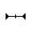

# @ohos.multimodalInput.pointer (鼠标指针)

鼠标指针管理模块，用于查询和设置鼠标指针相关属性。

> **说明**：
>
> 本模块首批接口从API version 9开始支持。后续版本的新增接口，采用上角标单独标记接口的起始版本。

## 导入模块

```js
import pointer from '@ohos.multimodalInput.pointer';
```

## pointer.setPointerVisible

setPointerVisible(visible: boolean, callback: AsyncCallback&lt;void&gt;): void

设置鼠标指针显示或者隐藏，使用AsyncCallback异步方式返回结果。

**系统能力**：SystemCapability.MultimodalInput.Input.Pointer

**参数**：

| 参数名       | 类型                        | 必填   | 说明                                       |
| -------- | ------------------------- | ---- | ---------------------------------------- |
| visible  | boolean                   | 是    | 鼠标指针是否显示。 |
| callback | AsyncCallback&lt;void&gt; | 是    | 回调函数。 |

**示例**：

```js
try {
  pointer.setPointerVisible(true, (error: Error) => {
    if (error) {
      console.log(`Set pointer visible failed, error: ${JSON.stringify(error, [`code`, `message`])}`);
      return;
    }
    console.log(`Set pointer visible success`);
  });
} catch (error) {
  console.log(`Set pointer visible failed, error: ${JSON.stringify(error, [`code`, `message`])}`);
}
```

## pointer.setPointerVisible

setPointerVisible(visible: boolean): Promise&lt;void&gt;

设置鼠标指针显示或者隐藏，使用Promise异步方式返回结果。

**系统能力**：SystemCapability.MultimodalInput.Input.Pointer

**参数**：

| 参数名      | 类型      | 必填   | 说明                                       |
| ------- | ------- | ---- | ---------------------------------------- |
| visible | boolean | 是    | 鼠标指针是否显示。 |

**返回值**：

| 参数                  | 说明                  |
| ------------------- | ------------------- |
| Promise&lt;void&gt; | Promise对象。 |

**示例**：

```js
try {
  pointer.setPointerVisible(false).then(() => {
    console.log(`Set pointer visible success`);
  });
} catch (error) {
  console.log(`Set pointer visible failed, error: ${JSON.stringify(error, [`code`, `message`])}`);
}
```

## pointer.setPointerVisibleSync<sup>10+</sup>

setPointerVisibleSync(visible: boolean): void

使用同步方式设置鼠标指针显示或者隐藏。

**系统能力**：SystemCapability.MultimodalInput.Input.Pointer

**参数**：

| 参数名      | 类型      | 必填   | 说明                                       |
| ------- | ------- | ---- | ---------------------------------------- |
| visible | boolean | 是    | 鼠标指针是否显示。true表示显示，false表示不显示。 |

**示例**：

```js
try {
  pointer.setPointerVisibleSync(false);
  console.log(`Set pointer visible success`);
} catch (error) {
  console.log(`Set pointer visible failed, error: ${JSON.stringify(error, [`code`, `message`])}`);
}
```

## pointer.isPointerVisible

isPointerVisible(callback: AsyncCallback&lt;boolean&gt;): void

获取鼠标指针显示或隐藏状态，使用AsyncCallback异步方式返回结果。

**系统能力**：SystemCapability.MultimodalInput.Input.Pointer

**参数**：

| 参数名       | 类型                           | 必填   | 说明             |
| -------- | ---------------------------- | ---- | -------------- |
| callback | AsyncCallback&lt;boolean&gt; | 是    | 回调函数，异步返回鼠标指针显示或隐藏状态。 |

**示例**：

```js
try {
  pointer.isPointerVisible((error: Error, visible: boolean) => {
    if (error) {
      console.log(`Get pointer visible failed, error: ${JSON.stringify(error, [`code`, `message`])}`);
      return;
    }
    console.log(`Get pointer visible success, visible: ${JSON.stringify(visible)}`);
  });
} catch (error) {
  console.log(`Get pointer visible failed, error: ${JSON.stringify(error, [`code`, `message`])}`);
}
```

## pointer.isPointerVisible

isPointerVisible(): Promise&lt;boolean&gt;

获取鼠标指针显示或隐藏状态，使用Promise异步方式返回结果。

**系统能力**：SystemCapability.MultimodalInput.Input.Pointer

**返回值**：

| 参数                     | 说明                  |
| ---------------------- | ------------------- |
| Promise&lt;boolean&gt; | Promise对象，异步返回鼠标指针显示或隐藏状态。 |

**示例**：

```js
try {
  pointer.isPointerVisible().then((visible: boolean) => {
    console.log(`Get pointer visible success, visible: ${JSON.stringify(visible)}`);
  });
} catch (error) {
  console.log(`Get pointer visible failed, error: ${JSON.stringify(error, [`code`, `message`])}`);
}
```

## pointer.isPointerVisibleSync<sup>10+</sup>

isPointerVisibleSync(): boolean

使用同步方式获取鼠标指针显示或者隐藏。

**系统能力**：SystemCapability.MultimodalInput.Input.Pointer

**返回值**：

| 参数                     | 说明                  |
| ---------------------- | ------------------- |
| boolean | 返回鼠标指针显示或隐藏状态。 |

**示例**：

```js
try {
  let visible: boolean = pointer.isPointerVisibleSync();
  console.log(`Get pointer visible success, visible: ${JSON.stringify(visible)}`);
} catch (error) {
  console.log(`Get pointer visible failed, error: ${JSON.stringify(error, [`code`, `message`])}`);
}
```

## pointer.setPointerSpeed

setPointerSpeed(speed: number, callback: AsyncCallback&lt;void&gt;): void

设置鼠标移动速度，使用AsyncCallback异步方式返回结果。

**系统能力**：SystemCapability.MultimodalInput.Input.Pointer

**系统API**: 此接口为系统接口。

**参数**：

| 参数名       | 类型                        | 必填   | 说明                                    |
| -------- | ------------------------- | ---- | ------------------------------------- |
| speed    | number                    | 是    | 鼠标移动速度，范围1-11，默认为5。   |
| callback | AsyncCallback&lt;void&gt; | 是    | 回调函数。 |

**示例**：

```js
try {
  pointer.setPointerSpeed(5, (error: Error) => {
    if (error) {
      console.log(`Set pointer speed failed, error: ${JSON.stringify(error, [`code`, `message`])}`);
      return;
    }
    console.log(`Set pointer speed success`);
  });
} catch (error) {
  console.log(`Set pointer speed failed, error: ${JSON.stringify(error, [`code`, `message`])}`);
}
```

## pointer.setPointerSpeed

setPointerSpeed(speed: number): Promise&lt;void&gt;

设置鼠标移动速度，使用Promise异步方式返回结果。

**系统能力**：SystemCapability.MultimodalInput.Input.Pointer

**系统API**: 此接口为系统接口。

**参数**：

| 参数名    | 类型     | 必填   | 说明                                  |
| ----- | ------ | ---- | ----------------------------------- |
| speed | number | 是    | 鼠标移动速度，范围1-11，默认为5。 |

**返回值**：

| 参数                  | 说明               |
| ------------------- | ---------------- |
| Promise&lt;void&gt; | Promise对象。 |

**示例**：

```js
try {
  pointer.setPointerSpeed(5).then(() => {
    console.log(`Set pointer speed success`);
  });
} catch (error) {
  console.log(`Set pointer speed failed, error: ${JSON.stringify(error, [`code`, `message`])}`);
}
```

## pointer.setPointerSpeedSync<sup>10+</sup>

setPointerSpeedSync(speed: number): void

使用同步方式设置鼠标移动速度。

**系统能力**：SystemCapability.MultimodalInput.Input.Pointer

**系统API**: 此接口为系统接口。

**参数**：

| 参数名    | 类型     | 必填   | 说明                                  |
| ----- | ------ | ---- | ----------------------------------- |
| speed | number | 是    | 鼠标移动速度，范围1-11，默认为5。 |

**示例**：

```js
try {
  let speed = pointer.setPointerSpeedSync(5);
  console.log(`Set pointer speed success`);
} catch (error) {
  console.log(`Set pointer speed failed, error: ${JSON.stringify(error, [`code`, `message`])}`);
}
```

## pointer.getPointerSpeed

getPointerSpeed(callback: AsyncCallback&lt;number&gt;): void

获取鼠标移动速度，使用AsyncCallback异步方式返回结果。

**系统能力**：SystemCapability.MultimodalInput.Input.Pointer

**系统API**: 此接口为系统接口。

**参数**：

| 参数名       | 类型                          | 必填   | 说明             |
| -------- | --------------------------- | ---- | -------------- |
| callback | AsyncCallback&lt;number&gt; | 是    | 回调函数，异步返回鼠标移动速度。 |

**示例**：

```js
try {
  pointer.getPointerSpeed((error: Error, speed: number) => {
    if (error) {
      console.log(`Get pointer speed failed, error: ${JSON.stringify(error, [`code`, `message`])}`);
      return;
    }
    console.log(`Get pointer speed success, speed: ${JSON.stringify(speed)}`);
  });
} catch (error) {
  console.log(`Get pointer speed failed, error: ${JSON.stringify(error, [`code`, `message`])}`);
}
```

## pointer.getPointerSpeed

getPointerSpeed(): Promise&lt;number&gt;

获取当前鼠标移动速度，使用Promise异步方式返回结果。

**系统能力**：SystemCapability.MultimodalInput.Input.Pointer

**系统API**: 此接口为系统接口。

**返回值**：

| 参数                    | 说明                  |
| --------------------- | ------------------- |
| Promise&lt;number&gt; | Promise实例，异步返回鼠标移动速度。 |

**示例**：

```js
try {
  pointer.getPointerSpeed().then(speed => {
    console.log(`Get pointer speed success, speed: ${JSON.stringify(speed)}`);
  });
} catch (error) {
  console.log(`Get pointer speed failed, error: ${JSON.stringify(error, [`code`, `message`])}`);
}
```

## pointer.getPointerSpeedSync<sup>10+</sup>

getPointerSpeedSync(): number

使用同步方式获取当前鼠标移动速度。

**系统能力**：SystemCapability.MultimodalInput.Input.Pointer

**系统API**: 此接口为系统接口。

**返回值**：

| 参数                    | 说明                  |
| --------------------- | ------------------- |
| number | 返回鼠标移动速度。 |

**示例**：

```js
try {
  let speed = pointer.getPointerSpeedSync();
  console.log(`Get pointer speed success, speed: ${JSON.stringify(speed)}`);
} catch (error) {
  console.log(`Get pointer speed failed, error: ${JSON.stringify(error, [`code`, `message`])}`);
}
```

## pointer.setHoverScrollState<sup>10+</sup>

setHoverScrollState(state: boolean, callback: AsyncCallback&lt;void&gt;): void

设置鼠标悬停滚动开关状态，使用AsyncCallback异步方式返回结果。

**系统能力**：SystemCapability.MultimodalInput.Input.Pointer

**系统API**: 此接口为系统接口。

**参数**：

| 参数名       | 类型                        | 必填   | 说明                                    |
| -------- | ------------------------- | ---- | ------------------------------------- |
| state    | boolean                    | 是    | 鼠标悬停滚动开关状态。   |
| callback | AsyncCallback&lt;void&gt; | 是    | 回调函数。 |

**示例**：

```js
try {
  pointer.setHoverScrollState(true, (error: Error) => {
    if (error) {
      console.log(`Set the mouse hover scroll failed, error: ${JSON.stringify(error, [`code`, `message`])}`);
      return;
    }
    console.log(`Set the mouse hover scroll success`);
  });
} catch (error) {
  console.log(`Set the mouse hover scroll failed, error: ${JSON.stringify(error, [`code`, `message`])}`);
}
```

## pointer.setHoverScrollState<sup>10+</sup>

setHoverScrollState(state: boolean): Promise&lt;void&gt;

设置鼠标悬停滚动开关状态，使用Promise异步方式返回结果。

**系统能力**：SystemCapability.MultimodalInput.Input.Pointer

**系统API**: 此接口为系统接口。

**参数**：

| 参数名    | 类型     | 必填   | 说明                                  |
| ----- | ------ | ---- | ----------------------------------- |
| state | boolean | 是    | 鼠标悬停滚动开关状态。 |

**返回值**：

| 参数                  | 说明               |
| ------------------- | ---------------- |
| Promise&lt;void&gt; | Promise对象。 |

**示例**：

```js
try {
  pointer.setHoverScrollState(true).then(() => {
    console.log(`Set the mouse hover scroll success`);
  });
} catch (error) {
  console.log(`Set the mouse hover scroll failed, error: ${JSON.stringify(error, [`code`, `message`])}`);
}
```

## pointer.getHoverScrollState<sup>10+</sup>

getHoverScrollState(callback: AsyncCallback&lt;boolean&gt;): void

获取鼠标悬停滚动开关状态，使用AsyncCallback异步方式返回结果。

**系统能力**：SystemCapability.MultimodalInput.Input.Pointer

**系统API**: 此接口为系统接口。

**参数**：

| 参数名       | 类型                          | 必填   | 说明             |
| -------- | --------------------------- | ---- | -------------- |
| callback | AsyncCallback&lt;boolean&gt; | 是    | 回调函数，异步返回鼠标悬停滚动开关状态。 |

**示例**：

```js
try {
  pointer.getHoverScrollState((error: Error, state: boolean) => {
    console.log(`Get the mouse hover scroll success, state: ${JSON.stringify(state)}`);
  });
} catch (error) {
  console.log(`Get the mouse hover scroll failed, error: ${JSON.stringify(error, [`code`, `message`])}`);
}
```

## pointer.getHoverScrollState<sup>10+</sup>

getHoverScrollState(): Promise&lt;boolean&gt;

获取当前鼠标悬停滚动开关状态，使用Promise异步方式返回结果。

**系统能力**：SystemCapability.MultimodalInput.Input.Pointer

**系统API**: 此接口为系统接口。

**返回值**：

| 参数                    | 说明                  |
| --------------------- | ------------------- |
| Promise&lt;boolean&gt; | Promise实例，异步返回鼠标悬停滚动开关状态。 |

**示例**：

```js
try {
  pointer.getHoverScrollState().then((state: boolean) => {
    console.log(`Get the mouse hover scroll success, state: ${JSON.stringify(state)}`);
  });
} catch (error) {
  console.log(`Get the mouse hover scroll failed, error: ${JSON.stringify(error, [`code`, `message`])}`);
}
```

## pointer.setMousePrimaryButton<sup>10+</sup>

setMousePrimaryButton(primary: PrimaryButton, callback: AsyncCallback&lt;void&gt;): void

设置鼠标主键，使用AsyncCallback异步方式返回结果。

**系统能力**：SystemCapability.MultimodalInput.Input.Pointer

**系统API**: 此接口为系统接口。

**参数**：

| 参数名    | 类型                      | 必填  | 说明                                    |
| -------- | ------------------------- | ----  | ------------------------------------- |
| primary  | [PrimaryButton](#primarybutton10)   | 是    | 鼠标主键id。   |
| callback | AsyncCallback&lt;void&gt; | 是    | 回调函数。 |

**示例**：

```js
try {
  pointer.setMousePrimaryButton(pointer.PrimaryButton.RIGHT, (error: Error) => {
    if (error) {
      console.log(`Set mouse primary button failed, error: ${JSON.stringify(error, [`code`, `message`])}`);
      return;
    }
    console.log(`Set mouse primary button success`);
  });
} catch (error) {
  console.log(`Set mouse primary button failed, error: ${JSON.stringify(error, [`code`, `message`])}`);
}
```

## pointer.setMousePrimaryButton<sup>10+</sup>

setMousePrimaryButton(primary: PrimaryButton): Promise&lt;void&gt;

设置鼠标主键，使用Promise异步方式返回结果。

**系统能力**：SystemCapability.MultimodalInput.Input.Pointer

**系统API**: 此接口为系统接口。

**参数**：

| 参数名    | 类型     | 必填   | 说明                                  |
| ----- | ------ | ---- | ----------------------------------- |
| primary | [PrimaryButton](#primarybutton10) | 是    | 鼠标主键id。 |

**返回值**：

| 参数                  | 说明               |
| ------------------- | ---------------- |
| Promise&lt;void&gt; | Promise对象。 |

**示例**：

```js
try {
  pointer.setMousePrimaryButton(pointer.PrimaryButton.RIGHT).then(() => {
    console.log(`Set mouse primary button success`);
  });
} catch (error) {
  console.log(`Set mouse primary button failed, error: ${JSON.stringify(error, [`code`, `message`])}`);
}
```

## pointer.getMousePrimaryButton<sup>10+</sup>

getMousePrimaryButton(callback: AsyncCallback&lt;PrimaryButton&gt;): void

获取鼠标主键，使用AsyncCallback异步方式返回结果。

**系统能力**：SystemCapability.MultimodalInput.Input.Pointer

**系统API**: 此接口为系统接口。

**参数**：

| 参数名       | 类型                          | 必填   | 说明             |
| -------- | --------------------------- | ---- | -------------- |
| callback | AsyncCallback&lt;[PrimaryButton](#primarybutton10)&gt; | 是    | 回调函数，异步返回鼠标主键。 |

**示例**：

```js
try {
  pointer.getMousePrimaryButton((error: Error, primary: pointer.PrimaryButton) => {
    console.log(`Get mouse primary button success, primary: ${JSON.stringify(primary)}`);
  });
} catch (error) {
  console.log(`Get mouse primary button failed, error: ${JSON.stringify(error, [`code`, `message`])}`);
}
```

## pointer.getMousePrimaryButton<sup>10+</sup>

getMousePrimaryButton(): Promise&lt;PrimaryButton&gt;

获取当前鼠标主键，使用Promise异步方式返回结果。

**系统能力**：SystemCapability.MultimodalInput.Input.Pointer

**系统API**: 此接口为系统接口。

**返回值**：

| 参数                    | 说明                  |
| --------------------- | ------------------- |
| Promise&lt;[PrimaryButton](#primarybutton10)&gt; | Promise实例，异步返回鼠标主键。 |

**示例**：

```js
try {
  pointer.getMousePrimaryButton().then((primary: pointer.PrimaryButton) => {
    console.log(`Get mouse primary button success, primary: ${JSON.stringify(primary)}`);
  });
} catch (error) {
  console.log(`Get mouse primary button failed, error: ${JSON.stringify(error, [`code`, `message`])}`);
}
```

## PrimaryButton<sup>10+</sup>

鼠标主键类型。

**系统能力**：SystemCapability.MultimodalInput.Input.Pointer

| 名称                               | 值    | 说明     |
| -------------------------------- | ---- | ------ |
| LEFT                          | 0    | 鼠标左键     |
| RIGHT                             | 1    | 鼠标右键   |

## pointer.setMouseScrollRows<sup>10+</sup>

setMouseScrollRows(rows: number, callback: AsyncCallback&lt;void&gt;): void

设置鼠标滚动行数，使用AsyncCallback异步方式返回结果。

**系统能力**：SystemCapability.MultimodalInput.Input.Pointer

**系统API**: 此接口为系统接口。

**参数**：

| 参数名       | 类型                        | 必填   | 说明                                    |
| -------- | ------------------------- | ---- | ------------------------------------- |
| rows     | number                    | 是    | 鼠标滚动行数，范围1-100，默认为3。   |
| callback | AsyncCallback&lt;void&gt; | 是    | 回调函数。 |

**示例**：

```js
try {
  pointer.setMouseScrollRows(1, (error: Error) => {
    if (error) {
      console.log(`setMouseScrollRows failed, error: ${JSON.stringify(error, [`code`, `message`])}`);
      return;
    }
    console.log(`setMouseScrollRows success`);
  });
} catch (error) {
  console.log(`setMouseScrollRows failed, error: ${JSON.stringify(error, [`code`, `message`])}`);
}
```

## pointer.setMouseScrollRows<sup>10+</sup>

setMouseScrollRows(rows: number): Promise&lt;void&gt;

设置鼠标滚动行数，使用Promise异步方式返回结果。

**系统能力**：SystemCapability.MultimodalInput.Input.Pointer

**系统API**: 此接口为系统接口。

**参数**：

| 参数名    | 类型     | 必填   | 说明                                  |
| ----- | ------ | ---- | ----------------------------------- |
| rows  | number | 是    | 鼠标滚动行数，范围1-100，默认为3。 |

**返回值**：

| 参数                  | 说明               |
| ------------------- | ---------------- |
| Promise&lt;void&gt; | Promise对象。 |

**示例**：

```js
try {
  pointer.setMouseScrollRows(20).then(() => {
    console.log(`setMouseScrollRows success`);
  });
} catch (error) {
  console.log(`setMouseScrollRows failed, error: ${JSON.stringify(error, [`code`, `message`])}`);
}
```

## pointer.getMouseScrollRows<sup>10+</sup>

getMouseScrollRows(callback: AsyncCallback&lt;number&gt;): void

获取鼠标滚动行数，使用AsyncCallback异步方式返回结果。

**系统能力**：SystemCapability.MultimodalInput.Input.Pointer

**系统API**: 此接口为系统接口。

**参数**：

| 参数名       | 类型                          | 必填   | 说明             |
| -------- | --------------------------- | ---- | -------------- |
| callback | AsyncCallback&lt;number&gt; | 是    | 回调函数，异步返回鼠标滚动行数。 |

**示例**：

```js
try {
  pointer.getMouseScrollRows((error: Error, rows: number) => {
    console.log(`getMouseScrollRows success, rows: ${JSON.stringify(rows)}`);
  });
} catch (error) {
  console.log(`getMouseScrollRows failed, error: ${JSON.stringify(error, [`code`, `message`])}`);
}
```

## pointer.getMouseScrollRows<sup>10+</sup>

getMouseScrollRows(): Promise&lt;number&gt;

获取当前鼠标滚动行数，使用Promise异步方式返回结果。

**系统能力**：SystemCapability.MultimodalInput.Input.Pointer

**系统API**: 此接口为系统接口。

**返回值**：

| 参数                    | 说明                  |
| --------------------- | ------------------- |
| Promise&lt;number&gt; | Promise实例，异步返回鼠标滚动行数。 |

**示例**：

```js
try {
  pointer.getMouseScrollRows().then((rows: number) => {
    console.log(`getMouseScrollRows success, rows: ${JSON.stringify(rows)}`);
  });
} catch (error) {
  console.log(`getMouseScrollRows failed, error: ${JSON.stringify(error, [`code`, `message`])}`);
}
```

## pointer.getPointerStyle

getPointerStyle(windowId: number, callback: AsyncCallback&lt;PointerStyle&gt;): void

获取鼠标样式类型，使用AsyncCallback异步方式返回结果。

**系统能力**：SystemCapability.MultimodalInput.Input.Pointer

**参数**：

| 参数名       | 类型                                       | 必填   | 说明             |
| -------- | ---------------------------------------- | ---- | -------------- |
| windowId | number                                   | 是    | 窗口id。    |
| callback | AsyncCallback&lt;[PointerStyle](#pointerstyle)&gt; | 是    | 回调函数，异步返回鼠标样式类型。 |

**示例**：

```js
import { BusinessError }  from '@ohos.base';
import window from '@ohos.window';

let context = getContext(this);
window.getLastWindow(context, (error: BusinessError, win: window.Window) => {
  if (error.code) {
    console.error('Failed to obtain the top window. Cause: ' + JSON.stringify(error));
    return;
  }
  let windowId = win.getWindowProperties().id;
  if (windowId < 0) {
    console.log(`Invalid windowId`);
    return;
  }
  try {
    pointer.getPointerStyle(windowId, (error: Error, style: pointer.PointerStyle) => {
      console.log(`Get pointer style success, style: ${JSON.stringify(style)}`);
    });
  } catch (error) {
    console.log(`Get pointer style failed, error: ${JSON.stringify(error, [`code`, `message`])}`);
  }
});
```

## pointer.getPointerStyle

getPointerStyle(windowId: number): Promise&lt;PointerStyle&gt;

获取鼠标样式类型，使用Promise异步方式返回结果。

**系统能力**：SystemCapability.MultimodalInput.Input.Pointer

**参数**：

| 参数名     | 类型   | 必填 | 说明     |
| -------- | ------ | ---- | -------- |
| windowId | number | 是   | 窗口id。 |

**返回值**：

| 参数                                       | 说明                  |
| ---------------------------------------- | ------------------- |
| Promise&lt;[PointerStyle](#pointerstyle)&gt; | Promise实例，异步返回鼠标样式类型。 |

**示例**：

```js
import window from '@ohos.window';
import { BusinessError }  from '@ohos.base';

let context = getContext(this);
window.getLastWindow(context, (error: BusinessError, win: window.Window) => {
  if (error.code) {
    console.error('Failed to obtain the top window. Cause: ' + JSON.stringify(error));
    return;
  }
  let windowId = win.getWindowProperties().id;
  if (windowId < 0) {
    console.log(`Invalid windowId`);
    return;
  }
  try {
    pointer.getPointerStyle(windowId).then((style: pointer.PointerStyle) => {
      console.log(`Get pointer style success, style: ${JSON.stringify(style)}`);
    });
  } catch (error) {
    console.log(`Get pointer style failed, error: ${JSON.stringify(error, [`code`, `message`])}`);
  }
});
```

## pointer.getPointerStyleSync<sup>10+</sup>

getPointerStyleSync(windowId: number): PointerStyle

使用同步方式获取鼠标样式类型。

**系统能力**：SystemCapability.MultimodalInput.Input.Pointer

**参数**：

| 参数名     | 类型   | 必填 | 说明     |
| -------- | ------ | ---- | -------- |
| windowId | number | 是   | 窗口id。 |

**返回值**：

| 参数                                       | 说明                  |
| ---------------------------------------- | ------------------- |
| [PointerStyle](#pointerstyle) | 返回鼠标样式类型。 |

**示例**：

```js
try {
  let style: pointer.PointerStyle = pointer.getPointerStyleSync(-1);
  console.log(`Get pointer style success, style: ${JSON.stringify(style)}`);
} catch (error) {
  console.log(`Get pointer style failed, error: ${JSON.stringify(error, [`code`, `message`])}`);
}
```

## pointer.setPointerStyle

setPointerStyle(windowId: number, pointerStyle: PointerStyle, callback: AsyncCallback&lt;void&gt;): void

设置鼠标样式类型，使用AsyncCallback异步方式返回结果。

**系统能力**：SystemCapability.MultimodalInput.Input.Pointer

**参数**：

| 参数名           | 类型                             | 必填   | 说明                                  |
| ------------ | ------------------------------ | ---- | ----------------------------------- |
| windowId     | number                         | 是    | 窗口id。                          |
| pointerStyle | [PointerStyle](#pointerstyle) | 是    | 鼠标样式。                             |
| callback     | AsyncCallback&lt;void&gt;      | 是    | 回调函数。 |

**示例**：

```js
import window from '@ohos.window';
import { BusinessError }  from '@ohos.base';

window.getLastWindow(getContext(), (error: BusinessError, win: window.Window) => {
  if (error.code) {
    console.error('Failed to obtain the top window. Cause: ' + JSON.stringify(error));
    return;
  }
  let windowId = win.getWindowProperties().id;
  if (windowId < 0) {
    console.log(`Invalid windowId`);
    return;
  }
  try {
    pointer.setPointerStyle(windowId, pointer.PointerStyle.CROSS, error => {
      console.log(`Set pointer style success`);
    });
  } catch (error) {
    console.log(`Set pointer style failed, error: ${JSON.stringify(error, [`code`, `message`])}`);
  }
});
```
## pointer.setPointerStyle

setPointerStyle(windowId: number, pointerStyle: PointerStyle): Promise&lt;void&gt;

设置鼠标样式类型，使用Promise异步方式返回结果。

**系统能力**：SystemCapability.MultimodalInput.Input.Pointer

**参数**：

| 参数名                  | 类型                             | 必填   | 说明               |
| ------------------- | ------------------------------ | ---- | ---------------- |
| windowId            | number                         | 是    | 窗口id。       |
| pointerStyle        | [PointerStyle](#pointerstyle) | 是    | 鼠标样式。          |
| Promise&lt;void&gt; | void                           | 是    | Promise对象。 |

**示例**：

```js
import window from '@ohos.window';
import { BusinessError }  from '@ohos.base';

window.getLastWindow(getContext(), (error: BusinessError, win: window.Window) => {
  if (error.code) {
    console.error('Failed to obtain the top window. Cause: ' + JSON.stringify(error));
    return;
  }
  let windowId = win.getWindowProperties().id;
  if (windowId < 0) {
    console.log(`Invalid windowId`);
    return;
  }
  try {
    pointer.setPointerStyle(windowId, pointer.PointerStyle.CROSS).then(() => {
      console.log(`Set pointer style success`);
    });
  } catch (error) {
    console.log(`Set pointer style failed, error: ${JSON.stringify(error, [`code`, `message`])}`);
  }
});
```

## pointer.setPointerStyleSync<sup>10+</sup>

setPointerStyleSync(windowId: number, pointerStyle: PointerStyle): void

使用同步方式设置鼠标样式类型。

**系统能力**：SystemCapability.MultimodalInput.Input.Pointer

**参数**：

| 参数名                  | 类型                             | 必填   | 说明               |
| ------------------- | ------------------------------ | ---- | ---------------- |
| windowId            | number                         | 是    | 窗口id。       |
| pointerStyle        | [PointerStyle](#pointerstyle) | 是    | 鼠标样式。          |

**示例**：
```js
import window from '@ohos.window';
import { BusinessError }  from '@ohos.base';

window.getLastWindow(getContext(), (error: BusinessError, win: window.Window) => {
  if (error.code) {
    console.error('Failed to obtain the top window. Cause: ' + JSON.stringify(error));
    return;
  }
  let windowId = win.getWindowProperties().id;
  if (windowId < 0) {
    console.log(`Invalid windowId`);
    return;
  }
  try {
    pointer.setPointerStyleSync(windowId, pointer.PointerStyle.CROSS);
    console.log(`Set pointer style success`);
  } catch (error) {
    console.log(`getPointerSize failed, error: ${JSON.stringify(error, [`code`, `message`])}`);
  }
});
```

## PointerStyle

鼠标样式类型。

**系统能力**：SystemCapability.MultimodalInput.Input.Pointer

| 名称                               | 值    | 说明     |图示 |
| -------------------------------- | ---- | ------ |------ |
| DEFAULT                          | 0    | 默认     ||
| EAST                             | 1    | 向东箭头   ||
| WEST                             | 2    | 向西箭头   ||
| SOUTH                            | 3    | 向南箭头   ||
| NORTH                            | 4    | 向北箭头   ||
| WEST_EAST                        | 5    | 向西东箭头  ||
| NORTH_SOUTH                      | 6    | 向北南箭头  ||
| NORTH_EAST                       | 7    | 向东北箭头  ||
| NORTH_WEST                       | 8    | 向西北箭头  ||
| SOUTH_EAST                       | 9    | 向东南箭头  ||
| SOUTH_WEST                       | 10   | 向西南箭头  ||
| NORTH_EAST_SOUTH_WEST            | 11   | 东北西南调整 ||
| NORTH_WEST_SOUTH_EAST            | 12   | 西北东南调整 ||
| CROSS                            | 13   | 准确选择   ||
| CURSOR_COPY                      | 14   | 拷贝     ||
| CURSOR_FORBID                    | 15   | 不可用    ||
| COLOR_SUCKER                     | 16   | 滴管     ||
| HAND_GRABBING                    | 17   | 并拢的手   ||
| HAND_OPEN                        | 18   | 张开的手   ||
| HAND_POINTING                    | 19   | 手形指针   ||
| HELP                             | 20   | 帮助选择   ||
| MOVE                             | 21   | 移动     ||
| RESIZE_LEFT_RIGHT                | 22   | 内部左右调整 ||
| RESIZE_UP_DOWN                   | 23   | 内部上下调整 ||
| SCREENSHOT_CHOOSE                | 24   | 截图十字准星 ||
| SCREENSHOT_CURSOR                | 25   | 截图     ||
| TEXT_CURSOR                      | 26   | 文本选择   ||
| ZOOM_IN                          | 27   | 放大     ||
| ZOOM_OUT                         | 28   | 缩小     ||
| MIDDLE_BTN_EAST                  | 29   | 向东滚动   ||
| MIDDLE_BTN_WEST                  | 30   | 向西滚动   ||
| MIDDLE_BTN_SOUTH                 | 31   | 向南滚动   |             |
| MIDDLE_BTN_NORTH                 | 32   | 向北滚动   ||
| MIDDLE_BTN_NORTH_SOUTH           | 33   | 向北南滚动  ||
| MIDDLE_BTN_NORTH_EAST            | 34   | 向东北滚动  ||
| MIDDLE_BTN_NORTH_WEST            | 35   | 向西北滚动  ||
| MIDDLE_BTN_SOUTH_EAST            | 36   | 向东南滚动  ||
| MIDDLE_BTN_SOUTH_WEST            | 37   | 向西南滚动  ||
| MIDDLE_BTN_NORTH_SOUTH_WEST_EAST | 38   | 四向锥形移动 ||
| HORIZONTAL_TEXT_CURSOR<sup>10+</sup> | 39 | 垂直文本选择 ||
| CURSOR_CROSS<sup>10+</sup> | 40 | 十字光标 ||
| CURSOR_CIRCLE<sup>10+</sup> | 41 | 圆形光标 ||
| LOADING<sup>10+</sup> | 42 | 正在载入动画光标 ||
| RUNNING<sup>10+</sup> | 43 | 后台运行中动画光标 ||

## pointer.setTouchpadScrollSwitch<sup>10+</sup>

setTouchpadScrollSwitch(state: boolean, callback: AsyncCallback\<void>): void

设置触控板滚轴开关，使用AsyncCallback异步方式返回结果。

**系统能力**：SystemCapability.MultimodalInput.Input.Pointer

**系统API**: 此接口为系统接口。

**参数**：

| 参数名       | 类型                        | 必填   | 说明                                    |
| -------- | ------------------------- | ---- | ------------------------------------- |
| state | boolean | 是    | 滚轴开关开启的状态，true代表开启，false代表关闭，默认为开启   |
| callback | AsyncCallback\<void> | 是    | 回调函数。 |

**示例**：

```js
try {
  pointer.setTouchpadScrollSwitch(true, (error: Error) => {
    if (error) {
      console.log(`setTouchpadScrollSwitch failed, error: ${JSON.stringify(error, [`code`, `message`])}`);
      return;
    }
    console.log(`setTouchpadScrollSwitch success`);
  });
} catch (error) {
  console.log(`setTouchpadScrollSwitch failed, error: ${JSON.stringify(error, [`code`, `message`])}`);
}
```

## pointer.setTouchpadScrollSwitch<sup>10+</sup>

setTouchpadScrollSwitch(state: boolean): Promise\<void>

设置触控板滚轴开关，使用Promise异步方式返回结果。

**系统能力**：SystemCapability.MultimodalInput.Input.Pointer

**系统API**: 此接口为系统接口。

**参数**：

| 参数名    | 类型     | 必填   | 说明                                  |
| ----- | ------ | ---- | ----------------------------------- |
| state | boolean| 是    |  滚轴开关开启的状态，true代表开启，false代表关闭，默认为开启 |

**返回值**：

| 参数                  | 说明               |
| ------------------- | ---------------- |
| Promise\<void> | Promise对象。 |

**示例**：

```js
try {
  pointer.setTouchpadScrollSwitch(false).then(() => {
    console.log(`setTouchpadScrollSwitch success`);
  });
} catch (error) {
  console.log(`setTouchpadScrollSwitch failed, error: ${JSON.stringify(error, [`code`, `message`])}`);
}
```

## pointer.getTouchpadScrollSwitch<sup>10+</sup>

getTouchpadScrollSwitch(callback:  AsyncCallback\<boolean>): void

获取触控板滚轴能力开启状态，使用AsyncCallback异步方式返回结果。

**系统能力**：SystemCapability.MultimodalInput.Input.Pointer

**系统API**: 此接口为系统接口。

**参数**：

| 参数名       | 类型                          | 必填   | 说明             |
| -------- | --------------------------- | ---- | -------------- |
| callback | AsyncCallback\<boolean> | 是    | 回调函数，异步返回触控板滚轴能力开启状态。 |

**示例**：

```js
try {
  pointer.getTouchpadScrollSwitch((error: Error, state: boolean) => {
    console.log(`getTouchpadScrollSwitch success, state: ${JSON.stringify(state)}`);
  });
} catch (error) {
  console.log(`getTouchpadScrollSwitch failed, error: ${JSON.stringify(error, [`code`, `message`])}`);
}
```

## pointer.getTouchpadScrollSwitch<sup>10+</sup>

getTouchpadScrollSwitch(): Promise\<boolean>

获取触控板滚轴能力开启状态，使用Promise异步方式返回结果。

**系统能力**：SystemCapability.MultimodalInput.Input.Pointer

**系统API**: 此接口为系统接口。

**返回值**：

| 参数                    | 说明                  |
| --------------------- | ------------------- |
| Promise\<boolean> | Promise实例，异步返回触控板滚轴能力开启状态。 |

**示例**：

```js
try {
  pointer.getTouchpadScrollSwitch().then((state) => {
    console.log(`getTouchpadScrollSwitch success, state: ${JSON.stringify(state)}`);
  });
} catch (error) {
  console.log(`getTouchpadScrollSwitch failed, error: ${JSON.stringify(error, [`code`, `message`])}`);
}
```

## pointer.setTouchpadScrollDirection<sup>10+</sup>

setTouchpadScrollDirection(state: boolean, callback: AsyncCallback\<void>): void

设置触控板滚轴的方向，使用AsyncCallback异步方式返回结果。

**系统能力**：SystemCapability.MultimodalInput.Input.Pointer

**系统API**: 此接口为系统接口。

**参数**：

| 参数名       | 类型                        | 必填   | 说明                                    |
| -------- | ------------------------- | ---- | ------------------------------------- |
| state | boolean | 是    | state为触控板滚轴的方向。true与手指滑动的方向一致，false与手指滑动的方向相反，默认为true。   |
| callback | AsyncCallback\<void> | 是    | 回调函数。 |

**示例**：

```js
try {
  pointer.setTouchpadScrollDirection(true, (error: Error) => {
    if (error) {
      console.log(`setTouchpadScrollDirection failed, error: ${JSON.stringify(error, [`code`, `message`])}`);
      return;
    }
    console.log(`setTouchpadScrollDirection success`);
  });
} catch (error) {
  console.log(`setTouchpadScrollDirection failed, error: ${JSON.stringify(error, [`code`, `message`])}`);
}
```

## pointer.setTouchpadScrollDirection<sup>10+</sup>

setTouchpadScrollDirection(state: boolean): Promise\<void>

设置触控板滚轴的方向，使用Promise异步方式返回结果。

**系统能力**：SystemCapability.MultimodalInput.Input.Pointer

**系统API**: 此接口为系统接口。

**参数**：

| 参数名    | 类型     | 必填   | 说明                                  |
| ----- | ------ | ---- | ----------------------------------- |
| state | boolean| 是    |  state为触控板滚轴的方向。true与手指滑动的方向一致，false与手指滑动的方向相反，默认为true。     |

**返回值**：

| 参数                  | 说明               |
| ------------------- | ---------------- |
| Promise\<void> | Promise对象。 |

**示例**：

```js
try {
  pointer.setTouchpadScrollDirection (false).then(() => {
    console.log(`setTouchpadScrollDirection success`);
  });
} catch (error) {
  console.log(`setTouchpadScrollDirection failed, error: ${JSON.stringify(error, [`code`, `message`])}`);
}
```

## pointer.getTouchpadScrollDirection<sup>10+</sup>

getTouchpadScrollDirection(callback:  AsyncCallback\<boolean>): void

获取触控板滚轴方向，使用AsyncCallback异步方式返回结果。

**系统能力**：SystemCapability.MultimodalInput.Input.Pointer

**系统API**: 此接口为系统接口。

**参数**：

| 参数名       | 类型                          | 必填   | 说明             |
| -------- | --------------------------- | ---- | -------------- |
| callback | AsyncCallback\<boolean> | 是    | 回调函数，异步返回触控板滚轴方向。 |

**示例**：

```js
try {
  pointer.getTouchpadScrollDirection ((error: Error, state: boolean) => {
    console.log(`getTouchpadScrollDirection success, state: ${JSON.stringify(state)}`);
  });
} catch (error) {
  console.log(`getTouchpadScrollDirection failed, error: ${JSON.stringify(error, [`code`, `message`])}`);
}
```

## pointer.getTouchpadScrollDirection<sup>10+</sup>

getTouchpadScrollDirection(): Promise\<boolean>

获取触控板滚轴方向，使用Promise异步方式返回结果。

**系统能力**：SystemCapability.MultimodalInput.Input.Pointer

**系统API**: 此接口为系统接口。

**返回值**：

| 参数                    | 说明                  |
| --------------------- | ------------------- |
| Promise\<boolean> | Promise实例，异步返回触控板滚轴方向。 |

**示例**：

```js
try {
  pointer.getTouchpadScrollDirection().then((state: boolean) => {
    console.log(`getTouchpadScrollDirection success, state: ${JSON.stringify(state)}`);
  });
} catch (error) {
  console.log(`getTouchpadScrollDirection failed, error: ${JSON.stringify(error, [`code`, `message`])}`);
}
```

## pointer.setTouchpadTapSwitch<sup>10+</sup>

setTouchpadTapSwitch(state: boolean, callback: AsyncCallback\<void>): void

设置触控板轻触功能开关，使用AsyncCallback异步方式返回结果。

**系统能力**：SystemCapability.MultimodalInput.Input.Pointer

**系统API**: 此接口为系统接口。

**参数**：

| 参数名       | 类型                        | 必填   | 说明                                    |
| -------- | ------------------------- | ---- | ------------------------------------- |
| state | boolean | 是    |触控板轻触功能开关开启状态。 true代表轻触开启，false代表轻触关闭，默认开启。   |
| callback | AsyncCallback\<void> | 是    | 回调函数。 |

**示例**：

```js
try {
  pointer.setTouchpadTapSwitch(true, (error: Error) => {
    if (error) {
      console.log(`setTouchpadTapSwitch failed, error: ${JSON.stringify(error, [`code`, `message`])}`);
      return;
    }
    console.log(`setTouchpadTapSwitch success`);
  });
} catch (error) {
  console.log(`setTouchpadTapSwitch failed, error: ${JSON.stringify(error, [`code`, `message`])}`);
}
```

## pointer.setTouchpadTapSwitch <sup>10+</sup>

setTouchpadTapSwitch(state: boolean): Promise\<void>

设置触控板轻触功能开关，使用Promise异步方式返回结果。

**系统能力**：SystemCapability.MultimodalInput.Input.Pointer

**系统API**: 此接口为系统接口。

**参数**：

| 参数名    | 类型     | 必填   | 说明                                  |
| ----- | ------ | ---- | ----------------------------------- |
| state | boolean| 是    |  触控板轻触功能开关开启状态。 true代表轻触开启，false代表轻触关闭，默认开启。  |

**返回值**：

| 参数                  | 说明               |
| ------------------- | ---------------- |
| Promise\<void> | Promise对象。 |

**示例**：

```js
try {
  pointer.setTouchpadTapSwitch(false).then(() => {
    console.log(`setTouchpadTapSwitch success`);
  });
} catch (error) {
  console.log(`setTouchpadTapSwitch failed, error: ${JSON.stringify(error, [`code`, `message`])}`);
}
```

## pointer.getTouchpadTapSwitch<sup>10+</sup>

getTouchpadTapSwitch(callback:  AsyncCallback\<boolean>): void

获取触控板轻触能力开启状态，使用AsyncCallback异步方式返回结果。

**系统能力**：SystemCapability.MultimodalInput.Input.Pointer

**系统API**: 此接口为系统接口。

**参数**：

| 参数名       | 类型                          | 必填   | 说明             |
| -------- | --------------------------- | ---- | -------------- |
| callback | AsyncCallback\<boolean> | 是    | 回调函数，异步返回触控板轻触功能开启状态。 |

**示例**：

```js
try {
  pointer.getTouchpadTapSwitch((error: Error, state: boolean) => {
    console.log(`getTouchpadTapSwitch success, state: ${JSON.stringify(state)}`);
  });
} catch (error) {
  console.log(`getTouchpadTapSwitch failed, error: ${JSON.stringify(error, [`code`, `message`])}`);
}
```

## pointer.getTouchpadTapSwitch<sup>10+</sup>

getTouchpadTapSwitch(): Promise\<boolean>

获取触控板轻触功能开启状态，使用Promise异步方式返回结果。

**系统能力**：SystemCapability.MultimodalInput.Input.Pointer

**系统API**: 此接口为系统接口。

**返回值**：

| 参数                    | 说明                  |
| --------------------- | ------------------- |
| Promise\<boolean> | Promise实例，异步返回触控板轻触功能开启状态。 |

**示例**：

```js
try {
  pointer.getTouchpadTapSwitch().then((state: boolean) => {
    console.log(`getTouchpadTapSwitch success, state: ${JSON.stringify(state)}`);
  });
} catch (error) {
  console.log(`getTouchpadTapSwitch failed, error: ${JSON.stringify(error, [`code`, `message`])}`);
}
```

## pointer.setTouchpadPointerSpeed<sup>10+</sup>

setTouchpadPointerSpeed(speed: number, callback: AsyncCallback\<void>): void

设置触控板光标移动速度，使用AsyncCallback异步方式返回结果。

**系统能力**：SystemCapability.MultimodalInput.Input.Pointer

**系统API**: 此接口为系统接口。

**参数**：

| 参数名       | 类型                        | 必填   | 说明                                    |
| -------- | ------------------------- | ---- | ------------------------------------- |
| speed | number                    | 是    |speed代表光标移动速度。speed取值范围[1,11]，默认5。  |
| callback | AsyncCallback\<void> | 是    | 回调函数。 |

**示例**：

```js
try {
  pointer.setTouchpadPointerSpeed(1, (error: Error) => {
    if (error) {
      console.log(`setTouchpadPointerSpeedfailed, error: ${JSON.stringify(error, [`code`, `message`])}`);
      return;
    }
    console.log(`setTouchpadPointerSpeed success`);
  });
} catch (error) {
  console.log(`setTouchpadPointerSpeed failed, error: ${JSON.stringify(error, [`code`, `message`])}`);
}
```

## pointer.setTouchpadPointerSpeed<sup>10+</sup>

setTouchpadPointerSpeed(speed: number): Promise\<void>

设置触控板光标移动速度，使用Promise异步方式返回结果。

**系统能力**：SystemCapability.MultimodalInput.Input.Pointer

**系统API**: 此接口为系统接口。

**参数**：

| 参数名    | 类型     | 必填   | 说明                                  |
| ----- | ------ | ---- | ----------------------------------- |
| speed| number | 是    | speed代表光标移动速度。speed取值范围[1,11]，默认5。    |

**返回值**：

| 参数                  | 说明               |
| ------------------- | ---------------- |
| Promise\<void> | Promise对象。 |

**示例**：

```js
try {
  pointer.setTouchpadPointerSpeed(10).then(() => {
    console.log(`setTouchpadPointerSpeed success`);
  });
} catch (error) {
  console.log(`setTouchpadPointerSpeed failed, error: ${JSON.stringify(error, [`code`, `message`])}`);
}
```

## pointer.getTouchpadPointerSpeed<sup>10+</sup>

getTouchpadPointerSpeed(callback: AsyncCallback\<number>): void

获取触控板光标移动速度，使用AsyncCallback异步方式返回结果。

**系统能力**：SystemCapability.MultimodalInput.Input.Pointer

**系统API**: 此接口为系统接口。

**参数**：

| 参数名       | 类型                          | 必填   | 说明             |
| -------- | --------------------------- | ---- | -------------- |
| callback | AsyncCallback\<number> | 是    | 回调函数，异步返回触控板光标移动速度。 |

**示例**：

```js
try {
  pointer.getTouchpadPointerSpeed((error: Error, speed: number) => {
    console.log(`getTouchpadPointerSpeed success, speed: ${JSON.stringify(speed)}`);
  });
} catch (error) {
  console.log(`getTouchpadPointerSpeed failed, error: ${JSON.stringify(error, [`code`, `message`])}`);
}
```

## pointer.getTouchpadPointerSpeed<sup>10+</sup>

getTouchpadPointerSpeed(): Promise\<number>

获取触控板光标移动速度，使用Promise异步方式返回结果。

**系统能力**：SystemCapability.MultimodalInput.Input.Pointer

**系统API**: 此接口为系统接口。

**返回值**：

| 参数                    | 说明                  |
| --------------------- | ------------------- |
| Promise\<number> | Promise实例，异步返回触控板光标移动速度。 |

**示例**：

```js
try {
  pointer.getTouchpadPointerSpeed().then((speed: number) => {
    console.log(`getTouchpadPointerSpeed success, speed: ${JSON.stringify(speed)}`);
  });
} catch (error) {
  console.log(`getTouchpadPointerSpeed failed, error: ${JSON.stringify(error, [`code`, `message`])}`);
}
```

## pointer.setTouchpadPinchSwitch<sup>10+</sup>

setTouchpadPinchSwitch(state: boolean, callback: AsyncCallback\<void>): void

设置触控板双指捏合功能开关，使用AsyncCallback异步方式返回结果。

**系统能力**：SystemCapability.MultimodalInput.Input.Pointer

**系统API**: 此接口为系统接口。

**参数**：

| 参数名       | 类型                        | 必填   | 说明                                    |
| -------- | ------------------------- | ---- | ------------------------------------- |
| state | boolean | 是    |触控板双指捏合功能开关开启状态。 true代表开启，false代表关闭，默认开启。   |
| callback | AsyncCallback\<void> | 是    | 回调函数。 |

**示例**：

```js
try {
  pointer.setTouchpadTapSwitch(true, (error: Error) => {
    if (error) {
      console.log(`setTouchpadPinchSwitch failed, error: ${JSON.stringify(error, [`code`, `message`])}`);
      return;
    }
    console.log(`setTouchpadPinchSwitch success`);
  });
} catch (error) {
  console.log(`setTouchpadPinchSwitch failed, error: ${JSON.stringify(error, [`code`, `message`])}`);
}
```

## pointer.setTouchpadPinchSwitch<sup>10+</sup>

setTouchpadPinchSwitch(state: boolean): Promise\<void>

设置触控板双指捏合功能开关，使用Promise异步方式返回结果。

**系统能力**：SystemCapability.MultimodalInput.Input.Pointer

**系统API**: 此接口为系统接口。

**参数**：

| 参数名    | 类型     | 必填   | 说明                                  |
| ----- | ------ | ---- | ----------------------------------- |
| state | boolean| 是    |  触控板双指捏合功能开关开启状态。 true代表开启，false代表关闭，默认开启。  |

**返回值**：

| 参数                  | 说明               |
| ------------------- | ---------------- |
| Promise\<void> | Promise对象。 |

**示例**：

```js
try {
  pointer.setTouchpadPinchSwitch(false).then(() => {
    console.log(`setTouchpadPinchSwitch success`);
  });
} catch (error) {
  console.log(`setTouchpadPinchSwitch failed, error: ${JSON.stringify(error, [`code`, `message`])}`);
}
```

## pointer.getTouchpadPinchSwitch<sup>10+</sup>

getTouchpadPinchSwitch(callback:  AsyncCallback\<boolean>): void

获取触控板双指捏合功能开启状态，使用AsyncCallback异步方式返回结果。

**系统能力**：SystemCapability.MultimodalInput.Input.Pointer

**系统API**: 此接口为系统接口。

**参数**：

| 参数名       | 类型                          | 必填   | 说明             |
| -------- | --------------------------- | ---- | -------------- |
| callback | AsyncCallback\<boolean> | 是    | 回调函数，异步返回触控板双指捏合功能开启状态。 |

**示例**：

```js
try {
  pointer.getTouchpadPinchSwitch((error: Error, state: boolean) => {
    console.log(`getTouchpadPinchSwitch success, state: ${JSON.stringify(state)}`);
  });
} catch (error) {
  console.log(`getTouchpadPinchSwitch failed, error: ${JSON.stringify(error, [`code`, `message`])}`);
}
```

## pointer.getTouchpadPinchSwitch<sup>10+</sup>

getTouchpadPinchSwitch(): Promise\<boolean>

获取触控板双指捏合功能开启状态，使用Promise异步方式返回结果。

**系统能力**：SystemCapability.MultimodalInput.Input.Pointer

**系统API**: 此接口为系统接口。

**返回值**：

| 参数                    | 说明                  |
| --------------------- | ------------------- |
| Promise\<boolean> | Promise实例，异步返回触控板双指捏合功能开启状态。 |

**示例**：

```js
try {
  pointer.getTouchpadPinchSwitch().then((state: boolean) => {
    console.log(`getTouchpadPinchSwitch success, state: ${JSON.stringify(state)}`);
  });
} catch (error) {
  console.log(`getTouchpadPinchSwitch failed, error: ${JSON.stringify(error, [`code`, `message`])}`);
}
```

## pointer.setTouchpadSwipeSwitch<sup>10+</sup>

setTouchpadSwipeSwitch(state: boolean, callback: AsyncCallback\<void>): void

设置触控板多指滑动功能开关，使用AsyncCallback异步方式返回结果。

**系统能力**：SystemCapability.MultimodalInput.Input.Pointer

**系统API**: 此接口为系统接口。

**参数**：

| 参数名       | 类型                        | 必填   | 说明                                    |
| -------- | ------------------------- | ---- | ------------------------------------- |
| state | boolean | 是    |触控板多指滑动开关开启状态。 true代表多指滑动开启，false代表多指滑动关闭，默认开启。   |
| callback | AsyncCallback\<void> | 是    | 回调函数。 |

**示例**：

```js
try {
  pointer.setTouchpadSwipeSwitch(true, (error: Error) => {
    if (error) {
      console.log(`setTouchpadSwipeSwitch failed, error: ${JSON.stringify(error, [`code`, `message`])}`);
      return;
    }
    console.log(`setTouchpadSwipeSwitch success`);
  });
} catch (error) {
  console.log(`setTouchpadSwipeSwitch failed, error: ${JSON.stringify(error, [`code`, `message`])}`);
}
```

## pointer.setTouchpadSwipeSwitch<sup>10+</sup>

setTouchpadSwipeSwitch(state: boolean): Promise\<void>

设置触控板多指滑动功能开关，使用Promise异步方式返回结果。

**系统能力**：SystemCapability.MultimodalInput.Input.Pointer

**系统API**: 此接口为系统接口。

**参数**：

| 参数名    | 类型     | 必填   | 说明                                  |
| ----- | ------ | ---- | ----------------------------------- |
| state | boolean| 是    |  触控板多指滑动功能开关开启状态。 true代表多指滑动开启，false代表多指滑动关闭，默认开启。  |

**返回值**：

| 参数                  | 说明               |
| ------------------- | ---------------- |
| Promise\<void> | Promise对象。 |

**示例**：

```js
try {
  pointer.setTouchpadSwipeSwitch(false).then(() => {
    console.log(`setTouchpadSwipeSwitch success`);
  });
} catch (error) {
  console.log(`setTouchpadSwipeSwitch failed, error: ${JSON.stringify(error, [`code`, `message`])}`);
}
```

## pointer.getTouchpadSwipeSwitch<sup>10+</sup>

getTouchpadSwipeSwitch(callback:  AsyncCallback\<boolean>): void

获取触控板多指滑动功能开启状态，使用AsyncCallback异步方式返回结果。

**系统能力**：SystemCapability.MultimodalInput.Input.Pointer

**系统API**: 此接口为系统接口。

**参数**：

| 参数名       | 类型                          | 必填   | 说明             |
| -------- | --------------------------- | ---- | -------------- |
| callback | AsyncCallback\<boolean> | 是    | 回调函数，异步返回触控板多指滑动功能开启状态。 |

**示例**：

```js
try {
  pointer.getTouchpadSwipeSwitch((error: Error, state: boolean) => {
    console.log(`getTouchpadSwipeSwitch success, state: ${JSON.stringify(state)}`);
  });
} catch (error) {
  console.log(`getTouchpadSwipeSwitch failed, error: ${JSON.stringify(error, [`code`, `message`])}`);
}
```

## pointer.getTouchpadSwipeSwitch<sup>10+</sup>

getTouchpadSwipeSwitch(): Promise\<boolean>

获取触控板多指滑动功能开启状态，使用Promise异步方式返回结果。

**系统能力**：SystemCapability.MultimodalInput.Input.Pointer

**系统API**: 此接口为系统接口。

**返回值**：

| 参数                    | 说明                  |
| --------------------- | ------------------- |
| Promise\<boolean> | Promise实例，异步返回触控板多指滑动功能开启状态。 |

**示例**：

```js
try {
  pointer.getTouchpadSwipeSwitch().then((state: boolean) => {
    console.log(`getTouchpadSwipeSwitch success, state: ${JSON.stringify(state)}`);
  });
} catch (error) {
  console.log(`getTouchpadSwipeSwitch failed, error: ${JSON.stringify(error, [`code`, `message`])}`);
}
```

## RightClickType<sup>10+</sup>

右键菜单触发方式。

**系统能力**：SystemCapability.MultimodalInput.Input.Pointer

| 名称                               | 值    | 说明     |
| -------------------------------- | ---- | ------ |
| TOUCHPAD_RIGHT_BUTTON            | 1    |触控板右键区域。 |
| TOUCHPAD_LEFT_BUTTON            | 2    |触控板左键区域。 |
| TOUCHPAD_TWO_FINGER_TAP         | 3    |双指轻击或按压触控板。|

## pointer.setTouchpadRightClickType<sup>10+</sup>

setTouchpadRightClickType(type: RightClickType, callback: AsyncCallback\<void>): void

设置触控板右键菜单类型，使用AsyncCallback异步方式返回结果。

**系统能力**：SystemCapability.MultimodalInput.Input.Pointer

**系统API**: 此接口为系统接口。

**参数**：

| 参数名       | 类型                        | 必填   | 说明                                    |
| -------- | ------------------------- | ---- | ------------------------------------- |
| type| RightClickType| 是    |type代表触控板右键菜单类型。<br>- TOUCHPAD_RIGHT_BUTTON：触控板右键区域。<br>- TOUCHPAD_LEFT_BUTTON：触控板左键区域。<br>- TOUCHPAD_TWO_FINGER_TAP：双指轻击或按压触控板。<br>默认为TOUCHPAD_RIGHT_BUTTON 。  |
| callback | AsyncCallback\<void> | 是    | 回调函数。 |

**示例**：

```js
try {
  pointer.setTouchpadRightClickType(pointer.RightClickType.TOUCHPAD_RIGHT_BUTTON , (error: Error) => {
    if (error) {
      console.log(`setTouchpadRightClickType, error: ${JSON.stringify(error, [`code`, `message`])}`);
      return;
    }
    console.log(`setTouchpadRightClickType success`);
  });
} catch (error) {
  console.log(`setTouchpadRightClickType failed, error: ${JSON.stringify(error, [`code`, `message`])}`);
}
```

## pointer.setTouchpadRightClickType<sup>10+</sup>

setTouchpadRightClickType(type: RightClickType): Promise\<void>

设置触控板右键菜单类型，使用Promise异步方式返回结果。

**系统能力**：SystemCapability.MultimodalInput.Input.Pointer

**系统API**: 此接口为系统接口。

**参数**：

| 参数名    | 类型     | 必填   | 说明                                  |
| ----- | ------ | ---- | ----------------------------------- |
| type| RightClickType| 是    | type代表触控板右键菜单类型。<br>- TOUCHPAD_RIGHT_BUTTON：触控板右键区域。<br>- TOUCHPAD_LEFT_BUTTON：触控板左键区域。<br>- TOUCHPAD_TWO_FINGER_TAP：双指轻击或按压触控板。<br>默认为TOUCHPAD_RIGHT_BUTTON 。 |

**返回值**：

| 参数                  | 说明               |
| ------------------- | ---------------- |
| Promise\<void> | Promise对象。 |

**示例**：

```js
try {
  pointer.setTouchpadRightClickType(pointer.RightClickType.TOUCHPAD_RIGHT_BUTTON).then(() => {
    console.log(`setTouchpadRightClickType success`);
  });
} catch (error) {
  console.log(`setTouchpadRightClickType failed, error: ${JSON.stringify(error, [`code`, `message`])}`);
}
```

## pointer.getTouchpadRightClickType<sup>10+</sup>

getTouchpadRightClickType(callback: AsyncCallback\<RightClickType>): void

获取触控板右键菜单类型，使用AsyncCallback异步方式返回结果。

**系统能力**：SystemCapability.MultimodalInput.Input.Pointer

**系统API**: 此接口为系统接口。

**参数**：

| 参数名       | 类型                          | 必填   | 说明             |
| -------- | --------------------------- | ---- | -------------- |
| callback | AsyncCallback\<RightClickType> | 是    | 回调函数，异步返回触控板右键菜单类型。 |

**示例**：

```js
try {
  pointer.getTouchpadRightClickType((error: Error, type: pointer.RightClickType) => {
    console.log(`getTouchpadRightClickType success, type: ${JSON.stringify(type)}`);
  });
} catch (error) {
  console.log(`getTouchpadRightClickType failed, error: ${JSON.stringify(error, [`code`, `message`])}`);
}
```

## pointer.getTouchpadRightClickType<sup>10+</sup>

getTouchpadRightClickType(): Promise\<RightClickType>

获取触控板右键菜单类型，使用Promise异步方式返回结果。

**系统能力**：SystemCapability.MultimodalInput.Input.Pointer

**系统API**: 此接口为系统接口。

**返回值**：

| 参数                    | 说明                  |
| --------------------- | ------------------- |
| Promise\<RightClickType > | Promise实例，异步返回触控板右键菜单类型。 |

**示例**：

```js
try {
  pointer.getTouchpadRightClickType().then((type: pointer.RightClickType) => {
    console.log(`getTouchpadRightClickType success, typeed: ${JSON.stringify(type)}`);
  });
} catch (error) {
  console.log(`getTouchpadRightClickType failed, error: ${JSON.stringify(error, [`code`, `message`])}`);
}
```

## pointer.setPointerSize<sup>10+</sup>

setPointerSize(size: number, callback: AsyncCallback&lt;void&gt;): void

设置鼠标光标大小，使用AsyncCallback异步方式返回结果。

**系统能力**：SystemCapability.MultimodalInput.Input.Pointer

**系统API**: 此接口为系统接口。

**参数**：

| 参数名       | 类型                        | 必填   | 说明                                    |
| -------- | ------------------------- | ---- | ------------------------------------- |
| size     | number                    | 是    | 鼠标光标大小，范围为[1-7]，默认为1。   |
| callback | AsyncCallback&lt;void&gt; | 是    | 回调函数，当设置成功时，err为undefined，否则为错误对象。 |

**示例**：

```js
try {
  pointer.setPointerSize(1, (error: Error) => {
    if (error) {
      console.log(`setPointerSize failed, error: ${JSON.stringify(error, [`code`, `message`])}`);
      return;
    }
    console.log(`setPointerSize success`);
  });
} catch (error) {
  console.log(`setPointerSize failed, error: ${JSON.stringify(error, [`code`, `message`])}`);
}
```

## pointer.setPointerSize<sup>10+</sup>

setPointerSize(size: number): Promise&lt;void&gt;

设置鼠标光标大小，使用Promise异步方式返回结果。

**系统能力**：SystemCapability.MultimodalInput.Input.Pointer

**系统API**: 此接口为系统接口。

**参数**：

| 参数名    | 类型     | 必填   | 说明                                  |
| ----- | ------ | ---- | ----------------------------------- |
| size  | number | 是    | 鼠标光标大小，范围为[1-7]，默认为1。 |

**返回值**：

| 参数                  | 说明               |
| ------------------- | ---------------- |
| Promise&lt;void&gt; | 无返回结果的Promise对象。 |

**示例**：

```js
try {
  pointer.setPointerSize(3).then(() => {
    console.log(`setPointerSize success`);
  });
} catch (error) {
  console.log(`setPointerSize failed, error: ${JSON.stringify(error, [`code`, `message`])}`);
}
```

## pointer.setPointerSizeSync<sup>10+</sup>

setPointerSizeSync(size: number): void;

设置鼠标光标大小，使用同步方式进行设置。

**系统能力**：SystemCapability.MultimodalInput.Input.Pointer

**系统API**: 此接口为系统接口。

**参数**：

| 参数名    | 类型     | 必填   | 说明                                  |
| ----- | ------ | ---- | ----------------------------------- |
| size  | number | 是    | 鼠标光标大小，范围为[1-7]，默认为1。 |

**示例**：

```js
try {
  pointer.setPointerSizeSync(5);
  console.log(`setPointerSizeSync success`);
} catch (error) {
  console.log(`setPointerSizeSync failed, error: ${JSON.stringify(error, [`code`, `message`])}`);
}
```

## pointer.getPointerSize<sup>10+</sup>

getPointerSize(callback: AsyncCallback&lt;number&gt;): void

获取鼠标光标大小，使用AsyncCallback异步方式返回结果。

**系统能力**：SystemCapability.MultimodalInput.Input.Pointer

**系统API**: 此接口为系统接口。

**参数**：

| 参数名       | 类型                          | 必填   | 说明             |
| -------- | --------------------------- | ---- | -------------- |
| callback | AsyncCallback&lt;number&gt; | 是    | 回调函数，异步返回鼠标光标大小。 |

**示例**：

```js
try {
  pointer.getPointerSize((error: Error, size: number) => {
    console.log(`getPointerSize success, size: ${JSON.stringify(size)}`);
  });
} catch (error) {
  console.log(`getPointerSize failed, error: ${JSON.stringify(error, [`code`, `message`])}`);
}
```

## pointer.getPointerSize<sup>10+</sup>

getPointerSize(): Promise&lt;number&gt;

获取当前鼠标光标大小，使用Promise异步方式返回结果。

**系统能力**：SystemCapability.MultimodalInput.Input.Pointer

**系统API**: 此接口为系统接口。

**返回值**：

| 参数                    | 说明                  |
| --------------------- | ------------------- |
| Promise&lt;number&gt; | Promise对象，异步返回鼠标光标大小。 |

**示例**：

```js
try {
  pointer.getPointerSize().then((size: number) => {
    console.log(`getPointerSize success, size: ${JSON.stringify(size)}`);
  });
} catch (error) {
  console.log(`getPointerSize failed, error: ${JSON.stringify(error, [`code`, `message`])}`);
}
```

## pointer.getPointerSizeSync<sup>10+</sup>

getPointerSizeSync(): number

获取鼠标光标大小，使用同步方式返回结果。

**系统能力**：SystemCapability.MultimodalInput.Input.Pointer

**系统API**: 此接口为系统接口。

**返回值**：

| 参数                    | 说明                  |
| --------------------- | ------------------- |
| number | 鼠标光标大小。 |

**示例**：

```js
try {
  let pointerSize = pointer.getPointerSizeSync();
  console.log(`getPointerSizeSync success, pointerSize: ${JSON.stringify(pointerSize)}`);
} catch (error) {
  console.log(`getPointerSizeSync failed, error: ${JSON.stringify(error, [`code`, `message`])}`);
}
```

## pointer.setPointerColor<sup>10+</sup>

setPointerColor(color: number, callback: AsyncCallback&lt;void&gt;): void

设置鼠标光标颜色，使用AsyncCallback异步方式返回结果。

**系统能力**：SystemCapability.MultimodalInput.Input.Pointer

**系统API**: 此接口为系统接口。

**参数**：

| 参数名       | 类型                        | 必填   | 说明                                    |
| -------- | ------------------------- | ---- | ------------------------------------- |
| color     | number                    | 是    | 鼠标光标颜色，默认为黑色：0x000000。   |
| callback | AsyncCallback&lt;void&gt; | 是    | 回调函数，当设置成功时，err为undefined，否则为错误对象。 |

**示例**：

```js
try {
  pointer.setPointerColor(0xF6C800, (error: Error) => {
    if (error) {
      console.log(`setPointerColor failed, error: ${JSON.stringify(error, [`code`, `message`])}`);
      return;
    }
    console.log(`setPointerColor success`);
  });
} catch (error) {
  console.log(`setPointerColor failed, error: ${JSON.stringify(error, [`code`, `message`])}`);
}
```

## pointer.setPointerColor<sup>10+</sup>

setPointerColor(color: number): Promise&lt;void&gt;

设置鼠标光标颜色，使用Promise异步方式返回结果。

**系统能力**：SystemCapability.MultimodalInput.Input.Pointer

**系统API**: 此接口为系统接口。

**参数**：

| 参数名    | 类型     | 必填   | 说明                                  |
| ----- | ------ | ---- | ----------------------------------- |
| color  | number | 是    | 鼠标光标颜色，默认为黑色：0x000000。 |

**返回值**：

| 参数                  | 说明               |
| ------------------- | ---------------- |
| Promise&lt;void&gt; | 无返回结果的Promise对象。 |

**示例**：

```js
try {
  pointer.setPointerColor(0xF6C800).then(() => {
    console.log(`setPointerColor success`);
  });
} catch (error) {
  console.log(`setPointerColor failed, error: ${JSON.stringify(error, [`code`, `message`])}`);
}
```

## pointer.setPointerColorSync<sup>10+</sup>

setPointerColorSync(color: number): void;

设置鼠标光标颜色，使用同步方式进行设置。

**系统能力**：SystemCapability.MultimodalInput.Input.Pointer

**系统API**: 此接口为系统接口。

**参数**：

| 参数名    | 类型     | 必填   | 说明                                  |
| ----- | ------ | ---- | ----------------------------------- |
| color  | number | 是    | 鼠标光标颜色，默认为黑色：0x000000。 |

**示例**：

```js
try {
  pointer.setPointerColorSync(0xF6C800);
  console.log(`setPointerColorSync success`);
} catch (error) {
  console.log(`setPointerColorSync failed, error: ${JSON.stringify(error, [`code`, `message`])}`);
}
```

## pointer.getPointerColor<sup>10+</sup>

getPointerColor(callback: AsyncCallback&lt;number&gt;): void

获取鼠标光标颜色，使用AsyncCallback异步方式返回结果。

**系统能力**：SystemCapability.MultimodalInput.Input.Pointer

**系统API**: 此接口为系统接口。

**参数**：

| 参数名       | 类型                          | 必填   | 说明             |
| -------- | --------------------------- | ---- | -------------- |
| callback | AsyncCallback&lt;number&gt; | 是    | 回调函数，异步返回鼠标光标颜色。 |

**示例**：

```js
try {
  pointer.getPointerColor((error: Error, color: number) => {
    console.log(`getPointerColor success, color: ${JSON.stringify(color)}`);
  });
} catch (error) {
  console.log(`getPointerColor failed, error: ${JSON.stringify(error, [`code`, `message`])}`);
}
```

## pointer.getPointerColor<sup>10+</sup>

getPointerColor(): Promise&lt;number&gt;

获取当前鼠标光标颜色，使用Promise异步方式返回结果。

**系统能力**：SystemCapability.MultimodalInput.Input.Pointer

**系统API**: 此接口为系统接口。

**返回值**：

| 参数                    | 说明                  |
| --------------------- | ------------------- |
| Promise&lt;number&gt; | Promise对象，异步返回鼠标光标颜色。 |

**示例**：

```js
try {
  pointer.getPointerColor().then((color: number) => {
    console.log(`getPointerColor success, color: ${JSON.stringify(color)}`);
  });
} catch (error) {
  console.log(`getPointerColor failed, error: ${JSON.stringify(error, [`code`, `message`])}`);
}
```

## pointer.getPointerColorSync<sup>10+</sup>

getPointerColorSync(): number

获取鼠标光标颜色，使用同步方式返回结果。

**系统能力**：SystemCapability.MultimodalInput.Input.Pointer

**系统API**: 此接口为系统接口。

**返回值**：

| 参数                    | 说明                  |
| --------------------- | ------------------- |
| number | 鼠标光标颜色。 |

**示例**：

```js
try {
  let pointerColor = pointer.getPointerColorSync();
  console.log(`getPointerColorSync success, pointerColor: ${JSON.stringify(pointerColor)}`);
} catch (error) {
  console.log(`getPointerColorSync failed, error: ${JSON.stringify(error, [`code`, `message`])}`);
}
```