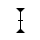
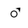

# @ohos.multimodalInput.pointer (鼠标指针)

鼠标指针管理模块，用于查询和设置鼠标指针相关属性。

> **说明**：
>
> 本模块首批接口从API version 9开始支持。后续版本的新增接口，采用上角标单独标记接口的起始版本。

## 导入模块

```js
import pointer from '@ohos.multimodalInput.pointer';
```

## pointer.setPointerVisible<sup>9+</sup>

setPointerVisible(visible: boolean, callback: AsyncCallback&lt;void&gt;): void

设置鼠标指针显示或者隐藏，使用AsyncCallback异步方式返回结果。

**系统能力**：SystemCapability.MultimodalInput.Input.Pointer

**参数**：

| 参数名       | 类型                        | 必填   | 说明                                       |
| -------- | ------------------------- | ---- | ---------------------------------------- |
| visible  | boolean                   | 是    | 鼠标指针是否显示。 |
| callback | AsyncCallback&lt;void&gt; | 是    | 回调函数。 |

**示例**：

```js
try {
  pointer.setPointerVisible(true, (error) => {
    if (error) {
      console.log(`Set pointer visible failed, error: ${JSON.stringify(error, [`code`, `message`])}`);
      return;
    }
    console.log(`Set pointer visible success`);
  });
} catch (error) {
  console.log(`Set pointer visible failed, error: ${JSON.stringify(error, [`code`, `message`])}`);
}
```

## pointer.setPointerVisible<sup>9+</sup>

setPointerVisible(visible: boolean): Promise&lt;void&gt;

设置鼠标指针显示或者隐藏，使用Promise异步方式返回结果。

**系统能力**：SystemCapability.MultimodalInput.Input.Pointer

**参数**：

| 参数名      | 类型      | 必填   | 说明                                       |
| ------- | ------- | ---- | ---------------------------------------- |
| visible | boolean | 是    | 鼠标指针是否显示。 |

**返回值**：

| 参数                  | 说明                  |
| ------------------- | ------------------- |
| Promise&lt;void&gt; | Promise对象。 |

**示例**：

```js
try {
  pointer.setPointerVisible(false).then(() => {
    console.log(`Set pointer visible success`);
  });
} catch (error) {
  console.log(`Set pointer visible failed, error: ${JSON.stringify(error, [`code`, `message`])}`);
}
```

## pointer.isPointerVisible<sup>9+</sup>

isPointerVisible(callback: AsyncCallback&lt;boolean&gt;): void

获取鼠标指针显示或隐藏状态，使用AsyncCallback异步方式返回结果。

**系统能力**：SystemCapability.MultimodalInput.Input.Pointer

**参数**：

| 参数名       | 类型                           | 必填   | 说明             |
| -------- | ---------------------------- | ---- | -------------- |
| callback | AsyncCallback&lt;boolean&gt; | 是    | 回调函数，异步返回鼠标指针显示或隐藏状态。 |

**示例**：

```js
try {
  pointer.isPointerVisible((error, visible) => {
    if (error) {
      console.log(`Get pointer visible failed, error: ${JSON.stringify(error, [`code`, `message`])}`);
      return;
    }
    console.log(`Get pointer visible success, visible: ${JSON.stringify(visible)}`);
  });
} catch (error) {
  console.log(`Get pointer visible failed, error: ${JSON.stringify(error, [`code`, `message`])}`);
}
```

## pointer.isPointerVisible<sup>9+</sup>

isPointerVisible(): Promise&lt;boolean&gt;

获取鼠标指针显示或隐藏状态，使用Promise异步方式返回结果。

**系统能力**：SystemCapability.MultimodalInput.Input.Pointer

**返回值**：

| 参数                     | 说明                  |
| ---------------------- | ------------------- |
| Promise&lt;boolean&gt; | Promise对象，异步返回鼠标指针显示或隐藏状态。 |

**示例**：

```js
try {
  pointer.isPointerVisible().then((visible) => {
    console.log(`Get pointer visible success, visible: ${JSON.stringify(visible)}`);
  });
} catch (error) {
  console.log(`Get pointer visible failed, error: ${JSON.stringify(error, [`code`, `message`])}`);
}
```

## pointer.setPointerSpeed<sup>9+</sup>

setPointerSpeed(speed: number, callback: AsyncCallback&lt;void&gt;): void

设置鼠标移动速度，使用AsyncCallback异步方式返回结果。

**系统能力**：SystemCapability.MultimodalInput.Input.Pointer

**系统API**: 此接口为系统接口。

**参数**：

| 参数名       | 类型                        | 必填   | 说明                                    |
| -------- | ------------------------- | ---- | ------------------------------------- |
| speed    | number                    | 是    | 鼠标移动速度，范围1-11，默认为5。   |
| callback | AsyncCallback&lt;void&gt; | 是    | 回调函数。 |

**示例**：

```js
try {
  pointer.setPointerSpeed(5, (error) => {
    if (error) {
      console.log(`Set pointer speed failed, error: ${JSON.stringify(error, [`code`, `message`])}`);
      return;
    }
    console.log(`Set pointer speed success`);
  });
} catch (error) {
  console.log(`Set pointer speed failed, error: ${JSON.stringify(error, [`code`, `message`])}`);
}
```

## pointer.setPointerSpeed<sup>9+</sup>

setPointerSpeed(speed: number): Promise&lt;void&gt;

设置鼠标移动速度，使用Promise异步方式返回结果。

**系统能力**：SystemCapability.MultimodalInput.Input.Pointer

**系统API**: 此接口为系统接口。

**参数**：

| 参数名    | 类型     | 必填   | 说明                                  |
| ----- | ------ | ---- | ----------------------------------- |
| speed | number | 是    | 鼠标移动速度，范围1-11，默认为5。 |

**返回值**：

| 参数                  | 说明               |
| ------------------- | ---------------- |
| Promise&lt;void&gt; | Promise对象。 |

**示例**：

```js
try {
  pointer.setPointerSpeed(5).then(() => {
    console.log(`Set pointer speed success`);
  });
} catch (error) {
  console.log(`Set pointer speed failed, error: ${JSON.stringify(error, [`code`, `message`])}`);
}
```

## pointer.getPointerSpeed<sup>9+</sup>

getPointerSpeed(callback: AsyncCallback&lt;number&gt;): void

获取鼠标移动速度，使用AsyncCallback异步方式返回结果。

**系统能力**：SystemCapability.MultimodalInput.Input.Pointer

**系统API**: 此接口为系统接口。

**参数**：

| 参数名       | 类型                          | 必填   | 说明             |
| -------- | --------------------------- | ---- | -------------- |
| callback | AsyncCallback&lt;number&gt; | 是    | 回调函数，异步返回鼠标移动速度。 |

**示例**：

```js
try {
  pointer.getPointerSpeed((error, speed) => {
    if (error) {
      console.log(`Get pointer speed failed, error: ${JSON.stringify(error, [`code`, `message`])}`);
      return;
    }
    console.log(`Get pointer speed success, speed: ${JSON.stringify(speed)}`);
  });
} catch (error) {
  console.log(`Get pointer speed failed, error: ${JSON.stringify(error, [`code`, `message`])}`);
}
```

## pointer.getPointerSpeed<sup>9+</sup>

getPointerSpeed(): Promise&lt;number&gt;

获取当前鼠标移动速度，使用Promise异步方式返回结果。

**系统能力**：SystemCapability.MultimodalInput.Input.Pointer

**系统API**: 此接口为系统接口。

**返回值**：

| 参数                    | 说明                  |
| --------------------- | ------------------- |
| Promise&lt;number&gt; | Promise实例，异步返回鼠标移动速度。 |

**示例**：

```js
try {
  pointer.getPointerSpeed().then(speed => {
    console.log(`Get pointer speed success, speed: ${JSON.stringify(speed)}`);
  });
} catch (error) {
  console.log(`Get pointer speed failed, error: ${JSON.stringify(error, [`code`, `message`])}`);
}
```

## pointer.getPointerStyle<sup>9+</sup>

getPointerStyle(windowId: number, callback: AsyncCallback&lt;PointerStyle&gt;): void

获取鼠标样式类型，使用AsyncCallback异步方式返回结果。

**系统能力**：SystemCapability.MultimodalInput.Input.Pointer

**参数**：

| 参数名       | 类型                                       | 必填   | 说明             |
| -------- | ---------------------------------------- | ---- | -------------- |
| windowId | number                                   | 是    | 窗口id。    |
| callback | AsyncCallback&lt;[PointerStyle](#pointerstyle9)&gt; | 是    | 回调函数，异步返回鼠标样式类型。 |

**示例**：

```js
import window from '@ohos.window';

window.getLastWindow(this.context, (error, win) => {
  if (error.code) {
    console.error('Failed to obtain the top window. Cause: ' + JSON.stringify(error));
    return;
  }
  let windowId = win.getWindowProperties().id;
  if (windowId < 0) {
    console.log(`Invalid windowId`);
    return;
  }
  try {
    pointer.getPointerStyle(windowId, (error, style) => {
      console.log(`Get pointer style success, style: ${JSON.stringify(style)}`);
    });
  } catch (error) {
    console.log(`Get pointer style failed, error: ${JSON.stringify(error, [`code`, `message`])}`);
  }
});
```

## pointer.getPointerStyle<sup>9+</sup>

getPointerStyle(windowId: number): Promise&lt;PointerStyle&gt;

获取鼠标样式类型，使用Promise异步方式返回结果。

**系统能力**：SystemCapability.MultimodalInput.Input.Pointer

**参数**：

| 参数名     | 类型   | 必填 | 说明     |
| -------- | ------ | ---- | -------- |
| windowId | number | 是   | 窗口id。 |

**返回值**：

| 参数                                       | 说明                  |
| ---------------------------------------- | ------------------- |
| Promise&lt;[PointerStyle](#pointerstyle9)&gt; | Promise实例，异步返回鼠标样式类型。 |

**示例**：

```js
import window from '@ohos.window';

window.getLastWindow(this.context, (error, win) => {
  if (error.code) {
    console.error('Failed to obtain the top window. Cause: ' + JSON.stringify(error));
    return;
  }
  let windowId = win.getWindowProperties().id;
  if (windowId < 0) {
    console.log(`Invalid windowId`);
    return;
  }
  try {
    pointer.getPointerStyle(windowId).then((style) => {
      console.log(`Get pointer style success, style: ${JSON.stringify(style)}`);
    });
  } catch (error) {
    console.log(`Get pointer style failed, error: ${JSON.stringify(error, [`code`, `message`])}`);
  }
});
```

## pointer.setPointerStyle<sup>9+</sup>

setPointerStyle(windowId: number, pointerStyle: PointerStyle, callback: AsyncCallback&lt;void&gt;): void

设置鼠标样式类型，使用AsyncCallback异步方式返回结果。

**系统能力**：SystemCapability.MultimodalInput.Input.Pointer

**参数**：

| 参数名           | 类型                             | 必填   | 说明                                  |
| ------------ | ------------------------------ | ---- | ----------------------------------- |
| windowId     | number                         | 是    | 窗口id。                          |
| pointerStyle | [PointerStyle](#pointerstyle9) | 是    | 鼠标样式id。                             |
| callback     | AsyncCallback&lt;void&gt;      | 是    | 回调函数。 |

**示例**：

```js
import window from '@ohos.window';

window.getLastWindow(this.context, (error, win) => {
  if (error.code) {
    console.error('Failed to obtain the top window. Cause: ' + JSON.stringify(error));
    return;
  }
  let windowId = win.getWindowProperties().id;
  if (windowId < 0) {
    console.log(`Invalid windowId`);
    return;
  }
  try {
    pointer.setPointerStyle(windowId, pointer.PointerStyle.CROSS, error => {
      console.log(`Set pointer style success`);
    });
  } catch (error) {
    console.log(`Set pointer style failed, error: ${JSON.stringify(error, [`code`, `message`])}`);
  }
});
```
## pointer.setPointerStyle<sup>9+</sup>

setPointerStyle(windowId: number, pointerStyle: PointerStyle): Promise&lt;void&gt;

设置鼠标样式类型，使用Promise异步方式返回结果。

**系统能力**：SystemCapability.MultimodalInput.Input.Pointer

**参数**：

| 参数名                  | 类型                             | 必填   | 说明               |
| ------------------- | ------------------------------ | ---- | ---------------- |
| windowId            | number                         | 是    | 窗口id。       |
| pointerStyle        | [PointerStyle](#pointerstyle9) | 是    | 鼠标样式id。          |
| Promise&lt;void&gt; | void                           | 是    | Promise对象。 |

**示例**：

```js
import window from '@ohos.window';

window.getLastWindow(this.context, (error, win) => {
  if (error.code) {
    console.error('Failed to obtain the top window. Cause: ' + JSON.stringify(error));
    return;
  }
  let windowId = win.getWindowProperties().id;
  if (windowId < 0) {
    console.log(`Invalid windowId`);
    return;
  }
  try {
    pointer.setPointerStyle(windowId, pointer.PointerStyle.CROSS).then(() => {
      console.log(`Set pointer style success`);
    });
  } catch (error) {
    console.log(`Set pointer style failed, error: ${JSON.stringify(error, [`code`, `message`])}`);
  }
});
```
## PointerStyle<sup>9+</sup>

鼠标样式类型。

**系统能力**：SystemCapability.MultimodalInput.Input.Pointer

| 名称                               | 值    | 说明     |图示 |
| -------------------------------- | ---- | ------ |------ |
| DEFAULT                          | 0    | 默认     ||
| EAST                             | 1    | 向东箭头   ||
| WEST                             | 2    | 向西箭头   ||
| SOUTH                            | 3    | 向南箭头   ||
| NORTH                            | 4    | 向北箭头   ||
| WEST_EAST                        | 5    | 向西东箭头  ||
| NORTH_SOUTH                      | 6    | 向北南箭头  ||
| NORTH_EAST                       | 7    | 向东北箭头  ||
| NORTH_WEST                       | 8    | 向西北箭头  ||
| SOUTH_EAST                       | 9    | 向东南箭头  ||
| SOUTH_WEST                       | 10   | 向西南箭头  ||
| NORTH_EAST_SOUTH_WEST            | 11   | 东北西南调整 ||
| NORTH_WEST_SOUTH_EAST            | 12   | 西北东南调整 ||
| CROSS                            | 13   | 准确选择   ||
| CURSOR_COPY                      | 14   | 拷贝     ||
| CURSOR_FORBID                    | 15   | 不可用    ||
| COLOR_SUCKER                     | 16   | 滴管     ||
| HAND_GRABBING                    | 17   | 并拢的手   ||
| HAND_OPEN                        | 18   | 张开的手   ||
| HAND_POINTING                    | 19   | 手形指针   ||
| HELP                             | 20   | 帮助选择   ||
| MOVE                             | 21   | 移动     ||
| RESIZE_LEFT_RIGHT                | 22   | 内部左右调整 ||
| RESIZE_UP_DOWN                   | 23   | 内部上下调整 ||
| SCREENSHOT_CHOOSE                | 24   | 截图十字准星 ||
| SCREENSHOT_CURSOR                | 25   | 截图     ||
| TEXT_CURSOR                      | 26   | 文本选择   ||
| ZOOM_IN                          | 27   | 放大     ||
| ZOOM_OUT                         | 28   | 缩小     ||
| MIDDLE_BTN_EAST                  | 29   | 向东滚动   ||
| MIDDLE_BTN_WEST                  | 30   | 向西滚动   ||
| MIDDLE_BTN_SOUTH                 | 31   | 向南滚动   |             |
| MIDDLE_BTN_NORTH                 | 32   | 向北滚动   ||
| MIDDLE_BTN_NORTH_SOUTH           | 33   | 向北南滚动  ||
| MIDDLE_BTN_NORTH_EAST            | 34   | 向东北滚动  ||
| MIDDLE_BTN_NORTH_WEST            | 35   | 向西北滚动  ||
| MIDDLE_BTN_SOUTH_EAST            | 36   | 向东南滚动  ||
| MIDDLE_BTN_SOUTH_WEST            | 37   | 向西南滚动  ||
| MIDDLE_BTN_NORTH_SOUTH_WEST_EAST | 38   | 四向锥形移动 ||