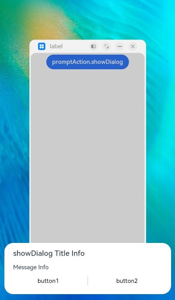

# @ohos.promptAction (弹窗)

创建并显示文本提示框、对话框和操作菜单。

> **说明：**
>
> 本模块首批接口从API version 9开始支持。后续版本的新增接口，采用上角标单独标记接口的起始版本。
>
> 该模块不支持在[UIAbility](./js-apis-app-ability-uiAbility.md)的文件声明处使用，即不能在UIAbility的生命周期中调用，需要在创建组件实例后使用。
>
> 本模块功能依赖UI的执行上下文，不可在UI上下文不明确的地方使用，参见[UIContext](./js-apis-arkui-UIContext.md#uicontext)说明。
>
> 从API version 10开始，可以通过使用[UIContext](./js-apis-arkui-UIContext.md#uicontext)中的[getPromptAction](./js-apis-arkui-UIContext.md#getpromptaction)方法获取当前UI上下文关联的[PromptAction](./js-apis-arkui-UIContext.md#promptaction)对象。

## 导入模块

```ts
import promptAction from '@ohos.promptAction';
```

## promptAction.showToast

showToast(options: ShowToastOptions): void

创建并显示文本提示框。

**系统能力：** SystemCapability.ArkUI.ArkUI.Full

**参数：**

| 参数名     | 类型                                    | 必填   | 说明      |
| ------- | ------------------------------------- | ---- | ------- |
| options | [ShowToastOptions](#showtoastoptions) | 是    | 文本弹窗选项。 |

**错误码：**

以下错误码的详细介绍请参见[ohos.promptAction(弹窗)](../errorcodes/errorcode-promptAction.md)错误码。

| 错误码ID   | 错误信息 |
| --------- | ------- |
| 100001    | if UI execution context not found. |

**示例：**

```ts
import promptAction from '@ohos.promptAction'
import { BusinessError } from '@ohos.base';
try {
  promptAction.showToast({            
    message: 'Message Info',
    duration: 2000 
  });
} catch (error) {
  let message = (error as BusinessError).message
  let code = (error as BusinessError).code
  console.error(`showToast args error code is ${code}, message is ${message}`);
};

```


## ShowToastOptions

文本提示框的选项。

**系统能力：**  SystemCapability.ArkUI.ArkUI.Full。

| 名称     | 类型                                                         | 必填 | 说明                                                         |
| -------- | ------------------------------------------------------------ | ---- | ------------------------------------------------------------ |
| message  | string\| [Resource](../arkui-ts/ts-types.md#resource类型)<sup>9+</sup> | 是   | 显示的文本信息。<br>**说明：** <br/>默认字体为'Harmony Sans'，不支持设置其他字体。 |
| duration | number                                                       | 否   | 默认值1500ms，取值区间：1500ms-10000ms。若小于1500ms则取默认值，若大于10000ms则取上限值10000ms。 |
| bottom   | string\| number                                              | 否   | 设置弹窗边框距离屏幕底部的位置。<br>默认值：80vp             |
| showMode<sup>11+</sup>   | [ToastShowMode](#toastshowmode)    | 否   | 设置弹窗是否显示在应用之上。<br>默认值：ToastShowMode.DEFAULT，默认显示在应用内             |

### ToastShowMode<sup>11+</sup>

设置弹窗显示模式，默认显示在应用内，支持显示在应用之上。

**系统能力：**  SystemCapability.ArkUI.ArkUI.Full。

| 名称     | 值 | 说明                                                         |
| -------- | ---- | ------------------------------------------------------------ |
| DEFAULT  | 0   | Toast 显示在应用内。 |
| TOP_MOST | 1   | Toast 显示在应用之上。 |


## promptAction.showDialog

showDialog(options: ShowDialogOptions): Promise&lt;ShowDialogSuccessResponse&gt;

创建并显示对话框，对话框响应后异步返回结果。

**系统能力：**  SystemCapability.ArkUI.ArkUI.Full

**参数：**

| 参数名     | 类型                                      | 必填   | 说明     |
| ------- | --------------------------------------- | ---- | ------ |
| options | [ShowDialogOptions](#showdialogoptions) | 是    | 对话框选项。 |

**返回值：**

| 类型                                       | 说明       |
| ---------------------------------------- | -------- |
| Promise&lt;[ShowDialogSuccessResponse](#showdialogsuccessresponse)&gt; | 对话框响应结果。 |

**错误码：**

以下错误码的详细介绍请参见[ohos.promptAction(弹窗)](../errorcodes/errorcode-promptAction.md)错误码。

| 错误码ID   | 错误信息 |
| --------- | ------- |
| 100001    | if UI execution context not found. |

**示例：**

```ts
import promptAction from '@ohos.promptAction'
import { BusinessError } from '@ohos.base';
try {
  promptAction.showDialog({
    title: 'Title Info',
    message: 'Message Info',
    buttons: [
      {
        text: 'button1',
        color: '#000000'
      },
      {
        text: 'button2',
        color: '#000000'
      }
    ],
  })
    .then(data => {
      console.info('showDialog success, click button: ' + data.index);
    })
    .catch((err:Error) => {
      console.info('showDialog error: ' + err);
    })
} catch (error) {
  let message = (error as BusinessError).message
  let code = (error as BusinessError).code
  console.error(`showDialog args error code is ${code}, message is ${message}`);
};
```


## promptAction.showDialog

showDialog(options: ShowDialogOptions, callback: AsyncCallback&lt;ShowDialogSuccessResponse&gt;):void 

创建并显示对话框，对话框响应结果异步返回。

**系统能力：**  SystemCapability.ArkUI.ArkUI.Full

**参数：**

| 参数名      | 类型                                       | 必填   | 说明           |
| -------- | ---------------------------------------- | ---- | ------------ |
| options  | [ShowDialogOptions](#showdialogoptions)  | 是    | 页面显示对话框信息描述。 |
| callback | AsyncCallback&lt;[ShowDialogSuccessResponse](#showdialogsuccessresponse)&gt; | 是    | 对话框响应结果回调。   |

**错误码：**

以下错误码的详细介绍请参见[ohos.promptAction(弹窗)](../errorcodes/errorcode-promptAction.md)错误码。

| 错误码ID   | 错误信息 |
| --------- | ------- |
| 100001    | if UI execution context not found. |

**示例：**

```ts
import promptAction from '@ohos.promptAction';
import { BusinessError } from '@ohos.base';
try {
  promptAction.showDialog({
    title: 'showDialog Title Info',
    message: 'Message Info',
    buttons: [
      {
        text: 'button1',
        color: '#000000'
      },
      {
        text: 'button2',
        color: '#000000'
      }
    ]
  }, (err, data) => {
    if (err) {
      console.info('showDialog err: ' + err);
      return;
    }
    console.info('showDialog success callback, click button: ' + data.index);
  });
} catch (error) {
  let message = (error as BusinessError).message
  let code = (error as BusinessError).code
  console.error(`showDialog args error code is ${code}, message is ${message}`);
};
```


当弹窗的showInSubWindow属性为true时，弹窗可显示在窗口外

```ts
import promptAction from '@ohos.promptAction';
import { BusinessError } from '@ohos.base';
try {
  promptAction.showDialog({
    title: 'showDialog Title Info',
    message: 'Message Info',
    isModal: true,
    showInSubWindow: true,
    buttons: [
      {
        text: 'button1',
        color: '#000000'
      },
      {
        text: 'button2',
        color: '#000000'
      }
    ]
  }, (err, data) => {
    if (err) {
      console.info('showDialog err: ' + err);
      return;
    }
    console.info('showDialog success callback, click button: ' + data.index);
  });
} catch (error) {
  let message = (error as BusinessError).message
  let code = (error as BusinessError).code
  console.error(`showDialog args error code is ${code}, message is ${message}`);
};
```




## ShowDialogOptions

对话框的选项。

**系统能力：** SystemCapability.ArkUI.ArkUI.Full

| 名称    | 类型                                                         | 必填 | 说明                                                         |
| ------- | ------------------------------------------------------------ | ---- | ------------------------------------------------------------ |
| title   | string\| [Resource](../arkui-ts/ts-types.md#resource类型)<sup>9+</sup> | 否   | 标题文本。                                                   |
| message | string\| [Resource](../arkui-ts/ts-types.md#resource类型)<sup>9+</sup> | 否   | 内容文本。                                                   |
| buttons  | Array&lt;[Button](#button)&gt;    | 否   | 对话框中按钮的数组，结构为：{text:'button',&nbsp;color:&nbsp;'\#666666'}，支持大于1个按钮。
| alignment<sup>10+</sup>  | [DialogAlignment](../arkui-ts/ts-methods-alert-dialog-box.md#dialogalignment枚举说明) | 否   | 弹窗在竖直方向上的对齐方式。<br>默认值：DialogAlignment.Default |
| offset<sup>10+</sup>     | [Offset](../arkui-ts/ts-types.md#offset) | 否     | 弹窗相对alignment所在位置的偏移量。<br/>默认值：{&nbsp;dx:&nbsp;0&nbsp;,&nbsp;dy:&nbsp;0&nbsp;} |
| maskRect<sup>10+</sup>| [Rectangle](../arkui-ts/ts-methods-alert-dialog-box.md#rectangle10类型说明) | 否     | 弹窗遮蔽层区域，在遮蔽层区域内的事件不透传，在遮蔽层区域外的事件透传。<br/>默认值：{ x: 0, y: 0, width: '100%', height: '100%' } |
| showInSubWindow<sup>11+</sup> | boolean | 否 | 某弹框需要显示在主窗口之外时，是否在子窗口显示此弹窗。<br/>默认值：false，在子窗口不显示弹窗。<br/>**说明**：showInSubWindow为true的弹窗无法触发显示另一个showInSubWindow为true的弹窗。 |
| isModal<sup>11+</sup> | boolean | 否 | 弹窗是否为模态窗口，模态窗口有蒙层，非模态窗口无蒙层。<br/>默认值：true，此时弹窗有蒙层。 |

## ShowDialogSuccessResponse 

对话框的响应结果。

**系统能力：**  SystemCapability.ArkUI.ArkUI.Full

| 名称  | 类型   | 必填 | 说明                            |
| ----- | ------ | ---- | ------------------------------- |
| index | number | 否   | 选中按钮在buttons数组中的索引。 |

## promptAction.showActionMenu

showActionMenu(options: ActionMenuOptions, callback: AsyncCallback&lt;ActionMenuSuccessResponse&gt;):void

创建并显示操作菜单，菜单响应结果异步返回。

**系统能力：** SystemCapability.ArkUI.ArkUI.Full。

**参数：**

| 参数名      | 类型                                       | 必填   | 说明        |
| -------- | ---------------------------------------- | ---- | --------- |
| options  | [ActionMenuOptions](#actionmenuoptions)  | 是    | 操作菜单选项。   |
| callback | AsyncCallback&lt;[ActionMenuSuccessResponse](#actionmenusuccessresponse)> | 是    | 菜单响应结果回调。 |

**错误码：**

以下错误码的详细介绍请参见[ohos.promptAction(弹窗)](../errorcodes/errorcode-promptAction.md)错误码。

| 错误码ID   | 错误信息 |
| --------- | ------- |
| 100001    | if UI execution context not found. |

**示例：**

```ts
import promptAction from '@ohos.promptAction';
import { BusinessError } from '@ohos.base';
try {
  promptAction.showActionMenu({
    title: 'Title Info',
    buttons: [
      {
        text: 'item1',
        color: '#666666'
      },
      {
        text: 'item2',
        color: '#000000'
      },
    ]
  }, (err, data) => {
    if (err) {
      console.info('showActionMenu err: ' + err);
      return;
    }
    console.info('showActionMenu success callback, click button: ' + data.index);
  })
} catch (error) {
  let message = (error as BusinessError).message
  let code = (error as BusinessError).code
  console.error(`showActionMenu args error code is ${code}, message is ${message}`);
};
```


## promptAction.showActionMenu

showActionMenu(options: ActionMenuOptions): Promise&lt;ActionMenuSuccessResponse&gt;

创建并显示操作菜单，菜单响应后异步返回结果。

**系统能力：** SystemCapability.ArkUI.ArkUI.Full

**参数：**

| 参数名     | 类型                                      | 必填   | 说明      |
| ------- | --------------------------------------- | ---- | ------- |
| options | [ActionMenuOptions](#actionmenuoptions) | 是    | 操作菜单选项。 |

**返回值：**

| 类型                                       | 说明      |
| ---------------------------------------- | ------- |
| Promise&lt;[ActionMenuSuccessResponse](#actionmenusuccessresponse)&gt; | 菜单响应结果。 |

**错误码：**

以下错误码的详细介绍请参见[ohos.promptAction(弹窗)](../errorcodes/errorcode-promptAction.md)错误码。

| 错误码ID   | 错误信息 |
| --------- | ------- |
| 100001    | if UI execution context not found. |

**示例：**

```ts
import promptAction from '@ohos.promptAction';
import { BusinessError } from '@ohos.base';
try {
  promptAction.showActionMenu({
    title: 'showActionMenu Title Info',
    buttons: [
      {
        text: 'item1',
        color: '#666666'
      },
      {
        text: 'item2',
        color: '#000000'
      },
    ]
  })
    .then(data => {
      console.info('showActionMenu success, click button: ' + data.index);
    })
    .catch((err:Error) => {
      console.info('showActionMenu error: ' + err);
    })
} catch (error) {
  let message = (error as BusinessError).message
  let code = (error as BusinessError).code
  console.error(`showActionMenu args error code is ${code}, message is ${message}`);
};
```


## promptAction.openCustomDialog<sup>11+</sup>

openCustomDialog(options: CustomDialogOptions): Promise&lt;number&gt;

打开自定义弹窗。

**系统能力：** SystemCapability.ArkUI.ArkUI.Full

**参数：**

| 参数名  | 类型                                          | 必填 | 说明               |
| ------- | --------------------------------------------- | ---- | ------------------ |
| options | [CustomDialogOptions](#customdialogoptions11) | 是   | 自定义弹窗的内容。 |

**返回值：**

| 类型                  | 说明                                  |
| --------------------- | ------------------------------------- |
| Promise&lt;number&gt; | 返回供closeCustomDialog使用的对话框id。 |

**错误码：**

以下错误码的详细介绍请参见[ohos.promptAction(弹窗)](../errorcodes/errorcode-promptAction.md)错误码。

| 错误码ID | 错误信息                           |
| -------- | ---------------------------------- |
| 100001   | if UI execution context not found. |

**示例：**

```ts
import promptAction from '@ohos.promptAction'
let customDialogId: number = 0
@Builder
function customDialogBuilder() {
  Column() {
    Text('Custom dialog Message').fontSize(10)
    Row() {
      Button("确认").onClick(() => {
        promptAction.closeCustomDialog(customDialogId)
      })
      Blank().width(50)
      Button("取消").onClick(() => {
        promptAction.closeCustomDialog(customDialogId)
      })
    }
  }.height(200).padding(5)
}

@Entry
@Component
struct Index {
  @State message: string = 'Hello World'
    
  build() {
    Row() {
      Column() {
        Text(this.message)
          .fontSize(50)
          .fontWeight(FontWeight.Bold)
          .onClick(() => {
            promptAction.openCustomDialog({
              builder: customDialogBuilder.bind(this)
            }).then((dialogId: number) => {
              customDialogId = dialogId
            })
          })
      }
      .width('100%')
    }
    .height('100%')
  }
}
```

## promptAction.closeCustomDialog<sup>11+</sup>

closeCustomDialog(dialogId: number): void

关闭自定义弹窗。

**系统能力：** SystemCapability.ArkUI.ArkUI.Full

**参数：**

| 参数名   | 类型   | 必填 | 说明                             |
| -------- | ------ | ---- | -------------------------------- |
| dialogId | number | 是   | openCustomDialog返回的对话框id。 |

**错误码：** 

以下错误码的详细介绍请参见[ohos.promptAction(弹窗)](../errorcodes/errorcode-promptAction.md)错误码。

| 错误码ID | 错误信息                           |
| -------- | ---------------------------------- |
| 100001   | if UI execution context not found. |

**示例：**

示例请看[promptAction.openCustomDialog](#promptactionopencustomdialog11)的示例。

## ActionMenuOptions

操作菜单的选项。

**系统能力：** SystemCapability.ArkUI.ArkUI.Full

| 名称                          | 类型                                                         | 必填 | 说明                                                         |
| ----------------------------- | ------------------------------------------------------------ | ---- | ------------------------------------------------------------ |
| title                         | string\| [Resource](../arkui-ts/ts-types.md#resource类型)<sup>9+</sup> | 否   | 标题文本。                                                   |
| buttons                       | [[Button](#button),[Button](#button)?,[Button](#button)?,[Button](#button)?,[Button](#button)?,[Button](#button)?] | 是   | 菜单中菜单项按钮的数组，结构为：{text:'button',&nbsp;color:&nbsp;'\#666666'}，支持1-6个按钮。按钮数量大于6个时，仅显示前6个按钮，之后的按钮不显示。 |
| showInSubWindow<sup>11+</sup> | boolean                                                      | 否   | 某弹框需要显示在主窗口之外时，是否在子窗口显示此弹窗。<br/>默认值：false，在子窗口不显示弹窗。<br/>**说明**：showInSubWindow为true的弹窗无法触发显示另一个showInSubWindow为true的弹窗。 |
| isModal<sup>11+</sup>         | boolean                                                      | 否   | 弹窗是否为模态窗口，模态窗口有蒙层，非模态窗口无蒙层。<br/>默认值：true，此时弹窗有蒙层。 |

## CustomDialogOptions<sup>11+</sup>

自定义弹窗的内容，继承自[BaseDialogOptions](#basedialogoptions11)。

**系统能力：** SystemCapability.ArkUI.ArkUI.Full

| 名称    | 类型                                                    | 必填 | 说明                   |
| ------- | ------------------------------------------------------- | ---- | ---------------------- |
| builder | [CustomBuilder](../arkui-ts/ts-types.md#custombuilder8) | 否   | 设置自定义弹窗的内容。 |

## BaseDialogOptions<sup>11+</sup>

弹窗的选项。

**系统能力：** SystemCapability.ArkUI.ArkUI.Full

| 名称            | 类型                                                         | 必填 | 说明                                                         |
| --------------- | ------------------------------------------------------------ | ---- | ------------------------------------------------------------ |
| maskRect        | [Rectangle](../arkui-ts/ts-methods-alert-dialog-box.md#rectangle10类型说明) | 否   | 弹窗遮蔽层区域。                                             |
| alignment       | [DialogAlignment](../arkui-ts/ts-methods-alert-dialog-box.md#dialogalignment枚举说明) | 否   | 弹窗在竖直方向上的对齐方式。                                 |
| offset          | [Offset](../arkui-ts/ts-types.md#offset)                     | 否   | 弹窗相对alignment所在位置的偏移量。                          |
| isModal         | boolean                                                      | 否   | 弹窗是否为模态窗口，模态窗口有蒙层，非模态窗口无蒙层。<br/>默认值：true，此时弹窗有蒙层。 |
| showInSubWindow | boolean                                                      | 否   | 某弹框需要显示在主窗口之外时，是否在子窗口显示此弹窗。       |

## ActionMenuSuccessResponse

操作菜单的响应结果。

**系统能力：** SystemCapability.ArkUI.ArkUI.Full

| 名称    | 类型     | 必填   | 说明                       |
| ----- | ------ | ---- | ------------------------ |
| index | number | 否    | 选中按钮在buttons数组中的索引，从0开始。 |

## Button

菜单中的菜单项按钮。

**系统能力：** SystemCapability.ArkUI.ArkUI.Full

| 名称    | 类型                                       | 必填   | 说明      |
| ----- | ---------------------------------------- | ---- | ------- |
| text  | string\| [Resource](../arkui-ts/ts-types.md#resource类型)<sup>9+</sup> | 是    | 按钮文本内容。 |
| color | string\| [Resource](../arkui-ts/ts-types.md#resource类型)<sup>9+</sup> | 是    | 按钮文本颜色。 |
