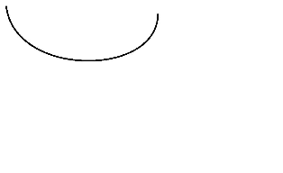
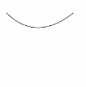

# CanvasRenderingContext2D对象<a name="ZH-CN_TOPIC_0000001173164707"></a>

使用CanvasRenderingContext2D在canvas画布组件上进行绘制，绘制对象可以是矩形、文本、图片等。

-   示例

    ```
    <!-- xxx.hml -->
    <div>
      <canvas ref="canvas1" style="width: 200px; height: 150px; background-color: #ffff00;"></canvas>
      <input type="button" style="width: 180px; height: 60px;" value="fillStyle" onclick="handleClick" />
      <input type="button" style="width: 180px; height: 60px;" value="fillStyle" onclick="antialias" />
    </div>
    ```

    ```
    // xxx.js
    export default {
      handleClick() {
        const el = this.$refs.canvas1;
        const ctx = el.getContext('2d');
        ctx.beginPath();
        ctx.arc(100, 75, 50, 0, 6.28);
        ctx.stroke();
      },
      antialias() {
        const el = this.$refs.canvas1;
        const ctx = el.getContext('2d', { antialias: true });
        ctx.beginPath();
        ctx.arc(100, 75, 50, 0, 6.28);
        ctx.stroke();
      }
    }
    ```


-   示意图（关闭抗锯齿）

    

-   示意图（开启抗锯齿）

    


## 属性<a name="section122871125229"></a>

<table><thead align="left"><tr><th class="cellrowborder" valign="top" width="13.97139713971397%" id="mcps1.1.5.1.1"><p>名称</p>
</th>
<th class="cellrowborder" valign="top" width="26.742674267426747%" id="mcps1.1.5.1.2"><p>类型</p>
</th>
<th class="cellrowborder" valign="top" width="9.650965096509651%" id="mcps1.1.5.1.3"><p>默认值</p>
</th>
<th class="cellrowborder" valign="top" width="49.63496349634964%" id="mcps1.1.5.1.4"><p>描述</p>
</th>
</tr>
</thead>
<tbody><tr><td class="cellrowborder" valign="top" width="13.97139713971397%" headers="mcps1.1.5.1.1 "><p><a href="#section948213716202">fillStyle</a></p>
</td>
<td class="cellrowborder" valign="top" width="26.742674267426747%" headers="mcps1.1.5.1.2 "><p>&lt;color&gt; | <a href="js-components-canvas-canvasgradient.md">CanvasGradient</a> | CanvasPattern</p>
</td>
<td class="cellrowborder" valign="top" width="9.650965096509651%" headers="mcps1.1.5.1.3 "><p>-</p>
</td>
<td class="cellrowborder" valign="top" width="49.63496349634964%" headers="mcps1.1.5.1.4 "><p>指定绘制的填充色。</p>
<ul><li>类型为&lt;color&gt;时，表示设置填充区域的颜色。</li><li>类型为CanvasGradient时，表示渐变对象，使用 createLinearGradient()方法创建。</li><li>类型为CanvasPattern时，使用 createPattern()方法创建。</li></ul>
</td>
</tr>
<tr><td class="cellrowborder" valign="top" width="13.97139713971397%" headers="mcps1.1.5.1.1 "><p><a href="#section1334911993014">lineWidth</a></p>
</td>
<td class="cellrowborder" valign="top" width="26.742674267426747%" headers="mcps1.1.5.1.2 "><p>number</p>
</td>
<td class="cellrowborder" valign="top" width="9.650965096509651%" headers="mcps1.1.5.1.3 "><p>-</p>
</td>
<td class="cellrowborder" valign="top" width="49.63496349634964%" headers="mcps1.1.5.1.4 "><p>设置绘制线条的宽度。</p>
</td>
</tr>
<tr><td class="cellrowborder" valign="top" width="13.97139713971397%" headers="mcps1.1.5.1.1 "><p><a href="#section64021403250">strokeStyle</a></p>
</td>
<td class="cellrowborder" valign="top" width="26.742674267426747%" headers="mcps1.1.5.1.2 "><p>&lt;color&gt; | <a href="js-components-canvas-canvasgradient.md">CanvasGradient</a> | CanvasPattern</p>
</td>
<td class="cellrowborder" valign="top" width="9.650965096509651%" headers="mcps1.1.5.1.3 "><p>-</p>
</td>
<td class="cellrowborder" valign="top" width="49.63496349634964%" headers="mcps1.1.5.1.4 "><p>设置描边的颜色。</p>
<ul><li>类型为&lt;color&gt;时，表示设置描边使用的颜色。</li><li>类型为CanvasGradient时，表示渐变对象，使用 createLinearGradient()方法创建。</li><li>类型为CanvasPattern时，使用 createPattern()方法创建。</li></ul>
</td>
</tr>
<tr><td class="cellrowborder" valign="top" width="13.97139713971397%" headers="mcps1.1.5.1.1 "><p><a href="#section6297132917520">lineCap</a></p>
</td>
<td class="cellrowborder" valign="top" width="26.742674267426747%" headers="mcps1.1.5.1.2 "><p>string</p>
</td>
<td class="cellrowborder" valign="top" width="9.650965096509651%" headers="mcps1.1.5.1.3 "><p>butt</p>
</td>
<td class="cellrowborder" valign="top" width="49.63496349634964%" headers="mcps1.1.5.1.4 "><p>指定线端点的样式，可选值为：</p>
<ul><li>butt：线端点以方形结束。</li><li>round：线端点以圆形结束。</li><li>square：线端点以方形结束，该样式下会增加一个长度和线段厚度相同，宽度是线段厚度一半的矩形。</li></ul>
</td>
</tr>
<tr><td class="cellrowborder" valign="top" width="13.97139713971397%" headers="mcps1.1.5.1.1 "><p><a href="#section1538165645420">lineJoin</a></p>
</td>
<td class="cellrowborder" valign="top" width="26.742674267426747%" headers="mcps1.1.5.1.2 "><p>string</p>
</td>
<td class="cellrowborder" valign="top" width="9.650965096509651%" headers="mcps1.1.5.1.3 "><p>miter</p>
</td>
<td class="cellrowborder" valign="top" width="49.63496349634964%" headers="mcps1.1.5.1.4 "><p>指定线段间相交的交点样式，可选值为：</p>
<ul><li>round：在线段相连处绘制一个扇形，扇形的圆角半径是线段的宽度。</li><li>bevel：在线段相连处使用三角形为底填充， 每个部分矩形拐角独立。</li><li>miter：在相连部分的外边缘处进行延伸，使其相交于一点，形成一个菱形区域，该属性可以通过设置miterLimit属性展现效果。</li></ul>
</td>
</tr>
<tr><td class="cellrowborder" valign="top" width="13.97139713971397%" headers="mcps1.1.5.1.1 "><p><a href="#section1584174515577">miterLimit</a></p>
</td>
<td class="cellrowborder" valign="top" width="26.742674267426747%" headers="mcps1.1.5.1.2 "><p>number</p>
</td>
<td class="cellrowborder" valign="top" width="9.650965096509651%" headers="mcps1.1.5.1.3 "><p>10</p>
</td>
<td class="cellrowborder" valign="top" width="49.63496349634964%" headers="mcps1.1.5.1.4 "><p>设置斜接面限制值，该值指定了线条相交处内角和外角的距离。</p>
</td>
</tr>
<tr><td class="cellrowborder" valign="top" width="13.97139713971397%" headers="mcps1.1.5.1.1 "><p><a href="#section17299329495">font</a></p>
</td>
<td class="cellrowborder" valign="top" width="26.742674267426747%" headers="mcps1.1.5.1.2 "><p>string</p>
</td>
<td class="cellrowborder" valign="top" width="9.650965096509651%" headers="mcps1.1.5.1.3 "><p>"normal normal 14px sans-serif"</p>
</td>
<td class="cellrowborder" valign="top" width="49.63496349634964%" headers="mcps1.1.5.1.4 "><p>设置文本绘制中的字体样式。</p>
<p>语法：ctx.font="font-style font-weight font-size font-family"<sup><span>5+</span></sup></p>
<ul><li>font-style(可选)，用于指定字体样式，支持如下几种样式：normal, italic。</li><li>font-weight(可选)，用于指定字体的粗细，支持如下几种类型：normal, bold, bolder, lighter, 100, 200, 300, 400, 500, 600, 700, 800, 900。</li><li>font-size(可选)，指定字号和行高，单位只支持px。</li><li>font-family(可选)，指定字体系列，支持如下几种类型：sans-serif, serif, monospace。</li></ul>
</td>
</tr>
<tr><td class="cellrowborder" valign="top" width="13.97139713971397%" headers="mcps1.1.5.1.1 "><p><a href="#section323614315118">textAlign</a></p>
</td>
<td class="cellrowborder" valign="top" width="26.742674267426747%" headers="mcps1.1.5.1.2 "><p>string</p>
</td>
<td class="cellrowborder" valign="top" width="9.650965096509651%" headers="mcps1.1.5.1.3 "><p>left</p>
</td>
<td class="cellrowborder" valign="top" width="49.63496349634964%" headers="mcps1.1.5.1.4 "><p>设置文本绘制中的文本对齐方式，可选值为：</p>
<ul><li>left：文本左对齐。</li><li>right：文本右对齐。</li><li>center：文本居中对齐。</li><li>start：文本对齐界线开始的地方。</li><li>end：文本对齐界线结束的地方。</li></ul>
<div class="note"><span class="notetitle"> 说明： </span><div class="notebody"><p>ltr布局模式下start和left一致，rtl布局模式下start和right一致&middot;。</p>
</div></div>
</td>
</tr>
<tr><td class="cellrowborder" valign="top" width="13.97139713971397%" headers="mcps1.1.5.1.1 "><p><a href="#section53111286533">textBaseline</a></p>
</td>
<td class="cellrowborder" valign="top" width="26.742674267426747%" headers="mcps1.1.5.1.2 "><p>string</p>
</td>
<td class="cellrowborder" valign="top" width="9.650965096509651%" headers="mcps1.1.5.1.3 "><p>alphabetic</p>
</td>
<td class="cellrowborder" valign="top" width="49.63496349634964%" headers="mcps1.1.5.1.4 "><p>设置文本绘制中的水平对齐方式，可选值为：</p>
<ul><li>alphabetic：文本基线是标准的字母基线。</li><li>top：文本基线在文本块的顶部。</li><li>hanging：文本基线是悬挂基线。</li><li>middle：文本基线在文本块的中间。</li><li>ideographic：文字基线是表意字基线；如果字符本身超出了alphabetic 基线，那么ideographic基线位置在字符本身的底部。</li><li>bottom：文本基线在文本块的底部。 与 ideographic 基线的区别在于 ideographic 基线不需要考虑下行字母。</li></ul>
</td>
</tr>
<tr><td class="cellrowborder" valign="top" width="13.97139713971397%" headers="mcps1.1.5.1.1 "><p><a href="#section12301614194711">globalAlpha</a></p>
</td>
<td class="cellrowborder" valign="top" width="26.742674267426747%" headers="mcps1.1.5.1.2 "><p>number</p>
</td>
<td class="cellrowborder" valign="top" width="9.650965096509651%" headers="mcps1.1.5.1.3 "><p>-</p>
</td>
<td class="cellrowborder" valign="top" width="49.63496349634964%" headers="mcps1.1.5.1.4 "><p>设置透明度，0.0为完全透明，1.0为完全不透明。</p>
</td>
</tr>
<tr><td class="cellrowborder" valign="top" width="13.97139713971397%" headers="mcps1.1.5.1.1 "><p><a href="#section1864372311920">lineDashOffset</a></p>
</td>
<td class="cellrowborder" valign="top" width="26.742674267426747%" headers="mcps1.1.5.1.2 "><p>number</p>
</td>
<td class="cellrowborder" valign="top" width="9.650965096509651%" headers="mcps1.1.5.1.3 "><p>0.0</p>
</td>
<td class="cellrowborder" valign="top" width="49.63496349634964%" headers="mcps1.1.5.1.4 "><p>设置画布的虚线偏移量，精度为float。</p>
</td>
</tr>
<tr><td class="cellrowborder" valign="top" width="13.97139713971397%" headers="mcps1.1.5.1.1 "><p><a href="#section864572415229">globalCompositeOperation</a></p>
</td>
<td class="cellrowborder" valign="top" width="26.742674267426747%" headers="mcps1.1.5.1.2 "><p>string</p>
</td>
<td class="cellrowborder" valign="top" width="9.650965096509651%" headers="mcps1.1.5.1.3 "><p>source-over</p>
</td>
<td class="cellrowborder" valign="top" width="49.63496349634964%" headers="mcps1.1.5.1.4 "><p>设置合成操作的方式。类型字段可选值有source-over，source-atop，source-in，source-out，destination-over，destination-atop，destination-in，destination-out，lighter，copy，xor。具体请参考<a href="#li15554182282920">类型字段说明</a>。</p>
</td>
</tr>
<tr><td class="cellrowborder" valign="top" width="13.97139713971397%" headers="mcps1.1.5.1.1 "><p><a href="#section168015179313">shadowBlur</a></p>
</td>
<td class="cellrowborder" valign="top" width="26.742674267426747%" headers="mcps1.1.5.1.2 "><p>number</p>
</td>
<td class="cellrowborder" valign="top" width="9.650965096509651%" headers="mcps1.1.5.1.3 "><p>0.0</p>
</td>
<td class="cellrowborder" valign="top" width="49.63496349634964%" headers="mcps1.1.5.1.4 "><p>设置绘制阴影时的模糊级别，值越大越模糊，精度为float。</p>
</td>
</tr>
<tr><td class="cellrowborder" valign="top" width="13.97139713971397%" headers="mcps1.1.5.1.1 "><p><a href="#section18310428123315">shadowColor</a></p>
</td>
<td class="cellrowborder" valign="top" width="26.742674267426747%" headers="mcps1.1.5.1.2 "><p>&lt;color&gt;</p>
</td>
<td class="cellrowborder" valign="top" width="9.650965096509651%" headers="mcps1.1.5.1.3 "><p>-</p>
</td>
<td class="cellrowborder" valign="top" width="49.63496349634964%" headers="mcps1.1.5.1.4 "><p>设置绘制阴影时的阴影颜色。</p>
</td>
</tr>
<tr><td class="cellrowborder" valign="top" width="13.97139713971397%" headers="mcps1.1.5.1.1 "><p><a href="#section642861510359">shadowOffsetX</a></p>
</td>
<td class="cellrowborder" valign="top" width="26.742674267426747%" headers="mcps1.1.5.1.2 "><p>number</p>
</td>
<td class="cellrowborder" valign="top" width="9.650965096509651%" headers="mcps1.1.5.1.3 "><p>-</p>
</td>
<td class="cellrowborder" valign="top" width="49.63496349634964%" headers="mcps1.1.5.1.4 "><p>设置绘制阴影时和原有对象的水平偏移值。</p>
</td>
</tr>
<tr><td class="cellrowborder" valign="top" width="13.97139713971397%" headers="mcps1.1.5.1.1 "><p><a href="#section1554144712379">shadowOffsetY</a></p>
</td>
<td class="cellrowborder" valign="top" width="26.742674267426747%" headers="mcps1.1.5.1.2 "><p>number</p>
</td>
<td class="cellrowborder" valign="top" width="9.650965096509651%" headers="mcps1.1.5.1.3 "><p>-</p>
</td>
<td class="cellrowborder" valign="top" width="49.63496349634964%" headers="mcps1.1.5.1.4 "><p>设置绘制阴影时和原有对象的垂直偏移值。</p>
</td>
</tr>
<tr><td class="cellrowborder" valign="top" width="13.97139713971397%" headers="mcps1.1.5.1.1 "><p><a href="#section3704184543915">imageSmoothingEnabled</a><sup>6+</sup></p>
</td>
<td class="cellrowborder" valign="top" width="26.742674267426747%" headers="mcps1.1.5.1.2 "><p>boolean</p>
</td>
<td class="cellrowborder" valign="top" width="9.650965096509651%" headers="mcps1.1.5.1.3 "><p>true</p>
</td>
<td class="cellrowborder" valign="top" width="49.63496349634964%" headers="mcps1.1.5.1.4 "><p>用于设置绘制图片时是否进行图像平滑度调整，true为启用，false为不启用。</p>
</td>
</tr>
</tbody>
</table>

### fillStyle<a name="section948213716202"></a>

```
<!-- xxx.hml -->
<div>
  <canvas ref="canvas" style="width: 200px; height: 150px; "></canvas>
</div>
```

```
//xxx.js
export default {
  onShow() {
    const el =this.$refs.canvas;
    const ctx = el.getContext('2d');
    ctx.fillStyle = '#0000ff';
    ctx.fillRect(20, 20, 150, 100);
  }
}
```


### lineWidth<a name="section1334911993014"></a>

```
<!-- xxx.hml -->
<div>
  <canvas ref="canvas" style="width: 200px; height: 150px; "></canvas>
</div>
```

```
//xxx.js
export default {
  onShow() {
    const el =this.$refs.canvas;
    const ctx = el.getContext('2d');
    ctx.lineWidth = 5;
    ctx.strokeRect(25, 25, 85, 105);
  }
}
```


### strokeStyle<a name="section64021403250"></a>

```
<!-- xxx.hml -->
<div>
  <canvas ref="canvas" style="width: 200px; height: 150px; "></canvas>
</div>
```

```
//xxx.js
export default {
  onShow() {
    const el =this.$refs.canvas;
    const ctx = el.getContext('2d');
    ctx.lineWidth = 10;
    ctx.strokeStyle = '#0000ff';
    ctx.strokeRect(25, 25, 155, 105);
  }
}
```


### lineCap<a name="section6297132917520"></a>

```
<!-- xxx.hml -->
<div>
  <canvas ref="canvas" style="width: 200px; height: 150px; "></canvas>
</div>
```

```
//xxx.js
export default {
  onShow() {
    const el =this.$refs.canvas;
    const ctx = el.getContext('2d');
    ctx.lineWidth = 8;
    ctx.beginPath();
    ctx.lineCap = 'round';
    ctx.moveTo(30, 50);
    ctx.lineTo(220, 50);
    ctx.stroke();
  }
}
```


### lineJoin<a name="section1538165645420"></a>

```
<!-- xxx.hml -->
<div>
  <canvas ref="canvas" style="width: 200px; height: 150px; "></canvas>
</div>
```

```
//xxx.js
export default {
  onShow() {
    const el =this.$refs.canvas;
    const ctx = el.getContext('2d');
    ctx.beginPath();
    ctx.lineWidth = 8;
    ctx.lineJoin = 'miter';
    ctx.moveTo(30, 30);
    ctx.lineTo(120, 60);
    ctx.lineTo(30, 110);
    ctx.stroke();
  }
}
```


### miterLimit<a name="section1584174515577"></a>

```
<!-- xxx.hml -->
<div>
  <canvas ref="canvas" style="width: 500px; height: 500px; "></canvas>
</div>
```

```
//xxx.js
export default {
  onShow() {
    const el =this.$refs.canvas;
    const ctx = el.getContext('2d');
    ctx.lineWidth =14;
    ctx.lineJoin = 'miter';
    ctx.miterLimit = 3;
    ctx.moveTo(30, 30);
    ctx.lineTo(120, 60);
    ctx.lineTo(30, 70);
    ctx.stroke();
  }
}
```


### font<a name="section17299329495"></a>

```
<!-- xxx.hml -->
<div>
  <canvas ref="canvas" style="width: 200px; height: 150px; "></canvas>
</div>
```

```
//xxx.js
export default {
  onShow() {
    const el =this.$refs.canvas;
    const ctx = el.getContext('2d');
    ctx.font = '30px sans-serif';
    ctx.fillText("Hello World", 20, 60);
  }
}
```


### textAlign<a name="section323614315118"></a>

```
<!-- xxx.hml -->
<div>
  <canvas ref="canvas" style="width: 200px; height: 150px; "></canvas>
</div>
```

```
//xxx.js
export default {
  onShow() {
    const el =this.$refs.canvas;
    const ctx = el.getContext('2d');
    ctx.strokeStyle = '#0000ff';
    ctx.moveTo(140, 10);
    ctx.lineTo(140, 160);
    ctx.stroke();

    ctx.font = '18px sans-serif';    

  // Show the different textAlign values
    ctx.textAlign = 'start';      
    ctx.fillText('textAlign=start', 140, 60);        
    ctx.textAlign = 'end';      
    ctx.fillText('textAlign=end', 140, 80);  
    ctx.textAlign = 'left';      
    ctx.fillText('textAlign=left', 140, 100);
    ctx.textAlign = 'center';     
    ctx.fillText('textAlign=center',140, 120);              
    ctx.textAlign = 'right';      
    ctx.fillText('textAlign=right',140, 140);
  }
}
```


### textBaseline<a name="section53111286533"></a>

```
<!-- xxx.hml -->
<div>
  <canvas ref="canvas" style="width: 500px; height: 500px; "></canvas>
</div>
```

```
//xxx.js
export default {
  onShow() {
    const el =this.$refs.canvas;
    const ctx = el.getContext('2d');
    ctx.strokeStyle = '#0000ff';
    ctx.moveTo(0, 120);
    ctx.lineTo(400, 120);
    ctx.stroke();

    ctx.font = '20px sans-serif';

    ctx.textBaseline = 'top'; 
    ctx.fillText('Top', 10, 120); 
    ctx.textBaseline = 'bottom'; 
    ctx.fillText('Bottom', 55, 120); 
    ctx.textBaseline = 'middle'; 
    ctx.fillText('Middle', 125, 120); 
    ctx.textBaseline = 'alphabetic'; 
    ctx.fillText('Alphabetic', 195, 120); 
    ctx.textBaseline = 'hanging'; 
    ctx.fillText('Hanging', 295, 120);
  }
}
```


### globalAlpha<a name="section12301614194711"></a>

```
<!-- xxx.hml -->
<div>
  <canvas ref="canvas" style="width: 200px; height: 150px; "></canvas>
</div>
```

```
//xxx.js
export default {
  onShow() {
    const el =this.$refs.canvas;
    const ctx = el.getContext('2d');
    ctx.fillStyle = 'rgb(255,0,0)';
    ctx.fillRect(0, 0, 50, 50);
    ctx.globalAlpha = 0.4;
    ctx.fillStyle = 'rgb(0,0,255)'; 
    ctx.fillRect(50, 50, 50, 50);
 
  }
}
```


### lineDashOffset<a name="section1864372311920"></a>

```
<!-- xxx.hml -->
<div>
  <canvas ref="canvas" style="width: 200px; height: 150px; background-color: #ffff00;"></canvas>
</div>
```

```
//xxx.js
export default {
  onShow() {
    const el =this.$refs.canvas;
    const ctx = el.getContext('2d');
    ctx.arc(100, 75, 50, 0, 6.28);
    ctx.setLineDash([10,20]);
    ctx.lineDashOffset = 10.0;
    ctx.stroke();
  }
}
```


### globalCompositeOperation<a name="section864572415229"></a>

-   <a name="li15554182282920"></a>类型字段说明

    <table><thead align="left"><tr><th class="cellrowborder" valign="top" width="12.78%" id="mcps1.1.3.1.1"><p>值</p>
    </th>
    <th class="cellrowborder" valign="top" width="87.22%" id="mcps1.1.3.1.2"><p>描述</p>
    </th>
    </tr>
    </thead>
    <tbody><tr><td class="cellrowborder" valign="top" width="12.78%" headers="mcps1.1.3.1.1 "><p>source-over</p>
    </td>
    <td class="cellrowborder" valign="top" width="87.22%" headers="mcps1.1.3.1.2 "><p>在现有绘制内容上显示新绘制内容，属于默认值。</p>
    </td>
    </tr>
    <tr><td class="cellrowborder" valign="top" width="12.78%" headers="mcps1.1.3.1.1 "><p>source-atop</p>
    </td>
    <td class="cellrowborder" valign="top" width="87.22%" headers="mcps1.1.3.1.2 "><p>在现有绘制内容顶部显示新绘制内容。</p>
    </td>
    </tr>
    <tr><td class="cellrowborder" valign="top" width="12.78%" headers="mcps1.1.3.1.1 "><p>source-in</p>
    </td>
    <td class="cellrowborder" valign="top" width="87.22%" headers="mcps1.1.3.1.2 "><p>在现有绘制内容中显示新绘制内容。</p>
    </td>
    </tr>
    <tr><td class="cellrowborder" valign="top" width="12.78%" headers="mcps1.1.3.1.1 "><p>source-out</p>
    </td>
    <td class="cellrowborder" valign="top" width="87.22%" headers="mcps1.1.3.1.2 "><p>在现有绘制内容之外显示新绘制内容。</p>
    </td>
    </tr>
    <tr><td class="cellrowborder" valign="top" width="12.78%" headers="mcps1.1.3.1.1 "><p>destination-over</p>
    </td>
    <td class="cellrowborder" valign="top" width="87.22%" headers="mcps1.1.3.1.2 "><p>在新绘制内容上方显示现有绘制内容。</p>
    </td>
    </tr>
    <tr><td class="cellrowborder" valign="top" width="12.78%" headers="mcps1.1.3.1.1 "><p>destination-atop</p>
    </td>
    <td class="cellrowborder" valign="top" width="87.22%" headers="mcps1.1.3.1.2 "><p>在新绘制内容顶部显示现有绘制内容。</p>
    </td>
    </tr>
    <tr><td class="cellrowborder" valign="top" width="12.78%" headers="mcps1.1.3.1.1 "><p>destination-in</p>
    </td>
    <td class="cellrowborder" valign="top" width="87.22%" headers="mcps1.1.3.1.2 "><p>在新绘制内容中显示现有绘制内容。</p>
    </td>
    </tr>
    <tr><td class="cellrowborder" valign="top" width="12.78%" headers="mcps1.1.3.1.1 "><p>destination-out</p>
    </td>
    <td class="cellrowborder" valign="top" width="87.22%" headers="mcps1.1.3.1.2 "><p>在新绘制内容外显示现有绘制内容。</p>
    </td>
    </tr>
    <tr><td class="cellrowborder" valign="top" width="12.78%" headers="mcps1.1.3.1.1 "><p>lighter</p>
    </td>
    <td class="cellrowborder" valign="top" width="87.22%" headers="mcps1.1.3.1.2 "><p>显示新绘制内容和现有绘制内容。</p>
    </td>
    </tr>
    <tr><td class="cellrowborder" valign="top" width="12.78%" headers="mcps1.1.3.1.1 "><p>copy</p>
    </td>
    <td class="cellrowborder" valign="top" width="87.22%" headers="mcps1.1.3.1.2 "><p>显示新绘制内容而忽略现有绘制内容。</p>
    </td>
    </tr>
    <tr><td class="cellrowborder" valign="top" width="12.78%" headers="mcps1.1.3.1.1 "><p>xor</p>
    </td>
    <td class="cellrowborder" valign="top" width="87.22%" headers="mcps1.1.3.1.2 "><p>使用异或操作对新绘制内容与现有绘制内容进行融合。</p>
    </td>
    </tr>
    </tbody>
    </table>


-   示例

    ```
    <!-- xxx.hml -->
    <div>
      <canvas ref="canvas" style="width: 200px; height: 150px; "></canvas>
    </div>
    ```

    ```
    //xxx.js
    export default {
      onShow() {
        const el =this.$refs.canvas;
        const ctx = el.getContext('2d');
        ctx.fillStyle = 'rgb(255,0,0)';
        ctx.fillRect(20, 20, 50, 50);
        ctx.globalCompositeOperation = 'source-over';
        ctx.fillStyle = 'rgb(0,0,255)';
        ctx.fillRect(50, 50, 50, 50);
        // Start drawing second example
        ctx.fillStyle = 'rgb(255,0,0)';
        ctx.fillRect(120, 20, 50, 50);
        ctx.globalCompositeOperation = 'destination-over';
        ctx.fillStyle = 'rgb(0,0,255)';
        ctx.fillRect(150, 50, 50, 50);
      }
    }
    ```

    

    示例中，新绘制内容是蓝色矩形，现有绘制内容是红色矩形。


### shadowBlur<a name="section168015179313"></a>

```
<!-- xxx.hml -->
<div>
  <canvas ref="canvas" style="width: 200px; height: 150px; "></canvas>
</div>
```

```
//xxx.js
export default {
  onShow() {
    const el =this.$refs.canvas;
    const ctx = el.getContext('2d');
    ctx.shadowBlur = 30;
    ctx.shadowColor = 'rgb(0,0,0)';
    ctx.fillStyle = 'rgb(255,0,0)';
    ctx.fillRect(20, 20, 100, 80);
  }
}
```


### shadowColor<a name="section18310428123315"></a>

```
<!-- xxx.hml -->
<div>
  <canvas ref="canvas" style="width: 200px; height: 150px;"></canvas>
</div>
```

```
//xxx.js
export default {
  onShow() {
    const el =this.$refs.canvas;
    const ctx = el.getContext('2d');
    ctx.shadowBlur = 30;
    ctx.shadowColor = 'rgb(0,0,255)';
    ctx.fillStyle = 'rgb(255,0,0)';
    ctx.fillRect(30, 30, 100, 100);
  }
}
```


### shadowOffsetX<a name="section642861510359"></a>

```
<!-- xxx.hml -->
<div>
  <canvas ref="canvas" style="width: 200px; height: 150px;"></canvas>
</div>
```

```
//xxx.js
export default {
  onShow() {
    const el =this.$refs.canvas;
    const ctx = el.getContext('2d');
    ctx.shadowBlur = 10;
    ctx.shadowOffsetX = 20;
    ctx.shadowColor = 'rgb(0,0,0)';
    ctx.fillStyle = 'rgb(255,0,0)';
    ctx.fillRect(20, 20, 100, 80);
  }
}
```


### shadowOffsetY<a name="section1554144712379"></a>

```
<!-- xxx.hml -->
<div>
  <canvas ref="canvas" style="width: 200px; height: 150px; "></canvas>
</div>
```

```
//xxx.js
export default {
  onShow() {
    const el =this.$refs.canvas;
    const ctx = el.getContext('2d');
    ctx.shadowBlur = 10;
    ctx.shadowOffsetY = 20;
    ctx.shadowColor = 'rgb(0,0,0)';
    ctx.fillStyle = 'rgb(255,0,0)';
    ctx.fillRect(30, 30, 100, 100);
 }
}
```


### imageSmoothingEnabled<sup>6+</sup><a name="section3704184543915"></a>

```
<!-- xxx.hml -->
<div>
  <canvas ref="canvas" style="width: 200px; height: 150px; "></canvas>
</div>
```

```
//xxx.js
export default {
  onShow() {
    const el =this.$refs.canvas;
    const ctx = el.getContext('2d');
    var img = new Image();
    img.src = 'common/image/example.jpg';
    img.onload = function() {
    ctx.imageSmoothingEnabled = false;
    ctx.drawImage(img, 0, 0, 400, 200);
    };
  }
}
```


## 方法<a name="section1683015406227"></a>

### fillRect<a name="section14858104972214"></a>

fillRect\(x: number, y: number, width:number, height: number\): void

填充一个矩形。

-   参数

    <table><thead align="left"><tr><th class="cellrowborder" valign="top" width="33.333333333333336%" id="mcps1.1.4.1.1"><p>参数</p>
    </th>
    <th class="cellrowborder" valign="top" width="33.333333333333336%" id="mcps1.1.4.1.2"><p>类型</p>
    </th>
    <th class="cellrowborder" valign="top" width="33.333333333333336%" id="mcps1.1.4.1.3"><p>描述</p>
    </th>
    </tr>
    </thead>
    <tbody><tr><td class="cellrowborder" valign="top" width="33.333333333333336%" headers="mcps1.1.4.1.1 "><p>x</p>
    </td>
    <td class="cellrowborder" valign="top" width="33.333333333333336%" headers="mcps1.1.4.1.2 "><p>number</p>
    </td>
    <td class="cellrowborder" valign="top" width="33.333333333333336%" headers="mcps1.1.4.1.3 "><p>指定矩形左上角点的x坐标。</p>
    </td>
    </tr>
    <tr><td class="cellrowborder" valign="top" width="33.333333333333336%" headers="mcps1.1.4.1.1 "><p>y</p>
    </td>
    <td class="cellrowborder" valign="top" width="33.333333333333336%" headers="mcps1.1.4.1.2 "><p>number</p>
    </td>
    <td class="cellrowborder" valign="top" width="33.333333333333336%" headers="mcps1.1.4.1.3 "><p>指定矩形左上角点的y坐标。</p>
    </td>
    </tr>
    <tr><td class="cellrowborder" valign="top" width="33.333333333333336%" headers="mcps1.1.4.1.1 "><p>width</p>
    </td>
    <td class="cellrowborder" valign="top" width="33.333333333333336%" headers="mcps1.1.4.1.2 "><p>number</p>
    </td>
    <td class="cellrowborder" valign="top" width="33.333333333333336%" headers="mcps1.1.4.1.3 "><p>指定矩形的宽度。</p>
    </td>
    </tr>
    <tr><td class="cellrowborder" valign="top" width="33.333333333333336%" headers="mcps1.1.4.1.1 "><p>height</p>
    </td>
    <td class="cellrowborder" valign="top" width="33.333333333333336%" headers="mcps1.1.4.1.2 "><p>number</p>
    </td>
    <td class="cellrowborder" valign="top" width="33.333333333333336%" headers="mcps1.1.4.1.3 "><p>指定矩形的高度。</p>
    </td>
    </tr>
    </tbody>
    </table>

-   示例

    ```
    <!-- xxx.hml -->
    <div>
      <canvas ref="canvas" style="width: 200px; height: 150px; "></canvas>
    </div>
    ```

    ```
    //xxx.js
    export default {
      onShow() {
        const el =this.$refs.canvas;
        const ctx = el.getContext('2d');
        ctx.fillRect(20, 20, 200, 150);
      }
    }
    ```

    


### clearRect<a name="section7139416112410"></a>

clearRect\(x: number, y: number, width:number, height: number\): void

删除指定区域内的绘制内容。

-   参数

    <table><thead align="left"><tr><th class="cellrowborder" valign="top" width="33.333333333333336%" id="mcps1.1.4.1.1"><p>参数</p>
    </th>
    <th class="cellrowborder" valign="top" width="33.333333333333336%" id="mcps1.1.4.1.2"><p>类型</p>
    </th>
    <th class="cellrowborder" valign="top" width="33.333333333333336%" id="mcps1.1.4.1.3"><p>描述</p>
    </th>
    </tr>
    </thead>
    <tbody><tr><td class="cellrowborder" valign="top" width="33.333333333333336%" headers="mcps1.1.4.1.1 "><p>x</p>
    </td>
    <td class="cellrowborder" valign="top" width="33.333333333333336%" headers="mcps1.1.4.1.2 "><p>number</p>
    </td>
    <td class="cellrowborder" valign="top" width="33.333333333333336%" headers="mcps1.1.4.1.3 "><p>指定矩形上的左上角x坐标。</p>
    </td>
    </tr>
    <tr><td class="cellrowborder" valign="top" width="33.333333333333336%" headers="mcps1.1.4.1.1 "><p>y</p>
    </td>
    <td class="cellrowborder" valign="top" width="33.333333333333336%" headers="mcps1.1.4.1.2 "><p>number</p>
    </td>
    <td class="cellrowborder" valign="top" width="33.333333333333336%" headers="mcps1.1.4.1.3 "><p>指定矩形上的左上角y坐标。</p>
    </td>
    </tr>
    <tr><td class="cellrowborder" valign="top" width="33.333333333333336%" headers="mcps1.1.4.1.1 "><p>width</p>
    </td>
    <td class="cellrowborder" valign="top" width="33.333333333333336%" headers="mcps1.1.4.1.2 "><p>number</p>
    </td>
    <td class="cellrowborder" valign="top" width="33.333333333333336%" headers="mcps1.1.4.1.3 "><p>指定矩形的宽度。</p>
    </td>
    </tr>
    <tr><td class="cellrowborder" valign="top" width="33.333333333333336%" headers="mcps1.1.4.1.1 "><p>height</p>
    </td>
    <td class="cellrowborder" valign="top" width="33.333333333333336%" headers="mcps1.1.4.1.2 "><p>number</p>
    </td>
    <td class="cellrowborder" valign="top" width="33.333333333333336%" headers="mcps1.1.4.1.3 "><p>指定矩形的高度。</p>
    </td>
    </tr>
    </tbody>
    </table>

-   示例

    ```
    <!-- xxx.hml -->
    <div>
      <canvas ref="canvas" style="width: 200px; height: 150px;"></canvas>
    </div>
    ```

    ```
    //xxx.js
    export default {
      onShow() {
        const el =this.$refs.canvas;
        const ctx = el.getContext('2d');
        ctx.fillStyle = 'rgb(0,0,255)';
        ctx.fillRect(0, 0, 400, 200);
        ctx.clearRect(20, 20, 150, 100);
      }
    }
    ```

    


### strokeRect<a name="section17464195017258"></a>

strokeRect\(x: number, y: number, width:number, height: number\): void

绘制具有边框的矩形，矩形内部不填充。

-   参数

    <table><thead align="left"><tr><th class="cellrowborder" valign="top" width="33.333333333333336%" id="mcps1.1.4.1.1"><p>参数</p>
    </th>
    <th class="cellrowborder" valign="top" width="33.333333333333336%" id="mcps1.1.4.1.2"><p>类型</p>
    </th>
    <th class="cellrowborder" valign="top" width="33.333333333333336%" id="mcps1.1.4.1.3"><p>描述</p>
    </th>
    </tr>
    </thead>
    <tbody><tr><td class="cellrowborder" valign="top" width="33.333333333333336%" headers="mcps1.1.4.1.1 "><p>x</p>
    </td>
    <td class="cellrowborder" valign="top" width="33.333333333333336%" headers="mcps1.1.4.1.2 "><p>number</p>
    </td>
    <td class="cellrowborder" valign="top" width="33.333333333333336%" headers="mcps1.1.4.1.3 "><p>指定矩形的左上角x坐标。</p>
    </td>
    </tr>
    <tr><td class="cellrowborder" valign="top" width="33.333333333333336%" headers="mcps1.1.4.1.1 "><p>y</p>
    </td>
    <td class="cellrowborder" valign="top" width="33.333333333333336%" headers="mcps1.1.4.1.2 "><p>number</p>
    </td>
    <td class="cellrowborder" valign="top" width="33.333333333333336%" headers="mcps1.1.4.1.3 "><p>指定矩形的左上角y坐标。</p>
    </td>
    </tr>
    <tr><td class="cellrowborder" valign="top" width="33.333333333333336%" headers="mcps1.1.4.1.1 "><p>width</p>
    </td>
    <td class="cellrowborder" valign="top" width="33.333333333333336%" headers="mcps1.1.4.1.2 "><p>number</p>
    </td>
    <td class="cellrowborder" valign="top" width="33.333333333333336%" headers="mcps1.1.4.1.3 "><p>指定矩形的宽度。</p>
    </td>
    </tr>
    <tr><td class="cellrowborder" valign="top" width="33.333333333333336%" headers="mcps1.1.4.1.1 "><p>height</p>
    </td>
    <td class="cellrowborder" valign="top" width="33.333333333333336%" headers="mcps1.1.4.1.2 "><p>number</p>
    </td>
    <td class="cellrowborder" valign="top" width="33.333333333333336%" headers="mcps1.1.4.1.3 "><p>指定矩形的高度。</p>
    </td>
    </tr>
    </tbody>
    </table>

-   示例

    ```
    <!-- xxx.hml -->
    <div>
      <canvas ref="canvas" style="width: 200px; height: 150px; "></canvas>
    </div>
    ```

    ```
    //xxx.js
    export default {
      onShow() {
        const el =this.$refs.canvas;
        const ctx = el.getContext('2d');
        ctx.strokeRect(30, 30, 200, 150);
      }
    }
    ```

    


### fillText<a name="section11872142516265"></a>

fillText\(text: string, x: number, y: number\): void

绘制填充类文本。

-   参数

    <table><thead align="left"><tr><th class="cellrowborder" valign="top" width="33.333333333333336%" id="mcps1.1.4.1.1"><p>参数</p>
    </th>
    <th class="cellrowborder" valign="top" width="33.333333333333336%" id="mcps1.1.4.1.2"><p>类型</p>
    </th>
    <th class="cellrowborder" valign="top" width="33.333333333333336%" id="mcps1.1.4.1.3"><p>描述</p>
    </th>
    </tr>
    </thead>
    <tbody><tr><td class="cellrowborder" valign="top" width="33.333333333333336%" headers="mcps1.1.4.1.1 "><p>text</p>
    </td>
    <td class="cellrowborder" valign="top" width="33.333333333333336%" headers="mcps1.1.4.1.2 "><p>string</p>
    </td>
    <td class="cellrowborder" valign="top" width="33.333333333333336%" headers="mcps1.1.4.1.3 "><p>需要绘制的文本内容。</p>
    </td>
    </tr>
    <tr><td class="cellrowborder" valign="top" width="33.333333333333336%" headers="mcps1.1.4.1.1 "><p>x</p>
    </td>
    <td class="cellrowborder" valign="top" width="33.333333333333336%" headers="mcps1.1.4.1.2 "><p>number</p>
    </td>
    <td class="cellrowborder" valign="top" width="33.333333333333336%" headers="mcps1.1.4.1.3 "><p>需要绘制的文本的左下角x坐标。</p>
    </td>
    </tr>
    <tr><td class="cellrowborder" valign="top" width="33.333333333333336%" headers="mcps1.1.4.1.1 "><p>y</p>
    </td>
    <td class="cellrowborder" valign="top" width="33.333333333333336%" headers="mcps1.1.4.1.2 "><p>number</p>
    </td>
    <td class="cellrowborder" valign="top" width="33.333333333333336%" headers="mcps1.1.4.1.3 "><p>需要绘制的文本的左下角y坐标。</p>
    </td>
    </tr>
    </tbody>
    </table>

-   示例

    ```
    <!-- xxx.hml -->
    <div>
      <canvas ref="canvas" style="width: 200px; height: 150px; "></canvas>
    </div>
    ```

    ```
    //xxx.js
    export default {
      onShow() {
        const el =this.$refs.canvas;
        const ctx = el.getContext('2d');
        ctx.font = '35px sans-serif';
        ctx.fillText("Hello World!", 10, 60);
      }
    }
    ```

    


### strokeText<a name="section45101242710"></a>

strokeText\(text: string, x: number, y: number\): void

绘制描边类文本。

-   参数

    <table><thead align="left"><tr><th class="cellrowborder" valign="top" width="33.333333333333336%" id="mcps1.1.4.1.1"><p>参数</p>
    </th>
    <th class="cellrowborder" valign="top" width="33.333333333333336%" id="mcps1.1.4.1.2"><p>类型</p>
    </th>
    <th class="cellrowborder" valign="top" width="33.333333333333336%" id="mcps1.1.4.1.3"><p>描述</p>
    </th>
    </tr>
    </thead>
    <tbody><tr><td class="cellrowborder" valign="top" width="33.333333333333336%" headers="mcps1.1.4.1.1 "><p>text</p>
    </td>
    <td class="cellrowborder" valign="top" width="33.333333333333336%" headers="mcps1.1.4.1.2 "><p>string</p>
    </td>
    <td class="cellrowborder" valign="top" width="33.333333333333336%" headers="mcps1.1.4.1.3 "><p>需要绘制的文本内容。</p>
    </td>
    </tr>
    <tr><td class="cellrowborder" valign="top" width="33.333333333333336%" headers="mcps1.1.4.1.1 "><p>x</p>
    </td>
    <td class="cellrowborder" valign="top" width="33.333333333333336%" headers="mcps1.1.4.1.2 "><p>number</p>
    </td>
    <td class="cellrowborder" valign="top" width="33.333333333333336%" headers="mcps1.1.4.1.3 "><p>需要绘制的文本的左下角x坐标。</p>
    </td>
    </tr>
    <tr><td class="cellrowborder" valign="top" width="33.333333333333336%" headers="mcps1.1.4.1.1 "><p>y</p>
    </td>
    <td class="cellrowborder" valign="top" width="33.333333333333336%" headers="mcps1.1.4.1.2 "><p>number</p>
    </td>
    <td class="cellrowborder" valign="top" width="33.333333333333336%" headers="mcps1.1.4.1.3 "><p>需要绘制的文本的左下角y坐标。</p>
    </td>
    </tr>
    </tbody>
    </table>

-   示例

    ```
    <!-- xxx.hml -->
    <div>
      <canvas ref="canvas" style="width: 200px; height: 150px; "></canvas>
    </div>
    ```

    ```
    //xxx.js
    export default {
      onShow() {
        const el =this.$refs.canvas;
        const ctx = el.getContext('2d');
        ctx.font = '25px sans-serif';
        ctx.strokeText("Hello World!", 10, 60);
      }
    }
    ```

    


### measureText<a name="section7847115813278"></a>

measureText\(text: string\): TextMetrics

该方法返回一个文本测算的对象，通过该对象可以获取指定文本的宽度值。

-   参数

    <table><thead align="left"><tr><th class="cellrowborder" valign="top" width="33.333333333333336%" id="mcps1.1.4.1.1"><p>参数</p>
    </th>
    <th class="cellrowborder" valign="top" width="33.333333333333336%" id="mcps1.1.4.1.2"><p>类型</p>
    </th>
    <th class="cellrowborder" valign="top" width="33.333333333333336%" id="mcps1.1.4.1.3"><p>描述</p>
    </th>
    </tr>
    </thead>
    <tbody><tr><td class="cellrowborder" valign="top" width="33.333333333333336%" headers="mcps1.1.4.1.1 "><p>text</p>
    </td>
    <td class="cellrowborder" valign="top" width="33.333333333333336%" headers="mcps1.1.4.1.2 "><p>string</p>
    </td>
    <td class="cellrowborder" valign="top" width="33.333333333333336%" headers="mcps1.1.4.1.3 "><p>需要进行测量的文本。</p>
    </td>
    </tr>
    </tbody>
    </table>

-   返回值

    <table><thead align="left"><tr><th class="cellrowborder" valign="top" width="19.75%" id="mcps1.1.3.1.1"><p>类型</p>
    </th>
    <th class="cellrowborder" valign="top" width="80.25%" id="mcps1.1.3.1.2"><p>说明</p>
    </th>
    </tr>
    </thead>
    <tbody><tr><td class="cellrowborder" valign="top" width="19.75%" headers="mcps1.1.3.1.1 "><p>TextMetrics</p>
    </td>
    <td class="cellrowborder" valign="top" width="80.25%" headers="mcps1.1.3.1.2 "><p>包含指定字体的宽度，该宽度可以通过TextMetrics.width来获取。</p>
    </td>
    </tr>
    </tbody>
    </table>

-   示例

    ```
    <!-- xxx.hml -->
    <div>
      <canvas ref="canvas" style="width: 200px; height: 150px;"></canvas>
    </div>
    ```

    ```
    //xxx.js
    export default {
      onShow() {
        const el =this.$refs.canvas;
        const ctx = el.getContext('2d');
        ctx.font = '20px sans-serif';
        var txt = 'Hello World';
        ctx.fillText("width:" + ctx.measureText(txt).width, 20, 60);
        ctx.fillText(txt, 20, 110);
      }
    }
    ```

    


### stroke<a name="section1168214129288"></a>

stroke\(\): void

进行边框绘制操作。

-   示例

    ```
    <!-- xxx.hml -->
    <div>
      <canvas ref="canvas" style="width: 200px; height: 150px; "></canvas>
    </div>
    ```

    ```
    //xxx.js
    export default {
      onShow() {
        const el =this.$refs.canvas;
        const ctx = el.getContext('2d');
        ctx.moveTo(25, 25);
        ctx.lineTo(25, 250);
        ctx.lineWidth = '6';
        ctx.strokeStyle = 'rgb(0,0,255)';
        ctx.stroke();
      }
    }
    ```

    


### beginPath<a name="section6111135582910"></a>

beginPath\(\): void

创建一个新的绘制路径。

-   示例

    ```
    <!-- xxx.hml -->
    <div>
      <canvas ref="canvas" style="width: 500px; height: 500px; "></canvas>
    </div>
    ```

    ```
    //xxx.js
    export default {
      onShow() {
        const el =this.$refs.canvas;
        const ctx = el.getContext('2d');
        ctx.beginPath();              
        ctx.lineWidth = '6';
        ctx.strokeStyle = '#0000ff';
        ctx.moveTo(15, 80); 
        ctx.lineTo(280, 80);
        ctx.stroke();
      }
    }
    ```

    


### moveTo<a name="section13824131654417"></a>

moveTo\(x: number, y: number\): void

路径从当前点移动到指定点。

-   参数

    <table><thead align="left"><tr><th class="cellrowborder" valign="top" width="33.333333333333336%" id="mcps1.1.4.1.1"><p>参数</p>
    </th>
    <th class="cellrowborder" valign="top" width="33.333333333333336%" id="mcps1.1.4.1.2"><p>类型</p>
    </th>
    <th class="cellrowborder" valign="top" width="33.333333333333336%" id="mcps1.1.4.1.3"><p>描述</p>
    </th>
    </tr>
    </thead>
    <tbody><tr><td class="cellrowborder" valign="top" width="33.333333333333336%" headers="mcps1.1.4.1.1 "><p>x</p>
    </td>
    <td class="cellrowborder" valign="top" width="33.333333333333336%" headers="mcps1.1.4.1.2 "><p>number</p>
    </td>
    <td class="cellrowborder" valign="top" width="33.333333333333336%" headers="mcps1.1.4.1.3 "><p>指定位置的x坐标。</p>
    </td>
    </tr>
    <tr><td class="cellrowborder" valign="top" width="33.333333333333336%" headers="mcps1.1.4.1.1 "><p>y</p>
    </td>
    <td class="cellrowborder" valign="top" width="33.333333333333336%" headers="mcps1.1.4.1.2 "><p>number</p>
    </td>
    <td class="cellrowborder" valign="top" width="33.333333333333336%" headers="mcps1.1.4.1.3 "><p>指定位置的y坐标。</p>
    </td>
    </tr>
    </tbody>
    </table>

-   示例

    ```
    <!-- xxx.hml -->
    <div>
      <canvas ref="canvas" style="width: 200px; height: 150px; "></canvas>
    </div>
    ```

    ```
    //xxx.js
    export default {
      onShow() {
        const el =this.$refs.canvas;
        const ctx = el.getContext('2d');
        ctx.beginPath();
        ctx.moveTo(10, 10);
        ctx.lineTo(280, 160);
        ctx.stroke();
      }
    }
    ```

    


### lineTo<a name="section1479981412451"></a>

lineTo\(x: number, y: number\): void

从当前点到指定点进行路径连接。

-   参数

    <table><thead align="left"><tr><th class="cellrowborder" valign="top" width="33.333333333333336%" id="mcps1.1.4.1.1"><p>参数</p>
    </th>
    <th class="cellrowborder" valign="top" width="33.333333333333336%" id="mcps1.1.4.1.2"><p>类型</p>
    </th>
    <th class="cellrowborder" valign="top" width="33.333333333333336%" id="mcps1.1.4.1.3"><p>描述</p>
    </th>
    </tr>
    </thead>
    <tbody><tr><td class="cellrowborder" valign="top" width="33.333333333333336%" headers="mcps1.1.4.1.1 "><p>x</p>
    </td>
    <td class="cellrowborder" valign="top" width="33.333333333333336%" headers="mcps1.1.4.1.2 "><p>number</p>
    </td>
    <td class="cellrowborder" valign="top" width="33.333333333333336%" headers="mcps1.1.4.1.3 "><p>指定位置的x坐标。</p>
    </td>
    </tr>
    <tr><td class="cellrowborder" valign="top" width="33.333333333333336%" headers="mcps1.1.4.1.1 "><p>y</p>
    </td>
    <td class="cellrowborder" valign="top" width="33.333333333333336%" headers="mcps1.1.4.1.2 "><p>number</p>
    </td>
    <td class="cellrowborder" valign="top" width="33.333333333333336%" headers="mcps1.1.4.1.3 "><p>指定位置的y坐标。</p>
    </td>
    </tr>
    </tbody>
    </table>

-   示例

    ```
    <!-- xxx.hml -->
    <div>
      <canvas ref="canvas" style="width: 200px; height: 150px; "></canvas>
    </div>
    ```

    ```
    //xxx.js
    export default {
      onShow() {
        const el =this.$refs.canvas;
        const ctx = el.getContext('2d');
        ctx.beginPath();
        ctx.moveTo(10, 10);
        ctx.lineTo(280, 160);
        ctx.stroke();
      }
    }
    ```

    


### closePath<a name="section1496181911463"></a>

closePath\(\): void

结束当前路径形成一个封闭路径。

-   示例

    ```
    <!-- xxx.hml -->
    <div>
      <canvas ref="canvas" style="width: 200px; height: 150px;"></canvas>
    </div>
    ```

    ```
    //xxx.js
    export default {
      onShow() {
        const el =this.$refs.canvas;
        const ctx = el.getContext('2d');
        ctx.beginPath();
        ctx.moveTo(30, 30);
        ctx.lineTo(110, 30);
        ctx.lineTo(70, 90);
        ctx.closePath();
        ctx.stroke();
      }
    }
    ```

    


### createPattern<a name="section161914011555"></a>

createPattern\(image: Image, repetition: string\): Object

通过指定图像和重复方式创建图片填充的模板。

-   参数

    <table><thead align="left"><tr><th class="cellrowborder" valign="top" width="33.333333333333336%" id="mcps1.1.4.1.1"><p>参数</p>
    </th>
    <th class="cellrowborder" valign="top" width="33.333333333333336%" id="mcps1.1.4.1.2"><p>类型</p>
    </th>
    <th class="cellrowborder" valign="top" width="33.333333333333336%" id="mcps1.1.4.1.3"><p>描述</p>
    </th>
    </tr>
    </thead>
    <tbody><tr><td class="cellrowborder" valign="top" width="33.333333333333336%" headers="mcps1.1.4.1.1 "><p>image</p>
    </td>
    <td class="cellrowborder" valign="top" width="33.333333333333336%" headers="mcps1.1.4.1.2 "><p>Image</p>
    </td>
    <td class="cellrowborder" valign="top" width="33.333333333333336%" headers="mcps1.1.4.1.3 "><p>图源对象，具体参考<a href="js-components-canvas-image.md">Image对象</a>。</p>
    </td>
    </tr>
    <tr><td class="cellrowborder" valign="top" width="33.333333333333336%" headers="mcps1.1.4.1.1 "><p>repetition</p>
    </td>
    <td class="cellrowborder" valign="top" width="33.333333333333336%" headers="mcps1.1.4.1.2 "><p>string</p>
    </td>
    <td class="cellrowborder" valign="top" width="33.333333333333336%" headers="mcps1.1.4.1.3 "><p>设置图像重复的方式，取值为：'repeat'、'repeat-x'、 'repeat-y'、'no-repeat'。</p>
    </td>
    </tr>
    </tbody>
    </table>

-   返回值

    <table><thead align="left"><tr><th class="cellrowborder" valign="top" width="19.77%" id="mcps1.1.3.1.1"><p>类型</p>
    </th>
    <th class="cellrowborder" valign="top" width="80.23%" id="mcps1.1.3.1.2"><p>说明</p>
    </th>
    </tr>
    </thead>
    <tbody><tr><td class="cellrowborder" valign="top" width="19.77%" headers="mcps1.1.3.1.1 "><p>Object</p>
    </td>
    <td class="cellrowborder" valign="top" width="80.23%" headers="mcps1.1.3.1.2 "><p>指定图像填充的Pattern对象。</p>
    </td>
    </tr>
    </tbody>
    </table>

-   示例

    ```
    <!-- xxx.hml -->
    <div>
      <canvas ref="canvas" style="width: 200px; height: 150px;"></canvas>
    </div>
    ```

    ```
    //xxx.js
    export default {
      onShow() {
        const el =this.$refs.canvas;
        const ctx = el.getContext('2d');
        var img = new Image();
        img.src = 'common/images/example.jpg';
        var pat = ctx.createPattern(img, 'repeat');
        ctx.fillStyle = pat;
        ctx.fillRect(0, 0, 20, 20);
      }
    }
    ```

    


### bezierCurveTo<a name="section17954105520563"></a>

bezierCurveTo\(cp1x: number, cp1y: number, cp2x: number, cp2y: number, x: number, y: number\): void

创建三次贝赛尔曲线的路径。

-   参数

    <table><thead align="left"><tr><th class="cellrowborder" valign="top" width="33.333333333333336%" id="mcps1.1.4.1.1"><p>参数</p>
    </th>
    <th class="cellrowborder" valign="top" width="33.333333333333336%" id="mcps1.1.4.1.2"><p>类型</p>
    </th>
    <th class="cellrowborder" valign="top" width="33.333333333333336%" id="mcps1.1.4.1.3"><p>描述</p>
    </th>
    </tr>
    </thead>
    <tbody><tr><td class="cellrowborder" valign="top" width="33.333333333333336%" headers="mcps1.1.4.1.1 "><p>cp1x</p>
    </td>
    <td class="cellrowborder" valign="top" width="33.333333333333336%" headers="mcps1.1.4.1.2 "><p>number</p>
    </td>
    <td class="cellrowborder" valign="top" width="33.333333333333336%" headers="mcps1.1.4.1.3 "><p>第一个贝塞尔参数的x坐标值。</p>
    </td>
    </tr>
    <tr><td class="cellrowborder" valign="top" width="33.333333333333336%" headers="mcps1.1.4.1.1 "><p>cp1y</p>
    </td>
    <td class="cellrowborder" valign="top" width="33.333333333333336%" headers="mcps1.1.4.1.2 "><p>number</p>
    </td>
    <td class="cellrowborder" valign="top" width="33.333333333333336%" headers="mcps1.1.4.1.3 "><p>第一个贝塞尔参数的y坐标值。</p>
    </td>
    </tr>
    <tr><td class="cellrowborder" valign="top" width="33.333333333333336%" headers="mcps1.1.4.1.1 "><p>cp2x</p>
    </td>
    <td class="cellrowborder" valign="top" width="33.333333333333336%" headers="mcps1.1.4.1.2 "><p>number</p>
    </td>
    <td class="cellrowborder" valign="top" width="33.333333333333336%" headers="mcps1.1.4.1.3 "><p>第二个贝塞尔参数的x坐标值。</p>
    </td>
    </tr>
    <tr><td class="cellrowborder" valign="top" width="33.333333333333336%" headers="mcps1.1.4.1.1 "><p>cp2y</p>
    </td>
    <td class="cellrowborder" valign="top" width="33.333333333333336%" headers="mcps1.1.4.1.2 "><p>number</p>
    </td>
    <td class="cellrowborder" valign="top" width="33.333333333333336%" headers="mcps1.1.4.1.3 "><p>第二个贝塞尔参数的y坐标值。</p>
    </td>
    </tr>
    <tr><td class="cellrowborder" valign="top" width="33.333333333333336%" headers="mcps1.1.4.1.1 "><p>x</p>
    </td>
    <td class="cellrowborder" valign="top" width="33.333333333333336%" headers="mcps1.1.4.1.2 "><p>number</p>
    </td>
    <td class="cellrowborder" valign="top" width="33.333333333333336%" headers="mcps1.1.4.1.3 "><p>路径结束时的x坐标值。</p>
    </td>
    </tr>
    <tr><td class="cellrowborder" valign="top" width="33.333333333333336%" headers="mcps1.1.4.1.1 "><p>y</p>
    </td>
    <td class="cellrowborder" valign="top" width="33.333333333333336%" headers="mcps1.1.4.1.2 "><p>number</p>
    </td>
    <td class="cellrowborder" valign="top" width="33.333333333333336%" headers="mcps1.1.4.1.3 "><p>路径结束时的y坐标值。</p>
    </td>
    </tr>
    </tbody>
    </table>

-   示例

    ```
    <!-- xxx.hml -->
    <div>
      <canvas ref="canvas" style="width: 200px; height: 150px; background-color: #ffff00;"></canvas>
    </div>
    ```

    ```
    //xxx.js
    export default {
      onShow() {
        const el =this.$refs.canvas;
        const ctx = el.getContext('2d');
        ctx.beginPath();
        ctx.moveTo(10, 10);
        ctx.bezierCurveTo(20, 100, 200, 100, 200, 20);
        ctx.stroke();
      }
    }
    ```

    


### quadraticCurveTo<a name="section125091836165819"></a>

quadraticCurveTo\(cpx: number, cpy: number, x: number, y: number\): void

创建二次贝赛尔曲线的路径。

-   参数

    <table><thead align="left"><tr><th class="cellrowborder" valign="top" width="33.333333333333336%" id="mcps1.1.4.1.1"><p>参数</p>
    </th>
    <th class="cellrowborder" valign="top" width="33.333333333333336%" id="mcps1.1.4.1.2"><p>类型</p>
    </th>
    <th class="cellrowborder" valign="top" width="33.333333333333336%" id="mcps1.1.4.1.3"><p>描述</p>
    </th>
    </tr>
    </thead>
    <tbody><tr><td class="cellrowborder" valign="top" width="33.333333333333336%" headers="mcps1.1.4.1.1 "><p>cpx</p>
    </td>
    <td class="cellrowborder" valign="top" width="33.333333333333336%" headers="mcps1.1.4.1.2 "><p>number</p>
    </td>
    <td class="cellrowborder" valign="top" width="33.333333333333336%" headers="mcps1.1.4.1.3 "><p>贝塞尔参数的x坐标值。</p>
    </td>
    </tr>
    <tr><td class="cellrowborder" valign="top" width="33.333333333333336%" headers="mcps1.1.4.1.1 "><p>cpy</p>
    </td>
    <td class="cellrowborder" valign="top" width="33.333333333333336%" headers="mcps1.1.4.1.2 "><p>number</p>
    </td>
    <td class="cellrowborder" valign="top" width="33.333333333333336%" headers="mcps1.1.4.1.3 "><p>贝塞尔参数的y坐标值。</p>
    </td>
    </tr>
    <tr><td class="cellrowborder" valign="top" width="33.333333333333336%" headers="mcps1.1.4.1.1 "><p>x</p>
    </td>
    <td class="cellrowborder" valign="top" width="33.333333333333336%" headers="mcps1.1.4.1.2 "><p>number</p>
    </td>
    <td class="cellrowborder" valign="top" width="33.333333333333336%" headers="mcps1.1.4.1.3 "><p>路径结束时的x坐标值。</p>
    </td>
    </tr>
    <tr><td class="cellrowborder" valign="top" width="33.333333333333336%" headers="mcps1.1.4.1.1 "><p>y</p>
    </td>
    <td class="cellrowborder" valign="top" width="33.333333333333336%" headers="mcps1.1.4.1.2 "><p>number</p>
    </td>
    <td class="cellrowborder" valign="top" width="33.333333333333336%" headers="mcps1.1.4.1.3 "><p>路径结束时的y坐标值。</p>
    </td>
    </tr>
    </tbody>
    </table>

-   示例

    ```
    <!-- xxx.hml -->
    <div>
      <canvas ref="canvas" style="width: 200px; height: 150px; "></canvas>
    </div>
    ```

    ```
    //xxx.js
    export default {
      onShow() {
        const el =this.$refs.canvas;
        const ctx = el.getContext('2d');
        ctx.beginPath();
        ctx.moveTo(20, 20);
        ctx.quadraticCurveTo(100, 100, 200, 20);
        ctx.stroke();
      }
    }
    ```

    


### arc<a name="section197881327591"></a>

arc\(x: number, y: number, radius: number, startAngle: number, endAngle: number, anticlockwise: boolean\): void

绘制弧线路径。

-   参数

    <table><thead align="left"><tr><th class="cellrowborder" valign="top" width="33.333333333333336%" id="mcps1.1.4.1.1"><p>参数</p>
    </th>
    <th class="cellrowborder" valign="top" width="33.333333333333336%" id="mcps1.1.4.1.2"><p>类型</p>
    </th>
    <th class="cellrowborder" valign="top" width="33.333333333333336%" id="mcps1.1.4.1.3"><p>描述</p>
    </th>
    </tr>
    </thead>
    <tbody><tr><td class="cellrowborder" valign="top" width="33.333333333333336%" headers="mcps1.1.4.1.1 "><p>x</p>
    </td>
    <td class="cellrowborder" valign="top" width="33.333333333333336%" headers="mcps1.1.4.1.2 "><p>number</p>
    </td>
    <td class="cellrowborder" valign="top" width="33.333333333333336%" headers="mcps1.1.4.1.3 "><p>弧线圆心的x坐标值。</p>
    </td>
    </tr>
    <tr><td class="cellrowborder" valign="top" width="33.333333333333336%" headers="mcps1.1.4.1.1 "><p>y</p>
    </td>
    <td class="cellrowborder" valign="top" width="33.333333333333336%" headers="mcps1.1.4.1.2 "><p>number</p>
    </td>
    <td class="cellrowborder" valign="top" width="33.333333333333336%" headers="mcps1.1.4.1.3 "><p>弧线圆心的y坐标值。</p>
    </td>
    </tr>
    <tr><td class="cellrowborder" valign="top" width="33.333333333333336%" headers="mcps1.1.4.1.1 "><p>radius</p>
    </td>
    <td class="cellrowborder" valign="top" width="33.333333333333336%" headers="mcps1.1.4.1.2 "><p>number</p>
    </td>
    <td class="cellrowborder" valign="top" width="33.333333333333336%" headers="mcps1.1.4.1.3 "><p>弧线的圆半径。</p>
    </td>
    </tr>
    <tr><td class="cellrowborder" valign="top" width="33.333333333333336%" headers="mcps1.1.4.1.1 "><p>startAngle</p>
    </td>
    <td class="cellrowborder" valign="top" width="33.333333333333336%" headers="mcps1.1.4.1.2 "><p>number</p>
    </td>
    <td class="cellrowborder" valign="top" width="33.333333333333336%" headers="mcps1.1.4.1.3 "><p>弧线的起始弧度。</p>
    </td>
    </tr>
    <tr><td class="cellrowborder" valign="top" width="33.333333333333336%" headers="mcps1.1.4.1.1 "><p>endAngle</p>
    </td>
    <td class="cellrowborder" valign="top" width="33.333333333333336%" headers="mcps1.1.4.1.2 "><p>number</p>
    </td>
    <td class="cellrowborder" valign="top" width="33.333333333333336%" headers="mcps1.1.4.1.3 "><p>弧线的终止弧度。</p>
    </td>
    </tr>
    <tr><td class="cellrowborder" valign="top" width="33.333333333333336%" headers="mcps1.1.4.1.1 "><p>anticlockwise</p>
    </td>
    <td class="cellrowborder" valign="top" width="33.333333333333336%" headers="mcps1.1.4.1.2 "><p>boolean</p>
    </td>
    <td class="cellrowborder" valign="top" width="33.333333333333336%" headers="mcps1.1.4.1.3 "><p>是否逆时针绘制圆弧。</p>
    </td>
    </tr>
    </tbody>
    </table>

-   示例

    ```
    <!-- xxx.hml -->
    <div>
      <canvas ref="canvas" style="width: 200px; height: 150px;"></canvas>
    </div>
    ```

    ```
    //xxx.js
    export default {
      onShow() {
        const el =this.$refs.canvas;
        const ctx = el.getContext('2d');
        ctx.beginPath();
        ctx.arc(100, 75, 50, 0, 6.28);
        ctx.stroke();
      }
    }
    ```

    


### arcTo<a name="section189120915114"></a>

arcTo\(x1: number, y1: number, x2: number, y2: number, radius: number\): void

依据圆弧经过的点和圆弧半径创建圆弧路径。

-   参数

    <table><thead align="left"><tr><th class="cellrowborder" valign="top" width="33.333333333333336%" id="mcps1.1.4.1.1"><p>参数</p>
    </th>
    <th class="cellrowborder" valign="top" width="33.333333333333336%" id="mcps1.1.4.1.2"><p>类型</p>
    </th>
    <th class="cellrowborder" valign="top" width="33.333333333333336%" id="mcps1.1.4.1.3"><p>描述</p>
    </th>
    </tr>
    </thead>
    <tbody><tr><td class="cellrowborder" valign="top" width="33.333333333333336%" headers="mcps1.1.4.1.1 "><p>x1</p>
    </td>
    <td class="cellrowborder" valign="top" width="33.333333333333336%" headers="mcps1.1.4.1.2 "><p>number</p>
    </td>
    <td class="cellrowborder" valign="top" width="33.333333333333336%" headers="mcps1.1.4.1.3 "><p>圆弧经过的第一个点的x坐标值。</p>
    </td>
    </tr>
    <tr><td class="cellrowborder" valign="top" width="33.333333333333336%" headers="mcps1.1.4.1.1 "><p>y1</p>
    </td>
    <td class="cellrowborder" valign="top" width="33.333333333333336%" headers="mcps1.1.4.1.2 "><p>number</p>
    </td>
    <td class="cellrowborder" valign="top" width="33.333333333333336%" headers="mcps1.1.4.1.3 "><p>圆弧经过的第一个点的y坐标值。</p>
    </td>
    </tr>
    <tr><td class="cellrowborder" valign="top" width="33.333333333333336%" headers="mcps1.1.4.1.1 "><p>x2</p>
    </td>
    <td class="cellrowborder" valign="top" width="33.333333333333336%" headers="mcps1.1.4.1.2 "><p>number</p>
    </td>
    <td class="cellrowborder" valign="top" width="33.333333333333336%" headers="mcps1.1.4.1.3 "><p>圆弧经过的第二个点的x坐标值。</p>
    </td>
    </tr>
    <tr><td class="cellrowborder" valign="top" width="33.333333333333336%" headers="mcps1.1.4.1.1 "><p>y2</p>
    </td>
    <td class="cellrowborder" valign="top" width="33.333333333333336%" headers="mcps1.1.4.1.2 "><p>number</p>
    </td>
    <td class="cellrowborder" valign="top" width="33.333333333333336%" headers="mcps1.1.4.1.3 "><p>圆弧经过的第二个点的y坐标值。</p>
    </td>
    </tr>
    <tr><td class="cellrowborder" valign="top" width="33.333333333333336%" headers="mcps1.1.4.1.1 "><p>radius</p>
    </td>
    <td class="cellrowborder" valign="top" width="33.333333333333336%" headers="mcps1.1.4.1.2 "><p>number</p>
    </td>
    <td class="cellrowborder" valign="top" width="33.333333333333336%" headers="mcps1.1.4.1.3 "><p>圆弧的圆半径值。</p>
    </td>
    </tr>
    </tbody>
    </table>

-   示例

    ```
    <!-- xxx.hml -->
    <div>
      <canvas ref="canvas" style="width: 200px; height: 150px;"></canvas>
    </div>
    ```

    ```
    //xxx.js
    export default {
      onShow() {
        const el =this.$refs.canvas;
        const ctx = el.getContext('2d');
        ctx.moveTo(100, 20);
        ctx.arcTo(150, 20, 150, 70, 50); // Create an arc
        ctx.stroke();
      }
    }
    ```

    


### ellipse<sup>6+</sup><a name="section20479101016212"></a>

ellipse\(x: number, y: number, radiusX: number, radiusY: number, rotation: number, startAngle: number, endAngle: number, anticlockwise: number\): void

在规定的矩形区域绘制一个椭圆。

-   参数

    <table><thead align="left"><tr><th class="cellrowborder" valign="top" width="33.33333333333333%" id="mcps1.1.4.1.1"><p>参数</p>
    </th>
    <th class="cellrowborder" valign="top" width="31.34343434343434%" id="mcps1.1.4.1.2"><p>类型</p>
    </th>
    <th class="cellrowborder" valign="top" width="35.323232323232325%" id="mcps1.1.4.1.3"><p>描述</p>
    </th>
    </tr>
    </thead>
    <tbody><tr><td class="cellrowborder" valign="top" width="33.33333333333333%" headers="mcps1.1.4.1.1 "><p>x</p>
    </td>
    <td class="cellrowborder" valign="top" width="31.34343434343434%" headers="mcps1.1.4.1.2 "><p>number</p>
    </td>
    <td class="cellrowborder" valign="top" width="35.323232323232325%" headers="mcps1.1.4.1.3 "><p>椭圆圆心的x轴坐标。</p>
    </td>
    </tr>
    <tr><td class="cellrowborder" valign="top" width="33.33333333333333%" headers="mcps1.1.4.1.1 "><p>y</p>
    </td>
    <td class="cellrowborder" valign="top" width="31.34343434343434%" headers="mcps1.1.4.1.2 "><p>number</p>
    </td>
    <td class="cellrowborder" valign="top" width="35.323232323232325%" headers="mcps1.1.4.1.3 "><p>椭圆圆心的y轴坐标。</p>
    </td>
    </tr>
    <tr><td class="cellrowborder" valign="top" width="33.33333333333333%" headers="mcps1.1.4.1.1 "><p>radiusX</p>
    </td>
    <td class="cellrowborder" valign="top" width="31.34343434343434%" headers="mcps1.1.4.1.2 "><p>number</p>
    </td>
    <td class="cellrowborder" valign="top" width="35.323232323232325%" headers="mcps1.1.4.1.3 "><p>椭圆x轴的半径长度。</p>
    </td>
    </tr>
    <tr><td class="cellrowborder" valign="top" width="33.33333333333333%" headers="mcps1.1.4.1.1 "><p>radiusY</p>
    </td>
    <td class="cellrowborder" valign="top" width="31.34343434343434%" headers="mcps1.1.4.1.2 "><p>number</p>
    </td>
    <td class="cellrowborder" valign="top" width="35.323232323232325%" headers="mcps1.1.4.1.3 "><p>椭圆y轴的半径长度。</p>
    </td>
    </tr>
    <tr><td class="cellrowborder" valign="top" width="33.33333333333333%" headers="mcps1.1.4.1.1 "><p>rotation</p>
    </td>
    <td class="cellrowborder" valign="top" width="31.34343434343434%" headers="mcps1.1.4.1.2 "><p>number</p>
    </td>
    <td class="cellrowborder" valign="top" width="35.323232323232325%" headers="mcps1.1.4.1.3 "><p>椭圆的旋转角度，单位为弧度。</p>
    </td>
    </tr>
    <tr><td class="cellrowborder" valign="top" width="33.33333333333333%" headers="mcps1.1.4.1.1 "><p>startAngle</p>
    </td>
    <td class="cellrowborder" valign="top" width="31.34343434343434%" headers="mcps1.1.4.1.2 "><p>number</p>
    </td>
    <td class="cellrowborder" valign="top" width="35.323232323232325%" headers="mcps1.1.4.1.3 "><p>椭圆绘制的起始点角度，以弧度表示。</p>
    </td>
    </tr>
    <tr><td class="cellrowborder" valign="top" width="33.33333333333333%" headers="mcps1.1.4.1.1 "><p>endAngle</p>
    </td>
    <td class="cellrowborder" valign="top" width="31.34343434343434%" headers="mcps1.1.4.1.2 "><p>number</p>
    </td>
    <td class="cellrowborder" valign="top" width="35.323232323232325%" headers="mcps1.1.4.1.3 "><p>椭圆绘制的结束点角度，以弧度表示。</p>
    </td>
    </tr>
    <tr><td class="cellrowborder" valign="top" width="33.33333333333333%" headers="mcps1.1.4.1.1 "><p>anticlockwise</p>
    </td>
    <td class="cellrowborder" valign="top" width="31.34343434343434%" headers="mcps1.1.4.1.2 "><p>number</p>
    </td>
    <td class="cellrowborder" valign="top" width="35.323232323232325%" headers="mcps1.1.4.1.3 "><p>是否以逆时针方向绘制椭圆，0为顺时针，1为逆时针。(可选参数，默认为0)</p>
    </td>
    </tr>
    </tbody>
    </table>

-   示例

    ```
    <!-- xxx.hml -->
    <div>
      <canvas ref="canvas" style="width: 500px; height: 500px; background-color: #ffff00;"></canvas>
    </div>
    ```

    ```
    //xxx.js
    export default {
      onShow() {
        const el =this.$refs.canvas;
        const ctx = el.getContext('2d');
        ctx.beginPath();
        ctx.ellipse(200, 200, 50, 100, Math.PI * 0.25, Math.PI * 0.5, Math.PI, 1);
        ctx.stroke();
      }
    }
    ```

    


### rect<a name="section172451854152"></a>

rect\(x: number, y: number, width: number, height: number\): void

创建矩形路径。

-   参数

    <table><thead align="left"><tr><th class="cellrowborder" valign="top" width="33.333333333333336%" id="mcps1.1.4.1.1"><p>参数</p>
    </th>
    <th class="cellrowborder" valign="top" width="33.333333333333336%" id="mcps1.1.4.1.2"><p>类型</p>
    </th>
    <th class="cellrowborder" valign="top" width="33.333333333333336%" id="mcps1.1.4.1.3"><p>描述</p>
    </th>
    </tr>
    </thead>
    <tbody><tr><td class="cellrowborder" valign="top" width="33.333333333333336%" headers="mcps1.1.4.1.1 "><p>x</p>
    </td>
    <td class="cellrowborder" valign="top" width="33.333333333333336%" headers="mcps1.1.4.1.2 "><p>number</p>
    </td>
    <td class="cellrowborder" valign="top" width="33.333333333333336%" headers="mcps1.1.4.1.3 "><p>指定矩形的左上角x坐标值。</p>
    </td>
    </tr>
    <tr><td class="cellrowborder" valign="top" width="33.333333333333336%" headers="mcps1.1.4.1.1 "><p>y</p>
    </td>
    <td class="cellrowborder" valign="top" width="33.333333333333336%" headers="mcps1.1.4.1.2 "><p>number</p>
    </td>
    <td class="cellrowborder" valign="top" width="33.333333333333336%" headers="mcps1.1.4.1.3 "><p>指定矩形的左上角y坐标值。</p>
    </td>
    </tr>
    <tr><td class="cellrowborder" valign="top" width="33.333333333333336%" headers="mcps1.1.4.1.1 "><p>width</p>
    </td>
    <td class="cellrowborder" valign="top" width="33.333333333333336%" headers="mcps1.1.4.1.2 "><p>number</p>
    </td>
    <td class="cellrowborder" valign="top" width="33.333333333333336%" headers="mcps1.1.4.1.3 "><p>指定矩形的宽度。</p>
    </td>
    </tr>
    <tr><td class="cellrowborder" valign="top" width="33.333333333333336%" headers="mcps1.1.4.1.1 "><p>height</p>
    </td>
    <td class="cellrowborder" valign="top" width="33.333333333333336%" headers="mcps1.1.4.1.2 "><p>number</p>
    </td>
    <td class="cellrowborder" valign="top" width="33.333333333333336%" headers="mcps1.1.4.1.3 "><p>指定矩形的高度。</p>
    </td>
    </tr>
    </tbody>
    </table>

-   示例

    ```
    <!-- xxx.hml -->
    <div>
      <canvas ref="canvas" style="width: 200px; height: 150px; "></canvas>
    </div>
    ```

    ```
    //xxx.js
    export default {
      onShow() {
        const el =this.$refs.canvas;
        const ctx = el.getContext('2d');
        ctx.rect(20, 20, 100, 100); // Create a 100*100 rectangle at (20, 20)
        ctx.stroke(); // Draw it
      }
    }
    ```

    


### fill<a name="section1562816220163"></a>

fill\(\): void

对封闭路径进行填充。

-   示例

    ```
    <!-- xxx.hml -->
    <div>
      <canvas ref="canvas" style="width: 200px; height: 150px;"></canvas>
    </div>
    ```

    ```
    //xxx.js
    export default {
      onShow() {
        const el =this.$refs.canvas;
        const ctx = el.getContext('2d');
        ctx.rect(20, 20, 100, 100); // Create a 100*100 rectangle at (20, 20)
        ctx.fill(); // Draw it in default setting
      }
    }
    ```

    


### clip<a name="section1050010514166"></a>

clip\(\): void

设置当前路径为剪切路径。

-   示例

    ```
    <!-- xxx.hml -->
    <div>
      <canvas ref="canvas" style="width: 200px; height: 150px;"></canvas>
    </div>
    ```

    ```
    //xxx.js
    export default {
      onShow() {
        const el =this.$refs.canvas;
        const ctx = el.getContext('2d');
        ctx.rect(0, 0, 200, 200);
        ctx.stroke();
        ctx.clip();
        // Draw red rectangle after clip
        ctx.fillStyle = "rgb(255,0,0)";
        ctx.fillRect(0, 0, 150, 150);
      }
    }
    ```

    


### rotate<a name="section75681225191716"></a>

rotate\(rotate: number\): void

针对当前坐标轴进行顺时针旋转。

-   参数

    <table><thead align="left"><tr><th class="cellrowborder" valign="top" width="17.22172217221722%" id="mcps1.1.4.1.1"><p>参数</p>
    </th>
    <th class="cellrowborder" valign="top" width="15.5015501550155%" id="mcps1.1.4.1.2"><p>类型</p>
    </th>
    <th class="cellrowborder" valign="top" width="67.27672767276727%" id="mcps1.1.4.1.3"><p>描述</p>
    </th>
    </tr>
    </thead>
    <tbody><tr><td class="cellrowborder" valign="top" width="17.22172217221722%" headers="mcps1.1.4.1.1 "><p>rotate</p>
    </td>
    <td class="cellrowborder" valign="top" width="15.5015501550155%" headers="mcps1.1.4.1.2 "><p>number</p>
    </td>
    <td class="cellrowborder" valign="top" width="67.27672767276727%" headers="mcps1.1.4.1.3 "><p>设置顺时针旋转的弧度值，可以通过Math.PI / 180将角度转换为弧度值。</p>
    </td>
    </tr>
    </tbody>
    </table>

-   示例

    ```
    <!-- xxx.hml -->
    <div>
      <canvas ref="canvas" style="width: 200px; height: 150px;"></canvas>
    </div>
    ```

    ```
    //xxx.js
    export default {
      onShow() {
        const el =this.$refs.canvas;
        const ctx = el.getContext('2d');
        ctx.rotate(45 * Math.PI / 180); // Rotate the rectangle 45 degrees
        ctx.fillRect(70, 20, 50, 50);
      }
    }
    ```

    


### scale<a name="section2054201018182"></a>

scale\(x: number, y: number\): void

设置canvas画布的缩放变换属性，后续的绘制操作将按照缩放比例进行缩放。

-   参数

    <table><thead align="left"><tr><th class="cellrowborder" valign="top" width="33.333333333333336%" id="mcps1.1.4.1.1"><p>参数</p>
    </th>
    <th class="cellrowborder" valign="top" width="33.333333333333336%" id="mcps1.1.4.1.2"><p>类型</p>
    </th>
    <th class="cellrowborder" valign="top" width="33.333333333333336%" id="mcps1.1.4.1.3"><p>描述</p>
    </th>
    </tr>
    </thead>
    <tbody><tr><td class="cellrowborder" valign="top" width="33.333333333333336%" headers="mcps1.1.4.1.1 "><p>x</p>
    </td>
    <td class="cellrowborder" valign="top" width="33.333333333333336%" headers="mcps1.1.4.1.2 "><p>number</p>
    </td>
    <td class="cellrowborder" valign="top" width="33.333333333333336%" headers="mcps1.1.4.1.3 "><p>设置水平方向的缩放值。</p>
    </td>
    </tr>
    <tr><td class="cellrowborder" valign="top" width="33.333333333333336%" headers="mcps1.1.4.1.1 "><p>y</p>
    </td>
    <td class="cellrowborder" valign="top" width="33.333333333333336%" headers="mcps1.1.4.1.2 "><p>number</p>
    </td>
    <td class="cellrowborder" valign="top" width="33.333333333333336%" headers="mcps1.1.4.1.3 "><p>设置垂直方向的缩放值。</p>
    </td>
    </tr>
    </tbody>
    </table>

-   示例

    ```
    <!-- xxx.hml -->
    <div>
      <canvas ref="canvas" style="width: 200px; height: 150px;"></canvas>
    </div>
    ```

    ```
    //xxx.js
    export default {
      onShow() {
        const el =this.$refs.canvas;
        const ctx = el.getContext('2d');
        ctx.strokeRect(10, 10, 25, 25);
        ctx.scale(2, 2);// Scale to 200%
        ctx.strokeRect(10, 10, 25, 25);
      }
    }
    ```

    


### transform<a name="section19787114465617"></a>

transform\(scaleX: number, skewX: number, skewY: number, scale: number, translateX: number, translateY: number\): void

transform方法对应一个变换矩阵，想对一个图形进行变化的时候，只要设置此变换矩阵相应的参数，对图形的各个定点的坐标分别乘以这个矩阵，就能得到新的定点的坐标。矩阵变换效果可叠加。

> **说明：** 
>变换后的坐标计算方式（x和y为变换前坐标，x'和y'为变换后坐标）：
>-   x' = scaleX \* x + skewY \* y + translateX
>-   y' = skewX \* x + scaleY \* y + translateY

-   参数

    <table><thead align="left"><tr><th class="cellrowborder" valign="top" width="33.333333333333336%" id="mcps1.1.4.1.1"><p>参数</p>
    </th>
    <th class="cellrowborder" valign="top" width="33.333333333333336%" id="mcps1.1.4.1.2"><p>类型</p>
    </th>
    <th class="cellrowborder" valign="top" width="33.333333333333336%" id="mcps1.1.4.1.3"><p>描述</p>
    </th>
    </tr>
    </thead>
    <tbody><tr><td class="cellrowborder" valign="top" width="33.333333333333336%" headers="mcps1.1.4.1.1 "><p>scaleX</p>
    </td>
    <td class="cellrowborder" valign="top" width="33.333333333333336%" headers="mcps1.1.4.1.2 "><p>number</p>
    </td>
    <td class="cellrowborder" valign="top" width="33.333333333333336%" headers="mcps1.1.4.1.3 "><p>指定水平缩放值。</p>
    </td>
    </tr>
    <tr><td class="cellrowborder" valign="top" width="33.333333333333336%" headers="mcps1.1.4.1.1 "><p>skewX</p>
    </td>
    <td class="cellrowborder" valign="top" width="33.333333333333336%" headers="mcps1.1.4.1.2 "><p>number</p>
    </td>
    <td class="cellrowborder" valign="top" width="33.333333333333336%" headers="mcps1.1.4.1.3 "><p>指定水平倾斜值。</p>
    </td>
    </tr>
    <tr><td class="cellrowborder" valign="top" width="33.333333333333336%" headers="mcps1.1.4.1.1 "><p>skewY</p>
    </td>
    <td class="cellrowborder" valign="top" width="33.333333333333336%" headers="mcps1.1.4.1.2 "><p>number</p>
    </td>
    <td class="cellrowborder" valign="top" width="33.333333333333336%" headers="mcps1.1.4.1.3 "><p>指定垂直倾斜值。</p>
    </td>
    </tr>
    <tr><td class="cellrowborder" valign="top" width="33.333333333333336%" headers="mcps1.1.4.1.1 "><p>scaleY</p>
    </td>
    <td class="cellrowborder" valign="top" width="33.333333333333336%" headers="mcps1.1.4.1.2 "><p>number</p>
    </td>
    <td class="cellrowborder" valign="top" width="33.333333333333336%" headers="mcps1.1.4.1.3 "><p>指定垂直缩放值。</p>
    </td>
    </tr>
    <tr><td class="cellrowborder" valign="top" width="33.333333333333336%" headers="mcps1.1.4.1.1 "><p>translateX</p>
    </td>
    <td class="cellrowborder" valign="top" width="33.333333333333336%" headers="mcps1.1.4.1.2 "><p>number</p>
    </td>
    <td class="cellrowborder" valign="top" width="33.333333333333336%" headers="mcps1.1.4.1.3 "><p>指定水平移动值。</p>
    </td>
    </tr>
    <tr><td class="cellrowborder" valign="top" width="33.333333333333336%" headers="mcps1.1.4.1.1 "><p>translateY</p>
    </td>
    <td class="cellrowborder" valign="top" width="33.333333333333336%" headers="mcps1.1.4.1.2 "><p>number</p>
    </td>
    <td class="cellrowborder" valign="top" width="33.333333333333336%" headers="mcps1.1.4.1.3 "><p>指定垂直移动值。</p>
    </td>
    </tr>
    </tbody>
    </table>

-   示例

    ```
    <!-- xxx.hml -->
    <div>
      <canvas ref="canvas" style="width: 200px; height: 150px;"></canvas>
    </div>
    ```

    ```
    //xxx.js
    export default {
      onShow() {
        const el =this.$refs.canvas;
        const ctx = el.getContext('2d');
        ctx.fillStyle = 'rgb(0,0,0)';
        ctx.fillRect(0, 0, 100, 100)
        ctx.transform(1, 0.5, -0.5, 1, 10, 10);
        ctx.fillStyle = 'rgb(255,0,0)';
        ctx.fillRect(0, 0, 100, 100);
        ctx.transform(1, 0.5, -0.5, 1, 10, 10);
        ctx.fillStyle = 'rgb(0,0,255)';
        ctx.fillRect(0, 0, 100, 100);
      }
    }
    ```

    


### setTransform<a name="section06166217121"></a>

setTransform\(scaleX: number, skewX: number, skewY: number, scale: number, translateX: number, translateY: number\): void

setTransfrom方法使用的参数和transform\(\)方法相同，但setTransform\(\)方法会重置现有的变换矩阵并创建新的变换矩阵。

-   参数

    <table><thead align="left"><tr><th class="cellrowborder" valign="top" width="33.333333333333336%" id="mcps1.1.4.1.1"><p>参数</p>
    </th>
    <th class="cellrowborder" valign="top" width="33.333333333333336%" id="mcps1.1.4.1.2"><p>类型</p>
    </th>
    <th class="cellrowborder" valign="top" width="33.333333333333336%" id="mcps1.1.4.1.3"><p>描述</p>
    </th>
    </tr>
    </thead>
    <tbody><tr><td class="cellrowborder" valign="top" width="33.333333333333336%" headers="mcps1.1.4.1.1 "><p>scaleX</p>
    </td>
    <td class="cellrowborder" valign="top" width="33.333333333333336%" headers="mcps1.1.4.1.2 "><p>number</p>
    </td>
    <td class="cellrowborder" valign="top" width="33.333333333333336%" headers="mcps1.1.4.1.3 "><p>指定水平缩放值。</p>
    </td>
    </tr>
    <tr><td class="cellrowborder" valign="top" width="33.333333333333336%" headers="mcps1.1.4.1.1 "><p>skewX</p>
    </td>
    <td class="cellrowborder" valign="top" width="33.333333333333336%" headers="mcps1.1.4.1.2 "><p>number</p>
    </td>
    <td class="cellrowborder" valign="top" width="33.333333333333336%" headers="mcps1.1.4.1.3 "><p>指定水平倾斜值。</p>
    </td>
    </tr>
    <tr><td class="cellrowborder" valign="top" width="33.333333333333336%" headers="mcps1.1.4.1.1 "><p>skewY</p>
    </td>
    <td class="cellrowborder" valign="top" width="33.333333333333336%" headers="mcps1.1.4.1.2 "><p>number</p>
    </td>
    <td class="cellrowborder" valign="top" width="33.333333333333336%" headers="mcps1.1.4.1.3 "><p>指定垂直倾斜值。</p>
    </td>
    </tr>
    <tr><td class="cellrowborder" valign="top" width="33.333333333333336%" headers="mcps1.1.4.1.1 "><p>scaleY</p>
    </td>
    <td class="cellrowborder" valign="top" width="33.333333333333336%" headers="mcps1.1.4.1.2 "><p>number</p>
    </td>
    <td class="cellrowborder" valign="top" width="33.333333333333336%" headers="mcps1.1.4.1.3 "><p>指定垂直缩放值。</p>
    </td>
    </tr>
    <tr><td class="cellrowborder" valign="top" width="33.333333333333336%" headers="mcps1.1.4.1.1 "><p>translateX</p>
    </td>
    <td class="cellrowborder" valign="top" width="33.333333333333336%" headers="mcps1.1.4.1.2 "><p>number</p>
    </td>
    <td class="cellrowborder" valign="top" width="33.333333333333336%" headers="mcps1.1.4.1.3 "><p>指定水平移动值。</p>
    </td>
    </tr>
    <tr><td class="cellrowborder" valign="top" width="33.333333333333336%" headers="mcps1.1.4.1.1 "><p>translateY</p>
    </td>
    <td class="cellrowborder" valign="top" width="33.333333333333336%" headers="mcps1.1.4.1.2 "><p>number</p>
    </td>
    <td class="cellrowborder" valign="top" width="33.333333333333336%" headers="mcps1.1.4.1.3 "><p>指定垂直移动值。</p>
    </td>
    </tr>
    </tbody>
    </table>

-   示例

    ```
    <!-- xxx.hml -->
    <div>
      <canvas ref="canvas" style="width: 200px; height: 150px;"></canvas>
    </div>
    ```

    ```
    //xxx.js
    export default {
      onShow() {
        const el =this.$refs.canvas;
        const ctx = el.getContext('2d');
        ctx.fillStyle = 'rgb(255,0,0)';
        ctx.fillRect(0, 0, 100, 100)
        ctx.setTransform(1,0.5, -0.5, 1, 10, 10);
        ctx.fillStyle = 'rgb(0,0,255)';
        ctx.fillRect(0, 0, 100, 100);
      }
    }
    ```

    


### translate<a name="section1135674111137"></a>

translate\(x: number, y: number\): void

移动当前坐标系的原点。

-   参数

    <table><thead align="left"><tr><th class="cellrowborder" valign="top" width="33.333333333333336%" id="mcps1.1.4.1.1"><p>参数</p>
    </th>
    <th class="cellrowborder" valign="top" width="33.333333333333336%" id="mcps1.1.4.1.2"><p>类型</p>
    </th>
    <th class="cellrowborder" valign="top" width="33.333333333333336%" id="mcps1.1.4.1.3"><p>描述</p>
    </th>
    </tr>
    </thead>
    <tbody><tr><td class="cellrowborder" valign="top" width="33.333333333333336%" headers="mcps1.1.4.1.1 "><p>x</p>
    </td>
    <td class="cellrowborder" valign="top" width="33.333333333333336%" headers="mcps1.1.4.1.2 "><p>number</p>
    </td>
    <td class="cellrowborder" valign="top" width="33.333333333333336%" headers="mcps1.1.4.1.3 "><p>设置水平平移量。</p>
    </td>
    </tr>
    <tr><td class="cellrowborder" valign="top" width="33.333333333333336%" headers="mcps1.1.4.1.1 "><p>y</p>
    </td>
    <td class="cellrowborder" valign="top" width="33.333333333333336%" headers="mcps1.1.4.1.2 "><p>number</p>
    </td>
    <td class="cellrowborder" valign="top" width="33.333333333333336%" headers="mcps1.1.4.1.3 "><p>设置竖直平移量。</p>
    </td>
    </tr>
    </tbody>
    </table>

-   示例

    ```
    <!-- xxx.hml -->
    <div>
      <canvas ref="canvas" style="width: 200px; height: 150px;"></canvas>
    </div>
    ```

    ```
    //xxx.js
    export default {
      onShow() {
        const el =this.$refs.canvas;
        const ctx = el.getContext('2d');
        ctx.fillRect(10, 10, 50, 50);
        ctx.translate(70, 70);
        ctx.fillRect(10, 10, 50, 50);
      }
    }
    ```

    


### createPath2D<sup>6+</sup><a name="section045432219147"></a>

createPath2D\(path: Path2D, cmds: string\): Path2D

创建一个Path2D对象。

-   参数

    <table><thead align="left"><tr><th class="cellrowborder" valign="top" width="33.333333333333336%" id="mcps1.1.4.1.1"><p>参数</p>
    </th>
    <th class="cellrowborder" valign="top" width="33.333333333333336%" id="mcps1.1.4.1.2"><p>类型</p>
    </th>
    <th class="cellrowborder" valign="top" width="33.333333333333336%" id="mcps1.1.4.1.3"><p>描述</p>
    </th>
    </tr>
    </thead>
    <tbody><tr><td class="cellrowborder" valign="top" width="33.333333333333336%" headers="mcps1.1.4.1.1 "><p>path</p>
    </td>
    <td class="cellrowborder" valign="top" width="33.333333333333336%" headers="mcps1.1.4.1.2 "><p>Path2D</p>
    </td>
    <td class="cellrowborder" valign="top" width="33.333333333333336%" headers="mcps1.1.4.1.3 "><p>Path2D对象。</p>
    </td>
    </tr>
    <tr><td class="cellrowborder" valign="top" width="33.333333333333336%" headers="mcps1.1.4.1.1 "><p>cmds</p>
    </td>
    <td class="cellrowborder" valign="top" width="33.333333333333336%" headers="mcps1.1.4.1.2 "><p>string</p>
    </td>
    <td class="cellrowborder" valign="top" width="33.333333333333336%" headers="mcps1.1.4.1.3 "><p>SVG的Path描述字符串。</p>
    </td>
    </tr>
    </tbody>
    </table>

-   返回值

    [Path2D对象](js-components-canvas-path2d.md)

-   示例

    ```
    <!-- xxx.hml -->
    <div>
      <canvas ref="canvas" style="width: 500px; height: 500px; background-color: #ffff00;"></canvas>
    </div>
    ```

    ```
    //xxx.js
    export default {
      onShow() {
        const el =this.$refs.canvas;
        const ctx = el.getContext('2d');
        var path1 = ctx.createPath2D();
        path1.moveTo(100, 100);
        path1.lineTo(200, 100);
        path1.lineTo(100, 200);
        path1.closePath();
        ctx.stroke(path1);
        var path2 = ctx.createPath2D("M150 150 L50 250 L250 250 Z");
        ctx.stroke(path2);
        var path3 = ctx.createPath2D(path2);
        ctx.stroke(path3);
      }
    }
    ```

    


### drawImage<a name="section3207155351510"></a>

drawImage\(image: Image, sx: number, sy: number, sWidth: number, sHeight: number, dx: number, dy: number, dWidth: number, dHeight: number\):void

进行图像绘制。

-   参数

    <table><thead align="left"><tr><th class="cellrowborder" valign="top" width="33.333333333333336%" id="mcps1.1.4.1.1"><p>参数</p>
    </th>
    <th class="cellrowborder" valign="top" width="18.858585858585858%" id="mcps1.1.4.1.2"><p>类型</p>
    </th>
    <th class="cellrowborder" valign="top" width="47.80808080808081%" id="mcps1.1.4.1.3"><p>描述</p>
    </th>
    </tr>
    </thead>
    <tbody><tr><td class="cellrowborder" valign="top" width="33.333333333333336%" headers="mcps1.1.4.1.1 "><p>image</p>
    </td>
    <td class="cellrowborder" valign="top" width="18.858585858585858%" headers="mcps1.1.4.1.2 "><p>Image</p>
    </td>
    <td class="cellrowborder" valign="top" width="47.80808080808081%" headers="mcps1.1.4.1.3 "><p>图片资源，请参考<a href="js-components-canvas-image.md">Image对象</a>。</p>
    </td>
    </tr>
    <tr><td class="cellrowborder" valign="top" width="33.333333333333336%" headers="mcps1.1.4.1.1 "><p>sx</p>
    </td>
    <td class="cellrowborder" valign="top" width="18.858585858585858%" headers="mcps1.1.4.1.2 "><p>number</p>
    </td>
    <td class="cellrowborder" valign="top" width="47.80808080808081%" headers="mcps1.1.4.1.3 "><p>裁切源图像时距离源图像左上角的x坐标值。</p>
    </td>
    </tr>
    <tr><td class="cellrowborder" valign="top" width="33.333333333333336%" headers="mcps1.1.4.1.1 "><p>sy</p>
    </td>
    <td class="cellrowborder" valign="top" width="18.858585858585858%" headers="mcps1.1.4.1.2 "><p>number</p>
    </td>
    <td class="cellrowborder" valign="top" width="47.80808080808081%" headers="mcps1.1.4.1.3 "><p>裁切源图像时距离源图像左上角的y坐标值。</p>
    </td>
    </tr>
    <tr><td class="cellrowborder" valign="top" width="33.333333333333336%" headers="mcps1.1.4.1.1 "><p>sWidth</p>
    </td>
    <td class="cellrowborder" valign="top" width="18.858585858585858%" headers="mcps1.1.4.1.2 "><p>number</p>
    </td>
    <td class="cellrowborder" valign="top" width="47.80808080808081%" headers="mcps1.1.4.1.3 "><p>裁切源图像时需要裁切的宽度。</p>
    </td>
    </tr>
    <tr><td class="cellrowborder" valign="top" width="33.333333333333336%" headers="mcps1.1.4.1.1 "><p>sHeight</p>
    </td>
    <td class="cellrowborder" valign="top" width="18.858585858585858%" headers="mcps1.1.4.1.2 "><p>number</p>
    </td>
    <td class="cellrowborder" valign="top" width="47.80808080808081%" headers="mcps1.1.4.1.3 "><p>裁切源图像时需要裁切的高度。</p>
    </td>
    </tr>
    <tr><td class="cellrowborder" valign="top" width="33.333333333333336%" headers="mcps1.1.4.1.1 "><p>dx</p>
    </td>
    <td class="cellrowborder" valign="top" width="18.858585858585858%" headers="mcps1.1.4.1.2 "><p>number</p>
    </td>
    <td class="cellrowborder" valign="top" width="47.80808080808081%" headers="mcps1.1.4.1.3 "><p>绘制区域左上角在x轴的位置。</p>
    </td>
    </tr>
    <tr><td class="cellrowborder" valign="top" width="33.333333333333336%" headers="mcps1.1.4.1.1 "><p>dy</p>
    </td>
    <td class="cellrowborder" valign="top" width="18.858585858585858%" headers="mcps1.1.4.1.2 "><p>number</p>
    </td>
    <td class="cellrowborder" valign="top" width="47.80808080808081%" headers="mcps1.1.4.1.3 "><p>绘制区域左上角在y 轴的位置。</p>
    </td>
    </tr>
    <tr><td class="cellrowborder" valign="top" width="33.333333333333336%" headers="mcps1.1.4.1.1 "><p>dWidth</p>
    </td>
    <td class="cellrowborder" valign="top" width="18.858585858585858%" headers="mcps1.1.4.1.2 "><p>number</p>
    </td>
    <td class="cellrowborder" valign="top" width="47.80808080808081%" headers="mcps1.1.4.1.3 "><p>绘制区域的宽度。</p>
    </td>
    </tr>
    <tr><td class="cellrowborder" valign="top" width="33.333333333333336%" headers="mcps1.1.4.1.1 "><p>dHeight</p>
    </td>
    <td class="cellrowborder" valign="top" width="18.858585858585858%" headers="mcps1.1.4.1.2 "><p>number</p>
    </td>
    <td class="cellrowborder" valign="top" width="47.80808080808081%" headers="mcps1.1.4.1.3 "><p>绘制区域的高度。</p>
    </td>
    </tr>
    </tbody>
    </table>

-   示例

    ```
    <!-- xxx.hml -->
    <div>
      <canvas style="width: 200px; height: 150px; background-color: #ffff00;"></canvas>
    </div>
    ```

    ```
    //xxx.js
    export default {
      onShow() {
        var test = this.$element('drawImage');
        var ctx = test.getContext('2d');
        var img = new Image();
        img.src = 'common/image/test.jpg';
        ctx.drawImage(img, 50, 80, 80, 80);
      }
    }
    ```

    


### restore<a name="section12412161854917"></a>

restore\(\): void

对保存的绘图上下文进行恢复。

-   示例

    ```
    <!-- xxx.hml -->
    <div>
      <canvas ref="canvas" style="width: 200px; height: 150px; background-color: #ffff00;"></canvas>
    </div>
    ```

    ```
    //xxx.js
    export default {
      onShow() {
        const el =this.$refs.canvas;
        const ctx = el.getContext('2d');
        ctx.restore();
      }
    }
    ```


### save<a name="section892105994913"></a>

save\(\): void

对当前的绘图上下文进行保存。

-   示例

    ```
    <!-- xxx.hml -->
    <div>
      <canvas ref="canvas" style="width: 200px; height: 150px; background-color: #ffff00;"></canvas>
    </div>
    ```

    ```
    //xxx.js
    export default {
      onShow() {
        const el =this.$refs.canvas;
        const ctx = el.getContext('2d');
        ctx.save();
      }
    }
    ```


### createLinearGradient<sup>6+</sup><a name="section123181628135017"></a>

createLinearGradient\(x0: number, y0: number, x1: number, y1: number\): Object

创建一个线性渐变色，返回CanvasGradient对象，请参考[CanvasGradient对象](js-components-canvas-canvasgradient.md)。

-   参数

    <table><thead align="left"><tr><th class="cellrowborder" valign="top" width="33.333333333333336%" id="mcps1.1.4.1.1"><p>参数</p>
    </th>
    <th class="cellrowborder" valign="top" width="32.39393939393939%" id="mcps1.1.4.1.2"><p>类型</p>
    </th>
    <th class="cellrowborder" valign="top" width="34.27272727272727%" id="mcps1.1.4.1.3"><p>描述</p>
    </th>
    </tr>
    </thead>
    <tbody><tr><td class="cellrowborder" valign="top" width="33.333333333333336%" headers="mcps1.1.4.1.1 "><p>x0</p>
    </td>
    <td class="cellrowborder" valign="top" width="32.39393939393939%" headers="mcps1.1.4.1.2 "><p>number</p>
    </td>
    <td class="cellrowborder" valign="top" width="34.27272727272727%" headers="mcps1.1.4.1.3 "><p>起点的x轴坐标。</p>
    </td>
    </tr>
    <tr><td class="cellrowborder" valign="top" width="33.333333333333336%" headers="mcps1.1.4.1.1 "><p>y0</p>
    </td>
    <td class="cellrowborder" valign="top" width="32.39393939393939%" headers="mcps1.1.4.1.2 "><p>number</p>
    </td>
    <td class="cellrowborder" valign="top" width="34.27272727272727%" headers="mcps1.1.4.1.3 "><p>起点的y轴坐标。</p>
    </td>
    </tr>
    <tr><td class="cellrowborder" valign="top" width="33.333333333333336%" headers="mcps1.1.4.1.1 "><p>x1</p>
    </td>
    <td class="cellrowborder" valign="top" width="32.39393939393939%" headers="mcps1.1.4.1.2 "><p>number</p>
    </td>
    <td class="cellrowborder" valign="top" width="34.27272727272727%" headers="mcps1.1.4.1.3 "><p>终点的x轴坐标。</p>
    </td>
    </tr>
    <tr><td class="cellrowborder" valign="top" width="33.333333333333336%" headers="mcps1.1.4.1.1 "><p>y1</p>
    </td>
    <td class="cellrowborder" valign="top" width="32.39393939393939%" headers="mcps1.1.4.1.2 "><p>number</p>
    </td>
    <td class="cellrowborder" valign="top" width="34.27272727272727%" headers="mcps1.1.4.1.3 "><p>终点的y轴坐标。</p>
    </td>
    </tr>
    </tbody>
    </table>

-   返回值

    <table><thead align="left"><tr><th class="cellrowborder" valign="top" width="19.77%" id="mcps1.1.3.1.1"><p>类型</p>
    </th>
    <th class="cellrowborder" valign="top" width="80.23%" id="mcps1.1.3.1.2"><p>说明</p>
    </th>
    </tr>
    </thead>
    <tbody><tr><td class="cellrowborder" valign="top" width="19.77%" headers="mcps1.1.3.1.1 "><p>Object</p>
    </td>
    <td class="cellrowborder" valign="top" width="80.23%" headers="mcps1.1.3.1.2 "><p>返回创建的CanvasGradient对象。</p>
    </td>
    </tr>
    </tbody>
    </table>

-   示例

    ```
    <!-- xxx.hml -->
    <div>
      <canvas ref="canvas" style="width: 500px; height: 500px; background-color: #ffff00;"></canvas>
      <input type="button" style="width: 180px; height: 60px;" value="fillStyle" onclick="handleClick" />
    </div>
    ```

    ```
    // xxx.js
    export default {
      handleClick() {
        const el = this.$refs.canvas;
        const ctx = el.getContext('2d');
        // Linear gradient: start(50,0) end(300,100)
        var gradient = ctx.createLinearGradient(50,0, 300,100);
        // Add three color stops
        gradient.addColorStop(0.0, 'red');
        gradient.addColorStop(0.5, 'white');
        gradient.addColorStop(1.0, 'green');
        // Set the fill style and draw a rectangle
        ctx.fillStyle = gradient;
        ctx.fillRect(0, 0, 500, 500);
      }
    }
    ```

    


### createRadialGradient<sup>6+</sup><a name="section88751419135114"></a>

createRadialGradient\(x0: number, y0: number, r0: number, x1: number, y1: number, r1: number\): Object

创建一个径向渐变色，返回CanvasGradient对象，请参考CanvasGradient

-   参数

    <table><thead align="left"><tr><th class="cellrowborder" valign="top" width="33.333333333333336%" id="mcps1.1.4.1.1"><p>参数</p>
    </th>
    <th class="cellrowborder" valign="top" width="32.39393939393939%" id="mcps1.1.4.1.2"><p>类型</p>
    </th>
    <th class="cellrowborder" valign="top" width="34.27272727272727%" id="mcps1.1.4.1.3"><p>描述</p>
    </th>
    </tr>
    </thead>
    <tbody><tr><td class="cellrowborder" valign="top" width="33.333333333333336%" headers="mcps1.1.4.1.1 "><p>x0</p>
    </td>
    <td class="cellrowborder" valign="top" width="32.39393939393939%" headers="mcps1.1.4.1.2 "><p>number</p>
    </td>
    <td class="cellrowborder" valign="top" width="34.27272727272727%" headers="mcps1.1.4.1.3 "><p>起始圆的x轴坐标。</p>
    </td>
    </tr>
    <tr><td class="cellrowborder" valign="top" width="33.333333333333336%" headers="mcps1.1.4.1.1 "><p>y0</p>
    </td>
    <td class="cellrowborder" valign="top" width="32.39393939393939%" headers="mcps1.1.4.1.2 "><p>number</p>
    </td>
    <td class="cellrowborder" valign="top" width="34.27272727272727%" headers="mcps1.1.4.1.3 "><p>起始圆的y轴坐标。</p>
    </td>
    </tr>
    <tr><td class="cellrowborder" valign="top" width="33.333333333333336%" headers="mcps1.1.4.1.1 "><p>r0</p>
    </td>
    <td class="cellrowborder" valign="top" width="32.39393939393939%" headers="mcps1.1.4.1.2 "><p>number</p>
    </td>
    <td class="cellrowborder" valign="top" width="34.27272727272727%" headers="mcps1.1.4.1.3 "><p>起始圆的半径。必须是非负且有限的。</p>
    </td>
    </tr>
    <tr><td class="cellrowborder" valign="top" width="33.333333333333336%" headers="mcps1.1.4.1.1 "><p>x1</p>
    </td>
    <td class="cellrowborder" valign="top" width="32.39393939393939%" headers="mcps1.1.4.1.2 "><p>number</p>
    </td>
    <td class="cellrowborder" valign="top" width="34.27272727272727%" headers="mcps1.1.4.1.3 "><p>终点圆的x轴坐标。</p>
    </td>
    </tr>
    <tr><td class="cellrowborder" valign="top" width="33.333333333333336%" headers="mcps1.1.4.1.1 "><p>y1</p>
    </td>
    <td class="cellrowborder" valign="top" width="32.39393939393939%" headers="mcps1.1.4.1.2 "><p>number</p>
    </td>
    <td class="cellrowborder" valign="top" width="34.27272727272727%" headers="mcps1.1.4.1.3 "><p>终点圆的y轴坐标。</p>
    </td>
    </tr>
    <tr><td class="cellrowborder" valign="top" width="33.333333333333336%" headers="mcps1.1.4.1.1 "><p>r1</p>
    </td>
    <td class="cellrowborder" valign="top" width="32.39393939393939%" headers="mcps1.1.4.1.2 "><p>number</p>
    </td>
    <td class="cellrowborder" valign="top" width="34.27272727272727%" headers="mcps1.1.4.1.3 "><p>终点圆的半径。必须为非负且有限的。</p>
    </td>
    </tr>
    </tbody>
    </table>

-   返回值

    <table><thead align="left"><tr><th class="cellrowborder" valign="top" width="19.77%" id="mcps1.1.3.1.1"><p>类型</p>
    </th>
    <th class="cellrowborder" valign="top" width="80.23%" id="mcps1.1.3.1.2"><p>说明</p>
    </th>
    </tr>
    </thead>
    <tbody><tr><td class="cellrowborder" valign="top" width="19.77%" headers="mcps1.1.3.1.1 "><p>Object</p>
    </td>
    <td class="cellrowborder" valign="top" width="80.23%" headers="mcps1.1.3.1.2 "><p>返回创建的CanvasGradient对象。</p>
    </td>
    </tr>
    </tbody>
    </table>

-   示例

    ```
    <!-- xxx.hml -->
    <div>
      <canvas ref="canvas" style="width: 500px; height: 500px; background-color: #ffff00;"></canvas>
      <input type="button" style="width: 180px; height: 60px;" value="fillStyle" onclick="handleClick" />
    </div>
    ```

    ```
    // xxx.js
    export default {
      handleClick() {
        const el = this.$refs.canvas;
        const ctx = el.getContext('2d');
        // Radial gradient: inner circle(200,200,r:50) outer circle(200,200,r:200)
        var gradient = ctx.createRadialGradient(200,200,50, 200,200,200);
        // Add three color stops
        gradient.addColorStop(0.0, 'red');
        gradient.addColorStop(0.5, 'white');
        gradient.addColorStop(1.0, 'green');
        // Set the fill style and draw a rectangle
        ctx.fillStyle = gradient;
        ctx.fillRect(0, 0, 500, 500);
      }
    }
    ```

    


### createImageData<a name="section179491851115211"></a>

createImageData\(width: number, height: number, imageData: Object\): Object

创建新的ImageData 对象，请参考[ImageData对象](js-components-canvas-imagedata.md)。

-   参数

    <table><thead align="left"><tr><th class="cellrowborder" valign="top" width="33.333333333333336%" id="mcps1.1.4.1.1"><p>参数</p>
    </th>
    <th class="cellrowborder" valign="top" width="32.39393939393939%" id="mcps1.1.4.1.2"><p>类型</p>
    </th>
    <th class="cellrowborder" valign="top" width="34.27272727272727%" id="mcps1.1.4.1.3"><p>描述</p>
    </th>
    </tr>
    </thead>
    <tbody><tr><td class="cellrowborder" valign="top" width="33.333333333333336%" headers="mcps1.1.4.1.1 "><p>width</p>
    </td>
    <td class="cellrowborder" valign="top" width="32.39393939393939%" headers="mcps1.1.4.1.2 "><p>number</p>
    </td>
    <td class="cellrowborder" valign="top" width="34.27272727272727%" headers="mcps1.1.4.1.3 "><p>ImageData的宽度。</p>
    </td>
    </tr>
    <tr><td class="cellrowborder" valign="top" width="33.333333333333336%" headers="mcps1.1.4.1.1 "><p>height</p>
    </td>
    <td class="cellrowborder" valign="top" width="32.39393939393939%" headers="mcps1.1.4.1.2 "><p>number</p>
    </td>
    <td class="cellrowborder" valign="top" width="34.27272727272727%" headers="mcps1.1.4.1.3 "><p>ImageData的高度。</p>
    </td>
    </tr>
    <tr><td class="cellrowborder" valign="top" width="33.333333333333336%" headers="mcps1.1.4.1.1 "><p>imagedata</p>
    </td>
    <td class="cellrowborder" valign="top" width="32.39393939393939%" headers="mcps1.1.4.1.2 "><p>Object</p>
    </td>
    <td class="cellrowborder" valign="top" width="34.27272727272727%" headers="mcps1.1.4.1.3 "><p>复制现有的ImageData对象。</p>
    </td>
    </tr>
    </tbody>
    </table>

-   返回值

    <table><thead align="left"><tr><th class="cellrowborder" valign="top" width="19.77%" id="mcps1.1.3.1.1"><p>类型</p>
    </th>
    <th class="cellrowborder" valign="top" width="80.23%" id="mcps1.1.3.1.2"><p>说明</p>
    </th>
    </tr>
    </thead>
    <tbody><tr><td class="cellrowborder" valign="top" width="19.77%" headers="mcps1.1.3.1.1 "><p>Object</p>
    </td>
    <td class="cellrowborder" valign="top" width="80.23%" headers="mcps1.1.3.1.2 "><p>返回创建的ImageData对象。</p>
    </td>
    </tr>
    </tbody>
    </table>

-   示例

    ```
    <!-- xxx.hml -->
    <div>
      <canvas ref="canvas" style="width: 200px; height: 150px; background-color: #ffff00;"></canvas>
    </div>
    ```

    ```
    //xxx.js
    export default {
      onShow() {
        const el =this.$refs.canvas;
        const ctx = el.getContext('2d');
        imageData = ctx.createImageData(50, 100);  // Create ImageData with 50px width and 100px height
        newImageData = ctx.createImageData(imageData);  // Create ImageData using the input imageData
      }
    }
    ```


### getImageData<a name="section189321845195315"></a>

getImageData\(sx: number, sy: number, sw: number, sh: number\): Object

以当前canvas指定区域内的像素创建ImageData对象。

-   参数

    <table><thead align="left"><tr><th class="cellrowborder" valign="top" width="33.333333333333336%" id="mcps1.1.4.1.1"><p>参数</p>
    </th>
    <th class="cellrowborder" valign="top" width="33.333333333333336%" id="mcps1.1.4.1.2"><p>类型</p>
    </th>
    <th class="cellrowborder" valign="top" width="33.333333333333336%" id="mcps1.1.4.1.3"><p>描述</p>
    </th>
    </tr>
    </thead>
    <tbody><tr><td class="cellrowborder" valign="top" width="33.333333333333336%" headers="mcps1.1.4.1.1 "><p>sx</p>
    </td>
    <td class="cellrowborder" valign="top" width="33.333333333333336%" headers="mcps1.1.4.1.2 "><p>number</p>
    </td>
    <td class="cellrowborder" valign="top" width="33.333333333333336%" headers="mcps1.1.4.1.3 "><p>需要输出的区域的左上角x坐标。</p>
    </td>
    </tr>
    <tr><td class="cellrowborder" valign="top" width="33.333333333333336%" headers="mcps1.1.4.1.1 "><p>sy</p>
    </td>
    <td class="cellrowborder" valign="top" width="33.333333333333336%" headers="mcps1.1.4.1.2 "><p>number</p>
    </td>
    <td class="cellrowborder" valign="top" width="33.333333333333336%" headers="mcps1.1.4.1.3 "><p>需要输出的区域的左上角y坐标。</p>
    </td>
    </tr>
    <tr><td class="cellrowborder" valign="top" width="33.333333333333336%" headers="mcps1.1.4.1.1 "><p>sw</p>
    </td>
    <td class="cellrowborder" valign="top" width="33.333333333333336%" headers="mcps1.1.4.1.2 "><p>number</p>
    </td>
    <td class="cellrowborder" valign="top" width="33.333333333333336%" headers="mcps1.1.4.1.3 "><p>需要输出的区域的宽度。</p>
    </td>
    </tr>
    <tr><td class="cellrowborder" valign="top" width="33.333333333333336%" headers="mcps1.1.4.1.1 "><p>sh</p>
    </td>
    <td class="cellrowborder" valign="top" width="33.333333333333336%" headers="mcps1.1.4.1.2 "><p>number</p>
    </td>
    <td class="cellrowborder" valign="top" width="33.333333333333336%" headers="mcps1.1.4.1.3 "><p>需要输出的区域的高度。</p>
    </td>
    </tr>
    </tbody>
    </table>

-   返回值

    <table><thead align="left"><tr><th class="cellrowborder" valign="top" width="19.77%" id="mcps1.1.3.1.1"><p>类型</p>
    </th>
    <th class="cellrowborder" valign="top" width="80.23%" id="mcps1.1.3.1.2"><p>说明</p>
    </th>
    </tr>
    </thead>
    <tbody><tr><td class="cellrowborder" valign="top" width="19.77%" headers="mcps1.1.3.1.1 "><p>Object</p>
    </td>
    <td class="cellrowborder" valign="top" width="80.23%" headers="mcps1.1.3.1.2 "><p>返回包含指定区域像素的ImageData对象。</p>
    </td>
    </tr>
    </tbody>
    </table>

-   示例

    ```
    <!-- xxx.hml -->
    <div>
      <canvas  style="width: 200px; height: 150px; background-color: #ffff00;"></canvas>
    </div>
    ```

    ```
    //xxx.js
    export default {
      onShow() {
        var test = this.$element('getImageData')
        var ctx = test.getContext('2d');
        var imageData = ctx.getImageData(0, 0, 280, 300);
      }
    }
    ```


### putImageData<a name="section91877497558"></a>

putImageData\(imageData: Object, dx: number, dy: number, dirtyX: number, dirtyY: number, dirtyWidth: number, dirtyHeight: number\): void

使用ImageData数据填充新的矩形区域。

-   参数

    <table><thead align="left"><tr><th class="cellrowborder" valign="top" width="33.333333333333336%" id="mcps1.1.4.1.1"><p>参数</p>
    </th>
    <th class="cellrowborder" valign="top" width="33.333333333333336%" id="mcps1.1.4.1.2"><p>类型</p>
    </th>
    <th class="cellrowborder" valign="top" width="33.333333333333336%" id="mcps1.1.4.1.3"><p>描述</p>
    </th>
    </tr>
    </thead>
    <tbody><tr><td class="cellrowborder" valign="top" width="33.333333333333336%" headers="mcps1.1.4.1.1 "><p>imagedata</p>
    </td>
    <td class="cellrowborder" valign="top" width="33.333333333333336%" headers="mcps1.1.4.1.2 "><p>Object</p>
    </td>
    <td class="cellrowborder" valign="top" width="33.333333333333336%" headers="mcps1.1.4.1.3 "><p>包含像素值的ImageData对象。</p>
    </td>
    </tr>
    <tr><td class="cellrowborder" valign="top" width="33.333333333333336%" headers="mcps1.1.4.1.1 "><p>dx</p>
    </td>
    <td class="cellrowborder" valign="top" width="33.333333333333336%" headers="mcps1.1.4.1.2 "><p>number</p>
    </td>
    <td class="cellrowborder" valign="top" width="33.333333333333336%" headers="mcps1.1.4.1.3 "><p>填充区域在x轴方向的偏移量。</p>
    </td>
    </tr>
    <tr><td class="cellrowborder" valign="top" width="33.333333333333336%" headers="mcps1.1.4.1.1 "><p>dy</p>
    </td>
    <td class="cellrowborder" valign="top" width="33.333333333333336%" headers="mcps1.1.4.1.2 "><p>number</p>
    </td>
    <td class="cellrowborder" valign="top" width="33.333333333333336%" headers="mcps1.1.4.1.3 "><p>填充区域在y轴方向的偏移量。</p>
    </td>
    </tr>
    <tr><td class="cellrowborder" valign="top" width="33.333333333333336%" headers="mcps1.1.4.1.1 "><p>dirtyX</p>
    </td>
    <td class="cellrowborder" valign="top" width="33.333333333333336%" headers="mcps1.1.4.1.2 "><p>number</p>
    </td>
    <td class="cellrowborder" valign="top" width="33.333333333333336%" headers="mcps1.1.4.1.3 "><p>源图像数据矩形裁切范围左上角距离源图像左上角的x轴偏移量。</p>
    </td>
    </tr>
    <tr><td class="cellrowborder" valign="top" width="33.333333333333336%" headers="mcps1.1.4.1.1 "><p>dirtyY</p>
    </td>
    <td class="cellrowborder" valign="top" width="33.333333333333336%" headers="mcps1.1.4.1.2 "><p>number</p>
    </td>
    <td class="cellrowborder" valign="top" width="33.333333333333336%" headers="mcps1.1.4.1.3 "><p>源图像数据矩形裁切范围左上角距离源图像左上角的y轴偏移量。</p>
    </td>
    </tr>
    <tr><td class="cellrowborder" valign="top" width="33.333333333333336%" headers="mcps1.1.4.1.1 "><p>dirtyWidth</p>
    </td>
    <td class="cellrowborder" valign="top" width="33.333333333333336%" headers="mcps1.1.4.1.2 "><p>number</p>
    </td>
    <td class="cellrowborder" valign="top" width="33.333333333333336%" headers="mcps1.1.4.1.3 "><p>源图像数据矩形裁切范围的宽度。</p>
    </td>
    </tr>
    <tr><td class="cellrowborder" valign="top" width="33.333333333333336%" headers="mcps1.1.4.1.1 "><p>dirtyHeight</p>
    </td>
    <td class="cellrowborder" valign="top" width="33.333333333333336%" headers="mcps1.1.4.1.2 "><p>number</p>
    </td>
    <td class="cellrowborder" valign="top" width="33.333333333333336%" headers="mcps1.1.4.1.3 "><p>源图像数据矩形裁切范围的高度。</p>
    </td>
    </tr>
    </tbody>
    </table>

-   示例

    ```
    <!-- xxx.hml -->
    <div>
      <canvas  style="width: 200px; height: 150px; background-color: #ffff00;"></canvas>
    </div>
    ```

    ```
    //xxx.js
    export default {
      onShow() {
        var test = this.$element('getImageData')
        var ctx = test.getContext('2d');
        var imgData = ctx.createImageData(100, 100);
        for (var i = 0; i < imgData.data.length; i += 4) {
          imgData.data[i + 0] = 255;
          imgData.data[i + 1] = 0;
          imgData.data[i + 2] = 0;
          imgData.data[i + 3] = 255;
      }
        ctx.putImageData(imgData, 10, 10);
      }
    }
    ```

    


### setLineDash<a name="section25950495511"></a>

setLineDash\(segments: Array\): void

设置画布的虚线样式。

-   参数

    <table><thead align="left"><tr><th class="cellrowborder" valign="top" width="33.333333333333336%" id="mcps1.1.4.1.1"><p>参数</p>
    </th>
    <th class="cellrowborder" valign="top" width="33.333333333333336%" id="mcps1.1.4.1.2"><p>类型</p>
    </th>
    <th class="cellrowborder" valign="top" width="33.333333333333336%" id="mcps1.1.4.1.3"><p>描述</p>
    </th>
    </tr>
    </thead>
    <tbody><tr><td class="cellrowborder" valign="top" width="33.333333333333336%" headers="mcps1.1.4.1.1 "><p>segments</p>
    </td>
    <td class="cellrowborder" valign="top" width="33.333333333333336%" headers="mcps1.1.4.1.2 "><p>Array</p>
    </td>
    <td class="cellrowborder" valign="top" width="33.333333333333336%" headers="mcps1.1.4.1.3 "><p>作为数组用来描述线段如何交替和间距长度。</p>
    </td>
    </tr>
    </tbody>
    </table>

-   示例

    ```
    <!-- xxx.hml -->
    <div>
      <canvas ref="canvas" style="width: 200px; height: 150px; background-color: #ffff00;"></canvas>
    </div>
    ```

    ```
    //xxx.js
    export default {
      onShow() {
        const el =this.$refs.canvas;
        const ctx = el.getContext('2d');
        ctx.arc(100, 75, 50, 0, 6.28);
        ctx.setLineDash([10,20]);
        ctx.stroke();
      }
    }
    ```

    


### getLineDash<a name="section16110328542"></a>

getLineDash\(\): Array

获得当前画布的虚线样式。

-   返回值

    <table><thead align="left"><tr><th class="cellrowborder" valign="top" width="19.77%" id="mcps1.1.3.1.1"><p>类型</p>
    </th>
    <th class="cellrowborder" valign="top" width="80.23%" id="mcps1.1.3.1.2"><p>说明</p>
    </th>
    </tr>
    </thead>
    <tbody><tr><td class="cellrowborder" valign="top" width="19.77%" headers="mcps1.1.3.1.1 "><p>Array</p>
    </td>
    <td class="cellrowborder" valign="top" width="80.23%" headers="mcps1.1.3.1.2 "><p>返回数组，该数组用来描述线段如何交替和间距长度。</p>
    </td>
    </tr>
    </tbody>
    </table>

-   示例

    ```
    <!-- xxx.hml -->
    <div>
      <canvas ref="canvas" style="width: 200px; height: 150px; "></canvas>
    </div>
    ```

    ```
    //xxx.js
    export default {
      onShow() {
        const el =this.$refs.canvas;
        const ctx = el.getContext('2d');
        var info = ctx.getLineDash();
      }
    }
    ```


### transferFromImageBitmap<sup>7+</sup><a name="section2303182813214"></a>

transferFromImageBitmap\(bitmap: ImageBitmap\): void

显示给定的ImageBitmap对象。

-   参数

    <table><thead align="left"><tr><th class="cellrowborder" valign="top" width="33.333333333333336%" id="mcps1.1.4.1.1"><p>参数</p>
    </th>
    <th class="cellrowborder" valign="top" width="33.333333333333336%" id="mcps1.1.4.1.2"><p>类型</p>
    </th>
    <th class="cellrowborder" valign="top" width="33.333333333333336%" id="mcps1.1.4.1.3"><p>描述</p>
    </th>
    </tr>
    </thead>
    <tbody><tr><td class="cellrowborder" valign="top" width="33.333333333333336%" headers="mcps1.1.4.1.1 "><p>bitmap</p>
    </td>
    <td class="cellrowborder" valign="top" width="33.333333333333336%" headers="mcps1.1.4.1.2 "><p>ImageBitmap</p>
    </td>
    <td class="cellrowborder" valign="top" width="33.333333333333336%" headers="mcps1.1.4.1.3 "><p>待显示的ImageBitmap对象。</p>
    </td>
    </tr>
    </tbody>
    </table>

-   示例

    ```
    <!-- xxx.hml -->
    <div>
      <canvas ref="canvas" style="width: 500px; height: 500px; background-color: #ffff00;"></canvas>
    </div>
    ```

    ```
    //xxx.js
    export default {
      onShow() {
        const el =this.$refs.canvas;
        const ctx = el.getContext('2d');
        var canvas = this.$refs.canvas.getContext('2d');
        var offscreen = new OffscreenCanvas(500,500);
        var offscreenCanvasCtx = offscreen.getContext("2d");
        offscreenCanvasCtx.fillRect(0, 0, 200, 200); 
    
        var bitmap = offscreen.transferToImageBitmap();
        canvas.transferFromImageBitmap(bitmap);
      }
    }
    ```

    


