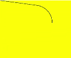
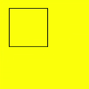

# Path2D对象<a name="ZH-CN_TOPIC_0000001173164751"></a>

路径对象，支持通过对象的接口进行路径的描述，并通过Canvas的stroke接口进行绘制。

## addPath<a name="section12484748163816"></a>

addPath\(path: Object\): void

将另一个路径添加到当前的路径对象中。

-   参数

    <table><thead align="left"><tr><th class="cellrowborder" valign="top" width="21.69%" id="mcps1.1.4.1.1"><p>参数</p>
    </th>
    <th class="cellrowborder" valign="top" width="34.74%" id="mcps1.1.4.1.2"><p>类型</p>
    </th>
    <th class="cellrowborder" valign="top" width="43.57%" id="mcps1.1.4.1.3"><p>描述</p>
    </th>
    </tr>
    </thead>
    <tbody><tr><td class="cellrowborder" valign="top" width="21.69%" headers="mcps1.1.4.1.1 "><p>path</p>
    </td>
    <td class="cellrowborder" valign="top" width="34.74%" headers="mcps1.1.4.1.2 "><p>Object</p>
    </td>
    <td class="cellrowborder" valign="top" width="43.57%" headers="mcps1.1.4.1.3 "><p>需要添加到当前路径的路径对象</p>
    </td>
    </tr>
    </tbody>
    </table>

-   示例

    ```
    <!-- xxx.hml -->
    <div>
      <canvas ref="canvas" style="width: 500px; height: 500px; background-color: #ffff00;"></canvas>
    </div>
    ```

    ```
    //xxx.js
    export default {
      onShow() {
        const el =this.$refs.canvas;
        const ctx = el.getContext('2d');
        var path1 = ctx.createPath2D("M250 150 L150 350 L350 350 Z");
        var path2 = ctx.createPath2D();
        path2.addPath(path1);
        ctx.stroke(path2);
      }
    }
    ```

    


## setTransform<a name="section68262045132013"></a>

setTransform\(scaleX: number, skewX: number, skewY: number, scaleY: number, translateX: number, translateY: number\): void

设置路径变换矩阵。

-   参数

    <table><thead align="left"><tr><th class="cellrowborder" valign="top" width="33.333333333333336%" id="mcps1.1.4.1.1"><p>参数</p>
    </th>
    <th class="cellrowborder" valign="top" width="33.333333333333336%" id="mcps1.1.4.1.2"><p>类型</p>
    </th>
    <th class="cellrowborder" valign="top" width="33.333333333333336%" id="mcps1.1.4.1.3"><p>描述</p>
    </th>
    </tr>
    </thead>
    <tbody><tr><td class="cellrowborder" valign="top" width="33.333333333333336%" headers="mcps1.1.4.1.1 "><p>scaleX</p>
    </td>
    <td class="cellrowborder" valign="top" width="33.333333333333336%" headers="mcps1.1.4.1.2 "><p>number</p>
    </td>
    <td class="cellrowborder" valign="top" width="33.333333333333336%" headers="mcps1.1.4.1.3 "><p>x轴的缩放比例</p>
    </td>
    </tr>
    <tr><td class="cellrowborder" valign="top" width="33.333333333333336%" headers="mcps1.1.4.1.1 "><p>skewX</p>
    </td>
    <td class="cellrowborder" valign="top" width="33.333333333333336%" headers="mcps1.1.4.1.2 "><p>number</p>
    </td>
    <td class="cellrowborder" valign="top" width="33.333333333333336%" headers="mcps1.1.4.1.3 "><p>x轴的倾斜角度</p>
    </td>
    </tr>
    <tr><td class="cellrowborder" valign="top" width="33.333333333333336%" headers="mcps1.1.4.1.1 "><p>skewY</p>
    </td>
    <td class="cellrowborder" valign="top" width="33.333333333333336%" headers="mcps1.1.4.1.2 "><p>number</p>
    </td>
    <td class="cellrowborder" valign="top" width="33.333333333333336%" headers="mcps1.1.4.1.3 "><p>y轴的倾斜角度</p>
    </td>
    </tr>
    <tr><td class="cellrowborder" valign="top" width="33.333333333333336%" headers="mcps1.1.4.1.1 "><p>scaleY</p>
    </td>
    <td class="cellrowborder" valign="top" width="33.333333333333336%" headers="mcps1.1.4.1.2 "><p>number</p>
    </td>
    <td class="cellrowborder" valign="top" width="33.333333333333336%" headers="mcps1.1.4.1.3 "><p>y轴的缩放比例</p>
    </td>
    </tr>
    <tr><td class="cellrowborder" valign="top" width="33.333333333333336%" headers="mcps1.1.4.1.1 "><p>translateX</p>
    </td>
    <td class="cellrowborder" valign="top" width="33.333333333333336%" headers="mcps1.1.4.1.2 "><p>number</p>
    </td>
    <td class="cellrowborder" valign="top" width="33.333333333333336%" headers="mcps1.1.4.1.3 "><p>x轴的平移距离</p>
    </td>
    </tr>
    <tr><td class="cellrowborder" valign="top" width="33.333333333333336%" headers="mcps1.1.4.1.1 "><p>translateY</p>
    </td>
    <td class="cellrowborder" valign="top" width="33.333333333333336%" headers="mcps1.1.4.1.2 "><p>number</p>
    </td>
    <td class="cellrowborder" valign="top" width="33.333333333333336%" headers="mcps1.1.4.1.3 "><p>y轴的平移距离</p>
    </td>
    </tr>
    </tbody>
    </table>

-   示例

    ```
    <!-- xxx.hml -->
    <div>
      <canvas ref="canvas" style="width: 200px; height: 150px; background-color: #ffff00;"></canvas>
    </div>
    ```

    ```
    //xxx.js
    export default {
      onShow() {
        const el =this.$refs.canvas;
        const ctx = el.getContext('2d');
        var path = ctx.createPath2D("M250 150 L150 350 L350 350 Z");
        path.setTransform(0.8, 0, 0, 0.4, 0, 0);
        ctx.stroke(path);
      }
    }
    ```

    


## closePath<a name="section653891424217"></a>

closePath\(\): void

将路径的当前点移回到路径的起点，当前点到起点间画一条直线。如果形状已经闭合或只有一个点，则此功能不执行任何操作。

-   示例

    ```
    <!-- xxx.hml -->
    <div>
      <canvas ref="canvas" style="width: 200px; height: 150px; background-color: #ffff00;"></canvas>
    </div>
    ```

    ```
    //xxx.js
    export default {
      onShow() {
        const el =this.$refs.canvas;
        const ctx = el.getContext('2d');
        var path = ctx.createPath2D();
        path.moveTo(200, 100);
        path.lineTo(300, 100);
        path.lineTo(200, 200);
        path.closePath();
        ctx.stroke(path);
      }
    }
    ```

    


## moveTo<a name="section384917162456"></a>

moveTo\(x: number, y: number\): void

将路径的当前坐标点移动到目标点，移动过程中不绘制线条。

-   参数

    <table><thead align="left"><tr><th class="cellrowborder" valign="top" width="21.69%" id="mcps1.1.4.1.1"><p>参数</p>
    </th>
    <th class="cellrowborder" valign="top" width="34.74%" id="mcps1.1.4.1.2"><p>类型</p>
    </th>
    <th class="cellrowborder" valign="top" width="43.57%" id="mcps1.1.4.1.3"><p>描述</p>
    </th>
    </tr>
    </thead>
    <tbody><tr><td class="cellrowborder" valign="top" width="21.69%" headers="mcps1.1.4.1.1 "><p>x</p>
    </td>
    <td class="cellrowborder" valign="top" width="34.74%" headers="mcps1.1.4.1.2 "><p>number</p>
    </td>
    <td class="cellrowborder" valign="top" width="43.57%" headers="mcps1.1.4.1.3 "><p>目标点X轴坐标</p>
    </td>
    </tr>
    <tr><td class="cellrowborder" valign="top" width="21.69%" headers="mcps1.1.4.1.1 "><p>y</p>
    </td>
    <td class="cellrowborder" valign="top" width="34.74%" headers="mcps1.1.4.1.2 "><p>number</p>
    </td>
    <td class="cellrowborder" valign="top" width="43.57%" headers="mcps1.1.4.1.3 "><p>目标点Y轴坐标</p>
    </td>
    </tr>
    </tbody>
    </table>

-   示例

    ```
    <!-- xxx.hml -->
    <div>
      <canvas ref="canvas" style="width: 300px; height: 250px; background-color: #ffff00;"></canvas>
    </div>
    ```

    ```
    //xxx.js
    export default {
      onShow() {
        const el =this.$refs.canvas;
        const ctx = el.getContext('2d');
        var path = ctx.createPath2D();
        path.moveTo(50, 100);
        path.lineTo(250, 100);
        path.lineTo(150, 200);
        path.closePath();
        ctx.stroke(path);
      }
    }
    ```

    


## lineTo<a name="section1374011322484"></a>

lineTo\(x: number, y: number\): void

从当前点绘制一条直线到目标点。

-   参数

    <table><thead align="left"><tr><th class="cellrowborder" valign="top" width="21.69%" id="mcps1.1.4.1.1"><p>参数</p>
    </th>
    <th class="cellrowborder" valign="top" width="34.74%" id="mcps1.1.4.1.2"><p>类型</p>
    </th>
    <th class="cellrowborder" valign="top" width="43.57%" id="mcps1.1.4.1.3"><p>描述</p>
    </th>
    </tr>
    </thead>
    <tbody><tr><td class="cellrowborder" valign="top" width="21.69%" headers="mcps1.1.4.1.1 "><p>x</p>
    </td>
    <td class="cellrowborder" valign="top" width="34.74%" headers="mcps1.1.4.1.2 "><p>number</p>
    </td>
    <td class="cellrowborder" valign="top" width="43.57%" headers="mcps1.1.4.1.3 "><p>目标点X轴坐标</p>
    </td>
    </tr>
    <tr><td class="cellrowborder" valign="top" width="21.69%" headers="mcps1.1.4.1.1 "><p>y</p>
    </td>
    <td class="cellrowborder" valign="top" width="34.74%" headers="mcps1.1.4.1.2 "><p>number</p>
    </td>
    <td class="cellrowborder" valign="top" width="43.57%" headers="mcps1.1.4.1.3 "><p>目标点Y轴坐标</p>
    </td>
    </tr>
    </tbody>
    </table>

-   示例

    ```
    <!-- xxx.hml -->
    <div>
      <canvas ref="canvas" style="width: 400px; height: 450px; background-color: #ffff00;"></canvas>
    </div>
    ```

    ```
    //xxx.js
    export default {
      onShow() {
        const el =this.$refs.canvas;
        const ctx = el.getContext('2d');
        var path = ctx.createPath2D();
        path.moveTo(100, 100);
        path.lineTo(100, 200);
        path.lineTo(200, 200);
        path.lineTo(200, 100);
        path.closePath();
        ctx.stroke(path);
      }
    }
    ```

    


## bezierCurveTo<a name="section122413525494"></a>

bezierCurveTo\(cp1x: number, cp1y: number, cp2x: number, cp2y: number, x: number, y: number\): void

创建三次贝赛尔曲线的路径。

-   参数

    <table><thead align="left"><tr><th class="cellrowborder" valign="top" width="33.333333333333336%" id="mcps1.1.4.1.1"><p>参数</p>
    </th>
    <th class="cellrowborder" valign="top" width="33.333333333333336%" id="mcps1.1.4.1.2"><p>类型</p>
    </th>
    <th class="cellrowborder" valign="top" width="33.333333333333336%" id="mcps1.1.4.1.3"><p>描述</p>
    </th>
    </tr>
    </thead>
    <tbody><tr><td class="cellrowborder" valign="top" width="33.333333333333336%" headers="mcps1.1.4.1.1 "><p>cp1x</p>
    </td>
    <td class="cellrowborder" valign="top" width="33.333333333333336%" headers="mcps1.1.4.1.2 "><p>number</p>
    </td>
    <td class="cellrowborder" valign="top" width="33.333333333333336%" headers="mcps1.1.4.1.3 "><p>第一个贝塞尔参数的x坐标值。</p>
    </td>
    </tr>
    <tr><td class="cellrowborder" valign="top" width="33.333333333333336%" headers="mcps1.1.4.1.1 "><p>cp1y</p>
    </td>
    <td class="cellrowborder" valign="top" width="33.333333333333336%" headers="mcps1.1.4.1.2 "><p>number</p>
    </td>
    <td class="cellrowborder" valign="top" width="33.333333333333336%" headers="mcps1.1.4.1.3 "><p>第一个贝塞尔参数的y坐标值。</p>
    </td>
    </tr>
    <tr><td class="cellrowborder" valign="top" width="33.333333333333336%" headers="mcps1.1.4.1.1 "><p>cp2x</p>
    </td>
    <td class="cellrowborder" valign="top" width="33.333333333333336%" headers="mcps1.1.4.1.2 "><p>number</p>
    </td>
    <td class="cellrowborder" valign="top" width="33.333333333333336%" headers="mcps1.1.4.1.3 "><p>第二个贝塞尔参数的x坐标值。</p>
    </td>
    </tr>
    <tr><td class="cellrowborder" valign="top" width="33.333333333333336%" headers="mcps1.1.4.1.1 "><p>cp2y</p>
    </td>
    <td class="cellrowborder" valign="top" width="33.333333333333336%" headers="mcps1.1.4.1.2 "><p>number</p>
    </td>
    <td class="cellrowborder" valign="top" width="33.333333333333336%" headers="mcps1.1.4.1.3 "><p>第二个贝塞尔参数的y坐标值。</p>
    </td>
    </tr>
    <tr><td class="cellrowborder" valign="top" width="33.333333333333336%" headers="mcps1.1.4.1.1 "><p>x</p>
    </td>
    <td class="cellrowborder" valign="top" width="33.333333333333336%" headers="mcps1.1.4.1.2 "><p>number</p>
    </td>
    <td class="cellrowborder" valign="top" width="33.333333333333336%" headers="mcps1.1.4.1.3 "><p>路径结束时的x坐标值。</p>
    </td>
    </tr>
    <tr><td class="cellrowborder" valign="top" width="33.333333333333336%" headers="mcps1.1.4.1.1 "><p>y</p>
    </td>
    <td class="cellrowborder" valign="top" width="33.333333333333336%" headers="mcps1.1.4.1.2 "><p>number</p>
    </td>
    <td class="cellrowborder" valign="top" width="33.333333333333336%" headers="mcps1.1.4.1.3 "><p>路径结束时的y坐标值。</p>
    </td>
    </tr>
    </tbody>
    </table>

-   示例

    ```
    <!-- xxx.hml -->
    <div>
      <canvas ref="canvas" style="width: 200px; height: 150px; background-color: #ffff00;"></canvas>
    </div>
    ```

    ```
    //xxx.js
    export default {
      onShow() {
        const el =this.$refs.canvas;
        const ctx = el.getContext('2d');
        var path = ctx.createPath2D();
        path.moveTo(10, 10);
        path.bezierCurveTo(20, 100, 200, 100, 200, 20);
        ctx.stroke(path);
      }
    }
    ```

    


## quadraticCurveTo<a name="section16154556165015"></a>

quadraticCurveTo\(cpx: number, cpy: number, x: number, y: number\): void

创建二次贝赛尔曲线的路径。

-   参数

    <table><thead align="left"><tr><th class="cellrowborder" valign="top" width="33.333333333333336%" id="mcps1.1.4.1.1"><p>参数</p>
    </th>
    <th class="cellrowborder" valign="top" width="33.333333333333336%" id="mcps1.1.4.1.2"><p>类型</p>
    </th>
    <th class="cellrowborder" valign="top" width="33.333333333333336%" id="mcps1.1.4.1.3"><p>描述</p>
    </th>
    </tr>
    </thead>
    <tbody><tr><td class="cellrowborder" valign="top" width="33.333333333333336%" headers="mcps1.1.4.1.1 "><p>cpx</p>
    </td>
    <td class="cellrowborder" valign="top" width="33.333333333333336%" headers="mcps1.1.4.1.2 "><p>number</p>
    </td>
    <td class="cellrowborder" valign="top" width="33.333333333333336%" headers="mcps1.1.4.1.3 "><p>贝塞尔参数的x坐标值。</p>
    </td>
    </tr>
    <tr><td class="cellrowborder" valign="top" width="33.333333333333336%" headers="mcps1.1.4.1.1 "><p>cpy</p>
    </td>
    <td class="cellrowborder" valign="top" width="33.333333333333336%" headers="mcps1.1.4.1.2 "><p>number</p>
    </td>
    <td class="cellrowborder" valign="top" width="33.333333333333336%" headers="mcps1.1.4.1.3 "><p>贝塞尔参数的y坐标值。</p>
    </td>
    </tr>
    <tr><td class="cellrowborder" valign="top" width="33.333333333333336%" headers="mcps1.1.4.1.1 "><p>x</p>
    </td>
    <td class="cellrowborder" valign="top" width="33.333333333333336%" headers="mcps1.1.4.1.2 "><p>number</p>
    </td>
    <td class="cellrowborder" valign="top" width="33.333333333333336%" headers="mcps1.1.4.1.3 "><p>路径结束时的x坐标值。</p>
    </td>
    </tr>
    <tr><td class="cellrowborder" valign="top" width="33.333333333333336%" headers="mcps1.1.4.1.1 "><p>y</p>
    </td>
    <td class="cellrowborder" valign="top" width="33.333333333333336%" headers="mcps1.1.4.1.2 "><p>number</p>
    </td>
    <td class="cellrowborder" valign="top" width="33.333333333333336%" headers="mcps1.1.4.1.3 "><p>路径结束时的y坐标值。</p>
    </td>
    </tr>
    </tbody>
    </table>

-   示例

    ```
    <!-- xxx.hml -->
    <div>
      <canvas ref="canvas" style="width: 200px; height: 150px; background-color: #ffff00;"></canvas>
    </div>
    ```

    ```
    //xxx.js
    export default {
      onShow() {
        const el =this.$refs.canvas;
        const ctx = el.getContext('2d');
        var path = ctx.createPath2D();
        path.moveTo(10, 10);
        path.quadraticCurveTo(100, 100, 200, 20);
        ctx.stroke(path);
      }
    }
    ```

    


## arc<a name="section950116919527"></a>

arc\(x: number, y: number, radius: number, startAngle: number, endAngle: number, anticlockwise: number\): void

绘制弧线路径。

-   参数

    <table><thead align="left"><tr><th class="cellrowborder" valign="top" width="33.333333333333336%" id="mcps1.1.4.1.1"><p>参数</p>
    </th>
    <th class="cellrowborder" valign="top" width="33.333333333333336%" id="mcps1.1.4.1.2"><p>类型</p>
    </th>
    <th class="cellrowborder" valign="top" width="33.333333333333336%" id="mcps1.1.4.1.3"><p>描述</p>
    </th>
    </tr>
    </thead>
    <tbody><tr><td class="cellrowborder" valign="top" width="33.333333333333336%" headers="mcps1.1.4.1.1 "><p>x</p>
    </td>
    <td class="cellrowborder" valign="top" width="33.333333333333336%" headers="mcps1.1.4.1.2 "><p>number</p>
    </td>
    <td class="cellrowborder" valign="top" width="33.333333333333336%" headers="mcps1.1.4.1.3 "><p>弧线圆心的x坐标值。</p>
    </td>
    </tr>
    <tr><td class="cellrowborder" valign="top" width="33.333333333333336%" headers="mcps1.1.4.1.1 "><p>y</p>
    </td>
    <td class="cellrowborder" valign="top" width="33.333333333333336%" headers="mcps1.1.4.1.2 "><p>number</p>
    </td>
    <td class="cellrowborder" valign="top" width="33.333333333333336%" headers="mcps1.1.4.1.3 "><p>弧线圆心的y坐标值。</p>
    </td>
    </tr>
    <tr><td class="cellrowborder" valign="top" width="33.333333333333336%" headers="mcps1.1.4.1.1 "><p>radius</p>
    </td>
    <td class="cellrowborder" valign="top" width="33.333333333333336%" headers="mcps1.1.4.1.2 "><p>number</p>
    </td>
    <td class="cellrowborder" valign="top" width="33.333333333333336%" headers="mcps1.1.4.1.3 "><p>弧线的圆半径。</p>
    </td>
    </tr>
    <tr><td class="cellrowborder" valign="top" width="33.333333333333336%" headers="mcps1.1.4.1.1 "><p>startAngle</p>
    </td>
    <td class="cellrowborder" valign="top" width="33.333333333333336%" headers="mcps1.1.4.1.2 "><p>number</p>
    </td>
    <td class="cellrowborder" valign="top" width="33.333333333333336%" headers="mcps1.1.4.1.3 "><p>弧线的起始弧度。</p>
    </td>
    </tr>
    <tr><td class="cellrowborder" valign="top" width="33.333333333333336%" headers="mcps1.1.4.1.1 "><p>endAngle</p>
    </td>
    <td class="cellrowborder" valign="top" width="33.333333333333336%" headers="mcps1.1.4.1.2 "><p>number</p>
    </td>
    <td class="cellrowborder" valign="top" width="33.333333333333336%" headers="mcps1.1.4.1.3 "><p>弧线的终止弧度。</p>
    </td>
    </tr>
    <tr><td class="cellrowborder" valign="top" width="33.333333333333336%" headers="mcps1.1.4.1.1 "><p>anticlockwise</p>
    </td>
    <td class="cellrowborder" valign="top" width="33.333333333333336%" headers="mcps1.1.4.1.2 "><p>boolean</p>
    </td>
    <td class="cellrowborder" valign="top" width="33.333333333333336%" headers="mcps1.1.4.1.3 "><p>是否逆时针绘制圆弧。</p>
    </td>
    </tr>
    </tbody>
    </table>

-   示例

    ```
    <!-- xxx.hml -->
    <div>
      <canvas ref="canvas" style="width: 200px; height: 150px; background-color: #ffff00;"></canvas>
    </div>
    ```

    ```
    //xxx.js
    export default {
      onShow() {
        const el =this.$refs.canvas;
        const ctx = el.getContext('2d');
        var path = ctx.createPath2D();
        path.arc(100, 75, 50, 0, 6.28);
        ctx.stroke(path);
      }
    }
    ```

    


## arcTo<a name="section98421358175219"></a>

arcTo\(x1: number, y1: number, x2: number, y2: number, radius: number\): void

依据圆弧经过的点和圆弧半径创建圆弧路径。

-   参数

    <table><thead align="left"><tr><th class="cellrowborder" valign="top" width="33.333333333333336%" id="mcps1.1.4.1.1"><p>参数</p>
    </th>
    <th class="cellrowborder" valign="top" width="33.333333333333336%" id="mcps1.1.4.1.2"><p>类型</p>
    </th>
    <th class="cellrowborder" valign="top" width="33.333333333333336%" id="mcps1.1.4.1.3"><p>描述</p>
    </th>
    </tr>
    </thead>
    <tbody><tr><td class="cellrowborder" valign="top" width="33.333333333333336%" headers="mcps1.1.4.1.1 "><p>x1</p>
    </td>
    <td class="cellrowborder" valign="top" width="33.333333333333336%" headers="mcps1.1.4.1.2 "><p>number</p>
    </td>
    <td class="cellrowborder" valign="top" width="33.333333333333336%" headers="mcps1.1.4.1.3 "><p>圆弧经过的第一个点的x坐标值。</p>
    </td>
    </tr>
    <tr><td class="cellrowborder" valign="top" width="33.333333333333336%" headers="mcps1.1.4.1.1 "><p>y1</p>
    </td>
    <td class="cellrowborder" valign="top" width="33.333333333333336%" headers="mcps1.1.4.1.2 "><p>number</p>
    </td>
    <td class="cellrowborder" valign="top" width="33.333333333333336%" headers="mcps1.1.4.1.3 "><p>圆弧经过的第一个点的y坐标值。</p>
    </td>
    </tr>
    <tr><td class="cellrowborder" valign="top" width="33.333333333333336%" headers="mcps1.1.4.1.1 "><p>x2</p>
    </td>
    <td class="cellrowborder" valign="top" width="33.333333333333336%" headers="mcps1.1.4.1.2 "><p>number</p>
    </td>
    <td class="cellrowborder" valign="top" width="33.333333333333336%" headers="mcps1.1.4.1.3 "><p>圆弧经过的第二个点的x坐标值。</p>
    </td>
    </tr>
    <tr><td class="cellrowborder" valign="top" width="33.333333333333336%" headers="mcps1.1.4.1.1 "><p>y2</p>
    </td>
    <td class="cellrowborder" valign="top" width="33.333333333333336%" headers="mcps1.1.4.1.2 "><p>number</p>
    </td>
    <td class="cellrowborder" valign="top" width="33.333333333333336%" headers="mcps1.1.4.1.3 "><p>圆弧经过的第二个点的y坐标值。</p>
    </td>
    </tr>
    <tr><td class="cellrowborder" valign="top" width="33.333333333333336%" headers="mcps1.1.4.1.1 "><p>radius</p>
    </td>
    <td class="cellrowborder" valign="top" width="33.333333333333336%" headers="mcps1.1.4.1.2 "><p>number</p>
    </td>
    <td class="cellrowborder" valign="top" width="33.333333333333336%" headers="mcps1.1.4.1.3 "><p>圆弧的圆半径值。</p>
    </td>
    </tr>
    </tbody>
    </table>

-   示例

    ```
    <!-- xxx.hml -->
    <div>
      <canvas ref="canvas" style="width: 200px; height: 150px; background-color: #ffff00;"></canvas>
    </div>
    ```

    ```
    //xxx.js
    export default {
      onShow() {
        const el =this.$refs.canvas;
        const ctx = el.getContext('2d');
        var path = ctx.createPath2D();
        path.arcTo(150, 20, 150, 70, 50);
        ctx.stroke(path);
      }
    }
    ```

    


## ellipse<a name="section8146160205420"></a>

ellipse\(x: number, y: number, radiusX: number, radiusY: number, rotation: number, startAngle: number, endAngle: number, anticlockwise: number\): void

在规定的矩形区域绘制一个椭圆。

-   参数

    <table><thead align="left"><tr><th class="cellrowborder" valign="top" width="33.33333333333333%" id="mcps1.1.4.1.1"><p>参数</p>
    </th>
    <th class="cellrowborder" valign="top" width="31.34343434343434%" id="mcps1.1.4.1.2"><p>类型</p>
    </th>
    <th class="cellrowborder" valign="top" width="35.323232323232325%" id="mcps1.1.4.1.3"><p>描述</p>
    </th>
    </tr>
    </thead>
    <tbody><tr><td class="cellrowborder" valign="top" width="33.33333333333333%" headers="mcps1.1.4.1.1 "><p>x</p>
    </td>
    <td class="cellrowborder" valign="top" width="31.34343434343434%" headers="mcps1.1.4.1.2 "><p>number</p>
    </td>
    <td class="cellrowborder" valign="top" width="35.323232323232325%" headers="mcps1.1.4.1.3 "><p>椭圆圆心的x轴坐标。</p>
    </td>
    </tr>
    <tr><td class="cellrowborder" valign="top" width="33.33333333333333%" headers="mcps1.1.4.1.1 "><p>y</p>
    </td>
    <td class="cellrowborder" valign="top" width="31.34343434343434%" headers="mcps1.1.4.1.2 "><p>number</p>
    </td>
    <td class="cellrowborder" valign="top" width="35.323232323232325%" headers="mcps1.1.4.1.3 "><p>椭圆圆心的y轴坐标。</p>
    </td>
    </tr>
    <tr><td class="cellrowborder" valign="top" width="33.33333333333333%" headers="mcps1.1.4.1.1 "><p>radiusX</p>
    </td>
    <td class="cellrowborder" valign="top" width="31.34343434343434%" headers="mcps1.1.4.1.2 "><p>number</p>
    </td>
    <td class="cellrowborder" valign="top" width="35.323232323232325%" headers="mcps1.1.4.1.3 "><p>椭圆x轴的半径长度。</p>
    </td>
    </tr>
    <tr><td class="cellrowborder" valign="top" width="33.33333333333333%" headers="mcps1.1.4.1.1 "><p>radiusY</p>
    </td>
    <td class="cellrowborder" valign="top" width="31.34343434343434%" headers="mcps1.1.4.1.2 "><p>number</p>
    </td>
    <td class="cellrowborder" valign="top" width="35.323232323232325%" headers="mcps1.1.4.1.3 "><p>椭圆y轴的半径长度。</p>
    </td>
    </tr>
    <tr><td class="cellrowborder" valign="top" width="33.33333333333333%" headers="mcps1.1.4.1.1 "><p>rotation</p>
    </td>
    <td class="cellrowborder" valign="top" width="31.34343434343434%" headers="mcps1.1.4.1.2 "><p>number</p>
    </td>
    <td class="cellrowborder" valign="top" width="35.323232323232325%" headers="mcps1.1.4.1.3 "><p>椭圆的旋转角度，单位为弧度。</p>
    </td>
    </tr>
    <tr><td class="cellrowborder" valign="top" width="33.33333333333333%" headers="mcps1.1.4.1.1 "><p>startAngle</p>
    </td>
    <td class="cellrowborder" valign="top" width="31.34343434343434%" headers="mcps1.1.4.1.2 "><p>number</p>
    </td>
    <td class="cellrowborder" valign="top" width="35.323232323232325%" headers="mcps1.1.4.1.3 "><p>椭圆绘制的起始点角度，以弧度表示。</p>
    </td>
    </tr>
    <tr><td class="cellrowborder" valign="top" width="33.33333333333333%" headers="mcps1.1.4.1.1 "><p>endAngle</p>
    </td>
    <td class="cellrowborder" valign="top" width="31.34343434343434%" headers="mcps1.1.4.1.2 "><p>number</p>
    </td>
    <td class="cellrowborder" valign="top" width="35.323232323232325%" headers="mcps1.1.4.1.3 "><p>椭圆绘制的结束点角度，以弧度表示。</p>
    </td>
    </tr>
    <tr><td class="cellrowborder" valign="top" width="33.33333333333333%" headers="mcps1.1.4.1.1 "><p>anticlockwise</p>
    </td>
    <td class="cellrowborder" valign="top" width="31.34343434343434%" headers="mcps1.1.4.1.2 "><p>number</p>
    </td>
    <td class="cellrowborder" valign="top" width="35.323232323232325%" headers="mcps1.1.4.1.3 "><p>是否以逆时针方向绘制椭圆，0为顺时针，1为逆时针。(可选参数，默认为0)</p>
    </td>
    </tr>
    </tbody>
    </table>

-   示例

    ```
    <!-- xxx.hml -->
    <div>
      <canvas ref="canvas" style="width: 500px; height: 450px; background-color: #ffff00;"></canvas>
    </div>
    ```

    ```
    //xxx.js
    export default {
      onShow() {
        const el =this.$refs.canvas;
        const ctx =el.getContext('2d');
        var path = ctx.createPath2D();
        path.ellipse(200, 200, 50, 100, Math.PI * 0.25, Math.PI * 0.5, Math.PI, 1);
        ctx.stroke(path);
      }
    }
    ```

    


## rect<a name="section18565225124518"></a>

rect\(x: number, y: number, width: number, height: number\): void

创建矩形路径。

-   参数

    <table><thead align="left"><tr><th class="cellrowborder" valign="top" width="33.333333333333336%" id="mcps1.1.4.1.1"><p>参数</p>
    </th>
    <th class="cellrowborder" valign="top" width="33.333333333333336%" id="mcps1.1.4.1.2"><p>类型</p>
    </th>
    <th class="cellrowborder" valign="top" width="33.333333333333336%" id="mcps1.1.4.1.3"><p>描述</p>
    </th>
    </tr>
    </thead>
    <tbody><tr><td class="cellrowborder" valign="top" width="33.333333333333336%" headers="mcps1.1.4.1.1 "><p>x</p>
    </td>
    <td class="cellrowborder" valign="top" width="33.333333333333336%" headers="mcps1.1.4.1.2 "><p>number</p>
    </td>
    <td class="cellrowborder" valign="top" width="33.333333333333336%" headers="mcps1.1.4.1.3 "><p>指定矩形的左上角x坐标值。</p>
    </td>
    </tr>
    <tr><td class="cellrowborder" valign="top" width="33.333333333333336%" headers="mcps1.1.4.1.1 "><p>y</p>
    </td>
    <td class="cellrowborder" valign="top" width="33.333333333333336%" headers="mcps1.1.4.1.2 "><p>number</p>
    </td>
    <td class="cellrowborder" valign="top" width="33.333333333333336%" headers="mcps1.1.4.1.3 "><p>指定矩形的左上角y坐标值。</p>
    </td>
    </tr>
    <tr><td class="cellrowborder" valign="top" width="33.333333333333336%" headers="mcps1.1.4.1.1 "><p>width</p>
    </td>
    <td class="cellrowborder" valign="top" width="33.333333333333336%" headers="mcps1.1.4.1.2 "><p>number</p>
    </td>
    <td class="cellrowborder" valign="top" width="33.333333333333336%" headers="mcps1.1.4.1.3 "><p>指定矩形的宽度。</p>
    </td>
    </tr>
    <tr><td class="cellrowborder" valign="top" width="33.333333333333336%" headers="mcps1.1.4.1.1 "><p>height</p>
    </td>
    <td class="cellrowborder" valign="top" width="33.333333333333336%" headers="mcps1.1.4.1.2 "><p>number</p>
    </td>
    <td class="cellrowborder" valign="top" width="33.333333333333336%" headers="mcps1.1.4.1.3 "><p>指定矩形的高度。</p>
    </td>
    </tr>
    </tbody>
    </table>

-   示例

    ```
    <!-- xxx.hml -->
    <div>
      <canvas ref="canvas" style="width: 500px; height: 450px; background-color: #ffff00;"></canvas>
    </div>
    ```

    ```
    //xxx.js
    export default {
      onShow() {
        const el =this.$refs.canvas;
        const ctx = el.getContext('2d');
        var path = ctx.createPath2D();
        path.rect(20, 20, 100, 100);
        ctx.stroke(path);
      }
    }
    ```

    


