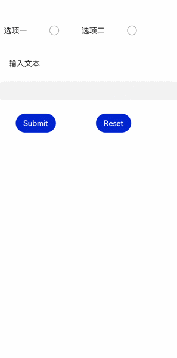

# form<a name="ZH-CN_TOPIC_0000001127284848"></a>

表单容器，支持容器内input元素的内容提交和重置。

## 权限列表<a name="section11257113618419"></a>

无

## 子组件<a name="section9288143101012"></a>

支持。

## 属性<a name="section2907183951110"></a>

支持[通用属性](js-components-common-attributes.md)。

## 样式<a name="section10683162023215"></a>

支持[组件通用样式](js-components-common-styles.md)。

## 事件<a name="section77341431152917"></a>

处支持[通用事件](js-components-common-events.md)外，还支持如下事件：

<table><thead align="left"><tr><th class="cellrowborder" valign="top" width="22.7022702270227%" id="mcps1.1.4.1.1"><p>名称</p>
</th>
<th class="cellrowborder" valign="top" width="16.881688168816883%" id="mcps1.1.4.1.2"><p>参数</p>
</th>
<th class="cellrowborder" valign="top" width="60.41604160416041%" id="mcps1.1.4.1.3"><p>描述</p>
</th>
</tr>
</thead>
<tbody><tr><td class="cellrowborder" valign="top" width="22.7022702270227%" headers="mcps1.1.4.1.1 "><p>submit</p>
</td>
<td class="cellrowborder" valign="top" width="16.881688168816883%" headers="mcps1.1.4.1.2 "><p><a href="#table195257111418">FormResult</a></p>
</td>
<td class="cellrowborder" valign="top" width="60.41604160416041%" headers="mcps1.1.4.1.3 "><p>点击提交按钮，进行表单提交时，触发该事件。</p>
</td>
</tr>
<tr><td class="cellrowborder" valign="top" width="22.7022702270227%" headers="mcps1.1.4.1.1 "><p>reset</p>
</td>
<td class="cellrowborder" valign="top" width="16.881688168816883%" headers="mcps1.1.4.1.2 "><p>-</p>
</td>
<td class="cellrowborder" valign="top" width="60.41604160416041%" headers="mcps1.1.4.1.3 "><p>点击重置按钮后，触发该事件。</p>
</td>
</tr>
</tbody>
</table>

**表 1**  FormResult

<a name="table195257111418"></a>
<table><thead align="left"><tr><th class="cellrowborder" valign="top" width="33.33333333333333%" id="mcps1.2.4.1.1"><p>名称</p>
</th>
<th class="cellrowborder" valign="top" width="33.33333333333333%" id="mcps1.2.4.1.2"><p>类型</p>
</th>
<th class="cellrowborder" valign="top" width="33.33333333333333%" id="mcps1.2.4.1.3"><p>描述</p>
</th>
</tr>
</thead>
<tbody><tr><td class="cellrowborder" valign="top" width="33.33333333333333%" headers="mcps1.2.4.1.1 "><p>value</p>
</td>
<td class="cellrowborder" valign="top" width="33.33333333333333%" headers="mcps1.2.4.1.2 "><p>Object</p>
</td>
<td class="cellrowborder" valign="top" width="33.33333333333333%" headers="mcps1.2.4.1.3 "><p>input元素的name和value的值。</p>
</td>
</tr>
</tbody>
</table>

## 方法<a name="section2279124532420"></a>

支持[通用方法](js-components-common-methods.md)。

## 示例<a name="section1241545010391"></a>

```
<!-- xxx.hml -->
<form onsubmit='onSubmit' onreset='onReset'>
  <div style="width: 600px;height: 150px;flex-direction: row;justify-content: space-around;">
    <label>选项一</label>
    <input type='radio' name='radioGroup' value='radio1'></input>
    <label>选项二</label>
    <input type='radio' name='radioGroup' value='radio2'></input>
  </div>
  <text style="margin-left: 50px;margin-bottom: 50px;">输入文本</text>
  <input type='text' name='user'></input>
  <div style="width: 600px;height: 150px;margin-top: 50px;flex-direction: row;justify-content: space-around;">
    <input type='submit'>Submit</input>
    <input type='reset'>Reset</input>
  </div>
</form>
```

```
// xxx.js
export default{
  onSubmit(result) {
    console.log(result.value.radioGroup) // radio1 or radio2
    console.log(result.value.user) // text input value
  },
  onReset() {
    console.log('reset all value')
  }
}
```



