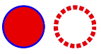

# circle


>  **说明：**
> 该组件从API version 7开始支持。后续版本如有新增内容，则采用上角标单独标记该内容的起始版本。

圆形形状。

## 权限列表

无


## 子组件

支持[animate](js-components-svg-animate.md)、[animateMotion](js-components-svg-animatemotion.md)、[animateTransform](js-components-svg-animatetransform.md)。


## 属性

支持Svg组件[通用属性](js-components-svg-common-attributes.md)和以下属性。

| 名称 | 类型 | 默认值 | 必填 | 描述 |
| -------- | -------- | -------- | -------- | -------- |
| id | string | - | 否 | 组件的唯一标识。 |
| cx | &lt;length&gt;\|&lt;percentage&gt; | 0 | 否 | 设置圆心的x轴坐标。支持属性动画。 |
| cy | &lt;length&gt;\|&lt;percentage&gt; | 0 | 否 | 设置圆心的y轴坐标。支持属性动画。 |
| r | &lt;length&gt;\|&lt;percentage&gt; | 0 | 否 | 设置圆的半径。支持属性动画。 |


## 示例

```html
<!-- xxx.hml -->
<div class="container">
  <svg fill="white" width="400" height="400">
    <circle cx="60" cy="200" r="50" stroke-width="4" fill="red" stroke="blue"></circle>
    <circle cx="180" cy="200" r="50" stroke-width="10" stroke="red" stroke-dasharray="10 5" stroke-dashoffset="3"></circle>
  </svg>
</div>
```



