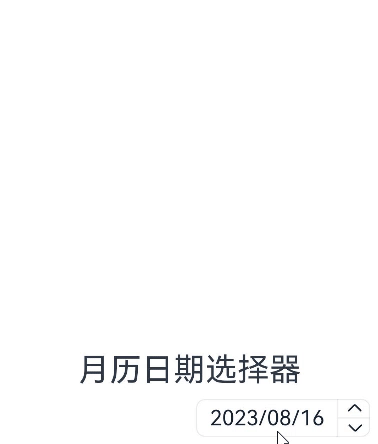

# CalendarPicker

日历选择器组件，提供下拉日历弹窗，可以让用户选择日期。

>  **说明：**
>
>  该组件从API Version 10开始支持。后续版本如有新增内容，则采用上角标单独标记该内容的起始版本。


## 子组件

无

## 接口

CalendarPicker(options?: CalendarOptions)

## 属性

除支持[通用属性](ts-universal-attributes-size.md)外，还支持以下属性：

| 名称          | 参数类型           | 描述                                |
| ----------- | ----------- | --------------------------------- |
| edgeAlign | alignType: [CalendarAlign](#calendaralign枚举说明)，offset?: [Offset](ts-types.md#offset) | 设置选择器与入口组件的对齐方式。<br/>-alignType: 对齐方式类型。<br/>默认值：CalendarAlign .END。<br/>-offset: 按照对齐类型对齐后，选择器相对入口组件的偏移量。<br/>默认值：{dx: 0, dy: 0}。 |
| textStyle | [PickerTextStyle](./ts-basic-components-datepicker.md#pickertextstyle10类型说明) | 设置入口区的文本颜色、字号、字体粗细。                       |
## 事件

除支持[通用事件](ts-universal-events-click.md)，还支持以下事件：

| 名称                                      | 功能描述               |
| ----------------------------------------- | ---------------------- |
| onChange(callback: (value: Date) => void) | 选择日期时触发该事件。<br/>value：选中的日期值 |

##  CalendarOptions对象说明

| 参数名      | 参数类型       | 必填        | 参数描述                              |
| ----------- | ---------- | ------| --------------------------------- |
| hintRadius | number \| [Resource](ts-types.md#resource) | 否    | 描述日期选中态底板样式。<br/>默认值：底板样式为圆形。<br />**说明：**<br />hintRadius为0，底板样式为直角矩形。hintRadius为0 ~ 16，底板样式为圆角矩形。hintRadius>=16，底板样式为圆形 |
| selected | Date | 否    | 设置选中项的日期。<br/>默认值：当前系统日期。<br/> |

## CalendarAlign枚举说明

从API version 9开始，该接口支持在ArkTS卡片中使用。

| 名称   | 描述                     |
| ------ | ------------------------ |
| START  | 设置选择器与入口组件左对齐的对齐方式。   |
| CENTER | 设置选择器与入口组件居中对齐的对齐方式。 |
| END    | 设置选择器与入口组件右对齐的对齐方式。   |

## 示例

```ts
// xxx.ets
@Entry
@Component
struct CalendarPickerExample {
  private selectedDate: Date = new Date()
  build() {
    Column() {
      Text('月历日期选择器').fontSize(30)
      Column() {
        CalendarPicker({ hintRadius: 10, selected: this.selectedDate })
          .edgeAlign(CalendarAlign.END)
          .textStyle({ color: "#ff182431", font: { size: 20, weight: FontWeight.Normal } })
          .margin(10)
          .onChange((value) => {
            console.info("CalendarPicker onChange:" + JSON.stringify(value))
          })
      }.alignItems(HorizontalAlign.End).width("100%")
    }.width('100%').margin({top:350})
  }
}
```


