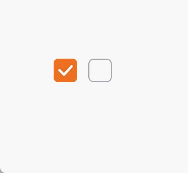
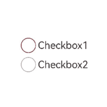

# Checkbox

提供多选框组件，通常用于某选项的打开或关闭。

>  **说明：**
>
>  该组件从API Version 8开始支持。后续版本如有新增内容，则采用上角标单独标记该内容的起始版本。

## 子组件

无

## 接口

Checkbox(options?:&nbsp;{name?: string,  group?: string })

从API version 9开始，该接口支持在ArkTS卡片中使用。

**参数:**

| 参数名  | 参数类型 | 必填  | 参数描述 |
| --------| --------| ------ | -------- |
| name    | string | 否 | 多选框名称。 |
| group   | string | 否 | 多选框的群组名称。<br/>**说明：** <br/>未配合使用CheckboxGroup组件时，此值无用。 |

## 属性

除支持[通用属性](ts-universal-attributes-size.md)外，还支持以下属性：


| 名称          | 参数类型 | 描述 |
| ------------- | ------- | -------- |
| select        | boolean | 设置多选框是否选中。<br/>默认值：false<br/>从API version 9开始，该接口支持在ArkTS卡片中使用。<br />从API version 10开始，该属性支持[$$](../../quick-start/arkts-two-way-sync.md)双向绑定变量。 |
| selectedColor | [ResourceColor](ts-types.md#resourcecolor) | 设置多选框选中状态颜色。<br/>从API version 9开始，该接口支持在ArkTS卡片中使用。 |
| unselectedColor<sup>10+</sup> | [ResourceColor](ts-types.md#resourcecolor) | 设置多选框非选中状态边框颜色。 |
| mark<sup>10+</sup> | [MarkStyle](#markstyle10对象说明) | 多选框内部图标样式。 |

## 事件

支持[通用事件](ts-universal-events-click.md)外，还支持以下事件：

| 名称                                         | 功能描述                                                     |
| -------------------------------------------- | ------------------------------------------------------------ |
| onChange(callback: (value: boolean) => void) | 当选中状态发生变化时，触发该回调。<br>- value为true时，表示已选中。<br>- value为false时，表示未选中。<br/>从API version 9开始，该接口支持在ArkTS卡片中使用。 |

## MarkStyle<sup>10+</sup>对象说明

| 名称        | 类型                                       | 必填 | 默认值      | 描述                                                         |
| ----------- | ------------------------------------------ | ---- | ----------- | ------------------------------------------------------------ |
| strokeColor | [ResourceColor](ts-types.md#resourcecolor) | 否   | Color.White | 内部图标颜色。                                               |
| size        | number&nbsp;\|&nbsp;string                 | 否   | -           | 内部图标大小，单位vp。默认大小与多选框组件宽度设置值一致。<br />不支持百分比形式设置。当设置为非法值时，按照默认值处理。 |
| strokeWidth | number&nbsp;\|&nbsp;string                 | 否   | 2           | 内部图标粗细，单位vp。不支持百分比形式设置。当设置为非法值时，按照默认值处理。 |

## 示例

### 示例1

```ts
// xxx.ets
@Entry
@Component
struct CheckboxExample {

  build() {
    Row() {
      Checkbox({name: 'checkbox1',  group: 'checkboxGroup'})
        .select(true)
        .selectedColor(0xed6f21)        
        .onChange((value: boolean) => {
          console.info('Checkbox1 change is'+ value)
        })
      Checkbox({name: 'checkbox2',  group: 'checkboxGroup'})
        .select(false)
        .selectedColor(0x39a2db)        
        .onChange((value: boolean) => {
          console.info('Checkbox2 change is'+ value)
        })
    }
  }
}
```




### 示例2

```ts
// xxx.ets
@Entry
@Component
struct Index {

  build() {
    Row() {
      Column() {
        Flex({ justifyContent: FlexAlign.Center, alignItems: ItemAlign.Center }) {
          Checkbox({ name: 'checkbox1', group: 'checkboxGroup' })
            .selectedColor(0x39a2db)            
            .onChange((value: boolean) => {
              console.info('Checkbox1 change is'+ value)
            })
            .mark({
              strokeColor:Color.Black,
              size: 50,
              strokeWidth: 5
            })
            .unselectedColor(Color.Red)
            .width(30)
            .height(30)
          Text('Checkbox1').fontSize(20)
        }
        Flex({ justifyContent: FlexAlign.Center, alignItems: ItemAlign.Center }) {
          Checkbox({ name: 'checkbox2', group: 'checkboxGroup' })
            .selectedColor(0x39a2db)            
            .onChange((value: boolean) => {
              console.info('Checkbox2 change is' + value)
            })
            .width(30)
            .height(30)
          Text('Checkbox2').fontSize(20)
        }
      }
      .width('100%')
    }
    .height('100%')
  }
}
```



