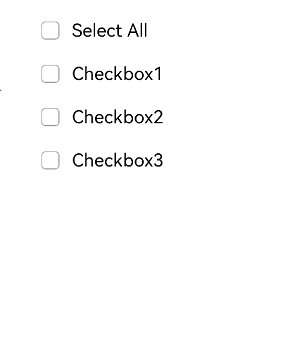
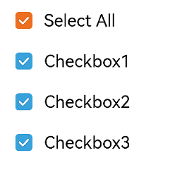
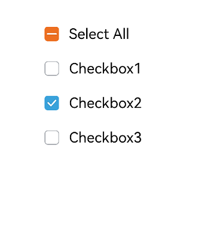

# CheckboxGroup

多选框群组，用于控制多选框全选或者不全选状态。

>  **说明：**
>
>  该组件从API Version 8开始支持。后续版本如有新增内容，则采用上角标单独标记该内容的起始版本。

## 子组件

无

## 接口

CheckboxGroup(options?: { group?: string })

创建多选框群组，可以控制群组内的Checkbox全选或者不全选，group值相同的Checkbox和CheckboxGroup为同一群组。

**参数:**


| 参数名 | 参数类型 | 必填 | 参数描述 |
| -------- | -------- | -------- | -------- |
| group | string | 否 | 群组名称。|

## 属性

除支持[通用属性](ts-universal-attributes-size.md)外，还支持以下属性：

| 名称 | 参数类型 | 描述 |
| -------- | -------- | -------- |
| selectAll | boolean | 设置是否全选。<br/>默认值：false，若同组的Checkbox显式设置select，则Checkbox的优先级高。 |
| selectedColor | [ResourceColor](ts-types.md#resourcecolor) | 设置被选中或部分选中状态的颜色。 |

## 事件

除支持[通用事件](ts-universal-events-click.md)外，还支持以下事件：

| 名称 | 功能描述 |
| -------- | -------- |
| onChange (callback: (event: [CheckboxGroupResult](#checkboxgroupresult对象说明)) => void ) |CheckboxGroup的选中状态或群组内的Checkbox的选中状态发生变化时，触发回调。|

## CheckboxGroupResult对象说明
| 名称     | 类型   | 描述      |
| ------ | ------ | ------- |
| name   | Array&lt;string&gt; | 群组内所有被选中的多选框名称。 |
| status | [SelectStatus](#selectstatus枚举说明) | 选中状态。 |

## SelectStatus枚举说明

| 名称  | 描述 |
| ----- | -------------------- |
| All   | 群组多选择框全部选择。 |
| Part  | 群组多选择框部分选择。 |
| None  | 群组多选择框全部没有选择。 |


## 示例

```ts
// xxx.ets
@Entry
@Component
struct CheckboxExample {
  build() {
    Scroll() {
      Column() {
        // 全选按钮
        Flex({ justifyContent: FlexAlign.Start, alignItems: ItemAlign.Center }) {
          CheckboxGroup({ group: 'checkboxGroup' })
            .selectedColor('#007DFF')
            .onChange((itemName: CheckboxGroupResult) => {
              console.info("checkbox group content" + JSON.stringify(itemName))
            })
          Text('Select All').fontSize(14).lineHeight(20).fontColor('#182431').fontWeight(500)
        }

        // 选项1
        Flex({ justifyContent: FlexAlign.Start, alignItems: ItemAlign.Center }) {
          Checkbox({ name: 'checkbox1', group: 'checkboxGroup' })
            .selectedColor('#007DFF')
            .onChange((value: boolean) => {
              console.info('Checkbox1 change is' + value)
            })
          Text('Checkbox1').fontSize(14).lineHeight(20).fontColor('#182431').fontWeight(500)
        }.margin({ left: 36 })

        // 选项2
        Flex({ justifyContent: FlexAlign.Start, alignItems: ItemAlign.Center }) {
          Checkbox({ name: 'checkbox2', group: 'checkboxGroup' })
            .selectedColor('#007DFF')
            .onChange((value: boolean) => {
              console.info('Checkbox2 change is' + value)
            })
          Text('Checkbox2').fontSize(14).lineHeight(20).fontColor('#182431').fontWeight(500)
        }.margin({ left: 36 })

        // 选项3
        Flex({ justifyContent: FlexAlign.Start, alignItems: ItemAlign.Center }) {
          Checkbox({ name: 'checkbox3', group: 'checkboxGroup' })
            .selectedColor('#007DFF')
            .onChange((value: boolean) => {
              console.info('Checkbox3 change is' + value)
            })
          Text('Checkbox3').fontSize(14).lineHeight(20).fontColor('#182431').fontWeight(500)
        }.margin({ left: 36 })
      }
    }
  }
}
```
多选框组三种状态图示：






