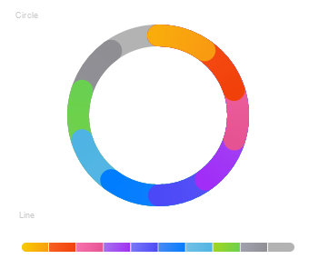

# DataPanel

数据面板组件，用于将多个数据占比情况使用占比图进行展示。

>  **说明：**
>
> 该组件从API Version 7开始支持。后续版本如有新增内容，则采用上角标单独标记该内容的起始版本。


## 子组件

无


## 接口

DataPanel(options:{values: number[], max?: number, type?: DataPanelType})

**参数:**

| 参数名            | 参数类型   | 必填  | 参数描述 |
| ----------------- | -------- | ----- | -------- |
| values            | number[]   | 是    | 数据值列表，最多包含9个数据，大于9个数据则取前9个数据。若数据值小于0则置为0。 |
| max               | number     | 否    |   -&nbsp;max大于0，表示数据的最大值。<br/>-&nbsp;max小于等于0，max等于value数组各项的和，按比例显示。<br/>默认值：100 |
| type<sup>8+</sup> | [DataPanelType](#datapaneltype枚举说明) | 否 | 数据面板的类型。<br/>默认值：DataPanelType.Circle |


## DataPanelType枚举说明
| 名称 | 描述 | 
| -------| ------------ |
| Line   | 线型数据面板。 | 
| Circle | 环形数据面板。 |


## 示例

```ts
// xxx.ets
@Entry
@Component
struct DataPanelExample {
  public values1: number[] = [10, 10, 10, 10, 10, 10, 10, 10, 10]

  build() {
    Column({ space: 5 }) {
      Text('Circle').fontSize(9).fontColor(0xCCCCCC).margin({ top: 20, right: '80%' })
      DataPanel({ values: this.values1, max: 100, type: DataPanelType.Circle }).width(200).height(200)

      Text('Line').fontSize(9).fontColor(0xCCCCCC).margin({ bottom: 20, right: '80%' })
      DataPanel({ values: this.values1, max: 100, type: DataPanelType.Line }).width(300).height(10)
    }.width('100%').margin({ top: 5 })
  }
}
```


