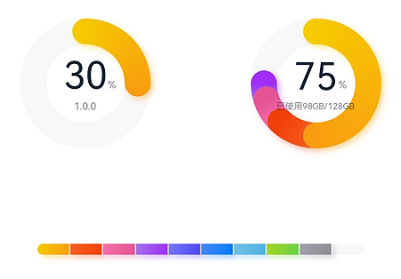
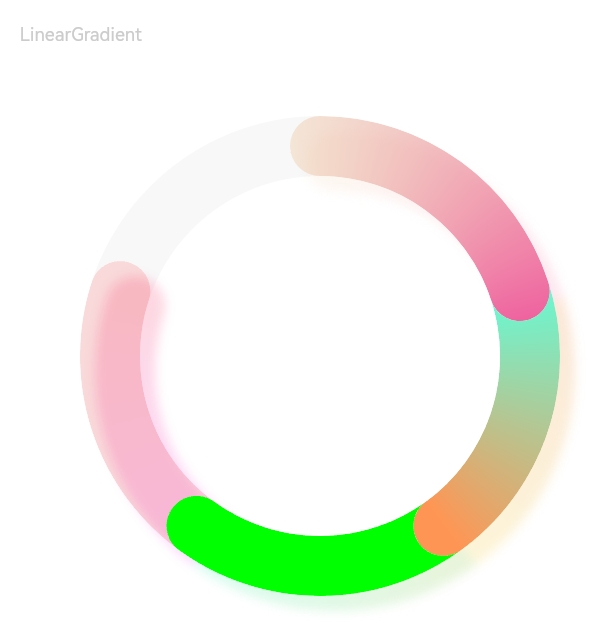

# DataPanel

数据面板组件，用于将多个数据占比情况使用占比图进行展示。

>  **说明：**
>
> 该组件从API Version 7开始支持。后续版本如有新增内容，则采用上角标单独标记该内容的起始版本。


## 子组件

无


## 接口

DataPanel(options:{values: number[], max?: number, type?: DataPanelType})

从API version 9开始，该接口支持在ArkTS卡片中使用。

**参数:**

| 参数名            | 参数类型   | 必填  | 参数描述 |
| ----------------- | -------- | ----- | -------- |
| values            | number[]   | 是    | 数据值列表，最多包含9个数据，大于9个数据则取前9个数据。若数据值小于0则置为0。 |
| max               | number     | 否    |   -&nbsp;max大于0，表示数据的最大值。<br/>-&nbsp;max小于等于0，max等于value数组各项的和，按比例显示。<br/>默认值：100 |
| type<sup>8+</sup> | [DataPanelType](#datapaneltype枚举说明) | 否 | 数据面板的类型（不支持动态修改）。<br/>默认值：DataPanelType.Circle |


## DataPanelType枚举说明

从API version 9开始，该接口支持在ArkTS卡片中使用。

| 名称 | 描述 |
| -------| ------------ |
| Line   | 线型数据面板。 |
| Circle | 环形数据面板。 |


## 属性

除支持[通用属性](ts-universal-attributes-size.md)外，还支持以下属性：


| 名称          | 参数类型 | 描述 |
| ------------- | ------- | -------- |
| closeEffect | boolean | 关闭数据占比图表旋转动效和投影效果。<br/>默认值：false <br/>**说明：** <br/> 若未设置trackShadow属性，则该属性控制投影效果的开关，开启投影的效果为投影的默认效果。<br/> 若设置trackShadow属性，则由trackShadow属性值控制投影效果的开关。|
| valueColors<sup>10+</sup>   | Array<[ResourceColor](ts-types.md#resourcecolor) \| [LinearGradient](#lineargradient10对象说明)> | 各数据段颜色，ResourceColor为纯色，LinearGradient为渐变色。|
| trackBackgroundColor<sup>10+</sup> | [ResourceColor](ts-types.md#resourcecolor) | 底板颜色。<br/>默认值：'#08182431'，格式为十六进制ARGB值，前俩位代表透明度。 |
| strokeWidth<sup>10+</sup> | [Length](ts-types.md#Length) | 圆环粗细。<br/>默认值：24<br/>单位：vp<br/>**说明：** <br/>设置小于0的值时，按默认值显示。<br/>数据面板的类型为DataPanelType.Line时该属性不生效。 |
| trackShadow<sup>10+</sup> | [DataPanelShadowOptions](#datapanelshadowoptions10对象说明) | 投影样式。<br/>**说明：** <br/>设置null为不开启投影。|


## DataPanelShadowOptions<sup>10+</sup>对象说明
| 名称          | 参数类型 | 必填 | 描述 |
| ------------- | ------- | ---- | -------- |
| radius | number \| [Resource](ts-types.md#resource类型) | 否 | 投影模糊半径。 <br/>默认值：5<br/>单位：vp <br/>**说明：** <br/>设置小于等于0的值时，按默认值显示。|
| colors | Array<[ResourceColor](ts-types.md#resourcecolor) \| [LinearGradient](#lineargradient10对象说明)> | 否 | 各数据段投影的颜色。 <br/>默认值：与valueColors值相同 <br/>**说明：** <br/>若设置的投影颜色的个数少于数据段个数时，则显示的投影颜色的个数和设置的投影颜色个数一致。<br/>若设置的投影颜色的个数多于数据段个数时，则显示的投影颜色的个数和数据段个数一致。|
| offsetX | number \| [Resource](ts-types.md#resource类型) | 否 | X轴的偏移量。 <br/>默认值：5<br/>单位：vp |
| offsetY | number \| [Resource](ts-types.md#resource类型) | 否 | Y轴的偏移量。 <br/>默认值：5<br/>单位：vp |

## LinearGradient<sup>10+</sup>对象说明

线性渐变颜色描述。

LinearGradient(colorStops: ColorStop[])

| 名称          | 参数类型 | 必填 | 描述 |
| ------------- | ------- | ---- | -------- |
| colorStops | [ColorStop](#colorstop10对象说明)[] | 是 | 存储渐变颜色和渐变点。|


## ColorStop<sup>10+</sup>对象说明

颜色断点类型，用于描述渐进色颜色断点。

| 名称          | 参数类型 | 必填 | 描述 |
| ------------- | ------- | ---- | -------- |
| color | [ResourceColor](ts-types.md#resourcecolor) | 是 | 颜色值。|
| offset | [Length](ts-types.md#Length) | 是 | 渐变色断点（0~1之间的比例值，若数据值小于0则置为0，若数据值大于1则置为1）。|


## 示例

### 示例1

```ts
// xxx.ets
@Entry
@Component
struct DataPanelExample {
  public valueArr: number[] = [10, 10, 10, 10, 10, 10, 10, 10, 10]

  build() {
    Column({ space: 5 }) {
      Row() {
        Stack() {
          DataPanel({ values: [25], max: 100, type: DataPanelType.Circle }).width(168).height(168)
          Column() {
            Text('30').fontSize(35).fontColor('#182431')
            Text('1.0.0').fontSize(9.33).lineHeight(12.83).fontWeight(500).opacity(0.6)
          }

          Text('%')
            .fontSize(9.33)
            .lineHeight(12.83)
            .fontWeight(500)
            .opacity(0.6)
            .position({ x: 104.42, y: 78.17 })
        }.margin({ right: 44 })

        Stack() {
          DataPanel({ values: [50, 12, 8, 5], max: 100, type: DataPanelType.Circle }).width(168).height(168)
          Column() {
            Text('75').fontSize(35).fontColor('#182431')
            Text('已使用98GB/128GB').fontSize(8.17).lineHeight(11.08).fontWeight(500).opacity(0.6)
          }

          Text('%')
            .fontSize(9.33)
            .lineHeight(12.83)
            .fontWeight(500)
            .opacity(0.6)
            .position({ x: 104.42, y: 78.17 })
        }
      }.margin({ bottom: 59 })

      DataPanel({ values: this.valueArr, max: 100, type: DataPanelType.Line }).width(300).height(10)
    }.width('100%').margin({ top: 5 })
  }
}
```



### 示例2

```ts
// xxx.ets
@Entry
@Component
struct LinearGradientDataPanelExample {
  public values1: number[] = [20, 20, 20, 20]
  public color1: LinearGradient = new LinearGradient([{ color: "#65EEC9A3", offset: 0 }, { color: "#FFEF629F", offset: 1 }])
  public color2: LinearGradient = new LinearGradient([{ color: "#FF67F9D4", offset: 0 }, { color: "#FFFF9554", offset: 1 }])
  public colorShadow1: LinearGradient = new LinearGradient([{ color: "#65EEC9A3", offset: 0 }, { color: "#65EF629F", offset: 1 }])
  public colorShadow2: LinearGradient = new LinearGradient([{ color: "#65e26709", offset: 0 }, { color: "#65efbd08", offset: 1 }])
  public colorShadow3: LinearGradient = new LinearGradient([{ color: "#6572B513", offset: 0 }, { color: "#6508efa6", offset: 1 }])
  public colorShadow4: LinearGradient = new LinearGradient([{ color: "#65ed08f5", offset: 0 }, { color: "#65ef0849", offset: 1 }])
  @State color3: string = '#00FF00'
  @State color4: string = '#20FF0000'
  @State bgColor: string = '#08182431'
  @State offsetX: number = 15
  @State offsetY: number = 15
  @State radius: number = 5
  @State colorArray: Array<LinearGradient | ResourceColor> = [this.color1, this.color2, this.color3, this.color4]
  @State shadowColorArray: Array<LinearGradient | ResourceColor> = [this.colorShadow1, this.colorShadow2, this.colorShadow3, this.colorShadow4]

  build() {
    Column({ space: 5 }) {
      Text('LinearGradient').fontSize(9).fontColor(0xCCCCCC).textAlign(TextAlign.Start).width('100%').margin({ top: 20, left: 20})
      DataPanel({ values: this.values1, max: 100, type: DataPanelType.Circle })
        .width(300)
        .height(300)
        .valueColors(this.colorArray)
        .trackShadow({
          radius: this.radius,
          colors: this.shadowColorArray,
          offsetX: this.offsetX,
          offsetY: this.offsetY
        })
        .strokeWidth(30)
        .trackBackgroundColor(this.bgColor)
    }.width('100%').margin({ top: 5 })
  }
}
```

