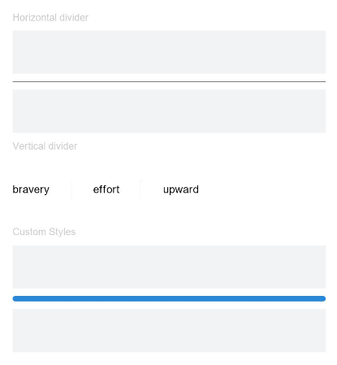

# Divider<a name="ZH-CN_TOPIC_0000001192755128"></a>

> **说明：** 
>该组件从API Version 7开始支持。后续版本如有新增内容，则采用上角标单独标记该内容的起始版本。

提供分隔器组件，分隔不同内容块/内容元素。

## 权限列表<a name="section781125411508"></a>

无

## 子组件<a name="section171053164519"></a>

无

## 接口<a name="section314622835214"></a>

Divider\(\)

## 属性<a name="section065712415316"></a>

<table><thead align="left"><tr><th class="cellrowborder" valign="top" width="14.540000000000001%" id="mcps1.1.5.1.1"><p>名称</p>
</th>
<th class="cellrowborder" valign="top" width="14.82%" id="mcps1.1.5.1.2"><p>参数类型</p>
</th>
<th class="cellrowborder" valign="top" width="9.64%" id="mcps1.1.5.1.3"><p>默认值</p>
</th>
<th class="cellrowborder" valign="top" width="61%" id="mcps1.1.5.1.4"><p>描述</p>
</th>
</tr>
</thead>
<tbody><tr><td class="cellrowborder" valign="top" width="14.540000000000001%" headers="mcps1.1.5.1.1 "><p>vertical</p>
</td>
<td class="cellrowborder" valign="top" width="14.82%" headers="mcps1.1.5.1.2 "><p>boolean</p>
</td>
<td class="cellrowborder" valign="top" width="9.64%" headers="mcps1.1.5.1.3 "><p>false</p>
</td>
<td class="cellrowborder" valign="top" width="61%" headers="mcps1.1.5.1.4 "><p>使用水平分割线还是垂直分割线，false: 水平分割线， true:垂直分割线。</p>
</td>
</tr>
<tr><td class="cellrowborder" valign="top" width="14.540000000000001%" headers="mcps1.1.5.1.1 "><p>color</p>
</td>
<td class="cellrowborder" valign="top" width="14.82%" headers="mcps1.1.5.1.2 "><p>Color</p>
</td>
<td class="cellrowborder" valign="top" width="9.64%" headers="mcps1.1.5.1.3 "><p>-</p>
</td>
<td class="cellrowborder" valign="top" width="61%" headers="mcps1.1.5.1.4 "><p>设置分割线颜色。</p>
</td>
</tr>
<tr><td class="cellrowborder" valign="top" width="14.540000000000001%" headers="mcps1.1.5.1.1 "><p>strokeWidth</p>
</td>
<td class="cellrowborder" valign="top" width="14.82%" headers="mcps1.1.5.1.2 "><p>Length</p>
</td>
<td class="cellrowborder" valign="top" width="9.64%" headers="mcps1.1.5.1.3 "><p>1</p>
</td>
<td class="cellrowborder" valign="top" width="61%" headers="mcps1.1.5.1.4 "><p>设置分割线宽度。</p>
</td>
</tr>
<tr><td class="cellrowborder" valign="top" width="14.540000000000001%" headers="mcps1.1.5.1.1 "><p>lineCap</p>
</td>
<td class="cellrowborder" valign="top" width="14.82%" headers="mcps1.1.5.1.2 "><p><a href="ts-appendix-enums.md#section549694781614">LineCapStyle</a></p>
</td>
<td class="cellrowborder" valign="top" width="9.64%" headers="mcps1.1.5.1.3 "><p>Butt</p>
</td>
<td class="cellrowborder" valign="top" width="61%" headers="mcps1.1.5.1.4 "><p>设置分割线条的端点样式，默认为Butt。</p>
</td>
</tr>
</tbody>
</table>

## 事件<a name="section8567175225417"></a>

不支持通用事件。

## 示例<a name="section18551123820541"></a>

```
@Entry
@Component
struct DividerExample {
  build() {
    Flex({ direction: FlexDirection.Column, alignItems: ItemAlign.Start, justifyContent: FlexAlign.SpaceBetween }) {
      Text('Horizontal divider').fontSize(9).fontColor(0xCCCCCC)
      Row().width('100%').height(40).backgroundColor(0xF1F3F5)
      Divider()
      Row().width('100%').height(40).backgroundColor(0xF1F3F5)

      Text('Vertical divider').fontSize(9).fontColor(0xCCCCCC)
      Flex({ alignItems: ItemAlign.Center, wrap: FlexWrap.Wrap }) {
        Text('bravery')
        Divider().vertical(true).margin(20).height(15)
        Text('effort')
        Divider().vertical(true).margin(20).height(15)
        Text('upward')
      }.width(250)

      Text('Custom Styles').fontSize(9).fontColor(0xCCCCCC)
      Row().width('100%').height(40).backgroundColor(0xF1F3F5)
      Divider().vertical(false).strokeWidth(5).color(0x2788D9).lineCap(LineCapStyle.Round)
      Row().width('100%').height(40).backgroundColor(0xF1F3F5)
    }.width('100%').height(350).padding({ left: 35, right: 35, top: 35 })
  }
}
```



