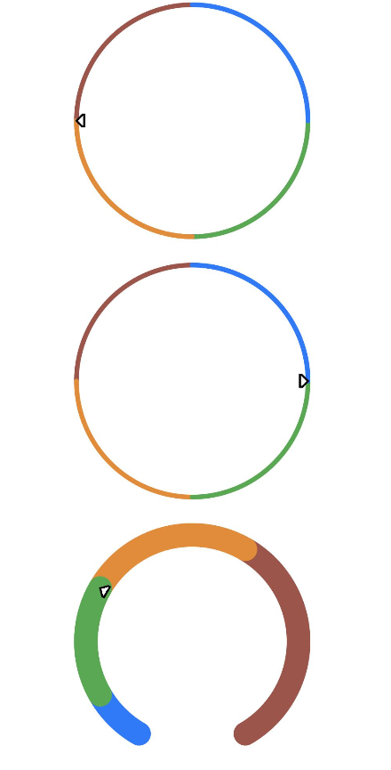

# Gauge<a name="ZH-CN_TOPIC_0000001237715089"></a>

> **说明：** 
>该组件从API Version 8开始支持。后续版本如有新增内容，则采用上角标单独标记该内容的起始版本。

数据量规图表组件，用于将数据展示为环形图表。

## 权限列表<a name="section781125411508"></a>

无

## 子组件<a name="section19640115511114"></a>

无

## 接口<a name="section5420929101113"></a>

Gauge\(value:\{value: number, min?: number, max?: number\}\)

-   参数

    <table><thead align="left"><tr><th class="cellrowborder" valign="top" width="16.21%" id="mcps1.1.6.1.1"><p>参数名</p>
    </th>
    <th class="cellrowborder" valign="top" width="13.91%" id="mcps1.1.6.1.2"><p>参数类型</p>
    </th>
    <th class="cellrowborder" valign="top" width="14.499999999999998%" id="mcps1.1.6.1.3"><p>必填</p>
    </th>
    <th class="cellrowborder" valign="top" width="13.170000000000002%" id="mcps1.1.6.1.4"><p>默认值</p>
    </th>
    <th class="cellrowborder" valign="top" width="42.21%" id="mcps1.1.6.1.5"><p>参数描述</p>
    </th>
    </tr>
    </thead>
    <tbody><tr><td class="cellrowborder" valign="top" width="16.21%" headers="mcps1.1.6.1.1 "><p>value</p>
    </td>
    <td class="cellrowborder" valign="top" width="13.91%" headers="mcps1.1.6.1.2 "><p>number</p>
    </td>
    <td class="cellrowborder" valign="top" width="14.499999999999998%" headers="mcps1.1.6.1.3 "><p>是</p>
    </td>
    <td class="cellrowborder" valign="top" width="13.170000000000002%" headers="mcps1.1.6.1.4 "><p>-</p>
    </td>
    <td class="cellrowborder" valign="top" width="42.21%" headers="mcps1.1.6.1.5 "><p>当前数据值。</p>
    </td>
    </tr>
    <tr><td class="cellrowborder" valign="top" width="16.21%" headers="mcps1.1.6.1.1 "><p>min</p>
    </td>
    <td class="cellrowborder" valign="top" width="13.91%" headers="mcps1.1.6.1.2 "><p>number</p>
    </td>
    <td class="cellrowborder" valign="top" width="14.499999999999998%" headers="mcps1.1.6.1.3 "><p>否</p>
    </td>
    <td class="cellrowborder" valign="top" width="13.170000000000002%" headers="mcps1.1.6.1.4 "><p>0</p>
    </td>
    <td class="cellrowborder" valign="top" width="42.21%" headers="mcps1.1.6.1.5 "><p>当前数据段最小值。</p>
    </td>
    </tr>
    <tr><td class="cellrowborder" valign="top" width="16.21%" headers="mcps1.1.6.1.1 "><p>max</p>
    </td>
    <td class="cellrowborder" valign="top" width="13.91%" headers="mcps1.1.6.1.2 "><p>number</p>
    </td>
    <td class="cellrowborder" valign="top" width="14.499999999999998%" headers="mcps1.1.6.1.3 "><p>否</p>
    </td>
    <td class="cellrowborder" valign="top" width="13.170000000000002%" headers="mcps1.1.6.1.4 "><p>100</p>
    </td>
    <td class="cellrowborder" valign="top" width="42.21%" headers="mcps1.1.6.1.5 "><p>当前数据段最大值。</p>
    </td>
    </tr>
    </tbody>
    </table>


## 属性<a name="section49201029171417"></a>

<table><thead align="left"><tr><th class="cellrowborder" valign="top" width="19.02%" id="mcps1.1.5.1.1"><p>名称</p>
</th>
<th class="cellrowborder" valign="top" width="27.169999999999998%" id="mcps1.1.5.1.2"><p>参数类型</p>
</th>
<th class="cellrowborder" valign="top" width="12.24%" id="mcps1.1.5.1.3"><p>默认值</p>
</th>
<th class="cellrowborder" valign="top" width="41.57%" id="mcps1.1.5.1.4"><p>描述</p>
</th>
</tr>
</thead>
<tbody><tr><td class="cellrowborder" valign="top" width="19.02%" headers="mcps1.1.5.1.1 "><p>value</p>
</td>
<td class="cellrowborder" valign="top" width="27.169999999999998%" headers="mcps1.1.5.1.2 "><p>number</p>
</td>
<td class="cellrowborder" valign="top" width="12.24%" headers="mcps1.1.5.1.3 "><p>0</p>
</td>
<td class="cellrowborder" valign="top" width="41.57%" headers="mcps1.1.5.1.4 "><p>设置当前数据图表的值。</p>
</td>
</tr>
<tr><td class="cellrowborder" valign="top" width="19.02%" headers="mcps1.1.5.1.1 "><p>startAngle</p>
</td>
<td class="cellrowborder" valign="top" width="27.169999999999998%" headers="mcps1.1.5.1.2 "><p>Angle</p>
</td>
<td class="cellrowborder" valign="top" width="12.24%" headers="mcps1.1.5.1.3 "><p>-150</p>
</td>
<td class="cellrowborder" valign="top" width="41.57%" headers="mcps1.1.5.1.4 "><p>设置起始角度位置，时钟0点为0度，顺时针方向为正角度。</p>
</td>
</tr>
<tr><td class="cellrowborder" valign="top" width="19.02%" headers="mcps1.1.5.1.1 "><p>endAngle</p>
</td>
<td class="cellrowborder" valign="top" width="27.169999999999998%" headers="mcps1.1.5.1.2 "><p>Angle</p>
</td>
<td class="cellrowborder" valign="top" width="12.24%" headers="mcps1.1.5.1.3 "><p>150</p>
</td>
<td class="cellrowborder" valign="top" width="41.57%" headers="mcps1.1.5.1.4 "><p>设置终止角度位置，时钟0点为0度，顺时针方向为正角度。</p>
</td>
</tr>
<tr><td class="cellrowborder" valign="top" width="19.02%" headers="mcps1.1.5.1.1 "><p>colors</p>
</td>
<td class="cellrowborder" valign="top" width="27.169999999999998%" headers="mcps1.1.5.1.2 "><p>Color | Array&lt;ColorStop&gt;</p>
</td>
<td class="cellrowborder" valign="top" width="12.24%" headers="mcps1.1.5.1.3 "><p>-</p>
</td>
<td class="cellrowborder" valign="top" width="41.57%" headers="mcps1.1.5.1.4 "><p>设置图表的颜色，支持纯色和分段渐变色设置。</p>
</td>
</tr>
<tr><td class="cellrowborder" valign="top" width="19.02%" headers="mcps1.1.5.1.1 "><p>strokeWidth</p>
</td>
<td class="cellrowborder" valign="top" width="27.169999999999998%" headers="mcps1.1.5.1.2 "><p>Length</p>
</td>
<td class="cellrowborder" valign="top" width="12.24%" headers="mcps1.1.5.1.3 "><p>-</p>
</td>
<td class="cellrowborder" valign="top" width="41.57%" headers="mcps1.1.5.1.4 "><p>设置环形图表的环形厚度。</p>
</td>
</tr>
</tbody>
</table>

## 示例<a name="section1951681592110"></a>

```
@Entry
@Component
struct GaugeExample {
  build() {
    Column() {
      Gauge({ value: 50, min: 0, max: 100 })
        .startAngle(210).endAngle(150)
        .colors([[0x317AF7, 1], [0x5BA854, 1], [0xE08C3A, 1], [0x9C554B, 1], [0xD94838, 1]])
        .strokeWidth(20)
        .width(200).height(200)
    }.width('100%').margin({ top: 5 })
  }
}
```



