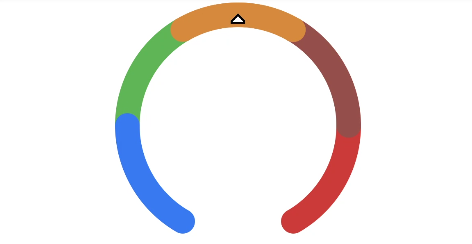

# Gauge

数据量规图表组件，用于将数据展示为环形图表。


>  **说明：**
>
>  该组件从API Version 8开始支持。后续版本如有新增内容，则采用上角标单独标记该内容的起始版本。


## 子组件

无


## 接口

Gauge(options:{value: number, min?: number, max?: number})

**参数：**

| 参数名 | 参数类型 | 必填 | 参数描述 |
| -------- | -------- | -------- | -------- |
| value | number | 是 | 当前数据值。 |
| min | number | 否 | 当前数据段最小值。<br/>默认值：0 |
| max | number | 否 | 当前数据段最大值。<br/>默认值：100 |

## 属性

除支持[通用属性](ts-universal-attributes-size.md)外，还支持以下属性：

| 名称 | 参数类型 | 描述 |
| -------- | -------- | -------- |
| value | number | 设置当前数据图表的值。<br/>默认值：0 |
| startAngle | number | 设置起始角度位置，时钟0点为0度，顺时针方向为正角度。<br/>默认值：-150 |
| endAngle | number | 设置终止角度位置，时钟0点为0度，顺时针方向为正角度。<br/>默认值：150 |
| colors | Array&lt;ColorStop&gt; | 设置图表的颜色，支持分段颜色设置。 |
| strokeWidth | Length | 设置环形图表的环形厚度。 |

## ColorStop

颜色断点类型，用于描述渐进色颜色断点。

| 名称      | 类型定义             | 描述                                                         |
| --------- | -------------------- | ------------------------------------------------------------ |
| ColorStop | [[ResourceColor](../../ui/ts-types.md#resourcecolor8),&nbsp;number] | 描述渐进色颜色断点类型，第一个参数为颜色值，第二个参数为0~1之间的比例值。 |


## 示例


```ts
// xxx.ets
@Entry
@Component
struct GaugeExample {
  build() {
    Column() {
      Gauge({ value: 50, min: 0, max: 100 })
        .startAngle(210).endAngle(150)
        .colors([[0x317AF7, 1], [0x5BA854, 1], [0xE08C3A, 1], [0x9C554B, 1], [0xD94838, 1]])
        .strokeWidth(20)
        .width(200).height(200)
    }.width('100%').margin({ top: 5 })
  }
}
```


