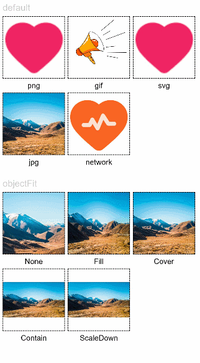
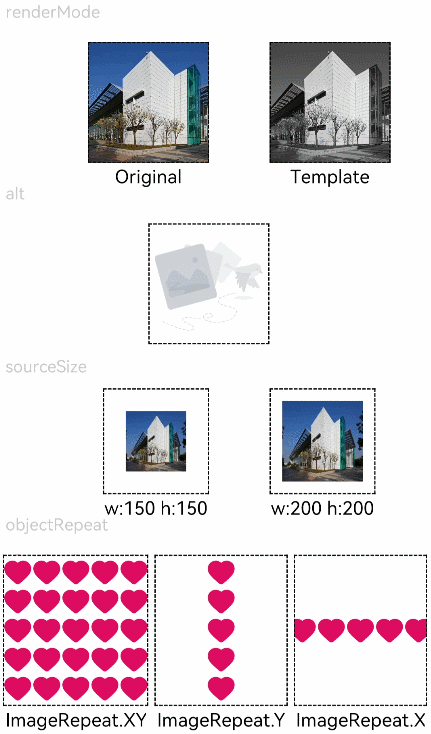

# Image<a name="ZH-CN_TOPIC_0000001237555109"></a>

> **说明：** 
>该组件从API Version 7开始支持。后续版本如有新增内容，则采用上角标单独标记该内容的起始版本。

图片组件，用来渲染展示图片。

## 权限列表<a name="section1662116135572"></a>

ohos.permission.INTERNET（使用网络图片）

## 子组件<a name="section057112518574"></a>

无

## 接口<a name="section15735153218576"></a>

Image\(value: \{uri: string | PixelMap\}\)

-   参数

    <table><thead align="left"><tr><th class="cellrowborder" valign="top" width="12.7%" id="mcps1.1.6.1.1"><p>参数名</p>
    </th>
    <th class="cellrowborder" valign="top" width="19.46%" id="mcps1.1.6.1.2"><p>参数类型</p>
    </th>
    <th class="cellrowborder" valign="top" width="10.96%" id="mcps1.1.6.1.3"><p>必填</p>
    </th>
    <th class="cellrowborder" valign="top" width="9.86%" id="mcps1.1.6.1.4"><p>默认值</p>
    </th>
    <th class="cellrowborder" valign="top" width="47.02%" id="mcps1.1.6.1.5"><p>参数描述</p>
    </th>
    </tr>
    </thead>
    <tbody><tr><td class="cellrowborder" valign="top" width="12.7%" headers="mcps1.1.6.1.1 "><p>uri</p>
    </td>
    <td class="cellrowborder" valign="top" width="19.46%" headers="mcps1.1.6.1.2 "><p>string</p>
    </td>
    <td class="cellrowborder" valign="top" width="10.96%" headers="mcps1.1.6.1.3 "><p>是</p>
    </td>
    <td class="cellrowborder" valign="top" width="9.86%" headers="mcps1.1.6.1.4 "><p>-</p>
    </td>
    <td class="cellrowborder" valign="top" width="47.02%" headers="mcps1.1.6.1.5 "><p>图片的uri，支持本地图片和网络路径。</p>
    </td>
    </tr>
    </tbody>
    </table>


## 属性<a name="section1749314421802"></a>

<table><thead align="left"><tr><th class="cellrowborder" valign="top" width="14.899999999999999%" id="mcps1.1.5.1.1"><p>名称</p>
</th>
<th class="cellrowborder" valign="top" width="17.62%" id="mcps1.1.5.1.2"><p>参数类型</p>
</th>
<th class="cellrowborder" valign="top" width="17.46%" id="mcps1.1.5.1.3"><p>默认值</p>
</th>
<th class="cellrowborder" valign="top" width="50.019999999999996%" id="mcps1.1.5.1.4"><p>描述</p>
</th>
</tr>
</thead>
<tbody><tr><td class="cellrowborder" valign="top" width="14.899999999999999%" headers="mcps1.1.5.1.1 "><p>alt</p>
</td>
<td class="cellrowborder" valign="top" width="17.62%" headers="mcps1.1.5.1.2 "><p>string</p>
</td>
<td class="cellrowborder" valign="top" width="17.46%" headers="mcps1.1.5.1.3 "><p>-</p>
</td>
<td class="cellrowborder" valign="top" width="50.019999999999996%" headers="mcps1.1.5.1.4 "><p>加载时显示的占位图。支持本地图片和网络路径。</p>
</td>
</tr>
<tr><td class="cellrowborder" valign="top" width="14.899999999999999%" headers="mcps1.1.5.1.1 "><p>objectFit</p>
</td>
<td class="cellrowborder" valign="top" width="17.62%" headers="mcps1.1.5.1.2 "><p><a href="#li2939204152619">ImageFit</a></p>
</td>
<td class="cellrowborder" valign="top" width="17.46%" headers="mcps1.1.5.1.3 "><p>Cover</p>
</td>
<td class="cellrowborder" valign="top" width="50.019999999999996%" headers="mcps1.1.5.1.4 "><p>设置图片的缩放类型。</p>
</td>
</tr>
<tr><td class="cellrowborder" valign="top" width="14.899999999999999%" headers="mcps1.1.5.1.1 "><p>objectRepeat</p>
</td>
<td class="cellrowborder" valign="top" width="17.62%" headers="mcps1.1.5.1.2 "><p><a href="ts-appendix-enums.md#section5656191941718">ImageRepeat</a></p>
</td>
<td class="cellrowborder" valign="top" width="17.46%" headers="mcps1.1.5.1.3 "><p>NoRepeat</p>
</td>
<td class="cellrowborder" valign="top" width="50.019999999999996%" headers="mcps1.1.5.1.4 "><p>设置图片的重复样式。</p>
<div class="note"><span class="notetitle"> 说明： </span><div class="notebody"><ul><li>SVG类型图源不支持该属性。</li></ul>
</div></div>
</td>
</tr>
<tr><td class="cellrowborder" valign="top" width="14.899999999999999%" headers="mcps1.1.5.1.1 "><p>interpolation</p>
</td>
<td class="cellrowborder" valign="top" width="17.62%" headers="mcps1.1.5.1.2 "><p><a href="#li3882486263">ImageInterpolation</a></p>
</td>
<td class="cellrowborder" valign="top" width="17.46%" headers="mcps1.1.5.1.3 "><p>None</p>
</td>
<td class="cellrowborder" valign="top" width="50.019999999999996%" headers="mcps1.1.5.1.4 "><p>设置图片的插值效果，仅针对图片放大插值。</p>
<div class="note"><span class="notetitle"> 说明： </span><div class="notebody"><ul><li>SVG类型图源不支持该属性。</li><li>PixelMap资源不支持该属性。</li></ul>
</div></div>
</td>
</tr>
<tr><td class="cellrowborder" valign="top" width="14.899999999999999%" headers="mcps1.1.5.1.1 "><p>renderMode</p>
</td>
<td class="cellrowborder" valign="top" width="17.62%" headers="mcps1.1.5.1.2 "><p><a href="#li174151754162611">ImageRenderMode</a></p>
</td>
<td class="cellrowborder" valign="top" width="17.46%" headers="mcps1.1.5.1.3 "><p>Original</p>
</td>
<td class="cellrowborder" valign="top" width="50.019999999999996%" headers="mcps1.1.5.1.4 "><p>设置图片渲染的模式。</p>
<div class="note"><span class="notetitle"> 说明： </span><div class="notebody"><ul><li>SVG类型图源不支持该属性。</li></ul>
</div></div>
</td>
</tr>
<tr><td class="cellrowborder" valign="top" width="14.899999999999999%" headers="mcps1.1.5.1.1 "><p>sourceSize</p>
</td>
<td class="cellrowborder" valign="top" width="17.62%" headers="mcps1.1.5.1.2 "><p>{</p>
<p>width: number,</p>
<p>height: number</p>
<p>}</p>
</td>
<td class="cellrowborder" valign="top" width="17.46%" headers="mcps1.1.5.1.3 "><p>-</p>
</td>
<td class="cellrowborder" valign="top" width="50.019999999999996%" headers="mcps1.1.5.1.4 "><p>设置图片解码尺寸，将原始图片解码成指定尺寸的图片，number类型单位为px。</p>
<div class="note"><span class="notetitle"> 说明： </span><div class="notebody"><p>PixelMap资源不支持该属性。</p>
</div></div>
</td>
</tr>
<tr><td class="cellrowborder" valign="top" width="14.899999999999999%" headers="mcps1.1.5.1.1 "><p>syncLoad<sup><span>8+</span></sup></p>
</td>
<td class="cellrowborder" valign="top" width="17.62%" headers="mcps1.1.5.1.2 "><p>boolean</p>
</td>
<td class="cellrowborder" valign="top" width="17.46%" headers="mcps1.1.5.1.3 "><p>false</p>
</td>
<td class="cellrowborder" valign="top" width="50.019999999999996%" headers="mcps1.1.5.1.4 "><p>设置是否同步加载图片，默认是异步加载。同步加载时阻塞UI线程，不会显示占位图。</p>
</td>
</tr>
</tbody>
</table>

-   <a name="li2939204152619"></a>ImageFit枚举说明

    <table><thead align="left"><tr><th class="cellrowborder" valign="top" width="25.2%" id="mcps1.1.3.1.1"><p>名称</p>
    </th>
    <th class="cellrowborder" valign="top" width="74.8%" id="mcps1.1.3.1.2"><p>描述</p>
    </th>
    </tr>
    </thead>
    <tbody><tr><td class="cellrowborder" valign="top" width="25.2%" headers="mcps1.1.3.1.1 "><p>Cover</p>
    </td>
    <td class="cellrowborder" valign="top" width="74.8%" headers="mcps1.1.3.1.2 "><p>保持宽高比进行缩小或者放大，使得图片两边都大于或等于显示边界。</p>
    </td>
    </tr>
    <tr><td class="cellrowborder" valign="top" width="25.2%" headers="mcps1.1.3.1.1 "><p>Contain</p>
    </td>
    <td class="cellrowborder" valign="top" width="74.8%" headers="mcps1.1.3.1.2 "><p>保持宽高比进行缩小或者放大，使得图片完全显示在显示边界内。</p>
    </td>
    </tr>
    <tr><td class="cellrowborder" valign="top" width="25.2%" headers="mcps1.1.3.1.1 "><p>Fill</p>
    </td>
    <td class="cellrowborder" valign="top" width="74.8%" headers="mcps1.1.3.1.2 "><p>不保持宽高比进行放大缩小，使得图片填充满显示边界。</p>
    </td>
    </tr>
    <tr><td class="cellrowborder" valign="top" width="25.2%" headers="mcps1.1.3.1.1 "><p>None</p>
    </td>
    <td class="cellrowborder" valign="top" width="74.8%" headers="mcps1.1.3.1.2 "><p>保持原有尺寸显示。通常配合objectRepeat属性一起使用。</p>
    </td>
    </tr>
    <tr><td class="cellrowborder" valign="top" width="25.2%" headers="mcps1.1.3.1.1 "><p>ScaleDown</p>
    </td>
    <td class="cellrowborder" valign="top" width="74.8%" headers="mcps1.1.3.1.2 "><p>保持宽高比显示，图片缩小或者保持不变。</p>
    </td>
    </tr>
    </tbody>
    </table>


-   <a name="li3882486263"></a>ImageInterpolation枚举说明

    <table><thead align="left"><tr><th class="cellrowborder" valign="top" width="25.2%" id="mcps1.1.3.1.1"><p>名称</p>
    </th>
    <th class="cellrowborder" valign="top" width="74.8%" id="mcps1.1.3.1.2"><p>描述</p>
    </th>
    </tr>
    </thead>
    <tbody><tr><td class="cellrowborder" valign="top" width="25.2%" headers="mcps1.1.3.1.1 "><p>None</p>
    </td>
    <td class="cellrowborder" valign="top" width="74.8%" headers="mcps1.1.3.1.2 "><p>不使用插值图片数据。</p>
    </td>
    </tr>
    <tr><td class="cellrowborder" valign="top" width="25.2%" headers="mcps1.1.3.1.1 "><p>High</p>
    </td>
    <td class="cellrowborder" valign="top" width="74.8%" headers="mcps1.1.3.1.2 "><p>高度使用插值图片数据，可能会影响图片渲染的速度。</p>
    </td>
    </tr>
    <tr><td class="cellrowborder" valign="top" width="25.2%" headers="mcps1.1.3.1.1 "><p>Medium</p>
    </td>
    <td class="cellrowborder" valign="top" width="74.8%" headers="mcps1.1.3.1.2 "><p>中度使用插值图片数据。</p>
    </td>
    </tr>
    <tr><td class="cellrowborder" valign="top" width="25.2%" headers="mcps1.1.3.1.1 "><p>Low</p>
    </td>
    <td class="cellrowborder" valign="top" width="74.8%" headers="mcps1.1.3.1.2 "><p>低度使用插值图片数据。</p>
    </td>
    </tr>
    </tbody>
    </table>


-   <a name="li174151754162611"></a>ImageRenderMode枚举说明

    <table><thead align="left"><tr><th class="cellrowborder" valign="top" width="25.2%" id="mcps1.1.3.1.1"><p>名称</p>
    </th>
    <th class="cellrowborder" valign="top" width="74.8%" id="mcps1.1.3.1.2"><p>描述</p>
    </th>
    </tr>
    </thead>
    <tbody><tr><td class="cellrowborder" valign="top" width="25.2%" headers="mcps1.1.3.1.1 "><p>Original</p>
    </td>
    <td class="cellrowborder" valign="top" width="74.8%" headers="mcps1.1.3.1.2 "><p>按照原图进行渲染，包括颜色。</p>
    </td>
    </tr>
    <tr><td class="cellrowborder" valign="top" width="25.2%" headers="mcps1.1.3.1.1 "><p>Template</p>
    </td>
    <td class="cellrowborder" valign="top" width="74.8%" headers="mcps1.1.3.1.2 "><p>将图像渲染为模板图像，忽略图片的颜色信息。</p>
    </td>
    </tr>
    </tbody>
    </table>


## 事件<a name="section68973361117"></a>

<table><thead align="left"><tr><th class="cellrowborder" colspan="2" valign="top" id="mcps1.1.4.1.1"><p>名称</p>
</th>
<th class="cellrowborder" valign="top" id="mcps1.1.4.1.2"><p>功能描述</p>
</th>
</tr>
</thead>
<tbody><tr><td class="cellrowborder" colspan="2" valign="top" headers="mcps1.1.4.1.1 "><p>onComplete(callback: (event?: { width: number, height: number, componentWidth: number, componentHeight: number, loadingStatus: number }) =&gt; void)</p>
</td>
<td class="cellrowborder" valign="top" headers="mcps1.1.4.1.2 "><p>图片成功加载时触发该回调，返回成功加载的图源尺寸。</p>
</td>
</tr>
<tr><td class="cellrowborder" colspan="2" valign="top" headers="mcps1.1.4.1.1 "><p>onError(callback: (event?: { componentWidth: number, componentHeight: number }) =&gt; void)</p>
</td>
<td class="cellrowborder" valign="top" headers="mcps1.1.4.1.2 "><p>图片加载出现异常时触发该回调。</p>
</td>
</tr>
<tr><td class="cellrowborder" colspan="2" valign="top" headers="mcps1.1.4.1.1 "><p>onFinish(callback: () =&gt; void)</p>
</td>
<td class="cellrowborder" valign="top" headers="mcps1.1.4.1.2 "><p>当加载的源文件为带动效的svg图片时，当svg动效播放完成时会触发这个回调，如果动效为无限循环动效，则不会触发这个回调。</p>
</td>
</tr>
</tbody>
</table>

## 示例<a name="section6664181981216"></a>

```
// Image1
@Entry
@Component
struct ImageExample1 {
  private on: string = 'http://uxd.rnd.huawei.com/uxIcon/file/2021-08/d2d6e6c6-043f-471e-80e3-57199142201e.svg'
  @State src: string = this.on

  build() {
    Column() {
      Flex({ direction: FlexDirection.Column, alignItems: ItemAlign.Start }) {
        Text('default').fontSize(16).fontColor(0xcccccc).height(30)
        Row({ space: 5 }) {
          Image($r('app.media.ic_png'))
            .width(110).height(110).border({ width: 1 }).borderStyle(BorderStyle.Dashed)
            .overlay('png', { align: Alignment.Bottom, offset: { x: 0, y: 20 } })
          Image($r('app.media.ic_gif'))
            .width(110).height(110).border({ width: 1 }).borderStyle(BorderStyle.Dashed)
            .overlay('gif', { align: Alignment.Bottom, offset: { x: 0, y: 20 } })
          Image($r('app.media.ic_svg'))
            .width(110).height(110).border({ width: 1 }).borderStyle(BorderStyle.Dashed)
            .overlay('svg', { align: Alignment.Bottom, offset: { x: 0, y: 20 } })
        }
        Row({ space: 5 }) {
          Image($r('app.media.img_example'))
            .width(110).height(110).border({ width: 1 }).borderStyle(BorderStyle.Dashed)
            .overlay('jpg', { align: Alignment.Bottom, offset: { x: 0, y: 20 } })
          Image(this.src)
            .width(110).height(110).border({ width: 1 }).borderStyle(BorderStyle.Dashed)
            .overlay('network', { align: Alignment.Bottom, offset: { x: 0, y: 20 } })
        }.margin({ top: 25, bottom: 10 })
      }

      Flex({ direction: FlexDirection.Column, alignItems: ItemAlign.Start }) {
        Text('objectFit').fontSize(16).fontColor(0xcccccc).height(30)
        Row({ space: 5 }) {
          Image($r('app.media.img_example'))
            .border({ width: 1 }).borderStyle(BorderStyle.Dashed)
            .objectFit(ImageFit.None).width(110).height(110)
            .overlay('None', { align: Alignment.Bottom, offset: { x: 0, y: 20 } })
          Image($r('app.media.img_example'))
            .border({ width: 1 }).borderStyle(BorderStyle.Dashed)
            .objectFit(ImageFit.Fill).width(110).height(110)
            .overlay('Fill', { align: Alignment.Bottom, offset: { x: 0, y: 20 } })
          Image($r('app.media.img_example'))
            .border({ width: 1 }).borderStyle(BorderStyle.Dashed)
            .objectFit(ImageFit.Cover).width(110).height(110)
            .overlay('Cover', { align: Alignment.Bottom, offset: { x: 0, y: 20 } })
        }
        Row({ space: 5 }) {
          Image($r('app.media.img_example_w250'))
            .border({ width: 1 }).borderStyle(BorderStyle.Dashed)
            .objectFit(ImageFit.Contain).width(110).height(110)
            .overlay('Contain', { align: Alignment.Bottom, offset: { x: 0, y: 20 } })
          Image($r('app.media.img_example_w250'))
            .border({ width: 1 }).borderStyle(BorderStyle.Dashed)
            .objectFit(ImageFit.ScaleDown).width(110).height(110)
            .overlay('ScaleDown', { align: Alignment.Bottom, offset: { x: 0, y: 20 } })
        }.margin({ top: 25 })
      }
    }.height(320).width(360).padding({ right: 10, top: 10 })
  }
}
```



```
// Image2
@Entry
@Component
struct ImageExample2 {
  @State width: number = 100
  @State height: number = 100

  build() {
    Column({ space: 10 }) {
      Text('renderMode').fontSize(12).fontColor(0xcccccc).width('96%').height(30)
      Row({ space: 50 }) {
        Image($r('app.media.img_example'))
          .renderMode(ImageRenderMode.Original).width(100).height(100)
          .border({ width: 1 }).borderStyle(BorderStyle.Dashed)
          .overlay('Original', { align: Alignment.Bottom, offset: { x: 0, y: 20 } })
        Image($r('app.media.img_example'))
          .renderMode(ImageRenderMode.Template).width(100).height(100)
          .border({ width: 1 }).borderStyle(BorderStyle.Dashed)
          .overlay('Template', { align: Alignment.Bottom, offset: { x: 0, y: 20 } })
      }

      Text('alt').fontSize(12).fontColor(0xcccccc).width('96%').height(30)
      Image('')
        .alt($r('app.media.Image_none'))
        .width(100).height(100).border({ width: 1 }).borderStyle(BorderStyle.Dashed)

      Text('sourceSize').fontSize(12).fontColor(0xcccccc).width('96%')
      Row({ space: 50 }) {
        Image($r('app.media.img_example'))
          .sourceSize({
            width: 150,
            height: 150
          })
          .objectFit(ImageFit.ScaleDown).width('25%').aspectRatio(1)
          .border({ width: 1 }).borderStyle(BorderStyle.Dashed)
          .overlay('w:150 h:150', { align: Alignment.Bottom, offset: { x: 0, y: 20 } })
        Image($r('app.media.img_example'))
          .sourceSize({
            width: 200,
            height: 200
          })
          .objectFit(ImageFit.ScaleDown).width('25%').aspectRatio(1)
          .border({ width: 1 }).borderStyle(BorderStyle.Dashed)
          .overlay('w:200 h:200', { align: Alignment.Bottom, offset: { x: 0, y: 20 } })
      }

      Text('objectRepeat').fontSize(12).fontColor(0xcccccc).width('96%').height(30)
      Row({ space: 5 }) {
        Image($r('app.media.ic_health_heart'))
          .width(120).height(125).border({ width: 1 }).borderStyle(BorderStyle.Dashed)
          .objectRepeat(ImageRepeat.XY).objectFit(ImageFit.ScaleDown)
          .overlay('ImageRepeat.XY', { align: Alignment.Bottom, offset: { x: 0, y: 20 } })
        Image($r('app.media.ic_health_heart'))
          .width(110).height(125).border({ width: 1 }).borderStyle(BorderStyle.Dashed)
          .objectRepeat(ImageRepeat.Y).objectFit(ImageFit.ScaleDown)
          .overlay('ImageRepeat.Y', { align: Alignment.Bottom, offset: { x: 0, y: 20 } })
        Image($r('app.media.ic_health_heart'))
          .width(110).height(125).border({ width: 1 }).borderStyle(BorderStyle.Dashed)
          .objectRepeat(ImageRepeat.X).objectFit(ImageFit.ScaleDown)
          .overlay('ImageRepeat.X', { align: Alignment.Bottom, offset: { x: 0, y: 20 } })
      }
    }.height(150).width('100%').padding({ right: 10 })
  }
}
```



```
// Image3
@Entry
@Component
struct ImageExample3 {
  @State width: number = 0
  @State height: number = 0
  private on: Resource = $r('app.media.wifi_on')
  private off: Resource = $r('app.media.wifi_off')
  private on2off: Resource = $r('app.media.wifi_on2off')
  private off2on: Resource = $r('app.media.wifi_off2on')
  @State src: Resource = this.on

  build() {
    Column() {
      Row({ space: 20 }) {
        Column() {
          Image($r('app.media.img_example1'))
            .alt($r('app.media.ic_public_picture'))
            .sourceSize({
              width: 900,
              height: 900
            })
            .objectFit(ImageFit.Cover)
            .height(180).width(180)
            .onComplete((msg: { width: number,height: number }) => {
              this.width = msg.width
              this.height = msg.height
            })
            .onError(() => {
              console.log('load image fail')
            })
            .overlay('\nwidth: ' + String(this.width) + ' height: ' + String(this.height), {
              align: Alignment.Bottom,
              offset: { x: 0, y: 20 }
            })
        }

        Image(this.src)
          .width(120).height(120)
          .onClick(() => {
            if (this.src == this.on || this.src == this.off2on) {
              this.src = this.on2off
            } else {
              this.src = this.off2on
            }
          })
          .onFinish(() => {
            if (this.src == this.off2on) {
              this.src = this.on
            } else {
              this.src = this.off
            }
          })
      }
    }.width('100%')
  }
}
```

