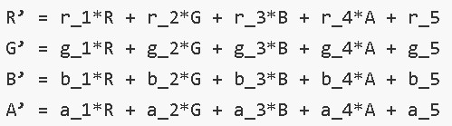

# Image

Image为图片组件，常用于在应用中显示图片。Image支持加载string、&nbsp;[PixelMap](../apis/js-apis-image.md#pixelmap7)和[Resource](ts-types.md#resource类型)类型的数据源，支持png、jpg、bmp、svg和gif类型的图片格式。

> **说明：**
>
> 该组件从API Version 7开始支持。后续版本如有新增内容，则采用上角标单独标记该内容的起始版本。


## 需要权限

使用网络图片时，需要申请权限ohos.permission.INTERNET。具体申请方式请参考[权限申请声明](../../security/accesstoken-guidelines.md)。


## 子组件

无


## 接口

Image(src: string | PixelMap | Resource)

通过图片数据源获取图片，用于后续渲染展示。

Image组件加载图片失败或图片尺寸为0时，图片组件大小自动为0，不跟随父组件的布局约束。

从API version 9开始，该接口支持在ArkTS卡片中使用。

**参数：** 

| 参数名  | 参数类型                                     | 必填   | 参数描述                                     |
| ---- | ---------------------------------------- | ---- | ---------------------------------------- |
| src  | string\|&nbsp;[PixelMap](../apis/js-apis-image.md#pixelmap7)&nbsp;\|&nbsp;[Resource](ts-types.md#resource类型) | 是    | 图片的数据源，支持本地图片和网络图片，引用方式请参考[加载图片资源](../../ui/arkts-graphics-display.md#加载图片资源)。<br>1. string格式可用于加载网络图片和本地图片，常用于加载网络图片。当使用相对路径引用本地图片时，例如Image("common/test.jpg")，不支持跨包/跨模块调用该Image组件，建议使用Resource格式来管理需全局使用的图片资源。<br>- 支持`Base64`字符串。格式`data:image/[png\|jpeg\|bmp\|webp];base64,[base64 data]`, 其中`[base64 data]`为`Base64`字符串数据。<br>- 支持file://路径前缀的字符串。用于读取本应用安装目录下files文件夹下的图片资源。需要保证目录包路径下的文件有可读权限。<br>2. PixelMap格式为像素图，常用于图片编辑的场景。<br>3. Resource格式可以跨包/跨模块访问资源文件，是访问本地图片的推荐方式。<br>**说明：**<br/>- ArkTS卡片上支持gif图片格式动效，但仅在显示时播放一次。<br/>- ArkTS卡片上不支持http://等网络相关路径前缀和file://路径前缀的字符串。<br/>- ArkTS卡片上不支持&nbsp;[PixelMap](../apis/js-apis-image.md#pixelmap7)类型。 |

## 属性

属性的详细使用指导请参考[添加属性](../../ui/arkts-graphics-display.md#添加属性)。除支持[通用属性](ts-universal-attributes-size.md)外，还支持以下属性：

| 名称                       | 参数类型                                     | 描述                                       |
| ------------------------ | ---------------------------------------- | ---------------------------------------- |
| alt                      | string \| [Resource](ts-types.md#resource类型) | 加载时显示的占位图，支持本地图片（png、jpg、bmp、svg和gif类型），不支持网络图片。<br>默认值：null<br>从API version 9开始，该接口支持在ArkTS卡片中使用。 |
| objectFit                | [ImageFit](ts-appendix-enums.md#imagefit) | 设置图片的缩放类型。<br/>默认值：ImageFit.Cover<br/>从API version 9开始，该接口支持在ArkTS卡片中使用。 |
| objectRepeat             | [ImageRepeat](ts-appendix-enums.md#imagerepeat) | 设置图片的重复样式。从中心点向两边重复，剩余空间不足放下一张图片时会截断。<br/>默认值：ImageRepeat.NoRepeat<br/>从API version 9开始，该接口支持在ArkTS卡片中使用。<br/>**说明：**<br/>svg类型图源不支持该属性。 |
| interpolation            | [ImageInterpolation](#imageinterpolation) | 设置图片的插值效果，即减轻低清晰度图片在放大显示的时候出现的锯齿问题，仅针对图片放大插值。<br/>默认值：ImageInterpolation.None<br/>从API version 9开始，该接口支持在ArkTS卡片中使用。<br/>**说明：**<br/>svg类型图源不支持该属性。<br/>PixelMap资源不支持该属性。 |
| renderMode               | [ImageRenderMode](#imagerendermode)      | 设置图片的渲染模式为原色或黑白。<br/>默认值：ImageRenderMode.Original<br/>从API version 9开始，该接口支持在ArkTS卡片中使用。<br/>**说明：** <br/>svg类型图源不支持该属性。 |
| sourceSize               | {<br/>width:&nbsp;number,<br/>height:&nbsp;number<br/>} | 设置图片解码尺寸，降低图片的分辨率，常用于需要让图片显示尺寸比组件尺寸更小的场景。和ImageFit.None配合使用时可在组件内显示小图。<br/>单位：px<br>从API version 9开始，该接口支持在ArkTS卡片中使用。<br/>**说明：**<br/>仅在目标尺寸小于图源尺寸时生效。<br>svg类型图源不支持该属性。<br>PixelMap资源不支持该属性。 |
| matchTextDirection       | boolean                                  | 设置图片是否跟随系统语言方向，在RTL语言环境下显示镜像翻转显示效果。<br/>默认值：false<br/>从API version 9开始，该接口支持在ArkTS卡片中使用。 |
| fitOriginalSize          | boolean                                  | 图片组件尺寸未设置时，其显示尺寸是否跟随图源尺寸。<br/>默认值：false<br/>从API version 9开始，该接口支持在ArkTS卡片中使用。 |
| fillColor                | [ResourceColor](ts-types.md#resourcecolor) | 设置填充颜色，设置后填充颜色会覆盖在图片上。<br/>从API version 9开始，该接口支持在ArkTS卡片中使用。<br>**说明：** <br>仅对svg图源生效，设置后会替换svg图片的填充颜色。 |
| autoResize               | boolean                                  | 设置图片解码过程中是否对图源自动缩放。设置为true时，组件会根据显示区域的尺寸决定用于绘制的图源尺寸，有利于减少内存占用。如原图大小为1920x1080，而显示区域大小为200x200，则图片会自动解码到200x200的尺寸，大幅度节省图片占用的内存。<br/>默认值：true<br/>从API version 9开始，该接口支持在ArkTS卡片中使用。 |
| syncLoad<sup>8+</sup>    | boolean                                  | 设置是否同步加载图片，默认是异步加载。同步加载时阻塞UI线程，不会显示占位图。<br/>默认值：false<br/>从API version 9开始，该接口支持在ArkTS卡片中使用。<br>**说明：**<br>建议加载尺寸较小的本地图片时将syncLoad设为true，因为耗时较短，在主线程上执行即可。 |
| copyOption<sup>9+</sup>  | [CopyOptions](ts-appendix-enums.md#copyoptions9) | 设置图片是否可复制。<br>当copyOption设置为非CopyOptions.None时，支持使用长按、鼠标右击、快捷组合键'CTRL+C'等方式进行复制。<br>默认值：CopyOptions.None<br/>从API version 9开始，该接口支持在ArkTS卡片中使用。<br>**说明：**<br>svg图片不支持复制。 |
| colorFilter<sup>9+</sup> | [ColorFilter](ts-types.md#colorfilter9)  | 给图像设置颜色滤镜效果，入参为一个的4x5的RGBA转换矩阵。<br/>矩阵第一行表示R（红色）的向量值，第二行表示G（绿色）的向量值，第三行表示B（蓝色）的向量值，第四行表示A（透明度）的向量值，4行分别代表不同的RGBA的向量值。<br>RGBA值分别是0和1之间的浮点数字，当矩阵对角线值为1时，保持图片原有色彩。<br> **计算规则：**<br>如果输入的滤镜矩阵为：<br><br>像素点为[R, G, B, A]<br>则过滤后的颜色为 [R’, G’, B’, A’]<br><br>从API version 9开始，该接口支持在ArkTS卡片中使用。 |
| draggable<sup>9+</sup>   | boolean                                  | 设置组件默认拖拽效果，设置为true时，组件可拖拽。<br>不能和[onDragStart](ts-universal-events-drag-drop.md)事件同时使用。<br/>默认值：false |

>  **说明：**
>
>  - 使用快捷组合键对Image组件复制时，Image组件必须处于[获焦状态](../../ui/arkts-common-events-focus-event.md#设置组件是否获焦)。Image组件默认不获焦，需将[focusable](ts-universal-attributes-focus.md)属性设置为true，即可使用TAB键将焦点切换到组件上，再将[focusOnTouch](ts-universal-attributes-focus.md)属性设置为true，即可实现点击获焦。
>  - 图片设置为svg图源时，当前支持的标签是svg、rect、circle、ellipse、path、line、polyline和polygon。

## ImageInterpolation

从API version 9开始，该接口支持在ArkTS卡片中使用。

| 名称     | 描述                         |
| ------ | -------------------------- |
| None   | 不使用图片插值。                   |
| High   | 高图片插值，插值质量最高，可能会影响图片渲染的速度。 |
| Medium | 中图片插值。                     |
| Low    | 低图片插值。                     |

## ImageRenderMode

从API version 9开始，该接口支持在ArkTS卡片中使用。

| 名称       | 描述      |
| -------- | ------- |
| Original | 原色渲染模式。 |
| Template | 黑白渲染模式。 |

## 事件

除支持[通用事件](ts-universal-events-click.md)外，还支持以下事件：

### onComplete

onComplete(callback: (event?: { width: number, height: number, componentWidth: number, componentHeight: number, loadingStatus: number }) =&gt; void)

图片数据加载成功和解码成功时均触发该回调，返回成功加载的图片尺寸。

从API version 9开始，该接口支持在ArkTS卡片中使用。

**参数：**

| 参数名             | 类型     | 说明                                       |
| --------------- | ------ | ---------------------------------------- |
| width           | number | 图片的宽。<br/>单位：像素                          |
| height          | number | 图片的高。<br/>单位：像素                          |
| componentWidth  | number | 组件的宽。<br/>单位：像素                          |
| componentHeight | number | 组件的高。<br/>单位：像素                          |
| loadingStatus   | number | 图片加载成功的状态值。<br/>**说明：**<br/>返回的状态值为0时，表示图片数据加载成功。返回的状态值为1时，表示图片解码成功。 |


### onError

onError(callback: (event?: { componentWidth: number, componentHeight: number , message: string }) =&gt; void)

图片加载异常时触发该回调。

从API version 9开始，该接口支持在ArkTS卡片中使用。

**参数：**

| 参数名                  | 类型     | 说明              |
| -------------------- | ------ | --------------- |
| componentWidth       | number | 组件的宽。<br/>单位：像素 |
| componentHeight      | number | 组件的高。<br/>单位：像素 |
| message<sup>9+</sup> | string | 报错信息。           |


### onFinish

onFinish(event: () =&gt; void)

当加载的源文件为带动效的svg格式图片时，svg动效播放完成时会触发这个回调。如果动效为无限循环动效，则不会触发这个回调。

仅支持svg格式的图片。

从API version 9开始，该接口支持在ArkTS卡片中使用。

## 示例

### 加载基本类型图片


```ts
@Entry
@Component
struct ImageExample1 {
  build() {
    Column() {
      Flex({ direction: FlexDirection.Column, alignItems: ItemAlign.Start }) {
        Row() {
          // 加载png格式图片
          Image($r('app.media.ic_camera_master_ai_leaf'))
            .width(110).height(110).margin(15)
            .overlay('png', { align: Alignment.Bottom, offset: { x: 0, y: 20 } })
          // 加载gif格式图片
          Image($r('app.media.loading'))
            .width(110).height(110).margin(15)
            .overlay('gif', { align: Alignment.Bottom, offset: { x: 0, y: 20 } })
        }
        Row() {
          // 加载svg格式图片
          Image($r('app.media.ic_camera_master_ai_clouded'))
            .width(110).height(110).margin(15)
            .overlay('svg', { align: Alignment.Bottom, offset: { x: 0, y: 20 } })
          // 加载jpg格式图片
          Image($r('app.media.ic_public_favor_filled'))
            .width(110).height(110).margin(15)
            .overlay('jpg', { align: Alignment.Bottom, offset: { x: 0, y: 20 } })
        }
      }
    }.height(320).width(360).padding({ right: 10, top: 10 })
  }
}
```


### 加载网络图片

加载网络图片时，默认网络超时是5分钟，建议使用alt配置加载时的占位图。如果需要更灵活的网络配置，可以使用[HTTP](../../connectivity/http-request.md)工具包发送网络请求，接着将返回的数据解码为Image组件中的`PixelMap`，图片开发可参考[图片处理](../../media/image-overview.md)。

使用网络图片时，需要申请权限ohos.permission.INTERNET。具体申请方式请参考[权限申请声明](../../security/accesstoken-guidelines.md)。

```ts
@Entry
@Component
struct ImageExample2 {
  build() {
    Column({ space: 10 }) {
      Image("https://www.example.com/xxx.png")// 直接加载网络地址，请填写一个具体的网络图片地址
        .alt($r('app.media.icon'))// 使用alt，在网络图片加载成功前使用占位图
        .width(100)
        .height(100)
    }
  }
}
```


### 为图片添加事件


```ts
@Entry
@Component
struct ImageExample3 {
  @State widthValue: number = 0;
  @State heightValue: number = 0;
  private on: Resource = $r('app.media.image_on');
  private off: Resource = $r('app.media.image_off');
  private on2off: Resource = $r('app.media.image_on2off');
  private off2on: Resource = $r('app.media.image_off2on');
  @State src: Resource = this.on;

  build() {
    Column() {
      Row({ space: 20 }) {
        Column() {
          Image($r('app.media.img_example1'))
            .alt($r('app.media.ic_public_picture'))
            .sourceSize({
              width: 900,
              height: 900
            })
            .objectFit(ImageFit.Cover)
            .height(180).width(180)
            // 图片加载完成后，获取图片尺寸。
            .onComplete((msg: { width: number,height: number }) => {
              this.widthValue = msg.width
              this.heightValue = msg.height
            })
            .onError(() => {
              console.log('load image fail')
            })
            .overlay('\nwidth: ' + String(this.widthValue) + ' height: ' + String(this.heightValue), {
              align: Alignment.Bottom,
              offset: { x: 0, y: 20 }
            })
        }
        // 为图片添加点击事件，点击完成后加载特定图片
        Image(this.src)
          .width(120).height(120)
          .onClick(() => {
            if (this.src == this.on || this.src == this.off2on) {
              this.src = this.on2off
            } else {
              this.src = this.off2on
            }
          })
          .onFinish(() => {
            if (this.src == this.off2on) {
              this.src = this.on
            } else {
              this.src = this.off
            }
          })
      }
    }.width('100%')
  }
}
```

