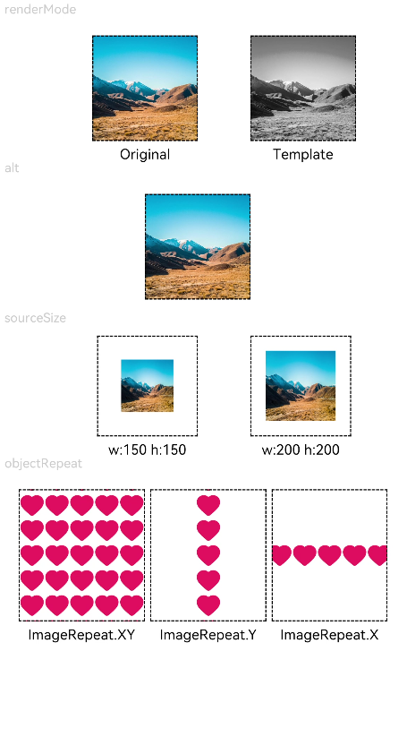
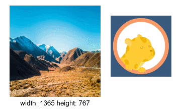

# Image

图片组件，支持本地图片和网络图片的渲染展示。

> **说明：**
>
> 该组件从API Version 7开始支持。后续版本如有新增内容，则采用上角标单独标记该内容的起始版本。


## 需要权限

使用网络图片时，需要申请权限ohos.permission.INTERNET。具体申请方式请参考[权限申请声明](../../security/accesstoken-guidelines.md)。


## 子组件

无


## 接口

Image(src: PixelMap | ResourceStr | DrawableDescriptor)

通过图片数据源获取图片，用于后续渲染展示。Image组件加载图片失败或图片尺寸为0时，图片组件大小自动为0，不跟随父组件的布局约束。

从API version 9开始，该接口支持在ArkTS卡片中使用。

**参数：** 

| 参数名  | 参数类型                                     | 必填   | 参数描述                                     |
| ---- | ---------------------------------------- | ---- | ---------------------------------------- |
| src  | &nbsp;[PixelMap](../apis/js-apis-image.md#pixelmap7)&nbsp;\|ResourceStr\|&nbsp;[DrawableDescriptor](../apis/js-apis-arkui-drawableDescriptor.md#drawabledescriptor) | 是    | 图片的数据源，支持本地图片和网络图片。<br/>当使用相对路径引用图片资源时，例如`Image("common/test.jpg")`，不支持跨包/跨模块调用该Image组件，建议使用`$r`方式来管理需全局使用的图片资源。<br/>\- 支持的图片格式包括png、jpg、bmp、svg和gif。<br/>\- 支持`Base64`字符串。格式`data:image/[png\|jpeg\|bmp\|webp];base64,[base64 data]`, 其中`[base64 data]`为`Base64`字符串数据。<br/>\- 支持`datashare://`路径前缀的字符串，用于访问通过data&nbsp;ability提供的图片路径。<br/>\- 支持file:///data/storage路径前缀的字符串，用于读取本应用安装目录下files文件夹下的图片资源。需要保证目录包路径下的文件有可读权限。<br/>\- 支持[DrawableDescriptor](../apis/js-apis-arkui-drawableDescriptor.md#drawabledescriptor)对象<br/>- 详细使用方法可参考[显示图片](../../ui/arkts-graphics-display.md)<br/>**说明：**<br/>- ArkTS卡片上支持gif图片格式动效，但仅在显示时播放一次。<br/>- ArkTS卡片上不支持`http://`等网络相关路径前缀、`datashare://`路径前缀以及`file://data/storage`路径前缀的字符串<br/>- ArkTS卡片上不支持&nbsp;[PixelMap](../apis/js-apis-image.md#pixelmap7)类型 |

## 属性

除支持[通用属性](ts-universal-attributes-size.md)外，还支持以下属性：

| 名称                       | 参数类型                                     | 描述                                       |
| ------------------------ | ---------------------------------------- | ---------------------------------------- |
| alt                      | string \| [Resource](ts-types.md#resource类型) | 加载时显示的占位图，支持本地图片。<br/>从API version 9开始，该接口支持在ArkTS卡片中使用。 |
| objectFit                | [ImageFit](ts-appendix-enums.md#imagefit) | 设置图片的缩放类型。<br/>默认值：ImageFit.Cover<br/>从API version 9开始，该接口支持在ArkTS卡片中使用。 |
| objectRepeat             | [ImageRepeat](ts-appendix-enums.md#imagerepeat) | 设置图片的重复样式。<br/>默认值：ImageRepeat.NoRepeat<br/>从API version 9开始，该接口支持在ArkTS卡片中使用。<br/>**说明：**<br/>svg类型图源不支持该属性。 |
| interpolation            | [ImageInterpolation](#imageinterpolation) | 设置图片的插值效果，即减轻低清晰度图片在放大显示的时候出现的锯齿问题，仅针对图片放大插值。<br/>默认值：ImageInterpolation.None<br/>从API version 9开始，该接口支持在ArkTS卡片中使用。<br/>**说明：**<br/>svg类型图源不支持该属性。<br/>PixelMap资源不支持该属性。 |
| renderMode               | [ImageRenderMode](#imagerendermode)      | 设置图片渲染的模式。<br/>默认值：ImageRenderMode.Original<br/>从API version 9开始，该接口支持在ArkTS卡片中使用。<br/>**说明：**<br/>svg类型图源不支持该属性。 |
| sourceSize               | {<br/>width:&nbsp;number,<br/>height:&nbsp;number<br/>} | 设置图片裁剪尺寸，将原始图片解码成pixelMap，指定尺寸的图片，单位为px。<br/>从API version 9开始，该接口支持在ArkTS卡片中使用。<br/>**说明：**<br/>PixelMap资源和SVG图片不支持该属性。 |
| matchTextDirection       | boolean                                  | 设置图片是否跟随系统语言方向，在RTL语言环境下显示镜像翻转显示效果。<br/>默认值：false<br/>从API version 9开始，该接口支持在ArkTS卡片中使用。 |
| fitOriginalSize          | boolean                                  | 图片组件尺寸未设置时，其显示尺寸是否跟随图源尺寸。<br/>默认值：false<br/>从API version 9开始，该接口支持在ArkTS卡片中使用。 |
| fillColor                | [ResourceColor](ts-types.md#resourcecolor) | 填充颜色。设置的填充颜色会覆盖在图片上。仅对svg图源生效，设置后会替换svg图片的fill颜色。<br/>从API version 9开始，该接口支持在ArkTS卡片中使用。 |
| autoResize               | boolean                                  | 是否需要在图片解码过程中对图源做resize操作，该操作会根据显示区域的尺寸决定用于绘制的图源尺寸，有利于减少内存占用。<br/>默认值：true<br/>从API version 9开始，该接口支持在ArkTS卡片中使用。 |
| syncLoad<sup>8+</sup>    | boolean                                  | 设置是否同步加载图片，默认是异步加载。同步加载时阻塞UI线程，不会显示占位图。<br/>默认值：false<br/>从API version 9开始，该接口支持在ArkTS卡片中使用。 |
| copyOption<sup>9+</sup>  | [CopyOptions](ts-appendix-enums.md#copyoptions9) | 设置图片是否可复制（SVG图片不支持复制）。<br/>当copyOption设置为非CopyOptions.None时，支持使用长按、鼠标右击、快捷组合键'CTRL+C'等方式进行复制。<br/>默认值：CopyOptions.None<br/>该接口支持在ArkTS卡片中使用。 |
| colorFilter<sup>9+</sup> | [ColorFilter](ts-types.md#colorfilter9)  | 给图像设置颜色滤镜效果。<br/>该接口支持在ArkTS卡片中使用。       |

>  **说明：**
>
>  使用快捷组合键对Image组件复制的前提是，该组件必须处于获焦状态。将Image组件的属性focusable设置为true，即可使用TAB键将焦点切换到Image组件上，再将Image组件的focusOnTouch属性设置为true，即可实现点击获焦。
>  图片设置svg图源时，支持的标签范围有限，目前支持的svg标签包括svg、rect、circle、ellipse、path、line、polyline、polygon。

### ImageInterpolation

从API version 9开始，该接口支持在ArkTS卡片中使用。

| 名称     | 描述                        |
| ------ | ------------------------- |
| None   | 不使用插值图片数据。                |
| High   | 插值图片数据的使用率高，可能会影响图片渲染的速度。 |
| Medium | 插值图片数据的使用率中。              |
| Low    | 插值图片数据的使用率低。              |

### ImageRenderMode

从API version 9开始，该接口支持在ArkTS卡片中使用。

| 名称       | 描述                    |
| -------- | --------------------- |
| Original | 按照原图进行渲染，包括颜色。        |
| Template | 将图片渲染为模板图片，忽略图片的颜色信息。 |

## 事件

除支持[通用事件](ts-universal-events-click.md)外，还支持以下事件：

| 名称                                       | 功能描述                                     |
| ---------------------------------------- | ---------------------------------------- |
| onComplete(callback:&nbsp;(event?:&nbsp;{&nbsp;width:&nbsp;number,&nbsp;height:&nbsp;number,&nbsp;componentWidth:&nbsp;number,<br>&nbsp;componentHeight:&nbsp;number,&nbsp;loadingStatus:&nbsp;number&nbsp;})&nbsp;=&gt;&nbsp;void) | 图片成功加载时触发该回调，返回成功加载的图片尺寸。<br>- width：图片的宽，单位为像素。<br/>- height：图片的高，单位为像素。<br/>- componentWidth：组件的宽，单位为像素。<br/>- componentHeight：组件的高，单位为像素。<br/>- loadingStatus：图片加载成功的状态。<br/>从API version 9开始，该接口支持在ArkTS卡片中使用。<br/>**说明：** <br/>loadingStatus返回的状态值为0时，代表图片加载失败；返回的状态值为1时，代表图片加载成功。 |
| onError(callback:&nbsp;(event?:&nbsp;{&nbsp;componentWidth:&nbsp;number,&nbsp;componentHeight:&nbsp;number&nbsp;, message<sup>9+</sup>: string })&nbsp;=&gt;&nbsp;void) | 图片加载出现异常时触发该回调。<br>- componentWidth：组件的宽，单位为像素。<br/>- componentHeight：组件的高，单位为像素。<br/>从API version 9开始，该接口支持在ArkTS卡片中使用。 |
| onFinish(event:&nbsp;()&nbsp;=&gt;&nbsp;void) | 当加载的源文件为带动效的svg图片时，当svg动效播放完成时会触发这个回调，如果动效为无限循环动效，则不会触发这个回调。<br/>从API version 9开始，该接口支持在ArkTS卡片中使用。 |

## 示例

### 图片加载

加载显示不同类型的图片，并设置图片的缩放类型。<br>overlay属性用于设置图片的遮罩文本，具体使用可参考[浮层](ts-universal-attributes-overlay.md)。

```ts
@Entry
@Component
struct ImageExample1 {
  private on: string = 'www.example.com' 
  @State src: string = this.on

  build() {
    Column() {
      Flex({ direction: FlexDirection.Column, alignItems: ItemAlign.Start }) {
        Text('default').fontSize(16).fontColor(0xcccccc).height(30)
        Row({ space: 5 }) {
          Image($r('app.media.ic_png'))
            .width(110).height(110).border({ width: 1 })
            .overlay('png', { align: Alignment.Bottom, offset: { x: 0, y: 20 } })
          Image($r('app.media.ic_gif'))
            .width(110).height(110).border({ width: 1 })
            .overlay('gif', { align: Alignment.Bottom, offset: { x: 0, y: 20 } })
          Image($r('app.media.ic_svg'))
            .width(110).height(110).border({ width: 1 })
            .overlay('svg', { align: Alignment.Bottom, offset: { x: 0, y: 20 } })
        }
        Row({ space: 5 }) {
          Image($r('app.media.img_example'))
            .width(110).height(110).border({ width: 1 })
            .overlay('jpg', { align: Alignment.Bottom, offset: { x: 0, y: 20 } })
          Image(this.src)
            .width(110).height(110).border({ width: 1 })
            .overlay('network', { align: Alignment.Bottom, offset: { x: 0, y: 20 } })
        }.margin({ top: 25, bottom: 10 })
      }

      Flex({ direction: FlexDirection.Column, alignItems: ItemAlign.Start }) {
        Text('objectFit').fontSize(16).fontColor(0xcccccc).height(30)
        Row({ space: 5 }) {
          Image($r('app.media.img_example'))
            .border({ width: 1 })
            .objectFit(ImageFit.None).width(110).height(110)
            .overlay('None', { align: Alignment.Bottom, offset: { x: 0, y: 20 } })
          Image($r('app.media.img_example'))
            .border({ width: 1 })
            .objectFit(ImageFit.Fill).width(110).height(110)
            .overlay('Fill', { align: Alignment.Bottom, offset: { x: 0, y: 20 } })
          Image($r('app.media.img_example'))
            .border({ width: 1 })
            .objectFit(ImageFit.Cover).width(110).height(110)
            .overlay('Cover', { align: Alignment.Bottom, offset: { x: 0, y: 20 } })
        }
        Row({ space: 5 }) {
          Image($r('app.media.img_example_w250'))
            .border({ width: 1 })
            .objectFit(ImageFit.Contain).width(110).height(110)
            .overlay('Contain', { align: Alignment.Bottom, offset: { x: 0, y: 20 } })
          Image($r('app.media.img_example_w250'))
            .border({ width: 1 })
            .objectFit(ImageFit.ScaleDown).width(110).height(110)
            .overlay('ScaleDown', { align: Alignment.Bottom, offset: { x: 0, y: 20 } })
        }.margin({ top: 25 })
      }
    }.height(320).width(360).padding({ right: 10, top: 10 })
  }
}
```


### 网络图片

加载网络图片时，默认网络超时是5分钟，建议使用alt配置加载时的占位图。如果需要更灵活的网络配置，可以使用SDK中提供的[HTTP](../../connectivity/http-request.md)工具包发送网络请求，接着将返回的数据解码为Image组件中的`PixelMap`，图片开发可参考[图片处理](../../media/image-overview.md)。代码如下。

```tsx
// @ts-nocheck
import http from '@ohos.net.http';
import ResponseCode from '@ohos.net.http'
import image from '@ohos.multimedia.image'


@Entry 
@Component 
struct Index {
    
  // 先创建一个PixelMap状态变量用于接收网络图片
  @State image: PixelMap = undefined

  build() {
    Column({space: 10}) {
      Button("获取网络图片")
        .onClick(() => {
          this.httpRequest()
        })
      Image(this.image).height(100).width(100)
    }
    .width('100%')
    .height('100%')
    .padding(10)
  }

  // 网络图片请求方法
  private httpRequest() {
    let httpRequest = http.createHttp()
	
    httpRequest.request(
      "https://www.example.com/xxx.png",   // 请填写一个具体的网络图片地址
      (error, data) => {
        if(error) {
          console.log("error code: " + error.code + ", msg: " + error.message)
        } else {
          let code = data.responseCode
          if(ResponseCode.ResponseCode.OK == code) {
            let imageSource = image.createImageSource(data.result)
            let options = {alphaType: 0,                     // 透明度
                           editable: false,                  // 是否可编辑
                           pixelFormat: 3,                   // 像素格式
                           scaleMode: 1,                     // 缩略值
                           size: {height: 100, width: 100}}  // 创建图片大小
            imageSource.createPixelMap(options).then((pixelMap) => {
              this.image = pixelMap
            })
          } else {
            console.log("response code: " + code)
          }
        }
      }
    )
  }
}
```

**说明**：网络图片加载的请求方式、超时、额外请求参数等配置可以参考HTTP工具包中关于[`request()`](../../reference/apis/js-apis-http.md)请求方法的细节。

### 设置属性

```ts
@Entry
@Component
struct ImageExample2 {

  build() {
    Column({ space: 10 }) {
      Text('renderMode').fontSize(12).fontColor(0xcccccc).width('96%').height(30)
      Row({ space: 50 }) {
        Image($r('app.media.img_example'))
          .renderMode(ImageRenderMode.Original).width(100).height(100)
          .border({ width: 1 })
          .overlay('Original', { align: Alignment.Bottom, offset: { x: 0, y: 20 } })
        Image($r('app.media.img_example'))
          .renderMode(ImageRenderMode.Template).width(100).height(100)
          .border({ width: 1 })
          .overlay('Template', { align: Alignment.Bottom, offset: { x: 0, y: 20 } })
      }
      
      Text('alt').fontSize(12).fontColor(0xcccccc).width('96%').height(30)
      Image('')
        .alt($r('app.media.Image_none'))
        .width(100).height(100).border({ width: 1 })
        
      Text('sourceSize').fontSize(12).fontColor(0xcccccc).width('96%')
      Row({ space: 50 }) {
        Image($r('app.media.img_example'))
          .sourceSize({
            width: 150,
            height: 150
          })
          .objectFit(ImageFit.ScaleDown).width('25%').aspectRatio(1)
          .border({ width: 1 })
          .overlay('w:150 h:150', { align: Alignment.Bottom, offset: { x: 0, y: 20 } })
        Image($r('app.media.img_example'))
          .sourceSize({
            width: 200,
            height: 200
          })
          .objectFit(ImageFit.ScaleDown).width('25%').aspectRatio(1)
          .border({ width: 1 })
          .overlay('w:200 h:200', { align: Alignment.Bottom, offset: { x: 0, y: 20 } })
      }
      
      Text('objectRepeat').fontSize(12).fontColor(0xcccccc).width('96%').height(30)
      Row({ space: 5 }) {
        Image($r('app.media.ic_health_heart'))
          .width(120).height(125).border({ width: 1 })
          .objectRepeat(ImageRepeat.XY).objectFit(ImageFit.ScaleDown)
          .overlay('ImageRepeat.XY', { align: Alignment.Bottom, offset: { x: 0, y: 20 } })
        Image($r('app.media.ic_health_heart'))
          .width(110).height(125).border({ width: 1 })
          .objectRepeat(ImageRepeat.Y).objectFit(ImageFit.ScaleDown)
          .overlay('ImageRepeat.Y', { align: Alignment.Bottom, offset: { x: 0, y: 20 } })
        Image($r('app.media.ic_health_heart'))
          .width(110).height(125).border({ width: 1 })
          .objectRepeat(ImageRepeat.X).objectFit(ImageFit.ScaleDown)
          .overlay('ImageRepeat.X', { align: Alignment.Bottom, offset: { x: 0, y: 20 } })
      }
    }.height(150).width('100%').padding({ right: 10 })
  }
}
```



### 事件调用

```ts
@Entry
@Component
struct ImageExample3 {
  @State widthValue: number = 0
  @State heightValue: number = 0
  private on: Resource = $r('app.media.image_on')
  private off: Resource = $r('app.media.image_off')
  private on2off: Resource = $r('app.media.image_on2off')
  private off2on: Resource = $r('app.media.image_off2on')
  @State src: Resource = this.on

  build() {
    Column() {
      Row({ space: 20 }) {
        Column() {
          Image($r('app.media.img_example1'))
            .alt($r('app.media.ic_public_picture'))
            .sourceSize({
              width: 900,
              height: 900
            })
            .objectFit(ImageFit.Cover)
            .height(180).width(180)
            // 图片加载完成后，获取图片尺寸。
            .onComplete((msg: { width: number,height: number }) => {
              this.widthValue = msg.width
              this.heightValue = msg.height
            })
            .onError(() => {
              console.log('load image fail')
            })
            .overlay('\nwidth: ' + String(this.widthValue) + ' height: ' + String(this.heightValue), {
              align: Alignment.Bottom,
              offset: { x: 0, y: 20 }
            })
        }
        // 为图片添加点击事件，点击完成后加载特定图片。
        Image(this.src)
          .width(120).height(120)
          .onClick(() => {
            if (this.src == this.on || this.src == this.off2on) {
              this.src = this.on2off
            } else {
              this.src = this.off2on
            }
          })
          .onFinish(() => {
            if (this.src == this.off2on) {
              this.src = this.on
            } else {
              this.src = this.off
            }
          })
      }
    }.width('100%')
  }
}
```



###  渲染沙箱路径图片

```ts
import fileio from '@ohos.fileio';
import fs from '@ohos.file.fs';
import context from '@ohos.app.ability.common';

@Entry
@Component
struct LoadImageExample {
  @State resourcesPath: string = ''
  @State sandboxPath: string = ''
  context: context.UIAbilityContext = getContext(this) as context.UIAbilityContext

  build() {
    Column() {
      Button('读取沙箱图片')
        .margin({ bottom: 10, top: 10 })
        .onClick(() => {
          this.sandboxPath = this.context.getApplicationContext().filesDir + '/icon.png'
          console.log(`读取沙箱图片=========>${this.sandboxPath}`)
          let fd = fs.openSync(this.sandboxPath, 0o100)
          console.log(`create file========>${fd}`)
          let srcPath = this.context.bundleCodeDir + '/entry/resources/base/media/icon.png'
          console.log('mySrcpath' + srcPath)
          fileio.copyFileSync(srcPath, this.sandboxPath) // 复制图片到沙箱路径
          this.sandboxPath = 'file://' + this.context.getApplicationContext().filesDir + '/icon.png'
        })
      Button('读取资源图片')
        .margin({ bottom: 10 })
        .onClick(() => {
          this.resourcesPath = 'file://' + this.context.bundleCodeDir + '/entry/resources/base/media/icon.png'
        })
      Text(`资源图片路径:${this.resourcesPath}`)
        .fontSize(20)
        .margin({ bottom: 10 })
      Image(this.resourcesPath)
        .width(100)
        .height(100)
        .colorFilter([
          0.30, 0.59, 0.11, 0, 0,
          0.30, 0.59, 0.11, 0, 0,
          0.30, 0.59, 0.11, 0, 0,
          0, 0, 0, 1.0, 0
        ])
      Text(`沙箱图片路径:${this.sandboxPath}`)
        .fontSize(20)
        .margin({ bottom: 10 })
      Image(this.sandboxPath)
        .width(100)
        .height(100)
    }
    .width('100%').height('100%')
  }
}
```

### 为图片增加滤镜

```ts
// xxx.ets
@Entry
@Component
struct colorFilterExample {
  @State colorFilterR: number = 0
  @State colorFilterG: number = 0
  @State colorFilterB: number = 0
  @State colorFilterA: number = 0

  build() {
    Row() {
      Column() {
        Image($r('app.media.sky'))
          .width(200)
          .height(200)
        Image($r('app.media.sky'))
          .width(200)
          .height(200)
          .colorFilter([
          this.colorFilterR, 0, this.colorFilterR, 0, 0,
            0, this.colorFilterG, this.colorFilterG, 0, 0,
          this.colorFilterB, 0, this.colorFilterB, 0, 0,
            0, 0, this.colorFilterA, 0, 0
          ])

        Row() {
          Text('R')
          Slider({
            min: 0,
            max: 1,
            step: 0.01
          })
            .onChange((valueR) => {
              this.colorFilterR = valueR
            })
        }

        Row() {
          Text('G')
          Slider({
            min: 0,
            max: 1,
            step: 0.01
          })
            .onChange((valueG) => {
              this.colorFilterG = valueG
            })
        }

        Row() {
          Text('B')
          Slider({
            min: 0,
            max: 1,
            step: 0.01
          })
            .onChange((valueB) => {
              this.colorFilterB = valueB
            })
        }

        Row() {
          Text('A')
          Slider({
            min: 0,
            max: 1,
            step: 0.01
          })
            .onChange((valueA) => {
              this.colorFilterA = valueA
            })
        }
      }.width('90%').alignItems(HorizontalAlign.Center)
    }.height('100%').width('100%').justifyContent(FlexAlign.Center)
  }
}
```

