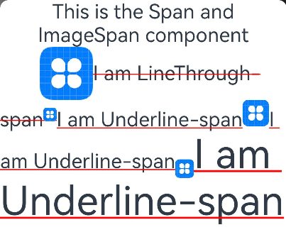

# ImageSpan

[Text](ts-basic-components-text.md)组件的子组件，用于显示行内图片。

>  **说明：**
>
>  该组件从API Version 10开始支持。后续版本如有新增内容，则采用上角标单独标记该内容的起始版本。


## 子组件

无


## 接口

ImageSpan(value: ResourceStr | PixelMap)

**参数：**

| 参数名 | 参数类型 | 必填 | 参数描述 |
| -------- | -------- | -------- | -------- |
| value | [ResourceStr](ts-types.md#ResourceStr) \|&nbsp;[PixelMap](../apis/js-apis-image.md#pixelmap7)&nbsp; | 是 | 图片的数据源，支持本地图片和网络图片。<br/>当使用相对路径引用图片资源时，例如`ImageSpan("common/test.jpg")`，不支持跨包/跨模块调用该ImageSpan组件，建议使用`$r`方式来管理需全局使用的图片资源。<br/>\- 支持的图片格式包括png、jpg、bmp、svg和gif。<br/>\- 支持`Base64`字符串。格式`data:image/[png\|jpeg\|bmp\|webp];base64,[base64 data]`, 其中`[base64 data]`为`Base64`字符串数据。<br/>\- 支持file:///data/storage路径前缀的字符串，用于读取本应用安装目录下files文件夹下的图片资源。需要保证目录包路径下的文件有可读权限。 |


## 属性

[通用属性](ts-universal-attributes-size.md)方法支持尺寸设置、背景设置、边框设置。

| 名称 | 参数类型 | 描述 |
| -------- | -------- | -------- |
| verticalAlign | [ImageSpanAlignment](#imagespanalignment) | 图片基于文本的对齐方式。<br />默认值：ImageSpanAlignment.BOTTOM |
| objectFit | [ImageFit](ts-appendix-enums.md#imagefit) | 设置图片的缩放类型。<br/>默认值：ImageFit.Cover |

## ImageSpanAlignment

| 名称     | 描述                           |
| -------- | ------------------------------ |
| TOP      | 图片上边沿与文本上边沿对齐。   |
| CENTER   | 图片中间与文本中间对齐。       |
| BOTTOM   | 图片下边沿与文本下边沿对齐。   |
| BASELINE | 图片下边沿与文本BaseLine对齐。 |

## 事件

通用事件仅支持[点击事件](ts-universal-attributes-click.md)。

## 示例

```ts
// xxx.ets
@Entry
@Component
struct SpanExample {
  build() {
    Flex({ direction: FlexDirection.Column, alignItems: ItemAlign.Start}) {
      Text() {
        Span('This is the Span and ImageSpan component').fontSize(25).textCase(TextCase.Normal)
          .decoration({ type: TextDecorationType.None, color: Color.Pink })
      }.width('100%').textAlign(TextAlign.Center)
      Text() {
        ImageSpan($r('app.media.icon'))
          .width('200px')
          .height('200px')
          .objectFit(ImageFit.Fill)
          .verticalAlign(ImageSpanAlignment.CENTER)
        Span('I am LineThrough-span')
          .decoration({ type: TextDecorationType.LineThrough, color: Color.Red }).fontSize(25)
        ImageSpan($r('app.media.icon'))
          .width('50px')
          .height('50px')
          .verticalAlign(ImageSpanAlignment.TOP)
        Span('I am Underline-span')
          .decoration({ type: TextDecorationType.Underline, color: Color.Red }).fontSize(25)
        ImageSpan($r('app.media.icon'))
          .size({width:'100px', height:'100px'})
          .verticalAlign(ImageSpanAlignment.BASELINE)
        Span('I am Underline-span')
          .decoration({ type: TextDecorationType.Underline, color: Color.Red }).fontSize(25)
        ImageSpan($r('app.media.icon'))
          .width('70px')
          .height('70px')
          .verticalAlign(ImageSpanAlignment.BOTTOM)
        Span('I am Underline-span')
          .decoration({ type: TextDecorationType.Underline, color: Color.Red }).fontSize(50)
      }
      .width('100%')
      .textIndent(50)
    }.width('100%').height('100%').padding({ left: 0, right: 0, top: 0 })
  }
}
```



