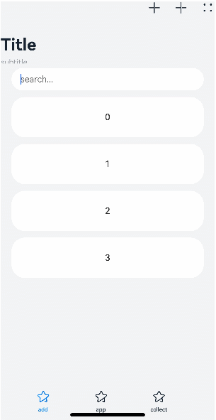

# Navigation

> **说明：**
> 该组件从API Version 8开始支持。后续版本如有新增内容，则采用上角标单独标记该内容的起始版本。


Navigation组件一般作为Page页面的根容器，通过属性设置来展示页面的标题、工具栏、菜单。


## 权限列表

无


## 子组件

可以包含子组件。


## 接口

Navigation()

创建可以根据属性设置，自动展示导航栏、标题、工具栏的组件。


## 属性

| 名称             | 参数类型                                     | 默认值                      | 描述                                       |
| -------------- | ---------------------------------------- | ------------------------ | ---------------------------------------- |
| title          | string&nbsp;\|&nbsp;[CustomBuilder](../../ui/ts-types.md) | -                        | 页面标题。                                    |
| subtitle       | string                                   | -                        | 页面副标题。                                   |
| menus          | Array<NavigationMenuItem&gt;&nbsp;\|&nbsp;[CustomBuilder](../../ui/ts-types.md) | -                        | 页面右上角菜单。                                 |
| titleMode      | NavigationTitleMode                      | NavigationTitleMode.Free | 页面标题栏显示模式。                               |
| toolBar        | {<br/>items:[<br/>Object<br/>]&nbsp;}<br/>\|&nbsp;[CustomBuilder](../../ui/ts-types.md) | -                        | 设置工具栏内容。<br/>items:&nbsp;工具栏所有项。         |
| hideToolBar    | boolean                                  | false                    | 设置隐藏/显示工具栏：<br/>true:&nbsp;隐藏工具栏。<br/>false:&nbsp;显示工具栏。 |
| hideTitleBar   | boolean                                  | false                    | 隐藏标题栏。                                   |
| hideBackButton | boolean                                  | false                    | 隐藏返回键。                                   |

- NavigationMenuItem类型接口说明
  | 名称     | 类型                      | 必填   | 默认值  | 描述              |
  | ------ | ----------------------- | ---- | ---- | --------------- |
  | value  | string                  | 是    | -    | 菜单栏单个选项的显示文本。   |
  | icon   | string                  | 否    | -    | 菜单栏单个选项的图标资源路径。 |
  | action | ()&nbsp;=&gt;&nbsp;void | 否    | -    | 当前选项被选中的事件回调。   |

- Object类型接口说明
  | 名称     | 类型                      | 必填   | 默认值  | 描述              |
  | ------ | ----------------------- | ---- | ---- | --------------- |
  | value  | string                  | 是    | -    | 工具栏单个选项的显示文本。   |
  | icon   | string                  | 否    | -    | 工具栏单个选项的图标资源路径。 |
  | action | ()&nbsp;=&gt;&nbsp;void | 否    | -    | 当前选项被选中的事件回调。   |

- NavigationTitleMode枚举说明
  | 名称   | 描述                                       |
  | ---- | ---------------------------------------- |
  | Free | 当内容为可滚动组件时，标题随着内容向上滚动而缩小（子标题的大小不变、淡出）。向下滚动内容到顶时则恢复原样。 |
  | Mini | 固定为小标题模式（图标+主副标题）。                       |
  | Full | 固定为大标题模式（主副标题）。                          |

  >  **说明：**
  > 目前可滚动组件只支持List。


## 事件

| 名称                                       | 功能描述                                     |
| ---------------------------------------- | ---------------------------------------- |
| onTitleModeChange(callback:&nbsp;(titleMode:&nbsp;NavigationTitleMode)&nbsp;=&gt;&nbsp;void) | 当titleMode为NavigationTitleMode.Free时，随着可滚动组件的滑动标题栏模式发生变化时触发此回调。 |


## 示例

```ts
// xxx.ets
@Entry
@Component
struct NavigationExample {
  private arr: number[] = [0, 1, 2, 3, 4, 5, 6, 7, 8, 9]
  @State hideBar: boolean = true

  @Builder NavigationTitle() {
    Column() {
      Text('title')
        .width(80)
        .height(60)
        .fontColor(Color.Blue)
        .fontSize(30)
    }
    .onClick(() => {
      console.log("title")
    })
  }

  @Builder NavigationMenus() {
    Row() {
      Image('images/add.png')
        .width(25)
        .height(25)
      Image('comment/more.png')
        .width(25)
        .height(25)
        .margin({ left: 30 })
    }.width(100)
  }

  build() {
    Column() {
      Navigation() {
        Search({ value: '', placeholder: "" }).width('85%').margin(26)
        List({ space: 5, initialIndex: 0 }) {
          ForEach(this.arr, (item) => {
            ListItem() {
              Text('' + item)
                .width('90%')
                .height(80)
                .backgroundColor('#3366CC')
                .borderRadius(15)
                .fontSize(16)
                .textAlign(TextAlign.Center)
            }.editable(true)
          }, item => item)
        }
        .listDirection(Axis.Vertical)
        .height(300)
        .margin({ top: 10, left: 18 })
        .width('100%')

        Button(this.hideBar ? "tool bar" : "hide bar")
          .onClick(() => {
            this.hideBar = !this.hideBar
          })
          .margin({ left: 135, top: 60 })
      }
      .title(this.NavigationTitle)
      .subTitle('subtitle')
      .menus(this.NavigationMenus)
      .titleMode(NavigationTitleMode.Free)
      .hideTitleBar(false)
      .hideBackButton(false)
      .onTitleModeChange((titleModel: NavigationTitleMode) => {
        console.log('titleMode')
      })
      .toolBar({ items: [
        { value: 'app', icon: 'images/grid.svg', action: () => {
          console.log("app")
        } },
        { value: 'add', icon: 'images/add.svg', action: () => {
          console.log("add")
        } },
        { value: 'collect', icon: 'images/collect.svg', action: () => {
          console.log("collect")
        } }] })
      .hideToolBar(this.hideBar)
    }
  }
}
```


```ts
// xxx.ets
@Entry
@Component
struct ToolbarBuilderExample {
  @State currentIndex: number = 0
  @State Build: Array<Object> = [
    {
      icon: $r('app.media.ic_public_add'),
      icon_after: $r('app.media.ic_public_addcolor'),
      text: 'add',
      num: 0
    },
    {
      icon: $r('app.media.ic_public_app'),
      icon_after: $r('app.media.ic_public_appcolor'),
      text: 'app',
      num: 1
    },
    {
      icon: $r('app.media.ic_public_collect'),
      icon_after: $r('app.media.ic_public_collectcolor'),
      text: 'collect',
      num: 2
    }
  ]

  @Builder NavigationToolbar() {
    Row() {
      ForEach(this.Build, item => {
        Column() {
          Image(this.currentIndex == item.num ? item.icon_after : item.icon)
            .width(25)
            .height(25)
          Text(item.text)
            .fontColor(this.currentIndex == item.num ? "#ff7500" : "#000000")
        }
        .onClick(() => {
          this.currentIndex = item.num
        })
        .margin({ left: 70 })
      })
    }
  }

  build() {
    Column() {
      Navigation() {
        Flex() {
        }
      }
      .toolBar(this.NavigationToolbar)
    }
  }
}
```


