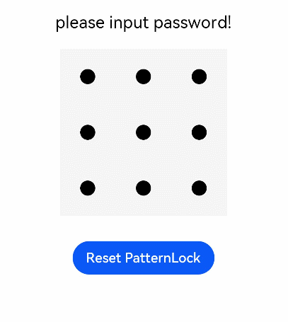

# PatternLock

图案密码锁组件，以九宫格图案的方式输入密码，用于密码验证场景。手指在PatternLock组件区域按下时开始进入输入状态，手指离开屏幕时结束输入状态完成密码输入。

>  **说明：** 
>
> 该组件从API Version 9开始支持。后续版本如有新增内容，则采用上角标单独标记该内容的起始版本。

## 子组件

无

##  接口

PatternLock(controller?: PatternLockController)

**参数:**

| 参数名     | 参数类型                                        | 必填 | 描述                                                         |
| ---------- | ----------------------------------------------- | ---- | ------------------------------------------------------------ |
| controller | [PatternLockController](#patternlockcontroller) | 否   | 设置PatternLock组件控制器，可用于控制组件状态重置。       |

## 属性

除支持[通用属性](ts-universal-attributes-size.md)外，还支持以下属性：

| 名称            | 参数类型                              | 描述                                                         |
| --------------- | ------------------------------------- | ------------------------------------------------------------ |
| sideLength      | [Length](ts-types.md#length)        | 设置组件的宽度和高度（宽高相同）。设置为0或负数时组件不显示。<br/>默认值：288vp |
| circleRadius    | [Length](ts-types.md#length)        | 设置宫格中圆点的半径。设置为0或负数时取默认值。<br/>默认值：6vp                        |
| regularColor    | [ResourceColor](ts-types.md#resourcecolor) | 设置宫格圆点在“未选中”状态的填充颜色。<br/>默认值：'#ff182431' |
| selectedColor   | [ResourceColor](ts-types.md#resourcecolor) | 设置宫格圆点在“选中”状态的填充颜色。<br/>默认值：'#ff182431' |
| activeColor     | [ResourceColor](ts-types.md#resourcecolor) | 设置宫格圆点在“激活”状态的填充颜色（“激活”状态为手指经过圆点但还未选中的状态）。<br/>默认值：'#ff182431' |
| pathColor       | [ResourceColor](ts-types.md#resourcecolor) | 设置连线的颜色。<br/>默认值：'#33182431'           |
| pathStrokeWidth | number&nbsp;\|&nbsp;string            | 设置连线的宽度。设置为0或负数时连线不显示。<br/>默认值：12vp           |
| autoReset       | boolean                               | 设置在完成密码输入后再次在组件区域按下时是否重置组件状态。设置为true，完成密码输入后再次在组件区域按下时会重置组件状态（即清除之前输入的密码）；反之若设置为false，则不会重置组件状态。<br/>默认值：true |

## 事件

除支持[通用事件](ts-universal-events-click.md)外，还支持以下事件：

| 名称                                                         | 描述                                                         |
| ------------------------------------------------------------ | ------------------------------------------------------------ |
| onPatternComplete(callback: (input: Array\<number\>) => void) | 密码输入结束时触发该回调。<br />input: 与选中宫格圆点顺序一致的数字数组，数字为选中宫格圆点的索引值（第一行圆点从左往右依次为0、1、2，第二行圆点依次为3、4、5，第三行圆点依次为6、7、8）。 |
| onDotConnect(callback: Callback\<number\>)<sup>11+</sup>     | 密码输入选中宫格圆点时触发该回调。<br />**说明：**<br />回调参数为选中宫格圆点顺序的数字，数字为选中宫格圆点的索引值（第一行圆点从左往右依次为0、1、2，第二行圆点依次为3、4、5，第三行圆点依次为6、7、8）。 |

## PatternLockController

PatternLock组件的控制器，可以通过它进行组件状态重置。

### 导入对象

```typescript
let patternLockController: PatternLockController = new PatternLockController()
```

### reset

reset(): void

重置组件状态。

### setChallengeResult<sup>11+</sup>

setChallengeResult(result: PatternLockChallengeResult): void

用于设置图案密码正确或错误状态。

| 参数   | 参数类型                                                     | 必填 | 参数描述       |
| ------ | ------------------------------------------------------------ | ---- | -------------- |
| result | [PatternLockChallengeResult](#patternlockchallengeresult11枚举说明) | 是   | 图案密码状态。 |

## PatternLockChallengeResult<sup>11+</sup>枚举说明

| 名称    | 描述           |
| ------- | -------------- |
| CORRECT | 图案密码正确。 |
| WRONG   | 图案密码错误。 |

##  示例

```ts
// xxx.ets
@Entry
@Component
struct PatternLockExample {
  @State passwords: Number[] = []
  @State message: string = 'please input password!'
  private patternLockController: PatternLockController = new PatternLockController()

  build() {
    Column() {
      Text(this.message).textAlign(TextAlign.Center).margin(20).fontSize(20)
      PatternLock(this.patternLockController)
        .sideLength(200)
        .circleRadius(9)
        .pathStrokeWidth(18)
        .activeColor('#B0C4DE')
        .selectedColor('#228B22')
        .pathColor('#90EE90')
        .backgroundColor('#F5F5F5')
        .autoReset(true)
        .onDotConnect((index: number) => {
          console.log("onDotConnect index: " + index)
        })
        .onPatternComplete((input: Array<number>) => {
          // 输入的密码长度小于5时，提示重新输入
          if (input === null || input === undefined || input.length < 5) {
            this.message = 'The password length needs to be greater than 5, please enter again.'
            return
          }
          // 判断密码长度是否大于0
          if (this.passwords.length > 0) {
            // 判断两次输入的密码是否相同，相同则提示密码设置成功，否则提示重新输入
            if (this.passwords.toString() === input.toString()) {
              this.passwords = input
              this.message = 'Set password successfully: ' + this.passwords.toString()
              this.patternLockController.setChallengeResult(PatternLockChallengeResult.CORRECT)
            } else {
              this.message = 'Inconsistent passwords, please enter again.'
              this.patternLockController.setChallengeResult(PatternLockChallengeResult.WRONG)
            }
          } else {
            // 提示第二次输入密码
            this.passwords = input
            this.message = "Please enter again."
          }
        })
      Button('Reset PatternLock').margin(30).onClick(() => {
        // 重置密码锁
        this.patternLockController.reset()
        this.passwords = []
        this.message = 'Please input password'
      })
    }.width('100%').height('100%')
  }
}
```


