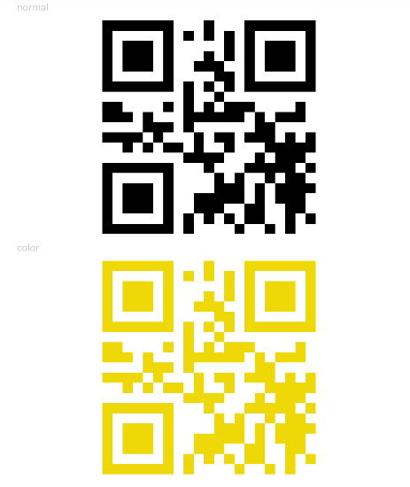

# QRCode

用于显示单个二维码的组件。

>  **说明：**
> 该组件从API Version 7开始支持。后续版本如有新增内容，则采用上角标单独标记该内容的起始版本。


## 权限列表

无


## 子组件

无


## 接口

QRCode(value: string)

- 参数
  | 参数名 | 参数类型 | 必填 | 默认值 | 参数描述 |
  | -------- | -------- | -------- | -------- | -------- |
  | value | string | 是 | - | 二维码内容字符串。 |


## 属性

| 名称 | 参数类型 | 默认值 | 描述 |
| -------- | -------- | -------- | -------- |
| color | Color | Black | 设置二维码颜色。 |


## 事件

通用事件仅支持点击事件。


## 示例

```ts
// xxx.ets
@Entry
@Component
struct QRCodeExample {
  private value: string = 'hello world'

  build() {
    Column({ space: 5 }) {
      Text('normal').fontSize(9).width('90%').fontColor(0xCCCCCC)
      QRCode(this.value).width(200).height(200)

      Text('color').fontSize(9).width('90%').fontColor(0xCCCCCC)
      QRCode(this.value).color(0xF7CE00).width(200).height(200)
    }.width('100%').margin({ top: 5 })
  }
}
```


