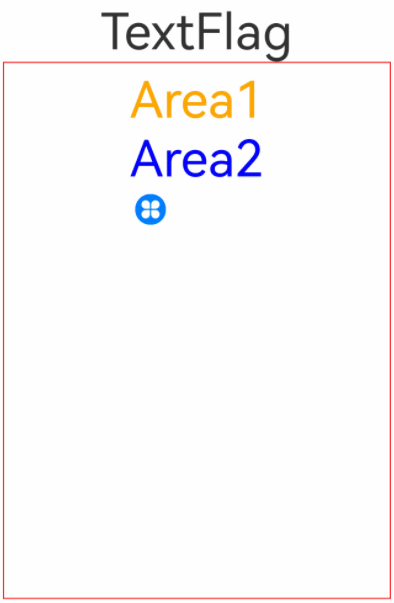

# RichEditor

支持图文混排和文本交互式编辑的组件。

>  **说明：**
>
>  该组件从API Version 10开始支持。后续版本如有新增内容，则采用上角标单独标记该内容的起始版本。
>  RichEditor[仅支持通过onDragStart事件](ts-universal-events-drag-drop.md)实现浮起等拖拽效果。


## 子组件

可以包含[Span](ts-basic-components-span.md)和[ImageSpan](ts-basic-components-imagespan.md)子组件。


## 接口

RichEditor(value: RichEditorOptions)

**参数：**

| 参数名 | 参数类型 | 必填 | 参数描述 |
| -------- | -------- | -------- | -------- |
| value | [RichEditorOptions](#richeditoroptions)  | 是 | 富文本组件初始化选项。 |


## 属性

支持[通用属性](ts-universal-attributes-size.md)。

>  **说明：**
>
> 其中clip属性默认值为true。
> align属性只支持上方丶中间和下方位置的对齐方式。

| 名称                      | 参数类型                                                     | 描述                                                         |
| ------------------------- | ------------------------------------------------------------ | ------------------------------------------------------------ |
| customKeyboard | [CustomBuilder](ts-types.md#custombuilder8) | 设置自定义键盘。<br/>**说明：**<br/>当设置自定义键盘时，输入框激活后不会打开系统输入法，而是加载指定的自定义组件。<br/>自定义键盘的高度可以通过自定义组件根节点的height属性设置，宽度不可设置，使用系统默认值。<br/>自定义键盘采用覆盖原始界面的方式呈现，不会对应用原始界面产生压缩或者上提。<br/>自定义键盘无法获取焦点，但是会拦截手势事件。<br/>默认在输入控件失去焦点时，关闭自定义键盘。 | 
| bindSelectionMenu | {<br/>spantype:&nbsp;[RichEditorSpanType](#richeditorspantype),<br/>content:&nbsp;[CustomBuilder](ts-types.md#custombuilder8),<br/>responseType:&nbsp;[ResponseType](ts-appendix-enums.md#responsetype8)&nbsp;\| [RichEditorResponseType<sup>11+</sup>](ts-appendix-enums.md#richeditorresponsetype11),<br/>options?:&nbsp;[SelectionMenuOptions](#selectionmenuoptions)<br/>} | 设置自定义选择菜单。<br/> 默认值：{<br/>  spanType:&nbsp;RichEditorSpanType:TEXT<br/>responseType:&nbsp;ResponseType.LongPress<br/>其他：空<br/>}|
| copyOptions | [CopyOptions](ts-appendix-enums.md#copyoptions9) | 组件支持设置文本内容是否可复制粘贴。<br />默认值：CopyOptions.LocalDevice <br/>**说明：** <br/>设置copyOptions为CopyOptions.InApp或者CopyOptions.LocalDevice，长按组件内容，会弹出文本默认选择菜单，可选中内容并进行复制、全选操作。<br/>设置copyOptions为CopyOptions.None，复制、剪切功能不生效。  |
## 事件

除支持[通用事件](ts-universal-events-click.md)外，还支持以下事件：

| 名称                                                         | 功能描述                                                     |
| ------------------------------------------------------------ | ------------------------------------------------------------ |
| onReady(callback:&nbsp;()&nbsp;=&gt;&nbsp;void) | 富文本组件初始化完成后，触发回调。 |
| onSelect(callback:&nbsp;(value:&nbsp;[RichEditorSelection](#richeditorselection))&nbsp;=&gt;&nbsp;void) | 鼠标左键按下选择，松开左键后触发回调。<br />- 用手指选择时，松开手指触发回调。 <br />- value：选中的所有span信息。 |
| aboutToIMEInput(callback:&nbsp;(value:&nbsp;[RichEditorInsertValue](#richeditorinsertvalue))&nbsp;=&gt;&nbsp;boolean) | 输入法输入内容前，触发回调。<br />- value：输入法将要输入内容信息。|
| onIMEInputComplete(callback:&nbsp;(value:&nbsp;[RichEditorTextSpanResult](#richeditortextspanresult))&nbsp;=&gt;&nbsp;void) | 输入法输完成输入后，触发回调。<br />- value：输入法完成输入后的文本Span信息。 |
| aboutToDelete(callback:&nbsp;(value:&nbsp;[RichEditorDeleteValue](#richeditordeletevalue))&nbsp;=&gt;&nbsp;boolean) | 输入法删除内容前，触发回调。 <br />- value：准备删除的内容所在的文本Span信息。|
| onDeleteComplete(callback:&nbsp;()&nbsp;=&gt;&nbsp;void) | 输入法完成删除后，触发回调。 |
| onPaste<sup>11+</sup>(callback: (event?: [PasteEvent](#pasteevent)) => void) | 完成粘贴前，触发回调。 <br/>**说明：** <br/>系统的默认粘贴和拖拽行为，只支持纯文本的粘贴。<br/>开发者可以通过该方法，覆盖系统默认行为，实现图文的粘贴。|

## RichEditorInsertValue

插入文本信息。

| 名称 | 类型 | 必填 | 说明 |
| -------- | -------- | -------- | -------- |
| insertOffset | number  | 是 | 插入的文本偏移位置。 |
| insertValue | string  | 是 | 插入的文本内容。 |


## RichEditorDeleteValue

| 名称 | 类型 | 必填 | 说明 |
| -------- | -------- | -------- | -------- |
| offset | number  | 是 | 删除内容的偏移位置。 |
| direction | [RichEditorDeleteDirection](#richeditordeletedirection)  | 是 | 删除操作的方向。 |
| length | number | 是 | 删除内容长度。 |
| richEditorDeleteSpans | Array<[RichEditorTextSpanResult](#richeditortextspanresult) \| [RichEditorImageSpanResult](#richeditorimagespanresult)> | 是 | 删除的文本或者图片Span的具体信息。 |


## RichEditorDeleteDirection

删除操作的方向。

| 名称    | 描述                          |
| -------- | ------------------------------ |
| BACKWARD      | 向后删除。  |
| FORWARD   | 向前删除。      |


## RichEditorTextSpanResult

文本Span信息。

| 名称 | 类型 | 必填 | 说明 |
| -------- | -------- | -------- | -------- |
| spanPosition | [RichEditorSpanPosition](#richeditorspanposition)  | 是 | Span位置。 |
| value | string | 是 | 文本Span内容。 |
| textStyle | [RichEditorTextStyleResult](#richeditortextstyleresult) | 是 | 文本Span样式信息。 |
| offsetInSpan | [number, number] | 是 | 文本Span内容里有效内容的起始和结束位置。 |


## RichEditorSpanPosition

Span位置信息。

| 名称 | 类型 | 必填 | 说明 |
| -------- | -------- | -------- | -------- |
| spanIndex | number  | 是 | Span索引值。 |
| spanRange | [number, number]  | 是 | Span内容在RichEditor内的起始和结束位置。 |

## RichEditorSpanType

Span类型信息。

| 名称 | 类型 | 必填 | 说明 |
| -------- | -------- | -------- | -------- |
| TEXT | number  | 是 | Span为文字类型。 |
| IMAGE | number  | 是 | Span为图像类型。|
| MIXED | number  | 是 | Span为图文混合类型。|

## RichEditorTextStyleResult

后端返回的文本样式信息。

| 名称 | 类型 | 必填 | 描述                               |
| ------ | -------- | ---- | -------------------------------------- |
| fontColor | [ResourceColor](ts-types.md#resourcecolor) | 是 | 文本颜色。 |
| fontSize |  number   | 是 | 字体大小。 |
| fontStyle | [FontStyle](ts-appendix-enums.md#fontstyle) | 是 | 字体样式。 |
| fontWeight |  number | 是 | 字体粗细。 |
| fontFamily  |  string | 是 | 字体列表。 |
| decoration  | {<br/>type:&nbsp;[TextDecorationType](ts-appendix-enums.md#textdecorationtype),<br/>color?:&nbsp;[ResourceColor](ts-types.md#resourcecolor)<br/>} | 是 | 文本装饰线样式及其颜色。 |

## RichEditorImageSpanResult

后端返回的图片样式信息。

| 名称 | 类型 | 必填 | 描述                               |
| ------ | -------- | ---- | -------------------------------------- |
| size | [number, number] | 是 | 图片的宽度和高度。 |
| verticalAlign  | [ImageSpanAlignment](ts-basic-components-imagespan.md#imagespanalignment) | 是  | 图片垂直对齐方式。 |
| objectFit  | [ImageFit](ts-basic-components-imagespan.md#imagefit) | 是 | 图片缩放类型。 |


## RichEditorOptions

RichEditor初始化参数。

| 名称 | 类型 | 必填 | 说明 |
| -------- | -------- | -------- | -------- |
| controller | [RichEditorController](#richeditorcontroller)  | 是 | 富文本控制器。 |


## RichEditorController

RichEditor组件的控制器。

### 导入对象

```
controller: RichEditorController = new RichEditorController()
```

### getCaretOffset

getCaretOffset(): number

返回当前光标所在位置。

**返回值：**

| 类型                      | 说明               |
| ----------------------- | ---------------- |
| number | 当前光标所在位置。 |

### setCaretOffset

setCaretOffset(offset: number): boolean

设置光标位置。

**参数：**

| 参数名 | 参数类型 | 必填 | 参数描述                               |
| ------ | -------- | ---- | -------------------------------------- |
| offset | number | 是 | 光标偏移位置。超出文本范围时，设置失败。 |

**返回值：**

| 类型                      | 说明               |
| ----------------------- | ---------------- |
| boolean | 光标是否设置成功。 |

### addTextSpan

addTextSpan(value: string, options?: RichEditorTextSpanOptions): number

添加文本内容。

**参数：**

| 参数名 | 参数类型 | 必填 | 参数描述                               |
| ------ | -------- | ---- | -------------------------------------- |
| value  | string   | 是   | 文本内容。 |
| options  | [RichEditorTextSpanOptions](#richeditortextspanoptions)   | 否   | 文本选项。 |

**返回值：**

| 类型                      | 说明               |
| ----------------------- | ---------------- |
| number | 添加完成的Text Span所在的位置。 |

### addImageSpan

addImageSpan(value: PixelMap | ResourceStr, options?: RichEditorImageSpanOptions): number

添加图片内容。

**参数：**

| 参数名 | 参数类型 | 必填 | 参数描述                               |
| ------ | -------- | ---- | -------------------------------------- |
| value  | [PixelMap](../apis/js-apis-image.md#pixelmap7)\|[ResourceStr](ts-types.md#ResourceStr)   | 是   | 图片内容。 |
| options  | [RichEditorImageSpanOptions](#richeditorimagespanoptions)   | 否   | 图片选项。 |

**返回值：**

| 类型                      | 说明               |
| ----------------------- | ---------------- |
| number | 添加完成的imageSpan所在的位置。 |

### getTypingStyle<sup>11+</sup>

getTypingStyle(): RichEditorTextStyle

获得用户预设的样式。

**返回值：**

| 类型                      | 说明               |
| ----------------------- | ---------------- |
| [RichEditorTextStyle](#richeditortextstyle) | 用户预设样式。 |

### setTypingStyle<sup>11+</sup>

setTypingStyle(value: RichEditorTextStyle): void

设置用户预设的样式。

**参数：**

| 参数名 | 参数类型 | 必填 | 参数描述                               |
| ------ | -------- | ---- | -------------------------------------- |
| value  | [RichEditorTextStyle](#richeditortextstyle) | 是 | 预设样式。 |

### updateSpanStyle

updateSpanStyle(value: RichEditorUpdateTextSpanStyleOptions | RichEditorUpdateImageSpanStyleOptions): void

更新文本或者图片样式。<br/>若只更新了一个Span的部分内容，则会根据更新部分、未更新部分将该Span拆分为多个Span。

**参数：**

| 名称 | 类型 | 必填 | 描述                               |
| ------ | -------- | ---- | -------------------------------------- |
| value | [RichEditorUpdateTextSpanStyleOptions](#richeditorupdatetextspanstyleoptions) \| [RichEditorUpdateImageSpanStyleOptions](#richeditorupdatetextspanstyleoptions) | 是 | 文本或者图片的样式选项信息。 |

### updateParagraphStyle<sup>11+</sup>

updateParagraphStyle(value: RichEditorParagraphStyleOptions): void

更新段落的样式。

**参数：**

| 名称 | 类型 | 必填 | 描述                               |
| ------ | -------- | ---- | -------------------------------------- |
| value | [RichEditorParagraphStyleOptions](#richeditorparagraphstyleoptions11) | 是 | 段落的样式选项信息。 |

### getSpans

getSpans(value?: RichEditorRange): Array<RichEditorTextSpanResult| RichEditorImageSpanResult>

获取span信息。

**参数：**

| 参数名 | 参数类型                            | 必填 | 参数描述         |
| ------ | ----------------------------------- | ---- | ---------------- |
| value  | [RichEditorRange](#richeditorrange) | 否   | 需要获取span范围。 |

**返回值：**

| 类型                      | 说明               |
| ----------------------- | ---------------- |
| Array<[RichEditorTextSpanResult](#richeditortextspanresult) \| [RichEditorImageSpanResult](#richeditorimagespanresult)> | 文本和图片Span信息。 |

### deleteSpans

deleteSpans(value?: RichEditorRange): void

删除指定范围内的文本和图片。

**参数：**

| 参数名 | 参数类型 | 必填 | 参数描述                               |
| ------ | -------- | ---- | -------------------------------------- |
| value | [RichEditorRange](#richeditorrange) | 否 | 删除范围。省略时，删除所有文本和图片。|

### getParagraphs<sup>11+</sup>

getParagraphs(value?: RichEditorRange): Array\<RichEditorParagraphResult>

获得指定返回的段落。

**参数：**

| 参数名 | 参数类型 | 必填 | 参数描述                               |
| ------ | -------- | ---- | -------------------------------------- |
| value | [RichEditorRange](#richeditorrange) | 否 | 需要获取段落的范围。|

**返回值：**

| 类型                      | 说明               |
| ----------------------- | ---------------- |
| Array\<[RichEditorParagraphResult](#richeditorparagraphresult11) | 选中段落的信息。 |

### closeSelectionMenu

closeSelectionMenu(): void

关闭自定义选择菜单或系统默认选择菜单。

### setSelection<sup>11+</sup>

setSelection(selectionStart:&nbsp;number, selectionEnd:&nbsp;number)

支持设置文本选中，选中部分背板高亮。

selectionStart和selectionEnd均为-1时表示全选。

接口调用前有带手柄菜单弹出时则调用后不主动关闭菜单，且调整菜单位置。

接口调用前有不带手柄菜单弹出时则调用后不主动关闭菜单，且保持菜单原来位置。

接口调用前无菜单弹出，则调用后也无菜单弹出。

未获焦时调用该接口不产生选中效果。

使用[示例](ts-composite-components-selectionmenu.md#示例)。

**参数：**

| 参数名 | 参数类型                            | 必填 | 参数描述         |
| ------ | ----------------------------------- | ---- | ---------------- |
| selectionStart  | number | 是   | 选中开始位置。 |
| selectionEnd  | number | 是   | 选中结束位置。 |

### getSelection<sup>11+</sup>

getSelection(): RichEditorSelection

获取选中文本内容。

使用[示例](ts-composite-components-selectionmenu.md#示例)。

**返回值：**

| 类型                      | 说明               |
| ----------------------- | ---------------- |
| [RichEditorSelection](#richeditorselection) | 选中内容信息。 |

## RichEditorSelection

选中内容信息。

| 名称      | 类型                                                         | 必填 | 说明       |
| --------- | ------------------------------------------------------------ | ---- | ---------- |
| selection | [number, number]                                             | 是   | 选中范围。 |
| spans     | Array<[RichEditorTextSpanResult](#richeditortextspanresult)\| [RichEditorImageSpanResult](#richeditorimagespanresult)> | 是   | span信息。   |


## RichEditorUpdateTextSpanStyleOptions

文本样式选项。

| 名称 | 类型 | 必填 | 描述                               |
| ------ | -------- | ---- | -------------------------------------- |
| start | number   | 否 | 需要更新样式的文本起始位置，省略或者设置负值时表示从0开始。 |
| end | number | 否 | 需要更新样式的文本结束位置，省略或者超出文本范围时表示到结尾。 |
| textStyle | [RichEditorTextStyle](#richeditortextstyle) | 是 | 文本样式。 |


## RichEditorUpdateImageSpanStyleOptions

图片样式选项。

| 名称 | 类型 | 必填 | 描述                               |
| ------ | -------- | ---- | -------------------------------------- |
| start | number   | 否 | 需要更新样式的图片起始位置，省略或者设置负值时表示从0开始。 |
| end | number | 否 | 需要更新样式的图片结束位置，省略或者超出文本范围时表示到结尾。 |
| imageStyle | [RichEditorImageSpanStyle](#richeditorimagespanstyle) | 是 | 图片样式。 |

## RichEditorParagraphStyleOptions<sup>11+</sup>

段落样式选项

| 名称 | 类型 | 必填 | 描述                               |
| ------ | -------- | ---- | -------------------------------------- |
| start | number   | 否 | 需要更新样式的段落起始位置，省略或者设置负值时表示从0开始。 |
| end | number | 否 | 需要更新样式的段落结束位置，省略、负数或者超出文本范围时表示到结尾。 |
| style | [RichEditorParagraphStyle](#richeditorparagraphstyle11) | 是 | 段落样式。 |

## RichEditorParagraphStyle<sup>11+</sup>

段落样式。

| 名称 | 类型 | 必填 | 描述                               |
| ------ | -------- | ---- | -------------------------------------- |
| textAlign | [TextAlign](ts-appendix-enums.md#textalign) | 否 | 设置文本段落在水平方向的对齐方式。 |
| leadingMargin | [Dimension](ts-types.md#dimension10) \| [LeadingMarginPlaceholder](#leadingmarginplaceholder11) | 否 | 设置文本段落缩进。 |

## LeadingMarginPlaceholder<sup>11+</sup>

前导边距跨度。

| 名称 | 类型 | 必填 | 描述                               |
| ------ | -------- | ---- | -------------------------------------- |
| pixelMap | [PixelMap](../apis/js-apis-image.md#pixelmap7) | 是 | 图片内容。 |
| size | \[[Dimension](ts-types.md#dimension10), [Dimension](ts-types.md#dimension10)\] | 是 | 图片大小。 |

## RichEditorParagraphResult<sup>11+</sup>

后端返回的段落信息。

| 名称 | 类型 | 必填 | 描述                               |
| ------ | -------- | ---- | -------------------------------------- |
| style | [RichEditorParagraphStyle](#richeditorparagraphstyle11) | 是 | 段落样式。 |
| range | \[number, number\] | 是 | 段落起始位置。 |

## RichEditorTextSpanOptions

添加文本的偏移位置和文本样式信息。

| 名称 | 类型 | 必填 | 描述                               |
| ------ | -------- | ---- | -------------------------------------- |
| offset  | number   | 否   | 添加文本的位置。省略时，添加到所有文本字符串的最后。 |
| style  | [RichEditorTextStyle](#richeditortextstyle)   | 否   | 文本样式信息。省略时，使用系统默认文本信息。|
| paragraphStyle<sup>11+</sup>  | [RichEditorParagraphStyle](#richeditorparagraphstyle11)   | 否   | 段落样式。|
| gesture<sup>11+</sup> | [RichEditorGesture](#richeditorgesture11) | 否   | 行为触发回调。省略时，仅使用系统默认行为。|

## RichEditorTextStyle

文本样式信息。

| 名称 | 类型 | 必填 | 描述                               |
| ------ | -------- | ---- | -------------------------------------- |
| fontColor | [ResourceColor](ts-types.md#resourcecolor) | 否 | 文本颜色。<br/> 默认值：Color.Black。 |
| fontSize | [Length](ts-types.md#length) | 否 | 设置字体大小，Length为number类型时，使用fp单位。字体默认大小16。不支持设置百分比字符串。<br/>从API version 9开始，该接口支持在ArkTS卡片中使用。 |
| fontStyle | [FontStyle](ts-appendix-enums.md#fontstyle) | 否 | 字体样式。<br/>默认值：FontStyle.Normal。 |
| fontWeight | [FontWeight](ts-appendix-enums.md#fontweight) \| number \| string | 否 | 字体粗细。<br/>number类型取值[100,900]，取值间隔为100，默认为400，取值越大，字体越粗。<br/>string类型仅支持number类型取值的字符串形式，例如“400”，以及“bold”、“bolder”、“lighter”、“regular” 、“medium”分别对应FontWeight中相应的枚举值。<br/>默认值：FontWeight.Normal。 |
| fontFamily  | [ResourceStr](ts-types.md#resourcestr) \| number \| string | 否 | 设置字体列表。默认字体'HarmonyOS Sans'，当前支持'HarmonyOS Sans'字体和[注册自定义字体](../apis/js-apis-font.md)。 <br/>默认字体:'HarmonyOS Sans'。|
| decoration  | {<br/>type:&nbsp;[TextDecorationType](ts-appendix-enums.md#textdecorationtype),<br/>color?:&nbsp;[ResourceColor](ts-types.md#resourcecolor)<br/>} | 否 | 设置文本装饰线样式及其颜色。<br />默认值：{<br/>type:&nbsp;TextDecorationType.None,<br/>color：Color.Black<br/>}。 |
| textShadow<sup>11+</sup>  |  [ShadowOptions](ts-universal-attributes-image-effect.md#shadowoptions对象说明)&nbsp;\|&nbsp;Array&lt;[ShadowOptions](ts-universal-attributes-image-effect.md#shadowoptions对象说明)> | 是 | 设置文字阴影效果。该接口支持以数组形式入参，实现多重文字阴影。<br/>**说明：**<br/>不支持fill字段, 不支持智能取色模式。 |


## RichEditorImageSpanOptions

添加图片的偏移位置和图片样式信息。

| 名称 | 类型 | 必填 | 描述                               |
| ------ | -------- | ---- | -------------------------------------- |
| offset  | number   | 否   | 添加图片的位置。省略时，添加到所有文本字符串的最后。 |
| imageStyle  | [RichEditorImageSpanStyle](#richeditorimagespanstyle)   | 否   | 图片样式信息。省略时，使用系统默认图片信息。|
| gesture<sup>11+</sup> | [RichEditorGesture](#richeditorgesture11) | 否   | 行为触发回调。省略时，仅使用系统默认行为。|

## RichEditorImageSpanStyle

图片样式。

| 名称 | 类型 | 必填 | 描述                               |
| ------ | -------- | ---- | -------------------------------------- |
| size  | [[Dimension](ts-types.md#dimension10), [Dimension](ts-types.md#dimension10)]  | 否 | 图片宽度和高度。 |
| verticalAlign  | [ImageSpanAlignment](ts-basic-components-imagespan.md#imagespanalignment) | 否   | 图片垂直对齐方式。<br/>默认值:ImageSpanAlignment.BASELINE |
| objectFit  | [ImageFit](ts-appendix-enums.md#imagefit) | 否 | 图片缩放类型。<br/> 默认值:ImageFit.Cover。 |
| layoutStyle<sup>11+</sup>  |{<br/>margin&nbsp;?:&nbsp;[Dimension](ts-types.md#dimension10)&nbsp;\|&nbsp;[Margin](ts-types.md#margin),<br/> borderRadius&nbsp;?:&nbsp;[Dimension](ts-types.md#dimension10)&nbsp;\|&nbsp;[BorderRadiuses](ts-types.md#borderradiuses9)<br/>}| 否 | 图片布局风格。<br/>|
## RichEditorRange

范围信息。

| 名称 | 类型 | 必填 | 描述                               |
| ------ | -------- | ---- | -------------------------------------- |
| start | number   | 否 | 起始位置，省略或者设置负值时表示从0开始。 |
| end | number | 否 | 结束位置，省略或者超出文本范围时表示到结尾。 |

## SelectionMenuOptions<sup>11+</sup>

范围信息。

| 名称 | 类型 | 必填 | 描述                               |
| ------ | -------- | ---- | -------------------------------------- |
| onAppear | ?(() => void) | 否 | 自定义选择菜单弹出时回调。 |
| onDisappear | ?(() => void) | 否 | 自定义选择菜单关闭时回调。 |

## PasteEvent<sup>11+</sup>

定义用户粘贴事件。

| 名称 | 类型 | 必填 | 描述                               |
| ------ | -------- | ---- | -------------------------------------- |
| preventDefault | ?(() => void) | 否 | 用户自定义粘贴事件。<br/> 存在时会覆盖系统粘贴事件。 |

## RichEditorGesture<sup>11+</sup>

用户行为回调。

### onClick<sup>11+</sup>

onClick(callback: (event?: ClickEvent) => void)

点击完成时回调事件。

**参数:**

| 参数名   | 参数类型   | 必填   | 描述                            |
| ----- | ------ | ---- | ---------------------------------------- |
| event | [ClickEvent](ts-universal-events-click.md#clickevent对象说明) | 否    | 用户点击事件。 |

### onLongPress<sup>11+</sup>

onLongPress(callback: (event?: GestureEvent) => void )

长按完成时回调事件。

**参数:**

| 参数名   | 参数类型   | 必填   | 描述                            |
| ----- | ------ | ---- | ---------------------------------------- |
| event | [GestureEvent](ts-gesture-settings.md#gestureevent对象说明) | 否    | 用户长按事件。 |

## 示例

### 示例1

```ts
// xxx.ets
@Entry
@Component
struct Index {
  controller: RichEditorController = new RichEditorController();
  options: RichEditorOptions = { controller: this.controller };
  private start: number = -1;
  private end: number = -1;
  @State message: string = "[-1, -1]"
  @State content: string = ""

  build() {
    Column() {
      Column() {
        Text("selection range:").width("100%")
        Text() {
          Span(this.message)
        }.width("100%")
        Text("selection content:").width("100%")
        Text() {
          Span(this.content)
        }.width("100%")
      }
      .borderWidth(1)
      .borderColor(Color.Red)
      .width("100%")
      .height("20%")

      Row() {
        Button("更新样式:加粗").onClick(() => {
          this.controller.updateSpanStyle({
            start: this.start,
            end: this.end,
            textStyle:
            {
              fontWeight: FontWeight.Bolder
            }
          })
        })
        Button("获取选择内容").onClick(() => {
          this.content = "";
          this.controller.getSpans({
            start: this.start,
            end: this.end
          }).forEach(item => {
            if(typeof(item as RichEditorImageSpanResult)['imageStyle'] != 'undefined'){
              this.content += (item as RichEditorImageSpanResult).valueResourceStr;
              this.content += "\n"
            } else {
              this.content += (item as RichEditorTextSpanResult).value;
              this.content += "\n"
            }
          })
        })
        Button("删除选择内容").onClick(() => {
          this.controller.deleteSpans({
            start: this.start,
            end: this.end
          })
          this.start = -1;
          this.end = -1;
          this.message = "[" + this.start + ", " + this.end + "]"
        })
      }
      .borderWidth(1)
      .borderColor(Color.Red)
      .width("100%")
      .height("10%")

      Column() {
        RichEditor(this.options)
          .onReady(() => {
            this.controller.addTextSpan("0123456789",
              {
                style:
                {
                  fontColor: Color.Orange,
                  fontSize: 30
                }
              })
            this.controller.addImageSpan($r("app.media.icon"),
              {
                imageStyle:
                {
                  size: ["57px", "57px"]
                }
              })
            this.controller.addTextSpan("0123456789",
              {
                style:
                {
                  fontColor: Color.Black,
                  fontSize: 30
                }
              })
          })
          .onSelect((value: RichEditorSelection) => {
            this.start = value.selection[0];
            this.end = value.selection[1];
            this.message = "[" + this.start + ", " + this.end + "]"
          })
          .aboutToIMEInput((value: RichEditorInsertValue) => {
            console.log("---------------------- aboutToIMEInput ----------------------")
            console.log("insertOffset:" + value.insertOffset)
            console.log("insertValue:" + value.insertValue)
            return true;
          })
          .onIMEInputComplete((value: RichEditorTextSpanResult) => {
            console.log("---------------------- onIMEInputComplete ---------------------")
            console.log("spanIndex:" + value.spanPosition.spanIndex)
            console.log("spanRange:[" + value.spanPosition.spanRange[0] + "," + value.spanPosition.spanRange[1] + "]")
            console.log("offsetInSpan:[" + value.offsetInSpan[0] + "," + value.offsetInSpan[1] + "]")
            console.log("value:" + value.value)
          })
          .aboutToDelete((value: RichEditorDeleteValue) => {
            console.log("---------------------- aboutToDelete --------------------------")
            console.log("offset:" + value.offset)
            console.log("direction:" + value.direction)
            console.log("length:" + value.length)
            value.richEditorDeleteSpans.forEach(item => {
              console.log("---------------------- item --------------------------")
              console.log("spanIndex:" + item.spanPosition.spanIndex)
              console.log("spanRange:[" + item.spanPosition.spanRange[0] + "," + item.spanPosition.spanRange[1] + "]")
              console.log("offsetInSpan:[" + item.offsetInSpan[0] + "," + item.offsetInSpan[1] + "]")
              if (typeof(item as RichEditorImageSpanResult)['imageStyle'] != 'undefined') {
                console.log("image:" + (item as RichEditorImageSpanResult).valueResourceStr)
              } else {
                console.log("text:" + (item as RichEditorTextSpanResult).value)
              }
            })
            return true;
          })
          .onDeleteComplete(() => {
            console.log("---------------------- onDeleteComplete ------------------------")
          })
          .borderWidth(1)
          .borderColor(Color.Green)
          .width("100%")
          .height("30%")
      }
      .borderWidth(1)
      .borderColor(Color.Red)
      .width("100%")
      .height("70%")
    }
  }
}
```


### 示例2

```ts
// xxx.ets
@Entry
@Component
struct RichEditorExample {
  controller: RichEditorController = new RichEditorController()

  // 自定义键盘组件
  @Builder CustomKeyboardBuilder() {
    Column() {
      Grid() {
        ForEach([1, 2, 3, 4, 5, 6, 7, 8, 9, '*', 0, '#'], (item: number | string) => {
          GridItem() {
            Button(item + "")
              .width(110).onClick(() => {
              this.controller.addTextSpan(item + '', {
                offset: this.controller.getCaretOffset(),
                style:
                {
                  fontColor: Color.Orange,
                  fontSize: 30
                }
              })
              this.controller.setCaretOffset(this.controller.getCaretOffset() + item.toString().length)
            })
          }
        })
      }.maxCount(3).columnsGap(10).rowsGap(10).padding(5)
    }.backgroundColor(Color.Gray)
  }

  build() {
    Column() {
      RichEditor({ controller: this.controller })
        // 绑定自定义键盘
        .customKeyboard(this.CustomKeyboardBuilder()).margin(10).border({ width: 1 })
        .height(200)
        .borderWidth(1)
        .borderColor(Color.Red)
        .width("100%")
    }
  }
}
```


### 示例3

```ts
// xxx.ets
import pasteboard from '@ohos.pasteboard'
import { BusinessError } from '@ohos.base';

export interface SelectionMenuTheme {
  imageSize: number;
  buttonSize: number;
  menuSpacing: number;
  editorOptionMargin: number;
  expandedOptionPadding: number;
  defaultMenuWidth: number;
  imageFillColor: Resource;
  backGroundColor: Resource;
  iconBorderRadius: Resource;
  containerBorderRadius: Resource;
  cutIcon: Resource;
  copyIcon: Resource;
  pasteIcon: Resource;
  selectAllIcon: Resource;
  shareIcon: Resource;
  translateIcon: Resource;
  searchIcon: Resource;
  arrowDownIcon: Resource;
  iconPanelShadowStyle: ShadowStyle;
  iconFocusBorderColor: Resource;
}

export const defaultTheme: SelectionMenuTheme = {
  imageSize: 24,
  buttonSize: 48,
  menuSpacing: 8,
  editorOptionMargin: 1,
  expandedOptionPadding: 3,
  defaultMenuWidth: 256,
  imageFillColor: $r('sys.color.ohos_id_color_primary'),
  backGroundColor: $r('sys.color.ohos_id_color_dialog_bg'),
  iconBorderRadius: $r('sys.float.ohos_id_corner_radius_default_m'),
  containerBorderRadius: $r('sys.float.ohos_id_corner_radius_card'),
  cutIcon: $r("sys.media.ohos_ic_public_cut"),
  copyIcon: $r("sys.media.ohos_ic_public_copy"),
  pasteIcon: $r("sys.media.ohos_ic_public_paste"),
  selectAllIcon: $r("sys.media.ohos_ic_public_select_all"),
  shareIcon: $r("sys.media.ohos_ic_public_share"),
  translateIcon: $r("sys.media.ohos_ic_public_translate_c2e"),
  searchIcon: $r("sys.media.ohos_ic_public_search_filled"),
  arrowDownIcon: $r("sys.media.ohos_ic_public_arrow_down"),
  iconPanelShadowStyle: ShadowStyle.OUTER_DEFAULT_MD,
  iconFocusBorderColor: $r('sys.color.ohos_id_color_focused_outline'),
}

@Entry
@Component
struct SelectionMenu {
  @State message: string = 'Hello World'
  @State textSize: number = 40
  @State sliderShow: boolean = false
  @State start: number = -1
  @State end: number = -1
  @State colorTransparent: Color = Color.Transparent
  controller: RichEditorController = new RichEditorController();
  options: RichEditorOptions = { controller: this.controller }
  private iconArr: Array<Resource> =
    [$r('app.media.icon'), $r("app.media.icon"), $r('app.media.icon'),
    $r("app.media.icon"), $r('app.media.icon')]
  @State iconBgColor: ResourceColor[] = new Array(this.iconArr.length).fill(this.colorTransparent)
  @State iconIsFocus: boolean[] = new Array(this.iconArr.length).fill(false)
  @State clickWeightNum: number = 0
  @State clickNum: number[] = [0, 0, 0]
  @State pasteEnable: boolean = false
  @State visibilityValue: Visibility = Visibility.Visible
  private fontWeightTable: string[] = ["100", "200", "300", "400", "500", "600", "700", "800", "900", "bold", "normal", "bolder", "lighter", "medium", "regular"]
  private theme: SelectionMenuTheme = defaultTheme;

  aboutToAppear() {
    if (this.controller) {
      let richEditorSelection = this.controller.getSelection()
      let start = richEditorSelection.selection[0]
      let end = richEditorSelection.selection[1]
      if (start === 0 && this.controller.getSpans({ start: end + 1, end: end + 1 }).length === 0) {
        this.visibilityValue = Visibility.None
      } else {
        this.visibilityValue = Visibility.Visible
      }
    }
    let sysBoard = pasteboard.getSystemPasteboard()
    if (sysBoard && sysBoard.hasDataSync()) {
      this.pasteEnable = true
    } else {
      this.pasteEnable = false
    }
  }

  build() {
    Column() {
      Column() {
        RichEditor(this.options)
          .onReady(() => {
            this.controller.addTextSpan(this.message, { style: { fontColor: Color.Orange, fontSize: 30 } })
          })
          .onSelect((value: RichEditorSelection) => {
            if (value.selection[0] == -1 && value.selection[1] == -1) {
              return
            }
            this.start = value.selection[0]
            this.end = value.selection[1]
          })
          .bindSelectionMenu(RichEditorSpanType.TEXT, this.panel, ResponseType.LongPress, { onDisappear: () => {
            this.sliderShow = false
          }})
          .bindSelectionMenu(RichEditorSpanType.TEXT, this.panel, ResponseType.RightClick, { onDisappear: () => {
            this.sliderShow = false
          }})
          .borderWidth(1)
          .borderColor(Color.Red)
          .width(200)
          .height(200)
      }.width('100%').backgroundColor(Color.White)
    }.height('100%')
  }

  PushDataToPasteboard(richEditorSelection: RichEditorSelection) {
    let sysBoard = pasteboard.getSystemPasteboard()
    let pasteData = pasteboard.createData(pasteboard.MIMETYPE_TEXT_PLAIN, '')
    if (richEditorSelection.spans && richEditorSelection.spans.length > 0) {
      let count = richEditorSelection.spans.length
      for (let i = count - 1; i >= 0; i--) {
        let item = richEditorSelection.spans[i]
        if ((item as RichEditorTextSpanResult)?.textStyle) {
          let span = item as RichEditorTextSpanResult
          let style = span.textStyle
          let data = pasteboard.createRecord(pasteboard.MIMETYPE_TEXT_PLAIN, span.value.substring(span.offsetInSpan[0], span.offsetInSpan[1]))
          let prop = pasteData.getProperty()
          let temp: Record<string, Object> = {
            'color': style.fontColor,
            'size': style.fontSize,
            'style': style.fontStyle,
            'weight': this.fontWeightTable[style.fontWeight],
            'fontFamily': style.fontFamily,
            'decorationType': style.decoration.type,
            'decorationColor': style.decoration.color
          }
          prop.additions[i] = temp;
          pasteData.addRecord(data)
          pasteData.setProperty(prop)
        }
      }
    }
    sysBoard.clearData()
    sysBoard.setData(pasteData).then(() => {
      console.info('SelectionMenu copy option, Succeeded in setting PasteData.');
      this.pasteEnable = true;
    }).catch((err: BusinessError) => {
      console.error('SelectionMenu copy option, Failed to set PasteData. Cause:' + err.message);
    })
  }

  PopDataFromPasteboard(richEditorSelection: RichEditorSelection) {
    let start = richEditorSelection.selection[0]
    let end = richEditorSelection.selection[1]
    if (start == end && this.controller) {
      start = this.controller.getCaretOffset()
      end = this.controller.getCaretOffset()
    }
    let moveOffset = 0
    let sysBoard = pasteboard.getSystemPasteboard()
    sysBoard.getData((err, data) => {
      if (err) {
        return
      }
      let count = data.getRecordCount()
      for (let i = 0; i < count; i++) {
        const element = data.getRecord(i);
        let tex: RichEditorTextStyle = {
          fontSize: 16,
          fontColor: Color.Black,
          fontWeight: FontWeight.Normal,
          fontFamily: "HarmonyOS Sans",
          fontStyle: FontStyle.Normal,
          decoration: { type: TextDecorationType.None, color: "#FF000000" }
        }
        if (data.getProperty() && data.getProperty().additions[i]) {
          const tmp = data.getProperty().additions[i] as Record<string, Object | undefined>;
          if (tmp.color) {
            tex.fontColor = tmp.color as ResourceColor;
          }
          if (tmp.size) {
            tex.fontSize = tmp.size as Length | number;
          }
          if (tmp.style) {
            tex.fontStyle = tmp.style as FontStyle;
          }
          if (tmp.weight) {
            tex.fontWeight = tmp.weight as number | FontWeight | string;
          }
          if (tmp.fontFamily) {
            tex.fontFamily = tmp.fontFamily as ResourceStr;
          }
          if (tmp.decorationType && tex.decoration) {
            tex.decoration.type = tmp.decorationType as TextDecorationType;
          }
          if (tmp.decorationColor && tex.decoration) {
            tex.decoration.color = tmp.decorationColor as ResourceColor;
          }
          if (tex.decoration) {
            tex.decoration = { type: tex.decoration.type, color: tex.decoration.color }
          }
        }
        if (element && element.plainText && element.mimeType === pasteboard.MIMETYPE_TEXT_PLAIN && this.controller) {
          this.controller.addTextSpan(element.plainText,
            {
              style: tex,
              offset: start + moveOffset
            }
          )
          moveOffset += element.plainText.length
        }
      }
      if (this.controller) {
        this.controller.setCaretOffset(start + moveOffset)
        this.controller.closeSelectionMenu()
      }
      if (start != end && this.controller) {
        this.controller.deleteSpans({ start: start + moveOffset, end: end + moveOffset })
      }
    })
  }

  @Builder
  panel() {
    Column() {
      this.iconPanel()
      if (!this.sliderShow) {
        this.SystemMenu()
      } else {
        this.sliderPanel()
      }
    }.width(256)
  }

  @Builder iconPanel() {
    Column() {
      Row({ space: 2 }) {
        ForEach(this.iconArr, (item:Resource, index ?: number) => {
          Flex({ justifyContent: FlexAlign.Center, alignItems: ItemAlign.Center }) {
            Image(item).fillColor(this.theme.imageFillColor).width(24).height(24).focusable(true)
          }
          .border({ width: this.iconIsFocus[index as number] ? 2 : 0, color: this.theme.iconFocusBorderColor })
          .borderRadius(this.theme.iconBorderRadius)
          .width(this.theme.buttonSize)
          .height(this.theme.buttonSize)
          .focusable(true)
          .focusOnTouch(true)
          .onClick(() => {
            if (index as number == 0) {
              this.clickNum[0]++
              this.sliderShow = false
              this.controller.updateSpanStyle({ start: this.start, end: this.end, textStyle: {
                fontWeight: this.clickNum[0] % 2 !== 0 ? FontWeight.Bolder : FontWeight.Normal
              } })
            } else if (index as number == 1) {
              this.clickNum[1]++
              this.sliderShow = false
              this.controller.updateSpanStyle({ start: this.start, end: this.end, textStyle: {
                fontStyle: this.clickNum[1] % 2 !== 0 ? FontStyle.Italic : FontStyle.Normal
              } })
            } else if (index as number == 2) {
              this.clickNum[2]++
              this.sliderShow = false
              this.controller.updateSpanStyle({ start: this.start, end: this.end, textStyle: {
                decoration: {
                  type: this.clickNum[2] % 2 !== 0 ? TextDecorationType.Underline : TextDecorationType.None
                } } })
            } else if (index as number == 3) {
              this.sliderShow = !this.sliderShow
            } else if (index as number == 4) {
              this.sliderShow = false
            }
          })
          .onTouch((event?: TouchEvent | undefined) => {
            if(event != undefined){
              if (event.type === TouchType.Down) {
                this.iconBgColor[index as number] = $r('sys.color.ohos_id_color_click_effect')
              }
              if (event.type === TouchType.Up) {
                this.iconBgColor[index as number] = this.colorTransparent
              }
            }
          })
          .onHover((isHover?: boolean, event?: HoverEvent) => {
            this.iconBgColor.forEach((icon:ResourceColor, index1) => {
              this.iconBgColor[index1] = this.colorTransparent
            })
            if(isHover != undefined) {
              this.iconBgColor[index as number] = $r('sys.color.ohos_id_color_hover')
            }
          })
          .onFocus(() => {
            this.iconIsFocus[index as number] = true
          })
          .onBlur(() => {
            this.iconIsFocus[index as number] = false
          })
          .backgroundColor(this.iconBgColor[index as number])
        })
      }
    }
    .clip(true)
    .width(this.theme.defaultMenuWidth)
    .padding(this.theme.expandedOptionPadding)
    .borderRadius(this.theme.containerBorderRadius)
    .margin({ bottom: this.theme.menuSpacing })
    .backgroundColor(this.theme.backGroundColor)
    .shadow(this.theme.iconPanelShadowStyle)
  }

  @Builder
  SystemMenu() {
    Column() {
      Menu() {
        if (this.controller) {
          MenuItemGroup() {
            MenuItem({ startIcon: this.theme.cutIcon, content: "剪切", labelInfo: "Ctrl+X" })
              .onClick(() => {
                if (!this.controller) {
                  return
                }
                let richEditorSelection = this.controller.getSelection()
                this.PushDataToPasteboard(richEditorSelection);
                this.controller.deleteSpans({
                  start: richEditorSelection.selection[0],
                  end: richEditorSelection.selection[1]
                })
              })
            MenuItem({ startIcon: this.theme.copyIcon, content: "复制", labelInfo: "Ctrl+C" })
              .onClick(() => {
                if (!this.controller) {
                  return
                }
                let richEditorSelection = this.controller.getSelection()
                this.PushDataToPasteboard(richEditorSelection);
                this.controller.closeSelectionMenu()
              })
            MenuItem({ startIcon: this.theme.pasteIcon, content: "粘贴", labelInfo: "Ctrl+V" })
              .enabled(this.pasteEnable)
              .onClick(() => {
                if (!this.controller) {
                  return
                }
                let richEditorSelection = this.controller.getSelection()
                this.PopDataFromPasteboard(richEditorSelection)
              })
            MenuItem({ startIcon: this.theme.selectAllIcon, content: "全选", labelInfo: "Ctrl+A" })
              .visibility(this.visibilityValue)
              .onClick(() => {
                if (!this.controller) {
                  return
                }
                this.controller.setSelection(-1, -1)
                this.visibilityValue = Visibility.None
              })
            MenuItem({ startIcon: this.theme.shareIcon, content: "分享", labelInfo: "" })
              .enabled(false)
            MenuItem({ startIcon: this.theme.translateIcon, content: "翻译", labelInfo: "" })
              .enabled(false)
            MenuItem({ startIcon: this.theme.searchIcon, content: "搜索", labelInfo: "" })
              .enabled(false)
          }
        }
      }
      .onVisibleAreaChange([0.0, 1.0], () => {
        if (!this.controller) {
          return
        }
        let richEditorSelection = this.controller.getSelection()
        let start = richEditorSelection.selection[0]
        let end = richEditorSelection.selection[1]
        if (start === 0 && this.controller.getSpans({ start: end + 1, end: end + 1 }).length === 0) {
          this.visibilityValue = Visibility.None
        } else {
          this.visibilityValue = Visibility.Visible
        }
      })
      .radius(this.theme.containerBorderRadius)
      .clip(true)
      .width('100%')
    }
    .width(this.theme.defaultMenuWidth)
  }

  @Builder sliderPanel() {
    Column() {
      Flex({ justifyContent: FlexAlign.SpaceBetween, alignItems: ItemAlign.Center }) {
        Text('A').fontSize(15)
        Slider({ value: this.textSize, step: 10, style: SliderStyle.InSet })
          .width(210)
          .onChange((value: number, mode: SliderChangeMode) => {
            this.textSize = value
            this.controller.updateSpanStyle({ start: this.start, end: this.end, textStyle: { fontSize: this.textSize }
            })
          })
        Text('A').fontSize(20).fontWeight(FontWeight.Medium)
      }.borderRadius(this.theme.containerBorderRadius)
    }
    .backgroundColor(this.colorTransparent)
    .borderRadius(this.theme.containerBorderRadius)
    .padding(15)
    .width(248)
    .height(48)
  }
}
```
> **说明：**
>
> 系统暂未预置加粗、斜体等图标，示例代码使用系统默认图标，开发者使用时需自行替换iconArr中的资源。


### 示例4

```ts
// xxx.ets
@Entry
@Component
struct Index {
  controller: RichEditorController = new RichEditorController();
  options: RichEditorOptions = { controller: this.controller };
  private start: number = -1;
  private end: number = -1;
  @State message: string = "[-1, -1]"
  @State content: string = ""
  @State paddingVal: number = 5
  @State borderRad: number = 4

  build() {
    Column() {
      Column() {
        Text("selection range:").width("100%")
        Text() {
          Span(this.message)
        }.width("100%")
        Text("selection content:").width("100%")
        Text() {
          Span(this.content)
        }.width("100%")
      }
      .borderWidth(1)
      .borderColor(Color.Red)
      .width("100%")
      .height("20%")

      Row() {
        Button("updateSpanStyle1")
          .fontSize(12)
          .onClick(() => {
            this.controller.updateSpanStyle({
              start: this.start,
              textStyle:
              {
                fontWeight: FontWeight.Bolder
              },
              imageStyle: {
                size: ["80px", "80px"],
                layoutStyle: {
                  borderRadius: undefined,
                  margin: undefined
                }
              }
            })
          })

        Button("updateSpanStyle2")
          .fontSize(12)
          .onClick(() => {
            this.controller.updateSpanStyle({
              start: this.start,
              textStyle:
              {
                fontWeight: FontWeight.Bolder
              },
              imageStyle: {
                size: ["70px", "70px"],
                layoutStyle: {
                  borderRadius: { topLeft: '100px', topRight: '20px', bottomLeft: '100px', bottomRight: '20px' },
                  margin: { left: '30px', top: '20px', right: '20px', bottom: '20px' }
                }
              }
            })
          })

        Button("updateSpanStyle3")
          .fontSize(12)
          .onClick(() => {
            this.controller.updateSpanStyle({
              start: this.start,
              textStyle:
              {
                fontWeight: FontWeight.Bolder
              },
              imageStyle: {
                size: ["60px", "60px"],
                layoutStyle: {
                  borderRadius: '-10px',
                  margin: '-10px'
                }
              }
            })
          })
      }
      .borderWidth(1)
      .borderColor(Color.Red)
      .width("100%")
      .height("10%")

      Row() {
        Button('addImageSpan1')
          .fontSize(12)
          .onClick(() => {
            this.controller.addImageSpan($r('app.media.app_icon'), {
              imageStyle: {
                size: ["80px", "80px"],
                layoutStyle: {
                  borderRadius: '50px',
                  margin: '40px'
                }
              }
            })
          })

        Button('addImageSpan2')
          .fontSize(12)
          .onClick(() => {
            this.controller.addImageSpan($r('app.media.app_icon'), {
              imageStyle: {
                size: ["100px", "100px"],
                verticalAlign: ImageSpanAlignment.BOTTOM,
                layoutStyle: {
                  borderRadius: undefined,
                  margin: undefined
                }
              }
            })
          })

        Button('addImageSpan3')
          .fontSize(12)
          .onClick(() => {
            this.controller.addImageSpan($r('app.media.app_icon'), {
              imageStyle: {
                size: ["60px", "60px"],
                verticalAlign: ImageSpanAlignment.BOTTOM,
                layoutStyle: {
                  borderRadius: { topLeft: '10px', topRight: '20px', bottomLeft: '30px', bottomRight: '40px' },
                  margin: { left: '10px', top: '20px', right: '30px', bottom: '40px' }
                }
              }
            })
          })
      }
      .borderWidth(1)
      .borderColor(Color.Red)
      .width("100%")
      .height("10%")

      Column() {
        RichEditor(this.options)
          .onReady(() => {
            this.controller.addTextSpan("0123456789",
              {
                style:
                {
                  fontColor: Color.Orange,
                  fontSize: 30
                }
              })

            this.controller.addImageSpan($r("app.media.app_icon"),
              {
                imageStyle:
                {
                  size: ["60px", "60px"],
                  verticalAlign: ImageSpanAlignment.BOTTOM,
                  layoutStyle: {
                    borderRadius: { topLeft: '10px', topRight: '20px', bottomLeft: '30px', bottomRight: '40px' },
                    margin: { left: '10px', top: '20px', right: '30px', bottom: '40px' }
                  }
                }
              })

            this.controller.addTextSpan("0123456789",
              {
                style:
                {
                  fontColor: Color.Black,
                  fontSize: 30
                }
              })
          })
          .onSelect((value: RichEditorSelection) => {
            this.start = value.selection[0];
            this.end = value.selection[1];
            this.message = "[" + this.start + ", " + this.end + "]"
          })
          .aboutToIMEInput((value: RichEditorInsertValue) => {
            console.log("---------------------- aboutToIMEInput ----------------------")
            console.log("insertOffset:" + value.insertOffset)
            console.log("insertValue:" + value.insertValue)
            return true;
          })
          .onIMEInputComplete((value: RichEditorTextSpanResult) => {
            console.log("---------------------- onIMEInputComplete ---------------------")
            console.log("spanIndex:" + value.spanPosition.spanIndex)
            console.log("spanRange:[" + value.spanPosition.spanRange[0] + "," + value.spanPosition.spanRange[1] + "]")
            console.log("offsetInSpan:[" + value.offsetInSpan[0] + "," + value.offsetInSpan[1] + "]")
            console.log("value:" + value.value)
          })
          .aboutToDelete((value: RichEditorDeleteValue) => {
            console.log("---------------------- aboutToDelete --------------------------")
            console.log("offset:" + value.offset)
            console.log("direction:" + value.direction)
            console.log("length:" + value.length)
            value.richEditorDeleteSpans.forEach(item => {
              console.log("---------------------- item --------------------------")
              console.log("spanIndex:" + item.spanPosition.spanIndex)
              console.log("spanRange:[" + item.spanPosition.spanRange[0] + "," + item.spanPosition.spanRange[1] + "]")
              console.log("offsetInSpan:[" + item.offsetInSpan[0] + "," + item.offsetInSpan[1] + "]")
              if (typeof (item as RichEditorImageSpanResult)['imageStyle'] != 'undefined') {
                console.log("image:" + (item as RichEditorImageSpanResult).valueResourceStr)
              } else {
                console.log("text:" + (item as RichEditorTextSpanResult).value)
              }
            })
            return true;
          })
          .onDeleteComplete(() => {
            console.log("---------------------- onDeleteComplete ------------------------")
          })
          .borderWidth(1)
          .borderColor(Color.Green)
          .width("100%")
          .height('80.00%')
      }
      .borderWidth(1)
      .borderColor(Color.Red)
      .width("100%")
      .height("70%")
    }
  }
}
```


### 示例5

```ts
// xxx.ets
@Entry
@Component
struct Index {
  controller: RichEditorController = new RichEditorController()
  options: RichEditorOptions = { controller: this.controller };
  @State textFlag: string = "TextFlag";

  build() {
    Column() {
      Column() {
        Text(this.textFlag)
          .copyOption(CopyOptions.InApp)
          .fontSize(50)
      }
      Divider()
      Column() {
        RichEditor(this.options)
          .onReady(() => {
            this.controller.addTextSpan('Area1\n', {
              style:
              {
                fontColor: Color.Orange,
                fontSize: 50
              },
              gesture:
              {
                onClick: () => {
                  this.textFlag = "Area1 is onClick."
                },
                onLongPress: () => {
                  this.textFlag = "Area1 is onLongPress."
                }
              }
            })

            this.controller.addTextSpan('Area2\n', {
              style:
              {
                fontColor: Color.Blue,
                fontSize: 50
              },
              gesture:
              {
                onClick: () => {
                  this.textFlag = "Area2 is onClick."
                },
                onLongPress: () => {
                  this.textFlag = "Area2 is onLongPress."
                }
              }
            })

            this.controller.addImageSpan($r("app.media.icon"),
              {
                imageStyle:
                {
                  size: ["100px", "100px"],
                  layoutStyle: {
                    margin: 5,
                    borderRadius: 15
                  }
                },
                gesture:
                {
                  onClick: () => {
                    this.textFlag = "ImageSpan is onClick."
                  },
                  onLongPress: () => {
                    this.textFlag = "ImageSpan is onLongPress."
                  }
                }
              })
          })
      }
      .borderWidth(1)
      .borderColor(Color.Red)
      .width("100%")
      .height("70%")
    }
  }
}
```


### 示例6

```ts
// xxx.ets
@Entry
@Component
struct Index {
  controller: RichEditorController = new RichEditorController();
  private spanParagraphs: RichEditorParagraphResult[] = [];

  build() {
    Column() {
      RichEditor({ controller: this.controller })
        .onReady(() => {
          this.controller.addTextSpan("0123456789\n", {
            style: {
              fontColor: Color.Pink,
              fontSize: "32",
            },
            paragraphStyle: {
              textAlign: TextAlign.Start,
              leadingMargin: 16
            }
          })
          this.controller.addTextSpan("0123456789")
        })
        .width("80%")
        .height("30%")
        .border({ width: 1, radius: 5 })
        .draggable(false)

      Column({ space: 5 }) {
        Button("段落左对齐").onClick(() => {
          this.controller.updateParagraphStyle({ start: -1, end: -1,
            style: {
              textAlign: TextAlign.Start,
            }
          })
        })

        Button("段落右对齐").onClick(() => {
          this.controller.updateParagraphStyle({ start: -1, end: -1,
            style: {
              textAlign: TextAlign.End,
            }
          })
        })

        Button("段落居中").onClick(() => {
          this.controller.updateParagraphStyle({ start: -1, end: -1,
            style: {
              textAlign: TextAlign.Center,
            }
          })
        })
        Divider()
        Button("getParagraphs").onClick(() => {
          this.spanParagraphs = this.controller.getParagraphs({ start: -1, end: -1 })
          console.log("RichEditor getParagraphs:" + JSON.stringify(this.spanParagraphs))
        })

        Button("UpdateSpanStyle1").onClick(() => {
          this.controller.updateSpanStyle({ start: -1, end: -1,
            textStyle: {
              fontColor: Color.Brown,
              fontSize: 20
            }
          })
        })

        Button("UpdateSpanStyle2").onClick(() => {
          this.controller.updateSpanStyle({ start: -1, end: -1,
            textStyle: {
              fontColor: Color.Green,
              fontSize: 30
            }
          })
        })
      }
    }
  }
}
```


### 示例7

```ts
// xxx.ets
import font from '@ohos.font'
const canvasWidth = 1000
const canvasHeight = 100
const Indentation = 10
class LeadingMarginCreator {
  private settings: RenderingContextSettings = new RenderingContextSettings(true);
  private offscreenCanvas: OffscreenCanvas = new OffscreenCanvas(canvasWidth, canvasHeight);
  private offContext: OffscreenCanvasRenderingContext2D = this.offscreenCanvas.getContext("2d", this.settings);
  public static instance: LeadingMarginCreator = new LeadingMarginCreator();

  public genStrMark(fontSize: number, str: string): PixelMap {
    this.offContext = this.offscreenCanvas.getContext("2d", this.settings);
    this.clearCanvas();
    this.offContext.font = fontSize + 'vp sans-serif';
    this.offContext.fillText(str + '.', 0, fontSize * 0.9);
    return this.offContext.getPixelMap(0, 0, fontSize * (str.length + 1) / 1.75, fontSize);
  }

  public genSquareMark(fontSize: number): PixelMap {
    this.offContext = this.offscreenCanvas.getContext("2d", this.settings);
    this.clearCanvas();
    const coordinate = fontSize * (1 - 1 / 1.5) / 2;
    const sideLength = fontSize / 1.5;
    this.offContext.fillRect(coordinate, coordinate, sideLength, sideLength);
    return this.offContext.getPixelMap(0, 0, fontSize, fontSize);
  }

  public genCircleMark(fontSize: number): PixelMap {
    this.offContext = this.offscreenCanvas.getContext("2d", this.settings);
    this.clearCanvas();
    const centerCoordinate = fontSize / 2;
    const radius = fontSize / 3;
    this.offContext.ellipse(centerCoordinate, centerCoordinate, radius, radius, 0, 0, 2 * Math.PI);
    this.offContext.fillStyle = Color.Black;
    this.offContext.fill();
    return this.offContext.getPixelMap(0, 0, fontSize, fontSize);
  }

  private clearCanvas() {
    this.offContext.clearRect(0, 0, canvasWidth, canvasHeight);
  }
}

@Entry
@Component
struct Index {
  controller: RichEditorController = new RichEditorController();
  options: RichEditorOptions = { controller: this.controller };
  private leadingMarkCreatorInstance = LeadingMarginCreator.instance;
  private fontNameRawFile: string = 'MiSans-Bold'
  @State fs: number = 30
  @State cl: number = Color.Black
  private leftMargin: Dimension = 0;
  private richEditorTextStyle: RichEditorTextStyle = {};

  aboutToAppear() {
    font.registerFont({
      familyName: 'MiSans-Bold',
      familySrc: '/font/MiSans-Bold.ttf'
    })
  }

  build() {
    Scroll() {
      Column() {
        RichEditor(this.options)
          .onReady(() => {
            this.controller.addTextSpan("0123456789\n",
              {
                style:
                {
                  fontWeight: 'medium',
                  fontFamily: this.fontNameRawFile,
                  fontColor: Color.Red,
                  fontSize: 50,
                  fontStyle: FontStyle.Italic,
                  decoration: { type: TextDecorationType.Underline, color: Color.Green }
                }
              })

            this.controller.addTextSpan("abcdefg",
              {
                style:
                {
                  fontWeight: FontWeight.Lighter,
                  fontFamily: 'HarmonyOS Sans',
                  fontColor: 'rgba(0,128,0,0.5)',
                  fontSize: 30,
                  fontStyle: FontStyle.Normal,
                  decoration: { type: TextDecorationType.Overline, color: 'rgba(169, 26, 246, 0.50)' }
                }
              })
          })
          .borderWidth(1)
          .borderColor(Color.Green)
          .width("100%")
          .height("50%")

        Row({ space: 5 }) {
          Button('setTypingStyle1')
            .fontSize(10)
            .onClick(() => {
              this.controller.setTypingStyle(
                {
                  fontWeight: 'medium',
                  fontFamily: this.fontNameRawFile,
                  fontColor: Color.Blue,
                  fontSize: 50,
                  fontStyle: FontStyle.Italic,
                  decoration: { type: TextDecorationType.Underline, color: Color.Green }
                })
            })

          Button('setTypingStyle2')
            .fontSize(10)
            .onClick(() => {
              this.controller.setTypingStyle(
                {
                  fontWeight: FontWeight.Lighter,
                  fontFamily: 'HarmonyOS Sans',
                  fontColor: Color.Green,
                  fontSize: '30',
                  fontStyle: FontStyle.Normal,
                  decoration: { type: TextDecorationType.Overline, color: 'rgba(169, 26, 246, 0.50)' }
                })
            })
        }
        Divider()
        Button("getTypingStyle").onClick(() => {
          this.richEditorTextStyle = this.controller.getTypingStyle()
          console.log("RichEditor getTypingStyle:" + JSON.stringify(this.richEditorTextStyle))
        })
        Divider()
        Row({ space: 5 }) {
          Button("向右列表缩进").onClick(() => {
            let margin = Number(this.leftMargin)
            if (margin < 200) {
              margin += Indentation;
              this.leftMargin = margin;
            }
            this.controller.updateParagraphStyle({
              start: -10,
              end: -10,
              style: {
                leadingMargin : {
                  pixelMap : this.leadingMarkCreatorInstance.genCircleMark(16), size: [margin, 30]
                }
              }
            })
          })

          Button("向左列表缩进").onClick(() => {
            let margin = Number(this.leftMargin)
            if (margin > 0) {
              margin -= Indentation;
              this.leftMargin = margin;
            }
            this.controller.updateParagraphStyle({
              start: -10,
              end: -10,
              style: {
                leadingMargin : {
                  pixelMap : this.leadingMarkCreatorInstance.genCircleMark(16), size: [margin, 30]
                }
              }
            })
          })
        }
        Divider()
        Row({ space: 5 }) {
          Button("向右空白缩进").onClick(() => {
            let margin = Number(this.leftMargin)
            if (margin < 200) {
              margin += Indentation;
              this.leftMargin = margin;
            }
            this.controller.updateParagraphStyle({
              start: -10,
              end: -10,
              style: {
                leadingMargin: margin
              }
            })
          })

          Button("向左空白缩进").onClick(() => {
            let margin = Number(this.leftMargin)
            if (margin > 0) {
              margin -= Indentation;
              this.leftMargin = margin;
            }
            this.controller.updateParagraphStyle({
              start: -10,
              end: -10,
              style: {
                leadingMargin: margin
              }
            })
          })
        }
      }.borderWidth(1).borderColor(Color.Red)
    }
  }
}
```


## 示例8
``` ts
@Entry
@Component
struct Index {
  controller: RichEditorController = new RichEditorController();
  options: RichEditorOptions = { controller: this.controller };
  private start: number = -1;
  private end: number = -1;
  @State message: string = "[-1, -1]"
  @State content: string = ""
  @State visable :number = 0;
  @State index:number = 0;
  @State offsetx: number = 0;
  @State textShadows : (ShadowOptions | Array<ShadowOptions> ) =
    [{ radius: 10, color: Color.Red, offsetX: 10, offsetY: 0 },{ radius: 10, color: Color.Black, offsetX: 20, offsetY: 0 },
      { radius: 10, color: Color.Brown, offsetX: 30, offsetY: 0 },{ radius: 10, color: Color.Green, offsetX: 40, offsetY: 0 },
      { radius: 10, color: Color.Yellow, offsetX: 100, offsetY: 0 }]
  @State textshadowOf : ShadowOptions[] = []
  build() {
    Column() {
      Column() {
        Text("selection range:").width("100%")
        Text() {
          Span(this.message)
        }.width("100%")
        Text("selection content:").width("100%")
        Text() {
          Span(this.content)
        }.width("100%")
      }
      .borderWidth(1)
      .borderColor(Color.Red)
      .width("100%")
      .height("20%")
      Row() {
        Button("更新样式: 加粗 & 文本阴影").onClick(() => {
          this.controller.updateSpanStyle({
            start: this.start,
            end: this.end,
            textStyle:
            {
              fontWeight: FontWeight.Bolder,
              textShadow: this.textShadows
            }
          })
        })
      }
      .borderWidth(1)
      .borderColor(Color.Red)
      .width("100%")
      .height("10%")
      Column() {
        RichEditor(this.options)
          .onReady(() => {
            this.controller.addTextSpan("0123456789",
              {
                style:
                {
                  fontColor: Color.Orange,
                  fontSize: 30,
                  textShadow: { radius: 10, color: Color.Blue, offsetX: 10, offsetY: 0 }
                }
              })
          })
          .borderWidth(1)
          .borderColor(Color.Green)
          .width("100%")
          .height("30%")
      }
      .borderWidth(1)
      .borderColor(Color.Red)
      .width("100%")
      .height("70%")
    }
  }
}
```


