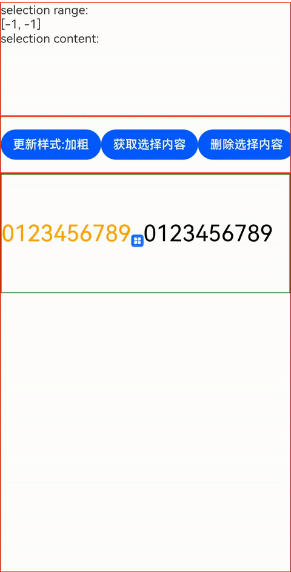
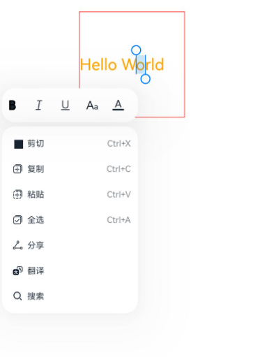

# RichEditor

支持图文混排和文本交互式编辑的组件。

>  **说明：**
>
>  该组件从API Version 10开始支持。后续版本如有新增内容，则采用上角标单独标记该内容的起始版本。
>  RichEditor[仅支持通过onDragStart事件](ts-universal-events-drag-drop.md)实现浮起等拖拽效果。


## 子组件

可以包含[Span](ts-basic-components-span.md)和[ImageSpan](ts-basic-components-imagespan.md)子组件。


## 接口

RichEditor(value: RichEditorOptions)

**参数：**

| 参数名 | 参数类型 | 必填 | 参数描述 |
| -------- | -------- | -------- | -------- |
| value | [RichEditorOptions](#richeditoroptions)  | 是 | 富文本组件初始化选项。 |


## 属性

支持[通用属性](ts-universal-attributes-size.md)。

>  **说明：**
>
> 其中clip属性默认值为true。
> align属性只支持上方丶中间和下方位置的对齐方式。

| 名称                      | 参数类型                                                     | 描述                                                         |
| ------------------------- | ------------------------------------------------------------ | ------------------------------------------------------------ |
| customKeyboard | [CustomBuilder](ts-types.md#custombuilder8) | 设置自定义键盘。<br/>**说明：**<br/>当设置自定义键盘时，输入框激活后不会打开系统输入法，而是加载指定的自定义组件。<br/>自定义键盘的高度可以通过自定义组件根节点的height属性设置，宽度不可设置，使用系统默认值。<br/>自定义键盘采用覆盖原始界面的方式呈现，不会对应用原始界面产生压缩或者上提。<br/>自定义键盘无法获取焦点，但是会拦截手势事件。<br/>默认在输入控件失去焦点时，关闭自定义键盘。 | 
| bindSelectionMenu | {<br/>spantype:&nbsp;[RichEditorSpanType](#richeditorspantype),<br/>content:&nbsp;[CustomBuilder](ts-types.md#custombuilder8),<br/>responseType:&nbsp;[ResponseType](ts-appendix-enums.md#responsetype8),<br/>options?:&nbsp;[SelectionMenuOptions](#selectionmenuoptions)<br/>} | 设置自定义选择菜单。<br/> 默认值：{<br/>  spanType:&nbsp;RichEditorSpanType:TEXT<br/>responseType:&nbsp;ResponseType.LongPress<br/>其他：空<br/>}|
| copyOptions | [CopyOptions](ts-appendix-enums.md#copyoptions9) | 组件支持设置文本内容是否可复制粘贴。<br />默认值：CopyOptions.LocalDevice <br/>**说明：** <br/>设置copyOptions为CopyOptions.InApp或者CopyOptions.LocalDevice，长按组件内容，会弹出文本默认选择菜单，可选中内容并进行复制、全选操作。<br/>设置copyOptions为CopyOptions.None，复制、剪切功能不生效。  |

## 事件

除支持[通用事件](ts-universal-events-click.md)外，还支持以下事件：

| 名称                                                         | 功能描述                                                     |
| ------------------------------------------------------------ | ------------------------------------------------------------ |
| onReady(callback:&nbsp;()&nbsp;=&gt;&nbsp;void) | 富文本组件初始化完成后，触发回调。 |
| onSelect(callback:&nbsp;(value:&nbsp;[RichEditorSelection](#richeditorselection))&nbsp;=&gt;&nbsp;void) | 鼠标左键按下选择，松开左键后触发回调。<br />- 用手指选择时，松开手指触发回调。 <br />- value：选中的所有span信息。 |
| aboutToIMEInput(callback:&nbsp;(value:&nbsp;[RichEditorInsertValue](#richeditorinsertvalue))&nbsp;=&gt;&nbsp;boolean) | 输入法输入内容前，触发回调。<br />- value：输入法将要输入内容信息。|
| onIMEInputComplete(callback:&nbsp;(value:&nbsp;[RichEditorTextSpanResult](#richeditortextspanresult))&nbsp;=&gt;&nbsp;void) | 输入法输完成输入后，触发回调。<br />- value：输入法完成输入后的文本Span信息。 |
| aboutToDelete(callback:&nbsp;(value:&nbsp;[RichEditorDeleteValue](#richeditordeletevalue))&nbsp;=&gt;&nbsp;boolean) | 输入法删除内容前，触发回调。 <br />- value：准备删除的内容所在的文本Span信息。|
| onDeleteComplete(callback:&nbsp;()&nbsp;=&gt;&nbsp;void) | 输入法完成删除后，触发回调。 |
| onPaste<sup>11+</sup>(callback: (event?: [PasteEvent](#pasteevent)) => void) | 完成粘贴前，触发回调。 |

## RichEditorInsertValue

插入文本信息。

| 名称 | 类型 | 必填 | 说明 |
| -------- | -------- | -------- | -------- |
| insertOffset | number  | 是 | 插入的文本偏移位置。 |
| insertValue | string  | 是 | 插入的文本内容。 |


## RichEditorDeleteValue

| 名称 | 类型 | 必填 | 说明 |
| -------- | -------- | -------- | -------- |
| offset | number  | 是 | 删除内容的偏移位置。 |
| direction | [RichEditorDeleteDirection](#richeditordeletedirection)  | 是 | 删除操作的方向。 |
| length | number | 是 | 删除内容长度。 |
| richEditorDeleteSpans | Array<[RichEditorTextSpanResult](#richeditortextspanresult) \| [RichEditorImageSpanResult](#richeditorimagespanresult)> | 是 | 删除的文本或者图片Span的具体信息。 |


## RichEditorDeleteDirection

删除操作的方向。

| 名称    | 描述                          |
| -------- | ------------------------------ |
| BACKWARD      | 向后删除。  |
| FORWARD   | 向前删除。      |


## RichEditorTextSpanResult

文本Span信息。

| 名称 | 类型 | 必填 | 说明 |
| -------- | -------- | -------- | -------- |
| spanPosition | [RichEditorSpanPosition](#richeditorspanposition)  | 是 | Span位置。 |
| value | string | 是 | 文本Span内容。 |
| textStyle | [RichEditorTextStyleResult](#richeditortextstyleresult) | 是 | 文本Span样式信息。 |
| offsetInSpan | [number, number] | 是 | 文本Span内容里有效内容的起始和结束位置。 |


## RichEditorSpanPosition

Span位置信息。

| 名称 | 类型 | 必填 | 说明 |
| -------- | -------- | -------- | -------- |
| spanIndex | number  | 是 | Span索引值。 |
| spanRange | [number, number]  | 是 | Span内容在RichEditor内的起始和结束位置。 |

## RichEditorSpanType

Span类型信息。

| 名称 | 类型 | 必填 | 说明 |
| -------- | -------- | -------- | -------- |
| TEXT | number  | 是 | Span为文字类型。 |
| IMAGE | number  | 是 | Span为图像类型。|
| MIXED | number  | 是 | Span为图文混合类型。|

## RichEditorTextStyleResult

后端返回的文本样式信息。

| 名称 | 类型 | 必填 | 描述                               |
| ------ | -------- | ---- | -------------------------------------- |
| fontColor | [ResourceColor](ts-types.md#resourcecolor) | 是 | 文本颜色。 |
| fontSize |  number   | 是 | 字体大小。 |
| fontStyle | [FontStyle](ts-appendix-enums.md#fontstyle) | 是 | 字体样式。 |
| fontWeight |  number | 是 | 字体粗细。 |
| fontFamily  |  string | 是 | 字体列表。 |
| decoration  | {<br/>type:&nbsp;[TextDecorationType](ts-appendix-enums.md#textdecorationtype),<br/>color?:&nbsp;[ResourceColor](ts-types.md#resourcecolor)<br/>} | 是 | 文本装饰线样式及其颜色。 |

## RichEditorImageSpanResult

后端返回的图片样式信息。

| 名称 | 类型 | 必填 | 描述                               |
| ------ | -------- | ---- | -------------------------------------- |
| size | [number, number] | 是 | 图片的宽度和高度。 |
| verticalAlign  | [ImageSpanAlignment](ts-basic-components-imagespan.md#imagespanalignment) | 是  | 图片垂直对齐方式。 |
| objectFit  | [ImageFit](ts-basic-components-imagespan.md#imagefit) | 是 | 图片缩放类型。 |


## RichEditorOptions

RichEditor初始化参数。

| 名称 | 类型 | 必填 | 说明 |
| -------- | -------- | -------- | -------- |
| controller | [RichEditorController](#richeditorcontroller)  | 是 | 富文本控制器。 |


## RichEditorController

RichEditor组件的控制器。

### 导入对象

```
controller: RichEditorController = new RichEditorController()
```

### getCaretOffset

getCaretOffset(): number

返回当前光标所在位置。

**返回值：**

| 类型                      | 说明               |
| ----------------------- | ---------------- |
| number | 当前光标所在位置。 |

### setCaretOffset

setCaretOffset(offset: number): boolean

设置光标位置。

**参数：**

| 参数名 | 参数类型 | 必填 | 参数描述                               |
| ------ | -------- | ---- | -------------------------------------- |
| offset | number | 是 | 光标偏移位置。超出文本范围时，设置失败。 |

**返回值：**

| 类型                      | 说明               |
| ----------------------- | ---------------- |
| boolean | 光标是否设置成功。 |

### addTextSpan

addTextSpan(value: string, options?: RichEditorTextSpanOptions): number

添加文本内容。

**参数：**

| 参数名 | 参数类型 | 必填 | 参数描述                               |
| ------ | -------- | ---- | -------------------------------------- |
| value  | string   | 是   | 文本内容。 |
| options  | [RichEditorTextSpanOptions](#richeditortextspanoptions)   | 否   | 文本选项。 |

**返回值：**

| 类型                      | 说明               |
| ----------------------- | ---------------- |
| number | 添加完成的Text Span所在的位置。 |

### addImageSpan

addImageSpan(value: PixelMap | ResourceStr, options?: RichEditorImageSpanOptions): number

添加图片内容。

**参数：**

| 参数名 | 参数类型 | 必填 | 参数描述                               |
| ------ | -------- | ---- | -------------------------------------- |
| value  | [PixelMap](../apis/js-apis-image.md#pixelmap7)\|[ResourceStr](ts-types.md#ResourceStr)   | 是   | 图片内容。 |
| options  | [RichEditorImageSpanOptions](#richeditorimagespanoptions)   | 否   | 图片选项。 |

**返回值：**

| 类型                      | 说明               |
| ----------------------- | ---------------- |
| number | 添加完成的imageSpan所在的位置。 |

### getTypingStyle<sup>11+</sup>

getTypingStyle(): RichEditorTextStyle

获得用户预设的样式。

**返回值：**

| 类型                      | 说明               |
| ----------------------- | ---------------- |
| [RichEditorTextStyle](#richeditortextstyle) | 用户预设样式。 |

### setTypingStyle<sup>11+</sup>

setTypingStyle(value: RichEditorTextStyle): void

设置用户预设的样式。

**参数：**

| 参数名 | 参数类型 | 必填 | 参数描述                               |
| ------ | -------- | ---- | -------------------------------------- |
| value  | [RichEditorTextStyle](#richeditortextstyle) | 是 | 预设样式。 |

### updateSpanStyle

updateSpanStyle(value: RichEditorUpdateTextSpanStyleOptions | RichEditorUpdateImageSpanStyleOptions): void

更新文本或者图片样式。<br/>若只更新了一个Span的部分内容，则会根据更新部分、未更新部分将该Span拆分为多个Span。

**参数：**

| 名称 | 类型 | 必填 | 描述                               |
| ------ | -------- | ---- | -------------------------------------- |
| value | [RichEditorUpdateTextSpanStyleOptions](#richeditorupdatetextspanstyleoptions) \| [RichEditorUpdateImageSpanStyleOptions](#richeditorupdatetextspanstyleoptions) | 是 | 文本或者图片的样式选项信息。 |

### updateParagraphStyle<sup>11+</sup>

updateParagraphStyle(value: RichEditorParagraphStyleOptions): void

更新段落的样式。

**参数：**

| 名称 | 类型 | 必填 | 描述                               |
| ------ | -------- | ---- | -------------------------------------- |
| value | [RichEditorParagraphStyleOptions](#richeditorparagraphstyleoptions11) | 是 | 段落的样式选项信息。 |

### getSpans

getSpans(value?: RichEditorRange): Array<RichEditorTextSpanResult| RichEditorImageSpanResult>

获取span信息。

**参数：**

| 参数名 | 参数类型                            | 必填 | 参数描述         |
| ------ | ----------------------------------- | ---- | ---------------- |
| value  | [RichEditorRange](#richeditorrange) | 否   | 需要获取span范围。 |

**返回值：**

| 类型                      | 说明               |
| ----------------------- | ---------------- |
| Array<[RichEditorTextSpanResult](#richeditortextspanresult) \| [RichEditorImageSpanResult](#richeditorimagespanresult)> | 文本和图片Span信息。 |

### deleteSpans

deleteSpans(value?: RichEditorRange): void

删除指定范围内的文本和图片。

**参数：**

| 参数名 | 参数类型 | 必填 | 参数描述                               |
| ------ | -------- | ---- | -------------------------------------- |
| value | [RichEditorRange](#richeditorrange) | 否 | 删除范围。省略时，删除所有文本和图片。|

### getParagraphs<sup>11+</sup>

getParagraphs(value?: RichEditorRange): Array<RichEditorParagraphResult>;

获得指定返回的段落。

**参数：**

| 参数名 | 参数类型 | 必填 | 参数描述                               |
| ------ | -------- | ---- | -------------------------------------- |
| value | [RichEditorRange](#richeditorrange) | 否 | 需要获取段落的范围。|

**返回值：**

| 类型                      | 说明               |
| ----------------------- | ---------------- |
| Array<[RichEditorParagraphResult](#richeditorparagraphresult11) | 选中段落的信息。 |

### closeSelectionMenu

closeSelectionMenu(): void

关闭自定义选择菜单或系统默认选择菜单。

## RichEditorSelection

选中内容信息。

| 名称      | 类型                                                         | 必填 | 说明       |
| --------- | ------------------------------------------------------------ | ---- | ---------- |
| selection | [number, number]                                             | 是   | 选中范围。 |
| spans     | Array<[RichEditorTextSpanResult](#richeditortextspanresult)\| [RichEditorImageSpanResult](#richeditorimagespanresult)> | 是   | span信息。   |


## RichEditorUpdateTextSpanStyleOptions

文本样式选项。

| 名称 | 类型 | 必填 | 描述                               |
| ------ | -------- | ---- | -------------------------------------- |
| start | number   | 否 | 需要更新样式的文本起始位置，省略或者设置负值时表示从0开始。 |
| end | number | 否 | 需要更新样式的文本结束位置，省略或者超出文本范围时表示到结尾。 |
| textStyle | [RichEditorTextStyle](#richeditortextstyle) | 是 | 文本样式。 |


## RichEditorUpdateImageSpanStyleOptions

图片样式选项。

| 名称 | 类型 | 必填 | 描述                               |
| ------ | -------- | ---- | -------------------------------------- |
| start | number   | 否 | 需要更新样式的图片起始位置，省略或者设置负值时表示从0开始。 |
| end | number | 否 | 需要更新样式的图片结束位置，省略或者超出文本范围时表示到结尾。 |
| imageStyle | [RichEditorImageSpanStyle](#richeditorimagespanstyle) | 是 | 图片样式。 |

## RichEditorParagraphStyleOptions<sup>11+</sup>

段落样式选项

| 名称 | 类型 | 必填 | 描述                               |
| ------ | -------- | ---- | -------------------------------------- |
| start | number   | 否 | 需要更新样式的段落起始位置，省略或者设置负值时表示从0开始。 |
| end | number | 否 | 需要更新样式的段落结束位置，省略、负数或者超出文本范围时表示到结尾。 |
| style | [RichEditorParagraphStyle](#richeditorparagraphstyle11) | 是 | 段落样式。 |

## RichEditorParagraphStyle<sup>11+</sup>

段落样式。

| 名称 | 类型 | 必填 | 描述                               |
| ------ | -------- | ---- | -------------------------------------- |
| textAlign | [TextAlign](ts-appendix-enums.md#textalign) | 否 | 设置文本段落在水平方向的对齐方式。 |
| leadingMargin | [Dimension]((ts-types.md#dimension10)) \| [LeadingMarginPlaceholderr](#leadingmarginplaceholder11) | 否 | 设置缩进。 |

## LeadingMarginPlaceholder<sup>11+</sup>

前导边距跨度。

| 名称 | 类型 | 必填 | 描述                               |
| ------ | -------- | ---- | -------------------------------------- |
| pixelMap | [PixelMap](../apis/js-apis-image.md#pixelmap7) | 是 | 图片内容。 |
| size | \[[Dimension]((ts-types.md#dimension10)), [Dimension]((ts-types.md#dimension10))\] | 是 | 图片大小。 |

## RichEditorParagraphResult<sup>11+</sup>

后端返回的段落信息。

| 名称 | 类型 | 必填 | 描述                               |
| ------ | -------- | ---- | -------------------------------------- |
| style | [RichEditorParagraphStyle](#richeditorparagraphstyle11) | 是 | 段落样式。 |
| range | \[number, number\] | 是 | 段落起始位置。 |

## RichEditorTextSpanOptions

添加文本的偏移位置和文本样式信息。

| 名称 | 类型 | 必填 | 描述                               |
| ------ | -------- | ---- | -------------------------------------- |
| offset  | number   | 否   | 添加文本的位置。省略时，添加到所有文本字符串的最后。 |
| style  | [RichEditorTextStyle](#richeditortextstyle)   | 否   | 文本样式信息。省略时，使用系统默认文本信息。|
| paragraphStyle<sup>11+</sup>  | [RichEditorParagraphStyle](#richeditorparagraphstyle11)   | 否   | 段落样式。|
| gesture<sup>11+</sup> | [RichEditorGesture](#richeditorgesture11) | 否   | 行为触发回调。省略时，仅使用系统默认行为。|

## RichEditorTextStyle

文本样式信息。

| 名称 | 类型 | 必填 | 描述                               |
| ------ | -------- | ---- | -------------------------------------- |
| fontColor | [ResourceColor](ts-types.md#resourcecolor) | 否 | 文本颜色。<br/> 默认值：Color.Black。 |
| fontSize | [Length](ts-types.md#length) | 否 | 设置字体大小，Length为number类型时，使用fp单位。字体默认大小16。不支持设置百分比字符串。<br/>从API version 9开始，该接口支持在ArkTS卡片中使用。 |
| fontStyle | [FontStyle](ts-appendix-enums.md#fontstyle) | 否 | 字体样式。<br/>默认值：FontStyle.Normal。 |
| fontWeight | [FontWeight](ts-appendix-enums.md#fontweight) \| number \| string | 否 | 字体粗细。<br/>number类型取值[100,900]，取值间隔为100，默认为400，取值越大，字体越粗。<br/>string类型仅支持number类型取值的字符串形式，例如“400”，以及“bold”、“bolder”、“lighter”、“regular” 、“medium”分别对应FontWeight中相应的枚举值。<br/>默认值：FontWeight.Normal。 |
| fontFamily  | [ResourceStr](ts-types.md#resourcestr) \| number \| string | 否 | 设置字体列表。默认字体'HarmonyOS Sans'，当前支持'HarmonyOS Sans'字体和[注册自定义字体](../apis/js-apis-font.md)。 <br/>默认字体:'HarmonyOS Sans'。|
| decoration  | {<br/>type:&nbsp;[TextDecorationType](ts-appendix-enums.md#textdecorationtype),<br/>color?:&nbsp;[ResourceColor](ts-types.md#resourcecolor)<br/>} | 否 | 设置文本装饰线样式及其颜色。<br />默认值：{<br/>type:&nbsp;TextDecorationType.None,<br/>color：Color.Black<br/>}。 |


## RichEditorImageSpanOptions

添加图片的偏移位置和图片样式信息。

| 名称 | 类型 | 必填 | 描述                               |
| ------ | -------- | ---- | -------------------------------------- |
| offset  | number   | 否   | 添加图片的位置。省略时，添加到所有文本字符串的最后。 |
| imageStyle  | [RichEditorImageSpanStyle](#richeditorimagespanstyle)   | 否   | 图片样式信息。省略时，使用系统默认图片信息。|
| gesture<sup>11+</sup> | [RichEditorGesture](#richeditorgesture11) | 否   | 行为触发回调。省略时，仅使用系统默认行为。|

## RichEditorImageSpanStyle

图片样式。

| 名称 | 类型 | 必填 | 描述                               |
| ------ | -------- | ---- | -------------------------------------- |
| size  | [[Dimension](ts-types.md#dimension10), [Dimension](ts-types.md#dimension10)]  | 否 | 图片宽度和高度。 |
| verticalAlign  | [ImageSpanAlignment](ts-basic-components-imagespan.md#imagespanalignment) | 否   | 图片垂直对齐方式。<br/>默认值:ImageSpanAlignment.BASELINE |
| objectFit  | [ImageFit](ts-appendix-enums.md#imagefit) | 否 | 图片缩放类型。<br/> 默认值:ImageFit.Cover。 |

## RichEditorRange

范围信息。

| 名称 | 类型 | 必填 | 描述                               |
| ------ | -------- | ---- | -------------------------------------- |
| start | number   | 否 | 起始位置，省略或者设置负值时表示从0开始。 |
| end | number | 否 | 结束位置，省略或者超出文本范围时表示到结尾。 |

## SelectionMenuOptions<sup>11+</sup>

范围信息。

| 名称 | 类型 | 必填 | 描述                               |
| ------ | -------- | ---- | -------------------------------------- |
| onAppear | ?(() => void) | 否 | 自定义选择菜单弹出时回调。 |
| onDisappear | ?(() => void) | 否 | 自定义选择菜单关闭时回调。 |

## PasteEvent<sup>11+</sup>

定义用户粘贴事件。

| 名称 | 类型 | 必填 | 描述                               |
| ------ | -------- | ---- | -------------------------------------- |
| preventDefault | ?(() => void) | 否 | 用户自定义粘贴事件。<br/> 存在时会覆盖系统粘贴事件。 |

## RichEditorGesture<sup>11+</sup>

用户行为回调。

### onClick<sup>11+</sup>

onClick(callback: (event?: ClickEvent) => void)

点击完成时回调事件。

**参数:**

| 参数名   | 参数类型   | 必填   | 描述                            |
| ----- | ------ | ---- | ---------------------------------------- |
| event | [ClickEvent](ts-universal-events-click.md#clickevent对象说明) | 否    | 用户点击事件。 |

### onLongPress<sup>11+</sup>

onLongPress(callback: (event?: GestureEvent) => void )

长按完成时回调事件。

**参数:**

| 参数名   | 参数类型   | 必填   | 描述                            |
| ----- | ------ | ---- | ---------------------------------------- |
| event | [GestureEvent](ts-gesture-settings.md#gestureevent对象说明) | 否    | 用户长按事件。 |

## 示例

### 示例1

```ts
// xxx.ets
@Entry
@Component
struct Index {
  controller: RichEditorController = new RichEditorController();
  options: RichEditorOptions = { controller: this.controller };
  private start: number = -1;
  private end: number = -1;
  @State message: string = "[-1, -1]"
  @State content: string = ""

  build() {
    Column() {
      Column() {
        Text("selection range:").width("100%")
        Text() {
          Span(this.message)
        }.width("100%")
        Text("selection content:").width("100%")
        Text() {
          Span(this.content)
        }.width("100%")
      }
      .borderWidth(1)
      .borderColor(Color.Red)
      .width("100%")
      .height("20%")

      Row() {
        Button("更新样式:加粗").onClick(() => {
          this.controller.updateSpanStyle({
            start: this.start,
            end: this.end,
            textStyle:
            {
              fontWeight: FontWeight.Bolder
            }
          })
        })
        Button("获取选择内容").onClick(() => {
          this.content = "";
          this.controller.getSpans({
            start: this.start,
            end: this.end
          }).forEach(item => {
            if(typeof(item as RichEditorImageSpanResult)['imageStyle'] != 'undefined'){
              this.content += (item as RichEditorImageSpanResult).valueResourceStr;
              this.content += "\n"
            } else {
              this.content += (item as RichEditorTextSpanResult).value;
              this.content += "\n"
            }
          })
        })
        Button("删除选择内容").onClick(() => {
          this.controller.deleteSpans({
            start: this.start,
            end: this.end
          })
          this.start = -1;
          this.end = -1;
          this.message = "[" + this.start + ", " + this.end + "]"
        })
      }
      .borderWidth(1)
      .borderColor(Color.Red)
      .width("100%")
      .height("10%")

      Column() {
        RichEditor(this.options)
          .onReady(() => {
            this.controller.addTextSpan("0123456789",
              {
                style:
                {
                  fontColor: Color.Orange,
                  fontSize: 30
                }
              })
            this.controller.addImageSpan($r("app.media.icon"),
              {
                imageStyle:
                {
                  size: ["57px", "57px"]
                }
              })
            this.controller.addTextSpan("0123456789",
              {
                style:
                {
                  fontColor: Color.Black,
                  fontSize: 30
                }
              })
          })
          .onSelect((value: RichEditorSelection) => {
            this.start = value.selection[0];
            this.end = value.selection[1];
            this.message = "[" + this.start + ", " + this.end + "]"
          })
          .aboutToIMEInput((value: RichEditorInsertValue) => {
            console.log("---------------------- aboutToIMEInput ----------------------")
            console.log("insertOffset:" + value.insertOffset)
            console.log("insertValue:" + value.insertValue)
            return true;
          })
          .onIMEInputComplete((value: RichEditorTextSpanResult) => {
            console.log("---------------------- onIMEInputComplete ---------------------")
            console.log("spanIndex:" + value.spanPosition.spanIndex)
            console.log("spanRange:[" + value.spanPosition.spanRange[0] + "," + value.spanPosition.spanRange[1] + "]")
            console.log("offsetInSpan:[" + value.offsetInSpan[0] + "," + value.offsetInSpan[1] + "]")
            console.log("value:" + value.value)
          })
          .aboutToDelete((value: RichEditorDeleteValue) => {
            console.log("---------------------- aboutToDelete --------------------------")
            console.log("offset:" + value.offset)
            console.log("direction:" + value.direction)
            console.log("length:" + value.length)
            value.richEditorDeleteSpans.forEach(item => {
              console.log("---------------------- item --------------------------")
              console.log("spanIndex:" + item.spanPosition.spanIndex)
              console.log("spanRange:[" + item.spanPosition.spanRange[0] + "," + item.spanPosition.spanRange[1] + "]")
              console.log("offsetInSpan:[" + item.offsetInSpan[0] + "," + item.offsetInSpan[1] + "]")
              if (typeof(item as RichEditorImageSpanResult)['imageStyle'] != 'undefined') {
                console.log("image:" + (item as RichEditorImageSpanResult).valueResourceStr)
              } else {
                console.log("text:" + (item as RichEditorTextSpanResult).value)
              }
            })
            return true;
          })
          .onDeleteComplete(() => {
            console.log("---------------------- onDeleteComplete ------------------------")
          })
          .borderWidth(1)
          .borderColor(Color.Green)
          .width("100%")
          .height("30%")
      }
      .borderWidth(1)
      .borderColor(Color.Red)
      .width("100%")
      .height("70%")
    }
  }
}
```


### 示例2

```ts
// xxx.ets
@Entry
@Component
struct RichEditorExample {
  controller: RichEditorController = new RichEditorController()

  // 自定义键盘组件
  @Builder CustomKeyboardBuilder() {
    Column() {
      Grid() {
        ForEach([1, 2, 3, 4, 5, 6, 7, 8, 9, '*', 0, '#'], (item: number | string) => {
          GridItem() {
            Button(item + "")
              .width(110).onClick(() => {
              this.controller.addTextSpan(item + '', {
                offset: this.controller.getCaretOffset(),
                style:
                {
                  fontColor: Color.Orange,
                  fontSize: 30
                }
              })
              this.controller.setCaretOffset(this.controller.getCaretOffset() + item.toString().length)
            })
          }
        })
      }.maxCount(3).columnsGap(10).rowsGap(10).padding(5)
    }.backgroundColor(Color.Gray)
  }

  build() {
    Column() {
      RichEditor({ controller: this.controller })
        // 绑定自定义键盘
        .customKeyboard(this.CustomKeyboardBuilder()).margin(10).border({ width: 1 })
        .height(200)
        .borderWidth(1)
        .borderColor(Color.Red)
        .width("100%")
    }
  }
}
```


### 示例3

```ts
// xxx.ets
import pasteboard from '@ohos.pasteboard'
import { BusinessError } from '@ohos.base';
class info{
  imageSrc: Resource=$r('sys.media.ohos_ic_public_cut')
  id: string=''
  label: string=''
}
@Entry
@Component
struct SelectionMenu {
  @State message: string = 'Hello World'
  @State textSize: number = 40
  @State sliderShow: boolean = false
  @State start: number = -1
  @State end: number = -1
  @State colorTransparent: Color = Color.Transparent
  controller: RichEditorController = new RichEditorController();
  options: RichEditorOptions = { controller: this.controller }
  private iconArr: Array<Resource> =
    [$r('app.media.icon'), $r("app.media.icon"), $r('app.media.icon'),
      $r("app.media.icon"), $r('app.media.icon')]
  private listArr: Array<Object> =
    [{ imageSrc: $r('sys.media.ohos_ic_public_cut'), id: '剪切', label: "Ctrl+X" } as info,
      { imageSrc: $r('sys.media.ohos_ic_public_copy'), id: '复制', label: "Ctrl+C" } as info,
      { imageSrc: $r('sys.media.ohos_ic_public_paste'), id: '粘贴', label: "Ctrl+V" } as info,
      { imageSrc: $r('sys.media.ohos_ic_public_select_all'), id: '全选', label: "Ctrl+A" } as info,
      { imageSrc: $r('sys.media.ohos_ic_public_share'), id: '分享', label: "" } as info,
      { imageSrc: $r('sys.media.ohos_ic_public_translate_c2e'), id: '翻译', label: "" } as info,
      { imageSrc: $r('sys.media.ohos_ic_public_search_filled'), id: '搜索', label: "" } as info]
  @State iconBgColor: ResourceColor[] = new Array(this.iconArr.length).fill(this.colorTransparent)
  @State listBgColor: ResourceColor[] = new Array(this.listArr.length).fill(this.colorTransparent)
  @State iconIsFocus: boolean[] = new Array(this.iconArr.length).fill(false)
  @State listIsFocus: boolean[] = new Array(this.iconArr.length).fill(false)
  @State clickWeightNum: number = 0
  @State clickNum: number[] = [0, 0, 0]

  build() {
    Column() {
      Column() {
        RichEditor(this.options)
          .onReady(() => {
            this.controller.addTextSpan(this.message, { style: { fontColor: Color.Orange, fontSize: 30 } })
          })
          .onSelect((value: RichEditorSelection) => {
            if (value.selection[0] == -1 && value.selection[1] == -1) {
              return
            }
            this.start = value.selection[0]
            this.end = value.selection[1]
          })
          .bindSelectionMenu(RichEditorSpanType.TEXT, this.panel(), ResponseType.LongPress, { onDisappear: () => {
            this.sliderShow = false
          }})
          .borderWidth(1)
          .borderColor(Color.Red)
          .width(200)
          .height(200)
      }.width('100%').backgroundColor(Color.White)
    }.height('100%')
  }

  @Builder
  panel() {
    Column() {
      this.iconPanel()
      if (!this.sliderShow) {
        this.listPanel()
      } else {
        this.sliderPanel()
      }
    }.width(256)
  }

  @Builder iconPanel() {
    Column() {
      Row({ space: 2 }) {
        ForEach(this.iconArr, (item:Resource, index ?: number) => {
          Flex({ justifyContent: FlexAlign.Center, alignItems: ItemAlign.Center }) {
            Image(item).fillColor($r('sys.color.ohos_id_color_primary')).width(24).height(24).focusable(true)
          }
          .border({ width: this.iconIsFocus[index as number] ? 2 : 0, color: $r('sys.color.ohos_id_color_focused_outline') })
          .borderRadius($r('sys.float.ohos_id_corner_radius_default_m'))
          .width(48)
          .height(48)
          .focusable(true)
          .focusOnTouch(true)
          .onClick(() => {
            if (index as number == 0) {
              this.clickNum[0]++
              this.sliderShow = false
              this.controller.updateSpanStyle({ start: this.start, end: this.end, textStyle: {
                fontWeight: this.clickNum[0] % 2 !== 0 ? FontWeight.Bolder : FontWeight.Normal
              } })
            } else if (index as number == 1) {
              this.clickNum[1]++
              this.sliderShow = false
              this.controller.updateSpanStyle({ start: this.start, end: this.end, textStyle: {
                fontStyle: this.clickNum[1] % 2 !== 0 ? FontStyle.Italic : FontStyle.Normal
              } })
            } else if (index as number == 2) {
              this.clickNum[2]++
              this.sliderShow = false
              this.controller.updateSpanStyle({ start: this.start, end: this.end, textStyle: {
                decoration: {
                  type: this.clickNum[2] % 2 !== 0 ? TextDecorationType.Underline : TextDecorationType.None
                } } })
            } else if (index as number == 3) {
              this.sliderShow = !this.sliderShow
            } else if (index as number == 4) {
              this.sliderShow = false
            }
          })
          .onTouch((event?: TouchEvent | undefined) => {
            if(event != undefined){
              if (event.type === TouchType.Down) {
                this.iconBgColor[index as number] = $r('sys.color.ohos_id_color_click_effect')
              }
              if (event.type === TouchType.Up) {
                this.iconBgColor[index as number] = this.colorTransparent
              }
            }
          })
          .onHover((isHover?: boolean, event?: HoverEvent) => {
            this.iconBgColor.forEach((icon:ResourceColor, index1) => {
              this.iconBgColor[index1] = this.colorTransparent
            })
            if(isHover != undefined) {
              this.iconBgColor[index as number] = $r('sys.color.ohos_id_color_hover')
            }else{
              this.listBgColor[index as number] = this.colorTransparent
            }
          })
          .onFocus(() => {
            this.iconIsFocus[index as number] = true
          })
          .onBlur(() => {
            this.iconIsFocus[index as number] = false
          })
          .backgroundColor(this.iconBgColor[index as number])
        })
      }
    }
    .borderRadius($r('sys.float.ohos_id_corner_radius_card'))
    .width(248)
    .height(48)
    .margin({ bottom: 8 })
    .shadow(ShadowStyle.OUTER_DEFAULT_MD)
  }

  @Builder listPanel() {
    Column() {
      List({ space: 0, initialIndex: 0 }) {
        ForEach(this.listArr, (item:info, index:number | undefined) => {
          ListItem() {
            listChild({
              item,
              index,
              listBgColor: $listBgColor,
              colorTransparent: $colorTransparent
            })
              .onClick(() => {
                let sysBoard = pasteboard.getSystemPasteboard()
                let pasteData = pasteboard.createData(pasteboard.MIMETYPE_TEXT_PLAIN, '')
                this.controller.getSpans({ start: this.start, end: this.end })
                  .forEach((item, i) => {
                    if(typeof(item as RichEditorImageSpanResult)['imageStyle'] != 'undefined'){
                      let style = (item as RichEditorImageSpanResult).imageStyle
                      if((item as RichEditorImageSpanResult).valuePixelMap != undefined) {
                        let data = pasteboard.createRecord(pasteboard.MIMETYPE_PIXELMAP, ((item as RichEditorImageSpanResult).valuePixelMap as PixelMap));
                        let prop = pasteData.getProperty()
                        let temp:Record<string, Object> = { 'width': style.size[0], 'height': style.size[1], 'fit': style.objectFit }
                        prop.additions[i] = temp;
                        pasteData.addRecord(data)
                        pasteData.setProperty(prop)
                      }
                    } else {
                      let style = (item as RichEditorTextSpanResult).textStyle
                      let data = pasteboard.createRecord(pasteboard.MIMETYPE_TEXT_PLAIN, (item as RichEditorTextSpanResult).value)
                      let prop = pasteData.getProperty()
                      let temp:Record<string, Object> = { 'color': style.fontColor, 'size': style.fontSize, 'style': style.fontStyle,
                        'weight': style.fontWeight }
                      prop.additions[i] = temp;
                      pasteData.addRecord(data)
                      pasteData.setProperty(prop)
                    }
                  })
                if(index == undefined){ return }
                switch (index) {
                  case 0:
                    this.controller.deleteSpans({ start: this.start, end: this.end })
                  case 1:
                    sysBoard.clearData()
                    sysBoard.setData(pasteData).then(() => {
                      console.info('Succeeded in setting PasteData.');
                    }).catch((err: BusinessError) => {
                      console.error('Failed to set PasteData. Cause: ' + err.message);
                    })
                    break
                  case 2:
                    sysBoard.getData((err, data) => {
                      if (err) {
                        return
                      }
                      let count = data.getRecordCount()
                      for (let m = 0; m < count; m++) {
                        const element = data.getRecord(m);
                        let tex: RichEditorTextStyle = {
                          fontSize: 30,
                          fontColor: Color.Orange,
                          fontWeight: FontWeight.Normal
                        }
                        let im: RichEditorImageSpanStyle = { objectFit: ImageFit.Contain, size: [50, 50] }
                        if(im.size == undefined){ break }
                        if (data.getProperty().additions[m]) {
                          const tmp = data.getProperty().additions[m] as Record<string, Object | undefined>;
                          if (tmp['width'] != undefined) {
                            im.size[0] = tmp['width'] as Dimension;
                          }
                          if (tmp['height'] != undefined){
                            im.size[1] = tmp['height'] as Dimension;
                          }
                          if (tmp['fit'] != undefined){
                            im.objectFit = tmp['fit'] as ImageFit;
                          }
                          if (tmp['color'] != undefined){
                            tex.fontColor = tmp['color'] as ResourceColor;
                          }
                          if (tmp['size'] != undefined){
                            tex.fontSize = tmp['size'] as number;
                          }
                          if (tmp['style'] != undefined){
                            tex.fontStyle = tmp['style'] as FontStyle;
                          }
                          if (tmp['weight'] != undefined){
                            tex.fontWeight = tmp['weight'] as number;
                          }
                        }

                        if (element.mimeType == pasteboard.MIMETYPE_TEXT_PLAIN) {
                          this.controller.addTextSpan(element.plainText,
                            {
                              style: tex,
                              offset: this.controller.getCaretOffset()
                            })
                        }
                        if (element.mimeType == pasteboard.MIMETYPE_PIXELMAP) {
                          this.controller.addImageSpan(element.pixelMap,
                            {
                              imageStyle: im,
                              offset: this.controller.getCaretOffset()
                            })
                        }
                      }
                    })
                    break
                }
              })
          }
          .height(48)
          .borderRadius($r('sys.float.ohos_id_corner_radius_card'))
          .focusable(true)
          .focusOnTouch(true)
          .border({ width: this.listIsFocus[index as number] ? 2 : 0, color: $r('sys.color.ohos_id_color_focused_outline') })
          .onFocus(() => {
            this.listIsFocus[index as number] = true
          })
          .onBlur(() => {
            this.listIsFocus[index as number] = false
          })
        }, (item:number) => item.toString())
      }
    }
    .focusable(true)
    .width(248)
    .backgroundColor(this.colorTransparent)
    .borderRadius($r('sys.float.ohos_id_corner_radius_card'))
    .shadow(ShadowStyle.OUTER_DEFAULT_MD)
  }

  @Builder sliderPanel() {
    Column() {
      Flex({ justifyContent: FlexAlign.SpaceBetween, alignItems: ItemAlign.Center }) {
        Text('A').fontSize(15)
        Slider({ value: this.textSize, step: 10, style: SliderStyle.InSet })
          .width(210)
          .onChange((value: number, mode: SliderChangeMode) => {
            this.textSize = value
            this.controller.updateSpanStyle({ start: this.start, end: this.end, textStyle: { fontSize: this.textSize }
            })
          })
        Text('A').fontSize(20).fontWeight(FontWeight.Medium)
      }.borderRadius($r('sys.float.ohos_id_corner_radius_card'))
    }
    .backgroundColor(this.colorTransparent)
    .borderRadius($r('sys.float.ohos_id_corner_radius_card'))
    .padding(15)
    .width(248)
    .height(48)
  }
}

@Component
struct listChild {
  item:info = new info()
  index: number = 0
  @Link listBgColor: (Resource | Color)[]
  @Link colorTransparent: Resource

  build() {
    Column() {
      Flex({
        direction: FlexDirection.Row, justifyContent: FlexAlign.SpaceBetween, alignItems: ItemAlign.Center
      }) {
        Row() {
          Image(this.item.imageSrc)
            .width(20)
            .height(20)
            .margin({ right: 8 })
            .fillColor($r('sys.color.ohos_id_color_primary'))
            .focusable(true)
          Text('' + this.item.id)
            .textAlign(TextAlign.Center)
            .borderRadius(10)
            .focusable(true)
            .fontColor($r('sys.color.ohos_id_color_primary'))
            .fontSize($r('sys.float.ohos_id_text_size_body1'))
        }

        Row() {
          Text('' + this.item.label)
            .fontColor($r('sys.color.ohos_id_color_text_secondary')).fontSize($r('sys.float.ohos_id_text_size_body1'))
        }
      }
      .onTouch((event?: TouchEvent) => {
        if (event != undefined && event.type === TouchType.Down) {
          this.listBgColor[this.index] = $r('sys.color.ohos_id_color_click_effect')
        }
        if (event != undefined && event.type === TouchType.Up) {
          this.listBgColor[this.index] = this.colorTransparent
        }
      })
      .onHover((isHover?: boolean) => {
        this.listBgColor[this.index] = isHover ? $r('sys.color.ohos_id_color_hover') : this.colorTransparent
      })
      .backgroundColor(this.listBgColor[this.index])
      .padding({ right: 12, left: 12 })
      .height('48')
      .focusable(true)
      .borderRadius($r('sys.float.ohos_id_corner_radius_default_m'))
    }
  }
}
```
> **说明：**
>
> 系统暂未预置加粗、斜体等图标，示例代码使用系统默认图标，开发者使用时需自行替换iconArr中的资源。

